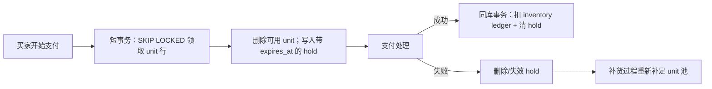

下面这份以 Shopify 原文、Hello Interview 文章和视频文稿为依据整理；标有【补充】的是原文未明确展开、但适合面试理解的内容。

参考：[Shopify 原文](https://shopify.engineering/scaling-inventory-reservations)｜[Hello Interview 解读](https://www.hellointerview.com/learn/system-design/in-the-wild/shopify-inventory-reservations)

# Shopify 库存预占：快速复习笔记

## 先记住一句话

**把“临时预占”和“永久扣减库存”放进同一个 MySQL 事务；再用 `SKIP LOCKED` 把一个热点库存计数器拆成多个可并发领取的行。**

记忆框架：**一个目标、两次演进、三个锁优化、四个工程闭环。**

- 一个目标：既不超卖，也不少卖
- 两次演进：Redis → 单行 MySQL（失败）→ 行池 MySQL（成功）
- 三个锁优化：复合主键、`READ COMMITTED`、统一加锁顺序
- 四个工程闭环：受限池补货、批处理、连接可观测性、Shadow Mode 迁移

## 1. 问题：为什么库存预占如此难？

买家支付时，系统对库存做一个几分钟的 **hold / reservation（预占）**。

- 支付成功：永久扣减库存，商品归买家。
- 支付失败/退出：释放预占，商品重新可售。
- 超时：预占自动失效，商品应重新可售。

必须同时避免两类错误：

| 错误 | 后果 |
|---|---|
| Overselling（超卖） | 两人买到最后一件；之后只能取消、退款、补偿 |
| Underselling（少卖/假缺货） | 实际有货却显示售罄；商家损失成交 |

## 2. 旧方案 Redis：吞吐够，但原子性不够

旧设计：

- Redis：每个商品一个可售数量计数器；预占 `DECR`，释放 `INCR`
- MySQL：库存账本（inventory ledger），永久库存真相

Redis 的单线程命令执行保证了计数器并发安全，但支付成功时需要跨两个系统：

1. MySQL 扣永久库存；
2. Redis 清除临时预占。

两步无法放进一个原子事务：

- 先扣 MySQL，崩溃前未清 Redis → 库存被错误隐藏，造成少卖。
- 先清 Redis，崩溃前未扣 MySQL → 已卖库存又可售，造成超卖。

**核心结论：顺序只能改变故障类型，不能消灭两个数据存储之间的故障窗口。**

> 设计原则：如果两个状态必须“同时成功或同时失败”，它们应位于同一事务边界内。

## 3. 为什么“直接用 MySQL 的一行数量”仍然失败？

直觉方案：

```sql
UPDATE reservations
SET available = available - 1
WHERE inventory_item_id = 42
  AND available >= 1;
```

问题是热门商品的所有请求都更新同一行。InnoDB 对这行加排他锁，其他请求排队等待。

结果：**库存有 10,000 件，但并发能力仍接近 1 条串行队列。**

这说明真正的瓶颈不是“库存数量”，而是“竞争同一个锁对象”。

## 4. 成功方案：一单位一行 + `SKIP LOCKED`

把可预占库存拆成多个 `reservation_units` 行：

- 需要预占 3 件，就拿 3 行；
- 预占成功后，从可用池删除这些行，并创建一条含数量与过期时间的 hold；
- 支付成功时，在同一个 MySQL 事务里扣库存账本并消除 hold。

关键查询：

```sql
SELECT id
FROM reservation_units
WHERE shop_id = ?
  AND inventory_item_id = ?
  AND inventory_group_id = ?
LIMIT 3
FOR UPDATE SKIP LOCKED;
```

`FOR UPDATE`：锁住选中的行。  
`SKIP LOCKED`：若扫描到已被其他事务锁住的行，不等待，直接继续找下一行。

因此，两个买家可以并行领取不同库存行，而不是排队争抢同一计数器。



### 心智模型

这不是“用数据库保存一个计数器”，而是：

> **把一个不可并发的数量竞争，转换为多个可并发领取的令牌（token）竞争。**

它与抢票系统中的“一座一行”完全同构。

## 5. 为什么不能真地给每件库存都建一行？

若一个商品在 10 个仓各有 50,000 件，完整“一件一行”会产生 500,000 行；全平台会有大量永远闲置的行，拖慢扫描、备份、复制与维护。

因此 Shopify 使用 **bounded pool（受限预占池）**：

- 每个商品/地点组合最多保留约 **1,000 个**可预占行；
- 这 1,000 不是库存总量，而是系统愿意承受的瞬时并发预占容量；
- 实际库存仍在 inventory ledger；
- 池被消费后，由 replenishment（补货）流程从账本补回。

可记为：

```text
目标池大小 = min(1000, 未售库存 - 未过期 hold 数量)
```

例如：

- 未售库存 = 800
- 未过期预占 = 200
- 上限 = 1,000

则应保有 `min(1000, 800 - 200) = 600` 个可领取 unit 行。

## 6. 池为空怎么办？

极端抢购时，1,000 行也可能被暂时拿空。

此时 reserve 请求会：

1. 发现可用池空；
2. 触发一次 inline replenishment（在请求路径补货）；
3. 通过锁保证同一商品/地点只有一个请求执行补货；
4. 其他请求等待补货完成，再继续领取。

好处：只要库存账本还有货，系统不会仅因“预占池落后”而错误地告诉用户无货。代价是触发补货的那次请求延迟更高。

## 7. 预占过期如何恢复？

很容易误解为“必须在超时瞬间做一次释放写入”。新设计不必如此。

`reserved_quantities` 的 hold 有 `expires_at`。补货时只统计仍有效的 hold：

```sql
SELECT SUM(quantity)
FROM reserved_quantities
WHERE inventory_item_id = ?
  AND expires_at > NOW();
```

一旦 hold 过期，它自然不再占用可售额度；下一次后台或 inline 补货会把相应 unit 补回池中。

关键点：

- **不会持有 10 分钟的数据库锁。**
- 数据库锁只存在于领取、扣减、补货等毫秒级短事务中。
- 过期 hold 的清理任务仍有价值，但它是 **垃圾回收/表维护**，不是正确性的唯一依赖。

## 8. 三个关键的 InnoDB 锁优化

### 8.1 复合主键：每次预占少拿一把锁

早期若使用自增 `id` 主键，但按 `shop_id + inventory_item_id + inventory_group_id` 查询，InnoDB 需要锁：

1. 二级索引记录；
2. 对应的聚簇索引（主键）记录。

Shopify 改为：

```sql
PRIMARY KEY (
  shop_id,
  inventory_item_id,
  inventory_group_id,
  id
)
```

查询条件进入主键，热路径从约“两把锁/行”降到“一把锁/行”。

### 8.2 `READ COMMITTED`：避免空池的 gap lock

MySQL 默认 `REPEATABLE READ`。当 `SELECT ... FOR UPDATE SKIP LOCKED` 扫描空池时，可能锁住索引末端的 gap / supremum pseudo-record。

但 replenishment 正需要在该范围插入新行，于是可能：

- reserve 阻塞 replenish；
- 或二者死锁。

把这些事务改为 `READ COMMITTED` 后，避免了相同方式的 gap lock，使补货能顺利插入。

### 8.3 统一加锁顺序：消除死锁环

曾经 reserve 路径先写 hold 表、再删 unit 表；其他路径锁顺序不同，可能形成循环等待。

统一为：

```text
reservation_units → reserved_quantities
```

即 reserve 总是先从 unit 池删除行，再插入 hold。  
**多个事务可竞争；但只要按同一顺序拿锁，就不会形成环形等待。**

## 9. 性能真相：瓶颈不一定是 SQL 或 CPU

上线压测时，Shopify 发现：

- P90 reservation latency 可以接受；
- CPU 未满；
- 但 MySQL 线程排队、ProxySQL 后端连接耗尽。

最终瓶颈是：其他 checkout 流程长时间占用连接，使连接池已接近枯竭；reservation 只是最后压垮它的请求。

解决方法：

- 在 SQL 上加入业务标签，如 `/* conn_tag:checkout_completion */`
- 在 ProxySQL 聚合“每个业务流程持有连接多久”
- 清理 checkout 路径后，主库读请求减少约 50%，事务减少约 33%
- 重新评估并提高 InnoDB 线程并发配置


这两个段落讲的是同一件事：**买家不付款时，过期的预占如何把库存还回去**。区别在于，Redis 需要“主动归还”，而 MySQL 新方案可以“按时间重新计算”。

## 1. Redis 旧方案：为什么不能只用 TTL？

旧模型只有一个商品计数器：

```text
available:hoodie = 500
```

买家预占一件：

```text
DECR available:hoodie
```

若支付成功，之后扣 MySQL 账本；若超时，则必须：

```text
INCR available:hoodie
```

### TTL 的问题

TTL 只能删除一个 key，不能在删除时顺便执行 `INCR`。

而且如果给 `available:hoodie` 设置 TTL，过期时删掉的是“整个商品的库存计数器”，不是某一个买家的预占，显然不对。

你可能会想到：每一笔预占一个 key，例如：

```text
hold:reservation-123, TTL = 10 minutes
```

这适合“某张具体座位”的分布式锁：key 是否存在就是全部状态。但 Shopify 的 hoodie 是同质商品，用户不是预占“第 37 件 hoodie”，而是占用 500 件总量中的任意一件。

系统必须知道：

```text
可售数 = 总库存 - 所有未过期 hold 的数量
```

Redis 若用一堆 `hold:*` key，要计算所有有效 hold，就得扫描 keyspace，成本接近 `O(n)`，不能放在每次下单路径上。因此才保留了一个 O(1) 的 `available` 计数器。

但这样又出现矛盾：

> hold 过期时，不仅要删除 hold 记录，还必须可靠地 `INCR available`。

Redis TTL 的删除没有副作用；keyspace notification 虽可发过期事件，但它是 fire-and-forget：worker 掉线、消费后崩溃，都可能永久丢失回收动作。

## 2. Redis 如何可靠回收：Sorted Set + 原子 Lua 脚本

做法是把每笔 hold 放入 Sorted Set，score 是过期时间：

```text
holds:hoodie
  res:41 -> expires_at = 10:00:00
  res:42 -> expires_at = 10:01:00
```

到期 hold 可通过 score 快速找到：

```text
ZRANGEBYSCORE holds:hoodie -inf now
```

然后在**同一个 Lua 脚本**中完成：

1. 找到已过期 hold；
2. `ZREM` 删除 hold；
3. `INCR available:hoodie` 归还库存；
4. 检查还有没有可售库存；
5. 若有，`DECR` 给当前用户；
6. `ZADD` 写入当前用户的新 hold 与其过期时间。

原子性的意义是：其他请求不可能在“hold 已删、库存未加回”或“库存已扣、新 hold 尚未写入”的中间状态插入。

### 为什么每次最多回收 10 个？

Lua 脚本运行期间会阻塞 Redis 的其他命令。

如果一个冷门商品积压了几十万过期 hold，而某个用户触发下单时一次性全回收，那么所有操作该 Redis 实例的请求都会被卡住。因此要限量，例如每次最多回收 10 个：

```text
ZRANGEBYSCORE ... LIMIT 0 10
```

这是一种延迟与吞吐的折中：

- 在线请求少量、快速地回收；
- 后台 worker/cron 持续清理剩余过期 hold；
- 仅靠在线回收不够，因为冷门商品可能再也没有新 reserve 请求。

---

## 3. MySQL 新方案：过期不需要“触发回调”

新设计中，一笔预占是 `reserved_quantities` 表的一行：

```text
inventory_item_id = 42
quantity = 3
expires_at = 10:00:00
```

可预占的 unit 行已经从池中删除；支付成功时，在同库事务中：

```text
扣 inventory ledger + 删除 hold
```

支付没有完成时，hold 行虽然仍在表中，但只要过期，它就**不再被视作 active hold**：

```sql
SELECT SUM(quantity)
FROM reserved_quantities
WHERE inventory_item_id = 42
  AND expires_at > NOW();
```

补货流程根据下式恢复预占池：

```text
应有可预占容量
= min(池上限, 库存账本未售数量 - 未过期 hold 数量)
```

所以 hold 在 10:00 过期后：

- 没有任何定时回调也没关系；
- 它自动不再计入 `expires_at > NOW()`；
- 下一次后台 replenish 或下单路径 inline replenish，会把容量补回 unit pool。

### 本质差异

| | Redis 旧方案 | MySQL 新方案 |
|---|---|---|
| 可售量表示 | 单独维护的计数器 | 由账本和未过期 hold 推导 |
| hold 过期时 | 必须执行 `INCR` 写操作 | 过期后自然不参与计算 |
| 过期机制 | Sorted Set + worker/Lua 回收 | 查询时过滤 `expires_at`，补货时恢复 |
| 清理任务晚了 | 会暂时假缺货 | 正确性不受影响，只是表会膨胀 |

一句话：

> Redis 的可售数量是“物化后的计数”，过期必须主动修改它；MySQL 的可售容量可由“库存账本 − 活跃预占”重新推导，因此过期只需让时间条件失效。

## 容易误解的点

过期的 MySQL hold 不等于持有 10 分钟数据库锁。

- **hold**：普通数据记录，存了 `expires_at`。
- **lock**：只存在于 reserve、claim、replenish 等毫秒级事务内。

仍建议有后台清理任务删除过期 hold，但它的职责是 GC、节省空间、避免其他遗漏 `expires_at` 条件的查询误读；即使它延迟，也不会导致超卖或少卖。


**面试洞察：低 CPU + 高排队，优先怀疑连接、队列、锁或下游资源，而不是盲目优化 SQL。**

## 10. 迁移：Shadow Mode，而不是一键切换

Shopify 没有直接从 Redis 切换到 MySQL：

1. 双写 Redis 和 MySQL；
2. Redis 暂时保持 source of truth；
3. 用真实生产流量比对 MySQL 的业务结果和性能；
4. 确认后切换 MySQL 为真相来源；
5. 保留 kill switch，仍持续双写；
6. 按 pod 渐进灰度，从低流量逐步到高流量商家。

好处：不需要迁移在途预占；回滚时 Redis 仍保有完整预占视图。

## 面试 Q&A：重点难点

**Q1：为什么 Redis 并发正确，仍要迁走？**  
A：Redis 可以正确地原子递减计数器，但它不能和 MySQL 库存账本组成一个原子事务。问题不是 Redis 性能，而是跨存储一致性。

**Q2：`SKIP LOCKED` 会不会导致超卖？**  
A：不会。它只是跳过“暂时被别的事务锁住”的 unit 行。每行只能被一个事务锁定并删除；若拿到的行数少于需求，事务不能假装预占成功。

**Q3：为什么不直接锁 inventory ledger？**  
A：热门 SKU 的所有请求会争抢同一库存行，形成串行瓶颈。unit 池将一个热点锁拆成多行锁。

**Q4：为什么需要 1,000 上限？**  
A：一单位一行提高并发，但无限行数会使表和扫描成本爆炸。上限把容量从“总库存”变为“峰值并发需求”。

**Q5：空池时为什么不直接返回售罄？**  
A：池只是缓存式的并发令牌，不是库存真相。若账本仍有货，应 inline replenish 后重试，否则会造成少卖。

**Q6：预占过期后谁来释放？**  
A：有效性由 `expires_at > NOW()` 定义。下一次补货不再计算过期 hold，自然补回 capacity；清理任务只负责 GC。

**Q7：为什么改 `READ COMMITTED`？**  
A：默认隔离级别在空范围上可能产生 gap lock，恰好阻碍补货插入；`READ COMMITTED` 降低这类阻塞与死锁风险。

**Q8：持有预占 10 分钟会锁表吗？**  
A：不会。长期存在的是带 deadline 的数据行；锁只在创建、领取、扣库存、补货这些短事务内存在。

**Q9：如何降低多商品购物车的数据库往返？**  
A：把多个 line item 的预占查询通过 `UNION ALL` 批处理，减少 round trip。

**Q10：【补充】支付成功回调重试怎么办？**  
A：claim 操作需要幂等：以 order/payment id 作为唯一标识，保证重复回调不会重复扣账本或重复消费 hold。

## 最后 30 秒复述

Shopify 最初用 Redis 计数器做预占，吞吐很好，但 Redis 预占与 MySQL 库存账本不能原子提交，会在故障时超卖或少卖。迁到 MySQL 后，单行数量又造成热点锁。最终它把可预占库存建成受限的 unit 行池，用 `SELECT ... FOR UPDATE SKIP LOCKED` 让并发请求领取不同的行，并将 hold 与库存账本放在同一事务中。通过复合主键、`READ COMMITTED`、统一锁顺序、连接可观测性和 Shadow Mode，系统既保证正确性，也承受了高峰流量。

# 英语技术面试口语稿

I’d design inventory reservation around one invariant: a unit must not be permanently sold unless the inventory ledger and the reservation state transition together.

The business problem has two failure modes. Overselling means two buyers purchase the last unit. Underselling means the system reports out of stock even though inventory is still available. During checkout, I create a short-lived reservation while payment is being processed. On success, I claim the inventory permanently. On failure or timeout, the reservation becomes available again.

Shopify originally used Redis for temporary reservations and MySQL for the permanent inventory ledger. Redis counters handled concurrent decrements very well, but the successful-payment flow required writes to two separate systems. A crash between those writes could create either an oversell or an undersell. The important lesson is that changing the write order only changes the failure mode; it does not remove the inconsistency window.

So I would move reservations into the same MySQL database as the inventory ledger. However, I would not use one quantity row per SKU, because a hot SKU would serialize every checkout on the same row lock.

Instead, I would maintain a pool of rows, where each row represents one reservable unit. A reservation transaction selects the required rows using `SELECT FOR UPDATE SKIP LOCKED`, removes those rows from the available pool, and creates a hold record with an expiration time. `SKIP LOCKED` allows concurrent buyers to claim different rows instead of waiting behind the same locked row.

I would keep this pool bounded, for example at one thousand rows per item and fulfillment location. The ledger remains the source of truth, while the pool represents only short-term concurrent reservation capacity. A replenishment process refills the pool based on available ledger inventory minus non-expired holds. If the pool is temporarily empty during a flash sale, the reserve path triggers replenishment inline, guarded so that only one transaction replenishes that item at a time.

There are also important MySQL details. I would use a composite primary key matching the reservation query, use `READ COMMITTED` to avoid problematic gap locks during replenishment, and enforce one lock acquisition order across all code paths to prevent deadlocks.

Finally, I would migrate using shadow mode: dual-write to the old and new systems, keep the old system as the source of truth initially, compare outcomes under real traffic, and cut over gradually with a kill switch.

The broader lesson is that a relational database can handle high-throughput coordination when the data model distributes contention and the states that must be atomic live in the same transaction boundary.

