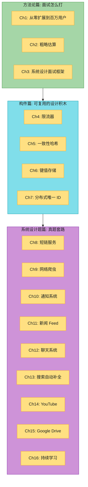
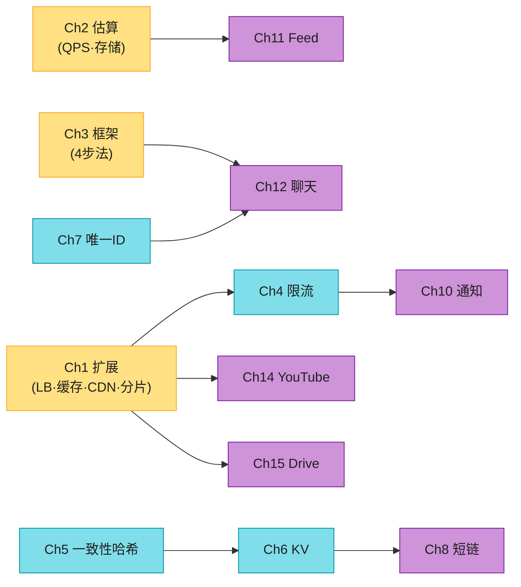
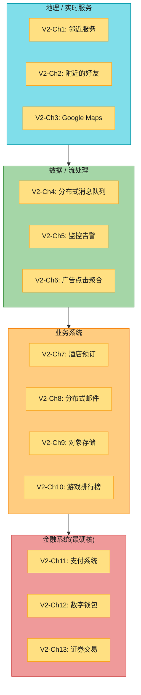

# 系统设计读书笔记 · 面试实战版(多书合集)

> **本仓库收录 3 本系统设计书**的逐章中文笔记:
> - 📕 **Book 1**:Alex Xu — *System Design Interview* Vol.1(2020)→ `SDE-Vol1/`
> - 📗 **Book 2**:Alex Xu — *System Design Interview* Vol.2(2022)→ `SDE-Vol2/`
> - 📘 **Book 3**:Mandeep Singh & Jayanth Kumar — *System Design on AWS*(O'Reilly, 2023)→ 大纲已列入文末,**笔记写法待定**

原 SDE 两卷是系统设计面试的"红宝书",优势是**结构清晰、图解直观、覆盖经典题型**;但出版于 2020/2022,部分技术细节(延迟数字、APNS→FCM、HTTP/3、AV1、限流位置、排序算法)已经明显过时,且**完全没有覆盖 Serverless / K8s / Service Mesh / ML 排序 / AI infra / 向量数据库**。

> **这份笔记和原书的区别**:你看完原书可能"懂了但不会讲";这份笔记每章都按 **「考点 → 话术 → 实际场景 → 已过时 → 追问陷阱」** 重写,目标是让你**不读原书也能 hold 住面试**。

> 阅读环境:Obsidian **深色主题**。所有图表配色针对深色背景优化(每节点显式 `color:#1f1f1f`)。

> **两卷分工**:Vol.1 打基础(方法论 + 经典构件 + 入门设计题);**Vol.2 是进阶**(更复杂的真实系统:邻近服务、消息队列、支付、对象存储、秒杀类、证券交易)。建议先吃透 Vol.1 再读 Vol.2。

---

## 全书架构总览

### Volume 1:方法论 + 经典构件 + 入门设计题

全书 16 章,分三大块:**方法论(Ch1-3)→ 经典构件(Ch4-7)→ 综合系统设计题(Ch8-16)**。这正是系统设计面试的实战路径。



**为什么这样分?** 面试里你设计的任何系统,本质上都是把 Ch1-7 的积木(负载均衡、缓存、CDN、复制、分片、限流、唯一 ID、一致性哈希、KV 存储)重新组合:



### Volume 2:进阶真实系统(✅ 已完成)

Vol.2 是 13 章更复杂、更贴近真实生产的系统设计题,补 Vol.1 的缺口(地理服务、流处理、支付金融、对象存储、秒杀类):



> 💡 **Vol.1 → Vol.2 的知识衔接**:邻近服务(Ch1/2)用 Vol.1 的 **geohash + 一致性哈希**;消息队列(Ch4)是 Vol.1 Ch1 MQ 的深化;支付/证券(Ch11/13)要 Vol.1 的**强一致 + 分布式事务**;对象存储(Ch9)接 Vol.1 Ch15 Drive 的分块。**Vol.1 是地基,Vol.2 是上层建筑**。

---

## 章节索引

### Volume 1

#### 方法论篇:面试怎么打

| 章节 | 笔记链接 | 核心问题 | 书页 |
|------|---------|---------|------|
| Ch1 | [从零扩展到百万用户](SDE-Vol1/ch1_01-从零扩展到百万用户.md) | 单机→垂直→水平;LB / 主从 / 缓存 / CDN / 多机房 / MQ / 分片 | p5-33 |
| Ch2 | [粗略估算](SDE-Vol1/ch1_02-粗略估算.md) | 2 的幂、延迟数字、可用性 9、QPS / 存储 / 带宽估算 | p34-41 |
| Ch3 | [系统设计面试框架](SDE-Vol1/ch1_03-系统设计面试框架.md) | 4 步法、时间分配、DO / DON'T、面试官在评估什么 | p42-50 |

#### 构件篇:可复用的设计积木

| 章节 | 笔记链接 | 核心问题 | 书页 |
|------|---------|---------|------|
| Ch4 | [设计限流器](SDE-Vol1/ch1_04-设计限流器.md) | 令牌桶 / 漏桶 / 滑动窗口;单机 vs 分布式;Redis+Lua | p51-70 |
| Ch5 | [设计一致性哈希](SDE-Vol1/ch1_05-设计一致性哈希.md) | 哈希取模的问题、虚拟节点、手算 | p71-86 |
| Ch6 | [设计键值存储](SDE-Vol1/ch1_06-设计键值存储.md) | Dynamo 风格、向量时钟、sloppy quorum、读修复 | p87-109 |
| Ch7 | [设计分布式唯一 ID](SDE-Vol1/ch1_07-设计分布式唯一ID.md) | 多主 / UUID / 雪花 / 号段;时钟回拨 | p110-118 |

#### 系统设计题篇:真题套路

| 章节 | 笔记链接 | 核心问题 | 书页 |
|------|---------|---------|------|
| Ch8 | [设计短链服务](SDE-Vol1/ch1_08-设计短链服务.md) | hash vs base62、302 vs 301、KV 存储、Analytics | p119-131 |
| Ch9 | [设计网络爬虫](SDE-Vol1/ch1_09-设计网络爬虫.md) | BFS、URL 去重、DNS、优先级、反爬 | p132-150 |
| Ch10 | [设计通知系统](SDE-Vol1/ch1_10-设计通知系统.md) | SMS / Email / Push、APNS→FCM、MQ、限流 | p151-165 |
| Ch11 | [设计新闻 Feed](SDE-Vol1/ch1_11-设计新闻Feed.md) | 拉模型 / 推模型 / 推拉结合;消息队列;分页 | p166-177 |
| Ch12 | [设计聊天系统](SDE-Vol1/ch1_12-设计聊天系统.md) | 轮询 / 长轮询 / WebSocket;消息状态;群聊;多端 | p178-199 |
| Ch13 | [设计搜索自动补全](SDE-Vol1/ch1_13-设计搜索自动补全.md) | Trie、top-k、收集 / 查询分离、多机房 | p200-219 |
| Ch14 | [设计 YouTube](SDE-Vol1/ch1_14-设计YouTube.md) | 转码、自适应码率 DASH/HLS、CDN、直播 | p220-243 |
| Ch15 | [设计 Google Drive](SDE-Vol1/ch1_15-设计GoogleDrive.md) | 块级同步、分块上传 / 断点续传、版本、协作冲突 | p244-263 |
| Ch16 | [持续学习](SDE-Vol1/ch1_16-持续学习.md) | 学习方法、参考书目、面试 checklist | p264-268 |

### Volume 2(✅ 已完成)

| 章节 | 笔记链接 | 核心问题 | 书页 |
|------|---------|---------|------|
| Ch1 | [设计邻近服务](SDE-Vol2/ch2_01-设计邻近服务.md) | Yelp 类;geohash / 四叉树 / S2;LBS 地理索引;附近商家;Redis GEO / H3 | p2-57 |
| Ch2 | [设计附近的好友](SDE-Vol2/ch2_02-设计附近的好友.md) | 实时位置;WebSocket;Redis pub/sub 扇出;一致性哈希;省电/隐私 | p58-90 |
| Ch3 | [设计 Google Maps](SDE-Vol2/ch2_03-设计GoogleMaps.md) | 瓦片渲染+CDN、向量瓦片、routing tile、A*/CH/CRP、GNN ETA | p91-134 |
| Ch4 | [设计分布式消息队列](SDE-Vol2/ch2_04-设计分布式消息队列.md) | Kafka;topic/partition/broker、WAL 顺序写、消费者组、ISR、exactly-once、KRaft | p135-164 |
| Ch5 | [设计监控告警系统](SDE-Vol2/ch2_05-设计监控告警系统.md) | 时序DB、pull/push、Kafka削峰、降采样、基数爆炸、OpenTelemetry | p165-216 |
| Ch6 | [设计广告点击聚合](SDE-Vol2/ch2_06-设计广告点击聚合.md) | Flink 流式聚合、event time/watermark、窗口、exactly-once、对账、OLAP | p217-257 |
| Ch7 | [设计酒店预订系统](SDE-Vol2/ch2_07-设计酒店预订系统.md) | 订房型、并发双重预订(幂等+乐观锁)、room_type_inventory、Saga、秒杀/Redis预扣 | p258-296 |
| Ch8 | [设计分布式邮件服务](SDE-Vol2/ch2_08-设计分布式邮件服务.md) | SMTP/IMAP/JMAP、收发异步队列、反规范化、送达率(SPF/DKIM/DMARC)、Elasticsearch | p297-323 |
| Ch9 | [设计对象存储](SDE-Vol2/ch2_09-设计对象存储.md) | 存储101、元数据/数据分离、小对象合并(WAL)、3副本 vs 纠删码、checksum、Haystack/分级存储 | p324-372 |
| Ch10 | [设计游戏排行榜](SDE-Vol2/ch2_10-设计游戏排行榜.md) | 关系库❌→Redis ZSET(跳表)、ZINCRBY/ZREVRANGE、固定分区、percentile、lookup table O(1) | p373-406 |
| Ch11 | [设计支付系统](SDE-Vol2/ch2_11-设计支付系统.md) | 支付流程、复式记账、幂等键、TCC/Saga、对账、托管支付页、Webhook 验签、TigerBeetle | p407-441 |
| Ch12 | [设计数字钱包](SDE-Vol2/ch2_12-设计数字钱包.md) | 账户/流水、复式记账严格化、双花防护、强一致(不读副本)、热点账户、TigerBeetle | p442-489 |
| Ch13 | [设计证券交易](SDE-Vol2/ch2_13-设计证券交易.md) | 订单簿、撮合引擎、价格-时间优先、sequencer/event sourcing、LMAX Disruptor、FPGA、低延迟 | p490-539 |

---

## 📘 Book 3: System Design on AWS(O'Reilly,大纲规划中)

> **System Design on AWS** — Mandeep Singh & Jayanth Kumar(O'Reilly, 2023),1123 页,21 章,三大篇。和 Alex Xu 的 SDE 是**互补关系**:SDE 讲"**设计思路**",这本书讲"**云原生基础设施 + AWS 落地**"。

**一句话定位**:SDE 让你"**会想设计**",这本书让你"**会在 AWS 上把设计落地**"。前 8 章是云原生系统设计基础(很多 SDE 没细讲:容器/K8s、CQRS/Saga/熔断、CDC、EDA),中间 5 章是 AWS 服务全图,后 8 章是经典设计题的 **AWS 实现(Day 0 → 扩展 → Day N 架构)**。

```mermaid
graph TB
    subgraph P1["Part I · 系统设计基础 (Ch1-8)"]
        A1["Ch1 权衡与原则"]
        A2["Ch2 存储/关系库"]
        A3["Ch3 NoSQL 全谱"]
        A4["Ch4 缓存策略"]
        A5["Ch5 负载均衡"]
        A6["Ch6 网络与协议"]
        A7["Ch7 容器/K8s/部署 ⭐"]
        A8["Ch8 架构模式 ⭐⭐"]
    end
    subgraph P2["Part II · AWS 服务深挖 (Ch9-13)"]
        B1["Ch9 网络 VPC/Route53/ELB"]
        B2["Ch10 存储 S3/DynamoDB/RDS"]
        B3["Ch11 计算 EC2/Lambda/ECS/EKS"]
        B4["Ch12 消息 Kinesis/SQS/StepFn"]
        B5["Ch13 大数据/ML EMR/Redshift"]
    end
    subgraph P3["Part III · 设计实战 (Ch14-21, 全部与SDE重叠 ⚡)"]
        C1["Ch14 短链 ⚡"]
        C2["Ch15 爬虫+搜索 ⚡"]
        C3["Ch16 社交+Feed ⚡"]
        C4["Ch17 排行榜 ⚡"]
        C5["Ch18 酒店预订 ⚡"]
        C6["Ch19 聊天 ⚡"]
        C7["Ch20 视频流水线 ⚡"]
        C8["Ch21 证券交易 ⚡"]
    end
    P1 --> P2
    P2 --> P3

    style P1 fill:#A5D6A7,stroke:#388E3C,color:#1f1f1f
    style P2 fill:#A5D6A7,stroke:#388E3C,color:#1f1f1f
    style P3 fill:#FFCC80,stroke:#F57C00,color:#1f1f1f
    style A1 fill:#FFE082,stroke:#F9A825,color:#1f1f1f
    style A2 fill:#FFE082,stroke:#F9A825,color:#1f1f1f
    style A3 fill:#FFE082,stroke:#F9A825,color:#1f1f1f
    style A4 fill:#FFE082,stroke:#F9A825,color:#1f1f1f
    style A5 fill:#FFE082,stroke:#F9A825,color:#1f1f1f
    style A6 fill:#FFE082,stroke:#F9A825,color:#1f1f1f
    style A7 fill:#CE93D8,stroke:#7B1FA2,color:#1f1f1f
    style A8 fill:#CE93D8,stroke:#7B1FA2,color:#1f1f1f
    style B1 fill:#CE93D8,stroke:#7B1FA2,color:#1f1f1f
    style B2 fill:#CE93D8,stroke:#7B1FA2,color:#1f1f1f
    style B3 fill:#CE93D8,stroke:#7B1FA2,color:#1f1f1f
    style B4 fill:#CE93D8,stroke:#7B1FA2,color:#1f1f1f
    style B5 fill:#CE93D8,stroke:#7B1FA2,color:#1f1f1f
    style C1 fill:#EF9A9A,stroke:#C62828,color:#1f1f1f
    style C2 fill:#EF9A9A,stroke:#C62828,color:#1f1f1f
    style C3 fill:#EF9A9A,stroke:#C62828,color:#1f1f1f
    style C4 fill:#EF9A9A,stroke:#C62828,color:#1f1f1f
    style C5 fill:#EF9A9A,stroke:#C62828,color:#1f1f1f
    style C6 fill:#EF9A9A,stroke:#C62828,color:#1f1f1f
    style C7 fill:#EF9A9A,stroke:#C62828,color:#1f1f1f
    style C8 fill:#EF9A9A,stroke:#C62828,color:#1f1f1f
```



> ⚡ = 主题与已有 SDE 笔记重叠(Part III 全部 8 章)。⭐ = SDE 几乎没讲、**净增量价值最高**。

### Part I · System Design Basics(p22-403,8 章)— 云原生基础

| 章 | 主题 | 关键内容 | 与 SDE 笔记关系 | 书页 |
|----|------|---------|-----------------|------|
| Ch1 | 权衡与原则 | 通信/一致/可用/可靠/可扩展/容错;权衡(时间-空间、延迟-吞吐、一致-可用) | 与 Vol.1 Ch1 部分重叠,更系统 | p22-50 |
| Ch2 | 存储 + 关系库 | file/block/object;RDBMS 架构/优化/扩展/OSS | Vol.2 Ch9 对象存储 + Vol.1 Ch6 | p51-110 |
| Ch3 | NoSQL 全谱 | KV/Dynamo、Document/Mongo、Columnar/Cassandra、Graph/Neo4j | Vol.1 Ch6 KV 深化 | p112-163 |
| Ch4 | 缓存策略 | 淘汰算法/失效/读写策略/部署/CDN/Memcached/Redis | Vol.1 Ch1 缓存 | p168-213 |
| Ch5 | 负载均衡 | 网络/算法/会话保持/类型/Nginx | Vol.1 Ch1 LB | p214-244 |
| Ch6 | 网络与协议 | OSI/TCP-IP;轮询/WS/SSE;RPC/REST/GraphQL/WebRTC | Vol.1 Ch12 聊天协议 | p246-298 |
| **Ch7** ⭐ | **容器/K8s/部署** | Docker / 容器编排 / 部署策略 / CI-CD(Gitflow) | **SDE 完全没讲 · 新增** | p300-339 |
| **Ch8** ⭐⭐ | **架构模式** | CDC / Pub-Sub / 编排 vs 协同 / Lambda-Kappa-DataLake / EDA / **CQRS/Saga/熔断/DDD** / HDFS-Kafka | **大部分 SDE 没讲 · 新增** | p341-403 |

### Part II · AWS Services(p405-654,5 章)— AWS 服务全图

| 章 | 主题 | 关键服务 | 书页 |
|----|------|---------|------|
| Ch9 | 网络 | VPC/Subnet/SG/NACL/Route 53/ELB/API Gateway/CloudFront | p409-468 |
| Ch10 | 存储 + 数据库 | EBS/EFS/S3;RDS/DynamoDB/DocumentDB/Neptune/ElastiCache/OpenSearch/Timestream/Keyspaces | p470-513 |
| Ch11 | 计算 | EC2/AMI/Autoscaling/Lambda/ECS/EKS | p516-548 |
| Ch12 | 消息/编排/监控/IAM | MSK/Kinesis/SQS/SNS/Step Functions/MWAA/CloudWatch/IAM/Cognito/AppSync | p551-614 |
| Ch13 | 大数据/ML | EMR/Glue/Athena/QuickSight/Redshift/SageMaker | p616-654 |

### Part III · System Design Use Cases(p656-1020,8 章)— 设计实战(全部与 SDE 重叠)

| 章 | 主题 | 已有笔记 | AWS 视角增量 |
|----|------|---------|-------------|
| Ch14 | 短链 | [SDE-Vol1 Ch8](SDE-Vol1/ch1_08-设计短链服务.md) | Day0→DayN on AWS |
| Ch15 | 爬虫 + 搜索 | [SDE-Vol1 Ch9](SDE-Vol1/ch1_09-设计网络爬虫.md) | 同上 |
| Ch16 | 社交 + Feed | [SDE-Vol1 Ch11](SDE-Vol1/ch1_11-设计新闻Feed.md) | 同上 |
| Ch17 | 游戏排行榜 | [SDE-Vol2 Ch10](SDE-Vol2/ch2_10-设计游戏排行榜.md) | 同上 |
| Ch18 | 酒店预订 | [SDE-Vol2 Ch7](SDE-Vol2/ch2_07-设计酒店预订系统.md) | 同上 |
| Ch19 | 聊天 | [SDE-Vol1 Ch12](SDE-Vol1/ch1_12-设计聊天系统.md) | 同上 |
| Ch20 | 视频处理流水线 | [SDE-Vol1 Ch14 YouTube](SDE-Vol1/ch1_14-设计YouTube.md) | 同上 |
| Ch21 | 证券交易 | [SDE-Vol2 Ch13](SDE-Vol2/ch2_13-设计证券交易.md) | 同上 |

### 📐 写法(已定)

> ✅ **逐章写完 21 章**——和 SDE 同一套八段骨架 + 配色 + mermaid 规范(`-->` 不用 `->`)。目录 `SDA/`,文件名 `aws_NN-*.md`。
> Part III 与 SDE 重叠的章节**忠实写完整章**,突出 AWS 的 **Day 0 → 扩展 → Day N 落地**视角,并交叉引用对应 SDE 笔记(不简单跳过)。每章同样补 **2026 增量**(如 Graviton/Arm、Aurora DSQL、S3 Express、Karpenter、Bedrock 等)。
> 主题与书页见上方 Part I / II / III 三张表;进度见文末「进度追踪 → Book 3」。

---

## 这本书讲得好不好?值不值得读?

> 这一节是**总评**(主要针对 Vol.1),你时间紧只想读这一节也行。

| 维度 | 评价 | 说明 |
|------|------|------|
| 🟢 **方法论** | 讲得**极好** | Ch3 的 4 步法是面试通用框架,直接照搬即可。Ch1 的"渐进式扩展"叙事是把复杂架构拆解成可讲故事的范本。 |
| 🟢 **经典题覆盖** | 讲得**好** | 短链、限流、Feed、聊天、爬虫这 5 个题的解法至今是面试标准答案的骨架。 |
| 🟢 **图解** | 讲得**好** | 每个设计都有大图,适合面试白板复刻。这套笔记我尽量用 mermaid 还原。 |
| 🟡 **估算** | 基本**够用**,但已过时 | Ch2 的延迟数字是 2010/2020 的,**NVMe SSD 在 2026 改变了"磁盘慢"的结论**(详见 Ch2 笔记)。 |
| 🟡 **KV 存储(Ch6)** | 偏**学术** | 向量时钟在生产极少用(Cassandra 早就改 LWW),Dynamo 论文的细节对面试帮助有限。 |
| 🔴 **完全没提的现代技术** | **过时/缺失** | Serverless / K8s / Service Mesh / gRPC / HTTP3 / AV1 / ML 排序 / 向量数据库 / AI infra 一概没提。这套笔记每章补上。 |
| 🔴 **题型偏旧** | **不够** | 没有覆盖**支付/订单/秒杀/库存/排行榜/附近的人/限购**等国内大厂高频题。**Vol.2 补上了**(支付/钱包/证券/酒店/排行榜/邻近服务)。 |

**一句话总结**:这两本书是**面试入门最好的起点**,但**不是终点**。读完能让你拿到"及格分";要拿"strong hire",你得在它的基础上补现代技术 + 自己讲出 trade-off。这正是这份笔记要做的事。

---

## 笔记风格规范(每章统一遵循)

每章笔记都按同一套结构写,熟悉这套标记后阅读效率更高:

| 标记 | 含义 |
|------|------|
| 🎯 **面试怎么答** | 这一章在面试里**被问到时**的标准答题路径(不是知识科普,是话术)。 |
| 🗺️ **章节概览** | 大纲导航图 + 结构表,先看这里建立全局观。 |
| > 📝 **名词注释** | 抽象/专业名词紧跟一个注释块,把术语讲透(令牌桶、向量时钟、Sloppy quorum…)。 |
| #### **深入:...** | 对难点用**手算 + 生活类比 + 决策表**讲具体。这是面试里能让你脱颖而出的细节。 |
| 🏭 **真实产品** | 每章末尾真实系统做法(Kafka / Redis / Cassandra / WeChat / Twitter…)。 |
| ⚠️ **已过时 / 书里没说** | 2020/2022 年版本里过时的内容,或现代面试会追问但书里没提的点(这是本笔记的核心增量)。 |
| 🪤 **追问陷阱** | 面试官最爱追问的"为什么",提前准备答案。 |
| 💻 **代码示例** | Lua / Python / SQL,可直接在面试白板上写。 |
| 章末 **flowchart LR** | 树状总结图,ROOT 在左、分支竖排在右(深色主题可读)。 |

**配色语义**(深色背景友好):🟡 黄=起点/数据源 · 🟦 青=处理/服务 · 🟩 绿=输出/成功 · 🟪 紫=派生/难点 · 🟥 红=代价/风险 · 🟧 橙=强调。

---

## 如何使用这份笔记

- **面试前 1 周刷题**:看每章 🎯 面试怎么答 + ⚠️ 已过时 + 🪤 追问陷阱。这三块决定你能不能 hold 住。
- **第一次学**:从头按章读,先看 🗺️ 概览图建立全局,再读细节。
- **攻克难点**:直接找 `#### 深入:` 小节(手算 + 类比 + 决策表)。
- **查术语**:搜 `📝 名词注释`。
- **选型参考**:看 🏭 真实产品。
- **临场模板**:Ch3 框架 + Ch2 估算数字,背熟。

## 笔记结构(每章骨架)

```
1. 🎯 面试怎么答        ← 被问到时,这样开场、这样推进(话术)
2. 🗺️ 章节概览          ← 导航图 + 结构表
3. 📖 详细内容(按小节)  ← 含 📝名词注释 + ####深入 + 手算/类比/决策表
4. ⚠️ 已过时 / 书里没说  ← 2020/2022→2026 的更新 + 现代追问
5. 🏭 真实产品做法      ← 真实系统
6. 💻 代码示例          ← Lua/Python/SQL
7. 🪤 追问陷阱           ← 面试官最爱追问的"为什么"
8. 📝 本章要点总结       ← flowchart LR + Takeaways + 连接下一章
```

## 进度追踪

### Volume 1(✅ 已完成)

- [x] V1-Ch1: 从零扩展到百万用户
- [x] V1-Ch2: 粗略估算
- [x] V1-Ch3: 系统设计面试框架
- [x] V1-Ch4: 设计限流器
- [x] V1-Ch5: 设计一致性哈希
- [x] V1-Ch6: 设计键值存储
- [x] V1-Ch7: 设计分布式唯一 ID
- [x] V1-Ch8: 设计短链服务
- [x] V1-Ch9: 设计网络爬虫
- [x] V1-Ch10: 设计通知系统
- [x] V1-Ch11: 设计新闻 Feed
- [x] V1-Ch12: 设计聊天系统
- [x] V1-Ch13: 设计搜索自动补全
- [x] V1-Ch14: 设计 YouTube
- [x] V1-Ch15: 设计 Google Drive
- [x] V1-Ch16: 持续学习

### Volume 2(✅ 已完成)

- [x] V2-Ch1: 设计邻近服务
- [x] V2-Ch2: 设计附近的好友
- [x] V2-Ch3: 设计 Google Maps
- [x] V2-Ch4: 设计分布式消息队列
- [x] V2-Ch5: 设计监控告警系统
- [x] V2-Ch6: 设计广告点击聚合
- [x] V2-Ch7: 设计酒店预订系统
- [x] V2-Ch8: 设计分布式邮件服务
- [x] V2-Ch9: 设计对象存储
- [x] V2-Ch10: 设计游戏排行榜
- [x] V2-Ch11: 设计支付系统
- [x] V2-Ch12: 设计数字钱包
- [x] V2-Ch13: 设计证券交易

### Book 3: System Design on AWS(⏳ 进行中,21 章)

**Part I · 系统设计基础**
- [x] A-Ch1: 权衡与原则 → [aws_01](SDA/aws_01-系统设计权衡与原则.md)
- [x] A-Ch2: 存储类型与关系库 → [aws_02](SDA/aws_02-存储类型与关系型数据库.md)
- [x] A-Ch3: 非关系型存储 → [aws_03](SDA/aws_03-非关系型数据库.md)
- [x] A-Ch4: 缓存策略 → [aws_04](SDA/aws_04-缓存策略与机制.md)
- [x] A-Ch5: 负载均衡 → [aws_05](SDA/aws_05-负载均衡.md)
- [x] A-Ch6: 通信网络与协议 → [aws_06](SDA/aws_06-通信网络与协议.md)
- [x] A-Ch7: 容器/K8s/部署 → [aws_07](SDA/aws_07-容器化编排与部署.md)
- [x] A-Ch8: 架构模式 → [aws_08](SDA/aws_08-架构设计与模式.md)

**Part II · AWS 服务深挖**
- [x] A-Ch9: AWS 网络 → [aws_09](SDA/aws_09-AWS网络服务.md)
- [x] A-Ch10: AWS 存储 → [aws_10](SDA/aws_10-AWS存储服务.md)
- [x] A-Ch11: AWS 计算 → [aws_11](SDA/aws_11-AWS计算服务.md)
- [x] A-Ch12: AWS 消息/编排/监控/IAM → [aws_12](SDA/aws_12-AWS消息编排监控IAM.md)
- [x] A-Ch13: AWS 大数据/ML → [aws_13](SDA/aws_13-AWS大数据与机器学习.md)

**Part III · 设计实战(与 SDE 重叠,AWS 视角)**
- [ ] A-Ch14: 短链
- [ ] A-Ch15: 爬虫 + 搜索
- [ ] A-Ch16: 社交 + Feed
- [ ] A-Ch17: 游戏排行榜
- [ ] A-Ch18: 酒店预订
- [ ] A-Ch19: 聊天
- [ ] A-Ch20: 视频处理流水线
- [ ] A-Ch21: 证券交易

---

## 关于

源书:
- 📕📗 *System Design Interview — An Insider's Guide (Volume 1 + Volume 2)*(Alex Xu & Sahn Lam, ByteByteGo 2020 / 2022)→ 笔记在 `SDE-Vol1/`、`SDE-Vol2/`
- 📘 *System Design on AWS*(Mandeep Singh & Jayanth Kumar, O'Reilly 2023)→ 笔记写法待定

本笔记为个人学习用途的重写整理,内容基于原书但做了:风格统一、面试话术化、结合 2026 年现状的"过时点评"、补全书里缺失的现代技术。请支持原书。

> **目录结构 / 文件命名**:
> - `SDE-Vol1/ch1_NN-*.md` = Alex Xu Vol.1 第 NN 章(16 章)
> - `SDE-Vol2/ch2_NN-*.md` = Alex Xu Vol.2 第 NN 章(13 章)
> - `System Design on AWS.pdf` / `System Design Interview.pdf` / `System Design Interview Volume 2.pdf` = 三本源书 PDF(放仓库根目录)
> - AWS 书笔记的目录与命名前缀待定(见上方"规划")。
