# Book 3 · Chapter 1: 系统设计权衡与原则 (System Design Trade-offs and Guidelines)

> 📑 **导航**:[← 证券](../SDE-Vol2/ch2_13-设计证券交易.md) · [📚 总目录](../README.md) · [存储&关系库 →](aws_02-存储类型与关系型数据库.md)
> 🔗 **相关**:[扩展入门](../SDE-Vol1/ch1_01-从零扩展到百万用户.md) · [面试框架](../SDE-Vol1/ch1_03-系统设计面试框架.md) · [架构模式](aws_08-架构设计与模式.md)


> **本章定位**:这是 **《System Design on AWS》全书开篇**——它不是教你设计"某个系统",而是教你**设计任何系统前必须先想清楚的权衡与原则**。它把后续所有章节(存储/缓存/负载均衡/网络/编排/AWS 服务)的共同"语言"先讲透:**通信、一致性、可用性、可靠性、可扩展性、可维护性、容错**七大概念 + **分布式计算八大谬误** + **四组核心权衡** + **五条设计准则**。一句话:**设计 = 在矛盾的需求间找平衡点**(跷跷板)。

> **本章和原书的区别**:原书(2023 O'Reilly)把**七大概念、八谬误、CAP/PACELC、五准则**讲得相当系统——一致性谱系(强/单调读/单调写/因果/最终)、可用性 nines 表、串/并联可用性数学、active-active/active-passive、单主/多主、MTBF/MTTR、RPO/RTO 都覆盖,是面试"概念题"的标准答案。但**几个地方停在 2022**:① **CAP 讲完就停**——而 **PACELC 是 CAP 的真正补全**(原书只提了一句决策流);② **可用性还是"堆 9"思维**——而 **2026 是 Google SRE 错误预算(error budget)**,把 9 变成"可消费的预算";③ **延迟数字是泛泛而谈**——而 **2026 NVMe SSD / 5G / Graviton(Arm)改写了"磁盘慢、网络慢"假设**,需要和 2010 Jeff Dean 经典数字对比;④ **可观测性只提 metrics**——而 **2026 是四支柱(metrics/logs/traces/profiles)+ OpenTelemetry 统一**;⑤ **完全没提 Chaos Engineering / 平台工程 / 内部开发者平台(Golden Path)**。本章把 2026 硬核料全补上。

---

## 🎯 面试怎么答(被问到"系统设计"时怎么开场)

**开场话术**(直接背):

> "系统设计面试没有唯一正确答案,核心是**在矛盾的需求间找权衡**。我会先确认需求和约束(规模/读写比/一致性要求/可用性 SLA),然后从**七大概念(通信/一致性/可用性/可靠性/可扩展/可维护/容错)**切入搭高层架构,过程中不断点出**权衡(CAP→PACELC、延迟vs吞吐、性能vs可扩展、时间vs空间)**,最后用**五准则(模块化隔离/简单KISS/指标说话/没免费午餐/具体场景具体分析)**收尾验证。"

**4 步推进**(对应 SDE-Vol1 Ch3 框架,但本章强调"权衡先于方案"):

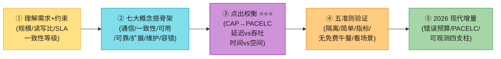

> 💡 **关键信号词**:**"设计是在矛盾需求间找平衡(跷跷板)"** + **"CAP 在分区时选 C 或 A,但平时还有 PACELC 的 L vs C"** + **"分布式计算八大谬误:网络可靠/延迟为0/带宽无限/拓扑不变/单管理员/传输免费/网络同构/网络安全"**——这三句直接拿下面试。

---

## 🗺️ 章节概览

| 小节 | 要点 | 重要性 |
|------|------|--------|
| **七大概念** | 通信/一致性/可用/可靠/扩展/维护/容错 | ⭐⭐⭐⭐⭐ |
| 通信 | 同步(阻塞) vs 异步(回调) | ⭐⭐⭐ |
| 一致性(谱系) | 强/单调读/单调写/因果/最终 | ⭐⭐⭐⭐⭐ |
| 可用性(nines) | 9 的等级表 + 串/并联数学 + failover/复制 | ⭐⭐⭐⭐ |
| 可靠性 | MTBF / MTTR + 与可用性关系 | ⭐⭐⭐ |
| 可扩展性 | 垂直 vs 水平 | ⭐⭐⭐⭐ |
| 可维护性 | 可操作性/清晰性/可修改性 | ⭐⭐⭐ |
| 容错 | 复制 + 检查点 + RPO/RTO | ⭐⭐⭐⭐ |
| **八谬误** | 网络可靠/延迟0/带宽∞/拓扑不变/单管理员/传输免费/同构/安全 | ⭐⭐⭐⭐⭐ |
| **四组权衡 ⭐** | 时间vs空间 / 延迟vs吞吐 / 性能vs扩展 / 一致vs可用(CAP/PACELC) | ⭐⭐⭐⭐⭐ |
| **五准则** | 隔离(模块化)/简单(KISS)/性能(指标)/权衡(无免费午餐)/场景(永远看情况) | ⭐⭐⭐⭐ |
| **2026增量(补)** | PACELC深化/错误预算/延迟数字2026/可观测四支柱/Chaos/平台工程 | ⭐⭐⭐⭐⭐ |

---

## 1. 为什么需要系统设计?(开篇动机)

现代技术革命靠的是**大规模软件系统**——Google、Amazon、Oracle、SAP 都是靠它跑自己和客户的业务。构建和运营这样的系统,需要在写代码之前用**第一性原理(first-principles thinking)**设计技术架构,否则系统会"跑不动"或"扩展不了"。

> 📝 **系统设计的第一性思考**:看业务需求 → 理解客户目标 → **评估各种权衡** → 想错误处理和边界情况 → 想未来变化和鲁棒性 → 最后才担心算法和数据结构。企业能避免"白干"靠的是:**先花时间理解瓶颈、系统需求、目标用户、访问模式**——这就是系统设计。

本章目标:**理解基本概念、自然涌现的权衡、要避免的谬误、以及从大规模系统中沉淀出的准则**。


---

## 2. 系统设计概念(System Design Concepts)

> 💡 用**抽象(abstraction)**理解系统设计——隐藏内部细节,建立心智模型。任何软件系统的概念都围绕这**七件事**:**通信(communication)、一致性(consistency)、可用性(availability)、可靠性(reliability)、可扩展性(scalability)、可维护性(maintainability)、容错(fault tolerance)**。

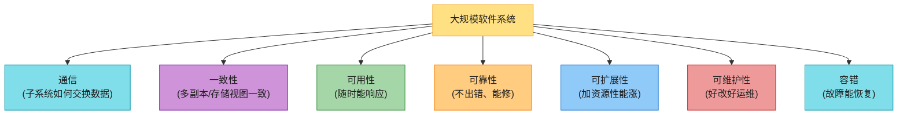

### 2.1 通信(Communication)

大规模系统由多个**服务器(subsystem)**组成,它们通过网络交换信息、组合业务逻辑。通信分**同步**和**异步**两类。

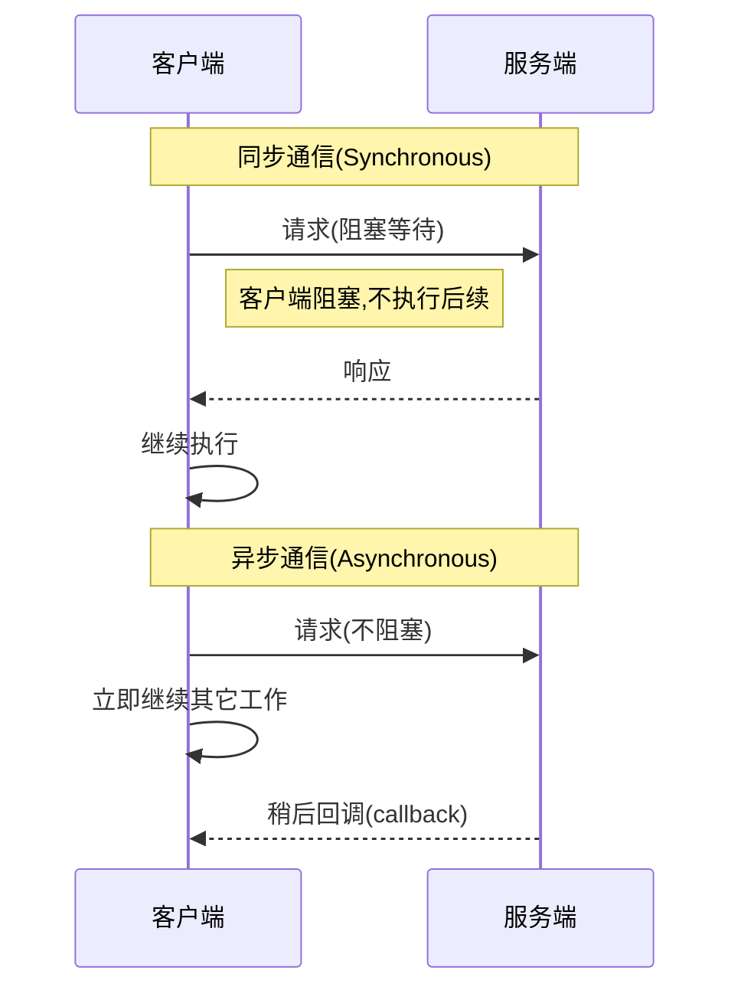

| 维度 | 同步通信 | 异步通信 |
|------|---------|---------|
| **阻塞** | 发送方阻塞等待响应 | 不阻塞,继续执行 |
| **类比** | 打电话(实时对话) | 发邮件(等稍后回复) |
| **响应性** | 即时,适合实时 | 灵活,容忍延迟/失败 |
| **典型场景** | 前端 UI ↔ 后端 | 查询长任务状态 |
| **代价** | 用户感知到延迟/性能卡顿 | 需要回调机制 + 超时重试 |

> 💡 **选型口诀**:**实时响应用同步,灵活/鲁棒用异步**。异步要配"超时后主动跟进"的实践。

> 📝 **本书第 6 章会详细讲通信协议和异步机制**(消息队列等)。

### 2.2 一致性(Consistency)⭐⭐⭐⭐⭐

一致性 = 遵循一套规则或标准。在系统设计里它有两个语境:

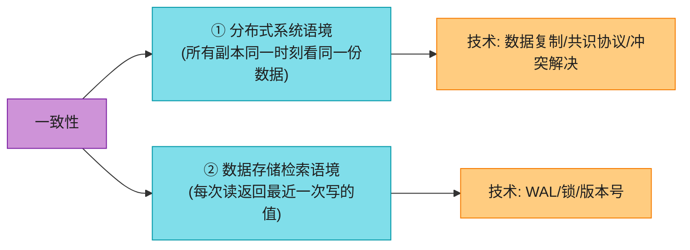

#### 2.2.1 分布式系统中的一致性技术

分布式系统 = 物理上分散、网络连接、用共享计算资源达成共同目标的系统。保证多副本"同一视图"很难,因为副本可能在不同地理位置、面临不同故障/延迟。

| 技术 | 做法 | 代价 |
|------|------|------|
| **数据复制(Data Replication)** | 多副本同时更新,通过**阻塞式同步通信**保证一致 | 写延迟高(等所有副本) |
| **共识协议(Consensus)** | 投票/选主,所有副本同意后才更新 | 协议复杂(Raft/Paxos) |
| **冲突解决(Conflict Resolution)** | 同时更新同一数据时,用 LWW/合并算法 | 可能丢数据(LWW) |

#### 2.2.2 数据存储检索的一致性技术

> 📝 **银行账户例子**:取钱后数据库应立即反映新余额。如果读返回旧余额 → 错误财务决策甚至损失。

| 技术 | 做法 |
|------|------|
| **预写日志(WAL, Write-Ahead Logging)** | 写先记日志,再应用到数据;崩溃后回放日志恢复一致 |
| **加锁(Locking)** | 同一时刻只允许一个写;读总返回最近写 |
| **数据版本号(Data Versioning)** | 每次写分配版本号,读返回最高版本;并发写不冲突 |

> 📝 **本书第 2、3 章详细讲这些技术**(关系库 ACID、Cassandra 可调一致性)。

#### 2.2.3 一致性谱系模型(Consistency Spectrum)⭐⭐⭐⭐⭐(本章核心之一)

一致性不是"有或无",而是一个**谱系**——从**强一致(strong)**到**最终一致(eventual)**,中间还有多个等级。选哪个看系统需求和约束。

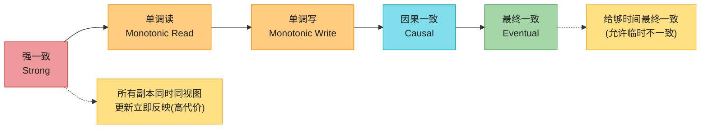

| 等级 | 保证 | 强度 |
|------|------|------|
| **强一致(Strong)** | 所有副本任何时候同视图,更新立即反映所有副本 | 最高(但要副本间持续通信,实际难达成) |
| **单调读(Monotonic Read)** | 客户端读过某值后,后续读不会返回更旧的值(不"穿越回过去") | 强于最终一致 |
| **单调写(Monotonic Write)** | 副本确认写后,后续读不再返回旧值 | 强于最终一致 |
| **因果一致(Causal)** | 有因果关系的操作,所有进程看到相同顺序(A 必在 B 前) | 强于最终一致 |
| **最终一致(Eventual)** | 给够时间,所有副本最终一致 | 最弱(允许临时不一致) |

> 💡 **强一致 vs 最终一致的例子**(背):变量 x 从 0 改成 2,然后读。
> - **强一致**:读阻塞,等复制完成,返回 2。
> - **最终一致**:读立即返回,**复制未完成时返回旧值 0**(stale),稍后才返回 2。

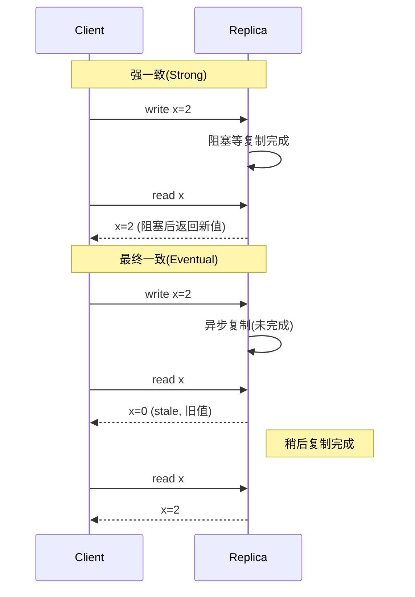

> 🪤 **核心权衡(背)**:**越严格的一致性 → 越多协调/同步/共识 → 越高延迟和运营成本,失败处理更难**(地理分布式尤甚)。放松一致性(最终一致)→ 系统更简单、更可扩展、更可用,代价是允许临时不一致。**数据准确性和系统简单性是跷跷板**。

### 2.3 可用性(Availability)⭐⭐⭐⭐

可用性 = 子系统/服务器可能宕机,无法完全响应客户端请求。**高可用系统**在重负载或故障/错误下,仍能及时处理请求并返回响应。

#### 2.3.1 可用性度量(nines)

```
                (总时间 − 系统宕机总时间)
可用性% = ──────────────────────────────── × 100
                    总时间
```

可用性用**"9 的个数(nines)"**表示。**背**这张表的关键几行:

| 可用性% | 年宕机 | 月宕机 | 周宕机 |
|---------|--------|--------|--------|
| 90%(1 个 9) | 36.5 天 | 72 小时 | 16.8 小时 |
| 99%(2 个 9) | 3.65 天 | 7.2 小时 | 1.68 小时 |
| 99.9%(3 个 9) | 8.76 小时 | 43.8 分 | 10.1 分 |
| **99.99%(4 个 9)** | **52.56 分** | **4.32 分** | **1.01 分** |
| **99.999%(5 个 9)** | **5.26 分** | **25.9 秒** | **6.05 秒** |
| 99.9999%(6 个 9) | 31.5 秒 | 2.59 秒 | 0.605 秒 |
| 99.99999%(7 个 9) | 3.15 秒 | 0.259 秒 | 0.0605 秒 |

> 💡 **关键洞察**:**每多一个 9,所需冗余/容错架构/维护实践呈指数级增长**。金融交易/紧急服务追求最高 9;普通应用 99%~99.9% 更现实。**"堆 9"成本极高**——这是为什么 2026 流行"错误预算"(见后文增量)。

#### 2.3.2 串联 vs 并联可用性 ⭐⭐⭐(面试常考数学)

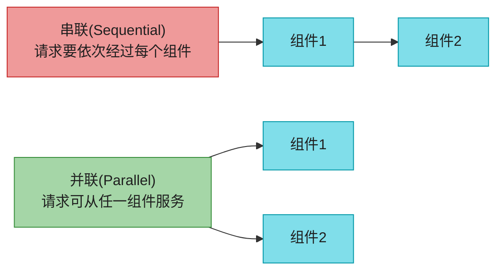

**串联(乘法)**:整体可用性 = 各组件可用性之**积**。
```
两个 99.9% 串联 = 0.999 × 0.999 = 0.998001 ≈ 99.8% (掉到 2 个 9!)
```

**并联(并联不可用之积)**:整体可用性 = 1 − (各组件不可用性之积)。
```
两个 99.9% 并联 = 1 − (0.001 × 0.001) = 1 − 0.000001 = 0.999999 ≈ 99.9999% (升到 6 个 9!)
```

> 🪤 **追问陷阱(高频)**:"为什么串联会降低可用性?" → 因为**请求必须每个组件都成功**,任何一个挂整体就挂,所以是乘法(都成功的概率)。并联则只要有一个活就行,所以是"都挂"的概率之积取反。

#### 2.3.3 保证可用性的手段

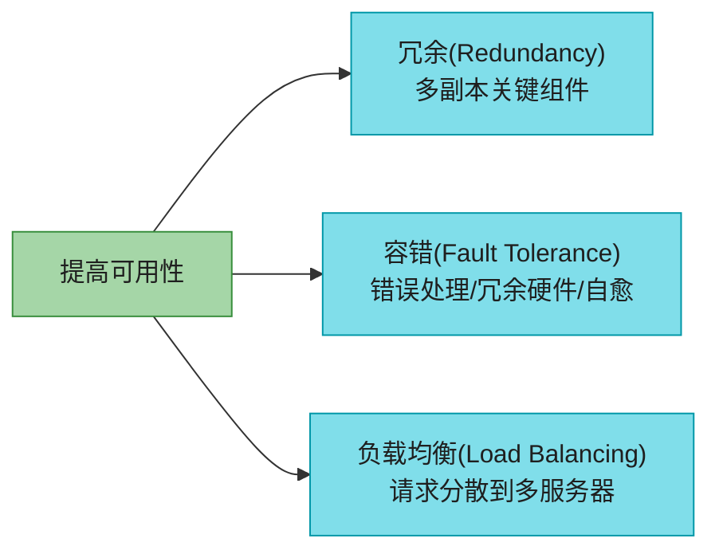

| 手段 | 做法 |
|------|------|
| **冗余(Redundancy)** | 关键组件多副本,一个挂另一个顶(冗余 LB、failover 系统、复制数据存储) |
| **容错(Fault Tolerance)** | 抗失败/错误,故障仍能运行(错误处理、冗余硬件、自愈系统) |
| **负载均衡(Load Balancing)** | 请求分散到多服务器,扛重载(多 LB / 分布式系统) |

#### 2.3.4 可用性模式:Failover 与 Replication ⭐⭐⭐⭐

两大互补模式支撑高可用:**故障转移(failover)** 和 **复制(replication)**。

**Failover 模式**(故障时切到冗余/备份系统):

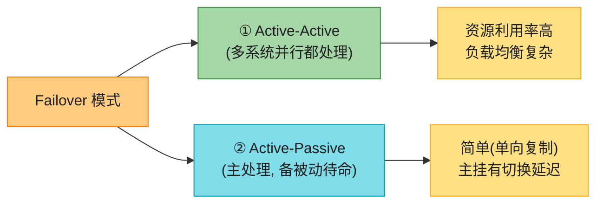

| 模式 | 工作方式 | 优势 | 代价 |
|------|---------|------|------|
| **Active-Active** | 多系统并行,都活跃处理;一个挂,剩余继续 | 资源利用好、灵活性高 | 实现复杂(LB + failover 机制复杂) |
| **Active-Passive** | 主系统处理,一个或多个备份被动待命;主挂,备份顶上 | 简单(单向复制,无冲突) | 主挂时有切换延迟,可用性略降 |

> 🪤 **Failover 通用风险**:① 需要额外硬件;② 增加系统复杂度;③ **主挂前新写数据可能没来得及复制到备 → 数据丢失**。

**Replication 模式**(多副本数据/资源):

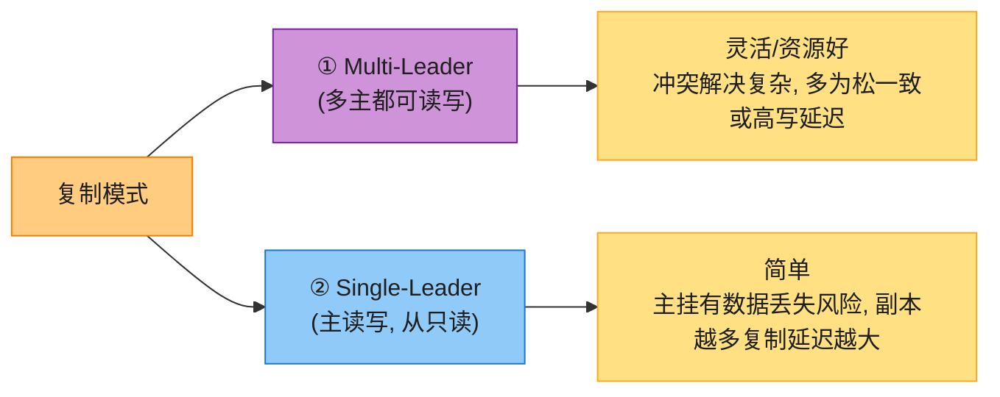

| 模式 | 工作方式 | 代价 |
|------|---------|------|
| **多主(Multi-Leader)** | 多系统并行都可读写;需 LB 或应用逻辑路由写 | 冲突管理复杂,多为松一致或写延迟增加;写节点越多延迟越高 |
| **单主(Single-Leader)** | 主负责读写,从只读复制;主挂需提升从为新主 | 主挂时数据更新受阻 + 丢失风险;读副本越多复制延迟越大 |

> 💡 **复制越多越好吗?不**——读副本越多 → 写复制越多 → 复制延迟越大;副本可能拖慢主(重放写);主可多线程并行写,从常单线程串行重放。

> 📝 本书第 2、3 章讲关系库/非关系库如何用单主/多主保证可用性;第 3 章还会讲**无主(leaderless)复制 + 一致性哈希**(key-value / 列存)。

### 2.4 可靠性(Reliability)

可靠性 = 系统或组件在一段时间内**持续无故障地完成预期功能**的能力。它是**可信度/可依赖性**的度量,通常用概率/百分比表示(99% 可靠 = 只 1% 时间失败)。

#### 2.4.1 可靠性度量:MTBF 与 MTTR

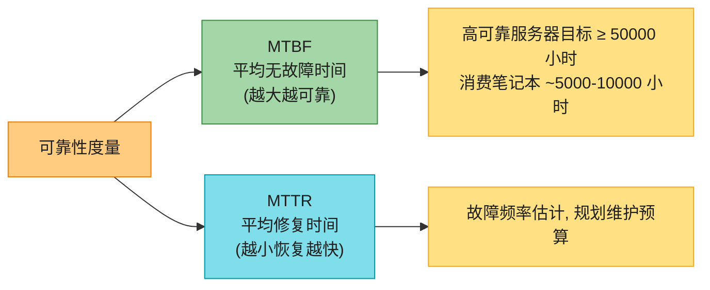

```
MTBF = (总经过时间 − 系统宕机总时间) / 故障总数
MTTR = (总维护时间) / 修复总数
```

> 💡 **MTBF + MTTR 一起看**:**高 MTBF + 低 MTTR = 最可靠**(少出故障 + 出了故障恢复快)。

#### 2.4.2 可靠性 vs 可用性

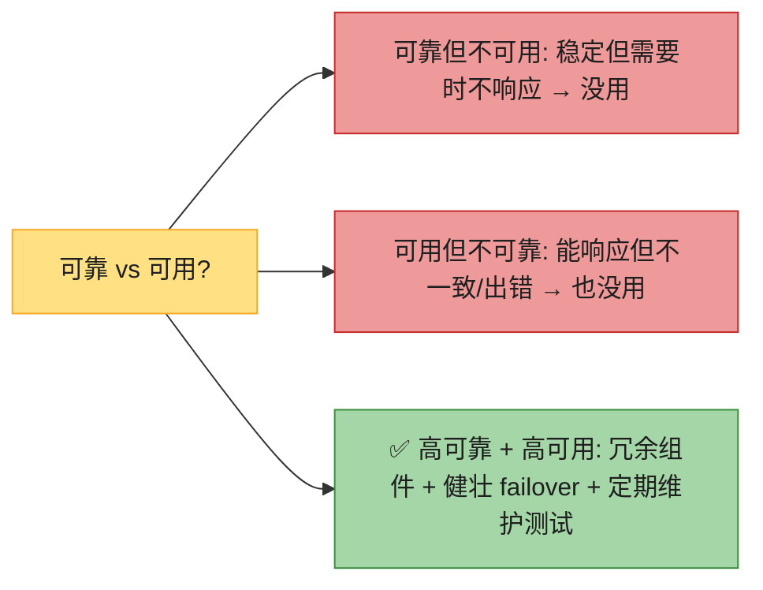

> 🪤 **追问陷阱**:"可靠性和可用性一样吗?" → **不一样,且不互斥**。可靠 = 不出故障;可用 = 需要时能响应。可靠但不可用(需要时响应不了)或可用但不可靠(能响应但老出错)都没用。**两者都高**才达成 SLO。

### 2.5 可扩展性(Scalability)

可扩展性 = 加资源后,系统性能随工作负载(请求量或数据量)增加而提升的能力。社交网络要随用户数和内容 feed 增长而扩展。

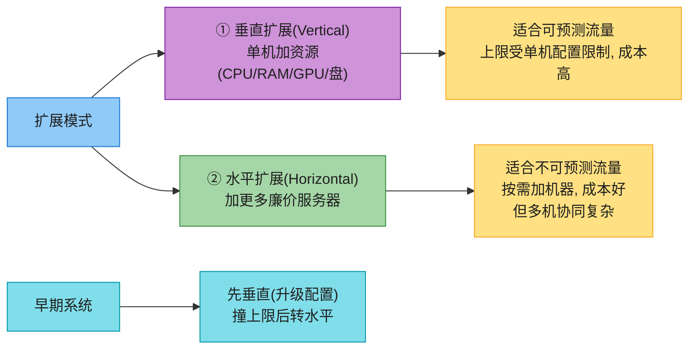

> 💡 **演进路线(背)**:**早期先垂直扩展**(单机升级配置,简单),**撞到单机上限后再转水平扩展**(加机器,但要解决多机协同、一致性、负载分发等复杂问题)。**这就是 SDE-Vol1 Ch1 "从零扩展到百万用户"的主线**——渐进式扩展,每一步都是权衡。

### 2.6 可维护性(Maintainability)

可维护性 = 系统被修改、适配、扩展以满足变化需求的能力,同时保证平稳运营。可维护系统必须灵活、易改、易扩展。它包含**三个底层方面**:

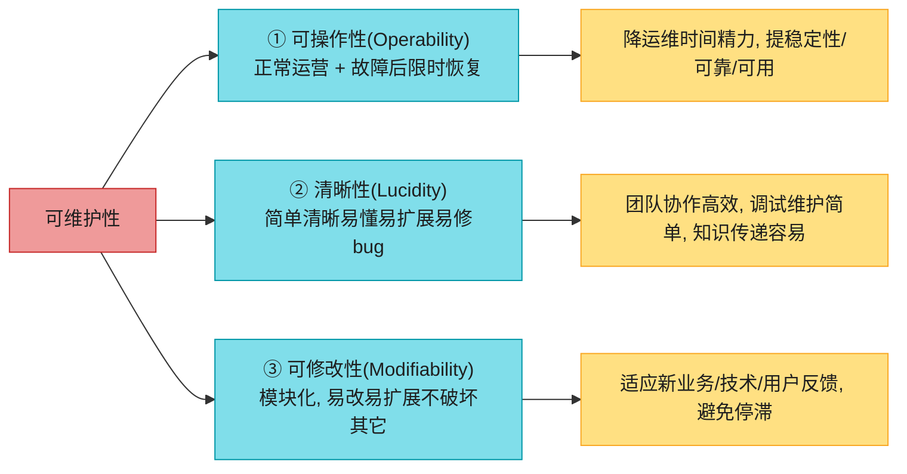

> 💡 **可维护性的收益(背)**:降停机、降维护成本、提生产力、增系统寿命和价值。**这是 2026 "平台工程"浪潮的理论根基**(见增量)。

### 2.7 容错(Fault Tolerance)⭐⭐⭐⭐

容错 = 系统从任何故障(硬件或软件)中恢复并继续服务的能力。**避免单点故障(SPOF)**,把请求路由到健康子系统完成工作负载。容错要在**硬件和软件两层**支持,同时保证**数据安全(不丢数据)**。

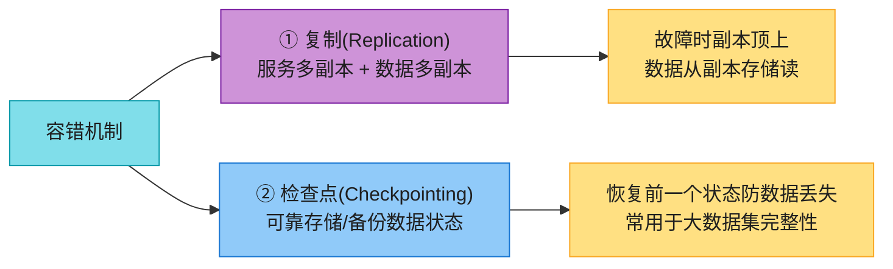

#### 2.7.1 检查点:同步 vs 异步

| 机制 | 做法 | 代价 |
|------|------|------|
| **同步检查点** | 停所有数据变更请求,只允许读,等检查点完成 | 保证一致状态,**但服务暂停** |
| **异步检查点** | 异步在所有节点做检查点,继续服务所有请求(含写) | **可能跨节点状态不一致** |

#### 2.7.2 RPO 与 RTO(背)⭐⭐⭐⭐

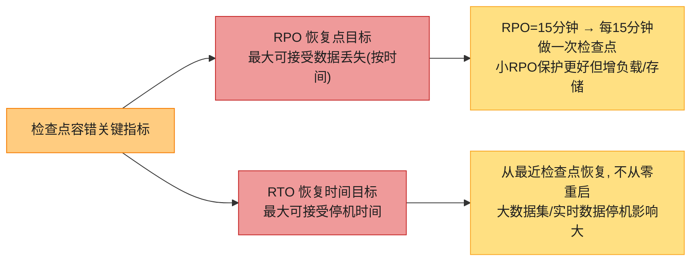

> 🪤 **追问陷阱(高频)**:"RPO 和 RTO 区别?" → **RPO 是"丢多少数据"(时间度量,决定检查点频率);RTO 是"停多长时间"(决定恢复速度)**。RPO=15min 意味着每 15 分钟做检查点,最多丢 15 分钟数据;RTO=1h 意味着故障后 1 小时内必须恢复服务。

> 📝 **数据库的恢复管理器用检查点保证持久性和可靠性**(第 2 章详细讲)。

---

## 3. 分布式计算谬误(Fallacies of Distributed Computing)⭐⭐⭐⭐⭐

大规模系统由多个分布式系统组成,常受**谬误**困扰——这些错误假设会导致错误的设计和实现。由 **L. Peter Deutsch** 提出,共 **8 条**。它们是软件工程师实现分布式系统时常犯的**虚假假设**。

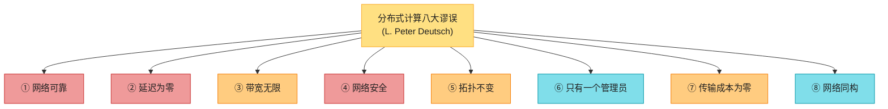

### 3.1 八谬误详解(背)

| # | 谬误(错误假设) | 现实 | 应对 |
|---|----------------|------|------|
| 1 | **网络可靠** | 交换机/电源故障能让整个数据中心网络宕 | 网络容错从设计开始;用能处理网络中断和丢包的协议(重试/超时/幂等) |
| 2 | **延迟为零** | 延迟受光速限制,理论上也快不了 | 边缘计算、选近客户端的地理数据中心、智能路由(见 2026 延迟数字) |
| 3 | **带宽无限** | 高流量时有资源争用 → 排队延迟、瓶颈、丢包、拥塞 | 用轻量数据格式(gRPC/Protobuf)省带宽,避免拥塞 |
| 4 | **网络安全** | 软件bug/OS漏洞/病毒/中间人/未加密都可被攻破 | 安全第一心态,做防御测试和威胁建模(zero-trust) |
| 5 | **拓扑不变** | 节点故障/新增使拓扑持续变 | 抽象底层拓扑,系统对拓扑变化无感知、容错(服务发现) |
| 6 | **只有一个管理员** | 大规模系统多 OS、多团队、多管理员 | 系统解耦,修复和排障也分布式(自治团队) |
| 7 | **传输成本为零** | 网络服务器/交换机/路由器/硬件/OS/团队都要钱 | 预算里明确记传输成本(尤其跨区/跨云流量费) |
| 8 | **网络同构** | 网络由多设备/多协议/多层组成 | 关注异构性和互操作性(标准化协议) |

### 3.2 八谬误与 AWS 六大支柱的对应 ⭐⭐

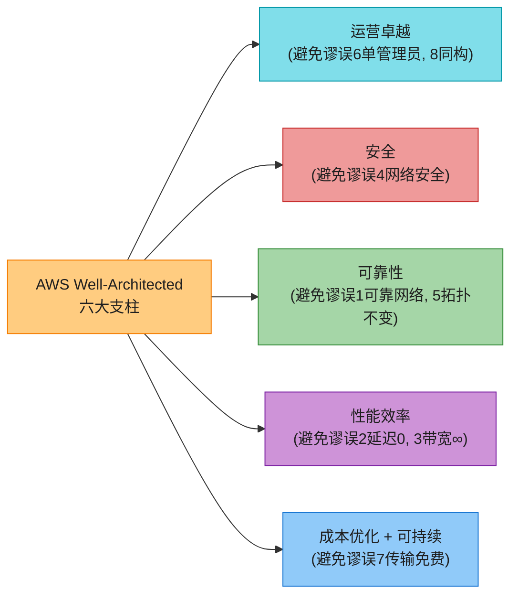

> 💡 **AWS 六支柱直接对应八谬误**(背):
> - **运营卓越** → 避免"单管理员 + 同构网络"
> - **安全** → 避免"网络安全"谬误
> - **可靠性** → 避免"可靠网络 + 拓扑不变"
> - **性能效率** → 避免"延迟 0 + 带宽 ∞"
> - **成本优化 + 可持续** → 避免"传输成本 0"

> 🪤 **追问陷阱**:"忽略八谬误会怎样?" → 系统故障、性能瓶颈、数据不一致、安全漏洞、扩展困难、运维复杂度激增。**这些谬误至今成立,甚至更糟**(见 2026 增量)。

---

## 4. 系统设计权衡(System Design Trade-offs)⭐⭐⭐⭐⭐(本章核心之二)

系统设计要做大量权衡——它们对性能和可用性影响巨大。设计时必须考虑:**成本、可扩展性、可靠性、可维护性、鲁棒性**,在它们之间找平衡,造出针对特定需求优化的系统。

> 📝 **核心心智(跷跷板)**:比如要高可靠 + 可扩展 → 考虑成本 vs 鲁棒性的权衡(贵组件可能更鲁棒可扩展);如优先成本 → 牺牲鲁棒或可扩展。**性能、安全、可维护、可用性都要权衡**。本章讲**四组理论权衡**。

### 4.1 时间 vs 空间(Time vs Space)⭐⭐⭐

时间-空间权衡(时间-内存权衡)在算法里天然存在,分布式系统也一样——考虑算法时间限制,**有时用额外内存/存储换时间**。


> 💡 **例子**:**缓存**(内存换时间)、**预计算表**(存储换时间)、**布隆过滤器**(少量内存换大量磁盘 IO 的避免)、**跳表索引**(额外索引内存换 O(log n) 查找)。**SDE-Vol2 Ch10 排行榜的 lookup table O(1) 精确排名**就是时间空间权衡的典范。

### 4.2 延迟 vs 吞吐(Latency vs Throughput)⭐⭐⭐⭐⭐

先理清四个概念:

```mermaid
flowchart LR
    CONCEPT["四个核心概念"] --> LAT["延迟 Latency<br/>请求等待被处理的时间"]
    CONCEPT --> PROC["处理时间 Processing<br/>系统处理请求的时间"]
    CONCEPT --> RESP["响应时间 Response<br/>请求发出到收到响应"]
    CONCEPT --> THRU["吞吐 Throughput / 带宽 Bandwidth"]

    RESP --> FORM["响应时间 = 延迟 + 处理时间"]
    THRU --> BW["带宽=理论上限<br/>吞吐=实际值(≤带宽)"]

    style CONCEPT fill:#FFE082,stroke:#F9A825,color:#1f1f1f
    style LAT fill:#80DEEA,stroke:#0097A7,color:#1f1f1f
    style PROC fill:#80DEEA,stroke:#0097A7,color:#1f1f1f
    style RESP fill:#CE93D8,stroke:#7B1FA2,color:#1f1f1f
    style THRU fill:#A5D6A7,stroke:#388E3C,color:#1f1f1f
    style FORM fill:#FFCC80,stroke:#F57C00,color:#1f1f1f
    style BW fill:#FFCC80,stroke:#F57C00,color:#1f1f1f
```

**关键公式(背)**:
```
响应时间 = 延迟 + 处理时间
带宽 = 理论最大数据传输量
吞吐 = 实际传输处理量(≤ 带宽,除非网络满效率)
```

**延迟 vs 吞吐是反向关系**:延迟越高 → 包在网络中排队 → 处理变慢 → 吞吐降低。

#### 4.2.1 为什么用百分位数(p50/p90/p99)?

```mermaid
flowchart LR
    WHY["为什么不用平均延迟?"] --> R1["平均值受异常值(outlier)影响大"]
    WHY --> R2["长尾请求(慢请求)被平均掩盖"]
    SOL["用百分位数"] --> P50["p50: 中位数(一半请求快于此)"]
    SOL --> P90["p90: 最快90%中最慢的那个"]
    SOL --> P99["p99: 关注最差的1%(长尾)"]

    style WHY fill:#EF9A9A,stroke:#C62828,color:#1f1f1f
    style R1 fill:#FFCC80,stroke:#F57C00,color:#1f1f1f
    style R2 fill:#FFCC80,stroke:#F57C00,color:#1f1f1f
    style SOL fill:#A5D6A7,stroke:#388E3C,color:#1f1f1f
    style P50 fill:#80DEEA,stroke:#0097A7,color:#1f1f1f
    style P90 fill:#80DEEA,stroke:#0097A7,color:#1f1f1f
    style P99 fill:#80DEEA,stroke:#0097A7,color:#1f1f1f
```

> 🪤 **追问陷阱(高频)**:"为什么不用平均延迟?" → **平均值作为点估计受异常值影响大**,长尾慢请求被平均掩盖。用**百分位数 p50/p90/p99**——p90 = 最快 90% 请求中最慢的那个延迟值(90% 请求响应 ≤ p90)。**p99 关注最差 1% 用户体验**(常是 SLA 关键)。

> 💡 **设计目标(背)**:**在可接受延迟内追求最大吞吐**。负载增加 → 延迟增加 → 吞吐到达瓶颈。设计要在"延迟不爆"的约束下最大化吞吐。

### 4.3 性能 vs 可扩展(Performance vs Scalability)⭐⭐⭐⭐

```mermaid
flowchart LR
    DIFF["性能 vs 可扩展"] --> PERF["性能 Performance<br/>单个请求响应多快"]
    DIFF --> SCAL["可扩展 Scalability<br/>加资源后性能是否按比例提升"]

    SIG["区分信号"] --> S1["性能问题: 单用户也慢<br/>(p50=100ms 一个用户)"]
    SIG --> S2["扩展问题: 少量用户快, 重载慢<br/>(p50=1ms@100请求, p50=100ms@10万请求)"]

    style DIFF fill:#CE93D8,stroke:#7B1FA2,color:#1f1f1f
    style PERF fill:#80DEEA,stroke:#0097A7,color:#1f1f1f
    style SCAL fill:#80DEEA,stroke:#0097A7,color:#1f1f1f
    style SIG fill:#FFCC80,stroke:#F57C00,color:#1f1f1f
    style S1 fill:#FFE082,stroke:#F9A825,color:#1f1f1f
    style S2 fill:#FFE082,stroke:#F9A825,color:#1f1f1f
```

> 🪤 **追问陷阱(高频)**:"性能问题和扩展问题怎么区分?" →
> - **性能问题**:单用户也慢(p50=100ms 哪怕只一个请求)。
> - **扩展问题**:少负载时快(p50=1ms@100 请求),重负载下变慢(p50=100ms@10 万请求)。
>
> **服务可扩展的定义**:加资源后性能**按比例提升**。

### 4.4 一致性 vs 可用性:CAP 与 PACELC ⭐⭐⭐⭐⭐(本章最重要的权衡)

**强一致** = 每次读返回最近写;**高可用** = 系统总给非错误响应。在分布式系统中,网络会失败(分区),于是**强一致和高可用之间天然有权衡**——这就是 **CAP 定理(Brewer 定理)**。

#### 4.4.1 CAP 定理

```mermaid
flowchart TD
    CAP["CAP 定理<br/>(Brewer)"]
    CAP --> C["C 一致性<br/>所有节点同时看同一数据"]
    CAP --> A["A 可用性<br/>每个请求都收到非错误响应"]
    CAP --> P["P 分区容错<br/>网络分区时仍能工作"]

    PICK["三选二"] --> PICK1["P 必选(网络必会分区)"]
    PICK --> PICK2["实际是 P + (C 或 A)"]

    style CAP fill:#EF9A9A,stroke:#C62828,color:#1f1f1f
    style C fill:#80DEEA,stroke:#0097A7,color:#1f1f1f
    style A fill:#A5D6A7,stroke:#388E3C,color:#1f1f1f
    style P fill:#CE93D8,stroke:#7B1FA2,color:#1f1f1f
    style PICK fill:#FFCC80,stroke:#F57C00,color:#1f1f1f
    style PICK1 fill:#FFE082,stroke:#F9A825,color:#1f1f1f
    style PICK2 fill:#FFE082,stroke:#F9A825,color:#1f1f1f
```

> 📝 **CAP 的常见误解(背)**:很多人以为"必须三选一,平时也放弃一个"。**错**!实际是:**P(分区容错)必选**(网络一定会分区),所以真正的选择是 **P + (C 或 A)**,而且**只在网络分区发生时才在 C 和 A 之间二选一**。**平时(无分区)的权衡要看 PACELC**。

#### 4.4.2 PACELC 定理(CAP 的真正补全)⭐⭐⭐⭐⭐

```mermaid
flowchart TD
    START["分布式系统"] --> Q{"网络分区?"}

    Q -->|"是 Partition"| PAC["P + 选 A 或 C<br/>(=CAP)"]
    Q -->|"否 Else(正常运行)"| ELC["E + 选 L 或 C"]

    PAC --> PA["PA: 分区时优先可用<br/>(如 DynamoDB, Cassandra)"]
    PAC --> PC["PC: 分区时优先一致<br/>(如 HBase, Spanner)"]
    ELC --> EL["EL: 平时优先低延迟<br/>(如 DynamoDB, Cassandra)"]
    ELC --> EC["EC: 平时优先一致<br/>(如 Spanner, MegaStore)"]

    style START fill:#FFE082,stroke:#F9A825,color:#1f1f1f
    style Q fill:#FFCC80,stroke:#F57C00,color:#1f1f1f
    style PAC fill:#EF9A9A,stroke:#C62828,color:#1f1f1f
    style ELC fill:#80DEEA,stroke:#0097A7,color:#1f1f1f
    style PA fill:#CE93D8,stroke:#7B1FA2,color:#1f1f1f
    style PC fill:#CE93D8,stroke:#7B1FA2,color:#1f1f1f
    style EL fill:#A5D6A7,stroke:#388E3C,color:#1f1f1f
    style EC fill:#A5D6A7,stroke:#388E3C,color:#1f1f1f
```

> 💡 **PACELC 是 CAP 的细化(背)**:
> - **分区时(P)**:在 **A(可用)** 和 **C(一致)** 之间选(就是 CAP)。
> - **平时(E,无分区)**:在 **L(延迟)** 和 **C(一致)** 之间选。
>
> 这个权衡自然涌现:为了应对分区,大规模系统要**复制数据和服务**;强一致要**同步阻塞复制**(等所有副本 ack)→ 高延迟;异步复制不等 ack → **最终一致**(读最终反映最近写)。

**典型系统的 PACELC 分类(背)**:

| 系统 | 分区时 | 平时 | 说明 |
|------|--------|------|------|
| **DynamoDB** | PA | EL | 牺牲一致换可用 + 低延迟 |
| **Cassandra** | PA | EL | 可调一致性,默认偏向可用 |
| **Spanner** | PC | EC | 用 TrueTime/Paxos 保强一致,代价是延迟 |
| **MongoDB** | PC | EC | 单主 + 复制集,主挂优先一致 |
| **Redis(单机)** | — | EC | 单节点天然一致(无分区问题) |

> 🪤 **追问陷阱(超高频)**:"CAP 和 PACELC 区别?" → **CAP 只讲分区时的 C vs A,但平时(无分区)也有权衡——这就是 PACELC 补的:平时在 L(延迟)和 C(一致)之间选**。CAP 是 PACELC 的子集。一句话:**PACELC = CAP + 平时的 L vs C**。

> 📝 本书第 3 章会用 **BASE 属性**(Basically Available, Soft state, Eventual consistency)讲非关系库如何导航 CAP 权衡。

---

## 5. 系统设计准则(System Design Guidelines)⭐⭐⭐⭐

权衡永远是最有趣也最难的挑战。设计师要清楚**隐藏成本**,装备好"做对"(但不必完美)。这五条准则是上一代从业者从大规模系统实践中沉淀的——它们不是空话,而是帮我们反思"为什么系统这么设计、为什么这是对的"的**美德**。

### 5.1 准则一:隔离——模块化构建(Isolation: Build It Modularly)

> *"Controlling complexity is the essence of computer programming." — Brian Kernighan*

**把复杂系统拆成更小、独立的组件/模块**,各自独立运作又组合成大系统。模块化提升所有需求:

```mermaid
flowchart LR
    MOD["模块化(Isolation)"] --> M1["可维护<br/>单独更新/替换不影响其它"]
    MOD --> M2["可复用<br/>不同系统/项目复用"]
    MOD --> M3["可扩展<br/>独立加/减/扩缩"]
    MOD --> M4["可靠<br/>独立测试验证, 降系统级故障"]

    style MOD fill:#80DEEA,stroke:#0097A7,color:#1f1f1f
    style M1 fill:#A5D6A7,stroke:#388E3C,color:#1f1f1f
    style M2 fill:#A5D6A7,stroke:#388E3C,color:#1f1f1f
    style M3 fill:#A5D6A7,stroke:#388E3C,color:#1f1f1f
    style M4 fill:#A5D6A7,stroke:#388E3C,color:#1f1f1f
```

**实现方式**:**微服务架构、组件化开发、模块化编程**(第 7 章详讲)。**难点**:模块间接口、数据共享与流转、依赖管理要仔细考虑。

### 5.2 准则二:简单——KISS(Simplicity: Keep It Simple, Silly)

> *"Everything should be made as simple as possible, but no simpler." — attributed to Einstein*

避免复杂和 unnecessary 功能,避免过度工程。**KISS 准则的五条原则(背)**:

```mermaid
flowchart LR
    KISS["KISS 五原则"] --> K1["① 找核心需求<br/>确定必须的功能, 优先级排序"]
    KISS --> K2["② 最小化组件数<br/>每个组件有明确目的"]
    KISS --> K3["③ 避免过度工程<br/>不加非必要复杂度"]
    KISS --> K4["④ 易用<br/>直观易懂"]
    KISS --> K5["⑤ 测试+精炼<br/>测后简化"]

    style KISS fill:#A5D6A7,stroke:#388E3C,color:#1f1f1f
    style K1 fill:#80DEEA,stroke:#0097A7,color:#1f1f1f
    style K2 fill:#80DEEA,stroke:#0097A7,color:#1f1f1f
    style K3 fill:#80DEEA,stroke:#0097A7,color:#1f1f1f
    style K4 fill:#80DEEA,stroke:#0097A7,color:#1f1f1f
    style K5 fill:#80DEEA,stroke:#0097A7,color:#1f1f1f
```

### 5.3 准则三:性能——指标不说谎(Performance: Metrics Don't Lie)

> *"Performance problems cannot be solved only through the use of Zen meditation." — Jeffrey C. Mogul*

**先测量再构建,靠指标说话**——性能和扩展性骗不了人。**指标和可观测性**是理解大规模系统行为、在问题变严重前发现它的关键。

```mermaid
flowchart LR
    OBS["指标 + 可观测性"] --> MET["指标 Metrics<br/>资源利用率/响应时间/错误率"]
    OBS --> OBSV["可观测性 Observability<br/>从外部输出推断系统状态"]

    MET --> MET1["检测瓶颈/异常, 采取纠正"]
    OBSV --> OBSV1["实时监控健康, 诊断问题"]

    OBS --> RES["更快解决问题, 防停机, 提性能可靠"]

    style OBS fill:#CE93D8,stroke:#7B1FA2,color:#1f1f1f
    style MET fill:#80DEEA,stroke:#0097A7,color:#1f1f1f
    style OBSV fill:#80DEEA,stroke:#0097A7,color:#1f1f1f
    style MET1 fill:#FFE082,stroke:#F9A825,color:#1f1f1f
    style OBSV1 fill:#FFE082,stroke:#F9A825,color:#1f1f1f
    style RES fill:#A5D6A7,stroke:#388E3C,color:#1f1f1f
```

> 💡 **原书只提了 metrics + observability 泛泛概念**——而 2026 是**四支柱(metrics/logs/traces/profiles)+ OpenTelemetry 统一**(见增量)。

### 5.4 准则四:权衡——没有免费午餐(Trade-offs: TINSTAAFL)

> *"Get it right. Neither abstraction nor simplicity is a substitute for getting it right." — Butler Lampson*

**TINSTAAFL(There Is No Such Thing As A Free Lunch)**:所有决策都有权衡,优化一面常以另一面为代价。比如:高度优化的特定方案 → 可维护性降/复杂度升;简单方案 → 性能降/延迟升。

> 🪤 **核心心智(背)**:**性能、可扩展、可靠、可维护、成本**——必须在它们之间权衡,根据项目特定需求和约束做明智决策。**没有"所有场景都最优"的单一方案**。

### 5.5 准则五:用例——永远看场景(Use Cases: It Always Depends)

> *"Not everything worth doing is worth doing well." — Tom West*

**设计永远取决于场景**——系统设计是复杂多面的过程,受需求、用户、技术约束、成本、扩展、维护、甚至法规影响。考虑这些因素,才能造出满足用户、可行实现、可持续运营的系统。

> 💡 **最强底层真相(背)**:**解决同一问题有多种设计方式,没有"唯一最佳"——没有银弹(no silver bullet)**。所以我们**接受"足够合理"的方案**,希望它"够好"。

---

## 2026 现代增量(原书没讲的硬核)⭐⭐⭐⭐⭐

原书(2023)的七概念/八谬误/CAP/五准则讲得很系统,但**几处停在 2022**。以下是 2026 必补的硬核料——面试讲出来直接拉开档次。

### 增量 1:CAP → PACELC 真正补全(原书只提了一句)⭐⭐⭐⭐⭐

原书把 CAP 讲透后只**一句话**带过 PACELC("the trade-off has to be made based on the PACELC theorem")——但这才是真正该讲透的。**CAP 是 PACELC 的子集**。

```mermaid
flowchart LR
    OLD["原书: CAP 讲透<br/>PACELC 一句带过"] -->|"2026"| NEW["PACELC 是主角 ⭐"]
    NEW --> WHY["为什么 PACELC 重要"]
    WHY --> W1["分区是罕见事件(大部分时间无分区)"]
    WHY --> W2["平时 L vs C 权衡天天发生"]
    WHY --> W3["CAP 漏掉了'正常运行'这个最大场景"]

    style OLD fill:#FFCC80,stroke:#F57C00,color:#1f1f1f
    style NEW fill:#A5D6A7,stroke:#388E3C,color:#1f1f1f
    style WHY fill:#80DEEA,stroke:#0097A7,color:#1f1f1f
    style W1 fill:#CE93D8,stroke:#7B1FA2,color:#1f1f1f
    style W2 fill:#CE93D8,stroke:#7B1FA2,color:#1f1f1f
    style W3 fill:#EF9A9A,stroke:#C62828,color:#1f1f1f
```

> 🔄 **2026 话术(直接背)**:"原书 CAP 讲完后只一句话提 PACELC,但 **PACELC 才是该讲透的主角**。理由是:**网络分区是罕见事件**——大部分时间系统正常运行,这时的权衡是 **L(延迟)vs C(一致)**,这才是天天发生的真实权衡。CAP 只覆盖了罕见分区场景,漏掉了正常运行。所以 **PACELC = CAP + 平时的 L vs C**,是 CAP 的真正补全。"

### 增量 2:Google SRE 错误预算——从"堆 9"到"可消费的预算"⭐⭐⭐⭐⭐

原书可用性还是"追求最高 9(5~6 个 9)"思维,讲"每多一个 9 成本指数增长"。但 **2026 工业界(Google SRE 引领)早已转向"错误预算(error budget)"**——把 9 变成**可消费的预算**,而不是"越接近 100% 越好"。

```mermaid
flowchart LR
    OLD["原书: 堆 9 思维<br/>(追求 99.999%+)"] -->|"2026"| NEW["错误预算思维 ⭐<br/>(9 是预算, 不是上限)"]
    NEW --> TRIPLE["SRE 三件套"]
    TRIPLE --> SLI["SLI 服务水平指标<br/>(如 p99 延迟, 可用性)"]
    TRIPLE --> SLO["SLO 服务水平目标<br/>(如 99.9% 可用, SLI 的目标)"]
    TRIPLE --> SLA["SLA 服务水平协议<br/>(合同承诺, 违约赔款)"]

    BUDGET["错误预算 = 1 − SLO"] --> B1["SLO=99.9% → 预算=0.1%"]
    BUDGET --> B2["月 43.8 分钟可'消费'"]
    BUDGET --> B3["预算内: 鼓励快速发布/创新"]
    BUDGET --> B4["预算耗尽: 冻结发布, 修稳定"]

    style OLD fill:#FFCC80,stroke:#F57C00,color:#1f1f1f
    style NEW fill:#A5D6A7,stroke:#388E3C,color:#1f1f1f
    style TRIPLE fill:#80DEEA,stroke:#0097A7,color:#1f1f1f
    style SLI fill:#CE93D8,stroke:#7B1FA2,color:#1f1f1f
    style SLO fill:#CE93D8,stroke:#7B1FA2,color:#1f1f1f
    style SLA fill:#CE93D8,stroke:#7B1FA2,color:#1f1f1f
    style BUDGET fill:#FFCC80,stroke:#F57C00,color:#1f1f1f
    style B1 fill:#FFE082,stroke:#F9A825,color:#1f1f1f
    style B2 fill:#FFE082,stroke:#F9A825,color:#1f1f1f
    style B3 fill:#A5D6A7,stroke:#388E3C,color:#1f1f1f
    style B4 fill:#EF9A9A,stroke:#C62828,color:#1f1f1f
```

> 🔄 **2026 话术(直接背)**:"原书讲可用性还是'堆 9'思维——追求 99.999%+。但 **2026 工业界早已用 Google SRE 的错误预算**:**SLO=99.9% 意味着每月 43.8 分钟的'错误预算'可以消费**。预算内 → 鼓励团队快速发布、冒险创新;预算耗尽 → 冻结新功能发布,专注修稳定。**这把可用性从'成本黑洞'变成'可管理的资源'**——避免了'为了 5 个 9 投入指数级成本但用户根本感知不到'的浪费。SLI(测什么)→ SLO(目标)→ SLA(合同)三件套是基础。"

**为什么"堆 9"是反模式**:

| 问题 | 说明 |
|------|------|
| **用户感知不到** | 99.9% → 99.99% 多花数倍成本,用户察觉不出 |
| **抑制创新** | 为保 9 不敢快速发布,新产品上不去 |
| **成本黑洞** | 每个 9 成本指数增长,边际收益递减 |
| **错误预算解法** | 把 9 当预算管理,平衡稳定和创新 |

### 增量 3:延迟数字 2026 vs 经典(2010 Jeff Dean)⭐⭐⭐⭐⭐

原书讲"延迟为零是谬误"但**没给具体数字**。而延迟的具体量级**直接决定架构决策**(同步还是异步、缓存还是查库、跨区还是同区)。**Jeff Dean 2010 的经典延迟数字**至今被引用,但 **2026 硬件(NVMe SSD / 5G / Graviton Arm)改写了"磁盘慢、网络慢"的假设**。

```mermaid
flowchart LR
    OLD["2010 Jeff Dean<br/>经典延迟数字"] -->|"2026"| NEW["硬件改写假设 ⭐"]
    NEW --> N1["NVMe SSD: 随机读从 100μs→~100μs<br/>(但 IOPS 从 1万→百万级)"]
    NEW --> N2["100Gbps 网络 + RDMA: 同区 RTT ~0.5ms"]
    NEW --> N3["Graviton(Arm): 性价比 vs x86"]
    NEW --> N4["5G: 移动端 RTT 从 50ms→~10ms"]

    style OLD fill:#FFCC80,stroke:#F57C00,color:#1f1f1f
    style NEW fill:#A5D6A7,stroke:#388E3C,color:#1f1f1f
    style N1 fill:#80DEEA,stroke:#0097A7,color:#1f1f1f
    style N2 fill:#80DEEA,stroke:#0097A7,color:#1f1f1f
    style N3 fill:#80DEEA,stroke:#0097A7,color:#1f1f1f
    style N4 fill:#80DEEA,stroke:#0097A7,color:#1f1f1f
```

**经典 vs 2026 延迟数字对比表(背关键几行)**:

| 操作 | 2010 经典 | 2026 现状 | 变化 |
|------|----------|----------|------|
| L1 缓存引用 | 0.5 ns | ~0.5 ns | 不变(物理极限) |
| 主存引用 | 100 ns | ~100 ns | 基本不变 |
| SSD 随机读(机械盘→NVMe) | 150,000 ns (150μs) | ~100,000 ns (100μs) | 量级相同,但 **IOPS 从 1 万→百万** |
| 同机房往返(RTT) | 500,000 ns (0.5ms) | ~250,000 ns (0.25ms) | 略快(100Gbps+RDMA) |
| 跨区往返(如美东→美西) | ~50 ms | ~50 ms | **几乎不变(光速限制)** |
| 1G 数据中心间传输 | ~10s | ~1s(100Gbps) | 10×(带宽涨) |

> 🔄 **2026 话术(直接背)**:"原书讲'延迟为零是谬误'但没给数字。**延迟的具体量级决定架构**——比如同区 RTT 0.5ms 可以做同步调用,跨区 50ms 就必须异步。**Jeff Dean 2010 的经典数字至今被引用,但 2026 硬件改写了几个假设**:**NVMe SSD 让 IOPS 从 1 万飙到百万级**(随机读延迟量级没变但吞吐暴涨);**100Gbps + RDMA 让同区 RTT 降到 0.25ms**;**但跨区 RTT 还是 50ms——光速改不了**。所以**同区可以同步,跨区必须异步**这个原则 2026 更明显。"

> 💡 **架构启示**:① 同区内同步调用可接受(RTT<1ms);② 跨区必须异步(50ms RTT 会让同步调用堆满线程池);③ NVMe SSD 让"磁盘慢所以全放内存"的假设松动——很多场景可直接放 SSD。

### 增量 4:AIOps + 可观测性四支柱(原书只提 metrics)⭐⭐⭐⭐⭐

原书"准则三:性能"只提了 metrics + observability 泛泛概念。而 **2026 可观测性已是"四支柱"+ OpenTelemetry 统一标准 + AIOps 用 ML 自动发现异常**。

```mermaid
flowchart LR
    OBS["2026 可观测性四支柱"] --> M["① Metrics 指标<br/>(数值时序: CPU/QPS/延迟)"]
    OBS --> L["② Logs 日志<br/>(结构化事件流)"]
    OBS --> T["③ Traces 链路<br/>(请求跨服务调用图)"]
    OBS --> P["④ Profiles 性能剖析<br/>(CPU/内存火焰图)"]

    UNIFY["OpenTelemetry 统一"] --> U1["一个 SDK 采集四支柱"]
    UNIFY --> U2["厂商中立(CNCF 标准)"]
    AIOPS["AIOps"] --> AI1["ML 自动基线 + 异常检测"]
    AIOPS --> AI2["告警去噪(降告警风暴)"]
    AIOPS --> AI3["根因分析(关联 trace/log/metric)"]

    style OBS fill:#CE93D8,stroke:#7B1FA2,color:#1f1f1f
    style M fill:#80DEEA,stroke:#0097A7,color:#1f1f1f
    style L fill:#80DEEA,stroke:#0097A7,color:#1f1f1f
    style T fill:#80DEEA,stroke:#0097A7,color:#1f1f1f
    style P fill:#80DEEA,stroke:#0097A7,color:#1f1f1f
    style UNIFY fill:#A5D6A7,stroke:#388E3C,color:#1f1f1f
    style U1 fill:#FFE082,stroke:#F9A825,color:#1f1f1f
    style U2 fill:#FFE082,stroke:#F9A825,color:#1f1f1f
    style AIOPS fill:#FFCC80,stroke:#F57C00,color:#1f1f1f
    style AI1 fill:#FFE082,stroke:#F9A825,color:#1f1f1f
    style AI2 fill:#FFE082,stroke:#F9A825,color:#1f1f1f
    style AI3 fill:#FFE082,stroke:#F9A825,color:#1f1f1f
```

| 支柱 | 看什么 | 工具 |
|------|--------|------|
| **Metrics** | 数值时序(CPU、QPS、p99 延迟) | Prometheus、CloudWatch、Datadog |
| **Logs** | 结构化事件(JSON 日志、错误堆栈) | ELK、Loki、CloudWatch Logs |
| **Traces** | 请求跨服务调用链(每个 span 耗时) | Jaeger、Tempo、X-Ray |
| **Profiles** | CPU/内存/锁火焰图(找热点) | Pyroscope、Parca、eBPF |

> 🔄 **2026 话术**:"原书只提 metrics,但 2026 可观测性是**四支柱(metrics/logs/traces/profiles)**,且 **OpenTelemetry(CNCF 标准)用一个 SDK 统一采集**,厂商中立可换后端。再加 **AIOps**:ML 做基线 + 异常检测 + 告警去噪 + 根因关联,**把'人盯仪表盘'变成'机器自动发现'**。这是准则三'指标不说谎'的 2026 升级版。"

### 增量 5:分布式谬误至今成立——甚至更糟 ⭐⭐⭐⭐

原书的八谬误是 1990 年代提出的,但**云时代不仅没消除它们,反而放大了**:

```mermaid
flowchart LR
    FALL["八谬误 2026 现状"] --> WORSE["大部分更糟"]
    WORSE --> C1["① 网络可靠: 云网络跨 AZ/Region<br/>光纤被挖断、DNS 故障频发"]
    WORSE --> C2["② 延迟0: 微服务放大<br/>(一次请求跨10+服务)"]
    WORSE --> C3["③ 带宽∞: 跨区流量费贵<br/>(AWS 跨区 $0.02/GB)"]
    WORSE --> C4["⑤ 拓扑不变: 容器/K8s Pod 生灭<br/>拓扑秒级变化"]
    WORSE --> C5["⑥ 单管理员: 多团队+多云<br/>边界模糊"]
    WORSE --> C6["⑦ 传输免费: 跨区/跨云流量<br/>是云账单大头"]

    style FALL fill:#EF9A9A,stroke:#C62828,color:#1f1f1f
    style WORSE fill:#FFCC80,stroke:#F57C00,color:#1f1f1f
    style C1 fill:#80DEEA,stroke:#0097A7,color:#1f1f1f
    style C2 fill:#80DEEA,stroke:#0097A7,color:#1f1f1f
    style C3 fill:#80DEEA,stroke:#0097A7,color:#1f1f1f
    style C4 fill:#80DEEA,stroke:#0097A7,color:#1f1f1f
    style C5 fill:#80DEEA,stroke:#0097A7,color:#1f1f1f
    style C6 fill:#80DEEA,stroke:#0097A7,color:#1f1f1f
```

> 💡 **核心洞察**:**微服务架构让"延迟 0"谬误最致命**——一次用户请求跨 10+ 微服务,每个加 5ms,串行就是 50ms+。所以微服务要**并行化调用(fan-out + CompletableFuture)**或**合并服务**(monolith 回潮)。**跨区流量费**让"传输免费"谬误直接进云账单——所以**多区域部署要算数据传输成本**。

### 增量 6:韧性工程 / Chaos Engineering ⭐⭐⭐⭐

原书容错讲了复制 + 检查点,但**没提主动注入故障验证韧性**——这是 **Netflix Chaos Monkey / AWS Fault Injection Simulator(FIS)** 开创的实践。

```mermaid
flowchart LR
    CE["Chaos Engineering<br/>韧性工程"] --> IDEA["主动注入故障<br/>验证系统韧性"]
    CE --> TOOLS["工具"]
    TOOLS --> T1["Netflix Chaos Monkey<br/>(随机杀生产实例)"]
    TOOLS --> T2["AWS FIS<br/>(Fault Injection Simulator)"]
    TOOLS --> T3["Gremlin / Litmus"]
    CE --> GAME["Game Day<br/>(人工故障演练日)"]

    IDEA --> BEN["在故障找上你之前先找到弱点"]

    style CE fill:#CE93D8,stroke:#7B1FA2,color:#1f1f1f
    style IDEA fill:#80DEEA,stroke:#0097A7,color:#1f1f1f
    style TOOLS fill:#FFCC80,stroke:#F57C00,color:#1f1f1f
    style T1 fill:#FFE082,stroke:#F9A825,color:#1f1f1f
    style T2 fill:#FFE082,stroke:#F9A825,color:#1f1f1f
    style T3 fill:#FFE082,stroke:#F9A825,color:#1f1f1f
    style GAME fill:#A5D6A7,stroke:#388E3C,color:#1f1f1f
    style BEN fill:#A5D6A7,stroke:#388E3C,color:#1f1f1f
```

> 🔄 **2026 话术**:"原书容错是'被动恢复'(复制+检查点)。**2026 主流是'主动注入故障验证韧性'——Chaos Engineering**。Netflix Chaos Monkey 随机杀生产实例,验证 failover 真的能工作;AWS FIS 是云上故障注入服务;**Game Day** 是团队人工演练日。**核心思想:与其等故障找你,不如你主动找弱点**——这把容错从'理论上有'变成'实战验证过'。"

### 增量 7:可维护性的 2026 视角——平台工程 / IDP / Golden Path ⭐⭐⭐⭐

原书可维护性讲"可操作/清晰/可修改",但**没提 2026 最火的"平台工程"浪潮**——这是可维护性的工程化升级。

```mermaid
flowchart LR
    OLD["原书: 可维护性<br/>靠好设计"] -->|"2026"| NEW["平台工程 ⭐<br/>把最佳实践固化成平台"]
    NEW --> PE["平台工程 Platform Engineering"]
    PE --> IDP["内部开发者平台 IDP<br/>(开发者自助服务)"]
    PE --> GP["Golden Path 黄金路径<br/>(官方推荐技术栈, 踩坑最少)"]
    PE --> SP["Self-Service<br/>(建服务/DB/监控一键开箱)"]

    BEN["收益"] --> B1["开发者专注业务, 不碰基础设施"]
    BEN --> B2["最佳实践默认生效(安全/可观测/HA)"]
    BEN --> B3["降认知负载(不学100个工具)"]

    style OLD fill:#FFCC80,stroke:#F57C00,color:#1f1f1f
    style NEW fill:#A5D6A7,stroke:#388E3C,color:#1f1f1f
    style PE fill:#80DEEA,stroke:#0097A7,color:#1f1f1f
    style IDP fill:#CE93D8,stroke:#7B1FA2,color:#1f1f1f
    style GP fill:#CE93D8,stroke:#7B1FA2,color:#1f1f1f
    style SP fill:#CE93D8,stroke:#7B1FA2,color:#1f1f1f
    style BEN fill:#FFCC80,stroke:#F57C00,color:#1f1f1f
    style B1 fill:#FFE082,stroke:#F9A825,color:#1f1f1f
    style B2 fill:#FFE082,stroke:#F9A825,color:#1f1f1f
    style B3 fill:#FFE082,stroke:#F9A825,color:#1f1f1f
```

> 🔄 **2026 话术**:"原书可维护性靠'好设计'——但 2026 工业界把它工程化为**平台工程**:建**内部开发者平台(IDP)**,提供**Golden Path(官方推荐栈,踩坑最少)**和**Self-Service(一键开箱建服务/DB/监控)**。开发者专注业务逻辑,基础设施由平台团队固化最佳实践(安全/可观测/HA 默认生效)。**这是可维护性从'个人修养'到'组织能力'的升级**——降认知负载,避免每个团队重复踩坑。"

---

## ⚠️ 已过时 / 书里没说(2022 → 2026)

| 原书(2023) | 2026 现状 | 面试应对 |
|------------|----------|---------|
| CAP 讲透,PACELC 一句带过 | **PACELC 是主角**(平时 L vs C 天天发生) | 讲 PACELC = CAP + 平时 L vs C |
| 可用性"堆 9"思维 | **Google SRE 错误预算**(9 是预算不是上限) | 讲 SLI/SLO/SLA + 错误预算消费 |
| 延迟只说"不为零" | **2026 NVMe/5G/Graviton 改写假设** | 给经典 vs 2026 数字对比表 |
| 可观测性只提 metrics | **四支柱 + OpenTelemetry + AIOps** | 讲四支柱统一采集 + ML 自动发现 |
| 容错=复制+检查点 | **+ Chaos Engineering 主动注入** | 讲 Netflix/AWS FIS 主动验证韧性 |
| 可维护性靠好设计 | **平台工程/IDP/Golden Path** | 讲组织级固化最佳实践 |
| 八谬误当历史 | **云时代放大谬误**(微服务/跨区/容器) | 讲微服务让延迟谬误最致命 |
| failover/复制静态讲 | **+ 多区域 active-active**(如 DynamoDB Global Tables) | 讲全球 active-active 趋势 |
| 一致性谱系停在因果 | **+ CRDT(无冲突复制数据类型)** | 讲跨区协同用 CRDT |

---

## 💻 代码示例

### 示例 1:可用性计算(串联 vs 并联)

```python
def availability_series(avails):
    """串联: 整体 = 各组件可用性之积"""
    result = 1.0
    for a in avails:
        result *= a
    return result

def availability_parallel(avails):
    """并联: 整体 = 1 - (各不可用性之积)"""
    unavail = 1.0
    for a in avails:
        unavail *= (1 - a)
    return 1 - unavail

# 两个 99.9% 组件
comp = 0.999
print(f"串联: {availability_series([comp, comp]):.6%}")   # 99.8001%
print(f"并联: {availability_parallel([comp, comp]):.6%}") # 99.9999%
```

### 示例 2:MTBF / MTTR 计算

```python
def mtbf(total_elapsed, total_down, num_failures):
    return (total_elapsed - total_down) / num_failures

def mttr(total_maintenance, num_repairs):
    return total_maintenance / num_repairs

# 服务器跑 8760 小时/年, 宕机 8 小时, 故障 4 次
mtbf_val = mtbf(8760, 8, 4)        # 2188 小时
mttr_val = mttr(8, 4)              # 2 小时
# 可用性 = MTBF / (MTBF + MTTR)
availability = mtbf_val / (mtbf_val + mttr_val)
print(f"MTBF={mtbf_val}h, MTTR={mttr_val}h, 可用性={availability:.4%}")
```

### 示例 3:百分位延迟(为什么不用平均)

```python
import statistics

latencies = [10, 11, 12, 10, 11, 13, 10, 12, 11, 5000]  # 一个长尾

print(f"平均: {statistics.mean(latencies):.1f} ms")      # 510.9ms (被异常值拉飞)
print(f"中位数 p50: {statistics.median(latencies):.1f}")  # 11 (真实体感)
print(f"p90: {sorted(latencies)[int(len(latencies)*0.9)-1]}")  # 12
print(f"p99: {sorted(latencies)[int(len(latencies)*0.99)-1] if len(latencies)>1 else latencies[-1]}")
# 平均掩盖了 5000ms 的长尾, p99 才暴露
```

### 示例 4:错误预算计算(SRE)

```python
def error_budget(slo_percent, period_seconds):
    """错误预算 = (1 - SLO) × 周期"""
    budget_ratio = 1 - slo_percent
    return budget_ratio * period_seconds

# SLO 99.9%, 一个月(30天)
month_seconds = 30 * 24 * 3600
budget_999 = error_budget(0.999, month_seconds)   # 2592 秒 = 43.2 分钟
budget_9999 = error_budget(0.9999, month_seconds) # 259 秒 = 4.3 分钟
print(f"SLO 99.9% 月预算: {budget_999/60:.1f} 分钟")
print(f"SLO 99.99% 月预算: {budget_9999/60:.1f} 分钟")
# 预算消费追踪: 实际宕机 < 预算 → 可继续快速发布; 超预算 → 冻结发布修稳定
```

### 示例 5:PACELC 决策(伪代码)

```python
def pacelc_choice(partitioned, prioritize):
    """根据是否分区 + 优先项返回系统分类"""
    if partitioned:
        return f"P{'A' if prioritize == 'availability' else 'C'}"
    else:
        return f"E{'L' if prioritize == 'latency' else 'C'}"

# DynamoDB: 分区优先可用, 平时优先低延迟 → PA/EL
# Spanner: 分区优先一致, 平时优先一致 → PC/EC
systems = {
    "DynamoDB":  (pacelc_choice(True, "availability"),  pacelc_choice(False, "latency")),
    "Spanner":   (pacelc_choice(True, "consistency"),   pacelc_choice(False, "consistency")),
    "Cassandra": (pacelc_choice(True, "availability"),  pacelc_choice(False, "latency")),
}
for sys, (pac, elc) in systems.items():
    print(f"{sys}: 分区时={pac}, 平时={elc}")
```

---

## 🪤 追问陷阱(面试官最爱问,本章集)

1. **"系统设计最核心的是什么?"** → **在矛盾需求间找权衡(跷跷板)**。先确认需求和约束,再用七大概念搭骨架,过程中点出权衡,最后用五准则验证。没有唯一正确答案。

2. **"同步和异步通信怎么选?"** → **实时响应用同步**(前端 UI↔后端),**灵活/鲁棒用异步**(长任务状态查询)。异步要配超时重试和回调。

3. **"一致性有哪些等级?"** → **谱系**:强一致 > 单调读 > 单调写 > 因果一致 > 最终一致。越严格代价越高(更多协调/同步/共识 → 高延迟)。选哪个看需求。

4. **"强一致和最终一致的区别?"** → 强一致:更新立即反映所有副本(读阻塞等复制);最终一致:给够时间最终一致,读可能返回旧值(stale)。

5. **"为什么串联会降低可用性?"** → 请求必须每个组件都成功,所以是乘法(都成功的概率)。两个 99.9% 串联 = 99.8%(掉到 2 个 9)。并联则只要一个活,99.9999%(6 个 9)。

6. **"可用性 99.99% 是多少停机?"** → 年 52.56 分钟,月 4.32 分钟,周 1.01 分钟。每多一个 9 成本指数增长。

7. **"可靠性和可用性一样吗?"** → 不一样,且不互斥。可靠 = 不出故障;可用 = 需要时能响应。可靠但不可用(需要时没响应)或可用但不可靠(能响应但老出错)都没用。**两者都高**才达 SLO。

8. **"MTBF 和 MTTR 哪个重要?"** → 都重要。**高 MTBF(少故障)+ 低 MTTR(快恢复)= 最可靠**。可用性 = MTBF / (MTBF + MTTR)。

9. **"垂直扩展和水平扩展怎么选?"** → 早期先垂直(单机升级配置,简单),撞上限后转水平(加机器,但要解决多机协同/一致性/负载分发)。可预测流量适合垂直,不可预测流量适合水平。

10. **"容错的两个主要机制?"** → **复制(服务+数据多副本)+ 检查点(可靠存储数据状态)**。检查点分同步(停服务保一致)和异步(继续服务可能不一致)。

11. **"RPO 和 RTO 区别?"** → **RPO 是"丢多少数据"(时间度量,决定检查点频率);RTO 是"停多长时间"(决定恢复速度)**。RPO=15min → 每 15 分钟检查点;RTO=1h → 故障后 1 小时内必须恢复。

12. **"分布式计算八大谬误是哪些?"** → 网络可靠/延迟0/带宽∞/网络安全/拓扑不变/单管理员/传输免费/网络同构。**至今成立,云时代甚至更糟**(微服务放大延迟谬误,跨区放大传输成本谬误)。

13. **"CAP 定理是什么?"** → 分布式系统不能同时保证 C(一致)+ A(可用)+ P(分区容错)。P 必选(网络必分区),所以实际是 P + (C 或 A),且**只在分区发生时才在 C/A 间选**。

14. **"CAP 的常见误解?"** → 以为"三选一,平时也放弃一个"。**错**!平时(无分区)的权衡是 PACELC 的 L(延迟)vs C(一致)。CAP 只覆盖罕见分区场景。

15. **"CAP 和 PACELC 区别?"** → **PACELC = CAP + 平时的 L vs C**。CAP 只讲分区时 C vs A;PACELC 补了平时(正常运行)在延迟和一致性间的权衡。**PACELC 是 CAP 的真正补全**。

16. **"为什么不用平均延迟?"** → 平均值受异常值影响大,长尾慢请求被掩盖。用**百分位数 p50/p90/p99**——p99 关注最差 1% 用户体验(常是 SLA 关键)。

17. **"性能问题和扩展问题怎么区分?"** → 性能问题:单用户也慢(p50=100ms 哪怕一个请求);扩展问题:少负载快(p50=1ms@100),重负载慢(p50=100ms@10万)。

18. **"时间空间权衡的例子?"** → 缓存(内存换时间)、查找表(存储换时间)、布隆过滤器(少量内存换磁盘 IO 避免)、跳表索引(索引内存换 O(log n))。

19. **"五条设计准则?"** → ① 隔离(模块化);② 简单(KISS);③ 性能(指标不说谎);④ 权衡(没免费午餐 TINSTAAFL);⑤ 场景(永远看情况,没银弹)。

20. **"2026 可用性思维有什么变化?"** → 从"堆 9"转向 **Google SRE 错误预算**:SLO=99.9% 意味着月 43.8 分钟可消费预算。预算内鼓励快速发布,超预算冻结发布修稳定。把可用性从"成本黑洞"变成"可管理资源"。

21. **"2026 可观测性比原书多了什么?"** → 原书只提 metrics。2026 是**四支柱(metrics/logs/traces/profiles)+ OpenTelemetry 统一 + AIOps(ML 自动基线/异常检测/根因关联)**。

22. **"2026 容错有什么新实践?"** → **Chaos Engineering 主动注入故障**:Netflix Chaos Monkey 随机杀生产实例,AWS FIS 云上故障注入,Game Day 人工演练。把容错从"理论上有"变成"实战验证过"。

---

## 🏭 生产级产品速查表

| 产品/概念 | 特色 | 对应概念 |
|-----------|------|---------|
| **AWS Well-Architected Framework** | 六支柱对应八谬误,设计评审工具 | 八谬误 |
| **AWS FIS(Fault Injection Simulator)** | 云上故障注入,验证韧性 | 容错/Chaos |
| **Netflix Chaos Monkey** | Chaos Engineering 鼻祖,随机杀实例 | 容错/Chaos |
| **OpenTelemetry** | CNCF 标准,四支柱统一采集 SDK | 可观测性 |
| **Prometheus + Grafana** | 开源 metrics 监控标杆 | 可观测性 |
| **Datadog / New Relic** | 商业全栈可观测平台 | 可观测性 |
| **AWS X-Ray / Jaeger** | 分布式链路追踪 | 可观测性 |
| **DynamoDB Global Tables** | 多区域 active-active,PA/EL 典型 | CAP/PACELC |
| **Google Spanner** | TrueTime + Paxos,PC/EC 强一致全球库 | CAP/PACELC |
| **Backstage(Spotify)** | 开源内部开发者平台(IDP)标杆 | 平台工程 |
| **AWS CloudWatch** | AWS 原生可观测 + 错误预算追踪 | 可用性/SLO |

> 🏭 **业界标杆**:**AWS Well-Architected** 把八谬误工程化为六支柱;**Netflix Chaos Monkey / AWS FIS** 是 Chaos Engineering 鼻祖和云上版;**OpenTelemetry** 统一可观测四支柱;**DynamoDB(PA/EL)vs Spanner(PC/EC)** 是 PACELC 分类的活教材;**Backstage** 是平台工程/IDP 标杆;**Google SRE 错误预算**重新定义可用性管理。

---

## 📝 本章要点总结

```mermaid
flowchart LR
    ROOT(["B3-Ch1 系统设计权衡与原则<br/>设计 = 在矛盾需求间找平衡(跷跷板)"])

    B1["七大概念 ⭐⭐⭐<br/>────────<br/>• 通信(同步/异步)<br/>• 一致性(谱系:强→最终)<br/>• 可用性(nines+串并联)<br/>• 可靠性(MTBF/MTTR)<br/>• 可扩展(垂直/水平)<br/>• 可维护(操作/清晰/可改)<br/>• 容错(复制+检查点+RPO/RTO)"]
    B2["八谬误 ⭐⭐⭐<br/>────────<br/>• 网络可靠/延迟0/带宽∞<br/>• 网络安全/拓扑不变<br/>• 单管理员/传输免费/同构<br/>• 对应 AWS 六支柱"]
    B3["四组权衡 ⭐⭐⭐⭐⭐<br/>────────<br/>• 时间vs空间<br/>• 延迟vs吞吐(p50/p90/p99)<br/>• 性能vs扩展<br/>• 一致vs可用(CAP→PACELC)"]
    B4["五准则 ⭐⭐⭐<br/>────────<br/>• 隔离(模块化)<br/>• 简单(KISS)<br/>• 性能(指标不说谎)<br/>• 权衡(无免费午餐)<br/>• 场景(永远看情况)"]
    B5["2026增量(补) ⭐⭐⭐⭐⭐<br/>────────<br/>• PACELC是主角(CAP是子集)<br/>• 错误预算(9是预算不是上限)<br/>• 延迟数字2026(NVMe/5G/Graviton)<br/>• 可观测四支柱+OTel+AIOps<br/>• Chaos Engineering<br/>• 平台工程/IDP/Golden Path"]

    ROOT --> B1
    ROOT --> B2
    ROOT --> B3
    ROOT --> B4
    ROOT --> B5

    style ROOT fill:#FFE082,stroke:#F57C00,color:#1f1f1f,stroke-width:3px
    style B1 fill:#80DEEA,stroke:#0097A7,color:#1f1f1f
    style B2 fill:#CE93D8,stroke:#7B1FA2,color:#1f1f1f
    style B3 fill:#EF9A9A,stroke:#C62828,color:#1f1f1f
    style B4 fill:#FFCC80,stroke:#F57C00,color:#1f1f1f
    style B5 fill:#A5D6A7,stroke:#388E3C,color:#1f1f1f
```

**核心 Takeaways(背)**:

1. **系统设计的灵魂是权衡**——在矛盾需求(成本/扩展/可靠/维护/鲁棒)间找平衡,造出针对特定需求优化的系统。**没有"所有场景都最优"的方案**。

2. **七大概念是任何系统的通用语言**:**通信(同步/异步)、一致性(谱系)、可用性(nines)、可靠性(MTBF/MTTR)、可扩展(垂直/水平)、可维护(操作/清晰/可改)、容错(复制+检查点)**。

3. **一致性是谱系不是开关**:强 > 单调读 > 单调写 > 因果 > 最终。**越严格代价越高**(更多协调/同步/共识 → 高延迟)。放松一致性 → 系统更简单可扩展可用,代价是临时不一致。

4. **可用性用 9 衡量,串并联数学要会**:串联乘积(两个 99.9%=99.8%);并联 = 1 − 不可用之积(两个 99.9%=99.9999%)。每多一个 9 成本指数增长。

5. **可靠 ≠ 可用**:可靠 = 不出故障;可用 = 需要时能响应。**两者都高**才达 SLO。可用性 = MTBF / (MTBF + MTTR)。

6. **扩展演进**:早期垂直(单机升级,简单)→ 撞上限转水平(加机器,解多机协同)。这是 SDE-Vol1 Ch1 "从零扩展到百万用户"的主线。

7. **容错两大机制**:复制(服务+数据多副本)+ 检查点(状态备份)。**RPO 丢多少数据 / RTO 停多长时间**是关键指标。

8. **八谬误至今成立甚至更糟**:网络可靠/延迟0/带宽∞/安全/拓扑不变/单管理员/传输免费/同构。**云时代微服务放大延迟谬误,跨区放大传输成本谬误**。AWS 六支柱直接对应。

9. **四组核心权衡**:① 时间 vs 空间(缓存/查找表);② 延迟 vs 吞吐(用 p50/p90/p99 不用平均);③ 性能 vs 扩展(单用户慢=性能问题,重载慢=扩展问题);④ 一致 vs 可用(CAP→PACELC)。

10. **CAP 是 PACELC 的子集**:CAP 只讲分区时 C vs A;**PACELC 补了平时(无分区)L vs C**——这才是天天发生的真实权衡。DynamoDB=PA/EL,Spanner=PC/EC。

11. **五准则**:隔离(模块化)、简单(KISS)、性能(指标不说谎)、权衡(无免费午餐 TINSTAAFL)、场景(永远看情况,没银弹)。

12. **2026 三大硬核增量**:① **PACELC 是主角**(CAP 是子集);② **错误预算**(9 是可消费预算不是上限,SLO/SLI/SLA 三件套);③ **延迟数字 2026**(NVMe IOPS 百万级、100Gbps+RDMA 同区 0.25ms、跨区仍 50ms 光速不改)。

> 🔗 **连接上下章**:本章是 **Book 3 开篇**——"设计前先想清楚权衡"。下接 **aws_02 存储类型与关系库**——权衡落到存储选型:**block/file/object 区别、关系 vs NoSQL、ACID vs BASE、单主 vs 多主 vs 无主**。一致性谱系(本章)→ ACID(关系库)/BASE(NoSQL);CAP/PACELC(本章)→ DynamoDB PA/EL、Spanner PC/EC 实例。交叉引用 **SDE-Vol1 Ch1 从零扩展**(渐进式扩展就是本章权衡的实战:垂直→水平、加缓存→加副本→分库分表→CDN,每一步都是跷跷板)和 **Ch3 系统设计面试框架**(4 步法:理解需求→高层设计→深入设计→瓶颈修复——本章的"七大概念+权衡+五准则"是该框架的"思想内核")。
