# Book 3 · Chapter 2: 存储类型与关系型存储 (Storage Types and Relational Stores)

> **本章定位**:这是 **《System Design on AWS》存储篇的开篇**——它把存储世界一刀切成两半:**底层存储格式(file / block / object)** + **上层关系型数据库(RDBMS)**。一句话:**关系库是"结构化数据 + ACID 事务 + SQL"的答案,但它是"单机友好、扩展困难"的怪兽**。本章把后续 Ch10 选 RDS/Aurora 的"为什么"讲透:**为什么要先理解存储格式?因为 RDS 跑在 EBS(block)上、Aurora 跑在分布式存储层上、Redshift 用对象存储(S3)做底**——存储选型决定了一切上限。

> **本章和原书的区别**:原书(2023 O'Reilly)把**存储格式三件套、RDBMS 架构(查询处理器/执行引擎/存储引擎/缓冲池/事务管理器/恢复管理器)、ACID、隔离级别、规范化、B+ 树索引、分区/分片/复制、MySQL vs PostgreSQL**讲得相当系统,是面试"关系库概念题"的标准答案。但**几处停在 2022**:① **RDBMS 架构停在"单机"**——而 **2026 主流是存算分离(Aurora / Spanner / TiDB),"日志即数据库"**;② **隔离级别只列名词**——没讲**快照隔离(SI)+ MVCC** 是 PG/MySQL 的真实默认;③ **扩展停在"分片+读副本"**——而 **2026 是 NewSQL(TiDB/CockroachDB/YugabyteDB)+ Aurora Limitless/DSQL**;④ **完全没提向量索引 pgvector**(RAG/AI 时代刚需);⑤ **NVMe + 计算存储改写"磁盘慢"假设**(接 Ch1 延迟数字);⑥ **没提 HTAP**(TiFlash,事务+分析一体)。本章把 2026 硬核料全补上。

---

## 🎯 面试怎么答(被问到"存储选型 / 关系库设计"时怎么开场)

**开场话术**(直接背):

> "存储选型先看**三件事**:① 数据是结构化的(关系库)还是半结构化/无结构(NoSQL/对象)?② 需要 ACID 事务吗(金融/订单必选关系库)?③ 读写比 + 规模(读重 → 读副本,写重/海量 → 分片或 NoSQL)。然后从**存储格式(file/block/object)→ RDBMS 架构 → ACID/隔离级别 → 优化(索引/规范化/反规范化)→ 扩展(读副本/分区/分片)**逐层展开。核心权衡是**一致 vs 可扩展(关系库强一致但难扩,NoSQL 易扩但弱一致)**。"

**4 步推进**:

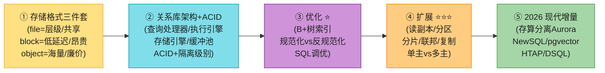

> 💡 **关键信号词**:**"file/block/object 三件套对应 EFS/EBS/S3"** + **"关系库的瓶颈是单机扩展——读副本扛读、分片扛写、但跨分片 join 难"** + **"ACID 是强一致代价,2026 用存算分离(Aurora)+ NewSQL(TiDB)破局"**——这三句直接拿下面试。

---

## 🗺️ 章节概览

| 小节 | 要点 | 重要性 |
|------|------|--------|
| **存储格式三件套** | file(层级共享)/ block(固定块低延迟)/ object(不可变海量廉价) | ⭐⭐⭐⭐⭐ |
| **关系库逻辑组件** | 表/行/列/关系/键/索引/约束/视图/事务 | ⭐⭐⭐ |
| **SQL 四类** | DDL(结构)/ DML(数据)/ DCL(权限)/ TCL(事务) | ⭐⭐⭐ |
| **ACID ⭐⭐⭐⭐⭐** | 原子性/一致性/隔离性/持久性 | ⭐⭐⭐⭐⭐ |
| **隔离级别 ⭐** | 读未提交/读已/可重复读/快照/串行化 | ⭐⭐⭐⭐⭐ |
| **锁 + MVCC** | 共享锁/排他锁/死锁 + 多版本并发控制 | ⭐⭐⭐⭐ |
| **ER 模型 + 规范化** | 1NF~3NF/BCNF,降冗余 | ⭐⭐⭐⭐ |
| **RDBMS 架构 ⭐⭐⭐** | 查询处理器/执行引擎/存储引擎/缓冲池/事务/恢复管理器 | ⭐⭐⭐⭐⭐ |
| **索引(B+树)** | 主/辅索引 + 聚簇/非聚簇 + 复合索引 | ⭐⭐⭐⭐⭐ |
| **反规范化** | 读重场景,以冗余换 join 性能 | ⭐⭐⭐⭐ |
| **扩展:分区/分片/复制 ⭐⭐⭐⭐⭐** | 垂直/水平分区,hash/range/目录分片,单主/多主 | ⭐⭐⭐⭐⭐ |
| **同步 vs 异步复制** | 同步=强一致/高延迟;异步=低延迟/丢数据风险 | ⭐⭐⭐⭐ |
| **MySQL vs PostgreSQL** | 读重/简单 vs 写重/丰富类型 | ⭐⭐⭐ |
| **2026增量(补)** | 存算分离/NewSQL/pgvector/NVMe/HTAP/Aurora DSQL | ⭐⭐⭐⭐⭐ |

---

## 1. 数据存储格式(Storage Formats)⭐⭐⭐⭐⭐

存储硬件几十年的演进带来一个核心问题:**如何把数据以一种"屏蔽底层硬件、跨硬件可读写可修改"的格式存下来**。答案催生了**存储驱动(driver)** + **三种逻辑格式**:**file-based、block-based、object-based**。三者的本质区别是**数据如何逻辑排列**。

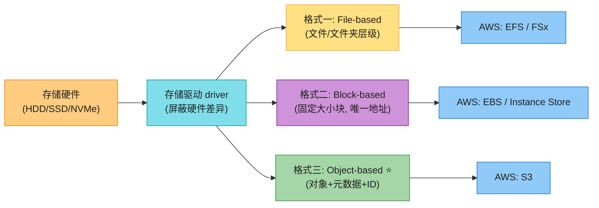

### 1.1 File-Based Storage(文件存储)

**心智模型**:**像档案柜(file cabinet)**——按柜子(cabinet)→ 抽屉(drawer)→ 文件夹(folder)→ 文件(file)→ 纸(paper)的层级组织。访问数据要知道**路径(path)**,可能是又长又绕的字符串。

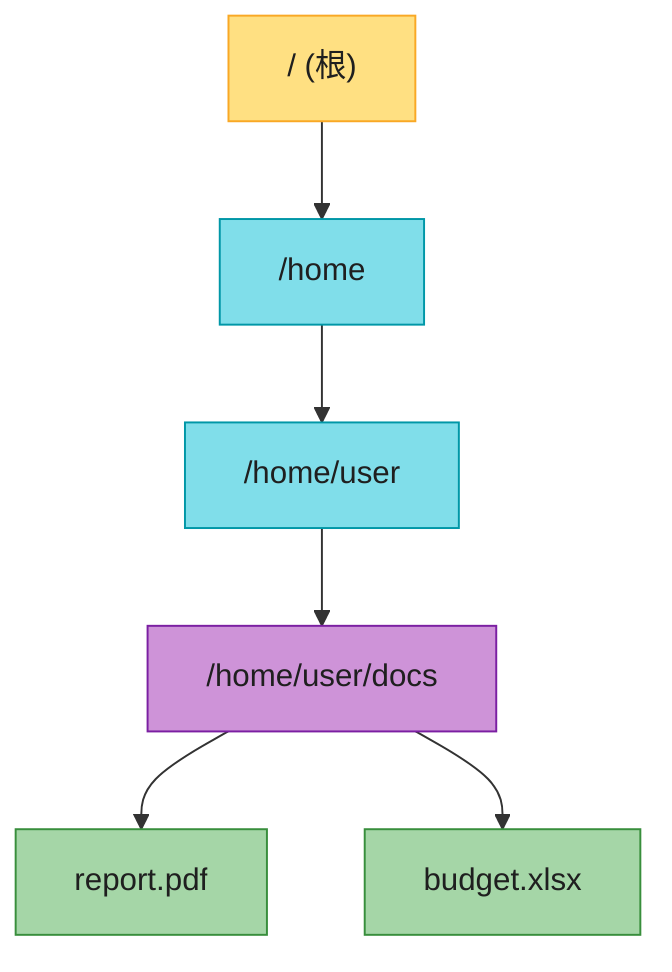

| 维度 | 说明 |
|------|------|
| **组织方式** | 层级(hierarchy)的文件 + 文件夹 |
| **检索** | 通过**元数据(类图书目录卡片)** + 路径 |
| **优点** | 适合复杂文件;层级清晰好导航;**挂载即视为本地目录** |
| **缺点** | **只能"横向加机器"扩容(scale-out),不能"纵向加容量"扩容(scale-up)**——抽屉拉到头就拉不动了 |
| **典型** | 个人电脑磁盘、NFS、SMB/CIFS |
| **AWS** | **EFS(Elastic File System)**——多 EC2 并发共享同一文件系统 |

> 💡 **面试口诀**:**文件存储 = 共享访问 + 层级路径**,适合"多实例要读同一份配置/素材"的场景(如 WordPress 共享上传目录、容器共享 volume)。**短板是扩展性**——EFS 也不是真的"无限",靠分布式文件系统后端支撑。

### 1.2 Block-Based Storage(块存储)

**心智模型**:**把数据切成固定大小的"块(block)"**,每块分配**唯一地址**,可独立读写。**块与用户环境解耦**——同一份数据可以一部分在 Windows、一部分在 Linux,请求时由存储软件重新组装。

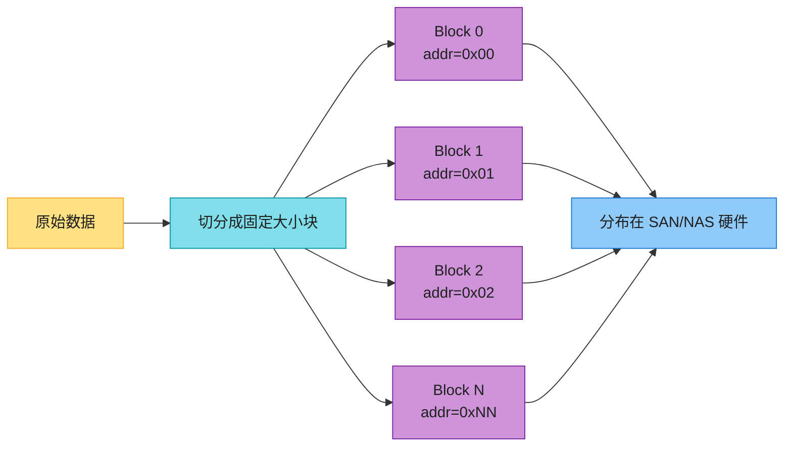

| 维度 | 说明 |
|------|------|
| **组织方式** | 固定大小块 + 唯一地址,**块独立可分区** |
| **检索** | **不依赖单一路径**——按地址快速取 |
| **优点** | **性能、可靠性、可扩展性都优于 file**;每块可独立配置成不同 OS 的盘;**适合大事务 + 大数据库** |
| **缺点** | **贵**;**元数据能力弱**——元数据要在应用/DB 层处理,加重开发复杂度 |
| **典型** | SAN(Storage Area Network)、NAS |
| **AWS** | **EBS(Elastic Block Store)**——挂到 EC2 当磁盘,数据库的首选 |

> 🪤 **追问陷阱(高频)**:"为什么数据库要跑在 block 存储上(EBS)而不是 object(S3)?" → **数据库要随机读写 + 低延迟 + 原地修改**,block 是"裸磁盘"语义,数据库引擎能完全掌控页(page)/段(extent)布局;**object 不可变、整存整取、延迟高**,根本不适合数据库的随机 update。

### 1.3 Object-Based Storage(对象存储)

**心智模型**:**数据 = 对象(object)= payload(数据本身) + 元数据(metadata) + 唯一标识(ID)**。对象存在**单一扁平仓库**(不是层级、不是块),跨分布式硬件铺开,用 ID + 元数据检索。

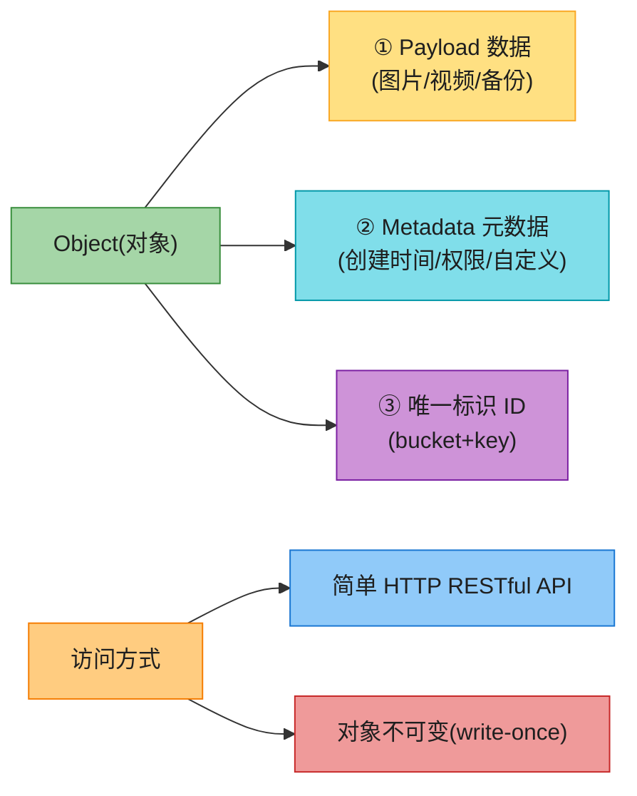

| 维度 | 说明 |
|------|------|
| **组织方式** | 扁平对象池,每对象 = 数据 + 元数据 + ID |
| **检索** | HTTP API + ID + 元数据,适合**海量分布式** |
| **优点** | **极致可扩展、低成本、适合静态/非结构化数据**;HTTP API 跨语言 |
| **缺点** | **对象不可变(整存整取,不能原地改)**;**不适合传统数据库**(写入慢、API 不直观) |
| **典型** | AWS S3、Azure Blob、Google GCS、Ceph |
| **AWS** | **S3(Simple Storage Service)**——数据湖、备份、静态网站、大数据分析底座 |

### 1.4 三件套对比(背)⭐⭐⭐⭐⭐

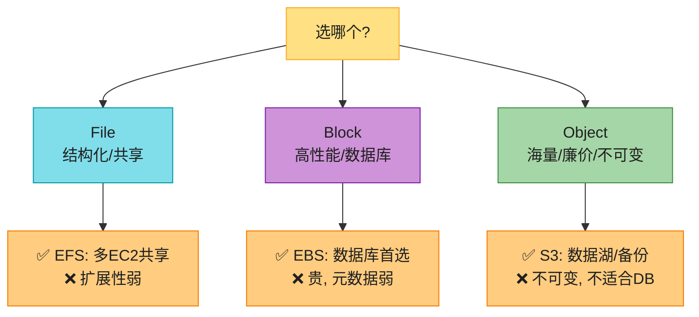

| 维度 | File | Block | Object |
|------|------|-------|--------|
| **数据组织** | 层级(目录树) | 固定块(有地址) | 对象(扁平池) |
| **可变性** | 可变 | 可变 | **不可变** |
| **性能** | 中 | **高** | 低-中 |
| **成本** | 中高 | **高** | **低** |
| **可扩展** | 弱(横向加机器) | 中 | **海量** |
| **元数据** | 强(路径属性) | 弱 | **强(自定义元数据)** |
| **访问协议** | NFS/SMB/SMB | iSCSI/FC | **HTTP REST** |
| **典型 AWS** | EFS / FSx | EBS / Instance Store | S3 |
| **适用** | 共享文件 | 数据库 / VM | 数据湖 / 备份 / 静态资源 |

> 💡 **选型口诀(背)**:**"要共享用 file,要性能用 block,要海量廉价用 object"**。三者**不是替代关系而是分工**——一个典型 web 应用:用户上传的图片 → S3(object);数据库 → EBS(block);多实例共享配置 → EFS(file)。

> 📝 **本章主要讲关系库**(跑在 block 上的典型);**对象存储的深度设计见 SDE-Vol2 Ch9**;**KV/NoSQL 见 SDE-Vol1 Ch6 和本书 Ch3**。

---

## 2. 关系型数据库基础(Relational Databases)

数据库 = **结构化、有组织**的数据集合,设计用于高效存储/检索/操作**大量**数据。**DBMS**(数据库管理系统)= 数据库 + 一组管理软件,**作为用户和数据库之间的桥梁**,提供事务、恢复、备份、并发、鉴权、元数据目录等能力。

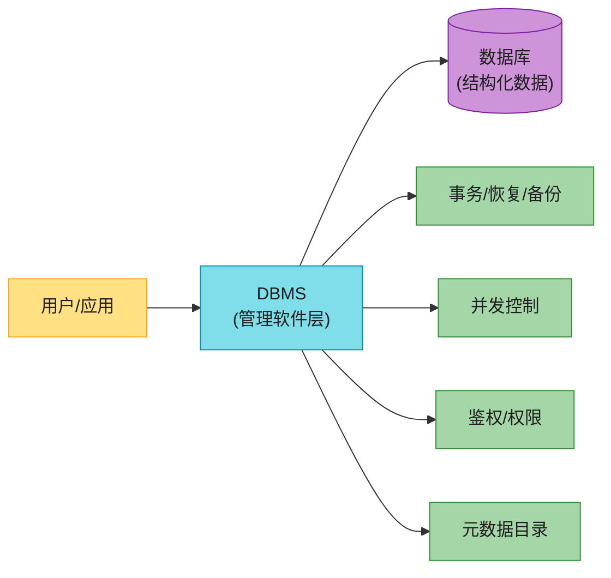

### 2.1 关系模型(Relational Model)

关系库基于 **Edgar F. Codd 在 1970 年代提出的 relational model**——把数据组织成**表(table)**,表之间用**键(key)**建立关系。开源代表:**MySQL、PostgreSQL、MariaDB**;企业级:**Oracle、SQL Server、IBM Db2、SAP HANA**。

**逻辑组件**(背):

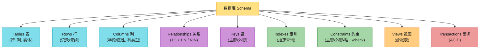

| 组件 | 说明 |
|------|------|
| **表(Table)** | 关系库基本单元,行+列组织;每张表代表一个实体(如 customers) |
| **行(Row)** | 也叫 record 或 tuple,代表一个实体实例;行在表内唯一(用主键标识) |
| **列(Column)** | 也叫 field/attribute,有数据类型(int/string/date/binary) |
| **关系(Relationship)** | 表间关联,1:1、1:N、N:N(用外键或关联表实现) |
| **键(Key)** | 主键(唯一标识行)、外键(引用他表主键建关系) |
| **索引(Index)** | 加速查询的数据结构(详见 §5.1) |
| **约束(Constraint)** | 主键/外键/唯一/check 约束,保数据完整性 |
| **视图(View)** | 基于预定义查询的虚拟表,用于安全/抽象/简化 |
| **事务(Transaction)** | 一组操作作为原子单元,受 ACID 约束(详见 §3) |

### 2.2 键(Key)的类型

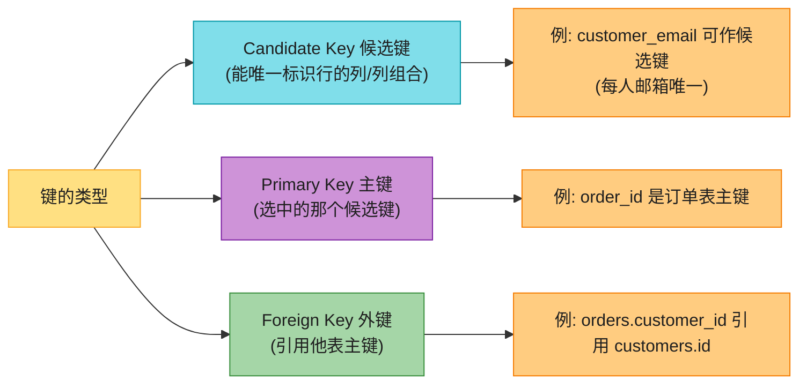

> 💡 **候选键** = 有资格当主键的列(可能多个);**主键** = 从候选键里挑一个;**外键** = 在本表引用他表主键,建立关系。

---

## 3. 关系库核心概念:SQL + ACID + 隔离 + 锁 ⭐⭐⭐⭐⭐

### 3.1 SQL 的四类(背)

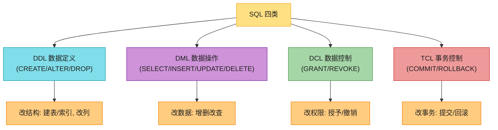

### 3.2 ACID(背)⭐⭐⭐⭐⭐

ACID = 保证数据库事务**可靠、准确**处理的四条属性。

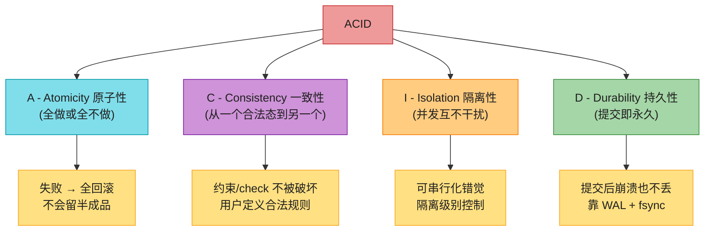

| 性质 | 保证 | 实现 |
|------|------|------|
| **Atomicity(原子性)** | 事务是一组操作:要么全成功(commit),要么全回滚(rollback);**不会留部分更新** | WAL + undo log |
| **Consistency(一致性)** | 数据库从一个合法态转到另一个合法态;**约束、check、外键不被破坏**——但**合法规则由应用定义**(如账户余额必须正) | 约束 + 触发器 + 应用层 |
| **Isolation(隔离性)** | 并发事务互不干扰;若并发结果等价于某种串行执行,则支持隔离 | **隔离级别 + 锁 / MVCC** |
| **Durability(持久性)** | 提交后变更永久,即使崩溃/断电也不丢 | **WAL(预写日志)+ dirty page 异步刷盘** |

> 🪤 **追问陷阱(超高频)**:"ACID 的 C 和 CAP 的 C 一样吗?" → **不一样**!**ACID 的 C = 数据库内部一致性**(约束、外键、引用完整性,保证事务后数据合法);**CAP 的 C = 分布式多副本一致性**(所有节点同一时刻看到同一数据)。**完全不同的概念,别混淆**。

> 💡 **原子性带来的"安全重试"**:原子性保证"全做或全不做",所以应用层可以**放心重试**失败的事务,不用担心产生重复数据或半成品。

### 3.3 隔离级别(Isolation Levels)⭐⭐⭐⭐⭐

隔离性决定**并发事务相互看到什么**。隔离越强 → 一致性越好,但**并发度越低、延迟越高**(锁等待多)。SQL 标准定义了**四个级别**,从弱到强,每级解决特定的"脏读异常":

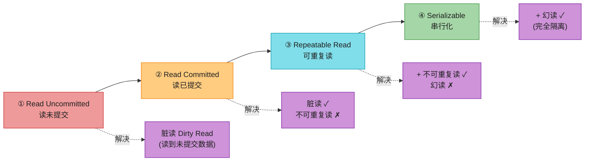

| 级别 | 脏读 | 不可重复读 | 幻读 | 代价 |
|------|------|-----------|------|------|
| **Read Uncommitted(读未提交)** | 可能 | 可能 | 可能 | 最低(几乎不锁) |
| **Read Committed(读已提交)** | ✗ 不可能 | 可能 | 可能 | 中等(读已提交数据) |
| **Repeatable Read(可重复读)** | ✗ | ✗ | 可能 | 较高(行锁) |
| **Serializable(串行化)** | ✗ | ✗ | ✗ | **最高(等价串行,性能差)** |

**三种"读异常"详解(背)**:

| 异常 | 描述 | 例子 |
|------|------|------|
| **脏读(Dirty Read)** | 事务 A 读到了事务 B **未提交**的数据;B 回滚 → A 读到了"根本不存在"的值 | A 读余额=200(B 改了但回滚),实际余额=100 |
| **不可重复读(Non-repeatable Read)** | 事务 A 两次读**同一行**结果不同(中间 B **修改并提交**了该行) | A 第一次读余额=100,第二次=150(B 提交了 update) |
| **幻读(Phantom Read)** | 事务 A 两次执行**同一范围查询**结果集不同(中间 B **插入/删除**了符合条件的行) | A 第一次 `WHERE age>30` 得 5 行,第二次得 6 行(B 插入一行) |

> 🪤 **追问陷阱**:"不可重复读和幻读区别?" → **不可重复读是"同一行被修改"**(update);**幻读是"范围查询的行数变了"**(insert/delete)。Repeatable Read 解决前者(行锁),但**幻读要范围锁或 Serializable 才能完全解决**——不过 **MySQL/InnoDB 的 RR 用 next-key lock 顺带解决了幻读**(这是个特例,PG 的 RR 仍有幻读)。

### 3.4 锁(Locking)⭐⭐⭐⭐

锁是实现隔离级别的最直接手段。**并发控制管理器(concurrency control manager)** 管理锁。

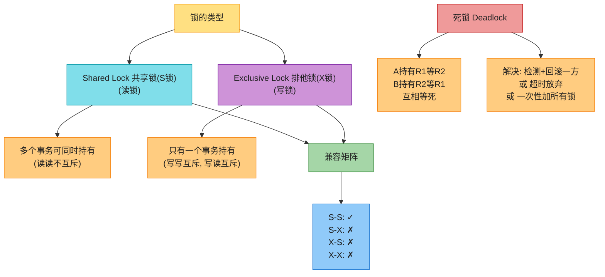

| 锁类型 | 谁能持有 | 兼容性 |
|--------|---------|--------|
| **共享锁(S锁,读锁)** | 多个事务同时持有 | S-S 兼容 |
| **排他锁(X锁,写锁)** | 只一个事务独占 | 与所有锁互斥 |

> 💡 **锁粒度**:数据库有**行锁 / 页锁 / 表锁**——粒度越细并发越高,但锁管理开销大(要存锁表)。**MySQL InnoDB 默认行锁**(基于索引),**没有索引的 update 会退化为表锁**——这是性能杀手。

**死锁(Deadlock)**:两个事务互相持有对方想要的锁 → 都等死。**解决**:① 死锁检测(图检测环)+ 选一个 victim 回滚;② 锁超时放弃;③ 应用层一次性按顺序加锁避免。

### 3.5 MVCC(多版本并发控制)⭐⭐⭐⭐⭐(2026 补)

**MVCC(Multi-Version Concurrency Control)** 是现代关系库(PostgreSQL、MySQL InnoDB、Oracle)**实现隔离的实际手段**——它**绕开"读阻塞写、写阻塞读"**:

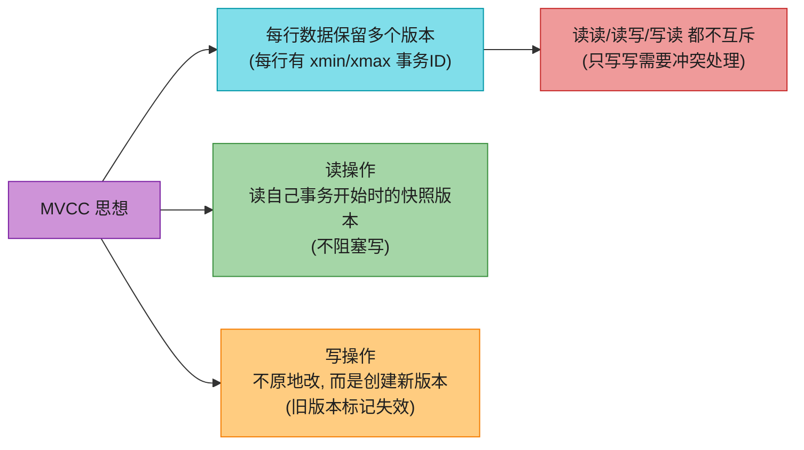

| MVCC 实现 | 默认隔离级别 | 关键机制 |
|-----------|-------------|---------|
| **PostgreSQL** | **Read Committed** | 每行有 xmin(创建事务)/xmax(删除事务);**用可见性判断决定读哪个版本**;支持 **SSI(Serializable Snapshot Isolation)** 实现真正的 Serializable |
| **MySQL InnoDB** | **Repeatable Read** | 每行有隐藏 DB_TRX_ID;**undo log 链构建历史版本**;**RR 用 next-key lock 防幻读** |
| **Oracle** | Read Committed | SCN(System Change Number)做版本号 |

> 🪤 **追问陷阱(高频)**:"PG 和 MySQL 默认隔离级别一样吗?" → **不一样!PostgreSQL 默认 Read Committed,MySQL InnoDB 默认 Repeatable Read**。但 **PG 用 MVCC 实现 RC,MySQL 用 MVCC + next-key lock 实现 RR(顺带防幻读)**。**Serializable 在两者实现不同**:PG 用 SSI(序列化快照隔离,基于检测回滚),MySQL 用两阶段锁。

---

## 4. ER 模型与规范化(Normalization)⭐⭐⭐⭐

### 4.1 ER 模型(Entity-Relationship Model)

ER 模型是关系库设计的**概念模型**——用图形表示实体、属性、关系。**实体 = 矩形,属性 = 椭圆,关系 = 菱形**。

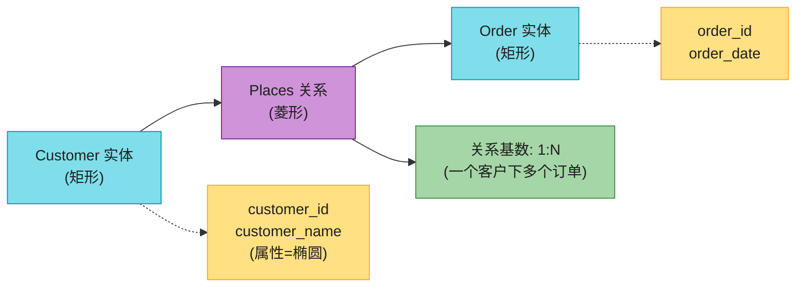

关系的三种基数:**1:1**(一对一)、**1:N**(一对多)、**N:N**(多对多,需要关联表/junction table)。

### 4.2 规范化(Normalization)

规范化 = **组织数据以减少冗余、提升完整性**——把大表拆成小表,每条数据只存一处。

**例子**:Customers 表有 customer_id / customer_name / customer_email / customer_address / customer_phone。如果客户下多个订单,这些信息会在每行重复 → 冗余。**规范化**:拆成 CustomerInfo(id, name) + CustomerContact(id, email, address, phone)。

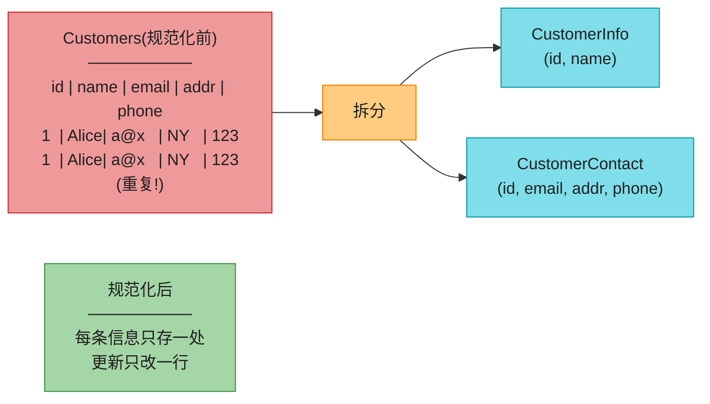

**范式(Normal Forms,背关键)**:

| 范式 | 要求 | 通俗 |
|------|------|------|
| **1NF** | 每列原子(不可再分) | 不要在一列塞数组/逗号分隔 |
| **2NF** | 1NF + 非主属性完全依赖主键(消除部分依赖) | 复合主键时,非主键列不能只依赖主键的一部分 |
| **3NF** | 2NF + 非主属性不传递依赖主键(消除传递依赖) | "A 依赖 B,B 依赖 C → A 传递依赖 C",要拆 |
| **BCNF** | 3NF 的加强:每个决定因素都是候选键 | 比 3NF 更严 |

> 🪤 **追问陷阱(高频)**:"3NF 是什么?" → **1NF(原子)+ 2NF(消除部分依赖)+ 3NF(消除传递依赖)**。通俗:**每列只依赖主键,不依赖其他非主键列**——比如"部门号 → 部门名"应该拆到单独的部门表,而不是放在员工表(因为部门名依赖部门号,不直接依赖员工号)。

> 💡 **规范化的代价**:规范化消除冗余,但**查询要 join 多表**——读性能下降。**OLTP(事务型)用 3NF,OLAP(分析型)用反规范化或星型模型**(详见 §5.2)。

---

## 5. RDBMS 架构与优化

### 5.1 RDBMS 架构(背)⭐⭐⭐⭐⭐

RDBMS 的核心组件**(实现细节各异,但骨架一致)**:

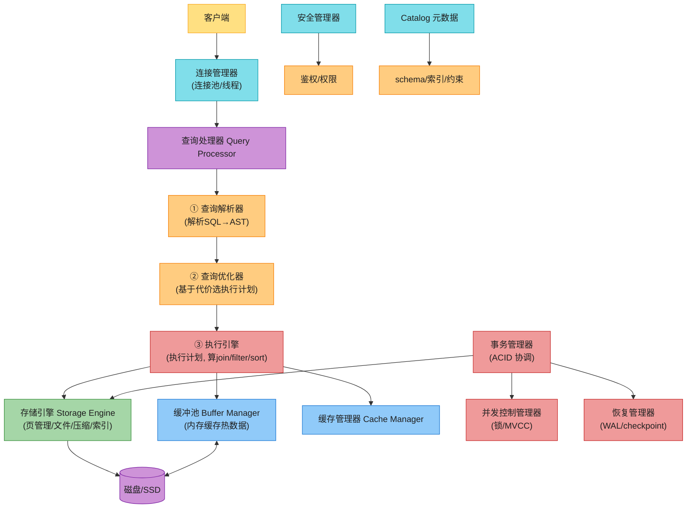

| 组件 | 职责 |
|------|------|
| **查询处理器(Query Processor)** | 把 SQL 翻译成执行格式。**子模块**:**查询解析器**(tokenize/语法/语义 → AST)、**查询优化器**(基于统计信息选最优执行计划) |
| **执行引擎(Execution Engine)** | 执行优化器选的执行计划,做 join/filter/sort,从存储引擎取数据,返回结果集。**分布式库还要在多节点编排** |
| **存储引擎(Storage Engine)** | 管理物理存储与检索:数据页管理、文件分配、压缩、索引 |
| **缓冲池(Buffer Manager)** | 管内存中的数据缓冲,优化磁盘 IO,**热数据常驻内存**——这是性能关键 |
| **缓存管理器(Cache Manager)** | 缓存频繁访问的数据(查询计划/会话) |
| **事务管理器(Transaction Manager)** | 协调事务:要么全成功要么全回滚。**协同并发控制和恢复管理器** |
| **并发控制管理器** | 处理并发访问,管锁、隔离级别、冲突解决 |
| **恢复管理器(Recovery Manager)** | 保证持久性:**WAL(预写日志)+ checkpoint + crash recovery**;脏页(dirty page)异步刷盘,刷完变干净页(clean page) |
| **安全管理器** | 鉴权、权限、数据保密 |
| **Catalog(数据字典)** | 存 schema/表/列/索引/约束的元数据 |

#### 5.1.1 查询优化器(基于代价,Cost-Based Optimizer)

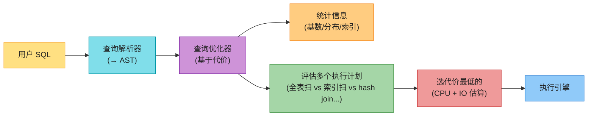

> 🪤 **追问陷阱(高频)**:"为什么 SQL 要优化器?" → SQL 是**声明式**(说"要什么"),优化器决定**怎么拿**(执行计划)。**同一个 SQL 可能有几十种执行方式**,优化器基于**表的统计信息(行数、基数、索引)**估算每种代价,**选最优的**。**统计信息过时 → 优化器选错计划**——这就是为什么 DBA 要定期 `ANALYZE` 更新统计。

#### 5.1.2 恢复管理器与 WAL(预写日志)⭐⭐⭐⭐⭐

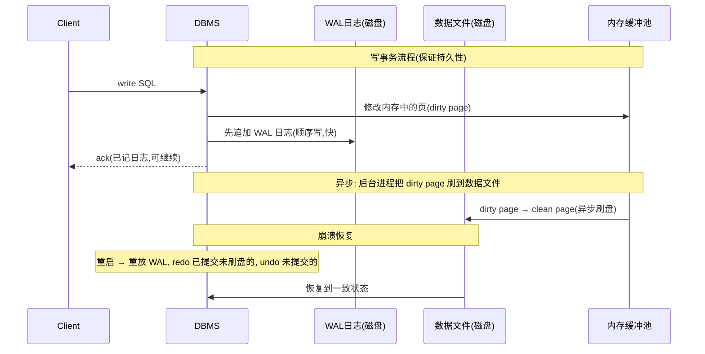

**WAL(Write-Ahead Logging)** 是关系库持久性的基石:**所有写操作先追加到磁盘上的 append-only 日志,再异步应用到数据文件**。**关键点**:① **客户端 ack 前,日志必须已 fsync 到磁盘**——这是持久性保证;② **数据文件可以延迟刷**(dirty page 在内存,后台慢慢刷);③ **崩溃后重放 WAL**——已提交但未刷盘的 redo,未提交的 undo。

> 💡 **为什么 WAL 是顺序写?** 顺序写比随机写快 10-100 倍(SSD 上也有几倍差距)。**日志顺序写 → 数据文件可以随机写且延迟刷**,这是关系库性能的关键设计。

### 5.2 索引(Indexes)⭐⭐⭐⭐⭐

**索引 = 提升查询速度的数据结构**。在频繁查询的列建索引,优化器可快速定位数据,**避免全表扫**。

#### 5.2.1 主索引 vs 辅助索引

| 类型 | 定义 | 例子 |
|------|------|------|
| **主索引(Primary Index)** | 建在主键上的索引;**聚簇**(数据物理上按主键排序) | orders(order_id) |
| **辅助索引(Secondary Index)** | 建在非主键列上;**非聚簇**(存主键指针,要回表) | orders(customer_phone) |

#### 5.2.2 B+ 树(B+ Tree)⭐⭐⭐⭐⭐

关系库索引的事实标准。**B+ 树**是自平衡树:**内部节点存键(分隔符),叶子节点存数据或指针,叶子节点用链表链接**。

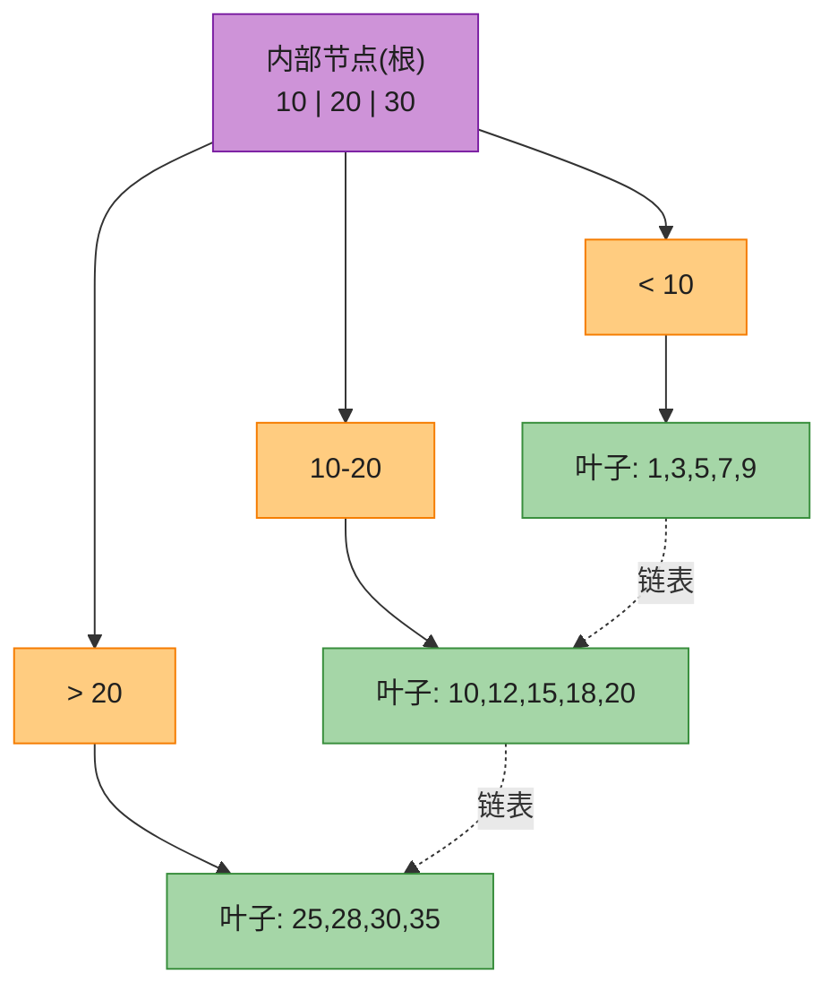

| B+ 树特性 | 说明 |
|-----------|------|
| **内部节点只存键** | 键做分隔符,引导搜索;**内部节点不存数据 → 一个节点能存更多键 → 树更矮** |
| **叶子节点存数据或指针** | 实际数据记录或指向记录的指针 |
| **叶子节点链表链接** | 支持**范围扫描(range scan)**和**顺序访问** |
| **自平衡** | 树高 O(log n),搜索/插入/删除都是 O(log n) |
| **范围查询高效** | 找到起点后顺着叶子链表扫即可 |

#### 5.2.3 复合索引(Composite Index)

```mermaid
flowchart LR
    IDX["复合索引 (a, b, c)"] --> SORT["先按 a 排序<br/>a 相同按 b<br/>b 相同按 c"]
    SORT --> USE["适用:<br/>WHERE a=?<br/>WHERE a=? AND b=?<br/>WHERE a=? AND b=? AND c=?"]
    SORT --> NOUSE["不适用(最左前缀):<br/>WHERE b=?<br/>WHERE c=?<br/>(没 a 走不全索引)"]

    style IDX fill:#FFE082,stroke:#F9A825,color:#1f1f1f
    style SORT fill:#80DEEA,stroke:#0097A7,color:#1f1f1f
    style USE fill:#A5D6A7,stroke:#388E3C,color:#1f1f1f
    style NOUSE fill:#EF9A9A,stroke:#C62828,color:#1f1f1f
```

**最左前缀原则**:复合索引 `(a, b, c)` 实际上是按 `(a, b, c)` 字典序排序——查询从最左列开始才能用上索引。`WHERE a=? AND b=?` 能用(a,b 部分),`WHERE b=?` 不能用(跳过 a)。

#### 5.2.4 索引的代价

> 🪤 **追问陷阱(高频)**:"索引越多越好吗?" → **不是!索引有代价**:① **占空间**(索引本身要存);② **拖慢写**(insert/update/delete 要同步更新索引);③ **大数据导入时可能要先 disable 索引,导入完再 rebuild**。**索引是"读快写慢"的权衡**——读重写轻才值得建。

### 5.3 反规范化(Denormalization)

> 💡 **现实数据**:大多数系统**读:写 = 100:1 甚至 1000:1**。读时做复杂 join 很贵(尤其涉及磁盘 IO)。**反规范化** = **跨表复制数据,避免昂贵 join**——以**写性能下降**为代价换**读性能提升**。

```mermaid
flowchart LR
    NORM["规范化(3NF)<br/>────────<br/>读要 join 多表<br/>写只改一处<br/>数据无冗余"]
    NORM -->|"反规范化"| DENORM["反规范化<br/>────────<br/>读少 join(或0 join)<br/>写要改多处<br/>数据有冗余"]

    DENORM --> HOW["实现手段"]
    HOW --> MV["物化视图<br/>(materialized view)"]
    HOW --> TRIG["触发器/级联更新<br/>(改一处自动同步他处)"]
    HOW --> DUP["直接复制列"]

    style NORM fill:#80DEEA,stroke:#0097A7,color:#1f1f1f
    style DENORM fill:#FFCC80,stroke:#F57C00,color:#1f1f1f
    style HOW fill:#CE93D8,stroke:#7B1FA2,color:#1f1f1f
    style MV fill:#A5D6A7,stroke:#388E3C,color:#1f1f1f
    style TRIG fill:#A5D6A7,stroke:#388E3C,color:#1f1f1f
    style DUP fill:#A5D6A7,stroke:#388E3C,color:#1f1f1f
```

> 🪤 **追问陷阱**:"什么时候反规范化?" → **读远多于写**(如电商商品页、报表),join 成为瓶颈时。**代价**:数据冗余 → 多处更新 → **写性能下降 + 一致性维护复杂**(用触发器/级联约束保一致)。**重写场景反规范化反而更慢**。

### 5.4 SQL 调优与联邦(Federation)

**SQL 调优**(接 Ch1 准则三"指标不说谎"):先 **benchmark**(模拟高负载)+ **profile**(测 p90 延迟 + 分析慢查询日志)→ 基于瓶颈优化:

| 调优手段 | 做法 |
|---------|------|
| **减少大写操作** | 大量写/改/删会锁表、撑大日志;分批处理 |
| **避开高峰执行重查询** | 多个大 SELECT、嵌套子查询、循环查询放低峰期跑 |
| **JOIN elimination** | 拆成多个小查询后合并,去掉不必要的 join/子查询/表 |
| **执行计划分析** | `EXPLAIN ANALYZE` 看真实执行计划,找全表扫、错误 join 类型 |

**查询联邦(Query Federation)**:**把大查询拆成小查询,在不同数据库服务器上独立执行**。需要**schema 联邦**(按功能切分到多库),并行执行降总时间。

---

## 6. 扩展关系库 ⭐⭐⭐⭐⭐

关系库天然"单机友好"——单机能扛的扩展靠**垂直扩展(加 CPU/内存)**,但撞到单机上限后必须**水平扩展**。本节是本章**最重要的考点之一**。

```mermaid
flowchart TD
    SCALE["扩展手段"] --> V["① 垂直扩展<br/>单机加资源"]
    SCALE --> FED["② 联邦 Federation<br/>按功能拆库"]
    SCALE --> IDX["③ 索引+SQL调优<br/>(不扩节点, 提利用率)"]
    SCALE --> PART["④ 分区 Partitioning<br/>(表内拆)"]
    SCALE --> SHARD["⑤ 分片 Sharding ⭐⭐⭐<br/>(跨节点拆)"]
    SCALE --> REP["⑥ 复制 Replication ⭐⭐<br/>(多副本)"]
    SCALE --> DENORM["⑦ 反规范化<br/>(减 join)"]

    style SCALE fill:#FFE082,stroke:#F9A825,color:#1f1f1f
    style V fill:#80DEEA,stroke:#0097A7,color:#1f1f1f
    style FED fill:#80DEEA,stroke:#0097A7,color:#1f1f1f
    style IDX fill:#80DEEA,stroke:#0097A7,color:#1f1f1f
    style PART fill:#CE93D8,stroke:#7B1FA2,color:#1f1f1f
    style SHARD fill:#EF9A9A,stroke:#C62828,color:#1f1f1f
    style REP fill:#A5D6A7,stroke:#388E3C,color:#1f1f1f
    style DENORM fill:#FFCC80,stroke:#F57C00,color:#1f1f1f
```

### 6.1 分区(Partitioning)

**分区 = 把一张大表切成多个"分区(partition)"**,每个分区是独立的"小数据库",可独立读写。**每条记录只属于一个分区**。

```mermaid
flowchart LR
    PART["分区类型"] --> VP["① 垂直分区<br/>(按列拆)"]
    PART --> HP["② 水平分区<br/>(按行拆)"]

    HP --> HASH["②-a Hash 分区<br/>(key 哈希均匀分布)"]
    HP --> RANGE["②-b Range 分区<br/>(连续 key 范围)"]

    VP --> VP1["例: customer 表拆成<br/>customer_info(基本)<br/>customer_contact(联系)"]
    HASH --> HASH1["优点: 无热点均匀<br/>缺点: 不能范围查询(scatter-gather)"]
    RANGE --> RANGE1["优点: 范围扫快<br/>缺点: 热点(A 开头客户多 → P1 过载)"

    style PART fill:#FFE082,stroke:#F9A825,color:#1f1f1f
    style VP fill:#80DEEA,stroke:#0097A7,color:#1f1f1f
    style HP fill:#CE93D8,stroke:#7B1FA2,color:#1f1f1f
    style HASH fill:#FFCC80,stroke:#F57C00,color:#1f1f1f
    style RANGE fill:#FFCC80,stroke:#F57C00,color:#1f1f1f
    style VP1 fill:#A5D6A7,stroke:#388E3C,color:#1f1f1f
    style HASH1 fill:#A5D6A7,stroke:#388E3C,color:#1f1f1f
    style RANGE1 fill:#EF9A9A,stroke:#C62828,color:#1f1f1f
```

| 类型 | 做法 | 优点 | 缺点 |
|------|------|------|------|
| **垂直分区** | 按列拆(把不常用列、大列如 BLOB 拆到副表) | 减 IO(只读常用列)、隔离大列 | 跨分区 join |
| **Hash 分区** | `hash(key) % N` 分到 N 个桶 | **均匀无热点** | **不能范围查询**(要 scatter-gather 所有分区) |
| **Range 分区** | 按连续 key 范围分(如日期、首字母) | **范围扫快**(只查相关分区) | **热点风险**(热门范围挤一个分区) |

> 💡 **Hash 分区的关键**:**哈希函数必须确定性**(同一 key 永远哈希到同一分区),且**分布均匀**。常见用 MD5/SHA-256 取模。

> 🪤 **追问陷阱**:"Hash 分区怎么处理热点?" → **Hash 本身就是为了消除热点**(均匀分布)。但如果**某个 key 本身访问极频繁**(如明星账号),再好的哈希也救不了——这是**逻辑热点**,要靠应用层缓存或单独处理。

### 6.2 分片(Sharding)⭐⭐⭐⭐⭐

**分片 = 把数据库分布到多台服务器**,每台存一部分数据。**分片是分区 + 跨节点**——分区是逻辑拆,分片是物理拆。常按客户姓氏首字母、地理位置、customer_id 哈希分片。

```mermaid
flowchart TD
    APP["应用层 / 协调器"] --> ROUTE{"路由:<br/>这条查询去哪个分片?"}
    ROUTE --> SH1["分片1<br/>customers A-F"]
    ROUTE --> SH2["分片2<br/>customers G-M"]
    ROUTE --> SH3["分片3<br/>customers N-Z"]

    SH1 --> SH1DB[("Shard 1 DB")]
    SH2 --> SH2DB[("Shard 2 DB")]
    SH3 --> SH3DB[("Shard 3 DB")]

    style APP fill:#FFE082,stroke:#F9A825,color:#1f1f1f
    style ROUTE fill:#FFCC80,stroke:#F57C00,color:#1f1f1f
    style SH1 fill:#80DEEA,stroke:#0097A7,color:#1f1f1f
    style SH2 fill:#80DEEA,stroke:#0097A7,color:#1f1f1f
    style SH3 fill:#80DEEA,stroke:#0097A7,color:#1f1f1f
    style SH1DB fill:#CE93D8,stroke:#7B1FA2,color:#1f1f1f
    style SH2DB fill:#CE93D8,stroke:#7B1FA2,color:#1f1f1f
    style SH3DB fill:#CE93D8,stroke:#7B1FA2,color:#1f1f1f
```

**分片方法**:

| 方法 | 做法 | 优点 | 缺点 |
|------|------|------|------|
| **Hash 分片** | `hash(key) % N` | 均匀 | 不能范围查;**增减分片要重哈希**(一致性哈希缓解) |
| **Range 分片** | 按 key 范围 | 范围扫快 | 热点 |
| **目录分片(Directory)** | 用**查找表**(路由表)记 key→shard 映射 | 灵活(可任意分配) | 路由表是单点 + 性能瓶颈 |
| **Round-robin** | 轮询 | 简单均匀 | 不能按 key 定位(查询要扫所有) |

**分片的优点**:降读写流量、降副本数、提缓存利用率、缩索引体积(每个分片索引小)、**分片故障其他分片仍工作**、**无需中央主节点串行化写**(并行写)。

**分片的缺点(背)**:

> 🪤 **分片的"七宗罪"**:
> 1. **应用逻辑复杂**——要处理分片路由;
> 2. **数据倾斜**——某些分片是"大客户"导致负载不均;
> 3. **再平衡难**——加减分片要迁数据,**一致性哈希**能减小迁移量;
> 4. **跨分片 join 极难**——这是分片的最大痛点;
> 5. **跨分片事务难**——两阶段提交(2PC)慢且复杂;
> 6. **额外硬件成本**;
> 7. **整体复杂度飙升**。

#### 6.2.1 一致性哈希(Consistent Hashing)⭐⭐⭐⭐

普通哈希 `hash(key) % N` 的痛点:**N 变化时几乎所有 key 都要重哈希**(雪崩)。**一致性哈希**把节点和 key 都映射到**一个环(0 ~ 2^32)** 上,key 顺时针找到的**第一个节点**就是它的归属。**加减节点只影响相邻段**——迁移量最小。详见 **SDE-Vol1 Ch5 一致性哈希** 和 **Ch6 键值存储**。

```mermaid
flowchart LR
    RING["一致性哈希环<br/>(0 ~ 2^32)"] --> N1["节点 A"]
    RING --> N2["节点 B"]
    RING --> N3["节点 C"]

    K1["key1"] -.->|"顺时针第一"| N2
    K2["key2"] -.->|"顺时针第一"| N3

    ADD["加节点 D"] --> MIG["只迁移<br/>D 相邻段 key<br/>(其他不动)"]

    style RING fill:#FFE082,stroke:#F9A825,color:#1f1f1f
    style N1 fill:#80DEEA,stroke:#0097A7,color:#1f1f1f
    style N2 fill:#80DEEA,stroke:#0097A7,color:#1f1f1f
    style N3 fill:#80DEEA,stroke:#0097A7,color:#1f1f1f
    style K1 fill:#CE93D8,stroke:#7B1FA2,color:#1f1f1f
    style K2 fill:#CE93D8,stroke:#7B1FA2,color:#1f1f1f
    style ADD fill:#A5D6A7,stroke:#388E3C,color:#1f1f1f
    style MIG fill:#FFCC80,stroke:#F57C00,color:#1f1f1f
```

> 💡 **虚拟节点(virtual nodes)**:为避免节点少时分布不均,每个物理节点映射到环上**多个虚拟节点**(如 150 个),让数据更均匀。这是 Dynamo / Cassandra 的标准做法。

### 6.3 复制(Replication)⭐⭐⭐⭐⭐

复制 = **把数据从一台数据库复制到另一台**,每个副本叫 **replica**。复制带来:**高可用、负载分发、降延迟、容灾、扩展性**。

```mermaid
flowchart LR
    REP["复制类型"] --> SL["① 单主 Single-Leader<br/>(主写, 从读)"]
    REP --> ML["② 多主 Multi-Leader<br/>(都写都读)"]

    SL --> SL1["优点: 简单, 无冲突<br/>缺点: 主挂有切换延迟, 写瓶颈"]
    ML --> ML1["优点: 高可用, 写分散<br/>缺点: 冲突解决复杂(LWW/CRDT)"]

    style REP fill:#FFE082,stroke:#F9A825,color:#1f1f1f
    style SL fill:#80DEEA,stroke:#0097A7,color:#1f1f1f
    style ML fill:#CE93D8,stroke:#7B1FA2,color:#1f1f1f
    style SL1 fill:#FFCC80,stroke:#F57C00,color:#1f1f1f
    style ML1 fill:#FFCC80,stroke:#F57C00,color:#1f1f1f
```

| 模式 | 工作方式 | 适用 |
|------|---------|------|
| **单主(Single-Leader)** | 一个 leader 处理写,follower 复制变更只读;leader 挂 → 提升一个 follower | **读重场景**(读副本扩读) |
| **多主(Multi-Leader)** | 每个节点都能读写,变更互相同步;**冲突需解决** | **高可用 / 多区域** |

> 🪤 **追问陷阱**:"单主和多主的本质权衡?" → **单主简单但写有瓶颈 + 切换延迟;多主高可用但写冲突要解决**——这是 Ch1 CAP/PACELC 的具体落地。**冲突解决**用 LWW(最后写赢,可能丢数据)、向量时钟(检测冲突)、CRDT(无冲突数据类型,自动合并)。详见 **SDE-Vol1 Ch6** 和 **SDE-Vol2 Ch4**。

#### 6.3.1 同步 vs 异步复制 ⭐⭐⭐⭐

```mermaid
sequenceDiagram
    participant C as Client
    participant L as Leader
    participant SF as Sync Follower
    participant AF as Async Follower

    Note over C,AF: 同步复制(强一致, 高延迟)
    C->>L: write
    L->>SF: 同步复制(等待 ack)
    SF-->>L: ack
    L-->>C: 成功(数据已两份)

    Note over C,AF: 异步复制(低延迟, 可能丢)
    C->>L: write
    L-->>C: 立即成功
    L-)AF: 异步复制(可能延迟)
    Note right of AF: 主挂时 AF 可能没收到最新写 → 丢数据
```

| 维度 | 同步复制 | 异步复制 |
|------|---------|---------|
| **一致写** | ✅ 主 + 同步从都 ack 才算成功 | ✗ 临时不一致 |
| **即时 failover** | ✅ 同步从随时可提升为新主(无数据丢失) | ✗ 提升异步从可能丢未同步数据 |
| **数据持久性** | ✅ 多副本持久 | ✗ 风险 |
| **读一致** | ✅ 任意副本读都最新 | ✗ 可能读到旧值(stale) |
| **延迟** | **高**(等所有副本) | **低**(不等) |
| **适用** | 金融/关键业务 | 高吞吐/可容忍丢失 |

> 💡 **半同步(semi-synchronous)**:折中——**主等至少一个从 ack** 就返回,兼顾一致和性能。MySQL 默认异步,可配半同步;**Aurora 用 quorum(4/6 写 quorum)** 兼顾。

### 6.4 扩展路线图(背)⭐⭐⭐

```mermaid
flowchart LR
    S1["单机垂直扩展<br/>(加CPU/内存/EBS)"] -->|"撞上限"| S2["加读副本<br/>(扛读, 主仍写瓶颈)"]
    S2 -->|"写瓶颈"| S3["联邦<br/>(按功能拆库)"]
    S3 -->|"单表仍大"| S4["分区/分片<br/>(水平拆)"]
    S4 -->|"跨分片join难"| S5["反规范化+缓存<br/>(或换 NoSQL/NewSQL)"]

    style S1 fill:#80DEEA,stroke:#0097A7,color:#1f1f1f
    style S2 fill:#CE93D8,stroke:#7B1FA2,color:#1f1f1f
    style S3 fill:#FFCC80,stroke:#F57C00,color:#1f1f1f
    style S4 fill:#EF9A9A,stroke:#C62828,color:#1f1f1f
    style S5 fill:#A5D6A7,stroke:#388E3C,color:#1f1f1f
```

> 💡 **核心权衡**:每一步扩展都引入新复杂度——**读副本引入复制延迟、联邦引入跨库 join、分片引入跨分片事务、反规范化引入写放大**。这是为什么 2026 出现 **NewSQL**(下面增量),试图"既强一致又水平扩展"。

---

## 7. MySQL vs PostgreSQL ⭐⭐⭐

两者都是**开源、ACID、支持 SQL+NoSQL、强复制和集群**——但定位不同。

```mermaid
flowchart LR
    PICK["MySQL vs PostgreSQL"] --> MY["MySQL<br/>────────<br/>1995 诞生<br/>读重 / 简单<br/>线程/连接<br/>默认 RR"]
    PICK --> PG["PostgreSQL<br/>────────<br/>1996 诞生<br/>写重 / 丰富类型<br/>进程/连接<br/>默认 RC"]

    MY --> MY1["✅ 速度(读重)<br/>✅ 简单易用<br/>❌ 类型简单<br/>❌ 高级特性少"]
    PG --> PG1["✅ 强类型/JSONB<br/>✅ 表达式/部分索引<br/>✅ 复杂查询/OLTP/OLAP<br/>❌ 进程模型贵(高连接数弱)"]

    style PICK fill:#FFE082,stroke:#F9A825,color:#1f1f1f
    style MY fill:#80DEEA,stroke:#0097A7,color:#1f1f1f
    style PG fill:#CE93D8,stroke:#7B1FA2,color:#1f1f1f
    style MY1 fill:#FFCC80,stroke:#F57C00,color:#1f1f1f
    style PG1 fill:#FFCC80,stroke:#F57C00,color:#1f1f1f
```

| 维度 | MySQL | PostgreSQL |
|------|-------|-----------|
| **定位** | 开源 RDBMS | 对象-关系 DBMS(ORDBMS) |
| **类型支持** | 标准 SQL 类型 | 标准类型 + array/jsonb/用户定义类型 |
| **JSON** | 支持(读快,索引要生成列) | **jsonb**(二进制存储,索引强,处理快) |
| **索引类型** | 主键/外键/唯一/单列/多列(≤16)/空间 | 主键/外键/唯一/单列/多列(≤32) + **表达式索引** + **部分索引** |
| **复制** | 单向异步(主-从),可复制全库/选库/选表 | **同步(2-safe)** + 异步 |
| **并发模型** | **线程/连接**(开销低) | **进程/连接**(更贵,高连接数弱) |
| **速度** | **读重场景快**(并发只读优势) | 复杂查询可**多 CPU 并行**,适合数据仓库 + OLTP |
| **默认隔离** | Repeatable Read | Read Committed |

> 💡 **选型口诀**:**读重 + 简单 → MySQL;写重 + 复杂查询 + 富类型 → PostgreSQL**。**AWS RDS 两者都支持**(Ch10)。

> 🪤 **追问陷阱**:"PostgreSQL 的 jsonb 比 MySQL 的 JSON 强在哪?" → **jsonb 是二进制存储**(不需要每次 reparsing),**支持直接索引**(MySQL 要先生成列)。这让 PG 在半结构化数据(如用户画像、配置)上比 MySQL 更顺手——这也是为什么很多 NoSQL 场景实际用 PG 替代。

---

## 2026 现代增量(原书没讲的硬核)⭐⭐⭐⭐⭐

原书(2023)把 RDBMS 概念和扩展手段讲得很系统,但**停在"单机 RDBMS + 分片读副本"**——2026 数据库世界已经大变样。以下是必补的硬核料,讲出来直接拉开档次。

### 增量 1:存算分离(Compute-Storage Separation)——Aurora/Spanner/TiDB 的共同趋势 ⭐⭐⭐⭐⭐

原书 RDBMS 架构图是**单机计算 + 单机存储耦合**(传统 MySQL/PG)。而 **2014 起 AWS Aurora 开创的"存算分离"已成 2026 主流**——**计算节点(无状态)和存储节点(多副本持久)分开**,中间走**日志协议**。

```mermaid
flowchart TD
    OLD["传统 RDBMS<br/>────────<br/>计算+存储耦合<br/>单机EBS<br/>主挂→复制EBS慢"]
    OLD -->|"2026"| NEW["存算分离 ⭐<br/>────────<br/>计算层: 无状态<br/>存储层: 多副本日志<br/>日志即数据库"]

    NEW --> AUR["Aurora(MySQL/PG 兼容)<br/>6 副本存储, 4/6 写 quorum"]
    NEW --> SPN["Spanner<br/>TrueTime + Paxos groups"]
    NEW --> TIDB["TiDB<br/>TiKV(Raft) + TiFlash(HTAP)"]
    NEW --> DSQL["Aurora DSQL(2024) ⭐<br/>无主多区域强一致"]

    style OLD fill:#FFCC80,stroke:#F57C00,color:#1f1f1f
    style NEW fill:#A5D6A7,stroke:#388E3C,color:#1f1f1f
    style AUR fill:#80DEEA,stroke:#0097A7,color:#1f1f1f
    style SPN fill:#80DEEA,stroke:#0097A7,color:#1f1f1f
    style TIDB fill:#80DEEA,stroke:#0097A7,color:#1f1f1f
    style DSQL fill:#CE93D8,stroke:#7B1FA2,color:#1f1f1f
```

**存算分离的核心红利**:
- **计算层可秒级扩缩**——无状态,加节点即扩容;
- **存储层独立持久**——多副本 + 纠删码,11 个 9 持久;
- **日志即数据库(log is the database)**——计算节点只往存储层推日志(WAL),存储层自己构建数据页,**避免传统"双写"(数据文件 + 日志)**;
- **崩溃恢复快**——存储层已是多副本一致,计算层重启即可用。

> 🔄 **2026 话术(直接背)**:"原书 RDBMS 架构是计算存储耦合(单机 MySQL/PG)。**2014 Aurora 开创存算分离**:计算层无状态只推 WAL,存储层多副本(6 副本 4/6 quorum)自己重建数据页。**红利**:① 计算层秒级扩缩;② 存储层独立持久(11 个 9);③ 避免'数据文件 + 日志'双写;④ 崩溃恢复快——存储已多副本一致,计算重启即用。**Spanner、TiDB、CockroachDB、Aurora DSQL 都是这条路**。"

### 增量 2:分布式 NewSQL——TiDB / CockroachDB / YugabyteDB / Spanner ⭐⭐⭐⭐⭐

原书扩展停在"分片 + 读副本",**承认"跨分片 join/事务难"**——这是传统 RDBMS 水平扩展的死结。**NewSQL 的目标:既要 ACID + SQL,又要水平扩展**。

```mermaid
flowchart TD
    PROBLEM["传统 RDBMS 困境<br/>────────<br/>强一致+SQL → 单机<br/>水平扩展 → 弱一致(NoSQL)"]
    PROBLEM --> NEWSQL["NewSQL ⭐<br/>────────<br/>SQL + ACID + 水平扩展"]

    NEWSQL --> TIDB["TiDB<br/>────────<br/>PingCAP, MySQL 兼容<br/>TiKV(Raft KV) + TiFlash(列存 HTAP)<br/>开源, 国内主流"]
    NEWSQL --> CRDB["CockroachDB<br/>────────<br/>Google 系, PG 兼容<br/>Range 分片 + Raft<br/>强一致全球部署"]
    NEWSQL --> YB["YugabyteDB<br/>────────<br/>PG/Cassandra 兼容<br/>Raft + RocksDB"]
    NEWSQL --> SPN["Spanner<br/>────────<br/>Google 内部<br/>TrueTime(原子钟) + Paxos<br/>全球强一致"]

    style PROBLEM fill:#EF9A9A,stroke:#C62828,color:#1f1f1f
    style NEWSQL fill:#A5D6A7,stroke:#388E3C,color:#1f1f1f
    style TIDB fill:#80DEEA,stroke:#0097A7,color:#1f1f1f
    style CRDB fill:#80DEEA,stroke:#0097A7,color:#1f1f1f
    style YB fill:#80DEEA,stroke:#0097A7,color:#1f1f1f
    style SPN fill:#CE93D8,stroke:#7B1FA2,color:#1f1f1f
```

**NewSQL 的关键技术**:
- **分布式 KV 存储底座**(TiKV / RocksDB + Raft);
- **SQL 层翻译**(TiDB 把 SQL 翻译成 KV 操作);
- **Raft/Paxos 共识**(强一致多副本);
- **自动 range 分片 + 再平衡**(节点加减自动迁移);
- **分布式事务**(Percolator 2PC 或 Spanner 风格)。

> 🔄 **2026 话术(直接背)**:"原书说'关系库分片跨分片 join 难'——**NewSQL 就是来破这个的**:**TiDB(开源,PingCAP)、CockroachDB、YugabyteDB、Google Spanner** 都是'SQL + ACID + 水平扩展'。底层是分布式 KV(TiKV 用 Raft),上层 SQL 翻译,自动 range 分片 + 再平衡,分布式 2PC 事务。**适合:数据量超单机 + 必须强一致 + 必须 SQL**(如金融、订单)。代价:延迟比单机 RDBMS 高(跨节点共识)。"

### 增量 3:Aurora DSQL / Aurora Limitless(2024-2025 AWS 新一代分布式 SQL)⭐⭐⭐⭐⭐

原书可能完全没提(AWS 2024 re:Invent 才发布)。这是 AWS 在 Aurora 之上又迈出的一步:**真正的"无主、多区域、强一致"分布式 SQL**。

```mermaid
flowchart LR
    AURORA["Aurora 家族(2014+)"] --> A1["Aurora MySQL/PG<br/>(存算分离, 主从)"]
    AURORA --> A2["Aurora Serverless v2<br/>(自动扩缩)"]
    AURORA --> A3["Aurora Limitless(2023) ⭐<br/>────────<br/>自动分片 + 事务路由器<br/>支持 PB 级 + 跨分片事务<br/>(PG 兼容)"]
    AURORA --> A4["Aurora DSQL(2024) ⭐⭐<br/>────────<br/>无主(active-active)<br/>多区域强一致<br/>SQLite 风格' optimism + 冲突检测'<br/>毫秒级跨区域事务"]

    style AURORA fill:#FFE082,stroke:#F9A825,color:#1f1f1f
    style A1 fill:#80DEEA,stroke:#0097A7,color:#1f1f1f
    style A2 fill:#80DEEA,stroke:#0097A7,color:#1f1f1f
    style A3 fill:#FFCC80,stroke:#F57C00,color:#1f1f1f
    style A4 fill:#CE93D8,stroke:#7B1FA2,color:#1f1f1f
```

- **Aurora Limitless**(2023 re:Invent):**PG 兼容**,自动分片 + **事务路由器(transaction router)** 节点,**支持跨分片 ACID 事务**——把"分片难事务"问题在 Aurora 内部解决,应用像用单库一样用。
- **Aurora DSQL**(2024 re:Invent):**Detected Serializable(检测式串行化)**,**无主多区域 active-active**,**乐观并发 + 冲突检测重试**,毫秒级跨区域事务——目标是"Spanner 的开源/云原生替代"。

> 🔄 **2026 话术**:"原书 RDS/Aurora 还在'主从复制 + 单主'。**2023 AWS 推 Aurora Limitless**(自动分片 + 跨分片事务),**2024 推 Aurora DSQL**(无主多区域强一致 + 毫秒级跨区域事务)。**这是 AWS 直接对标 Google Spanner + TiDB**——把'关系库难扩展'这个老问题在云原生层解决,应用层无感。"

### 增量 4:向量索引 pgvector——AI/RAG 时代的刚需 ⭐⭐⭐⭐⭐

原书完全没提(2023 LLM 爆发前)。**pgvector 是 PostgreSQL 扩展**,让 PG 存向量 embedding 并做相似性搜索——**RAG(检索增强生成)的事实标准**。

```mermaid
flowchart LR
    LLM["LLM 应用<br/>────────<br/>需要外部知识(RAG)"] --> EMB["文本 → embedding 向量<br/>(768/1536 维)"]
    EMB --> PGV["pgvector ⭐<br/>────────<br/>PostgreSQL 扩展<br/>存向量, 做相似性搜索"]

    PGV --> IDX["索引方法"]
    IDX --> IVF["IVFFlat<br/>(倒排+聚类, 近似)"]
    IDX --> HNSW["HNSW ⭐<br/>(层次化小世界图<br/>查询快, 召回高)"]

    SIM["相似性度量"] --> COS["余弦相似度<br/>(文本)"]
    SIM --> L2["L2 距离<br/>(图像)"]
    SIM --> IP["内积<br/>(归一化后=余弦)"]

    style LLM fill:#FFE082,stroke:#F9A825,color:#1f1f1f
    style EMB fill:#80DEEA,stroke:#0097A7,color:#1f1f1f
    style PGV fill:#CE93D8,stroke:#7B1FA2,color:#1f1f1f
    style IDX fill:#A5D6A7,stroke:#388E3C,color:#1f1f1f
    style IVF fill:#FFCC80,stroke:#F57C00,color:#1f1f1f
    style HNSW fill:#FFCC80,stroke:#F57C00,color:#1f1f1f
    style SIM fill:#90CAF9,stroke:#1976D2,color:#1f1f1f
    style COS fill:#EF9A9A,stroke:#C62828,color:#1f1f1f
    style L2 fill:#EF9A9A,stroke:#C62828,color:#1f1f1f
    style IP fill:#EF9A9A,stroke:#C62828,color:#1f1f1f
```

**为什么 pgvector 火?**
- **复用 PG 的 ACID + SQL + 索引**——不用单独维护 Pinecone/Milvus;
- **HNSW 索引**(2023 加入)让百万级向量查询 < 10ms;
- **SQL + 向量混合查询**(WHERE tag='X' ORDER BY embedding <-> query LIMIT 10)——传统向量库做不到。

> 🔄 **2026 话术**:"原书没提(2023 前 LLM 没爆发)。**pgvector 让 PostgreSQL 直接存向量做相似性搜索**——RAG 应用的事实标准:不用单独维护 Pinecone,**SQL + 向量混合查询**(WHERE tag=X ORDER BY embedding <-> query),HNSW 索引让百万级向量 10ms 内。**这是 2024-2026 最火的数据库扩展,直接重塑了'关系库 vs 向量库'的边界**。"

### 增量 5:NVMe + 计算存储改写"磁盘慢"假设 ⭐⭐⭐⭐

原书讲 B+ 树时隐含"磁盘慢,要减少 IO"——这是 2010 年代的假设。**2026 NVMe SSD 让随机读 IOPS 从 1 万飙到百万级**,改写了几个 RDBMS 设计假设(接 Ch1 延迟数字增量)。

```mermaid
flowchart LR
    OLD["2010 假设<br/>────────<br/>机械盘 100 IOPS<br/>随机读 10ms<br/>→ B+树为减IO设计<br/>→ 全内存缓冲池"]
    OLD -->|"2026 NVMe"| NEW["NVMe SSD<br/>────────<br/>百万级 IOPS<br/>随机读 ~100μs<br/>→ LSM-Tree 复兴<br/>→ 直接放SSD省内存"]

    NEW --> N1["① 内存缓冲池不必那么大<br/>(SSD 够快, 缺页惩罚小)"]
    NEW --> N2["② LSM-Tree(RocksDB)成为<br/>很多场景的首选(写优化)"]
    NEW --> N3["③ 计算存储(computational storage)<br/>在SSD内做过滤谓词下推"]
    NEW --> N4["④ Aurora/IronFDB 直接<br/>绕过文件系统对接 NVMe"]

    style OLD fill:#FFCC80,stroke:#F57C00,color:#1f1f1f
    style NEW fill:#A5D6A7,stroke:#388E3C,color:#1f1f1f
    style N1 fill:#80DEEA,stroke:#0097A7,color:#1f1f1f
    style N2 fill:#80DEEA,stroke:#0097A7,color:#1f1f1f
    style N3 fill:#CE93D8,stroke:#7B1FA2,color:#1f1f1f
    style N4 fill:#CE93D8,stroke:#7B1FA2,color:#1f1f1f
```

> 🔄 **2026 话术**:"原书讲 B+ 树隐含'磁盘慢要减 IO'。**2026 NVMe SSD 百万级 IOPS + 100μs 随机读改写了这个假设**:① 内存缓冲池不必那么大(缺页惩罚小);② **LSM-Tree(RocksDB)** 在写重场景复兴(写优化);③ **计算存储(computational storage)** 把谓词下推到 SSD 内做(减少数据回传);④ Aurora/FDB 直接绕过文件系统对接 NVMe。**这是为什么 2026 TiKV/Spanner/很多 NewSQL 都用 RocksDB(LSM)做存储引擎**——B+树不再是唯一答案。"

### 增量 6:HTAP——TiDB TiFlash,事务+分析一体 ⭐⭐⭐⭐

原书隐含 OLTP(关系库)和 OLAP(数据仓库)分离的假设。**HTAP(Hybrid Transactional/Analytical Processing)** 让**一个系统同时跑事务和分析**。

```mermaid
flowchart LR
    OLD["传统分离<br/>────────<br/>OLTP: MySQL/PG<br/>OLAP: Redshift/Snowflake<br/>中间用 ETL 同步"]
    OLD -->|"延迟+复杂"| NEW["HTAP ⭐<br/>────────<br/>一个系统跑事务+分析"]

    NEW --> TF["TiDB + TiFlash ⭐<br/>────────<br/>TiKV: 行存(OLTP)<br/>TiFlash: 列存(OLAP)<br/>Raft Learner 异步复制<br/>强一致 + 实时分析"]
    NEW --> ONE["SingleStore<br/>(统一行列)"]
    NEW --> CL["ClickHouse<br/>(分析为主)"]

    style OLD fill:#FFCC80,stroke:#F57C00,color:#1f1f1f
    style NEW fill:#A5D6A7,stroke:#388E3C,color:#1f1f1f
    style TF fill:#80DEEA,stroke:#0097A7,color:#1f1f1f
    style ONE fill:#80DEEA,stroke:#0097A7,color:#1f1f1f
    style CL fill:#CE93D8,stroke:#7B1FA2,color:#1f1f1f
```

**TiDB TiFlash 的设计**:
- **TiKV** 存行存格式(OLTP 友好,事务快);
- **TiFlash** 存列存格式(OLAP 友好,聚合快);
- 通过 **Raft Learner** 异步把 TiKV 的变更复制到 TiFlash;
- **强一致**:OLTP 查询走 TiKV,OLAP 查询走 TiFlash,优化器自动选。

> 🔄 **2026 话术**:"原书隐含 OLTP 和 OLAP 分离(中间 ETL)。**HTAP 让一个系统跑事务+分析**:TiDB 的 TiKV(行存) + TiFlash(列存),Raft Learner 异步复制,优化器自动选。**省了 ETL 这层延迟和复杂度**——适合'既要实时订单又要实时报表'的场景(如电商大促看板)。"

### 增量 7:隔离级别实战(PG/MySQL 默认 + 幻读异常)⭐⭐⭐⭐

原书列了 4 个隔离级别名词但**没讲实战默认值和写倾斜(write skew)异常**。

```mermaid
flowchart TD
    LEVEL["隔离级别实战"] --> DEFAULT["默认级别"]
    DEFAULT --> PG["PostgreSQL 默认: Read Committed<br/>(可选 Serializable = SSI)"]
    DEFAULT --> MY["MySQL InnoDB 默认: Repeatable Read<br/>(next-key lock 顺带防幻读)"]
    DEFAULT --> ORA["Oracle 默认: Read Committed"]

    LEVEL --> SKEW["写倾斜 Write Skew ⭐<br/>(快照隔离的盲点)"]
    SKEW --> SK1["两个事务读相同快照<br/>各自基于旧快照做决策<br/>都提交, 但结果违反业务约束"]
    SKEW --> SK2["例: 值班系统至少1人在岗<br/>A,B 都看到对方在岗 → 都请假 → 没人值班"]

    style LEVEL fill:#FFE082,stroke:#F9A825,color:#1f1f1f
    style DEFAULT fill:#80DEEA,stroke:#0097A7,color:#1f1f1f
    style PG fill:#A5D6A7,stroke:#388E3C,color:#1f1f1f
    style MY fill:#A5D6A7,stroke:#388E3C,color:#1f1f1f
    style ORA fill:#A5D6A7,stroke:#388E3C,color:#1f1f1f
    style SKEW fill:#EF9A9A,stroke:#C62828,color:#1f1f1f
    style SK1 fill:#FFCC80,stroke:#F57C00,color:#1f1f1f
    style SK2 fill:#FFCC80,stroke:#F57C00,color:#1f1f1f
```

> 🪤 **追问陷阱(2026 高频)**:"什么是写倾斜(write skew)?" → **两个事务基于相同快照各自决策,提交后整体违反业务约束**——**Repeatable Read / Snapshot Isolation 都防不住**(因为没修改同一行,只是基于旧快照)。**只有 Serializable 才能防**(PG 用 SSI 检测 + 回滚)。经典例子:值班系统"A 和 B 都看到对方在岗,都请假,结果没人值班"。

> 🔄 **2026 话术**:"原书列了 4 个隔离级别但没讲默认值和写倾斜。**默认:PG=Read Committed(可选 SSI 实现 Serializable),MySQL=Repeatable Read(next-key lock 顺带防幻读)**。**写倾斜(write skew)** 是快照隔离的盲点——两个事务基于相同快照各自决策都提交,但整体违反约束(RR/SI 防不住,只有 Serializable 能防)。**这是为什么金融系统宁可性能差也要 Serializable**。"

---

## ⚠️ 已过时 / 书里没说(2022 → 2026)

| 原书(2023) | 2026 现状 | 面试应对 |
|------------|----------|---------|
| RDBMS 架构是计算存储耦合(单机) | **存算分离**(Aurora/Spanner/TiDB),日志即数据库 | 讲 Aurora 6 副本 4/6 quorum |
| 扩展停在分片+读副本,承认"跨分片 join 难" | **NewSQL**(TiDB/CockroachDB/YugabyteDB)破局 | 讲 NewSQL = SQL+ACID+水平扩展 |
| 没提 Aurora Limitless/DSQL | **AWS 2023/2024 新一代分布式 SQL** | 讲 Limitless 自动分片+跨分片事务,DSQL 无主多区域 |
| 索引只讲 B+树 | **+ pgvector(HNSW/IVF)** 向量索引 | 讲 RAG 用 pgvector,SQL+向量混合查询 |
| 隐含"磁盘慢"假设 | **NVMe SSD 百万 IOPS + 计算存储** | 讲 LSM-Tree 复兴,缓冲池不必那么大 |
| OLTP/OLAP 分离 | **HTAP**(TiFlash)一体 | 讲 TiKV(行)+TiFlash(列),Raft Learner |
| 隔离级别只列名词 | **默认值 + 写倾斜异常** | 讲 PG=RC/MySQL=RR + 写倾斜要 Serializable |
| MySQL 复制讲主从 | **+ Group Replication / InnoDB Cluster** | 讲 MySQL 多主共识集群 |
| PostgreSQL 提到 jsonb | **+ 逻辑解码 / Patroni / Citus** | 讲 PG 高可用 + 分布式扩展(Citus→Aurora Limitless 雏形) |
| 事务讲 ACID | **+ 分布式事务 Saga/2PC/Percolator** | 讲微服务跨库事务用 Saga,NewSQL 用 Percolator |

---

## 💻 代码示例

### 示例 1:三种"读异常"演示(SQL)

```sql
-- 假设有 accounts(id, balance) 表
-- 事务 A 读 balance, 事务 B 在中间修改并提交

-- Read Uncommitted(脏读)
-- 事务A:                        -- 事务B:
BEGIN;                           BEGIN;
                                 UPDATE accounts SET balance=balance+100 WHERE id=1;
SELECT balance FROM accounts WHERE id=1;
-- A 读到 B 未提交的 200(脏读!)
                                 ROLLBACK;  -- B 回滚, A 读到的 200 根本不存在
COMMIT;

-- 不可重复读(Read Committed 仍有)
-- 事务A:                        -- 事务B:
BEGIN;                           BEGIN;
SELECT balance FROM accounts WHERE id=1;  -- 第一次读 = 100
                                 UPDATE accounts SET balance=150 WHERE id=1;
                                 COMMIT;
SELECT balance FROM accounts WHERE id=1;  -- 第二次读 = 150(同一行变了!)
COMMIT;

-- 幻读(Repeatable Read 在 MySQL InnoDB 防住, 在 PG 仍有)
-- 事务A:                        -- 事务B:
BEGIN;                           BEGIN;
SELECT COUNT(*) FROM orders WHERE amount>100;  -- 5 行
                                 INSERT INTO orders(amount) VALUES(500);
                                 COMMIT;
SELECT COUNT(*) FROM orders WHERE amount>100;  -- PG: 6 行(幻读); MySQL RR: 5 行
COMMIT;
```

### 示例 2:B+ 树查询复杂度(伪代码)

```python
import math

def bplus_tree_height(num_rows, fanout):
    """B+ 树高度: O(log_fanout N)
    fanout = 内部节点最大子节点数(典型 100-1000)
    """
    return math.ceil(math.log(num_rows, fanout))

# 10 亿行, fanout=100 → 树高只有 5 层!
print(f"10亿行 fanout=100: 树高={bplus_tree_height(10**9, 100)}")  # 5
# 10 亿行, fanout=500 → 树高 4 层
print(f"10亿行 fanout=500: 树高={bplus_tree_height(10**9, 500)}")  # 4

# 关键洞察: 即使 10 亿行, B+树查询只需 4-5 次磁盘 IO
# 这就是为什么 B+树适合磁盘存储(树矮=IO 少)
```

### 示例 3:一致性哈希(简化)

```python
import hashlib
import bisect

class ConsistentHashing:
    """简化版一致性哈希(无虚拟节点)"""
    def __init__(self, nodes=None):
        self.ring = []        # 排序的哈希值列表
        self.ring_map = {}    # 哈希值 → 节点
        for n in (nodes or []):
            self.add_node(n)

    def _hash(self, key):
        return int(hashlib.md5(key.encode()).hexdigest(), 16) % (2**32)

    def add_node(self, node):
        h = self._hash(node)
        bisect.insort(self.ring, h)
        self.ring_map[h] = node

    def remove_node(self, node):
        h = self._hash(node)
        self.ring.remove(h)
        del self.ring_map[h]

    def get_node(self, key):
        """key 顺时针找到的第一个节点"""
        if not self.ring:
            return None
        h = self._hash(key)
        idx = bisect.bisect(self.ring, h)
        if idx == len(self.ring):
            idx = 0  # 环绕
        return self.ring_map[self.ring[idx]]

# 演示: 加减节点只影响相邻段
ch = ConsistentHashing(["nodeA", "nodeB", "nodeC"])
print(ch.get_node("user:1001"))   # 比如 nodeB
print(ch.get_node("user:1002"))   # 比如 nodeC

# 加 nodeD → 只有相邻段的 key 迁移, 其他不动
ch.add_node("nodeD")
# 迁移量 = 1/(N+1) 的 key, 不是雪崩式重哈希
```

### 示例 4:分布式事务——Percolator 风格(伪代码)

```python
def percolator_2pc(operations):
    """TiDB 风格 Percolator 2PC(简化)
    operations: [(key, value), ...] 跨多个 key 的事务
    """
    # Phase 1: Prewrite(预写)
    primary_key = operations[0][0]  # 选一个 primary
    for key, value in operations:
        # 写 primary 标记 + 数据, 但还不可见(锁)
        write_lock(key, value, primary_key=primary_key == key)
        if conflict(key):  # 检测冲突(其他事务已提交)
            # 回滚所有已 prewrite 的
            rollback_all(operations)
            return "ABORT"

    # Phase 2: Commit(提交)
    commit(primary_key)  # 先提交 primary(原子点)
    # secondary 异步提交(失败可由其他事务通过 primary 状态恢复)
    for key, _ in operations[1:]:
        async_commit(key)
    return "COMMITTED"

# Percolator 的核心: 用 primary key 作为"原子决策点"
# 任何事务回放时看 primary 的状态就知道该提交还是回滚
# 这让 2PC 即使协调者崩溃也能恢复
```

### 示例 5:pgvector 相似性查询

```sql
-- 安装 pgvector
CREATE EXTENSION vector;

-- 建表(每条文档有 1536 维 embedding, 如 OpenAI text-embedding-ada-002)
CREATE TABLE documents (
    id BIGSERIAL PRIMARY KEY,
    content TEXT,
    tag TEXT,
    embedding VECTOR(1536)
);

-- 建 HNSW 索引(2023 加入, 百万向量 10ms 查询)
CREATE INDEX ON documents USING hnsw (embedding vector_cosine_ops);

-- 插入(应用层算 embedding 后插入)
INSERT INTO documents(content, tag, embedding)
VALUES ('PostgreSQL 是开源 RDBMS', 'db', '[0.1, 0.2, ...]'::vector);

-- 相似性查询(RAG 检索): 找最相似的 10 条 + tag 过滤
-- <-> 是余弦距离操作符(pgvector 扩展)
SELECT content, 1 - (embedding <=> '[0.15, 0.25, ...]'::vector) AS similarity
FROM documents
WHERE tag = 'db'                          -- 传统 SQL 过滤
ORDER BY embedding <=> '[0.15, 0.25, ...]'::vector  -- 向量相似度排序
LIMIT 10;                                  -- 取 top-k

-- 关键: SQL + 向量混合查询是 pgvector 的杀手锏
-- 传统向量库(Pinecone/Milvus)做不了'WHERE tag=X ORDER BY embedding' 这种组合
```

---

## 🪤 追问陷阱(面试官最爱问,本章集)

1. **"file/block/object 三件套怎么选?"** → **共享用 file(EFS),性能用 block(EBS),海量廉价用 object(S3)**。三者分工不替代:数据库→block,数据湖→object,多实例共享配置→file。

2. **"为什么数据库要跑在 block(EBS)而不是 object(S3)?"** → 数据库要**随机读写 + 低延迟 + 原地修改**,block 是裸磁盘语义;object 不可变、整存整取、延迟高,根本不适合。

3. **"ACID 的 C 和 CAP 的 C 一样吗?"** → **不一样**!ACID 的 C = 数据库内部一致性(约束/外键/引用完整性);CAP 的 C = 分布式多副本一致性(所有节点同时同视图)。**完全不同概念**。

4. **"脏读/不可重复读/幻读区别?"** → 脏读=读到未提交数据;不可重复读=同一行被改(两次读不同);幻读=范围查询行数变了(insert/delete)。

5. **"不可重复读和幻读区别?"** → 不可重复读是**同一行被 update**;幻读是**范围查询的行数变了(insert/delete)**。RR 解决前者(行锁),幻读要范围锁或 Serializable(MySQL InnoDB 的 RR 用 next-key lock 顺带防幻读,这是特例)。

6. **"PG 和 MySQL 默认隔离级别?"** → **PG 默认 Read Committed**(可选 Serializable=SSI);**MySQL InnoDB 默认 Repeatable Read**(next-key lock 顺带防幻读)。

7. **"什么是 MVCC?"** → **多版本并发控制**——每行保留多个版本,读操作读自己事务开始时的快照版本不阻塞写,写操作创建新版本不原地改。**绕开"读阻塞写、写阻塞读"**。PG/MySQL InnoDB/Oracle 都用。

8. **"什么是写倾斜(write skew)?"** → 两个事务基于相同快照各自决策,提交后整体违反业务约束。**RR/SI 防不住**(没改同一行),**只有 Serializable 能防**(PG 用 SSI 检测+回滚)。经典:值班系统"A 和 B 都看到对方在岗,都请假,结果没人值班"。

9. **"为什么 SQL 要优化器?"** → SQL 是声明式(说要什么),优化器决定怎么拿(执行计划)。同一 SQL 几十种执行方式,优化器基于**统计信息**估算代价选最优。**统计过时 → 选错计划**——所以要定期 ANALYZE。

10. **"B+ 树为什么适合数据库?"** → ① 内部节点只存键 → 树矮(10 亿行 fanout=100 只 5 层)→ IO 少;② 叶子链表 → 范围扫快;③ 自平衡 → 搜索/插入/删除都 O(log n)。**为磁盘存储量身设计**。

11. **"复合索引的最左前缀?"** → 复合索引 (a,b,c) 实际按 (a,b,c) 字典序排序,查询从最左列开始才能用。`WHERE a=? AND b=?` 能用,`WHERE b=?` 不能用(跳过 a)。

12. **"索引越多越好吗?"** → **不是!** 索引占空间 + 拖慢写(insert/update/delete 要同步更新索引)。**读重写轻才值得建**。大数据导入要先 disable 索引,导入完 rebuild。

13. **"什么时候反规范化?"** → 读远多于写(100:1)且 join 成为瓶颈时。代价:数据冗余 + 写要改多处 + 一致性维护(触发器/级联)。**重写场景反规范化反而更慢**。

14. **"分区和分片区别?"** → **分区是逻辑拆(一张表拆多个分区,可同机)**,**分片是物理拆(分布到多台服务器)**。分片 = 分区 + 跨节点。

15. **"Hash 分区和 Range 分区怎么选?"** → Hash 均匀无热点但不能范围查(scatter-gather);Range 范围扫快但有热点风险。**范围查询多选 Range,均匀分布选 Hash**。

16. **"一致性哈希解决什么问题?"** → 普通 `hash(key) % N` 加减节点时**几乎所有 key 重哈希**(雪崩)。一致性哈希把节点和 key 都映射到环上,**加减节点只影响相邻段**(迁移量最小)。Dynamo/Cassandra 标准。

17. **"分片的最大痛点?"** → **跨分片 join 和跨分片事务**——这是 NewSQL(TiDB/CockroachDB)要破的局。其他痛点:数据倾斜、再平衡、应用路由复杂。

18. **"单主和多主复制区别?"** → 单主:一个 leader 写,从读;简单无冲突但写瓶颈 + 切换延迟。多主:都写;高可用但**冲突解决复杂**(LWW/向量时钟/CRDT)。

19. **"同步和异步复制怎么选?"** → 同步=强一致高延迟(金融);异步=低延迟但可能丢数据(高吞吐)。**半同步**(等一个从 ack)是折中。Aurora 用 quorum(4/6)兼顾。

20. **"MySQL 和 PostgreSQL 怎么选?"** → 读重+简单 → MySQL;写重+复杂查询+富类型(jsonb)+表达式索引 → PostgreSQL。**两者 RDS 都支持**。

21. **"PostgreSQL 的 jsonb 比 MySQL 的 JSON 强在哪?"** → jsonb 是二进制存储(不需 reparsing),**支持直接索引**(MySQL 要生成列)。半结构化数据 PG 更顺手。

22. **"2026 关系库最大的变化是什么?"** → **存算分离(Aurora)+ NewSQL(TiDB)+ 向量索引(pgvector)+ HTAP(TiFlash)**。原书的"单机 RDBMS + 分片"已被云原生分布式 SQL 重塑——Aurora Limitless/DSQL 让"关系库难扩展"在云层解决。

23. **"pgvector 为什么火?"** → RAG 时代刚需:让 PostgreSQL 直接存向量做相似性搜索,**复用 ACID/SQL/索引**(不用单独维护 Pinecone),**SQL+向量混合查询**(WHERE tag=X ORDER BY embedding)是传统向量库做不到的。

24. **"NVMe SSD 改写了什么 RDBMS 假设?"** → 原书"磁盘慢要减 IO"假设松动:NVMe 百万 IOPS + 100μs 随机读 → ① 缓冲池不必那么大;② **LSM-Tree(RocksDB)复兴**(写优化);③ 计算存储谓词下推到 SSD。**为什么 TiKV/Spanner 用 RocksDB 而非 B+树**。

---

## 🏭 生产级产品速查表

| 产品/概念 | 特色 | 对应概念 |
|-----------|------|---------|
| **AWS EFS** | 多 EC2 共享文件系统(NFS) | file 存储 |
| **AWS EBS** | 挂到 EC2 的块存储,数据库首选 | block 存储 |
| **AWS S3** | 海量对象存储,数据湖/备份/静态站 | object 存储 |
| **Amazon RDS** | 托管 MySQL/PG/Oracle/SQLServer/MariaDB | 关系库托管 |
| **Amazon Aurora** | 存算分离,6 副本 4/6 quorum,MySQL/PG 兼容 | 存算分离 |
| **Aurora Serverless v2** | 自动扩缩的 Aurora | Serverless |
| **Aurora Limitless(2023)** | 自动分片 + 跨分片事务(PG) | NewSQL(AWS 版) |
| **Aurora DSQL(2024)** ⭐ | 无主多区域强一致分布式 SQL | Spanner 替代 |
| **Amazon Redshift** | 列存 MPP 数据仓库(OLAP) | OLAP |
| **Google Spanner** | TrueTime + Paxos,全球强一致 | NewSQL 鼻祖 |
| **TiDB(PingCAP)** | 开源 MySQL 兼容 NewSQL + TiFlash HTAP | NewSQL/HTAP |
| **CockroachDB** | 开源 PG 兼容,Google 系 | NewSQL |
| **YugabyteDB** | 开源 PG/Cassandra 兼容 | NewSQL |
| **pgvector** ⭐ | PG 向量扩展,RAG 事实标准 | 向量索引 |
| **SingleStore** | 统一行列 HTAP | HTAP |
| **ClickHouse** | 开源列存 OLAP,极致分析性能 | OLAP |
| **Vitess** | MySQL 分片中间件(YouTube 开源) | 分片 |
| **Citus(PG 扩展)** | PG 分布式扩展(被 MS 收购) | 分片 |

> 🏭 **业界标杆**:**AWS EFS/EBS/S3** 是 file/block/object 三件套的云原生版;**Amazon Aurora** 是存算分离的开创者(2014);**Aurora Limitless/DSQL** 是 AWS 2023/2024 对标 NewSQL/Spanner 的答案;**Google Spanner** 是全球强一致 SQL 的鼻祖(TrueTime 原子钟);**TiDB + TiFlash** 是开源 NewSQL + HTAP 标杆;**pgvector** 重塑了"关系库 vs 向量库"边界;**Vitess/Citus** 是分片中间件代表。

---

## 📝 本章要点总结

```mermaid
flowchart LR
    ROOT(["B3-Ch2 存储类型与关系库<br/>关系库 = 强一致+SQL+事务, 但扩展是艺术"])

    B1["存储格式 ⭐⭐⭐<br/>────────<br/>• file(层级共享, EFS)<br/>• block(低延迟昂贵, EBS)<br/>• object(海量廉价不可变, S3)<br/>• 选型: 共享/性能/海量"]
    B2["ACID+隔离 ⭐⭐⭐⭐⭐<br/>────────<br/>• A原子/C一致/I隔离/D持久<br/>• 隔离级别: RU/RC/RR/Serializable<br/>• 脏读/不可重复读/幻读<br/>• MVCC绕开读写互斥<br/>• 写倾斜要 Serializable"]
    B3["RDBMS架构+优化 ⭐⭐⭐⭐<br/>────────<br/>• 查询处理器/执行引擎/存储引擎<br/>• 缓冲池/WAL/恢复管理器<br/>• B+树索引(主/辅/复合)<br/>• 规范化vs反规范化<br/>• SQL调优(EXPLAIN)"]
    B4["扩展 ⭐⭐⭐⭐⭐<br/>────────<br/>• 垂直→读副本→联邦→分片<br/>• 分区: 垂直/hash/range<br/>• 分片: hash/range/目录<br/>• 一致性哈希(加减节点小迁移)<br/>• 复制: 单主/多主, 同步/异步"]
    B5["2026增量(补) ⭐⭐⭐⭐⭐<br/>────────<br/>• 存算分离(Aurora, 日志即DB)<br/>• NewSQL(TiDB/CockroachDB/Spanner)<br/>• Aurora Limitless/DSQL<br/>• pgvector(RAG刚需)<br/>• NVMe改写'磁盘慢'假设<br/>• HTAP(TiFlash)<br/>• 写倾斜+SSI"]

    ROOT --> B1
    ROOT --> B2
    ROOT --> B3
    ROOT --> B4
    ROOT --> B5

    style ROOT fill:#FFE082,stroke:#F57C00,color:#1f1f1f,stroke-width:3px
    style B1 fill:#80DEEA,stroke:#0097A7,color:#1f1f1f
    style B2 fill:#EF9A9A,stroke:#C62828,color:#1f1f1f
    style B3 fill:#CE93D8,stroke:#7B1FA2,color:#1f1f1f
    style B4 fill:#FFCC80,stroke:#F57C00,color:#1f1f1f
    style B5 fill:#A5D6A7,stroke:#388E3C,color:#1f1f1f
```

**核心 Takeaways(背)**:

1. **存储格式三件套是地基**:**file(层级共享,EFS)/ block(低延迟昂贵,EBS)/ object(海量廉价不可变,S3)**——选型看"共享/性能/海量"。三者分工不替代。

2. **ACID 是关系库的灵魂**:**原子(全做或全不做)/一致(约束不被破坏)/隔离(并发互不干扰)/持久(提交即永久)**。ACID 的 C ≠ CAP 的 C(前者数据库内部一致,后者多副本一致)。

3. **隔离级别是并发一致性的旋钮**:RU → RC → RR → Serializable,越强一致越低并发。**三种读异常**:脏读/不可重复读/幻读。**MVCC** 是现代库实现隔离的实际手段(读不阻塞写)。**写倾斜**是 SI/RR 的盲点,要 Serializable 才防住。

4. **PG 默认 RC,MySQL 默认 RR**——MySQL InnoDB 的 RR 用 next-key lock 顺带防幻读(特例)。

5. **RDBMS 架构骨架**:查询处理器(解析+优化)→ 执行引擎 → 存储引擎 + 缓冲池 + 事务/并发/恢复管理器 + Catalog。**WAL 是持久性基石**(顺序写日志,异步刷数据文件)。

6. **B+ 树是关系库索引事实标准**:内部节点只存键 → 树矮(10 亿行只 5 层)→ IO 少;叶子链表 → 范围扫快;O(log n)。**复合索引最左前缀**。**索引代价**:占空间 + 拖慢写。

7. **规范化降冗余,反规范化换读性能**:3NF 是 OLTP 标准;读重场景(100:1)反规范化,代价是写放大 + 一致性维护。

8. **扩展是渐进的**:垂直 → 读副本 → 联邦 → 分区 → 分片。每步引入新复杂度(复制延迟/跨库 join/跨分片事务)。

9. **分区是逻辑拆,分片是物理拆**:分区(hash/range/垂直)在一张表内;分片跨节点。**分片最大痛点:跨分片 join + 跨分片事务**。

10. **一致性哈希解决加减节点雪崩**:节点和 key 都映射到环上,加减节点只影响相邻段。**Dynamo/Cassandra/TiDB 标准**。

11. **复制:单主简单有写瓶颈,多主高可用但冲突解决复杂**。同步=强一致高延迟,异步=低延迟可能丢,**半同步/quorum 折中**。

12. **MySQL 读重+简单,PG 写重+富类型(jsonb/表达式索引/部分索引)**。两者 AWS RDS 都支持。

13. **2026 三大硬核增量**:① **存算分离**(Aurora/Spanner/TiDB,日志即数据库,计算秒级扩缩);② **NewSQL**(TiDB/CockroachDB/YugabyteDB = SQL+ACID+水平扩展,破"分片难事务");③ **pgvector**(RAG 刚需,SQL+向量混合查询)。

14. **Aurora Limitless(2023)+ DSQL(2024)** 是 AWS 对标 NewSQL/Spanner 的答案——把"关系库难扩展"在云原生层解决。**HTAP(TiFlash)** 让一个系统跑事务+分析,省 ETL。

15. **NVMe SSD 改写"磁盘慢"假设**:百万 IOPS + 计算存储 → LSM-Tree(RocksDB)复兴,B+ 树不再是唯一答案——这是为什么 TiKV/Spanner 用 RocksDB。

> 🔗 **连接上下章**:本章上承 **aws_01 权衡与原则**——存储选型就是权衡落地(性能 vs 成本、一致 vs 可扩展、规范化 vs 反规范化),Ch1 的 CAP/PACELC 在这里具体化为"单主 vs 多主""同步 vs 异步""关系 vs NoSQL"。下接 **aws_03 非关系型数据库**——NoSQL 是关系库的互补:**牺牲关系/事务/SQL 换水平扩展/灵活 schema/低延迟**。一致性谱系(Ch1)→ ACID(本章)vs BASE(Ch3);复制(本章单主/多主)→ Ch3 无主(leaderless);CAP/PACELC(Ch1)→ DynamoDB(PA/EL)、Spanner(PC/EC,本章 NewSQL 增量)。交叉引用 **SDE-Vol1 Ch6 键值存储**(Dynamo 风格,本章一致性哈希的源头)和 **SDE-Vol2 Ch9 对象存储**(本章 §1 file/block/object 三件套的深度展开,持久性靠纠删码,元数据与数据分离)。**Ch10 会把本章的概念落到 AWS 具体服务**:RDS(托管 MySQL/PG)、Aurora(存算分离)、Redshift(OLAP)、DynamoDB(NoSQL)。
