# Book 3 · Chapter 3: 非关系型存储 (Nonrelational Stores)

> **本章定位**:这是 **《System Design on AWS》存储篇章的下半场**——如果说 Ch2 关系库是"严谨但僵硬"(ACID + 强 schema),那么 **Ch3 NoSQL 就是"灵活但松散"**(BASE + schemaless + 水平扩展)。它不是教你某一种数据库,而是教你**当关系库跑不动时的四把钥匙**:**键值、文档、列族、图**,外加 **2026 最大的新增——向量库**(RAG/AI 时代刚需)。一句话:**没有"最好的数据库",只有"最匹配访问模式的数据库"**。

> **本章和原书的区别**:原书(2023 O'Reilly)把四大类(KV/文档/列族/图)的数据模型、键设计、扩展、可用性讲得很系统——Dynamo 的 sloppy quorum/hinted handoff、MongoDB 复制集、Cassandra 可调一致性/LSM 架构、Neo4j 属性图——是 NoSQL 入门的标准答案。但**几处停在 2022**:① **完全没讲向量数据库**——而这是 2023 后 NoSQL 最大的版图扩张,**Pinecone/Milvus/Weaviate/Qdrant/pgvector/DynamoDB 向量**已成本节必考;② **KV 只讲 Dynamo,没提 FoundationDB**(Apple 用的严格 ACID 事务 KV)和 **ScyllaDB**(Cassandra 的 C++ 重写,shard-per-core,延迟低 10×);③ **DynamoDB 还停在 2010 论文版**——而 **2022 后原生事务 + Global Tables** 已是跨区强一致;④ **MongoDB 没提 Atlas Vector Search**(2023 后 Mongo 也支持向量);⑤ **CAP 当三选二**——而 **2026 的真相是延迟-一致连续谱**(接 Ch1 PACELC);⑥ **图库只讲 Neo4j,没提 GNN/图神经网络**——知识图谱 + GNN 已成新范式。本章把 2026 硬核料全补上。

---

## 🎯 面试怎么答(被问到"选 NoSQL 还是关系库/怎么选 NoSQL 类型"时)

**开场话术**(直接背):

> "选 NoSQL 还是关系库,核心是**两个问题**:① **数据是否需要强一致事务和复杂 join?**(需要 → 关系库 ACID;不需要 → NoSQL BASE)② **数据模型和访问模式是什么?**(键值查 → KV;嵌套文档 → Document;时序/宽表 → Columnar;关系密集 → Graph;**语义相似度/RAG → 向量库**)。NoSQL 的核心权衡是**用一致性/关系能力换扩展性和灵活性**——本质是 Ch1 讲的 CAP→PACELC 跷跷板在存储层的落地。"

**5 步推进**(对应 Ch1 权衡框架,本章强调"访问模式决定选型"):


```mermaid
flowchart LR
    S1["① 看数据模型<br/>(键值/文档/宽表/图/向量)"] --> S2["② 看访问模式<br/>(点查/范围/遍历/相似)"]
    S2 --> S3["③ 看一致性需求<br/>(ACID 还是 BASE)"]
    S3 --> S4["④ 看扩展可用<br/>(水平扩展/复制模型)"]
    S4 --> S5["⑤ 看权衡<br/>(CAP→PACELC 落地)"]
    S5 --> S6["⑥ 2026 增量<br/>(向量库/事务/跨区)"]

    style S1 fill:#FFE082,stroke:#F9A825,color:#1f1f1f
    style S2 fill:#80DEEA,stroke:#0097A7,color:#1f1f1f
    style S3 fill:#CE93D8,stroke:#7B1FA2,color:#1f1f1f
    style S4 fill:#FFCC80,stroke:#F57C00,color:#1f1f1f
    style S5 fill:#EF9A9A,stroke:#C62828,color:#1f1f1f
    style S6 fill:#A5D6A7,stroke:#388E3C,color:#1f1f1f
```

> 💡 **关键信号词**:**"没有最好的数据库,只有最匹配访问模式的"** + **"NoSQL 用一致性/关系换扩展/灵活"** + **"BASE 是 Ch1 最终一致性在存储层的落地"** + **"2026 必须提向量库——RAG 时代 NoSQL 第六大类"**——这四句直接拿下面试。

> 📝 **决策捷径(背)**:
> - **强一致事务 + 复杂 join** → 关系库(Ch2)
> - **亿级数据 + 点查 + 最终一致** → KV(DynamoDB/Redis)
> - **嵌套/多变 JSON 文档** → Document(MongoDB)
> - **时序/写密集/宽表分析** → Columnar(Cassandra/ScyllaDB)
> - **关系密集/多跳遍历** → Graph(Neo4j)
> - **语义相似度/Embedding 检索** → 向量(Pinecone/Milvus/pgvector)

---

## 🗺️ 章节概览

| 小节 | 要点 | 重要性 |
|------|------|--------|
| **NoSQL 概念** | schemaless/水平扩展/高可用/BASE | ⭐⭐⭐⭐ |
| **BASE** | Basically Available / Soft state / Eventually consistent | ⭐⭐⭐⭐⭐ |
| **KV 数据模型** | 主键/分区键/排序键/GetItem-PutItem-UpdateItem-DeleteItem | ⭐⭐⭐⭐ |
| **KV 扩展** | 一致性哈希 + 虚拟节点 + leaderless 复制 | ⭐⭐⭐⭐⭐ |
| **KV 可用性** | 乐观复制 / sloppy quorum / hinted handoff / read repair | ⭐⭐⭐⭐⭐ |
| **Dynamo** | Amazon 购物车,tunable eventual consistency | ⭐⭐⭐⭐ |
| **文档数据模型** | 集合/文档/操作符/投影/二级索引 | ⭐⭐⭐⭐ |
| **文档可用性** | 复制集(primary-secondary)/心跳/failover | ⭐⭐⭐⭐⭐ |
| **MongoDB** | schemaless/丰富查询/多文档事务/分片 | ⭐⭐⭐⭐ |
| **列族数据模型** | 列族/宽列/分区键+聚簇键/可调一致性 | ⭐⭐⭐⭐⭐ |
| **列存架构** | commit log/memtable/SSTable/Bloom filter/compaction/tombstone | ⭐⭐⭐⭐⭐ |
| **Cassandra** | LSM/去中心化/线性扩展/多数据中心 | ⭐⭐⭐⭐ |
| **图数据模型** | 节点+边+属性/遍历查询/Cypher-Gremlin | ⭐⭐⭐⭐ |
| **Neo4j** | 属性图/ACID/原生图处理/可视化 | ⭐⭐⭐ |
| **2026 增量** | 向量库/ScyllaDB/FoundationDB/DynamoDB 事务+Global Tables/Mongo Atlas Vector/PACELC/GNN | ⭐⭐⭐⭐⭐ |
| **决策流** | 选型决策树(访问模式 → 类型) | ⭐⭐⭐⭐⭐ |

---

## 1. 为什么需要非关系型数据库?(开篇动机)

传统关系库长期是结构化数据的"基石",但现代数据管理面临**三重挑战**:

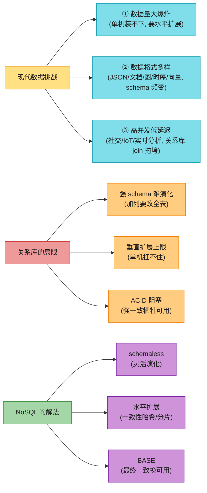
```mermaid
flowchart LR
    REQ["现代数据挑战"] --> C1["① 数据量大爆炸<br/>(单机装不下, 要水平扩展)"]
    REQ --> C2["② 数据格式多样<br/>(JSON/文档/图/时序/向量, schema 频变)"]
    REQ --> C3["③ 高并发低延迟<br/>(社交/IoT/实时分析, 关系库 join 拖垮)"]

    REL["关系库的局限"] --> L1["强 schema 难演化<br/>(加列要改全表)"]
    REL --> L2["垂直扩展上限<br/>(单机扛不住)"]
    REL --> L3["ACID 阻塞<br/>(强一致牺牲可用)"]

    NOSQL["NoSQL 的解法"] --> N1["schemaless<br/>(灵活演化)"]
    NOSQL --> N2["水平扩展<br/>(一致性哈希/分片)"]
    NOSQL --> N3["BASE<br/>(最终一致换可用)"]

    style REQ fill:#FFE082,stroke:#F9A825,color:#1f1f1f
    style C1 fill:#80DEEA,stroke:#0097A7,color:#1f1f1f
    style C2 fill:#80DEEA,stroke:#0097A7,color:#1f1f1f
    style C3 fill:#80DEEA,stroke:#0097A7,color:#1f1f1f
    style REL fill:#EF9A9A,stroke:#C62828,color:#1f1f1f
    style L1 fill:#FFCC80,stroke:#F57C00,color:#1f1f1f
    style L2 fill:#FFCC80,stroke:#F57C00,color:#1f1f1f
    style L3 fill:#FFCC80,stroke:#F57C00,color:#1f1f1f
    style NOSQL fill:#A5D6A7,stroke:#388E3C,color:#1f1f1f
    style N1 fill:#CE93D8,stroke:#7B1FA2,color:#1f1f1f
    style N2 fill:#CE93D8,stroke:#7B1FA2,color:#1f1f1f
    style N3 fill:#CE93D8,stroke:#7B1FA2,color:#1f1f1f
```

> 💡 **核心心智**:NoSQL **不是"关系库的替代"**,而是**"针对特定数据/访问模式优化的工具箱"**。原书结尾的比喻很妙:数据库像工具箱,**钉子用锤子,拧螺丝用螺丝刀**——别想"一个工具干所有活"。现代系统常**多库混用**:关系库存交易,DynamoDB 存购物车,Redis 存会话,Elasticsearch 存搜索,Milvus 存向量。

---

## 2. 非关系数据库概念(NoSQL Concepts)

### 2.1 Schema 灵活性(Schema Flexibility)⭐⭐⭐⭐

关系库**强制固定 schema**(加列要改全表,DDL 期间可能锁表);NoSQL **schemaless**——不同记录可以**有不同字段**。一个 `products` 集合里,有的商品有 `weight`,有的有 `dimensions`,有的有 `color`,**互不影响**。

> 🪤 **追问陷阱**:"schemaless 是不是完全没 schema?" → **不是**。是**应用层 schema**(代码定义结构)替代**数据库层 schema**。好处是灵活演化,坏处是**数据完整性约束落到应用层**,容易出"脏数据"。MongoDB 后来也加了**schema validation**(可选),所以是"软 schema"。

### 2.2 数据模型(四大类 + 2026 第五类)⭐⭐⭐⭐⭐

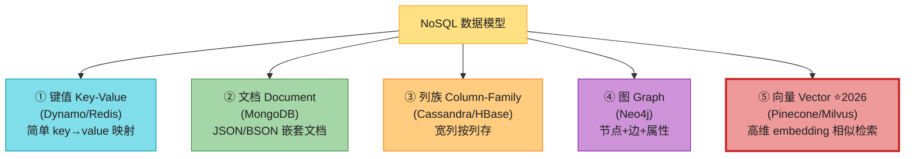
```mermaid
flowchart TD
    NOSQL["NoSQL 数据模型"] --> KV["① 键值 Key-Value<br/>(Dynamo/Redis)<br/>简单 key→value 映射"]
    NOSQL --> DOC["② 文档 Document<br/>(MongoDB)<br/>JSON/BSON 嵌套文档"]
    NOSQL --> COL["③ 列族 Column-Family<br/>(Cassandra/HBase)<br/>宽列按列存"]
    NOSQL --> GRAPH["④ 图 Graph<br/>(Neo4j)<br/>节点+边+属性"]
    NOSQL --> VEC["⑤ 向量 Vector ⭐2026<br/>(Pinecone/Milvus)<br/>高维 embedding 相似检索"]

    style NOSQL fill:#FFE082,stroke:#F9A825,color:#1f1f1f
    style KV fill:#80DEEA,stroke:#0097A7,color:#1f1f1f
    style DOC fill:#A5D6A7,stroke:#388E3C,color:#1f1f1f
    style COL fill:#FFCC80,stroke:#F57C00,color:#1f1f1f
    style GRAPH fill:#CE93D8,stroke:#7B1FA2,color:#1f1f1f
    style VEC fill:#EF9A9A,stroke:#C62828,color:#1f1f1f,stroke-width:3px
```

> 📝 **原书只讲前四类**。**2026 必须补第五类——向量库**(见后文增量)。原书结论提了 Milvus 但没展开。**向量库是 RAG/AI 时代 NoSQL 最大的版图扩张**,面试讲出来直接拉开档次。

### 2.3 可扩展性(水平扩展)⭐⭐⭐⭐

NoSQL 为**水平扩展(horizontally scalable)**而生——数据通过 **sharding + replication** 分布到多节点。关系库垂直扩展撞单机上限后,水平分库分表极难(跨库 join/事务);NoSQL 从设计上就是分布式的,**加机器即扩容**。

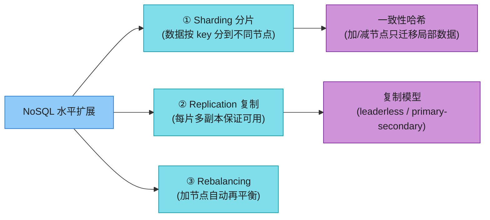
```mermaid
flowchart LR
    SCALE["NoSQL 水平扩展"] --> SHARD["① Sharding 分片<br/>(数据按 key 分到不同节点)"]
    SCALE --> REPL["② Replication 复制<br/>(每片多副本保证可用)"]
    SCALE --> REBAL["③ Rebalancing<br/>(加节点自动再平衡)"]

    SHARD --> CONS["一致性哈希<br/>(加/减节点只迁移局部数据)"]
    REPL --> MODEL["复制模型<br/>(leaderless / primary-secondary)"]

    style SCALE fill:#90CAF9,stroke:#1976D2,color:#1f1f1f
    style SHARD fill:#80DEEA,stroke:#0097A7,color:#1f1f1f
    style REPL fill:#80DEEA,stroke:#0097A7,color:#1f1f1f
    style REBAL fill:#80DEEA,stroke:#0097A7,color:#1f1f1f
    style CONS fill:#CE93D8,stroke:#7B1FA2,color:#1f1f1f
    style MODEL fill:#CE93D8,stroke:#7B1FA2,color:#1f1f1f
```

### 2.4 高可用与容错(High Availability & Fault Tolerance)⭐⭐⭐⭐

NoSQL **优先可用性**——通过冗余(replication)+ 容错(failover/修复机制),在硬件故障、网络分区下仍可响应。**关系库多走 CP(强一致)路线,而 NoSQL 多走 AP(高可用)+ 最终一致**。

### 2.5 BASE 属性 ⭐⭐⭐⭐⭐(本章核心概念之一)

> 📝 **BASE 是 ACID 的对照**。Ch2 讲关系库 **ACID**(原子/一致/隔离/持久),Ch3 讲 NoSQL **BASE**。**二者是 Ch1 一致性谱系(强一致 vs 最终一致)在存储层的两极落地**。

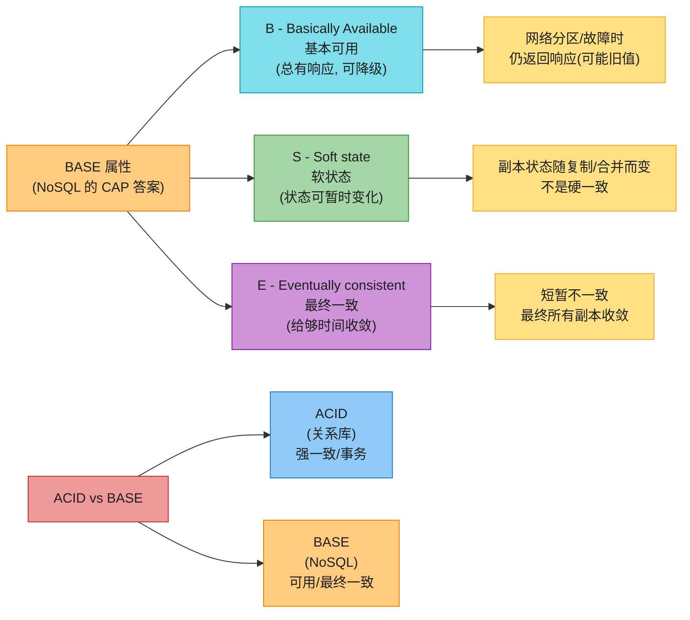
```mermaid
flowchart LR
    BASE["BASE 属性<br/>(NoSQL 的 CAP 答案)"] --> BA["B - Basically Available<br/>基本可用<br/>(总有响应, 可降级)"]
    BASE --> SS["S - Soft state<br/>软状态<br/>(状态可暂时变化)"]
    BASE --> EC["E - Eventually consistent<br/>最终一致<br/>(给够时间收敛)"]

    BA --> EX1["网络分区/故障时<br/>仍返回响应(可能旧值)"]
    SS --> EX2["副本状态随复制/合并而变<br/>不是硬一致"]
    EC --> EX3["短暂不一致<br/>最终所有副本收敛"]

    CONTRAST["ACID vs BASE"] --> ACID["ACID<br/>(关系库)<br/>强一致/事务"]
    CONTRAST --> BASE2["BASE<br/>(NoSQL)<br/>可用/最终一致"]

    style BASE fill:#FFCC80,stroke:#F57C00,color:#1f1f1f
    style BA fill:#80DEEA,stroke:#0097A7,color:#1f1f1f
    style SS fill:#A5D6A7,stroke:#388E3C,color:#1f1f1f
    style EC fill:#CE93D8,stroke:#7B1FA2,color:#1f1f1f
    style EX1 fill:#FFE082,stroke:#F9A825,color:#1f1f1f
    style EX2 fill:#FFE082,stroke:#F9A825,color:#1f1f1f
    style EX3 fill:#FFE082,stroke:#F9A825,color:#1f1f1f
    style CONTRAST fill:#EF9A9A,stroke:#C62828,color:#1f1f1f
    style ACID fill:#90CAF9,stroke:#1976D2,color:#1f1f1f
    style BASE2 fill:#FFCC80,stroke:#F57C00,color:#1f1f1f
```

| 字母 | 全称 | 含义 |
|------|------|------|
| **BA** | Basically Available | 即使分区/故障也保证基本响应(可降级,牺牲一致) |
| **S** | Soft state | 系统状态随复制/合并而变化(不是硬一致) |
| **E** | Eventually consistent | 短暂不一致,最终所有副本收敛 |

> 💡 **BASE 适合什么场景(背)**:**社交 timeline、购物车、会话、计数器、CDN、推荐**——这些**容忍短暂不一致**,但要**永远可用**。反之**金融交易、账户余额**必须 ACID(关系库)。

> 🪤 **追问陷阱**:"BASE 和 Ch1 的最终一致什么关系?" → **BASE 的 E(Eventually consistent)就是 Ch1 一致性谱系里"最终一致"那一极在 NoSQL 的落地**。B 和 S 是配套:为了可用(B)而接受软状态(S),代价就是最终一致(E)。**BASE 是 NoSQL 如何导航 CAP 权衡的具体答案**——选 AP,接受最终一致。

> 🔄 **2026 现代话术**:"原书把 BASE 当 NoSQL 的通用答案。但 2026 真相更微妙:**很多 NoSQL 现在也支持强一致/事务**(DynamoDB 2022 原生事务、MongoDB 多文档 ACID 事务、FoundationDB 严格 ACID)。**BASE 不是 NoSQL 的宿命,而是默认档位**——需要时可调到强一致,代价是延迟/可用性。这正是 Ch1 PACELC 的核心:**不是三选二,是延迟-一致连续谱**。"

---

## 3. 键值数据库(Key-Value Stores)⭐⭐⭐⭐⭐

键值库是最简单也最基础的 NoSQL——**用分布式哈希表(DHT)把唯一 key 映射到 value**。value 可以是字符串、数字、二进制、JSON。**简单 = 快**——KV 是所有 NoSQL 里读写最快、扩展最自然的。

### 3.1 数据模型

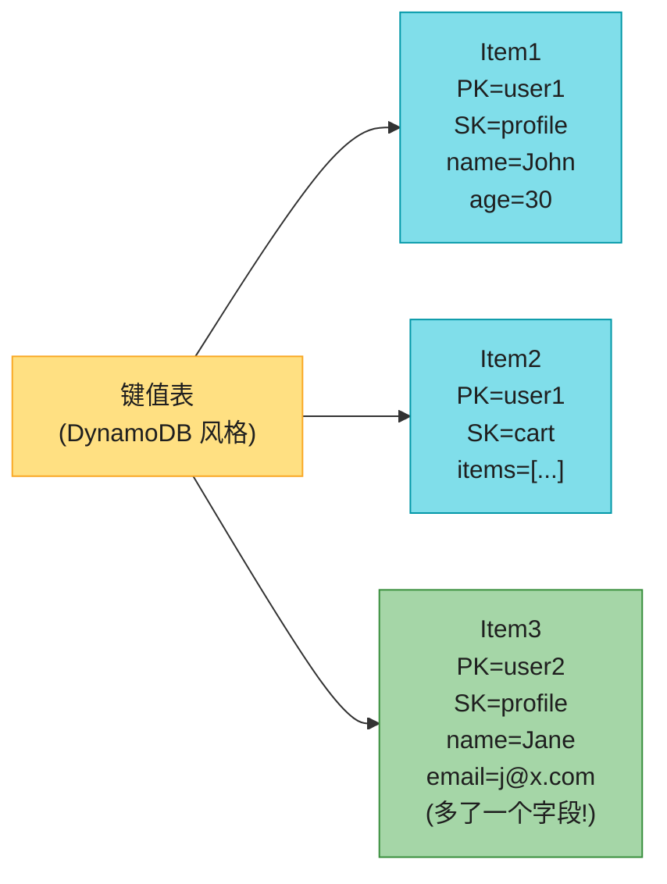
```mermaid
flowchart LR
    TABLE["键值表<br/>(DynamoDB 风格)"] --> ITEM["Item1<br/>PK=user1<br/>SK=profile<br/>name=John<br/>age=30"]
    TABLE --> ITEM2["Item2<br/>PK=user1<br/>SK=cart<br/>items=[...]"]
    TABLE --> ITEM3["Item3<br/>PK=user2<br/>SK=profile<br/>name=Jane<br/>email=j@x.com<br/>(多了一个字段!)"]

    style TABLE fill:#FFE082,stroke:#F9A825,color:#1f1f1f
    style ITEM fill:#80DEEA,stroke:#0097A7,color:#1f1f1f
    style ITEM2 fill:#80DEEA,stroke:#0097A7,color:#1f1f1f
    style ITEM3 fill:#A5D6A7,stroke:#388E3C,color:#1f1f1f
```

**两个关键特性**:
1. **无固定 schema/索引**:不同 item 可以有**不同字段**(schemaless)。索引主要靠 key,复杂二级索引有限。
2. **三种 key**(背):

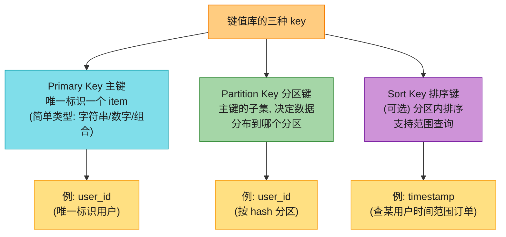
```mermaid
flowchart TD
    KEYS["键值库的三种 key"] --> PK["Primary Key 主键<br/>唯一标识一个 item<br/>(简单类型: 字符串/数字/组合)"]
    KEYS --> PART["Partition Key 分区键<br/>主键的子集, 决定数据<br/>分布到哪个分区"]
    KEYS --> SORT["Sort Key 排序键<br/>(可选) 分区内排序<br/>支持范围查询"]

    PK --> EX["例: user_id<br/>(唯一标识用户)"]
    PART --> EX2["例: user_id<br/>(按 hash 分区)"]
    SORT --> EX3["例: timestamp<br/>(查某用户时间范围订单)"]

    style KEYS fill:#FFCC80,stroke:#F57C00,color:#1f1f1f
    style PK fill:#80DEEA,stroke:#0097A7,color:#1f1f1f
    style PART fill:#A5D6A7,stroke:#388E3C,color:#1f1f1f
    style SORT fill:#CE93D8,stroke:#7B1FA2,color:#1f1f1f
    style EX fill:#FFE082,stroke:#F9A825,color:#1f1f1f
    style EX2 fill:#FFE082,stroke:#F9A825,color:#1f1f1f
    style EX3 fill:#FFE082,stroke:#F9A825,color:#1f1f1f
```

> 💡 **分区键选型(高频考点)**:分区键要选**高基数**列(值很多样),保证数据均匀分布,**避免热点**。如果按 `status`(只有 active/inactive)分区 → 90% 数据挤到 active 分区 → 热点。

> 🪤 **追问陷阱**:"主键、分区键、排序键什么关系?" → **分区键是主键的一部分**(也可能 = 主键)。主键 = 分区键(+ 可选排序键)。**分区键决定数据在哪个节点**(hash 分区),**排序键决定分区内顺序**(支持范围查询)。DynamoDB 主键可以是单纯分区键(只点查),也可以是分区键+排序键(可范围查)。

### 3.2 数据访问与检索操作

| 操作 | 作用 |
|------|------|
| **GetItem** | 按主键取一个 item;不存在返回空 |
| **PutItem** | 插入新 item;若 key 存在则**替换** |
| **UpdateItem** | 修改现有 item;不存在则**新建**(增/改/删属性) |
| **DeleteItem** | 按主键删除;不存在则无操作 |

> 📝 **注意**:这些是**基于 key 的操作**,没有复杂 join。范围查询靠 sort key。跨 key 的事务在经典 KV 里很难(分布式),需要应用层协调或用支持事务的 KV(如 FoundationDB/DynamoDB 事务)。

### 3.3 扩展键值库:Leaderless 复制 + 一致性哈希 ⭐⭐⭐⭐⭐

> 📝 **本节是 SDE-Vol1 Ch6 设计键值存储的精华,这里提炼,Ch6 那边是完整推导**。两章交叉引用。

#### 3.3.1 Leaderless 复制(无主复制)

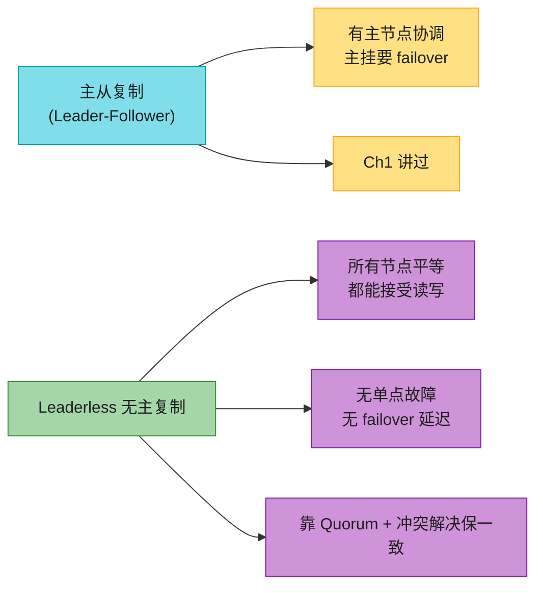
```mermaid
flowchart LR
    LEADER["主从复制<br/>(Leader-Follower)"] --> L1["有主节点协调<br/>主挂要 failover"]
    LEADER --> L2["Ch1 讲过"]

    LEADERLESS["Leaderless 无主复制"] --> NL1["所有节点平等<br/>都能接受读写"]
    LEADERLESS --> NL2["无单点故障<br/>无 failover 延迟"]
    LEADERLESS --> NL3["靠 Quorum + 冲突解决保一致"]

    style LEADER fill:#80DEEA,stroke:#0097A7,color:#1f1f1f
    style L1 fill:#FFE082,stroke:#F9A825,color:#1f1f1f
    style L2 fill:#FFE082,stroke:#F9A825,color:#1f1f1f
    style LEADERLESS fill:#A5D6A7,stroke:#388E3C,color:#1f1f1f
    style NL1 fill:#CE93D8,stroke:#7B1FA2,color:#1f1f1f
    style NL2 fill:#CE93D8,stroke:#7B1FA2,color:#1f1f1f
    style NL3 fill:#CE93D8,stroke:#7B1FA2,color:#1f1f1f
```

**Leaderless 的核心**(背):
- 数据分片,每片**多副本**复制到多节点。
- 客户端可向**任意节点**读写,无需知道谁是 leader。
- 一致性靠 **Quorum**(W+R>N)+ 冲突解决(**向量时钟**理论 / **LWW** 现实 / **Merkle 树**反熵)。

> 💡 **Dynamo 论文用 leaderless,但 DynamoDB 实际用 leader-follower**(原书特别提到)。原因:leaderless 强一致更难,leader-follower 在主内串行化更简单可控。所以**Dynamo(论文)≠ DynamoDB(产品)**——这是个常见混淆点。

#### 3.3.2 一致性哈希(Consistent Hashing)⭐⭐⭐⭐⭐

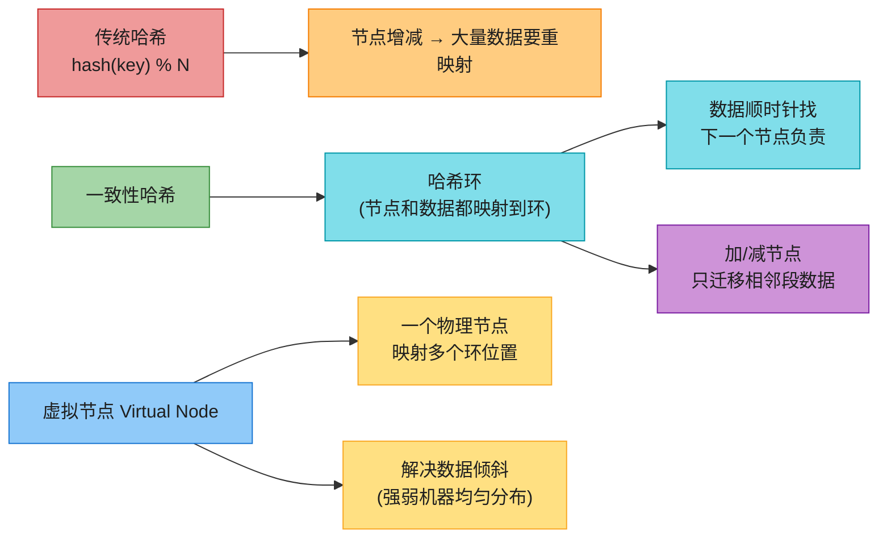
```mermaid
flowchart LR
    TRAD["传统哈希<br/>hash(key) % N"] --> PROB["节点增减 → 大量数据要重映射"]
    CONS["一致性哈希"] --> RING["哈希环<br/>(节点和数据都映射到环)"]
    RING --> RULE["数据顺时针找<br/>下一个节点负责"]
    RING --> BEN["加/减节点<br/>只迁移相邻段数据"]

    VNODE["虚拟节点 Virtual Node"] --> V1["一个物理节点<br/>映射多个环位置"]
    VNODE --> V2["解决数据倾斜<br/>(强弱机器均匀分布)"]

    style TRAD fill:#EF9A9A,stroke:#C62828,color:#1f1f1f
    style PROB fill:#FFCC80,stroke:#F57C00,color:#1f1f1f
    style CONS fill:#A5D6A7,stroke:#388E3C,color:#1f1f1f
    style RING fill:#80DEEA,stroke:#0097A7,color:#1f1f1f
    style RULE fill:#80DEEA,stroke:#0097A7,color:#1f1f1f
    style BEN fill:#CE93D8,stroke:#7B1FA2,color:#1f1f1f
    style VNODE fill:#90CAF9,stroke:#1976D2,color:#1f1f1f
    style V1 fill:#FFE082,stroke:#F9A825,color:#1f1f1f
    style V2 fill:#FFE082,stroke:#F9A825,color:#1f1f1f
```

**核心收益**(背):
1. **加/减节点只影响相邻段**:不像传统 `hash % N` 全部重映射。
2. **负载均衡**:数据环上均匀分布。
3. **虚拟节点**:每物理机映射多个环位置,**解决强弱机器不均**(强机分配更多 vnode)。

> 🔗 **手算和详细推导见 SDE-Vol1 Ch6**。本章是四大类全谱,不重复。

### 3.4 键值库的可用性机制 ⭐⭐⭐⭐⭐

> 📝 **这一节是 KV 部分的精华,常考"分布式 KV 怎么保证可用性"**。四个机制要数全。

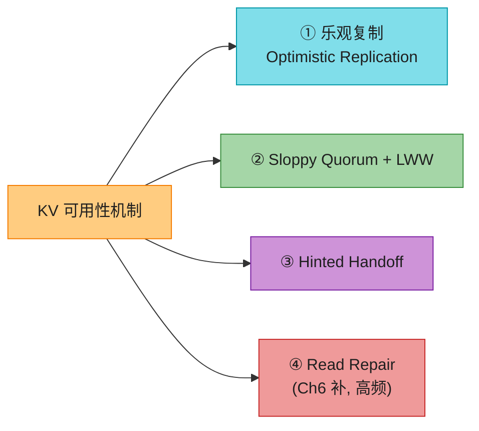
```mermaid
flowchart LR
    AVAIL["KV 可用性机制"] --> OPT["① 乐观复制<br/>Optimistic Replication"]
    AVAIL --> SLOPPY["② Sloppy Quorum + LWW"]
    AVAIL --> HINT["③ Hinted Handoff"]
    AVAIL --> REPAIR["④ Read Repair<br/>(Ch6 补, 高频)"]

    style AVAIL fill:#FFCC80,stroke:#F57C00,color:#1f1f1f
    style OPT fill:#80DEEA,stroke:#0097A7,color:#1f1f1f
    style SLOPPY fill:#A5D6A7,stroke:#388E3C,color:#1f1f1f
    style HINT fill:#CE93D8,stroke:#7B1FA2,color:#1f1f1f
    style REPAIR fill:#EF9A9A,stroke:#C62828,color:#1f1f1f
```

#### ① 乐观复制(Optimistic Replication)

写操作**异步传播到副本**,不等所有副本 ack 就认为成功。降低延迟、即使部分副本不可用仍可写。代价:临时不一致,靠后台同步收敛。

#### ② Sloppy Quorum + LWW(Last Write Wins)

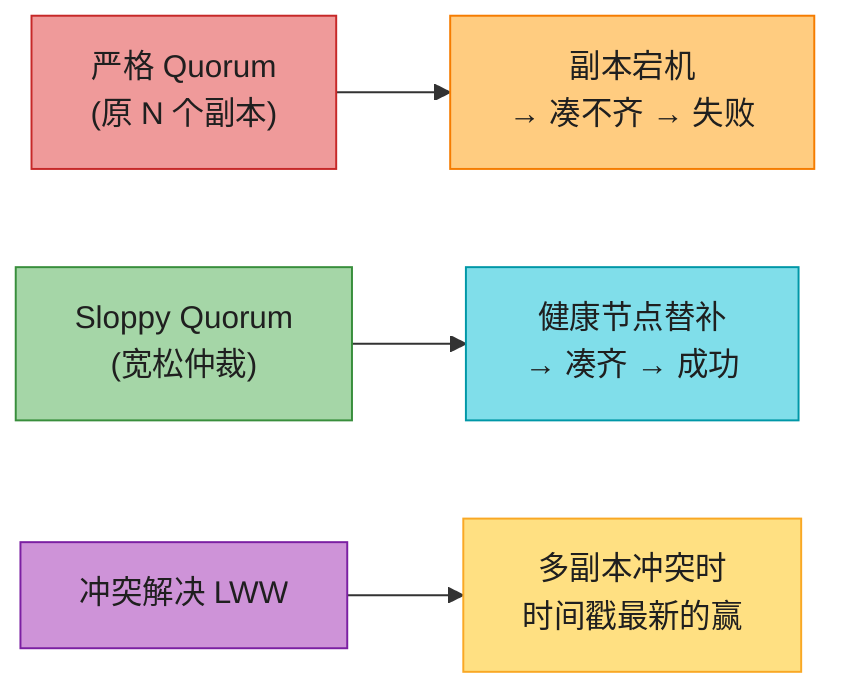
```mermaid
flowchart LR
    STRICT["严格 Quorum<br/>(原 N 个副本)"] --> S_FAIL["副本宕机<br/>→ 凑不齐 → 失败"]
    SLOPPY["Sloppy Quorum<br/>(宽松仲裁)"] --> SL_OK["健康节点替补<br/>→ 凑齐 → 成功"]
    LWW["冲突解决 LWW"] --> LWW1["多副本冲突时<br/>时间戳最新的赢"]

    style STRICT fill:#EF9A9A,stroke:#C62828,color:#1f1f1f
    style S_FAIL fill:#FFCC80,stroke:#F57C00,color:#1f1f1f
    style SLOPPY fill:#A5D6A7,stroke:#388E3C,color:#1f1f1f
    style SL_OK fill:#80DEEA,stroke:#0097A7,color:#1f1f1f
    style LWW fill:#CE93D8,stroke:#7B1FA2,color:#1f1f1f
    style LWW1 fill:#FFE082,stroke:#F9A825,color:#1f1f1f
```

> 🪤 **追问陷阱**:"LWW 不就丢数据吗?" → **是**。LWW 会丢并发写里"输"的那个。所以**只适合值可覆盖的场景**(状态、最后修改时间)。敏感数据用 **CRDT**(无冲突复制数据类型)或应用层合并。DynamoDB 默认 LWW。

#### ③ Hinted Handoff(提示移交)

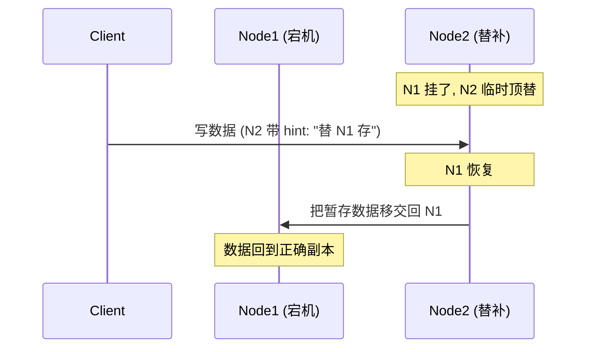
```mermaid
sequenceDiagram
    participant C as Client
    participant N1 as Node1 (宕机)
    participant N2 as Node2 (替补)
    Note over N2: N1 挂了, N2 临时顶替
    C->>N2: 写数据 (N2 带 hint: "替 N1 存")
    Note over N2: N1 恢复
    N2->>N1: 把暂存数据移交回 N1
    Note over N1: 数据回到正确副本
```

**机制**:目标副本不可用时,写**暂存到替补节点**(带 hint 备注这是替谁存的);目标恢复后**自动移交**。保证可用 + 不丢数据。

#### ④ Read Repair(读修复)— Ch6 补,高频

> 📝 **原书 KV 部分没单独讲 read repair,但 Dynamo/Cassandra 有三种副本修复机制**,面试常考"怎么修",要会数全:

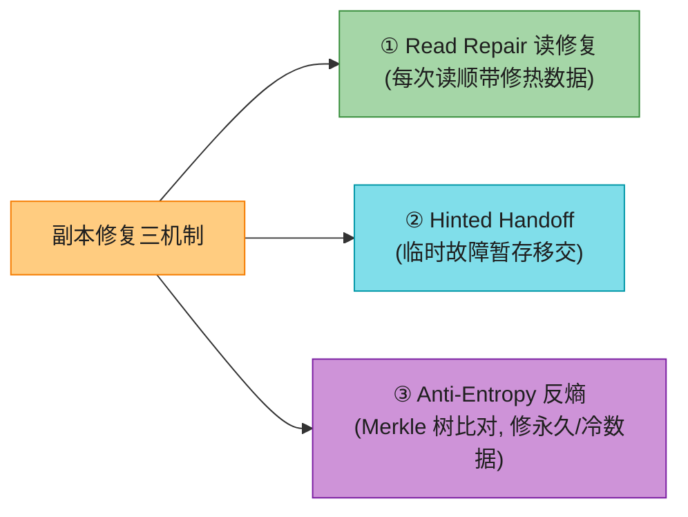
```mermaid
flowchart LR
    REPAIR["副本修复三机制"] --> R1["① Read Repair 读修复<br/>(每次读顺带修热数据)"]
    REPAIR --> R2["② Hinted Handoff<br/>(临时故障暂存移交)"]
    REPAIR --> R3["③ Anti-Entropy 反熵<br/>(Merkle 树比对, 修永久/冷数据)"]

    style REPAIR fill:#FFCC80,stroke:#F57C00,color:#1f1f1f
    style R1 fill:#A5D6A7,stroke:#388E3C,color:#1f1f1f
    style R2 fill:#80DEEA,stroke:#0097A7,color:#1f1f1f
    style R3 fill:#CE93D8,stroke:#7B1FA2,color:#1f1f1f
```

**读修复**:coordinator 读 R 个副本时,发现某副本版本旧 → **顺手把最新值回写过去**。最轻量、最频繁——只对被读到的热 key 有效;冷 key 靠 Merkle 反熵兜底。

> 🪤 **追问陷阱**:"副本不一致怎么自动修?" → **三机制**:① 读修复(读时回写旧副本,修热数据);② hinted handoff(临时故障暂存,恢复移交);③ Merkle 反熵(永久故障,按差异桶同步,修冷数据)。三者配合。

### 3.5 KV 优劣与适用场景

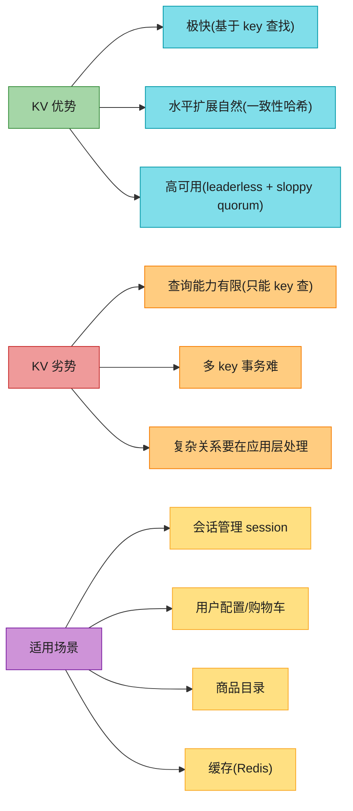
```mermaid
flowchart LR
    PROS["KV 优势"] --> P1["极快(基于 key 查找)"]
    PROS --> P2["水平扩展自然(一致性哈希)"]
    PROS --> P3["高可用(leaderless + sloppy quorum)"]
    CONS["KV 劣势"] --> C1["查询能力有限(只能 key 查)"]
    CONS --> C2["多 key 事务难"]
    CONS --> C3["复杂关系要在应用层处理"]

    USE["适用场景"] --> U1["会话管理 session"]
    USE --> U2["用户配置/购物车"]
    USE --> U3["商品目录"]
    USE --> U4["缓存(Redis)"]

    style PROS fill:#A5D6A7,stroke:#388E3C,color:#1f1f1f
    style P1 fill:#80DEEA,stroke:#0097A7,color:#1f1f1f
    style P2 fill:#80DEEA,stroke:#0097A7,color:#1f1f1f
    style P3 fill:#80DEEA,stroke:#0097A7,color:#1f1f1f
    style CONS fill:#EF9A9A,stroke:#C62828,color:#1f1f1f
    style C1 fill:#FFCC80,stroke:#F57C00,color:#1f1f1f
    style C2 fill:#FFCC80,stroke:#F57C00,color:#1f1f1f
    style C3 fill:#FFCC80,stroke:#F57C00,color:#1f1f1f
    style USE fill:#CE93D8,stroke:#7B1FA2,color:#1f1f1f
    style U1 fill:#FFE082,stroke:#F9A825,color:#1f1f1f
    style U2 fill:#FFE082,stroke:#F9A825,color:#1f1f1f
    style U3 fill:#FFE082,stroke:#F9A825,color:#1f1f1f
    style U4 fill:#FFE082,stroke:#F9A825,color:#1f1f1f
```

### 3.6 Dynamo:KV 代表

**Dynamo** 是 Amazon 为**购物车服务**开发的高可用 KV——为应对黑色星期五级流量,优先可用性。**Dynamo 本身不开源**,但其论文影响了 Riak、Voldemort、Dynomite 等开源实现。

| 特性 | Dynamo |
|------|--------|
| 数据模型 | 简单 key-value,value 是任意二进制 |
| 一致性 | tunable eventual consistency(可调最终一致) |
| 查询语言 | 无内置查询语言,只 key 操作 |
| 高可用 | 优先(sloppy quorum + hinted handoff) |
| 扩展 | 水平(一致性哈希 + commodity 硬件) |

> 📝 **AWS DynamoDB 是 Dynamo 论文的演化产品**(托管、serverless)。详见 Ch10。**注意:DynamoDB 实际用 leader-follower,不是论文里的 leaderless**。

> 🔗 **KV 的深入推导(向量时钟、Quorum 手算、Gossip、Merkle 树、LSM 读写路径)见 SDE-Vol1 Ch6**。本章四大类全谱,KV 部分点到为止,深入在那章。

---

## 4. 文档数据库(Document Stores)⭐⭐⭐⭐

文档库存储**半结构化文档**(JSON/BSON/XML),支持**嵌套结构、数组、动态字段**。如果说 KV 是"扁平的 key-value",文档库就是"**嵌套的、自描述的** key-value"。

### 4.1 数据模型

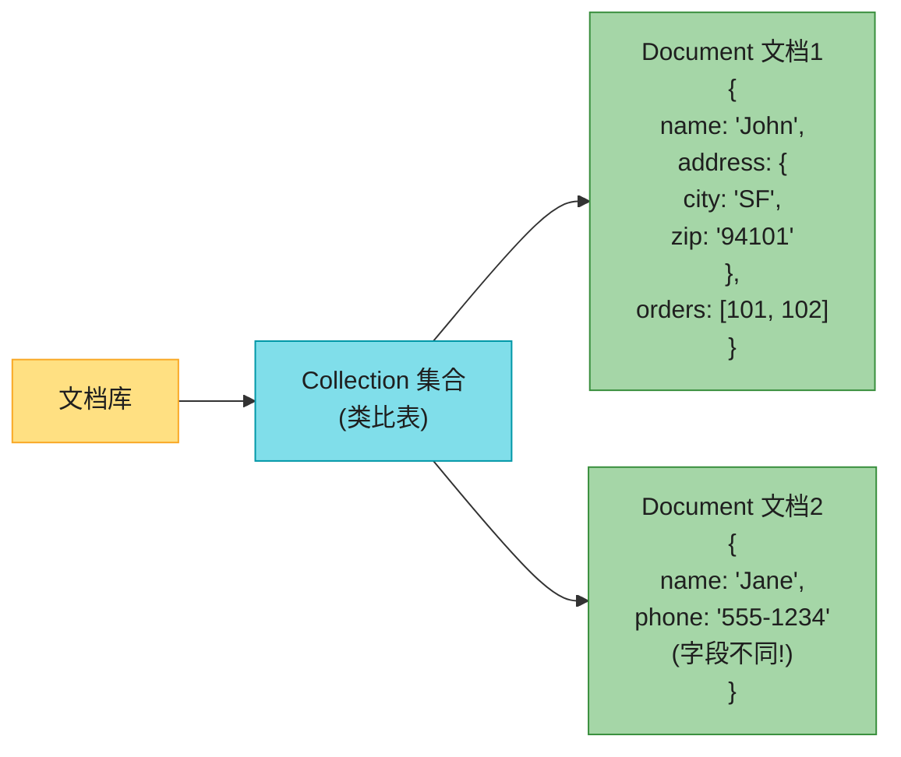
```mermaid
flowchart LR
    DB["文档库"] --> COLL["Collection 集合<br/>(类比表)"]
    COLL --> DOC1["Document 文档1<br/>{<br/>  name: 'John',<br/>  address: {<br/>    city: 'SF',<br/>    zip: '94101'<br/>  },<br/>  orders: [101, 102]<br/>}"]
    COLL --> DOC2["Document 文档2<br/>{<br/>  name: 'Jane',<br/>  phone: '555-1234'<br/>  (字段不同!)<br/>}"]

    style DB fill:#FFE082,stroke:#F9A825,color:#1f1f1f
    style COLL fill:#80DEEA,stroke:#0097A7,color:#1f1f1f
    style DOC1 fill:#A5D6A7,stroke:#388E3C,color:#1f1f1f
    style DOC2 fill:#A5D6A7,stroke:#388E3C,color:#1f1f1f
```

**核心组件**:

| 组件 | 作用 |
|------|------|
| **Collection 集合** | 容器,放相关文档(类比表) |
| **Document 文档** | 基本单位,JSON 结构,**可嵌套字段/数组**,**不同文档可有不同字段** |
| **Operators 操作符** | Insert/Update/Delete/Query/Aggregation |
| **Projection 投影** | 只取需要的字段,**减少网络传输** |

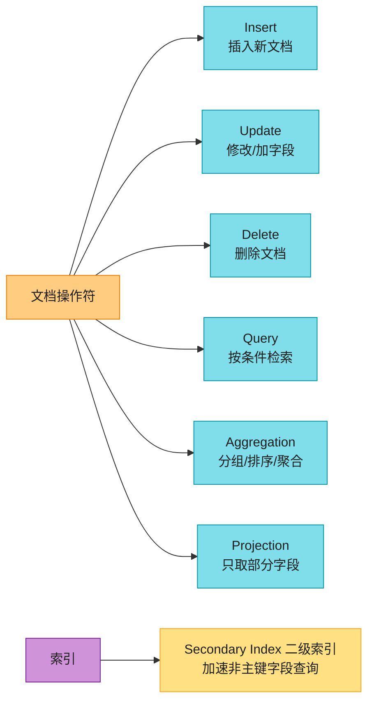
```mermaid
flowchart LR
    OPS["文档操作符"] --> INS["Insert<br/>插入新文档"]
    OPS --> UPD["Update<br/>修改/加字段"]
    OPS --> DEL["Delete<br/>删除文档"]
    OPS --> QRY["Query<br/>按条件检索"]
    OPS --> AGG["Aggregation<br/>分组/排序/聚合"]
    OPS --> PRJ["Projection<br/>只取部分字段"]

    IDX["索引"] --> SEC["Secondary Index 二级索引<br/>加速非主键字段查询"]

    style OPS fill:#FFCC80,stroke:#F57C00,color:#1f1f1f
    style INS fill:#80DEEA,stroke:#0097A7,color:#1f1f1f
    style UPD fill:#80DEEA,stroke:#0097A7,color:#1f1f1f
    style DEL fill:#80DEEA,stroke:#0097A7,color:#1f1f1f
    style QRY fill:#80DEEA,stroke:#0097A7,color:#1f1f1f
    style AGG fill:#80DEEA,stroke:#0097A7,color:#1f1f1f
    style PRJ fill:#80DEEA,stroke:#0097A7,color:#1f1f1f
    style IDX fill:#CE93D8,stroke:#7B1FA2,color:#1f1f1f
    style SEC fill:#FFE082,stroke:#F9A825,color:#1f1f1f
```

> 💡 **文档库 vs KV**:文档库**比 KV 多了二级索引 + 丰富查询**(按非主键字段查、聚合、投影)。代价是更复杂、稍慢。**MongoDB 是文档库标杆**。

### 4.2 文档库可用性:复制集(Replica Set)⭐⭐⭐⭐⭐

> 📝 **这一节是文档库部分的精华**。MongoDB 的复制集机制是面试高频。

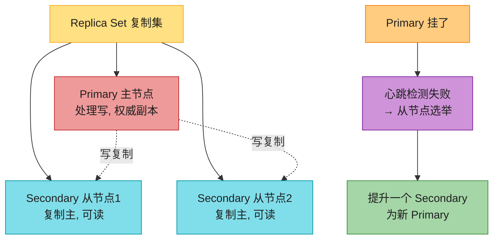
```mermaid
flowchart TD
    RS["Replica Set 复制集"] --> PRI["Primary 主节点<br/>处理写, 权威副本"]
    RS --> SEC1["Secondary 从节点1<br/>复制主, 可读"]
    RS --> SEC2["Secondary 从节点2<br/>复制主, 可读"]

    PRI -.->|"写复制"| SEC1
    PRI -.->|"写复制"| SEC2

    FAIL["Primary 挂了"] --> ELECTION["心跳检测失败<br/>→ 从节点选举"]
    ELECTION --> NEW["提升一个 Secondary<br/>为新 Primary"]

    style RS fill:#FFE082,stroke:#F9A825,color:#1f1f1f
    style PRI fill:#EF9A9A,stroke:#C62828,color:#1f1f1f
    style SEC1 fill:#80DEEA,stroke:#0097A7,color:#1f1f1f
    style SEC2 fill:#80DEEA,stroke:#0097A7,color:#1f1f1f
    style FAIL fill:#FFCC80,stroke:#F57C00,color:#1f1f1f
    style ELECTION fill:#CE93D8,stroke:#7B1FA2,color:#1f1f1f
    style NEW fill:#A5D6A7,stroke:#388E3C,color:#1f1f1f
```

**三个机制**(背):

| 机制 | 作用 |
|------|------|
| **Replica Set 复制集** | 一组节点持有多副本;**1 个 Primary + N 个 Secondary**;Primary 挂自动 failover |
| **Primary-Secondary 集群** | Primary 接写 + 权威副本;Secondary 复制 + 读分流;**读可扩展** |
| **Heartbeat 心跳** | 节点间定期心跳;超时判定不可用;**触发选举提升新主** |

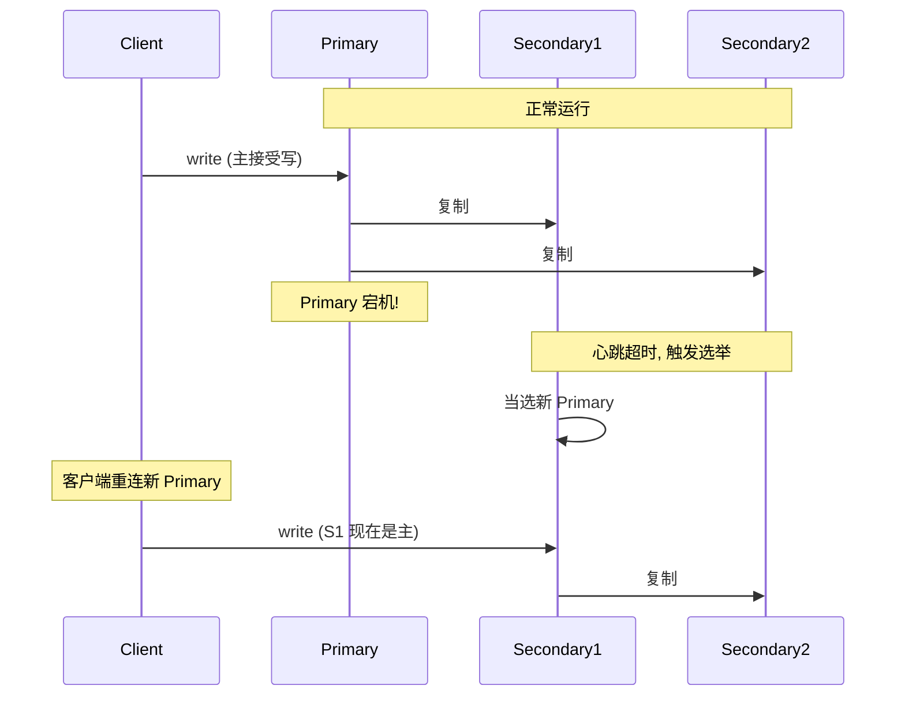
```mermaid
sequenceDiagram
    participant C as Client
    participant P as Primary
    participant S1 as Secondary1
    participant S2 as Secondary2
    Note over P,S2: 正常运行
    C->>P: write (主接受写)
    P->>S1: 复制
    P->>S2: 复制
    Note over P: Primary 宕机!
    Note over S1,S2: 心跳超时, 触发选举
    S1->>S1: 当选新 Primary
    Note over C: 客户端重连新 Primary
    C->>S1: write (S1 现在是主)
    S1->>S2: 复制
```

> 🪤 **追问陷阱(高频)**:"文档库 Primary 挂了数据会丢吗?" → **可能丢"未复制的最新写"**。Primary 接受写后异步复制到 Secondary,如果还没复制完就挂了 → 那个写丢失。MongoDB 用 **writeConcern** 控制:`w:1`(主 ack 即可,可能丢)、`w:majority`(多数 ack,安全但慢)、`w:0`(不等 ack,最快最易丢)。**这是可用性和一致性的权衡**。

### 4.3 文档库优劣与适用场景

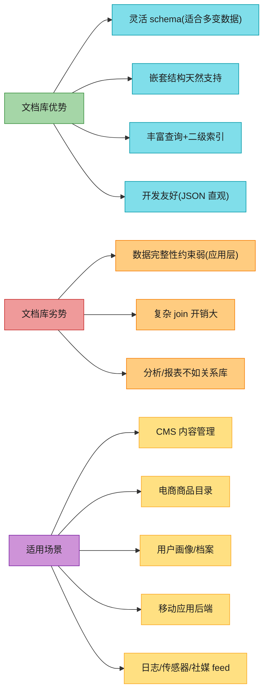
```mermaid
flowchart LR
    PROS["文档库优势"] --> P1["灵活 schema(适合多变数据)"]
    PROS --> P2["嵌套结构天然支持"]
    PROS --> P3["丰富查询+二级索引"]
    PROS --> P4["开发友好(JSON 直观)"]
    CONS["文档库劣势"] --> C1["数据完整性约束弱(应用层)"]
    CONS --> C2["复杂 join 开销大"]
    CONS --> C3["分析/报表不如关系库"]

    USE["适用场景"] --> U1["CMS 内容管理"]
    USE --> U2["电商商品目录"]
    USE --> U3["用户画像/档案"]
    USE --> U4["移动应用后端"]
    USE --> U5["日志/传感器/社媒 feed"]

    style PROS fill:#A5D6A7,stroke:#388E3C,color:#1f1f1f
    style P1 fill:#80DEEA,stroke:#0097A7,color:#1f1f1f
    style P2 fill:#80DEEA,stroke:#0097A7,color:#1f1f1f
    style P3 fill:#80DEEA,stroke:#0097A7,color:#1f1f1f
    style P4 fill:#80DEEA,stroke:#0097A7,color:#1f1f1f
    style CONS fill:#EF9A9A,stroke:#C62828,color:#1f1f1f
    style C1 fill:#FFCC80,stroke:#F57C00,color:#1f1f1f
    style C2 fill:#FFCC80,stroke:#F57C00,color:#1f1f1f
    style C3 fill:#FFCC80,stroke:#F57C00,color:#1f1f1f
    style USE fill:#CE93D8,stroke:#7B1FA2,color:#1f1f1f
    style U1 fill:#FFE082,stroke:#F9A825,color:#1f1f1f
    style U2 fill:#FFE082,stroke:#F9A825,color:#1f1f1f
    style U3 fill:#FFE082,stroke:#F9A825,color:#1f1f1f
    style U4 fill:#FFE082,stroke:#F9A825,color:#1f1f1f
    style U5 fill:#FFE082,stroke:#F9A825,color:#1f1f1f
```

### 4.4 MongoDB:文档库代表

**MongoDB** 是最流行的开源文档库,以**灵活性、性能、开发者友好**著称。

| 特性 | MongoDB |
|------|---------|
| **灵活性** | schemaless,同一集合文档可有不同结构,适应数据演化 |
| **查询语言** | 丰富,支持复杂查询/索引/聚合 |
| **多文档事务** | 支持 ACID 多文档事务(跨集合) |
| **一致性模型** | 多种可选(readConcern/writeConcern) |
| **水平扩展** | Sharding 分片,数据分布多节点 |
| **复制/高可用** | Replica Set 自动 failover |

> 📝 **AWS DocumentDB** 兼容 MongoDB API,支持 ad hoc 查询和事务(类似 DynamoDB)。详见 Ch10。

> 🔄 **2026 增量**:MongoDB 4.0+ 支持多文档 ACID 事务(原书提到但没强调这改变了文档库的定位)。**Atlas Vector Search**(2023+)让 MongoDB 也支持向量检索——文档库和向量库开始融合。

---

## 5. 列族数据库(Column-Family / Wide-Column Stores)⭐⭐⭐⭐⭐

> 📝 **列族库是本章技术密度最高的部分**。Cassandra 是标杆,其 LSM 架构(commit log → memtable → SSTable → Bloom filter → compaction)是所有 LSM 系的通用模板,**和 SDE-Vol1 Ch6 的写路径完全打通**。

列族库(也叫 wide-column store)把数据**按列族组织**,适合**海量结构化/半结构化数据 + 写密集 + 时序/分析**。

### 5.1 数据模型:列族 + 宽列

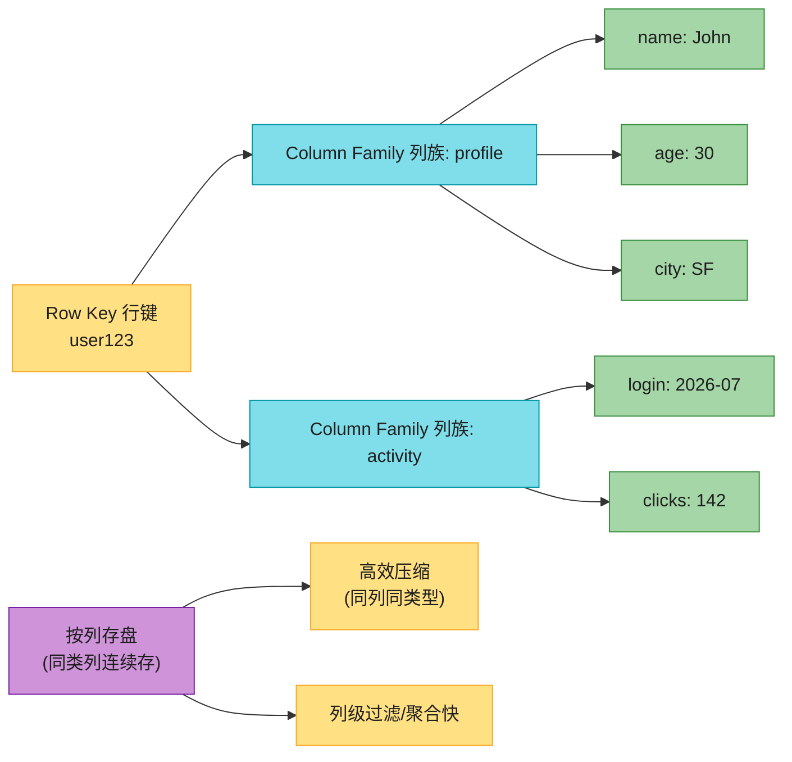
```mermaid
flowchart LR
    ROW["Row Key 行键<br/>user123"] --> CF["Column Family 列族: profile"]
    CF --> C1["name: John"]
    CF --> C2["age: 30"]
    CF --> C3["city: SF"]
    ROW --> CF2["Column Family 列族: activity"]
    CF2 --> C4["login: 2026-07"]
    CF2 --> C5["clicks: 142"]

    STORE["按列存盘<br/>(同类列连续存)"] --> ADV["高效压缩<br/>(同列同类型)"]
    STORE --> ADV2["列级过滤/聚合快"]

    style ROW fill:#FFE082,stroke:#F9A825,color:#1f1f1f
    style CF fill:#80DEEA,stroke:#0097A7,color:#1f1f1f
    style C1 fill:#A5D6A7,stroke:#388E3C,color:#1f1f1f
    style C2 fill:#A5D6A7,stroke:#388E3C,color:#1f1f1f
    style C3 fill:#A5D6A7,stroke:#388E3C,color:#1f1f1f
    style CF2 fill:#80DEEA,stroke:#0097A7,color:#1f1f1f
    style C4 fill:#A5D6A7,stroke:#388E3C,color:#1f1f1f
    style C5 fill:#A5D6A7,stroke:#388E3C,color:#1f1f1f
    style STORE fill:#CE93D8,stroke:#7B1FA2,color:#1f1f1f
    style ADV fill:#FFE082,stroke:#F9A825,color:#1f1f1f
    style ADV2 fill:#FFE082,stroke:#F9A825,color:#1f1f1f
```

**关键特性**:
1. **按列存储**(而非按行):同列数据连续存盘 → **压缩率高**(同类型)+ **列级查询快**。
2. **灵活 schema**:可独立增删列族,不需改全表。
3. **宽行**:一行可有极多列(适合时序、事件)。

### 5.2 复合主键:分区键 + 聚簇键 ⭐⭐⭐⭐

```mermaid
flowchart LR
    PK["复合主键"] --> PART["Partition Key 分区键<br/>决定数据在哪个节点"]
    PK --> CLUST["Clustering Key 聚簇键<br/>分区内排序, 支持范围查"]

    PART --> P1["选高基数列<br/>保证均匀分布"]
    CLUST --> C1["按查询模式选<br/>(如时间戳, 支持范围)"]

    style PK fill:#FFCC80,stroke:#F57C00,color:#1f1f1f
    style PART fill:#80DEEA,stroke:#0097A7,color:#1f1f1f
    style CLUST fill:#CE93D8,stroke:#7B1FA2,color:#1f1f1f
    style P1 fill:#FFE082,stroke:#F9A825,color:#1f1f1f
    style C1 fill:#FFE082,stroke:#F9A825,color:#1f1f1f
```

> 🪤 **追问陷阱**:"分区键和聚簇键怎么选?" → **分区键选高基数列**(值多样,均匀分布,避免热点);**聚簇键按查询访问模式选**(数据怎么排序/范围查就选什么,如时间戳、用户ID)。**选错分区键 → 热点;选错聚簇键 → 范围查全表扫**。

### 5.3 可调一致性(Tunable Consistency)⭐⭐⭐⭐⭐

> 📝 **这是列族库(Cassandra)的核心特性**。和 KV 的 tunable consistency 一脉相承,但 Cassandra 的级别更细。

```mermaid
flowchart TD
    CL["Consistency Level<br/>(可调一致性)"] --> ANY["ANY<br/>(最弱) 写至少1副本<br/>最高可用+低延迟"]
    CL --> ONE["ONE<br/>读写1个副本 ack"]
    CL --> QUORUM["QUORUM<br/>多数派(N/2+1)"]
    CL --> LOCAL_Q["LOCAL_QUORUM<br/>本地DC多数派"]
    CL --> EACH_Q["EACH_QUORUM<br/>每个DC都多数派"]
    CL --> ALL["ALL<br/>所有副本(最强)"]

    style CL fill:#FFE082,stroke:#F9A825,color:#1f1f1f
    style ANY fill:#EF9A9A,stroke:#C62828,color:#1f1f1f
    style ONE fill:#FFCC80,stroke:#F57C00,color:#1f1f1f
    style QUORUM fill:#80DEEA,stroke:#0097A7,color:#1f1f1f
    style LOCAL_Q fill:#80DEEA,stroke:#0097A7,color:#1f1f1f
    style EACH_Q fill:#A5D6A7,stroke:#388E3C,color:#1f1f1f
    style ALL fill:#CE93D8,stroke:#7B1FA2,color:#1f1f1f
```

| 级别 | Quorum 要求 | 一致性 | 性能 |
|------|------------|--------|------|
| **ANY** | ≥1 副本(可能只是 hint) | 最终一致(最弱) | 最高可用/低延迟 |
| **ONE** | 1 副本 ack | 弱一致 | 快 |
| **QUORUM** | 多数派(N/2+1) | 强(配合读 QUORUM) | 中 |
| **LOCAL_QUORUM** | 本地 DC 多数派 | 本地强 | 中(避免跨 DC) |
| **EACH_QUORUM** | 每个 DC 都多数派 | 多 DC 强 | 慢 |
| **ALL** | 所有副本 | 最强 | 最慢/最低可用 |

> 🪤 **追问陷阱**:"6 副本(2 DC × 3)用 QUORUM,几个 ack?" → QUORUM 是**全局多数派** = N/2+1 = 6/2+1 = 4。所以写要 4 个副本 ack。如果用 **LOCAL_QUORUM**,则是本地 DC 的多数派 = 3/2+1 = 2,避免跨 DC 延迟。

> 💡 **W+R>N 强一致**:和 KV 一样,如果写用 QUORUM、读用 QUORUM,则 W+R > N,读写集合必有交集 → 强一致。Cassandra 每次操作可独立设级别,**这是 tunable 的精髓**——按操作重要性灵活权衡。

### 5.4 列存架构(LSM 栈)⭐⭐⭐⭐⭐

> 🔗 **本节和 SDE-Vol1 Ch6 写路径/读路径完全打通**。这里讲架构,Ch6 讲推导。

```mermaid
flowchart LR
    WRITE["写请求"] --> CL["① Commit Log<br/>(顺序写盘, WAL)"]
    CL --> MT["② Memtable<br/>(内存, 有序)"]
    MT -->|"满/阈值"| SST["③ Flush 到 SSTable<br/>(磁盘, 不可变, 有序)"]
    SST --> COMPACT["④ Compaction<br/>(合并多 SSTable, 去旧版本)"]

    READ["读请求"] --> M2{"Memtable 有?"}
    M2 -->|"是"| RET1["返回"]
    M2 -->|"否"| BF["Bloom Filter"]
    BF -->|"可能在"| SST2["扫 SSTable"]
    BF -->|"肯定不在"| MISS["跳过, 查下个"]

    style WRITE fill:#FFE082,stroke:#F9A825,color:#1f1f1f
    style CL fill:#EF9A9A,stroke:#C62828,color:#1f1f1f
    style MT fill:#80DEEA,stroke:#0097A7,color:#1f1f1f
    style SST fill:#A5D6A7,stroke:#388E3C,color:#1f1f1f
    style COMPACT fill:#CE93D8,stroke:#7B1FA2,color:#1f1f1f
    style READ fill:#FFE082,stroke:#F9A825,color:#1f1f1f
    style M2 fill:#FFCC80,stroke:#F57C00,color:#1f1f1f
    style RET1 fill:#A5D6A7,stroke:#388E3C,color:#1f1f1f
    style BF fill:#90CAF9,stroke:#1976D2,color:#1f1f1f
    style SST2 fill:#80DEEA,stroke:#0097A7,color:#1f1f1f
    style MISS fill:#EF9A9A,stroke:#C62828,color:#1f1f1f
```

**核心组件**(背):

| 组件 | 作用 |
|------|------|
| **Commit Log** | 预写日志(WAL),所有写先顺序记盘,**崩溃恢复**用 |
| **Memtable** | 内存有序结构(跳表/哈希),写缓冲,**满后 flush** |
| **SSTable** | 磁盘上**不可变、按 key 排序**的 KV 表,高效范围查询+压缩 |
| **Bloom Filter** | 概率结构,判断 key**肯定不在**某 SSTable(避免全扫) |
| **Compaction** | 后台合并多个 SSTable,去旧版本,控层级 |

#### Compaction 策略

```mermaid
flowchart LR
    COMP["Compaction 策略"] --> ST["Size-Tiered<br/>按大小分层<br/>(写优, 空间放大)"]
    COMP --> LV["Leveled<br/>多层等大<br/>(读优, 写放大)"]
    COMP --> TW["Time-Window<br/>时间窗口<br/>(时序数据, 旧数据易过期)"]

    style COMP fill:#FFCC80,stroke:#F57C00,color:#1f1f1f
    style ST fill:#80DEEA,stroke:#0097A7,color:#1f1f1f
    style LV fill:#A5D6A7,stroke:#388E3C,color:#1f1f1f
    style TW fill:#CE93D8,stroke:#7B1FA2,color:#1f1f1f
```

#### Tombstone(墓碑)软删除 ⭐

删除不是真删,而是写一个**墓碑标记**。compaction 时才真正清除。**墓碑过多 → GC 暂停 + 查询变慢**(要跳过大量墓碑)。**墓碑管理是 Cassandra 运维痛点**。

> 🪤 **追问陷阱**:"为什么 LSM 写快读慢?" → 写只追加(顺序写盘+内存),极快;但读要查 memtable + 多层 SSTable(虽 Bloom filter 加速),比 B 树一次查找慢。**这是写吞吐和读延迟的根本权衡**——详见 SDE-Vol1 Ch6。

> 🪤 **追问陷阱**:"墓碑是什么,有什么问题?" → 删除写墓碑标记(不真删),compaction 时清除。**墓碑过多 → GC 暂停 + 存储浪费 + 查询慢**(要扫描跳过)。时序数据尤其严重——所以有 time-window compaction 主动淘汰旧墓碑。

### 5.5 列族库优劣与适用场景

```mermaid
flowchart LR
    PROS["列族库优势"] --> P1["写吞吐极高(LSM)"]
    PROS --> P2["水平扩展(去中心化)"]
    PROS --> P3["列级压缩高效"]
    PROS --> P4["时序/分析友好"]
    CONS["列族库劣势"] --> C1["数据建模复杂(分区/聚簇键)"]
    CONS --> C2["复杂 join 弱"]
    CONS --> C3["墓碑/compaction 运维成本"]

    USE["适用场景"] --> U1["日志分析"]
    USE --> U2["IoT 时序数据"]
    USE --> U3["实时报表"]
    USE --> U4["用户行为分析"]
    USE --> U5["金融行情流"]

    style PROS fill:#A5D6A7,stroke:#388E3C,color:#1f1f1f
    style P1 fill:#80DEEA,stroke:#0097A7,color:#1f1f1f
    style P2 fill:#80DEEA,stroke:#0097A7,color:#1f1f1f
    style P3 fill:#80DEEA,stroke:#0097A7,color:#1f1f1f
    style P4 fill:#80DEEA,stroke:#0097A7,color:#1f1f1f
    style CONS fill:#EF9A9A,stroke:#C62828,color:#1f1f1f
    style C1 fill:#FFCC80,stroke:#F57C00,color:#1f1f1f
    style C2 fill:#FFCC80,stroke:#F57C00,color:#1f1f1f
    style C3 fill:#FFCC80,stroke:#F57C00,color:#1f1f1f
    style USE fill:#CE93D8,stroke:#7B1FA2,color:#1f1f1f
    style U1 fill:#FFE082,stroke:#F9A825,color:#1f1f1f
    style U2 fill:#FFE082,stroke:#F9A825,color:#1f1f1f
    style U3 fill:#FFE082,stroke:#F9A825,color:#1f1f1f
    style U4 fill:#FFE082,stroke:#F9A825,color:#1f1f1f
    style U5 fill:#FFE082,stroke:#F9A825,color:#1f1f1f
```

### 5.6 Apache Cassandra:列族库代表

**Cassandra** 是 Apache 顶级开源列族库,以**线性扩展、去中心化、多数据中心、可调一致性**著称。

| 特性 | Cassandra |
|------|-----------|
| 查询语言 | **CQL**(类 SQL,降低学习成本) |
| 架构 | **去中心化 peer-to-peer**(无主,leaderless) |
| 扩展 | **线性**(加节点即扩,无上限) |
| 高可用 | peer-to-peer 复制,**无单点** |
| 一致性 | **tunable**(ANY/ONE/QUORUM/ALL) |
| 多 DC | 支持**跨数据中心/地域复制**(灾难恢复) |

> 📝 **AWS Keyspaces** 是兼容 Cassandra 的 serverless 宽列服务。详见 Ch10。

---

## 6. 图数据库(Graph Databases)⭐⭐⭐⭐

> 📝 **前三类(KV/文档/列族)都是"实体 + 简单关系"**,图库反其道而行——**优先关系,而非实体**。当**关系本身是核心价值**(社交网络、推荐、欺诈检测、知识图谱)时,图库是唯一选择。

### 6.1 数据模型:节点 + 边 + 属性

```mermaid
flowchart LR
    N1(("Person: John<br/>age:30")) -->|"FRIEND_SINCE:2020"| N2(("Person: Jane<br/>age:28"))
    N2 -->|"WORKS_AT"| N3(("Company: Acme<br/>founded:2010"))
    N1 -->|"LIVES_IN"| N4(("City: SF<br/>pop:870k"))
    N2 -.->|"LIVES_IN"| N5(("City: NYC"))

    style N1 fill:#80DEEA,stroke:#0097A7,color:#1f1f1f
    style N2 fill:#80DEEA,stroke:#0097A7,color:#1f1f1f
    style N3 fill:#A5D6A7,stroke:#388E3C,color:#1f1f1f
    style N4 fill:#FFCC80,stroke:#F57C00,color:#1f1f1f
    style N5 fill:#FFCC80,stroke:#F57C00,color:#1f1f1f
```

**核心三要素**(背):
- **Node 节点(顶点)**:实体(人、公司、地点),可有**标签**(类型)和**属性**(键值对)。
- **Relationship 边(关系)**:连接节点,**有方向**,可有**类型**和**属性**(如 FRIEND_SINCE:2020)。
- **Property 属性**:节点和边都可挂键值对。

> 💡 **图库 vs 关系库的 join**:关系库做"找朋友的朋友的朋友"(3 跳)要 **3 次自连接**,随跳数指数爆炸;图库做**原生遍历**,沿边走,O(跳数)。

### 6.2 数据访问与检索:图遍历

```mermaid
flowchart LR
    QLANG["图查询语言"] --> CYPHER["Cypher<br/>(Neo4j, 声明式)"]
    QLANG --> GREMLIN["Gremlin<br/>(Apache TinkerPop, 图遍历)"]
    QLANG --> SPARQL["SPARQL<br/>(RDF/语义网)"]

    IDX["索引/缓存"] --> I1["节点/边/属性索引<br/>加速查找"]
    IDX --> I2["热子图缓存内存<br/>加速遍历"]

    style QLANG fill:#FFE082,stroke:#F9A825,color:#1f1f1f
    style CYPHER fill:#80DEEA,stroke:#0097A7,color:#1f1f1f
    style GREMLIN fill:#80DEEA,stroke:#0097A7,color:#1f1f1f
    style SPARQL fill:#80DEEA,stroke:#0097A7,color:#1f1f1f
    style IDX fill:#CE93D8,stroke:#7B1FA2,color:#1f1f1f
    style I1 fill:#A5D6A7,stroke:#388E3C,color:#1f1f1f
    style I2 fill:#A5D6A7,stroke:#388E3C,color:#1f1f1f
```

**Cypher 例子**(找 John 的 2 跳朋友):
```cypher
MATCH (p:Person {name:'John'})-[:FRIEND*1..2]->(fof)
RETURN fof.name
```

> 🪤 **追问陷阱**:"图库和关系库做关系查询区别?" → 关系库做 N 跳关系要 N 次自连接,**指数爆炸**;图库**沿边原生遍历**,线性于跳数。**关系密集场景,图库可快几个数量级**。但图库不擅长**全表聚合分析**(那是列族库/OLAP 的活)。

### 6.3 图库优劣与适用场景

```mermaid
flowchart LR
    PROS["图库优势"] --> P1["关系查询极快(原生遍历)"]
    PROS --> P2["关系密集数据建模自然"]
    PROS --> P3["图算法(最短路/社区发现/中心性)"]
    CONS["图库劣势"] --> C1["大规模图分布式难(图切分)"]
    CONS --> C2["简单表格数据大材小用"]
    CONS --> C3["强事务场景不如关系库"]

    USE["适用场景"] --> U1["社交网络"]
    USE --> U2["推荐引擎"]
    USE --> U3["欺诈检测"]
    USE --> U4["知识图谱"]
    USE --> U5["数据血缘"]

    style PROS fill:#A5D6A7,stroke:#388E3C,color:#1f1f1f
    style P1 fill:#80DEEA,stroke:#0097A7,color:#1f1f1f
    style P2 fill:#80DEEA,stroke:#0097A7,color:#1f1f1f
    style P3 fill:#80DEEA,stroke:#0097A7,color:#1f1f1f
    style CONS fill:#EF9A9A,stroke:#C62828,color:#1f1f1f
    style C1 fill:#FFCC80,stroke:#F57C00,color:#1f1f1f
    style C2 fill:#FFCC80,stroke:#F57C00,color:#1f1f1f
    style C3 fill:#FFCC80,stroke:#F57C00,color:#1f1f1f
    style USE fill:#CE93D8,stroke:#7B1FA2,color:#1f1f1f
    style U1 fill:#FFE082,stroke:#F9A825,color:#1f1f1f
    style U2 fill:#FFE082,stroke:#F9A825,color:#1f1f1f
    style U3 fill:#FFE082,stroke:#F9A825,color:#1f1f1f
    style U4 fill:#FFE082,stroke:#F9A825,color:#1f1f1f
    style U5 fill:#FFE082,stroke:#F9A825,color:#1f1f1f
```

### 6.4 Neo4j:图库代表

**Neo4j** 是领先的开源原生图库,以**属性图模型、Cypher 查询、ACID 合规**著称。

| 特性 | Neo4j |
|------|-------|
| 数据模型 | **属性图**(节点+边+属性) |
| 查询语言 | **Cypher**(声明式,人类可读) |
| 扩展 | 水平分片(集群版) |
| 一致性 | **强 ACID**(事务保证) |
| 图处理 | **原生**(最短路/中心性/社区发现等内置算法) |
| 可视化 | 内置工具,直观理解图结构 |

> 📝 **AWS Neptune** 是托管图库(支持 property graph 和 RDF)。详见 Ch10。

---

## 2026 现代增量(原书没讲的硬核)⭐⭐⭐⭐⭐

原书(2023)四大类讲得系统,但**几处停在 2022**。以下是 2026 必补的硬核料——面试讲出来直接拉开档次。

### 增量 1:向量数据库 ⭐⭐⭐⭐⭐(本章最大亮点,必重点)

> 🔄 **这是 NoSQL 这 5 年最大的版图扩张**。**原书只在结论一句提了 Milvus**,根本没讲。2023 后随着 LLM/RAG 爆发,**向量库已成 NoSQL 事实上的"第六大类"**,面试必考。

#### 什么是向量库

```mermaid
flowchart LR
    DOC["文档/图片/音频"] --> EMB["Embedding 模型<br/>(text-embedding-3, CLIP...)"]
    EMB --> VEC["高维向量<br/>(768/1536/3072维 float)"]
    VEC --> STORE["向量库存<br/>(+ 原始数据/元数据)"]

    QUERY["查询: '如何重置密码'"] --> QEMB["→ query embedding"]
    QEMB --> SEARCH["向量库做<br/>ANN 近似最近邻检索"]
    SEARCH --> RESULT["返回 top-K 最相似向量<br/>(语义相似, 非关键词)"]

    style DOC fill:#FFE082,stroke:#F9A825,color:#1f1f1f
    style EMB fill:#80DEEA,stroke:#0097A7,color:#1f1f1f
    style VEC fill:#CE93D8,stroke:#7B1FA2,color:#1f1f1f
    style STORE fill:#A5D6A7,stroke:#388E3C,color:#1f1f1f
    style QUERY fill:#FFCC80,stroke:#F57C00,color:#1f1f1f
    style QEMB fill:#80DEEA,stroke:#0097A7,color:#1f1f1f
    style SEARCH fill:#EF9A9A,stroke:#C62828,color:#1f1f1f
    style RESULT fill:#A5D6A7,stroke:#388E3C,color:#1f1f1f
```

**核心机制**(背):
- 把数据(文本/图片/音频)通过 **embedding 模型**转成**高维向量**(768~3072 维浮点)。
- 查询时也转成向量,在库里做**近似最近邻(ANN, Approximate Nearest Neighbor)检索**,返回语义最相似的 top-K。
- **关键词检索(Elasticsearch)找"字面匹配",向量检索找"语义相似"**——这是 RAG(检索增强生成)的基石。

#### ANN 算法(向量库的核心技术)

```mermaid
flowchart TD
    ANN["ANN 近似最近邻算法"] --> HNSW["HNSW<br/>分层小世界图<br/>(最主流, 高召回低延迟)"]
    ANN --> IVF["IVF<br/>倒排文件<br/>(聚类后只搜最近簇)"]
    ANN --> PQ["PQ / SQ<br/>乘积/标量量化<br/>(压缩向量省内存)"]
    ANN --> LSH["LSH<br/>局部敏感哈希<br/>(理论早, 实践少)"]

    style ANN fill:#FFCC80,stroke:#F57C00,color:#1f1f1f
    style HNSW fill:#80DEEA,stroke:#0097A7,color:#1f1f1f
    style IVF fill:#A5D6A7,stroke:#388E3C,color:#1f1f1f
    style PQ fill:#CE93D8,stroke:#7B1FA2,color:#1f1f1f
    style LSH fill:#EF9A9A,stroke:#C62828,color:#1f1f1f
```

| 算法 | 思路 | 特点 |
|------|------|------|
| **HNSW** | 分层小世界图,上层稀疏快速定位,下层精细搜索 | **主流**(Pinecone/Milvus/Qdrant 默认),高召回低延迟 |
| **IVF** | K-means 聚类,查询只搜最近的几个簇 | 牺牲少量召回换速度,适合超大规模 |
| **PQ/SQ** | 量化压缩向量(768维float→几十字节) | 省内存 10×,代价是精度损失 |
| **LSH** | 局部敏感哈希,相似向量 hash 到同桶 | 理论优雅,实践被 HNSW 超越 |

#### 2026 向量库产品全景

```mermaid
flowchart LR
    VEC["向量库 2026 全景"] --> NATIVE["原生向量库"]
    VEC --> EXT["扩展型(传统库+向量)"]

    NATIVE --> PIN["Pinecone<br/>(全托管, 商业)"]
    NATIVE --> MIL["Milvus<br/>(开源, Zilliz 托管)"]
    NATIVE --> WEA["Weaviate<br/>(开源, 对象+向量)"]
    NATIVE --> QDR["Qdrant<br/>(Rust, 高性能开源)"]
    NATIVE --> CHR["Chroma<br/>(轻量, AI 应用友好)"]

    EXT --> PG["pgvector<br/>(PostgreSQL 扩展) ⭐"]
    EXT --> DDB["DynamoDB 向量<br/>(AWS, 2024)"]
    EXT --> MON["MongoDB Atlas Vector<br/>(2023)"]
    EXT --> RED["Redis Stack<br/>(RediSearch)"]
    EXT --> ES["Elasticsearch / OpenSearch<br/>(kNN 检索)"]

    style VEC fill:#FFE082,stroke:#F9A825,color:#1f1f1f
    style NATIVE fill:#80DEEA,stroke:#0097A7,color:#1f1f1f
    style EXT fill:#CE93D8,stroke:#7B1FA2,color:#1f1f1f
    style PIN fill:#A5D6A7,stroke:#388E3C,color:#1f1f1f
    style MIL fill:#A5D6A7,stroke:#388E3C,color:#1f1f1f
    style WEA fill:#A5D6A7,stroke:#388E3C,color:#1f1f1f
    style QDR fill:#A5D6A7,stroke:#388E3C,color:#1f1f1f
    style CHR fill:#A5D6A7,stroke:#388E3C,color:#1f1f1f
    style PG fill:#FFCC80,stroke:#F57C00,color:#1f1f1f
    style DDB fill:#FFCC80,stroke:#F57C00,color:#1f1f1f
    style MON fill:#FFCC80,stroke:#F57C00,color:#1f1f1f
    style RED fill:#FFCC80,stroke:#F57C00,color:#1f1f1f
    style ES fill:#FFCC80,stroke:#F57C00,color:#1f1f1f
```

**两类向量库(背)**:
1. **原生向量库**(Pinecone/Milvus/Weaviate/Qdrant/Chroma):为向量检索**从零设计**,性能极致,但**只有向量**,元数据过滤有限。
2. **扩展型**(pgvector / DynamoDB / MongoDB Atlas Vector / Redis / ES):**传统库 + 向量索引**——好处是**已有数据不用迁移**,事务/过滤/join 都在;代价是性能不如原生。

> 🔄 **2026 选型话术(直接背)**:"向量库 2026 选型核心是**'要不要为向量单独建库'**:**纯 RAG/语义检索、亿级向量、要极致召回率 → 原生**(Pinecone 全托管 / Milvus 开源 / Qdrant Rust 高性能);**已有 PostgreSQL/MongoDB/DynamoDB,只是加向量能力 → 扩展型**(pgvector 是王者,**已有 PG 直接加扩展零迁移**;MongoDB Atlas Vector 已集成;DynamoDB 2024 也加了)。**pgvector 是 2026 最大赢家**——因为它让无数已有 PG 的团队不用引入新组件就能做 RAG。"

> 🪤 **追问陷阱(超高频)**:"向量检索和关键词检索区别?" → **关键词(Elasticsearch)找字面匹配**(分词倒排索引),**向量找语义相似**(embedding 空间距离)。例:查"如何重置密码",关键词找不到"忘记口令怎么办",向量能找到(语义近)。**生产 RAG 常混合(hybrid search)**:向量召回语义相关 + 关键词 boost 精确匹配。

> 🪤 **追问陷阱**:"为什么是 ANN 近似,不精确?" → 精确最近邻(暴力计算所有距离)是 **O(N)**,亿级向量无法接受。ANN 用图/聚类/量化把复杂度降到 **O(log N)**,代价是**召回率 < 100%**(可能漏掉少数相似向量)。HNSW 典型召回率 95%+,延迟毫秒级——**这是召回率和速度的权衡**。

### 增量 2:ScyllaDB(Cassandra 的 C++ 重写)⭐⭐⭐⭐

> 🔄 **原书只讲 Cassandra。但 2026 ScyllaDB 是 Cassandra 兼容的高性能替代,延迟低 10×,必提。**

```mermaid
flowchart LR
    CASS["Cassandra<br/>(Java)"] --> C1["JVM GC 暂停<br/>(延迟抖动)"]
    CASS --> C2["线程竞争"]
    CASS --> C3["内存开销"]

    SCY["ScyllaDB<br/>(C++)"] --> S1["shard-per-core<br/>(每核一个分片, 无锁)"]
    SCY --> S2["无 GC(C++)<br/>延迟稳定"]
    SCY --> S3["兼容 CQL<br/>(Cassandra 迁移友好)"]
    SCY --> S4["延迟低 10×<br/>吞吐高数倍"]

    style CASS fill:#FFCC80,stroke:#F57C00,color:#1f1f1f
    style C1 fill:#EF9A9A,stroke:#C62828,color:#1f1f1f
    style C2 fill:#EF9A9A,stroke:#C62828,color:#1f1f1f
    style C3 fill:#EF9A9A,stroke:#C62828,color:#1f1f1f
    style SCY fill:#A5D6A7,stroke:#388E3C,color:#1f1f1f
    style S1 fill:#80DEEA,stroke:#0097A7,color:#1f1f1f
    style S2 fill:#80DEEA,stroke:#0097A7,color:#1f1f1f
    style S3 fill:#80DEEA,stroke:#0097A7,color:#1f1f1f
    style S4 fill:#80DEEA,stroke:#0097A7,color:#1f1f1f
```

**核心创新:shard-per-core 架构**——每个 CPU 核心是一个独立分片,无锁无竞争,无 GC,**P99 延迟稳定在亚毫秒**。Discord、IBM 等大厂已迁移。**面试说一句"ScyllaDB 是 Cassandra 的 C++ 重写,shard-per-core 解决 GC 抖动"会显得很懂**。

### 增量 3:FoundationDB(Apple 用的事务型 KV)⭐⭐⭐⭐

> 🔄 **原书完全没提 FoundationDB,但它是 KV 库的独特分支——严格 ACID 事务,Apple iCloud 用。**

```mermaid
flowchart LR
    FDB["FoundationDB"] --> F1["严格 ACID 事务<br/>(罕见: KV 库做事务)"]
    FDB --> F2["分层架构<br/>(存储层 + 事务层 + 协调层)"]
    FDB --> F3["乐观并发控制<br/>+ 分布式事务"]
    FDB --> F4["Apple iCloud 后端"]

    COMP["vs DynamoDB/Cassandra"] --> CMP1["后者: 最终一致/可调"]
    COMP --> CMP2["FDB: 强一致事务"]

    style FDB fill:#80DEEA,stroke:#0097A7,color:#1f1f1f
    style F1 fill:#A5D6A7,stroke:#388E3C,color:#1f1f1f
    style F2 fill:#A5D6A7,stroke:#388E3C,color:#1f1f1f
    style F3 fill:#A5D6A7,stroke:#388E3C,color:#1f1f1f
    style F4 fill:#CE93D8,stroke:#7B1FA2,color:#1f1f1f
    style COMP fill:#FFCC80,stroke:#F57C00,color:#1f1f1f
    style CMP1 fill:#FFE082,stroke:#F9A825,color:#1f1f1f
    style CMP2 fill:#FFE082,stroke:#F9A825,color:#1f1f1f
```

**意义**:**打破了"NoSQL = 最终一致"的刻板印象**——KV 也能严格 ACID。**Snowflake 也用 FDB 做元数据存储**。这呼应了 Ch1 PACELC:**不是 NoSQL 必然 BASE,而是设计选择**。

### 增量 4:DynamoDB 原生事务 + Global Tables(2022+)⭐⭐⭐⭐

> 🔄 **原书的 DynamoDB 还停在 2010 论文版。但 2022 后 DynamoDB 已支持原生事务 + Global Tables 跨区强一致。**

```mermaid
flowchart LR
    OLD["2010 DynamoDB<br/>(论文/原书印象)"] --> O1["LWW 最终一致"]
    OLD --> O2["单区域"]

    NEW["2022+ DynamoDB"] --> N1["原生事务<br/>(TransactWriteItems/TransactGetItems)"]
    NEW --> N2["Global Tables<br/>(多区域 active-active)"]
    NEW --> N3["强一致读(可选)"]
    NEW --> N4["向量检索(2024)"]

    style OLD fill:#FFCC80,stroke:#F57C00,color:#1f1f1f
    style O1 fill:#EF9A9A,stroke:#C62828,color:#1f1f1f
    style O2 fill:#EF9A9A,stroke:#C62828,color:#1f1f1f
    style NEW fill:#A5D6A7,stroke:#388E3C,color:#1f1f1f
    style N1 fill:#80DEEA,stroke:#0097A7,color:#1f1f1f
    style N2 fill:#80DEEA,stroke:#0097A7,color:#1f1f1f
    style N3 fill:#80DEEA,stroke:#0097A7,color:#1f1f1f
    style N4 fill:#CE93D8,stroke:#7B1FA2,color:#1f1f1f
```

- **原生事务**:`TransactWriteItems` 支持跨 item ACID(乐观并发,冲突时失败重试)。
- **Global Tables**:多区域**主动-主动**(active-active)复制,**任一区域可读写**,区域故障自动切换。
- **2024 向量检索**:DynamoDB 也加入了向量能力(通过 OpenSearch 集成或原生)。

> 💡 **这是 NoSQL 演化的缩影**:**BASE 不是宿命,而是默认档**——需要时可调到强一致/事务,代价是延迟/可用性。这正是 Ch1 PACELC 的核心。

### 增量 5:MongoDB Atlas Vector Search + 多文档事务 ⭐⭐⭐⭐

```mermaid
flowchart LR
    MON["MongoDB 2026"] --> M1["4.0+: 多文档 ACID 事务<br/>(改变文档库定位)"]
    MON --> M2["Atlas Vector Search<br/>(2023, 文档+向量融合)"]
    MON --> M3["Atlas(全托管云)"]
    MON --> M4["分片集群(sharding)"]

    IMPACT["影响"] --> IM1["文档库不再'只有最终一致'"]
    IMPACT --> IM2["一个库同时做文档查+语义检索"]

    style MON fill:#A5D6A7,stroke:#388E3C,color:#1f1f1f
    style M1 fill:#80DEEA,stroke:#0097A7,color:#1f1f1f
    style M2 fill:#CE93D8,stroke:#7B1FA2,color:#1f1f1f
    style M3 fill:#80DEEA,stroke:#0097A7,color:#1f1f1f
    style M4 fill:#80DEEA,stroke:#0097A7,color:#1f1f1f
    style IMPACT fill:#FFCC80,stroke:#F57C00,color:#1f1f1f
    style IM1 fill:#FFE082,stroke:#F9A825,color:#1f1f1f
    style IM2 fill:#FFE082,stroke:#F9A825,color:#1f1f1f
```

> 🔄 **2026 话术**:"MongoDB 4.0+ 支持多文档 ACID 事务,**模糊了文档库和关系库的边界**;Atlas Vector Search 让一个库同时做文档查询 + 向量检索——**NoSQL 正在'多模态'化,一个库支持多种数据模型**。"

### 增量 6:CAP 实战——不是三选二,是延迟-一致连续谱 ⭐⭐⭐⭐⭐

> 🔄 **这是对 Ch1 PACELC 的存储层落地。原书把 CAP 当三选二,但 2026 真相是连续谱。**

```mermaid
flowchart LR
    OLD["原书: CAP 三选二<br/>(CP / AP / CA不存在)"] --> NEW["2026: 延迟-一致连续谱 ⭐"]

    NEW --> SP["一致性谱系(Ch1)<br/>强 > 单调读 > 单调写 > 因果 > 最终"]
    NEW --> LAT["延迟代价<br/>越强 → 越多协调 → 越高延迟"]

    TUNE["可调一致性"] --> T1["DynamoDB: 强一致读 vs 最终一致读<br/>(强一致延迟更高)"]
    TUNE --> T2["Cassandra: 每操作设 QUORUM/ONE/ALL"]
    TUNE --> T3["MongoDB: readConcern/writeConcern"]

    style OLD fill:#FFCC80,stroke:#F57C00,color:#1f1f1f
    style NEW fill:#A5D6A7,stroke:#388E3C,color:#1f1f1f
    style SP fill:#80DEEA,stroke:#0097A7,color:#1f1f1f
    style LAT fill:#CE93D8,stroke:#7B1FA2,color:#1f1f1f
    style TUNE fill:#EF9A9A,stroke:#C62828,color:#1f1f1f
    style T1 fill:#FFE082,stroke:#F9A825,color:#1f1f1f
    style T2 fill:#FFE082,stroke:#F9A825,color:#1f1f1f
    style T3 fill:#FFE082,stroke:#F9A825,color:#1f1f1f
```

> 🔄 **2026 话术(直接背,接 Ch1 PACELC)**:"原书把 CAP 当'三选二',但 2026 真相是**延迟-一致连续谱**。Ch1 讲的 PACELC 是理论,存储层的落地就是**可调一致性(tunable consistency)**:DynamoDB 每次读可选强一致(延迟高)或最终一致(延迟低);Cassandra 每次操作可设 ANY/ONE/QUORUM/ALL;MongoDB 用 readConcern/writeConcern。**这不是'选 CP 还是 AP',而是'这次操作愿意为多强的一致性付多少延迟'**——这才是真实工程决策。"

### 增量 7:图数据库 + GNN(图神经网络)⭐⭐⭐⭐

```mermaid
flowchart LR
    GRAPH["图技术 2026"] --> TRAD["传统图库<br/>(Neo4j/Neptune/JanusGraph)"]
    GRAPH --> GNN["GNN 图神经网络<br/>(2020+ 新范式)"]
    GRAPH --> KG["知识图谱<br/>(KG, LLM 结合)"]

    GNN --> G1["节点分类/链接预测<br/>(用图结构做 ML)"]
    GNN --> G2["代表: GraphSAGE / GAT / GCN"]

    KG --> K1["实体+关系结构化<br/>(LLM 检索增强)"]
    KG --> K2["医疗/金融/法律领域 KG"]

    style GRAPH fill:#CE93D8,stroke:#7B1FA2,color:#1f1f1f
    style TRAD fill:#80DEEA,stroke:#0097A7,color:#1f1f1f
    style GNN fill:#A5D6A7,stroke:#388E3C,color:#1f1f1f
    style KG fill:#FFCC80,stroke:#F57C00,color:#1f1f1f
    style G1 fill:#FFE082,stroke:#F9A825,color:#1f1f1f
    style G2 fill:#FFE082,stroke:#F9A825,color:#1f1f1f
    style K1 fill:#FFE082,stroke:#F9A825,color:#1f1f1f
    style K2 fill:#FFE082,stroke:#F9A825,color:#1f1f1f
```

> 🔄 **2026 话术**:"原书图库只讲 Neo4j。2026 图技术有两条新线:**① GNN(图神经网络)**——把图结构喂给神经网络,做节点分类(欺诈账号识别)、链接预测(推荐好友);代表 GraphSAGE/GAT/GCN。**② 知识图谱(KG)+ LLM**——结构化的实体关系库作为 LLM 的检索增强,**医疗/金融/法律领域 KG 爆发**。图库不再是'只做最短路查询',而是**AI 的结构化知识底座**。"

### 增量 8:多模态数据库(NoSQL 的融合趋势)⭐⭐⭐

```mermaid
flowchart LR
    OLD["原书: 每类库单一职责<br/>(KV/文档/列/图 各管一摊)"] --> NEW["2026: 多模态融合 ⭐"]

    NEW --> MM1["一个库支持多种模型"]
    NEW --> MM2["减少组件/运维复杂度"]

    EX["实例"] --> E1["ArangoDB: 文档+图+KV"]
    EX --> E2["MongoDB: 文档+向量+事务"]
    EX --> E3["PostgreSQL: 关系+JSON+向量(pgvector)+图(Apache AGE)"]
    EX --> E4["DynamoDB: KV+文档+事务+向量"]

    style OLD fill:#FFCC80,stroke:#F57C00,color:#1f1f1f
    style NEW fill:#A5D6A7,stroke:#388E3C,color:#1f1f1f
    style MM1 fill:#80DEEA,stroke:#0097A7,color:#1f1f1f
    style MM2 fill:#80DEEA,stroke:#0097A7,color:#1f1f1f
    style EX fill:#CE93D8,stroke:#7B1FA2,color:#1f1f1f
    style E1 fill:#FFE082,stroke:#F9A825,color:#1f1f1f
    style E2 fill:#FFE082,stroke:#F9A825,color:#1f1f1f
    style E3 fill:#FFE082,stroke:#F9A825,color:#1f1f1f
    style E4 fill:#FFE082,stroke:#F9A825,color:#1f1f1f
```

> 🔄 **2026 趋势**:**PostgreSQL 正在成为"全能选手"**——关系 + JSON(jsonb) + 向量(pgvector) + 图(Apache AGE) + 时序(timescaledb)。很多团队"**只用 Postgres**"就能覆盖 80% 场景。**这是对"每种 NoSQL 一个库"思路的反噬**。

---

## ⚠️ 已过时 / 书里没说(2022 → 2026)

| 原书(2023) | 2026 现状 | 面试应对 |
|------------|----------|---------|
| **完全没讲向量库**(结论一句提 Milvus) | **向量库是第六大类**(RAG 刚需),pgvector/Pinecone/Milvus/Qdrant 全家桶 | 必讲向量库——ANN/HNSW/原生vs扩展 |
| KV 只讲 Dynamo | **+ FoundationDB**(Apple, 严格 ACID KV)、ScyllaDB | 讲 FDB 打破"NoSQL=BASE"刻板印象 |
| Cassandra 当唯一列族库 | **ScyllaDB**(C++ 重写, shard-per-core, 低 10×) | 讲 ScyllaDB 解决 GC 抖动 |
| DynamoDB 停在 2010 论文 | **2022+ 原生事务 + Global Tables 跨区** | 讲 DynamoDB 现在能事务/强一致/多区 |
| MongoDB 没提事务/向量 | **4.0+ 多文档 ACID + Atlas Vector** | 讲 Mongo 模糊了 NoSQL/关系边界 |
| CAP 当三选二 | **延迟-一致连续谱**(PACELC 落地) | 讲可调一致性,不是 CP/AP 二选一 |
| 图库只讲 Neo4j | **+ GNN + 知识图谱 + LLM** | 讲 GNN/KG 是 AI 结构化底座 |
| 每类库单一职责 | **多模态融合**(Postgres 全能、Mongo 多模型) | 讲"一个库覆盖多场景"趋势 |
| tombstone 只提一句 | 生产**墓碑过多是 Cassandra 头号运维痛点** | 讲墓碑管理 + time-window compaction |

---

## 💻 代码示例

### 示例 1:DynamoDB 风格 KV 操作(Python, boto3)

```python
import boto3

ddb = boto3.resource('dynamodb')
table = ddb.Table('Users')  # 主键: PK=user_id, SK=attribute

# PutItem: 插入(存在则替换)
table.put_item(Item={
    'user_id': 'user123',
    'attribute': 'profile',
    'name': 'John',
    'age': 30,
    'city': 'SF'
})

# GetItem: 按主键点查
resp = table.get_item(Key={'user_id': 'user123', 'attribute': 'profile'})
print(resp.get('Item'))  # {'user_id':'user123', 'name':'John', ...}

# UpdateItem: 不存在则新建, 存在则改/加字段
table.update_item(
    Key={'user_id': 'user123', 'attribute': 'profile'},
    UpdateExpression='SET age = :a, email = :e',
    ExpressionAttributeValues={':a': 31, ':e': 'john@x.com'}
)

# DeleteItem
table.delete_item(Key={'user_id': 'user123', 'attribute': 'profile'})

# 强一致读(可选, 默认最终一致)
resp = table.get_item(
    Key={'user_id': 'user123', 'attribute': 'profile'},
    ConsistentRead=True  # 强一致(延迟略高)
)
```

### 示例 2:Cassandra CQL(可调一致性)

```sql
-- 创建 keyspace (类似数据库), 多 DC 复制
CREATE KEYSPACE myapp WITH replication = {
  'class': 'NetworkTopologyStrategy',
  'us_east': 3,    -- 美东 3 副本
  'eu_west': 3     -- 欧西 3 副本
};

-- 创建表: 分区键 user_id + 聚簇键 event_time
CREATE TABLE events (
    user_id uuid,
    event_time timestamp,
    event_type text,
    payload text,
    PRIMARY KEY (user_id, event_time)
) WITH compaction = {
    'class': 'TimeWindowCompactionStrategy',  -- 时序数据用 TWCS
    'compaction_window_unit': 'DAYS',
    'compaction_window_size': '7'
};

-- 写: 指定一致性级别(可调)
INSERT INTO events (user_id, event_time, event_type, payload)
VALUES (uuid(), now(), 'login', '{...}')
USING CONSISTENCY LOCAL_QUORUM;  -- 本地 DC 多数派

-- 读: 范围查询(聚簇键支持)
SELECT * FROM events
WHERE user_id = 123e4567-e89b-12d3...
  AND event_time > '2026-07-01'
USING CONSISTENCY QUORUM;  -- 全局多数派 → 强一致
```

### 示例 3:MongoDB 文档操作 + 复制集关注点

```javascript
// 插入(灵活 schema, 字段可不同)
db.products.insertOne({name: 'Laptop', price: 999, specs: {cpu: 'M3', ram: 16}})
db.products.insertOne({name: 'Mouse', price: 29, color: 'black'})  // 字段不同

// 查询 + 投影(只取 name 和 price)
db.products.find(
    {price: {$gt: 50}},        // 过滤
    {name: 1, price: 1, _id: 0}  // 投影
)

// 聚合(分组统计)
db.orders.aggregate([
    {$match: {status: 'paid'}},
    {$group: {_id: '$user_id', total: {$sum: '$amount'}}},
    {$sort: {total: -1}},
    {$limit: 10}
])

// 写关注(writeConcern): 控制一致性/可用性权衡
db.products.insertOne(
    {name: 'Keyboard', price: 79},
    {writeConcern: {w: 'majority', j: true}}  // w:majority 多数副本 ack, 安全
)

// 多文档事务(4.0+)
const session = db.getMongo().startSession()
session.startTransaction()
try {
    db.accounts.updateOne({_id: 'A'}, {$inc: {balance: -100}}, {session})
    db.accounts.updateOne({_id: 'B'}, {$inc: {balance: 100}}, {session})
    session.commitTransaction()
} catch (e) {
    session.abortTransaction()  // 原子回滚
}
```

### 示例 4:Neo4j Cypher 图查询

```cypher
// 创建节点和关系
CREATE (john:Person {name: 'John', age: 30})
CREATE (jane:Person {name: 'Jane', age: 28})
CREATE (john)-[:FRIEND_SINCE {year: 2020}]->(jane)

// 找 John 的 2 跳朋友(关系库要 2 次自连接, 图库原生遍历)
MATCH (p:Person {name: 'John'})-[:FRIEND*1..2]->(fof:Person)
RETURN DISTINCT fof.name

// 最短路径(图算法)
MATCH p = shortestPath(
    (a:Person {name: 'John'})-[*]-(b:Person {name: 'Mary'})
)
RETURN p

// 社区发现(谁和谁关系密)
CALL g.louvain.stream('Person', 'FRIEND')
YIELD nodeId, communityId
RETURN communityId, collect(gds.util.asNode(nodeId).name) AS members
```

### 示例 5:向量检索(pgvector, PostgreSQL 扩展)

```sql
-- 启用 pgvector
CREATE EXTENSION vector;

-- 建表: 文档 + 1536 维向量(OpenAI text-embedding-3-small)
CREATE TABLE docs (
    id bigserial PRIMARY KEY,
    content text,
    embedding vector(1536)
);

-- HNSW 索引(主流 ANN)
CREATE INDEX ON docs USING hnsw (embedding vector_cosine_ops);

-- 插入(应用层先调 embedding 模型生成向量)
INSERT INTO docs (content, embedding)
VALUES ('密码重置步骤...', '[0.1, 0.23, ...]'::vector);

-- 语义检索: 找最相似的 top 5
SELECT content, 1 - (embedding <=> '[0.15, 0.21, ...]'::vector) AS similarity
FROM docs
ORDER BY embedding <=> '[0.15, 0.21, ...]'::vector  -- 余弦距离
LIMIT 5;

-- 混合检索(hybrid): 向量召回 + 关键词 boost
SELECT content, ts_rank(tsv, query) + 0.5 * (1 - (embedding <=> qvec)) AS score
FROM docs, plainto_tsquery('english') query
WHERE tsv @@ query OR embedding <=> qvec < 0.3
ORDER BY score DESC LIMIT 10;
```

### 示例 6:可调一致性决策(伪代码)

```python
def choose_consistency(operation_critical, latency_budget_ms):
    """根据操作重要性和延迟预算选一致性级别"""
    if operation_critical and latency_budget_ms > 50:
        return "QUORUM"   # 强一致(W+R>N), 适合金融/订单
    elif operation_critical:
        return "LOCAL_QUORUM"  # 本地强一致, 避免跨 DC 延迟
    elif latency_budget_ms < 10:
        return "ONE"      # 快, 适合 timeline/feed
    else:
        return "ANY"      # 最高可用, 适合日志/计数器

# 场景应用
print(choose_consistency(True, 100))   # QUORUM - 订单写入
print(choose_consistency(True, 20))    # LOCAL_QUORUM - 跨区账户
print(choose_consistency(False, 5))    # ONE - 社交 feed
print(choose_consistency(False, 100))  # ANY - 设备日志
```

### 示例 7:一致性哈希(简化, 详见 SDE-Vol1 Ch6)

```python
import hashlib
import bisect

class ConsistentHash:
    def __init__(self, nodes=None, virtual_nodes=150):
        self.ring = {}            # hash -> node
        self.sorted_hashes = []   # 排序的 hash 列表
        self.virtual_nodes = virtual_nodes
        for n in (nodes or []):
            self.add_node(n)

    def _hash(self, key):
        return int(hashlib.md5(key.encode()).hexdigest(), 16)

    def add_node(self, node):
        """加节点: 只影响相邻段数据"""
        for i in range(self.virtual_nodes):
            h = self._hash(f"{node}#{i}")
            self.ring[h] = node
            bisect.insort(self.sorted_hashes, h)

    def remove_node(self, node):
        for i in range(self.virtual_nodes):
            h = self._hash(f"{node}#{i}")
            del self.ring[h]
            self.sorted_hashes.remove(h)

    def get_node(self, key):
        """key 顺时针找下一个节点"""
        if not self.ring:
            return None
        h = self._hash(key)
        idx = bisect.bisect(self.sorted_hashes, h)
        if idx == len(self.sorted_hashes):
            idx = 0  # 环绕
        return self.ring[self.sorted_hashes[idx]]

# 演示
ch = ConsistentHash(['node1', 'node2', 'node3'])
print(ch.get_node('user123'))   # 如 node2
print(ch.get_node('order456'))  # 如 node1
ch.add_node('node4')  # 只迁移部分数据, 不全量重映射
print(ch.get_node('user123'))   # 可能变了, 也可能没变(只在相邻段)
```

---

## 🪤 追问陷阱(面试官最爱问,本章集)

1. **"NoSQL 和关系库怎么选?"** → 两个问题:① **要不要强一致事务 + 复杂 join?**(要 → 关系库;不要 → NoSQL)② **数据/访问模式?**(点查→KV;嵌套JSON→文档;时序宽表→列族;关系密集→图;语义相似→向量)。**NoSQL 用一致性/关系能力换扩展/灵活**。

2. **"BASE 是什么?"** → **B**asically Available(基本可用,总有响应)+ **S**oft state(软状态,状态可暂时变)+ **E**ventually consistent(最终一致,给够时间收敛)。是 NoSQL 导航 CAP 的具体答案——选 AP,接受最终一致。对应 Ch1 一致性谱系的"最终一致"那极。

3. **"BASE 和 ACID 区别?"** → ACID(关系库):原子/一致/隔离/持久,强一致优先;BASE(NoSQL):可用优先,牺牲强一致换可用+扩展。**但 2026 边界模糊**——很多 NoSQL 也支持事务(DynamoDB/FoundationDB/MongoDB)。

4. **"四大类 NoSQL 分别适合什么?"** → **KV**(会话/购物车/缓存,点查)、**文档**(CMS/商品目录,嵌套JSON)、**列族**(日志/IoT/时序,写密集宽表)、**图**(社交/推荐/欺诈,关系密集)。

5. **"分区键和排序键(聚簇键)区别?"** → 分区键决定**数据在哪个节点**(hash 分区,要高基数避免热点);排序键决定**分区内顺序**(支持范围查询,按访问模式选)。主键 = 分区键(+ 可选排序键)。

6. **"为什么选高基数列做分区键?"** → 分区键 hash 后分布到节点。低基数(如 status 只有 2 值)→ 大部分数据挤到少数分区 → **热点**。高基数(如 user_id)→ 均匀分布。

7. **"Leaderless 和 leader-follower 复制区别?"** → Leaderless(无主):所有节点平等,任意节点接受读写,无单点无 failover 延迟,靠 Quorum+冲突解决。Leader-follower(主从):主接受写,从复制,主挂要选举,简单但 failover 有延迟。**Dynamo 论文 leaderless,DynamoDB 产品实际 leader-follower**。

8. **"Sloppy quorum 是什么?"** → 严格 quorum 凑不齐(副本宕机)时,**用健康节点替补**凑齐 quorum,保证可用。配合 hinted handoff(替补暂存,目标恢复移交)。代价:临时不一致。

9. **"LWW 会丢数据吗?"** → 会。LWW 多副本冲突时按时间戳取最新,**输的写丢失**。只适合值可覆盖场景(状态/时间戳)。敏感数据用 CRDT 或应用层合并。

10. **"副本不一致怎么自动修?"** → **三机制**:① 读修复(读时回写旧副本,修热数据);② hinted handoff(临时故障暂存,恢复移交);③ Merkle 反熵(永久故障,按差异桶同步,修冷数据)。三者配合。

11. **"W+R>N 为什么强一致?"** → 鸽巢原理:写确认 W 个副本,读查询 R 个副本,W+R>N → 读写集合必有交集 → 交集中至少一个有最新值 → 取版本最高即强一致。N=3/W=2/R=2 是主流。

12. **"文档库 Primary 挂了会丢数据吗?"** → **可能丢"未复制的最新写"**。Primary 接写后异步复制到 Secondary,还没复制完就挂 → 那个写丢。MongoDB 用 writeConcern 控制:`w:1`(可能丢)/`w:majority`(多数 ack 安全)/`w:0`(不等 ack 最易丢)。

13. **"Cassandra 的可调一致性有哪些级别?"** → ANY(最弱,≥1)/ONE(1个)/QUORUM(多数派 N/2+1)/LOCAL_QUORUM(本地DC多数派)/EACH_QUORUM(每DC都多数派)/ALL(所有,最强)。**每操作可独立设**——这是 tunable 的精髓。

14. **"6 副本(2DC×3)用 QUORUM 几个 ack?"** → 全局多数派 = N/2+1 = 4。LOCAL_QUORUM 则是本地 DC 多数派 = 3/2+1 = 2(避免跨 DC 延迟)。

15. **"为什么 LSM 写快读慢?"** → 写只追加(顺序写 commit log + 内存 memtable),极快;读要查 memtable + 多层 SSTable(虽 Bloom filter 加速),比 B 树一次查找慢。**写吞吐换读延迟**。

16. **"墓碑是什么?有什么问题?"** → 删除写**墓碑标记**(不真删),compaction 时清除。**墓碑过多 → GC 暂停 + 存储浪费 + 查询慢**(扫描跳过)。时序数据尤其严重,所以有 time-window compaction。

17. **"图库和关系库做关系查询区别?"** → 关系库 N 跳关系要 N 次自连接,**指数爆炸**;图库**沿边原生遍历**,线性于跳数。关系密集场景图库快几个数量级。但图库不擅长全表聚合分析。

18. **"向量库是什么,为什么 2026 火?"** → 把数据转成高维向量(embedding),做**ANN 近似最近邻**检索找语义相似。**RAG(检索增强生成)的基石**——LLM 需要语义检索外部知识。2023 后随 LLM 爆发。

19. **"向量检索和关键词检索区别?"** → 关键词(Elasticsearch)找**字面匹配**(分词倒排);向量找**语义相似**(embedding 空间距离)。查"如何重置密码",关键词找不到"忘记口令",向量能找到。生产 RAG 常**混合检索**(hybrid)。

20. **"为什么 ANN 近似,不精确?"** → 精确最近邻暴力算所有距离是 O(N),亿级不可接受。ANN 用图(HNSW)/聚类(IVF)/量化(PQ)降到 O(log N),代价召回率<100%(HNSW 典型 95%+)。**召回率 vs 速度权衡**。

21. **"原生向量库 vs 扩展型(pgvector)怎么选?"** → 纯 RAG/亿级/极致召回 → **原生**(Pinecone/Milvus/Qdrant);已有 PG/Mongo/DynamoDB 只是加向量 → **扩展型**(**pgvector 是 2026 最大赢家**,已有 PG 零迁移)。

22. **"CAP 是三选二吗?"** → **不是**。2026 真相是**延迟-一致连续谱**(Ch1 PACELC 落地)。可调一致性(DynamoDB 强/最终读、Cassandra 每操作设级别、MongoDB concern)——不是"选 CP 还是 AP",而是"这次操作愿为多强一致性付多少延迟"。

23. **"ScyllaDB 和 Cassandra 区别?"** → ScyllaDB 是 Cassandra 的 **C++ 重写**,**shard-per-core**(每核一个分片,无锁无 GC),延迟低 10×、吞吐高数倍,兼容 CQL 迁移友好。**解决 Cassandra 的 JVM GC 抖动痛点**。

24. **"FoundationDB 有什么特别?"** → **严格 ACID 事务的 KV 库**(罕见),分层架构(存储+事务+协调),乐观并发+分布式事务。**Apple iCloud/Snowflake 元数据用**。打破"NoSQL=最终一致"刻板印象。

25. **"2026 NoSQL 有什么趋势?"** → ① **向量库成第六大类**(RAG);② **多模态融合**(一个库多模型,Postgres 全能);③ **NoSQL 支持事务**(DynamoDB/FoundationDB/MongoDB);④ **CAP 变连续谱**(可调一致性);⑤ **GNN+知识图谱**(图库+AI)。

---

## 🏭 生产级产品速查表

| 产品 | 类型 | 特色 | PACELC |
|------|------|------|--------|
| **Amazon DynamoDB** | KV/文档 | 托管 serverless,2022+ 事务+Global Tables+向量 | PA/EL |
| **Redis / ElastiCache** | KV(内存) | 极快,主从异步,16384 槽分片,RediSearch 向量 | AP |
| **Apache Cassandra** | 列族 | LSM,去中心化,多 DC,tunable | PA/EL |
| **ScyllaDB** | 列族 | Cassandra 的 C++ 重写,shard-per-core,低 10× | PA/EL |
| **Amazon Keyspaces** | 列族 | Cassandra 兼容,serverless | PA/EL |
| **MongoDB / Atlas** | 文档 | schemaless,多文档事务,Atlas Vector | PC/EC |
| **Amazon DocumentDB** | 文档 | MongoDB 兼容,托管 | PC/EC |
| **Neo4j** | 图 | 属性图,Cypher,ACID,原生图算法 | — |
| **Amazon Neptune** | 图 | 托管,property graph + RDF | — |
| **FoundationDB** | KV(事务) | 严格 ACID,分层,Apple iCloud | PC/EC |
| **Pinecone** | 向量 | 全托管,商业,HNSW | — |
| **Milvus** | 向量 | 开源,Zilliz 托管,多 ANN | — |
| **Weaviate** | 向量 | 开源,对象+向量,GraphQL | — |
| **Qdrant** | 向量 | Rust,高性能开源 | — |
| **pgvector** | 向量(扩展) | PostgreSQL 扩展,**2026 最大赢家** | — |
| **Chroma** | 向量 | 轻量,AI 应用友好 | — |
| **Elasticsearch / OpenSearch** | 全文/向量 | 倒排+kNN,hybrid search | — |

> 🏭 **业界标杆**:**DynamoDB**(PA/EL 典型,2022+ 事务+Global Tables 进化)、**Cassandra/ScyllaDB**(列族 LSM 双雄,ScyllaDB 是 C++ 重写)、**MongoDB Atlas**(文档+向量+事务融合)、**Neo4j**(图库标杆)、**FoundationDB**(事务 KV,Apple 用)、**pgvector**(2026 向量最大赢家,Postgres 扩展)、**Pinecone/Milvus**(原生向量库)。

---

## 📝 本章要点总结

```mermaid
flowchart LR
    ROOT(["B3-Ch3 非关系型存储<br/>NoSQL = 用一致性/关系换扩展/灵活"])

    B1["概念 ⭐⭐<br/>────────<br/>• schemaless/水平扩展/高可用<br/>• BASE(BA+S+E)<br/>• ACID vs BASE 对比<br/>• 对应 Ch1 最终一致极"]
    B2["KV ⭐⭐⭐⭐⭐<br/>────────<br/>• 主键/分区键/排序键<br/>• leaderless + 一致性哈希<br/>• 乐观复制/sloppy quorum<br/>• hinted handoff/read repair<br/>• Dynamo/Redis/FoundationDB"]
    B3["文档 ⭐⭐⭐⭐<br/>────────<br/>• 集合/文档/嵌套/投影<br/>• 复制集(Primary-Secondary)<br/>• 心跳/failover<br/>• MongoDB(事务+Atlas Vector)"]
    B4["列族 ⭐⭐⭐⭐⭐<br/>────────<br/>• 列族/宽列/分区键+聚簇键<br/>• 可调一致性(ANY~ALL)<br/>• LSM: commitlog/memtable/SSTable<br/>• Bloom/compaction/tombstone<br/>• Cassandra/ScyllaDB"]
    B5["图 ⭐⭐⭐<br/>────────<br/>• 节点+边+属性<br/>• Cypher/Gremlin 遍历<br/>• 关系查询比关系库快数级<br/>• Neo4j/Neptune"]
    B6["向量 2026 ⭐⭐⭐⭐⭐<br/>────────<br/>• embedding + ANN 近似最近邻<br/>• HNSW/IVF/PQ 算法<br/>• 原生(Pinecone/Milvus)<br/>  vs 扩展(pgvector)<br/>• RAG 基石"]
    B7["2026增量 ⭐⭐⭐⭐⭐<br/>────────<br/>• 向量库(第六大类)<br/>• ScyllaDB(C++ 重写)<br/>• FoundationDB(事务 KV)<br/>• DynamoDB 事务+Global Tables<br/>• PACELC=延迟一致连续谱<br/>• GNN+知识图谱<br/>• 多模态融合"]

    ROOT --> B1
    ROOT --> B2
    ROOT --> B3
    ROOT --> B4
    ROOT --> B5
    ROOT --> B6
    ROOT --> B7

    style ROOT fill:#FFE082,stroke:#F57C00,color:#1f1f1f,stroke-width:3px
    style B1 fill:#80DEEA,stroke:#0097A7,color:#1f1f1f
    style B2 fill:#A5D6A7,stroke:#388E3C,color:#1f1f1f
    style B3 fill:#FFCC80,stroke:#F57C00,color:#1f1f1f
    style B4 fill:#CE93D8,stroke:#7B1FA2,color:#1f1f1f
    style B5 fill:#EF9A9A,stroke:#C62828,color:#1f1f1f
    style B6 fill:#90CAF9,stroke:#1976D2,color:#1f1f1f
    style B7 fill:#A5D6A7,stroke:#388E3C,color:#1f1f1f
```

**核心 Takeaways(背)**:

1. **NoSQL 不是关系库的替代,而是"针对特定数据/访问模式优化的工具箱"**——钉子用锤子,螺丝用螺丝刀。现代系统常多库混用。

2. **BASE 是 NoSQL 导航 CAP 的答案**——Basically Available(基本可用)+ Soft state(软状态)+ Eventually consistent(最终一致)。对应 Ch1 一致性谱系的"最终一致"那极。**但 2026 BASE 不是宿命,而是默认档**(很多 NoSQL 也支持事务)。

3. **四大类按访问模式选**:KV(点查)、文档(嵌套JSON)、列族(时序宽表/写密集)、图(关系密集/多跳遍历)。**2026 第五类:向量库(语义相似/RAG)**。

4. **KV 三种 key**:主键(唯一标识)+ 分区键(hash 分区,要高基数)+ 排序键(分区内排序,范围查)。**分区键选错 → 热点**。

5. **KV 可用性四机制**:乐观复制 + sloppy quorum + hinted handoff + read repair。**W+R>N 强一致**(鸽巢原理)。

6. **文档库靠复制集(Primary-Secondary + 心跳 + failover)**保证可用。Primary 挂靠心跳检测 + 选举新主。**writeConcern 控制丢数据风险**(w:majority 安全)。

7. **列族库 = LSM 架构**:commit log → memtable → SSTable → Bloom filter → compaction。**写快读慢**,墓碑软删除是运维痛点。**可调一致性(ANY/ONE/QUORUM/ALL)是 Cassandra 的灵魂**。

8. **图库优先关系**:节点+边+属性,原生遍历比关系库自连接快几个数量级。适合社交/推荐/欺诈/知识图谱。**2026 + GNN + KG** 成 AI 结构化底座。

9. **向量库是 2026 第六大类 NoSQL**:embedding + ANN(HNSW主流)。**原生(Pinecone/Milvus/Qdrant)vs 扩展(pgvector/DynamoDB/Mongo)**——pgvector 是最大赢家。RAG 的基石。

10. **CAP 不是三选二,是延迟-一致连续谱**(Ch1 PACELC 落地)。可调一致性让"每次操作单独权衡"成为现实——**这是 2026 NoSQL 的核心心智**。

> 🔗 **连接上下章**:本章是 **Book 3 存储篇章的下半场**——和 **aws_02 关系库**互为对照(ACID vs BASE、强 schema vs schemaless、垂直 vs 水平扩展、CP vs AP)。**NoSQL 牺牲关系/事务能力换扩展性/灵活性**——这是 Ch1 CAP→PACELC 跷跷板在存储层的落地。下接 **aws_04 缓存策略**——**缓存本质是"内存型 KV"**(Redis 既是 KV 又是缓存,本章 KV 部分是 Ch4 的理论基础)。交叉引用 **SDE-Vol1 Ch6 设计键值存储**——本章 KV 部分深化为四大类全谱,但 KV 的深入推导(向量时钟手算、Quorum 证明、Gossip、Merkle 树、LSM 读写路径、一致性哈希手算)**完整版在那章**,两章互补。
