# Book 3 · Chapter 4: 缓存策略与机制 (Caching Policies and Strategies)

> **本章定位**:这是 **《System Design on AWS》第 4 章**——它把"缓存"这件系统设计里**最常考、最深、最容易翻车**的事讲透。缓存不是"加个 Redis"那么简单,它是一道**贯穿存储、网络、应用三层**的工程题:**缓存放哪(部署)、缓存放多久(失效)、缓存满了淘汰谁(策略)、读写顺序怎么编排(策略)、缓存坏了怎么办(三大经典问题)**。一句话:**缓存 = 用内存换时间换空间换吞吐,代价是一致性和复杂度**——这正是 Ch1 "时间 vs 空间权衡"在存储层的落地。

> **本章和原书的区别**:原书(2023 O'Reilly)把**淘汰策略(LRU/LFU/Belady)、失效策略(TTL/主动/读时/写时)、六种缓存策略(cache-aside/read-through/refresh-ahead/write-through/write-around/write-back)、三种部署(进程内/进程间/远程)、CDN(push/pull)、Memcached vs Redis** 讲得相当系统——是 AWS 认证和面试"概念题"的标准答案。但**几个地方停在 2022**:① **缓存三大经典问题(穿透/击穿/雪崩)只字未提**——而这是国内大厂面试的**固定三连问**,本章必须深补;② **Redis 演进停在 6.x 单线程**——而 **2024 Redis 改许可证事件 + Valkey fork + Redis 7/8 多线程 + DragonflyDB 25× 性能**彻底改写了选型;③ **淘汰策略只讲 LRU/LFU**——而 **W-TinyLFU(Caffeine 用)已全面胜过 LRU**,是 2026 JVM 缓存的事实标准;④ **CDN 只讲静态文件**——而 **边缘计算(Cloudflare Workers/Lambda@Edge)让 CDN 变成"离用户最近的计算层"**;⑤ **完全没提语义缓存/生成式 AI 缓存**——而 **GPTCache、Redis 语义缓存是 2026 LLM 应用的省钱关键**;⑥ **缓存一致性只讲 Cache-Aside**——而 **延迟双删、CAN 原则、CDC 同步**才是生产级答案。本章把 2026 硬核料全补上。

---

## 🎯 面试怎么答(被问到"系统里怎么用缓存 / 缓存怎么设计"时怎么开场)

**开场话术**(直接背):

> "缓存设计我会按**五个维度**展开:① **放哪**(进程内/进程间/远程/CDN,看延迟和共享需求);② **失效策略**(TTL / 主动失效 / 事件驱动 CDC,看一致性要求);③ **淘汰策略**(LRU / LFU / W-TinyLFU,看访问模式);④ **读写策略**(cache-aside / read-through / write-through / write-behind / write-around,看读写比);⑤ **容错**(穿透用布隆、击穿用互斥锁、雪崩用随机 TTL + 多级)。每个维度都是 Ch1 讲的'跷跷板'——一致性和性能是反比关系。"

**5 步推进**(对应原书结构 + 2026 增量):

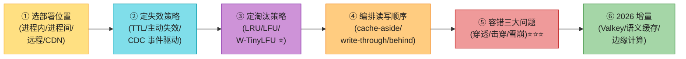
```mermaid
flowchart LR
    S1["① 选部署位置<br/>(进程内/进程间/<br/>远程/CDN)"] --> S2["② 定失效策略<br/>(TTL/主动失效/<br/>CDC 事件驱动)"]
    S2 --> S3["③ 定淘汰策略<br/>(LRU/LFU/<br/>W-TinyLFU ⭐)"]
    S3 --> S4["④ 编排读写顺序<br/>(cache-aside/<br/>write-through/behind)"]
    S4 --> S5["⑤ 容错三大问题<br/>(穿透/击穿/雪崩)⭐⭐⭐"]
    S5 --> S6["⑥ 2026 增量<br/>(Valkey/语义缓存/<br/>边缘计算)"]

    style S1 fill:#FFE082,stroke:#F9A825,color:#1f1f1f
    style S2 fill:#80DEEA,stroke:#0097A7,color:#1f1f1f
    style S3 fill:#CE93D8,stroke:#7B1FA2,color:#1f1f1f
    style S4 fill:#FFCC80,stroke:#F57C00,color:#1f1f1f
    style S5 fill:#EF9A9A,stroke:#C62828,color:#1f1f1f
    style S6 fill:#A5D6A7,stroke:#388E3C,color:#1f1f1f
```

> 💡 **关键信号词**:**"缓存是内存换时间,代价是一致性"** + **"穿透用布隆、击穿用互斥锁、雪崩用随机 TTL"** + **"写操作删缓存而非更新缓存(避免并发覆盖)"** + **"2026 选 Valkey 不选 Redis(许可证事件)"**——这四句直接拿下面试,拉开和只背原书的人的档次。

---

## 🗺️ 章节概览

| 小节 | 要点 | 重要性 |
|------|------|--------|
| **缓存收益** | 降延迟/降负载/省成本;Amdahl + Pareto(80/20) | ⭐⭐⭐⭐ |
| **淘汰策略(Eviction)** | Belady(理论)/FIFO/LRU/MRU/LFU/LFRU/Allowlist/ARC/Random | ⭐⭐⭐⭐⭐ |
| **缓存失效(Invalidation)** | TTL / 主动失效 / 读时校验(ETag)/ 写时失效 | ⭐⭐⭐⭐⭐ |
| **缓存策略(Strategies)** | cache-aside / read-through / refresh-ahead / write-through / write-around / write-behind | ⭐⭐⭐⭐⭐ |
| **缓存部署** | 进程内(in-process)/ 进程间(interprocess)/ 远程(remote) | ⭐⭐⭐⭐ |
| **缓存机制** | 客户端/CDN/Web 服务器/应用/数据库(查询级+对象级) | ⭐⭐⭐ |
| **CDN** | push CDN / pull CDN / 多层架构 / 动态内容优化 | ⭐⭐⭐⭐ |
| **开源方案** | Memcached(纯 KV,多线程,slab 分配) vs Redis(丰富数据结构,单线程演进) | ⭐⭐⭐⭐⭐ |
| **缓存三大问题(2026补) ⭐⭐⭐** | 穿透(布隆)/击穿(互斥锁)/雪崩(随机 TTL + 多级) | ⭐⭐⭐⭐⭐ |
| **Redis/Valkey 演进(2026补)** | Redis 7/8 多线程 + Valkey fork + DragonflyDB 25× | ⭐⭐⭐⭐ |
| **W-TinyLFU(2026补)** | Caffeine 用,频率+近因,胜过 LRU | ⭐⭐⭐⭐ |
| **语义缓存/AI 缓存(2026补)⭐** | GPTCache、Redis 语义缓存、RAG embedding 命中 | ⭐⭐⭐⭐⭐ |
| **分层缓存 + 一致性(2026补)** | L1 Caffeine + L2 Redis;延迟双删;CAN 原则 | ⭐⭐⭐⭐⭐ |

---

## 1. 缓存基础与收益(Benefits of Caching)

### 1.1 什么是缓存

缓存 = 一种**存储频繁访问数据或指令、靠近计算单元**的组件,目的是**降低从慢速存储/外部资源取数据的延迟**。硬件层(CPU L1/L2/L3 缓存)、操作系统层(页缓存)、应用层(Redis/Memcached)、网络层(CDN)都是缓存的具体形态。

> 📝 **核心原理——局部性原理(Principle of Locality)**:程序倾向于**反复访问一小部分数据或指令**。把这部分热点数据放快存里,后续访问就能被快速服务。**这是所有缓存有效的物理根基**。

### 1.2 缓存命中与未命中

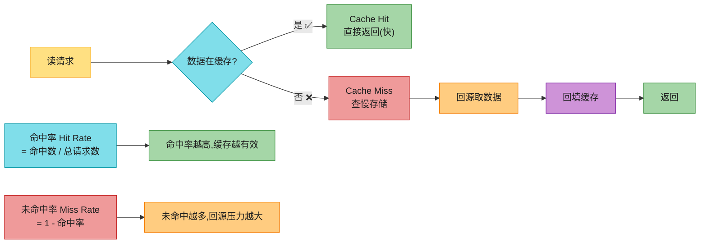
```mermaid
flowchart LR
    REQ["读请求"] --> Q{"数据在缓存?"}
    Q -->|"是 ✅"| HIT["Cache Hit<br/>直接返回(快)"]
    Q -->|"否 ❌"| MISS["Cache Miss<br/>查慢存储"]
    MISS --> FETCH["回源取数据"]
    FETCH --> FILL["回填缓存"]
    FILL --> RET["返回"]

    HITR["命中率 Hit Rate<br/>= 命中数 / 总请求数"] --> EFF["命中率越高,缓存越有效"]
    MISSR["未命中率 Miss Rate<br/>= 1 - 命中率"] --> COST["未命中越多,回源压力越大"]

    style REQ fill:#FFE082,stroke:#F9A825,color:#1f1f1f
    style Q fill:#80DEEA,stroke:#0097A7,color:#1f1f1f
    style HIT fill:#A5D6A7,stroke:#388E3C,color:#1f1f1f
    style MISS fill:#EF9A9A,stroke:#C62828,color:#1f1f1f
    style FETCH fill:#FFCC80,stroke:#F57C00,color:#1f1f1f
    style FILL fill:#CE93D8,stroke:#7B1FA2,color:#1f1f1f
    style RET fill:#A5D6A7,stroke:#388E3C,color:#1f1f1f
    style HITR fill:#80DEEA,stroke:#0097A7,color:#1f1f1f
    style EFF fill:#A5D6A7,stroke:#388E3C,color:#1f1f1f
    style MISSR fill:#EF9A9A,stroke:#C62828,color:#1f1f1f
    style COST fill:#FFCC80,stroke:#F57C00,color:#1f1f1f
```

### 1.3 缓存的五大收益

| 收益 | 说明 |
|------|------|
| **更快访问(Faster Access)** | 缓存比主存/外部存储访问时间短,**降低平均访问时间** |
| **降低延迟(Reduced Latency)** | 命中缓存避免回慢存储,**整体延迟下降**(Ch1 详述) |
| **带宽优化(Bandwidth)** | 减少回慢存储的请求数,**释放内存总线/外部接口**给其他操作 |
| **提升吞吐(Improved Throughput)** | CPU 不等慢存储,**单位时间完成更多计算** |
| **省成本(2026补)** | 减少 DB/I/O/跨区流量费,**直接省钱**(尤其云上按请求计费的 DynamoDB) |

### 1.4 理论支撑:Amdahl 与 Pareto ⭐

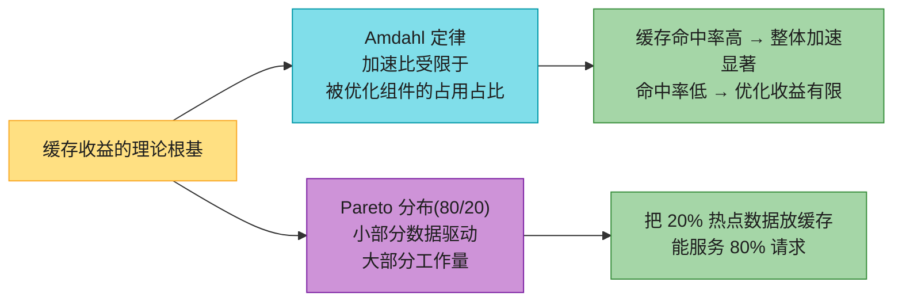
```mermaid
flowchart LR
    TH["缓存收益的理论根基"] --> A["Amdahl 定律<br/>加速比受限于<br/>被优化组件的占用占比"]
    TH --> P["Pareto 分布(80/20)<br/>小部分数据驱动<br/>大部分工作量"]

    A --> A1["缓存命中率高 → 整体加速显著<br/>命中率低 → 优化收益有限"]
    P --> P1["把 20% 热点数据放缓存<br/>能服务 80% 请求"]

    style TH fill:#FFE082,stroke:#F9A825,color:#1f1f1f
    style A fill:#80DEEA,stroke:#0097A7,color:#1f1f1f
    style P fill:#CE93D8,stroke:#7B1FA2,color:#1f1f1f
    style A1 fill:#A5D6A7,stroke:#388E3C,color:#1f1f1f
    style P1 fill:#A5D6A7,stroke:#388E3C,color:#1f1f1f
```

> 💡 **Amdahl 定律对缓存的启示**:缓存是**关键优化组件**,命中率(占用占比)高时对整体性能影响巨大。**所以工程上拼命提命中率**——这正是后面淘汰策略、预热、W-TinyLFU 的动机。
>
> 💡 **Pareto(80/20)对缓存的启示**:**只缓存访问最频繁的那部分数据**就能拿到大部分收益。这也是为什么缓存容量远小于全量数据(几 % 到几十 %)却有效。

---

## 2. 缓存淘汰策略(Cache Eviction Policies)⭐⭐⭐⭐⭐

缓存容量有限,**满了淘汰谁**是核心问题。淘汰策略的目标是**最大化缓存命中率**。原书把策略分为四大类:**Belady 最优(理论基准)、队列式、近因式、频率式**,外加 Allowlist。本章再补 **W-TinyLFU / ARC / Random**(2026 必讲)。

### 2.1 Belady 最优算法(理论基准)

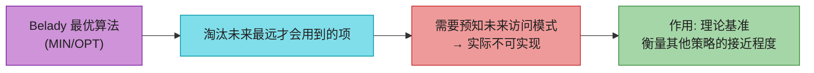
```mermaid
flowchart LR
    BEL["Belady 最优算法<br/>(MIN/OPT)"] --> IDEA["淘汰未来最远才会用到的项"]
    IDEA --> LIMIT["需要预知未来访问模式<br/>→ 实际不可实现"]
    LIMIT --> USE["作用: 理论基准<br/>衡量其他策略的接近程度"]

    style BEL fill:#CE93D8,stroke:#7B1FA2,color:#1f1f1f
    style IDEA fill:#80DEEA,stroke:#0097A7,color:#1f1f1f
    style LIMIT fill:#EF9A9A,stroke:#C62828,color:#1f1f1f
    style USE fill:#A5D6A7,stroke:#388E3C,color:#1f1f1f
```

> 🪤 **追问陷阱**:"为什么 Belady 不可实现还有用?" → 它是**理论最优基准**。工程上的策略(LRU/LFU/W-TinyLFU)都在**尽力逼近 Belady**,我们会用它做离线仿真评估某策略"离最优还差多少"。

### 2.2 队列式策略(Queue-Based)

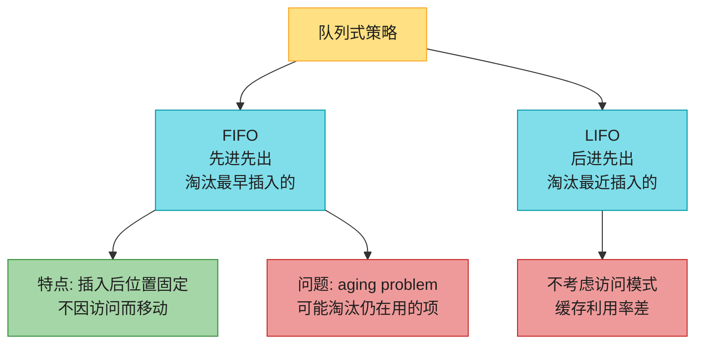
```mermaid
flowchart TD
    Q["队列式策略"] --> FIFO["FIFO<br/>先进先出<br/>淘汰最早插入的"]
    Q --> LIFO["LIFO<br/>后进先出<br/>淘汰最近插入的"]

    FIFO --> FIFO1["特点: 插入后位置固定<br/>不因访问而移动"]
    FIFO --> FIFO2["问题: aging problem<br/>可能淘汰仍在用的项"]
    LIFO --> LIFO1["不考虑访问模式<br/>缓存利用率差"]

    style Q fill:#FFE082,stroke:#F9A825,color:#1f1f1f
    style FIFO fill:#80DEEA,stroke:#0097A7,color:#1f1f1f
    style LIFO fill:#80DEEA,stroke:#0097A7,color:#1f1f1f
    style FIFO1 fill:#A5D6A7,stroke:#388E3C,color:#1f1f1f
    style FIFO2 fill:#EF9A9A,stroke:#C62828,color:#1f1f1f
    style LIFO1 fill:#EF9A9A,stroke:#C62828,color:#1f1f1f
```

> 📝 **FIFO 的关键细节(原书强调)**:传统 FIFO **项插入后位置固定,访问不会移动它**——这跟 LRU 不同(LRU 访问会更新位置)。这导致 **aging problem(老化问题)**:仍被频繁访问的旧项因为"插入得早"被淘汰。
>
> 📝 **生活例子**:FIFO 像打印队列(按提交顺序处理,满了踢最老任务);LIFO 像栈(后进先出)。

### 2.3 近因式策略(Recency-Based)⭐

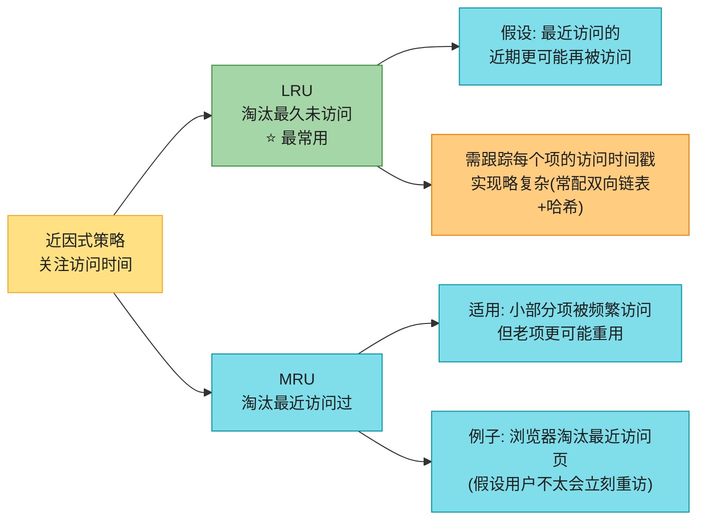
```mermaid
flowchart LR
    R["近因式策略<br/>关注访问时间"] --> LRU["LRU<br/>淘汰最久未访问<br/>⭐ 最常用"]
    R --> MRU["MRU<br/>淘汰最近访问过"]

    LRU --> LRU1["假设: 最近访问的<br/>近期更可能再被访问"]
    LRU --> LRU2["需跟踪每个项的访问时间戳<br/>实现略复杂(常配双向链表+哈希)"]
    MRU --> MRU1["适用: 小部分项被频繁访问<br/>但老项更可能重用"]
    MRU --> MRU2["例子: 浏览器淘汰最近访问页<br/>(假设用户不太会立刻重访)"]

    style R fill:#FFE082,stroke:#F9A825,color:#1f1f1f
    style LRU fill:#A5D6A7,stroke:#388E3C,color:#1f1f1f
    style MRU fill:#80DEEA,stroke:#0097A7,color:#1f1f1f
    style LRU1 fill:#80DEEA,stroke:#0097A7,color:#1f1f1f
    style LRU2 fill:#FFCC80,stroke:#F57C00,color:#1f1f1f
    style MRU1 fill:#80DEEA,stroke:#0097A7,color:#1f1f1f
    style MRU2 fill:#80DEEA,stroke:#0097A7,color:#1f1f1f
```

> 💡 **LRU 是工程事实标准**(Redis/Memcached/Caffeine 默认或最常用)。但 LRU 有**两个致命弱点**(2026 必讲):
> - **扫描污染**:一次全表扫描会把所有热点数据冲出去(因为扫描项"最近访问过")。
> - **不考虑频率**:一个偶尔被访问的项只要"最近"碰过就不被淘汰。
>
> 这两个弱点催生了 **LFU 和 W-TinyLFU**(见 2.5 和 2026 增量)。

### 2.4 频率式策略(Frequency-Based)

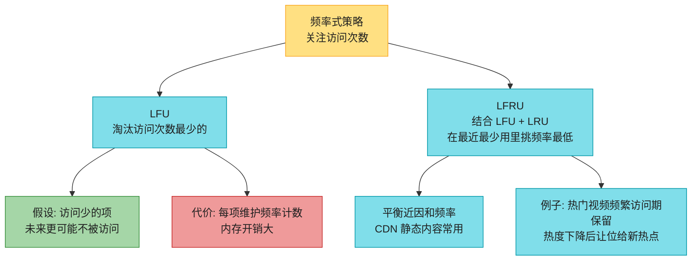
```mermaid
flowchart TD
    F["频率式策略<br/>关注访问次数"] --> LFU["LFU<br/>淘汰访问次数最少的"]
    F --> LFRU["LFRU<br/>结合 LFU + LRU<br/>在最近最少用里挑频率最低"]

    LFU --> LFU1["假设: 访问少的项<br/>未来更可能不被访问"]
    LFU --> LFU2["代价: 每项维护频率计数<br/>内存开销大"]
    LFRU --> LFRU1["平衡近因和频率<br/>CDN 静态内容常用"]
    LFRU --> LFRU2["例子: 热门视频频繁访问期保留<br/>热度下降后让位给新热点"]

    style F fill:#FFE082,stroke:#F9A825,color:#1f1f1f
    style LFU fill:#80DEEA,stroke:#0097A7,color:#1f1f1f
    style LFRU fill:#80DEEA,stroke:#0097A7,color:#1f1f1f
    style LFU1 fill:#A5D6A7,stroke:#388E3C,color:#1f1f1f
    style LFU2 fill:#EF9A9A,stroke:#C62828,color:#1f1f1f
    style LFRU1 fill:#80DEEA,stroke:#0097A7,color:#1f1f1f
    style LFRU2 fill:#80DEEA,stroke:#0097A7,color:#1f1f1f
```

> 📝 **LFU 的弱点(原书没讲透,2026 必讲)**:LFU 有**历史包袱问题**——一个项在过去某段时间被疯狂访问(频率计数飙升),但之后再也不被访问,它会因为"历史频率高"长期占着缓存不淘汰。W-TinyLFU 用**老化衰减(aging decay)**解决了这个问题。

### 2.5 Allowlist 策略(白名单)

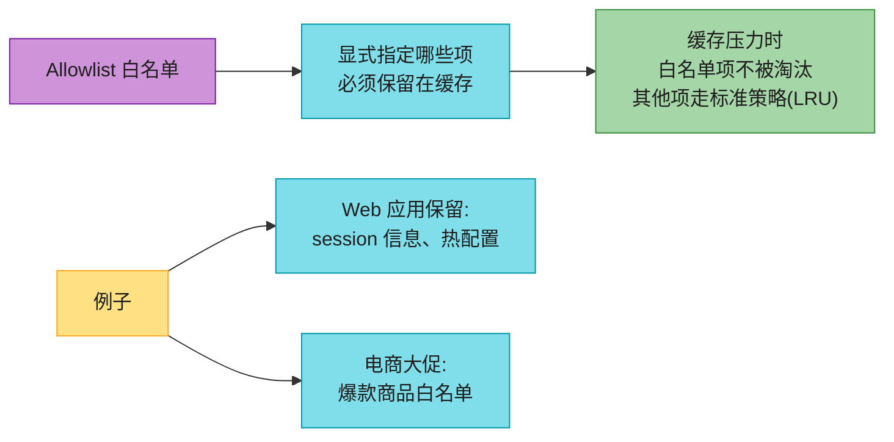
```mermaid
flowchart LR
    AL["Allowlist 白名单"] --> IDEA["显式指定哪些项<br/>必须保留在缓存"]
    IDEA --> USE["缓存压力时<br/>白名单项不被淘汰<br/>其他项走标准策略(LRU)"]

    EX["例子"] --> EX1["Web 应用保留:<br/>session 信息、热配置"]
    EX --> EX2["电商大促:<br/>爆款商品白名单"]

    style AL fill:#CE93D8,stroke:#7B1FA2,color:#1f1f1f
    style IDEA fill:#80DEEA,stroke:#0097A7,color:#1f1f1f
    style USE fill:#A5D6A7,stroke:#388E3C,color:#1f1f1f
    style EX fill:#FFE082,stroke:#F9A825,color:#1f1f1f
    style EX1 fill:#80DEEA,stroke:#0097A7,color:#1f1f1f
    style EX2 fill:#80DEEA,stroke:#0097A7,color:#1f1f1f
```

> 💡 **Allowlist 的价值**:在缓存压力期(峰值流量)保证**关键数据不丢**。生产实践里常配合 LRU 用——白名单外仍走 LRU。

### 2.6 其他策略(2026 必补)

| 策略 | 思路 | 适用 |
|------|------|------|
| **Random(随机)** | 满了随机淘汰一项 | 实现极简,接近 LRU 性能且**无元数据开销**;Redis 支持 |
| **ARC(Adaptive Replacement Cache)** | 自适应在 LRU 和 LFU 间切换 | IBM 提出,根据工作负载动态调,**比单一 LRU/LFU 强**,但实现复杂 |
| **TTL(按过期时间)** | 淘汰最快过期的项 | 配合 TTL 字段,Redis `volatile-ttl` |

### 2.7 淘汰策略对比总表

| 策略 | 关注点 | 优点 | 缺点 | 典型场景 |
|------|--------|------|------|---------|
| **Belady** | 未来 | 理论最优 | 不可实现 | 离线基准 |
| **FIFO** | 插入顺序 | 实现简单 | aging problem | 打印队列 |
| **LRU ⭐** | 近因 | 命中率高、直觉好 | 扫描污染、忽略频率 | **最常用**(Redis/Caffeine 默认) |
| **MRU** | 近因(反向) | 老项重用场景 | 用例少 | 浏览器 |
| **LFU** | 频率 | 抗扫描污染 | 历史频率包袱、内存开销 | 静态热点 |
| **LFRU** | 频率+近因 | 平衡 | 实现复杂 | CDN 静态内容 |
| **W-TinyLFU ⭐(2026)** | 频率+近因+老化 | **全面胜过 LRU** | 实现复杂 | **Caffeine/Caffeine-like** |
| **ARC** | 自适应 | 动态调 | 实现复杂 | IBM Z 系统存储 |
| **Allowlist** | 显式 | 保关键 | 需人工维护 | session/热配置 |
| **Random** | 无 | 极简 | 略差于 LRU | 元数据敏感场景 |

> 🪤 **追问陷阱(高频)**:"LRU 和 LFU 怎么选?" → **看访问模式**。如果访问有**强时间局部性**(最近访问的近期还会访问,如用户会话)→ LRU;如果访问有**频率倾斜**(少数热点被反复访问,如热门商品)→ LFU。**生产实践 2026 主流是 W-TinyLFU**——它同时捕捉近因和频率,还解决了 LFU 的历史包袱。

---

## 3. 缓存失效(Invalidation)⭐⭐⭐⭐⭐

缓存要让数据"**正确**"——即和底层数据源一致。失效策略决定**何时认为缓存过期、何时刷新**。这是缓存**最难的工程问题**(Ch1 一致性谱系在缓存层的落地)。

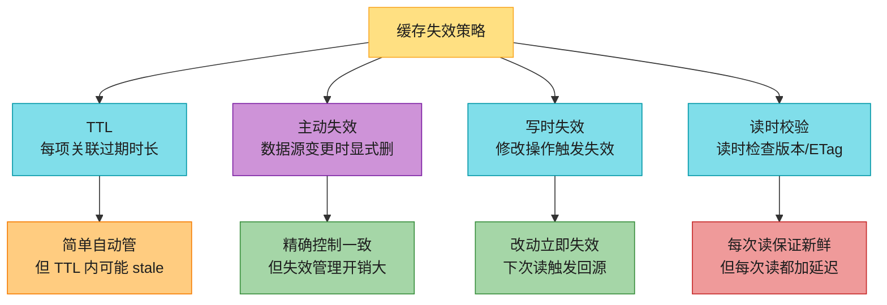
```mermaid
flowchart TD
    INV["缓存失效策略"] --> T["TTL<br/>每项关联过期时长"]
    INV --> A["主动失效<br/>数据源变更时显式删"]
    INV --> OM["写时失效<br/>修改操作触发失效"]
    INV --> OR["读时校验<br/>读时检查版本/ETag"]

    T --> T1["简单自动管<br/>但 TTL 内可能 stale"]
    A --> A1["精确控制一致<br/>但失效管理开销大"]
    OM --> OM1["改动立即失效<br/>下次读触发回源"]
    OR --> OR1["每次读保证新鲜<br/>但每次读都加延迟"]

    style INV fill:#FFE082,stroke:#F9A825,color:#1f1f1f
    style T fill:#80DEEA,stroke:#0097A7,color:#1f1f1f
    style A fill:#CE93D8,stroke:#7B1FA2,color:#1f1f1f
    style OM fill:#80DEEA,stroke:#0097A7,color:#1f1f1f
    style OR fill:#80DEEA,stroke:#0097A7,color:#1f1f1f
    style T1 fill:#FFCC80,stroke:#F57C00,color:#1f1f1f
    style A1 fill:#A5D6A7,stroke:#388E3C,color:#1f1f1f
    style OM1 fill:#A5D6A7,stroke:#388E3C,color:#1f1f1f
    style OR1 fill:#EF9A9A,stroke:#C62828,color:#1f1f1f
```

### 3.1 TTL(Time To Live)

每个缓存项关联一个**过期时长**。TTL 到期 → 项被视为过期 → 下次请求触发未命中 → 回源取最新。

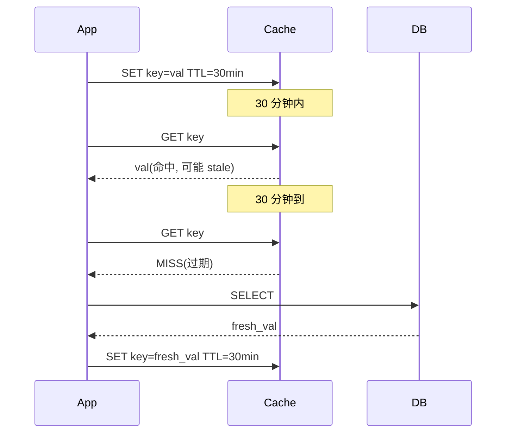
```mermaid
sequenceDiagram
    participant App
    participant Cache
    participant DB
    App->>Cache: SET key=val TTL=30min
    Note over Cache: 30 分钟内
    App->>Cache: GET key
    Cache-->>App: val(命中, 可能 stale)
    Note over Cache: 30 分钟到
    App->>Cache: GET key
    Cache-->>App: MISS(过期)
    App->>DB: SELECT
    DB-->>App: fresh_val
    App->>Cache: SET key=fresh_val TTL=30min
```

> 📝 **生活例子**:天气应用缓存天气数据 30 分钟,过期后自动刷新。**TTL 内可能返回略过时数据,但不会压垮数据源**。
>
> 💡 **2026 关键陷阱(防雪崩)**:**不要给所有 key 设相同 TTL**——会同时过期触发雪崩(见第 7 节)。**生产实践:TTL = 基础值 + 随机抖动**(如 `3600 + rand(0, 300)`)。

### 3.2 主动失效(Active Invalidation)

数据源变更时,**应用/系统显式删除或失效**对应缓存项。

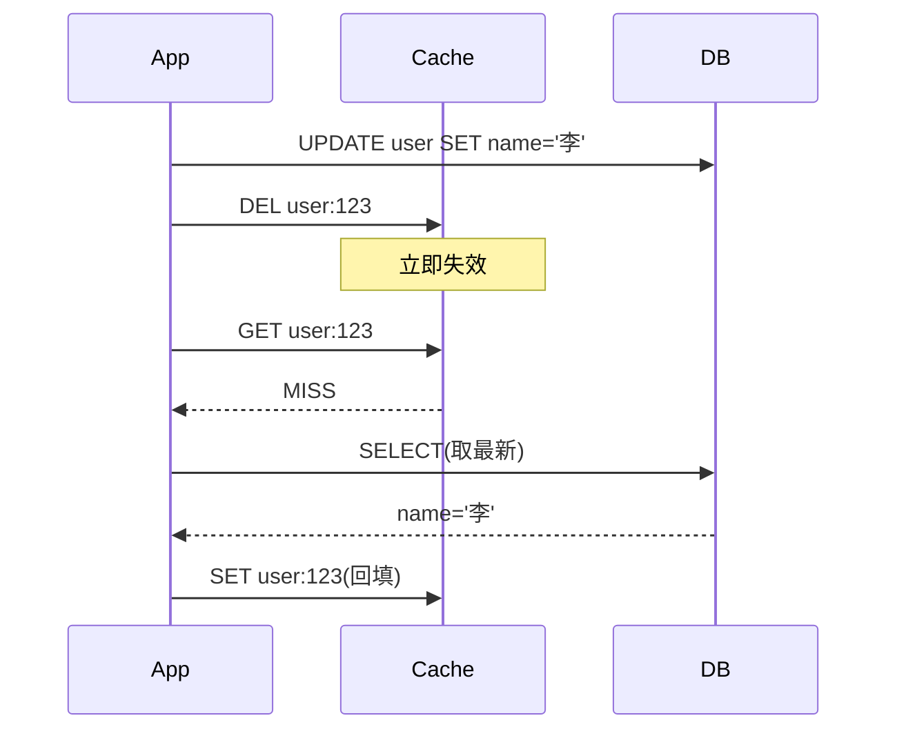
```mermaid
sequenceDiagram
    participant App
    participant Cache
    participant DB
    App->>DB: UPDATE user SET name='李'
    App->>Cache: DEL user:123
    Note over Cache: 立即失效
    App->>Cache: GET user:123
    Cache-->>App: MISS
    App->>DB: SELECT(取最新)
    DB-->>App: name='李'
    App->>Cache: SET user:123(回填)
```

> 📝 **生活例子**:社交媒体用户发新帖,**主动失效所有相关 feed 缓存**,确保大家立刻看到最新动态。
>
> 💡 **Cache-Aside 的"写后删缓存"就是主动失效**(见第 4 节)。**注意:删缓存而非更新缓存**(避免并发覆盖,见第 7 节陷阱)。

### 3.3 写时失效(Invalidating on Modification)

底层修改(更新/删除)时,**通知或标记缓存失效**对应数据。下次访问触发未命中,从源拉最新。**这是主动失效的子类,强调"修改事件驱动"**。

> 📝 **生活例子**:电商商品价格/描述/库存变动 → 对应缓存失效,防止用户看到过期信息影响购买决策。

### 3.4 读时校验(Invalidating on Read)

读请求来时,**缓存检查数据是否仍有效**(基于版本号或 ETag)。过期或失效则回源取最新并更新缓存后返回。

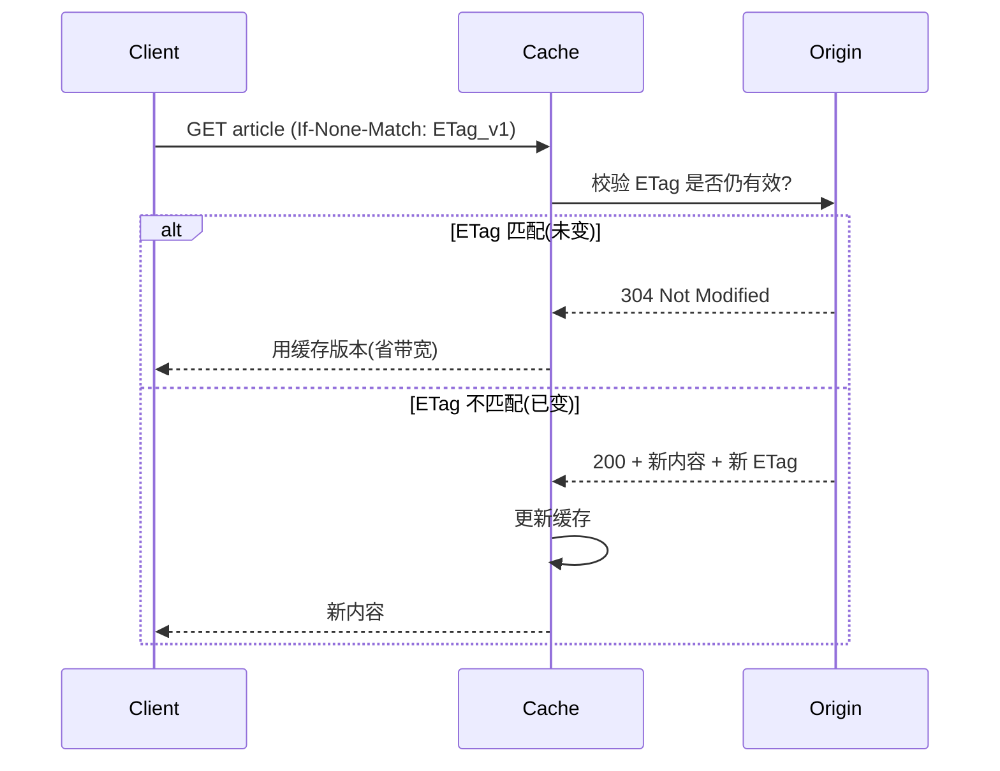
```mermaid
sequenceDiagram
    participant Client
    participant Cache
    participant Origin
    Client->>Cache: GET article (If-None-Match: ETag_v1)
    Cache->>Origin: 校验 ETag 是否仍有效?
    alt ETag 匹配(未变)
        Origin-->>Cache: 304 Not Modified
        Cache-->>Client: 用缓存版本(省带宽)
    else ETag 不匹配(已变)
        Origin-->>Cache: 200 + 新内容 + 新 ETag
        Cache->>Cache: 更新缓存
        Cache-->>Client: 新内容
    end
```

> 📝 **ETag 实体标签**:Web 服务器给资源某版本分配的唯一标识。客户端请求带 `If-None-Match: ETag`,服务器匹配则返回 `304 Not Modified`(省带宽)。**这是 HTTP 协议层的读时校验**。
>
> 📝 **生活例子**:新闻应用读文章时检查缓存版本是否仍有效,文章被更新则拉最新版本给读者(尤其发布后短时间内有更正时)。

### 3.5 失效策略对比

| 策略 | 一致性 | 性能开销 | 复杂度 | 适用 |
|------|--------|---------|--------|------|
| **TTL** | 最终一致(TTL 内 stale) | 低 | 低 | 大部分场景默认 |
| **主动失效** | 精确控制 | 中(管理开销) | 中 | 强一致要求 |
| **写时失效** | 改动立即生效 | 中 | 中 | Cache-Aside 写流程 |
| **读时校验** | 每次读新鲜 | 高(每次读加延迟) | 中 | 新闻/文档类 |

> 🪤 **追问陷阱**:"TTL 设多长合适?" → **看数据更新频率和一致性容忍度**。热点配置秒级;商品信息分钟级;静态资源小时到天级。**生产经验**:从短 TTL 开始(1-5 分钟),监控 miss rate,逐步调长到 miss rate 上升的拐点前。

---

## 4. 缓存策略(Caching Strategies)⭐⭐⭐⭐⭐(本章核心之一)

缓存策略 = **数据在缓存和数据源之间如何管理和同步**。原书把策略分为**读密集**(cache-aside / read-through / refresh-ahead)和**写密集**(write-through / write-around / write-behind)两大类,共**六种**。

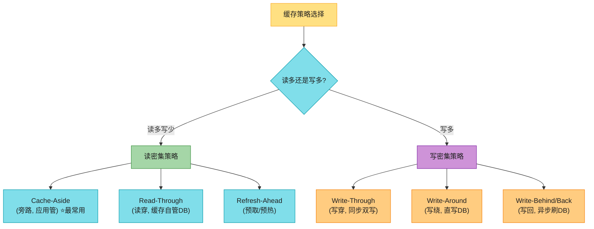
```mermaid
flowchart TD
    START["缓存策略选择"] --> Q1{"读多还是写多?"}
    Q1 -->|"读多写少"| READ["读密集策略"]
    Q1 -->|"写多"| WRITE["写密集策略"]

    READ --> CA["Cache-Aside<br/>(旁路, 应用管) ⭐最常用"]
    READ --> RT["Read-Through<br/>(读穿, 缓存自管DB)"]
    READ --> RA["Refresh-Ahead<br/>(预取/预热)"]

    WRITE --> WT["Write-Through<br/>(写穿, 同步双写)"]
    WRITE --> WA["Write-Around<br/>(写绕, 直写DB)"]
    WRITE --> WB["Write-Behind/Back<br/>(写回, 异步刷DB)"]

    style START fill:#FFE082,stroke:#F9A825,color:#1f1f1f
    style Q1 fill:#80DEEA,stroke:#0097A7,color:#1f1f1f
    style READ fill:#A5D6A7,stroke:#388E3C,color:#1f1f1f
    style WRITE fill:#CE93D8,stroke:#7B1FA2,color:#1f1f1f
    style CA fill:#80DEEA,stroke:#0097A7,color:#1f1f1f
    style RT fill:#80DEEA,stroke:#0097A7,color:#1f1f1f
    style RA fill:#80DEEA,stroke:#0097A7,color:#1f1f1f
    style WT fill:#FFCC80,stroke:#F57C00,color:#1f1f1f
    style WA fill:#FFCC80,stroke:#F57C00,color:#1f1f1f
    style WB fill:#FFCC80,stroke:#F57C00,color:#1f1f1f
```

### 4.1 读密集策略

#### 4.1.1 Cache-Aside(旁路缓存)⭐ 最常用

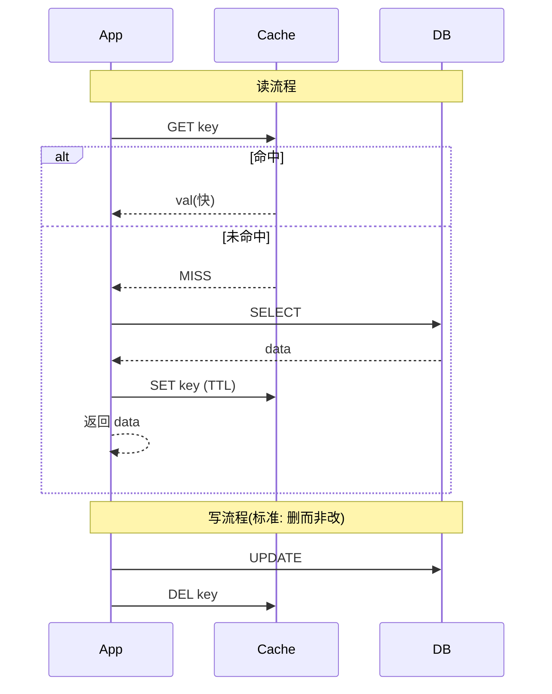
```mermaid
sequenceDiagram
    participant App
    participant Cache
    participant DB
    Note over App,DB: 读流程
    App->>Cache: GET key
    alt 命中
        Cache-->>App: val(快)
    else 未命中
        Cache-->>App: MISS
        App->>DB: SELECT
        DB-->>App: data
        App->>Cache: SET key (TTL)
        App-->>App: 返回 data
    end
    Note over App,DB: 写流程(标准: 删而非改)
    App->>DB: UPDATE
    App->>Cache: DEL key
```

| 维度 | Cache-Aside |
|------|-------------|
| **缓存管理** | 应用代码全权管理(查/填/删) |
| **优点** | 灵活,应用完全控制缓存决策 |
| **缺点** | 应用代码侵入,需额外管理逻辑 |
| **适用** | **绝大多数场景默认选择**;Memcached/Redis 配 cache-aside 是事实标准 |

> 💡 **为什么 Cache-Aside 最常用**:它**解耦**——缓存挂了不影响正确性(应用直接查 DB),只是性能下降。这种**优雅降级**是生产系统的关键特性。

#### 4.1.2 Read-Through(读穿)

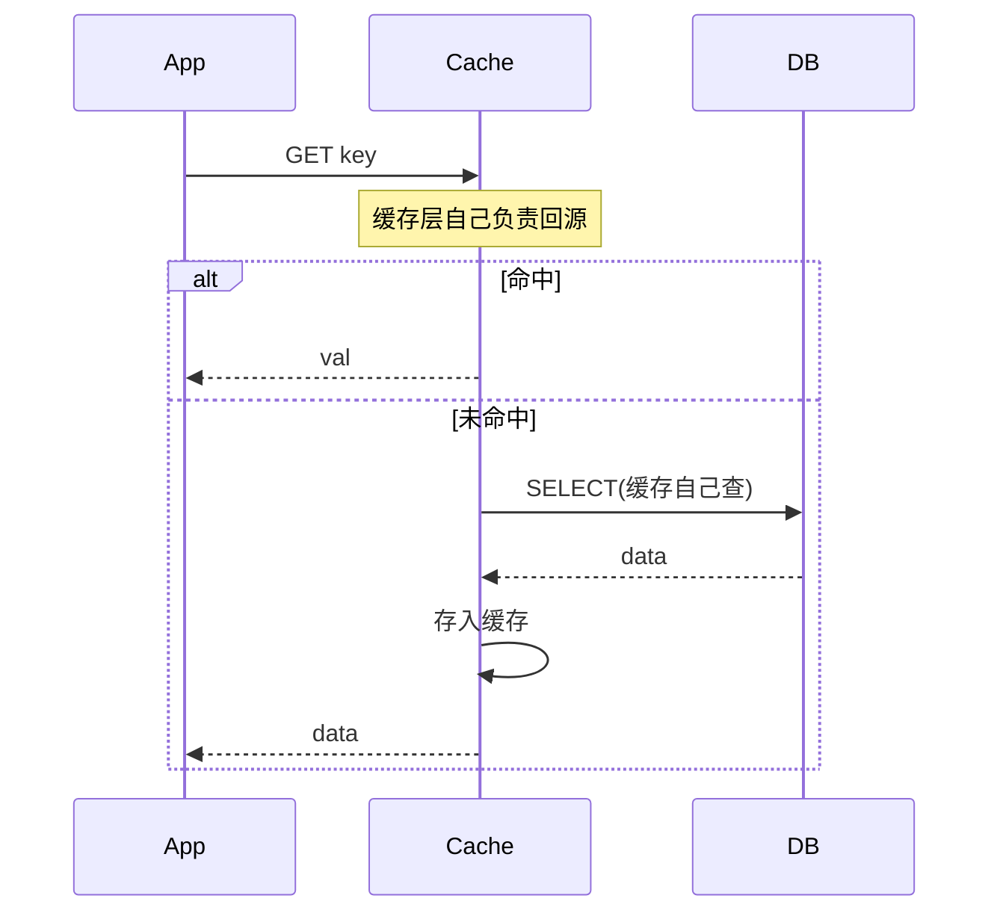
```mermaid
sequenceDiagram
    participant App
    participant Cache
    participant DB
    App->>Cache: GET key
    Note over Cache: 缓存层自己负责回源
    alt 命中
        Cache-->>App: val
    else 未命中
        Cache->>DB: SELECT(缓存自己查)
        DB-->>Cache: data
        Cache->>Cache: 存入缓存
        Cache-->>App: data
    end
```

| 维度 | Read-Through |
|------|-------------|
| **缓存管理** | **缓存层自己**回源查 DB,应用只跟缓存交互 |
| **优点** | 应用代码简化(不感知 DB) |
| **缺点** | **冷启动期未命中延迟高**,P999 可能不可预测(首请求要回源) |
| **适用** | 应用不关心缓存细节;读为主 |

> 🪤 **Cache-Aside vs Read-Through 的关键区别**:cache-aside 是**应用**查 DB 回填;read-through 是**缓存层**查 DB 回填。**read-through 对应用更透明,但要求缓存支持回源回调**(如 Spring CacheManager、Hibernate 二级缓存)。

#### 4.1.3 Refresh-Ahead(预取/预热)

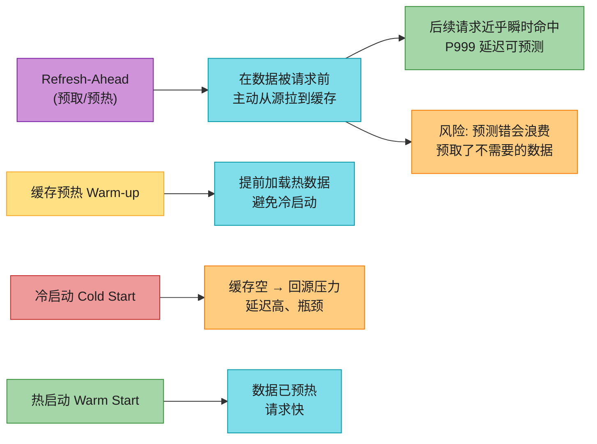
```mermaid
flowchart LR
    RA["Refresh-Ahead<br/>(预取/预热)"] --> IDEA["在数据被请求前<br/>主动从源拉到缓存"]
    IDEA --> BEN["后续请求近乎瞬时命中<br/>P999 延迟可预测"]
    IDEA --> RISK["风险: 预测错会浪费<br/>预取了不需要的数据"]

    WARM["缓存预热 Warm-up"] --> W1["提前加载热数据<br/>避免冷启动"]
    COLD["冷启动 Cold Start"] --> C1["缓存空 → 回源压力<br/>延迟高、瓶颈"]
    HOTS["热启动 Warm Start"] --> H1["数据已预热<br/>请求快"]

    style RA fill:#CE93D8,stroke:#7B1FA2,color:#1f1f1f
    style IDEA fill:#80DEEA,stroke:#0097A7,color:#1f1f1f
    style BEN fill:#A5D6A7,stroke:#388E3C,color:#1f1f1f
    style RISK fill:#FFCC80,stroke:#F57C00,color:#1f1f1f
    style WARM fill:#FFE082,stroke:#F9A825,color:#1f1f1f
    style W1 fill:#80DEEA,stroke:#0097A7,color:#1f1f1f
    style COLD fill:#EF9A9A,stroke:#C62828,color:#1f1f1f
    style C1 fill:#FFCC80,stroke:#F57C00,color:#1f1f1f
    style HOTS fill:#A5D6A7,stroke:#388E3C,color:#1f1f1f
    style H1 fill:#80DEEA,stroke:#0097A7,color:#1f1f1f
```

> 📝 **缓存预热 vs 冷启动**:Refresh-Ahead 的核心价值是把"冷启动"变"热启动"。**生产实践**:① 新版本上线前跑预热脚本加载热数据;② TTL 快到期时**异步刷新**(不阻塞读,旧值先返回,后台更新)。

### 4.2 写密集策略

#### 4.2.1 Write-Through(写穿)

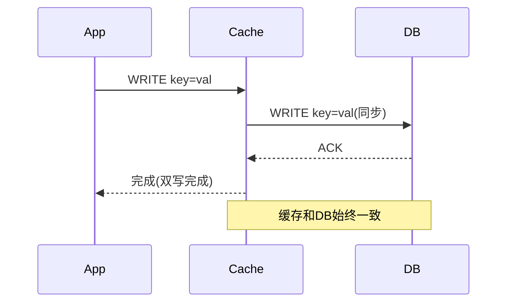
```mermaid
sequenceDiagram
    participant App
    participant Cache
    participant DB
    App->>Cache: WRITE key=val
    Cache->>DB: WRITE key=val(同步)
    DB-->>Cache: ACK
    Cache-->>App: 完成(双写完成)
    Note over Cache,DB: 缓存和DB始终一致
```

| 维度 | Write-Through |
|------|-------------|
| **写流程** | 先写缓存,**同步**写 DB,都完成才返回 |
| **优点** | **强一致**(缓存与 DB 始终同步) |
| **缺点** | **写延迟高**(同步等 DB) |
| **适用** | 写要求强一致,可接受写延迟 |

#### 4.2.2 Write-Around(写绕)

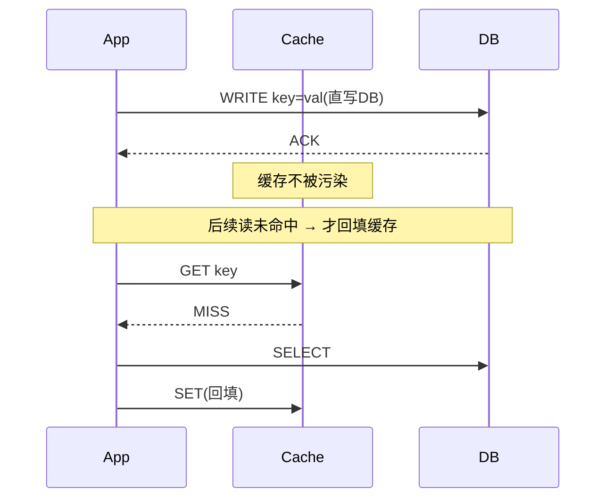
```mermaid
sequenceDiagram
    participant App
    participant Cache
    participant DB
    App->>DB: WRITE key=val(直写DB)
    DB-->>App: ACK
    Note over Cache: 缓存不被污染
    Note over App,DB: 后续读未命中 → 才回填缓存
    App->>Cache: GET key
    Cache-->>App: MISS
    App->>DB: SELECT
    App->>Cache: SET(回填)
```

| 维度 | Write-Around |
|------|-------------|
| **写流程** | **绕过缓存**直接写 DB |
| **优点** | **避免缓存污染**(写一次就不读的数据不占缓存) |
| **缺点** | 写后立即读会未命中 |
| **适用** | **写一次读多次**场景(日志、ETL);避免不常读数据污染缓存 |

#### 4.2.3 Write-Behind / Write-Back(写回)⭐

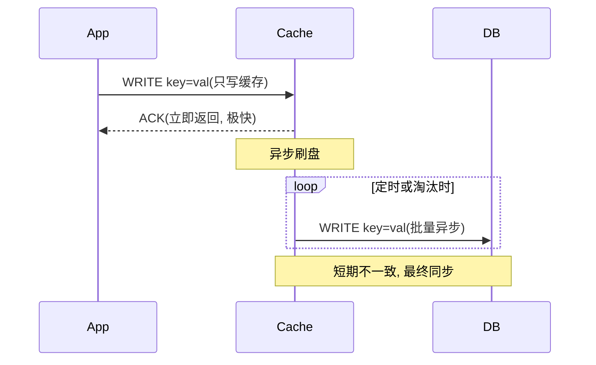
```mermaid
sequenceDiagram
    participant App
    participant Cache
    participant DB
    App->>Cache: WRITE key=val(只写缓存)
    Cache-->>App: ACK(立即返回, 极快)
    Note over Cache: 异步刷盘
    loop 定时或淘汰时
        Cache->>DB: WRITE key=val(批量异步)
    end
    Note over Cache,DB: 短期不一致, 最终同步
```

| 维度 | Write-Behind(写回) |
|------|-------------|
| **写流程** | 只写缓存,**异步**刷 DB(定时或淘汰时) |
| **优点** | **写极快**(内存级);**抗突发写流量**(吸收峰值) |
| **缺点** | **数据丢失风险**(缓存挂了未刷盘的数据丢) |
| **适用** | 写极多、可容忍丢失(日志、计数、监控指标) |

> 🪤 **追问陷阱(高频)**:"Write-Behind 数据丢了怎么办?" → ① **持久化缓存层**(Redis AOF everysec,最多丢 1 秒);② **副本**(Redis 主从);③ **业务上接受 RPO**(如计数器丢 1 秒无所谓)。**绝对不能用于金融账户**——那必须 Write-Through 同步双写。

### 4.3 六种策略对比总表

| 策略 | 读流程 | 写流程 | 一致性 | 写延迟 | 适用 |
|------|--------|--------|--------|--------|------|
| **Cache-Aside ⭐** | 应用查缓存→未命中查DB回填 | 应用写DB→**删**缓存 | 最终 | 中 | **默认选择** |
| **Read-Through** | 缓存层自管DB回源 | — | 最终 | — | 应用不关心缓存 |
| **Refresh-Ahead** | 预取+读命中 | — | 最终 | — | 低P999延迟 |
| **Write-Through** | 读缓存 | 同步写缓存+DB | **强** | **高** | 写要求强一致 |
| **Write-Around** | 读缓存→未命中回填 | 直写DB绕过缓存 | 最终 | 中 | 写一次读多次 |
| **Write-Behind ⭐** | 读缓存 | 只写缓存→异步刷DB | 延迟(可能丢) | **极低** | 写极多可容忍丢 |

> 💡 **生产组合拳(背)**:**默认 Cache-Aside + TTL + 写后删缓存**;**强一致场景加 Write-Through**;**写流量爆炸场景 Write-Behind + 持久化**;**写一次读多次 Write-Around 防污染**。

---

## 5. 缓存部署(Cache Deployment)

缓存**放哪**是另一个维度。原书讲三种部署:**进程内、进程间、远程**,各有延迟/共享/复杂度权衡。

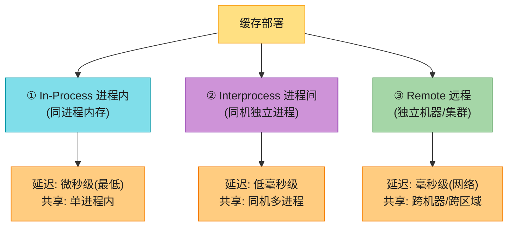
```mermaid
flowchart TD
    DEP["缓存部署"] --> IN["① In-Process 进程内<br/>(同进程内存)"]
    DEP --> IP["② Interprocess 进程间<br/>(同机独立进程)"]
    DEP --> RM["③ Remote 远程<br/>(独立机器/集群)"]

    IN --> IN1["延迟: 微秒级(最低)<br/>共享: 单进程内"]
    IP --> IP1["延迟: 低毫秒级<br/>共享: 同机多进程"]
    RM --> RM1["延迟: 毫秒级(网络)<br/>共享: 跨机器/跨区域"]

    style DEP fill:#FFE082,stroke:#F9A825,color:#1f1f1f
    style IN fill:#80DEEA,stroke:#0097A7,color:#1f1f1f
    style IP fill:#CE93D8,stroke:#7B1FA2,color:#1f1f1f
    style RM fill:#A5D6A7,stroke:#388E3C,color:#1f1f1f
    style IN1 fill:#FFCC80,stroke:#F57C00,color:#1f1f1f
    style IP1 fill:#FFCC80,stroke:#F57C00,color:#1f1f1f
    style RM1 fill:#FFCC80,stroke:#F57C00,color:#1f1f1f
```

### 5.1 In-Process(进程内缓存)

缓存和请求组件在**同一进程**,通常是进程内存数据结构。

| 维度 | In-Process |
|------|-----------|
| **延迟** | **微秒级**(最低) |
| **共享** | 单进程内 |
| **适用** | 单应用/进程的有限缓存需求 |
| **典型** | Java Caffeine/Guava Cache、Python functools.lru_cache、Go sync.Map |
| **例子** | Web 应用缓存用户 session(sticky session) |

> 💡 **进程内缓存的最大问题(原书没讲透)**:**多实例间数据不共享 + 失效要广播**。10 个 web 实例各有自己缓存,某实例更新数据后要通知其他 9 个失效——这催生了**分层缓存(L1 进程内 + L2 远程)**的实践(见 2026 增量)。

### 5.2 Interprocess(进程间缓存)

缓存作为**独立进程/服务**与请求组件并行,通过 IPC(共享内存/管道/socket/RPC)访问。

| 维度 | Interprocess |
|------|-------------|
| **延迟** | **低毫秒级**(IPC 开销) |
| **共享** | **同机多进程** |
| **适用** | 单机多进程/多应用共享缓存 |
| **典型** | Apache Ignite、嵌入式 Redis |
| **例子** | 金融应用用 Apache Ignite 缓存交易数据,多组件共享做实时分析 |

### 5.3 Remote(远程缓存)

缓存部署在**独立机器/集群**,通过网络(HTTP/TCP/自定义协议)访问。

| 维度 | Remote |
|------|--------|
| **延迟** | **毫秒级**(网络开销) |
| **共享** | **跨机器/跨区域** |
| **适用** | 分布式系统、跨机器共享 |
| **典型** | Redis Cluster、Memcached、Amazon ElastiCache |
| **例子** | 社交应用用 Redis Cluster 缓存用户 profile 和 feed,所有应用服务器共享 |

### 5.4 三种部署对比(原书表 4-1 精简)

| 部署 | 延迟量级 | 优势 | 适用 |
|------|---------|------|------|
| **In-Process** | 微秒(μs) | 最低延迟,无需网络 | 单进程频繁访问的数据 |
| **Interprocess** | 低毫秒(ms) | 同机多进程共享 | 同机多应用/组件共享 |
| **Remote** | 毫秒(ms) | 跨机器共享,可扩展 | 分布式系统跨机共享 |

> 🪤 **追问陷阱**:"为什么不都用进程内缓存(最快)?" → ① **多实例数据不共享**,各自维护会不一致;② **失效广播复杂**(N 个实例要同步);③ **内存占用受应用进程限制**。**生产组合**:进程内做 L1(超热数据,微秒级)+ Redis 做远程 L2(共享,毫秒级),见分层缓存。

---

## 6. 缓存机制(Caching Mechanisms)

缓存可以放在请求链路的**不同层级**,每层解决不同问题。

```mermaid
flowchart LR
    CLIENT["客户端"] --> CS["① 客户端缓存<br/>(浏览器内存/localStorage)"]
    CS --> CDN["② CDN 缓存<br/>(边缘节点)"]
    CDN --> WS["③ Web 服务器缓存<br/>(Nginx/Varnish)"]
    WS --> APP["④ 应用缓存<br/>(Redis/Memcached)"]
    APP --> DB["⑤ 数据库缓存<br/>(查询级/对象级)"]

    style CLIENT fill:#FFE082,stroke:#F9A825,color:#1f1f1f
    style CS fill:#80DEEA,stroke:#0097A7,color:#1f1f1f
    style CDN fill:#80DEEA,stroke:#0097A7,color:#1f1f1f
    style WS fill:#CE93D8,stroke:#7B1FA2,color:#1f1f1f
    style APP fill:#FFCC80,stroke:#F57C00,color:#1f1f1f
    style DB fill:#A5D6A7,stroke:#388E3C,color:#1f1f1f
```

### 6.1 五种缓存机制

| 机制 | 位置 | 缓存内容 | 典型 |
|------|------|---------|------|
| **客户端缓存** | 客户端设备 | 静态资源(HTML/CSS/JS/图片) | 浏览器 memory/localStorage、App 本地缓存 |
| **CDN 缓存** | 边缘节点 | 静态文件/媒体/可缓存动态内容 | CloudFront、Cloudflare、Akamai |
| **Web 服务器缓存** | 服务器端 | 频繁访问的页面/响应 | Nginx fastcgi_cache、Varnish |
| **应用缓存** | 应用内存/内存DB | 频繁访问的数据/计算结果 | Redis、Memcached、Caffeine |
| **数据库缓存** | 数据库层 | 查询结果/数据对象 | MySQL query cache(已废弃)、MySQL InnoDB buffer pool |

### 6.2 数据库缓存的两个层级

```mermaid
flowchart LR
    DBC["数据库缓存"] --> QL["查询级 Query-Level<br/>缓存查询结果"]
    DBC --> OL["对象级 Object-Level<br/>缓存单条记录/对象"]

    QL --> QL1["同查询直接返回结果<br/>降DB负载, 提响应"]
    OL --> OL1["频繁访问特定对象<br/>或库相对静态时高效"]

    style DBC fill:#FFE082,stroke:#F9A825,color:#1f1f1f
    style QL fill:#80DEEA,stroke:#0097A7,color:#1f1f1f
    style OL fill:#80DEEA,stroke:#0097A7,color:#1f1f1f
    style QL1 fill:#A5D6A7,stroke:#388E3C,color:#1f1f1f
    style OL1 fill:#A5D6A7,stroke:#388E3C,color:#1f1f1f
```

> ⚠️ **2026 重要警示**:**MySQL Query Cache 在 8.0 已被移除**——因为它的命中率在高并发下往往低于其维护开销(任何表写都要失效该表所有 query cache)。**现代实践用应用层 Redis 替代查询缓存**,用 InnoDB buffer pool(页缓存)做对象级。原书讲 query cache 时没提这个废弃事实。

---

## 7. 缓存三大经典问题(2026 必补 ⭐⭐⭐)(面试超高频)

这是**国内大厂面试固定三连问**,原书**只字未提**,你必须会。三大问题都源自"**缓存失效后请求打到 DB**",但触发场景不同。

```mermaid
flowchart TB
    ROOT["缓存三大经典问题"] --> P1["① 缓存穿透<br/>查不存在的 key<br/>每次穿透到 DB"]
    ROOT --> P2["② 缓存击穿<br/>热点 key 过期<br/>瞬间大量请求打 DB"]
    ROOT --> P3["③ 缓存雪崩<br/>大量 key 同时过期<br/>或缓存整体宕机"]

    style ROOT fill:#FFE082,stroke:#F9A825,color:#1f1f1f
    style P1 fill:#EF9A9A,stroke:#C62828,color:#1f1f1f
    style P2 fill:#FFCC80,stroke:#F57C00,color:#1f1f1f
    style P3 fill:#CE93D8,stroke:#7B1FA2,color:#1f1f1f
```

### 7.1 缓存穿透(Cache Penetration)

**现象**:查询**根本不存在**的 key(如 `user_id=-1` 或恶意攻击随机 id),缓存当然没有,DB 也没有 → 每次请求都穿透到 DB。**攻击者用大量不存在的 key 打垮 DB**。

```mermaid
flowchart LR
    ATK["攻击者/恶意请求"] -->|"查 user:-1<br/>user:99999999(不存在)"| APP["应用"]
    APP -->|"查缓存 MISS"| CACHE["缓存"]
    APP -->|"查DB 也没有"| DB["DB"]
    DB -->|"null"| APP
    APP -->|"不缓存null"| ATK
    Note over DB: 每次都打DB → DB被打挂

    style ATK fill:#EF9A9A,stroke:#C62828,color:#1f1f1f
    style APP fill:#80DEEA,stroke:#0097A7,color:#1f1f1f
    style CACHE fill:#CE93D8,stroke:#7B1FA2,color:#1f1f1f
    style DB fill:#A5D6A7,stroke:#388E3C,color:#1f1f1f
```

**解法**:

| 解法 | 做法 | 优缺点 |
|------|------|--------|
| **缓存空值** ⭐ | DB 查不到也缓存 `__NULL__`,设短 TTL(如 60s) | 简单;但浪费内存存 null,且短期内新数据写入仍读到 null |
| **布隆过滤器(Bloom Filter)** ⭐⭐ | 在缓存前加布隆过滤器,一定不存在的 key 直接拒绝 | 内存极省(1 亿 key 约 100MB);**有误判率**(可能存在被误判不存在,但不存在一定不会被误判为存在) |
| **限流/黑名单** | 对高频查询同一不存在 key 的 IP 限流 | 防恶意攻击 |

```mermaid
flowchart LR
    REQ["查询 key"] --> BF{"布隆过滤器<br/>判断 key 可能存在?"}
    BF -->|"不存在(确定)"| REJ["直接返回 null<br/>不打DB"]
    BF -->|"可能存在"| CACHE{"查缓存"}
    CACHE -->|"命中"| RET["返回"]
    CACHE -->|"未命中"| DB["查DB"]
    DB -->|"有"| FILL["回填缓存"]
    DB -->|"无"| NULL["缓存空值(短TTL)"]

    style REQ fill:#FFE082,stroke:#F9A825,color:#1f1f1f
    style BF fill:#CE93D8,stroke:#7B1FA2,color:#1f1f1f
    style REJ fill:#A5D6A7,stroke:#388E3C,color:#1f1f1f
    style CACHE fill:#80DEEA,stroke:#0097A7,color:#1f1f1f
    style RET fill:#A5D6A7,stroke:#388E3C,color:#1f1f1f
    style DB fill:#FFCC80,stroke:#F57C00,color:#1f1f1f
    style FILL fill:#A5D6A7,stroke:#388E3C,color:#1f1f1f
    style NULL fill:#80DEEA,stroke:#0097A7,color:#1f1f1f
```

> 💡 **布隆过滤器原理(简版)**:用 k 个哈希函数把 key 映射到 m 位的位数组上。查询时所有 k 位都为 1 才"可能存在",任一位为 0 则"一定不存在"。**它有单向性:不存在判定准,存在判定可能误判**。Redis 4.0+ 有 RedisBloom 模块。

### 7.2 缓存击穿(Cache Breakdown / Hotspot Expired)

**现象**:**单个热点 key** 突然过期(如明星微博、爆款商品),瞬间几万请求同时发现未命中 → **同时查 DB 回填** → DB 瞬间被压垮。

```mermaid
flowchart LR
    HOT["热点 key 过期"] --> R1["请求1"]
    HOT --> R2["请求2"]
    HOT --> R3["请求N"]
    R1 -->|"同时 MISS"| DB["DB<br/>被同时打N次"]
    R2 -->|"同时 MISS"| DB
    R3 -->|"同时 MISS"| DB
    Note over DB: DB被压垮

    style HOT fill:#FFCC80,stroke:#F57C00,color:#1f1f1f
    style R1 fill:#EF9A9A,stroke:#C62828,color:#1f1f1f
    style R2 fill:#EF9A9A,stroke:#C62828,color:#1f1f1f
    style R3 fill:#EF9A9A,stroke:#C62828,color:#1f1f1f
    style DB fill:#EF9A9A,stroke:#C62828,color:#1f1f1f
```

**解法**:

| 解法 | 做法 | 优缺点 |
|------|------|--------|
| **互斥锁(Mutex)重建** ⭐⭐ | 未命中时只让**一个请求**拿锁查 DB 回填,其他请求等待重试 | 简单有效;等待请求有延迟 |
| **热点 key 永不过期 + 后台异步刷新** | 热点 key 不设 TTL,后台定时刷新 | 一致性略低(过期不主动失效);实现复杂 |
| **逻辑过期** | value 内嵌逻辑过期时间,过期后第一个请求触发异步刷新,期间返回旧值 | 用户无感;实现复杂 |

```mermaid
sequenceDiagram
    participant R1 as 请求1
    participant R2 as 请求2
    participant R3 as 请求N
    participant Cache
    participant DB
    R1->>Cache: GET hot_key
    Cache-->>R1: MISS
    R1->>Cache: SET lock(nx, ex=3s) ✅ 拿到锁
    R1->>DB: SELECT
    R2->>Cache: GET hot_key
    Cache-->>R2: MISS
    R2->>Cache: SET lock(nx) ❌ 没拿到
    R2->>R2: sleep(50ms) 重试
    R3->>Cache: GET hot_key
    Cache-->>R3: MISS
    R3->>R2: 等待重试...
    DB-->>R1: data
    R1->>Cache: SET hot_key(TTL)
    R1->>Cache: DEL lock
    R2->>Cache: GET hot_key(重试)
    Cache-->>R2: 命中 ✅
    R3->>Cache: GET hot_key(重试)
    Cache-->>R3: 命中 ✅
```

### 7.3 缓存雪崩(Cache Avalanche)

**现象**:**大量 key 同时过期**(如批量预热的 key 设了相同 TTL),或**缓存集群整体宕机**,瞬间所有请求打到 DB → DB 雪崩。

```mermaid
flowchart LR
    BATCH["批量预热的1万个key<br/>TTL都设3600s"] -->|"3600s后同时过期"| EXP["全部MISS"]
    EXP --> DB["DB瞬间承受<br/>全量请求"]
    DB --> CRASH["DB雪崩 ❌"]

    OR["或: 缓存集群宕机"] --> ALLMISS["所有请求MISS"]
    ALLMISS --> DB

    style BATCH fill:#FFCC80,stroke:#F57C00,color:#1f1f1f
    style EXP fill:#EF9A9A,stroke:#C62828,color:#1f1f1f
    style DB fill:#EF9A9A,stroke:#C62828,color:#1f1f1f
    style CRASH fill:#EF9A9A,stroke:#C62828,color:#1f1f1f
    style OR fill:#CE93D8,stroke:#7B1FA2,color:#1f1f1f
    style ALLMISS fill:#EF9A9A,stroke:#C62828,color:#1f1f1f
```

**解法**:

| 解法 | 做法 | 优缺点 |
|------|------|--------|
| **TTL 加随机抖动** ⭐⭐ | `TTL = base + rand(0, jitter)`(如 `3600 + rand(0,300)`) | **最有效**,让过期时间分散 |
| **多级缓存** ⭐ | L1 进程内 + L2 Redis,Rocket 挂了 L1 兜底 | 增加复杂度,但容错强 |
| **缓存高可用集群** | Redis Cluster 多副本 + 哨兵/集群 failover | 防集群宕机 |
| **熔断降级** | DB 压力大时熔断,返回降级数据/默认值 | 牺牲体验保系统 |

### 7.4 三大问题对比总表(背熟)

| 问题 | 触发 | 危害 | 解法 |
|------|------|------|------|
| **穿透** | 查不存在的 key | DB 被恶意打挂 | **布隆过滤器 + 缓存空值** |
| **击穿** | 单热点 key 过期 | DB 瞬间被压垮 | **互斥锁重建 / 永不过期+异步刷新** |
| **雪崩** | 大量 key 同时过期 / 集群宕机 | DB 雪崩 | **TTL 随机化 + 多级缓存 + 高可用集群** |

> 💡 **话术模板**(被问"缓存怎么保证高可用"时直接背):
> "我从三个维度设计:① **防穿透**——布隆过滤器挡掉一定不存在的 key,空值也缓存短 TTL;② **防击穿**——热点 key 用互斥锁(Mutex)重建,只让一个请求查 DB;③ **防雪崩**——TTL 加随机抖动防止同时过期,L1 进程内缓存 + L2 Redis 多级兜底,Redis Cluster 高可用。**这是生产级缓存的标配**。"

---

## 8. 内容分发网络(Content Delivery Networks, CDN)

CDN = **全球分布的边缘服务器**,缓存内容在**靠近用户**的位置,降低延迟、减轻源站负载、提升可用性。CDN 是缓存在**网络层**的极致形态。

### 8.1 Push CDN vs Pull CDN

```mermaid
flowchart TD
    CDN["CDN 类型"] --> PUSH["Push CDN<br/>主动推送内容到边缘"]
    CDN --> PULL["Pull CDN<br/>按需拉取内容"]

    PUSH --> PUSH1["内容变更时才推送<br/>省流量, 存储高效"]
    PUSH --> PUSH2["适用: 低流量/不常更新<br/>如 Netflix/Prime Video 视频"]
    PULL --> PULL1["首用户请求触发拉取<br/>缓存TTL内服务后续"]
    PULL --> PULL2["适用: 高流量网站<br/>最近请求的内容留在边缘"]

    style CDN fill:#FFE082,stroke:#F9A825,color:#1f1f1f
    style PUSH fill:#80DEEA,stroke:#0097A7,color:#1f1f1f
    style PULL fill:#CE93D8,stroke:#7B1FA2,color:#1f1f1f
    style PUSH1 fill:#A5D6A7,stroke:#388E3C,color:#1f1f1f
    style PUSH2 fill:#FFCC80,stroke:#F57C00,color:#1f1f1f
    style PULL1 fill:#A5D6A7,stroke:#388E3C,color:#1f1f1f
    style PULL2 fill:#FFCC80,stroke:#F57C00,color:#1f1f1f
```

> 📝 **AWS CloudFront 是 Pull CDN**(原书 NOTE 强调)。Netflix 用 Push CDN(预推送视频到边缘)。

### 8.2 CDN 优化技术

```mermaid
flowchart TD
    OPT["CDN 优化技术"] --> DYN["动态内容缓存优化"]
    OPT --> MULTI["多层 CDN 架构"]
    OPT --> DNS["DNS 重定向"]
    OPT --> MUX["客户端多路复用"]

    DYN --> D1["内容分片(局部缓存)"]
    DYN --> D2["ESI 边缘侧包含<br/>(分离动静)"]
    DYN --> D3["内容个性化(用户画像)"]

    MULTI --> M1["多层边缘服务器<br/>更好扩展/容错/地理覆盖"]
    DNS --> DNS1["按地理/网络/可用性<br/>路由到最优边缘"]
    MUX --> MUX1["多请求合并到单连接<br/>降开销"]

    style OPT fill:#FFE082,stroke:#F9A825,color:#1f1f1f
    style DYN fill:#80DEEA,stroke:#0097A7,color:#1f1f1f
    style MULTI fill:#80DEEA,stroke:#0097A7,color:#1f1f1f
    style DNS fill:#80DEEA,stroke:#0097A7,color:#1f1f1f
    style MUX fill:#80DEEA,stroke:#0097A7,color:#1f1f1f
    style D1 fill:#FFCC80,stroke:#F57C00,color:#1f1f1f
    style D2 fill:#FFCC80,stroke:#F57C00,color:#1f1f1f
    style D3 fill:#FFCC80,stroke:#F57C00,color:#1f1f1f
    style M1 fill:#A5D6A7,stroke:#388E3C,color:#1f1f1f
    style DNS1 fill:#A5D6A7,stroke:#388E3C,color:#1f1f1f
    style MUX1 fill:#A5D6A7,stroke:#388E3C,color:#1f1f1f
```

> 📝 **ESI(Edge Side Includes)**:在 HTML 里用 `<esi:include>` 标签把动态部分和静态部分分离——静态部分边缘缓存,动态部分实时生成。**这是动态内容缓存的关键技术**。

### 8.3 CDN 内容一致性

```mermaid
flowchart LR
    CONS["CDN 内容一致性维护"] --> PP["周期性轮询<br/>定期查源站更新"]
    CONS --> TTL["TTL<br/>HTTP头/DNS记录指定有效期"]
    CONS --> LEASE["租约 Leases<br/>定义有效时间窗"]

    style CONS fill:#FFE082,stroke:#F9A825,color:#1f1f1f
    style PP fill:#80DEEA,stroke:#0097A7,color:#1f1f1f
    style TTL fill:#80DEEA,stroke:#0097A7,color:#1f1f1f
    style LEASE fill:#80DEEA,stroke:#0097A7,color:#1f1f1f
```

### 8.4 CDN 的代价(原书警示)

| 代价 | 说明 |
|------|------|
| **成本** | 按流量计费,大流量贵(但比源站扛流量便宜) |
| **过期风险** | TTL 内更新了内容,用户可能看到旧版直到刷新 |
| **URL 改造** | 静态资源要改 URL 指向 CDN(如 `cdn.example.com/img.png`) |

> 💡 **版本化 URL 解决更新问题**:`img.png?v=2` 或 `img_v2.png`,新版本新 URL,旧 URL 自然过期。

---

## 9. 开源缓存方案:Memcached vs Redis ⭐⭐⭐⭐⭐

原书用大量篇幅讲 **Memcached 和 Redis** 的架构细节。这是面试常考的"选型对比题"。

### 9.1 Memcached

```mermaid
flowchart TD
    MC["Memcached 特性"] --> S["简单轻量<br/>纯 KV 接口"]
    MC --> H["水平扩展<br/>分布式架构"]
    MC --> P["协议简单<br/>多语言兼容"]
    MC --> T["透明缓存层<br/>多线程"]
    MC --> ALLOC["Slab 内存分配"]

    ALLOC --> A1["内存分固定大小 slab"]
    ALLOC --> A2["slab 内分 page"]
    ALLOC --> A3["page 存单个缓存项"]
    ALLOC --> A4["相似大小项分组<br/>减少碎片"]

    style MC fill:#FFE082,stroke:#F9A825,color:#1f1f1f
    style S fill:#80DEEA,stroke:#0097A7,color:#1f1f1f
    style H fill:#80DEEA,stroke:#0097A7,color:#1f1f1f
    style P fill:#80DEEA,stroke:#0097A7,color:#1f1f1f
    style T fill:#80DEEA,stroke:#0097A7,color:#1f1f1f
    style ALLOC fill:#CE93D8,stroke:#7B1FA2,color:#1f1f1f
    style A1 fill:#A5D6A7,stroke:#388E3C,color:#1f1f1f
    style A2 fill:#A5D6A7,stroke:#388E3C,color:#1f1f1f
    style A3 fill:#A5D6A7,stroke:#388E3C,color:#1f1f1f
    style A4 fill:#A5D6A7,stroke:#388E3C,color:#1f1f1f
```

> 📝 **Memcached 关键点**:
> - **多线程架构**:worker 线程池并行处理请求,跨多核扩展。
> - **Slab 分配**:把内存分固定大小 slab,每个 slab 内分 page,page 存缓存项。**相似大小项分组**,减少碎片。
> - **LRU 淘汰**(默认),配合 cache-aside 策略最常用。
> - **纯 KV,无持久化,无复杂数据结构**——这是它的"简单轻量"也是它的局限。

### 9.2 Redis(Remote Dictionary Server)

```mermaid
flowchart TD
    RD["Redis 特性"] --> PERF["高性能<br/>内存存储, 海量 ops/s"]
    RD --> DS["丰富数据结构<br/>string/bitmap/bitfield<br/>list/set/hash/geo/hyperlog"]
    RD --> PERSIST["持久化选项<br/>RDB + AOF"]
    RD --> ADV["高级缓存<br/>TTL/LRU/LFU/Random/TTL淘汰"]
    RD --> PUBSUB["Pub/Sub 消息"]
    RD --> SCALE["分片+复制<br/>Cluster/Sentinel/HA"]

    style RD fill:#EF9A9A,stroke:#C62828,color:#1f1f1f
    style PERF fill:#80DEEA,stroke:#0097A7,color:#1f1f1f
    style DS fill:#CE93D8,stroke:#7B1FA2,color:#1f1f1f
    style PERSIST fill:#FFCC80,stroke:#F57C00,color:#1f1f1f
    style ADV fill:#A5D6A7,stroke:#388E3C,color:#1f1f1f
    style PUBSUB fill:#80DEEA,stroke:#0097A7,color:#1f1f1f
    style SCALE fill:#90CAF9,stroke:#1976D2,color:#1f1f1f
```

#### 9.2.1 Redis 部署架构(原书图 4-3)

```mermaid
flowchart TD
    DEP["Redis 部署形态"] --> S["① 单实例<br/>简单无容错"]
    DEP --> HA["② Redis HA<br/>主+多从, 复制同步"]
    DEP --> SENT["③ Redis Sentinel<br/>哨兵协调, 自动failover"]
    DEP --> CLU["④ Redis Cluster<br/>哈希槽分片, 水平扩展"]

    S --> S1["小规模, 无容错"]
    HA --> HA1["主从复制(Replication ID+offset)<br/>读分散/故障转移"]
    SENT --> SENT1["哨兵进程监控主从<br/>客户端发现入口<br/>自动提升新主"]
    CLU --> CLU1["算法分片(16384哈希槽)<br/>Gossip协议维护集群健康<br/>无缝reshard"]

    style DEP fill:#FFE082,stroke:#F9A825,color:#1f1f1f
    style S fill:#EF9A9A,stroke:#C62828,color:#1f1f1f
    style HA fill:#80DEEA,stroke:#0097A7,color:#1f1f1f
    style SENT fill:#CE93D8,stroke:#7B1FA2,color:#1f1f1f
    style CLU fill:#A5D6A7,stroke:#388E3C,color:#1f1f1f
    style S1 fill:#FFCC80,stroke:#F57C00,color:#1f1f1f
    style HA1 fill:#80DEEA,stroke:#0097A7,color:#1f1f1f
    style SENT1 fill:#80DEEA,stroke:#0097A7,color:#1f1f1f
    style CLU1 fill:#80DEEA,stroke:#0097A7,color:#1f1f1f
```

> 📝 **Redis Cluster 的哈希槽**:16384 个槽,key 用 CRC16 哈希后取模分配到槽,槽分配到节点。**加减节点只迁移部分槽**,不像简单取模要全量迁移。Gossip 协议让节点互相通信维护集群健康。

#### 9.2.2 Redis 持久化:RDB vs AOF

```mermaid
flowchart TD
    PERSIST["Redis 持久化"] --> RDB["RDB (默认)<br/>周期性快照"]
    PERSIST --> AOF["AOF<br/>追加写日志"]

    RDB --> R1["二进制快照文件, 紧凑"]
    RDB --> R2["加载快, 磁盘省"]
    RDB --> R3["风险: 两次快照间崩溃丢数据"]

    AOF --> A1["记录每次写命令"]
    AOF --> A2["更耐久, 可重放到最后一条"]
    AOF --> A3["选项: every写/every秒/不同步"]
    AOF --> A4["文件会膨胀, 需rewrite压缩"]
    AOF --> A5["性能开销略高于RDB"]

    BOTH["生产实践: RDB+AOF 混用"] --> B1["RDB做定期全量备份"]
    BOTH --> B2["AOF做增量, 平衡耐久和性能"]

    style PERSIST fill:#FFE082,stroke:#F9A825,color:#1f1f1f
    style RDB fill:#80DEEA,stroke:#0097A7,color:#1f1f1f
    style AOF fill:#CE93D8,stroke:#7B1FA2,color:#1f1f1f
    style R1 fill:#A5D6A7,stroke:#388E3C,color:#1f1f1f
    style R2 fill:#A5D6A7,stroke:#388E3C,color:#1f1f1f
    style R3 fill:#EF9A9A,stroke:#C62828,color:#1f1f1f
    style A1 fill:#A5D6A7,stroke:#388E3C,color:#1f1f1f
    style A2 fill:#A5D6A7,stroke:#388E3C,color:#1f1f1f
    style A3 fill:#80DEEA,stroke:#0097A7,color:#1f1f1f
    style A4 fill:#FFCC80,stroke:#F57C00,color:#1f1f1f
    style A5 fill:#FFCC80,stroke:#F57C00,color:#1f1f1f
    style BOTH fill:#A5D6A7,stroke:#388E3C,color:#1f1f1f
    style B1 fill:#80DEEA,stroke:#0097A7,color:#1f1f1f
    style B2 fill:#80DEEA,stroke:#0097A7,color:#1f1f1f
```

> 📝 **Redis 也可以无持久化(volatile 模式)**——纯缓存场景,数据丢了能从外部源重建。**Redis 默认用于易失缓存**;AWS 还有 **Amazon MemoryDB**(Redis 兼容的持久内存数据库,微秒读 + 单位毫秒写)。

#### 9.2.3 Redis 的内存管理:fork + Copy-on-Write ⭐

```mermaid
sequenceDiagram
    participant Parent as 父进程(主事件循环)
    participant OS as 操作系统
    participant Child as 子进程
    participant Disk
    Note over Parent,Child: RDB/AOF 后台保存
    Parent->>OS: fork()
    OS->>Child: 创建子进程(CoW 克隆)
    Note over Parent,Child: 初始共享内存页
    Parent->>Parent: 继续服务客户端(不阻塞)
    Child->>Disk: 写 RDB 文件
    Note over Parent: 父进程修改某页 → OS 才复制该页(CoW)
    Child-->>Disk: 完成
```

> 📝 **fork + CoW 的收益**:
> - **内存效率**:子进程初始共享父进程内存页,只有修改的页才复制。
> - **性能**:只复制修改页,大集合也能高效持久化。
> - **Fork 安全**:子进程做持久化,**父进程主事件循环不阻塞**,继续服务客户端。
>
> 🪤 **代价(原书警示)**:**大内存实例 fork 慢**(几 GB+ 实例 fork 可能耗百 ms,期间卡顿);CoW 期间大量写会导致**内存翻倍**(修改的页要复制)。**这是 Redis 单线程大内存实例的痛点**——也是 DragonflyDB 等替代品要解决的(见 2026 增量)。

### 9.3 Memcached vs Redis 选型对比(背)

| 维度 | Memcached | Redis |
|------|-----------|-------|
| **数据结构** | 纯 KV(string) | 丰富(string/list/set/hash/zset/geo/hyperlog/bitmap) |
| **持久化** | 无 | RDB + AOF |
| **线程模型** | 多线程 | **历史单线程**,Redis 6+ 多线程 IO,7/8 增强多线程 |
| **集群** | 客户端分片 | Redis Cluster 内置分片+failover |
| **淘汰策略** | LRU | LRU/LFU/Random/TTL/noeviction |
| **Pub/Sub** | 无 | 有 |
| **适用** | 简单轻量纯缓存,多线程压榨多核 | 需要丰富结构/持久化/复杂场景 |
| **2026 现状** | **逐渐被 Redis/Valkey 边缘化** | **事实标准**,但许可证争议(见增量) |

> 💡 **2026 选型话术**:"新项目我**不再选 Memcached**——Redis/Valkey 在数据结构、持久化、集群上都更强,Memcached 的多线程优势被 Redis 6+ IO 多线程 + Valkey/DragonflyDB 多线程架构抹平。Memcached 只剩'极致简单纯 KV'的利基场景。"

---

## 2026 现代增量(原书没讲的硬核)⭐⭐⭐⭐⭐

原书(2023)的淘汰/失效/策略/部署/CDN/Memcached-vs-Redis 讲得系统,但**几处停在 2022**。以下是 2026 必补硬核料——面试讲出来直接拉开档次。

### 增量 1:Redis 许可证事件 + Valkey + DragonflyDB(2024-2026 改写选型)⭐⭐⭐⭐⭐

原书把 Redis 当"事实标准"讲,但 **2024 年 3 月 Redis 改许可证**(从 BSD 改 RSALv2/SSPLv1,云厂商不能免费商用)——这引发 **Linux 基金会 fork 出 Valkey**(Redis 7.2.4 的开源分支),**AWS/Google/Oracle 都支持 Valkey**。同时 **DragonflyDB** 用多线程架构宣称 **25× 性能**。

```mermaid
flowchart LR
    OLD["原书: Redis 事实标准<br/>BSD 开源"] -->|"2024.3"| EVENT["Redis 改许可证<br/>RSALv2/SSPLv1"]
    EVENT --> FORK["Linux 基金会 fork<br/>Valkey(Redis 7.2.4 分支)"]
    FORK --> SUPPORT["AWS/Google/Oracle<br/>纷纷支持"]
    EVENT --> DRAGON["DragonflyDB<br/>多线程, 宣称25×性能"]
    EVENT --> ELASTI["AWS ElastiCache<br/>推 Valkey 选项"]

    IMPACT["2026 影响"] --> I1["新项目选 Valkey<br/>(开源, 兼容Redis)"]
    IMPACT --> I2["云厂商默认推 Valkey"]
    IMPACT --> I3["DragonflyDB 高性能场景"]

    style OLD fill:#FFCC80,stroke:#F57C00,color:#1f1f1f
    style EVENT fill:#EF9A9A,stroke:#C62828,color:#1f1f1f
    style FORK fill:#CE93D8,stroke:#7B1FA2,color:#1f1f1f
    style SUPPORT fill:#A5D6A7,stroke:#388E3C,color:#1f1f1f
    style DRAGON fill:#80DEEA,stroke:#0097A7,color:#1f1f1f
    style ELASTI fill:#80DEEA,stroke:#0097A7,color:#1f1f1f
    style IMPACT fill:#FFE082,stroke:#F9A825,color:#1f1f1f
    style I1 fill:#A5D6A7,stroke:#388E3C,color:#1f1f1f
    style I2 fill:#A5D6A7,stroke:#388E3C,color:#1f1f1f
    style I3 fill:#A5D6A7,stroke:#388E3C,color:#1f1f1f
```

> 🔄 **2026 话术(直接背)**:"原书把 Redis 当事实标准,但 **2024 年 Redis 改许可证**(RSALv2/SSPLv1,云厂商不能免费商用)——引发 **Linux 基金会 fork 出 Valkey**(Redis 7.2.4 开源分支),**AWS/Google/Oracle 都背书**,AWS ElastiCache 推 Valkey 选项。同时 **DragonflyDB** 用多线程架构宣称 25× 性能,解决 Redis 单线程 + fork/CoW 的痛点。**2026 新项目我会选 Valkey 而非 Redis**——API 完全兼容,但开源许可证更安全。Redis 自身也在 Redis 8 进一步开放多线程抗衡。"

**Redis 单线程演进真相(原书说"单线程"已过时)**:

| 版本 | 模型 |
|------|------|
| Redis ≤ 5 | 单线程(命令执行串行,简单但压榨不出多核) |
| Redis 6 | **IO 多线程**(网络读写并行,命令执行仍单线程) |
| Redis 7/8 | 进一步多线程化,部分操作并行 |
| Valkey | fork 后继续推进多线程(基于 Redis 7.2.4) |
| DragonflyDB | **全新多线程架构**(shared-nothing 线程模型),宣称 25× 单机吞吐 |

### 增量 2:W-TinyLFU——全面胜过 LRU 的淘汰策略 ⭐⭐⭐⭐

原书只讲 LRU/LFU,但 **W-TinyLFU** 才是 2026 JVM 缓存的事实标准(Caffeine 默认)。它由 **TinyLFU** 演化,结合**频率+近因+老化衰减**,在大多数工作负载下命中率显著高于 LRU。

```mermaid
flowchart TD
    WTLFU["W-TinyLFU"] --> W1["Window 区(LRU, 1%)<br/>接纳新项, 应对突发"]
    WTLFU --> W2["Probation 区(LRU, 20%)<br/>候选, 待晋升"]
    WTLFU --> W3["Protected 区(LRU, 80%)<br/>高频项, 受保护"]

    IDEA["核心思想"] --> I1["频率统计用 Count-Min Sketch<br/>(省内存, 有老化衰减)"]
    IDEA --> I2["新项先进 Window<br/>(不被立刻淘汰)"]
    IDEA --> I3["频率够高才晋升 Probation→Protected"]
    IDEA --> I4["解决 LFU 历史包袱<br/>(老化衰减让旧频率淡化)"]

    WIN["vs LRU 的胜利"] --> WIN1["抗扫描污染<br/>(扫描项频率低不会进 Protected)"]
    WIN --> WIN2["抗 LFU 历史包袱<br/>(老化衰减)"]
    WIN --> WIN3["命中率比 LRU 高 30%+<br/>(多种工作负载实测)"]

    style WTLFU fill:#CE93D8,stroke:#7B1FA2,color:#1f1f1f
    style W1 fill:#80DEEA,stroke:#0097A7,color:#1f1f1f
    style W2 fill:#80DEEA,stroke:#0097A7,color:#1f1f1f
    style W3 fill:#80DEEA,stroke:#0097A7,color:#1f1f1f
    style IDEA fill:#FFE082,stroke:#F9A825,color:#1f1f1f
    style I1 fill:#FFCC80,stroke:#F57C00,color:#1f1f1f
    style I2 fill:#FFCC80,stroke:#F57C00,color:#1f1f1f
    style I3 fill:#FFCC80,stroke:#F57C00,color:#1f1f1f
    style I4 fill:#A5D6A7,stroke:#388E3C,color:#1f1f1f
    style WIN fill:#A5D6A7,stroke:#388E3C,color:#1f1f1f
    style WIN1 fill:#80DEEA,stroke:#0097A7,color:#1f1f1f
    style WIN2 fill:#80DEEA,stroke:#0097A7,color:#1f1f1f
    style WIN3 fill:#80DEEA,stroke:#0097A7,color:#1f1f1f
```

> 🔄 **2026 话术**:"原书淘汰策略停在 LRU/LFU,但 **W-TinyLFU 才是 2026 主流**——Caffeine(JVM 缓存事实标准)、Ristretto(Go)都用它。它把缓存分 Window/Probation/Protected 三区,新项先进小 Window 区,频率够高才晋升到 Protected,用 Count-Min Sketch 统计频率并定期老化衰减。**它同时解决了 LRU 的扫描污染和 LFU 的历史包袱**,实测命中率比 LRU 高 30%+。**面试说 W-TinyLFU 直接 senior**。"

### 增量 3:语义缓存 / 生成式 AI 缓存 ⭐⭐⭐⭐⭐(2026 最火)

原书完全没提"语义缓存",而 **2026 LLM 应用爆发后,GPTCache、Redis 语义缓存**成了省钱关键。传统缓存按 key 精确匹配,语义缓存按**语义相似度**匹配——`"怎么煮鸡蛋"` 和 `"鸡蛋怎么做"` 能命中同一缓存。

```mermaid
flowchart LR
    Q["用户提问"] --> EMB["Embedding<br/>(把问题转向量)"]
    EMB --> SEARCH["向量相似度搜索<br/>(cosine similarity)"]
    SEARCH --> Q2{"相似度 > 阈值?"}
    Q2 -->|"是"| HIT["命中语义缓存<br/>返回缓存的答案(省LLM调用)"]
    Q2 -->|"否"| MISS["未命中<br/>调LLM生成"]
    MISS --> STORE["生成答案+embedding<br/>存入向量缓存"]
    STORE --> RET["返回"]

    style Q fill:#FFE082,stroke:#F9A825,color:#1f1f1f
    style EMB fill:#80DEEA,stroke:#0097A7,color:#1f1f1f
    style SEARCH fill:#CE93D8,stroke:#7B1FA2,color:#1f1f1f
    style Q2 fill:#FFCC80,stroke:#F57C00,color:#1f1f1f
    style HIT fill:#A5D6A7,stroke:#388E3C,color:#1f1f1f
    style MISS fill:#EF9A9A,stroke:#C62828,color:#1f1f1f
    style STORE fill:#90CAF9,stroke:#1976D2,color:#1f1f1f
    style RET fill:#A5D6A7,stroke:#388E3C,color:#1f1f1f
```

**应用场景**:
- **RAG 检索增强生成**:相似问题命中已缓存的检索结果 + 答案,省 LLM 调用(每次省几美分到几美元)。
- **客服 FAQ**:用户问法千变万化,语义缓存归一化。
- **代码生成**:相似代码请求命中。

**工具**:
| 工具 | 特色 |
|------|------|
| **GPTCache** | 开源语义缓存框架,接 LLM API |
| **Redis 语义缓存** | Redis Stack 内置向量搜索(RediSearch),支持语义缓存 |
| **LangChain Cache** | LangChain 框架内置 LLM 缓存(可语义匹配) |
| **pgvector + PostgreSQL** | 向量库 + 业务 DB 合一 |

> 🔄 **2026 话术**:"原书只讲 KV 精确匹配缓存,但 **2026 LLM 应用爆发后语义缓存是最火的缓存形态**——把用户问题转 embedding,用向量相似度搜索,相似问题(即使措辞不同)命中同一缓存答案。**GPTCache、Redis 语义缓存、LangChain Cache** 都是这个方向。一次 GPT-4 调用几美分,语义缓存命中率高时能省 50%+ 成本。**面试聊 LLM 系统时主动提语义缓存,直接拉开档次**。"

### 增量 4:分层缓存 L1(Caffeine)+ L2(Redis)⭐⭐⭐⭐

原书讲三种部署(进程内/进程间/远程)分开讲,但**生产实践是组合**——L1 进程内缓存(Caffeine/Guava)做超热数据微秒级访问,L2 远程 Redis 做共享毫秒级访问。

```mermaid
flowchart LR
    REQ["读请求"] --> L1{"L1 进程内缓存<br/>(Caffeine, μs级)"}
    L1 -->|"命中"| RET["返回(最快)"]
    L1 -->|"未命中"| L2{"L2 远程缓存<br/>(Redis, ms级)"}
    L2 -->|"命中"| FILL1["回填L1"]
    FILL1 --> RET
    L2 -->|"未命中"| DB["查DB"]
    DB --> FILL2["回填L1+L2"]
    FILL2 --> RET

    style REQ fill:#FFE082,stroke:#F9A825,color:#1f1f1f
    style L1 fill:#80DEEA,stroke:#0097A7,color:#1f1f1f
    style L2 fill:#CE93D8,stroke:#7B1FA2,color:#1f1f1f
    style RET fill:#A5D6A7,stroke:#388E3C,color:#1f1f1f
    style FILL1 fill:#FFCC80,stroke:#F57C00,color:#1f1f1f
    style DB fill:#EF9A9A,stroke:#C62828,color:#1f1f1f
    style FILL2 fill:#FFCC80,stroke:#F57C00,color:#1f1f1f
```

| 层 | 位置 | 延迟 | 容量 | 共享 | 失效难点 |
|---|------|------|------|------|---------|
| **L1** | 进程内(Caffeine) | μs | 小(GB) | 单实例 | **多实例间要同步失效** |
| **L2** | 远程(Redis) | ms | 大(GB-TB) | 跨实例 | 集群 failover |
| **L3(可选)** | CDN/边缘 | 10ms+ | 大 | 全球 | TTL 为主 |

> 🪤 **L1+L2 的核心难点——多实例 L1 一致性**:10 个 web 实例各有 L1,某实例写 DB 后要让其他 9 个 L1 失效。解法:
> - **Redis Pub/Sub 广播失效**:写 DB 后发布失效消息,所有实例订阅并清自己 L1。
> - **接受短期不一致**:L1 设很短 TTL(如 5s),5s 后强制从 L2 重拉。
> - **CAN 原则**(见增量 5)。

### 增量 5:缓存一致性深度——延迟双删 + CAN 原则 ⭐⭐⭐⭐⭐

原书只讲 Cache-Aside 的"写后删缓存",但**单次删缓存在并发下会失效**。这是面试深水区,你必须会画时序。

**经典并发陷阱(单删失效)**:

```mermaid
sequenceDiagram
    participant C1 as 读请求C1
    participant C2 as 写请求C2
    participant DB
    participant Cache
    Note over Cache: 缓存此时为空(刚过期)
    C1->>DB: 读到旧值 name=张
    Note over C1: C1 准备回填缓存(还没写)
    C2->>DB: UPDATE name=李 (DB=李)
    C2->>Cache: DEL key (删除, 但本来就空)
    C1->>Cache: SET name=张 (C1把旧值写回!)
    Note over Cache: 缓存=张(旧), DB=李(新) → 不一致!
```

**解法:延迟双删(Delayed Double Delete)**

```mermaid
flowchart LR
    A["写请求"] --> B["① 更新 DB"]
    B --> C["② 删缓存(第1次)"]
    C --> D["③ 延迟 N ms<br/>(如 500ms)"]
    D --> E["④ 再删缓存(第2次)"]
    E --> F["✅ 清掉C1类回填的旧值"]

    style A fill:#FFE082,stroke:#F9A825,color:#1f1f1f
    style B fill:#80DEEA,stroke:#0097A7,color:#1f1f1f
    style C fill:#80DEEA,stroke:#0097A7,color:#1f1f1f
    style D fill:#FFCC80,stroke:#F57C00,color:#1f1f1f
    style E fill:#CE93D8,stroke:#7B1FA2,color:#1f1f1f
    style F fill:#A5D6A7,stroke:#388E3C,color:#1f1f1f
```

> 💡 **N 取多少?** 略大于一次读请求耗时(读 DB + 回填),通常 **500ms~1s**。

**CAN 原则(Cache-Aware Normalization)**:缓存一致性设计的经验法则——**变更操作(写)的顺序要让缓存总能被正确失效/重建**:
1. 写 DB **先于**删缓存(DB 是真相源)。
2. 删缓存 **多于**一次(延迟双删应对并发)。
3. **TTL 兜底**(任何不一致最终会被 TTL 清掉)。

```mermaid
flowchart TD
    CAN["CAN 原则<br/>缓存一致性设计"] --> C1["① DB 是真相源<br/>写DB先于删缓存"]
    CAN --> C2["② 删而非改<br/>(避免并发覆盖)"]
    CAN --> C3["③ 延迟双删<br/>(应对并发读回填)"]
    CAN --> C4["④ TTL 兜底<br/>(最终一致保证)"]
    CAN --> C5["⑤ 强一致用 CDC<br/>(Debezium监听binlog)"]

    style CAN fill:#FFE082,stroke:#F9A825,color:#1f1f1f
    style C1 fill:#80DEEA,stroke:#0097A7,color:#1f1f1f
    style C2 fill:#80DEEA,stroke:#0097A7,color:#1f1f1f
    style C3 fill:#80DEEA,stroke:#0097A7,color:#1f1f1f
    style C4 fill:#80DEEA,stroke:#0097A7,color:#1f1f1f
    style C5 fill:#CE93D8,stroke:#7B1FA2,color:#1f1f1f
```

> 🪤 **追问陷阱**:"延迟双删第二次删也失败了怎么办?" → ① 重试 + 死信队列;② 兜底靠 **TTL**(迟早过期);③ 后台对账 job 扫描。**没有任何方案能 100% 一致,都是降低不一致窗口 + TTL 兜底**。

### 增量 6:CDN 边缘计算(Cloudflare Workers / Lambda@Edge)⭐⭐⭐⭐

原书 CDN 只讲"缓存静态文件",但 **2026 CDN 已是"离用户最近的计算层"**——能在边缘跑代码。

```mermaid
flowchart LR
    USER["用户"] --> EDGE["CDN 边缘节点"]
    EDGE --> EC["边缘计算<br/>(Cloudflare Workers/<br/>Lambda@Edge)"]
    EC --> LOGIC["运行逻辑:<br/>• 鉴权/AB测试<br/>• 个性化重写<br/>• 图片转码<br/>• 边缘KV存储"]
    LOGIC --> HIT{"缓存命中?"}
    HIT -->|"是"| RET["返回边缘缓存"]
    HIT -->|"否"| ORIGIN["回源站"]

    style USER fill:#FFE082,stroke:#F9A825,color:#1f1f1f
    style EDGE fill:#80DEEA,stroke:#0097A7,color:#1f1f1f
    style EC fill:#CE93D8,stroke:#7B1FA2,color:#1f1f1f
    style LOGIC fill:#FFCC80,stroke:#F57C00,color:#1f1f1f
    style HIT fill:#80DEEA,stroke:#0097A7,color:#1f1f1f
    style RET fill:#A5D6A7,stroke:#388E3C,color:#1f1f1f
    style ORIGIN fill:#EF9A9A,stroke:#C62828,color:#1f1f1f
```

**边缘计算能做什么**:
- **鉴权/AB 测试/个性化**:边缘做 JWT 验证、灰度路由、个性化内容重写。
- **图片/视频实时转码**:按设备返回不同分辨率。
- **边缘 KV 存储**:Cloudflare KV、DynamoDB Global Tables 边缘读。
- **Shield POP**:边缘和源站之间加一层缓存保护源站。

> 🔄 **2026 话术**:"原书 CDN 只讲缓存静态文件,但 **2026 CDN 是'离用户最近的计算层'**——Cloudflare Workers、Lambda@Edge、Fastly Compute@Edge 让你在边缘跑 JS/WASM 代码做鉴权、AB 测试、个性化、图片转码。**CDN 不只是存储层,是计算层**。这把延迟从'回源几十毫秒'降到'边缘几毫秒'。"

### 增量 7:Redis 数据结构的实战用途(原书列了类型但没讲场景)

原书列了 Redis 数据结构类型但没讲典型场景。补一张实战用途表:

| 数据结构 | 典型场景 | 命令 |
|---------|---------|------|
| **string** | 缓存对象(JSON)、计数器、限流 | SET/GET/INCR |
| **list** | 消息队列(LPUSH+BRPOP)、最近访问 | LPUSH/RPOP/LRANGE |
| **set** | 标签、共同好友、去重 | SADD/SINTER/SDIFF |
| **hash** | 对象字段(user:123 → {name,age}) | HSET/HGET/HMGET |
| **zset(有序集合)** | **排行榜**、延时队列、Top N | ZADD/ZRANGE/ZPOPMIN |
| **bitmap** | 布隆过滤器、用户签到、在线状态 | SETBIT/GETBIT/BITCOUNT |
| **hyperloglog** | 基数统计(UV,去重计数) | PFADD/PFCOUNT |
| **geo** | 附近的人/店、LBS | GEOADD/GEOSEARCH |
| **stream(Redis 5+)** | 消息流(类 Kafka 持久化) | XADD/XREAD/XRANGE |

> 💡 **面试加分**:说"Redis 不只是缓存——排行榜用 zset,限流用 string+INCR,签到用 bitmap,UV 用 hyperloglog,附近的人用 geo,消息流用 stream"。**这让 Redis 从'缓存'升级为'多功能工具箱'**。

---

## ⚠️ 过时对比(2022 → 2026)

| 原书(2023) | 2026 现状 | 面试应对 |
|------------|----------|---------|
| 缓存三大问题只字未提 | **国内大厂固定三连问** | 讲穿透(布隆)/击穿(互斥)/雪崩(随机TTL) |
| Redis 当 BSD 开源事实标准 | **2024 改许可证,Valkey fork** | 讲选 Valkey 替代 Redis |
| Redis 单线程 | **6+ IO多线程,7/8增强,Valkey/Dragonfly 多线程** | 讲 Redis 线程模型演进 |
| 淘汰只讲 LRU/LFU | **W-TinyLFU 全面胜过 LRU** | 讲 Caffeine 用 W-TinyLFU |
| CDN 只缓存静态 | **边缘计算(Workers/Lambda@Edge)** | 讲 CDN 是计算层 |
| 缓存只讲 KV 精确匹配 | **语义缓存(GPTCache/Redis 向量)** | 讲 LLM 语义缓存 |
| 一致性只讲 Cache-Aside 单删 | **延迟双删 + CAN + CDC** | 讲并发陷阱和延迟双删 |
| MySQL Query Cache 当可用 | **8.0 已移除** | 讲用 Redis/InnoDB buffer pool 替代 |
| Memcached vs Redis 并列 | **Memcached 逐渐边缘化** | 讲新项目选 Valkey/Redis |
| 部署分开讲三种 | **生产用 L1+L2 分层** | 讲 Caffeine(L1)+Redis(L2) |

---

## 💻 代码示例

### 示例 1:生产级 Cache-Aside(防穿透+防击穿+防雪崩)

```python
"""
生产级 Cache-Aside:含防穿透(布隆+空值)+防击穿(互斥锁)+防雪崩(TTL随机)
"""
import redis, json, time, random, threading

r = redis.Redis()
NULL_TTL = 60          # 空值缓存短一点
CACHE_TTL = 3600       # 正常 TTL
LOCK_TIMEOUT = 3       # 互斥锁超时

# 布隆过滤器(防穿透):用 redisbloom 模块的 BF.ADD/BF.EXISTS
def bloom_might_exist(key):
    return r.execute_command('BF.EXISTS', 'users_bf', key) == 1

def get_user(user_id):
    key = f"user:{user_id}"

    # ① 防穿透第一层:布隆过滤器
    if not bloom_might_exist(user_id):
        return None  # 一定不存在,直接拒绝

    val = r.get(key)
    if val is not None:
        data = json.loads(val)
        return None if data == "__NULL__" else data   # 空值命中

    # ② 防击穿:互斥锁,只让一个请求查 DB
    lock_key = f"lock:{key}"
    got = r.set(lock_key, "1", nx=True, ex=LOCK_TIMEOUT)
    if not got:
        time.sleep(0.05)                               # 其他请求等一下重试
        return get_user(user_id)

    try:
        user = db.query("SELECT * FROM users WHERE id=%s", user_id)
        if user is None:
            # ③ 防穿透第二层:缓存空值(短TTL)
            r.setex(key, NULL_TTL, json.dumps("__NULL__"))
            return None
        # ④ 防雪崩:TTL 加随机抖动,防止大量key同时过期
        r.setex(key, CACHE_TTL + random.randint(0, 300), json.dumps(user))
        return user
    finally:
        r.delete(lock_key)

# 写操作:更新 DB 后删缓存(不是改缓存!) + 延迟双删
def update_user(user_id, **fields):
    db.update("users", user_id, fields)
    r.delete(f"user:{user_id}")                         # 第1次删
    def second_delete():
        time.sleep(0.5)                                 # 延迟500ms
        r.delete(f"user:{user_id}")                     # 第2次删
    threading.Thread(target=second_delete).start()       # 异步,不阻塞
```

### 示例 2:布隆过滤器简易实现(防穿透)

```python
"""
简易布隆过滤器:用 k 个哈希函数 + 位数组
生产用 RedisBloom 模块,这里展示原理
"""
import mmh3   # murmurhash3
import math

class BloomFilter:
    def __init__(self, capacity, error_rate=0.001):
        # 计算需要的位数 m 和哈希函数数 k
        self.m = int(-(capacity * math.log(error_rate)) / (math.log(2) ** 2))
        self.k = int((self.m / capacity) * math.log(2))
        self.bit_array = [0] * self.m

    def add(self, item):
        for i in range(self.k):
            pos = mmh3.hash(str(item), i) % self.m
            self.bit_array[pos] = 1

    def might_contain(self, item):
        for i in range(self.k):
            pos = mmh3.hash(str(item), i) % self.m
            if self.bit_array[pos] == 0:
                return False   # 一定不存在
        return True            # 可能存在(有误判)

# 1 亿用户,0.1% 误判率 → 约 180MB 位数组
bf = BloomFilter(capacity=100_000_000, error_rate=0.001)
bf.add("user:123")
print(bf.might_contain("user:123"))   # True
print(bf.might_contain("user:999"))   # False(确定不存在)
```

### 示例 3:命中率统计 + 命中率监控

```python
"""
缓存命中率监控:命中率是缓存健康的核心指标
"""
from collections import defaultdict

class CacheMetrics:
    def __init__(self):
        self.hits = defaultdict(int)
        self.misses = defaultdict(int)

    def record(self, key_namespace, hit):
        if hit:
            self.hits[key_namespace] += 1
        else:
            self.misses[key_namespace] += 1

    def hit_rate(self, key_namespace):
        h, m = self.hits[key_namespace], self.misses[key_namespace]
        total = h + m
        return h / total if total else 0

    def report(self):
        for ns in set(list(self.hits) + list(self.misses)):
            rate = self.hit_rate(ns)
            status = "✅" if rate > 0.9 else ("⚠️" if rate > 0.7 else "❌")
            print(f"{status} {ns}: 命中率 {rate:.2%}")

# 监控告警:命中率 < 80% 告警(可能缓存配置有问题或被污染)
metrics = CacheMetrics()
# ... 业务代码 record ...
# 命中率突然下降 → 可能是扫描污染、淘汰策略不当、缓存容量不足
```

### 示例 4:Redis 分布式锁(防击穿互斥重建)

```python
"""
Redis 分布式锁(SET NX EX):用于热点 key 互斥重建
注意:生产级要用 Redlock 算法或 Redisson 库处理主从 failover 时的锁丢失
"""
import redis, time, uuid

r = redis.Redis()

def acquire_lock(lock_name, timeout=3):
    """获取锁,返回 token(用于安全释放);失败返回 None"""
    token = str(uuid.uuid4())
    if r.set(lock_name, token, nx=True, ex=timeout):
        return token
    return None

def release_lock(lock_name, token):
    """安全释放锁(用 Lua 脚本保证原子:验 token + 删)"""
    script = """
    if redis.call('GET', KEYS[1]) == ARGV[1] then
        return redis.call('DEL', KEYS[1])
    else
        return 0
    end
    """
    return r.eval(script, 1, lock_name, token)

def get_hotkey_with_lock(key, fetch_func, ttl=3600):
    """热点 key 互斥重建:防击穿"""
    val = r.get(key)
    if val:
        return val
    lock = acquire_lock(f"lock:{key}")
    if not lock:
        time.sleep(0.05)   # 等一下重试
        return get_hotkey_with_lock(key, fetch_func, ttl)
    try:
        val = fetch_func()   # 只有一个请求查 DB
        r.setex(key, ttl, val)
        return val
    finally:
        release_lock(f"lock:{key}", lock)
```

### 示例 5:分层缓存 L1(Caffeine 等价)+ L2(Redis)

```python
"""
分层缓存:L1 进程内(微秒级)+ L2 Redis(毫秒级)
失效用 Redis Pub/Sub 广播,保证多实例 L1 一致
"""
import redis, json, threading
from functools import lru_cache

r = redis.Redis()

class TwoLevelCache:
    def __init__(self):
        self.l1 = {}                        # 进程内(生产用 Caffeine/Guava)
        self.l1_max = 10000
        self.pubsub = r.pubsub()
        threading.Thread(target=self._listen_invalidations, daemon=True).start()

    def get(self, key, fetch_func, ttl=3600):
        # L1
        if key in self.l1:
            return self.l1[key]
        # L2
        val = r.get(key)
        if val:
            self.l1[key] = val              # 回填 L1
            return val
        # DB
        val = fetch_func()
        r.setex(key, ttl, val)
        self.l1[key] = val
        return val

    def invalidate(self, key):
        """失效:删 L2 + 广播让所有实例删各自 L1"""
        r.delete(key)
        r.publish('cache:invalidate', key)  # 广播

    def _listen_invalidations(self):
        self.pubsub.subscribe('cache:invalidate')
        for msg in self.pubsub.listen():
            if msg['type'] == 'message':
                key = msg['data'].decode()
                self.l1.pop(key, None)      # 清自己 L1
```

---

## 🪤 追问陷阱(面试官最爱问,本章集 15+)

1. **"缓存收益是什么?"** → 降延迟(命中避免回慢存储)、降负载(减少 DB/外部请求)、省成本(减少云上按请求计费的支出)。理论根基是 **Amdahl(优化关键组件)和 Pareto(20% 热点服务 80% 请求)**。

2. **"LRU 和 LFU 怎么选?"** → LRU 适合强时间局部性(最近访问近期还会访问,如会话);LFU 适合频率倾斜(少数热点反复访问,如热门商品)。**2026 主流 W-TinyLFU** 同时捕捉两者还解决 LFU 历史包袱。

3. **"LRU 的弱点?"** → ① **扫描污染**(全表扫描把热点全冲出去);② **忽略频率**(偶尔访问的项只要最近碰过就不淘汰)。**W-TinyLFU 用 Count-Min Sketch + 老化衰减解决**。

4. **"Belady 算法为什么不可实现还有用?"** → 它是**理论最优基准**(淘汰未来最远才用的项),需要预知未来。工程策略都在逼近它,用它做离线仿真评估某策略"离最优差多少"。

5. **"TTL、主动失效、写时失效、读时校验怎么选?"** → TTL 简单但 TTL 内 stale;主动失效精确但要管理;写时失效配合 Cache-Aside 写流程;读时校验(ETag)每次保证新鲜但加延迟。**生产默认 TTL + 写后删缓存(主动失效)**。

6. **"Cache-Aside 和 Read-Through 区别?"** → Cache-Aside 是**应用**查 DB 回填;Read-Through 是**缓存层自己**查 DB 回填。Read-Through 对应用更透明,但要求缓存支持回源回调,且冷启动 P999 不可预测。

7. **"为什么写操作删缓存而非更新缓存?"** → **避免并发覆盖**。删缓存是幂等的;更新缓存在"先更新的请求后写完"的并发下会覆盖正确值。

8. **"Write-Through 和 Write-Behind 区别?"** → Write-Through 同步写缓存+DB(强一致,写慢);Write-Behind 只写缓存异步刷 DB(写极快,但可能丢数据)。金融用 Write-Through,日志/计数用 Write-Behind。

9. **"缓存穿透/击穿/雪崩分别是什么?怎么解?"** → **穿透**(查不存在的 key):布隆过滤器+缓存空值;**击穿**(热点 key 过期):互斥锁重建;**雪崩**(大量 key 同时过期):TTL 随机化+多级缓存+集群高可用。这是国内大厂固定三连问。

10. **"布隆过滤器原理?会不会误判?"** → k 个哈希函数把 key 映射到位数组。**不存在判定准(无误判),存在判定可能误判(假阳性)**。误判率可控(增大队列/哈希数)。1 亿 key 约 100MB。

11. **"进程内缓存和远程缓存怎么选?"** → 进程内微秒级但多实例不共享;远程毫秒级但跨机器共享。**生产组合 L1 进程内(Caffeine)+ L2 远程(Redis)**,L1 失效用 Redis Pub/Sub 广播。

12. **"Push CDN 和 Pull CDN 区别?"** → Push 主动推送内容到边缘(适合低流量/不常更新,如 Netflix 视频);Pull 按需拉取(首用户触发,适合高流量网站)。**AWS CloudFront 是 Pull CDN**。

13. **"Memcached 和 Redis 怎么选?"** → Redis 在数据结构、持久化、集群上都更强。**2026 新项目选 Valkey(Redis fork)而非 Memcached**。Memcached 只剩"极致简单纯 KV"利基场景。

14. **"Redis 是单线程吗?"** → **历史是单线程**(命令执行串行),但 **Redis 6+ IO 多线程**(网络读写并行),**7/8 进一步多线程**。Valkey 继续推进多线程。DragonflyDB 全新多线程架构宣称 25× 性能。

15. **"Redis 持久化 RDB 和 AOF 怎么选?"** → RDB 周期快照(紧凑快,但两次间崩溃丢数据);AOF 追加写命令(更耐久,文件膨胀需 rewrite)。**生产混合用**:RDB 做定期全量备份,AOF 做增量。纯缓存场景可关闭持久化。

16. **"Redis fork + CoW 有什么问题?"** → 大内存实例 fork 慢(几 GB 耗百 ms 卡顿);CoW 期间大量写导致内存翻倍。这是 Redis 单线程大内存的痛点,DragonflyDB 等替代品要解决它。

17. **"缓存和 DB 不一致怎么办(延迟双删)?"** → 单删在并发下失效(读请求在写请求删后回填旧值)。**延迟双删**:写 DB → 删缓存 → 延迟 500ms → 再删缓存。N 略大于一次读耗时。兜底靠 TTL。强一致用 CDC(Debezium 监听 binlog)。

18. **"2024 Redis 改许可证你怎么看?"** → Redis 改 RSALv2/SSPLv1,云厂商不能免费商用。Linux 基金会 fork 出 **Valkey**(Redis 7.2.4 开源分支),AWS/Google/Oracle 都支持。**2026 新项目选 Valkey**——API 兼容,许可证更安全。

19. **"语义缓存是什么?LLM 怎么用?"** → 传统 KV 按精确 key 匹配;语义缓存按**向量相似度**匹配(embedding + cosine similarity)。`"怎么煮鸡蛋"` 和 `"鸡蛋怎么做"` 命中同一缓存。**GPTCache、Redis 语义缓存**是 LLM 应用省钱关键,命中率高省 50%+ LLM 调用成本。

20. **"CDN 边缘计算能做什么?"** → Cloudflare Workers / Lambda@Edge 让你在边缘跑代码:鉴权、AB 测试、个性化、图片转码、边缘 KV。**CDN 从存储层升级为计算层**,延迟从回源几十毫秒降到边缘几毫秒。

21. **"W-TinyLFU 为什么胜过 LRU?"** → 分 Window/Probation/Protected 三区,新项先进小 Window,频率够高才晋升 Protected,用 Count-Min Sketch 统计频率并老化衰减。**同时解决 LRU 扫描污染 + LFU 历史包袱**,实测命中率比 LRU 高 30%+。Caffeine 默认。

22. **"Redis 不只是缓存,还能做什么?"** → 排行榜用 zset,限流用 string+INCR,签到用 bitmap,UV 用 hyperloglog,附近的人用 geo,消息流用 stream,分布式锁用 SET NX。**Redis 是多功能工具箱**。

---

## 🏭 生产级产品速查表

| 产品/概念 | 特色 | 对应概念 |
|-----------|------|---------|
| **Amazon ElastiCache** | AWS 托管,兼容 Redis 和 Memcached | 远程缓存部署 |
| **Amazon MemoryDB** | Redis 兼容,持久内存数据库(微秒读/单位毫秒写) | Redis 持久化 |
| **Amazon CloudFront** | AWS 的 Pull CDN,边缘计算(Lambda@Edge) | CDN |
| **Redis / Valkey** | 丰富数据结构,持久化,Cluster(Valkey 是开源 fork) | 开源缓存方案 |
| **Memcached** | 纯 KV,多线程,slab 分配(逐渐被 Redis 边缘化) | 开源缓存方案 |
| **DragonflyDB** | 全新多线程架构,宣称 25× 性能 | 高性能缓存 |
| **Caffeine(JVM)** | W-TinyLFU 淘汰,Java 进程内缓存事实标准 | L1 进程内缓存 |
| **RedisBloom** | Redis 布隆过滤器模块(防穿透) | 缓存穿透防护 |
| **GPTCache** | 开源语义缓存框架,接 LLM API | 语义缓存 |
| **Redis Stack(向量搜索)** | RediSearch 内置向量搜索,支持语义缓存 | 语义缓存 |
| **Debezium** | CDC 监听 DB binlog → 缓存/索引同步 | 缓存一致性 |
| **Cloudflare Workers** | 边缘计算,V8 引擎跑 JS/WASM | CDN 边缘计算 |
| **Lambda@Edge** | AWS 边缘计算(CloudFront 集成) | CDN 边缘计算 |
| **Cloudflare KV** | 边缘 KV 存储,全球低延迟读 | 边缘存储 |
| **DynamoDB Global Tables** | 多区域 active-active,边缘低延迟读 | 多区域缓存 |

> 🏭 **业界标杆**:**Valkey**(2026 Redis 替代,开源);**Caffeine**(JVM 进程内缓存 + W-TinyLFU 标杆);**GPTCache**(语义缓存开创者);**DragonflyDB**(多线程高性能挑战者);**Cloudflare Workers**(边缘计算标杆);**Debezium**(CDC 缓存同步标配);**Amazon ElastiCache**(托管 Redis/Valkey/Memcached)。

---

## 📝 本章要点总结

```mermaid
flowchart LR
    ROOT(["B3-Ch4 缓存策略与机制<br/>缓存 = 内存换时间, 代价是一致性和复杂度"])

    B1["缓存基础 ⭐⭐⭐⭐<br/>────────<br/>• 命中/未命中+命中率<br/>• 收益: 降延迟/降负载/省成本<br/>• Amdahl+Pareto(80/20)<br/>• 局部性原理"]
    B2["淘汰策略 ⭐⭐⭐⭐⭐<br/>────────<br/>• Belady(理论基准)<br/>• FIFO/LRU⭐/MRU/LFU/LFRU<br/>• Allowlist/ARC/Random<br/>• W-TinyLFU(2026胜过LRU)"]
    B3["失效+策略 ⭐⭐⭐⭐⭐<br/>────────<br/>• TTL/主动/写时/读时(ETag)<br/>• 读: cache-aside/read-through/refresh-ahead<br/>• 写: write-through/around/behind"]
    B4["部署+机制 ⭐⭐⭐⭐<br/>────────<br/>• 进程内(μs)/进程间/远程(ms)<br/>• 客户端/CDN/Web/应用/DB<br/>• 生产: L1(Caffeine)+L2(Redis)"]
    B5["三大问题 ⭐⭐⭐⭐⭐<br/>────────<br/>• 穿透: 布隆+缓存空值<br/>• 击穿: 互斥锁重建<br/>• 雪崩: TTL随机+多级+HA"]
    B6["开源+CDN ⭐⭐⭐⭐<br/>────────<br/>• Memcached(纯KV多线程slab)<br/>• Redis(丰富结构, RDB+AOF, Cluster)<br/>• CDN: push/pull, 边缘计算"]
    B7["2026增量 ⭐⭐⭐⭐⭐<br/>────────<br/>• Valkey(Redis fork)+DragonflyDB<br/>• 语义缓存(GPTCache/LLM)<br/>• 延迟双删+CAN一致性<br/>• 边缘计算(Workers/Lambda@Edge)"]

    ROOT --> B1
    ROOT --> B2
    ROOT --> B3
    ROOT --> B4
    ROOT --> B5
    ROOT --> B6
    ROOT --> B7

    style ROOT fill:#FFE082,stroke:#F57C00,color:#1f1f1f,stroke-width:3px
    style B1 fill:#80DEEA,stroke:#0097A7,color:#1f1f1f
    style B2 fill:#CE93D8,stroke:#7B1FA2,color:#1f1f1f
    style B3 fill:#EF9A9A,stroke:#C62828,color:#1f1f1f
    style B4 fill:#FFCC80,stroke:#F57C00,color:#1f1f1f
    style B5 fill:#CE93D8,stroke:#7B1FA2,color:#1f1f1f
    style B6 fill:#90CAF9,stroke:#1976D2,color:#1f1f1f
    style B7 fill:#A5D6A7,stroke:#388E3C,color:#1f1f1f
```

**核心 Takeaways(背)**:

1. **缓存是内存换时间换空间换吞吐**——代价是**一致性和复杂度**。这是 Ch1"时间 vs 空间权衡"在存储层的落地。理论根基是**局部性原理 + Amdahl + Pareto(80/20)**。

2. **淘汰策略的核心是逼近 Belady 最优**。LRU 最常用(近因)、LFU(频率)、W-TinyLFU(2026 主流,频率+近因+老化,全面胜过 LRU)。**扫描污染是 LRU 致命伤**,W-TinyLFU/Caffeine 解决了它。

3. **失效策略决定缓存正确性**。TTL(默认,简单但 stale)+ 主动失效(写后删缓存)+ 写时失效 + 读时校验(ETag)。**生产默认 TTL + 写后删缓存**。

4. **六种缓存策略按读写比选**:**读**cache-aside(⭐默认)/read-through/refresh-ahead;**写**write-through(强一致慢)/write-around(防污染)/write-behind(快但可能丢)。**默认 Cache-Aside + TTL + 写后删**。

5. **三种部署按延迟和共享选**:进程内(μs,单进程)→ 进程间(同机多进程)→ 远程(ms,跨机共享)。**生产组合 L1(Caffeine 进程内)+ L2(Redis 远程)**,失效用 Pub/Sub 广播。

6. **缓存三大经典问题(国内大厂固定三连问)⭐⭐⭐**:**穿透**(查不存在 key)→ 布隆过滤器 + 缓存空值;**击穿**(热点 key 过期)→ 互斥锁重建;**雪崩**(大量 key 同时过期)→ TTL 随机化 + 多级缓存 + 集群 HA。

7. **Cache-Aside 写操作删缓存而非更新缓存**——避免并发覆盖(先更新的请求后写完会覆盖正确值)。

8. **延迟双删 + CAN 原则应对并发一致性陷阱**:写 DB → 删缓存 → 延迟 500ms → 再删缓存。N 略大于一次读耗时。兜底靠 TTL。强一致用 CDC(Debezium 监听 binlog)。

9. **Memcached vs Redis**:Memcached 纯 KV 多线程 slab 分配(逐渐边缘化);Redis 丰富数据结构 + RDB/AOF + Cluster(事实标准)。**2026 新项目选 Valkey**(Redis 7.2.4 开源 fork,Linux 基金会,AWS/Google/Oracle 支持)。

10. **Redis 线程模型演进**:历史单线程 → 6+ IO 多线程 → 7/8 增强多线程 → Valkey 继续推进 → DragonflyDB 全新多线程(25× 性能)。**Redis 单线程已是过去式**。

11. **Redis fork + CoW 内存管理**:子进程 CoW 共享父进程页,只复制修改页,父进程不阻塞。痛点:大内存 fork 慢 + CoW 期间内存翻倍。

12. **CDN 是网络层缓存极致**:Push CDN(主动推送,适合低流量如 Netflix)/ Pull CDN(按需拉取,适合高流量,CloudFront 是 Pull)。2026 CDN 升级为**边缘计算层**(Cloudflare Workers / Lambda@Edge)。

13. **Redis 不只是缓存**:排行榜(zset)、限流(string+INCR)、签到(bitmap)、UV(hyperloglog)、附近的人(geo)、消息流(stream)、分布式锁(SET NX)——多功能工具箱。

14. **2026 三大最亮增量**:① **Valkey**(Redis 许可证事件 fork,2026 新项目首选);② **语义缓存**(GPTCache/Redis 向量,LLM 省钱关键);③ **W-TinyLFU**(Caffeine 用,全面胜过 LRU)。

15. **缓存设计五维度话术**(面试金钥匙):放哪(部署)+ 放多久(失效)+ 满了淘汰谁(淘汰)+ 读写顺序(策略)+ 坏了怎么办(三大问题)。每维度都是 Ch1 跷跷板——一致性和性能反比。

> 🔗 **连接上下章**:
> - **上承 aws_03 NoSQL**:缓存本质是"**内存型 KV**"——Redis 既是缓存也常当 KV 库用(DynamoDB 替代)。NoSQL 章的 CAP/PACELC 在缓存失效策略上直接体现(TTL = 最终一致,Write-Through = 强一致)。
> - **下接 aws_05 负载均衡**:缓存和 LB 是扩展的**两把刀**——缓存砍掉回源请求(降负载),LB 把剩余流量分散(扩容)。两者配合才能扛住高并发。
> - **交叉 SDE-Vol1 Ch1 从零扩展**:**渐进式扩展第 4 集"加缓存 + CDN"** 就是本章的实战入口——单机 → 拆 web/DB → 主从复制 → **加缓存(Cache-Aside)+ CDN(静态资源)** → 无状态 web → 多机房 → MQ → 分片。缓存是扩展路上的关键一跳。
> - **交叉 aws_01 权衡与原则**:本章是 Ch1 "**时间 vs 空间权衡**(缓存 = 内存换时间)"、**性能 vs 一致性(PACELC 在 TTL/Write-Through 选择上体现)**、**Pareto 80/20(只缓存热点就能拿大部分收益)** 的具体落地。Ch1 的"五准则"在本章:隔离(分层缓存模块化)、简单(Cache-Aside 最简)、性能(命中率指标说话)、权衡(一致性 vs 性能跷跷板)、场景(读多选 cache-aside,写多选 write-behind)。
