# Book 3 · Chapter 5: 负载均衡 (Load Balancing Approaches and Techniques)

> **本章定位**:这是 **《System Design on AWS》第 5 章**——讲**把流量分发到多台机器的"流量调度层"**。如果说 Ch1 是"设计前的权衡",那 Ch5 就是**水平扩展落地后的第一块基础设施**:Ch1 说"水平扩展靠加机器",Ch5 回答"加完机器,请求到底发给哪一台?"。一句话:**LB = 流量分发 + 健康检查 + 故障转移 + 会话管理**,它是可用性(Ch1 串/并联数学)、可扩展性(水平)、容错(failover)三者在**网络层**的具体落地。

> **本章和原书的区别**:原书(2023 O'Reilly)把**网络组件区分(LB/反向代理/正向代理/API Gateway)、GSLB/本地 LB、静态/动态算法、会话保持、L4/L7、硬件/软件 LB、Nginx**讲得相当系统——是面试"概念题"的标准答案。但**几处停在 2022**:① **把"最少连接"放进静态算法**——这是错的,它要看运行时连接数,是**动态**算法(本章纠正);② **哈希算法说"很少用"**——而 2026 **一致性哈希 + Maglev** 是主流(无状态服务分片、Google/Cloudflare LB 全靠它),原书漏了;③ **完全没提 Service Mesh / Sidecar LB**——这是 2026 微服务间 LB 的事实标准(Istio/Envoy/Linkerd);④ **AWS LB 全家桶(ALB/NLB/GWLB/CLB)**只在 NOTE 里点名,没展开;⑤ **Global Accelerator / Route 53 任播**没讲;⑥ **eBPF/Cilium 内核态 LB** 这个 K8s 新趋势零提及;⑦ **金丝雀/蓝绿/流量切分**作为 L7 LB 配合发布策略没讲。本章把这些 2026 硬核料全补上,并纠正原书的算法分类错误。

---

## 🎯 面试怎么答(被问到"如何分发流量 / 加了多台机器请求怎么路由"时怎么开场)

**开场话术**(直接背):

> "水平扩展加了机器后,流量分发就是 LB 的核心职责。我会从**三个维度**切入回答:① **部署位置**(全局 GSLB 用 DNS/任播/CDN,本地 LB 在数据中心内);② **算法**(静态轮询/加权/哈希 vs 动态最少连接/最快响应——选哪个看请求耗时是否均匀);③ **类型**(L4 看 IP+Port 快但不智能,L7 看 HTTP 头/URL/Cookie 智能但贵)。然后点出**核心权衡**:L4 速度 vs L7 智能、静态简单 vs 动态精准、有状态会话保持 vs 无状态可扩展。最后补 2026 增量:**一致性哈希做 LB**、**Service Mesh Sidecar** 是微服务间主流、**AWS ALB/NLB/GWLB 全家桶**、**eBPF/Cilium 内核态 LB**。"

**5 步推进**(对应面试框架,本章强调"先位置再算法再类型"):

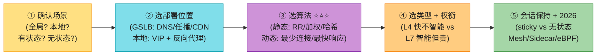

> 💡 **关键信号词**:**"LB = 流量分发 + 健康检查 + 故障转移"** + **"L4 看 IP+Port 快,L7 看 HTTP 头智能"** + **"无状态服务优先,sticky session 是有状态应用的兜底,更好是把 session 移到 Redis"** + **"微服务间 LB 在 2026 是 Service Mesh Sidecar(Envoy),不是中心化 LB"**——这四句直接拿下面试。

---

## 🗺️ 章节概览

| 小节 | 要点 | 重要性 |
|------|------|--------|
| **网络组件区分** | LB / 反向代理 / 正向代理 / API Gateway 的边界 | ⭐⭐⭐⭐ |
| **LB 收益** | 高可用/扩展/性能/容错/资源利用/安全 | ⭐⭐⭐ |
| **LB 部署位置** | 全局 GSLB(ADC/DNS/CDN)+ 本地 LB(VIP) | ⭐⭐⭐⭐ |
| **静态算法** | 轮询/加权轮询/IP 哈希 | ⭐⭐⭐⭐ |
| **动态算法 ⭐** | 最少连接/最快响应/最少负载(原书分类有错,本章纠正) | ⭐⭐⭐⭐⭐ |
| **一致性哈希做 LB(补)** | 加减节点只迁移 k/n,接 SDE-Vol1 Ch5 | ⭐⭐⭐⭐⭐ |
| **会话保持** | 有状态 sticky(cookie/IP)vs 无状态 | ⭐⭐⭐⭐⭐ |
| **L4 vs L7 ⭐⭐⭐** | 传输层快但不智能 vs 应用层智能但贵 | ⭐⭐⭐⭐⭐ |
| **硬件/软件/云 LB** | F5 vs Nginx/HAProxy vs LBaaS(ALB/NLB) | ⭐⭐⭐ |
| **Nginx 实战** | upstream/健康检查/限流/session 持久化 | ⭐⭐⭐⭐ |
| **2026增量(补)** | 一致性哈希/Maglev/Mesh Sidecar/AWS全家桶/GA+Route53/eBPF/金丝雀蓝绿 | ⭐⭐⭐⭐⭐ |

---

## 1. 开篇:为什么需要负载均衡?

Ch1 讲过,**水平扩展**是应对单机过载的方案——但加完机器,马上面临新问题:**客户端的请求到底发给哪一台?** 这就是 LB 登场的时机。

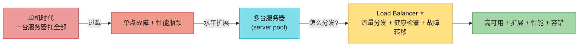

> 📝 **类比(原书用的)**:就像一个人创业单干,后来雇更多人、把任务**分发**给每个人——公司(LB)负责调度,确保没有一个员工(服务器)累死,也没有一个闲死。

LB 是 Ch1 七大概念中**可用性(failover)+ 可扩展性(水平)+ 容错(健康检查摘除)**三者在网络层的具体落地。理解 LB,就是理解"流量如何在多机间流动"。

---

## 2. 网络组件全景:LB / 反向代理 / 正向代理 / API Gateway

原书先厘清四个常被混淆的网络组件。它们**长得像**(都是流量中介),但**位置、方向、职责**完全不同——这是面试"概念区分题"的高频考点。

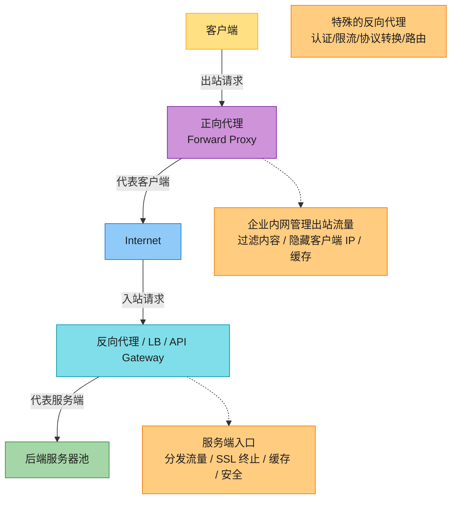

### 四组件对比表(背)

| 组件 | 方向 | 代表谁 | 核心职责 | 典型产品 |
|------|------|--------|---------|---------|
| **正向代理 (Forward Proxy)** | 出站(客户端→网) | 客户端 | 企业内网管理出站、过滤内容、隐藏客户端 IP、缓存 | Squid、企业 Web 网关 |
| **反向代理 (Reverse Proxy)** | 入站(网→服务端) | 服务端 | SSL 终止、缓存、压缩、隐藏后端、负载均衡 | Nginx、HAProxy、Varnish |
| **负载均衡器 (LB)** | 入站 | 服务端 | 流量分发 + 健康检查 + 故障转移(L4/L7) | AWS ALB/NLB、F5、Nginx |
| **API Gateway** | 入站 | 服务端 | 反向代理的升级版:认证/限流/协议转换/路由/版本管理 | Kong、APISIX、AWS API Gateway |

> 💡 **关键洞察(背)**:**反向代理和 LB 高度重叠**——Nginx 既是反向代理又是 LB;**API Gateway 是"加料版反向代理"**,在 LB 之上多了认证、限流、协议转换(详见 Ch9 AWS API Gateway)。原书说"LB 和 API Gateway 的功能边界这些年越来越模糊",2026 趋势是**API Gateway 吃掉部分 LB 功能**(路由/灰度),但**纯流量分发仍是 LB 的核心**。

> 🪤 **追问陷阱(高频)**:"LB 和反向代理什么关系?" → **反向代理是"位置概念"(代表服务端收请求),LB 是"功能概念"(分发流量)**。大多数反向代理都内置 LB 功能(Nginx),大多数 LB 也工作在反向代理模式。**不是二选一,是叠加**:一个组件可以同时是反向代理 + LB + API Gateway。

---

## 3. 负载均衡的收益(为什么一定要用 LB)

原书列了五大收益,它们直接对应 Ch1 的七大概念:

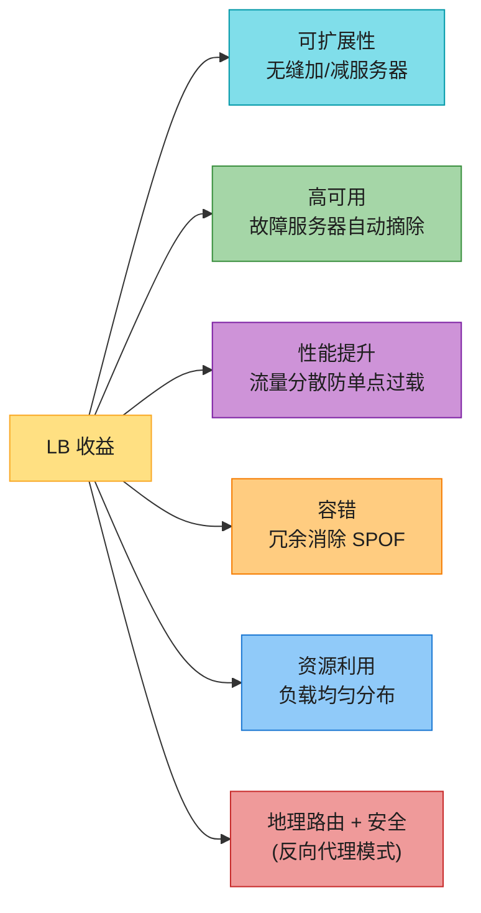

| 收益 | 做法 | 对应 Ch1 概念 |
|------|------|--------------|
| **可扩展性** | 加/减服务器对 LB 透明,配合 autoscaling(Ch11) | 可扩展性(水平) |
| **高可用** | 服务器维护/故障时,流量自动 reroute 到健康节点 | 可用性(failover) |
| **性能** | 流量分散,防单点过载,保吞吐和延迟 | 延迟 vs 吞吐 |
| **容错** | 多副本 + LB 摘除,消除 SPOF | 容错(复制+健康检查) |
| **资源利用** | 算法均匀分发,防某台闲死某台累死 | — |
| **地理路由 + 安全** | 按用户地理位置路由;反向代理模式挡恶意流量 | 八谬误"网络安全" |

> 💡 **原书的关键建议(背)**:**推荐后端服务器无状态(stateless),确保从池中移除服务器时不丢数据**。这是 Ch1 反复强调的"无状态可扩展"在网络层的呼应——也是为什么 sticky session 是"兜底"而不是"首选"(见第 6 节会话保持)。

---

## 4. LB 部署位置:全局 GSLB vs 本地 LB ⭐⭐⭐⭐

LB 不是只在一个地方用。原书把部署位置分成**全局(GSLB)**和**本地(Local)**两层——这是"多区域架构"的基石。

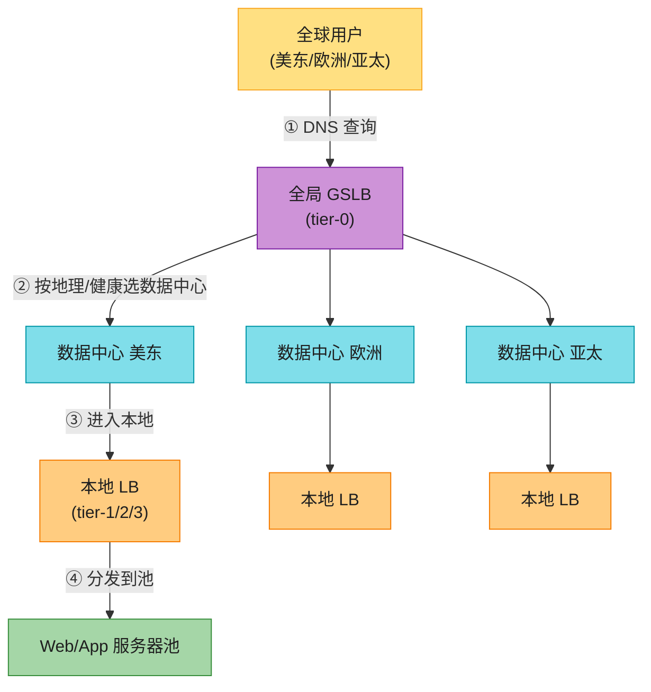

### 4.1 全局服务器负载均衡(GSLB)

GSLB 在**更大尺度**上工作——跨数据中心、跨地理区域。目标是把用户导到**最近或最健康**的数据中心,优化体验、保合规。原书讲三种实现:

| 方式 | 做法 | 优点 | 局限 |
|------|------|------|------|
| **ADC-based GSLB** | 应用交付控制器(ADC)有服务器实时视图,按健康和容量转发 | 实时性强 | 需专用 ADC 硬件/软件 |
| **DNS-based GSLB** ⭐ | DNS 解析时分析客户端 IP 位置,返回**地理最近**数据中心的 IP | 简单、原生支持、最常用 | DNS 缓存导致切换慢(TTL 权衡) |
| **CDN-based GSLB** | 全球 CDN 把静态内容缓存在边缘节点,就近分发 | 静态内容极速 | 只适合静态/可缓存内容 |

> 💡 **DNS-based GSLB 的权衡(背)**:**DNS 缓存(TTL)是双刃剑**——长 TTL 减少 DNS 查询延迟,但故障切换慢(客户端还在用旧 IP);短 TTL 切换快,但 DNS 查询量飙升。**实际取 60-300 秒 TTL**。AWS Route 53 的**延迟路由(latency-based routing)**和**地理路由(geo routing)**就是 DNS-based GSLB 的代表。

### 4.2 本地负载均衡(Local Load Balancing)

本地 LB 在**单个数据中心/网络段内**工作,功能类似反向代理,用**虚拟 IP(VIP)**接收流量。

> 📝 **VIP(Virtual IP)关键概念**:VIP **不绑定单一物理机**,多台机器共享同一个 VIP。网卡故障时,包自动重定向到 failover 机器。**对外看是一台机器,对内是一组机器**。DNS 通常返回 VIP,实现无缝 reroute 和 failover。

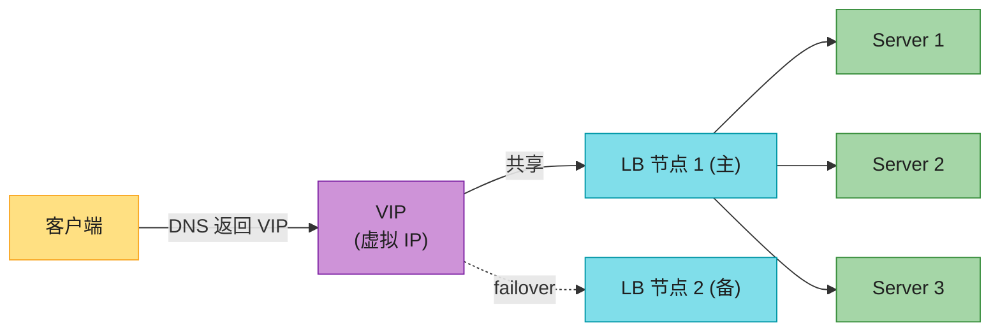

### 4.3 三层架构中的 LB 放置位置 ⭐⭐⭐

原书讲在**三层架构(web/app/db)**里,LB 可以放在每两层之间:

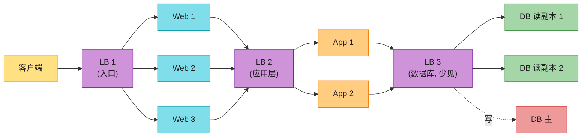

| 放置位置 | 作用 | 常见性 |
|---------|------|--------|
| **客户端 ↔ Web** | 入口流量分发,防 web 单点过载 | 最常见 ⭐ |
| **Web ↔ App** | 应用层请求分发,提升 app 扩展/容错/性能 | 常见 |
| **App ↔ DB** | 读查询分发到多副本(L7 LB 用 URL/HTTP 方法区分读写) | 较少见(数据一致性顾虑) |

> 🪤 **追问陷阱**:"为什么 App↔DB 之间放 LB 少见?" → **数据库 LB 涉及数据一致性和同步**。读可以分发到副本,但写必须到主。L7 LB 可以用 URL 路径或 HTTP 方法区分(`GET /path`→副本,`POST /path`→主),但这要求应用层协议是 HTTP。**传统数据库(MySQL/PostgreSQL)更常用代理(ProxySQL/PgBouncer)而不是通用 LB**。

---

## 5. 负载均衡算法 ⭐⭐⭐⭐⭐(本章核心之一)

LB 的核心是**算法**——决定每个请求发给谁。原书分**静态**和**动态**两类。**注意:原书把"最少连接"错误地放在静态算法里,本章纠正——它要看运行时连接数,是动态的。**

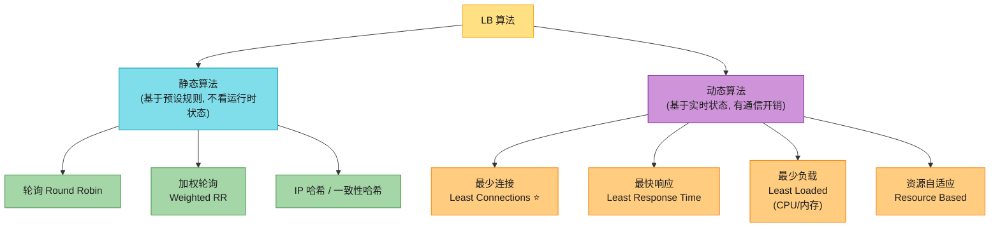

### 5.1 静态算法(不看运行时状态)

静态算法基于**预设的服务器配置**,不关心服务器当前的负载/连接/响应。**简单、开销低**,通常实现在单台路由器或通用机器上(所有请求汇聚点)。

#### 轮询(Round Robin)

按顺序一台台发——S1, S2, S3, S1, S2, S3... **最简单**。

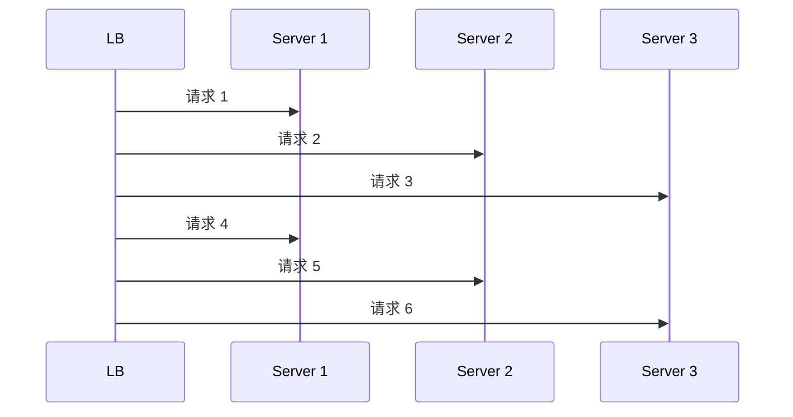

- **优点**:简单、无状态、负载天然均匀(请求数层面)。
- **缺点**:**不考虑服务器负载和响应时间**——S1 正在处理慢请求,LB 还往 S1 发,导致 S1 堆积。
- **适用**:服务器**配置相同 + 请求耗时均匀**(如纯静态内容)。

#### 加权轮询(Weighted Round Robin)

给每台服务器分配**权重**(按能力/容量),流量按权重比例分发。S1(weight=5), S2(weight=3), S3(weight=1) → S1 拿 50%,S2 拿 30%,S3 拿 10%。

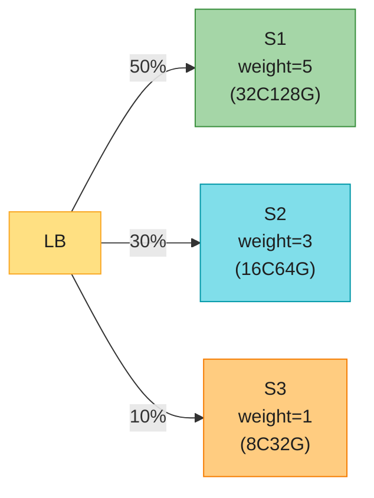

> 💡 **原书注**:大多数场景下,集群机器配置相同(为一致性),所以**简单轮询够用**。加权轮询主要用于**异构集群**(新老机器混用)。

#### 哈希算法(IP Hash / 一致性哈希)

用请求的某属性(源 IP、用户 ID、内容 key)生成哈希,映射到服务器。**保证相同属性的请求落到同一台**——天然实现会话保持。

| 哈希方式 | 做法 | 加减节点影响 |
|---------|------|-------------|
| **简单哈希 `hash % N`** | hash(key) 对 N 取模 | **几乎所有请求重映射** ⚠️ |
| **IP Hash(Nginx)** | hash(客户端 IP) → 服务器 | 仍依赖 N,加减节点大震荡 |
| **一致性哈希 ⭐** | 哈希环 + 顺时针查找 + 虚拟节点 | **只迁移 k/n 的数据**(见第 5.3 节) |

> 🪤 **原书的判断需要更新(背)**:原书说"哈希算法很少用,因为加减服务器时重映射问题严重"。**这在 2026 已经过时**——**一致性哈希 + 虚拟节点**(SDE-Vol1 Ch5)专门解决了重映射问题,是**无状态服务分片、CDN、Dynamo/Cassandra、Google Maglev LB** 的核心算法。**现代 LB 普遍支持一致性哈希**。

### 5.2 动态算法(看实时状态,有通信开销)

动态算法基于**当前或最近的服务器状态**,需要 LB 与服务器**通信**(健康检查、状态上报),有额外开销,但转发决策**更精准**。

#### 最少连接(Least Connections)⭐ —— 原书错放在静态,实为动态

把新请求发给**当前活跃连接数最少**的服务器。

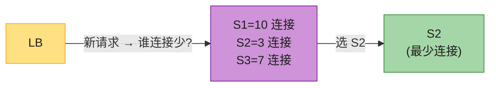

- **为什么是动态**:LB 必须实时**追踪每台服务器的活跃连接数**(运行时状态),这需要状态维护 + 通信。原书把它列在静态是**分类错误**。
- **适用**:**长连接**(WebSocket、数据库连接)或**请求耗时差异大**的场景——比轮询更精准。
- **缺点**:**不考虑服务器容量**——S1 是 32 核 S2 是 8 核,S2 连接少不代表它更闲(可能它已满载)。

#### 最快响应(Least Response Time)

把请求发给**响应最快**的服务器——监控历史响应时间,选最快的。

- **适用**:对延迟敏感的应用。**现代云 LB(AWS ALB/NLB)的默认倾向**。
- **缺点**:历史响应时间不代表未来(请求模式变化时滞后)。

#### 最少负载(Least Loaded)/ 资源自适应

评估每台服务器**当前负载**(CPU、内存、磁盘 I/O),发给负载最低的。**资源自适应(Resource Based)**还会根据服务器**可用资源**(CPU 空闲、内存余量)动态调整。

- **适用**:异构集群 + 工作负载差异大。
- **代价**:状态采集开销最大,LB 要持续接收服务器上报。

### 5.3 静态 vs 动态:核心权衡 ⭐⭐⭐

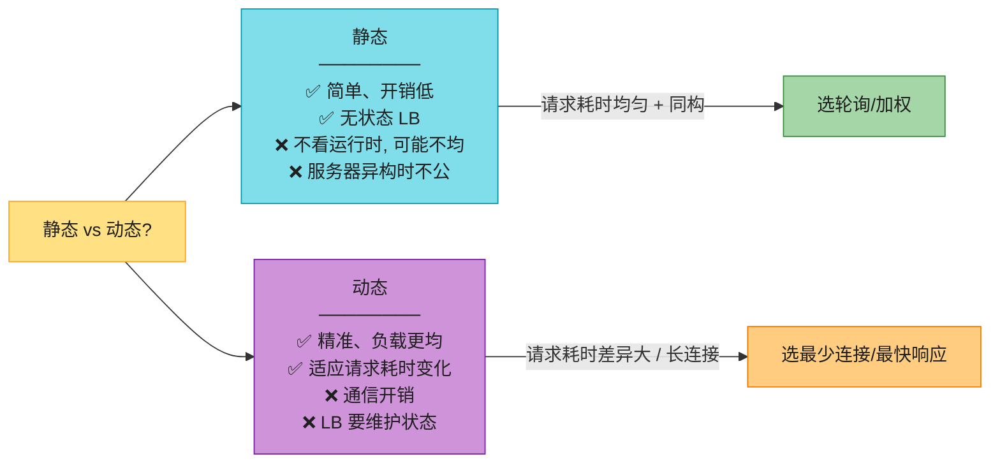

| 维度 | 静态 | 动态 |
|------|------|------|
| **决策依据** | 预设规则 | 实时状态 |
| **LB 复杂度** | 低(无状态) | 高(维护状态) |
| **通信开销** | 无 | 有(健康检查/状态上报) |
| **负载均匀度** | 请求数均匀,但**负载**未必 | 负载更均匀 |
| **适用** | 同构 + 请求均匀 | 异构 / 长连接 / 请求耗时差异大 |

> 💡 **选型口诀(背)**:**同构集群 + 请求耗时均匀 → 静态轮询/加权**;**异构 / 长连接 / 请求耗时差异大 → 动态最少连接 / 最快响应**;**需要会话保持 → 一致性哈希**。**实际系统常组合**(如加权最少连接)。

### 5.4 一致性哈希做 LB(2026 补,接 SDE-Vol1 Ch5)⭐⭐⭐⭐⭐

原书把哈希算法一笔带过,但**一致性哈希是 2026 LB 的核心算法之一**。它解决一个问题:**加减节点时,如何只迁移最少的请求/数据?**

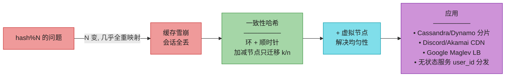

**为什么对 LB 重要**:

1. **会话保持的优雅实现**:用 `user_id` 一致性哈希到服务器,**加减节点时只有相邻区间的用户迁移**,大部分用户会话不变。
2. **缓存友好**:同一 key 总落到同一台,后端缓存命中率稳定。
3. **无状态服务分发**:把 `user_id` 哈希到服务实例,实现"逻辑分片"。

> 🔄 **2026 话术(直接背)**:"原书说哈希算法很少用,因为加减服务器重映射严重——**这是 2010 年代的认知**。2026 主流是**一致性哈希 + 虚拟节点**:把服务器和 key 都映射到环上,加减一台只迁移 k/n 的流量。**Google Maglev**(Google 的软件 LB)、**Cloudflare**(用一致性哈希做全球 LB)、**Cassandra/Dynamo**(数据分片)全靠它。**这是 LB 算法的'2026 必备'**,不是'很少用'。"

> 📝 **详见 SDE-Vol1 Ch5 设计一致性哈希**:手算环 + 虚拟节点 + Maglev/Jump Hash 变体。本章引用其结论,不重复推导。

---

## 6. 会话保持(Session Persistence)⭐⭐⭐⭐⭐

LB 的另一个核心问题:**同一个用户的多个请求,要不要发给同一台服务器?** 这就是**会话保持(粘性/sticky/affinity)**。它直接关系到 Ch1 强调的"无状态可扩展"。

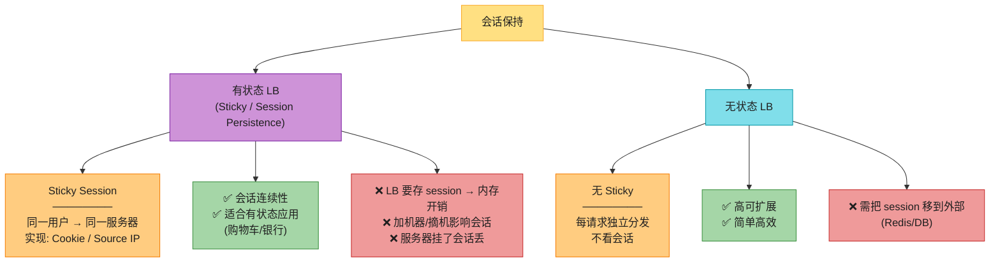

### 6.1 有状态 LB:Sticky Session 的两种实现

| 技术 | 做法 | 缺点 |
|------|------|------|
| **Cookie-based affinity** | 首次连接 LB 生成 session cookie,后续请求带 cookie → 路由到 cookie 指定的服务器 | cookie 可能被禁用/清空 |
| **Source IP affinity** | 同一客户端 IP 固定到同一服务器 | **NAT / 代理后失效**(企业出口共用 IP,所有人挤一台) |

> 🪤 **追问陷阱(高频)**:"Sticky session 有什么问题?" → ① **LB 内存开销**(存 session 表);② **扩缩容痛点**(加机器时新机器没历史会话,摘机器时会话丢);③ **服务器挂了那台的所有会话丢**(除非 session 复制,但更复杂);④ **Source IP 在 NAT/CDN 后失效**(整个公司或 CDN 节点共用一个 IP,全挤一台)。

### 6.2 无状态 LB:更好的方案 ⭐

**原书的明确建议(背)**:**评估业务后,简单推荐的方案是用无状态 LB + Redis(或类似数据存储)做会话管理**。

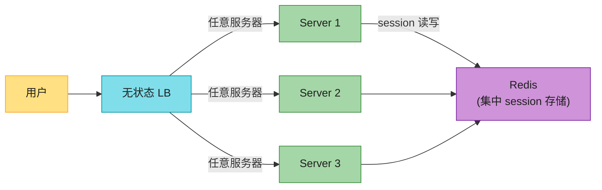

> 💡 **为什么无状态 + Redis 更好(背)**:
> - **可扩展**:服务器任意加减,会话不丢(在 Redis 里)。
> - **LB 简单**:无状态,任意一台 LB 都能服务任意请求(LB 本身也能水平扩展)。
> - **容错**:服务器挂了,用户下次请求落到别的服务器,从 Redis 恢复 session。
> - **代价**:每次请求多一次 Redis 查询(但 Redis ~1ms,可接受;还可配本地缓存降负载)。
>
> 这是 **SDE-Vol1 Ch1 "从零扩展到百万用户"第 4→5 集的核心演进**——把 session 从 web 层移出,才能真正 auto-scaling。

> 📝 **特殊场景**:原书提到 **Ch19 会讲 WhatsApp 规模的有状态服务器构建**——某些极致性能场景(如长连接 IM)必须有状态,这时用**一致性哈希 + 虚拟节点**做逻辑分片,而非简单 sticky。

---

## 7. LB 类型:按功能分类(L4 vs L7)⭐⭐⭐⭐⭐(本章最重要的对比)

LB 最核心的分类是按**OSI 模型工作的层**——L4(传输层)和 L7(应用层)。这是高级岗必问、且直接决定选型的知识点。

> 📝 OSI 七层模型详见 **Ch6 通信网络与协议**。本章只需知道:**L4 = 传输层(TCP/UDP,看 IP+Port)**,**L7 = 应用层(HTTP,看头/URL/Cookie)**。

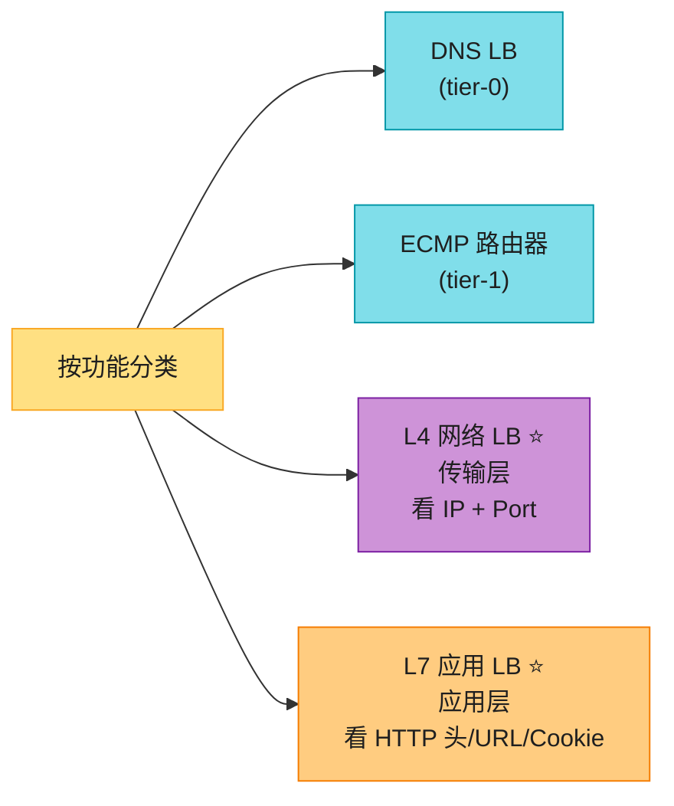

### 7.1 DNS 负载均衡(tier-0)

DNS 解析时,把域名映射到**不同 IP**(按预设策略)。最简单的 LB——**tier-0**(最外层)。

- **优点**:易配置,基础负载均衡。
- **缺点**:缺 L4/L7 的高级功能(健康检查弱、不能按内容路由)。DNS 缓存导致切换慢。
- **代表**:AWS Route 53、Azure Traffic Manager。

### 7.2 ECMP 路由器(tier-1)

**等价多路径(ECMP)** 路由器在网络层(L3)工作——把流量分散到**等代价的多条链路**,用**包头哈希**决定每个包走哪条。提升网络利用率 + 容错。

- **代表**:Cisco Nexus 交换机、Juniper 路由器。
- **作用**:网络层负载均衡,不是应用层。

### 7.3 L4 网络负载均衡器(传输层)⭐

L4 LB 工作在**传输层**,只看 **IP + 端口**,不解析应用层内容。主要处理 TCP/UDP/IP/FTP。

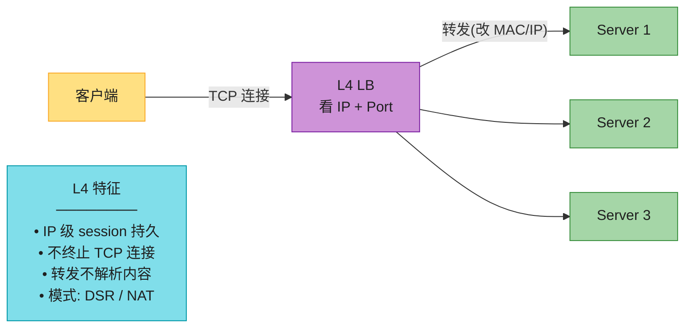

**L4 LB 的两种工作模式 ⭐⭐⭐**:

| 模式 | 做法 | 优点 | 缺点 |
|------|------|------|------|
| **DSR(Direct Server Return)** | TCP 连接在客户端↔后端直接建立,LB **只改目的 MAC 地址**,后端**直接回客户端** | LB 不成出口瓶颈(适合大回复流量:WebSocket、S3 下载) | 后端 IP 暴露给客户端(需特殊网络配置) |
| **NAT 模式** | 客户端连 VIP,LB 改目的 IP(DNAT)转发,LB 成后端默认网关,**所有流量过 LB** | 隐藏后端,安全 | LB 成瓶颈(出口带宽限 LB 容量) |

> 💡 **DSR vs NAT 权衡(背)**:**DSR 让后端直接回客户端,LB 不挡出口流量——适合回复远大于请求的场景(下载、视频、WebSocket)**;**NAT 模式所有流量过 LB,隐藏后端更安全,但 LB 成瓶颈**。AWS NLB 支持 DSR-like 的"客户端直连"模式。

**L4 特征汇总**:
- **IP 级 session 持久**:同一客户端 IP 路由到同一后端。
- **不终止 TCP**:不像 L7 那样拆成两段 TCP 连接,直接转发。
- **不解析内容**:看不到 HTTP 头/URL/Cookie,只看 IP+Port。
- **代表**:AWS NLB、Azure Load Balancer、Nginx(TCP/UDP 模式)、HAProxy。

### 7.4 L7 应用负载均衡器(应用层)⭐

L7 LB 工作在**应用层**,能看 **HTTP 头、URL、Cookie、请求体**,做**智能路由**。

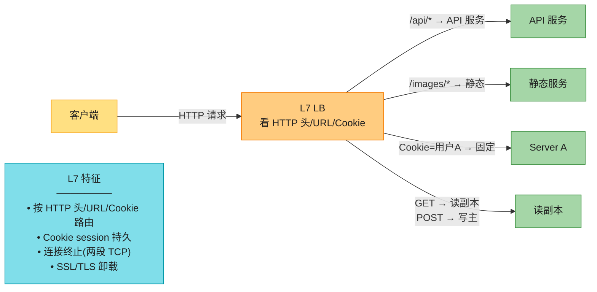

**L7 特征汇总**:
- **按应用层协议分发**:看 HTTP,能按 URL/头/Cookie 细粒度路由(读写分离、灰度、A/B)。
- **Cookie session 持久**:用 cookie 实现 sticky(比 IP 更可靠)。
- **连接终止**:为了提取 HTTP 信息,L7 **终止 TCP**,形成两段连接(客户端↔LB,LB↔后端)。**SSL/TLS 卸载**就是典型——LB 解密,后端收明文 HTTP。
- **代表**:AWS ALB、Azure Application Gateway、Nginx(HTTP 模式)。

### 7.5 L4 vs L7:核心权衡 ⭐⭐⭐⭐⭐(背)

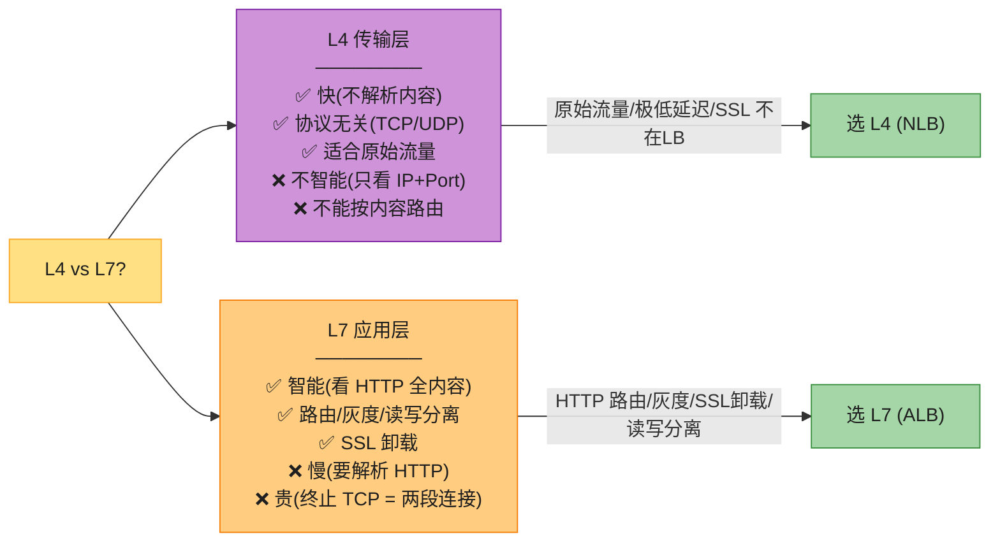

| 维度 | L4(传输层) | L7(应用层) |
|------|------------|------------|
| **看的字段** | IP + Port | HTTP 头/URL/Cookie/请求体 |
| **TCP 连接** | 不终止(透传/改 MAC) | **终止**(两段连接) |
| **协议** | TCP/UDP/FTP(协议无关) | HTTP/HTTPS/gRPC 等 |
| **性能** | 快(不解析) | 慢(解析 HTTP + 终止) |
| **智能路由** | 不能 | ✅ 按 URL/头/Cookie/方法 |
| **SSL 卸载** | 不行(看不到 TLS) | ✅(典型用途) |
| **session 持久** | IP 级 | Cookie 级(更可靠) |
| **典型产品** | AWS NLB、HAProxy(L4) | AWS ALB、Nginx、Envoy |
| **适用** | 极低延迟、原始 TCP/UDP、游戏、IoT | HTTP 应用、灰度发布、读写分离 |

> 🪤 **追问陷阱(超高频)**:"L4 和 L7 怎么选?" → **看是否需要看 HTTP 内容**。需要按 URL/Cookie/方法路由、做 SSL 卸载、灰度 → L7;只看 IP+Port、追求极低延迟、协议非 HTTP(游戏/IoT/MQTT)→ L4。**云上典型组合:外部入口 ALB(L7),内部服务间 NLB(L4),数据库 ProxySQL**。

> 💡 **连接终止的代价(背)**:L7 终止 TCP 意味着**客户端↔LB 和 LB↔后端是两条独立连接**——这给了 LB 灵活(可改协议、缓冲、重试),但也意味着 LB 要维护**两倍连接数** + **完整 HTTP 解析开销**。L4 不终止,只改 MAC/IP 转发,开销小一个量级。**这就是 L4 比 L7 快的本质原因**。

---

## 8. LB 类型:按配置分类(硬件 / 软件 / 云)

除了按功能(L4/L7),LB 还可按**部署形态**分三类:

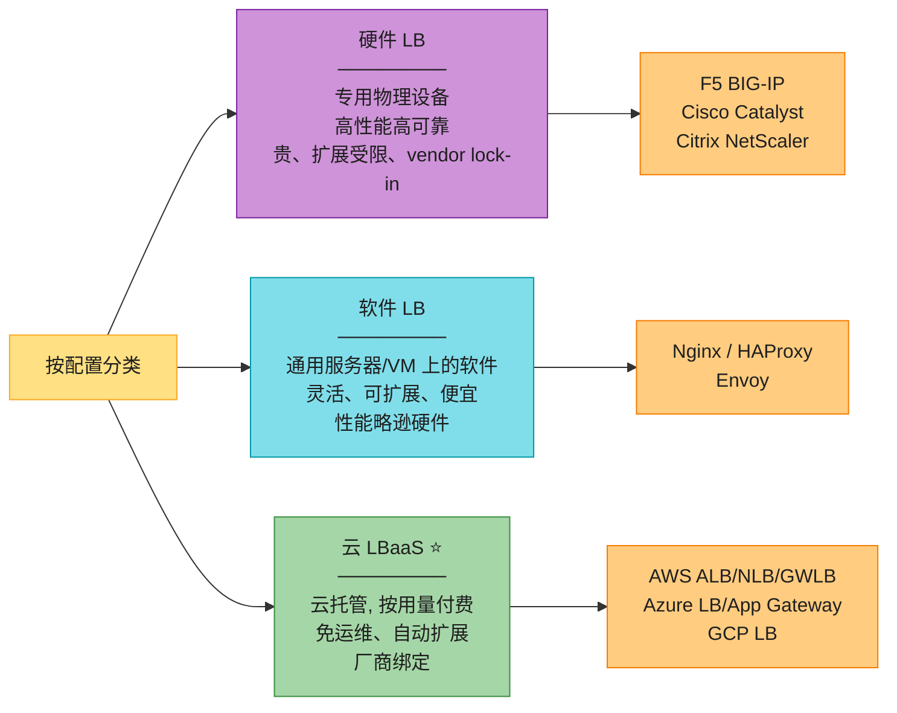

| 类型 | 特点 | 优点 | 缺点 | 代表 |
|------|------|------|------|------|
| **硬件 LB** | 专用物理设备,数据中心部署 | 极致性能/可靠 | 贵、扩展受硬件限、vendor lock-in、配置重 | F5 BIG-IP、Cisco Catalyst、Citrix NetScaler |
| **软件 LB** | 通用服务器/VM 上的软件 | 灵活、可扩展、便宜、可预测分析 | 性能略逊专用硬件 | Nginx、HAProxy、Envoy |
| **云 LBaaS** | 云厂商托管,按用量/SLA 付费 | 免运维、自动扩展、监控完善 | 厂商绑定 | AWS ALB/NLB/GWLB、Azure LB、GCP LB |

> 💡 **2026 趋势**:**云 LBaaS(LBaaS)已是主流**——免运维 + 自动扩展 + 按量付费。硬件 LB 退守**极致性能/合规/本地数据中心**场景;软件 LB 在云原生(K8s + Envoy sidecar)中是基石。

---

## 9. Nginx:开源 LB 实战

原书用 **Nginx** 作为开源 LB 的代表,讲它的能力 + 配置。Nginx 既是 **Web 服务器**,又是 **反向代理**,又是 **LB**(L4 + L7)。

### 9.1 Nginx 的 LB 能力

```mermaid
flowchart LR
    NGINX["Nginx"] --> F1["L4 + L7 LB<br/>(TCP/UDP + HTTP)"]
    NGINX --> F2["多种算法<br/>(轮询/最少连接/IP hash)"]
    NGINX --> F3["健康检查 + 故障检测"]
    NGINX --> F4["动态配置更新<br/>(不中断服务)"]
    NGINX --> F5["反向代理能力<br/>(SSL 终止/缓存/压缩)"]
    NGINX --> F6["session 持久化<br/>(IP hash)"]

    style NGINX fill:#A5D6A7,stroke:#388E3C,color:#1f1f1f
    style F1 fill:#80DEEA,stroke:#0097A7,color:#1f1f1f
    style F2 fill:#80DEEA,stroke:#0097A7,color:#1f1f1f
    style F3 fill:#80DEEA,stroke:#0097A7,color:#1f1f1f
    style F4 fill:#80DEEA,stroke:#0097A7,color:#1f1f1f
    style F5 fill:#80DEEA,stroke:#0097A7,color:#1f1f1f
    style F6 fill:#80DEEA,stroke:#0097A7,color:#1f1f1f
```

| 能力 | 说明 |
|------|------|
| **L4 + L7 LB** | 同时支持传输层(stream 模块)和应用层(http 模块) |
| **算法** | 轮询(默认)、最少连接(`least_conn`)、IP hash(`ip_hash`) |
| **健康检查** | 持续监控后端,自动摘除故障/降级节点(开源版被动检查,NGINX Plus 主动检查) |
| **动态配置** | 无中断更新(upstream、路由规则)——动态环境必备 |
| **反向代理** | SSL 终止、缓存、压缩 offload,提升后端性能 |

### 9.2 Nginx 配置示例(原书给的简化版)

```nginx
http {
    upstream backend_servers {           # 定义后端池
        server 10.0.0.1:8080;
        server 10.0.0.2:8080;
        server 10.0.0.3:8080;
        server 10.0.0.4:8080;
    }

    server {
        listen 80;
        server_name example.com;

        location / {
            proxy_pass http://backend_servers;   # 反向代理到池
            # 可加: proxy_set_header / 缓存 / 限流等
        }
    }
}
```

- **`upstream` 块**:定义后端服务器池,LB 在它们之间分发。
- **`proxy_pass`**:把请求代理到池,默认**轮询**算法。
- **算法切换**:`least_conn;` / `ip_hash;` 加在 upstream 块顶部即可。

> 💡 **2026 增量:Nginx 的算法局限(背)**:开源 Nginx **不支持一致性哈希**(只支持简单 IP hash),也不支持**加权最少连接**(只有加权轮询)。需要一致性哈希要用 `hash $key consistent;`(Nginx 1.7.2+)或上 **Nginx Plus / Envoy / HAProxy**。这是 2026 微服务转向 Envoy 的原因之一。

---

## 2026 现代增量(原书没讲的硬核)⭐⭐⭐⭐⭐

原书(2023)的网络组件区分、GSLB、算法、会话保持、L4/L7、Nginx 讲得系统,但**几处停在 2022**。以下是 2026 必补的硬核料——面试讲出来直接拉开档次。

### 增量 1:一致性哈希 + Maglev —— 原书漏掉的 LB 主流算法 ⭐⭐⭐⭐⭐

原书说哈希算法"很少用",但 2026 主流 LB 大量用一致性哈希及其变体。

```mermaid
flowchart LR
    OLD["原书: 哈希算法很少用<br/>(重映射问题)"] -->|"2026"| NEW["一致性哈希 + 变体是主流 ⭐"]
    NEW --> W1["经典一致性哈希 (Karger)<br/>────────<br/>环 + 虚拟节点<br/>Cassandra / Discord / Akamai"]
    NEW --> W2["Maglev (Google)<br/>────────<br/>固定查找表 O(1)<br/>Google LB / Cloudflare / AWS NLB 内部"]
    NEW --> W3["Jump Consistent Hash (Google)<br/>────────<br/>O(log N) 内存极省<br/>适合 N 已知且稳定的场景"]

    style OLD fill:#FFCC80,stroke:#F57C00,color:#1f1f1f
    style NEW fill:#A5D6A7,stroke:#388E3C,color:#1f1f1f
    style W1 fill:#80DEEA,stroke:#0097A7,color:#1f1f1f
    style W2 fill:#CE93D8,stroke:#7B1FA2,color:#1f1f1f
    style W3 fill:#CE93D8,stroke:#7B1FA2,color:#1f1f1f
```

| 算法 | 查找复杂度 | 均匀性 | 迁移量 | 典型应用 |
|------|-----------|--------|--------|---------|
| **经典一致性哈希(Karger)** | O(log N) 二分 | 依赖虚拟节点(100-200 个,标准差 5-10%) | k/n | Cassandra、Discord、Akamai |
| **Maglev(Google)** | O(1) 查表 | 很好(查表预计算) | 最少(查表重算) | Google LB、Cloudflare、GCP |
| **Jump Hash(Google)** | O(log N) | 好 | 最小 | 适合 N 稳定的分片 |

> 🔄 **2026 话术(直接背)**:"原书说哈希算法很少用——这是 2010 年代认知。2026 主流 LB 普遍用一致性哈希:**Google Maglev**(每秒百万包的软件 LB)用固定查找表实现 O(1) 一致性哈希;**Cloudflare** 用 Maglev 做全球 LB;**AWS NLB** 内部也用类似算法。**对于网络 LB,Maglev 比经典一致性哈希更优**(O(1) 查找 + 迁移最少)。这是 LB 算法的 2026 必备知识,不是'很少用'。"

### 增量 2:L4 vs L7 深入 —— 连接追踪 / DSCP / 灰度 ⭐⭐⭐⭐

原书讲了 L4/L7 基本区别,但没深入"为什么 L4 快"、"L7 智能在哪":

- **L4 快的本质**:**连接追踪(conntrack)** 只维护四元组(源 IP/Port + 目的 IP/Port)→ 转发表,内核态转发,开销极低。**eBPF/Cilium**(见增量 6)让 L4 在内核态绕过 iptables,更快。
- **L7 智能的本质**:解析 HTTP 后能做**内容路由**——`/api/v1/*` 到旧版,`/api/v2/*` 到新版(灰度);`GET` 到读副本,`POST` 到主(读写分离);按 Cookie 做 A/B 测试。
- **DSCP(差分服务代码点)小知识**:L4 LB 可基于 IP 头的 **DSCP 字段**做流量优先级标记,配合 QoS 实现流量分级——这是 L4 "不看内容但能做粗粒度流量工程"的技巧。

### 增量 3:Service Mesh / Sidecar LB ⭐⭐⭐⭐⭐(2026 微服务主流,原书完全没提)

原书讲的是**中心化 LB**(客户端 → LB → 后端)。但 2026 微服务架构里,**服务间通信的 LB 已转向 Sidecar 模式**——这是 Service Mesh 的核心。

```mermaid
flowchart LR
    subgraph OLD_CENTRAL["传统中心化 LB"]
        direction LR
        A1["服务 A"] -->|"调用"| CLB["中心化 LB"]
        CLB --> B1["服务 B1"]
        CLB --> B2["服务 B2"]
    end

    subgraph NEW_MESH["2026 Service Mesh (Sidecar)"]
        direction LR
        SA["服务 A"] -->|"本地调用"| SCA["Sidecar A<br/>(Envoy)"]
        SCA -->|"LB + mTLS"| SCB1["Sidecar B1"]
        SCA --> SCB2["Sidecar B2"]
        SCB1 --> SB1["服务 B1"]
        SCB2 --> SB2["服务 B2"]
    end

    style OLD_CENTRAL fill:#FFCC80,stroke:#F57C00,color:#1f1f1f
    style A1 fill:#80DEEA,stroke:#0097A7,color:#1f1f1f
    style CLB fill:#EF9A9A,stroke:#C62828,color:#1f1f1f
    style B1 fill:#A5D6A7,stroke:#388E3C,color:#1f1f1f
    style B2 fill:#A5D6A7,stroke:#388E3C,color:#1f1f1f

    style NEW_MESH fill:#A5D6A7,stroke:#388E3C,color:#1f1f1f
    style SA fill:#80DEEA,stroke:#0097A7,color:#1f1f1f
    style SCA fill:#CE93D8,stroke:#7B1FA2,color:#1f1f1f
    style SCB1 fill:#CE93D8,stroke:#7B1FA2,color:#1f1f1f
    style SCB2 fill:#CE93D8,stroke:#7B1FA2,color:#1f1f1f
    style SB1 fill:#A5D6A7,stroke:#388E3C,color:#1f1f1f
    style SB2 fill:#A5D6A7,stroke:#388E3C,color:#1f1f1f
```

**Service Mesh 的核心思想**:把 LB 功能从"中心化设备"下沉到**每个服务旁边的 Sidecar 代理**(Envoy)。服务调用只发到本地 Sidecar,Sidecar 负责:**服务发现 + LB + 重试 + 熔断 + mTLS + 可观测**。

| 维度 | 传统中心化 LB | Service Mesh Sidecar |
|------|--------------|---------------------|
| **LB 位置** | 集中(客户端→LB→后端) | 分布(每个服务旁一个 Sidecar) |
| **服务发现** | LB 集中维护 | Sidecar 从控制面同步 |
| **LB 算法** | LB 配置 | Sidecar 配置(轮询/最少连接/一致性哈希) |
| **mTLS** | 在入口 LB 做 | **每跳都做**(服务间零信任) |
| **重试/熔断** | 应用代码 | Sidecar 统一实现 |
| **可观测** | LB 指标 | 每跳 trace/metric |
| **代表** | AWS ALB/NLB、Nginx | Istio + Envoy、Linkerd |

> 🔄 **2026 话术(直接背,接 SDE-Vol1 Ch1)**:"原书讲的 LB 是**中心化入口 LB**(客户端→LB→后端)。但 2026 微服务架构里,**服务间通信的 LB 已转向 Service Mesh Sidecar 模式**——每个服务旁部署一个 Envoy 代理,服务调用只发到本地 Sidecar,Sidecar 负责 LB + 服务发现 + 重试 + 熔断 + mTLS + 可观测。**这是 SDE-Vol1 Ch1 说的'LB 能力下沉到每台机器'的工程化落地**。代表:Istio + Envoy、Linkerd。**web 层水平扩展在 2026 默认是 K8s + Service Mesh**,不是手动加机器。"

> 📝 **Sidecar 的代价**:每个服务多一个代理 = 资源开销 + 一跳延迟(~1ms)。**轻量级 Mesh(Linkerd 用 Rust)**比 Envoy 省资源。**eBPF Mesh(Cilium Service Mesh)**正在尝试把 sidecar 功能下沉到内核,进一步降开销(见增量 5)。

### 增量 4:AWS LB 全家桶(ALB / NLB / GWLB / CLB)⭐⭐⭐⭐⭐

原书只在 NOTE 里提了"AWS 有 ELB,Ch9 详讲"。但这是面试**直接问 AWS** 的高频点,本章补全:

```mermaid
flowchart TD
    ELB["AWS Elastic Load Balancing"] --> ALB["ALB 应用型 ⭐<br/>────────<br/>L7 HTTP/HTTPS/gRPC<br/>按 URL/Host/Cookie 路由<br/>SSL 卸载 + 灰度<br/>适合 Web/API"]
    ELB --> NLB["NLB 网络型 ⭐<br/>────────<br/>L4 TCP/UDP<br/>极低延迟(单毫秒)<br/>每秒百万连接<br/>静态 IP + 任播"]
    ELB --> GWLB["GWLB 网关型<br/>────────<br/>L3/GW 层<br/>第三方安全设备<br/>(防火墙/IDS)流量分发"]
    ELB --> CLB["CLB 经典型(旧)<br/>────────<br/>L4/L7 混合<br/>向后兼容<br/>不推荐新用"]

    style ELB fill:#FFE082,stroke:#F9A825,color:#1f1f1f
    style ALB fill:#FFCC80,stroke:#F57C00,color:#1f1f1f
    style NLB fill:#CE93D8,stroke:#7B1FA2,color:#1f1f1f
    style GWLB fill:#80DEEA,stroke:#0097A7,color:#1f1f1f
    style CLB fill:#EF9A9A,stroke:#C62828,color:#1f1f1f
```

| AWS LB | 层 | 特点 | 典型场景 |
|--------|-----|------|---------|
| **ALB(Application LB)** | L7 | HTTP/HTTPS/gRPC/WebSocket;按 URL/Host/Cookie 路由;SSL 卸载;加权目标组(灰度);内置 WAF | Web 应用、API、微服务入口 |
| **NLB(Network LB)** | L4 | TCP/UDP;**极低延迟(单毫秒)**;每秒百万连接;**静态 IP + 任播**;支持 DSR-like 直连 | 游戏、IoT、MQTT、极低延迟、非 HTTP |
| **GWLB(Gateway LB)** | L3/GW | 把流量分发到**第三方安全设备**(防火墙、IDS/IPS、DLP);GENEVE 隧道 | 安全设备池化、入侵检测 |
| **CLB(Classic LB,旧)** | L4/L7 | 历史遗留,L4/L7 混合;**不推荐新用** | 老系统兼容 |

> 💡 **选型口诀(背)**:**HTTP 应用 → ALB;极低延迟 / 非 HTTP / 静态 IP → NLB;安全设备池 → GWLB;别用 CLB**。**ALB + NLB 组合**:外部入口 ALB(L7 路由 + SSL),内部服务间 NLB(L4 低延迟),这是 AWS 上的标准模式。

> 🪤 **追问陷阱(高频)**:"ALB 和 NLB 怎么选?" → **看协议和延迟要求**。HTTP/HTTPS 且需要按 URL/Cookie 路由、SSL 卸载、灰度 → ALB;TCP/UDP 或追求单毫秒延迟、每秒百万连接、需要静态 IP/任播 → NLB。**典型组合:外部 ALB,内部 NLB**。

### 增量 5:Global Accelerator + Route 53 —— 任播 + 健康检查的全球 LB ⭐⭐⭐⭐

原书讲了 GSLB(DNS/CDN),但没提 **AWS Global Accelerator**——这是 AWS 的"任播全球 LB"。

```mermaid
flowchart LR
    USER1["用户(亚太)"] -->|"接入最近边缘"| EDGE1["AWS 边缘节点<br/>(东京)"]
    USER2["用户(欧洲)"] --> EDGE2["AWS 边缘节点<br/>(法兰克福)"]
    EDGE1 -->|"任播 + AWS 内网"| GA["Global Accelerator<br/>(任播 IP + 健康检查)"]
    EDGE2 --> GA
    GA -->|"健康检查最优"| R1["Region 美东"]
    GA -->|"健康检查次优"| R2["Region 欧洲"]
    GA -.->|"故障自动切换"| R3["Region 亚太"]

    DNS["Route 53<br/>────────<br/>DNS-based GSLB<br/>延迟路由 / 地理路由<br/>健康检查 + 故障切换"]

    style USER1 fill:#FFE082,stroke:#F9A825,color:#1f1f1f
    style USER2 fill:#FFE082,stroke:#F9A825,color:#1f1f1f
    style EDGE1 fill:#80DEEA,stroke:#0097A7,color:#1f1f1f
    style EDGE2 fill:#80DEEA,stroke:#0097A7,color:#1f1f1f
    style GA fill:#CE93D8,stroke:#7B1FA2,color:#1f1f1f
    style R1 fill:#A5D6A7,stroke:#388E3C,color:#1f1f1f
    style R2 fill:#A5D6A7,stroke:#388E3C,color:#1f1f1f
    style R3 fill:#A5D6A7,stroke:#388E3C,color:#1f1f1f
    style DNS fill:#FFCC80,stroke:#F57C00,color:#1f1f1f
```

| 服务 | 作用 | 关键特性 |
|------|------|---------|
| **Route 53** | DNS-based GSLB(tier-0) | 延迟路由、地理路由、健康检查 + 故障切换、加权路由(灰度) |
| **Global Accelerator** | 任播 IP 全球 LB | **两个固定任播 IP**;用户接入最近 AWS 边缘 → 走 AWS 内网到最优 Region;**比 DNS 切换快**(无 DNS 缓存问题);适合非 HTTP(TCP/UDP)和低延迟全球服务 |

> 💡 **Global Accelerator vs Route 53(背)**:**Route 53 是 DNS-based GSLB**,受 DNS 缓存影响,故障切换慢(60-300s TTL);**Global Accelerator 是任播 IP**,用户接入最近边缘后走 AWS 内网,**无 DNS 缓存问题,故障切换秒级**。**Global Accelerator 更适合:全球低延迟、非 HTTP、需要静态 IP、快速故障切换**。两者常组合使用。

### 增量 6:eBPF / Cilium —— 内核态 LB,2026 K8s 新趋势 ⭐⭐⭐⭐

原书完全没提。**eBPF(extended Berkeley Packet Filter)** 是 2026 云原生 LB 的新范式——把 LB 逻辑放进**内核态**,绕过 iptables。

```mermaid
flowchart LR
    OLD["传统 K8s LB<br/>────────<br/>kube-proxy + iptables<br/>每条规则一次 iptables 查询<br/>规则多时 O(n) 慢"]
    OLD -->|"问题"| PB["大集群规则爆炸<br/>iptables 成瓶颈"]
    PB -->|"2026"| NEW["eBPF / Cilium ⭐<br/>────────<br/>内核态 LB 逻辑<br/>绕过 iptables<br/>O(1) 查找 + 一致性哈希"]
    NEW --> CILIUM["Cilium<br/>(CNCF 项目)<br/>替代 kube-proxy<br/>Pod 间 LB + 安全 + 可观测"]

    style OLD fill:#FFCC80,stroke:#F57C00,color:#1f1f1f
    style PB fill:#EF9A9A,stroke:#C62828,color:#1f1f1f
    style NEW fill:#A5D6A7,stroke:#388E3C,color:#1f1f1f
    style CILIUM fill:#CE93D8,stroke:#7B1FA2,color:#1f1f1f
```

> 🔄 **2026 话术(直接背)**:"原书没提,但 2026 K8s 集群的 LB 正在从 **kube-proxy + iptables** 转向 **eBPF / Cilium**。传统 kube-proxy 用 iptables,每条服务规则一次查询,大集群(Issue: 规则上万)时 iptables 成瓶颈。**eBPF 把 LB 逻辑放进内核态,用一致性哈希 + O(1) 查找,绕过 iptables**。**Cilium(CNCF 项目)是代表**——它替代 kube-proxy,提供 Pod 间 LB + 网络安全 + 可观测,是下一代 K8s 网络 LB 的事实标准。**AWS、Google、Azure 都在自家的 K8s 里用 eBPF**。"

### 增量 7:金丝雀 / 蓝绿 / 流量切分 —— L7 LB 配合发布策略(接 Ch7)⭐⭐⭐⭐

L7 LB 不仅能分发流量,还能**按百分比切流量**——这是发布策略(金丝雀/蓝绿)的基石。详见 Ch7 部署,本章补 LB 视角。

```mermaid
flowchart LR
    RELEASE["发布策略"] --> CANARY["金丝雀 Canary<br/>────────<br/>新版本先接 1% 流量<br/>观察指标 → 逐步放量<br/>L7 LB 加权目标组"]
    RELEASE --> BLUEGREEN["蓝绿 Blue-Green<br/>────────<br/>两套环境(蓝/绿)<br/>LB 一次性切换<br/>回滚 = 切回"]
    RELEASE --> AB["A/B 测试<br/>────────<br/>按用户特征(Cookie/头)<br/>分流到不同版本<br/>L7 LB 按内容路由"]

    style RELEASE fill:#FFE082,stroke:#F9A825,color:#1f1f1f
    style CANARY fill:#80DEEA,stroke:#0097A7,color:#1f1f1f
    style BLUEGREEN fill:#CE93D8,stroke:#7B1FA2,color:#1f1f1f
    style AB fill:#FFCC80,stroke:#F57C00,color:#1f1f1f
```

| 策略 | LB 怎么做 | 优点 | 风险 |
|------|---------|------|------|
| **金丝雀** | ALB 加权目标组(95% 旧,5% 新)逐步调 | 影响小、可观察 | 需要指标监控 + 自动回滚 |
| **蓝绿** | LB 一次性把流量从蓝切到绿 | 切换干脆、回滚快 | 两套资源成本 |
| **A/B** | L7 LB 按 Cookie/Header 路由 | 按用户特征精准分组 | 配置复杂 |

> 💡 **AWS ALB 的"加权目标组"** 是金丝雀的标准实现——一个监听器规则指向多个目标组,每个目标组分配权重(0-999),ALB 按权重切流量。**这是 L7 LB "智能"的典型体现,L4 做不到**。

### 增量 8:纠正原书的算法分类错误 ⭐⭐⭐

原书把**"最少连接"列在静态算法**——这是错的。最少连接要看每台服务器**当前的活跃连接数**(运行时状态),需要 LB 持续追踪 + 通信,**符合动态算法定义**。正确分类:**静态(RR/加权/简单哈希)vs 动态(最少连接/最快响应/最少负载)**。**面试若被问,直接指出这个区别,显示比原书更精确**。

---

## ⚠️ 已过时 / 书里没说(2022 → 2026)

| 原书(2023) | 2026 现状 | 面试应对 |
|------------|----------|---------|
| 哈希算法"很少用" | **一致性哈希 + Maglev 是主流**(Cassandra/Google/Cloudflare) | 讲一致性哈希解决重映射 + Maglev O(1) |
| 最少连接归为静态 | **是动态算法**(看运行时连接数) | 纠正分类,显示精确 |
| 完全没提 Service Mesh / Sidecar | **微服务间 LB 的事实标准**(Istio/Envoy/Linkerd) | 讲 Sidecar 把 LB 下沉到每台机器 |
| AWS LB 只在 NOTE 点名 | **ALB/NLB/GWLB/CLB 全家桶要会区分** | 讲 ALB(L7) vs NLB(L4) vs GWLB(安全) |
| 没提 Global Accelerator | **任播 IP 全球 LB**,比 DNS GSLB 切换快 | 讲 GA vs Route 53(任播 vs DNS 缓存) |
| 没提 eBPF / Cilium | **K8s 内核态 LB 新趋势**(绕过 iptables) | 讲 eBPF 替代 kube-proxy |
| 没讲金丝雀/蓝绿 | **L7 LB 配合发布策略**(加权目标组) | 讲 ALB 加权目标组做金丝雀 |
| Nginx 不支持一致性哈希 | **开源 Nginx 1.7.2+ 支持 `hash key consistent`** | 补 Nginx 一致性哈希配置 |
| ECMP 讲得浅 | **Maglev 用 ECMP + 一致性哈希做软件 LB** | 讲 Google Maglev 实现 |

---

## 💻 代码示例

### 示例 1:静态算法(轮询 / 加权轮询)与动态算法(最少连接)

```python
import itertools

class RoundRobin:
    """轮询: 按顺序一台台发"""
    def __init__(self, servers):
        self.cycle = itertools.cycle(servers)
    def next(self):
        return next(self.cycle)

class WeightedRoundRobin:
    """加权轮询: 按权重展开后轮询 (S1=5,S2=3,S3=1 → S1占50%)"""
    def __init__(self, servers, weights):
        expanded = []
        for s, w in zip(servers, weights):
            expanded.extend([s] * w)
        self.cycle = itertools.cycle(expanded)
    def next(self):
        return next(self.cycle)

class LeastConnections:
    """最少连接 (动态): 看运行时连接数, 选最少的——原书错放在静态"""
    def __init__(self, servers):
        self.conns = {s: 0 for s in servers}   # 必须实时追踪 → 动态
    def acquire(self):
        server = min(self.conns, key=self.conns.get)
        self.conns[server] += 1
        return server
    def release(self, server):
        self.conns[server] -= 1

# 验证
wrr = WeightedRoundRobin(["S1","S2","S3"], [5,3,1])
counts = {"S1":0,"S2":0,"S3":0}
for _ in range(90): counts[wrr.next()] += 1
print(counts)  # {'S1':50,'S2':30,'S3':10} 比例正确

lc = LeastConnections(["S1","S2","S3"])
lc.conns = {"S1":10,"S2":3,"S3":7}   # 模拟当前连接
print(lc.acquire())  # S2 (连接最少)
```

### 示例 2:一致性哈希做 LB(接 SDE-Vol1 Ch5)

```python
import bisect
import hashlib

class ConsistentHashLB:
    def __init__(self, servers, vnodes=150):
        self.ring = []           # 排序的哈希点
        self.ring_map = {}       # 哈希点 → 服务器
        for s in servers:
            for i in range(vnodes):  # 每台 150 个虚拟节点
                h = self._hash(f"{s}#{i}")
                self.ring.append(h)
                self.ring_map[h] = s
        self.ring.sort()

    def _hash(self, s):
        return int(hashlib.md5(s.encode()).hexdigest(), 16)

    def get_server(self, key):
        h = self._hash(key)
        idx = bisect.bisect(self.ring, h)
        if idx == len(self.ring):
            idx = 0
        return self.ring_map[self.ring[idx]]

    def add_server(self, server, vnodes=150):
        # 加一台: 只影响相邻区间的 key
        for i in range(vnodes):
            h = self._hash(f"{server}#{i}")
            bisect.insort(self.ring, h)
            self.ring_map[h] = server

    def remove_server(self, server):
        # 减一台: 只影响该 server 负责的区间
        self.ring = [h for h in self.ring if self.ring_map[h] != server]
        self.ring_map = {h: s for h, s in self.ring_map.items() if s != server}

# 用法: 用户 ID 一致性哈希到服务器, 加减机器只迁移少数用户
lb = ConsistentHashLB(["S1", "S2", "S3"])
print(lb.get_server("user_1001"))  # 固定返回某台
print(lb.get_server("user_1002"))  # 固定返回某台
lb.add_server("S4")  # 加 S4, 只有相邻区间用户迁移
```

### 示例 3:Nginx 配置(算法切换 + 健康检查 + session 持久化)

```nginx
http {
    upstream backend_round_robin {
        server 10.0.0.1:8080;
        server 10.0.0.2:8080;
        server 10.0.0.3:8080;
        # 默认轮询
    }

    upstream backend_least_conn {
        least_conn;                        # 最少连接
        server 10.0.0.1:8080 max_fails=3 fail_timeout=30s;
        server 10.0.0.2:8080 max_fails=3 fail_timeout=30s;
        server 10.0.0.3:8080 max_fails=3 fail_timeout=30s;
    }

    upstream backend_ip_hash {
        ip_hash;                           # IP 哈希 (session 持久)
        server 10.0.0.1:8080;
        server 10.0.0.2:8080;
        server 10.0.0.3:8080;
    }

    upstream backend_consistent_hash {
        hash $request_uri consistent;      # 一致性哈希 (Nginx 1.7.2+)
        server 10.0.0.1:8080;
        server 10.0.0.2:8080;
        server 10.0.0.3:8080;
    }

    server {
        listen 443 ssl http2;
        server_name api.example.com;

        ssl_certificate     /etc/ssl/api.pem;     # SSL 卸载
        ssl_certificate_key /etc/ssl/api.key;

        # L7 路由: 不同路径到不同 upstream
        location /api/ {
            proxy_pass http://backend_least_conn;
        }
        location /static/ {
            proxy_pass http://backend_consistent_hash;   # 静态内容一致性哈希(缓存友好)
        }
        location /ws/ {
            proxy_pass http://backend_ip_hash;            # WebSocket 用 IP 哈希(长连接)
            proxy_http_version 1.1;
            proxy_set_header Upgrade $http_upgrade;
            proxy_set_header Connection "upgrade";
        }
    }
}
```

### 示例 4:加权目标组(金丝雀发布,AWS ALB 概念)

```python
# AWS ALB 加权目标组: 95% 流量到旧版, 5% 到新版(金丝雀)
canary_rule = {
    "listener_arn": "arn:aws:elasticloadbalancing:...:listener-rule/123",
    "conditions": [{"field": "path-pattern", "values": ["/*"]}],
    "actions": [
        {"type": "forward", "target_group_arn": "tg-stable-v1", "weight": 95},
        {"type": "forward", "target_group_arn": "tg-canary-v2", "weight": 5},
    ],
}
# 观察新版指标(p99 延迟、错误率)→ 逐步调权重 5→25→50→100
# 加权最少连接(HAProxy 风格)同理: 选 conns/weight 比值最小的 → 兼顾容量和负载
# 这就是 L7 LB "智能" 的典型体现, L4 做不到
```

---

## 🪤 追问陷阱(面试官最爱问,本章集)

1. **"LB 和反向代理什么关系?"** → 反向代理是"位置概念"(代表服务端),LB 是"功能概念"(分发流量)。Nginx 既是反向代理又是 LB,两者叠加不是二选一。

2. **"正向代理和反向代理区别?"** → **方向相反**:正向代理代表**客户端**(出站,企业内网管理);反向代理代表**服务端**(入站,SSL 终止/缓存/LB)。

3. **"LB 的核心收益?"** → 高可用(failover)+ 可扩展(加减机器)+ 性能(分散防过载)+ 容错(消除 SPOF)+ 资源利用(均匀)+ 地理路由/安全。

4. **"GSLB 和本地 LB 区别?"** → GSLB 跨数据中心/地理(用 DNS/任播/CDN,tier-0);本地 LB 在单数据中心内(用 VIP,tier-1/2/3)。GSLB 选数据中心,本地 LB 选服务器。

5. **"DNS-based GSLB 的权衡?"** → DNS 缓存(TTL)是双刃剑:长 TTL 减查询但故障切换慢,短 TTL 切换快但查询飙升。实际取 60-300s。**Global Accelerator 用任播 IP 无此问题**。

6. **"轮询和最少连接怎么选?"** → 同构集群 + 请求耗时均匀 → 轮询(简单);异构 / 长连接 / 请求耗时差异大 → 最少连接(精准)。

7. **"原书把最少连接归为静态,对吗?"** → **不对**。最少连接要看运行时连接数(动态状态),是**动态算法**。原书这里有分类错误。

8. **"IP Hash 有什么问题?"** → ① 加减节点重映射严重(原书说的);② NAT/CDN 后失效(共用 IP 挤一台)。**解法:用一致性哈希**——加减节点只迁移 k/n。

9. **"一致性哈希为什么对 LB 重要?"** → 加减节点只迁移相邻区间的流量,大部分会话不变。Google Maglev、Cloudflare、Cassandra 全用它。原书说"很少用"是过时认知。

10. **"Sticky session 有什么问题?"** → ① LB 内存开销(存 session 表);② 加减机器影响会话;③ 服务器挂了那台会话丢;④ Source IP 在 NAT/CDN 后失效。**更好:无状态 LB + Redis 集中存 session**。

11. **"L4 和 L7 怎么选?"** → 看是否需要看 HTTP 内容。需要按 URL/Cookie/方法路由、SSL 卸载、灰度 → L7;只看 IP+Port、极低延迟、非 HTTP(游戏/IoT)→ L4。**组合:外部 ALB,内部 NLB**。

12. **"L7 为什么比 L4 慢?"** → L7 终止 TCP(两段连接)+ 解析 HTTP,开销大一个量级。L4 只看 IP+Port,内核态转发(或 eBPF),开销极低。

13. **"DSR 和 NAT 模式区别?"** → DSR:LB 只改 MAC,后端直接回客户端(LB 不挡出口,适合大回复);NAT:LB 改 IP 转发,所有流量过 LB(隐藏后端更安全,但 LB 成瓶颈)。

14. **"AWS ALB 和 NLB 怎么选?"** → HTTP/HTTPS 且需要 URL/Cookie 路由、SSL 卸载、灰度 → ALB(L7);TCP/UDP、单毫秒延迟、每秒百万连接、静态 IP/任播 → NLB(L4)。**别用 CLB**。

15. **"Global Accelerator 和 Route 53 区别?"** → Route 53 是 DNS-based GSLB(DNS 缓存影响,切换慢);Global Accelerator 是任播 IP(无 DNS 缓存,秒级切换,走 AWS 内网)。**GA 更适合全球低延迟 + 快速故障切换**。

16. **"什么是 Service Mesh / Sidecar LB?"** → 把 LB 功能从中心化设备下沉到每个服务旁的 Sidecar 代理(Envoy),Sidecar 负责 LB + 服务发现 + 重试 + 熔断 + mTLS。**2026 微服务间 LB 的事实标准**(Istio/Linkerd)。

17. **"什么是 eBPF / Cilium LB?"** → 把 LB 逻辑放进内核态,绕过 iptables,O(1) 查找。Cilium 替代 kube-proxy,是下一代 K8s 网络 LB 的事实标准。**大集群 iptables 规则爆炸时,eBPF 是解法**。

18. **"Nginx 支持一致性哈希吗?"** → 开源 Nginx 1.7.2+ 支持 `hash $key consistent;`。早期 Nginx 只有 IP hash(简单哈希,加减节点大震荡)。需要完整一致性哈希用 Nginx Plus / Envoy / HAProxy。

19. **"金丝雀发布 LB 怎么配合?"** → L7 LB(如 AWS ALB)的**加权目标组**:一个监听器规则指向多个目标组,按权重(95% 旧,5% 新)切流量,逐步调权重观察指标。**L4 做不到按比例切流量**。

20. **"为什么推荐无状态后端?"** → 无状态服务器任意加减不丢数据,LB 简单(任意 LB 都能服务任意请求),可扩展。**session 移到 Redis 集中存**,这是 SDE-Vol1 Ch1 第 4→5 集的核心演进。

21. **"三层架构里 LB 放哪?"** → ① 客户端↔Web(最常见,入口分发);② Web↔App(常见,应用层分发);③ App↔DB(少见,数据一致性顾虑,需按读写分离)。

22. **"硬件 LB 和软件 LB 怎么选?"** → 硬件 LB(F5)极致性能但贵、扩展受限;软件 LB(Nginx/HAProxy)灵活便宜;**2026 云 LBaaS(ALB/NLB)是主流**,硬件退守极致性能/合规/本地数据中心。

23. **"Maglev 和经典一致性哈希区别?"** → Maglev 用固定查找表 O(1),经典用环 + 二分 O(log N)。**网络 LB 要求 O(1) + 超低延迟 → Maglev 更优**(Google LB/Cloudflare 用)。经典一致性哈希更适合通用数据分片(Cassandra)。

---

## 🏭 生产级产品速查表

| 产品/概念 | 层 | 特色 | 对应概念 |
|-----------|-----|------|---------|
| **AWS ALB** | L7 | HTTP/HTTPS/gRPC,URL/Cookie 路由,加权目标组(金丝雀),SSL 卸载 | L7 LB / 金丝雀 |
| **AWS NLB** | L4 | TCP/UDP,单毫秒延迟,每秒百万连接,静态 IP + 任播 | L4 LB / DSR |
| **AWS GWLB** | L3/GW | 第三方安全设备流量分发(GENEVE 隧道) | 安全设备池化 |
| **AWS CLB(旧)** | L4/L7 | 历史遗留,不推荐新用 | 向后兼容 |
| **AWS Route 53** | DNS(tier-0) | DNS-based GSLB,延迟/地理/加权路由,健康检查 | GSLB |
| **AWS Global Accelerator** | 任播 | 任播 IP 全球 LB,走 AWS 内网,秒级故障切换 | GSLB(无 DNS 缓存) |
| **Nginx** | L4 + L7 | 开源,反向代理 + LB + Web 服务器,upstream/健康检查 | 软件 LB |
| **HAProxy** | L4 + L7 | 高性能软件 LB,加权最少连接,一致性哈希 | 软件 LB |
| **Envoy** | L7 | 云原生 LB,Istio/Service Mesh 的 Sidecar | Service Mesh |
| **Istio** | Sidecar | Service Mesh 控制面 + Envoy 数据面 | Service Mesh |
| **Linkerd** | Sidecar | 轻量级 Service Mesh(Rust) | Service Mesh |
| **Cilium** | eBPF | 内核态 LB,替代 kube-proxy,K8s 网络 | eBPF LB |
| **F5 BIG-IP** | L4/L7 | 硬件 LB 标杆,极致性能 | 硬件 LB |
| **Kong / APISIX** | L7 | API Gateway,认证/限流/路由 | API Gateway |
| **Google Maglev** | L4 | 软件一致性哈希 LB,O(1) 查表,每秒百万包 | 一致性哈希/Maglev |

> 🏭 **业界标杆**:**AWS ALB/NLB/GWLB** 是云 LBaaS 全家桶;**Nginx** 是开源软件 LB 标杆;**Istio + Envoy** 是 Service Mesh 的事实标准;**Cilium** 是 eBPF 内核态 LB 的代表;**Google Maglev** 是软件一致性哈希 LB 的鼻祖;**F5 BIG-IP** 是硬件 LB 老牌;**Route 53 + Global Accelerator** 是 AWS 全球 GSLB 组合。

---

## 📝 本章要点总结

```mermaid
flowchart LR
    ROOT(["B3-Ch5 负载均衡<br/>流量分发 + 健康检查 + 故障转移 + 会话管理"])

    B1["网络组件 ⭐⭐<br/>────────<br/>• LB/反向代理/正向代理/API Gateway<br/>• 反向代理+LB 高度重叠<br/>• API Gateway = 加料反向代理"]
    B2["部署位置 ⭐⭐⭐⭐<br/>────────<br/>• GSLB: DNS/任播/CDN (tier-0)<br/>• 本地 LB: VIP (tier-1/2/3)<br/>• 三层架构: web/app/db 层间"]
    B3["算法 ⭐⭐⭐⭐⭐<br/>────────<br/>• 静态: RR/加权/哈希<br/>• 动态: 最少连接/最快响应<br/>(原书最少连接分类有错)<br/>• 一致性哈希: 加减节点只迁移 k/n"]
    B4["会话保持 ⭐⭐⭐⭐⭐<br/>────────<br/>• 有状态 sticky: Cookie/IP<br/>• 无状态: session 移 Redis<br/>• 推荐: 无状态 LB + Redis"]
    B5["L4 vs L7 ⭐⭐⭐⭐⭐<br/>────────<br/>• L4: IP+Port, 不终止 TCP, 快<br/>• L7: HTTP 头/URL, 终止 TCP, 智能<br/>• DSR vs NAT 模式"]
    B6["2026增量 ⭐⭐⭐⭐⭐<br/>────────<br/>• 一致性哈希+Maglev 是主流<br/>• Service Mesh Sidecar (Envoy)<br/>• AWS ALB/NLB/GWLB 全家桶<br/>• Global Accelerator 任播<br/>• eBPF/Cilium 内核态 LB<br/>• 金丝雀/蓝绿(加权目标组)"]

    ROOT --> B1
    ROOT --> B2
    ROOT --> B3
    ROOT --> B4
    ROOT --> B5
    ROOT --> B6

    style ROOT fill:#FFE082,stroke:#F57C00,color:#1f1f1f,stroke-width:3px
    style B1 fill:#80DEEA,stroke:#0097A7,color:#1f1f1f
    style B2 fill:#CE93D8,stroke:#7B1FA2,color:#1f1f1f
    style B3 fill:#EF9A9A,stroke:#C62828,color:#1f1f1f
    style B4 fill:#FFCC80,stroke:#F57C00,color:#1f1f1f
    style B5 fill:#A5D6A7,stroke:#388E3C,color:#1f1f1f
    style B6 fill:#90CAF9,stroke:#1976D2,color:#1f1f1f
```

**核心 Takeaways(背)**:

1. **LB = 流量分发 + 健康检查 + 故障转移 + 会话管理**——它是 Ch1 可用性/可扩展/容错三者在网络层的落地。水平扩展加完机器,请求怎么分发就是 LB 的职责。

2. **网络组件要分清**:正向代理(代表客户端,出站)vs 反向代理(代表服务端,入站)vs LB(分发流量)vs API Gateway(加料反向代理:认证/限流/路由)。**反向代理和 LB 高度重叠**(Nginx 都是)。

3. **LB 部署两层**:GSLB(跨数据中心,DNS/任播/CDN,tier-0)选数据中心;本地 LB(VIP,tier-1/2/3)选服务器。**三层架构里 LB 可放 web/app/db 层间**,但 DB 层少见(数据一致性顾虑)。

4. **算法分静态/动态,原书最少连接分类有错**:静态(RR/加权/简单哈希)不看运行时;**动态(最少连接/最快响应/最少负载)看实时状态**。最少连接是动态,不是静态。

5. **一致性哈希是 2026 LB 主流,不是"很少用"**:加减节点只迁移 k/n 的流量,Google Maglev/Cloudflare/Cassandra 全用。原书说"很少用"是过时认知。**Maglev(O(1) 查表)是网络 LB 的最优选**。

6. **会话保持优先无状态**:有状态 sticky(Cookie/IP)有内存开销 + 扩缩容痛点 + 单点丢失风险;**推荐无状态 LB + Redis 集中存 session**(SDE-Vol1 Ch1 第 4→5 集核心演进)。

7. **L4 vs L7 是核心权衡**:L4(IP+Port,不终止 TCP,快,协议无关)vs L7(HTTP 头/URL/Cookie,终止 TCP,智能但贵)。**看是否需要看 HTTP 内容**——需要路由/灰度/SSL 卸载 → L7;极低延迟/非 HTTP → L4。

8. **L4 的 DSR vs NAT**:DSR(LB 只改 MAC,后端直回,不挡出口,适合大回复);NAT(LB 改 IP,所有流量过 LB,隐藏后端但成瓶颈)。

9. **AWS LB 全家桶**:ALB(L7 HTTP,URL/Cookie 路由,加权目标组)、NLB(L4 TCP/UDP,单毫秒,静态 IP+任播)、GWLB(安全设备池)、CLB(旧,别用)。**外部 ALB + 内部 NLB 是标准组合**。

10. **2026 三大硬核增量**:① **一致性哈希 + Maglev**(不是"很少用",是主流);② **Service Mesh Sidecar**(Envoy,微服务间 LB 的事实标准);③ **eBPF/Cilium**(内核态 LB,绕过 iptables,K8s 新趋势)。**Global Accelerator**(任播 IP)+ **Route 53**(DNS GSLB)是 AWS 全球 LB 组合。

> 🔗 **连接上下章**:本章 **B3-Ch5 负载均衡** 上承 **aws_04 缓存**(缓存 + LB 是扩展的两把刀:LB 分发请求、缓存扛读——L7 LB 还常和缓存共部署做 SSL 卸载/压缩 offload)。下接 **aws_06 通信网络与协议**(LB 是网络协议之上的流量分发层;**OSI 七层模型**是 L4/L7 分类的理论基础;TCP 连接终止、DNS、HTTP 头这些 LB 依赖的概念都在 Ch6 详讲)。交叉引用 **SDE-Vol1 Ch1 从零扩展**(第 2 集"加 LB 那一步"是水平扩展的第一个组件;第 4→5 集"session 移出 web 层"是会话保持从 sticky 到无状态的演进)和 **Ch5 一致性哈希**(LB 的核心算法之一,加减节点只迁移 k/n,Maglev/Jump Hash 变体)。**Ch7 部署**会用本章的"加权目标组"讲金丝雀/蓝绿发布;**Ch9 AWS 计算/网络服务**会展开 ALB/NLB/GWLB 的细节;**Ch11 编排**会把 LB 和 autoscaling 结合。
