# Book 3 · Chapter 6: 通信网络与协议 (Communication Networks and Protocols)

> **本章定位**:这是 **《System Design on AWS》第 6 章**——讲**机器之间到底怎么"说话"**。如果说 Ch1 是"设计前的权衡",Ch5 是"流量分发到哪台机器",那 Ch6 回答的是更底层的两个问题:**① 机器之间用什么协议交换数据(OSI/TCP/IP 分层、TCP vs UDP、HTTP/SMTP/XMPP/MQTT)?② 用什么通信模式(Pull 轮询 / Push 推送 / RPC / REST / GraphQL / WebRTC)?** 一句话:**协议 = 机器之间约定的"语法 + 语义 + 时序",通信模型 = 谁主动、谁等待、数据怎么编码**。它是 Ch5 L4/L7 分类的理论基础(L4=传输层、L7=应用层都来自本章 OSI 模型),也是后续 Ch7 容器网络、Ch9 AWS 网络、Ch19 聊天系统的地基。

> **本章和原书的区别**:原书(2023 O'Reilly)把**OSI 七层、TCP/IP 四层、TCP 三次握手/拥塞控制、UDP、HTTP/1.1-2-3、SMTP/POP/IMAP、XMPP、MQTT、轮询/长轮询/WebSocket/SSE、RPC/REST/GraphQL、WebRTC**讲得相当系统——是面试"网络协议"题的标准答案骨架。但**几处停在 2022**:① **HTTP/3 + QUIC 只点了一句"用 UDP"**——而 2022 年正式标准化后,**QUIC 的 0-RTT / 连接迁移 / 多路复用无队头阻塞**已是传输层最大变革,2026 已是主流(Google/Cloudflare/Apple 全用),原书漏透了细节;② **gRPC vs REST vs GraphQL 没给选型矩阵**——而 2026 内部微服务默认 gRPC(Protobuf 二进制 + 双向流)、灵活客户端用 GraphQL、全栈 TS 用 tRPC,这是面试高频;③ **SSE 被严重低估**(原书只把它当"备选")——而 2026 **AI 流式输出(ChatGPT 那种逐字返回)、股票行情、通知推送首选 SSE**(自动重连 + 简单),WebSocket 只在需要双向时才用;④ **完全没提 mTLS / 零信任 / Service Mesh 加密**——而 2026 服务间通信默认加密(接 Ch5 Sidecar);⑤ **没提 AsyncAPI**(事件驱动的 OpenAPI);⑥ **没讲 IPv6 普及、DNS-over-HTTPS(DoH)/DNSSEC**;⑦ **WebRTC 只讲 P2P,没讲 SFU/MCU**——而大群视频(Discord/Zoom)用 SFU 不是纯 P2P。本章把这些 2026 硬核料全补上,并把原书的协议清单整理成"选型决策树"。

---

## 🎯 面试怎么答(被问到"系统用什么协议通信 / 实时推送怎么做 / 微服务间怎么调"时怎么开场)

**开场话术**(直接背):

> "机器之间通信,我会从**三个维度**切入:① **传输层**(TCP 可靠 vs UDP 快——看是否容忍丢包);② **通信模式**(同步 Pull 用 HTTP/REST,异步 Push 用 WebSocket/SSE,内部服务用 gRPC,实时音视频用 WebRTC);③ **协议标准**(REST 资源化 / GraphQL 按需取 / gRPC 二进制高效 / tRPC 全栈 TS)。然后点出**核心权衡**:可靠 vs 延迟(TCP/UDP)、简单 vs 灵活(REST/GraphQL)、人可读 vs 机器高效(REST/gRPC)、单向 vs 双向(SSE/WebSocket)。最后补 2026 增量:**HTTP/3 + QUIC 是传输层最大变革**(0-RTT/连接迁移/无队头阻塞)、**SSE 被低估**(AI 流式首选)、**gRPC 是内部微服务事实标准**、**mTLS + Service Mesh 让服务间默认加密**。"

**5 步推进**(对应面试框架,本章强调"先传输层再通信模式再协议标准"):

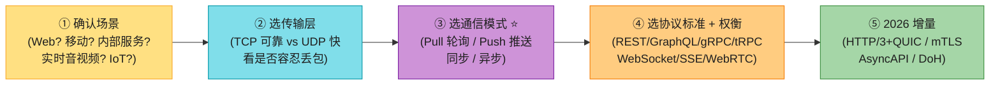
```mermaid
flowchart LR
    S1["① 确认场景<br/>(Web? 移动? 内部服务?<br/>实时音视频? IoT?)"] --> S2["② 选传输层<br/>(TCP 可靠 vs UDP 快<br/>看是否容忍丢包)"]
    S2 --> S3["③ 选通信模式 ⭐<br/>(Pull 轮询 / Push 推送<br/>同步 / 异步)"]
    S3 --> S4["④ 选协议标准 + 权衡<br/>(REST/GraphQL/gRPC/tRPC<br/>WebSocket/SSE/WebRTC)"]
    S4 --> S5["⑤ 2026 增量<br/>(HTTP/3+QUIC / mTLS<br/>AsyncAPI / DoH)"]

    style S1 fill:#FFE082,stroke:#F9A825,color:#1f1f1f
    style S2 fill:#80DEEA,stroke:#0097A7,color:#1f1f1f
    style S3 fill:#CE93D8,stroke:#7B1FA2,color:#1f1f1f
    style S4 fill:#FFCC80,stroke:#F57C00,color:#1f1f1f
    style S5 fill:#A5D6A7,stroke:#388E3C,color:#1f1f1f
```

> 💡 **关键信号词**:**"TCP 可靠但慢(三次握手 + 重传),UDP 快但可能丢包"** + **"L4 是传输层(TCP/UDP),L7 是应用层(HTTP),这是 OSI 模型的分层"** + **"内部微服务用 gRPC(Protobuf 二进制 + 双向流),外部 API 用 REST/GraphQL"** + **"AI 流式输出首选 SSE,双向实时用 WebSocket"**——这四句直接拿下面试。

---

## 🗺️ 章节概览

| 小节 | 要点 | 重要性 |
|------|------|--------|
| **OSI 七层模型** | 物理/链路/网络/传输/会话/表示/应用,每层职责+协议 | ⭐⭐⭐⭐⭐ |
| **TCP/IP 四层模型** | 链路/网络/传输/应用(合并 OSI 上三层) | ⭐⭐⭐⭐ |
| **TCP vs UDP ⭐** | 可靠+重传 vs 尽力而为;三次握手/四次挥手/拥塞控制 | ⭐⭐⭐⭐⭐ |
| **网络层协议** | IP(寻址+分片+MTU)、ICMP(ping/诊断) | ⭐⭐⭐ |
| **HTTP** | 请求/响应、方法、状态码、HTTP/1.1-2-3 演进 | ⭐⭐⭐⭐⭐ |
| **SMTP/POP/IMAP** | 邮件 push(SMTP)+ pull(POP 删/IMAP 留) | ⭐⭐ |
| **XMPP** | 基于 XML 的 IM 协议(WhatsApp/ejabberd) | ⭐⭐⭐ |
| **MQTT** | IoT pub/sub + QoS 0/1/2 三级 | ⭐⭐⭐⭐ |
| **通信类型** | 同步 vs 异步;Pull(轮询/长轮询)vs Push(WebSocket/SSE) | ⭐⭐⭐⭐⭐ |
| **RPC** | 远程过程调用 + IDL + stub + 跨语言 | ⭐⭐⭐⭐ |
| **REST** | 资源+HTTP 动词+无状态+Richardson 成熟度 | ⭐⭐⭐⭐⭐ |
| **GraphQL** | 单端点+按需取字段+Schema+mutation/subscription | ⭐⭐⭐⭐ |
| **WebRTC** | P2P 音视频 + STUN/TURN/ICE | ⭐⭐⭐⭐ |
| **2026增量(补)** | HTTP/3+QUIC / gRPC 选型矩阵 / SSE 实战 / mTLS / AsyncAPI / DoH / IPv6 / 5G | ⭐⭐⭐⭐⭐ |

---

## 1. 通信模型与协议:为什么要分层?

机器之间通信需要**共同语言**(协议),协议定义了"语法 + 语义 + 时序"。互联网的协议不是一坨,而是**分层**的——每层负责一件具体的事,下层为上层提供服务。两个经典模型:**OSI 七层**(参考模型)和 **TCP/IP 四层**(实际互联网用的)。

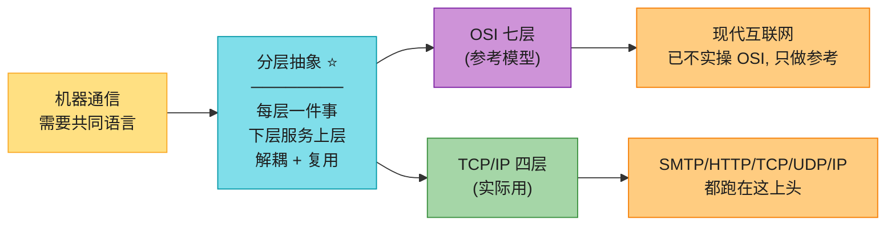
```mermaid
flowchart LR
    PROB["机器通信<br/>需要共同语言"] --> LAYER["分层抽象 ⭐<br/>────────<br/>每层一件事<br/>下层服务上层<br/>解耦 + 复用"]
    LAYER --> OSI["OSI 七层<br/>(参考模型)"]
    LAYER --> TCPIP["TCP/IP 四层<br/>(实际用)"]
    OSI --> NOTE1["现代互联网<br/>已不实操 OSI, 只做参考"]
    TCPIP --> NOTE2["SMTP/HTTP/TCP/UDP/IP<br/>都跑在这上头"]

    style PROB fill:#FFE082,stroke:#F9A825,color:#1f1f1f
    style LAYER fill:#80DEEA,stroke:#0097A7,color:#1f1f1f
    style OSI fill:#CE93D8,stroke:#7B1FA2,color:#1f1f1f
    style TCPIP fill:#A5D6A7,stroke:#388E3C,color:#1f1f1f
    style NOTE1 fill:#FFCC80,stroke:#F57C00,color:#1f1f1f
    style NOTE2 fill:#FFCC80,stroke:#F57C00,color:#1f1f1f
```

> 💡 **类比**:就像寄信——你只管写信(应用层),邮局负责分拣(网络层),卡车负责运输(物理层)。你不用关心卡车怎么开,邮局也不看你信里写了什么。**分层让每层独立演进**(换卡车不影响写信)。

---

## 2. OSI 七层模型 ⭐⭐⭐⭐⭐(面试必背)

OSI(Open Systems Interconnection)是**参考模型**,把通信网络分成**七层**,L7(应用)在最顶,L1(物理)在最底。数据从发送方 L7→L1 一层层"封装",到接收方再 L1→L7 一层层"解封装"。

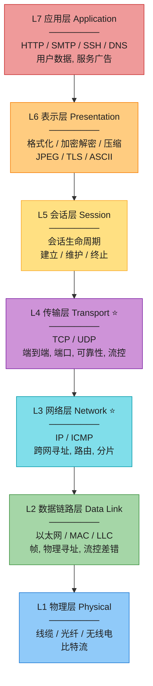
```mermaid
flowchart TD
    direction TB
    L7["L7 应用层 Application<br/>────────<br/>HTTP / SMTP / SSH / DNS<br/>用户数据, 服务广告"]
    L6["L6 表示层 Presentation<br/>────────<br/>格式化 / 加密解密 / 压缩<br/>JPEG / TLS / ASCII"]
    L5["L5 会话层 Session<br/>────────<br/>会话生命周期<br/>建立 / 维护 / 终止"]
    L4["L4 传输层 Transport ⭐<br/>────────<br/>TCP / UDP<br/>端到端, 端口, 可靠性, 流控"]
    L3["L3 网络层 Network ⭐<br/>────────<br/>IP / ICMP<br/>跨网寻址, 路由, 分片"]
    L2["L2 数据链路层 Data Link<br/>────────<br/>以太网 / MAC / LLC<br/>帧, 物理寻址, 流控差错"]
    L1["L1 物理层 Physical<br/>────────<br/>线缆 / 光纤 / 无线电<br/>比特流"]

    L7 --> L6 --> L5 --> L4 --> L3 --> L2 --> L1

    style L7 fill:#EF9A9A,stroke:#C62828,color:#1f1f1f
    style L6 fill:#FFCC80,stroke:#F57C00,color:#1f1f1f
    style L5 fill:#FFE082,stroke:#F9A825,color:#1f1f1f
    style L4 fill:#CE93D8,stroke:#7B1FA2,color:#1f1f1f
    style L3 fill:#80DEEA,stroke:#0097A7,color:#1f1f1f
    style L2 fill:#A5D6A7,stroke:#388E3C,color:#1f1f1f
    style L1 fill:#90CAF9,stroke:#1976D2,color:#1f1f1f
```

### 七层职责详解(背关键几层)

| 层 | 名称 | 职责 | 典型协议 | 数据单元 |
|----|------|------|---------|---------|
| **L7** | 应用层 | 直接服务用户数据;服务广告(哪些服务可连) | HTTP、SMTP、SSH、DNS、FTP | Message |
| **L6** | 表示层 | 格式化(供 L7 用)、加解密、压缩 | TLS/SSL、JPEG、ASCII | Data |
| **L5** | 会话层 | 会话生命周期:建立、维护、终止 | RPC(部分)、SOCKS | Data |
| **L4** | 传输层 ⭐ | 端到端数据传输;端口;可靠性、流控、差错控制;缓冲;窗口 | **TCP、UDP** | Segment(TCP)/Datagram(UDP) |
| **L3** | 网络层 ⭐ | 跨网数据传输;逻辑寻址(IP);路由;分片 | **IP、ICMP** | Packet |
| **L2** | 数据链路层 | 帧传输;MAC 物理寻址(全球唯一);LLC 流控差错 | 以太网、IEEE 802、ARP | Frame |
| **L1** | 物理层 | 比特流传输;物理设备(线缆、集线器、中继器) | 以太网物理规范、光纤、无线电 | Bit |

> 💡 **L4 传输层的关键机制(背)**:**缓冲队列(buffer queue)**——接收方慢连接时,数据先进缓冲,按需交付。队列满时新段被丢(**tail drop**)。**窗口(windowing)**——发送方在等 ACK 前能发的数据量(流量控制的核心)。**重传**——TCP 丢段会重传保可靠;UDP 不重传。

> 🪤 **追问陷阱(高频)**:"OSI 七层有哪些?L4 和 L7 分别是什么?" → **L7 应用(HTTP/SMTP)、L6 表示(TLS/加密)、L5 会话、L4 传输(TCP/UDP,端口+可靠性)、L3 网络(IP,寻址+路由)、L2 链路(MAC+帧)、L1 物理(比特)**。**L4 看端口+可靠性,L7 看应用语义**——这就是 Ch5 L4/L7 LB 分类的理论根。

> 📝 **现代互联网已不实操 OSI**,它只做参考模型。实际通信走 **TCP/IP 四层**。

---

## 3. TCP/IP 四层模型(实际用的)

TCP/IP(internet protocol suite)把 OSI 的上三层(应用/表示/会话)合并成**应用层**,下两层(链路/物理)合并成**网络接入层**(或叫链路层)。**这是互联网实际跑的模型**。

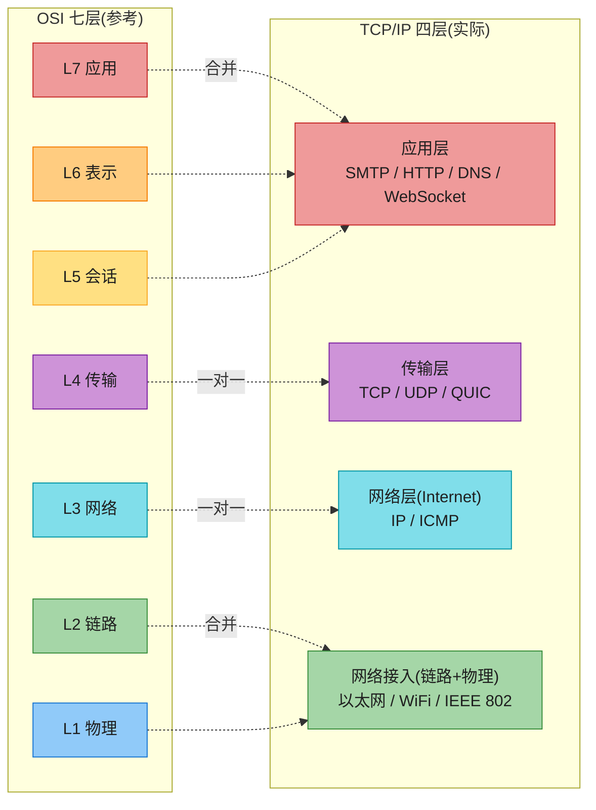
```mermaid
flowchart LR
    subgraph OSI_MODEL["OSI 七层(参考)"]
        direction TB
        O7["L7 应用"]
        O6["L6 表示"]
        O5["L5 会话"]
        O4["L4 传输"]
        O3["L3 网络"]
        O2["L2 链路"]
        O1["L1 物理"]
    end

    subgraph TCPIP_MODEL["TCP/IP 四层(实际)"]
        direction TB
        T4["应用层<br/>SMTP / HTTP / DNS / WebSocket"]
        T3["传输层<br/>TCP / UDP / QUIC"]
        T2["网络层(Internet)<br/>IP / ICMP"]
        T1["网络接入(链路+物理)<br/>以太网 / WiFi / IEEE 802"]
    end

    O7 -.->|"合并"| T4
    O6 -.-> T4
    O5 -.-> T4
    O4 -.->|"一对一"| T3
    O3 -.->|"一对一"| T2
    O2 -.->|"合并"| T1
    O1 -.-> T1

    style O7 fill:#EF9A9A,stroke:#C62828,color:#1f1f1f
    style O6 fill:#FFCC80,stroke:#F57C00,color:#1f1f1f
    style O5 fill:#FFE082,stroke:#F9A825,color:#1f1f1f
    style O4 fill:#CE93D8,stroke:#7B1FA2,color:#1f1f1f
    style O3 fill:#80DEEA,stroke:#0097A7,color:#1f1f1f
    style O2 fill:#A5D6A7,stroke:#388E3C,color:#1f1f1f
    style O1 fill:#90CAF9,stroke:#1976D2,color:#1f1f1f
    style T4 fill:#EF9A9A,stroke:#C62828,color:#1f1f1f
    style T3 fill:#CE93D8,stroke:#7B1FA2,color:#1f1f1f
    style T2 fill:#80DEEA,stroke:#0097A7,color:#1f1f1f
    style T1 fill:#A5D6A7,stroke:#388E3C,color:#1f1f1f
```

**OSI 与 TCP/IP 层映射(背)**:

| OSI 层 | TCP/IP 层 | 协议示例 |
|--------|----------|---------|
| L7 应用 + L6 表示 + L5 会话 | **应用层** | SMTP、HTTP、DNS、WebSocket、MQTT |
| L4 传输 | **传输层** | TCP、UDP、QUIC ⭐(2026) |
| L3 网络 | **网络层(Internet)** | IP、ICMP |
| L2 链路 + L1 物理 | **网络接入层(链路)** | 以太网、WiFi、IEEE 802.2 |

> 💡 **为什么 TCP/IP 合并上三层?** 因为实践中应用、表示、会话**强耦合**——HTTP 既是应用协议又自带内容协商(表示),会话管理也揉在应用里。**TCP/IP 模型更贴近真实实现,OSI 更适合教学**。

---

## 4. 网络层协议:IP 与 ICMP

网络层负责**跨网络**的数据传输,核心是**逻辑寻址(IP 地址)**和**路由**。

### 4.1 IP 协议(Internet Protocol)

IP 是网络层最核心的协议,负责把数据包从**源 IP**送到**目的 IP**。每个 IP 包含 **IP 头 + 负载(IP datagram)**。头里有源/目的 IP、版本(v4/v6)、包大小、TTL(存活跳数)等元数据。

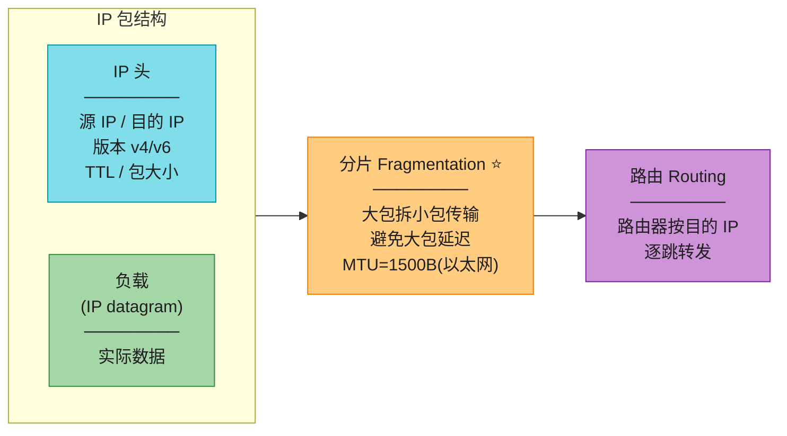
```mermaid
flowchart LR
    subgraph PKT["IP 包结构"]
        direction LR
        HDR["IP 头<br/>────────<br/>源 IP / 目的 IP<br/>版本 v4/v6<br/>TTL / 包大小"]
        PAY["负载<br/>(IP datagram)<br/>────────<br/>实际数据"]
    end

    FRAG["分片 Fragmentation ⭐<br/>────────<br/>大包拆小包传输<br/>避免大包延迟<br/>MTU=1500B(以太网)"]
    ROUTE["路由 Routing<br/>────────<br/>路由器按目的 IP<br/>逐跳转发"]

    PKT --> FRAG --> ROUTE

    style HDR fill:#80DEEA,stroke:#0097A7,color:#1f1f1f
    style PAY fill:#A5D6A7,stroke:#388E3C,color:#1f1f1f
    style FRAG fill:#FFCC80,stroke:#F57C00,color:#1f1f1f
    style ROUTE fill:#CE93D8,stroke:#7B1FA2,color:#1f1f1f
```

> 💡 **MTU(最大传输单元)**:以太网 MTU = **1500 字节**。超过就要**分片(fragmentation)**——把大包拆成小包,到了目的端再重组。分片增加延迟和重组失败风险,所以应用层常**主动控制包大小**(避免分片)。

> 📝 **IP 地址和 NAT 详见 Ch9**(AWS 网络:VPC、子网、CIDR、Elastic IP、NAT Gateway)。

### 4.2 ICMP(Internet Control Message Protocol)

ICMP 用于**网络诊断和错误报告**。最经典的命令是 `ping`(检查目标是否可达)和 `traceroute`(追踪路由路径)。

```bash
# ping 检查 google.com 是否可达
$ ping google.com
PING google.com (142.250.74.206) 56(84) bytes of data.
64 bytes from fra24s02-in-f14.1e100.net (142.250.74.206): icmp_seq=1 ttl=117 time=12.3 ms
64 bytes from fra24s02-in-f14.1e100.net (142.250.74.74):  icmp_seq=2 ttl=117 time=11.8 ms
# 若不可达, 路由器会回 ICMP "destination unreachable"
```

- **ping**:发 ICMP Echo Request,收 Echo Reply——测连通性和 RTT。
- **traceroute**:用 TTL 递增的包,每次路由器回 ICMP Time Exceeded,从而逐跳画出路径。
- **错误报告**:目的不可达、TTL 超时、重定向——这些控制消息都走 ICMP。

> 🪤 **追问陷阱**:"ping 用 TCP 还是 UDP?" → **都不是,用 ICMP**(网络层协议,无端口)。这是高频"反套路"题。

---

## 5. TCP vs UDP ⭐⭐⭐⭐⭐(本章核心对比)

传输层两个支柱:**TCP(可靠)**和 **UDP(快)**。这是面试必问、且直接决定协议选型的知识点。

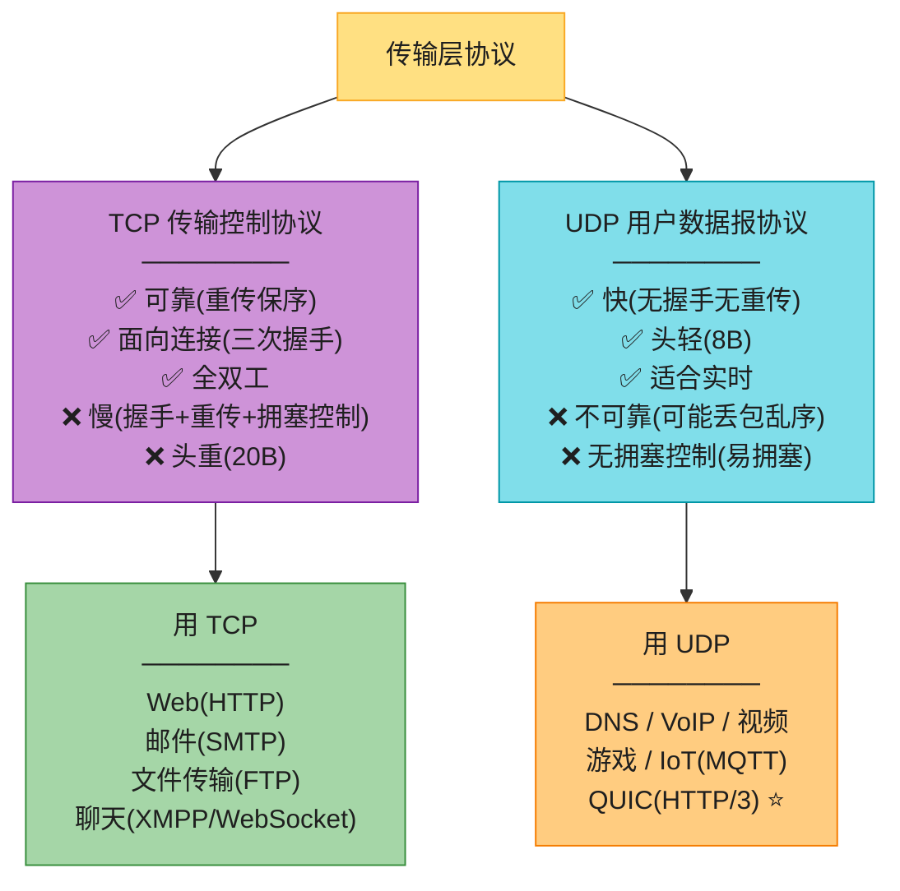
```mermaid
flowchart TD
    TRANS["传输层协议"] --> TCP["TCP 传输控制协议<br/>────────<br/>✅ 可靠(重传保序)<br/>✅ 面向连接(三次握手)<br/>✅ 全双工<br/>❌ 慢(握手+重传+拥塞控制)<br/>❌ 头重(20B)"]
    TRANS --> UDP["UDP 用户数据报协议<br/>────────<br/>✅ 快(无握手无重传)<br/>✅ 头轻(8B)<br/>✅ 适合实时<br/>❌ 不可靠(可能丢包乱序)<br/>❌ 无拥塞控制(易拥塞)"]

    TCP --> USE_T["用 TCP<br/>────────<br/>Web(HTTP)<br/>邮件(SMTP)<br/>文件传输(FTP)<br/>聊天(XMPP/WebSocket)"]
    UDP --> USE_U["用 UDP<br/>────────<br/>DNS / VoIP / 视频<br/>游戏 / IoT(MQTT)<br/>QUIC(HTTP/3) ⭐"]

    style TRANS fill:#FFE082,stroke:#F9A825,color:#1f1f1f
    style TCP fill:#CE93D8,stroke:#7B1FA2,color:#1f1f1f
    style UDP fill:#80DEEA,stroke:#0097A7,color:#1f1f1f
    style USE_T fill:#A5D6A7,stroke:#388E3C,color:#1f1f1f
    style USE_U fill:#FFCC80,stroke:#F57C00,color:#1f1f1f
```

### 5.1 TCP:三次握手建立连接 ⭐⭐⭐

TCP 通信前必须**三次握手(three-way handshake)**——双方就序列号、窗口大小达成一致,才能开始传数据。

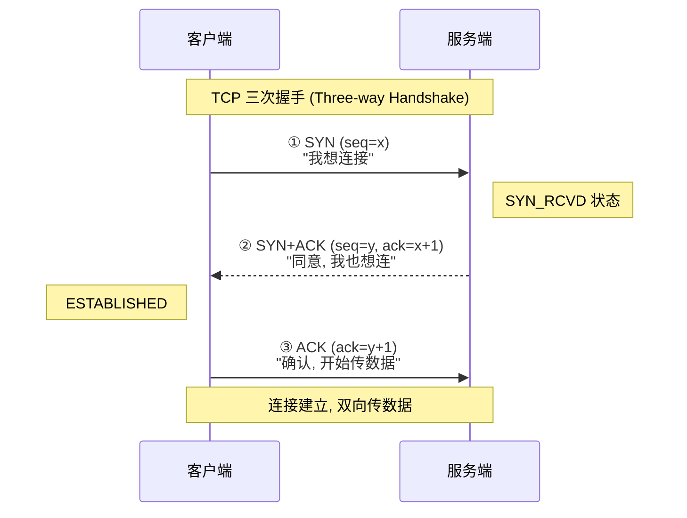
```mermaid
sequenceDiagram
    participant C as 客户端
    participant S as 服务端
    Note over C,S: TCP 三次握手 (Three-way Handshake)
    C->>S: ① SYN (seq=x)<br/>"我想连接"
    Note right of S: SYN_RCVD 状态
    S-->>C: ② SYN+ACK (seq=y, ack=x+1)<br/>"同意, 我也想连"
    Note left of C: ESTABLISHED
    C->>S: ③ ACK (ack=y+1)<br/>"确认, 开始传数据"
    Note over C,S: 连接建立, 双向传数据
```

**三次握手的关键字段**(TCP 头):
- **源/目的端口**(Port):16 位,0-65535。
- **序列号(Sequence Number)**:标识本次会话发了多少数据。
- **确认号(Acknowledgment Number)**:接收方用它发 ACK,并请求下一段。
- **窗口(Window)**:接收方还能收多少字节(流量控制)。

> 🪤 **追问陷阱(超高频)**:"为什么是三次握手,不是两次或四次?" → **两次不够**:客户端发 SYN,服务端回 SYN+ACK——但如果服务端的回包丢了,客户端不知道服务端准备好没,贸然传数据会丢。**第三次(客户端 ACK)让服务端确认"客户端也收到我的回复了"**,双向都确认对方收发能力。**四次多余**:三次已够确认双向,第四次冗余。

### 5.2 TCP:四次挥手断开连接

TCP 断开用**四次挥手(Four-way Handshake / FIN-ACK)**,因为 TCP 是**全双工**,每方向都要独立关闭。

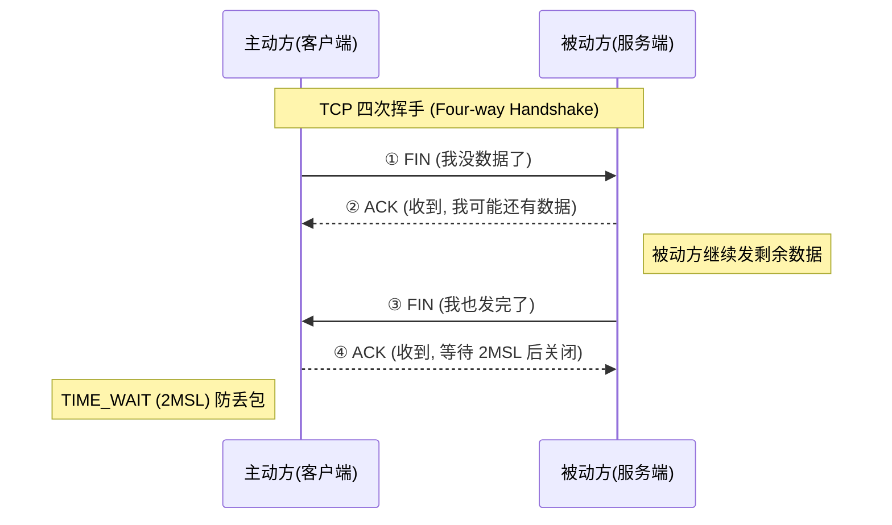
```mermaid
sequenceDiagram
    participant C as 主动方(客户端)
    participant P as 被动方(服务端)
    Note over C,P: TCP 四次挥手 (Four-way Handshake)
    C->>P: ① FIN (我没数据了)
    P-->>C: ② ACK (收到, 我可能还有数据)
    Note right of P: 被动方继续发剩余数据
    P->>C: ③ FIN (我也发完了)
    C-->>P: ④ ACK (收到, 等待 2MSL 后关闭)
    Note left of C: TIME_WAIT (2MSL) 防丢包
```

> 💡 **TIME_WAIT 2MSL**:主动关闭方最后发 ACK 后进入 TIME_WAIT,等 **2 倍最大段寿命(MSL)** 才真正关闭。**目的**:① 防最后的 ACK 丢了,被动方重发 FIN;② 让旧连接的迷途包在网络中消亡,避免污染新连接。**这是高并发服务端端口耗尽的根因之一**(大量 TIME_WAIT 占端口)。

### 5.3 TCP:拥塞控制(慢启动 + 拥塞避免)⭐

TCP 找出"最优窗口大小"——既充分利用带宽,又不拥塞。两个机制:**慢启动(Slow Start)**和**拥塞避免(Congestion Avoidance)**。

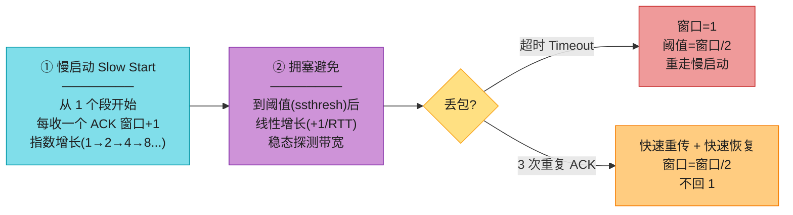
```mermaid
flowchart LR
    SS["① 慢启动 Slow Start<br/>────────<br/>从 1 个段开始<br/>每收一个 ACK 窗口+1<br/>指数增长(1→2→4→8...)"] --> CA["② 拥塞避免<br/>────────<br/>到阈值(ssthresh)后<br/>线性增长(+1/RTT)<br/>稳态探测带宽"]
    CA --> LOSS{"丢包?"}
    LOSS -->|"超时 Timeout"| RESET["窗口=1<br/>阈值=窗口/2<br/>重走慢启动"]
    LOSS -->|"3 次重复 ACK"| FAST["快速重传 + 快速恢复<br/>窗口=窗口/2<br/>不回 1"]

    style SS fill:#80DEEA,stroke:#0097A7,color:#1f1f1f
    style CA fill:#CE93D8,stroke:#7B1FA2,color:#1f1f1f
    style LOSS fill:#FFE082,stroke:#F9A825,color:#1f1f1f
    style RESET fill:#EF9A9A,stroke:#C62828,color:#1f1f1f
    style FAST fill:#FFCC80,stroke:#F57C00,color:#1f1f1f
```

> 💡 **拥塞检测信号**:① **连接超时(timeout)**——丢包严重,窗口直接砍到 1;② **重复 ACK(3 次相同 ACK)**——轻度丢包,触发**快速重传 + 快速恢复**,窗口减半不回 1(更温和)。

> 📝 **原书建议**:把应用部署在**靠近用户的地理区域**——减少网络跳数和 RTT,让发送方更快调整拥塞窗口。这正是 CDN(Ch4)和边缘计算的理论依据。

### 5.4 TCP 的端口(Port)分类 ⭐

端口(0-65535)是 OS 管理的虚拟点,定义应用进出网络的位置。分三段:

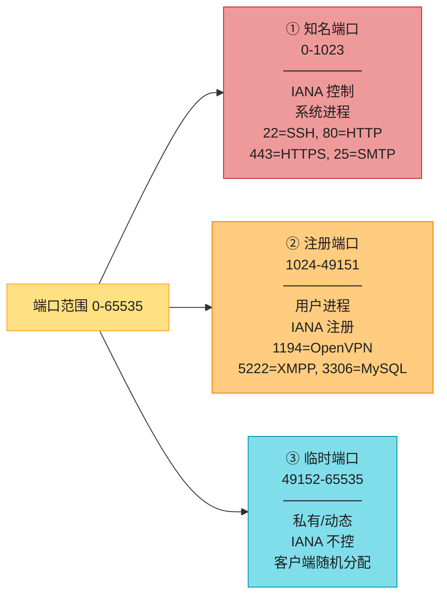
```mermaid
flowchart LR
    PORTS["端口范围 0-65535"] --> WK["① 知名端口<br/>0-1023<br/>────────<br/>IANA 控制<br/>系统进程<br/>22=SSH, 80=HTTP<br/>443=HTTPS, 25=SMTP"]
    PORTS --> RG["② 注册端口<br/>1024-49151<br/>────────<br/>用户进程<br/>IANA 注册<br/>1194=OpenVPN<br/>5222=XMPP, 3306=MySQL"]
    PORTS --> EP["③ 临时端口<br/>49152-65535<br/>────────<br/>私有/动态<br/>IANA 不控<br/>客户端随机分配"]

    style PORTS fill:#FFE082,stroke:#F9A825,color:#1f1f1f
    style WK fill:#EF9A9A,stroke:#C62828,color:#1f1f1f
    style RG fill:#FFCC80,stroke:#F57C00,color:#1f1f1f
    style EP fill:#80DEEA,stroke:#0097A7,color:#1f1f1f
```

> 💡 **知名端口**(Well-known,0-1023)和**注册端口**(Registered,1024-49151)合称**非临时端口**(nonephemeral),由 IANA 分配。**临时端口**(Ephemeral,49152-65535)给客户端临时连出用。

### 5.5 UDP:无连接、不保证、快

UDP 没有**三次握手**、没有**重传**、没有**拥塞控制**、不保证**顺序**。头只有 8 字节(源端口+目的端口+长度+校验和)。**快,但不可靠**。

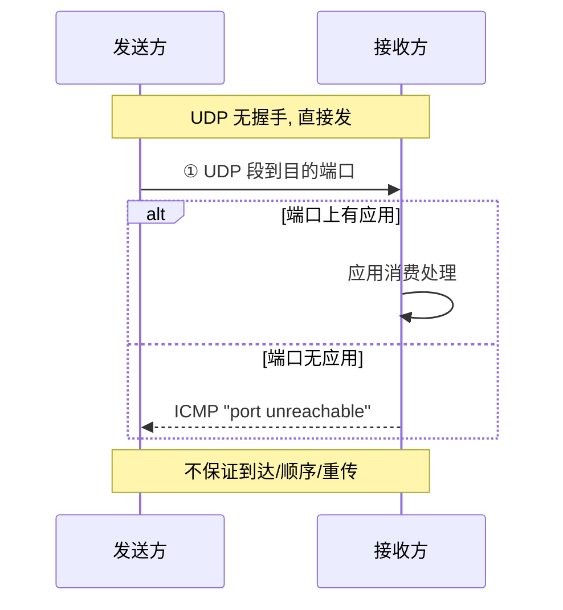
```mermaid
sequenceDiagram
    participant C as 发送方
    participant R as 接收方
    Note over C,R: UDP 无握手, 直接发
    C->>R: ① UDP 段到目的端口
    alt 端口上有应用
        R->>R: 应用消费处理
    else 端口无应用
        R-->>C: ICMP "port unreachable"
    end
    Note over C,R: 不保证到达/顺序/重传
```

**UDP 的风险**:因为没有握手,坏角色可以**用 UDP 洪泛(UDP flood)** 拖垮服务器——大量请求耗尽服务器资源,造成 DoS。

> 💡 **UDP 防御**:① 阈值后忽略 + 不回 ICMP(降攻击放大,代价是可能误杀真实请求);② 用云厂商 DDoS 防护(如 **AWS Shield**)。

### 5.6 TCP vs UDP 对比表(背)⭐⭐⭐⭐⭐

| 维度 | TCP | UDP |
|------|-----|-----|
| **可靠性** | 可靠(重传保序) | 不可靠(可能丢/乱) |
| **连接** | 面向连接(三次握手) | 无连接 |
| **速度** | 慢(握手+重传+拥塞控制) | 快(无握手无重传) |
| **头开销** | 20 字节 | 8 字节 |
| **传输** | 字节流(有序) | 数据报(独立) |
| **流量/拥塞控制** | 有(window、慢启动) | 无 |
| **通信方向** | 全双工(双向) | 单向/双向(都行) |
| **典型应用** | HTTP、SMTP、FTP、WebSocket、SSH | DNS、VoIP、视频、游戏、MQTT、QUIC ⭐ |

> 🪤 **追问陷阱(高频)**:"为什么视频用 UDP 不用 TCP?" → **实时性 > 可靠性**。视频丢一两帧人眼几乎察觉不到,但 TCP 重传会导致**卡顿延迟累积**(丢了就等重传,后面全卡住)。UDP 丢了就丢了,继续播,体验流畅。同理**游戏、VoIP、直播**都选 UDP。

> 💡 **选型口诀(背)**:**要可靠、全双工 → TCP**(Web/邮件/聊天);**要低延迟、容忍丢包 → UDP**(音视频/游戏/DNS);**移动弱网要可靠+快 → QUIC**(HTTP/3,2026 主流)。

---

## 6. HTTP(应用层最重协议)⭐⭐⭐⭐⭐

HTTP 是互联网应用通信的基石,基于**客户端-服务器模型**:客户端发请求,服务端回响应。默认端口 **80(HTTP)/ 443(HTTPS)**。

### 6.1 HTTP 请求/响应结构

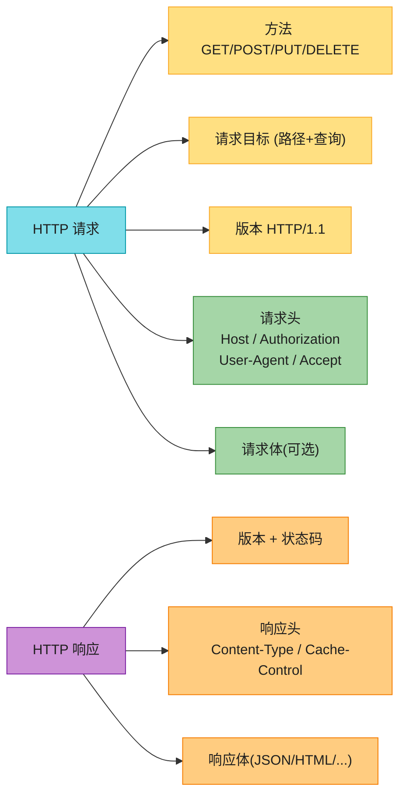
```mermaid
flowchart LR
    REQ["HTTP 请求"] --> RM["方法 GET/POST/PUT/DELETE"]
    REQ --> RT["请求目标 (路径+查询)"]
    REQ --> RV["版本 HTTP/1.1"]
    REQ --> RH["请求头<br/>Host / Authorization<br/>User-Agent / Accept"]
    REQ --> RB["请求体(可选)"]

    RESP["HTTP 响应"] --> RSV["版本 + 状态码"]
    RESP --> RSH["响应头<br/>Content-Type / Cache-Control"]
    RESP --> RSB["响应体(JSON/HTML/...)"]

    style REQ fill:#80DEEA,stroke:#0097A7,color:#1f1f1f
    style RM fill:#FFE082,stroke:#F9A825,color:#1f1f1f
    style RT fill:#FFE082,stroke:#F9A825,color:#1f1f1f
    style RV fill:#FFE082,stroke:#F9A825,color:#1f1f1f
    style RH fill:#A5D6A7,stroke:#388E3C,color:#1f1f1f
    style RB fill:#A5D6A7,stroke:#388E3C,color:#1f1f1f
    style RESP fill:#CE93D8,stroke:#7B1FA2,color:#1f1f1f
    style RSV fill:#FFCC80,stroke:#F57C00,color:#1f1f1f
    style RSH fill:#FFCC80,stroke:#F57C00,color:#1f1f1f
    style RSB fill:#FFCC80,stroke:#F57C00,color:#1f1f1f
```

**HTTP 请求示例**(查订单):

```http
GET /api/orders?id=23234555&customerId=dhfsd348e4 HTTP/1.1
Host: api.myFoodApp.com
Authorization: Bearer MyAccessToken
User-Agent: MyOnlineFoodOrderApplication/1.0
Accept: application/json
```

**HTTP 响应示例**:

```http
HTTP/1.1 200 OK
Content-Type: application/json

{
  "orderId": "23234555",
  "customerId": "dhfsd348e48ddd",
  "amount": 199,
  "currency": "INR",
  "items": [
    {"product": "Paneer Tikka Masala", "quantity": 1, "price": 119},
    {"product": "Tandoori Roti Butter", "quantity": 3, "price": 80}
  ],
  "status": "Delivered"
}
```

### 6.2 HTTP 方法(CRUD 对应)

| 方法 | 用途 | 幂等? | 安全? | 对应 CRUD |
|------|------|-------|-------|----------|
| **GET** | 查询,不改状态 | ✅ 幂等 | ✅ 安全 | Read |
| **POST** | 创建新资源 / 提交数据 | ❌ 不幂等 | ❌ | Create |
| **PUT** | 全量更新资源 | ✅ 幂等 | ❌ | Update |
| **PATCH** | 部分更新资源 | ❌(理论)/ ✅(实践) | ❌ | Update |
| **DELETE** | 删除资源 | ✅ 幂等 | ❌ | Delete |
| HEAD | 只取头(不取体) | ✅ | ✅ | — |
| OPTIONS | 查支持的 方法(CORS 预检) | ✅ | ✅ | — |

> 🪤 **追问陷阱(高频)**:"POST 和 PUT 区别?都是更新?" → **PUT 幂等**(同样的 PUT 重复执行结果相同——幂等更新);**POST 不幂等**(重复 POST 会创建多个资源)。**幂等性是接口设计的核心约定**——客户端重试时,幂等接口不会产生副作用。原书建议 POST/PUT/DELETE 都尽量做成幂等(用幂等键)。

### 6.3 HTTP 状态码(背关键几段)

| 系列 | 含义 | 典型 |
|------|------|------|
| **1xx** | 信息(处理中) | 100 Continue、**101 Switching Protocols**(WebSocket 升级) |
| **2xx** | 成功 | **200 OK**、**201 Created** |
| **3xx** | 重定向 | **301 永久移动**、**302 临时移动**、**304 Not Modified**(缓存命中) |
| **4xx** | 客户端错 | **400 Bad Request**、**401 未认证**、**403 未授权**、**404 Not Found**、429 限流 |
| **5xx** | 服务端错 | **500 内部错误**、**502 网关错**、**503 不可用**、**504 网关超时** |

> 💡 **易混淆**(背):**401 = 没登录(认证 Authentication)**,**403 = 登录了但没权限(授权 Authorization)**。401 是"你是谁?",403 是"你不能干这个"。

### 6.4 HTTP 版本演进 ⭐⭐⭐⭐⭐

HTTP 不断演进,版本号是面试高频考点:

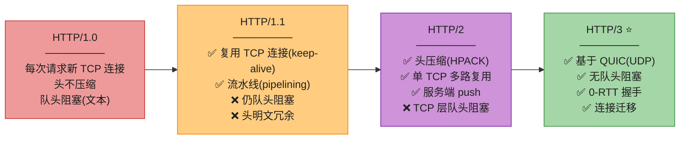
```mermaid
flowchart LR
    H1["HTTP/1.0<br/>────────<br/>每次请求新 TCP 连接<br/>头不压缩<br/>队头阻塞(文本)"]
    H1 --> H11["HTTP/1.1<br/>────────<br/>✅ 复用 TCP 连接(keep-alive)<br/>✅ 流水线(pipelining)<br/>❌ 仍队头阻塞<br/>❌ 头明文冗余"]
    H11 --> H2["HTTP/2<br/>────────<br/>✅ 头压缩(HPACK)<br/>✅ 单 TCP 多路复用<br/>✅ 服务端 push<br/>❌ TCP 层队头阻塞"]
    H2 --> H3["HTTP/3 ⭐<br/>────────<br/>✅ 基于 QUIC(UDP)<br/>✅ 无队头阻塞<br/>✅ 0-RTT 握手<br/>✅ 连接迁移"]

    style H1 fill:#EF9A9A,stroke:#C62828,color:#1f1f1f
    style H11 fill:#FFCC80,stroke:#F57C00,color:#1f1f1f
    style H2 fill:#CE93D8,stroke:#7B1FA2,color:#1f1f1f
    style H3 fill:#A5D6A7,stroke:#388E3C,color:#1f1f1f
```

| 版本 | 关键特性 | 解决的问题 |
|------|---------|----------|
| **HTTP/1.0** | 每请求新建 TCP 连接 | — |
| **HTTP/1.1** | 连接复用(keep-alive)、流水线 | 1.0 连接开销 |
| **HTTP/2** | 头压缩(HPACK)、单 TCP 多路复用、服务端 push | 1.1 头冗余 + 串行 |
| **HTTP/3 ⭐** | 基于 **QUIC(UDP)**、无队头阻塞、0-RTT、连接迁移 | TCP 队头阻塞 + 慢握手 |

> 💡 **HTTP/2 的"队头阻塞"在 TCP 层**:HTTP/2 在一个 TCP 连接上跑多个流(stream),但**TCP 不知道流的存在**——一个包丢了,TCP 会卡住所有流等重传(队头阻塞)。**HTTP/3 用 QUIC 在 UDP 上跑流,每个流独立**,一个流丢包不影响其他流(详见 2026 增量)。

> 🪤 **追问陷阱**:"HTTP/2 和 HTTP/3 主要区别?" → **传输层**:HTTP/2 基于 TCP(队头阻塞在 TCP 层),HTTP/3 基于 **QUIC(UDP)**(无队头阻塞 + 0-RTT + 连接迁移)。**HTTP/3 是传输层的革命**。

---

## 7. SMTP / POP / IMAP:邮件协议族

邮件是互联网最早的应用之一。原书讲 SMTP/POP/IMAP 三件套:

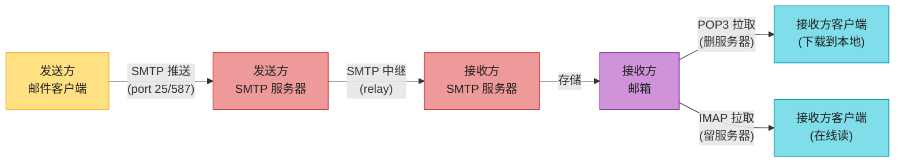
```mermaid
flowchart LR
    SENDER["发送方<br/>邮件客户端"] -->|"SMTP 推送<br/>(port 25/587)"| SMTP_S["发送方<br/>SMTP 服务器"]
    SMTP_S -->|"SMTP 中继<br/>(relay)"| SMTP_R["接收方<br/>SMTP 服务器"]
    SMTP_R -->|"存储"| MAILBOX["接收方<br/>邮箱"]
    MAILBOX -->|"POP3 拉取<br/>(删服务器)"| POP_C["接收方客户端<br/>(下载到本地)"]
    MAILBOX -->|"IMAP 拉取<br/>(留服务器)"| IMAP_C["接收方客户端<br/>(在线读)"]

    style SENDER fill:#FFE082,stroke:#F9A825,color:#1f1f1f
    style SMTP_S fill:#EF9A9A,stroke:#C62828,color:#1f1f1f
    style SMTP_R fill:#EF9A9A,stroke:#C62828,color:#1f1f1f
    style MAILBOX fill:#CE93D8,stroke:#7B1FA2,color:#1f1f1f
    style POP_C fill:#80DEEA,stroke:#0097A7,color:#1f1f1f
    style IMAP_C fill:#80DEEA,stroke:#0097A7,color:#1f1f1f
```

| 协议 | 方向 | 机制 | 端口 | 特点 |
|------|------|------|------|------|
| **SMTP** | 推(push) | 发送方→服务器→服务器 | 25(明文)/587(加密) | 邮件**推送**;跨域用 relay 中继;MTA(邮件传输代理)用 |
| **MIME** | 扩展 | 让 SMTP 支持附件 + 非 ASCII | — | SMTP 本身只支持 7-bit ASCII,MIME 扩展二进制附件 |
| **POP3** | 拉(pull) | 下载邮件到本地,删服务器 | 110/995 | **快**(预下载),但**多设备不同步**(删了服务器就没有) |
| **IMAP** | 拉(pull) | 在线读,不下载不删 | 143/993 | **多设备同步**(留服务器),但**慢于 POP**(每次在线读) |

> 💡 **SMTP 跨域的 relay 机制(类比)**:就像寄信——同城信直接送本地邮局,跨城信本地邮局转给对方城市邮局(relay server)。**跨域(gmail→hotmail)必有中间 relay**。

> 📝 **邮件协议在现代系统的意义**:① 触发邮件通知(注册验证、密码重置)用 SMTP;② 用户邮件客户端配置仍区分 POP/IMAP。但**实时性差**,不适合实时通信——所以才有了 XMPP。

---

## 8. XMPP:基于 XML 的实时通信协议

XMPP(Extensible Messaging and Presence Protocol,原称 Jabber)是基于 XML 的**即时消息协议**,支持**在线状态(presence)**和**联系人列表(roster)**。

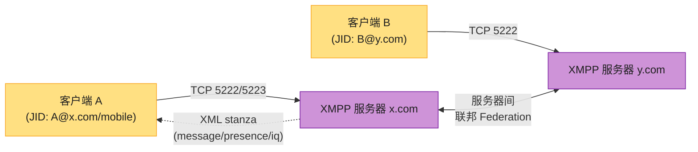
```mermaid
flowchart LR
    C1["客户端 A<br/>(JID: A@x.com/mobile)"] -->|"TCP 5222/5223"| S1["XMPP 服务器 x.com"]
    C2["客户端 B<br/>(JID: B@y.com)"] -->|"TCP 5222"| S2["XMPP 服务器 y.com"]
    S1 <-->|"服务器间<br/>联邦 Federation"| S2

    S1 -.->|"XML stanza<br/>(message/presence/iq)"| C1

    style C1 fill:#FFE082,stroke:#F9A825,color:#1f1f1f
    style C2 fill:#FFE082,stroke:#F9A825,color:#1f1f1f
    style S1 fill:#CE93D8,stroke:#7B1FA2,color:#1f1f1f
    style S2 fill:#CE93D8,stroke:#7B1FA2,color:#1f1f1f
```

**XMPP 的关键特征**:
- **基于 XML**:消息以 **XML stanza**(XML 节)为单位传输。
- **持久连接**:通过 **TCP 或 WebSocket**(更优)维持长连接,流式传输 XML stanza。
- **在线状态(presence)**:告诉服务器/联系人"我在线/离线"。
- **异步**:接收方不必同时在线(可缓存)。
- **去中心化**:任何人都可架 XMPP 服务器,像 SMTP 一样**联邦**(Federation)。
- **Jabber ID (JID)**:类似邮箱(`user@domain/resource`,resource 区分多设备)。

**XMPP 连接生命周期**(背):
1. 客户端 TCP 连服务器(5222 明文 / 5223 加密)。
2. 发 stream header,协商流特性(认证、加密)。
3. 共享凭证认证。
4. 绑定 resource(生成 JID)。
5. 建立会话(可选)。
6. 共享 presence,请求 roster。
7. 收发 XML stanza 消息。
8. 终止连接。

> 💡 **业界标杆**:**WhatsApp 早期基于 ejabberd**(Erlang 写的 XMPP 服务器)。XMPP 是 IM 协议的经典选择,但 2026 新系统更多用 **WebSocket + 自定义 JSON 协议**(更轻),或 **MQTT**(移动端)。

> 📝 **详见 SDE-Vol1 Ch12 设计聊天系统**——那里详细对比了轮询/长轮询/WebSocket/MQTT/QUIC 的选型,本章给出协议层全景。

---

## 9. MQTT:IoT 通信的 pub/sub 协议 ⭐⭐⭐⭐

MQTT(Message Queuing Telemetry Transport)最早为**卫星遥测**设计(资源极省),现在是 **IoT 设备通信的事实标准**,也用于消息应用。基于 **pub/sub 模型**——发布者发消息到 topic,订阅者从 topic 收。

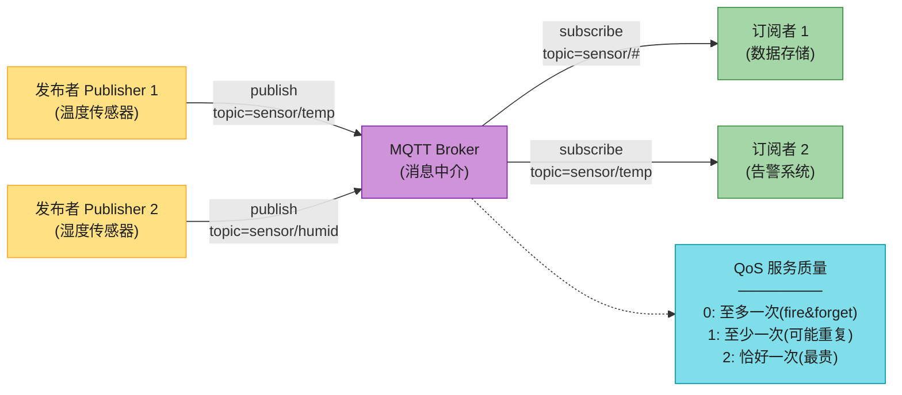
```mermaid
flowchart LR
    P1["发布者 Publisher 1<br/>(温度传感器)"] -->|"publish<br/>topic=sensor/temp"| BR["MQTT Broker<br/>(消息中介)"]
    P2["发布者 Publisher 2<br/>(湿度传感器)"] -->|"publish<br/>topic=sensor/humid"| BR
    BR -->|"subscribe<br/>topic=sensor/#"| S1["订阅者 1<br/>(数据存储)"]
    BR -->|"subscribe<br/>topic=sensor/temp"| S2["订阅者 2<br/>(告警系统)"]

    QOS["QoS 服务质量<br/>────────<br/>0: 至多一次(fire&forget)<br/>1: 至少一次(可能重复)<br/>2: 恰好一次(最贵)"]

    BR -.-> QOS

    style P1 fill:#FFE082,stroke:#F9A825,color:#1f1f1f
    style P2 fill:#FFE082,stroke:#F9A825,color:#1f1f1f
    style BR fill:#CE93D8,stroke:#7B1FA2,color:#1f1f1f
    style S1 fill:#A5D6A7,stroke:#388E3C,color:#1f1f1f
    style S2 fill:#A5D6A7,stroke:#388E3C,color:#1f1f1f
    style QOS fill:#80DEEA,stroke:#0097A7,color:#1f1f1f
```

**MQTT 的 QoS 三级(背)**——发布者和订阅者各自定义:

| QoS | 名称 | 保证 | 代价 | 适用 |
|-----|------|------|------|------|
| **0** | At most once(至多一次) | 发一次,不确认,**fire and forget** | 最轻 | 高频容忍丢包(温度采样) |
| **1** | At least once(至少一次) | 等待 PUBACK,**可能重复** | 中(订阅者需去重) | 普通业务消息 |
| **2** | Exactly once(恰好一次) | 四段握手严格确认,**不重不丢** | 最贵(4 次交互) | 计费/支付级 |

> 💡 **MQTT 选型口诀**:IoT 设备通信(传感器、智能家居)→ MQTT;移动 IM 推送(Facebook Messenger 历史上用过)→ MQTT 极省电;需要严格不丢消息 → QoS 2。**MQTT 的发布/订阅完全解耦**——发布者不知道有谁订阅,反之亦然,这天然支持双向云-设备通信。

> 🪤 **追问陷阱**:"MQTT QoS 2 为什么贵?" → **四段握手**(PUBLISH→PUBREC→PUBREL→PUBCOMP)严格保证恰好一次,但每条消息 4 次网络交互,效率低。所以**默认用 QoS 1 + 应用层幂等去重**更常见。

---

## 10. 通信类型:同步/异步 + Pull/Push ⭐⭐⭐⭐⭐

理解了协议,接下来看**通信模式**——这是系统设计的核心决策点。通信分**同步 vs 异步**,异步响应又分 **Pull(拉)** 和 **Push(推)**。

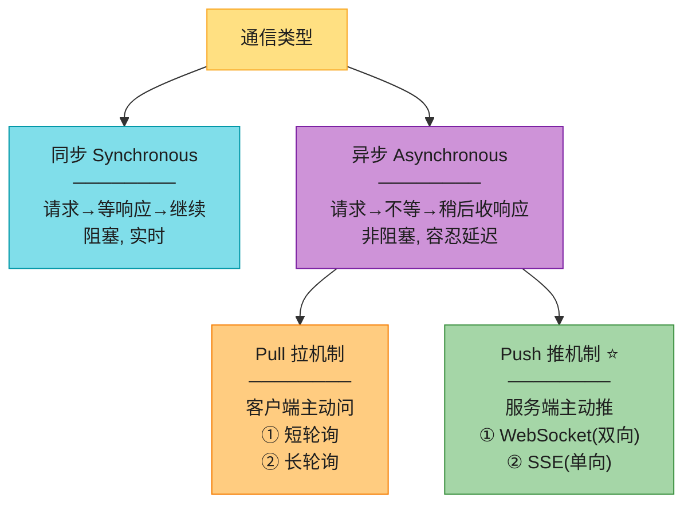
```mermaid
flowchart TD
    COMM["通信类型"] --> SYNC["同步 Synchronous<br/>────────<br/>请求→等响应→继续<br/>阻塞, 实时"]
    COMM --> ASYNC["异步 Asynchronous<br/>────────<br/>请求→不等→稍后收响应<br/>非阻塞, 容忍延迟"]

    ASYNC --> PULL["Pull 拉机制<br/>────────<br/>客户端主动问<br/>① 短轮询<br/>② 长轮询"]
    ASYNC --> PUSH["Push 推机制 ⭐<br/>────────<br/>服务端主动推<br/>① WebSocket(双向)<br/>② SSE(单向)"]

    style COMM fill:#FFE082,stroke:#F9A825,color:#1f1f1f
    style SYNC fill:#80DEEA,stroke:#0097A7,color:#1f1f1f
    style ASYNC fill:#CE93D8,stroke:#7B1FA2,color:#1f1f1f
    style PULL fill:#FFCC80,stroke:#F57C00,color:#1f1f1f
    style PUSH fill:#A5D6A7,stroke:#388E3C,color:#1f1f1f
```

> 💡 **同步 vs 异步的本质区别**(背):不是"谁快谁慢",而是**响应怎么收**——同步在**同一连接**上立即收响应;异步响应在**未来**通过**事件/回调/再查询**收。**异步不等于慢**——异步请求可能立刻被处理,只是响应走别的通道。

**用外卖订单跟踪做例子**:下单后,客户端要知道订单状态(备餐中/骑手接单/已取餐/送达)。两种方式:① 客户端定时问(Pull);② 服务端有更新就推(Push)。

---

## 11. Pull 机制:HTTP 轮询(短轮询 / 长轮询)

### 11.1 短轮询(Regular Polling)

客户端**定时**问服务器"有更新吗?"。没有就答"没有",客户端隔几秒再问。

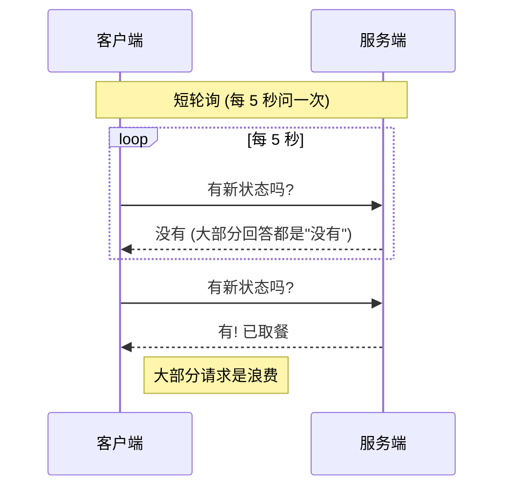
```mermaid
sequenceDiagram
    participant C as 客户端
    participant S as 服务端
    Note over C,S: 短轮询 (每 5 秒问一次)
    loop 每 5 秒
        C->>S: 有新状态吗?
        S-->>C: 没有 (大部分回答都是"没有")
    end
    C->>S: 有新状态吗?
    S-->>C: 有! 已取餐
    Note right of C: 大部分请求是浪费
```

- **优点**:实现简单,纯 HTTP。
- **缺点**:**大部分请求是"没有"的空查询**,浪费带宽 + 服务端资源。
- **原书结论**:**不推荐生产用**。

### 11.2 长轮询(Long Polling)

客户端发请求,服务端**hold 住不立即回**,等到有更新或超时(如 1 分钟)才回。客户端收到回包后立刻再发一个。

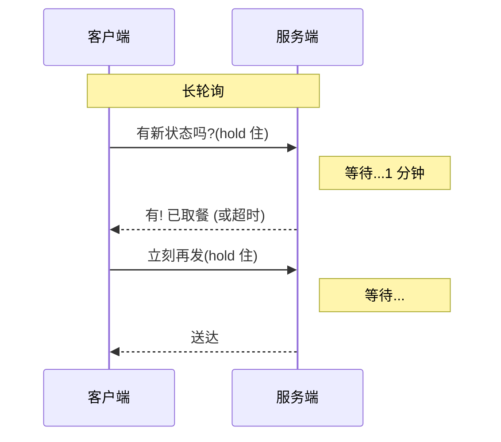
```mermaid
sequenceDiagram
    participant C as 客户端
    participant S as 服务端
    Note over C,S: 长轮询
    C->>S: 有新状态吗?(hold 住)
    Note right of S: 等待...1 分钟
    S-->>C: 有! 已取餐 (或超时)
    C->>S: 立刻再发(hold 住)
    Note right of S: 等待...
    S-->>C: 送达
```

- **优点**:比短轮询**少很多空请求**,资源消耗低。
- **缺点**:① 服务端要 hold 大量连接(资源);② 连接会断,要重连;③ 收发可能不在同一台服务器(HTTP 无状态 + LB 轮询)。
- **退避策略**:失败时指数退避(1s→5s→30s→...,Gmail 离线时这样)。

> 🪤 **追问陷阱(高频)**:"长轮询为什么收发可能不在同一台服务器?" → HTTP 是无状态的,LB 用轮询分发。发送方的请求落到 chat server 1,接收方的长轮询连接可能在 chat server 2——server 1 不知道该转给谁。**所以真正的 IM 几乎都用 WebSocket**(持久连接 + 有状态路由)。**长轮询只是历史过渡方案**(Facebook 早期、Gmail 早期用过)。

> 📝 **详见 SDE-Vol1 Ch12 设计聊天系统**——那里详细讲了轮询→长轮询→WebSocket 的演进动机。

---

## 12. Push 机制:WebSocket ⭐⭐⭐⭐⭐

WebSocket 提供**双向、持久**的全双工连接(单条 TCP 上)。一旦建立,客户端和服务端都能随时发消息。

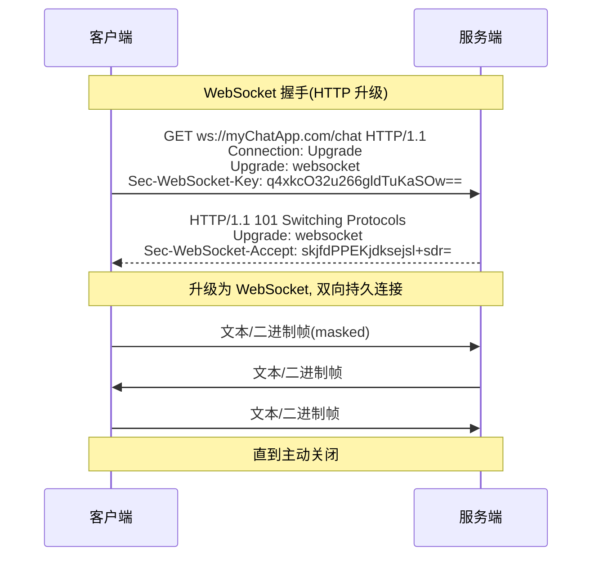
```mermaid
sequenceDiagram
    participant C as 客户端
    participant S as 服务端
    Note over C,S: WebSocket 握手(HTTP 升级)
    C->>S: GET ws://myChatApp.com/chat HTTP/1.1<br/>Connection: Upgrade<br/>Upgrade: websocket<br/>Sec-WebSocket-Key: q4xkcO32u266gldTuKaSOw==
    S-->>C: HTTP/1.1 101 Switching Protocols<br/>Upgrade: websocket<br/>Sec-WebSocket-Accept: skjfdPPEKjdksejsl+sdr=
    Note over C,S: 升级为 WebSocket, 双向持久连接
    C->>S: 文本/二进制帧(masked)
    S->>C: 文本/二进制帧
    C->>S: 文本/二进制帧
    Note over C,S: 直到主动关闭
```

**WebSocket 握手的关键**:
1. 客户端发 HTTP GET,带 `Connection: Upgrade` + `Upgrade: websocket` + `Sec-WebSocket-Key`(随机 base64)。
2. 服务端回 **HTTP 101 Switching Protocols**(协议切换),带 `Sec-WebSocket-Accept`。
3. **Sec-WebSocket-Accept 的生成**:服务端把 `Sec-WebSocket-Key` + 固定 GUID(`258EAFA5-E914-47DA-95CA-C5AB0DC85B11`,RFC 6455 定义)拼接,做 **SHA-1 哈希 + base64 编码**。**这是安全校验**——防止普通 HTTP 服务器误升级。
4. 升级后,客户端/服务端用**帧(frame)**通信(文本/二进制)。
5. **客户端发帧必须 mask**(掩码,4 字节随机 key XOR payload),防中间人缓存污染。**服务端发的帧不 mask**。

**WebSocket 的优势**(背):
- **全双工**:双向**同时**收发(像打电话)。HTTP 是半双工(轮流)。
- **持久连接**:握手一次后长期保持,无重复握手开销。
- **低开销**:帧头只有 2-14 字节,比 HTTP 头(几百字节)轻得多。
- **服务端主动推**:不用客户端问,服务端有数据就推。

```mermaid
flowchart LR
    WC["WebSocket 帧"] --> FH["帧头<br/>────────<br/>FIN/opcode/mask<br/>payload length<br/>mask key(4B)"]
    WC --> PD["Payload<br/>────────<br/>extension data(可选)<br/>application data(消息)"]

    USE["典型用例 ⭐<br/>────────<br/>• 聊天 IM(Slack/Discord)<br/>• 协作编辑(Google Docs)<br/>• 多人游戏<br/>• 实时金融(双向下单)"]

    WC -.-> USE

    style WC fill:#A5D6A7,stroke:#388E3C,color:#1f1f1f
    style FH fill:#80DEEA,stroke:#0097A7,color:#1f1f1f
    style PD fill:#CE93D8,stroke:#7B1FA2,color:#1f1f1f
    style USE fill:#FFCC80,stroke:#F57C00,color:#1f1f1f
```

> 💡 **WebSocket 选型**:需要**双向实时**用 WebSocket——聊天、协作、游戏、双向金融。**但如果只需要服务端→客户端单向**(股票行情、通知),用 SSE 更简单(见下节)。

---

## 13. Push 机制:Server-Sent Events (SSE) ⭐⭐⭐⭐(被低估)

SSE 基于**长连接 HTTP**,服务端**单向**推送事件流到客户端(只能服务端→客户端)。客户端用 `EventSource` API 订阅事件流。

```mermaid
sequenceDiagram
    participant C as 客户端 (EventSource)
    participant S as 服务端
    Note over C,S: SSE 单向推送 (基于 HTTP)
    C->>S: GET /events (Accept: text/event-stream)
    S-->>C: HTTP 200 (Content-Type: text/event-stream)
    loop 服务端有更新就推
        S-->>C: data: 订单已取餐\n\n
        S-->>C: data: 骑手距离 500m\n\n
    end
    Note right of S: 连接断开 → 客户端自动重连<br/>(带 Last-Event-ID 续传)
```

**SSE 的关键特征**:
- **单向**:只有服务端→客户端。客户端要发消息走普通 HTTP。
- **基于 HTTP**:不用协议升级(WebSocket 要升级),纯 HTTP 长连接。
- **文本格式**:事件流是 `text/event-stream`,每条 `data: ...\n\n`。
- **自动重连 ⭐**:浏览器原生支持,断线自动重连,带 `Last-Event-ID` 续传——**这是 WebSocket 没有的内置能力**。
- **简单**:服务端只需保持 HTTP 响应流打开,持续 `write` 即可。

```mermaid
flowchart LR
    Q["WebSocket vs SSE?"] --> NEED{"需要双向?"}
    NEED -->|"是(聊天/协作/游戏)"| WS["WebSocket ⭐<br/>────────<br/>全双工<br/>二进制+文本<br/>协议升级"]
    NEED -->|"否(只需服务端推)"| SSE["SSE ⭐<br/>────────<br/>单向<br/>基于 HTTP<br/>自动重连<br/>AI 流式输出首选"]

    style Q fill:#FFE082,stroke:#F9A825,color:#1f1f1f
    style NEED fill:#FFCC80,stroke:#F57C00,color:#1f1f1f
    style WS fill:#CE93D8,stroke:#7B1FA2,color:#1f1f1f
    style SSE fill:#A5D6A7,stroke:#388E3C,color:#1f1f1f
```

> 🪤 **追问陷阱(高频)**:"SSE 和 WebSocket 怎么选?" → **看是否需要客户端→服务端**。需要双向 → WebSocket;只需要服务端推(股票、通知、AI 流式输出)→ **SSE 更简单**(自动重连、纯 HTTP、无需协议升级)。**2026 趋势:SSE 被严重低估,大量场景其实只需 SSE,却被误用 WebSocket**。原书把 SSE 当备选,但 ChatGPT 流式输出、Cursor AI 补全都用 SSE。

> 💡 **SSE 业界用例**:BlackBerry Messenger、LinkedIn 消息、**所有 OpenAI 兼容 API 的流式输出**(ChatGPT 那种逐字返回)、股票行情推送、浏览器通知。

---

## 14. RPC:远程过程调用

### 14.1 RPC 的核心思想

**Remote Procedure Call**——执行远程机器上的代码,**像调用本地函数一样**。比如支付服务调用支付网关(PG),开发者的代码看起来就是 `pg.charge(amount)`,但实际跑在远程。

```mermaid
flowchart LR
    subgraph CLIENT_SIDE["客户端机器"]
        CODE["业务代码<br/>result = pg.charge(100)"]
        CSTUB["客户端 Stub ⭐<br/>────────<br/>伪装成本地函数<br/>marshal 参数 → 网络消息"]
    end
    NET["网络<br/>────────<br/>(IDL 契约)"] 
    subgraph SERVER_SIDE["服务端机器"]
        SSTUB["服务端 Stub<br/>────────<br/>unmarshal 消息<br/>→ 调用真实方法"]
        IMPL["真实方法实现<br/>charge(amount)"]
    end

    CODE --> CSTUB
    CSTUB -->|"marshal→发消息"| NET
    NET --> SSTUB
    SSTUB --> IMPL
    IMPL --> SSTUB
    SSTUB -->|"marshal 响应→发消息"| NET
    NET --> CSTUB
    CSTUB --> CODE

    style CODE fill:#FFE082,stroke:#F9A825,color:#1f1f1f
    style CSTUB fill:#CE93D8,stroke:#7B1FA2,color:#1f1f1f
    style NET fill:#80DEEA,stroke:#0097A7,color:#1f1f1f
    style SSTUB fill:#CE93D8,stroke:#7B1FA2,color:#1f1f1f
    style IMPL fill:#A5D6A7,stroke:#388E3C,color:#1f1f1f
```

**RPC 的核心组件**(背):
- **Stub(桩)**:伪装成远程方法的本地函数,内部处理**网络通信 + marshal/unmarshal**。客户端 stub 封装参数成消息(marshal),服务端 stub 解包消息(unmarshal)调真实方法。
- **IDL(Interface Definition Language)**:语言无关的接口定义,描述有哪些远程方法、参数类型。**IDL 生成各语言的 stub**。
- **Marshaling(编组)**:把内存对象转成可在网络传输的字节流(序列化)。

### 14.2 RPC 的收益与代价

```mermaid
flowchart LR
    RPC["RPC"] --> BEN["收益 ⭐<br/>────────<br/>• 代码复用(远程方法可被多客户端调)<br/>• 抽象网络(开发者像调本地函数)<br/>• 跨语言(IDL 生成 stub)<br/>• 可扩展(代码分布多机器)"]
    RPC --> CON["代价<br/>────────<br/>• 网络延迟(本地调用 ns, 远程 ms)<br/>• 网络失败(要重试/超时/幂等)<br/>• 接口兼容(系统演进要保证)<br/>• marshal 开销"]

    style RPC fill:#FFE082,stroke:#F9A825,color:#1f1f1f
    style BEN fill:#A5D6A7,stroke:#388E3C,color:#1f1f1f
    style CON fill:#EF9A9A,stroke:#C62828,color:#1f1f1f
```

### 14.3 RPC 的代表

| RPC 框架 | IDL/编码 | 特点 |
|---------|---------|------|
| **SOAP**(老) | WSDL + XML | 复杂,XML 重,跨 HTTP/SMTP/TCP;新项目少用 |
| **gRPC** ⭐(Google) | **Protobuf** | 二进制高效、双向流、跨语言;**2026 微服务事实标准** |
| **Apache Thrift** | Thrift IDL | Facebook 开源,跨语言,二进制 |
| **JSON-RPC** | JSON | 简单,人可读,但不如 gRPC 高效 |

> 💡 **SOAP vs REST**(背):SOAP 是**协议**(XML 严格、自带安全/类型/RPC),复杂;REST 是**架构风格**(轻量、HTTP+JSON),灵活。**新项目大多选 REST 或 gRPC,SOAP 退守遗留企业系统**(银行、医疗等)。

---

## 15. REST:资源化的 Web API 标准 ⭐⭐⭐⭐⭐

REST(Representational State Transfer)不是协议,是**架构风格**,广泛和 HTTP 搭配。用 HTTP 方法做 CRUD,资源用 URL 唯一标识。

### 15.1 REST 的六大原则

```mermaid
flowchart TD
    REST["REST 六原则"] --> R1["① 客户端-服务器<br/>────────<br/>客户端、服务器、资源<br/>资源用 URL 唯一标识"]
    REST --> R2["② 无状态 Stateless ⭐<br/>────────<br/>服务器不存请求状态<br/>状态由客户端维护<br/>每次请求带全部信息"]
    REST --> R3["③ 可缓存<br/>────────<br/>响应可标 Cache-Control<br/>客户端/浏览器/CDN 缓"]
    REST --> R4["④ 统一接口<br/>────────<br/>URL 唯一标识<br/>资源表示(JSON/XML)<br/>自描述消息<br/>HATEOAS 超媒体"]
    REST --> R5["⑤ 分层系统<br/>────────<br/>客户端只知入口(LB/API GW)<br/>中间多层对客户端透明"]
    REST --> R6["⑥ 按需代码(可选)<br/>────────<br/>服务端可下发脚本<br/>客户端执行"]

    style REST fill:#FFE082,stroke:#F9A825,color:#1f1f1f
    style R1 fill:#80DEEA,stroke:#0097A7,color:#1f1f1f
    style R2 fill:#CE93D8,stroke:#7B1FA2,color:#1f1f1f
    style R3 fill:#A5D6A7,stroke:#388E3C,color:#1f1f1f
    style R4 fill:#FFCC80,stroke:#F57C00,color:#1f1f1f
    style R5 fill:#90CAF9,stroke:#1976D2,color:#1f1f1f
    style R6 fill:#EF9A9A,stroke:#C62828,color:#1f1f1f
```

> 💡 **HATEOAS(Hypermedia As The Engine Of Application State)**:服务端响应里带**超链接**,客户端通过链接导航资源(像网页点链接)。这是 REST 最高境界,但**实践中很少做到**(多数"REST API"只是 RESTful-ish)。

### 15.2 Richardson 成熟度模型 ⭐⭐⭐

衡量一个 API "有多 RESTful" 的四级模型(由 Leonard Richardson 提出):

```mermaid
flowchart LR
    L0["Level 0<br/>HTTP 当传输<br/>(SOAP-RPC 风格)"] --> L1["Level 1<br/>资源<br/>(URL 区分资源)"]
    L1 --> L2["Level 2 ⭐<br/>HTTP 动词 + 状态码<br/>(大多数 REST API)"]
    L2 --> L3["Level 3<br/>HATEOAS<br/>(带超链接, 完整 REST)"]

    style L0 fill:#EF9A9A,stroke:#C62828,color:#1f1f1f
    style L1 fill:#FFCC80,stroke:#F57C00,color:#1f1f1f
    style L2 fill:#A5D6A7,stroke:#388E3C,color:#1f1f1f
    style L3 fill:#CE93D8,stroke:#7B1FA2,color:#1f1f1f
```

| Level | 特征 | 例子 |
|-------|------|------|
| **0** | 用 HTTP 当传输,一个端点 POST 一切 | `POST /api {action: "createOrder"}` |
| **1** | 资源化,不同资源不同 URL | `POST /orders`、`GET /orders/123` |
| **2** ⭐ | 用 HTTP 动词(GET/POST/PUT/DELETE)+ 正确状态码 | **大多数生产 REST API 在这一级** |
| **3** | + HATEOAS(响应带超链接导航) | 极少项目达到 |

> 🪤 **追问陷阱**:"你的 REST API 到 Richardson 哪一级?" → **大多数实际系统在 Level 2**(用对 HTTP 动词和状态码),**Level 3(HATEOAS)极少做**——因为客户端要解析超链接,实现复杂,收益不大。**面试说"Level 2 是务实选择"**。

---

## 16. GraphQL:灵活查询的 API 语言

REST 是**服务端定义 schema**,客户端被动接受——常导致 **overfetching**(取了不需要的字段)或 **underfetching**(要多次请求才能凑齐数据)。GraphQL 让**客户端写查询**,只取需要的字段,**单一端点**服务所有需求。

```mermaid
flowchart LR
    REST_P["REST 问题"] --> OF["Overfetching<br/>────────<br/>GET /restaurants/1<br/>返回全部字段<br/>我只想要 name"]
    REST_P --> UF["Underfetching<br/>────────<br/>查餐厅→查菜品→查评论<br/>3 次请求"]

    GQL["GraphQL 解法"] --> ONE["单一端点<br/>/graphql"]
    GQL --> FLEX["客户端写 query<br/>────────<br/>按需取字段<br/>关联数据一次查"]

    OF -.->|"解决"| FLEX
    UF -.->|"解决"| FLEX

    style REST_P fill:#EF9A9A,stroke:#C62828,color:#1f1f1f
    style OF fill:#FFCC80,stroke:#F57C00,color:#1f1f1f
    style UF fill:#FFCC80,stroke:#F57C00,color:#1f1f1f
    style GQL fill:#A5D6A7,stroke:#388E3C,color:#1f1f1f
    style ONE fill:#80DEEA,stroke:#0097A7,color:#1f1f1f
    style FLEX fill:#CE93D8,stroke:#7B1FA2,color:#1f1f1f
```

### 16.1 GraphQL Schema(SDL)+ 查询

GraphQL 用**强类型 Schema Definition Language** 定义实体:

```graphql
# Schema (SDL)
type Restaurant {
  id: String!
  name: String!
  rating: Float
  foodItems: [FoodItem!]!
}

type FoodItem {
  id: String!
  name: String!
  rating: Float
  isVeg: Boolean!
}

# 客户端查询: 只取需要的字段
query {
  Restaurant(id: "lsoa34444lsoa") {
    name
    foodItems {
      name
      description
    }
  }
}
```

> `!` 表示**必填字段**(non-null),`[Type!]!` 表示**非空列表且元素非空**。

### 16.2 三种操作:Query / Mutation / Subscription

| 操作 | 关键字 | 用途 | 类比 |
|------|--------|------|------|
| **Query** | `query` | 读数据 | REST GET |
| **Mutation** | `mutation` | 写/改/删数据 | REST POST/PUT/DELETE |
| **Subscription** | `subscription` | 订阅实时事件(双向连接) | WebSocket/SSE 风格 |

```graphql
# Mutation: 创建食物 + 返回新 ID
mutation {
  createFoodItem(name: "Paneer Tikka Masala", isVeg: true) {
    id
    name
  }
}

# Subscription: 订阅新食物事件(实时)
subscription {
  onNewFoodItem {
    id
    name
  }
}
```

> 💡 **GraphQL 的优势**:① **单一端点**(不用维护多 URL);② **按需取字段**(省带宽,慢网快);③ **强类型 Schema**(客户端有 insight,自动生成 TS 类型);④ **聚合多后端**(Apollo/AWS AppSync 网关聚合多 GraphQL 服务)。

> 🪤 **追问陷阱**:"GraphQL 会取代 REST 吗?" → **不会完全取代**。GraphQL 适合**客户端多样、需求多变**的场景(移动端、多端);但 REST 在**简单 CRUD、缓存友好(HTTP 缓存)、CDN 友好**上仍占优。**2026 现状:外部 API 多用 REST/GraphQL(看场景),内部微服务用 gRPC**。

---

## 17. WebRTC:浏览器实时音视频 ⭐⭐⭐⭐

WebRTC(Web Real-Time Communication)让浏览器/移动 App **无需插件**就能做**音视频通信 + 文件共享**。和前面所有协议不同,WebRTC 支持**点对点(P2P)**——不需要中间服务器转发(虽然建立连接时需要信令/STUN/TURN)。

```mermaid
flowchart LR
    PEER_A["Peer A<br/>(浏览器)"] <-->|"媒体流<br/>(音视频)"| PEER_B["Peer B<br/>(浏览器)"]
    PEER_A -.->|"信令(SDP/ICE 候选)<br/>via WebSocket/HTTP"| SIGNAL["信令服务器<br/>(只帮建连, 不传媒体)"]
    SIGNAL -.-> PEER_B
    PEER_A -->|"查公网 IP/端口"| STUN["STUN 服务器<br/>(穿透 NAT)"]
    PEER_B --> STUN
    PEER_A -.->|"NAT 太严? 中继"| TURN["TURN 服务器<br/>(relay 转发)"]
    TURN -.-> PEER_B

    style PEER_A fill:#FFE082,stroke:#F9A825,color:#1f1f1f
    style PEER_B fill:#FFE082,stroke:#F9A825,color:#1f1f1f
    style SIGNAL fill:#80DEEA,stroke:#0097A7,color:#1f1f1f
    style STUN fill:#A5D6A7,stroke:#388E3C,color:#1f1f1f
    style TURN fill:#CE93D8,stroke:#7B1FA2,color:#1f1f1f
```

### 17.1 WebRTC 不是单一协议,是工具集

WebRTC 是**多个协议 + API 的集合**:
- **RTCPeerConnection**:建立 peer 间连接。
- **getUserMedia**:访问设备摄像头/麦克风。
- **RTCDataChannel**:peer 间双向数据通道。

### 17.2 NAT 穿透:STUN / TURN / ICE ⭐

设备常在 NAT 后(私有 IP),公网无法直接连。WebRTC 用 **ICE 框架**找最优路径:

| 协议/机制 | 作用 | 何时用 |
|----------|------|-------|
| **STUN**(Session Traversal Utilities for NAT) | 帮设备查自己的**公网 IP + NAT 分配端口** | 默认先用,大部分场景够 |
| **TURN**(Traversal Using Relays around NAT) | 当 STUN 失败(对称 NAT/严格防火),**中继转发** | 兜底,但贵(流量过中继) |
| **ICE**(Interactive Connectivity Establishment) | **框架**,收集所有候选路径(host/SRFLX/RELAY),选最优 | 总览 |
| **SDP**(Session Description Protocol) | 描述媒体(类型/格式/地址/端口),peer 间交换 | 信令阶段 |

```mermaid
sequenceDiagram
    participant A as Peer A
    participant STUN as STUN 服务器
    participant SIG as 信令服务器
    participant B as Peer B
    Note over A,B: 1. 各自查公网地址 (STUN)
    A->>STUN: 我的公网地址?
    STUN-->>A: 你的 SRFLX 候选 (公网IP:port)
    B->>STUN: 我的公网地址?
    STUN-->>B: 你的 SRFLX 候选
    Note over A,B: 2. 通过信令服务器交换候选 (SDP)
    A->>SIG: 发送 offer (含 ICE 候选)
    SIG->>B: 转发 offer
    B->>SIG: 回复 answer (含 ICE 候选)
    SIG->>A: 转发 answer
    Note over A,B: 3. ICE 尝试直连, 失败则用 TURN 中继
    A->>B: 直连尝试 (host/SRFLX 候选)
    alt 直连成功
        B-->>A: P2P 媒体流
    else 失败 (严格 NAT)
        A->>TURN: 经 TURN 中继
        TURN->>B: 转发媒体
    end
```

> 💡 **STUN 几乎免费,TURN 贵**:TURN 要中继所有媒体流量(带宽成本),所以**先用 STUN,失败才 TURN**。设计时 TURN 服务器容量要预估(约 10-20% 的连接需要 TURN)。

> 🪤 **追问陷阱**:"WebRTC 是 P2P,那多人视频怎么办?" → **纯 P2P 在多人下不可行**——N 个 peer 两两连接 = O(N²) 条连接,带宽和 CPU 爆炸(Discord 1000 人频道就是例子)。**实际多人视频用 SFU(Selective Forwarding Unit)或 MCU**——服务器接收所有流再选择性转发(SFU)或混流(MCU)。Zoom/Meet/Discord 都用 SFU。**这是原书漏讲的关键**(详见 2026 增量)。

---

## 2026 现代增量(原书没讲的硬核)⭐⭐⭐⭐⭐

原书(2023)的协议清单讲得系统,但**几处停在 2022**。以下是 2026 必补的硬核料——面试讲出来直接拉开档次。

### 增量 1:HTTP/3 + QUIC —— 传输层最大变革 ⭐⭐⭐⭐⭐

原书只说"HTTP/3 用 UDP,叫 QUIC"一句话带过。但 **QUIC 是 2022 年正式标准化的(RFC 9000),2026 已是主流**(Google 全站、Cloudflare、Apple、Facebook 都默认 HTTP/3)。这是**自 TCP/IP 以来传输层最大的变革**。

```mermaid
flowchart LR
    OLD["HTTP/2 基于 TCP<br/>────────<br/>❌ TCP 层队头阻塞<br/>❌ 握手慢(TCP+TLS 多 RTT)<br/>❌ 连接绑四元组(IP变就断)"] -->|"QUIC 革命"| NEW["HTTP/3 基于 QUIC(UDP) ⭐<br/>────────<br/>✅ 多流无队头阻塞<br/>✅ 0-RTT 握手<br/>✅ 连接迁移(connection ID)<br/>✅ 内建 TLS 1.3<br/>✅ 用户态实现(改内核不用等)"]

    style OLD fill:#EF9A9A,stroke:#C62828,color:#1f1f1f
    style NEW fill:#A5D6A7,stroke:#388E3C,color:#1f1f1f
```

**QUIC 的五大杀手锏(背)**:

| 特性 | 解决的问题 | 价值 |
|------|----------|------|
| **多路复用无队头阻塞** ⭐ | HTTP/2 在 TCP 层一个流丢包卡所有流 | QUIC 每个流独立,丢包只影响本流 |
| **0-RTT 握手** | TCP+TLS 要 1-3 个 RTT 才能传数据 | 重连几乎零延迟(0-RTT),首连 1-RTT |
| **连接迁移** ⭐ | TCP 绑四元组(IP+Port),WiFi 切 4G 连接断 | QUIC 用 connection ID,**切网络不断连** |
| **内建 TLS 1.3** | TCP + TLS 分层,握手重叠 | QUIC 把 TLS 揉进协议,默认加密 |
| **用户态实现** | TCP 在内核,改一次要等内核更新 | QUIC 在用户态,迭代快 |

> 🔄 **2026 话术(直接背)**:"原书只说 HTTP/3 用 UDP,但漏了 **QUIC 是自 TCP 以来传输层最大变革**。它解决三个 TCP 老毛病:① **队头阻塞**——HTTP/2 在 TCP 上跑多流,一个流丢包 TCP 卡所有流;QUIC 在 UDP 上每个流独立。② **握手慢**——TCP+TLS 要 1-3 RTT;QUIC **0-RTT**(重连几乎零延迟)。③ **连接绑 IP**——WiFi 切 4G,TCP 断;QUIC 用 connection ID,**切网络不断连**(这是移动 IM 痛点)。2022 年 RFC 9000 标准化,Google/Cloudflare/Apple 全用,**2026 是默认传输层**。"

> 💡 **连接迁移为什么是移动 IM 的福音**:WhatsApp/Discord 转向 QUIC,因为用户从 WiFi 切 4G/5G 时,**TCP 连接会断**(IP 变了),需要重连。**QUIC 用 connection ID 标识连接,不依赖 IP**,切网络连接保持,IM 不掉线。

> 🪤 **追问陷阱**:"QUIC 用 UDP,那可靠性谁保证?" → **QUIC 自己在 UDP 上重建了可靠性**(ACK、重传、拥塞控制、流控),只是把 TCP 的可靠机制搬到应用层(UDP 之上)。所以 **QUIC = UDP 之上的"新 TCP"**,但加了多流、0-RTT、连接迁移等 TCP 做不到的特性。

### 增量 2:gRPC vs REST vs GraphQL vs tRPC 选型矩阵 ⭐⭐⭐⭐⭐

原书讲了 RPC/REST/GraphQL 但没给**选型矩阵**。这是 2026 面试高频题。

```mermaid
flowchart TD
    Q["选哪个 API 标准?"] --> Q1{"场景?"}
    Q1 -->|"外部公开 API<br/>简单 CRUD"| REST["REST<br/>────────<br/>HTTP+JSON<br/>缓存友好<br/>简单通用"]
    Q1 -->|"客户端多样/字段灵活"| GQL["GraphQL<br/>────────<br/>单端点<br/>按需取字段<br/>强类型 Schema"]
    Q1 -->|"内部微服务<br/>高性能 + 双向流"| GRPC["gRPC ⭐<br/>────────<br/>Protobuf 二进制<br/>双向流<br/>跨语言<br/>HTTP/2"]
    Q1 -->|"全栈 TypeScript<br/>端到端类型安全"| TRPC["tRPC<br/>────────<br/>TS 端到端<br/>无需 IDL<br/>自动类型推导"]

    style Q fill:#FFE082,stroke:#F9A825,color:#1f1f1f
    style Q1 fill:#FFCC80,stroke:#F57C00,color:#1f1f1f
    style REST fill:#80DEEA,stroke:#0097A7,color:#1f1f1f
    style GQL fill:#CE93D8,stroke:#7B1FA2,color:#1f1f1f
    style GRPC fill:#A5D6A7,stroke:#388E3C,color:#1f1f1f
    style TRPC fill:#90CAF9,stroke:#1976D2,color:#1f1f1f
```

| 维度 | REST | GraphQL | gRPC | tRPC |
|------|------|---------|------|------|
| **编码** | JSON(文本) | JSON(文本) | **Protobuf(二进制)** | JSON(TS 类型) |
| **传输** | HTTP/1.1 or 2 | HTTP | **HTTP/2** | HTTP |
| **端点** | 多个 URL | **单一端点** | 多个方法 | 多个过程 |
| **schema** | OpenAPI(可选) | SDL(必填) | **Proto(必填,强类型)** | TS 类型(自动) |
| **性能** | 中 | 中 | **高(二进制+HTTP/2)** | 中 |
| **双向流** | ❌ | ❌(Subscription 另说) | **✅ ⭐** | ❌ |
| **跨语言** | ✅ | ✅ | **✅**(Proto 生成) | ❌(仅 TS) |
| **浏览器原生** | ✅ | ✅ | ❌(需 gRPC-Web 网关) | ✅ |
| **典型场景** | 公开 API、CRUD | 移动端、多端灵活 | **内部微服务** ⭐ | 全栈 TS 单体 |

> 💡 **2026 业界标配组合(背)**:**外部 API → REST 或 GraphQL**(看客户端多样性);**内部微服务间 → gRPC**(Protobuf 二进制 + 双向流 + 跨语言);**全栈 TS 项目 → tRPC**(端到端类型安全,无需写 IDL)。**gRPC-Web 网关**让浏览器也能调 gRPC(通过 Envoy 转换)。

> 🪤 **追问陷阱(高频)**:"微服务之间用什么协议?" → **gRPC 是 2026 事实标准**。原因:① **Protobuf 二进制**比 JSON 省 30-70% 带宽 + 解析快;② **HTTP/2 多路复用**一个连接跑多请求;③ **双向流**(streaming)适合实时场景;④ **强类型 Proto** 自动生成各语言客户端;⑤ **跨语言**(Java/Go/Python/TS 都支持)。**对外 API 仍用 REST/GraphQL**(浏览器友好)。

### 增量 3:WebSocket vs SSE vs 轮询 —— 2026 实战选型 ⭐⭐⭐⭐⭐

原书把 SSE 当"备选",但 2026 **SSE 被严重低估**。重新对比:

```mermaid
flowchart TD
    REALTIME["实时推送选型"] --> Q1{"需要双向?"}
    Q1 -->|"是(聊天/协作/游戏)"| WS["WebSocket ⭐<br/>────────<br/>全双工持久<br/>二进制+文本<br/>协议升级"]
    Q1 -->|"否(只需服务端推)"| Q2{"HTTP/3 + 简单优先?"}
    Q2 -->|"是(AI流式/通知/行情)"| SSE["SSE ⭐<br/>────────<br/>基于HTTP<br/>自动重连<br/>极简单"]
    Q2 -->|"兼容老浏览器/简单轮询"| POLL["轮询/长轮询<br/>────────<br/>HTTP/3让轮询也变便宜<br/>但仍是兜底"]

    style REALTIME fill:#FFE082,stroke:#F9A825,color:#1f1f1f
    style Q1 fill:#FFCC80,stroke:#F57C00,color:#1f1f1f
    style Q2 fill:#FFCC80,stroke:#F57C00,color:#1f1f1f
    style WS fill:#CE93D8,stroke:#7B1FA2,color:#1f1f1f
    style SSE fill:#A5D6A7,stroke:#388E3C,color:#1f1f1f
    style POLL fill:#80DEEA,stroke:#0097A7,color:#1f1f1f
```

| 方案 | 方向 | 连接 | 自动重连 | 二进制 | 典型 2026 场景 |
|------|------|------|---------|-------|--------------|
| **WebSocket** | 双向 | TCP 持久 | ❌(自己实现) | ✅ | 聊天、协作、游戏、双向金融 |
| **SSE** ⭐ | 服务端→客户端 | HTTP 长连接 | **✅ 浏览器原生** | ❌(文本) | **AI 流式输出、通知、股票行情** |
| **短轮询** | 客户端拉 | 每次新 HTTP | — | ✅ | 兼容性兜底、低频更新 |
| **长轮询** | 客户端拉(hold) | HTTP 长连接 | ❌ | ✅ | 历史过渡,新项目少用 |

> 🔄 **2026 话术(直接背)**:"原书把 SSE 当备选,但 **2026 SSE 被严重低估**。**所有 OpenAI 兼容 API 的流式输出(ChatGPT 逐字返回)都用 SSE**——因为它:① **基于 HTTP**(不用协议升级);② **浏览器原生自动重连**(WebSocket 要自己写);③ **极简单**(服务端 `res.write('data: ...\n\n')`)。**真正需要双向才用 WebSocket**(聊天/协作)。**HTTP/3 + QUIC 让轮询也变便宜**(连接建立几乎零成本),但仍是兜底。"

> 💡 **为什么 AI 流式输出选 SSE 不选 WebSocket**:① SSE 是 HTTP,穿过所有代理/防火墙;WebSocket 协议升级可能被某些代理拦截。② SSE 浏览器原生自动重连。③ AI 流式是**纯单向**(模型→用户),不需要双向。④ 实现简单(一个 HTTP handler 写流)。**OpenAI、Anthropic、所有兼容 API 都用 SSE**。

### 增量 4:mTLS + 零信任 + Service Mesh —— 服务间默认加密 ⭐⭐⭐⭐

原书完全没提服务间通信加密。但 2026 **零信任(Zero Trust)架构**要求**服务间通信默认加密**——不再"内网就安全"。这是接 Ch5 Service Mesh Sidecar 的延伸。

```mermaid
flowchart LR
    OLD["传统: 边界安全<br/>────────<br/>外网加密(TLS)<br/>内网信任(明文)<br/>一旦突破边界, 内网任我行"] -->|"零信任"| NEW["2026: 零信任 ⭐<br/>────────<br/>永不信任, 永远验证<br/>服务间也加密(mTLS)<br/>每个服务都认证"]

    NEW --> MTLS["mTLS 双向 TLS<br/>────────<br/>客户端+服务端<br/>都出示证书<br/>双向认证"]
    NEW --> MESH["Service Mesh 自动 mTLS<br/>────────<br/>Sidecar(Envoy)代办<br/>应用代码无感<br/>Istio/Linkerd"]

    style OLD fill:#EF9A9A,stroke:#C62828,color:#1f1f1f
    style NEW fill:#A5D6A7,stroke:#388E3C,color:#1f1f1f
    style MTLS fill:#80DEEA,stroke:#0097A7,color:#1f1f1f
    style MESH fill:#CE93D8,stroke:#7B1FA2,color:#1f1f1f
```

> 🔄 **2026 话术(接 Ch5)**:"原书没提服务间加密。但 2026 零信任架构下,**服务间通信默认 mTLS(双向 TLS)**——不再'内网就安全'。**Service Mesh(Istio/Linkerd)的 Sidecar 自动为每个服务注入 mTLS**,应用代码完全无感(加密由 Sidecar 代办)。**证书轮转、服务身份(SPIFFE)、流量加密**全由 Mesh 控制面统一管理。这是 Ch5 Service Mesh LB 能力的延伸——Sidecar 同时做 LB + mTLS + 可观测。"

### 增量 5:AsyncAPI —— 事件驱动的 OpenAPI ⭐⭐⭐

原书讲了 OpenAPI(REST 的契约),但没讲**异步通信的契约**。2026 **AsyncAPI** 是事件驱动/消息系统的"OpenAPI"——描述 Kafka/SQS/SNS/WebSocket/MQTT 的事件契约。

```mermaid
flowchart LR
    OPENAPI["OpenAPI<br/>────────<br/>描述 REST 同步 API<br/>endpoint/method/schema<br/>+ 自动生成文档/客户端"] 
    ASYNCAPI["AsyncAPI ⭐<br/>────────<br/>描述异步事件通信<br/>topic/channel/message schema<br/>+ 自动生成 pub/sub 客户端"]

    OPENAPI -.->|"类比"| ASYNCAPI

    ASYNCAPI --> USE["用例<br/>────────<br/>• Kafka 事件 schema<br/>• SQS/SNS 消息契约<br/>• WebSocket 消息格式<br/>• MQTT topic 定义"]

    style OPENAPI fill:#80DEEA,stroke:#0097A7,color:#1f1f1f
    style ASYNCAPI fill:#CE93D8,stroke:#7B1FA2,color:#1f1f1f
    style USE fill:#A5D6A7,stroke:#388E3C,color:#1f1f1f
```

> 💡 **为什么 AsyncAPI 重要**:事件驱动架构(EDA)里,生产者和消费者解耦,但**事件 schema 必须有契约**——否则生产者改字段,消费者炸。AsyncAPI 像 OpenAPI 描述 REST 一样描述事件,可生成文档 + 多语言客户端 + schema 校验。**2026 事件驱动系统的标配**。

### 增量 6:IPv6 普及 + DNS-over-HTTPS(DoH) + DNSSEC ⭐⭐⭐

原书对 DNS/IP 提得很少(说在 Ch9 详讲)。但 2026 几个网络层变革要会:

```mermaid
flowchart LR
    NET2026["网络层 2026 变革"] --> IPV6["IPv6 普及<br/>────────<br/>地址耗尽缓解<br/>云厂商默认分配<br/>但 v4 仍主导"]
    NET2026 --> DOH["DNS-over-HTTPS (DoH)<br/>────────<br/>DNS 查询走 HTTPS<br/>防 ISP 窃听/篡改<br/>防 DNS 劫持"]
    NET2026 --> DNSSEC["DNSSEC<br/>────────<br/>DNS 响应签名<br/>防 DNS 欺骗<br/>验证来源真实性"]

    style NET2026 fill:#FFE082,stroke:#F9A825,color:#1f1f1f
    style IPV6 fill:#80DEEA,stroke:#0097A7,color:#1f1f1f
    style DOH fill:#CE93D8,stroke:#7B1FA2,color:#1f1f1f
    style DNSSEC fill:#A5D6A7,stroke:#388E3C,color:#1f1f1f
```

- **IPv6**:2026 普及率 ~40%(Google 统计),云厂商(AWS)默认分配 IPv6。**双栈(Dual Stack)**是过渡常态。
- **DoH(DNS-over-HTTPS)**:DNS 查询加密走 HTTPS(端口 443),防止 ISP/中间人窃听或篡改 DNS 响应。Firefox/Chrome 默认开启。**AWS Route 53 Resolver 支持 DoH**。
- **DNSSEC**:给 DNS 响应加数字签名,验证响应未被篡改(防 DNS 欺骗/cache poisoning)。**Route 53 支持 DNSSEC 签名**。

### 增量 7:5G + 边缘计算 —— 催生新实时应用 ⭐⭐⭐

5G 让移动端 RTT 从 4G 的 ~50ms 降到 **~10ms**,催生新实时应用(AR/VR、车联网、云游戏)。

```mermaid
flowchart LR
    OLD4G["4G 时代<br/>────────<br/>移动端 RTT ~50ms<br/>实时音视频勉强<br/>云游戏不可行"] -->|"5G"| NEW5G["5G + 边缘 ⭐<br/>────────<br/>RTT ~10ms<br/>eMBB 高带宽<br/>uRLLC 超可靠低延迟<br/>mMTC 海量连接(IoT)"]

    NEW5G --> APP["新应用<br/>────────<br/>• 云游戏(GeForce Now)<br/>• AR/VR 远程协作<br/>• 车联网 V2X<br/>• 远程手术<br/>• 工业互联网"]

    style OLD4G fill:#FFCC80,stroke:#F57C00,color:#1f1f1f
    style NEW5G fill:#A5D6A7,stroke:#388E3C,color:#1f1f1f
    style APP fill:#CE93D8,stroke:#7B1FA2,color:#1f1f1f
```

> 💡 **5G + 边缘的协议启示**:低 RTT 让**实时音视频用 WebRTC 更流畅**;车联网/IoT 用 **MQTT + 边缘 broker** 降延迟;云游戏需要 **QUIC**(0-RTT + 抗弱网)。**AWS Wavelength / Outposts** 把 AWS 服务推到 5G 边缘。

### 增量 8:WebRTC 多人视频 —— SFU / MCU(原书漏讲)⭐⭐⭐⭐

原书只讲 WebRTC P2P,但多人视频用 P2P 不可行(N² 连接)。实际用 **SFU(Selective Forwarding Unit)**或 **MCU(Multipoint Control Unit)**。

```mermaid
flowchart TD
    P2P["纯 P2P<br/>────────<br/>N 人两两连接<br/>O(N²) 连接<br/>3人=3连接, 10人=45连接<br/>带宽/CPU 爆炸"] -->|"不可扩展"| CENTRAL["中心化方案"]
    CENTRAL --> SFU["SFU 选择性转发 ⭐<br/>────────<br/>服务器收每路流<br/>选择性转发给其他人<br/>O(N) 连接<br/>Zoom/Meet/Discord 用"]
    CENTRAL --> MCU["MCU 混流<br/>────────<br/>服务器把多路混成一路<br/>客户端只收一路<br/>省客户端带宽<br/>但服务器开销极大"]

    style P2P fill:#EF9A9A,stroke:#C62828,color:#1f1f1f
    style CENTRAL fill:#FFCC80,stroke:#F57C00,color:#1f1f1f
    style SFU fill:#A5D6A7,stroke:#388E3C,color:#1f1f1f
    style MCU fill:#CE93D8,stroke:#7B1FA2,color:#1f1f1f
```

| 方案 | 连接数 | 服务器开销 | 客户端带宽 | 典型 |
|------|-------|----------|----------|------|
| **纯 P2P(mesh)** | O(N²) | 极低(无媒体服务器) | 高(每路都要发 N-1 份) | 小群(<4 人) |
| **SFU** ⭐ | O(N) | 中(转发不混流) | 中(发一份给服务器,收 N-1 份) | **Zoom/Meet/Discord** |
| **MCU** | O(N) | 极高(混流编码) | 低(只收一份混流) | 老式硬件视频会议 |

> 💡 **为什么 SFU 是主流**:SFU 比 P2P 可扩展,比 MCU 省服务器(只转发不混流)。**Simulcast(同源多码率)+ SFU** 是 2026 多人视频的事实架构——客户端发多路不同分辨率,SFU 按接收方带宽选转发哪路。

---

## ⚠️ 已过时 / 书里没说(2022 → 2026)

| 原书(2023) | 2026 现状 | 面试应对 |
|------------|----------|---------|
| HTTP/3 只说"用 UDP" | **QUIC 是传输层最大变革**(0-RTT/连接迁移/无队头阻塞) | 讲 QUIC 五大杀手锏 + 移动 IM 痛点 |
| RPC/REST/GraphQL 没选型矩阵 | **gRPC 内部微服务事实标准**;GraphQL 灵活客户端;tRPC 全栈 TS | 给选型矩阵 + 2026 标配组合 |
| SSE 当"备选" | **SSE 被低估**(AI 流式输出首选) | 讲 SSE 自动重连 + ChatGPT 用 SSE |
| 完全没提 mTLS / 零信任 | **服务间默认加密**(Service Mesh 自动 mTLS) | 讲零信任 + Sidecar 代办 mTLS |
| 没提 AsyncAPI | **事件驱动的 OpenAPI** | 讲 AsyncAPI 描述 Kafka/SQS 事件契约 |
| 没讲 IPv6/DoH/DNSSEC | **DoH 防 DNS 窃听,DNSSEC 防欺骗** | 讲 DoH/DNSSEC 安全价值 |
| 没讲 5G + 边缘 | **5G RTT ~10ms 催生云游戏/AR/车联网** | 讲 5G + 边缘 + 新实时应用 |
| WebRTC 只讲 P2P | **多人视频用 SFU**(Zoom/Meet/Discord) | 讲 P2P 的 N² 问题 + SFU 解法 |
| 长轮询当主推方案 | **WebSocket/SSE 主流,长轮询历史过渡** | 讲演进:轮询→长轮询→WebSocket/SSE |
| 没提 tRPC | **全栈 TS 端到端类型安全** | 讲 tRPC 适用场景(TS 单体) |

---

## 💻 代码示例

### 示例 1:TCP 三次握手 + 数据传输(Python socket)

```python
import socket

# 服务端
def tcp_server():
    srv = socket.socket(socket.AF_INET, socket.SOCK_STREAM)
    srv.bind(('0.0.0.0', 8080))
    srv.listen(5)
    print("服务端等待连接...")
    conn, addr = srv.accept()  # 三次握手在此完成
    print(f"连接来自 {addr}")
    while True:
        data = conn.recv(1024)  # 可靠传输: 内核保证顺序+重传
        if not data:
            break
        print(f"收到: {data.decode()}")
        conn.sendall(b"ACK: " + data)  # TCP 自带 ACK, 这里是应用层回显
    conn.close()  # 四次挥手

# 客户端
def tcp_client():
    c = socket.socket(socket.AF_INET, socket.SOCK_STREAM)
    c.connect(('127.0.0.1', 8080))  # 触发三次握手 (SYN→SYN+ACK→ACK)
    c.sendall(b"hello")
    print(c.recv(1024).decode())  # ACK: hello
    c.close()  # 触发四次挥手

# TCP 保证: 可靠(重传) + 有序 + 全双工
# 代价: 慢(握手 + 重传 + 拥塞控制)
```

### 示例 2:UDP 无连接(Python socket)

```python
import socket

# UDP 服务端 (无握手, 无重传)
def udp_server():
    srv = socket.socket(socket.AF_INET, socket.SOCK_DGRAM)  # SOCK_DGRAM = UDP
    srv.bind(('0.0.0.0', 8080))
    while True:
        data, addr = srv.recvfrom(1024)  # 直接收, 无连接概念
        print(f"来自 {addr}: {data.decode()}")
        srv.sendto(b"got it", addr)  # 不保证到达

# UDP 客户端
def udp_client():
    c = socket.socket(socket.AF_INET, socket.SOCK_DGRAM)
    c.sendto(b"hello", ('127.0.0.1', 8080))  # 无 connect, 直接发
    # 可能丢包, 乱序, 不保证到达

# UDP: 快(无握手无重传) + 头轻(8B vs TCP 20B)
# 适合: DNS / VoIP / 视频 / 游戏 / IoT
```

### 示例 3:WebSocket 服务端(Node.js)

```javascript
const { WebSocketServer } = require('ws');

const wss = new WebSocketServer({ port: 8080 });

wss.on('connection', (ws) => {
    console.log('客户端已连接 (握手: HTTP Upgrade → 101 Switching Protocols)');

    ws.on('message', (data) => {
        console.log('收到:', data.toString());
        ws.send(`服务端回声: ${data}`);  // 双向, 服务端主动推
    });

    // 服务端主动推送 (无需客户端先问)
    setInterval(() => {
        ws.send(JSON.stringify({ time: Date.now(), msg: '心跳' }));
    }, 30000);
});

// 客户端: new WebSocket('ws://localhost:8080')
// 握手过程:
//   GET / HTTP/1.1
//   Connection: Upgrade
//   Upgrade: websocket
//   Sec-WebSocket-Key: <random base64>
// →
//   HTTP/1.1 101 Switching Protocols
//   Sec-WebSocket-Accept: <SHA1(key+GUID) base64>
```

### 示例 4:SSE 服务端(Node.js,极简)

```javascript
const http = require('http');

// SSE 服务端: 纯 HTTP, 极简
http.createServer((req, res) => {
    if (req.url === '/events') {
        // 关键头: text/event-stream
        res.writeHead(200, {
            'Content-Type': 'text/event-stream',
            'Cache-Control': 'no-cache',
            'Connection': 'keep-alive'
        });

        // 服务端持续推 (data: ...\n\n 是 SSE 消息格式)
        setInterval(() => {
            res.write(`data: ${JSON.stringify({ time: Date.now() })}\n\n`);
        }, 1000);

        // 客户端断开 → 浏览器原生自动重连 (Last-Event-ID 续传)
    }
}).listen(8080);

// 客户端 (浏览器):
//   const es = new EventSource('/events');
//   es.onmessage = (e) => console.log(JSON.parse(e.data));
// 这就是 ChatGPT 流式输出的原理 (data: chunk\n\n 逐字推)
```

### 示例 5:GraphQL Schema + Query(综合)

```graphql
# Schema (SDL) - 定义类型
type Restaurant {
    id: ID!
    name: String!
    rating: Float
    foodItems: [FoodItem!]!
}

type FoodItem {
    id: ID!
    name: String!
    price: Float!
    isVeg: Boolean!
}

type Query {
    restaurant(id: ID!): Restaurant
    restaurants(city: String): [Restaurant!]!
}

type Mutation {
    createFoodItem(restaurantId: ID!, name: String!, price: Float!): FoodItem!
}

type Subscription {
    onNewFoodItem(restaurantId: ID!): FoodItem!  # 实时, 走 WebSocket
}

# 客户端查询: 只取需要的字段 (解决 REST 的 overfetching)
query {
    restaurant(id: "1") {
        name
        rating
        foodItems {
            name
            price
        }
    }
}
# 返回精确结构, 不多不少
```

### 示例 6:gRPC Proto 定义

```protobuf
// payment.proto - gRPC 用 Protobuf 定义 IDL
syntax = "proto3";

package payments;

service PaymentService {
    rpc Charge(ChargeRequest) returns (ChargeResponse);              // 一元调用
    rpc StreamRefunds(RefundQuery) returns (stream RefundEvent);     // 服务端流
    rpc UploadReceipts(stream Receipt) returns (UploadAck);          // 客户端流
    rpc BiStream(stream ChatMsg) returns (stream ChatMsg);           // 双向流 ⭐
}

message ChargeRequest {
    string order_id = 1;
    int64 amount_cents = 2;
    string currency = 3;
}

message ChargeResponse {
    string transaction_id = 1;
    bool success = 2;
}

# 用 protoc 生成各语言 stub (Java/Go/Python/TS), 客户端像调本地函数
# 跨语言 + 二进制高效(比 JSON 省 30-70%)+ HTTP/2 多路复用
```

---

## 🪤 追问陷阱(面试官最爱问,本章集)

1. **"OSI 七层有哪些?"** → L7 应用(HTTP/SMTP)、L6 表示(TLS)、L5 会话、**L4 传输(TCP/UDP)**、**L3 网络(IP)**、L2 链路(MAC)、L1 物理(比特)。

2. **"OSI 和 TCP/IP 什么关系?"** → OSI 是七层**参考模型**(教学用),TCP/IP 是四层**实际模型**(互联网跑的)。TCP/IP 合并 OSI 上三层为应用层,下两层为网络接入层。

3. **"L4 和 L7 分别是什么?"** → L4 传输层(TCP/UDP,看端口+可靠性)、L7 应用层(HTTP,看应用语义)。**这就是 Ch5 L4/L7 LB 分类的理论根**。

4. **"TCP 和 UDP 怎么选?"** → 要可靠、全双工 → TCP(Web/邮件/聊天);要低延迟、容忍丢包 → UDP(音视频/游戏/DNS);移动弱网要可靠+快 → QUIC(HTTP/3)。

5. **"为什么视频用 UDP?"** → 实时性 > 可靠性。视频丢一两帧人眼几乎无感,但 TCP 重传会卡顿延迟累积。同理游戏、VoIP、直播。

6. **"TCP 三次握手为什么是三次?"** → 两次不够(SYN+ACK 丢了客户端不知道),三次让双方都确认对方收发能力。四次多余。

7. **"四次挥手为什么 TIME_WAIT?"** → 主动方等 2MSL 才真关,防最后 ACK 丢失(被动方重发 FIN)+ 让旧连接迷途包消亡。**高并发服务端口耗尽的根因之一**。

8. **"ping 用 TCP 还是 UDP?"** → **都不是,用 ICMP**(网络层,无端口)。高频反套路题。

9. **"HTTP/2 和 HTTP/3 区别?"** → 传输层:HTTP/2 基于 TCP(队头阻塞在 TCP 层),HTTP/3 基于 **QUIC(UDP)**(无队头阻塞 + 0-RTT + 连接迁移)。**HTTP/3 是传输层革命**。

10. **"HTTP/2 的队头阻塞在哪一层?"** → **TCP 层**。HTTP/2 在一个 TCP 连接跑多流,一个包丢了 TCP 卡所有流。**HTTP/3 用 QUIC 每流独立解决**。

11. **"QUIC 为什么用 UDP?"** → UDP 在用户态,迭代快(改 TCP 要等内核)。**QUIC 在 UDP 上重建可靠性**(ACK/重传/拥塞控制)+ 加多流/0-RTT/连接迁移。

12. **"短轮询、长轮询、WebSocket、SSE 怎么选?"** → 短轮询(简单但浪费)、长轮询(过渡)、**WebSocket(双向实时)**、**SSE(服务端单向推,自动重连,AI 流式首选)**。

13. **"WebSocket 和 SSE 区别?"** → WebSocket 双向(全双工,协议升级),SSE 单向(服务端→客户端,基于 HTTP,浏览器原生自动重连)。**AI 流式输出用 SSE**(ChatGPT),聊天用 WebSocket。

14. **"SSE 为什么被低估?"** → 大量场景只需服务端推(通知/行情/AI 流式),却被误用 WebSocket。**SSE 简单(纯 HTTP)+ 自动重连 + 穿代理**。

15. **"长轮询为什么收发可能不在同一台服务器?"** → HTTP 无状态,LB 轮询分发,接收方连接可能在另一台。**WebSocket 持久连接 + 有状态路由解决**。

16. **"WebSocket 握手怎么做的?"** → HTTP GET 带 `Connection: Upgrade`+`Upgrade: websocket`+`Sec-WebSocket-Key`;服务端回 101+`Sec-WebSocket-Accept`(SHA1(key+GUID) base64)。

17. **"REST 和 RPC 区别?"** → REST 是**架构风格**(资源+HTTP 动词+无状态);RPC 是**调用远程方法像本地**(stub+IDL+marshal)。REST 用 JSON 人可读;gRPC 用 Protobuf 二进制高效。

18. **"REST 的无状态什么意思?"** → 服务器不存请求状态,每次请求带全部信息(认证、上下文)。**无状态才能水平扩展**(任意服务器都能服务任意请求)。

19. **"Richardson 成熟度模型?"** → L0(HTTP 当传输)→ L1(资源化)→ **L2(HTTP 动词+状态码,大多数 REST)** → L3(HATEOAS,极少)。

20. **"GraphQL 解决 REST 什么问题?"** → **overfetching**(取多余字段)和 **underfetching**(要多次请求凑齐)。GraphQL 单端点 + 客户端写 query 只取需要的字段。

21. **"GraphQL 会取代 REST 吗?"** → 不会。GraphQL 适合客户端多样/需求多变(移动端多端);REST 简单 CRUD + 缓存友好仍占优。**2026:外部 REST/GraphQL,内部 gRPC**。

22. **"微服务之间用什么协议?"** → **gRPC 是 2026 事实标准**:Protobuf 二进制省带宽、HTTP/2 多路复用、双向流、跨语言、强类型 Proto 生成客户端。

23. **"gRPC vs tRPC?"** → gRPC 跨语言(Proto IDL,二进制高效);tRPC 全栈 TS(端到端类型安全,无需 IDL)。**跨语言选 gRPC,纯 TS 项目选 tRPC**。

24. **"WebRTC 为什么用 STUN/TURN?"** → 设备在 NAT 后(私有 IP),公网无法直连。**STUN 帮查公网地址**(默认先用);**STUN 失败(严格 NAT)用 TURN 中继**(贵)。

25. **"WebRTC 多人视频怎么办?"** → 纯 P2P 是 O(N²) 连接,爆炸。**用 SFU(选择性转发)**——服务器收所有流再选择性转发,O(N) 连接。Zoom/Meet/Discord 都用 SFU + Simulcast。

26. **"MQTT QoS 三级?"** → 0 至多一次(fire&forget)、1 至少一次(可能重复)、2 恰好一次(四段握手最贵)。**默认 QoS 1 + 应用层幂等去重**。

27. **"什么是 mTLS?"** → 双向 TLS,客户端和服务端都出示证书。**零信任架构下服务间默认 mTLS**,Service Mesh(Istio)的 Sidecar 自动注入,应用无感。

28. **"什么是 AsyncAPI?"** → 事件驱动系统的 OpenAPI——描述 Kafka/SQS/SNS/WebSocket/MQTT 的事件 schema + 自动生成 pub/sub 客户端。

29. **"POST 和 PUT 区别?"** → PUT 幂等(重复执行结果相同),POST 不幂等(重复创建多份)。**幂等是接口设计核心**(客户端重试安全)。

30. **"401 和 403 区别?"** → **401 未认证**("你是谁?",没登录);**403 未授权**("你不能干这个",登录了但没权限)。

---

## 🏭 生产级产品速查表

| 产品/概念 | 层 | 特色 | 对应概念 |
|-----------|-----|------|---------|
| **HTTP/3 + QUIC** ⭐ | 传输/应用 | 0-RTT、连接迁移、无队头阻塞;Google/Cloudflare/Apple 全用 | HTTP 演进 |
| **gRPC** ⭐ | 应用(RPC) | Protobuf 二进制 + HTTP/2 双向流;内部微服务事实标准 | RPC |
| **GraphQL** | 应用 | 单端点 + 按需取字段 + 强类型 SDL | API 灵活查询 |
| **tRPC** | 应用 | 全栈 TS 端到端类型安全 | TS 单体 |
| **WebSocket** | 应用 | 双向全双工持久连接;聊天/协作 | Push 双向 |
| **SSE** ⭐ | 应用 | 单向 + 自动重连;AI 流式输出首选 | Push 单向 |
| **WebRTC** | 应用 | 浏览器 P2P 音视频 + STUN/TURN/ICE | 实时音视频 |
| **MQTT** | 应用 | IoT pub/sub + QoS 0/1/2 | IoT 通信 |
| **XMPP** | 应用 | XML IM 协议;WhatsApp 早期用 ejabberd | 即时消息 |
| **Apache Kafka** ⭐ | 应用(消息) | 分布式日志;事件流;AsyncAPI 适用 | 异步通信 |
| **AWS API Gateway** | 应用 | 托管 REST/WebSocket/HTTP API;认证/限流/路由 | API 网关 |
| **AWS AppSync** | 应用 | 托管 GraphQL + 订阅(WebSocket) | GraphQL 服务 |
| **AWS IoT Core** | 应用 | 托管 MQTT broker;设备通信 | MQTT IoT |
| **AWS Kinesis** | 应用 | 流数据(Video/Data/Analytics) | 实时流 |
| **Amazon Chime SDK** | 应用 | 音视频/WebRTC 托管(SFU) | 多人视频 |
| **Istio + Envoy** ⭐ | 服务网格 | Sidecar 自动 mTLS + LB + 可观测 | 零信任加密 |
| **AWS Shield** | 网络 | DDoS 防护(UDP flood 等) | UDP 防御 |
| **Cloudflare** | 网络 | 全球 CDN + HTTP/3 + DoH | 边缘加速 |
| **NGINX / Envoy** | L7 | 反向代理 + WebSocket/SSE/gRPC 透传 | 协议网关 |
| **AsyncAPI** ⭐ | 契约 | 事件驱动系统的 OpenAPI | 事件契约 |

> 🏭 **业界标杆**:**HTTP/3 + QUIC** 是传输层最大变革(Google/Cloudflare/Apple);**gRPC** 是内部微服务 RPC 事实标准;**GraphQL**(Apollo/AWS AppSync)解 REST overfetching;**WebSocket**(Slack/Discord)做双向实时;**SSE**(ChatGPT)做 AI 流式;**WebRTC**(Zoom SFU)做多人视频;**MQTT**(AWS IoT Core)做 IoT;**Istio + Envoy** 自动 mTLS 做零信任;**Kafka** 是事件驱动系统的中枢;**AsyncAPI** 是事件契约的 OpenAPI。

---

## 📝 本章要点总结

```mermaid
flowchart LR
    ROOT(["B3-Ch6 通信网络与协议<br/>协议 = 机器的'语法+语义+时序'<br/>通信模型 = 谁主动、谁等待、怎么编码"])

    B1["分层模型 ⭐⭐⭐<br/>────────<br/>• OSI 七层(参考)<br/>  L7应用/L6表示/L5会话<br/>  L4传输/L3网络/L2链路/L1物理<br/>• TCP/IP 四层(实际)<br/>  应用/传输/网络/链路<br/>• L4 看端口, L7 看语义"]
    B2["TCP vs UDP ⭐⭐⭐⭐⭐<br/>────────<br/>• TCP: 可靠+三次握手+<br/>  拥塞控制(慢启动/避免)<br/>  端口(知名/注册/临时)<br/>• UDP: 无握手+不保证+快<br/>  适合实时(音视频/游戏/DNS)<br/>• 选型: 可靠→TCP, 快→UDP, 移动→QUIC"]
    B3["应用层协议 ⭐⭐⭐⭐<br/>────────<br/>• HTTP/1.1-2-3 演进<br/>• SMTP(push) / POP(删) / IMAP(留)<br/>• XMPP(XML IM, WhatsApp)<br/>• MQTT(IoT pub/sub + QoS 0/1/2)"]
    B4["通信类型 ⭐⭐⭐⭐⭐<br/>────────<br/>• 同步 vs 异步<br/>• Pull: 短轮询/长轮询<br/>• Push: WebSocket(双向)<br/>  SSE(单向, AI流式首选)<br/>• 同步/异步本质: 响应怎么收"]
    B5["API 标准 ⭐⭐⭐⭐⭐<br/>────────<br/>• RPC(stub+IDL+marshal)<br/>• REST(资源+无状态+6原则<br/>  +Richardson L0-L3)<br/>• GraphQL(单端点+按需取<br/>  +Query/Mutation/Subscription)<br/>• gRPC(Protobuf+HTTP/2+双向流)"]
    B6["WebRTC + 2026 增量 ⭐⭐⭐⭐⭐<br/>────────<br/>• WebRTC: P2P + STUN/TURN/ICE<br/>• HTTP/3+QUIC(0-RTT/连接迁移)<br/>• gRPC 选型矩阵(内部微服务)<br/>• SSE 被低估(AI 流式)<br/>• mTLS+Service Mesh(零信任)<br/>• AsyncAPI / DoH / 5G / SFU"]

    ROOT --> B1
    ROOT --> B2
    ROOT --> B3
    ROOT --> B4
    ROOT --> B5
    ROOT --> B6

    style ROOT fill:#FFE082,stroke:#F57C00,color:#1f1f1f,stroke-width:3px
    style B1 fill:#80DEEA,stroke:#0097A7,color:#1f1f1f
    style B2 fill:#CE93D8,stroke:#7B1FA2,color:#1f1f1f
    style B3 fill:#FFCC80,stroke:#F57C00,color:#1f1f1f
    style B4 fill:#EF9A9A,stroke:#C62828,color:#1f1f1f
    style B5 fill:#A5D6A7,stroke:#388E3C,color:#1f1f1f
    style B6 fill:#90CAF9,stroke:#1976D2,color:#1f1f1f
```

**核心 Takeaways(背)**:

1. **通信分层是核心抽象**:OSI 七层(参考)、TCP/IP 四层(实际)。**L4 传输(TCP/UDP,看端口)、L7 应用(HTTP,看语义)**——这是 Ch5 L4/L7 LB 分类的理论根。下层服务上层,解耦 + 独立演进。

2. **TCP 可靠 vs UDP 快**——核心权衡。TCP:三次握手 + 重传 + 拥塞控制(慢启动/避免),可靠但慢;UDP:无连接不保证,快但可能丢。**选型:要可靠全双工 → TCP,要低延迟容忍丢包 → UDP,移动弱网 → QUIC**。

3. **TCP 三次握手 + 四次挥手必背**:三次(双方确认收发能力)、四次(全双工独立关,TIME_WAIT 2MSL 防丢包)。**端口分三段**:知名 0-1023、注册 1024-49151、临时 49152-65535。

4. **HTTP 演进**:1.0(每请求新连接)→ 1.1(keep-alive 复用)→ 2(头压缩 + 多路复用,但 TCP 层队头阻塞)→ **3(QUIC/UDP,无队头阻塞 + 0-RTT + 连接迁移)**。

5. **HTTP 方法幂等性**:GET 幂等安全、POST 不幂等、PUT/DELETE 幂等。**接口尽量幂等**(客户端重试安全)。**401 未认证 vs 403 未授权**必区分。

6. **邮件三件套**:SMTP 推送(跨域 relay 中继)、POP 下载删服务器(快但多设备不同步)、IMAP 在线读留服务器(慢但同步)。

7. **MQTT 是 IoT 事实标准**:pub/sub 解耦 + QoS 0/1/2 三级(至多/至少/恰好一次)。**默认 QoS 1 + 幂等去重**。

8. **通信类型:同步/异步 + Pull/Push**:同步同连接立即响应,异步走事件/回调。**Pull(短轮询浪费/长轮询过渡)、Push(WebSocket 双向/SSE 单向)**。

9. **WebSocket 双向, SSE 单向被低估**:WebSocket 全双工持久(聊天/协作);SSE 基于 HTTP + 浏览器原生自动重连(**AI 流式输出、ChatGPT 首选**)。**只需服务端推就用 SSE**。

10. **RPC/REST/GraphQL/gRPC 选型矩阵**:外部 API → REST/GraphQL;内部微服务 → **gRPC(Protobuf+HTTP/2+双向流)**;全栈 TS → tRPC。**gRPC 是 2026 微服务事实标准**。

11. **REST 六原则 + Richardson L0-L3**:无状态、统一接口、可缓存……**大多数实际 API 在 L2**(HTTP 动词+状态码),L3 HATEOAS 极少。

12. **GraphQL 解决 over/underfetching**:单端点 + 客户端写 query 只取需要的字段 + 强类型 SDL + Query/Mutation/Subscription。

13. **WebRTC P2P + STUN/TURN/ICE**:STUN 查公网地址(默认先用),TURN 中继兜底(贵)。**多人视频用 SFU**(Zoom/Meet/Discord),不是纯 P2P。

14. **2026 六大硬核增量**:① **HTTP/3 + QUIC**(0-RTT/连接迁移/无队头阻塞,传输层革命);② **gRPC 选型矩阵**(内部微服务);③ **SSE 被低估**(AI 流式首选);④ **mTLS + Service Mesh**(零信任,服务间默认加密);⑤ **AsyncAPI**(事件驱动的 OpenAPI);⑥ **DoH/DNSSEC/IPv6**(DNS 安全与地址扩展)。

> 🔗 **连接上下章**:本章 **B3-Ch6 通信网络与协议** 上承 **aws_05 负载均衡**(LB 是网络协议之上的流量分发层;**OSI 七层模型**是 Ch5 L4/L7 LB 分类的理论基础——L4=传输层、L7=应用层都来自本章;**TCP 连接终止、DNS、HTTP 头**这些 Ch5 LB 依赖的概念都在本章详讲)。下接 **aws_07 容器/K8s/部署**(网络协议是**容器网络、Service Mesh、K8s CNI** 的地基——K8s Pod 间通信、Service 的 ClusterIP、Istio mTLS 全基于本章的 TCP/IP + mTLS)。交叉引用 **SDE-Vol1 Ch12 设计聊天系统**(轮询→长轮询→WebSocket→MQTT→QUIC 的选型是那章核心,本章给出协议层全景和理论基础)和 **SDE-Vol1 Ch1 从零扩展**(CDN/边缘的 RTT 优化、跨区异步通信都依赖本章的网络延迟认知)。**Ch9 AWS 计算/网络服务**会展开 VPC/子网/Route 53/Global Accelerator 的协议细节;**Ch19 聊天系统实战**会把 WebSocket + 在线状态 + 消息交付落地。
