# Book 3 · Chapter 7: 容器化、编排与部署 (Containerization, Orchestration, and Deployments)

> 📑 **导航**:[← 网络协议](aws_06-通信网络与协议.md) · [📚 总目录](../README.md) · [架构模式 →](aws_08-架构设计与模式.md)
> 🔗 **相关**:[AWS计算](aws_11-AWS计算服务.md)


> **本章定位**:这是 **《System Design on AWS》第 7 章**——讲**"应用怎么打包、怎么跑、怎么扩、怎么发"的现代工程化答案**。如果说 Ch1 是"设计前的权衡",Ch5 是"流量分发",那 Ch7 就是**部署载体的终极形态**:**容器(Docker)解决打包可移植,Kubernetes(K8s)解决大规模运行,CI/CD 解决从代码到生产的自动化**。一句话:**容器 = 进程级隔离的可移植单元;K8s = 容器的"操作系统";CI/CD = 代码到生产的自动流水线**——三者合起来是 2026 云原生应用的事实标准底座,也是 SDE-Vol1 Ch1 "从零扩展到百万用户"里"加服务器"那一步的现代答案。

> **本章和原书的区别**:原书(2023 O'Reilly)把**部署演进(物理机→VM→容器)、Docker(镜像分层/Dockerfile/registry/容器生命周期)、K8s(架构/核心对象 Pod/Deployment/Service/Deployment 策略)、CI/CD(Gitflow)**讲得相当系统——是面试"概念题"的标准答案。但**几处停在 2022**:① **K8s 仍默认 Docker 作运行时**——而 2021 年底 K8s 1.24 起**移除 dockershim,Docker Engine 不再是 K8s 运行时**(改 containerd/CRI-O,OCI 标准),原书图里还画着 Docker 作 K8s 运行时,这是过时点;② **节点扩容只提 Cluster Autoscaler**——而 **2024 起 AWS Karpenter 成主流**(秒级/数十秒级扩容、按需选实例类型、无需 ASG);③ **完全没提 GitOps**(Argo CD/Flux)——而这是 2026 声明式交付的事实标准,直接落地 Ch1 可维护性;④ **Serverless 容器只点名 Knative/Lambda**——漏了 **Fargate / Cloud Run / Azure Container Apps** 这个免管节点的主流范式;⑤ **Service Mesh(Istio/Linkerd/Cilium)零提及**——而这是 2026 微服务治理的事实标准(接 Ch5);⑥ **eBPF/Cilium 内核态网络+安全**这个绕过 iptables 的革命性趋势零提及;⑦ **渐进式交付(Argo Rollouts/Flagger 自动化金丝雀分析)**没讲;⑧ **WASM 容器**这个新兴跨平台、毫秒冷启动技术没讲;⑨ **OCI 标准**作为"避免 Docker 锁定"的根基没系统讲。本章把这些 2026 硬核料全补上,并纠正原书"K8s 用 Docker"的过时认知。**这是 SDE 完全没覆盖的净增量章节,价值很高,要讲透。**

---

## 🎯 面试怎么答(被问到"应用怎么部署 / 怎么从代码到生产 / 容器化怎么做"时怎么开场)

**开场话术**(直接背):

> "现代应用部署的标准答案是**容器 + 编排 + CI/CD 三件套**。我会从**四层**切入:① **打包层**(Docker 镜像 = 应用+依赖+OS 库的可移植单元,解决'我机器能跑'问题);② **运行层**(K8s = 容器的'操作系统',解决故障恢复/扩缩/调度/服务发现);③ **交付层**(CI/CD + GitOps,代码 push → 自动测试 → 自动构建镜像 → 声明式部署到生产);④ **治理层**(Service Mesh 管 mTLS/流量/可观测,2026 是 Istio/Linkerd/Cilium)。然后点出**核心权衡**:容器 vs VM(轻量 vs 隔离强)、有状态 vs 无状态(StatefulSet vs Deployment)、滚动 vs 金丝雀(速度 vs 风险)、管节点(EKS/自建)vs 免管(Fargate)。最后补 2026 增量:**Karpenter 替代 Cluster Autoscaler 秒级扩容**、**GitOps 声明式交付**、**eBPF/Cilium 绕过 iptables**、**WASM 毫秒冷启动**。"

**5 步推进**(对应面试框架,本章强调"打包→运行→交付→治理"分层):

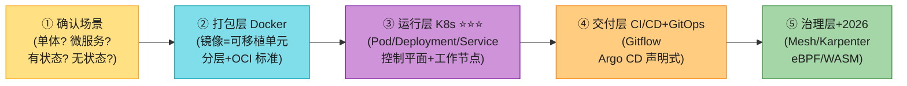

> 💡 **关键信号词**:**"容器 = 进程级隔离(共享内核)vs VM = 硬件级隔离(独立内核)"** + **"K8s 是容器的操作系统,Pod 是最小调度单元"** + **"2026 K8s 运行时是 containerd 不是 Docker(dockershim 移除了),但 Docker 镜像照用(OCI 标准)"** + **"GitOps = Git 是唯一真相源 + 声明式 + 自动同步(Argo CD/Flux)"**——这四句直接拿下面试。

---

## 🗺️ 章节概览

| 小节 | 要点 | 重要性 |
|------|------|--------|
| **应用部署演进** | 物理机 → VM → 容器(每步解决什么问题) | ⭐⭐⭐⭐ |
| **容器 vs VM** | 硬件级 vs OS 级隔离 / 隔离强度 / 启动速度 / 资源开销 | ⭐⭐⭐⭐⭐ |
| **Docker 镜像** | 分层 + 联合文件系统 + 基础层/中间层/顶层 | ⭐⭐⭐⭐ |
| **Dockerfile** | FROM/COPY/RUN/CMD/EXPOSE 构建指令 | ⭐⭐⭐ |
| **容器 Registry** | ECR/Docker Hub + 版本/签名/扫描/RBAC | ⭐⭐⭐⭐ |
| **容器生命周期** | 创建→执行→管理→终止 + Init/应用/支撑进程 | ⭐⭐⭐ |
| **Docker 引擎** | dockerd + CLI + containerd + runc(OCI) | ⭐⭐⭐⭐ |
| **为什么需要编排** | 故障恢复/扩缩/调度/服务发现(手动管不了) | ⭐⭐⭐⭐⭐ |
| **K8s 架构 ⭐** | 控制平面(api-server/scheduler/controller/etcd)+ 工作节点(kubelet/kube-proxy) | ⭐⭐⭐⭐⭐ |
| **K8s 核心对象 ⭐** | Pod/Deployment/Service/ReplicaSet/Namespace/ConfigMap/Secret/Ingress | ⭐⭐⭐⭐⭐ |
| **部署策略** | 重建/滚动/蓝绿/金丝雀/StatefulSet/Serverless | ⭐⭐⭐⭐⭐ |
| **CI/CD + Gitflow** | feature/release/hotfix 分支 + CI 自动化 + CD 自动部署 | ⭐⭐⭐⭐ |
| **2026增量(补)** | dockershim移除/Karpenter/GitOps/Serverless容器/Mesh/eBPF/WASM/OCI/渐进式交付 | ⭐⭐⭐⭐⭐ |

---

## 1. 应用部署演进:从物理机到容器

软件部署方式经历了**三代演进**,每一代都是为解决上一代的痛点而生。理解这条演进线,就理解了"为什么 2026 几乎所有新应用都跑在容器里"。

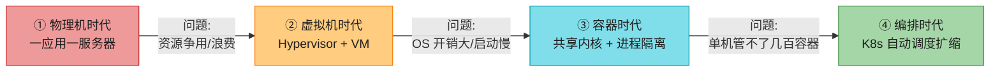

### 1.1 物理机时代(Traditional Deployment)

早期部署,组织依赖**物理服务器**跑应用,每个应用通常独占一台物理机。这导致**两大问题**:

| 问题 | 说明 |
|------|------|
| **资源争用** | 多应用共享一台服务器时,一个应用可能**独占资源(monopolize)**,拖垮其它应用性能 |
| **资源浪费** | 为隔离给每个应用配独立物理机 → 大量服务器**利用率低下**,运维昂贵 |

> 🪤 **核心痛点**:物理机时代"加服务器"就是真的买铁皮箱——交付周期长(数周)、成本高、利用率低。这是 SDE-Vol1 Ch1 "从零扩展"最原始的起点。

### 1.2 虚拟机时代(Virtualization)

**虚拟化**是革命性的进步:一台物理机的 CPU 上可以跑**多个虚拟机(VM)**,每个 VM 是一个用软件模拟的完整计算机,**有自己的 OS 和应用栈**。

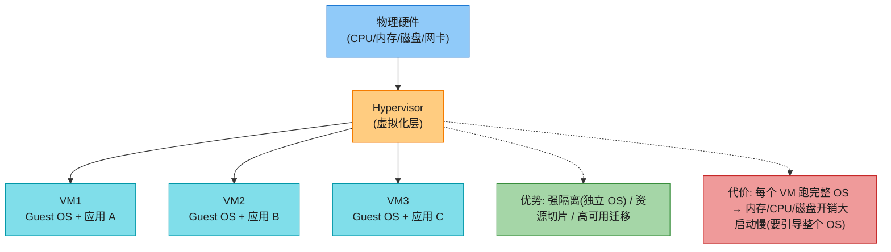

**Hypervisor(虚拟机监视器)** 充当宿主机和 VM 之间的中间层,创建虚拟硬件组件(虚拟磁盘/网卡/CPU)。典型产品:**VMware ESXi / KVM / Xen / Hyper-V**。

VM 解决了物理机的资源争用和浪费,但带来新代价:**每个 VM 跑独立 OS 实例 → 内存/CPU/磁盘开销大,启动慢(要引导整个 OS)**。

### 1.3 容器时代(Containerization)

**容器**是部署技术的下一代演进:共享**宿主 OS 内核**,提供轻量、可移植的应用运行环境。容器**不需要引导独立 OS**,所以启动快、开销小。

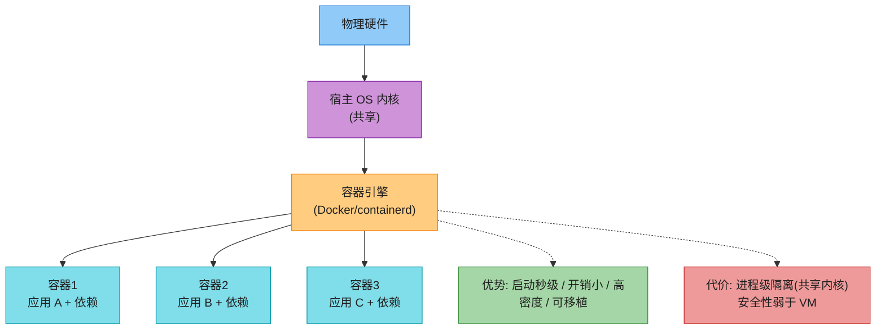

### 1.4 VM vs 容器:核心对比表(背)⭐⭐⭐⭐⭐

原书 Table 7-1 给出了详尽对比,这是面试高频题。核心维度:**虚拟化级别 / 资源利用率 / 部署灵活性 / 开销 / 启动速度 / 性能 / 安全**。

| 维度 | VM(虚拟机) | 容器(Container) |
|------|------------|------------------|
| **虚拟化级别** | **硬件级**:Hypervisor 模拟物理硬件,每 VM 跑独立 Guest OS | **OS 级**:共享宿主内核,各容器有独立用户空间(user space) |
| **资源利用率** | 低效(每 VM 跑独立 OS,消耗额外内存/CPU/磁盘) | **高效**(共享内核,最小开销) |
| **部署灵活性** | 受 Hypervisor 绑定,跨平台迁移要转换 | **可移植**(开发/测试/生产环境一致) |
| **开销** | 重量级(footprint 大,多 VM 争资源) | 轻量级(最小系统资源开销) |
| **启动速度** | 慢(要引导整个 OS) | **快**(秒级,不引导独立 OS) |
| **性能** | 受限(硬件模拟开销) | **接近原生**(直接用宿主内核) |
| **安全** | **完全隔离**(OS 级,跨 VM 攻击风险低) | **进程级隔离**(共享内核,需额外措施防容器逃逸) |

> 🪤 **追问陷阱(超高频)**:"容器和 VM 的本质区别?" → **虚拟化级别不同**:VM 是**硬件级**(Hypervisor 模拟硬件,每 VM 独立内核);容器是 **OS 级**(共享宿主内核,只隔离用户空间进程)。**一句话:容器轻但隔离弱,VM 重但隔离强**。生产中常**两者叠加**——容器跑在 VM 里,既享受容器轻量又保留 VM 隔离(AWS EKS 即如此)。

> 💡 **2026 趋势补充**:容器**隔离弱**的痛点,2026 有两个方向解决:① **Kata Containers / Firecracker**(AWS,微 VM)——把容器跑在轻量 VM 里,启动毫秒级但隔离接近 VM;② **gVisor**(Google)——用户态内核拦截系统调用。所以 2026 不是"VM vs 容器"二选一,而是**"容器接口 + VM 级隔离"融合**。

---

## 2. 容器化(Containerization)

容器化的基础概念围绕**Docker、镜像(Images)、注册表(Registry)、容器(Containers)**四个核心对象展开。

### 2.1 Docker

**Docker 是容器化的事实标准**——它提供构建(build)、分发(ship)、运行(run)容器的完整平台。开发者用 **Dockerfile** 定义应用环境,构建镜像,部署到任何环境都一致。

> 📝 **历史脉络**:Docker(2013)把 Linux 早就有的 **namespace(隔离)+ cgroups(资源限制)+ 联合文件系统(分层)** 三大内核特性**包装成易用工具**,引爆了容器化浪潮。Docker 的真正贡献不是发明容器技术,而是**让容器好用**。

**一个简单的 Python Flask 应用 Dockerfile 示例**(原书给的):

```dockerfile
# 使用官方 Python 基础镜像
FROM python:3.9-slim

# 设置容器内工作目录
WORKDIR /app

# 复制当前目录内容到容器
COPY . /app

# 通过 pip 安装 Flask 等依赖
RUN pip install --no-cache-dir -r requirements.txt

# 暴露 5000 端口
EXPOSE 5000

# 定义环境变量
ENV NAME World

# 容器启动时执行 app.py
CMD ["python", "app.py"]
```

> 💡 **Dockerfile 关键指令(背)**:`FROM`(基础镜像)→ `WORKDIR`(工作目录)→ `COPY`(拷贝文件)→ `RUN`(执行命令)→ `EXPOSE`(声明端口)→ `ENV`(环境变量)→ `CMD`(启动命令)。**每条指令 = 一层 layer**(见下文)。

### 2.2 镜像(Images)⭐⭐⭐⭐

**容器镜像**是容器化应用的构建块——一个轻量、独立、可执行的包,**包含运行应用所需的一切**:应用代码、运行时、库、依赖、配置。

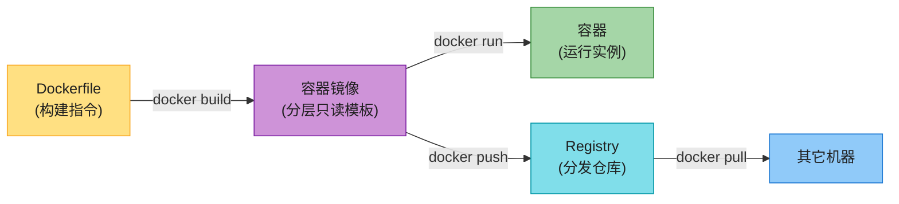

#### 2.2.1 镜像的内容构成

| 组件 | 说明 |
|------|------|
| **基础镜像(Base image)** | 镜像的根基,提供运行时环境。通常是**最小 OS**(Alpine Linux / Ubuntu)+ 必要系统库。优化大小和安全性 |
| **应用代码** | 应用的核心功能——源代码、二进制、依赖。打包进镜像保证跨环境一致 |
| **运行时依赖** | 库、框架、运行时(Node.js / Python / Java)。打包确保兼容性和可移植 |
| **配置文件** | 应用运行时配置,通常放在镜像内约定位置,允许运行时定制 |

#### 2.2.2 镜像的分层结构(Layered Architecture)⭐⭐⭐⭐⭐

这是镜像设计的精髓。镜像由**多个只读层(layer)**堆叠而成,**每层代表基础镜像的一个离散修改**。

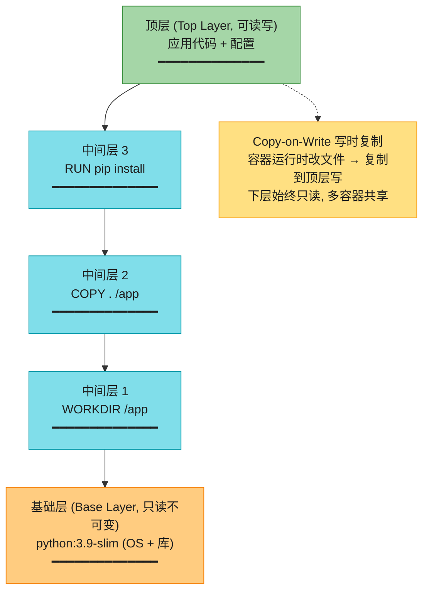

| 层 | 性质 | 作用 |
|----|------|------|
| **基础层(Base layer)** | 只读,不可变 | 最小 OS + 系统库,镜像的干净底座 |
| **中间层(Intermediate layers)** | 只读 | 每条 Dockerfile 指令(RUN/COPY/ADD)产生一层,叠加修改 |
| **顶层(Top layer)** | **可读写** | 应用代码 + 运行时依赖 + 配置;容器运行时改动写在这层 |

> 💡 **分层 + 联合文件系统(UnionFS)的价值(背)**:① **复用**:多个镜像共享同一基础层,**磁盘和拉取只存一份**;② **缓存**:构建时改了代码层,基础层和依赖层命中缓存不重建,**秒级构建**;③ **Copy-on-Write**:容器运行时改文件复制到顶层,下层只读,**多容器共享只读层省内存**。这是 Docker 高效的根基。

> 🪤 **追问陷阱**:"为什么 Dockerfile 要把 `COPY requirements.txt + RUN pip install` 放在 `COPY . /app` 前面?" → **利用分层缓存**:代码天天变,但依赖很少变。先拷依赖清单装依赖(命中缓存),再拷代码(只重建最后几层)。否则改一行代码就重装所有依赖,构建慢死。

#### 2.2.3 镜像管理的最佳实践

原书强调镜像要**版本化 + 标签 + 安全扫描 + 定期更新**:

| 实践 | 说明 |
|------|------|
| **语义版本(SemVer)/ 日期版本** | 给镜像打版本标签(如 `app:v1.2.3`),追踪变更,保证跨环境一致 |
| **漏洞扫描** | 用 Trivy / Clair / ECR Scan 定期扫描,部署前修复 |
| **最小化基础镜像** | 用 `alpine` / `distroless` 而非完整 Ubuntu,**减小攻击面和镜像体积** |
| **多阶段构建** | 构建阶段用大镜像编译,运行阶段只拷产物到小镜像,**终镜像更小更安全** |

> 📝 **镜像管理在 AWS**:原书 NOTE 指出——**Amazon ECR(Elastic Container Registry)** 用于在 AWS 上托管镜像,服务 **AWS Lambda / Amazon ECS / Amazon EKS** 都从 ECR 拉镜像(第 11 章详讲)。

### 2.3 容器注册表(Registry)

**容器注册表**是存储、管理、分发镜像的**中央仓库**——容器生态的"分发骨干"。

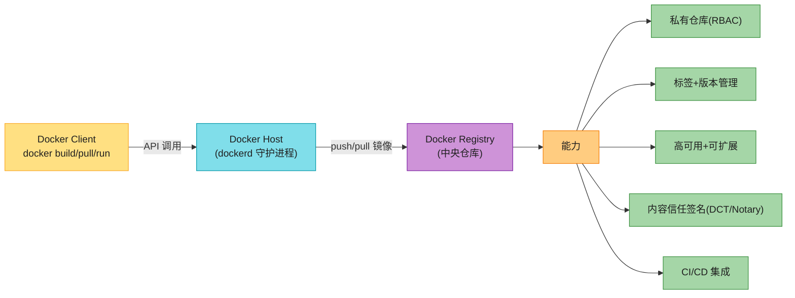

**Registry 的核心能力**:

| 能力 | 说明 |
|------|------|
| **私有仓库** | 组织安全存储专有/敏感镜像,基于认证和访问控制 |
| **标签和版本管理** | 追踪变更、管理依赖、保证跨环境一致 |
| **可扩展 + 高可用** | 处理大量镜像,支撑 CI/CD 工作流 |
| **内容信任和签名** | Docker Content Trust(DCT)/ Notary 数字签名,验证镜像完整性和真实性 |
| **CI/CD 集成** | 与构建流水线无缝集成,自动化构建/测试/部署 |

**Registry 最佳实践(背)**:① 优先用私有 registry(尤其专有应用);② RBAC 限制 push/pull 权限;③ CI/CD 自动化构建+打标+推送;④ 定期漏洞扫描;⑤ 一致的版本标签策略便于回滚。

> 💡 **2026 补充——OCI 标准与镜像签名升级**:2026 主流 registry(ECR/GHCR/Quay)都遵循 **OCI(Open Container Initiative)** 标准,镜像格式厂商中立。签名从 DCT 演进到 **Sigstore / Cosign**——把签名和 SBOM(软件物料清单)存进镜像,**供应链安全**成标配(SLSA 框架)。

### 2.4 容器(Containers):生命周期与进程

理解容器的**生命周期**和**内部进程**,才能高效部署和管理容器化应用。

#### 2.4.1 容器生命周期

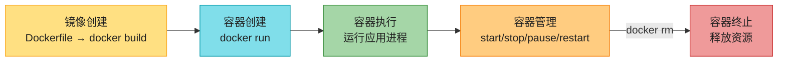

| 阶段 | 说明 |
|------|------|
| **镜像创建(Image creation)** | 生命周期起点——用 Dockerfile 定义指令,分层构建镜像(蓝图) |
| **容器创建(Container creation)** | `docker run` 从镜像实例化容器,分配 CPU/内存/存储,设置环境 |
| **容器执行(Container execution)** | 容器执行镜像指定的命令(通常是主应用进程),与宿主和其它容器隔离 |
| **容器管理(Container management)** | `docker start/stop/pause/restart` 控制运行时 |
| **容器终止(Container termination)** | `docker rm` 删除容器,释放资源 |

#### 2.4.2 容器内的进程

容器内运行的是**隔离的进程**,各有独立 namespace、文件系统、网络栈。

| 进程类型 | 说明 |
|---------|------|
| **Init 进程** | 容器启动的入口进程,通常是 **PID 1**,负责管理其它进程和处理信号 |
| **应用进程(Application processes)** | 应用的核心功能,由 init 进程派生,在容器环境内执行 |
| **支撑进程(Supporting processes)** | 日志守护、监控 agent、服务发现工具,增强功能 |

> 🪤 **追问陷阱(超高频)**:"为什么容器里 PID 1 的信号处理容易出 bug?" → 容器里**主进程是 PID 1**,但很多语言的运行时(如早期 Java、Python)没正确处理 SIGTERM——`docker stop` 发 SIGTERM 等待 10 秒后发 SIGKILL,可能导致**数据没刷盘/连接没优雅关闭**。解决方案:用 `tini`/`dumb-init` 作 PID 1 转发信号,或确保应用正确注册信号处理。这是"容器不是轻量 VM,信号语义不同"的典型坑。

### 2.5 Docker 引擎架构

**Docker 引擎**是构建、运行、管理容器的核心组件,由几个关键部分组成:

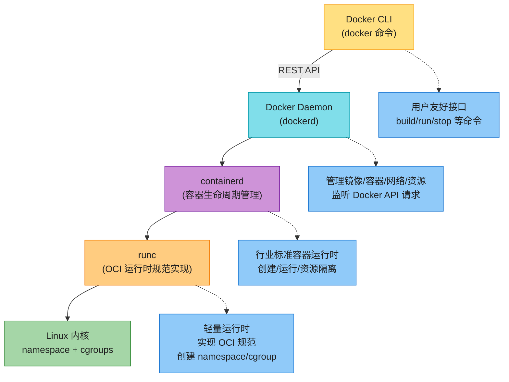

| 组件 | 职责 |
|------|------|
| **Docker daemon(dockerd)** | 后台服务,管理镜像/容器/资源/网络,监听 API 请求执行命令 |
| **Docker CLI(docker)** | 用户友好接口,与 daemon 交互执行常见操作 |
| **containerd** | 行业标准容器运行时,管理容器执行和生命周期 |
| **runc** | 轻量运行时,**实现 OCI(Open Container Initiative)运行时规范**,创建 namespace/cgroup/文件系统,强制安全策略 |

> 💡 **底层内核机制(背)**:容器隔离靠 **Linux 内核两大特性**——**namespace(命名空间)** 隔离视图(PID/网络/挂载/UTS/IPC/用户),**cgroups(控制组)** 限制资源(CPU/内存/IO)。Docker/containerd/runc 只是这两大特性的**用户态封装**。这就是为什么容器是"OS 级虚拟化"——它不模拟硬件,只是给进程套了隔离"眼镜"。

> 📝 **原书这里的图把 Docker 画成 K8s 的运行时,2026 已过时**——见后文 dockershim 移除部分。

---

## 3. 容器编排(Container Orchestration)⭐⭐⭐⭐⭐

当组织大规模采用容器,如何**高效管理和扩展**成百上千容器就成了关键问题。这就是**容器编排**登场的时机。

### 3.1 为什么需要编排?

单机 Docker 只能管几十个容器。一旦到生产规模,手动管理崩溃:

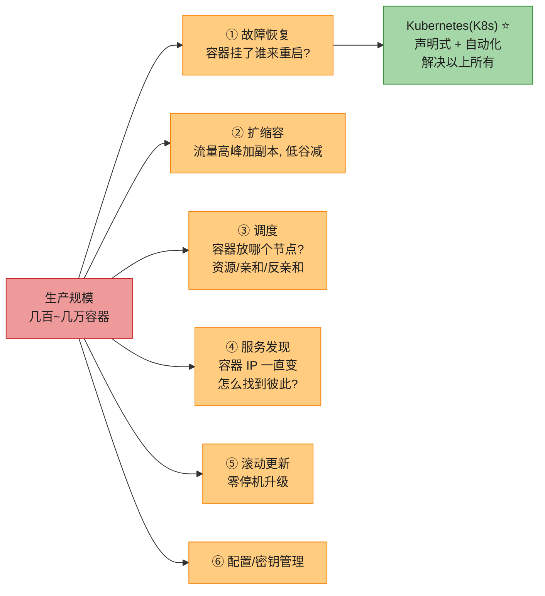

> 💡 **编排的价值(背)**:**声明式(declarative)**——你告诉系统"我要 3 个副本",K8s 持续让现实匹配期望(reconcile loop)。容器挂了自动重启、节点挂了自动迁移、流量高峰自动扩容——**自愈 + 自扩 + 自调**,这是手管做不到的。

### 3.2 Kubernetes 架构 ⭐⭐⭐⭐⭐

**Kubernetes(K8s)** 是开源容器编排平台,自动化部署、扩展、管理容器化应用。架构由**控制平面(Manager/Control Plane 节点)** 和 **工作节点(Worker 节点)** 组成,分布在一个集群里。

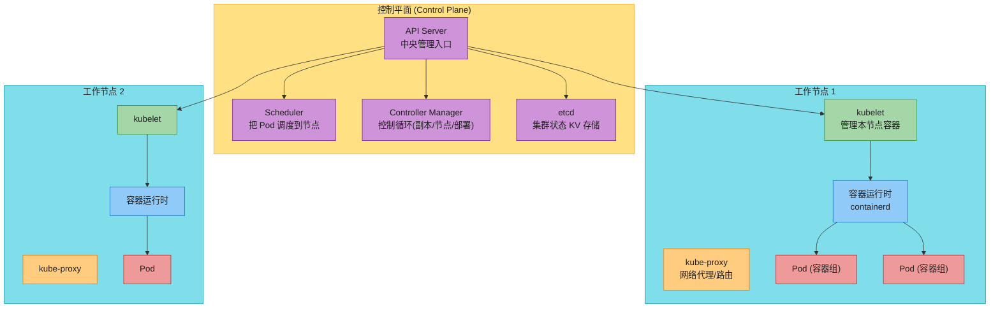

#### 3.2.1 节点类型

| 节点类型 | 职责 |
|---------|------|
| **控制平面节点(Manager)** | 托管控制平面组件,编排工作节点。管理集群整体状态,响应用户/外部请求,决定何时何地部署应用 |
| **工作节点(Worker / minions)** | 跑实际容器化应用。每个工作节点通常跑多个由 K8s 管理的容器 |

#### 3.2.2 控制平面组件 ⭐

| 组件 | 职责 |
|------|------|
| **API Server** | K8s 中央管理实体。暴露 K8s API,处理 REST 操作,验证配置数据,更新 etcd。**所有组件都通过 API Server 通信** |
| **Scheduler(调度器)** | 把新创建的 Pod 放到合适节点。考虑资源需求、硬件/软件约束、亲和/反亲和、用户策略 |
| **Controller Manager** | 守护进程,嵌入核心控制循环。**watch 集群状态 → 让现实趋近期望**。包括 Node Controller / ReplicaSet Controller / Deployment Controller |
| **etcd** | 一致、高可用的键值存储,**K8s 所有集群数据的后备存储**(配置/状态/元数据)。**集群的大脑** |

#### 3.2.3 工作节点组件

| 组件 | 职责 |
|------|------|
| **kubelet** | 每个工作节点的 agent,管理容器生命周期。接收 Pod 定义,确保其中容器运行健康,向控制平面汇报节点健康 |
| **kube-proxy** | 每个工作节点的网络代理,维护网络规则,做连接转发。**实现 K8s Service 抽象**(TCP/UDP 路由) |
| **容器运行时(Container runtime)** | 跑容器的软件——**2026 默认 containerd**(原书写 Docker,已过时,见后文) |

> 🪤 **追问陷阱(超高频)**:"K8s 的'期望状态 vs 实际状态'怎么实现?" → **声明式 + 控制循环(reconcile loop)**:你声明"我要 3 副本"(期望状态存 etcd),Controller Manager 持续 watch 实际状态(2 副本),发现偏差就发指令让 Scheduler 调度新 Pod、kubelet 启动容器,直到实际 = 期望。**这是 K8s 自愈的根基**——不是"挂了报警等人修",而是"系统自动把现实拉回期望"。

> 💡 **etcd 的重要性**:etcd 存所有集群状态,**是单点故障源**。生产环境 etcd 必须**多副本 + 跨 AZ + 定期备份**。AWS EKS 把 etcd 托管掉(你看不见),省心但失去定制能力——这是 managed K8s 的核心权衡。

### 3.3 Kubernetes 核心对象 ⭐⭐⭐⭐⭐

理解 K8s = 理解这些**核心对象(API 资源)**。它们是声明式的——你用 YAML 定义,API Server 存进 etcd,Controller 把现实拉到期望。

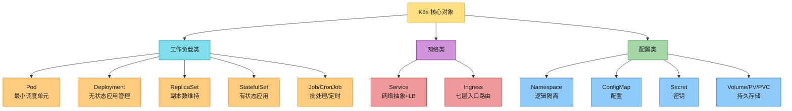

#### 3.3.1 工作负载对象

| 对象 | 说明 |
|------|------|
| **Pod ⭐** | K8s **最小可部署单元**。一个或多个容器共享网络和存储资源。Pod 封装应用组件,保证同节点同调度(colocated/coscheduled)。Pod 是**短暂的(ephemeral)**——可动态扩缩替换 |
| **Deployment** | 声明式管理应用部署和更新。定义期望状态(副本数、镜像、滚动策略),确保期望达成并维持,**支持无缝更新和回滚** |
| **ReplicaSet** | 确保指定数量的 Pod 副本运行。维持期望副本数,按需扩缩,保证容错和可用。**通常由 Deployment 管理,不直接用** |
| **StatefulSet** | 部署**有状态应用**(数据库、分布式系统)。保证 Pod 一致的命名、网络、持久化,**维护数据完整性和可用性** |
| **Job / CronJob** | 运行批处理或间歇任务到完成。确保指定数量 Pod 成功完成任务。适合数据处理、备份、定期维护 |

> 🪤 **追问陷阱(超高频)**:"为什么 K8s 的最小单元是 Pod 而不是容器?" → ① **协同调度**:紧密相关的容器(如 app + sidecar)必须同节点,Pod 保证它们**生命周期绑定、共享网络和存储**;② **容器是临时的**,K8s 需要更高层抽象来管理(调度/扩缩/重启)。**一个 Pod 内的容器共享 network namespace**(localhost 互通)和 volumes,这是 Pod 的核心价值。但**一般一个 Pod 一个容器**,多容器只用于 sidecar/adapter 模式。

> 🪤 **追问陷阱**:"Deployment 和 StatefulSet 怎么选?" → **无状态用 Deployment**(副本可互换,如 web 服务);**有状态用 StatefulSet**(副本有稳定身份+持久存储,如数据库)。StatefulSet 给每个 Pod 稳定名字(`app-0`, `app-1`)、稳定网络标识、独立 PVC——这些是数据库主从复制必需的。

#### 3.3.2 网络对象

| 对象 | 说明 |
|------|------|
| **Service ⭐** | 访问 Pod 的**网络抽象**。基于标签和选择器做**负载均衡、服务发现、自动路由**。可集群内暴露,也可对外暴露 |
| **Ingress** | **七层(HTTP/HTTPS)入口路由**。把外部请求按域名/路径路由到 Service。2026 常配 Ingress Controller(NGINX/ALB)或用 **Gateway API**(新一代标准) |

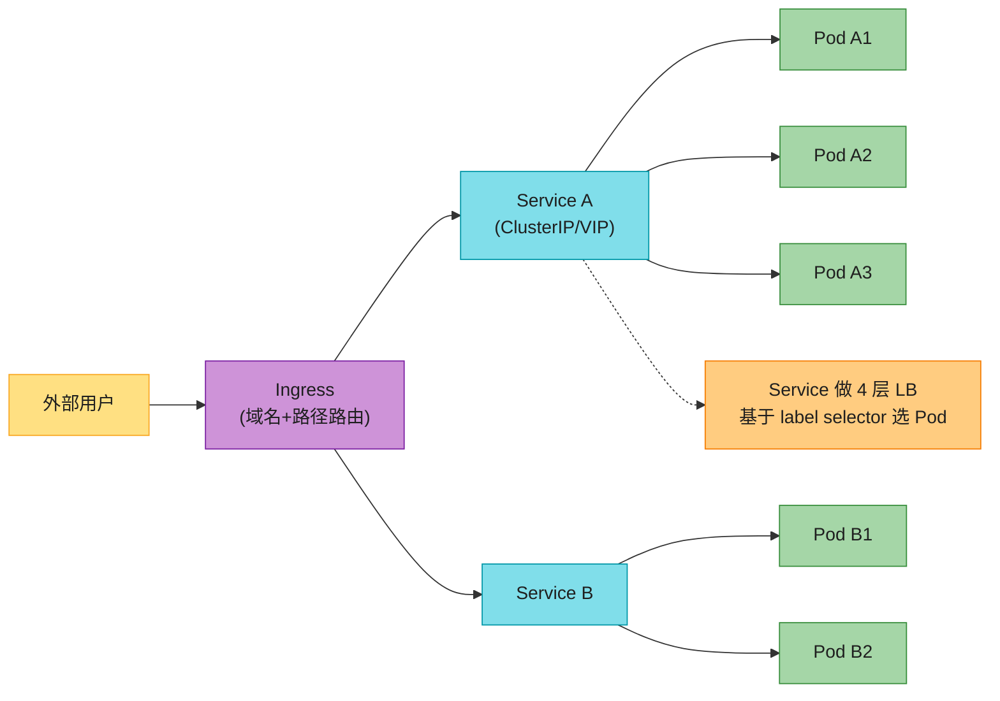

> 💡 **Service 的类型(背)**:**ClusterIP**(集群内访问,默认)/ **NodePort**(暴露到节点端口)/ **LoadBalancer**(云厂商 LB)/ **ExternalName**(DNS CNAME)。**Pod IP 会变**(Pod 重启就换 IP),**Service 提供稳定 VIP**,这是服务发现的基础——接 Ch5 负载均衡。

#### 3.3.3 配置与存储对象

| 对象 | 说明 |
|------|------|
| **Namespace** | 集群内的**逻辑隔离**(如 dev/staging/prod,或按团队)。提供名字作用域和资源配额 |
| **ConfigMap** | 存**非敏感配置数据**。集中管理应用配置,与镜像解耦,支持动态更新 |
| **Secret** | 存**敏感信息**(密码/API key/证书)。base64 编码,可挂载为环境变量或文件 |
| **Volume / PV / PVC** | 提供持久化存储。Volume 让数据超越 Pod 生命周期;**PersistentVolume(PV)+ PersistentVolumeClaim(PVC)** 是持久存储的声明式管理 |

> 🪤 **追问陷阱**:"Secret 安全吗?" → **不真正安全**——默认只是 base64 编码(编码 ≠ 加密),`kubectl get secret -o yaml` 能解出明文。生产要:① 启用 **etcd 静态加密(encryption at rest)**;② 用 **外部密钥管理**(AWS KMS / Vault / Sealed Secrets / External Secrets Operator);③ **RBAC 严格限制访问**。**"Secret 存 etcd 不加密"是常见安全坑**。

> 📝 **Amazon EKS**:原书 NOTE——EKS 是 AWS 托管 K8s,管控制平面(更新/扩展/可用),让你专注部署管理应用(第 11 章详讲)。

---

## 4. 容器部署策略(Container Deployment Strategies)⭐⭐⭐⭐⭐

Deployment 是 K8s 管理应用部署的标准方式——它保证声明式更新、维持期望副本数、高效处理滚动发布和回滚。但**如何发布新版本**有多种策略,各有适用场景。

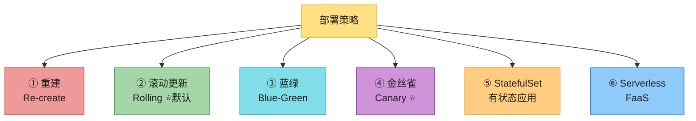

### 4.1 策略对比表(背)

| 策略 | 工作方式 | 停机 | 资源 | 风险 | 适用场景 |
|------|---------|------|------|------|---------|
| **重建(Re-create)** | 先杀全部旧 Pod,再起新 Pod | **有**(取决于重启时长) | 低(只跑一份) | 高 | 新旧版本不能共存(如 schema 不兼容) |
| **滚动更新(Rolling)**⭐ | 逐个替换旧 Pod 为新 Pod,**配合 readiness probe** | **零**(默认) | 中(滚动期多跑一些) | 中 | **K8s 默认**,大部分无状态应用 |
| **蓝绿(Blue-Green)** | 跑两套完全相同环境,流量在蓝绿间切换 | 零 | **高**(双倍资源) | 低 | 需要瞬间切换/回滚、验证完整环境 |
| **金丝雀(Canary)**⭐ | 新版本先给小部分流量,监控后逐步扩大 | 零 | 中 | **最低** | 高风险变更、A/B 测试、渐进验证 |
| **StatefulSet** | 有序创建/更新,稳定身份+存储 | 取决于策略 | 中 | 中 | 数据库、分布式系统等有状态应用 |
| **Serverless** | 抽象基础设施,事件驱动自动扩缩 | 零 | 按需 | 低 | 事件驱动、突发流量、免运维 |

### 4.2 滚动更新(Rolling Deployment)⭐ 默认

K8s **默认策略**。逐个替换旧 Pod 为新 Pod,靠 **readiness probe** 确认新版本就绪才下线旧的。如果出问题,可暂停并回滚到上一版本。

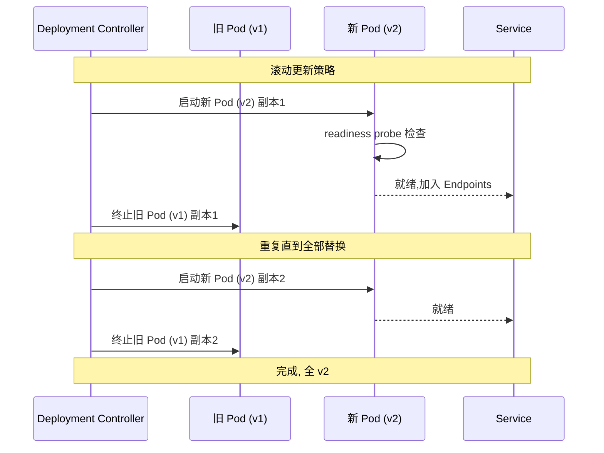

> 💡 **Readiness Probe(就绪探针)**:监控应用就绪状态。探针失败 → Service 把流量从该 Pod 摘除(但 Pod 还在),直到就绪才接收请求。**特别适合需要初始化的应用**(如启动时要加载缓存)。

> 🪤 **追问陷阱**:"滚动更新中,如果有 Pod 还在处理长连接怎么办?" → ① Pod 收到 SIGTERM,K8s 默认等 **terminationGracePeriodSeconds(30 秒)**;② 应用要正确处理 SIGTERM,**优雅关闭连接/刷盘**;③ **preStop hook** 可以加额外等待,确保 Service 摘除流量后才停;④ 长连接场景(WebSocket/gRPC stream)要用 **connection draining**。处理不好会导致用户请求打到正在关闭的 Pod → 5xx。

### 4.3 蓝绿部署(Blue-Green)

跑**两套完全相同的生产环境**,标为"蓝"和"绿"。任一时刻只有一个环境服务真实流量,另一个空闲。新版本就绪后,流量切到空闲环境,实现零停机部署和易回滚。

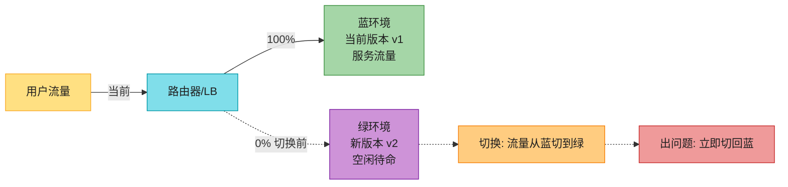

> 🪤 **蓝绿的核心权衡**:**资源成本翻倍**(两套环境),换来**瞬间切换+瞬间回滚**。适合金融/关键系统、需要完整环境验证的场景。**有状态应用蓝绿很难**——数据库 schema 迁移要让新旧版本都能工作。

### 4.4 金丝雀部署(Canary)⭐

把新版本**逐步**推给一部分用户或流量段,监控错误和性能问题。允许早期发现问题,提供受控回滚机制。

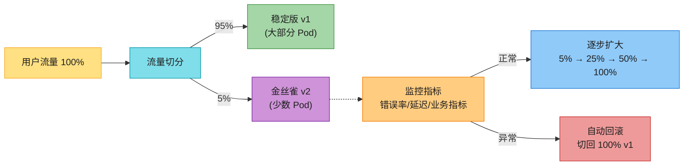

> 💡 **金丝雀 vs 蓝绿**:蓝绿是"0% 或 100%"切换(资源双倍);金丝雀是"小流量逐步扩大"(资源过渡平滑)。**金丝雀是 2026 高风险变更的首选**——配合 **Argo Rollouts / Flagger** 可以**自动化分析指标 + 自动回滚**(见 2026 增量)。

> 📝 **K8s 原生金丝雀较弱**:原生 Deployment 做精确流量切分(如 5%)很难,要用 **Service Mesh(Istio/Linkerd)的流量切分**或 **Argo Rollouts** 这种渐进式交付工具。这是 2026 Service Mesh 和 GitOps 火爆的原因之一。

### 4.5 Serverless 部署

抽象掉基础设施层,开发者专注写代码。K8s 通过 **Knative** 或 **AWS Lambda on Kubernetes** 提供 serverless 能力——事件驱动、自动扩缩、无需管理底层基础设施。

> 📝 **2026 补充**:Serverless 容器演进成独立范式——**AWS Fargate / GCP Cloud Run / Azure Container Apps**,跑容器但免管节点(见后文增量)。

---

## 5. CI/CD 流水线:Gitflow + 自动化部署 ⭐⭐⭐⭐

随着组织内软件项目增多,部署复杂度激增。**手动部署易出错、耗工程资源、拖慢开发生命周期**。CI/CD 提供自动化流程,降低运营成本,加速从代码审查到生产。

### 5.1 Gitflow 分支管理策略

**Gitflow** 是组织开发/测试/发布的分支策略,保证平滑集成、有序发布、快速修复。

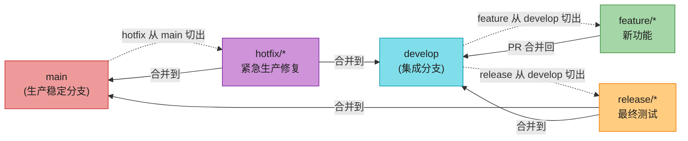

**主要分支**:

| 分支 | 职责 |
|------|------|
| **main** | 稳定的生产分支,含最新批准的代码 |
| **develop** | 集成分支,功能合并到这里再发布 |

**辅助分支**:

| 分支 | 职责 |
|------|------|
| **feature/\*** | 每个新功能/任务一个分支,从 develop 切出,完成后合并回 develop |
| **release/\*** | 最终测试和临门调整,从 develop 切出,合并到 main 和 develop |
| **hotfix/\*** | 紧急生产修复,从 main 切出,合并到 main 和 develop |

> 💡 **Gitflow 的核心价值**:**结构化的分支模型**——main 永远稳定可发布,develop 是集成试验场,feature 隔离开发,release 收尾,hotfix 快速救火。**所有变更都走 PR + 代码审查**。

> 🪤 **2026 补充——Gitflow 已被 Trunk-Based 部分取代**:Gitflow 适合**有计划发布的传统产品**;但 2026 **微服务 + 持续部署**时代,**Trunk-Based Development(主干开发)** 更主流——所有人频繁往 main 提交(每天多次),靠 feature flag 控制功能可见性,发布即合并。GitOps(见增量)通常配 Trunk-Based。

### 5.2 持续集成(Continuous Integration, CI)

CI 目标:**多次/天**把多开发者代码集成到共享仓库,确保代码变更**定期测试、构建、验证**,尽早发现集成问题。

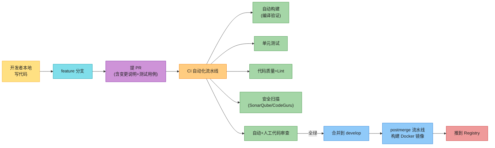

**CI 流水线的关键步骤**:

| 步骤 | 说明 |
|------|------|
| **自动构建** | 验证代码能编译通过 |
| **单元测试** | 验证单个组件功能正确 |
| **代码质量 + Lint** | 确保遵循风格和最佳实践 |
| **安全扫描** | SonarQube / Amazon CodeGuru 扫漏洞 |
| **代码审查** | 自动 + 人工,给反馈 |
| **postmerge 流水线** | PR 合并到 develop 后,构建 Docker 镜像准备部署 |

### 5.3 持续部署(Continuous Deployment, CD)

CD 在 CI 成功后,把变更**自动部署**到测试→预发布→生产,**无需人工干预**。

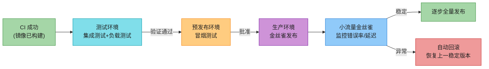

**CD 关键环节**:

| 环节 | 说明 |
|------|------|
| **测试环境** | 集成测试(各部分通信功能)、负载测试(高流量性能) |
| **预发布环境** | 基础功能冒烟测试,确认生产就绪 |
| **金丝雀发布** | 先小流量,监控错误率/延迟,异常自动回滚 |
| **逐步全量** | 金丝雀成功后逐步扩大到整个生产 |

> 💡 **CI vs CD 的区别(背)**:**CI(持续集成)** = 代码自动构建+测试+验证,产出可部署的制品(镜像);**CD(持续部署/交付)** = 把制品自动部署到各环境。**CI 解决"代码集成",CD 解决"代码上线"**。CD 又分 **Continuous Delivery(交付,需手动点发布)** 和 **Continuous Deployment(部署,全自动到生产)**。

### 5.4 监控与事故管理

主动监控和事故响应是快速发现和处理问题的关键。

| 实践 | 工具 |
|------|------|
| **持续监控** | CloudWatch / ELK Stack / Prometheus 监控 CPU/内存/请求延迟 |
| **仪表盘+告警** | Grafana 仪表盘,追踪稳定性和性能 |
| **告警集成** | PagerDuty / Opsgenie 通知工程师 |
| **自动 playbook** | 对常见事故的快速响应手册 |

> 📝 **接 SDE-Vol2 Ch5 监控**:K8s 可观测是监控的容器化落地——**Prometheus 抓 K8s 指标 / Loki 存日志 / Jaeger 跑链路追踪**,这是 2026 云原生可观测三件套(接 Ch1 四支柱)。

---

## 2026 现代增量(原书没讲的硬核)⭐⭐⭐⭐⭐

原书(2023)把容器化/Docker/K8s/CI/CD 基础讲得很系统,但**云原生领域 2022→2026 变化极大**。以下是 2026 必补的硬核料——面试讲出来直接拉开档次。

### 增量 1:K8s 已成编排事实标准 + dockershim 移除 ⭐⭐⭐⭐⭐

原书的 Docker 引擎架构图把 **Docker daemon(dockerd)** 画成 K8s 的容器运行时。但 **2020 年 12 月 K8s 宣布弃用 dockershim,2022 年 5 月 K8s 1.24 正式移除**——**Docker Engine 不再是 K8s 的容器运行时**。

```mermaid
flowchart LR
    OLD["原书(2023):<br/>K8s → dockershim → dockerd"] -->|"2026 现实"| NEW["K8s → CRI → containerd/CRI-O ⭐"]
    NEW --> WHY["为什么移除 dockershim"]
    WHY --> W1["dockershim 是 kubelet 里<br/>专门适配 Docker 的垫片"]
    WHY --> W2["CRI(容器运行时接口)成熟<br/>不再需要特殊垫片"]
    WHY --> W3["多一层 = 多故障面 + 多依赖"]

    KEEP["关键澄清"] --> K1["Docker 镜像照用 ✅<br/>(OCI 标准,K8s 不在乎镜像谁构建的)"]
    KEEP --> K2["docker build 仍是主流构建工具 ✅"]
    KEEP --> K3["只是 K8s 不再直接调 dockerd ❌"]

    style OLD fill:#FFCC80,stroke:#F57C00,color:#1f1f1f
    style NEW fill:#A5D6A7,stroke:#388E3C,color:#1f1f1f
    style WHY fill:#80DEEA,stroke:#0097A7,color:#1f1f1f
    style W1 fill:#CE93D8,stroke:#7B1FA2,color:#1f1f1f
    style W2 fill:#CE93D8,stroke:#7B1FA2,color:#1f1f1f
    style W3 fill:#CE93D8,stroke:#7B1FA2,color:#1f1f1f
    style KEEP fill:#FFE082,stroke:#F9A825,color:#1f1f1f
    style K1 fill:#90CAF9,stroke:#1976D2,color:#1f1f1f
    style K2 fill:#90CAF9,stroke:#1976D2,color:#1f1f1f
    style K3 fill:#EF9A9A,stroke:#C62828,color:#1f1f1f
```

> 🔄 **2026 话术(直接背)**:"原书把 Docker daemon 画成 K8s 运行时,但 **2022 年 K8s 1.24 移除了 dockershim,Docker Engine 不再是 K8s 的容器运行时**。原因:**dockershim 是 kubelet 里专门适配 Docker 的垫片,而 CRI(容器运行时接口)成熟后这个垫片多余——多一层多故障面**。**关键澄清:Docker 镜像照用**(OCI 标准,K8s 不在乎镜像谁构建的),**docker build 仍是主流构建工具**,只是 K8s 现在直接用 **containerd 或 CRI-O** 这种 CRI 兼容运行时跑容器。**EKS 1.24+ 默认 containerd**。"

### 增量 2:OCI 标准——避免 Docker 锁定的根基 ⭐⭐⭐⭐

**OCI(Open Container Initiative)** 是 2015 年由 Docker/CoreOS/Google 等成立的 Linux 基金会项目,**标准化容器镜像格式和运行时**,避免单一厂商锁定。

```mermaid
flowchart LR
    OCI["OCI 开放容器倡议"] --> SPEC1["镜像规范<br/>Image Spec"]
    OCI --> SPEC2["运行时规范<br/>Runtime Spec"]
    OCI --> SPEC3["分发规范<br/>Distribution Spec"]

    SPEC1 --> S1["镜像怎么打包<br/>(分层+manifest)"]
    SPEC2 --> S2["容器怎么运行<br/>(namespace/cgroup/生命周期)"]
    SPEC3 --> S3["镜像怎么拉推<br/>(registry API)"]

    IMPL["实现"] --> I1["运行时: runc / containerd / CRI-O / Kata"]
    IMPL --> I2["镜像构建: docker build / buildah / ko"]
    IMPL --> I3["Registry: ECR / GHCR / Quay / Docker Hub"]

    style OCI fill:#FFE082,stroke:#F9A825,color:#1f1f1f
    style SPEC1 fill:#80DEEA,stroke:#0097A7,color:#1f1f1f
    style SPEC2 fill:#80DEEA,stroke:#0097A7,color:#1f1f1f
    style SPEC3 fill:#80DEEA,stroke:#0097A7,color:#1f1f1f
    style S1 fill:#CE93D8,stroke:#7B1FA2,color:#1f1f1f
    style S2 fill:#CE93D8,stroke:#7B1FA2,color:#1f1f1f
    style S3 fill:#CE93D8,stroke:#7B1FA2,color:#1f1f1f
    style IMPL fill:#A5D6A7,stroke:#388E3C,color:#1f1f1f
    style I1 fill:#FFCC80,stroke:#F57C00,color:#1f1f1f
    style I2 fill:#FFCC80,stroke:#F57C00,color:#1f1f1f
    style I3 fill:#FFCC80,stroke:#F57C00,color:#1f1f1f
```

> 💡 **OCI 的价值**:镜像格式标准化后,**Docker 构建的镜像 = containerd 能跑 = CRI-O 能跑 = Kata(微 VM)能跑**。这就是为什么 dockershim 移除后 Docker 镜像照用——**镜像和运行时解耦**。2026 选运行时不再绑定 Docker,可按安全/性能/隔离需求换(如金融场景用 Kata,普通用 containerd)。

### 增量 3:Karpenter——替代 Cluster Autoscaler 的秒级扩容 ⭐⭐⭐⭐⭐

原书没讲节点扩容。K8s 节点扩容传统用 **Kubernetes Cluster Autoscaler(CAS)**——它通过调整 **Auto Scaling Group(ASG)** 扩容,**耗时分钟级**。AWS 2021 开源、2024 GA 的 **Karpenter** 直接调云 API,**数十秒级扩容**,无需 ASG。

```mermaid
flowchart LR
    OLD["Cluster Autoscaler<br/>(传统)"] --> O1["通过 ASG 扩容"]
    OLD --> O2["分钟级延迟"]
    OLD --> O3["按 ASG 预设实例类型<br/>灵活性差"]
    OLD --> O4["难以扩到 0"]

    NEW["Karpenter ⭐<br/>(AWS 主推)"] --> N1["直接调云 API<br/>无需 ASG"]
    NEW --> N2["数十秒级延迟"]
    NEW --> N3["按 Pod 需求选最优实例<br/>(Spot/按需/GPU 混合)"]
    NEW --> N4["可扩到 0(省钱)"]
    NEW --> N5["整合 Spot 中断<br/>提前换节点"]

    style OLD fill:#FFCC80,stroke:#F57C00,color:#1f1f1f
    style O1 fill:#EF9A9A,stroke:#C62828,color:#1f1f1f
    style O2 fill:#EF9A9A,stroke:#C62828,color:#1f1f1f
    style O3 fill:#EF9A9A,stroke:#C62828,color:#1f1f1f
    style O4 fill:#EF9A9A,stroke:#C62828,color:#1f1f1f
    style NEW fill:#A5D6A7,stroke:#388E3C,color:#1f1f1f
    style N1 fill:#80DEEA,stroke:#0097A7,color:#1f1f1f
    style N2 fill:#80DEEA,stroke:#0097A7,color:#1f1f1f
    style N3 fill:#80DEEA,stroke:#0097A7,color:#1f1f1f
    style N4 fill:#80DEEA,stroke:#0097A7,color:#1f1f1f
    style N5 fill:#80DEEA,stroke:#0097A7,color:#1f1f1f
```

> 🔄 **2026 话术(直接背)**:"原书没讲节点扩容。传统用 **Cluster Autoscaler 通过 ASG 扩容,分钟级延迟,灵活性差**。AWS 2024 GA 的 **Karpenter 直接调云 API,数十秒级扩容**,而且**按 Pod 实际需求选最优实例类型**(Spot/按需/GPU 混合优化成本),**可扩到 0**(省钱),还**整合 Spot 中断预警提前换节点**。2026 EKS 新集群默认推荐 Karpenter,CAS 在退场。"

### 增量 4:GitOps——声明式交付的事实标准 ⭐⭐⭐⭐⭐

原书 CI/CD 讲的是**命令式推送(push)**——CI 流水线跑完 `kubectl apply`。而 2026 主流是 **GitOps**——**Git 是唯一真相源(source of truth)**,集群里有个 agent **持续拉取(pull)** Git 状态并同步。代表工具:**Argo CD / Flux**。

```mermaid
flowchart LR
    DEV["开发者"] -->|"push 代码"| GIT["Git 仓库<br/>(声明式 K8s manifests)"]
    GIT -->|"webhook"| CI["CI 构建+测试"]
    CI -->|"更新 manifest<br/>镜像 tag"| GIT
    GIT -->|"Argo CD 持续 watch"| ARG["Argo CD<br/>(集群内 agent)"]
    ARG -->|"diff + sync"| K8S["K8s 集群<br/>(实际状态)"]
    K8S -.->|"drift 检测"| ARG

    PRINC["GitOps 原则"] --> P1["声明式(K8s YAML)"]
    PRINC --> P2["Git 唯一真相源"]
    PRINC --> P3["Pull 拉取(非 push 推送)"]
    PRINC --> P4["持续协调(reconcile)"]
    PRINC --> P5["回滚 = git revert"]

    GIT -.-> PRINC

    style DEV fill:#FFE082,stroke:#F9A825,color:#1f1f1f
    style GIT fill:#CE93D8,stroke:#7B1FA2,color:#1f1f1f
    style CI fill:#80DEEA,stroke:#0097A7,color:#1f1f1f
    style ARG fill:#A5D6A7,stroke:#388E3C,color:#1f1f1f
    style K8S fill:#90CAF9,stroke:#1976D2,color:#1f1f1f
    style PRINC fill:#FFCC80,stroke:#F57C00,color:#1f1f1f
    style P1 fill:#EF9A9A,stroke:#C62828,color:#1f1f1f
    style P2 fill:#EF9A9A,stroke:#C62828,color:#1f1f1f
    style P3 fill:#EF9A9A,stroke:#C62828,color:#1f1f1f
    style P4 fill:#EF9A9A,stroke:#C62828,color:#1f1f1f
    style P5 fill:#EF9A9A,stroke:#C62828,color:#1f1f1f
```

**GitOps 的核心价值**:

| 价值 | 说明 |
|------|------|
| **Git 唯一真相** | 集群状态 = Git 仓库状态。**审计、回滚、分支都天然支持** |
| **声明式** | 只描述"想要什么",不描述"怎么做"(接 Ch1 可维护性) |
| **Pull 模型** | 集群内 agent 拉取,**不需要给 CI 系统 cluster admin 权限**(更安全) |
| **自动漂移修复** | 有人手动改集群 → Argo CD 检测漂移 → 自动恢复成 Git 状态 |
| **回滚 = git revert** | 出问题直接回退 Git commit,**秒级精确回滚** |

> 🔄 **2026 话术(直接背)**:"原书 CI/CD 是命令式推送——流水线跑完 `kubectl apply`。2026 主流是 **GitOps**——**Git 是唯一真相源**,集群内 Argo CD/Flux 持续拉取 Git 声明式 manifests 并同步。核心价值:① **Git 唯一真相**(审计/回滚/分支天然支持);② **Pull 模型更安全**(CI 不需 cluster admin);③ **自动漂移修复**(手改集群会被自动纠正);④ **回滚 = git revert**(秒级精确)。**这是 Ch1 可维护性'清晰性/可修改性'在交付层的工程化落地**。"

### 增量 5:Serverless 容器——免管节点的主流范式 ⭐⭐⭐⭐

原书 Serverless 只提 Knative/Lambda。但 2026 **Serverless 容器**已独立成主流范式——**跑容器但免管节点**,按实际用量计费。

```mermaid
flowchart TB
    SC["Serverless 容器范式"] --> AWS["AWS Fargate<br/>(ECS/EKS on Fargate)"]
    SC --> GCP["GCP Cloud Run"]
    SC --> AZ["Azure Container Apps<br/>(基于 KEDA/Dapr)"]

    PROS["优势"] --> P1["免管节点(无 kubelet 运维)"]
    PROS --> P2["按实际用量计费(无空闲成本)"]
    PROS --> P3["自动扩缩(含扩到 0)"]
    PROS --> P4["秒级启动(预热的 warm pool)"]

    CONS["代价"] --> C1["冷启动延迟(虽已大幅优化)"]
    CONS --> C2["灵活性受限(不能自定义节点)"]
    CONS --> C3["厂商绑定更深"]

    SC -.-> PROS
    SC -.-> CONS

    style SC fill:#FFE082,stroke:#F9A825,color:#1f1f1f
    style AWS fill:#FFCC80,stroke:#F57C00,color:#1f1f1f
    style GCP fill:#80DEEA,stroke:#0097A7,color:#1f1f1f
    style AZ fill:#A5D6A7,stroke:#388E3C,color:#1f1f1f
    style PROS fill:#CE93D8,stroke:#7B1FA2,color:#1f1f1f
    style P1 fill:#90CAF9,stroke:#1976D2,color:#1f1f1f
    style P2 fill:#90CAF9,stroke:#1976D2,color:#1f1f1f
    style P3 fill:#90CAF9,stroke:#1976D2,color:#1f1f1f
    style P4 fill:#90CAF9,stroke:#1976D2,color:#1f1f1f
    style CONS fill:#EF9A9A,stroke:#C62828,color:#1f1f1f
    style C1 fill:#FFE082,stroke:#F9A825,color:#1f1f1f
    style C2 fill:#FFE082,stroke:#F9A825,color:#1f1f1f
    style C3 fill:#FFE082,stroke:#F9A825,color:#1f1f1f
```

> 💡 **选型权衡**:**自管 K8s(最大灵活+最高运维负担)→ 托管 EKS(控平面托管)→ Fargate(连工作节点都托管)→ Lambda(连容器都不用,只传代码)**。灵活性和运维负担成反比。2026 趋势是**中小团队直接上 Fargate / Cloud Run**,省去节点运维。

### 增量 6:Service Mesh——微服务治理的事实标准 ⭐⭐⭐⭐⭐

原书零提及 Service Mesh。但当微服务数量爆炸(几十上百个),**服务间通信的 mTLS/流量治理/可观测** 用传统方式每个服务自己实现太痛。**Service Mesh** 通过 **Sidecar 注入**(每个 Pod 旁挂一个代理)统一接管。

```mermaid
flowchart LR
    subgraph POD["Pod"]
        APP["应用容器<br/>(只管业务逻辑)"]
        SIDE["Sidecar 代理<br/>(Envoy)<br/>mTLS/重试/熔断/指标"]
        APP <-->|"localhost"| SIDE
    end

    POD <-->|"所有流量<br/>经 Sidecar"| MESH["其它 Pod"]

    CTRL["控制平面<br/>(Istiod)"] -->|"下发策略"| SIDE

    BEN["Mesh 接管"] --> B1["mTLS 自动加密(服务间零信任)"]
    BEN --> B2["流量治理(重试/超时/熔断/金丝雀切分)"]
    BEN --> B3["可观测(指标/链路追踪统一)"]
    BEN --> B4["应用代码解耦(不写通信逻辑)"]

    SIDE -.-> BEN

    style POD fill:#FFE082,stroke:#F9A825,color:#1f1f1f
    style APP fill:#80DEEA,stroke:#0097A7,color:#1f1f1f
    style SIDE fill:#CE93D8,stroke:#7B1FA2,color:#1f1f1f
    style MESH fill:#90CAF9,stroke:#1976D2,color:#1f1f1f
    style CTRL fill:#FFCC80,stroke:#F57C00,color:#1f1f1f
    style BEN fill:#A5D6A7,stroke:#388E3C,color:#1f1f1f
    style B1 fill:#EF9A9A,stroke:#C62828,color:#1f1f1f
    style B2 fill:#EF9A9A,stroke:#C62828,color:#1f1f1f
    style B3 fill:#EF9A9A,stroke:#C62828,color:#1f1f1f
    style B4 fill:#EF9A9A,stroke:#C62828,color:#1f1f1f
```

| Mesh 实现 | 特点 |
|-----------|------|
| **Istio** | 功能最全,事实标准,但复杂 |
| **Linkerd** | 轻量,易用,性能好 |
| **Cilium** | **基于 eBPF**,无 Sidecar(内核态),2026 新趋势 |

> 🔄 **2026 话术(直接背)**:"原书零提 Service Mesh。微服务爆炸后,服务间通信的 mTLS/流量治理/可观测用每服务自己实现太痛。**Service Mesh 通过 Sidecar(Envoy)注入接管所有流量**:① **自动 mTLS**(服务间零信任);② **流量治理**(重试/超时/熔断/金丝雀切分——这是金丝雀精确流量切分的实现);③ **统一可观测**(指标/追踪);④ **应用代码解耦**(不写通信逻辑)。**Istio 是事实标准,但 2026 Cilium 基于 eBPF 的无 Sidecar Mesh 是新趋势**。这接 Ch5——Mesh 是微服务间 LB 的 2026 答案。"

### 增量 7:eBPF——内核态网络+安全,绕过 iptables ⭐⭐⭐⭐⭐

**eBPF(extended Berkeley Packet Filter)** 是 Linux 内核的可编程机制——**在不修改内核源码的前提下,运行时往内核注入小程序**,实现网络/安全/可观测。代表项目:**Cilium(网络/安全)、Tetragon(安全可观测)、Pixie(可观测)**。

```mermaid
flowchart LR
    OLD["传统 K8s 网络"] --> O1["kube-proxy + iptables"]
    OLD --> O2["规则随 Service/Pod 增长爆炸"]
    OLD --> O3["用户态转发, 性能差"]

    NEW["eBPF(Cilium) ⭐"] --> N1["内核态直接处理包"]
    NEW --> N2["无 iptables 规则爆炸"]
    NEW --> N3["绕过 kube-proxy, 性能近原生"]
    NEW --> N4["内核态安全(L7 策略/审计)"]

    USE["2026 用例"] --> U1["Cilium: K8s CNI + Service Mesh(替代 kube-proxy)"]
    USE --> U2["Tetragon: 安全审计(实时检测可疑行为)"]
    USE --> U3["Pixie: 内核态可观测(无需 Sidecar/插桩)"]

    NEW -.-> USE

    style OLD fill:#FFCC80,stroke:#F57C00,color:#1f1f1f
    style O1 fill:#EF9A9A,stroke:#C62828,color:#1f1f1f
    style O2 fill:#EF9A9A,stroke:#C62828,color:#1f1f1f
    style O3 fill:#EF9A9A,stroke:#C62828,color:#1f1f1f
    style NEW fill:#A5D6A7,stroke:#388E3C,color:#1f1f1f
    style N1 fill:#80DEEA,stroke:#0097A7,color:#1f1f1f
    style N2 fill:#80DEEA,stroke:#0097A7,color:#1f1f1f
    style N3 fill:#80DEEA,stroke:#0097A7,color:#1f1f1f
    style N4 fill:#80DEEA,stroke:#0097A7,color:#1f1f1f
    style USE fill:#CE93D8,stroke:#7B1FA2,color:#1f1f1f
    style U1 fill:#90CAF9,stroke:#1976D2,color:#1f1f1f
    style U2 fill:#90CAF9,stroke:#1976D2,color:#1f1f1f
    style U3 fill:#90CAF9,stroke:#1976D2,color:#1f1f1f
```

> 🔄 **2026 话术(直接背)**:"传统 K8s 网络用 kube-proxy + iptables,**规则随 Service/Pod 增长爆炸,性能差**。**eBPF 在内核态直接处理包,绕过 iptables**,代表项目 **Cilium**——它是 2026 K8s CNI 的新标准,**性能近原生,且能做 L7 安全策略**。**Tetragon**(Cilium 同源)做内核态安全审计,**Pixie** 做无需插桩的可观测。**eBPF 是云原生基础设施的下一代革命——把网络/安全/可观测从用户态搬到内核态**。这接 Ch5,eBPF 是 LB/网络的内核级升级。"

### 增量 8:渐进式交付——自动化金丝雀分析 + 回滚 ⭐⭐⭐⭐

原书金丝雀是手动的——人盯指标决定是否扩大。2026 主流是**渐进式交付(Progressive Delivery)**——**自动化分析指标 + 自动决定扩大或回滚**。代表工具:**Argo Rollouts / Flagger**。

```mermaid
flowchart LR
    START["新版本发布"] --> CANARY1["5% 流量金丝雀"]
    CANARY1 --> ANAL["分析指标<br/>(错误率/延迟/业务指标)"]
    ANAL -->|"指标达标"| UP1["扩大到 25%"]
    UP1 --> ANAL2["再分析"]
    ANAL2 -->|"达标"| UP2["扩大到 50%→100%"]
    ANAL -->|"指标恶化"| ROLL["自动回滚<br/>(恢复上一稳定版)"]
    ANAL2 -->|"恶化"| ROLL

    PROG["渐进式交付工具"] --> T1["Argo Rollouts<br/>(K8s 原生, 替代 Deployment)"]
    PROG --> T2["Flagger<br/>(配 Istio/Linkerd/Gateway)"]

    CANARY1 -.-> PROG

    style START fill:#FFE082,stroke:#F9A825,color:#1f1f1f
    style CANARY1 fill:#80DEEA,stroke:#0097A7,color:#1f1f1f
    style ANAL fill:#CE93D8,stroke:#7B1FA2,color:#1f1f1f
    style UP1 fill:#A5D6A7,stroke:#388E3C,color:#1f1f1f
    style ANAL2 fill:#CE93D8,stroke:#7B1FA2,color:#1f1f1f
    style UP2 fill:#A5D6A7,stroke:#388E3C,color:#1f1f1f
    style ROLL fill:#EF9A9A,stroke:#C62828,color:#1f1f1f
    style PROG fill:#FFCC80,stroke:#F57C00,color:#1f1f1f
    style T1 fill:#90CAF9,stroke:#1976D2,color:#1f1f1f
    style T2 fill:#90CAF9,stroke:#1976D2,color:#1f1f1f
```

> 💡 **渐进式交付 = 金丝雀 + 自动化分析 + 自动回滚**。它把"人盯指标"变成"机器分析指标"——**接 SDE-Vol2 Ch5 监控**。配合 **Service Mesh 做精确流量切分** + **Prometheus 指标分析**,实现真正的"无人值守发布"。

### 增量 9:WASM 容器——新兴跨平台、毫秒冷启动 ⭐⭐⭐

**WebAssembly(WASM)** 原为浏览器设计,2026 进军服务端容器——**跨平台、毫秒级冷启动、内存安全**。代表项目:**Spin(Fermyon)、Wasmtime、Wasmer、Krustlet(K8s 跑 WASM)**。

```mermaid
flowchart LR
    DOCKER["Docker/容器"] -->|"对比"| WASM["WASM 容器(新兴)"]
    DOCKER --> D1["基于 Linux 内核<br/>(跨 OS 弱)"]
    DOCKER --> D2["秒级冷启动"]
    DOCKER --> D3["镜像 MB~GB"]
    WASM --> W1["跨平台字节码<br/>(一次编译处处运行)"]
    WASM --> W2["毫秒级冷启动 ⭐"]
    WASM --> W3["镜像 KB~MB"]
    WASM --> W4["默认沙箱内存安全"]

    FIT["适用"] --> F1["Docker: 长运行服务(主流)"]
    FIT --> F2["WASM: 边缘/事件驱动/Serverless 冷启动敏感"]

    style DOCKER fill:#80DEEA,stroke:#0097A7,color:#1f1f1f
    style WASM fill:#CE93D8,stroke:#7B1FA2,color:#1f1f1f
    style D1 fill:#FFCC80,stroke:#F57C00,color:#1f1f1f
    style D2 fill:#FFCC80,stroke:#F57C00,color:#1f1f1f
    style D3 fill:#FFCC80,stroke:#F57C00,color:#1f1f1f
    style W1 fill:#A5D6A7,stroke:#388E3C,color:#1f1f1f
    style W2 fill:#A5D6A7,stroke:#388E3C,color:#1f1f1f
    style W3 fill:#A5D6A7,stroke:#388E3C,color:#1f1f1f
    style W4 fill:#A5D6A7,stroke:#388E3C,color:#1f1f1f
    style FIT fill:#FFE082,stroke:#F9A825,color:#1f1f1f
    style F1 fill:#90CAF9,stroke:#1976D2,color:#1f1f1f
    style F2 fill:#90CAF9,stroke:#1976D2,color:#1f1f1f
```

> 💡 **WASM vs Docker**:Docker 仍是长运行服务主流;**WASM 在边缘计算、事件驱动、Serverless 冷启动敏感场景有优势**(毫秒启动 vs Docker 秒级)。2026 还在早期,但 Cloudflare Workers / Fastly Compute@Edge 已大规模商用。**面试可作为"前瞻视野"提一句**。

---

## ⚠️ 已过时 / 书里没说(2022 → 2026)

| 原书(2023) | 2026 现状 | 面试应对 |
|------------|----------|---------|
| K8s 用 Docker 作运行时 | **dockershim 移除,改 containerd/CRI-O**(K8s 1.24+) | 讲 dockershim 移除 + OCI 标准,Docker 镜像照用 |
| 节点扩容未讲 | **Karpenter 替代 Cluster Autoscaler**(秒级) | 讲 Karpenter 直调云 API、按需选实例、扩到 0 |
| CI/CD 命令式推送 | **GitOps 声明式拉取**(Argo CD/Flux) | 讲 Git 唯一真相源 + Pull 模型 + 漂移修复 |
| Serverless 只提 Knative/Lambda | **Fargate/Cloud Run/Container Apps** 免管节点 | 讲自管→托管→Fargate→Lambda 的运维谱系 |
| 零提 Service Mesh | **Istio/Linkerd/Cilium** 微服务治理事实标准 | 讲 Sidecar mTLS/流量治理/可观测 |
| 零提 eBPF | **Cilium/Tetragon** 内核态网络+安全 | 讲绕过 iptables、内核态处理、L7 安全 |
| 金丝雀手动 | **渐进式交付**(Argo Rollouts/Flagger)自动化 | 讲自动分析指标 + 自动回滚 |
| 零提 WASM | **WASM 容器**毫秒冷启动(新兴) | 讲边缘/Serverless 场景 vs Docker |
| Secret 当安全 | **Secret 要 etcd 加密 + 外部 KMS/Vault** | 讲 base64 ≠ 加密,要静态加密+RBAC |
| 镜像签名 DCT | **Sigstore/Cosign + SBOM + SLSA** 供应链安全 | 讲镜像签名+物料清单+供应链等级 |

---

## 💻 代码示例

### 示例 1:多阶段构建 Dockerfile(减小镜像体积)

```dockerfile
# ---------- 构建阶段 ----------
FROM golang:1.21 AS builder
WORKDIR /app
COPY go.mod go.sum ./
RUN go mod download                  # 依赖层(命中缓存)
COPY . .
RUN CGO_ENABLED=0 go build -o app .  # 编译产物

# ---------- 运行阶段(极小镜像) ----------
FROM gcr.io/distroless/static-debian12
COPY --from=builder /app/app /app
EXPOSE 8080
USER nonroot:nonroot                  # 非 root 运行(安全)
ENTRYPOINT ["/app"]

# 多阶段构建:构建阶段用大镜像(有编译工具),运行阶段只拷产物到 distroless
# 终镜像从 ~1GB(Go 全套) 降到 ~20MB(只有二进制)
```

### 示例 2:K8s Deployment YAML(声明式无状态应用)

```yaml
apiVersion: apps/v1
kind: Deployment
metadata:
  name: web-app
  namespace: production
spec:
  replicas: 3                          # 期望 3 副本
  selector:
    matchLabels:
      app: web-app
  strategy:
    type: RollingUpdate                # 滚动更新(默认)
    rollingUpdate:
      maxSurge: 1                      # 滚动时最多多出 1 个
      maxUnavailable: 0                # 滚动时不允许少(零停机)
  template:
    metadata:
      labels:
        app: web-app
    spec:
      containers:
      - name: web
        image: 123456.dkr.ecr.us-east-1.amazonaws.com/web:v1.2.3
        ports:
        - containerPort: 8080
        resources:
          requests:                    # 调度依据(保证下限)
            cpu: 100m
            memory: 128Mi
          limits:                      # 硬上限(防单容器吃光)
            cpu: 500m
            memory: 512Mi
        readinessProbe:                # 就绪探针(流量准入)
          httpGet:
            path: /health
            port: 8080
          initialDelaySeconds: 5
          periodSeconds: 10
        livenessProbe:                 # 存活探针(挂了重启)
          httpGet:
            path: /health
            port: 8080
          initialDelaySeconds: 15
          periodSeconds: 20
        env:
        - name: DB_HOST
          valueFrom:
            secretKeyRef:              # 从 Secret 注入(不硬编码)
              name: db-secret
              key: host
---
apiVersion: v1
kind: Service
metadata:
  name: web-app
spec:
  selector:
    app: web-app
  ports:
  - port: 80
    targetPort: 8080
  type: ClusterIP                      # 集群内访问
```

### 示例 3:Karpenter NodePool(按需选实例)

```yaml
apiVersion: karpenter.sh/v1
kind: NodePool
metadata:
  name: default
spec:
  template:
    spec:
      requirements:
      - key: node.kubernetes.io/instance-type
        operator: In
        values: ["m6i.large", "m6i.xlarge", "c6i.large"]  # 候选实例
      - key: karpenter.sh/capacity-type
        operator: In
        values: ["spot", "on-demand"]    # Spot 优先省钱
      - key: topology.kubernetes.io/zone
        operator: In
        values: ["us-east-1a", "us-east-1b", "us-east-1c"]
      nodeClassRef:
        group: karpenter.k8s.aws
        kind: EC2NodeClass
        name: default
  limits:
    cpu: 1000
  disruptionPolicy:
    consolidationPolicy: WhenEmptyOrUnderutilized  # 空闲/低利用自动整合
```

### 示例 4:Argo Rollouts 金丝雀(自动化渐进式交付)

```yaml
apiVersion: argoproj.io/v1alpha1
kind: Rollout                          # 替代 Deployment
metadata:
  name: web-app
spec:
  replicas: 10
  strategy:
    canary:
      steps:
      - setWeight: 5                   # 先 5% 流量
      - pause: { duration: 5m }        # 等 5 分钟收集指标
      - analysis:                      # 自动分析指标
          templates:
          - templateName: success-rate
      - setWeight: 25                  # 达标扩到 25%
      - pause: { duration: 5m }
      - analysis:
          templates:
          - templateName: success-rate
      - setWeight: 50
      - pause: { duration: 5m }
      - setWeight: 100                 # 全量
# analysis 模板会查 Prometheus 的成功率,低于阈值自动回滚
```

### 示例 5:容器资源计算(Python)

```python
def pod_fits_node(pod_requests, node_allocatable):
    """K8s 调度的核心: Pod requests 之和 <= node 可分配资源"""
    total_cpu = sum(r.get('cpu_m', 0) for r in pod_requests)
    total_mem = sum(r.get('mem_mi', 0) for r in pod_requests)
    return (total_cpu <= node_allocatable['cpu_m'] and
            total_mem <= node_allocatable['mem_mi'])

# node: 2 vCPU = 2000m, 8Gi = 8192Mi
node = {'cpu_m': 2000, 'mem_mi': 8192}
# 3 个 Pod, 每个 requests 500m/1Gi
pods = [{'cpu_m': 500, 'mem_mi': 1024} for _ in range(3)]
print(f"3 Pod 能否调度到 node: {pod_fits_node(pods, node)}")  # True (1500m<=2000m)
pods.append({'cpu_m': 500, 'mem_mi': 1024})  # 加第4个
print(f"4 Pod: {pod_fits_node(pods, node)}")  # False (2000m<=2000m 但边界,实际系统留 kubelet 预留)
# 注: K8s 调度看 requests(保证下限), limits 是硬上限(超限 throttled/OOMKilled)
```

### 示例 6:GitOps 同步逻辑(伪代码)

```python
def gitops_reconcile(git_state, cluster_state):
    """Argo CD 的核心 reconcile 循环"""
    diff = compare(git_state, cluster_state)
    if diff.is_empty():
        return "Synced (healthy)"
    if auto_sync_enabled:
        apply(git_state)               # 把集群拉到 Git 状态
        return "Synced (auto)"
    else:
        return "Out of Sync (manual review needed)"

# 漂移检测: 有人手动 kubectl 改了集群 → cluster_state != git_state → 触发告警/自动纠正
# 回滚: git revert + push → Argo CD 自动同步到旧版本(秒级精确回滚)
```

---

## 🪤 追问陷阱(面试官最爱问,本章集)

1. **"容器和 VM 的本质区别?"** → **虚拟化级别不同**:VM 硬件级(Hypervisor 模拟硬件,独立内核);容器 OS 级(共享内核,隔离用户空间)。**容器轻但隔离弱,VM 重但隔离强**。生产常叠加——容器跑 VM 里(AWS EKS 即如此)。

2. **"容器隔离靠什么?"** → **Linux 内核两大特性**:**namespace(隔离视图:PID/网络/挂载/UTS/IPC/用户)+ cgroups(限制资源:CPU/内存/IO)**。Docker/containerd/runc 只是封装。

3. **"Docker 镜像为什么分层?"** → **联合文件系统(UnionFS)**:① **复用**(多镜像共享基础层,只存一份);② **缓存**(改代码只重建后几层);③ **Copy-on-Write**(多容器共享只读层,改时复制到顶层)。这是 Docker 高效的根基。

4. **"为什么 Dockerfile 把 COPY requirements 放在 COPY 代码前面?"** → 利用分层缓存。依赖很少变,先拷+装(命中缓存);代码天天变,后拷(只重建最后几层)。否则改一行代码重装所有依赖。

5. **"K8s 的最小单元为什么是 Pod 不是容器?"** → 协同调度:紧密相关容器(app+sidecar)必须同节点同生命周期,共享网络(localhost 互通)和存储。但一般一 Pod 一容器,多容器只用于 sidecar/adapter 模式。

6. **"K8s 怎么实现'期望状态 vs 实际状态'?"** → 声明式 + 控制循环(reconcile loop)。你声明"3 副本"(存 etcd),Controller Manager 持续 watch,发现偏差(2 副本)就让 Scheduler 调度新 Pod、kubelet 启动容器,直到实际=期望。**这是自愈的根基**。

7. **"K8s 运行时是 Docker 吗?"** → **2022 年 K8s 1.24 移除 dockershim,Docker Engine 不再是 K8s 运行时**。现在用 **containerd 或 CRI-O**(CRI 兼容)。**但 Docker 镜像照用**(OCI 标准)。`docker build` 仍是主流构建工具。

8. **"Deployment 和 StatefulSet 怎么选?"** → 无状态用 Deployment(副本可互换,如 web);有状态用 StatefulSet(稳定身份+持久存储,如数据库)。StatefulSet 给每个 Pod 稳定名字/网络标识/独立 PVC。

9. **"Service 和 Ingress 区别?"** → **Service 是 4 层网络抽象**(ClusterIP/NodePort/LoadBalancer),给 Pod 稳定 VIP + LB;**Ingress 是 7 层入口**(HTTP/HTTPS),按域名/路径路由到 Service。2026 新趋势是 Gateway API 替代 Ingress。

10. **"滚动更新中长连接怎么办?"** → Pod 收 SIGTERM,K8s 默认等 30 秒(terminationGracePeriodSeconds);应用要优雅关闭(刷盘/关连接);**preStop hook** 加额外等待确保 Service 摘流;长连接用 connection draining。处理不好 5xx。

11. **"蓝绿和金丝雀怎么选?"** → 蓝绿:两套环境瞬间切换,**资源双倍**,适合需完整验证的关键系统;金丝雀:小流量逐步扩大,**资源过渡平滑**,适合高风险变更/A/B 测试。2026 金丝雀配 Argo Rollouts 自动化分析是主流。

12. **"K8s Secret 安全吗?"** → **不真正安全**——默认只 base64 编码(编码 ≠ 加密),能解出明文。生产要:① etcd 静态加密;② 外部 KMS(Vault / Sealed Secrets / External Secrets);③ RBAC 严格限制访问。

13. **"CI 和 CD 区别?"** → CI(持续集成)= 代码自动构建+测试+验证,产出镜像;CD(持续部署/交付)= 把镜像自动部署到各环境。CI 解决"代码集成",CD 解决"代码上线"。CD 分 Delivery(手动点发布)和 Deployment(全自动到生产)。

14. **"GitOps 和传统 CI/CD 区别?"** → 传统是**命令式推送**(CI 跑完 kubectl apply);GitOps 是**声明式拉取**——Git 唯一真相源,集群内 Argo CD/Flux 持续拉取同步。价值:Git 审计/回滚天然支持、Pull 更安全(CI 不需 cluster admin)、自动漂移修复、回滚=git revert。

15. **"Karpenter 比 Cluster Autoscaler 强在哪?"** → ① 直调云 API,**数十秒级扩容**(CAS 分钟级);② **按 Pod 需求选最优实例**(Spot/按需/GPU 混合);③ **可扩到 0**(省钱);④ **整合 Spot 中断**提前换节点;⑤ 无需 ASG。2026 EKS 默认推荐 Karpenter。

16. **"Service Mesh 解决什么问题?"** → 微服务爆炸后,服务间 mTLS/流量治理/可观测每服务自己实现太痛。**Mesh 用 Sidecar(Envoy)注入接管**:自动 mTLS、流量治理(重试/熔断/金丝雀切分)、统一可观测、应用解耦。Istio 是标准,2026 Cilium 基于 eBPF 的无 Sidecar Mesh 是新趋势。

17. **"eBPF 为什么重要?"** → 传统 K8s 网络用 kube-proxy+iptables,规则爆炸性能差。**eBPF 内核态直接处理包,绕过 iptables**,性能近原生 + 能做 L7 安全。Cilium 是 2026 CNI 新标准,Tetragon 做内核态安全审计。**把网络/安全/可观测从用户态搬到内核态**。

18. **"K8s 怎么做零停机部署?"** → ① **readiness probe** 确认新 Pod 就绪才接流;② **滚动更新 maxUnavailable=0**(不允许少副本);③ **preStop hook + 优雅关闭**确保旧 Pod 处理完请求;④ **PodDisruptionBudget** 防止 voluntary disruption 同时驱逐太多。

19. **"容器里 PID 1 信号处理为什么容易出 bug?"** → 容器主进程是 PID 1,很多语言运行时(早期 Java/Python)没正确处理 SIGTERM,`docker stop` 发 SIGTERM 等 10 秒后 SIGKILL,可能数据没刷盘/连接没关。用 tini/dumb-init 作 PID 1 或确保应用注册信号处理。

20. **"为什么不用平均延迟监控金丝雀?"** → 平均值受异常值影响大,长尾被掩盖。用 p50/p90/p99——p99 关注最差 1%(常是 SLA 关键)。这接 Ch1 的延迟权衡。

21. **"Fargate 和 EKS 怎么选?"** → EKS:最大灵活,但要管工作节点(kubelet/补丁/扩缩);**Fargate:免管节点**(连工作节点都托管),按用量计费,可扩到 0,但灵活性受限(不能 daemonset/特权)。中小团队 Fargate,需深度定制的团队 EKS 自管节点。

22. **"WASM 容器和 Docker 区别?"** → Docker 基于 Linux 内核(跨 OS 弱)、秒级冷启动、镜像 MB-GB;WASM 跨平台字节码、**毫秒级冷启动**、镜像 KB-MB、默认沙箱安全。Docker 仍是长运行服务主流,WASM 在边缘/事件驱动/Serverless 冷启动敏感场景有优势(2026 早期)。

---

## 🏭 生产级产品速查表

| 产品/概念 | 特色 | 对应概念 |
|-----------|------|---------|
| **Docker** | 容器化事实标准,镜像+Dockerfile+引擎 | 容器化 |
| **Kubernetes(K8s)** | 容器编排事实标准,CNCF 旗舰 | 编排 |
| **Amazon EKS** | AWS 托管 K8s,控平面托管 | K8s 托管 |
| **Amazon ECS** | AWS 自研容器编排(非 K8s),Fargate 集成 | 编排 |
| **AWS Fargate** | Serverless 容器,免管节点,按用量计费 | Serverless 容器 |
| **Amazon ECR** | AWS 容器镜像仓库,集成 IAM + 扫描 + 签名 | Registry |
| **containerd / CRI-O** | K8s 默认运行时(dockershim 移除后) | 容器运行时 |
| **Karpenter** | AWS 秒级节点扩容,替代 Cluster Autoscaler | 节点扩缩 |
| **Argo CD / Flux** | GitOps 声明式交付 | CI/CD |
| **Argo Rollouts / Flagger** | 渐进式交付,自动化金丝雀分析 | 部署策略 |
| **Istio / Linkerd / Cilium** | Service Mesh(mTLS/流量治理/可观测) | 微服务治理 |
| **Cilium / Tetragon** | eBPF 内核态网络+安全 | K8s 网络/安全 |
| **Helm** | K8s 包管理(chart 模板化) | K8s 应用管理 |
| **Knative** | K8s 上的 Serverless 框架 | Serverless |
| **Kata Containers / Firecracker** | 微 VM,容器接口+VM 级隔离 | 容器安全 |
| **Sigstore / Cosign** | 镜像签名+供应链安全(SBOM/SLSA) | 镜像安全 |
| **Prometheus + Grafana** | 云原生 metrics 监控标杆(接 SDE-Vol2 Ch5) | 可观测 |
| **OpenTelemetry** | CNCF 可观测统一标准 | 可观测 |

> 🏭 **业界标杆**:**Docker** 容器化鼻祖;**Kubernetes** 编排事实标准(CNCF 旗舰);**containerd/CRI-O** 是 dockershim 移除后的 K8s 运行时;**AWS EKS+ECS+Fargate+ECR** 是 AWS 容器全家桶;**Karpenter** 是秒级节点扩容新标准;**Argo CD/Flux** 是 GitOps 双雄;**Istio/Linkerd/Cilium** 是 Service Mesh 三巨头(Cilium 基于 eBPF 是新趋势);**Cilium/Tetragon** 是 eBPF 网络+安全代表;**Prometheus+Grafana+OpenTelemetry** 是云原生可观测三件套。

---

## 📝 本章要点总结

```mermaid
flowchart LR
    ROOT(["B3-Ch7 容器化、编排与部署<br/>容器=可移植单元 · K8s=容器OS · CI/CD=自动化交付"])

    B1["部署演进 ⭐⭐⭐⭐<br/>────────<br/>• 物理机(争用/浪费)<br/>• VM(硬件级隔离,重)<br/>• 容器(OS级隔离,轻)"]
    B2["Docker ⭐⭐⭐⭐<br/>────────<br/>• 镜像分层+UnionFS<br/>• Dockerfile→镜像→容器<br/>• Registry 分发+签名<br/>• 引擎=dockerd+containerd+runc"]
    B3["K8s ⭐⭐⭐⭐⭐<br/>────────<br/>• 控制平面(API/Scheduler/CM/etcd)<br/>• 工作节点(kubelet/proxy/运行时)<br/>• Pod/Deployment/Service/StatefulSet<br/>• 声明式+控制循环=自愈"]
    B4["部署策略 ⭐⭐⭐⭐⭐<br/>────────<br/>• 重建/滚动/蓝绿/金丝雀<br/>• readiness probe 零停机<br/>• 金丝雀配 Mesh 精确切分"]
    B5["CI/CD+GitOps ⭐⭐⭐⭐<br/>────────<br/>• Gitflow 分支管理<br/>• CI 自动构建测试<br/>• CD 自动部署<br/>• GitOps 声明式拉取(Argo CD)"]
    B6["2026增量 ⭐⭐⭐⭐⭐<br/>────────<br/>• dockershim移除+OCI标准<br/>• Karpenter秒级扩容<br/>• Service Mesh(Istio/Cilium)<br/>• eBPF内核态网络<br/>• 渐进式交付+WASM"]

    ROOT --> B1
    ROOT --> B2
    ROOT --> B3
    ROOT --> B4
    ROOT --> B5
    ROOT --> B6

    style ROOT fill:#FFE082,stroke:#F57C00,color:#1f1f1f,stroke-width:3px
    style B1 fill:#80DEEA,stroke:#0097A7,color:#1f1f1f
    style B2 fill:#CE93D8,stroke:#7B1FA2,color:#1f1f1f
    style B3 fill:#EF9A9A,stroke:#C62828,color:#1f1f1f
    style B4 fill:#FFCC80,stroke:#F57C00,color:#1f1f1f
    style B5 fill:#A5D6A7,stroke:#388E3C,color:#1f1f1f
    style B6 fill:#90CAF9,stroke:#1976D2,color:#1f1f1f
```

**核心 Takeaways(背)**:

1. **应用部署三代演进**:物理机(争用/浪费)→ VM(硬件级隔离,OS 开销大)→ 容器(OS 级隔离,共享内核,轻量秒启)。每代解决上一代痛点。**生产常容器跑 VM 里**(EKS 即如此)叠加两者优势。

2. **容器 vs VM 本质区别 = 虚拟化级别**:VM 硬件级(Hypervisor,独立内核);容器 OS 级(共享内核,隔离用户空间)。**容器轻但隔离弱,VM 重但隔离强**。

3. **容器隔离靠 Linux 内核两大特性**:**namespace(隔离视图)+ cgroups(限制资源)**。Docker/containerd/runc 只是封装。OCI 标准让镜像和运行时解耦。

4. **Docker 镜像分层 + UnionFS 是高效根基**:① 复用(共享基础层);② 缓存(改代码只重建后几层);③ Copy-on-Write(多容器共享只读层)。Dockerfile 指令顺序决定缓存命中。

5. **K8s 是容器的"操作系统"**:**声明式 + 控制循环(reconcile loop)**——你声明期望状态(3 副本),Controller 持续让现实匹配期望,实现**自愈/自扩/自调**。控制平面(API/Scheduler/CM/etcd)+ 工作节点(kubelet/proxy/运行时)。

6. **K8s 核心对象**:**Pod**(最小调度单元,共享网络存储)/ **Deployment**(无状态管理)/ **StatefulSet**(有状态)/ **Service**(4层网络抽象+LB)/ **Ingress**(7层入口)/ **ConfigMap+Secret**(配置密钥)。**Pod 是最小单元不是容器**——协同调度。

7. **2022 年 K8s 1.24 移除 dockershim**:Docker Engine 不再是 K8s 运行时,改 **containerd/CRI-O**。**但 Docker 镜像照用**(OCI 标准)。`docker build` 仍是主流构建工具。

8. **部署策略四象限**:重建(有停机,新旧不兼容)/ 滚动(默认,零停机,配 readiness)/ 蓝绿(双倍资源,瞬间切换)/ 金丝雀(小流量逐步扩大,风险最低)。**金丝雀配 Service Mesh 做精确切分 + Argo Rollouts 自动化分析是 2026 主流**。

9. **CI 解决代码集成,CD 解决代码上线**:CI 自动构建+测试+验证产出镜像;CD 自动部署到各环境。**GitOps 是 CD 的 2026 升级**——Git 唯一真相源,声明式拉取,自动漂移修复,回滚=git revert(Argo CD/Flux)。

10. **Karpenter 替代 Cluster Autoscaler**:直调云 API,数十秒级扩容,按 Pod 需求选最优实例(Spot/按需/GPU 混合),可扩到 0,整合 Spot 中断。2026 EKS 默认推荐。

11. **Service Mesh(Istio/Linkerd/Cilium)是微服务治理事实标准**:Sidecar(Envoy)注入接管 mTLS/流量治理/可观测,应用代码解耦。**Cilium 基于 eBPF 的无 Sidecar Mesh 是新趋势**。

12. **eBPF 是云原生下一代革命**:**内核态直接处理包,绕过 iptables**,性能近原生 + L7 安全。Cilium(CNI/Mesh)+ Tetragon(安全)+ Pixie(可观测)。把网络/安全/可观测从用户态搬到内核态。

13. **Serverless 容器(Fargate/Cloud Run/Container Apps)**:免管节点,按用量计费,可扩到 0。运维谱系:自管 K8s(最灵活最重)→ EKS(控平面托管)→ Fargate(节点也托管)→ Lambda(只传代码)。

14. **2026 三大最亮增量**:① **Karpenter 秒级扩容**(替代 CAS);② **GitOps 声明式交付**(Git 唯一真相,接 Ch1 可维护性);③ **eBPF/Cilium 内核态网络+安全**(绕过 iptables,接 Ch5)。

> 🔗 **连接上下章**:本章是 **B3-Ch7 容器化编排与部署**——"应用怎么打包、怎么跑、怎么扩、怎么发"的工程化答案。**上承 aws_06 通信网络与协议**——容器网络(Service/kube-proxy/CNI)和 Service Mesh 建立在 Ch5/Ch6 的网络协议之上,eBPF 是网络层的内核级革命。**下接 aws_08 架构模式**——容器是微服务/CQRS/Saga/事件驱动等架构模式的**部署载体**,没有容器编排,微服务模式根本无法规模化运维。**交叉引用 SDE-Vol1 Ch1 从零扩展**——原书"加服务器"那一步,2026 答案就是 **K8s 自动扩缩**(Karpenter 秒级拉节点 + HPA 按 CPU 扩 Pod),这是"水平扩展"的现代落地;**SDE-Vol2 Ch5 监控**——K8s 可观测(Prometheus/Loki/Jaeger)是监控的云原生落地,接 Ch1 四支柱。一句话:**Ch7 把 Ch1 的"可扩展/可维护/容错"在部署层做实——容器可移植、K8s 自愈自扩、CI/CD 自动化交付,这是现代云原生应用的底座**。
