# Book 3 · Chapter 8: 架构设计与模式 (Architectural Designs and Patterns)

> **本章定位**:这是 **《System Design on AWS》Part I 的收尾章**——它把 Ch1–7 讲的零散概念(权衡/存储/缓存/负载均衡/网络/容器)组织成**可复用的"架构模式"**。如果说 Ch1–7 是"积木",那本章是**"用积木搭房子的图纸"**。一句话:**模式 = 被验证过的、有名字的、可复用的架构解决方案**。本章是 Part I 里**信息密度最高、面试最常考、SDE 几乎没覆盖净增量**的一章——CDC、Pub-Sub、编排 vs 协同、Lambda/Kappa、CQRS、Saga、熔断器、Outbox、事件溯源全是高频考点。

> **本章和原书的区别**:原书(2023 O'Reilly)把这章写得**又全又密**——CDC(4 种实现)、Pub-Sub(消息代理/队列/AMQP)、编排 vs 协同(4 种编排变体)、Lambda/Kappa/Data Lake、单体/N 层/微服务演进、EDA(状态机/事件溯源)、CQRS/Saga/熔断/重试/限流/DDD/API 路由/Sidecar/BFF/Strangler/Outbox、HDFS vs Kafka——是面试"架构模式"题的标准答案。但**几个关键点停在 2022**:① **Saga 只给了定义**——没讲 **Temporal/Cadence 工作流引擎**(2026 编排派主流),也没对比 **TCC**;② **Outbox 只一句**——而它是 **EDA 落地的最大拦路虎**(写 DB + 发事件的原子性),原书没讲透;③ **熔断器没提工具**——而 **Hystrix 2018 停更,2026 用 Resilience4j**;④ **CQRS 和事件溯源分开讲**——没讲它俩**怎么组合**(金融/订单系统的标配);⑤ **Data Lake 没提 Data Mesh**——2026 数据架构最热的"领域驱动数据所有权";⑥ **Kafka 还带 ZooKeeper**——而 **KRaft 去 ZooKeeper、Tiered Storage** 已是 2026 主流;⑦ **Kappa 没提 Flink**——Flink 是 Kappa 的事实执行引擎;⑧ **微服务讲成"必然演进"**——而 2026 在反思:**模块化单体回潮**。本章把这些 2026 硬核料全补上,并和 **SDE-Vol2 Ch6 广告聚合(Lambda/Kappa)、Ch11 支付(Saga/TCC)、Ch4 消息队列(Kafka)** 做交叉引用。

---

## 🎯 面试怎么答(被问到"架构模式"时怎么组织)

**开场话术**(直接背):

> "架构模式是被验证过的、有名字的、可复用的解决方案。我会按**五个维度**组织:① **数据流模式**(CDC/Pub-Sub/EDA/Outbox)——数据怎么在服务间流动;② **工作流模式**(编排 vs 协同/Saga)——跨服务流程怎么协调;③ **大数据模式**(Lambda/Kappa/Data Lake/Data Mesh)——海量数据怎么处理;④ **应用架构**(单体/N 层/微服务/模块化单体)——系统怎么拆分;⑤ **韧性模式**(熔断/重试/限流/Bulkhead)——故障怎么不扩散。每个模式我都会点出**它解决的痛点 + 代价 + 2026 现状**。"

**5 步推进**(对应本章主线):

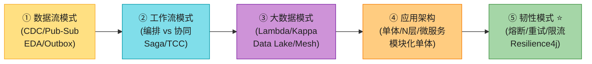

> 💡 **关键信号词**:**"CDC 把 DB 变更变成事件流,解耦读写"** + **"Outbox 解决写 DB + 发事件的原子性"** + **"Saga 编排用 Temporal/Step Functions,协同用 Kafka 事件链"** + **"熔断器防级联失败,Hystrix 停更后用 Resilience4j"** + **"微服务不是银弹,2026 模块化单体回潮"**——这五句直接拿下面试。

---

## 🗺️ 章节概览

| 小节 | 要点 | 重要性 |
|------|------|--------|
| **CDC 变更数据捕获** | 4 种实现(审计列/日志/表差异/触发器),Debezium | ⭐⭐⭐⭐⭐ |
| **Pub-Sub 发布订阅** | 消息代理/队列/AMQP,观察者 vs 发布订阅 | ⭐⭐⭐⭐ |
| **编排 vs 协同** | 中心化 vs 去中心化,4 种编排变体 | ⭐⭐⭐⭐⭐ |
| **大数据架构** | Lambda(批+流)/Kappa(纯流)/Data Lake | ⭐⭐⭐⭐⭐ |
| **解决方案架构** | 单体/N 层/微服务演进对比 | ⭐⭐⭐⭐ |
| **事件驱动架构 EDA** | 状态机/状态/转移/事件,事件溯源 | ⭐⭐⭐⭐⭐ |
| **CQRS** | 读写分离,独立扩展 | ⭐⭐⭐⭐⭐ |
| **Saga** | 跨服务事务,补偿事务 | ⭐⭐⭐⭐⭐ |
| **熔断/重试/限流** | 韧性三件套 | ⭐⭐⭐⭐⭐ |
| **DDD/按子域分解** | 领域驱动,业务对齐 | ⭐⭐⭐⭐ |
| **API 路由策略** | 主机名/路径/Header 路由,API 网关/服务网格 | ⭐⭐⭐⭐ |
| **其它模式** | ACL/Strangler/Outbox/Sidecar/BFF/Cellular | ⭐⭐⭐⭐ |
| **HDFS vs Kafka** | 分布式文件系统 vs 分布式消息队列 | ⭐⭐⭐⭐ |
| **2026增量(补)** | Outbox/CQRS+ES/Resilience4j/Strangler/DataMesh/KRaft/Flink/模块化单体 | ⭐⭐⭐⭐⭐ |

---

## 1. 变更数据捕获 CDC (Change Data Capture) ⭐⭐⭐⭐⭐

CDC 是一种**数据集成技术**——它**实时追踪源数据库的数据变更**,把变更推给各种目的地(其他数据库、数据仓库、实时处理引擎)。本质:**把 DB 的变更变成事件流,解耦读写**。

> 📝 **为什么需要 CDC**:实时分析时代,数据要**新鲜**。传统批处理(ETL 夜间跑)延迟高、要停机、影响源系统性能。CDC 只传"变更增量",**近实时、低带宽、低源系统冲击**。典型场景:把交易库(RDBMS)的变更实时同步到数据仓库(Snowflake/Redshift),做实时仪表盘。

### 1.1 CDC 相比批处理的优势

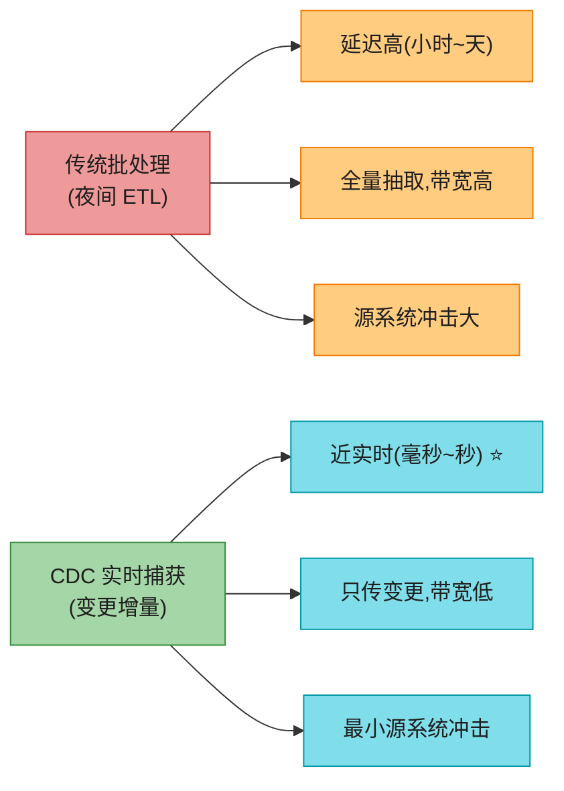

| 优势 | 说明 |
|------|------|
| **降低延迟** | 近瞬时更新,适合动态定价、库存、个性化推荐 |
| **降成本和带宽** | 只传"上次以来的变更",省带宽省传输费 |
| **提升系统效率** | 捕获变更时对源系统冲击极小,不像批处理那样占资源 |

### 1.2 CDC 的四种实现技术 ⭐⭐⭐⭐⭐(面试必背)

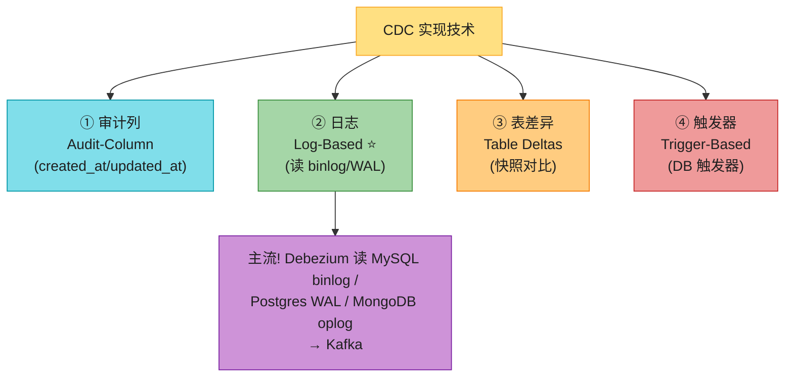

| 技术 | 做法 | 优点 | 缺点 |
|------|------|------|------|
| **审计列(Audit-Column)** | 表加 `created_at`/`updated_at` 时间戳,按时间增量查 | 简单、低开销、用 RDBMS 原生能力 | 无法捕获 DELETE;时钟漂移;高频查询 |
| **日志(Log-Based) ⭐** | 读 DB 的事务日志(MySQL binlog / Postgres WAL),不碰业务表 | **近实时、零源系统冲击、能捕获所有变更(含 DELETE)** | 解析日志复杂(Debezium 等工具兜底) |
| **表差异(Table Deltas)** | 周期性对表做全量快照,对比两次快照算差异 | 实现直观 | 延迟大、资源重、不适合高频写 |
| **触发器(Trigger-Based)** | DB 触发器在 INSERT/UPDATE/DELETE 时执行预定义逻辑 | 实时、灵活、可自定义转换 | **增加 DB 负载和复杂度**,大规模慎用 |

> 💡 **2026 主流是 Log-Based + Debezium**(背):Debezium 读 MySQL binlog / Postgres WAL / MongoDB oplog,转成标准事件发到 Kafka。**AWS 上的对应物是 DynamoDB Streams**(把 DynamoDB 表的变更发布成流)和 **AWS DMS(Data Migration Service)** 的 CDC 模式。这就是原书说的"流式 CDC(Stream-Based CDC)"——日志的格式化消费版。

> 🪤 **追问陷阱**:"CDC 和事件溯源(Event Sourcing)一样吗?" → **不一样**(见 §6.3)。CDC 是**数据集成**——从 DB 日志捕获变更做复制/同步,DB 还是真相源;事件溯源是**架构范式**——事件本身是真相源,状态从事件重放得到。CDC 关心"数据怎么搬",事件溯源关心"状态怎么存"。

---

## 2. 发布-订阅架构 Pub-Sub ⭐⭐⭐⭐

Pub-Sub 是**事件驱动编程的基础模型**——通过**异步通信**让系统各部分高效交互,**不直接耦合**,促进松耦合和可扩展设计。

### 2.1 观察者模式 vs 发布-订阅(关键区别)

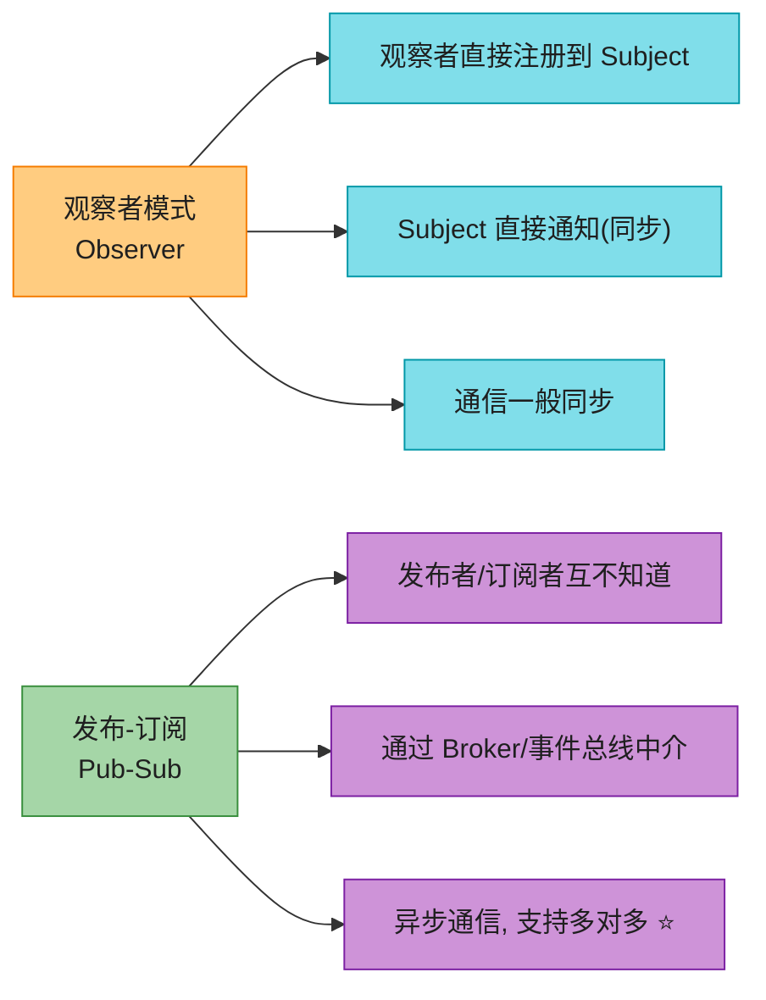

> 🪤 **核心区别(背)**:**路由机制不同**。观察者模式里,观察者**知道 Subject**,直接注册接收更新,通信一般**同步**(直接方法调用);Pub-Sub 用 **Broker/事件总线**把发布者和订阅者**完全抽象开**——发布者发消息到 channel,**不知道订阅者是谁**;订阅者听 channel,**不知道发布者是谁**。这实现了**异步 + 多对多**。

### 2.2 消息代理与消息队列

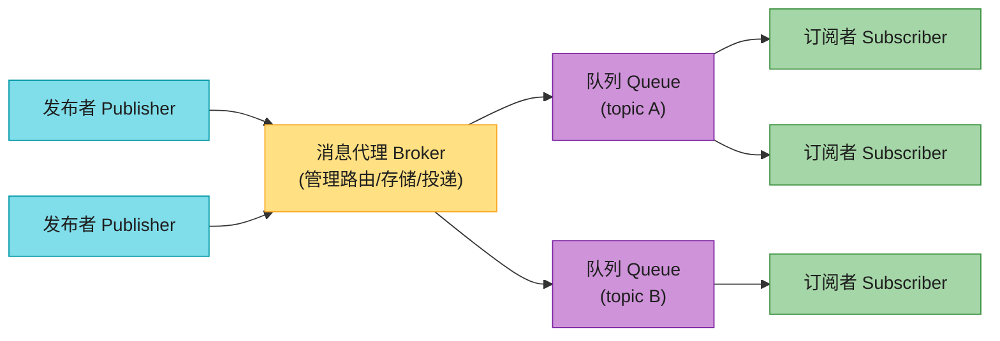

| 组件 | 职责 |
|------|------|
| **消息代理(Message Broker)** | 管理发布者→订阅者的消息传输:路由、维护、投递。用 **topic 分类消息**,发布者发到 topic,订阅者按兴趣订阅 |
| **消息队列(Message Queue)** | 消息的"临时等候室",缓存等路由的消息。**Apache Kafka** 是代表 |
| **AMQP** | 开放标准,规定消息提供者和代理的行为,保证一致投递——可靠性和功能可预测性的首选 |

> 💡 **扇出(Fan-out)**:一条消息发到 topic,所有订阅该 topic 的消费者都能收到(广播)。这是 Pub-Sub 区别于"点对点队列"(一条消息只一个消费者消费)的关键。

---

## 3. 编排 vs 协同 (Choreography vs Orchestration) ⭐⭐⭐⭐⭐

在微服务里,管理服务间交互有两种风格——**协同(去中心化)**和**编排(中心化)**。这是 Saga 的两种实现基础,也是面试高频。

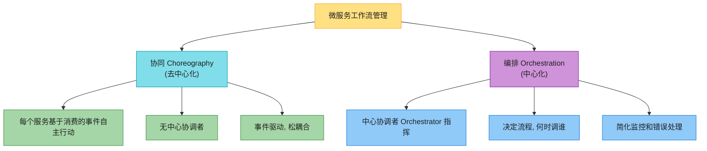

### 3.1 协同 Choreography(去中心化)

每个服务**根据消费的事件**知道该做什么、何时做。**没有中心协调者**——服务按收到的事件通知独立执行职责。促进**松耦合**(服务对事件反应,而非接受中央命令),提升**可扩展性和韧性**(服务独立运作)。

> 🪤 **协同的痛点**:① 难以强制业务规则、难监控整体流程;② 错误处理和调试复杂(日志和错误散落在各服务)。

**子模式:编排式异步事件(Choreographed Async Events)**——服务通过中心消息总线发/收事件,系统松耦合。适合**高写量**场景(IoT 数据处理、实时通知)。

> 💡 **原书例子**:电商订单处理、酒店预订——订单服务等 `PaymentProcessed` 事件,反应发出 `BookingConfirmed`,计费系统消费它开发票。**这是协同的典型**。

### 3.2 编排 Orchestration(中心化)

编排靠**中心协调者(Orchestrator)**——它控制服务间交互,决策流程走向,指挥不同服务何时行动。

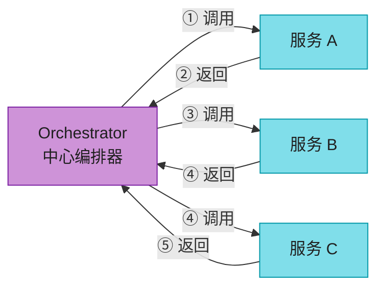

| 优势 | 代价 |
|------|------|
| 简化监控和业务逻辑管理 | 服务对中心点的依赖增加耦合 |
| 简化错误处理和恢复(编排器跟踪状态) | 中心点是**单点故障** |
| 适合复杂业务流程、严格合规 | 影响可扩展性和韧性 |

> 💡 **编排工具(背)**:**Netflix Conductor / Maestro**、**Temporal**(2026 主流 ⭐)、**AWS Step Functions**、**Apache Airflow**。原书说"第 12 章详讲 Step Functions 和 Airflow"。

### 3.3 编排的四种变体 ⭐⭐⭐⭐

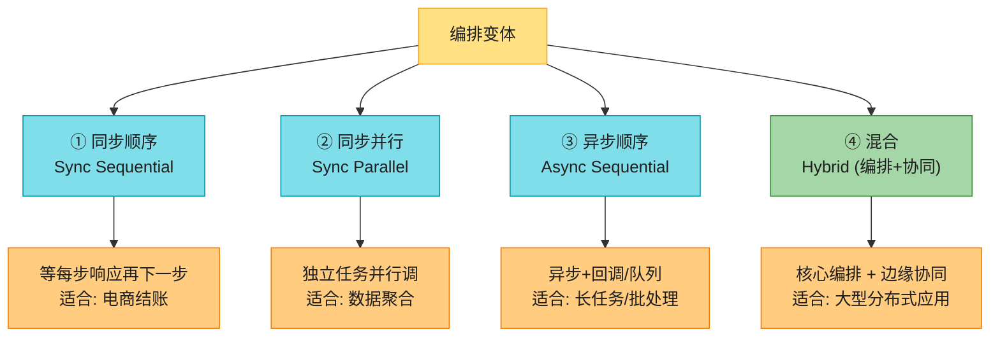

**混合模式(最实用)**:大型电商平台,**订单服务当编排器**控制核心流程(验证支付→预留库存→确认订单→发货);同时**支持服务用协同**(订单发货后发事件,通知服务/分析服务各自消费,不需直接协调)。**核心编排保事务完整性,边缘协同保灵活性**。

### 3.4 怎么选(决策表)

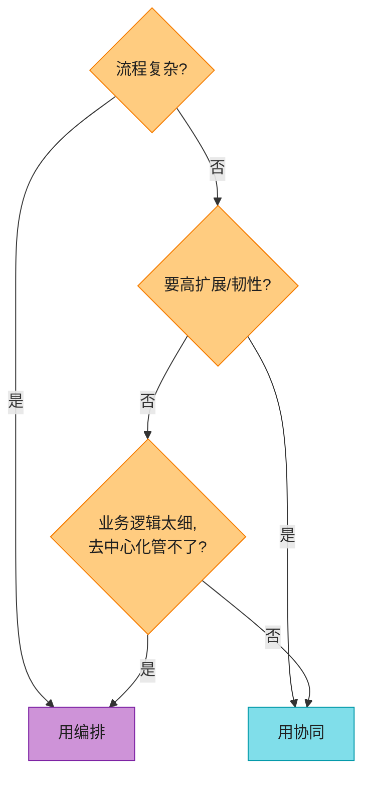

> 💡 **决策口诀(背)**:**要高扩展/高韧性、流程能用去中心化搞定 → 协同**;**流程复杂、要紧控制、跨多服务协调、业务逻辑太细 → 编排**。两者都有用武之地,理解优劣才能设计出既满足当前需求又能适应未来的方案。

---

## 4. 大数据架构 (Big Data Architecture) ⭐⭐⭐⭐⭐

大数据架构应对**数据 5V**——**Volume(体量)/Velocity(速度)/Variety(多样)/Veracity(真实性)/Value(价值)**。从传统 DB → 数据仓库 → 数据湖演进。讲三种模型。

> 🔗 **交叉引用**:本节是 **SDE-Vol2 Ch6 广告点击聚合**的核心——那章用 Lambda/Kappa 做实时广告计费,本章讲清楚架构本身。

### 4.1 Lambda 架构(批 + 流双路径)

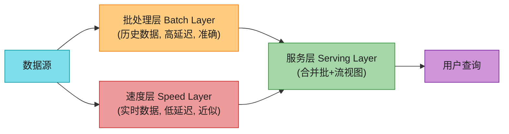

| 层 | 职责 | 特点 |
|----|------|------|
| **批处理层(Batch)** | 大体量数据批处理,处理长期历史数据 | 全面准确,但**高延迟**;产出预计算视图 |
| **速度层(Speed)** | 实时数据处理,数据到了就处理 | **低延迟**,但可能**近似**(补偿批层的高延迟) |
| **服务层(Serving)** | 合并批+流输出,给用户一致视图 | — |

> 🪤 **Lambda 的痛点**:批+流**两套代码、两套系统**——运维复杂度高。**这就是 Kappa 要解决的**。

### 4.2 Kappa 架构(纯流单路径)⭐

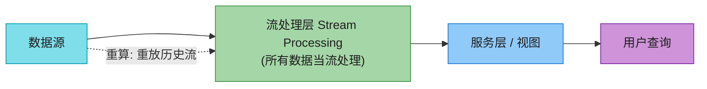

Kappa 是 Lambda 的进化——**把所有进来的数据当流处理**,用**单一处理层**同时处理实时和历史数据。**不用维护两套代码库**(批+流),简化开发和运维。

> 💡 **Kappa 的核心**:用**先进的流处理工具**(支持时间窗口、事件排序、跨无界数据集的状态管理)。重算历史时,**重放流**(Kafka 的 retention 让这成为可能)。**Uber 用 Kappa 解决动态定价、欺诈检测、用户体验分析**——单管道,批/流灵活切换。

> 🔗 **Flink 是 Kappa 的事实引擎**(2026 增量,见后文):Flink 的状态/水印/检查点/窗口让"流上跑批"成为现实。

### 4.3 数据湖架构 (Data Lake)

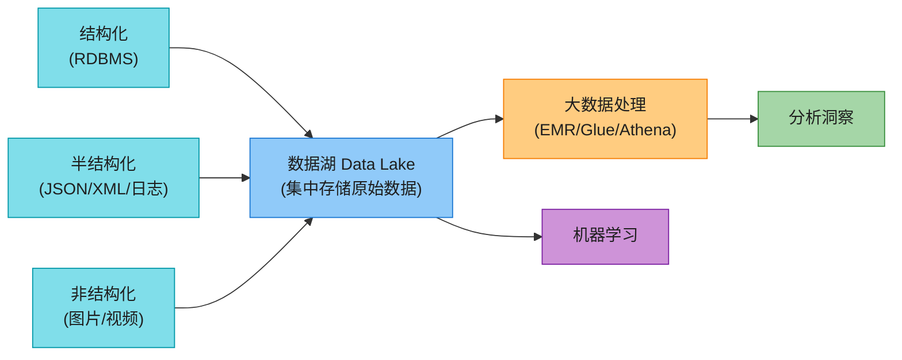

数据湖是**集中式存储库**,存、处理、保护大体量的**结构化和非结构化数据**。区别于数据仓库(结构化、处理过),数据湖**保留原始数据原貌**。

| 优势 | 说明 |
|------|------|
| **低成本横向扩展** | 用廉价硬件(或对象存储如 S3) |
| **灵活配置** | 索引和处理逻辑可灵活调整 |
| **多数据类型** | 日志、XML、JSON、二进制都能存能分析 |

> 💡 **AWS 数据湖标杆**:**Amazon S3** 做存储层,集成 **EMR**(跑 Hadoop/Spark)、**Glue**(ETL)、**Athena**(直接 SQL 查 S3)。原书第 13 章详讲。

---

## 5. 解决方案架构演进 (Solution Architecture) ⭐⭐⭐⭐

应用架构从**单体**演进到**微服务**,反映技术和业务需求变化。

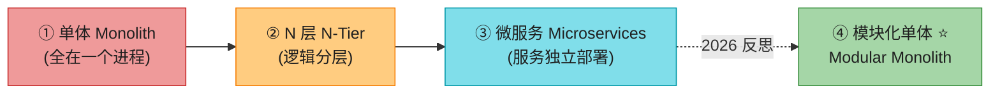

### 5.1 单体架构 (Monolith)

所有组件紧密集成,**作为一个服务运行**。应用任何位置的变更可能影响整个系统。

| 优势 | 代价 |
|------|------|
| 开发/测试/部署/水平扩展简单(单部署单元) | 应用长大后**难理解难修改** |
| 跳过微服务间的网络交互,**降延迟**,容忍不可靠网络 | 难以单独扩展某个功能 |
| 早期产品生命周期友好 | — |

> 💡 **原书建议**:**保持代码解耦和模块化**,以便需要时能单独部署。**即使单仓库部署,模块化代码也让你复用组件、加新功能、保持可读性**——这正是 2026 "模块化单体"的雏形(见增量)。

### 5.2 N 层架构 (N-Tier)

把应用拆成**逻辑层**,每层有特定职责。典型**三层**:展示层(前端)、业务逻辑层(中间层)、数据管理层(后端)。

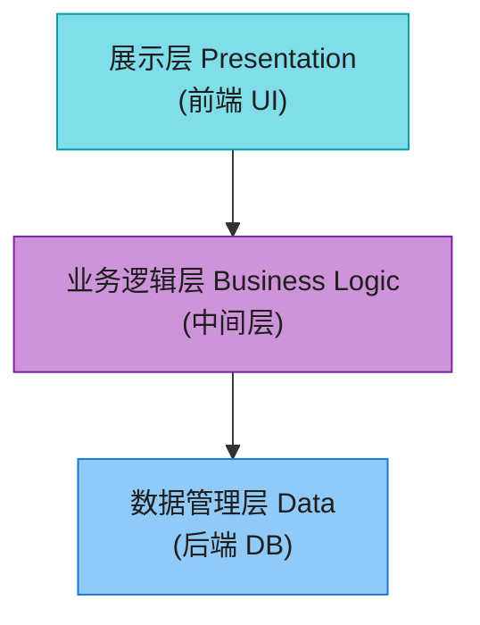

**通过分离关注点提升可维护性**——更容易管理、更新、独立扩展各部分(数据层可单独扩展扛更大负载,不一定扩展展示层)。

### 5.3 微服务架构 (Microservices)

把 N 层原则进一步推进——**拆成更小、松耦合的服务**,每个微服务专注单一功能,可独立开发/部署/扩展。

| 优势 | 代价 |
|------|------|
| 团队自治(独立开发/测试/部署/扩展) | 去中心化增加管理和运维复杂度 |
| 加速开发周期、改善故障隔离 | 服务间通信、数据一致性、事务管理复杂 |
| 技术多样性(各服务用最适合的栈) | 服务开销大(每服务可能要自己的 DB/库/依赖) |

> 🪤 **从单体到微服务不是每个项目都适合**——要权衡:网络延迟、消息格式、数据完整性、事务管理都要稳健策略(API 网关、服务网格、全面日志监控)。**仔细评估业务需求和团队能力再选**。

> 🔄 **2026 反思(见增量)**:微服务**不是银弹**。模块化单体(Modular Monolith)在很多场景是更好的起点——先单体模块化,真正需要时再拆。

---

## 6. 事件驱动架构 EDA (Event-Driven Architecture) ⭐⭐⭐⭐⭐

EDA 是一种**围绕事件的生产、检测、消费来组织行为**的范式。它让应用对分布式系统的状态变化做出反应,**不紧密耦合组件**,提升可扩展性和响应性。

### 6.1 EDA 核心概念(状态机视角)

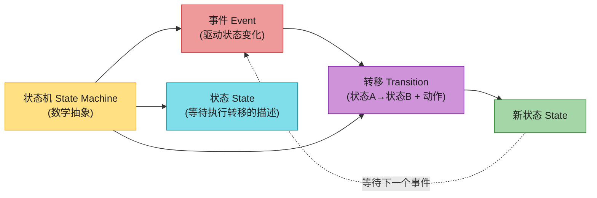

| 概念 | 含义 |
|------|------|
| **状态机(State Machine)** | 数学抽象,基于行为模型设计算法;读输入集,基于输入改变状态 |
| **状态(State)** | 系统等待执行转移时的状态描述 |
| **转移(Transition)** | 从一个状态到另一个;满足条件或收到事件时执行的一组动作 |
| **事件(Event)** | 驱动状态变化的实体 |
| **事件驱动状态机** | 转移由事件/消息触发(不是解析字符或条件) |

### 6.2 EDA 的两种实现范式

EDA 是"用发布事件通信"的策略(常依赖消息持久化较长时间直到消费)。两种主要实现风格:

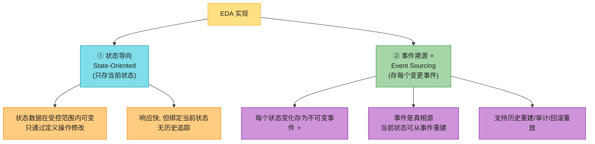

### 6.3 事件溯源 (Event Sourcing) ⭐⭐⭐⭐⭐

事件溯源**把每个状态变化存为不可变事件**——这些事件是系统的**真相源**,当前状态可从事件**重建**。它支持:

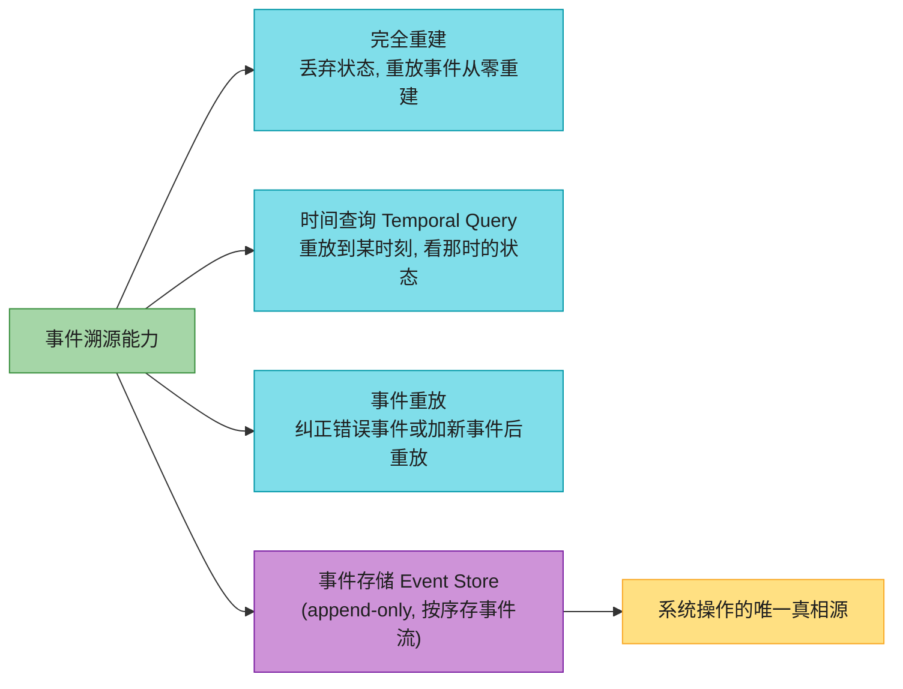

**实体建模为事件流**——状态变化产生并存新事件;恢复状态时,读该实体所有事件,逐个应用得到最终状态。**状态 = 事件流对实体的纯函数应用**。

#### 事件溯源的工程考量(背)

| 考量 | 说明 |
|------|------|
| **最终一致性** | 读可能不立即反映最近写(物化视图/投影创建有延迟) |
| **事件日志不可变** | 事件一旦写入不可改;纠正要加新事件;schema 变更要跨所有存储事件一致应用 |
| **事件排序和线性** | 多发布者时维护正确顺序至关重要——加时间戳或自增 ID |
| **消费者幂等** | 事件可能多次投递,消费者必须幂等(处理重复不影响状态) |
| **快照和物化** | 大事件流要定期做快照和物化,保证按需查询高效 |

> 🪤 **CDC vs 事件溯源(背)**:两者都追踪数据变化,但目的不同。**事件溯源把所有变更存为事件,事件是真相源**,可重建/回退任意时刻状态;**CDC 主要捕获 DB 变更做复制/集成**,用事务日志记录状态变化,**不存储变更的意图或上下文**。一句话:**事件溯源是"架构范式"(事件=真相),CDC 是"数据集成技术"(DB=真相,搬数据)**。

---

## 7. 常见云架构模式 (Common Cloud Architecture Patterns) ⭐⭐⭐⭐⭐

本节是**面试高频区**——CQRS、Saga、熔断器、重试、限流、DDD、API 路由、Sidecar 等全是考点。

### 7.1 事件型模式:CQRS 与 Saga ⭐⭐⭐⭐⭐

#### CQRS(命令查询职责分离)

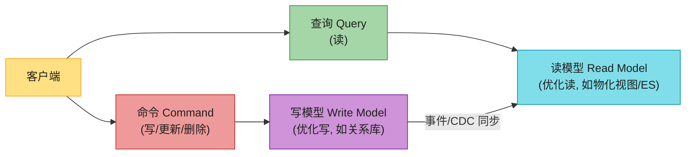

CQRS 把**读数据(查询)**和**更新数据(命令)**分离到不同接口。这让读写**分别优化**——性能、扩展性、安全。**读模型可独立于写模型扩展**,特别适合**读远多于写**的系统。

> 💡 **CQRS 常配事件溯源**:写模型存事件,读模型是物化视图(从事件投影)。2026 在金融/订单系统流行(见增量)。

#### Saga(跨服务事务)

Saga 管理**跨多个服务的事务**——每个事务步骤配一个**补偿动作(compensating action)**用于回滚。基于协同或编排:

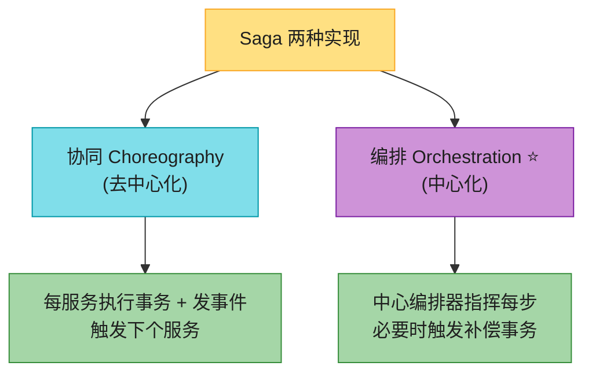

> 🔗 **交叉引用 SDE-Vol2 Ch11 支付系统**:那章讲 **TCC vs Saga** 支付选型——**扣款用 TCC**(Try-Confirm-Cancel,强一致短事务:冻结→扣款→失败解冻),**业务流程用 Saga**(下单→支付→发货→结算,长流程靠补偿回滚)。本章讲清楚 Saga 本身的两种实现。

### 7.2 容错型模式:熔断器、退避重试、限流器 ⭐⭐⭐⭐⭐

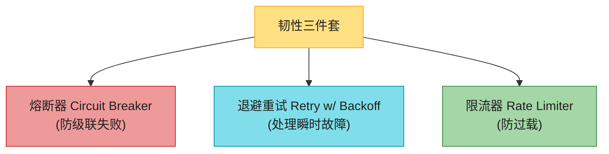

**熔断器**:某服务/操作失败到阈值,熔断器"跳闸",**暂时停止调用失败服务**,让它恢复,维持系统稳定。**防级联失败**——这是分布式系统最重要的韧性模式。

```mermaid
flowchart LR
    CLOSED["关闭 Closed<br/>(正常调用)"] -->|"失败达阈值"| OPEN["打开 Open<br/>(拒绝调用, 快速失败)"]
    OPEN -->|"超时后"| HALF["半开 Half-Open<br/>(试探性放行少量请求)"]
    HALF -->|"试探成功"| CLOSED
    HALF -->|"试探失败"| OPEN

    style CLOSED fill:#A5D6A7,stroke:#388E3C,color:#1f1f1f
    style OPEN fill:#EF9A9A,stroke:#C62828,color:#1f1f1f
    style HALF fill:#FFCC80,stroke:#F57C00,color:#1f1f1f
```

**退避重试**:失败操作重试,**间隔递增(backoff)**,直到最大重试次数。处理瞬时故障——给问题时间解决再重试。

**限流器**:控制时间窗内请求数,**防系统被高流量或突发峰值压垮**。可在用户级/服务级/全局级应用。

> 💡 **三者协同**:熔断器防级联,重试处理瞬时,限流防过载。**重试要配抖动(jitter)** 防"惊群效应"(所有客户端同时重试),**重试要被熔断器保护**(熔断打开时不重试)。

### 7.3 领域型模式:DDD 与按子域分解

```mermaid
flowchart TD
    DDD["领域驱动设计 DDD"] --> D1["聚焦核心领域逻辑和复杂度"]
    DDD --> D2["基于领域行为和逻辑设计"]
    DDD --> D3["创建领域模型, 含业务规则和行为"]
    DDD --> D4["软件与业务需求直觉对应"]

    DDD --> SUB["按子域分解 Decompose by Subdomains"]
    SUB --> S1["微服务架构下分系统为子域"]
    SUB --> S2["每微服务管一个子域"]
    SUB --> S3["独立演进, 提可维护/可扩展"]

    style DDD fill:#80DEEA,stroke:#0097A7,color:#1f1f1f
    style D1 fill:#A5D6A7,stroke:#388E3C,color:#1f1f1f
    style D2 fill:#A5D6A7,stroke:#388E3C,color:#1f1f1f
    style D3 fill:#A5D6A7,stroke:#388E3C,color:#1f1f1f
    style D4 fill:#A5D6A7,stroke:#388E3C,color:#1f1f1f
    style SUB fill:#CE93D8,stroke:#7B1FA2,color:#1f1f1f
    style S1 fill:#FFCC80,stroke:#F57C00,color:#1f1f1f
    style S2 fill:#FFCC80,stroke:#F57C00,color:#1f1f1f
    style S3 fill:#FFCC80,stroke:#F57C00,color:#1f1f1f
```

**DDD** 聚焦核心领域逻辑,基于领域行为设计,创建含业务规则的领域模型。**按子域分解**在微服务架构下基于 DDD 把系统分成子域,每微服务管一个子域——改善可维护性和可扩展性。

### 7.4 API 路由策略与模式

```mermaid
flowchart TD
    ROUTE["API 路由策略"] --> HN["主机名路由<br/>(按 hostname)"]
    ROUTE --> PT["路径路由<br/>(按 URL path)"]
    ROUTE --> HD["HTTP Header 路由<br/>(按 header, A/B测试)"]

    ROUTE --> ARCH["架构实现"]
    ARCH --> GW["API 网关<br/>(外部客户端→服务)"]
    ARCH --> SM["服务网格 Service Mesh<br/>(内部服务→服务, Sidecar)"]

    style ROUTE fill:#FFE082,stroke:#F9A825,color:#1f1f1f
    style HN fill:#80DEEA,stroke:#0097A7,color:#1f1f1f
    style PT fill:#80DEEA,stroke:#0097A7,color:#1f1f1f
    style HD fill:#80DEEA,stroke:#0097A7,color:#1f1f1f
    style ARCH fill:#CE93D8,stroke:#7B1FA2,color:#1f1f1f
    style GW fill:#A5D6A7,stroke:#388E3C,color:#1f1f1f
    style SM fill:#90CAF9,stroke:#1976D2,color:#1f1f1f
```

| 路由策略 | 做法 | 场景 |
|---------|------|------|
| **主机名路由** | 按 URL 的 hostname 分流 | 多服务不同子域/域 |
| **路径路由** | 按 URL path 分流 | 清晰组织,易管理易扩展 |
| **HTTP Header 路由** | 按 HTTP header 决策 | A/B 测试、灰度发布 |

| 架构 | 职责 |
|------|------|
| **API 网关** | 客户端请求的**集中入口**;路由、组合、协议转换;可调多微服务聚合响应;简化客户端 + 集中访问控制/监控 |
| **服务网格(Service Mesh)** | 微服务内**服务到服务通信**的基础设施层;高级路由、负载均衡、服务发现、mTLS 双向认证;用 **Sidecar 代理**拦截管理流量,不改应用代码 |

> 💡 **API 网关 vs 服务网格(背)**:**API 网关管"外部客户端→服务"**(南北向流量);**服务网格管"内部服务→服务"**(东西向流量)。服务网格用 Sidecar 实现,提供可观测性和韧性,不侵入应用代码。

### 7.5 其它云架构模式 ⭐⭐⭐⭐

```mermaid
flowchart TD
    OTHER["其它云架构模式"] --> ACL["防腐层 ACL<br/>Anticorruption Layer"]
    OTHER --> SF["绞杀者模式 ⭐<br/>Strangler Fig"]
    OTHER --> OB["事务发件箱 Outbox ⭐<br/>Transactional Outbox"]
    OTHER --> SC["Sidecar 边车"]
    OTHER --> BFF["BFF 后端服务前端"]
    OTHER --> CELL["细胞架构 Cellular"]

    style OTHER fill:#FFE082,stroke:#F9A825,color:#1f1f1f
    style ACL fill:#80DEEA,stroke:#0097A7,color:#1f1f1f
    style SF fill:#A5D6A7,stroke:#388E3C,color:#1f1f1f
    style OB fill:#A5D6A7,stroke:#388E3C,color:#1f1f1f
    style SC fill:#CE93D8,stroke:#7B1FA2,color:#1f1f1f
    style BFF fill:#90CAF9,stroke:#1976D2,color:#1f1f1f
    style CELL fill:#FFCC80,stroke:#F57C00,color:#1f1f1f
```

| 模式 | 做法 | 解决的问题 |
|------|------|-----------|
| **防腐层(ACL)** | 子系统/外部应用间的**翻译/保护屏障**,防破坏性数据/请求进入,保护核心业务模型 | 集成遗留系统/外部系统时,防领域模型被污染 |
| **绞杀者模式(Strangler Fig) ⭐** | 逐块用新应用/服务替换遗留系统的特定功能,新组件逐渐"绞杀"老系统直到完全替换 | 单体→微服务的**渐进式迁移**(见增量) |
| **事务发件箱(Outbox) ⭐⭐⭐⭐⭐** | DB 变更时,**同一事务**往 "outbox" 表加记录;独立进程把这些消息发到消息队列——保证**跨服务边界的数据一致** | **"写 DB + 发事件"的原子性**(EDA 落地最大拦路虎,见增量) |
| **Sidecar 边车** | 服务容器旁部署**附加容器/进程**,提供监控/日志/配置/网络等平台能力;任意语言,与主容器松耦合 | 隔离基础设施关注点,应用更干净模块化(服务网格的基础) |
| **BFF(Backend for Frontend)** | 为不同客户端(桌面浏览器/移动)**建独立后端服务**,优化特定 UI,减少过度获取/获取不足 | 不同客户端有不同数据需求,一个后端服务不好全包 |
| **细胞架构(Cellular)** | 系统设计成**细胞集合**,每细胞独立运作但可互联;自包含(自己的数据存储和逻辑),可自治扩展 | 一个细胞故障不影响其它;支持演进式架构 |

> 💡 **Outbox 是本章隐藏的"最重要模式"**(见增量详解)——它解决了 EDA 落地的根本难题。

---

## 8. 开源分布式架构:HDFS 与 Kafka ⭐⭐⭐⭐

分布式系统架构把职责分到多个计算节点,保证可扩展、容错、高效。两个核心组件:**分布式文件系统(HDFS)**和**分布式消息队列(Kafka)**。

### 8.1 HDFS(Hadoop 分布式文件系统)

HDFS 是**开源文件系统**,跑在**商用硬件(commodity hardware)**上,高容错,提供高吞吐访问,适合大体量数据集处理。

```mermaid
flowchart TD
    CLIENT["客户端"] --> NN["NameNode<br/>(元数据/命名空间<br/>定位文件块)"]
    NN -->|"告知块位置"| CLIENT
    CLIENT --> DN1["DataNode 1<br/>(块A 副本1)"]
    CLIENT --> DN2["DataNode 2<br/>(块A 副本2)"]
    CLIENT --> DN3["DataNode 3<br/>(块A 副本3)"]
    DN1 -.->|"心跳+块报告"| NN
    SNN["Secondary NameNode<br/>(定期快照元数据)"] -.-> NN

    style CLIENT fill:#80DEEA,stroke:#0097A7,color:#1f1f1f
    style NN fill:#EF9A9A,stroke:#C62828,color:#1f1f1f
    style DN1 fill:#A5D6A7,stroke:#388E3C,color:#1f1f1f
    style DN2 fill:#A5D6A7,stroke:#388E3C,color:#1f1f1f
    style DN3 fill:#A5D6A7,stroke:#388E3C,color:#1f1f1f
    style SNN fill:#FFCC80,stroke:#F57C00,color:#1f1f1f
```

| 组件 | 职责 |
|------|------|
| **NameNode** | 中央组件,管**元数据和命名空间**;跟踪文件位置,协调 DataNode 间存储。**故障则文件系统不可访问**(SPOF,需 HA 配置) |
| **DataNodes** | 工作者,**存实际数据块**;周期性向 NameNode 发心跳和块报告 |
| **Secondary NameNode** | **不是 NameNode 的备份**!定期快照元数据并应用 edit log,降 NameNode 故障恢复时间 |
| **Blocks** | 数据块,典型 **128MB**,跨多 DataNode 复制(通常 3 副本) |

**HDFS 特性**:分布式存储(块+复制)、容错(3 副本)、横向扩展(加节点)、高吞吐(优化批处理非低延迟)、成本效益(商用硬件)、集成 Hadoop 生态(MapReduce/Hive/Spark)。**机架感知(rack-aware)**——NameNode 用机架拓扑做块放置决策,副本跨机架分布,机架故障不丢数据。

> 💡 **AWS 对应**:**Amazon EMR** 是托管 Hadoop 服务(含 HDFS 或 EMRFS 基于 S3)。原书第 13 章详讲。

### 8.2 Hadoop 生态 vs AWS 对照(背关键几行)

| Hadoop 服务 | 功能 | AWS 对应 |
|------------|------|---------|
| HDFS | 分布式文件系统 | **S3 / EMRFS** |
| MapReduce | 并行处理 | **EMR** |
| Hive | 数据仓库(OLAP) | **Redshift** |
| Pig | 高级数据分析 | **Glue**(无服务器 ETL) |
| Presto | SQL 查询大数据 | **Athena**(无服务器查询 S3) |
| HBase | NoSQL 实时分析 | **HBase on EMR** / DynamoDB |
| YARN | 资源管理 | **EMR / ECS** |
| ZooKeeper | 分布式协调 | **AppConfig** |
| Oozie | 工作流调度 | **Step Functions** |
| Sqoop | 结构化数据传输 | **DMS** |
| Flume | 实时流摄取 | **Kinesis** |
| Spark | 内存计算 | **Spark on EMR** |

### 8.3 Apache Kafka(分布式消息队列)⭐⭐⭐⭐⭐

Kafka 是**开源分布式事件流平台**,日处理**万亿级事件**,高可靠可扩展,每秒处理百万记录。是**事件驱动架构、实时分析、复杂数据管道**的理想选择。

```mermaid
flowchart LR
    P1["生产者 Producer"] --> BROKER["Kafka Broker 集群"]
    P2["生产者 Producer"] --> BROKER
    BROKER --> T1["Topic A<br/>Partition 0/1/2"]
    BROKER --> T2["Topic B<br/>Partition 0/1"]
    T1 --> C1["消费者组 1<br/>Consumer Group"]
    T1 --> C2["消费者组 2"]
    T2 --> C3["消费者"]

    SR["Schema Registry<br/>(管理 schema 兼容)"] -.-> BROKER
    CRD["Coordinator<br/>(KRaft 取代 ZooKeeper) ⭐"] -.-> BROKER

    style P1 fill:#80DEEA,stroke:#0097A7,color:#1f1f1f
    style P2 fill:#80DEEA,stroke:#0097A7,color:#1f1f1f
    style BROKER fill:#FFE082,stroke:#F9A825,color:#1f1f1f
    style T1 fill:#CE93D8,stroke:#7B1FA2,color:#1f1f1f
    style T2 fill:#CE93D8,stroke:#7B1FA2,color:#1f1f1f
    style C1 fill:#A5D6A7,stroke:#388E3C,color:#1f1f1f
    style C2 fill:#A5D6A7,stroke:#388E3C,color:#1f1f1f
    style C3 fill:#A5D6A7,stroke:#388E3C,color:#1f1f1f
    style SR fill:#FFCC80,stroke:#F57C00,color:#1f1f1f
    style CRD fill:#EF9A9A,stroke:#C62828,color:#1f1f1f
```

| 组件 | 职责 |
|------|------|
| **生产者(Producer)** | 推数据(record)到 Kafka topic |
| **消费者(Consumer)** | 从 topic 读数据,按分区存储顺序消费 |
| **Schema Registry** | 管理和强制生产者/消费者的 schema,防版本兼容问题 |
| **Broker** | 服务器,管理数据持久化和复制;数据存**分区**里 |
| **Coordinator** | **原 ZooKeeper**(管 broker 协调、leader 选举、元数据);**新版 KRaft 取代 ZooKeeper**(见增量) |
| **Topic** | 记录存储发布的类别/feed 名;**分区**实现跨 broker 分布 |
| **Partition** | 并行处理单元;有序不可变的记录序列,持续追加到 log;**也是复制单元** |
| **Key** | 决定 record 发到哪个分区;同 key 总进同分区,**保序** |

> 💡 **排序保证(背)**:Kafka 按**生产者发送顺序**追加消息到分区。M1 先于 M2 发到同分区 → M1 offset 低于 M2,先出现。**但排序只在分区内保证**——跨分区无序。要全局有序?**单分区**(但牺牲并行)。

#### Kafka 配置层级与消息保证

```mermaid
flowchart TD
    CFG["Kafka 配置层级"] --> RF["复制因子 Replication Factor<br/>(副本数, 高=容错高/资源多)"]
    CFG --> ACK["确认 Acknowledgments<br/>(acks=all 最可靠)"]
    CFG --> RET["保留策略 Retention<br/>(按时间/大小)"]
    CFG --> CMP["压缩 Compression<br/>(gzip/snappy/lz4)"]

    style CFG fill:#FFE082,stroke:#F9A825,color:#1f1f1f
    style RF fill:#80DEEA,stroke:#0097A7,color:#1f1f1f
    style ACK fill:#80DEEA,stroke:#0097A7,color:#1f1f1f
    style RET fill:#80DEEA,stroke:#0097A7,color:#1f1f1f
    style CMP fill:#80DEEA,stroke:#0097A7,color:#1f1f1f
```

**消息投递保证(背)**:

| 保证 | 含义 | 场景 |
|------|------|------|
| **最多一次(At-most-once)** | 可能丢,绝不重复;无重试无 ack 的默认 | 容忍丢数据的场景 |
| **至少一次(At-least-once)** | 至少送达一次,可能重复;失败重试 | 数据不能丢,重复由应用幂等处理 |
| **精确一次(Exactly-once, EOS) ⭐** | 精确一次,无重复无丢失;靠**幂等生产者 + 事务 API** | 金融交易等数据完整性关键场景 |

> 💡 **幂等(背)**:操作执行多次效果同执行一次。如消费者记录已处理消息 ID,防重复处理。EOS 靠 Kafka 幂等生产者 + 事务 API,跨多分区多 topic 保原子性。

### 8.4 HDFS vs Kafka 对比

| 特性 | HDFS | Kafka |
|------|------|-------|
| **核心功能** | 分布式**文件存储** | **消息队列/事件流平台** |
| **用例** | 大数据存储、大规模处理 | 实时消息、事件溯源 |
| **数据模型** | 文件 | 记录流 |
| **性能** | 高吞吐,优化大文件 | 高吞吐,优化消息传递 |
| **可扩展性** | 加节点线性扩展 | topic + partition 横向扩展 |
| **容错** | 跨节点复制 | 集群内/跨集群复制 |

> 💡 **AWS 对应**:**Amazon MSK**(Managed Streaming for Kafka)和 **Amazon Kinesis** 是托管流服务。原书第 12 章详讲。

---

## 2026 现代增量(原书没讲透的硬核)⭐⭐⭐⭐⭐

本章是**全书 2026 增量最密集的一章**——CQRS/Saga/熔断/CDC/EDA 这些主题在 2026 都有重要演进。以下是必补的硬核料。

### 增量 1:Outbox 模式详解 ⭐⭐⭐⭐⭐(EDA 落地的关键)

原书只一句提到 Outbox,但它是 **EDA 落地的最大拦路虎**——**"写 DB + 发事件"的原子性问题**。

```mermaid
flowchart TD
    PROB["问题: 写DB + 发事件<br/>两个操作, 怎么原子?"] --> BAD1["方案A: 先写DB, 再发事件<br/>发事件失败 → 事件丢了"]
    PROB --> BAD2["方案B: 先发事件, 再写DB<br/>写DB失败 → 事件已发, 状态不一致"]

    SOL["Outbox 模式 ⭐"] --> S1["① 业务数据 + outbox 表<br/>同一DB事务写入(原子!)"]
    SOL --> S2["② 独立进程/CDC 读 outbox 表<br/>发到 Kafka"]
    SOL --> S3["③ 发成功后标记/删除 outbox 记录"]

    style PROB fill:#EF9A9A,stroke:#C62828,color:#1f1f1f
    style BAD1 fill:#FFCC80,stroke:#F57C00,color:#1f1f1f
    style BAD2 fill:#FFCC80,stroke:#F57C00,color:#1f1f1f
    style SOL fill:#A5D6A7,stroke:#388E3C,color:#1f1f1f
    style S1 fill:#80DEEA,stroke:#0097A7,color:#1f1f1f
    style S2 fill:#80DEEA,stroke:#0097A7,color:#1f1f1f
    style S3 fill:#80DEEA,stroke:#0097A7,color:#1f1f1f
```

```mermaid
sequenceDiagram
    participant APP as 应用
    participant DB as 数据库<br/>(业务表 + outbox表)
    participant REL as Relay/CDC
    participant MQ as Kafka

    Note over APP,DB: 同一事务(原子)
    APP->>DB: BEGIN TX
    APP->>DB: INSERT 业务数据
    APP->>DB: INSERT outbox 记录
    APP->>DB: COMMIT TX
    Note over REL: 独立进程轮询/CDC
    REL->>DB: 读 outbox 未发送记录
    REL->>MQ: 发送到 Kafka
    REL->>DB: 标记 outbox 已发送
```

> 🔄 **2026 话术(直接背)**:"原书只一句提 Outbox,但它是 EDA 落地的最大拦路虎。问题是**写 DB 和发事件是两个操作,怎么保证原子?** 先写 DB 再发事件——发失败事件丢了;先发事件再写 DB——写失败状态不一致。**Outbox 解法**:业务数据和 outbox 表用**同一 DB 事务**写入(原子的),再用**独立进程或 CDC(Debezium)读 outbox 表发 Kafka**,发成功标记。**这保证了'要么都成功,要么都不发生'**——事件绝不丢、状态绝不漂移。2026 最佳实践是 **Debezium 读 outbox 表**(CDC 模式,零代码轮询),发到 Kafka。"

> 🪤 **Outbox 的细节坑**:① 消费者必须**幂等**(Relay 可能重复发);② outbox 表要定期清理(否则膨胀);③ 事件排序——同聚合内的事件要有序(用聚合 ID 做 partition key)。

### 增量 2:Saga 编排 vs 协同 2026 实战 ⭐⭐⭐⭐⭐

原书 Saga 只给定义,没讲 **2026 工作流引擎**——这是 Saga 编排派的工程化。

```mermaid
flowchart TD
    SAGA["Saga 2026 实现"] --> ORC["编排派 ⭐<br/>(中心化)"]
    SAGA --> CH["协同派<br/>(去中心化)"]

    ORC --> TMP["Temporal ⭐⭐<br/>(2026 主流, Uber 出品)"]
    ORC --> SF["AWS Step Functions<br/>(云原生)"]
    ORC --> CAD["Cadence (Uber, Temporal 前身)"]
    ORC --> COND["Netflix Conductor"]

    CH --> KAFKA["Kafka 事件链<br/>(服务发事件→下个消费)"]
    CH --> EDA["EDA + Outbox<br/>(保证事件不丢)"]

    style SAGA fill:#FFE082,stroke:#F9A825,color:#1f1f1f
    style ORC fill:#CE93D8,stroke:#7B1FA2,color:#1f1f1f
    style CH fill:#80DEEA,stroke:#0097A7,color:#1f1f1f
    style TMP fill:#A5D6A7,stroke:#388E3C,color:#1f1f1f
    style SF fill:#90CAF9,stroke:#1976D2,color:#1f1f1f
    style CAD fill:#FFCC80,stroke:#F57C00,color:#1f1f1f
    style COND fill:#FFCC80,stroke:#F57C00,color:#1f1f1f
    style KAFKA fill:#EF9A9A,stroke:#C62828,color:#1f1f1f
    style EDA fill:#EF9A9A,stroke:#C62828,color:#1f1f1f
```

> 🔗 **接 SDE-Vol2 Ch11 支付系统的 TCC/Saga**:那章讲支付场景——**核心扣款用 TCC**(强一致短事务),**业务流程编排用 Saga**(长流程)。本章讲清楚 **Saga 的两种实现 + 2026 工具选型**:
> - **编排派(Temporal/Step Functions)**:中心化,流程可视化,错误处理集中,**适合复杂流程**(订单、支付、履约)。**Temporal 是 2026 主流**——代码即工作流,持久化执行,故障自动恢复。
> - **协同派(Kafka 事件链)**:去中心化,松耦合,**适合简单流程、高扩展**。但要配 **Outbox** 保证事件不丢。

> 🔄 **2026 话术**:"原书 Saga 只给定义。**2026 编排派主流是 Temporal**(Uber 出品,代码即工作流,持久化执行,故障自动恢复);AWS 云原生是 **Step Functions**(声明式 ASL,无服务器)。**协同派靠 Kafka 事件链**——但要配 **Outbox 模式**保证'写 DB + 发事件'原子,否则事件可能丢。**选型口诀**:流程复杂、要可视化、错误处理集中 → 编排(Temporal);流程简单、要高扩展、松耦合 → 协同(Kafka+Outbox)。"

### 增量 3:CQRS + 事件溯源(2026 金融/订单标配)⭐⭐⭐⭐⭐

原书 CQRS 和事件溯源分开讲,没讲**它俩怎么组合**——而组合才是 2026 金融/订单系统的标配。

```mermaid
flowchart LR
    CMD["命令 Command<br/>(写)"] --> AGG["聚合根 Aggregate<br/>(领域模型, 验证业务规则)"]
    AGG --> ES["事件存储 Event Store ⭐<br/>(append-only, 事件流)"]
    ES -->|"事件投影 Projection"| R1["读模型: 物化视图<br/>(用户profile)"]
    ES --> R2["读模型: 搜索索引<br/>(Elasticsearch)"]
    ES --> R3["读模型: 报表<br/>(ClickHouse)"]
    ES -->|"重放"| SNAPSHOT["快照 Snapshot<br/>(加速重建)"]

    QRY["查询 Query<br/>(读)"] --> R1
    QRY --> R2
    QRY --> R3

    style CMD fill:#EF9A9A,stroke:#C62828,color:#1f1f1f
    style QRY fill:#A5D6A7,stroke:#388E3C,color:#1f1f1f
    style AGG fill:#FFCC80,stroke:#F57C00,color:#1f1f1f
    style ES fill:#CE93D8,stroke:#7B1FA2,color:#1f1f1f
    style R1 fill:#80DEEA,stroke:#0097A7,color:#1f1f1f
    style R2 fill:#80DEEA,stroke:#0097A7,color:#1f1f1f
    style R3 fill:#80DEEA,stroke:#0097A7,color:#1f1f1f
    style SNAPSHOT fill:#90CAF9,stroke:#1976D2,color:#1f1f1f
```

**CQRS + 事件溯源的组合(背)**:
- **写侧**:命令→聚合根(验证业务规则)→事件存储(append-only 存事件流)。**事件是真相源**。
- **读侧**:多个**物化视图(projection)** 从事件投影出来,每个针对特定查询优化。**读模型是缓存的投影**。
- **重放**:事件流可重放,重建任意时刻状态(审计、纠错);配**快照(snapshot)** 加速重建。

> 🔄 **2026 话术**:"CQRS 和事件溯源是天然搭档——**CQRS 分离读写,事件溯源让写侧存事件**。组合后:写侧命令→聚合根→事件存储;读侧多个物化视图从事件投影。**这是 2026 金融/订单系统的标配**——审计(回放看历史状态)、解耦(读写独立扩展)、弹性(加新读模型只需加新投影,不改写侧)。代价是**最终一致性**(读模型投影有延迟)和**复杂度**(事件 schema 演进、快照管理)。"

### 增量 4:熔断器 Resilience4j(Hystrix 已停更)⭐⭐⭐⭐⭐

原书熔断器只讲模式,没提工具——而 **Netflix Hystrix 2018 停更**,2026 主流是 **Resilience4j / Spring Cloud Circuit Breaker**。

```mermaid
flowchart LR
    OLD["Netflix Hystrix<br/>(2018 停更 ⚠️)"] -->|"2026"| NEW["Resilience4j ⭐<br/>(函数式, 轻量)"]
    NEW --> SCCB["Spring Cloud Circuit Breaker<br/>(抽象层, 默认 Resilience4j)"]
    NEW --> FEAT["熔断 + 重试 + 限流 + 舱壁"]
    NEW --> JAVA["Java 函数式 API<br/>(装饰器模式)"]

    ALT["其它生态"] --> GO["Go: sony/gobreaker"]
    ALT --> RUST["Rust: failsafe"]
    ALT --> MESH["服务网格层<br/>(Istio/Linkerd 内置熔断)"]

    style OLD fill:#EF9A9A,stroke:#C62828,color:#1f1f1f
    style NEW fill:#A5D6A7,stroke:#388E3C,color:#1f1f1f
    style SCCB fill:#80DEEA,stroke:#0097A7,color:#1f1f1f
    style FEAT fill:#80DEEA,stroke:#0097A7,color:#1f1f1f
    style JAVA fill:#80DEEA,stroke:#0097A7,color:#1f1f1f
    style ALT fill:#FFCC80,stroke:#F57C00,color:#1f1f1f
    style GO fill:#CE93D8,stroke:#7B1FA2,color:#1f1f1f
    style RUST fill:#CE93D8,stroke:#7B1FA2,color:#1f1f1f
    style MESH fill:#CE93D8,stroke:#7B1FA2,color:#1f1f1f
```

> 🔄 **2026 话术**:"原书熔断器只讲模式。**Netflix Hystrix 2018 已停更**(官方建议迁移),2026 Java 生态主流是 **Resilience4j**——函数式 API(装饰器模式),轻量无依赖,集**熔断 + 重试 + 限流 + 舱壁(Bulkhead)** 四件套。Spring 生态用 **Spring Cloud Circuit Breaker**(抽象层,默认实现 Resilience4j)。**更高层抽象是服务网格**(Istio/Linkerd)——熔断/重试/限流下沉到 Sidecar,**应用零代码**。趋势是**韧性能力从应用层下沉到网格层**。"

> 💡 **Bulkhead 舱壁模式(背)**:像船的隔舱——**把资源(线程池/连接池)隔离**,一个服务挂不耗尽全局资源。如给每个下游服务独立线程池,A 慢不拖死 B。Resilience4j 内置支持。

### 增量 5:Strangler Fig 绞杀者模式(单体→微服务渐进迁移)⭐⭐⭐⭐

原书只一句,没讲透。**Strangler Fig 是单体→微服务迁移的标准方法**。

```mermaid
flowchart LR
    CLIENT["客户端"] --> ROUTER["路由层<br/>(API网关/负载均衡)"]
    ROUTER -->|"新功能 →"| NEW["新微服务"]
    ROUTER -->|"旧功能 →"| MONO["旧单体"]

    NEW -->|"逐步接管"| STRANGLE["绞杀: 一块块替换"]
    STRANGLE -->|"最终"| DEAD["旧单体退役"]

    style CLIENT fill:#80DEEA,stroke:#0097A7,color:#1f1f1f
    style ROUTER fill:#FFE082,stroke:#F9A825,color:#1f1f1f
    style NEW fill:#A5D6A7,stroke:#388E3C,color:#1f1f1f
    style MONO fill:#EF9A9A,stroke:#C62828,color:#1f1f1f
    style STRANGLE fill:#CE93D8,stroke:#7B1FA2,color:#1f1f1f
    style DEAD fill:#90CAF9,stroke:#1976D2,color:#1f1f1f
```

> 🔄 **2026 话术**:"原书提了 Strangler Fig 但没讲透。它是**单体→微服务的渐进迁移方法**:在旧单体前加路由层(API 网关),**新功能写到新微服务,旧功能逐步迁移**。新服务一块块'绞杀'旧单体的功能,直到旧单体完全退役。**核心是渐进——绝不'大爆炸'重写**(大爆炸重写几乎必败)。配 **ACL 防腐层**让新旧系统平滑过渡,新服务通过 ACL 调旧系统的接口,直到完全独立。"

### 增量 6:Data Mesh(2026 数据架构新范式)⭐⭐⭐⭐

原书 Data Lake 是 2022 主流,但 **2026 最热的是 Data Mesh**——领域驱动的数据所有权。

```mermaid
flowchart TD
    DL["Data Lake<br/>(集中式, IT 团队管)"] -->|"痛点"| P1["数据沼泽: 存了没治理"]
    DL --> P2["所有权模糊: 业务团队不负责自己的数据"]
    DL --> P3["瓶颈: IT 团队成为数据管道瓶颈"]

    DM["Data Mesh ⭐<br/>(去中心化, 领域驱动)"] --> D1["① 领域驱动的数据所有权<br/>(业务团队管自己的数据产品)"]
    DM --> D2["② 数据即产品<br/>(每领域发布可发现的数据产品)"]
    DM --> D3["③ 自助数据平台<br/>(平台工程提供管道基础设施)"]
    DM --> D4["④ 联邦计算治理<br/>(全局标准 + 领域自治)"]

    style DL fill:#EF9A9A,stroke:#C62828,color:#1f1f1f
    style P1 fill:#FFCC80,stroke:#F57C00,color:#1f1f1f
    style P2 fill:#FFCC80,stroke:#F57C00,color:#1f1f1f
    style P3 fill:#FFCC80,stroke:#F57C00,color:#1f1f1f
    style DM fill:#A5D6A7,stroke:#388E3C,color:#1f1f1f
    style D1 fill:#80DEEA,stroke:#0097A7,color:#1f1f1f
    style D2 fill:#80DEEA,stroke:#0097A7,color:#1f1f1f
    style D3 fill:#80DEEA,stroke:#0097A7,color:#1f1f1f
    style D4 fill:#80DEEA,stroke:#0097A7,color:#1f1f1f
```

> 🔄 **2026 话术**:"原书 Data Lake 是集中式——但 2022 后业界发现痛点:**数据沼泽**(存了没治理)、**所有权模糊**(业务团队不管数据)、**IT 瓶颈**。**Zhamak Dehghani 提出的 Data Mesh 是 2026 数据架构最热范式**——四大原则:① **领域驱动数据所有权**(业务团队管自己的'数据产品',不是丢给中央 IT);② **数据即产品**(每领域发布可发现、有 SLA 的数据产品);③ **自助数据平台**(平台工程提供管道基础设施,业务团队自助);④ **联邦计算治理**(全局标准 + 领域自治)。**本质是把 DDD 思想从应用到数据**。Netflix/Spotify 等大厂已实践。"

### 增量 7:Kafka 现代化(KRaft 去 ZK + Tiered Storage)⭐⭐⭐⭐

原书 Kafka 还讲 ZooKeeper——但 **KRaft 已在 Kafka 3.3+ 生产可用,2026 是去 ZK 时代**。

```mermaid
flowchart LR
    OLD["Kafka + ZooKeeper<br/>(原书)"] -->|"痛点"| P1["ZK 是额外组件, 运维复杂"]
    OLD --> P2["ZK 限制 Kafka 元数据规模"]
    OLD --> P3["ZK 是 SPOF(需 ZK 集群)"]

    NEW["Kafka KRaft ⭐<br/>(Raft 共识)"] --> N1["去 ZK, Kafka 自治"]
    NEW --> N2["元数据用 Raft, 横向扩展更好"]
    NEW --> N3["运维简化(少一个组件)"]

    TS["Tiered Storage 分层存储 ⭐"] --> TS1["热数据本地盘"]
    TS --> TS2["冷数据对象存储(S3)"]
    TS --> TS3["省成本, 长期保留可行"]

    style OLD fill:#EF9A9A,stroke:#C62828,color:#1f1f1f
    style P1 fill:#FFCC80,stroke:#F57C00,color:#1f1f1f
    style P2 fill:#FFCC80,stroke:#F57C00,color:#1f1f1f
    style P3 fill:#FFCC80,stroke:#F57C00,color:#1f1f1f
    style NEW fill:#A5D6A7,stroke:#388E3C,color:#1f1f1f
    style N1 fill:#80DEEA,stroke:#0097A7,color:#1f1f1f
    style N2 fill:#80DEEA,stroke:#0097A7,color:#1f1f1f
    style N3 fill:#80DEEA,stroke:#0097A7,color:#1f1f1f
    style TS fill:#CE93D8,stroke:#7B1FA2,color:#1f1f1f
    style TS1 fill:#90CAF9,stroke:#1976D2,color:#1f1f1f
    style TS2 fill:#90CAF9,stroke:#1976D2,color:#1f1f1f
    style TS3 fill:#90CAF9,stroke:#1976D2,color:#1f1f1f
```

> 🔄 **2026 话术**:"原书 Kafka 还讲 ZooKeeper——但 **KRaft(Kafka Raft)从 3.3+ 生产可用,2026 是去 ZK 时代**。KRaft 让 Kafka 自己用 Raft 管元数据,**去掉了 ZooKeeper 这个额外组件**——运维简化、元数据规模限制解除、扩缩容更快。另一个大变化是 **Tiered Storage(分层存储)**:热数据在 broker 本地盘,冷数据自动搬到对象存储(S3/Azure Blob)——**让 Kafka 长期保留海量数据在经济上可行**(原来全放本地盘太贵)。这俩让 Kafka 更接近'数据湖+消息队列'二合一。"

> 🔗 **接 SDE-Vol2 Ch4 消息队列**:那章讲的 Kafka 架构是 ZK 时代,本章补 KRaft 现代化。

### 增量 8:流处理 Flink(Kappa 的事实引擎)⭐⭐⭐⭐

原书 Kappa 没提 Flink——而 **Flink 是 Kappa 架构的事实执行引擎**。

```mermaid
flowchart LR
    SRC["数据源<br/>(Kafka)"] --> FL["Flink 流处理 ⭐<br/>(状态/水印/检查点/窗口)"]
    FL --> SINK1["Sink: 数据库"]
    FL --> SINK2["Sink: Kafka(下游)"]
    FL --> SINK3["Sink: OLAP(Pinot/ClickHouse)"]

    FL --> FEAT["核心能力"]
    FEAT --> F1["状态管理(键控状态/算子状态)"]
    FEAT --> F2["事件时间 + 水印(处理乱序)"]
    FEAT --> F3["Chandy-Lamport 分布式快照<br/>(精确一次 + 快速恢复)"]
    FEAT --> F4["窗口(tumbling/sliding/session)"]

    style SRC fill:#80DEEA,stroke:#0097A7,color:#1f1f1f
    style FL fill:#A5D6A7,stroke:#388E3C,color:#1f1f1f
    style SINK1 fill:#CE93D8,stroke:#7B1FA2,color:#1f1f1f
    style SINK2 fill:#CE93D8,stroke:#7B1FA2,color:#1f1f1f
    style SINK3 fill:#CE93D8,stroke:#7B1FA2,color:#1f1f1f
    style FEAT fill:#FFE082,stroke:#F9A825,color:#1f1f1f
    style F1 fill:#FFCC80,stroke:#F57C00,color:#1f1f1f
    style F2 fill:#FFCC80,stroke:#F57C00,color:#1f1f1f
    style F3 fill:#EF9A9A,stroke:#C62828,color:#1f1f1f
    style F4 fill:#FFCC80,stroke:#F57C00,color:#1f1f1f
```

> 🔄 **2026 话术**:"原书 Kappa 讲了概念但没提 Flink。**Flink 是 Kappa 架构的事实执行引擎**——它的**状态管理**(键控状态/算子状态)、**事件时间 + 水印**(处理乱序和迟到事件)、**Chandy-Lamport 分布式快照**(精确一次 + 快速恢复)、**窗口**(tumbling/sliding/session)让'流上跑批'成为现实。**Uber/Netflix/阿里巴巴都用 Flink 做 Kappa**。配 Kafka(KRaft + Tiered Storage)做存储,Flink 做计算,Pinot/ClickHouse 做服务层——这是 2026 实时数据栈的事实标准。"

> 🔗 **接 SDE-Vol2 Ch6 广告点击聚合**:那章用 Flink 做实时广告计费,本章讲清楚 Flink 在 Kappa 架构里的定位。

### 增量 9:模块化单体回潮 ⭐⭐⭐⭐⭐(呼应 Ch1 "没银弹")

原书把微服务讲成"演进必然",但 **2026 业界在反思:微服务不是银弹,模块化单体回潮**。

```mermaid
flowchart TD
    MICRO["微服务<br/>(原书当'演进终点')"] --> PAIN["痛点(2022-2026 反思)"]
    PAIN --> P1["分布式复杂度爆炸<br/>(网络/一致性/事务)"]
    PAIN --> P2["服务间延迟累积<br/>(一次请求跨10+服务)"]
    PAIN --> P3["运维成本高<br/>(每服务:DB/监控/CI/CD)"]
    PAIN --> P4["数据一致性难<br/>(跨服务事务=Saga/Outbox)"]

    MM["模块化单体 Modular Monolith ⭐"] --> MM1["单进程, 模块清晰边界"]
    MM --> MM2["模块内高内聚, 模块间低耦合"]
    MM --> MM3["共享 DB 但模块各管各表"]
    MM --> MM4["需要时再拆(单模块→微服务)"]

    style MICRO fill:#EF9A9A,stroke:#C62828,color:#1f1f1f
    style PAIN fill:#FFCC80,stroke:#F57C00,color:#1f1f1f
    style P1 fill:#80DEEA,stroke:#0097A7,color:#1f1f1f
    style P2 fill:#80DEEA,stroke:#0097A7,color:#1f1f1f
    style P3 fill:#80DEEA,stroke:#0097A7,color:#1f1f1f
    style P4 fill:#80DEEA,stroke:#0097A7,color:#1f1f1f
    style MM fill:#A5D6A7,stroke:#388E3C,color:#1f1f1f
    style MM1 fill:#CE93D8,stroke:#7B1FA2,color:#1f1f1f
    style MM2 fill:#CE93D8,stroke:#7B1FA2,color:#1f1f1f
    style MM3 fill:#CE93D8,stroke:#7B1FA2,color:#1f1f1f
    style MM4 fill:#CE93D8,stroke:#7B1FA2,color:#1f1f1f
```

> 🔄 **2026 话术(直接背)**:"原书把微服务讲成'演进必然',但 **2026 业界在反思**——Shopify、GitHub、Stack Overflow 都在用**单体(或模块化单体)**跑超大规模。微服务的痛点:**分布式复杂度爆炸**(网络/一致性/事务)、**延迟累积**(一次请求跨 10+ 服务)、**运维成本**(每服务要 DB/监控/CI/CD)、**数据一致性**(Saga/Outbox 都是补丁)。**模块化单体(Modular Monolith)是 2026 回潮**:单进程,模块清晰边界(模块内高内聚,模块间低耦合),共享 DB 但模块各管各表。**真正需要独立扩展的模块才拆成微服务**。这呼应 **Ch1 准则五:没银弹**——微服务不是银弹,模块化单体在中小团队/早期项目往往是更好的起点。先单体模块化,撞到瓶颈再拆。"

> 💡 **行业标杆**:**Shopify**(单体跑黑色星期五大流量)、**GitHub**(Rails 单体)、**Stack Overflow**(单体 + 极致优化)。它们证明**单体 + 好架构 > 微服务 + 烂架构**。

---

## ⚠️ 已过时 / 书里没说(2022 → 2026)

| 原书(2023) | 2026 现状 | 面试应对 |
|------------|----------|---------|
| Saga 只给定义 | **Temporal/Step Functions 编排派主流**;协同派配 Outbox | 讲 Temporal 代码即工作流 + Outbox 保事件不丢 |
| Outbox 只一句 | **EDA 落地最大拦路虎**(写DB+发事件原子) | 讲同事务写业务+outbox表,Debezium 读发 Kafka |
| CQRS/ES 分开讲 | **CQRS+事件溯源组合是金融/订单标配** | 讲写侧存事件,读侧多物化视图 |
| 熔断器没提工具 | **Hystrix 2018 停更,用 Resilience4j**;服务网格下沉 | 讲 Resilience4j + Bulkhead + Istio 内置 |
| Data Lake 集中式 | **Data Mesh 领域驱动数据所有权** | 讲四原则(领域/数据即产品/自助平台/联邦治理) |
| Kafka 带 ZooKeeper | **KRaft 去 ZK + Tiered Storage** | 讲 KRaft Raft 共识 + 冷数据搬 S3 |
| Kappa 没提 Flink | **Flink 是 Kappa 事实引擎** | 讲状态/水印/快照/窗口 |
| 微服务当演进必然 | **模块化单体回潮**(没银弹) | 讲 Shopify/GitHub 单体 + 先模块化再拆 |
| Strangler Fig 只一句 | **单体→微服务迁移标准方法** | 讲路由层渐进替换 + ACL 防腐层 |
| EDA 概念抽象 | **+ Outbox + 幂等消费者 + DLQ 落地三件套** | 讲 Outbox 保证不丢,幂等防重复,DLQ 兜底坏消息 |

---

## 💻 代码示例

### 示例 1:Outbox 模式(伪代码)

```python
import uuid

def place_order(order_data, db, kafka_producer):
    """下单: 业务数据 + outbox 表同一事务原子写入"""
    tx = db.begin()
    try:
        # 1. 业务数据
        order_id = str(uuid.uuid4())
        tx.execute(
            "INSERT INTO orders (id, user_id, amount, status) VALUES (?, ?, ?, 'PENDING')",
            (order_id, order_data['user_id'], order_data['amount'])
        )
        # 2. outbox 记录(同事务!)
        event = {"event_id": str(uuid.uuid4()), "type": "OrderCreated",
                 "order_id": order_id, "amount": order_data['amount']}
        tx.execute(
            "INSERT INTO outbox (event_id, aggregate_id, event_type, payload, created_at, sent) "
            "VALUES (?, ?, ?, ?, NOW(), FALSE)",
            (event['event_id'], order_id, event['type'], json.dumps(event))
        )
        tx.commit()  # 原子: 要么都成功要么都不发生
    except Exception:
        tx.rollback()
        raise

# 独立进程(或 Debezium CDC)读 outbox 发 Kafka
def relay_outbox(db, kafka_producer):
    rows = db.query("SELECT * FROM outbox WHERE sent = FALSE ORDER BY created_at LIMIT 100")
    for row in rows:
        # 用 aggregate_id 做 partition key, 保证同订单事件有序
        kafka_producer.send('orders', key=row['aggregate_id'], value=row['payload'])
        db.execute("UPDATE outbox SET sent = TRUE WHERE event_id = ?", (row['event_id'],))
```

### 示例 2:熔断器(Resilience4j 风格)

```python
import time
from collections import deque

class CircuitBreaker:
    """简化版熔断器: CLOSED -> OPEN -> HALF_OPEN -> CLOSED"""
    def __init__(self, failure_threshold=5, recovery_timeout=30, half_open_max=3):
        self.state = "CLOSED"
        self.failures = deque()  # 滑动窗口
        self.failure_threshold = failure_threshold
        self.recovery_timeout = recovery_timeout
        self.opened_at = None
        self.half_open_max = half_open_max
        self.half_open_calls = 0

    def call(self, func, *args, **kwargs):
        if self.state == "OPEN":
            if time.time() - self.opened_at > self.recovery_timeout:
                self.state = "HALF_OPEN"
                self.half_open_calls = 0
            else:
                raise Exception("CircuitBreaker OPEN: 快速失败")
        try:
            result = func(*args, **kwargs)
            self._on_success()
            return result
        except Exception as e:
            self._on_failure()
            raise

    def _on_success(self):
        if self.state == "HALF_OPEN":
            self.half_open_calls += 1
            if self.half_open_calls >= self.half_open_max:
                self.state = "CLOSED"  # 恢复
                self.failures.clear()
        else:
            self.failures.clear()

    def _on_failure(self):
        if self.state == "HALF_OPEN":
            self.state = "OPEN"  # 半开失败, 重新打开
            self.opened_at = time.time()
        else:
            self.failures.append(time.time())
            if len(self.failures) >= self.failure_threshold:
                self.state = "OPEN"
                self.opened_at = time.time()

# Resilience4j Java 实际用法(参考):
# CircuitBreaker cb = CircuitBreaker.ofDefaults("backend");
# String result = cb.executeSupplier(() -> backendService.call());
```

### 示例 3:退避重试 + 抖动

```python
import random
import time

def retry_with_backoff(func, max_retries=5, base_delay=1.0, max_delay=60.0):
    """指数退避 + 抖动(防惊群)"""
    for attempt in range(max_retries):
        try:
            return func()
        except Exception as e:
            if attempt == max_retries - 1:
                raise  # 最后一次失败, 抛出
            # 指数退避: 2^attempt * base
            delay = min(base_delay * (2 ** attempt), max_delay)
            # 全抖动(full jitter): 0 ~ delay 之间随机
            jitter = random.uniform(0, delay)
            print(f"attempt {attempt+1} failed, retry in {jitter:.2f}s")
            time.sleep(jitter)

# 2026 最佳实践: 重试要配熔断器(熔断打开时不重试)
# 重试要幂等(否则重复执行有副作用)
```

### 示例 4:Saga 编排(Temporal 风格,伪代码)

```python
# Temporal 工作流: 代码即工作流, 持久化执行, 故障自动恢复
# from temporal import workflow

# @workflow.defn
class OrderSagaWorkflow:
    """订单 Saga: 创建订单 → 扣款 → 预留库存 → 发货, 失败补偿"""
    @workflow.run
    def execute(self, order_id, payment_id, inventory_id):
        try:
            # 正向步骤
            payment_result = workflow.execute_activity(
                charge_payment, payment_id, order_id,
                start_to_close_timeout=timedelta(seconds=10))
            inventory_result = workflow.execute_activity(
                reserve_inventory, inventory_id, order_id,
                start_to_close_timeout=timedelta(seconds=10))
            workflow.execute_activity(
                ship_order, order_id,
                start_to_close_timeout=timedelta(seconds=10))
            return "COMPLETED"
        except Exception:
            # 补偿事务(逆序)
            workflow.execute_activity(compensate_inventory, inventory_id, order_id)
            workflow.execute_activity(refund_payment, payment_id, order_id)
            workflow.execute_activity(cancel_order, order_id)
            return "COMPENSATED"

# Temporal 核心: 工作流状态持久化, 进程崩了重启后从断点继续
# 不用自己写补偿逻辑编排, 框架托管
```

### 示例 5:CQRS 读写分离(概念)

```python
# 写侧: 命令处理, 写到写模型(可能配事件溯源)
class OrderCommandHandler:
    def handle_create_order(self, cmd):
        order = Order.create(cmd.user_id, cmd.items)  # 聚合根验证业务规则
        events = order.pending_events()  # 如 OrderCreated, ItemAdded
        event_store.append(order.id, events)  # 事件存储(append-only)
        # Outbox/投影器异步更新读模型
        return order.id

# 读侧: 查询, 从读模型(物化视图)读, 针对查询优化
class OrderQueryHandler:
    def get_user_orders(self, user_id):
        # 读模型 1: 关系库物化视图(简单查询)
        return read_db.query("SELECT * FROM order_view WHERE user_id = ?", user_id)

    def search_orders(self, keyword):
        # 读模型 2: Elasticsearch(全文搜索)
        return es.search(index="orders", q=keyword)

    def get_order_stats(self, date_range):
        # 读模型 3: ClickHouse(聚合分析)
        return clickhouse.query(f"SELECT status, COUNT(*) FROM orders WHERE ...")
```

### 示例 6:限流器(令牌桶)

```python
import time
from threading import Lock

class TokenBucket:
    """令牌桶限流: 按速率生成令牌, 请求消耗令牌"""
    def __init__(self, rate, capacity):
        self.rate = rate          # 令牌生成速率(个/秒)
        self.capacity = capacity  # 桶容量
        self.tokens = capacity
        self.last_time = time.time()
        self.lock = Lock()

    def allow(self):
        with self.lock:
            now = time.time()
            # 补充令牌
            self.tokens = min(self.capacity, self.tokens + (now - self.last_time) * self.rate)
            self.last_time = now
            if self.tokens >= 1:
                self.tokens -= 1
                return True
            return False  # 限流

# 其它算法: 漏桶(Leaky Bucket, 平滑输出)、滑动窗口、固定窗口
```

---

## 🪤 追问陷阱(面试官最爱问,本章集)

1. **"CDC 是什么?有哪些实现?"** → 实时捕获 DB 变更发事件,解耦读写。四种实现:① 审计列(created_at/updated_at,简单但抓不了 DELETE);② **日志(Log-Based,主流,Debezium 读 binlog/WAL)**;③ 表差异(快照对比,延迟大);④ 触发器(实时但增 DB 负载)。

2. **"CDC 和事件溯源一样吗?"** → **不一样**。CDC 是数据集成技术(DB 是真相,搬数据);事件溯源是架构范式(**事件是真相源**,状态从事件重放)。CDC 关心"数据怎么搬",事件溯源关心"状态怎么存"。

3. **"观察者模式和发布订阅区别?"** → **路由机制不同**。观察者:观察者直接注册 Subject,通信一般同步;Pub-Sub:用 Broker 中介,发布者/订阅者互不知道,异步+多对多。

4. **"编排和协同怎么选?"** → 要高扩展/高韧性、流程能去中心化搞定 → 协同;流程复杂、要紧控制、跨多服务 → 编排。**复杂流程用编排(Temporal),简单高扩展用协同(Kafka+Outbox)**。

5. **"Saga 的两种实现?"** → 协同(每服务发事件触发下个,去中心化)+ 编排(中心编排器指挥,触发补偿)。**2026 编排派主流是 Temporal/Step Functions**。

6. **"Saga 和 TCC 怎么选?"** → (接 SDE-Vol2 Ch11)**短事务强一致用 TCC**(Try-Confirm-Cancel:冻结→扣款→失败解冻);**长流程最终一致用 Saga**(本地事务链 + 补偿回滚)。支付扣款用 TCC,业务流程编排用 Saga。

7. **"Outbox 模式解决什么问题?"** → **"写 DB + 发事件"的原子性**。先写 DB 再发事件会丢事件;先发再写 DB 会状态不一致。Outbox:业务数据 + outbox 表**同一事务**写入,独立进程/CDC 读 outbox 发 Kafka。保证事件不丢、状态不漂移。

8. **"CQRS 是什么?什么时候用?"** → 读写分离到不同接口/模型,独立优化和扩展。适合**读远多于写**的系统。常配事件溯源——写侧存事件,读侧多物化视图。代价是最终一致性。

9. **"熔断器三个状态?"** → CLOSED(正常)→ 失败达阈值 → OPEN(快速失败,不调下游)→ 超时后 → HALF_OPEN(试探性放行)→ 试探成功回 CLOSED,失败回 OPEN。**防级联失败**。

10. **"Hystrix 还能用吗?"** → **2018 停更**,官方建议迁移。**2026 Java 用 Resilience4j**(函数式,熔断+重试+限流+舱壁四件套),Spring 用 Spring Cloud Circuit Breaker。更高层是服务网格(Istio 内置熔断,应用零代码)。

11. **"重试为什么要加抖动?"** → 防**惊群效应**——所有客户端同时重试打爆下游。加抖动(jitter,随机化重试间隔)让重试分散。重试还要:① 配熔断器(熔断打开时不重试);② 操作幂等(否则重复执行有副作用)。

12. **"Lambda 和 Kappa 区别?"** → **Lambda 双路径**(批+流,两套代码,运维复杂);**Kappa 单路径**(全当流,重算重放流)。Kappa 用 Flink 做执行引擎,Kafka 做存储。Uber 用 Kappa 做动态定价。

13. **"Data Lake 和 Data Mesh 区别?"** → **Data Lake 集中式**(IT 团队管,易变数据沼泽);**Data Mesh 去中心化**(业务团队管自己的数据产品,四原则:领域驱动/数据即产品/自助平台/联邦治理)。Data Mesh 是把 DDD 思想用到数据。

14. **"HDFS 的 NameNode 挂了怎么办?"** → NameNode 是 SPOF(故障则文件系统不可访问)。配 **HA(高可用)NameNode**(主备 + 共享 edit log)+ **Secondary NameNode** 定期快照降恢复时间。注意 **Secondary NameNode 不是备份**!

15. **"Kafka 怎么保证消息有序?"** → **只在分区内有序**。同 key 总进同分区(用 key 的 hash 选 partition),保序。要全局有序只能**单分区**(但牺牲并行)。

16. **"Kafka 的三种投递保证?"** → ① 最多一次(可能丢);② 至少一次(可能重复,要幂等);③ **精确一次 EOS**(幂等生产者 + 事务 API,金融场景用)。消费者必须**幂等**。

17. **"Kafka 还需要 ZooKeeper 吗?"** → **2026 不需要了**。KRaft(Kafka Raft)从 3.3+ 生产可用,用 Raft 共识管元数据,**去掉了 ZK 这个额外组件**——运维简化、元数据规模限制解除。

18. **"微服务一定比单体好吗?"** → **不一定**(2026 反思)。微服务痛点:分布式复杂度、延迟累积、运维成本、数据一致性。**模块化单体**在中小团队/早期项目往往更好——先模块化,撞到瓶颈再拆。Shopify/GitHub/Stack Overflow 都用单体跑超大规模。呼应 Ch1 "没银弹"。

19. **"API 网关和服务网格区别?"** → **API 网关管外部客户端→服务**(南北向);**服务网格管内部服务→服务**(东西向,用 Sidecar)。服务网格把熔断/重试/限流/mTLS 下沉到基础设施层,应用零代码。

20. **"Strangler Fig 模式怎么用?"** → 单体→微服务渐进迁移。路由层(API 网关)把**新功能导到新微服务,旧功能留在旧单体**,逐步绞杀直到旧单体退役。**绝不'大爆炸'重写**(几乎必败)。配 ACL 防腐层平滑过渡。

21. **"事件溯源的痛点?"** → ① 最终一致性(读模型投影有延迟);② 事件 schema 演进(要跨所有历史事件兼容);③ 事件排序(多发布者用时间戳/自增 ID);④ 消费者幂等(事件可能重复);⑤ 快照管理(大事件流要定期快照加速重建)。

22. **"Bulkhead 舱壁模式是什么?"** → 像船的隔舱——**资源隔离**(线程池/连接池),一个服务挂不耗尽全局资源。给每个下游独立线程池,A 慢不拖死 B。Resilience4j 内置支持。

23. **"BFF 是什么?"** → Backend for Frontend,为不同客户端(浏览器/移动)建独立后端,优化特定 UI,减少过度获取/获取不足。一个后端服务不好全包所有客户端需求。

24. **"Flink 为什么是 Kappa 的事实引擎?"** → 它的**状态管理、事件时间+水印、Chandy-Lamport 分布式快照(精确一次+快速恢复)、窗口**让"流上跑批"成为现实。Uber/Netflix/阿里都用 Flink 做 Kappa。

25. **"如果让你设计一个 EDA 系统,核心三件套是什么?"** → ① **Outbox**(写DB+发事件原子);② **幂等消费者**(事件可能重复,要幂等);③ **DLQ 死信队列**(坏消息进 DLQ 兜底,不阻塞管道)。再加 Schema Registry 管 schema 演进。

---

## 🏭 生产级产品速查表

| 产品/概念 | 特色 | 对应模式 |
|-----------|------|---------|
| **Debezium** | 开源 CDC,读 MySQL binlog/Postgres WAL/Mongo oplog→Kafka | CDC(Log-Based) |
| **AWS DMS** | 托管数据迁移,含 CDC 模式 | CDC |
| **DynamoDB Streams** | DynamoDB 表变更发布成流 | CDC(Stream-Based) |
| **Apache Kafka** | 分布式事件流平台,万亿事件/天 | Pub-Sub/消息队列 |
| **Amazon MSK** | 托管 Kafka(支持 KRaft) | Pub-Sub |
| **Amazon Kinesis** | AWS 托管流服务 | Pub-Sub/流处理 |
| **Apache Flink** | 流处理引擎,状态/水印/快照/窗口 | Kappa 执行引擎 |
| **Temporal** | 2026 工作流编排主流(代码即工作流) | Saga 编排 |
| **AWS Step Functions** | 云原生 Saga 编排(声明式 ASL) | Saga 编排 |
| **Netflix Conductor** | 微服务工作流编排 | 编排 |
| **Resilience4j** | Java 韧性库(熔断+重试+限流+舱壁) | 熔断/韧性 |
| **Spring Cloud Circuit Breaker** | Spring 熔断抽象层(默认 Resilience4j) | 熔断 |
| **Istio / Linkerd** | 服务网格(Sidecar 实现熔断/重试/mTLS) | 韧性下沉 |
| **AWS EMR** | 托管 Hadoop/Spark | HDFS/大数据 |
| **Amazon S3** | 数据湖存储层 | Data Lake |
| **ClickHouse / Apache Pinot** | 实时 OLAP(CQRS 读模型) | CQRS 读侧 |
| **Backstage (Spotify)** | 开发者平台(IDP) | 平台工程 |

> 🏭 **业界标杆**:**Debezium** 是 CDC 事实标准;**Kafka(KRaft 版)** 是消息队列王者;**Flink** 是 Kappa 引擎;**Temporal** 是 2026 Saga 编排主流;**Resilience4j** 接替 Hystrix;**Istio** 是服务网格标杆(熔断下沉);**AWS Step Functions** 是云原生编排;**Shopify/GitHub** 是模块化单体回潮的活教材。

---

## 📝 本章要点总结

```mermaid
flowchart LR
    ROOT(["B3-Ch8 架构设计与模式<br/>模式 = 被验证过的、有名字的、可复用的架构解决方案"])

    B1["数据流模式 ⭐⭐⭐<br/>────────<br/>• CDC(4种实现, Debezium主流)<br/>• Pub-Sub(Broker/队列/AMQP)<br/>• EDA(状态机/事件溯源)<br/>• Outbox(写DB+发事件原子)"]
    B2["工作流模式 ⭐⭐⭐⭐<br/>────────<br/>• 编排 vs 协同(4变体)<br/>• Saga(协同=Kafka链/编排=Temporal)<br/>• TCC(短事务强一致)<br/>• CQRS+事件溯源(金融标配)"]
    B3["大数据架构 ⭐⭐⭐<br/>────────<br/>• Lambda(批+流双路径)<br/>• Kappa(纯流, Flink引擎)<br/>• Data Lake(S3+EMR)<br/>• Data Mesh(领域驱动数据)"]
    B4["应用架构 ⭐⭐⭐<br/>────────<br/>• 单体→N层→微服务<br/>• 模块化单体回潮(没银弹)<br/>• DDD/按子域分解<br/>• API网关/服务网格/BFF"]
    B5["韧性模式 ⭐⭐⭐⭐<br/>────────<br/>• 熔断器(Resilience4j, Hystrix停更)<br/>• 退避重试(+抖动防惊群)<br/>• 限流器(令牌桶)<br/>• Bulkhead舱壁"]
    B6["2026增量(补) ⭐⭐⭐⭐⭐<br/>────────<br/>• Outbox详解(EDA落地拦路虎)<br/>• Temporal Saga编排<br/>• CQRS+ES组合<br/>• Strangler渐进迁移<br/>• KRaft去ZK+Tiered Storage<br/>• DataMesh/模块化单体"]

    ROOT --> B1
    ROOT --> B2
    ROOT --> B3
    ROOT --> B4
    ROOT --> B5
    ROOT --> B6

    style ROOT fill:#FFE082,stroke:#F57C00,color:#1f1f1f,stroke-width:3px
    style B1 fill:#80DEEA,stroke:#0097A7,color:#1f1f1f
    style B2 fill:#CE93D8,stroke:#7B1FA2,color:#1f1f1f
    style B3 fill:#EF9A9A,stroke:#C62828,color:#1f1f1f
    style B4 fill:#FFCC80,stroke:#F57C00,color:#1f1f1f
    style B5 fill:#A5D6A7,stroke:#388E3C,color:#1f1f1f
    style B6 fill:#90CAF9,stroke:#1976D2,color:#1f1f1f
```

**核心 Takeaways(背)**:

1. **CDC 把 DB 变更变成事件流**,解耦读写。四种实现,**Log-Based + Debezium 是 2026 主流**。CDC(数据集成,DB 是真相)≠ 事件溯源(架构范式,事件是真相)。

2. **Pub-Sub 用 Broker 抽象发布者/订阅者**,异步+多对多。区别于观察者模式(直接注册,同步)。扇出 = 一条消息广播给所有订阅者。

3. **编排(中心化)vs 协同(去中心化)**是工作流管理的两种风格。复杂流程用编排(Temporal),简单高扩展用协同(Kafka+Outbox)。混合模式最实用——核心编排保事务,边缘协同保灵活。

4. **Lambda(批+流)运维复杂,Kappa(纯流)用 Flink 是 2026 主流**。Data Lake(S3+EMR)是集中存储,**Data Mesh(领域驱动数据所有权)是 2026 新范式**。

5. **CQRS 读写分离 + 事件溯源**组合是金融/订单系统标配——写侧存事件,读侧多物化视图。代价是最终一致性 + schema 演进复杂度。

6. **Saga 管跨服务事务**,每步配补偿动作。协同=Kafka 事件链,编排=Temporal/Step Functions。短事务强一致用 TCC,长流程用 Saga。

7. **韧性三件套**:熔断器(防级联失败,CLOSED→OPEN→HALF_OPEN)、退避重试(+抖动防惊群)、限流器(令牌桶)。**Hystrix 2018 停更,2026 用 Resilience4j**;服务网格(Istio)把韧性下沉到 Sidecar。

8. **Outbox 是 EDA 落地的关键**——业务数据 + outbox 表同一事务写入,Debezium 读发 Kafka。解决"写 DB + 发事件"原子性。配幂等消费者 + DLQ = EDA 落地三件套。

9. **Kafka**:分区是有序+复制+并行单元,同 key 保序;三种投递保证,**EOS 用幂等生产者+事务 API**;**KRaft 去 ZooKeeper + Tiered Storage** 是 2026 现代化。

10. **微服务不是银弹**——2026 模块化单体回潮(Shopify/GitHub/Stack Overflow)。**先单体模块化,撞到瓶颈再拆**(Strangler Fig 渐进迁移,绝不'大爆炸'重写)。呼应 Ch1 准则五。

11. **API 网关管南北向(客户端→服务),服务网格管东西向(服务→服务)**。服务网格用 Sidecar,把熔断/重试/mTLS 下沉到基础设施层,应用零代码。

11. **2026 三大最亮增量**:① **Outbox**(EDA 落地拦路虎,同事务写业务+outbox,Debezium 读发 Kafka);② **Temporal Saga 编排**(代码即工作流,持久化执行,故障自动恢复);③ **模块化单体回潮**(微服务不是银弹,Shopify/GitHub 证明单体 + 好架构 > 微服务 + 烂架构)。

> 🔗 **连接上下章**:本章是 **Part I 收尾**——把 Ch1–7 的概念(权衡/存储/缓存/LB/网络/容器)组织成"架构模式"。**上承 aws_07 容器/K8s**:容器是微服务/Saga/EDA 模式的**部署载体**(每微服务一个容器);**Service Mesh(Istio)用 Sidecar 实现熔断/重试/mTLS**(本章韧性模式的下沉实现)。**下接 Part II(AWS 服务)**:这些模式在 AWS 上落地——**SQS/SNS = Pub-Sub**、**Step Functions = Saga 编排**、**Kinesis = 流处理(Kappa)**、**DynamoDB Streams = CDC**、**MSK = 托管 Kafka**、**EMR = Hadoop/HDFS**、**API Gateway = API 路由**。交叉引用 **SDE-Vol2 Ch6 广告点击聚合**(Lambda/Kappa + Flink)、**Ch11 支付系统**(Saga/TCC 选型)、**Ch4 消息队列**(Kafka 架构)。本章的模式是 Part III(案例设计)的"图纸"——后续设计 Twitter/酒店预订/视频平台都会用到本章的 CQRS/Saga/EDA/韧性模式。
