# Book 3 · Chapter 9: AWS 网络服务 (AWS Network Services)

> **本章定位**:这是 **Part II(第 9-13 章)的第一章重头戏**——它把 Part I(aws_06 通信网络与协议)讲的"协议原理"**落地到 AWS 云上**。一个完全没碰过 AWS 的读者读完本章,能理解 AWS 是怎么把"区域/可用区/子网/路由/DNS/负载均衡/CDN"这些概念变成可点的按钮和可写的命令的。一句话:**aws_06 讲"网络是怎么通信的",本章讲"AWS 怎么帮你把网络搭起来"**。

> **本章和原书的区别**:原书(2023 O'Reilly)把 VPC、子网、CIDR、路由表、IGW/NAT、SG/NACL、VPC Peering/TGW/PrivateLink/VPN/Direct Connect、Route 53、ELB、API Gateway、CloudFront、WAF 一锅端讲得相当全,而且全程用 **Cafe Delhi Heights 餐厅连锁**这个贯穿案例串起来——这是它的亮点。但**几处停在 2022**:① **VPC 创建还是手动点 Console**——而 2026 主流是 **IaC(Terraform/CDK)+ VPC Lattice 服务级网络**;② **IPv6 一笔带过**——而 2026 AWS 默认给 VPC 分 IPv6,IPv4 地址已在涨价;③ **CLB 还在并列讲**——而 2026 CLB 已不推荐新建;④ **没提 Global Accelerator / Local Zones / Wavelength / Outposts / Cloud WAN** 这组"边缘 + 全球骨干"新东西;⑤ **边缘计算只说 CloudFront 缓存**——而 2026 是 **CloudFront Functions + Lambda@Edge 两层**;⑥ **Route 53 只讲基础路由策略**——而 2026 有 CIDR 定位、健康检查 + DNS 故障转移已成多区域 HA 标配。本章把这些 2026 硬核料全补上,并为**非科班读者**加了一整节"基础概念铺垫"(IP/子网/DNS/CDN/负载均衡到底是个啥)。

---

## 🎯 面试怎么答(被问到"AWS 网络 / VPC 怎么设计"时怎么开场)

**开场话术**(直接背):

> "AWS 网络的核心是 **VPC(虚拟私有云)**——可以理解为你在 AWS 里圈了一块地,自己划子网、定路由、设防火墙。我会先确认**区域(Region)和可用区(AZ)布局**(决定延迟和容灾),再画 **VPC + 公有/私有子网 + IGW + NAT** 的骨架(公有子网放 ALB,私有子网放应用,数据库子网放 RDS),然后是**安全两道门:安全组(有状态,实例级)+ NACL(无状态,子网级)**。连通性方面,VPC 内通本地路由,VPC 间用 **Peering(<10 个)或 Transit Gateway(成百上千个 hub-spoke)**,跨账号暴露服务用 **PrivateLink**;混合云用 **Site-to-Site VPN(走互联网,加密)或 Direct Connect(专线,低延迟)**。入口流量走 **Route 53(DNS)→ CloudFront(CDN)→ ALB/NLB/API Gateway → 私有子网的 EC2/ECS/Lambda**。2026 还会加 **VPC Lattice(服务级网络)、IPv6、Global Accelerator(全球 Anycast)**。"

**4 步推进**:

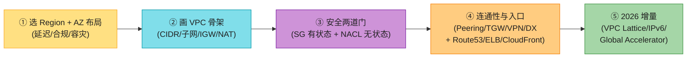

> 💡 **关键信号词**:**"VPC = 你在 AWS 圈的地"** + **"公有子网和私有子网的本质区别就是路由表里有没有 0.0.0.0/0 → IGW 这条路由"** + **"安全组有状态、NACL 无状态"** + **"VPC Peering 不能传递(A→B,B→C,A 不能到 C),要传递就用 Transit Gateway"**——这四句直接拿下面试。

---

## 🗺️ 章节概览

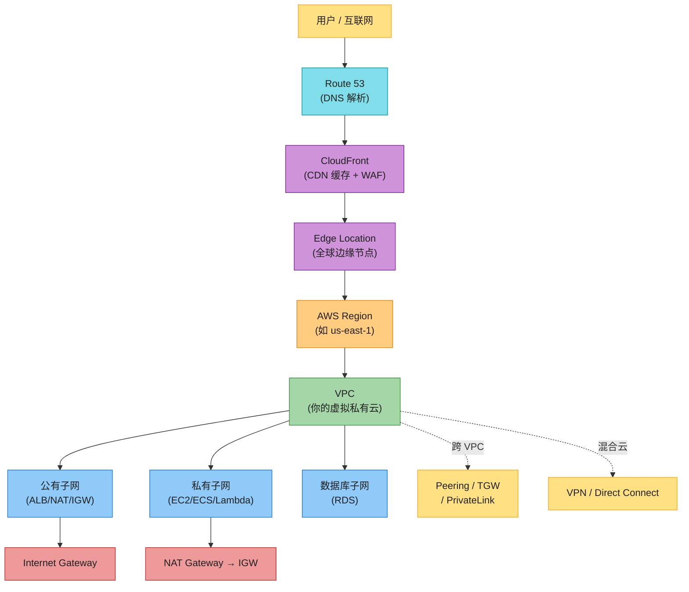

| 小节 | 要点 | 重要性 |
|------|------|--------|
| **AWS 云基础** | 账号/多账号/Region/AZ/Local Zone/Edge Location/共享责任 | ⭐⭐⭐⭐ |
| **IP 寻址基础(非科班!)** | IPv4 结构/子网掩码/CIDR/ABC 类/私有 IP/IPv6 | ⭐⭐⭐⭐⭐ |
| **Amazon VPC** | VPC/子网(公有私有)/路由表/IGW/NAT/EIP | ⭐⭐⭐⭐⭐ |
| **安全组 vs NACL** | 有状态 vs 无状态,实例级 vs 子网级 | ⭐⭐⭐⭐⭐ |
| **VPC 连通性** | Peering/TGW/PrivateLink/VPN/Direct Connect | ⭐⭐⭐⭐ |
| **Route 53** | DNS 原理 + 路由策略(简单/加权/延迟/故障转移/地理/多值) | ⭐⭐⭐⭐ |
| **ELB 四兄弟** | CLB/ALB/NLB/GWLB 对比 + 适用场景 | ⭐⭐⭐⭐⭐ |
| **API Gateway** | REST/HTTP/WebSocket + 限流/认证/缓存 | ⭐⭐⭐⭐ |
| **CloudFront** | CDN 概念 + Edge Location + 签名 URL | ⭐⭐⭐⭐ |
| **AWS WAF** | 应用层防火墙,SQL 注入/XSS 防护 | ⭐⭐⭐ |
| **贯穿案例** | Cafe Delhi Heights 餐厅连锁上线外卖 | ⭐⭐⭐⭐ |
| **2026 增量(补)** | VPC Lattice/IPv6/边缘计算两层/Cloud WAN/Global Accelerator | ⭐⭐⭐⭐⭐ |

---

## 🧱 基础概念铺垫(给非科班读者)⭐⭐⭐⭐⭐

> 💡 **为什么要加这一节**:原书假设读者已经懂"IP 地址""子网""DNS""CDN""负载均衡"这些词。但你是**非计算机科班**的自学者,这些词可能第一次见。这一节用生活比喻把它们讲透,后面所有 AWS 服务才看得懂。**这是本章和原书最大的区别——原书跳过的基础,我们补上。**

### 0.1 什么是"云"?——从租服务器到租服务

**寄快递的比喻**:

想象你要寄一批货。两种方式:

- **自建机房(On-premises)**:你自己买一块地、盖仓库、雇保安、买叉车、交电费……前期投入巨大,而且仓库盖多了浪费、盖少了不够用。
- **云计算(Cloud)**:有个叫 **AWS** 的"超级仓库公司",它已经在全球盖好了几百个仓库,配好了保安和叉车。你**按需租用**:今天货多就多租一块,明天货少就退掉,**只为实际使用付费**。

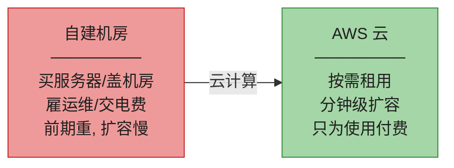

> 💡 **一句话**:**云 = 别人的服务器 + 按需租用 + 按量付费**。AWS 就是全球最大的"服务器房东"。

### 0.2 IP 地址——互联网的"门牌号"

寄快递要写收件地址,**网络里发数据也要写地址**,这个地址就是 **IP 地址**。

- 你在浏览器输入 `www.google.com`,其实背后是在请求一台服务器的 IP(比如 `142.251.46.174`)。
- 你手机连 WiFi,路由器会给你手机分一个 IP(比如 `192.168.1.10`),这样数据才知道往哪送。

**IP 地址长什么样**:

```
IPv4: 192.168.1.10   (4 段数字,每段 0-255,共约 43 亿个)
IPv6: 2001:0db8:85a3:0000:0000:8a2e:0370:7334  (8 组十六进制,多得用不完)
```

> 🪤 **为什么有 IPv6?** —— 因为 IPv4 只有 43 亿个地址,**全球设备早就超过这个数了**(手机、电脑、IoT、智能手表……),地址不够分。IPv6 有 2^128 个(约 3.4×10^38),**给地球每粒沙子分一个都够**。但 IPv4 用了 40 年,迁移很慢,所以现在大多数系统**双栈(IPv4 + IPv6)并行**。

### 0.3 子网与子网掩码——"大楼"里分"楼层"

**餐厅比喻**:Cafe Delhi Heights 是一栋大楼(整个网络),里面分**一楼大堂**(公有,顾客能进)、**二楼厨房**(私有,只有员工能进)、**三楼办公室**(私有,只有经理能进)。**子网就是把一个大网络切成几个小网络**,每个小网络用途不同。

**怎么切?** 用**子网掩码(subnet mask)**告诉网络:"这部分是'楼号'(网络 ID),剩下是'房间号'(主机 ID)"。

```
IP 地址:    192.168.1.10
子网掩码:   255.255.255.0
含义:       192.168.1 是"楼号"(网络),.10 是"房间号"(主机)
这一栋楼最多 254 个房间(主机)
```

**CIDR 写法**(把掩码压缩成一个数字,后面会详讲):

```
192.168.1.10/24  ← "/24" 表示前 24 位是网络 ID(=掩码 255.255.255.0)
```

> 💡 **为什么子网这么重要?** —— 因为 AWS 的 VPC 就是**靠子网划分公有/私有区域的**,搞不懂子网就搞不懂 VPC。后面会详讲。

### 0.4 DNS——互联网的"电话簿"

**问题**:人脑记得住 `www.google.com`,记不住 `142.251.46.174`。但网络只认 IP。

**解决**:**DNS(Domain Name System,域名系统)** = 一本自动电话簿,**你输入名字(域名),它告诉你对应的 IP**。

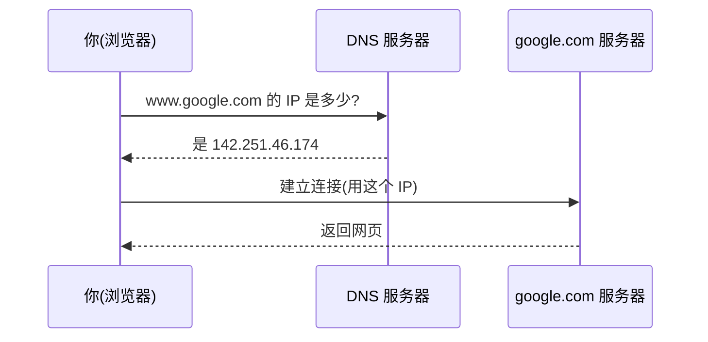

> 💡 **AWS 的 DNS 服务叫 Route 53**(因为 DNS 用 53 端口)。后面会详讲它怎么"智能指路"。

### 0.5 CDN——"快递前置仓"

**问题**:你的服务器在孟买,北京用户访问,数据要跨半个地球,慢。

**解决**:**CDN(Content Delivery Network,内容分发网络)** = 在全球放一堆"前置仓",**把热门内容(图片、视频、网页)提前缓存到离用户最近的仓**,用户访问时从本地仓取,不用跨地球。

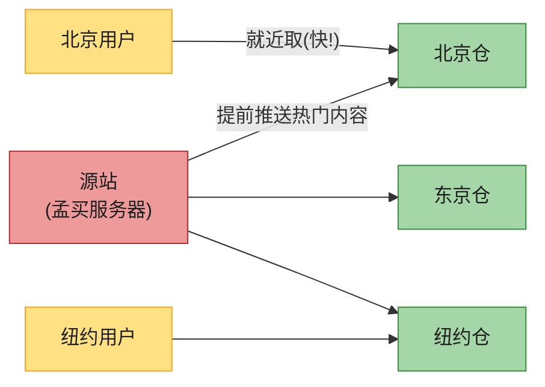

> 💡 **AWS 的 CDN 叫 CloudFront**,这些"前置仓"叫 **Edge Location(边缘节点)**。Netflix 能全球同步看高清就靠 CDN。

### 0.6 负载均衡——餐厅"排号员"

**问题**:一家餐厅只有 1 个服务员,100 个顾客排队,服务不过来。多雇几个服务员,但谁该找哪个服务员?

**解决**:**负载均衡器(Load Balancer, LB)** = 一个站在门口的"排号员",**把顾客(请求)均匀分给几个服务员(服务器)**,某个服务员生病(宕机)了就不再分给他。

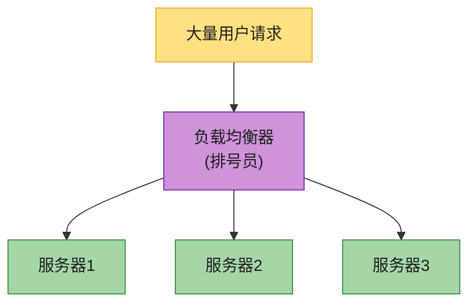

> 💡 **AWS 的负载均衡服务叫 ELB(Elastic Load Balancer)**,有 ALB/NLB/CLB/GWLB 四种,后面详讲。负载均衡的通用原理在 **aws_05** 和 **aws_06** 已讲过,本章只讲 AWS 怎么落地。

---

## 1. AWS 云的物理与逻辑结构

> 📝 **和 aws_06 的区别**:aws_06 讲"网络协议怎么工作",本章讲"AWS 这家公司把服务器放在哪、怎么卖给你"。

### 1.1 AWS 账号与多账号策略

要用 AWS,先注册一个 **AWS 账号(Account)**——它是你所有云资源的"户口本",管计费、权限、资源。

**一个公司要开几个账号?** 原书给了三种策略:

| 策略 | 做法 | 优点 | 缺点 |
|------|------|------|------|
| **每个应用一个账号** | 新应用开新账号 | 完全隔离,成本清晰 | 运营成本高(账号太多) |
| **按业务线分账号** | 出租车业务一个账号、支付一个、分析一个 | 相关应用聚集,延迟低 | 跨账号通信要额外配置 |
| **按职能分账号** | 网络账号、监控账号、存储账号、安全账号 | 职责清晰,网络团队管网络账号 | 跨账号协作复杂 |

**AWS 推荐多账号**,理由是**职责分离 + 未来扩展**。AWS 提供 **Landing Zone** 服务搭多账号基线(含 IAM、治理、数据安全、网络设计、日志),可以用 **AWS Control Tower**(托管版)一键开标准化新账号。

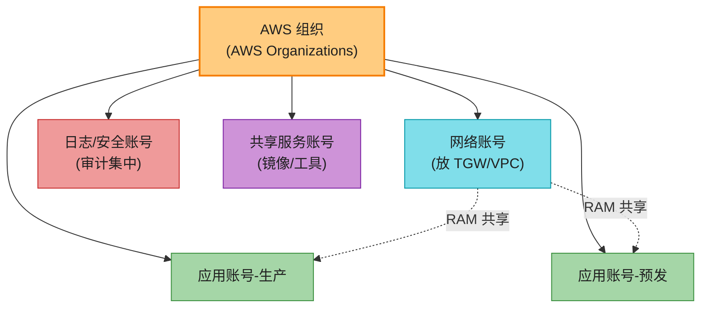

> 💡 **Control Tower = AWS 的"多账号工厂"**,2026 已经是中大型公司的标配。后面 2026 增量会讲它和 Cloud WAN 怎么配合做"全球骨干网即代码"。

### 1.2 Region(区域)——AWS 的"城市"

AWS 在全球设了几十个 **Region(区域)**,比如:

- `us-east-1`(美国弗吉尼亚北部)—— 最老最大,新功能首发地
- `ap-south-1`(印度孟买)
- `ap-northeast-1`(日本东京)
- `cn-north-1`(北京)—— 中国区,由光环新网/西云数据运营

**每个 Region 是独立的地理区域**,互相隔离。你选 Region 要考虑:

1. **延迟**:离用户越近越好(中国用户选东京/北京,美国用户选弗吉尼亚)。
2. **合规**:某些数据法律规定必须存本国(欧盟 GDPR、中国数据安全法)。
3. **服务可用**:不是所有 Region 都有所有服务(新服务通常先上 us-east-1)。
4. **价格**:不同 Region 价格不同(us-east-1 通常最便宜)。

> 🪤 **追问陷阱**:"为什么不直接全球只开一个 Region?" → 因为① **单 Region 挂了全挂**(整个数据中心集群故障,虽然罕见,但 Netflix/银行不能冒这险);② **跨大洋延迟**(美东用户连孟买,RTT 250ms+,用户体验差)。所以**多 Region 部署 = 真正的全球高可用**(如 Netflix 部署 3 个 Region)。

> 📝 **注意**:**有些服务是"全球服务"**,如 IAM、Route 53、CloudFront——它们不依赖具体 Region,全球统一管理。

### 1.3 Availability Zone(可用区)——AWS 的"街区"

一个 Region 内部还分成多个 **Availability Zone(AZ,可用区)**,比如 `us-east-1a`、`us-east-1b`、`us-east-1c`……

**AZ 是什么**:

- **一个 AZ = 一个或几个相邻的数据中心**,有独立的电、空调、网络。
- AZ 之间**物理隔离**(相隔几公里,避免一场火灾/洪水同时打掉),但**用低延迟光纤互联**(同 Region 内 AZ 间 RTT 通常 < 2ms)。
- 设计目的:**容灾**。一个 AZ 挂了,其他 AZ 的服务器继续服务。

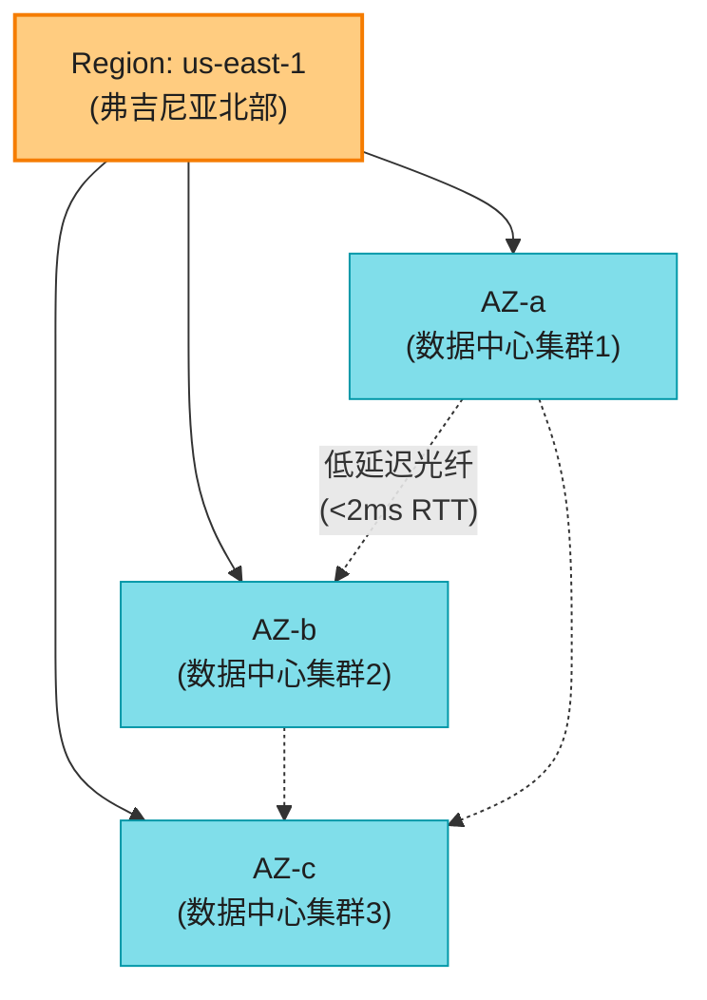

> 🪤 **追问陷阱(高频)**:"Region 和 AZ 的区别?" → **Region 是地理区域(如东京),相距远(几千公里),用公网或专线连,延迟高(50-250ms);AZ 是 Region 内的独立数据中心,相距近(几公里),用低延迟光纤连(<2ms)**。所以**多 AZ 容灾便宜(同 Region),多 Region 容灾贵但抗 Region 级故障**。

> ⚠️ **一个坑**:`us-east-1a` 对你和对你朋友**可能是不同的物理 AZ**!AWS 故意把 AZ 字母**按账号随机映射**,避免所有客户都挤到同一个 AZ。所以**不要假设 `1a` 是某个固定机房**。

### 1.4 Local Zone / Wavelength / Outposts——把云"塞"到你家门口

原书重点讲了 **Local Zone**,2026 又有 **Wavelength** 和 **Outposts** 两个兄弟。**三者都是"把 AWS 能力延伸到 Region 之外"**:

| 服务 | 是什么 | 解决什么 | 典型场景 |
|------|--------|----------|----------|
| **Local Zone** | 大城市里的小型 AWS 站点(如洛杉矶、达拉斯、布宜诺斯艾利斯) | 离最近 Region 太远,延迟太高 | 视频渲染、游戏、广告投放(要个位数 ms) |
| **Wavelength** | 部署在 **5G 运营商机房**的 AWS 边缘 | 5G 手机延迟要极低 | AR/VR、车联网、云游戏(5G 边缘) |
| **Outposts** | **把 AWS 机柜物理搬到你自己机房** | 数据必须留本地 / 延迟要极低 / 法规 | 银行核心系统、工厂产线、本地数据合规 |

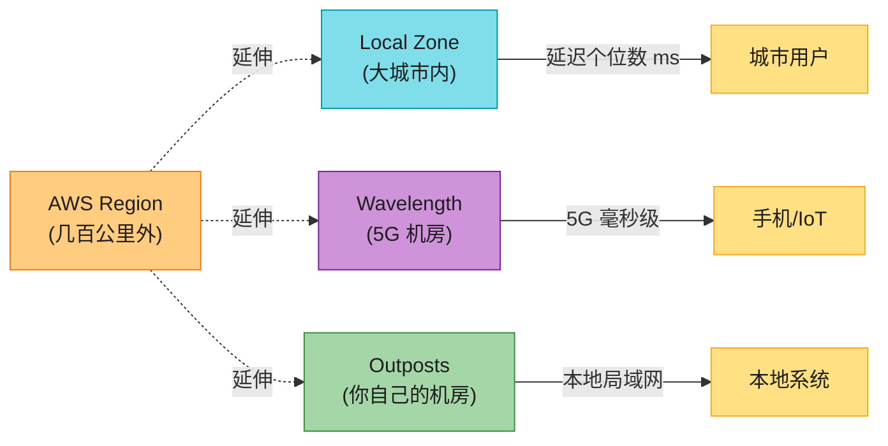

**原书场景**(Local Zone):你在新德里创业,要个位数 ms 延迟,但最近 Region 是孟买(延迟太高)→ 用 **德里 Local Zone** 解决。

### 1.5 Edge Location——CDN 的"前置仓"

**Edge Location(边缘节点)** 是全球分布的小型 AWS 站点(比 Region 多得多,300+ 个),主要服务:

- **CloudFront(CDN)**:缓存内容,离用户近。
- **Route 53(DNS)**:就近解析域名。
- **AWS Shield**:DDoS 防护。

> 💡 **Edge Location vs Local Zone 的区别**(常被混):**Edge Location 只缓存/转发,不放你的服务器(无状态)**;**Local Zone 可以放 EC2/EBS(有状态,跑计算)**。Edge 比 Local Zone 多得多但功能少。

### 1.6 共享责任模型——谁管什么安全

AWS 安全是**双方共同负责**:

| 层 | 谁负责 | 比喻 |
|----|--------|------|
| **云本身的安全(Security OF the cloud)** | **AWS** | 物理机房、电、网络、硬件、虚拟化层、托管服务的底层 |
| **云里的安全(Security IN the cloud)** | **你(客户)** | 你存的数据、IAM 账号密码、安全组规则、加密设置、应用代码 |

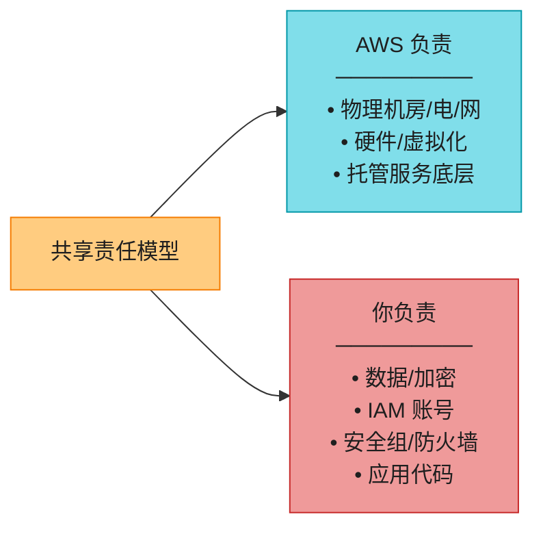

> 🪤 **追问陷阱**:"安全是 AWS 管还是我管?" → **分两层:AWS 管'云本身'(物理/硬件/虚拟化),你管'云里'(数据/账号/规则/应用)**。**IaaS(如 EC2)你管得多,PaaS/SaaS(如 DynamoDB)AWS 管得多**。

---

## 2. IP 寻址与子网(非科班重点讲!)⭐⭐⭐⭐⭐

> 💡 这一节原书讲得很简略,但对非科班读者**最关键**——搞不懂 IP 和子网,后面 VPC 章节全是天书。我们讲透。

### 2.1 IPv4 地址结构

**IPv4 是 32 位地址**,分成 **4 段(octet)**,每段 8 位(0-255),用点分隔:

```
192.168.1.10
└─┬┘ └─┬┘ └┬┘ └┬┘
 1段  2段  3段 4段
```

每段在二进制是 8 个 bit:`192 = 11000000`。整个 IP 是 32 个 bit,所以总共 **2^32 ≈ 43 亿**个地址。

**两部分组成(关键!)**:

一个 IP = **网络 ID(Network ID)+ 主机 ID(Host ID)**。

| 比喻 | 网络 ID | 主机 ID |
|------|---------|---------|
| 寄信 | 邮编/城市 | 门牌号 |
| 餐厅 | 哪家餐厅(Cafe Delhi Heights) | 哪桌(21 号桌) |
| 办公室 | 哪栋楼 | 哪个工位 |

**网络 ID 决定"数据送到哪栋楼",主机 ID 决定"送到楼里哪台机器"**。

### 2.2 IP 地址分类(A/B/C/D/E 类)

历史上按网络 ID 和主机 ID 的位数,IPv4 分成 5 类:

| 类 | 范围 | 网络 ID 位 | 主机 ID 位 | 网络数 | 每网络主机数 | 典型用途 |
|----|------|-----------|-----------|--------|-------------|----------|
| **A** | 1.0.0.0 – 127.255.255.255 | 8 位 | 24 位 | 126 | 1600 万 | 超大型组织(军方/电信) |
| **B** | 128.0.0.0 – 191.255.255.255 | 16 位 | 16 位 | 1.6 万 | 6.5 万 | 大型企业/大学 |
| **C** | 192.0.0.0 – 223.255.255.255 | 24 位 | 8 位 | 200 万 | 254 | 小公司/家庭网络 |
| D | 224.0.0.0 – 239.255.255.255 | — | — | — | — | 组播(多播) |
| E | 240.0.0.0 – 255.255.255.255 | — | — | — | — | 保留研究 |

> 💡 **家庭网络 99% 是 C 类的 `192.168.x.x`**,因为家用就几台设备,254 个槽位足够。

### 2.3 子网掩码(Subnet Mask)——怎么切"楼"和"房间"

**子网掩码**是一个 32 位数字,**告诉网络哪几位是网络 ID(用 1 标记),哪几位是主机 ID(用 0 标记)**。

```
IP 地址:    192.168.1.10
二进制:     11000000.10101000.00000001.00001010
子网掩码:   255.255.255.0
二进制:     11111111.11111111.11111111.00000000
                                      ↑↑↑↑↑↑↑↑ 这 8 位是主机 ID
            └──────── 前 24 位是网络 ID ──────┘
```

**所以 `192.168.1.10` 在 `192.168.1.0` 这个网络里,它是第 10 号主机。**

### 2.4 CIDR——把掩码压缩成一个数字

每次写 `255.255.255.0` 太啰嗦,工程师发明了 **CIDR(Classless Inter-Domain Routing,无类别域间路由)**:把掩码的"1 的个数"写在 IP 后面,用斜杠分隔:

```
192.168.1.0/24   ←  /24 表示前 24 位是网络 ID(等价于掩码 255.255.255.0)
```

**常用 CIDR 对照表(背)**:

| CIDR | 子网掩码 | 主机数(可用) | 用途举例 |
|------|---------|--------------|----------|
| /16 | 255.255.0.0 | 65534 | 一个 VPC 的总地址池 |
| /20 | 255.255.240.0 | 4094 | 大子网 |
| /24 | 255.255.255.0 | 254 | 一个普通子网 |
| /28 | 255.255.255.240 | 14 | 小子网(如管理网) |

**关键公式**:**主机数 = 2^(32-CIDR位数) − 2**(减 2 因为网络地址和广播地址保留)。

> 💡 **VPC 的 CIDR 范围**:AWS 允许 VPC 用 `/16` 到 `/28`。一个 `/16` 的 VPC 有 65534 个地址,够大多数公司用。

### 2.5 为什么需要子网划分?

**不划分子网的问题**:整个公司一个网,所有设备直接互通,**没法做隔离**(财务数据库和前台电脑同一网段,不安全)。

**划分子网的好处**:

1. **隔离**:不同子网可以不同安全策略(厨房 vs 大堂)。
2. **分 AZ 容灾**:每个 AZ 一个子网,某 AZ 挂了其他 AZ 还在。
3. **管理清晰**:按用途分网(应用子网、数据库子网、管理子网)。

**AWS 里子网的特殊点**:

- **每个子网必须且只能属于一个 AZ**(子网不能跨 AZ)。
- **每个子网有自己的 CIDR**(必须从 VPC CIDR 里切,且子网间不能重叠)。
- **AWS 会保留每个子网的前 4 个和最后 1 个 IP**(共 5 个)做特殊用途,不能用。比如 `/28`(16 个地址)实际可用只有 11 个。

### 2.6 VLSM(可变长子网掩码)

**VLSM(Variable Length Subnet Masking)** = 不同子网用不同长度掩码。比如:

- 应用子网(机器多):`10.0.1.0/24`(254 台)
- 数据库子网(机器少):`10.0.2.0/28`(14 台)
- 管理子网(更少):`10.0.3.0/28`(14 台)

**好处**:地址不浪费。如果都用 `/24`,数据库子网只放 2 台 RDS 却占了 254 个地址,浪费。

### 2.7 公有 IP vs 私有 IP

**公有 IP(Public IP)**:整个互联网唯一,**能被互联网直接访问**。由 ISP/地区注册机构分配,数量稀缺(要花钱)。

**私有 IP(Private IP)**:**只在局域网内有效**,互联网不能直接访问。三段保留地址(任何人都能用,免费):

| 类 | 私有范围 |
|----|---------|
| A | 10.0.0.0 – 10.255.255.255 |
| B | 172.16.0.0 – 172.31.255.255 |
| C | 192.168.0.0 – 192.168.255.255 |

> 💡 **家里路由器分给你的 IP 一定是 `192.168.x.x` 或 `10.x.x.x`**,这是私有 IP。你在浏览器搜"我的 IP"看到的是路由器的**公有 IP**(ISP 给的)。所有家庭设备共享一个公有 IP,靠 **NAT**(后面讲)区分。

**AWS 里的用法**:

- **VPC 内部用私有 IP**(免费,推荐用 RFC 1918 的私有段)。
- **要被互联网访问的资源(如 ALB)需要公有 IP**。
- **私有子网里的 EC2 用私有 IP,通过 NAT 借一个公有 IP 出网**。

### 2.8 IPv6 简介

**IPv6 = 128 位地址**,写成 8 组十六进制:

```
2001:0db8:85a3:0000:0000:8a2e:0370:7334
```

**结构**:

| 部分 | 含义 |
|------|------|
| 站点前缀(Site Prefix) | ISP/注册机构分配的公共拓扑 |
| 子网 ID(Subnet ID) | 内部网络划分 |
| 接口 ID(Interface ID) | 设备唯一标识(常从 MAC 地址生成,EUI-64) |

**AWS 的 IPv6**:

- AWS 给 VPC 分配 `/56` 的 IPv6 段(可切 256 个 `/64` 子网)。
- **2026 趋势**:AWS 新建 VPC 默认带 IPv6(详见 2026 增量)。

---

## 3. Amazon VPC(虚拟私有云)⭐⭐⭐⭐⭐

### 3.1 VPC 是什么 & 为什么需要它

**VPC(Virtual Private Cloud,虚拟私有云)** = **你在 AWS 里圈的一块专属虚拟网络**,自己定 IP 段、划子网、配路由、设防火墙,**逻辑上完全隔离**,就像你自己的私有数据中心。

**餐厅比喻**(贯穿案例):

- AWS 整个云 = 一座商业大厦(很多公司租)。
- **你的 VPC = 你租的一整层**,只有你的员工能进(隔离)。
- 你可以在这一层里**自由隔间**(子网):大堂区(公有)、厨房(私有)、办公室(私有)。

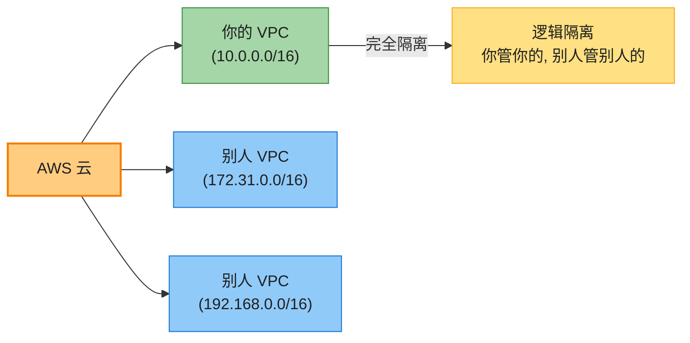

**VPC 的核心能力**:

1. **选 IP 段**(CIDR)。
2. **划子网**(Subnet)。
3. **配路由**(Route Table)。
4. **设网关**(IGW/NAT)。
5. **设防火墙**(SG/NACL)。
6. **跑资源**(EC2/RDS/ELB/Lambda……)。

> 🪤 **默认 VPC**:每个 AWS 账号在每个 Region 自动有一个 **default VPC**(预配好公有子网 + IGW),方便新手直接用。**但生产环境强烈建议自建 VPC**(默认 VPC 太开放,不安全)。

> ⚠️ **限额**:默认每个账号每个 Region 最多 5 个 VPC(可申请上调)。

### 3.2 创建 VPC 的关键决策

创建 VPC 时要填:

| 输入 | 说明 | 注意 |
|------|------|------|
| **IPv4 CIDR** | VPC 的 IP 段,**必填** | 用 RFC 1918 私有段(如 `10.0.0.0/16`);范围 `/16`–`/28` |
| **IPv6 CIDR** | 可选,双栈 | AWS 分配 `/56` |
| **Tenancy(租户模式)** | 共享 or 专属硬件 | 见下 |

**Tenancy(租户模式)**——餐厅比喻:

- **Shared tenancy(共享)**:你订一桌,别的桌还有别的客人(默认,便宜)。
- **Dedicated tenancy(专属)**:你包下整个餐厅,不让别人进(贵,适合合规/机密)。

> 💡 **99% 的场景用 Shared**。除非有强合规要求(金融/医疗),才用 Dedicated。

**关键约束**:

- **CIDR 一旦创建不能改大小**(只能加附加 CIDR,但要比主 CIDR 小)。
- **VPC CIDR 不能和其他 VPC 重叠**(否则 Peering/Direct Connect 冲突)。
- **要规划未来**:CIDR 太小以后扩不动;保守起见选大一点的 `/16`。

### 3.3 子网(Subnet)——VPC 的"隔间"

**子网 = VPC CIDR 里的一个子段,且必须属于某一个 AZ**。

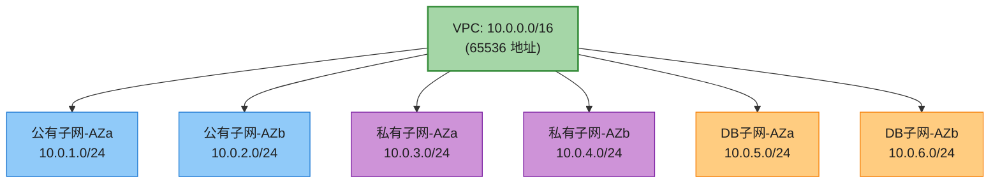

**公有子网 vs 私有子网**——本质区别**就在路由表**:

| 子网类型 | 路由表里的关键路由 | 能不能从互联网直接进 | 典型用途 |
|---------|------------------|-------------------|----------|
| **公有子网** | 有 `0.0.0.0/0 → IGW` | **能**(配公有 IP 时) | ALB、堡垒机、NAT Gateway |
| **私有子网** | 没有 `0.0.0.0/0 → IGW` | **不能** | EC2/ECS 应用、RDS 数据库 |

> 🪤 **超高频追问陷阱**:"公有子网和私有子网的本质区别是什么?" → **不是 IP 段,不是有没有公有 IP,而是路由表里有没有一条 `0.0.0.0/0 → IGW` 的路由**!一个子网即使给 EC2 配了公有 IP,只要路由表不指向 IGW,它还是私有子网(没法对外通信)。

**子网最佳实践**:

1. **多 AZ 容灾**:每类子网至少跨 2-3 个 AZ。
2. **按用途隔离**:应用、数据库、管理分开子网。
3. **公有/私有分离**:对外服务放公有,内部放私有。

### 3.4 路由表(Route Table)——网络的"导航地图"

**路由表** = 一张规则表,**告诉数据包"要去这个目的,走这条路"**。

每条路由有两列:

| 目的地(Destination) | 目标(Target) |
|---------------------|--------------|
| `10.0.0.0/16` | `local`(本 VPC 内,默认) |
| `0.0.0.0/0` | `igw-xxx`(互联网,走 IGW) |

**两种路由表**:

- **主路由表(Main Route Table)**:VPC 自带,**不能删**,默认只含 `local` 路由(VPC 内互通)。每个子网默认关联它。
- **自定义路由表(Custom Route Table)**:你创建的,可以删,可关联到任意子网。

**典型公有子网路由表**:

| 目的地 | 目标 | 说明 |
|--------|------|------|
| `10.0.0.0/16` | `local` | VPC 内互通 |
| `0.0.0.0/0` | `igw-xxx` | 出互联网 |

**典型私有子网路由表**:

| 目的地 | 目标 | 说明 |
|--------|------|------|
| `10.0.0.0/16` | `local` | VPC 内互通 |
| `0.0.0.0/0` | `nat-xxx` | 出互联网,走 NAT(不能被外部主动连) |

### 3.5 Internet Gateway(IGW)——VPC 的"大门"

**IGW** = VPC 连接互联网的"大门",**高度可用、水平扩展**,横跨多 AZ。

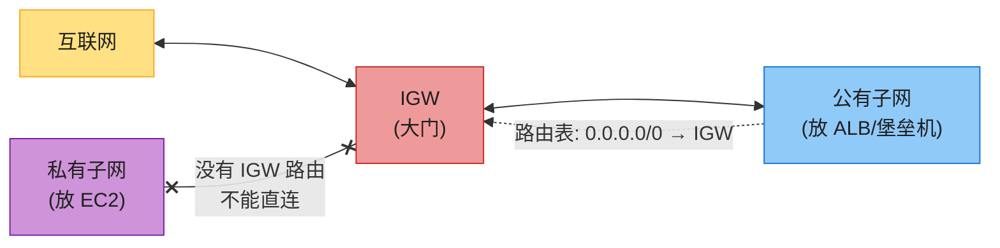

**IGW 关键点**:

- **只服务公有子网**(路由表指向它的子网)。
- **双向**:互联网 → VPC(给公有 IP 资源),VPC → 互联网。
- **自带 NAT**:对有公有 IP 的实例做地址转换。
- **无状态**:每个包独立按路由/安全规则评估。
- **免费**(按流量计费,无固定费)。

### 3.6 NAT Gateway——私有子网的"代购员"

**问题**:私有子网的 EC2 要下载补丁、访问外部 API,但它没有公有 IP,不能直接出互联网。怎么办?

**解决**:**NAT(Network Address Translation,网络地址转换)Gateway** = 私有子网的"代购员",**它有一个公有 IP,代替私有子网的机器去互联网拿数据,再把结果转回去**。外部只能看到 NAT 的 IP,看不到私有机器的 IP。

**餐厅比喻**(原书):厨房的厨师不能直接和顾客说话(私有子网不能直连外网),只有**主厨(NAT)**可以和顾客(互联网)交流。厨师想问顾客反馈,通过主厨转达。

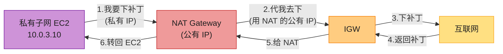

**NAT Gateway 关键点**:

- **要绑一个 Elastic IP(静态公有 IP)**。
- **不能被外部主动连**(只允许"出"的连接)。
- **要放在公有子网**(因为它要连 IGW)。
- **高可用要按 AZ 部署**(每个 AZ 一个 NAT,避免单 AZ 挂)。
- **收费**(按小时 + 按处理数据量,比 IGW 贵很多)。
- 支持 TCP/UDP/ICMP。

**NAT Gateway vs NAT Instance**:

| 维度 | NAT Gateway(托管) | NAT Instance(自建 EC2) |
|------|-------------------|----------------------|
| 管理 | AWS 全托管,自动扩容 | 你自己管(打补丁/扩容) |
| 带宽 | 最高 100 Gbps | 受 EC2 实例类型限制 |
| 可用性 | 多 AZ 高可用(单 AZ 内多实例) | 单点(除非自己做 HA) |
| 价格 | 贵(按小时 + 数据量) | 便宜(只算 EC2 费) |
| **2026 推荐** | **✅ 默认选择** | ❌ 已基本不用 |

> 🪤 **追问陷阱**:"NAT Gateway 和 NAT Instance 怎么选?" → **2026 几乎无脑选 NAT Gateway**(托管、高带宽、高可用),NAT Instance 是历史遗留,只在小成本实验环境用。

### 3.7 Elastic IP——固定不变的公有 IP

**Elastic IP(EIP)** = **一个固定不变的公有 IPv4 地址,绑定到你的 AWS 账号**。

**为什么需要**:普通 EC2 的公有 IP **重启会变**。但有些场景要 IP 不变(如白名单、DNS 记录、对外提供服务的入口)。

**关键点**:

- **静态**(不会自己变)。
- **区域级**(美东买的 EIP 只能在美东用)。
- **收费**——尤其**绑定到停止的 EC2 会额外收费**(防止囤 IP)。

> 💡 **用法**:绑给 NAT Gateway、堡垒机、需要固定 IP 的服务。

### 3.8 安全组(SG)vs 网络 ACL(NACL)⭐⭐⭐⭐⭐

这是 **AWS 网络安全的两道门**,面试**必问对比**。

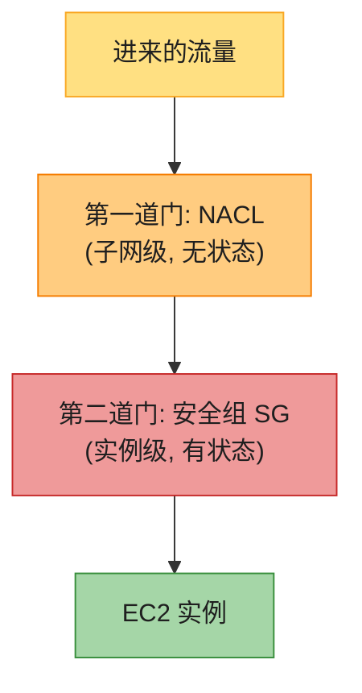

**安全组(Security Group,SG)**:

- **绑在实例(EC2/ENI)上**。
- **有状态(stateful)**:允许进,自动允许出(不用反向规则)。
- **只允许(allow)规则**,**没有 deny**(没匹配的全默认拒绝)。
- **所有规则都评估**(不按顺序)。
- 一个实例可绑多个 SG(取并集)。

**NACL(Network ACL)**:

- **绑在子网上**(整个子网的所有实例都过这个 NACL)。
- **无状态(stateless)**:允许进,不自动允许出(必须反向规则)。
- **有 allow 也有 deny**。
- **按规则号顺序评估**(命中即停)。
- 每个 VPC 自带一个 default NACL(允许所有)。

**对比表(背)**:

| 维度 | 安全组 SG | 网络 ACL NACL |
|------|----------|--------------|
| **层级** | 实例级(ENI) | 子网级 |
| **状态** | **有状态**(允许进自动允许出) | **无状态**(进出要分别配) |
| **规则** | 只 allow | allow + deny |
| **评估** | 全部评估(无序) | 按规则号顺序(命中即停) |
| **返回流量** | 自动放行 | 需要显式规则放行 |
| **默认** | 拒绝所有,默认 SG 允许出 | default NACL 允许所有 |
| **改了立即生效?** | 是 | 是 |
| **比喻** | 餐厅服务员(只让熟人进,出随便) | 餐厅大门保安(进要查,出也要查) |

**餐厅比喻**(原书):

- 你能进 Cafe Delhi Heights 的厨房(NACL 允许你进厨房),但厨房里的某个厨师(SG)可能不搭理你(SG 拒绝)。**两道门都要过**。

> 🪤 **超高频追问**:"安全组和 NACL 区别?" → **① SG 实例级 / NACL 子网级;② SG 有状态(允许进自动允许出)/ NACL 无状态(进出要分别配);③ SG 只能 allow / NACL 有 allow 和 deny;④ SG 全部规则评估 / NACL 按号顺序命中即停**。**实际用 SG 居多,NACL 一般用默认(允许所有),只在需要 IP 级 deny 时才配 NACL**。

**SG 示例规则**:

| 类型 | 协议 | 端口 | 源 | 描述 |
|------|------|------|----|----|
| SSH | TCP | 22 | `117.212.92.68/32` | 只允许你的 IP SSH |
| HTTP | TCP | 80 | `0.0.0.0/0` | 任何人访问网页 |
| HTTPS | TCP | 443 | `0.0.0.0/0` | 任何人访问加密网页 |

**NACL 示例规则(注意顺序)**:

| 规则号 | 类型 | 协议 | 端口 | 源 | Allow/Deny |
|--------|------|------|------|----|----|
| 100 | All | All | All | `10.0.0.0/16` | Allow |
| 110 | HTTP | TCP | 80 | `0.0.0.0/0` | Allow |
| 120 | HTTPS | TCP | 443 | `0.0.0.0/0` | Allow |
| * | All | All | All | `0.0.0.0/0` | **Deny**(默认) |

> ⚠️ **NACL 无状态的坑**:如果允许进 80 端口,**还必须配对应的出站临时端口范围(1024-65535)**,否则返回流量被挡!这是 NACL 最容易踩的坑。

---

## 4. VPC 连通性(跨 VPC / 混合云)

一个公司常有多个 VPC(不同环境/不同账号),还要连本地机房。AWS 提供一组连通方案。

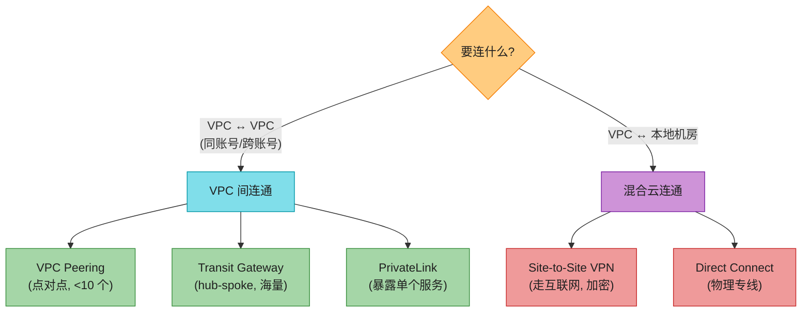

### 4.1 VPC Peering——点对点直连

**VPC Peering** = 两个 VPC 直接私有网络互通,**流量走 AWS 内网,不走互联网**。

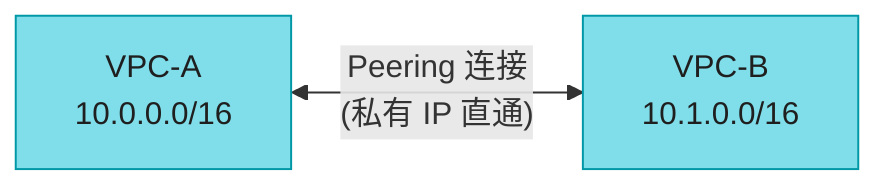

**特点**:

- **多对多(many-to-many)**:一个 VPC 可和很多 VPC 互 peering。
- **双向**:两个方向都能通。
- **不传递(non-transitive)**:**A↔B,B↔C,不代表 A↔C**!A 想连 C 必须单独建 A↔C peering。
- **CIDR 不能重叠**。
- **只按数据传输量收费**(无固定费)。

> 🪤 **超高频追问陷阱**:"VPC Peering 的限制?" → **不能传递(A↔B,B↔C,A 不能到 C)**!这是它最大的痛点。所以 **VPC 多了(>10)Peering 就成蜘蛛网,该用 Transit Gateway**。

### 4.2 Transit Gateway(TGW)——hub-spoke 总线

**Transit Gateway** = **一个中心化路由器**,所有 VPC、VPN、Direct Connect 都连到它,**hub-and-spoke(中心辐射)模型**,统一管理。

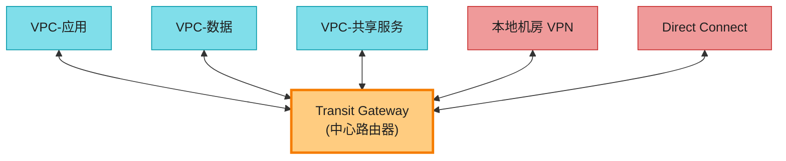

**和 Peering 对比**:

| 维度 | VPC Peering | Transit Gateway |
|------|------------|----------------|
| 拓扑 | 点对点(网状) | hub-spoke(星形) |
| 规模 | <10 个 VPC | **几千个 VPC** |
| 管理复杂度 | O(n²)(指数涨) | O(n)(线性) |
| 传递性 | ❌ 不传递 | ✅ 中心路由,自然传递 |
| 成本 | 低(只数据费) | 中(有固定费 + 数据费) |
| 延迟 | 点对点直连最低 | 多一跳(经 TGW) |

> 💡 **选型经验**:**<5 个 VPC 用 Peering,>10 个或要连本地机房用 TGW**。中大型公司几乎都用 TGW。

> 💡 **最佳实践**:TGW 放在**独立的"网络账号"**,由网络团队统一管,通过 **RAM(Resource Access Manager)** 共享给其他账号。

### 4.3 AWS PrivateLink——暴露单个服务(不暴露整个 VPC)

**PrivateLink** = **把某个服务(VPC 里的)私有暴露给别的 VPC/账号**,流量走 AWS 内网,**只单向(消费者 → 提供者)**。

**和 Peering 的区别**:

- Peering:**整个 VPC 双向互通**(像两家人随便串门)。
- PrivateLink:**只暴露一个服务,单向**(像你只点这家店的外卖,不能进他家厨房)。

**组成**:

- **服务提供者**:创建 **endpoint service**,挂一个 **NLB**(注意:不能用 ALB,ALB 不能直接挂 endpoint service)。
- **服务消费者**:创建 **VPC endpoint**,指定服务名,连过去。

**两种 endpoint**:

- **Interface Endpoint(接口端点)**:给你 VPC 里加一个 ENI(网卡),有个私有 IP,流量经它到目标服务。用于大部分 AWS 服务(S3 部分场景、API Gateway、Kinesis 等)和自定义服务。
- **Gateway Endpoint(网关端点)**:只在路由表加一条,**免费**,但**只支持 S3 和 DynamoDB**。

> 💡 **典型用法**:**SaaS 厂商把服务私有暴露给企业客户**(客户 VPC → 厂商 VPC,走 AWS 内网,不走公网,安全合规)。

### 4.4 Site-to-Site VPN——加密走互联网

**VPN** = **本地机房和 AWS VPC 之间,走互联网但加密的隧道**。

**三个组件**:

| 组件 | 说明 |
|------|------|
| **Customer Gateway** | 你机房端的设备(软件/硬件) |
| **VPN Connection** | 加密隧道(通常建 **2 条隧道**做高可用) |
| **Virtual Private Gateway(VGW)/ Transit Gateway** | AWS 端的网关 |

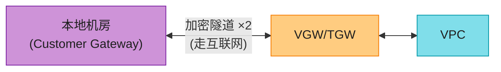

> 💡 **特点**:**便宜、快(几小时就能搭起来)、走互联网有抖动延迟、带宽有限(每隧道约 1.25 Gbps)**。

### 4.5 AWS Direct Connect(DX)——物理专线

**Direct Connect** = **从你机房到 AWS 的物理专线(光纤)**,**不走互联网,带宽稳定,延迟低**。

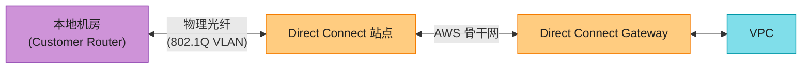

**三种虚拟接口(VIF)**:

| VIF | 连什么 |
|-----|--------|
| **Public VIF** | AWS 公有服务(S3)用公有 IP |
| **Private VIF** | VPC 里的资源用私有 IP |
| **Transit VIF** | 通过 TGW 连多个 VPC |

**和 VPN 对比**:

| 维度 | VPN | Direct Connect |
|------|-----|---------------|
| 走什么网络 | 互联网(加密) | 物理专线(不走互联网) |
| 带宽 | ~1.25 Gbps/隧道 | 1/10/100 Gbps |
| 延迟 | 不稳定(互联网抖动) | 稳定低延迟 |
| 价格 | 便宜 | 贵(要拉专线) |
| 上线时间 | 几小时 | 几周(要物理施工) |

> 🪤 **追问陷阱**:"Direct Connect 能替代 VPN 吗?" → **不能完全替代**。DX 走的是固定路径,**如果专线被挖断了就完全失联**;VPN 走互联网**有冗余**。**生产环境通常 DX 主 + VPN 备**(双路径容灾)。

---

## 5. Amazon Route 53(DNS)

### 5.1 DNS 是什么(再讲一遍,非科班重点)

**DNS(Domain Name System)= 互联网的电话簿**——把人类记得住的**域名**(`www.google.com`)翻译成机器认得的 **IP**(`142.251.46.174`)。

> 📝 **DNS 协议原理在 aws_06 第 6 节已讲透**,本章只讲 AWS 的 Route 53 怎么落地。

**为什么叫 Route 53**:DNS 协议用 **53 号端口**,所以叫 Route 53。

### 5.2 Route 53 能干什么

| 能力 | 说明 |
|------|------|
| **域名注册** | 在 Route 53 注册新域名,或把已有域名转过来管 |
| **DNS 路由** | 管理 DNS 记录,回答域名查询 |
| **健康检查** | 监控你的应用/web 服务器健康,不健康就切走流量 |
| **流量策略** | 按规则智能指路(加权/延迟/故障转移/地理……) |

**特点**:

- **Anycast 路由**:全球多个 Edge Location 同时应答,**就近 + 高可用**。
- **支持记录类型**:A、AAAA(IPv6)、CNAME、MX、TXT、PTR、SOA、SPF……
- **Alias 记录(Route 53 独有)**:把域名指向 AWS 资源(ALB/S3/CloudFront),**查询免费**(普通 CNAME 查询收费)。
- **记录存在 Hosted Zone(托管区)** 里。

### 5.3 DNS 解析流程

```mermaid
sequenceDiagram
    participant U as 用户浏览器
    participant R as Route 53
    participant W as Web 服务器
    U->>U: 输入 www.cafedelhiheights.com
    U->>R: 这个域名的 IP 是?(DNS 查询)
    R->>R: 查 Hosted Zone 记录
    R-->>U: 是 13.234.x.x(ALB 的 IP)
    U->>W: 建立连接(HTTP 请求)
    W-->>U: 返回网页
```

### 5.4 路由策略(Route 53 的精华)⭐⭐⭐⭐

**这是面试重点**——Route 53 不只是"查电话簿",还能**智能指路**:

| 策略 | 做什么 | 什么时候用 |
|------|--------|----------|
| **简单(Simple)** | 一个域名 → 一个 IP/资源 | 单一资源,无智能 |
| **加权(Weighted)** | 按权重分配流量(如 80%/20%) | A/B 测试、灰度发布、金丝雀 |
| **延迟(Latency)** | 把用户送到**延迟最低**的 Region | 全球多 Region,降延迟 |
| **故障转移(Failover)** | 主挂了自动切备 | 灾备(主-备架构) |
| **地理位置(Geo)** | 按用户**所在国家/地区**指路 | 合规(欧盟数据留欧盟)、本地化 |
| **多值 Answer(Multi-Value)** | 返回多个 IP(最多 8 个),客户端随机选 | 简单负载均衡(配合健康检查) |
| **IP-based(CIDR,2026)** | 按用户 IP 段指路 | 精细到 ISP/运营商级别 |

```mermaid
flowchart TD
    USER["用户"] --> R53["Route 53"]
    R53 -->|"加权"| W["A 80% → Region-1<br/>B 20% → Region-2<br/>(A/B 测试)"]
    R53 -->|"延迟"| L["测延迟, 送最近 Region"]
    R53 -->|"故障转移"| F["主挂了 → 切备"]
    R53 -->|"地理"| G["中国用户 → 北京<br/>美国用户 → 弗吉尼亚"]

    style USER fill:#FFE082,stroke:#F9A825,color:#1f1f1f
    style R53 fill:#80DEEA,stroke:#0097A7,color:#1f1f1f,stroke-width:2px
    style W fill:#A5D6A7,stroke:#388E3C,color:#1f1f1f
    style L fill:#CE93D8,stroke:#7B1FA2,color:#1f1f1f
    style F fill:#EF9A9A,stroke:#C62828,color:#1f1f1f
    style G fill:#FFCC80,stroke:#F57C00,color:#1f1f1f
```

> 🪤 **追问陷阱(高频)**:"加权路由和延迟路由什么时候用?" → **加权**用于**主动控制流量比例**(A/B 测试、灰度);**延迟**用于**让用户自动到最近 Region**(降延迟,你不知道也不控制具体比例)。

> 💡 **故障转移路由 + 健康检查 = 多 Region HA 标配**:主 Region 挂了,健康检查失败,Route 53 自动把流量切到备 Region。

---

## 6. AWS Elastic Load Balancer(ELB)⭐⭐⭐⭐⭐

> 📝 **负载均衡通用原理在 aws_05 已讲透,HTTP 协议在 aws_06 第 6 节讲过**。本章只讲 **AWS 的 ELB 四兄弟怎么选**。

### 6.1 ELB 是什么

**ELB(Elastic Load Balancer)**= AWS 托管的负载均衡服务,**自动把进来的流量分到多个目标(EC2/容器/IP/Lambda)**,**自动健康检查 + 自动扩容**。

**三大组件**(所有 ELB 共通):

| 组件 | 说明 |
|------|------|
| **Load Balancer(负载均衡器)** | 客户端看到的单一入口 |
| **Listener(监听器)** | 检查特定协议+端口的请求,按规则转发 |
| **Target Group(目标组)** | 一组目标(EC2/IP/Lambda),配健康检查和端口 |

### 6.2 四种 ELB 对比(背!)

| 维度 | CLB(经典) | ALB(应用) | NLB(网络) | GWLB(网关) |
|------|----------|----------|----------|-----------|
| **OSI 层** | L4 + L7 | **L7**(HTTP/HTTPS/gRPC) | **L4**(TCP/UDP/TLS) | L3 网关 + L4 LB |
| **协议** | HTTP/HTTPS/TCP/SSL | HTTP/HTTPS/gRPC/WebSocket | TCP/UDP/TLS | IP(所有协议) |
| **目标** | EC2 | EC2/IP/容器/**Lambda** | EC2/IP/容器/**ALB** | IP/实例(虚拟设备) |
| **路由** | 无 | 路径/主机/查询串/源 IP | 无(只按端口) | — |
| **静态 IP** | ❌ | ❌ | **✅**(每 AZ 一个) | ✅ |
| **PrivateLink** | ❌ | ❌ | **✅** | ✅ |
| **WAF 支持** | ❌ | **✅** | ❌ | ❌ |
| **延迟** | 中 | 中(要解 HTTP) | **极低** | 低 |
| **长连接** | 一般 | 一般 | **✅**(适合 WebSocket/游戏) | — |
| **2026 推荐** | ❌ 已不推荐新建 | **✅ Web API 首选** | **✅ 极低延迟/TCP 首选** | **✅ 安全设备专用** |

```mermaid
flowchart TD
    Q{"什么流量?"} -->|"HTTP/HTTPS<br/>Web API"| ALB["ALB<br/>(L7, 路径路由)"]
    Q -->|"TCP/UDP<br/>极低延迟/长连接"| NLB["NLB<br/>(L4, 静态 IP)"]
    Q -->|"需要虚拟设备<br/>(防火墙/IDS)"| GWLB["GWLB<br/>(插安全设备)"]
    Q -->|"老应用<br/>(历史遗留)"| CLB["CLB<br/>(已不推荐新建)"]

    style Q fill:#FFCC80,stroke:#F57C00,color:#1f1f1f
    style ALB fill:#A5D6A7,stroke:#388E3C,color:#1f1f1f
    style NLB fill:#80DEEA,stroke:#0097A7,color:#1f1f1f
    style GWLB fill:#CE93D8,stroke:#7B1FA2,color:#1f1f1f
    style CLB fill:#EF9A9A,stroke:#C62828,color:#1f1f1f
```

### 6.3 ALB vs NLB——选型深度对比 ⭐⭐⭐⭐⭐

| 场景 | 选谁 | 理由 |
|------|------|------|
| **Web 网站 / REST API** | **ALB** | L7 路由(按路径/主机分发)、支持 WAF |
| **WebSocket / 长连接游戏** | **NLB** | 支持长连接、不超时 |
| **需要静态 IP**(白名单) | **NLB** | 每 AZ 一个固定 IP |
| **需要 PrivateLink** | **NLB** | ALB 不支持 PrivateLink |
| **gRPC** | ALB(2022 起支持) | L7 能识别 gRPC |
| **Lambda 目标** | ALB | NLB 不能直接转 Lambda |
| **极低延迟**(高频交易) | NLB | L4 不解包,更快 |
| **突发流量** | NLB | 抗突发强;ALB 要提前通知 AWS 预热 |

**两全其美**:**NLB 前置 + ALB 当目标**——NLB 提供静态 IP/PrivateLink,ALB 提供 L7 路由。

> 🪤 **超高频追问**:"ALB 和 NLB 怎么选?" → **Web/HTTP 选 ALB**(L7 路由、WAF、Lambda 目标);**TCP/UDP/长连接/静态 IP 选 NLB**(L4、极低延迟、PrivateLink)。两者还能组合(NLB → ALB)。

### 6.4 ELB 关键特性

- **跨 AZ 分发**:ALB/NLB 自动跨多 AZ,默认均匀分。
- **健康检查**:每 X 秒探测目标,不健康移出轮询。
- **空闲超时**:ALB 默认 60s(可调 1-4000s);NLB 350s。
- **接入 WAF / Cognito / OIDC**:ALB 支持认证卸载。
- **放在公有子网**,后端可放私有子网。

### 6.5 GWLB——给虚拟安全设备用的

**Gateway Load Balancer(GWLB)** 是 2020 年出的,**专门给"第三方虚拟设备"(防火墙、入侵检测 IDS/IPS、深度包检测 DPI)用**——把流量先送到安全设备过滤,再送到目的地。

> 💡 **典型用法**:企业要在 VPC 流量出口插一个 Palo Alto/Fortinet 防火墙,GWLB 就是这层"安全插栓"。

---

## 7. Amazon API Gateway

### 7.1 是什么

**API Gateway** = AWS 托管的**API 入口/网关**——你发布、维护、监控、保护 API,不用自己搭网关。

**餐厅比喻**(原书):你用桌上的点餐机下单,**不知道菜是机器人还是真人做的**(后端抽象)。API Gateway 就是这个点餐机,**对外暴露统一 API,对内可连任何 AWS 服务**。

### 7.2 三种 API 类型

| 类型 | 协议 | 状态 | 适用 |
|------|------|------|------|
| **REST API** | HTTP | 无状态 | 完整功能(认证/限流/校验/WAF)的 RESTful 服务 |
| **HTTP API** | HTTP | 无状态 | 轻量级(更便宜更快,功能少) |
| **WebSocket API** | WebSocket | **有状态** | 实时双向(聊天、游戏、推送) |

**REST vs HTTP**:**HTTP API 是 REST API 的精简版**(便宜 70%、更快,但少了 API key、用法限流、请求校验等)。新项目优先 HTTP API,除非要高级功能。

### 7.3 关键能力

- **认证**:IAM 策略、Lambda Authorizer、Cognito User Pool。
- **限流(Throttling)**:按 key/client 限流,防被刷爆。
- **缓存**:缓存 endpoint 响应(TTL 0-3600s,默认 300s),减少后端压力。
- **WAF 集成**:防 SQL 注入/XSS。
- **CloudWatch 监控 + CloudTrail 审计**。
- **直连 AWS 服务**:可不经 Lambda,**直连 DynamoDB**(省一跳费用)。
- **跨账号/跨 Region 集成**:后端 Lambda 可在不同账号/Region。

### 7.4 限制 / 注意

- **不做后端健康检查**(ELB 才做)。
- **超时**:REST API 50ms-29s;HTTP API 30s;WebSocket 连接最长 2 小时,空闲 10 分钟。
- **限流默认值**因 Region/账号而异(具体数字记不准时模糊说"有默认 limit,可调")。

> 🪤 **追问陷阱**:"API Gateway 和 ALB 怎么选?" → **API Gateway** 适合**对外暴露 API 给第三方**(认证、限流、按调用计费、API key 管理);**ALB** 适合**内部服务负载均衡**(简单、便宜)。**API Gateway 更"API 全功能",ALB 更"通用 LB"**。

---

## 8. Amazon CloudFront(CDN)

> 📝 **CDN 通用原理在 aws_04 缓存章讲过**(缓存是降低延迟的核心手段)。本章讲 **AWS 的 CloudFront 怎么落地**。

### 8.1 CDN 概念(再讲一遍,非科班)

**问题**:服务器在孟买,北京用户访问,要跨半个地球,**慢**。

**解决**:**CDN(Content Delivery Network)** 在全球放一堆 Edge Location,**把热门内容(图片/视频/网页)缓存到离用户最近的 Edge**,用户就近取,**不用每次都回源站**。

**餐厅比喻**(原书):Cafe Delhi Heights 不会在每个城市开厨房(贵),而是**分析热销菜,提前做好送到各分店**,顾客点单就近出菜。

```mermaid
flowchart LR
    ORIGIN["源站(Origin)<br/>S3 / EC2 / ALB"] -->|"第一次/缓存过期<br/>回源"| EDGE1["Edge: 北京"]
    ORIGIN --> EDGE2["Edge: 东京"]
    ORIGIN --> EDGE3["Edge: 纽约"]
    USER1["北京用户"] -->|"缓存命中(快!)"| EDGE1
    USER2["纽约用户"] --> EDGE3

    EDGE1 -.->|"缓存未命中<br/>才回源"| ORIGIN

    style ORIGIN fill:#EF9A9A,stroke:#C62828,color:#1f1f1f
    style EDGE1 fill:#A5D6A7,stroke:#388E3C,color:#1f1f1f
    style EDGE2 fill:#A5D6A7,stroke:#388E3C,color:#1f1f1f
    style EDGE3 fill:#A5D6A7,stroke:#388E3C,color:#1f1f1f
    style USER1 fill:#FFE082,stroke:#F9A825,color:#1f1f1f
    style USER2 fill:#FFE082,stroke:#F9A825,color:#1f1f1f
```

### 8.2 CloudFront 关键概念

| 概念 | 说明 |
|------|------|
| **Edge Location** | 全球缓存节点(300+) |
| **Origin(源)** | 内容的真正出处(S3 桶 / EC2 / ALB / 任意 HTTP 服务器) |
| **Distribution(分配)** | 一个 CloudFront 配置单元 |
| **Cache Behavior(缓存行为)** | 按 URL 路径/TTL 等定义怎么缓存 |
| **Signed URL / Signed Cookies** | 受控访问(付费内容) |
| **Geo Restriction** | 按国家限制访问 |

### 8.3 能力

- **服务静态 + 动态内容**(HTTP / WebSocket)。
- **默认集成 AWS Shield Standard**(防 DDoS,免费)。
- **集成 WAF**(应用层防护)。
- **加密**:静态(Edge 加密存储)+ 传输(TLS,ACM 证书免费)。
- **签名 URL / 签名 Cookie**:限制谁能在多久内访问(私有内容)。
- **Geo Restriction**:某些国家不让访问(合规)。
- **和 S3 完美集成**(S3 当源,CloudFront 前置)。

### 8.4 CloudFront vs S3 直接访问

| 维度 | S3 直接 | S3 + CloudFront |
|------|---------|----------------|
| 延迟 | 跨大洋慢 | **就近(快)** |
| 成本 | 出 S3 数据费 | CloudFront 数据费(某些场景更便宜) |
| 缓存 | 无 | **有** |
| DDoS | 基础 | **Shield 防护** |
| 自定义域名/SSL | 一般 | **好(ACM 免费 SSL)** |

> 💡 **生产建议**:对外发布的网站/应用,**永远前置 CloudFront**(快 + 安全 + 便宜)。

---

## 9. AWS WAF

**AWS WAF(Web Application Firewall)**= **应用层(L7)防火墙**,**在请求到达应用前过滤恶意流量**。

**防什么**:

- **SQL 注入(SQL Injection)**:攻击者在输入框写 SQL 窃取数据库。
- **跨站脚本(XSS)**:攻击者注入恶意脚本到网页。
- **机器人/爬虫刷接口**
- **特定 IP / 国家 / UA 屏蔽**
- **速率限制**(防 brute force)

**和 Shield 区别**:

| 服务 | 防什么 | 层级 |
|------|--------|------|
| **WAF** | 应用层攻击(SQL 注入/XSS/爬虫) | L7 |
| **Shield Standard** | DDoS(免费,自动) | L3/L4 |
| **Shield Advanced** | 高级 DDoS + 保费(贵) | L3/L4/L7 |

**WAF 能挂哪**:**CloudFront、ALB、API Gateway、AppSync、Cognito**(注意:**不能挂 NLB**)。

> 💡 **典型组合**:**CloudFront + WAF + ALB**——三层防护,业界标配。

---

## 贯穿案例:Cafe Delhi Heights 上线外卖

把本章所有服务串起来。**Cafe Delhi Heights 是印度一家连锁餐厅**,要上线外卖业务,架构怎么搭?

### 业务需求

- 用户通过手机 App/Web 点餐。
- 菜单、图片、促销页要**全国/全球都快**。
- 订单系统要**高可用**(挂了就丢单)。
- 支付、用户数据要**安全**。

### 架构(从用户到数据库,逐层)

```mermaid
flowchart TD
    USER["用户手机/Web"] --> DNS["Route 53<br/>cafedelhiheights.com"]
    DNS --> CDN["CloudFront + WAF<br/>(缓存菜单图片, 防攻击)"]
    CDN --> AGW["API Gateway<br/>(限流/认证/缓存)"]
    AGW --> ALB["ALB<br/>(公有子网)"]
    ALB --> ECS["ECS/EC2 应用<br/>(私有子网, 多 AZ)"]
    ECS --> RDS["RDS 数据库<br/>(数据库子网, 多 AZ)"]
    ECS --> S3["S3<br/>(菜单图片源)"]
    CDN --> S3

    ECS -.->|"出网下补丁<br/>(经 NAT)"| NAT["NAT Gateway<br/>(公有子网)"]
    NAT --> IGW["IGW → 互联网"]

    style USER fill:#FFE082,stroke:#F9A825,color:#1f1f1f
    style DNS fill:#80DEEA,stroke:#0097A7,color:#1f1f1f
    style CDN fill:#CE93D8,stroke:#7B1FA2,color:#1f1f1f
    style AGW fill:#FFCC80,stroke:#F57C00,color:#1f1f1f
    style ALB fill:#90CAF9,stroke:#1976D2,color:#1f1f1f
    style ECS fill:#A5D6A7,stroke:#388E3C,color:#1f1f1f
    style RDS fill:#A5D6A7,stroke:#388E3C,color:#1f1f1f
    style S3 fill:#EF9A9A,stroke:#C62828,color:#1f1f1f
    style NAT fill:#EF9A9A,stroke:#C62828,color:#1f1f1f
    style IGW fill:#EF9A9A,stroke:#C62828,color:#1f1f1f
```

**逐层讲(每层对应本章一个服务)**:

1. **Route 53**:`cafedelhiheights.com` 解析到 CloudFront,**配故障转移路由**(主 Region 挂了切备)。
2. **CloudFront + WAF**:全球缓存菜单图片(源在 S3),**用户就近取**;WAF 防注入和刷单。
3. **API Gateway**:App 后端 API 入口,**限流**(防促销时刷爆)、**认证**(Cognito)、**缓存**热门菜品。
4. **ALB**(公有子网):把订单请求分到多个 ECS/EC2,**多 AZ 容灾**。
5. **ECS/EC2**(私有子网):跑订单逻辑,**私有子网安全**(不能被外部直连)。
6. **RDS**(数据库子网):存订单/用户数据,**多 AZ 高可用**。
7. **NAT Gateway**:私有子网的 ECS 要下补丁,**经 NAT 出网**。
8. **SG/NACL**:数据库只允许应用子网访问;ALB 只允许 80/443 进。

> 💡 **这就是 AWS 网络服务的"全家桶"用法**——一个真实业务把本章学的串起来。

---

## 2026 现代增量(原书没讲的硬核)⭐⭐⭐⭐⭐

原书(2023)的网络服务讲得很全,但**几处停在 2022**。以下是 2026 必补的硬核料——面试讲出来直接拉开档次。

### 增量 1:VPC Lattice——服务级网络 / 服务网格平替 ⭐⭐⭐⭐⭐

原书提了一句 VPC Lattice("AWS offers VPC Lattice as a managed service to simplify connectivity"),但没讲透。**2026 它已是 AWS 网络的最大变革**——把网络从"IP/子网级"升到"服务级"。

```mermaid
flowchart LR
    OLD["传统 VPC 网络<br/>────────<br/>• 按 IP/子网配置<br/>• 安全组靠 IP 段<br/>• 跨 VPC 要 Peering/TGW"] -->|"VPC Lattice"| NEW["服务级网络 ⭐<br/>────────<br/>• 按服务名寻址<br/>• 策略跟着服务走<br/>• 跨 VPC/账号自动通"]

    NEW --> BEN["收益"]
    BEN --> B1["不用管 IP/CIDR<br/>开发者只关心服务名"]
    BEN --> B2["自带 mTLS + auth<br/>服务间默认加密"]
    BEN --> B3["跨 VPC/账号透明<br/>不用手动配 Peering"]
    BEN --> B4["内置可观测<br/>流量指标/链路追踪"]

    style OLD fill:#FFCC80,stroke:#F57C00,color:#1f1f1f
    style NEW fill:#A5D6A7,stroke:#388E3C,color:#1f1f1f
    style BEN fill:#80DEEA,stroke:#0097A7,color:#1f1f1f
    style B1 fill:#FFE082,stroke:#F9A825,color:#1f1f1f
    style B2 fill:#FFE082,stroke:#F9A825,color:#1f1f1f
    style B3 fill:#FFE082,stroke:#F9A825,color:#1f1f1f
    style B4 fill:#FFE082,stroke:#F9A825,color:#1f1f1f
```

> 🔄 **2026 话术**:"原书把 VPC 当 IP/子网级网络讲。**2026 AWS 推 VPC Lattice,把网络升到'服务级'**——你定义'服务'(一组 EC2/ECS/Lambda),给个服务名,其他服务就能用这个名字访问,**不用管 IP/CIDR/Peering**,自带 mTLS 和 auth。**这是 Service Mesh(Istio/Linkerd)的 AWS 托管平替**——中小公司不用再自己搭 Istio 了。"

### 增量 2:IPv6 全面铺开 ⭐⭐⭐⭐

原书 IPv6 一笔带过。**2026 是 IPv6 真正普及的拐点**——因为 **IPv4 地址枯竭,AWS 从 2024 起对公有 IPv4 收费($0.005/小时)**,倒逼大家用 IPv6。

```mermaid
flowchart LR
    WHY["为什么 2026 IPv6 必须?"] --> R1["IPv4 公有 IP 收费<br/>($0.005/小时 ≈ $3.6/月/个)"]
    WHY --> R2["AWS 新 VPC 默认带 IPv6"]
    WHY --> R3["移动网络(5G)原生 IPv6"]
    WHY --> R4["IoT 设备海量, IPv4 不够分"]

    HOW["怎么落地"] --> H1["VPC 启用 IPv6<br/>(AWS 给 /56)"]
    HOW --> H2["子网用 /64 IPv6"]
    HOW --> H3["IGW 双栈(IPv4+IPv6)"]
    HOW --> H4["NAT64/DNS64<br/>(IPv6 访问 IPv4 服务)"]

    style WHY fill:#EF9A9A,stroke:#C62828,color:#1f1f1f
    style R1 fill:#FFCC80,stroke:#F57C00,color:#1f1f1f
    style R2 fill:#FFCC80,stroke:#F57C00,color:#1f1f1f
    style R3 fill:#FFCC80,stroke:#F57C00,color:#1f1f1f
    style R4 fill:#FFCC80,stroke:#F57C00,color:#1f1f1f
    style HOW fill:#A5D6A7,stroke:#388E3C,color:#1f1f1f
    style H1 fill:#80DEEA,stroke:#0097A7,color:#1f1f1f
    style H2 fill:#80DEEA,stroke:#0097A7,color:#1f1f1f
    style H3 fill:#80DEEA,stroke:#0097A7,color:#1f1f1f
    style H4 fill:#80DEEA,stroke:#0097A7,color:#1f1f1f
```

> 🔄 **2026 话术**:"原书 IPv6 一笔带过,但 **2026 是 IPv6 真正普及拐点**——AWS 从 2024 年起**对公有 IPv4 收费**(约 $3.6/月/个),逼大家用 IPv6。新建 VPC **默认带 IPv6**,子网用 `/64`,IGW 双栈,**NAT64/DNS64 让 IPv6 访问 IPv4 服务**。**面试时提到'IPv4 收费倒逼 IPv6'就是 2026 视角**。"

### 增量 3:CloudFront Functions vs Lambda@Edge——边缘计算两层 ⭐⭐⭐⭐⭐

原书只讲 CloudFront 缓存,没讲**边缘计算**。2026 CloudFront 有**两层边缘计算**:

```mermaid
flowchart LR
    CF["CloudFront"] --> CFN["CloudFront Functions<br/>────────<br/>• 超轻(2ms 启动)<br/>• JavaScript only<br/>• 写在 218+ Edge<br/>• 改 header/重定向/认证"]
    CF --> LAE["Lambda@Edge<br/>────────<br/>• 重(50-100ms)<br/>• Node/Python<br/>• 写在 13+ Region<br/>• 复杂逻辑/图像处理"]

    CFN -->|"适用"| C1["URL 重写/A-B 测试<br/>轻量 header 操作"]
    LAE -->|"适用"| L1["SSR 渲染/SEO<br/>复杂 A/B/图像变换"]

    style CF fill:#CE93D8,stroke:#7B1FA2,color:#1f1f1f,stroke-width:2px
    style CFN fill:#A5D6A7,stroke:#388E3C,color:#1f1f1f
    style LAE fill:#80DEEA,stroke:#0097A7,color:#1f1f1f
    style C1 fill:#FFE082,stroke:#F9A825,color:#1f1f1f
    style L1 fill:#FFE082,stroke:#F9A825,color:#1f1f1f
```

| 维度 | CloudFront Functions | Lambda@Edge |
|------|---------------------|-------------|
| 运行位置 | 所有 Edge(218+) | Region(13+) |
| 启动延迟 | ~1ms(无冷启动) | 50-100ms |
| 语言 | JavaScript | Node.js/Python |
| 复杂度 | 轻量(改 header/重定向) | 复杂(SSR/图像) |
| 费用 | 极便宜 | 较贵 |
| **2026 选型** | 简单逻辑首选 | 复杂逻辑才用 |

> 🔄 **2026 话术**:"原书 CloudFront 只讲缓存。**2026 CloudFront 有两层边缘计算**:**CloudFront Functions**(超轻、JS only、跑在 218+ Edge,适合 URL 重写/轻认证)和 **Lambda@Edge**(重、多语言、跑在 Region,适合 SSR/图像变换)。**简单逻辑选 Functions(便宜快),复杂逻辑才用 Lambda@Edge**。这是 CDN 从'缓存'升级到'边缘计算'。"

### 增量 4:Local Zones / Wavelength / Outposts——三类"延伸云" ⭐⭐⭐⭐

原书重点讲了 Local Zones,2026 这套已扩展成**三类兄弟**,各自定位不同:

```mermaid
flowchart TD
    EXTEND["AWS 延伸到 Region 外"] --> LZ["Local Zone<br/>────────<br/>大城市内<br/>放 EC2/EBS<br/>个位数 ms"]
    EXTEND --> WAV["Wavelength<br/>────────<br/>5G 运营商机房<br/>5G 毫秒级<br/>车联网/云游戏"]
    EXTEND --> OP["Outposts<br/>────────<br/>物理机柜<br/>放你机房<br/>数据合规/本地化"]

    LZ --> U1["延迟敏感<br/>(渲染/游戏)"]
    WAV --> U2["5G 实时<br/>(AR/VR/车)"]
    OP --> U3["本地合规<br/>(银行/工厂)"]

    style EXTEND fill:#FFCC80,stroke:#F57C00,color:#1f1f1f,stroke-width:2px
    style LZ fill:#80DEEA,stroke:#0097A7,color:#1f1f1f
    style WAV fill:#CE93D8,stroke:#7B1FA2,color:#1f1f1f
    style OP fill:#A5D6A7,stroke:#388E3C,color:#1f1f1f
    style U1 fill:#FFE082,stroke:#F9A825,color:#1f1f1f
    style U2 fill:#FFE082,stroke:#F9A825,color:#1f1f1f
    style U3 fill:#FFE082,stroke:#F9A825,color:#1f1f1f
```

> 🔄 **2026 话术**:"原书讲 Local Zones 解决'离 Region 远'问题。**2026 这套扩展成三类**:**Local Zone**(大城市跑 EC2,延迟敏感)、**Wavelength**(部署在 5G 机房,毫秒级,适合车联网/云游戏)、**Outposts**(把 AWS 机柜物理搬到你机房,数据合规)。**三者都是'把 AWS 延伸到 Region 之外',但定位完全不同**——这是'边缘云'浪潮。"

### 增量 5:Cloud WAN / Transit Gateway Network Manager——全球骨干网即代码 ⭐⭐⭐⭐

原书讲了 TGW,但没讲 **Cloud WAN**——这是 2022 出的**全球骨干网即代码**服务,面向跨国公司。

```mermaid
flowchart LR
    OLD["传统跨国组网<br/>────────<br/>• 手动配 TGW/VPC<br/>• 每个 Region 单独管<br/>• 跨国拓扑自己拼"] -->|"Cloud WAN"| NEW["全球骨干网即代码 ⭐<br/>────────<br/>• 一个核心网络策略<br/>• 自动在多 Region 部署<br/>• AWS 骨干网直连"]

    NEW --> BEN["跨国银行/媒体<br/>全球一张网"]
    NEW --> OBS["Network Manager<br/>可视化全球拓扑"]

    style OLD fill:#FFCC80,stroke:#F57C00,color:#1f1f1f
    style NEW fill:#A5D6A7,stroke:#388E3C,color:#1f1f1f
    style BEN fill:#80DEEA,stroke:#0097A7,color:#1f1f1f
    style OBS fill:#CE93D8,stroke:#7B1FA2,color:#1f1f1f
```

> 🔄 **2026 话术**:"原书 TGW 是单 Region 的 hub-spoke。**2022 AWS 出了 Cloud WAN——'全球骨干网即代码'**:你写一份核心网络策略(哪个 Region、什么分段、SLA),**Cloud WAN 自动用 AWS 全球骨干网把多 Region 串起来**。配 **Network Manager** 可视化全球拓扑。**这是跨国公司(银行/媒体)的福音**——不用自己拼跨国 VPN 了。"

### 增量 6:Global Accelerator vs CloudFront——别搞混! ⭐⭐⭐⭐⭐

原书**完全没提 Global Accelerator**——这是面试高频混淆点。

```mermaid
flowchart LR
    Q{"要加速什么?"} -->|"静态内容(图片/视频)<br/>缓存到边缘"| CF["CloudFront<br/>(CDN)"]
    Q -->|"动态/非 HTTP<br/>TCP/UDP<br/>全球 Anycast IP"| GA["Global Accelerator<br/>(Anycast)"]

    CF --> CF1["有缓存, 改内容才回源"]
    GA --> GA1["无缓存, 直接到最近 AWS Region<br/>再走 AWS 骨干网到目标"]

    style Q fill:#FFCC80,stroke:#F57C00,color:#1f1f1f
    style CF fill:#CE93D8,stroke:#7B1FA2,color:#1f1f1f
    style GA fill:#80DEEA,stroke:#0097A7,color:#1f1f1f
    style CF1 fill:#FFE082,stroke:#F9A825,color:#1f1f1f
    style GA1 fill:#FFE082,stroke:#F9A825,color:#1f1f1f
```

| 维度 | CloudFront | Global Accelerator |
|------|-----------|-------------------|
| **本质** | CDN(缓存) | Anycast IP 加速器 |
| **缓存** | ✅ 有 | ❌ 无 |
| **协议** | HTTP/HTTPS | **TCP/UDP(任意)** |
| **内容** | 静态 + 动态 HTTP | **非 HTTP(游戏/IoT/自定义协议)** |
| **静态 IP** | ❌ | **✅ 2 个 Anycast IP** |
| **典型场景** | 网站/视频 | 游戏/交易/IoT/全球 API |

> 🔄 **2026 话术**:"原书没提 **Global Accelerator**——这是面试高频混淆点。**CloudFront 是 CDN(缓存 HTTP 内容到 Edge)**;**Global Accelerator 是 Anycast IP 加速器(给 2 个固定全球 IP,用户从最近 Edge 进 AWS 骨干网,再到你的 Region)**。**有缓存/HTTP 选 CloudFront;无缓存/非 HTTP(TCP/UDP,如游戏、IoT、自定义协议)选 Global Accelerator**。"

### 增量 7:安全组引用前缀列表 / 共享 VPC(RAM)⭐⭐⭐

```mermaid
flowchart LR
    SG["安全组规则"] -->|"2026 新"| PL["前缀列表 Prefix List<br/>────────<br/>• 把一堆 CIDR 命名<br/>• SG 直接引用<br/>• 改列表自动生效"]
    VPC["VPC"] -->|"2026 新"| SHARE["共享 VPC(RAM)<br/>────────<br/>• 一个账号建 VPC<br/>• 共享子网给其他账号<br/>• 网络集中管, 应用分散跑"]

    style SG fill:#EF9A9A,stroke:#C62828,color:#1f1f1f
    style PL fill:#A5D6A7,stroke:#388E3C,color:#1f1f1f
    style VPC fill:#80DEEA,stroke:#0097A7,color:#1f1f1f
    style SHARE fill:#CE93D8,stroke:#7B1FA2,color:#1f1f1f
```

> 🔄 **2026 话术**:"原书 SG 规则要写一堆 IP。**2026 用前缀列表(Prefix List)** 把一组 CIDR 命名(如'所有办公网'),SG 直接引用,改列表所有 SG 自动生效——避免改 100 个 SG。**共享 VPC(RAM)** 让网络账号建 VPC,把子网共享给应用账号——**网络集中管,应用分散跑**,中大型公司标配。"

### 增量 8:Route 53 的 CIDR 定位 + 高级健康检查 ⭐⭐⭐

原书讲了基础路由策略,2026 Route 53 多了 **CIDR 定位**(按 IP 段精细指路,如"电信用户走 A,联通用户走 B")和**组合健康检查**(多个检查 AND/OR/加权),已成多 Region HA 标配。

> 🔄 **2026 话术**:"原书 Route 53 讲了基础路由。**2026 新增 CIDR 定位**(按用户 IP 段精细指路,如分流不同 ISP)和**组合健康检查**(多个检查 AND/OR,适合复杂依赖)。**故障转移路由 + 组合健康检查 = 多 Region HA 标配**——主 Region 健康检查挂了,Route 53 秒级切备。"

---

## ⚠️ 已过时 / 书里没说(2022 → 2026)

| 原书(2023) | 2026 现状 | 面试应对 |
|------------|----------|---------|
| CLB 和 ALB/NLB 并列讲 | **CLB 已不推荐新建**(legacy) | 直说"CLB 是历史遗留,新项目选 ALB/NLB" |
| ALB 只支持 HTTP | **ALB 已支持 gRPC / WebSocket / QUIC(HTTP/3)** | 讲 ALB L7 能力升级 |
| VPC 创建手动点 Console | **IaC(Terraform/CDK/CloudFormation)标配** | 强调用代码建 VPC,可复制可审计 |
| IPv6 一笔带过 | **2026 IPv6 全面铺开**(IPv4 收费倒逼) | 讲 IPv4 收费 + IPv6 默认 |
| 边缘只讲 CloudFront 缓存 | **+ CloudFront Functions / Lambda@Edge 两层** | 讲边缘计算分层 |
| Route 53 基础路由 | **+ CIDR 定位 / 组合健康检查** | 讲精细路由 + 多 Region HA |
| 没提 Global Accelerator | **GA 是高频混淆点** | 讲 CDN vs Anycast 区别 |
| 没提 VPC Lattice | **服务级网络是最大变革** | 讲从 IP 级到服务级 |
| 没提 Cloud WAN | **全球骨干网即代码** | 讲跨国组网新范式 |
| NAT Gateway 收费一笔带过 | **NAT 是 VPC 账单大头**(尤其跨 AZ) | 讲成本优化(单 NAT vs 多 NAT) |
| 安全组规则写死 IP | **+ 前缀列表 / 引用其他 SG** | 讲动态引用 |

---

## 💻 代码示例

### 示例 1:用 AWS CLI 创建 VPC + 公有/私有子网 + IGW + NAT(完整序列)

```bash
# === 1. 创建 VPC ===
VPC_ID=$(aws ec2 create-vpc \
  --cidr-block 10.0.0.0/16 \
  --query Vpc.VpcId --output text)
echo "VPC: $VPC_ID"

# 给 VPC 起个名字
aws ec2 create-tags --resources $VPC_ID \
  --tags Key=Name,Value=cafe-delhi-vpc

# === 2. 创建公有子网(AZ-a) ===
PUB_SUB_A=$(aws ec2 create-subnet \
  --vpc-id $VPC_ID \
  --cidr-block 10.0.1.0/24 \
  --availability-zone us-east-1a \
  --query Subnet.SubnetId --output text)

# === 3. 创建私有子网(AZ-a) ===
PRIV_SUB_A=$(aws ec2 create-subnet \
  --vpc-id $VPC_ID \
  --cidr-block 10.0.3.0/24 \
  --availability-zone us-east-1a \
  --query Subnet.SubnetId --output text)

# === 4. 创建 Internet Gateway 并附加到 VPC ===
IGW_ID=$(aws ec2 create-internet-gateway \
  --query InternetGateway.InternetGatewayId --output text)
aws ec2 attach-internet-gateway \
  --vpc-id $VPC_ID \
  --internet-gateway-id $IGW_ID

# === 5. 创建公有子网的路由表(指向 IGW) ===
PUB_RT=$(aws ec2 create-route-table \
  --vpc-id $VPC_ID \
  --query RouteTable.RouteTableId --output text)
aws ec2 create-route \
  --route-table-id $PUB_RT \
  --destination-cidr-block 0.0.0.0/0 \
  --gateway-id $IGW_ID
aws ec2 associate-route-table \
  --route-table-id $PUB_RT \
  --subnet-id $PUB_SUB_A

# === 6. 创建 Elastic IP + NAT Gateway(放公有子网) ===
EIP=$(aws ec2 allocate-address \
  --domain vpc \
  --query AllocationId --output text)
NAT_ID=$(aws ec2 create-nat-gateway \
  --subnet-id $PUB_SUB_A \
  --allocation-id $EIP \
  --query NatGateway.NatGatewayId --output text)

# === 7. 创建私有子网的路由表(指向 NAT) ===
PRIV_RT=$(aws ec2 create-route-table \
  --vpc-id $VPC_ID \
  --query RouteTable.RouteTableId --output text)
aws ec2 create-route \
  --route-table-id $PRIV_RT \
  --destination-cidr-block 0.0.0.0/0 \
  --nat-gateway-id $NAT_ID
aws ec2 associate-route-table \
  --route-table-id $PRIV_RT \
  --subnet-id $PRIV_SUB_A

echo "完成!公有子网 $PUB_SUB_A, 私有子网 $PRIV_SUB_A"
```

### 示例 2:安全组 vs NACL 规则对比(JSON)

```json
// === 安全组规则(只允许 allow, 有状态) ===
// 允许 SSH 进, 出站自动允许(有状态)
{
  "GroupId": "sg-abc123",
  "IpPermissions": [
    {
      "IpProtocol": "tcp",
      "FromPort": 22,
      "ToPort": 22,
      "IpRanges": [{"CidrIp": "117.212.92.68/32", "Description": "我的办公 IP"}]
    },
    {
      "IpProtocol": "tcp",
      "FromPort": 80,
      "ToPort": 80,
      "IpRanges": [{"CidrIp": "0.0.0.0/0", "Description": "HTTP 对外"}]
    }
  ]
  // 注意: 无 deny 字段! 无状态反向规则不用写(有状态自动放行)
}

// === NACL 规则(有 allow 也有 deny, 无状态, 按号顺序) ===
// 进站: 100 允许内网, 110 允许 HTTP, * 默认拒绝
{
  "NetworkAclId": "acl-abc123",
  "Entries": [
    {"RuleNumber": 100, "Protocol": "-1", "RuleAction": "allow",
     "CidrBlock": "10.0.0.0/16", "Egress": false},
    {"RuleNumber": 110, "Protocol": "6", "PortRange": {"From": 80, "To": 80},
     "RuleAction": "allow", "CidrBlock": "0.0.0.0/0", "Egress": false},
    {"RuleNumber": 120, "Protocol": "6",
     "PortRange": {"From": 1024, "To": 65535},
     "RuleAction": "allow", "CidrBlock": "0.0.0.0/0", "Egress": true,
     "Comment": "无状态坑: 必须配出站临时端口范围给返回流量!"},
    {"RuleNumber": 32767, "Protocol": "-1", "RuleAction": "deny",
     "CidrBlock": "0.0.0.0/0", "Egress": false}
  ]
}
```

### 示例 3:Route 53 托管区 + 加权 + 故障转移记录

```bash
# === 1. 创建托管区 ===
HOSTED_ZONE=$(aws route53 create-hosted-zone \
  --name cafedelhiheights.com \
  --caller-reference $(date +%s) \
  --query HostedZone.Id --output text)

# === 2. 加权路由(80% 主 / 20% 新版, 做 A/B 测试) ===
aws route53 change-resource-record-sets \
  --hosted-zone-id $HOSTED_ZONE \
  --change-batch '{
    "Changes": [
      {
        "Action": "CREATE",
        "ResourceRecordSet": {
          "Name": "api.cafedelhiheights.com",
          "Type": "A",
          "SetIdentifier": "primary-v1",
          "Weight": 80,
          "AliasTarget": {
            "DNSName": "alb-primary.us-east-1.elb.amazonaws.com",
            "EvaluateTargetHealth": true
          }
        }
      },
      {
        "Action": "CREATE",
        "ResourceRecordSet": {
          "Name": "api.cafedelhiheights.com",
          "Type": "A",
          "SetIdentifier": "canary-v2",
          "Weight": 20,
          "AliasTarget": {
            "DNSName": "alb-canary.us-east-1.elb.amazonaws.com",
            "EvaluateTargetHealth": true
          }
        }
      }
    ]
  }'

# === 3. 故障转移路由(主 us-east-1, 备 us-west-2) ===
# 需要先创建健康检查
HEALTH_CHECK=$(aws route53 create-health-check \
  --caller-reference $(date +%s) \
  --health-check-config '{
    "Type": "HTTP",
    "FullyQualifiedDomainName": "api.cafedelhiheights.com",
    "RequestInterval": 30,
    "FailureThreshold": 3
  }' --query HealthCheck.Id --output text)

# 然后配 PRIMARY(绑健康检查)+ SECONDARY(备份)
```

### 示例 4:CloudFront 分配(Terraform 片段)

```hcl
# CloudFront 分配,源是 S3 桶(放菜单图片)
resource "aws_cloudfront_distribution" "cafe_cdn" {
  enabled             = true
  is_ipv6_enabled     = true
  comment             = "Cafe Delhi Heights CDN"
  default_root_object = "index.html"

  # 源:S3 桶
  origin {
    domain_name = aws_s3_bucket.cafe_assets.bucket_regional_domain_name
    origin_id   = "S3-cafe-assets"
    s3_origin_config {
      origin_access_identity = aws_cloudfront_origin_access_identity.oai.cloudfront_access_identity_path
    }
  }

  # 默认缓存行为
  default_cache_behavior {
    allowed_methods  = ["GET", "HEAD", "OPTIONS"]
    cached_methods   = ["GET", "HEAD"]
    target_origin_id = "S3-cafe-assets"

    forwarded_values {
      query_string = false
      cookies { forward = "none" }
    }

    viewer_protocol_policy = "redirect-to-https"  # 强制 HTTPS
    min_ttl                = 0
    default_ttl            = 3600
    max_ttl                = 86400
  }

  # 限制访问的国家(可选)
  restrictions {
    geo_restriction {
      restriction_type = "none"  # 或 "blacklist" / "whitelist"
    }
  }

  # 免费 SSL 证书(ACM 必须在 us-east-1)
  viewer_certificate {
    cloudfront_default_certificate = true
    # 或 acm_certificate_arn       = aws_acm_certificate.cafe.arn
    # ssl_support_method           = "sni-only"
  }

  # WAF 关联
  web_acl_id = aws_wafv2_web_acl.cafe_waf.arn

  tags = { Name = "cafe-cdn" }
}
```

### 示例 5:典型三层 Web 架构在 VPC 里的布局(mermaid)

```mermaid
flowchart TD
    USER["用户"] --> ROUTE53["Route 53<br/>(DNS)"]
    ROUTE53 --> CF["CloudFront + WAF<br/>(CDN/防护)"]
    CF --> AGW["API Gateway"]
    AGW --> ALB["ALB"]

    subgraph VPC["VPC: 10.0.0.0/16"]
        IGW["IGW"]

        subgraph PUB["公有子网(多 AZ)"]
            ALB
            NAT["NAT Gateway"]
        end

        subgraph PRIV["私有子网(多 AZ)"]
            APP["ECS/EC2 应用<br/>(订单/支付逻辑)"]
        end

        subgraph DBSUB["数据库子网(多 AZ)"]
            RDS["RDS Primary"]
            RDS -.->|"同步复制"| RDS2["RDS Standby"]
        end

        ALB --> APP
        APP --> RDS
        APP -.->|"经 NAT 出网"| NAT
        NAT --> IGW
        CF --> ALB
    end

    style USER fill:#FFE082,stroke:#F9A825,color:#1f1f1f
    style ROUTE53 fill:#80DEEA,stroke:#0097A7,color:#1f1f1f
    style CF fill:#CE93D8,stroke:#7B1FA2,color:#1f1f1f
    style AGW fill:#FFCC80,stroke:#F57C00,color:#1f1f1f
    style VPC fill:#A5D6A7,stroke:#388E3C,color:#1f1f1f,stroke-width:2px
    style PUB fill:#90CAF9,stroke:#1976D2,color:#1f1f1f
    style PRIV fill:#90CAF9,stroke:#1976D2,color:#1f1f1f
    style DBSUB fill:#90CAF9,stroke:#1976D2,color:#1f1f1f
    style ALB fill:#90CAF9,stroke:#1976D2,color:#1f1f1f
    style NAT fill:#EF9A9A,stroke:#C62828,color:#1f1f1f
    style IGW fill:#EF9A9A,stroke:#C62828,color:#1f1f1f
    style APP fill:#A5D6A7,stroke:#388E3C,color:#1f1f1f
    style RDS fill:#A5D6A7,stroke:#388E3C,color:#1f1f1f
    style RDS2 fill:#A5D6A7,stroke:#388E3C,color:#1f1f1f
```

> 💡 **这是 AWS Web 应用的标准三层布局**:**公有子网放 ALB(入口)+ NAT**,**私有子网放应用(安全)**,**数据库子网放 RDS(更深隔离)**。每层跨多 AZ 容灾。面试画这个图就是及格线。

---

## 🪤 追问陷阱(面试官最爱问,本章集)

1. **"Region 和 AZ 的区别?"** → **Region 是地理区域(如东京),相距远(几千公里),延迟高(50-250ms);AZ 是 Region 内的独立数据中心,相距近(几公里),低延迟光纤(<2ms)**。多 AZ 容灾便宜,多 Region 抗 Region 级故障。

2. **"公有子网和私有子网的本质区别?"** → **不是 IP 段,不是有没有公有 IP,而是路由表里有没有 `0.0.0.0/0 → IGW` 这条路由**!

3. **"安全组和 NACL 区别?"** → ① **SG 实例级 / NACL 子网级**;② **SG 有状态(允许进自动允许出)/ NACL 无状态(进出要分别配)**;③ **SG 只 allow / NACL 有 allow 和 deny**;④ **SG 全部评估 / NACL 按号顺序命中即停**。生产主要用 SG,NACL 一般用默认。

4. **"NAT Gateway 和 NAT Instance 怎么选?"** → **2026 无脑选 NAT Gateway**(托管、高带宽、高可用)。NAT Instance 是历史遗留,只在低成本实验用。

5. **"VPC Peering 的限制?"** → **不能传递(A↔B,B↔C,A 不能到 C)**!VPC 多了(>10)就成蜘蛛网,该用 **Transit Gateway**(hub-spoke,可传递)。

6. **"ALB 和 NLB 怎么选?"** → **Web/HTTP 选 ALB**(L7 路由、WAF、Lambda 目标);**TCP/UDP/长连接/静态 IP/PrivateLink 选 NLB**(L4、极低延迟)。可组合(NLB → ALB)。

7. **"CloudFront 和 Global Accelerator 区别?"** → **CloudFront 是 CDN(缓存 HTTP 到 Edge)**;**Global Accelerator 是 Anycast IP 加速器(2 个固定 IP,非 HTTP/TCP/UDP,无缓存,走 AWS 骨干网)**。有缓存/HTTP 选 CF,无缓存/非 HTTP 选 GA。

8. **"Direct Connect 能替代 VPN 吗?"** → **不能**。DX 走固定路径,专线断了完全失联;VPN 走互联网有冗余。**生产 DX 主 + VPN 备**(双路径容灾)。

9. **"Route 53 加权路由和延迟路由区别?"** → **加权**主动控制流量比例(A/B 测试、灰度);**延迟**自动让用户到最近 Region(降延迟,你不控制比例)。

10. **"API Gateway 和 ALB 怎么选?"** → **API Gateway** 对外暴露 API(认证/限流/API key/计费);**ALB** 内部服务负载均衡(简单便宜)。API Gateway 是"API 全功能",ALB 是"通用 LB"。

11. **"CLB 还能用吗?"** → **2026 已不推荐新建**(legacy)。历史应用还在用,新项目选 ALB/NLB。

12. **"IGW 和 NAT Gateway 区别?"** → **IGW 是 VPC 的大门,双向(互联网↔公有子网),免费**;**NAT Gateway 是私有子网出网的代购员,单向(只出不进),收费**。

13. **"为什么 NACL 要配出站临时端口?"** → 因为 NACL **无状态**,允许进 80 端口后,**返回流量用的是高位临时端口(1024-65535)**,必须显式配出站规则放行,否则被挡。

14. **"VPC Lattice 是什么?"** → **2026 AWS 服务级网络**——按服务名寻址,不用管 IP/CIDR/Peering,自带 mTLS 和 auth。**Service Mesh(Istio)的 AWS 托管平替**。

15. **"AWS 跨账号怎么连?"** → **跨账号暴露整个 VPC 用 Peering/TGW(RAM 共享);暴露单个服务用 PrivateLink**。

16. **"Edge Location 和 Local Zone 区别?"** → **Edge Location 只缓存/转发(无状态,服务 CloudFront/Route 53)**;**Local Zone 可放 EC2/EBS(有状态,跑计算)**。Edge 数量多但功能少。

17. **"IPv6 在 AWS 怎么用?"** → **新建 VPC 默认带 IPv6**(/56),子网用 /64,IGW 双栈,**NAT64/DNS64 让 IPv6 访问 IPv4**。**2024 起 AWS 对公有 IPv4 收费倒逼 IPv6**。

18. **"Outposts 解决什么?"** → **把 AWS 机柜物理搬到你机房**——数据合规(必须留本地)、超低延迟(本地局域网)、本地系统集成(工厂/银行)。

---

## 🏭 生产级产品速查表

| 服务 | 层级 | 典型场景 | 计费要点 | 对标开源/自建 |
|------|------|---------|---------|------------|
| **VPC** | 网络地基 | 所有 AWS 资源的网络容器 | VPC 免费,子网免费 | 自建 VLAN/SDN |
| **IGW** | L3 | 公有子网连互联网 | 按流量 | 自有路由器 |
| **NAT Gateway** | L4 | 私有子网出网 | 按小时 + 按数据量(贵!) | 自建 NAT EC2 |
| **Elastic IP** | L3 | 固定公有 IP | 绑定到运行 EC2 免费,闲置收费 | ISP 静态 IP |
| **安全组 SG** | L4/L7 | 实例级有状态防火墙 | 免费 | iptables/安全组 |
| **NACL** | L4 | 子网级无状态防火墙 | 免费 | 子网 ACL |
| **VPC Peering** | L3 | 跨 VPC 点对点 | 按数据量 | VPN 隧道 |
| **Transit Gateway** | L3 | 跨 VPC hub-spoke | 按小时 + 按数据量 | 自建路由骨干 |
| **PrivateLink** | L7 | 暴露单个服务 | 按小时 + 按数据量 | 反向代理 |
| **Site-to-Site VPN** | L3 | 混合云加密隧道 | 按小时 + 按数据量 | OpenVPN/IPsec |
| **Direct Connect** | L1/L2 | 专线混合云 | 高(专线费 + 端口费) | 自拉专线 |
| **Route 53** | L7(DNS) | DNS + 域名 + 路由策略 | 按查询 + 按域名 | BIND/CoreDNS |
| **ALB** | L7 | HTTP/Web 路由 | 按小时 + LCU | Nginx/HAProxy/Envoy |
| **NLB** | L4 | TCP/UDP 长连接 | 按小时 + NLCU(更贵) | LVS/HAProxy |
| **CLB** | L4/L7 | (legacy) | 按小时 + 数据量 | — |
| **GWLB** | L3/L4 | 安全设备负载均衡 | 按小时 + 数据量 | — |
| **API Gateway** | L7 | API 入口/网关 | 按请求 + 数据量 | Kong/Apigee |
| **CloudFront** | L7(CDN) | CDN 缓存 | 按数据量 + 请求 | Cloudflare/Akamai |
| **WAF** | L7 | 应用层防火墙 | 按规则 + 请求 | ModSecurity |
| **Global Accelerator** | L3/L4 | Anycast 加速 | 按流量 + 固定费 | Cloudflare Spectrum |
| **VPC Lattice(2026)** | L7 | 服务级网络 | 按服务 + 流量 | Istio/Linkerd |
| **Cloud WAN(2026)** | L3 | 全球骨干 | 按端口 + 流量 | 自建 MPLS |

> 🏭 **业界标杆**:**AWS VPC** 是云网络的工业标准范式(Azure VNet、GCP VPC 都模仿);**CloudFront + ALB + RDS** 是三层 Web 标配;**TGW + 网络账号 + RAM 共享** 是中大型公司多账号网络标配;**VPC Lattice** 是 2026 AWS 对 Service Mesh 的托管化回应;**Cloud WAN** 是全球骨干网即代码的开创者。

---

## 📝 本章要点总结

```mermaid
flowchart LR
    ROOT(["B3-Ch9 AWS 网络服务<br/>把'网络协议'落地到 AWS 云上"])

    B1["云基础 ⭐⭐⭐⭐<br/>────────<br/>• 账号/多账号(Control Tower)<br/>• Region(地理)/AZ(机房)<br/>• Local Zone/Wavelength/Outposts<br/>• Edge Location(CDN 节点)<br/>• 共享责任(OF/IN the cloud)"]
    B2["IP 寻址(非科班!) ⭐⭐⭐⭐⭐<br/>────────<br/>• IPv4 32 位/CIDR/子网掩码<br/>• ABC 类/私有 IP(RFC 1918)<br/>• IPv6 128 位(2026 普及)<br/>• 子网划分=隔离+容灾"]
    B3["VPC 核心 ⭐⭐⭐⭐⭐<br/>────────<br/>• VPC=你在 AWS 圈的地<br/>• 公有/私有子网(路由表区别!)<br/>• IGW(大门)/NAT(代购员)<br/>• SG 有状态 vs NACL 无状态"]
    B4["连通性 ⭐⭐⭐⭐<br/>────────<br/>• Peering(点对点,不传递)<br/>• Transit Gateway(hub-spoke)<br/>• PrivateLink(暴露单服务)<br/>• VPN(加密)/DX(专线)"]
    B5["入口服务 ⭐⭐⭐⭐⭐<br/>────────<br/>• Route 53(DNS+路由策略)<br/>• ELB 四兄弟(ALB/NLB/CLB/GWLB)<br/>• API Gateway(REST/HTTP/WS)<br/>• CloudFront(CDN)/WAF(L7 防火墙)"]
    B6["2026 增量(补) ⭐⭐⭐⭐⭐<br/>────────<br/>• VPC Lattice(服务级网络)<br/>• IPv6 全面铺开(IPv4 收费)<br/>• 边缘计算两层(CFF/Lambda@Edge)<br/>• Cloud WAN(全球骨干即代码)<br/>• Global Accelerator vs CloudFront"]

    ROOT --> B1
    ROOT --> B2
    ROOT --> B3
    ROOT --> B4
    ROOT --> B5
    ROOT --> B6

    style ROOT fill:#FFE082,stroke:#F57C00,color:#1f1f1f,stroke-width:3px
    style B1 fill:#80DEEA,stroke:#0097A7,color:#1f1f1f
    style B2 fill:#CE93D8,stroke:#7B1FA2,color:#1f1f1f
    style B3 fill:#A5D6A7,stroke:#388E3C,color:#1f1f1f
    style B4 fill:#FFCC80,stroke:#F57C00,color:#1f1f1f
    style B5 fill:#EF9A9A,stroke:#C62828,color:#1f1f1f
    style B6 fill:#90CAF9,stroke:#1976D2,color:#1f1f1f
```

**核心 Takeaways(背)**:

1. **AWS 网络 = VPC 为核心**。VPC 是你在 AWS 圈的专属虚拟网络,自己定 IP 段、划子网、配路由、设防火墙,**逻辑隔离**。

2. **Region vs AZ**:Region 是地理区域(几千公里,延迟高),AZ 是 Region 内的独立数据中心(几公里,低延迟光纤)。**多 AZ 容灾便宜,多 Region 抗 Region 级故障**。

3. **Local Zone/Wavelength/Outposts** 都是把 AWS 延伸到 Region 外:大城市(放 EC2)/5G 机房(毫秒级)/你自己的机房(合规)。

4. **IP 寻址基础**:IPv4 32 位,CIDR 表示法(`/24` = 254 主机),私有 IP 用 RFC 1918(`10.x`/`172.16-31.x`/`192.168.x`)。**子网划分为了隔离 + 容灾**。

5. **公有子网 vs 私有子网的本质**:路由表里**有没有 `0.0.0.0/0 → IGW`** 这条路由!不是 IP 段,不是有没有公有 IP。

6. **IGW vs NAT Gateway**:IGW 是大门(双向、免费、服务公有子网);NAT Gateway 是代购员(单向出、收费、服务私有子网出网)。

7. **安全组 vs NACL**:**SG 实例级、有状态、只 allow、全部评估**;**NACL 子网级、无状态、allow+deny、按号顺序**。生产主要用 SG。

8. **跨 VPC 连通**:Peering(点对点、不传递、<10 个);Transit Gateway(hub-spoke、可传递、海量);PrivateLink(暴露单服务、单向)。**跨账号整 VPC 用 Peering/TGW,暴露单服务用 PrivateLink**。

9. **混合云**:VPN(走互联网、加密、便宜、有抖动);Direct Connect(物理专线、稳定低延迟、贵)。**生产 DX 主 + VPN 备**。

10. **Route 53 路由策略**:简单/加权(A/B 测试)/延迟(就近)/故障转移(主备)/地理(合规)/多值(简单 LB)。**故障转移 + 健康检查 = 多 Region HA 标配**。

11. **ELB 四兄弟**:ALB(L7,Web 首选)、NLB(L4,极低延迟/长连接/静态 IP)、CLB(legacy,不新建)、GWLB(安全设备专用)。**Web 选 ALB,TCP 选 NLB,可组合**。

12. **2026 三大硬核增量**:① **VPC Lattice**(服务级网络,Service Mesh 托管平替);② **IPv6 全面铺开**(IPv4 收费倒逼);③ **CloudFront Functions vs Lambda@Edge**(边缘计算两层)。再加 **Cloud WAN**(全球骨干即代码)和 **Global Accelerator**(Anycast,vs CloudFront 别搞混)。

> 🔗 **连接上下章**:本章是 **Part II 第 9 章**——"AWS 网络怎么搭"。下接 **aws_10 AWS 存储服务**——网络搭好后,要存数据(EBS/S3/EFS/RDS)。**本章的 VPC 子网布局**直接决定存储怎么放(RDS 必须放数据库子网,S3 是托管服务不在 VPC 里但要经 Gateway Endpoint 访问)。交叉引用 **aws_06 通信网络与协议**(协议原理,本章是 AWS 落地)和 **aws_05 负载均衡**(LB 通用原理,本章是 AWS ELB 四兄弟)。Cafe Delhi Heights 案例会贯穿 Part II 多章,下一章会用它的订单数据讲存储选型。
