# Book 3 · Chapter 10: AWS 存储服务 (AWS Storage Services)

> **本章定位**:这是 **《System Design on AWS》Part II(云服务落地篇)的第一章"存储"**——它把 Part I(Ch2/Ch3)讲的**抽象存储概念(块/文件/对象 + 关系/NoSQL)**落到 **AWS 云上的具体托管服务**。一句话:**之前你学了"存储世界有哪些类型",本章告诉你"AWS 把每一类做成了什么产品、怎么选、怎么用"**。两大核心是 **Amazon S3(对象存储之王)** 和 **Amazon DynamoDB(云原生 KV/文档库)**,其余服务围绕它们成体系。

> **本章和原书的区别**:原书(2023 O'Reilly)把 **EBS/EFS/S3 三件套 + RDS/Aurora/DynamoDB/DocumentDB/Neptune/ElastiCache/OpenSearch/Timestream/Keyspaces** 一口气过一遍,配 Cafe Delhi Heights 餐厅案例做选型串联,是面试"AWS 存储选型题"的标准参考。但**几处停在 2022**:① **Aurora 只讲 v1,Serverless 还是 ACU 概念**——而 **2026 是 Aurora Serverless v2(真按容量伸缩)+ Aurora Limitless(分布式分片)+ Aurora DSQL(serverless PostgreSQL)**;② **DynamoDB Global Tables 只讲最终一致**——而 **2022 后支持强一致读、2024 增强多 Region 强一致**;③ **S3 存储类停在 Glacier Flexible/Deep Archive**——而 **2023 推出 S3 Express One Zone(单 AZ 毫秒级低延迟,云上最快的对象存储)**;④ **完全没提 S3 + 向量检索**(AI/RAG 时代刚需,OpenSearch 向量库 / pgvector / Bedrock Knowledge Base);⑤ **EBS gp2 还在讲**——而 **gp3 已是默认,io2 Block Express 64TB/256K IOPS**;⑥ **ElastiCache for Redis 还在叫"Redis"**——而 **2024 Redis 改协议后 AWS 主推开源分叉 Valkey**;⑦ **S3 Tables(2024,把 Iceberg 表直接放 S3)完全没讲**。本章把 2026 硬核料全补上。

> **⭐ 面试权重**:**⭐⭐⭐⭐⭐**(AWS 存储选型是 SDE/AWS 架构师面试高频题,几乎必考 S3 vs DynamoDB vs RDS 的取舍)

---

## 🎯 面试怎么答(被问到"AWS 存储 / 选哪个数据库"时怎么开场)

**开场话术**(直接背):

> "AWS 存储选型先看**三件事**:① **数据形态**——是文件/图片这类**无结构 blob**(选 S3 对象存储),还是**结构化记录**(选数据库)?② **如果是数据库**,要 ACID 事务 + 强一致 + 关系查询吗?要 → **RDS/Aurora**(关系型);不要 + 海量 + 低延迟 → **DynamoDB**(KV/文档);要**特殊模型**(图/时序/搜索)→ **专用库**(Neptune/Timestream/OpenSearch)。③ **性能层**——读热数据加 **ElastiCache** 缓存,大数据分析用 **S3 + Athena/Redshift**。核心权衡是 **一致性 vs 可扩展性 + 托管度 vs 控制力**——AWS 几乎都给你托管了,你要选的是'哪种托管'。"

**5 步推进**(对应本章结构):

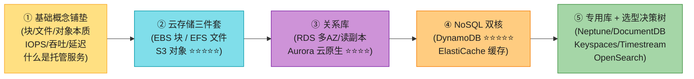

> 💡 **关键信号词**:**"S3 存一切无结构 blob(无限、廉价、毫秒级)"** + **"DynamoDB 是 KV/文档,单表毫秒级,但弱关系查询"** + **"RDS/Aurora 强一致 + ACID,但单 Region 扩展有上限"** + **"缓存一律 ElastiCache(Redis/Valkey 优先)"**——这四句直接拿下面试。

---

## 🗺️ 章节概览

| 小节 | 要点 | 重要性 |
|------|------|--------|
| **🧱 基础概念铺垫** | 块/文件/对象本质 + IOPS/吞吐/延迟 + 托管服务是什么 | ⭐⭐⭐⭐⭐(非科班必看) |
| **1. 块存储 EBS** | 像物理硬盘/挂 EC2/SSD-HDD-磁类型/Multi-Attach/快照/Instance Store 对比 | ⭐⭐⭐⭐ |
| **2. 文件存储 EFS/FSx** | 共享文件系统/serverless/按量计费/FSx for Windows/Lustre | ⭐⭐⭐ |
| **3. 对象存储 S3 ⭐⭐⭐⭐⭐** | Bucket/Object/7 存储类/生命周期/版本/复制/加密/Macie/强一致 | ⭐⭐⭐⭐⭐ |
| **4. 关系库 RDS & Aurora** | 多 AZ 高可用/读副本/Aurora 6 副本 3AZ/Serverless | ⭐⭐⭐⭐ |
| **5. DynamoDB ⭐⭐⭐⭐⭐** | RCU/WCU/On-Demand/分区/LSI vs GSI/DAX/Global Tables/Streams/TTL | ⭐⭐⭐⭐⭐ |
| **6. ElastiCache** | Redis vs Memcached/集群模式禁用启用/数据分层 | ⭐⭐⭐⭐ |
| **7. 专用库速览** | Neptune/DocumentDB/Keyspaces/Timestream/OpenSearch/QLDB/Redshift | ⭐⭐⭐ |
| **8. 选型决策树** | "我要存 X,选哪个 AWS 服务" mermaid flowchart | ⭐⭐⭐⭐⭐ |
| **贯穿案例** | Cafe Delhi Heights 7 类数据 → 7 个 AWS 服务 | ⭐⭐⭐⭐⭐ |
| **2026 现代增量** | S3 Express One Zone/Aurora Serverless v2/Global Tables 强一致/S3 向量/S3 Tables/Valkey | ⭐⭐⭐⭐⭐ |

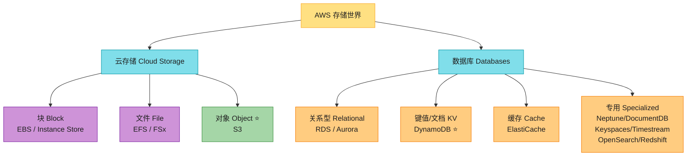

---
## 🧱 基础概念铺垫(给非科班读者)⭐⭐⭐⭐⭐

> 💡 **为什么单独开这一节?** Part I(Ch2/Ch3)讲了存储类型和数据库的**原理**,但很多读者反馈"概念太多,看完了还是分不清 AWS 这些服务到底有什么本质区别"。这一节是给**完全没碰过云存储**的人补的底子——把"块/文件/对象的本质差异"、"关系型 vs NoSQL 各自适合什么"、"`IOPS / 吞吐 / 延迟`到底是什么"、"什么是托管服务"这几个最基础的概念一次性讲透。如果你已经熟悉,可以跳到第 1 节。

### 铺垫 1:块存储 vs 文件存储 vs 对象存储(本质区别)

这是 AWS 存储选型**最常考的第一问**。一句话:**它们是"数据在磁盘上怎么组织"的三种不同抽象层级**,就像"书怎么摆上书架"有三种摆法。

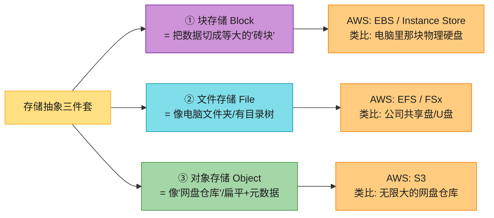

**用三个比喻讲透**(背这个,面试随便答):

| 类型 | 比喻 | 数据怎么组织 | 谁来"读懂"它 | AWS 服务 | 典型用途 |
|------|------|------------|------------|---------|---------|
| **块 Block** | **物理硬盘**——你买一块 1TB 硬盘,它不懂"文件",只知道"扇区、块地址"。装上操作系统和文件系统后才能用 | 切成等大块(如 512B/4KB),每块有唯一地址 | **必须挂到一台服务器(EC2),由服务器的文件系统/数据库去解读** | **EBS**、Instance Store | EC2 的系统盘、自己装 MySQL 的数据盘 |
| **文件 File** | **U 盘 / 公司共享盘**——插上就能看到文件夹和文件,有目录层级 | 文件 + 文件夹的树形结构,文件有名字/大小/权限 | **自带"文件系统",任何支持该协议的机器都能直接读写** | **EFS**、FSx | 多台 EC2 共享同一份代码/配置、内容管理 |
| **对象 Object** | **无限大的网盘仓库**——你把照片扔进百度网盘,它给你一个 URL,没有"文件夹"概念(只有"前缀模拟目录") | 对象(Object)+ 元数据(Metadata)+ 唯一键(Key),扁平结构 | **通过 HTTP API(GET/PUT)直接访问,不需要服务器中介** | **S3** | 图片/视频/备份/大数据/静态网站 |

**三句话口诀**(背):
- **块 = 像"硬盘",要挂服务器才认识,最快最贵,适合数据库/系统盘**。
- **文件 = 像"U盘/共享盘",多台机器能同时读写,适合共享代码/内容**。
- **对象 = 像"网盘仓库",HTTP 直连、无限容量、最便宜,适合海量无结构数据(图片/视频/备份)**。

> 🪤 **追问陷阱**:"为什么 S3 不能直接当数据库的存储层?" → S3 是**对象存储,延迟高(几十毫秒)且不支持随机修改**(对象不可变,改一次要重写整个对象),而数据库要的是**毫秒级随机块读写**(块存储才支持)。所以 EC2 上自建 MySQL 必须用 **EBS**(块),不能用 S3。

### 铺垫 2:关系型 vs NoSQL(各自适合什么)

> 📝 **细节不重复**:Part I 的 **aws_02** 讲透了关系库(ACID/隔离级别/B+ 树),**aws_03** 讲透了 NoSQL(KV/文档/列/图 + BASE + CAP 实战)。这里只给"选型速查表"。

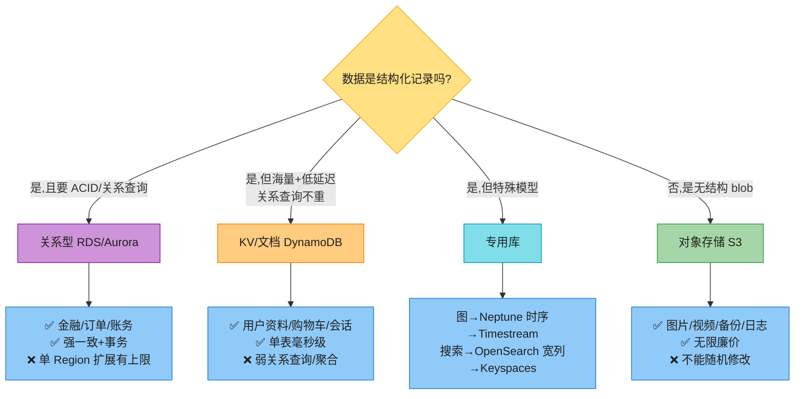

**四类 NoSQL 速记**(aws_03 详细讲过,这里只复习):

| NoSQL 类型 | 一句话 | 数据形态 | AWS 服务 | 典型场景 |
|-----------|--------|---------|---------|---------|
| **键值 KV** | "给 key,返 value" | key → value(任意) | **DynamoDB**、ElastiCache | 会话、购物车、用户资料 |
| **文档 Document** | "JSON 文档,有结构但灵活" | key → JSON 文档 | **DynamoDB**(也支持)、DocumentDB | 菜单、订单、CMS 内容 |
| **宽列 Wide-Column** | "二维表,行稀疏,横向扩展强" | (分区键, 聚簇键) → 列族 | **Keyspaces**(Cassandra 兼容) | IoT 时序、日志、推荐 |
| **图 Graph** | "存关系比存数据更重要" | 节点 + 边 + 属性 | **Neptune** | 社交、推荐、欺诈检测 |

> 💡 **2026 第五类**:**向量数据库**(Vector DB)——存 AI 嵌入向量,做相似性检索(RAG/语义搜索)。AWS 上可用 **OpenSearch 向量库 / pgvector(Aurora/RDS PostgreSQL 扩展)/ Bedrock Knowledge Base / 专用 DynamoDB 向量(2024 alpha)**。详见 aws_03 增量 1。

### 铺垫 3:IOPS / 吞吐 / 延迟(三个性能指标,别搞混)

这是 EBS 选型的核心,面试常被追问。

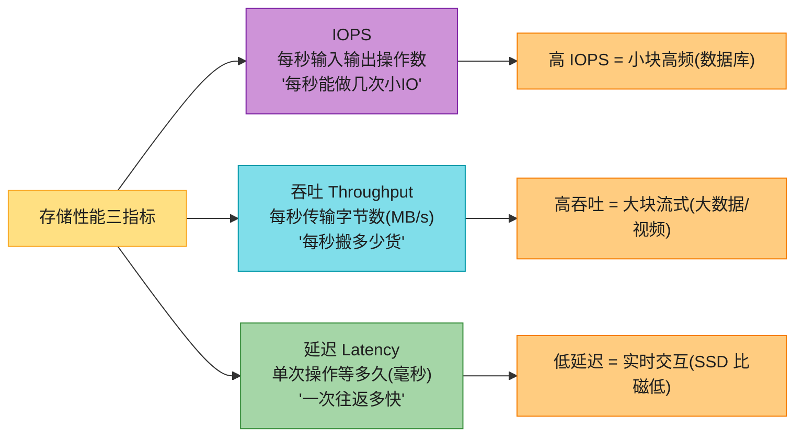

**用快递比喻**(背):
- **IOPS = 每秒能发多少个小包裹**。数据库(频繁小读写)需要高 IOPS。
- **吞吐 = 每秒能搬多少吨货**(大卡车)。大数据分析、视频流需要高吞吐。
- **延迟 = 一个包裹从下单到送达要多久**。交互式应用(网页/游戏)需要低延迟。

**关系**:**吞吐 ≈ IOPS × 每次 IO 大小**。所以同样吞吐,小块多次(高 IOPS)和大块少次(低 IOPS)是两种不同负载——EBS 的 SSD 系列为前者优化,HDD 系列为后者优化。

> 🪤 **追问陷阱**:"IOPS 和吞吐有什么区别?" → **IOPS 是"每秒操作次数"(小块高频,如数据库);吞吐是"每秒字节数"(大块流式,如大数据)**。一个数据库可能 IOPS=1 万但吞吐只有 40MB/s(每次 4KB);一个大数据作业可能 IOPS=500 但吞吐 500MB/s(每次 1MB)。**EBS 的 SSD(gp/io)优化 IOPS,HDD(st/sc)优化吞吐**。

### 铺垫 4:什么是"托管(Managed)服务"?

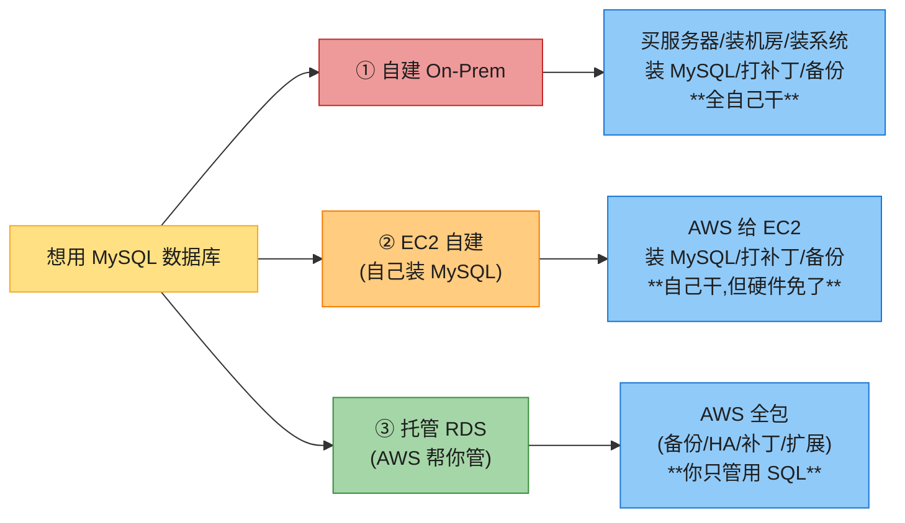

**"托管"= AWS 帮你干了运维**(备份/高可用/补丁/扩展/监控)。代价是**你失去部分控制力**(不能随便 SSH 进去改配置、不能任意版本、要付托管费)。AWS 还有更激进的 **Serverless(无服务器)**——连"配多少实例"都不用管,按用量计费(DynamoDB / Aurora Serverless / S3 都是)。

> 💡 **托管度的连续谱**(背):**自建 → IaaS(EC2 自建)→ 托管 PaaS(RDS)→ Serverless(DynamoDB/Aurora Serverless)→ SaaS**。越往右越省心但越受限制,越往左越自由但越累。AWS 几乎所有服务都在这条谱上给你选项。

---
## 1. 块存储:Amazon EBS ⭐⭐⭐⭐

### 1.1 EBS 是什么 & 卷类型选型矩阵

**Amazon EBS(Elastic Block Store)** 是 AWS 的块存储服务——**像一块物理硬盘**,可以挂载到 EC2 实例上当系统盘或数据盘用。它解决的问题是:**EC2 实例本身的"本地盘"(Instance Store)是临时的,实例停了数据就没了;EBS 是持久化的、独立生命周期的卷**,实例没了 EBS 还在。

**EBS 的核心特性**(背):
- **像物理硬盘**:挂到 EC2 后格式化成文件系统就能用(就像你买块硬盘装电脑)。
- **生命周期独立于 EC2**:EC2 实例停了/删了,EBS 卷可以保留,再挂到另一台 EC2。
- **灵活**:生产环境运行中也能**动态调整**——加容量、改 IOPS、换卷类型(不停机)。
- **低延迟**:数据访问快,适合频繁磁盘访问场景(自建数据库、操作系统启动盘)。
- **AZ 级作用域**:一个 EBS 卷在 `us-east-1a`,**只能挂到同一 AZ 的 EC2**(`us-east-1b` 的 EC2 挂不上)。要跨 AZ 必须靠**快照(Snapshot)**。
- **AZ 内自动复制**:同一 AZ 内 EBS 数据会自动复制,防单点硬件故障丢数据。

> 💡 **典型用途**:① **自建数据库**(不用 RDS,自己 EC2 上装 MySQL,数据放 EBS);② **EC2 操作系统启动卷**(根盘);③ **需要块级随机 IO 的应用**。

**EBS 卷类型选型矩阵**(面试高频):

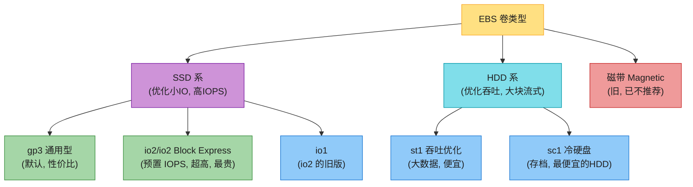

| 卷类型 | 全称 | 优化点 | 典型场景 | 通俗说 |
|--------|------|--------|---------|--------|
| **gp3**(默认) | General Purpose SSD | **性价比**,固定 IOPS 起步 | 系统盘、中小数据库、开发测试 | **"够用的通用盘"**——80% 场景选它 |
| **io2 / io2 Block Express** | Provisioned IOPS SSD | **超高 IOPS / 超低延迟** | 关键生产数据库、SAP HANA、高频交易 | **"最贵最快,百万级 IOPS"** |
| **st1** | Throughput Optimized HDD | **吞吐**(MB/s) | 大数据、数据仓库、日志处理 | **"搬大数据的便宜盘"** |
| **sc1** | Cold HDD | **成本最低的 HDD** | 最低频访问的存档数据 | **"几乎不读但要存的冷数据"** |
| **Magnetic(Standard)** | 磁盘 | 旧时代产物 | **不推荐**,新场景用 gp3/sc1 | **已过时** |

> 💡 **选型口诀**:**默认 gp3,要超高 IOPS 选 io2,搬大数据选 st1,存冷档选 sc1,别用 Magnetic**。

> 📝 **2026 现实**:**gp3 是 2020+ 推出的新一代默认**(取代 gp2),价格比 gp2 便宜约 20%,且 IOPS/吞吐可独立配置。**io2 Block Express**(2021 GA)是 AWS 最高性能块存储,单卷 64TB / 256K IOPS / 4GB/s 吞吐,专为最关键的数据库设计(SAP HANA、大型 Oracle)。**Magnetic 已不推荐新场景使用**。

### 1.2 Instance Store vs EBS(对比)

AWS 还有一种块存储叫 **Instance Store(实例存储)**——它是**直接物理挂在 EC2 实例上的磁盘**(宿主机本地盘),和 EBS 的"网络挂载"完全不同。

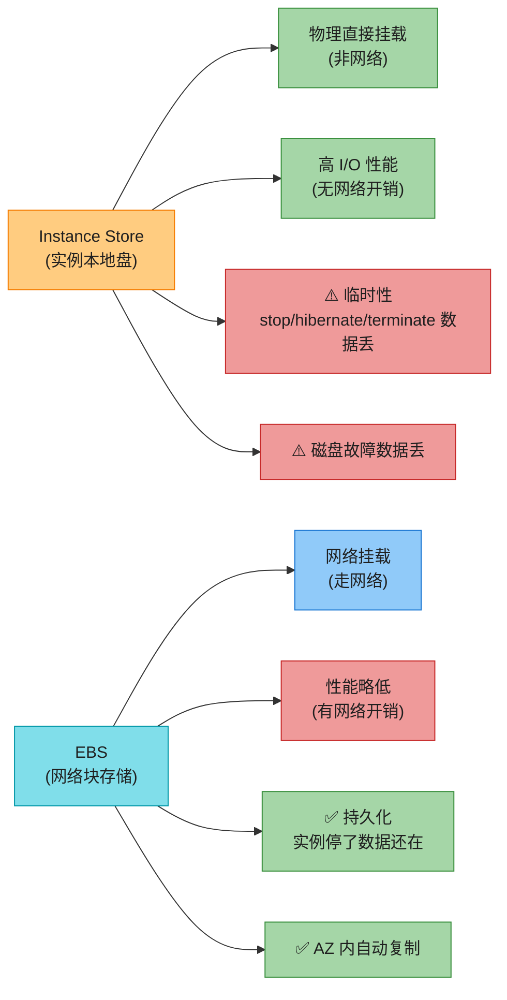

| 维度 | Instance Store | EBS |
|------|---------------|-----|
| **挂载方式** | 实例本地物理盘(非网络) | 网络挂载 |
| **性能** | 更高(无网络开销) | 略低(走网络) |
| **持久性** | **临时**(stop/hibernate/terminate/磁盘故障 → 数据丢) | **持久**(独立生命周期) |
| **灵活性** | 不能动态扩容、不能换类型 | 可动态加容量/改 IOPS/换类型 |
| **可挂载性** | 只能挂到这台 EC2 | 可挂到同 AZ 任意 EC2 |
| **典型用途** | 临时缓存、device buffer、临时计算结果 | 系统盘、数据库、持久数据 |

> 💡 **决策**:**数据要长期保留 → EBS**;**只是临时缓存/中间结果(丢了能重算)→ Instance Store**(更快更便宜)。

### 1.3 Multi-Attach & 快照(Snapshot)

**Multi-Attach(多挂载)**——EBS 最初是**非共享**的(一个卷只能挂一台 EC2)。后来 AWS 推出 **Multi-Attach** 功能,允许把**单个 io2(预置 IOPS SSD)卷**同时挂到**最多 16 台 Nitro-based EC2 实例**(同 AZ 内,Linux)。

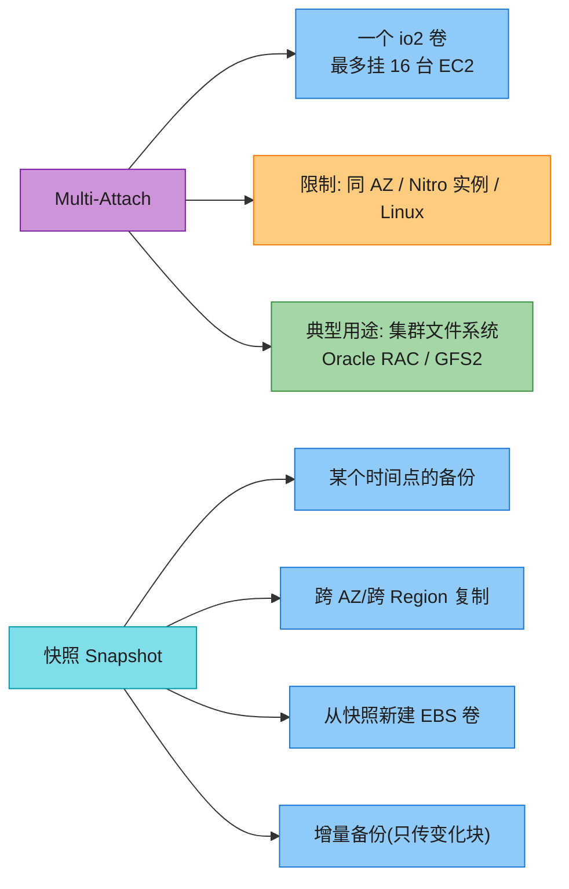

**快照(Snapshot)解决跨 AZ/跨 Region 问题**:因为 EBS 卷是 AZ 级的,要跨 AZ 或跨 Region 必须靠快照——它是 EBS 卷在**某个时间点的备份**,存在 **S3**(AWS 托管,你看不到具体 S3 桶),可以:
- **跨 AZ 复制**:在 us-east-1a 拍快照,在 us-east-1b 从快照新建一个卷挂上去。
- **跨 Region 复制**:把快照复制到欧洲,做灾难恢复(DR)。
- **增量备份**:第一次全量,后续只传变化的块,省存储和费用。

> 🪤 **追问陷阱**:"EBS 怎么跨 AZ 用?" → **不能直接跨 AZ 挂载**(EBS 是 AZ 级作用域)。要用**快照(Snapshot)**——拍快照存到 S3,在目标 AZ 从快照新建卷。这是 DR 跨区域恢复的标准做法。

> 💡 **EBS 的两大局限**:① **AZ 级作用域**(不能直接跨 AZ);② **默认非共享**(Multi-Attach 仅限 io2 + 16 台 + Nitro + Linux)。这两点正是 **EFS**(共享 + 跨 AZ)要解决的问题。

---

## 2. 文件存储:Amazon EFS(及 FSx)⭐⭐⭐

### 2.1 EFS 解决什么问题

**Amazon EFS(Elastic File System)** 是 AWS 的**共享文件系统**——它克服了 EBS 的两大局限:**多台 EC2 能同时挂载读写同一个文件系统**(默认就共享,不像 EBS 要 Multi-Attach),且**跨 AZ 作用域**(一个 Region 内多 AZ 都能访问)。

**EFS 核心特性**(背):
- **共享文件系统**:多台 EC2/ECS/Lambda 同时挂载同一份文件。
- **完全托管 + Serverless**:不用预配容量,**按实际用量计费**(用多少 GB 给多少 GB)。
- **跨 AZ 作用域**:同一 Region 内多 AZ 都能访问(不像 EBS 锁死单 AZ)。
- **支持所有 AWS 计算平台**:EC2、ECS(容器)、Lambda(无服务器)。
- **低延迟**:和 EBS 一样低延迟数据访问。

**典型业务场景**:
- **大数据分析**(多台机器读同一份数据集)
- **机器学习**(共享训练数据、模型文件)
- **内容管理 / Web 服务**(多台 Web 服务器共享代码、配置、上传文件)
- **DevOps**(CI/CD 共享构建产物)

### 2.2 EFS 存储类

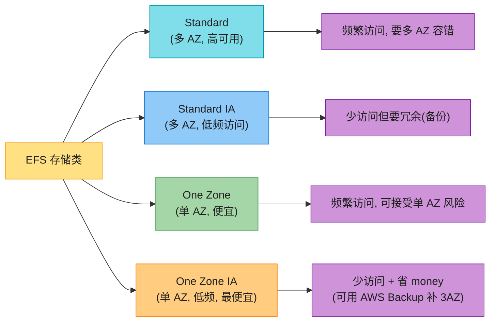

| 存储类 | 可用性 | 适用 | 备注 |
|--------|--------|------|------|
| **Standard** | 多 AZ(Region 级) | 频繁访问 | 最高可用,较贵 |
| **Standard IA** | 多 AZ(Region 级) | 低频访问 | 较便宜,首字节延迟高 |
| **One Zone** | 单 AZ | 频繁访问 + 可接受单 AZ | 比 Standard 便宜 |
| **One Zone IA** | 单 AZ | 低频 + 最省钱 | 最便宜,可用 **AWS Backup** 跨 3 AZ 备份补足 |

### 2.3 Amazon FSx(Windows / Lustre)

EFS 是基于 **NFS** 协议的 Linux 文件系统。但有些场景你用的是 **Windows 文件服务器**或**高性能计算文件系统**——这时用 **Amazon FSx**:

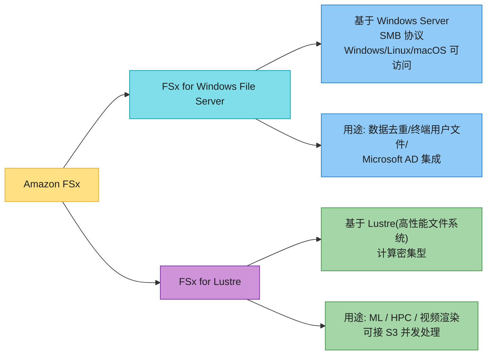

> 💡 **关键区分**:**EBS / EFS 都需要"服务器"(EC2)才能访问数据**;只有 **S3(对象存储)可以不经过服务器,直接通过 HTTP API 访问**——这是对象存储最大的特点,也是下一节的重点。

---
## 3. 对象存储:Amazon S3(本章双核心之一)⭐⭐⭐⭐⭐

**Amazon S3(Simple Storage Service)** 是 AWS 最成功的服务之一,也是**云时代对象存储的事实标准**。一句话:**S3 是无限容量的对象存储,你把任意文件扔进去,它给你一个 key(URL),通过 HTTP 随时取**。

**S3 解决的问题**:
- **无限容量**:你不用规划"要买多大硬盘",扔多少它存多少。
- **超低成本**:存 1TB 数据,S3 Standard 比 EBS 便宜一个数量级。
- **高持久性**:11 个 9(99.999999999%)——数据存进去基本不会丢(自动跨多 AZ 复制)。
- **HTTP 直连**:不需要 EC2 中介,任何能发 HTTP 请求的设备(浏览器、手机、IoT)都能直接访问。

**典型用途**:**网站静态资源、图片/视频存储、备份、大数据分析数据湖、日志归档、静态网站托管、AI/ML 训练数据**。

### 3.1 Bucket / Object / 一致性模型

**S3 核心概念**(背):

| 概念 | 说明 |
|------|------|
| **Bucket(桶)** | 存对象的"容器",用**全局唯一名**标识(整个 AWS 所有客户里不能重名)。创建时指定**Region**。 |
| **Object(对象)** | 上传到 bucket 的一个文件,用**唯一的 key(键名)**标识。一个对象在 bucket 内只有唯一一个 key。 |
| **Key(键)** | 对象的标识,常用"路径式"如 `images/2026/photo.jpg`,但 S3 实际是**扁平**的(没有真正的文件夹,只是 key 模拟)。 |
| **Value(值)** | 对象的数据本体(0 ~ 5TB 单对象)。 |
| **Metadata(元数据)** | 描述对象的数据(类型、大小、自定义标签等)。 |

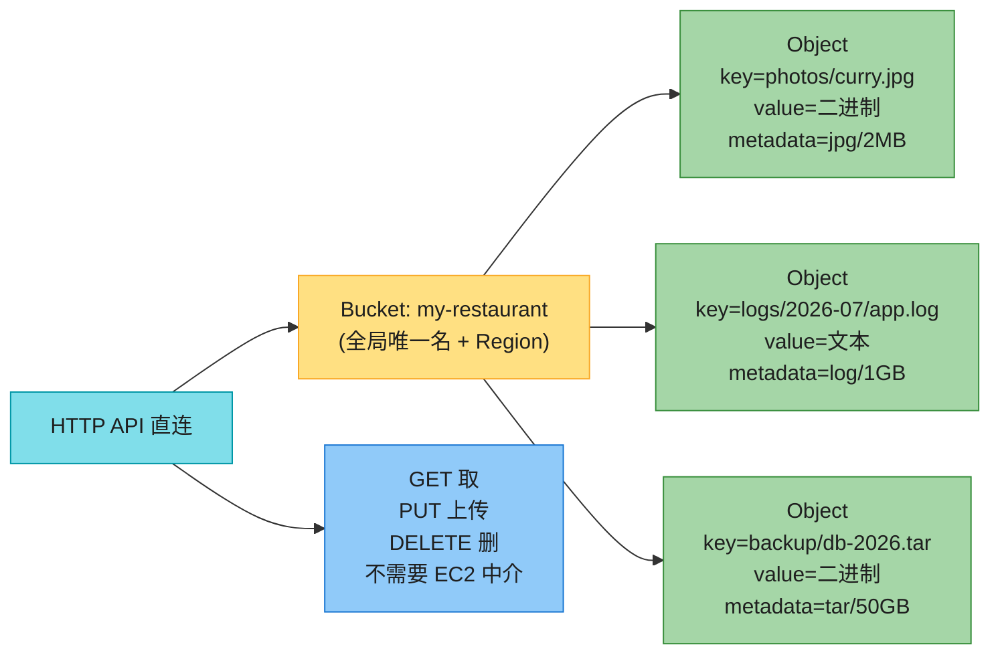

> 💡 **S3 的"扁平 + key 模拟目录"**:虽然你看到 `photos/curry.jpg` 像"在 photos 文件夹里的 curry.jpg",但 S3 真实存储是**扁平**的——整个 key 就是一个字符串。AWS 控制台为了友好,把 `/` 渲染成"文件夹"。这点和真正的文件系统(EFS)有本质区别。

**版本控制(Versioning)**:S3 允许同一 key 存**多个版本**——每次上传同一个 key 都生成一个新版本 ID,旧的还留着。**应用失败时可以恢复任意历史版本**(误删/误覆盖救命稻草)。

**强一致性(2020+)**:早期 S3 是"读后写最终一致"(创建 bucket 后稍等才能列出对象)。2020 年起 **S3 对所有写操作提供强一致性**——写成功后立即读到新值,不再有"刚写完读不到"的尴尬。

### 3.2 S3 存储类(7 种)与生命周期

不同数据的访问频率天差地别(刚上传的图天天看,3 年前的备份几乎不碰)。S3 提供多种**存储类(Storage Class)**,按访问频率和检索速度分档,帮你省钱。

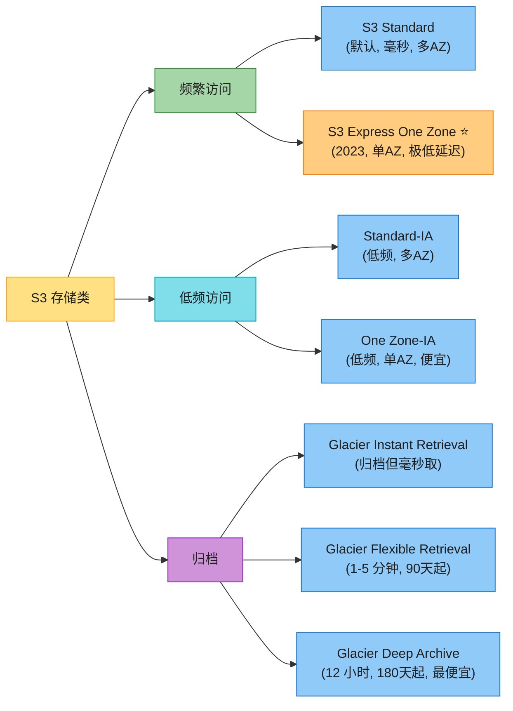

**存储类对比表**(背关键几行):

| 存储类 | 访问频率 | 检索速度 | 持久性/可用性 | 最低存储期 | 用途 |
|--------|---------|---------|------------|----------|------|
| **S3 Standard** | 频繁 | **毫秒** | 多 AZ, 99.99% 可用 | 无 | 默认,大部分热数据 |
| **S3 Express One Zone** ⭐(2023) | 频繁 | **毫秒(单 AZ 极低延迟)** | 单 AZ | 无 | 数据湖/ML 训练,要快 |
| **Standard-IA** | 低频 | 毫秒 | 多 AZ | 30 天 | 备份、灾难恢复 |
| **One Zone-IA** | 低频 | 毫秒 | 单 AZ(可重建数据) | 30 天 | 可重建的次要备份 |
| **Glacier Instant Retrieval** | 极少但要快 | **毫秒** | 多 AZ | 90 天 | 归档但偶尔要秒级取 |
| **Glacier Flexible Retrieval** | 极少 | 1-5 分钟 | 多 AZ | 90 天 | 长期归档(季度取) |
| **Glacier Deep Archive** | 几乎不取 | **12 小时**(批量 48h) | 多 AZ | 180 天 | 合规存档,合规要求数年 |

> 💡 **归档类的核心权衡**:**越便宜 → 检索越慢 + 最低存储期越长**。Glacier Deep Archive 存储费是 Standard 的 1/10 以下,但取一次要等 12 小时,且不满 180 天删除要罚款。所以**只有确定长期不取的合规数据**才适合 Deep Archive。

**生命周期规则(Lifecycle Configuration)**:数据往往**刚产生时热,过段时间变冷**——比如日志存 30 天后很少看,1 年后归档。手动迁移太累,**生命周期规则**让你自动按规则迁移存储类或删除:


生命周期两类动作:
- **Transition(迁移)**:把对象迁到另一存储类(如 Standard → IA 30 天后)。
- **Expiration(过期)**:对象到期自动删除。

**Intelligent-Tiering(智能分层)**:不想自己定规则?S3 提供**智能分层**——它自动监控对象访问,**30 天没访问自动迁到低频层,90 天迁到归档即时层**,如果重新被访问自动迁回。**适合访问模式不确定的数据**,代价是每月加一点监控费。

### 3.3 版本控制与复制(Replication)

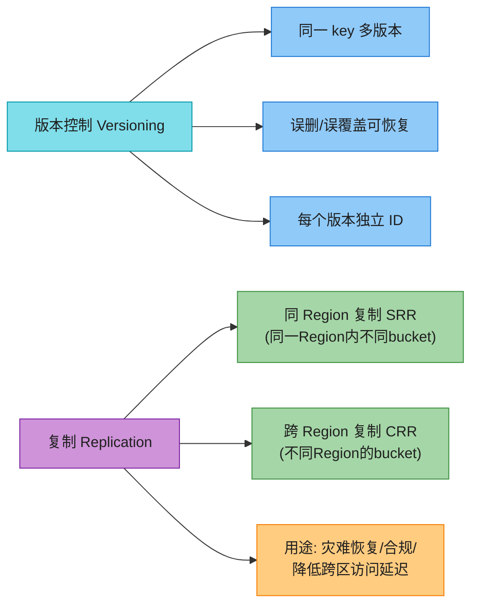

- **版本控制**:开启后,每次 PUT 同一 key 都生成新版本,旧版本保留。**误删时可以恢复任意历史版本**——生产强烈建议开启。
- **复制**:把一个 bucket 的对象**自动异步复制**到另一个 bucket。分**同 Region(SRR)**和**跨 Region(CRR)**。**用途**:跨区灾难恢复、合规要求数据在某地、降低全球用户的访问延迟(每个 Region 放一份)。

### 3.4 数据安全(加密 / 策略 / Macie)

S3 默认只有 bucket 拥有者能访问。提供多种安全机制:

```mermaid
flowchart TD
    SEC["S3 数据安全"] --> ENC["加密 Encryption"]
    SEC --> ACCESS["访问控制 Access Control"]
    SEC --> SENS["敏感数据发现"]

    ENC --> SSE_S3["SSE-S3<br/>(默认, AWS 托管密钥)"]
    ENC --> SSE_KMS["SSE-KMS<br/>(KMS 客户管理密钥)"]
    ENC --> CSE["客户端加密"]

    ACCESS --> BP["Bucket Policy<br/>(bucket 级, 跨账号)"]
    ACCESS --> IAM["IAM Policy<br/>(用户/组级)"]
    ACCESS --> ACL["ACL<br/>(默认禁用, 不推荐)"]
    ACCESS --> PUB["Block Public Access<br/>(默认拦截公开)"]
    ACCESS --> LOCK["Object Lock<br/>(WORM, 合规留)"]

    SENS --> MACIE["Amazon Macie<br/>(ML 发现敏感数据<br/>信用卡/PII)"]
    SENS --> AA["Access Analyzer for S3<br/>(找出公开的bucket)"]

    style SEC fill:#FFE082,stroke:#F9A825,color:#1f1f1f
    style ENC fill:#EF9A9A,stroke:#C62828,color:#1f1f1f
    style ACCESS fill:#80DEEA,stroke:#0097A7,color:#1f1f1f
    style SENS fill:#CE93D8,stroke:#7B1FA2,color:#1f1f1f
    style SSE_S3 fill:#90CAF9,stroke:#1976D2,color:#1f1f1f
    style SSE_KMS fill:#90CAF9,stroke:#1976D2,color:#1f1f1f
    style CSE fill:#90CAF9,stroke:#1976D2,color:#1f1f1f
    style BP fill:#A5D6A7,stroke:#388E3C,color:#1f1f1f
    style IAM fill:#A5D6A7,stroke:#388E3C,color:#1f1f1f
    style ACL fill:#FFCC80,stroke:#F57C00,color:#1f1f1f
    style PUB fill:#A5D6A7,stroke:#388E3C,color:#1f1f1f
    style LOCK fill:#A5D6A7,stroke:#388E3C,color:#1f1f1f
    style MACIE fill:#90CAF9,stroke:#1976D2,color:#1f1f1f
    style AA fill:#90CAF9,stroke:#1976D2,color:#1f1f1f
```

**加密**:
- **SSE-S3**(默认):**所有对象默认用 SSE-S3 加密**(2023+ 默认开启),AWS 用自己托管的密钥,你什么都不用做。
- **SSE-KMS**:用 **AWS KMS(Key Management Service)** 管理密钥,可控可审计(适合合规)。
- **客户端加密**:上传前自己加密,S3 看不到明文。

**访问控制**:
- **Bucket Policy**:bucket 级策略,可跨账号授权(账号 A 读账号 B 的 bucket),上限 20KB。
- **IAM Policy**:用户/角色级,控制谁能读写。
- **ACL**:对象/桶级 ACL,**默认禁用**(不推荐,用 Policy 替代)。
- **Block Public Access**:拦截 bucket 公开访问(账号级可统一开)。**生产强烈建议开启**——S3 配错公开是云上最经典的数据泄露原因。
- **Object Lock**:**WORM(写一次读多次)** 模式,启用版本控制后才能开,防对象被删/被改(合规要求数据不可篡改的场景)。

**敏感数据发现**:
- **Amazon Macie**:用 ML 自动扫描 S3,**发现敏感数据**(信用卡号、身份证、API key 等),也评估 bucket 访问控制。
- **Access Analyzer for S3**:专门**找出公开可访问的 bucket**(防止有人误配置公开)。

> 🪤 **追问陷阱**:"S3 怎么防止数据泄露?" → 三层防御:① **默认 SSE-S3 加密**(静态);② **Block Public Access**(防误配公开);③ **Amazon Macie + Access Analyzer**(主动扫描敏感数据和公开 bucket)。**生产标配**这三件套。

---
## 4. 关系型:Amazon RDS & Aurora ⭐⭐⭐⭐

> 📝 **不重复 Part I**:RDBMS 的 ACID/隔离级别/B+ 树/规范化在 **aws_02** 讲透了。本章只讲"AWS 把关系库托管成了什么"。

### 4.1 没有 RDS 之前(为什么需要 RDS)

**自己跑 MySQL 有多累**:你要下载安装包、装到 EC2 上、挂 EBS、配备份、配高可用、打补丁、监控、扩容……**全是运维杂活**。

**Amazon RDS** 把这些全包了——你**点几下创建一个 DB 实例**,备份/补丁/高可用/监控都由 AWS 处理,你只用写 SQL。

**RDS 支持的引擎**(背):
- **MySQL**(开源,读重)
- **PostgreSQL**(开源,写重,类型丰富)
- **MariaDB**(MySQL 分支,开源)
- **Oracle**(商业,企业级)
- **Microsoft SQL Server**(商业,微软生态)
- **Amazon Aurora**(AWS 自研云原生,见 4.3)

**创建 RDS 实例要配的关键项**:

| 配置项 | 说明 |
|--------|------|
| **Engine type(引擎)** | 选 MySQL/PostgreSQL/Oracle/... |
| **Templates(模板)** | Production / Dev-Test / Free Tier |
| **DB instance class(实例规格)** | 计算+内存(标准/内存优化/突发性能) |
| **Storage(存储)** | EBS 类型(SSD/HDD/磁)+ 容量 + 自动扩缩 |
| **Availability(可用性)** | **多 AZ 部署**(高可用,见 4.2) |
| **Connectivity(连接)** | VPC / 子网组 / 安全组 / 是否公开访问 |

### 4.2 RDS 多 AZ 高可用 vs 读副本(高频考点)⭐⭐⭐⭐⭐

这是面试**必问**的区分点——两个都是"另一台实例",但目的完全不同。

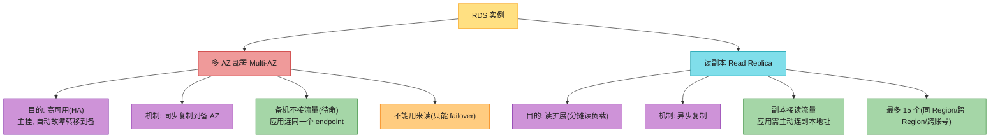

| 维度 | 多 AZ 部署(Multi-AZ) | 读副本(Read Replica) |
|------|-------------------|-------------------|
| **目的** | **高可用**(主挂自动切备) | **读扩展**(分摊读流量) |
| **复制** | **同步**(强一致) | **异步**(最终一致) |
| **备机是否接流量** | ❌ 不接(待命 standby) | ✅ 接(应用主动连) |
| **应用连接方式** | 连同一个 endpoint(自动故障转移) | 应用分别连主和副本 |
| **数量** | 1 个 standby | 最多 15 个 |
| **跨 Region** | 支持(跨 Region 多 AZ) | 支持(跨 Region 读副本,兼做 DR) |

> 🪤 **追问陷阱(超高频)**:"RDS 多 AZ 和读副本有什么区别?" → **目的完全不同**:**多 AZ 是为高可用**(同步复制一台 standby,主挂自动切,standby 不接流量);**读副本是为读扩展**(异步复制,副本接读流量,分摊主库读压力)。**一个为 HA,一个为读扩展**——这是面试必答点。常见进阶:可以同时用——多 AZ 保 HA + 读副本扛读量。

### 4.3 Amazon Aurora(云原生,存算分离)⭐⭐⭐⭐⭐

**Amazon Aurora** 是 AWS 自研的**云原生关系库**,兼容 MySQL 和 PostgreSQL,但架构完全重新设计。

**Aurora 为什么快(背)**:
- **比 MySQL 快 5 倍,比 PostgreSQL 快 3 倍**(同硬件)。
- **存算分离**:计算层(DB 实例)和存储层(分布式存储卷)分离,存储层自动扩展。
- **6 副本跨 3 AZ**:数据在存储层自动复制 6 份(3 AZ 各 2 份),**写只需 4/6 副本 ack(quorum),读 3/6 即可**——比传统单机或主从快得多。
- **持续备份到 S3**:存储层自动增量备份到 S3。
- **跨 Region 复制**:可全球复制为低延迟访问。

**Aurora 集群架构**:

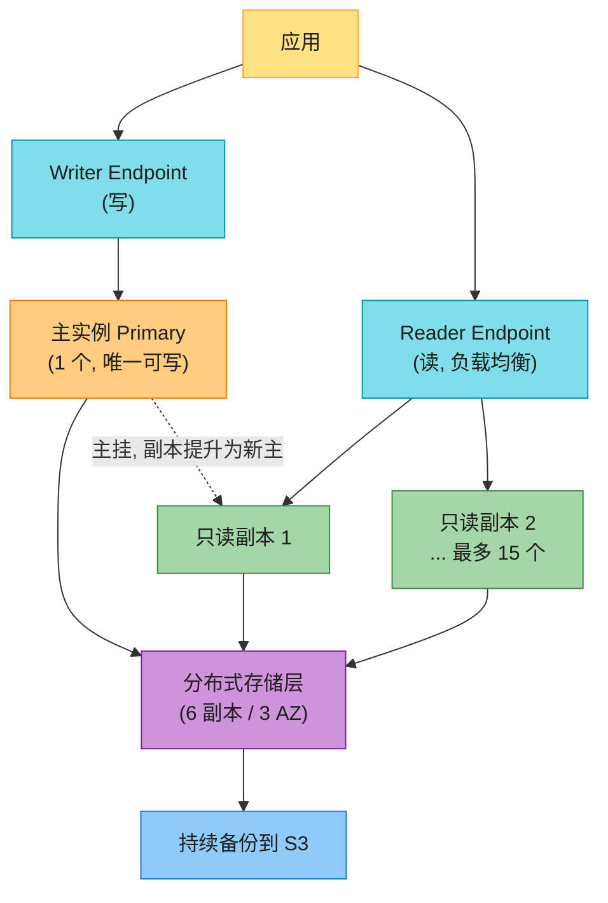

**Aurora 关键设计点**:
- **不需要预配存储**(像 RDS 要选 EBS 容量),存储层自动按 10GB 增长,最大 128TB。
- **最多 15 个只读副本**,读副本分担读负载;主挂时**读副本自动提升为新主**,提升可用性。
- **数据安全**:RDS 和 Aurora 都支持加密(at-rest)。

**Aurora Serverless**(本章重点对比):
- **传统 RDS/Aurora**:基于"实例类型"(CPU/内存固定的实例),即使没流量也一直跑,一直计费。
- **Aurora Serverless**:基于 **Aurora 容量单元(ACU)**——你只指定最小/最大 ACU,Aurora 按实际负载**自动伸缩**。**适合不可预测的工作负载、开发测试场景**(不需要 7×24 跑)。

> 🪤 **追问陷阱(高频)**:"Aurora 为什么比 RDS MySQL 快?" → **存算分离 + 分布式存储层**:① 数据 6 副本跨 3 AZ,写用 quorum(4/6 ack),读 3/6,不用等所有副本;② 存储层和计算层解耦,副本之间**共享同一份存储**(不像传统主从要每台都存全量),加副本秒级;③ 持续备份到 S3,备份不影响性能;④ 主挂时副本秒级提升。

> 📝 **2026 增量预告**:Aurora Serverless **v2**(原书讲的 v1 有冷启动问题,v2 真正平滑伸缩)、**Aurora Limitless Database**(分布式分片)、**Aurora DSQL**(serverless PostgreSQL,2024 重新架构)。详见本章末"2026 现代增量"。

**RDS/Aurora 适合什么场景**:业务要**关系结构 + ACID 事务 + 强一致**(金融、订单、账务)。如果你的业务**不需要强 ACID、海量、低延迟、关系查询不重**——选 NoSQL(DynamoDB)。

---

## 5. 键值/文档:Amazon DynamoDB(本章双核心之二)⭐⭐⭐⭐⭐

> 📝 **不重复 Part I**:KV/文档数据库的数据模型、leaderless 复制、一致性哈希在 **aws_03** 讲透了。本章讲"DynamoDB 这个具体产品怎么用"。

**Amazon DynamoDB** 是 AWS 的**键值 + 文档数据库**,设计目标只有一个:**任何规模下都给个位数毫秒级延迟**。它是 AWS 上**最 NoSQL 的服务**——serverless、自动扩展、按用量计费,你完全不用管服务器。

**DynamoDB 核心特性**:
- **键值 + 文档**:既能存简单 KV,也能存 JSON 文档(schemaless)。
- **个位数毫秒级延迟**:任何规模(从 1 个用户到亿级)都稳定在 ms。
- **完全托管 + Serverless**:不配服务器/不配存储,只配表名和主键。
- **leader-follower 模型**:内部数据存在叫"分区(partition)"的存储节点上。
- **强一致 + 最终一致都支持**(GSI 只支持最终一致)。

### 5.1 主键 / 分区 / RCU-WCU / On-Demand

**主键设计(背)**:

| 主键类型 | 组成 | 用法 |
|---------|------|------|
| **简单主键** | 仅 **partition key(分区键)** | 哈希函数 → 决定存哪个分区 |
| **复合主键** | **partition key + sort key(排序键)** | 同分区键的数据存在一起,按 sort key 排序;主键 = (PK + SK) 组合唯一 |

**DynamoDB 内部架构**(简化):

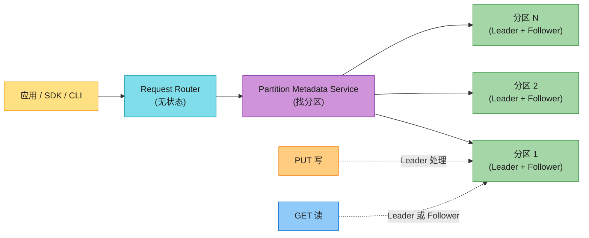

**请求路由(Request Router, RR)** 是无状态服务,它问 **Partition Metadata Service** "这个 key 在哪个分区",然后把请求转发。**写(PUT)发给 leader 节点**,**读(GET)看一致性需求**——强一致读走 leader,最终一致读可走 follower。

**容量模式(Capacity Mode)**——这是 DynamoDB 选型的核心:

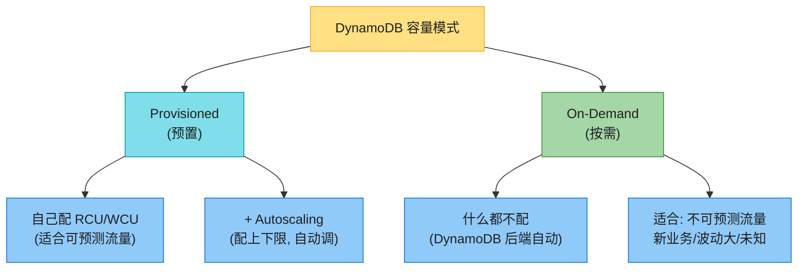

- **RCU(Read Capacity Unit)**:每秒 4KB 的最终一致读(强一致读 1 RCU = 4KB 强一致)。
- **WCU(Write Capacity Unit)**:每秒 1KB 写。
- **Provisioned**:你配 RCU/WCU 值,**适合流量可预测**;可加 **Autoscaling** 配上下限自动调。
- **On-Demand**:什么都不配,**后端自动**,按实际读写次数计费,**适合不可预测/新业务**。

**分区的硬限制(背,面试常考)**:
- 单分区上限:**3,000 RCU/秒 或 1,000 WCU/秒**(或两者组合)。
- 单分区存储上限:**10GB**。
- 超过 → 请求被 **throttle(限流)**。

**热分区(hot partition / hot key)**:某分区键的读写远超其他分区,撞上单分区上限被限流。

```mermaid
flowchart LR
    HOT["热分区问题"] --> WHY["某 PK 流量远超其他"]
    WHY --> SOL1["读: 加缓存 ElastiCache"]
    WHY --> SOL2["写: PK 加随机后缀<br/>(1-100) 分散到多分区"]
    WHY --> SOL3["设计高基数 PK<br/>(数据均匀分布)"]
    WHY --> SOL4["指数退避重试"]

    style HOT fill:#EF9A9A,stroke:#C62828,color:#1f1f1f
    style WHY fill:#FFCC80,stroke:#F57C00,color:#1f1f1f
    style SOL1 fill:#A5D6A7,stroke:#388E3C,color:#1f1f1f
    style SOL2 fill:#A5D6A7,stroke:#388E3C,color:#1f1f1f
    style SOL3 fill:#A5D6A7,stroke:#388E3C,color:#1f1f1f
    style SOL4 fill:#A5D6A7,stroke:#388E3C,color:#1f1f1f
```

> 💡 **设计原则**:**PK 要高基数(取值多)**,让数据均匀分布到所有分区,避免热分区。**写热分区**用"PK + 随机后缀(1-100)"分散写;**读热分区**加缓存。

### 5.2 索引:LSI vs GSI(高频对比)

主键设计再好也满足不了所有查询模式。**DynamoDB 索引(Index)** 像一个"子表",从主表的某些属性建出来,**加速特定查询**。两类索引(必背):

```mermaid
flowchart LR
    IDX["DynamoDB 索引"] --> LSI["本地二级索引 LSI<br/>Local Secondary"]
    IDX --> GSI["全局二级索引 GSI<br/>Global Secondary"]

    LSI --> L1["同 PK + 不同 SK"]
    LSI --> L2["仅建表时创建"]
    LSI --> L3["同分区, 10GB 上限"]
    LSI --> L4["共享表的 RCU/WCU"]
    LSI --> L5["支持强一致 + 最终一致"]

    GSI --> G1["PK + SK 都可不同"]
    GSI --> G2["任意时创建/删除"]
    GSI --> G3["跨分区, 无大小限"]
    GSI --> G4["独立 RCU/WCU"]
    GSI --> G5["仅最终一致"]

    style IDX fill:#FFE082,stroke:#F9A825,color:#1f1f1f
    style LSI fill:#80DEEA,stroke:#0097A7,color:#1f1f1f
    style GSI fill:#CE93D8,stroke:#7B1FA2,color:#1f1f1f
    style L1 fill:#90CAF9,stroke:#1976D2,color:#1f1f1f
    style L2 fill:#90CAF9,stroke:#1976D2,color:#1f1f1f
    style L3 fill:#90CAF9,stroke:#1976D2,color:#1f1f1f
    style L4 fill:#90CAF9,stroke:#1976D2,color:#1f1f1f
    style L5 fill:#A5D6A7,stroke:#388E3C,color:#1f1f1f
    style G1 fill:#90CAF9,stroke:#1976D2,color:#1f1f1f
    style G2 fill:#90CAF9,stroke:#1976D2,color:#1f1f1f
    style G3 fill:#90CAF9,stroke:#1976D2,color:#1f1f1f
    style G4 fill:#90CAF9,stroke:#1976D2,color:#1f1f1f
    style G5 fill:#FFCC80,stroke:#F57C00,color:#1f1f1f
```

| 对比项 | LSI(本地二级索引) | GSI(全局二级索引) |
|--------|------------------|------------------|
| **生命周期** | **只能建表时创建**,与表同生共死 | **任意时间**创建/删除 |
| **主键** | **同 PK** + 不同 SK | **PK + SK 都可不同** |
| **作用范围** | 同分区(本地),数据上限 **10GB** | 跨分区(全局),**无大小限** |
| **容量** | **共享**表的 RCU/WCU | **独立**配 RCU/WCU |
| **一致性** | **强一致 + 最终一致**都支持 | **仅最终一致** |

> 🪤 **追问陷阱(高频)**:"LSI 和 GSI 区别?" → **LSI 是"同分区不同排序键",只能建表时建,共享表吞吐,10GB 上限,支持强一致;GSI 是"完全不同主键",任意时建,独立吞吐,无大小限,但仅最终一致**。实战中 **GSI 更常用**(灵活),但 GSI 的弱一致是设计时要注意的。

**事务 + 一致性**:DynamoDB 提供**事务 API**(支持多表多操作事务)和**强一致读选项**(默认最终一致,可选 `ConsistentRead=true`)。但 **GSI 只支持最终一致**。

### 5.3 DAX / Global Tables / Streams / TTL

```mermaid
flowchart TD
    ENH["DynamoDB 增强"] --> DAX["DAX<br/>DynamoDB Accelerator"]
    ENH --> GT["Global Tables"]
    ENH --> STR["Streams"]
    ENH --> TTL["TTL"]

    DAX --> DAX1["内存缓存集群<br/>毫秒 → 微秒"]
    DAX --> DAX2["最终一致读走 DAX<br/>写穿透 DynamoDB"]

    GT --> GT1["多 Region 复制<br/>全球 active-active"]
    GT --> GT2["每个 Region 都可读写"]

    STR --> STR1["捕获表的变更流<br/>(insert/update/delete)"]
    STR --> STR2["触发 Lambda / 同步到其它系统"]

    TTL --> TTL1["到期自动删除 item<br/>(无需手动 delete)"]
    TTL --> TTL2["用途: 会话/临时数据"]

    style ENH fill:#FFE082,stroke:#F9A825,color:#1f1f1f
    style DAX fill:#CE93D8,stroke:#7B1FA2,color:#1f1f1f
    style GT fill:#80DEEA,stroke:#0097A7,color:#1f1f1f
    style STR fill:#A5D6A7,stroke:#388E3C,color:#1f1f1f
    style TTL fill:#FFCC80,stroke:#F57C00,color:#1f1f1f
    style DAX1 fill:#90CAF9,stroke:#1976D2,color:#1f1f1f
    style DAX2 fill:#90CAF9,stroke:#1976D2,color:#1f1f1f
    style GT1 fill:#90CAF9,stroke:#1976D2,color:#1f1f1f
    style GT2 fill:#90CAF9,stroke:#1976D2,color:#1f1f1f
    style STR1 fill:#90CAF9,stroke:#1976D2,color:#1f1f1f
    style STR2 fill:#90CAF9,stroke:#1976D2,color:#1f1f1f
    style TTL1 fill:#90CAF9,stroke:#1976D2,color:#1f1f1f
    style TTL2 fill:#90CAF9,stroke:#1976D2,color:#1f1f1f
```

- **DAX(DynamoDB Accelerator)**:**内存缓存集群**,部署在 VPC 内,装个 DAX 客户端,应用的 DynamoDB API 请求自动走 DAX。**最终一致读从 DAX 取(微秒级)**,缓存未命中再查 DynamoDB;**写先写 DynamoDB 再写 DAX**(双成功才返回)。
- **Global Tables**:把表**自动复制到多个 Region**,每个 Region 都能读写——**全球 active-active**。适合全球用户低延迟、跨 Region DR。
- **Streams**:捕获表的**变更事件流**(insert/update/delete),可触发 Lambda 做异步处理(如同步到 OpenSearch 做搜索、发通知)。
- **TTL**:给 item 设置过期时间,**到期自动删除**(用于会话、临时 token,不用手动清理)。

> 📝 **2026 增量**:**Global Tables 在 2022+ 支持强一致读**(原书年代只有最终一致);DynamoDB 也支持**向量搜索(2024 alpha)**,详见末尾"2026 现代增量"。

---
## 6. 缓存:Amazon ElastiCache(Redis vs Memcached)⭐⭐⭐⭐

> 📝 **缓存原理**在 **aws_01(权衡)** 和 **aws_04(缓存章)** 讲过,这里只讲 AWS 托管产品。

**Amazon ElastiCache** 是 AWS 的**托管内存缓存**服务——用内存数据库(Redis / Memcached)做缓存,**把数据库(RDS/DynamoDB)的读流量卸载掉**,大幅降低延迟。

**ElastiCache 支持两种引擎**:

```mermaid
flowchart LR
    EC["ElastiCache"] --> REDIS["Redis<br/>(功能丰富, 推荐)"]
    EC --> MEMC["Memcached<br/>(简单纯缓存)"]

    REDIS --> R1["持久化(可当数据库)"]
    REDIS --> R2["高级数据类型<br/>(list/set/hash/sorted set)"]
    REDIS --> R3["排序、地理空间、消息中间件"]
    REDIS --> R4["单线程"]
    REDIS --> R5["多 AZ + 自动 failover"]
    REDIS --> R6["加密 + PCI/HIPAA/FedRAMP"]

    MEMC --> M1["纯缓存(无持久化)"]
    MEMC --> M2["简单 KV"]
    MEMC --> M3["多线程(吃多核)"]
    MEMC --> M4["无强认证/加密 → 放私有子网"]
    MEMC --> M5["无复制(节点独立)"]

    style EC fill:#FFE082,stroke:#F9A825,color:#1f1f1f
    style REDIS fill:#CE93D8,stroke:#7B1FA2,color:#1f1f1f
    style MEMC fill:#80DEEA,stroke:#0097A7,color:#1f1f1f
    style R1 fill:#A5D6A7,stroke:#388E3C,color:#1f1f1f
    style R2 fill:#A5D6A7,stroke:#388E3C,color:#1f1f1f
    style R3 fill:#A5D6A7,stroke:#388E3C,color:#1f1f1f
    style R4 fill:#FFCC80,stroke:#F57C00,color:#1f1f1f
    style R5 fill:#A5D6A7,stroke:#388E3C,color:#1f1f1f
    style R6 fill:#A5D6A7,stroke:#388E3C,color:#1f1f1f
    style M1 fill:#90CAF9,stroke:#1976D2,color:#1f1f1f
    style M2 fill:#90CAF9,stroke:#1976D2,color:#1f1f1f
    style M3 fill:#A5D6A7,stroke:#388E3C,color:#1f1f1f
    style M4 fill:#EF9A9A,stroke:#C62828,color:#1f1f1f
    style M5 fill:#FFCC80,stroke:#F57C00,color:#1f1f1f
```

| 维度 | **Redis**(推荐) | Memcached |
|------|--------------|-----------|
| **持久化** | ✅ 支持(可当数据库) | ❌ 纯缓存,无持久化 |
| **数据类型** | ✅ list/set/hash/sorted set 等高级类型 | ❌ 简单 KV |
| **线程模型** | 单线程 | **多线程**(吃多核) |
| **复制 + 高可用** | ✅ 多 AZ + 主从 + 自动 failover | ❌ 节点独立,无复制 |
| **加密 + 合规** | ✅ PCI/HIPAA/FedRAMP | ❌ 弱 → 放私有子网 |
| **典型用途** | 缓存 + 会话 + 排行榜 + 消息队列 | 纯缓存(读卸载) |

> 💡 **2026 选型**:**90% 场景选 Redis(或 AWS 主推的 Valkey 分叉)**——功能多、有持久化、有高可用。**只在"纯简单缓存 + 多核吃满"且不在意持久化**时才考虑 Memcached。

**Redis 集群的两种配置**:

```mermaid
flowchart TD
    RC["Redis 配置"] --> CMD["集群模式禁用<br/>Cluster Mode Disabled"]
    RC --> CME["集群模式启用<br/>Cluster Mode Enabled"]

    CMD --> CMD1["最多 1 主 + 5 从"]
    CMD --> CMD2["读水平扩展, 写垂直扩展"]

    CME --> CME1["最多 500 节点"]
    CME --> CME2["每分片最多 5 副本"]
    CME --> CME3["读写都水平扩展"]

    style RC fill:#FFE082,stroke:#F9A825,color:#1f1f1f
    style CMD fill:#80DEEA,stroke:#0097A7,color:#1f1f1f
    style CME fill:#CE93D8,stroke:#7B1FA2,color:#1f1f1f
    style CMD1 fill:#90CAF9,stroke:#1976D2,color:#1f1f1f
    style CMD2 fill:#90CAF9,stroke:#1976D2,color:#1f1f1f
    style CME1 fill:#A5D6A7,stroke:#388E3C,color:#1f1f1f
    style CME2 fill:#A5D6A7,stroke:#388E3C,color:#1f1f1f
    style CME3 fill:#A5D6A7,stroke:#388E3C,color:#1f1f1f
```

- **集群模式禁用**:最多 1 主 + 5 从。**读可水平扩展,写只能垂直扩展**(单主写)。
- **集群模式启用**:最多 500 节点,每分片最多 5 副本。**读写都水平扩展**(数据分片到多主)。大数据量/高吞吐选这个。

**数据分层(Data Tiering)**:ElastiCache for Redis 的 **R6gd 实例**支持**内存 + NVMe SSD 分层**——热数据放内存,冷数据自动迁到 SSD,**单集群可扩展到 1PB**,适合"经常访问 20% 数据"的场景。

**ElastiCache 多 AZ + 副本**:和 RDS 一样,Redis 主挂时**读副本自动提升为主**,跨 AZ 高可用。副本也分担读负载。

**典型缓存场景**:
- 缓存数据库读(RDS/DynamoDB 的热点查询结果)
- 会话存储(分布式 session)
- 排行榜/计数器(Redis sorted set)
- 限流(Redis 计数器 + TTL)
- 发布订阅(Redis pub/sub)

> 🪤 **追问陷阱(高频)**:"Memcached 和 Redis 怎么选?" → **默认选 Redis**——它有持久化、有复制、有高级数据类型、有加密合规,功能碾压 Memcached。**只在"纯简单缓存 + 想吃满多核 CPU + 不在意持久化和复制"**时才选 Memcached。**2024 起 Redis 改协议后,AWS 主推开源分叉 Valkey,功能等同 Redis 7.x**。

---

## 7. 专用数据库速览 ⭐⭐⭐

AWS 提供一系列**针对特定数据模型**的专用数据库——"一种数据库解决一类问题"。

```mermaid
flowchart TD
    SPEC["AWS 专用数据库"] --> DOC["文档 DocumentDB<br/>(MongoDB 兼容)"]
    SPEC --> GPH["图 Neptune<br/>(关系密集)"]
    SPEC --> WID["宽列 Keyspaces<br/>(Cassandra 兼容)"]
    SPEC --> TS["时序 Timestream<br/>(IoT/DevOps 指标)"]
    SPEC --> SEA["搜索 OpenSearch<br/>(全文搜索/日志)"]
    SPEC --> DW["数据仓库 Redshift<br/>(OLAP 分析)"]
    SPEC --> LED["账本 QLDB<br/>(不可篡改账本)"]

    style SPEC fill:#FFE082,stroke:#F9A825,color:#1f1f1f
    style DOC fill:#80DEEA,stroke:#0097A7,color:#1f1f1f
    style GPH fill:#CE93D8,stroke:#7B1FA2,color:#1f1f1f
    style WID fill:#A5D6A7,stroke:#388E3C,color:#1f1f1f
    style TS fill:#FFCC80,stroke:#F57C00,color:#1f1f1f
    style SEA fill:#EF9A9A,stroke:#C62828,color:#1f1f1f
    style DW fill:#90CAF9,stroke:#1976D2,color:#1f1f1f
    style LED fill:#80DEEA,stroke:#0097A7,color:#1f1f1f
```

**大对比表 + 各自一句话定位**:

| 服务 | 类型 | 一句话定位 | 兼容开源 | 典型场景 |
|------|------|----------|---------|---------|
| **DocumentDB** | 文档 | **"MongoDB 兼容的托管文档库"**——存 JSON 文档,CRUD 全事务 | MongoDB API | 内容管理、用户档案、订单 |
| **Neptune** | 图 | **"关系密集型数据的图数据库"**——存节点+边,毫秒遍历关系 | Gremlin/openCypher/SPARQL | 社交网络、推荐、欺诈检测、IAM 关系图 |
| **Keyspaces** | 宽列 | **"Cassandra 兼容的托管宽列库"**——serverless,CQL 查询 | Apache Cassandra | IoT 时序、日志、大规模稀疏数据 |
| **Timestream** | 时序 | **"IoT/DevOps 指标的时序库"**——serverless,万亿事件/天,1/10 成本 | 自有 SQL | 监控指标、IoT 传感器、应用日志 |
| **OpenSearch** | 搜索 | **"全文搜索 + 日志分析"**——Elasticsearch 开源分叉 | OpenSearch(原 ES) | 全文搜索、日志聚合、可视化(OpenSearch Dashboards) |
| **Redshift** | 数据仓库 | **"列式 OLAP 数据仓库"**——PB 级分析查询 | 自有 SQL | 商业智能、报表、大数据分析 |
| **QLDB** | 账本 | **"不可篡改的量子账本"**——加密验证交易历史 | 自有 SQL(ParticQL) | 金融交易、供应链溯源、合规审计 |

### 7.1 Amazon DocumentDB(MongoDB 兼容)

**文档数据库**——存 JSON-like 文档(嵌套 KV 对)。比 RDS 灵活(无固定 schema),比 DynamoDB 更适合复杂文档查询。

**SQL vs DocumentDB 术语对照**(背):

| SQL(关系库) | DocumentDB(文档库) |
|------------|-------------------|
| Table(表) | **Collection(集合)** |
| Row(行) | **Document(文档)** |
| Column(列) | **Field(字段)** |
| Primary key(主键) | **Object ID(对象 ID)** |

**示例文档**(Cafe Delhi Heights 的一份订单):

```json
{
  "Name": "Mandeep Singh",
  "orderId": "1234-1234-4567",
  "FoodItems": [
    { "itemName": "Biryani", "qty": 1 },
    { "itemName": "Nuggets", "qty": 2 }
  ]
}
```

**DocumentDB 关键点**:
- **兼容 MongoDB**——现有 MongoDB 应用迁移过来。
- **支持事务**(类似 DynamoDB,包括多文档 CRUD)。
- **生产推荐 ≥ 3 个实例**(高可用)。
- **迁移工具**:**DMS(Database Migration Service)** 可把 EC2/本地 MongoDB 平滑迁到 DocumentDB。

> 📝 **什么时候用 DocumentDB 而不是 DynamoDB?**——文档结构复杂、需要 MongoDB 兼容、需要更丰富的 ad-hoc 查询时用 DocumentDB。如果只是简单 KV/文档点查,DynamoDB 更省心(serverless + 自动扩展)。

### 7.2 Amazon Neptune(图数据库)

**图数据库**——专门存和查**高度连接的数据**(关系比数据本身更重要)。社交网络的"谁认识谁"、推荐的"喜欢 A 的人也喜欢 B"、欺诈检测的"关联账户"。

```mermaid
flowchart LR
    NEP["Amazon Neptune"] --> WHY["存关系比存数据更重要"]
    NEP --> SCALE["毫秒遍历十亿关系"]
    NEP --> LANG["查询语言"]

    LANG --> L1["Gremlin / openCypher<br/>(属性图)"]
    LANG --> L2["SPARQL<br/>(RDF 三元组)"]

    NEP --> USE["典型用例"]
    USE --> U1["社交网络(谁认识谁)"]
    USE --> U2["推荐引擎(协同过滤)"]
    USE --> U3["欺诈检测(关联账户)"]
    USE --> U4["IAM 关系审计(谁用过某 role)"]

    style NEP fill:#CE93D8,stroke:#7B1FA2,color:#1f1f1f
    style WHY fill:#80DEEA,stroke:#0097A7,color:#1f1f1f
    style SCALE fill:#A5D6A7,stroke:#388E3C,color:#1f1f1f
    style LANG fill:#FFCC80,stroke:#F57C00,color:#1f1f1f
    style L1 fill:#90CAF9,stroke:#1976D2,color:#1f1f1f
    style L2 fill:#90CAF9,stroke:#1976D2,color:#1f1f1f
    style USE fill:#FFE082,stroke:#F9A825,color:#1f1f1f
    style U1 fill:#EF9A9A,stroke:#C62828,color:#1f1f1f
    style U2 fill:#EF9A9A,stroke:#C62828,color:#1f1f1f
    style U3 fill:#EF9A9A,stroke:#C62828,color:#1f1f1f
    style U4 fill:#EF9A9A,stroke:#C62828,color:#1f1f1f
```

**Neptune 关键设计**:
- **计算**:1 主(写)+ 最多 15 读副本。主挂副本提升。**也支持 Serverless**(指定容量上限)。
- **存储**:**6 副本跨 3 AZ**(像 Aurora),存储层独立,从 10GB 自动增长到 128TB。
- **端点**:writer 端点(写)、reader 端点(读负载均衡到副本)、实例端点(连指定实例)。
- **三类缓存**:buffer cache(查询缓存,占内存 2/3)、lookup cache(属性值)、query results cache(Gremlin 只读查询结果)。

### 7.3 Amazon Keyspaces(Cassandra 兼容宽列库)

**宽列数据库**——Apache Cassandra 的 AWS 托管版。serverless,不用管集群。**适合**:迁移现有 Cassandra、需要 Cassandra CQL 兼容、IoT 时序、大规模稀疏数据。

**容量模式**:和 DynamoDB 一样有 **Provisioned(with Autoscaling)** 和 **On-Demand**。所有数据**默认加密 + 多 AZ 复制**。

> 🪤 **追问陷阱**:"DynamoDB 和 Keyspaces 都能当宽列库,区别?" → **DynamoDB** 是 AWS 专属(更深度集成、serverless 体验最佳、DAX 加速);**Keyspaces** 是 **Cassandra 兼容**(为了迁移现有 Cassandra 工作负载、要 CQL API)。新业务从零开始选 **DynamoDB**,迁移现有 Cassandra 选 **Keyspaces**。

### 7.4 Amazon Timestream(时序数据库)

**时序数据库**——为 **IoT 传感器、DevOps 监控指标** 这类"按时间戳的海量事件"优化。serverless,**自动扩展到万亿事件/天**,**成本只有关系库的 1/10,速度 1000 倍**。

**关键点**:
- **serverless**,无需管理实例。
- **内置分析函数**(插值、平滑、异常检测),用标准 SQL。
- **两层存储**:内存层(延迟敏感查询)+ 磁带层(分析查询),按保留策略自动分层。
- **数据不可改**:记录必须带 timestamp,**写入后不能删/改**,只能靠保留策略自动过期。

### 7.5 Amazon OpenSearch(全文搜索 + 日志分析)

**搜索 + 日志分析数据库**——源自 Elasticsearch(开源分叉)。**全文搜索、日志聚合、可视化**(OpenSearch Dashboards)。

**关键点**:
- **集群模式**:单节点或多节点;**生产推荐奇数个集群管理节点(≥3)**。
- **存储**:可选 EBS 或 Instance Store。
- **网络**:VPC 内访问或公开访问。
- **部署**:**蓝绿部署**——配置变更(加存储、升实例)在新集群做,不影响旧集群。
- **Dashboard 认证**:支持 SAML / Amazon Cognito。

**典型场景**:**网站搜索框**(按名称/位置/评分搜餐厅)、**日志分析**(ELK 替代品)、**应用监控**。Cafe Delhi Heights 案例中"按名称/位置/评分搜食物"就用 OpenSearch。

### 7.6 Amazon Redshift & QLDB(数据仓库 / 账本)

> 📝 **原书第 10 章主要讲前 5 个专用库**,Redshift/QLDB 在其它章涉及。这里简要给定位。

- **Redshift**:**列式 OLAP 数据仓库**——PB 级商业智能/报表分析。底层用 S3 做存储(Redshift Spectrum 可直接查 S3 数据湖)。**OLTP(RDS/Aurora)vs OLAP(Redshift)** 是经典区分。
- **QLDB(Quantum Ledger Database)**:**不可篡改的加密账本**——所有修改都有密码学验证历史(谁改了什么、何时改的),适合金融交易、供应链溯源、合规审计。

---
## 8. 选型决策树(给一张 mermaid flowchart:"我要存 X,该选哪个 AWS 服务?")⭐⭐⭐⭐⭐

```mermaid
flowchart TD
    START["我要存某种数据"] --> Q1{"数据形态?"}

    Q1 -->|"无结构 blob<br/>(图片/视频/文件/备份)"| OBJ["对象存储 S3 ⭐"]
    Q1 -->|"EC2 系统盘/自建DB<br/>要块级随机IO"| BLK["块存储 EBS"]
    Q1 -->|"多台EC2共享文件"| FIL["文件存储 EFS/FSx"]
    Q1 -->|"结构化/半结构化记录"| Q2{"要 ACID/关系查询?"}

    Q2 -->|"是, 强一致+SQL"| REL["关系库 RDS/Aurora"]
    Q2 -->|"否"| Q3{"数据模型?"}

    Q3 -->|"简单 KV 或文档<br/>海量+低延迟"| KV["DynamoDB ⭐"]
    Q3 -->|"图/关系密集"| GRAPH["Neptune"]
    Q3 -->|"时序(IoT/指标)"| TIME["Timestream"]
    Q3 -->|"全文搜索/日志"| SEA["OpenSearch"]
    Q3 -->|"宽列/Cassandra 兼容"| WIDE["Keyspaces"]
    Q3 -->|"PB级 OLAP 分析"| OLAP["Redshift"]

    BLK --> Q4{"临时还是持久?"}
    Q4 -->|"持久"| EBS2["EBS(gp3/io2/st1/sc1)"]
    Q4 -->|"临时(可重算)"| INS["Instance Store"]

    KV --> Q5{"热点读要更低延迟?"}
    Q5 -->|"是"| DAX["加 DAX / ElastiCache"]
    Q5 -->|"否"| KVEND["完成"]

    REL --> Q6{"高可用/读扩展?"}
    Q6 -->|"HA"| MAZ["多 AZ"]
    Q6 -->|"读扩展"| RR["读副本"]
    Q6 -->|"两者都要"| BOTH["多 AZ + 读副本"]

    style START fill:#FFE082,stroke:#F9A825,color:#1f1f1f
    style Q1 fill:#FFCC80,stroke:#F57C00,color:#1f1f1f
    style Q2 fill:#FFCC80,stroke:#F57C00,color:#1f1f1f
    style Q3 fill:#FFCC80,stroke:#F57C00,color:#1f1f1f
    style Q4 fill:#FFCC80,stroke:#F57C00,color:#1f1f1f
    style Q5 fill:#FFCC80,stroke:#F57C00,color:#1f1f1f
    style Q6 fill:#FFCC80,stroke:#F57C00,color:#1f1f1f
    style OBJ fill:#A5D6A7,stroke:#388E3C,color:#1f1f1f
    style BLK fill:#CE93D8,stroke:#7B1FA2,color:#1f1f1f
    style FIL fill:#80DEEA,stroke:#0097A7,color:#1f1f1f
    style REL fill:#CE93D8,stroke:#7B1FA2,color:#1f1f1f
    style KV fill:#FFCC80,stroke:#F57C00,color:#1f1f1f
    style GRAPH fill:#CE93D8,stroke:#7B1FA2,color:#1f1f1f
    style TIME fill:#80DEEA,stroke:#0097A7,color:#1f1f1f
    style SEA fill:#EF9A9A,stroke:#C62828,color:#1f1f1f
    style WIDE fill:#A5D6A7,stroke:#388E3C,color:#1f1f1f
    style OLAP fill:#90CAF9,stroke:#1976D2,color:#1f1f1f
    style EBS2 fill:#90CAF9,stroke:#1976D2,color:#1f1f1f
    style INS fill:#90CAF9,stroke:#1976D2,color:#1f1f1f
    style DAX fill:#90CAF9,stroke:#1976D2,color:#1f1f1f
    style KVEND fill:#90CAF9,stroke:#1976D2,color:#1f1f1f
    style MAZ fill:#90CAF9,stroke:#1976D2,color:#1f1f1f
    style RR fill:#90CAF9,stroke:#1976D2,color:#1f1f1f
    style BOTH fill:#90CAF9,stroke:#1976D2,color:#1f1f1f
```

**口诀版**(背):
1. **文件/图片/备份** → **S3**(无限廉价对象存储)
2. **EC2 系统盘/自建 DB** → **EBS**(块存储)
3. **多机共享文件** → **EFS**(共享文件系统)
4. **要 ACID + 关系查询** → **RDS / Aurora**(强一致)
5. **海量 KV/文档,不要强一致** → **DynamoDB**(serverless)
6. **图/关系密集** → **Neptune**
7. **时序/IoT** → **Timestream**
8. **搜索/日志** → **OpenSearch**
9. **宽列/Cassandra** → **Keyspaces**
10. **PB 级分析** → **Redshift**
11. **任何数据库读热点** → 加 **ElastiCache** 缓存

---

## 贯穿案例:Cafe Delhi Heights 餐厅连锁上线

> 📝 **背景**:Cafe Delhi Heights 餐厅连锁要上线在线点餐系统(Ch9 案例)。客户能看菜单、下单、写评论。我们要为**7 类数据各选一个 AWS 存储/数据库服务**。

```mermaid
flowchart LR
    CAFE["Cafe Delhi Heights<br/>在线餐厅"] --> D1["① 用户资料/密码"]
    CAFE --> D2["② 菜单数据"]
    CAFE --> D3["③ 图片/视频/评论"]
    CAFE --> D4["④ 大数据分析<br/>(评论情感)"]
    CAFE --> D5["⑤ 社交社区"]
    CAFE --> D6["⑥ 搜索<br/>(名称/位置/评分)"]
    CAFE --> D7["⑦ 归档日志<br/>(90天后归档,1年)"]

    D1 --> S1["RDS/Aurora<br/>+ ElastiCache 缓存"]
    D2 --> S2["DynamoDB / DocumentDB<br/>/ Keyspaces / OpenSearch"]
    D3 --> S3["S3 ⭐"]
    D4 --> S4["S3 + EFS + DynamoDB<br/>(数据湖分析)"]
    D5 --> S5["Neptune ⭐<br/>(图库: 谁喜欢什么)"]
    D6 --> S6["OpenSearch ⭐<br/>(多字段搜索)"]
    D7 --> S7["S3 + 生命周期规则<br/>(90天后 → Glacier)"]

    style CAFE fill:#FFE082,stroke:#F9A825,color:#1f1f1f
    style D1 fill:#80DEEA,stroke:#0097A7,color:#1f1f1f
    style D2 fill:#80DEEA,stroke:#0097A7,color:#1f1f1f
    style D3 fill:#80DEEA,stroke:#0097A7,color:#1f1f1f
    style D4 fill:#80DEEA,stroke:#0097A7,color:#1f1f1f
    style D5 fill:#80DEEA,stroke:#0097A7,color:#1f1f1f
    style D6 fill:#80DEEA,stroke:#0097A7,color:#1f1f1f
    style D7 fill:#80DEEA,stroke:#0097A7,color:#1f1f1f
    style S1 fill:#CE93D8,stroke:#7B1FA2,color:#1f1f1f
    style S2 fill:#CE93D8,stroke:#7B1FA2,color:#1f1f1f
    style S3 fill:#A5D6A7,stroke:#388E3C,color:#1f1f1f
    style S4 fill:#A5D6A7,stroke:#388E3C,color:#1f1f1f
    style S5 fill:#FFCC80,stroke:#F57C00,color:#1f1f1f
    style S6 fill:#EF9A9A,stroke:#C62828,color:#1f1f1f
    style S7 fill:#90CAF9,stroke:#1976D2,color:#1f1f1f
```

**7 类数据 → 7 个 AWS 服务**(背这张表,面试直接答):

| # | 需求 | AWS 服务 | 为什么这样选 |
|---|------|---------|------------|
| ① | **用户资料 + 密码** | **RDS/Aurora + ElastiCache 缓存** | 用户数据强一致(ACID)、关系结构(订单关联用户),用关系库;频繁查询的用户资料走缓存降延迟 |
| ② | **菜单数据**(商品项) | **DynamoDB / DocumentDB / Keyspaces / OpenSearch** | 菜单 schema 灵活(不同商品属性不同)、海量、低延迟点查;OpenSearch 做搜索 |
| ③ | **图片/视频/评论上传** | **S3** | 无结构 blob,海量廉价对象存储,直接 HTTP 访问给前端 |
| ④ | **大数据分析**(评论情感好坏分类) | **S3 + EFS + DynamoDB** | S3 做数据湖存原始数据,EFS 给分析集群共享数据,DynamoDB 存分析结果 |
| ⑤ | **美食社区 / 社交圈** | **Neptune** | 图数据库存"谁喜欢什么、谁关注谁",毫秒遍历关系做推荐 |
| ⑥ | **搜索**(按名称/位置/评分) | **OpenSearch** | 全文搜索 + 多字段过滤,毫秒返回 |
| ⑦ | **归档日志**(90 天后归档,留 1 年) | **S3 + 生命周期规则** | S3 Standard 存 90 天 → 生命周期规则迁到 Glacier 归档 → 1 年后自动删除 |

> 💡 **答题技巧**:被问"AWS 存储选型"时,用这个案例的**7 类数据**做骨架,边讲边点权衡(为什么 S3 而不是 EBS,为什么 Neptune 而不是 DynamoDB)。这是面试官最想看到的"业务驱动选型"思维。

---
## 2026 现代增量(原书没讲的硬核)⭐⭐⭐⭐⭐

原书(2023)对 AWS 存储服务覆盖很全,但**几处停在 2022**。以下是 2026 必补的硬核料——面试讲出来直接拉开档次。

### 增量 1:S3 Express One Zone(2023 推出,云上最快对象存储)⭐⭐⭐⭐⭐

原书的 S3 存储类停在 Standard / IA / Glacier 系列,所有都是**多 AZ** 设计。但 **2023 re:Invent AWS 推出 S3 Express One Zone**——**单 AZ、毫秒级个位数延迟的对象存储**,是云上**访问最快的对象存储**。

```mermaid
flowchart LR
    OLD["原书: S3 都是多 AZ<br/>(Standard/IA/Glacier)"] -->|"2023+"| NEW["S3 Express One Zone ⭐"]
    NEW --> N1["单 AZ(单可用区)"]
    NEW --> N2["个位数毫秒延迟<br/>(比 Standard 快 10x)"]
    NEW --> N3["最高 10万次请求/秒/目录桶"]
    NEW --> N4["用途: 数据湖/ML训练/AI工作负载<br/>交互式分析"]

    RISK["代价: 单 AZ 风险"] --> R1["数据只在 1 个 AZ<br/>AZ 挂数据可能丢"]
    RISK --> R2["可重建的数据/有副本的才用"]

    style OLD fill:#FFCC80,stroke:#F57C00,color:#1f1f1f
    style NEW fill:#A5D6A7,stroke:#388E3C,color:#1f1f1f
    style N1 fill:#80DEEA,stroke:#0097A7,color:#1f1f1f
    style N2 fill:#80DEEA,stroke:#0097A7,color:#1f1f1f
    style N3 fill:#80DEEA,stroke:#0097A7,color:#1f1f1f
    style N4 fill:#90CAF9,stroke:#1976D2,color:#1f1f1f
    style RISK fill:#EF9A9A,stroke:#C62828,color:#1f1f1f
    style R1 fill:#FFCC80,stroke:#F57C00,color:#1f1f1f
    style R2 fill:#FFCC80,stroke:#F57C00,color:#1f1f1f
```

> 🔄 **2026 话术**:"原书的 S3 存储类都是多 AZ 设计。**2023 AWS 推出 S3 Express One Zone**——单 AZ 但**毫秒级个位数延迟、10 万 QPS/目录**,是云上最快的对象存储。代价是单 AZ 风险(只放可重建或有副本的数据)。**适合 ML 训练数据湖、AI 工作负载、交互式分析**——这些场景延迟敏感、数据可从其它源重建。"

### 增量 2:Aurora Serverless v2 / Limitless / DSQL(原书只有 v1)⭐⭐⭐⭐⭐

原书讲的 **Aurora Serverless 是 v1**——有**冷启动慢、瞬时扩容后无法快速收缩、单 AZ 限制**等问题,实战体验差。**2022+ Aurora Serverless v2 GA** 解决了这些问题,加上 **Limitless / DSQL**,彻底改写了 Aurora 故事。

```mermaid
flowchart LR
    OLD["原书: Aurora Serverless v1<br/>(ACU 概念, 冷启动慢)"] -->|"2022+"| V2["Aurora Serverless v2 ⭐"]
    V2 --> V21["毫秒级平滑伸缩(无冷启动)"]
    V2 --> V22["支持多 AZ + 读副本"]
    V2 --> V23["支持全部 Aurora 功能<br/>(v1 不支持很多)"]

    V2 -->|"2023+"| LIM["Aurora Limitless Database"]
    LIM --> L1["分布式分片(sharding)"]
    LIM --> L2["单表写扩展到千万行/秒"]

    V2 -->|"2024+"| DSQL["Aurora DSQL"]
    DSQL --> D1["serverless PostgreSQL"]
    DSQL --> D2["分布式 + 强一致 ACID"]
    DSQL --> D3["零运维(无限扩展存储+计算)"]

    style OLD fill:#FFCC80,stroke:#F57C00,color:#1f1f1f
    style V2 fill:#A5D6A7,stroke:#388E3C,color:#1f1f1f
    style V21 fill:#80DEEA,stroke:#0097A7,color:#1f1f1f
    style V22 fill:#80DEEA,stroke:#0097A7,color:#1f1f1f
    style V23 fill:#80DEEA,stroke:#0097A7,color:#1f1f1f
    style LIM fill:#CE93D8,stroke:#7B1FA2,color:#1f1f1f
    style L1 fill:#90CAF9,stroke:#1976D2,color:#1f1f1f
    style L2 fill:#90CAF9,stroke:#1976D2,color:#1f1f1f
    style DSQL fill:#FFCC80,stroke:#F57C00,color:#1f1f1f
    style D1 fill:#EF9A9A,stroke:#C62828,color:#1f1f1f
    style D2 fill:#EF9A9A,stroke:#C62828,color:#1f1f1f
    style D3 fill:#EF9A9A,stroke:#C62828,color:#1f1f1f
```

> 🔄 **2026 话术**:"原书讲的 Aurora Serverless 是 v1——有冷启动慢、不支持多 AZ、不支持很多 Aurora 功能等问题。**2022 GA 的 Aurora Serverless v2 才是真正可用的版本**——毫秒级平滑伸缩、支持多 AZ 和读副本、支持全部 Aurora 功能。**2023+ 的 Aurora Limitless Database 加了分布式分片**(单表可写扩展到千万行/秒)。**2024+ 的 Aurora DSQL 是重新架构的 serverless PostgreSQL**——分布式、强一致、零运维,彻底解决了'关系库如何无限扩展'的老问题。"

### 增量 3:DynamoDB Global Tables 强一致读(原书只有最终一致)⭐⭐⭐⭐

原书年代的 Global Tables 只支持**最终一致**——多 Region 之间数据异步复制,跨 Region 读可能看到旧值。**2022 起 DynamoDB Global Tables 支持强一致读**(基于 replicated writes),这是 AWS 在全球分布式强一致上的重要进展。

```mermaid
flowchart LR
    OLD["原书: Global Tables 最终一致<br/>(异步复制, 跨区读到旧值)"] -->|"2022+"| NEW["强一致读支持 ⭐"]
    NEW --> N1["replicated writes 模型"]
    NEW --> N2["跨 Region 强一致读"]
    NEW --> N3["代价: 写延迟略增(多区同步)"]

    WHY["为什么重要"] --> W1["全球 active-active + 强一致"]
    WHY --> W2["金融/订单可全球部署了"]

    style OLD fill:#FFCC80,stroke:#F57C00,color:#1f1f1f
    style NEW fill:#A5D6A7,stroke:#388E3C,color:#1f1f1f
    style N1 fill:#80DEEA,stroke:#0097A7,color:#1f1f1f
    style N2 fill:#80DEEA,stroke:#0097A7,color:#1f1f1f
    style N3 fill:#EF9A9A,stroke:#C62828,color:#1f1f1f
    style WHY fill:#CE93D8,stroke:#7B1FA2,color:#1f1f1f
    style W1 fill:#90CAF9,stroke:#1976D2,color:#1f1f1f
    style W2 fill:#90CAF9,stroke:#1976D2,color:#1f1f1f
```

> 🔄 **2026 话术**:"原书年代的 DynamoDB Global Tables 只支持最终一致——跨 Region 读可能看到旧值,所以金融场景不敢用。**2022 起支持强一致读**(replicated writes 模型),代价是写延迟略增(多区同步)。这让 DynamoDB 真正可以**全球 active-active + 强一致**——金融/订单类应用终于能全球部署了。这是 PACELC 里从纯 PA/EL 向强一致方向的进化。"

### 增量 4:S3 + 向量检索(AI/RAG 时代的对象存储新用法)⭐⭐⭐⭐⭐

原书完全没提——但 **2023+ AI/RAG(检索增强生成)爆发**,对象存储 S3 不只是"存文件",还是**向量数据湖的底座**。AWS 上有多个"S3 + 向量检索"组合:

```mermaid
flowchart LR
    S3["S3<br/>(存原始文档/图片/嵌入)"] --> Q{"怎么做向量检索?"}

    Q -->|"用 OpenSearch 向量库"| OS["OpenSearch k-NN<br/>(向量索引 + 过滤)"]
    Q -->|"用 Aurora/RDS"| PG["pgvector 扩展<br/>(PostgreSQL 向量)"]
    Q -->|"用 Bedrock"| KB["Bedrock Knowledge Base<br/>(全托管 RAG)"]
    Q -->|"用 DynamoDB"| DDB["DynamoDB 向量<br/>(2024 alpha)"]

    RAG["典型 RAG 流程"] --> R1["原始文档存 S3"]
    RAG --> R2["LLM 生成嵌入向量"]
    RAG --> R3["向量存向量库(OpenSearch/pgvector)"]
    RAG --> R4["查询时相似检索 → 喂给 LLM"]

    style S3 fill:#FFE082,stroke:#F9A825,color:#1f1f1f
    style Q fill:#FFCC80,stroke:#F57C00,color:#1f1f1f
    style OS fill:#EF9A9A,stroke:#C62828,color:#1f1f1f
    style PG fill:#CE93D8,stroke:#7B1FA2,color:#1f1f1f
    style KB fill:#80DEEA,stroke:#0097A7,color:#1f1f1f
    style DDB fill:#A5D6A7,stroke:#388E3C,color:#1f1f1f
    style RAG fill:#90CAF9,stroke:#1976D2,color:#1f1f1f
    style R1 fill:#90CAF9,stroke:#1976D2,color:#1f1f1f
    style R2 fill:#90CAF9,stroke:#1976D2,color:#1f1f1f
    style R3 fill:#90CAF9,stroke:#1976D2,color:#1f1f1f
    style R4 fill:#90CAF9,stroke:#1976D2,color:#1f1f1f
```

> 🔄 **2026 话术**:"原书完全没提 S3 和 AI/RAG 的关系,但 **2023+ RAG 爆发,S3 是向量数据湖的底座**。AWS 上有多个'S3 + 向量检索'组合:**OpenSearch k-NN 向量库**(向量索引 + 元数据过滤)、**pgvector**(Aurora/RDS PostgreSQL 扩展,小规模向量够用)、**Bedrock Knowledge Base**(全托管 RAG,S3 当知识源)、**DynamoDB 向量**(2024 alpha,serverless 向量库)。**典型 RAG 流程**:原始文档存 S3 → LLM 生成嵌入 → 向量存向量库 → 查询时相似检索喂 LLM。S3 在这个链路里是'永不丢的真理底座',向量库是'快速检索的索引'。"

### 增量 5:EBS io2 Block Express + Nitro(原书只讲 io2)⭐⭐⭐⭐

原书提到 io2 但没讲 **Block Express**——这是 **io2 的最高性能档**,也是 AWS 块存储的性能天花板。

```mermaid
flowchart LR
    OLD["原书: io2<br/>(高性能 SSD)"] -->|"Block Express 档"| NEW["io2 Block Express ⭐"]
    NEW --> N1["单卷 64TB"]
    NEW --> N2["单卷 256K IOPS"]
    NEW --> N3["单卷 4GB/s 吞吐"]
    NEW --> N4["搭配 Nitro 系统达到极限"]

    USE["用途"] --> U1["SAP HANA 大型机"]
    USE --> U2["大型 Oracle 数据库"]
    USE --> U3["高频交易 HFT"]

    style OLD fill:#FFCC80,stroke:#F57C00,color:#1f1f1f
    style NEW fill:#A5D6A7,stroke:#388E3C,color:#1f1f1f
    style N1 fill:#80DEEA,stroke:#0097A7,color:#1f1f1f
    style N2 fill:#80DEEA,stroke:#0097A7,color:#1f1f1f
    style N3 fill:#80DEEA,stroke:#0097A7,color:#1f1f1f
    style N4 fill:#90CAF9,stroke:#1976D2,color:#1f1f1f
    style USE fill:#CE93D8,stroke:#7B1FA2,color:#1f1f1f
    style U1 fill:#EF9A9A,stroke:#C62828,color:#1f1f1f
    style U2 fill:#EF9A9A,stroke:#C62828,color:#1f1f1f
    style U3 fill:#EF9A9A,stroke:#C62828,color:#1f1f1f
```

> 🔄 **2026 话术**:"原书提到 io2 但没讲 Block Express。**io2 Block Express 是 AWS 块存储的性能天花板**——单卷 64TB / 256K IOPS / 4GB/s 吞吐,搭配 Nitro 系统才能跑满。**专为 SAP HANA、大型 Oracle、高频交易**这类对存储性能极致要求的场景设计。Multi-Attach 也是 Block Express 的标配能力。"

### 增量 6:S3 Tables(2024,把 Iceberg 表直接放 S3)⭐⭐⭐⭐

原书完全没讲。**2024 re:Invent AWS 推出 S3 Tables**——把 **Apache Iceberg 表格式**作为 S3 原生对象类型,让 S3 直接管理表格式的数据湖。

```mermaid
flowchart LR
    OLD["传统数据湖<br/>(S3 + Athena/Glue)"] -->|"2024+"| NEW["S3 Tables ⭐"]
    NEW --> N1["Iceberg 表作为 S3 原生对象"]
    NEW --> N2["事务性更新(ACID on object storage)"]
    NEW --> N3["schema 演化 + 时间旅行"]
    NEW --> N4["和 Athena/EMR/Redshift 无缝集成"]

    WHY["为什么重要"] --> W1["数据湖从'文件'升级到'表'"]
    WHY --> W2["对象存储第一次支持事务"]

    style OLD fill:#FFCC80,stroke:#F57C00,color:#1f1f1f
    style NEW fill:#A5D6A7,stroke:#388E3C,color:#1f1f1f
    style N1 fill:#80DEEA,stroke:#0097A7,color:#1f1f1f
    style N2 fill:#80DEEA,stroke:#0097A7,color:#1f1f1f
    style N3 fill:#80DEEA,stroke:#0097A7,color:#1f1f1f
    style N4 fill:#90CAF9,stroke:#1976D2,color:#1f1f1f
    style WHY fill:#CE93D8,stroke:#7B1FA2,color:#1f1f1f
    style W1 fill:#EF9A9A,stroke:#C62828,color:#1f1f1f
    style W2 fill:#EF9A9A,stroke:#C62828,color:#1f1f1f
```

> 🔄 **2026 话术**:"原书完全没讲 S3 Tables。**2024 AWS 推出 S3 Tables**——把 Apache Iceberg 表格式作为 S3 原生对象类型。这意味着**对象存储第一次原生支持表 + 事务**——ACID 更新、schema 演化、时间旅行都可在 S3 上直接做。**数据湖从'一堆文件'升级到'真正的表'**,和 Athena/EMR/Redshift 无缝集成。这是 Lakehouse 架构在 AWS 上的工程化落地。"

### 增量 7:ElastiCache Valkey 开源分叉事件(2024)⭐⭐⭐⭐

原书讲 ElastiCache 时还在叫"Redis"。但 **2024 年 Redis(SSPL 协议)改了开源协议**,引发整个云生态震动——AWS 联合其它厂商推出 **Valkey**(Redis 7.2 的 BSD 开源分叉)。

```mermaid
flowchart LR
    OLD["原书: ElastiCache for Redis"] -->|"2024 协议事件"| NEW["Redis 改协议<br/>(SSPL, 不算 OSI 开源)"]
    NEW --> FORK["AWS 联合推出 Valkey"]
    FORK --> F1["Redis 7.2 的 BSD 开源分叉"]
    FORK --> F2["AWS 主推 Valkey"]
    FORK --> F3["功能等同 Redis 7.x"]

    NEW --> KEEP["AWS 同时保留 Redis 选项"]
    KEEP --> K1["ElastiCache for Redis 7.x 仍可用"]
    KEEP --> K2["ElastiCache for Valkey 是新选项"]

    style OLD fill:#FFCC80,stroke:#F57C00,color:#1f1f1f
    style NEW fill:#EF9A9A,stroke:#C62828,color:#1f1f1f
    style FORK fill:#CE93D8,stroke:#7B1FA2,color:#1f1f1f
    style F1 fill:#80DEEA,stroke:#0097A7,color:#1f1f1f
    style F2 fill:#80DEEA,stroke:#0097A7,color:#1f1f1f
    style F3 fill:#80DEEA,stroke:#0097A7,color:#1f1f1f
    style KEEP fill:#A5D6A7,stroke:#388E3C,color:#1f1f1f
    style K1 fill:#90CAF9,stroke:#1976D2,color:#1f1f1f
    style K2 fill:#90CAF9,stroke:#1976D2,color:#1f1f1f
```

> 🔄 **2026 话术**:"原书讲 ElastiCache 还在叫'Redis',但 **2024 Redis 改了开源协议(SSPL,不再算 OSI 开源)**,引发云生态震动。**AWS 联合其它厂商推出 Valkey**——Redis 7.2 的 BSD 开源分叉,功能等同。AWS 现在**同时支持 ElastiCache for Redis 7.x 和 ElastiCache for Valkey**,但新业务主推 Valkey。**这是'开源协议变更引发云厂商分叉'的典型事件**——类似 MongoDB→DocumentDB、Cassandra→Keyspaces 的故事。"

### 增量 8:DynamoDB 向量搜索 + Aurora Limitless(2024 新能力)⭐⭐⭐

- **DynamoDB 向量搜索(2024 alpha)**:DynamoDB 也能存嵌入向量做相似检索——serverless 向量库,和 DynamoDB 表数据共存。
- **Aurora Limitless Database(2023+)**:分布式分片 Aurora,单表可写扩展到千万行/秒,解决"关系库如何水平扩展"的难题。

> 🔄 **2026 话术**:"2024 DynamoDB 加了**向量搜索**(alpha)——serverless 向量库,适合中小规模 RAG。**Aurora Limitless** 加了分布式分片——单表写扩展到千万行/秒,解决关系库水平扩展难题。这两个是 AWS 把 NoSQL 和 SQL 都往'无限扩展 + 多模态'方向推的信号。"

---

## ⚠️ 已过时 / 书里没说(2022 → 2026)

| 原书(2023) | 2026 现状 | 面试应对 |
|------------|----------|---------|
| Aurora Serverless 只有 v1(冷启动慢) | **v2 才是真正可用**(毫秒级平滑伸缩,支持多 AZ) | 讲 v2 解决了 v1 的所有问题 |
| Aurora 停在单集群 | **+ Limitless Database(分片)+ DSQL(serverless 分布式)** | 讲 Aurora 三代演进:v1→v2→Limitless/DSQL |
| DynamoDB Global Tables 最终一致 | **2022+ 支持强一致读** | 讲全球 active-active + 强一致读 |
| S3 存储类都是多 AZ | **+ S3 Express One Zone(单 AZ 毫秒级)** | 讲云上最快对象存储 + 单 AZ 权衡 |
| S3 只是对象存储 | **+ S3 Tables(Iceberg 表原生支持)** | 讲数据湖从文件升级到表 |
| EBS gp2 还在讲 | **gp3 是默认**(更便宜,IOPS/吞吐独立配) | 讲 gp3 取代 gp2 |
| EBS io2 没讲 Block Express | **io2 Block Express 64TB/256K IOPS** | 讲 AWS 块存储天花板 |
| ElastiCache 还在叫 Redis | **2024 Redis 改协议 → Valkey 分叉** | 讲协议事件 + AWS 主推 Valkey |
| 完全没提向量库 | **OpenSearch 向量/pgvector/Bedrock KB/DynamoDB 向量** | 讲 S3 + 向量检索 RAG 链路 |
| 停在"对象存储不能事务" | **S3 Tables + Iceberg 改写了这假设** | 讲 Lakehouse 在 S3 上的落地 |

---
## 💻 代码示例

### 示例 1:S3 创建 bucket + 上传 + 生命周期规则 + 版本控制(AWS CLI)

```bash
# 1. 创建 bucket(全局唯一名, 指定 Region)
aws s3api create-bucket \
    --bucket cafe-delhi-media-2026 \
    --region us-east-1 \
    --create-bucket-configuration LocationConstraint=us-east-1

# 2. 开启版本控制(误删救命稻草, 生产强烈建议开)
aws s3api put-bucket-versioning \
    --bucket cafe-delhi-media-2026 \
    --versioning-configuration Status=Enabled

# 3. 默认加密(2023+ 默认 SSE-S3, 这里显式确认)
aws s3api put-bucket-encryption \
    --bucket cafe-delhi-media-2026 \
    --server-side-encryption-configuration \
    '{"Rules":[{"ApplyServerSideEncryptionByDefault":{"SSEAlgorithm":"AES256"}}]}'

# 4. 拦截公开访问(防数据泄露, 生产标配)
aws s3api put-public-access-block \
    --bucket cafe-delhi-media-2026 \
    --public-access-block-configuration \
    BlockPublicAcls=true,IgnorePublicAcls=true,BlockPublicPolicy=true,RestrictPublicBuckets=true

# 5. 上传对象
aws s3 cp curry.jpg s3://cafe-delhi-media-2026/photos/curry.jpg
aws s3 cp review-video.mp4 s3://cafe-delhi-media-2026/videos/review.mp4

# 6. 设置生命周期规则: 30天后迁 Standard-IA, 90天后迁 Glacier IR, 1年后删除
cat > lifecycle.json << 'EOF'
{
  "Rules": [
    {
      "ID": "media-tiering",
      "Status": "Enabled",
      "Filter": { "Prefix": "" },
      "Transitions": [
        { "Days": 30,  "StorageClass": "STANDARD_IA" },
        { "Days": 90,  "StorageClass": "GLACIER_IR" },
        { "Days": 180, "StorageClass": "DEEP_ARCHIVE" }
      ],
      "Expiration": { "Days": 365 }
    }
  ]
}
EOF
aws s3api put-bucket-lifecycle-configuration \
    --bucket cafe-delhi-media-2026 \
    --lifecycle-configuration file://lifecycle.json

# 7. 查看对象(注意: S3 是扁平的, 'photos/' 只是 key 前缀)
aws s3 ls s3://cafe-delhi-media-2026/photos/
```

### 示例 2:DynamoDB 创建表 + 查询(AWS CLI)

```bash
# 1. 创建 DynamoDB 表(On-Demand 模式, serverless)
aws dynamodb create-table \
    --table-name CafeOrders \
    --attribute-definitions \
        AttributeName=CustomerId,AttributeType=S \
        AttributeName=OrderId,AttributeType=S \
    --key-schema \
        AttributeName=CustomerId,KeyType=HASH \
        AttributeName=OrderId,KeyType=RANGE \
    --billing-mode PAY_PER_REQUEST \
    --region us-east-1
# 注: HASH=分区键(PK), RANGE=排序键(SK); 复合主键 = (CustomerId + OrderId)

# 2. 或者用 Provisioned 模式(指定 RCU/WCU + autoscaling)
aws dynamodb create-table \
    --table-name CafeOrders \
    --attribute-definitions AttributeName=CustomerId,AttributeType=S AttributeName=OrderId,AttributeType=S \
    --key-schema AttributeName=CustomerId,KeyType=HASH AttributeName=OrderId,KeyType=RANGE \
    --billing-mode PROVISIONED \
    --provisioned-throughput ReadCapacityUnits=10,WriteCapacityUnits=5

# 3. 插入一个订单(PutItem)
aws dynamodb put-item \
    --table-name CafeOrders \
    --item '{
        "CustomerId": {"S": "mandeep-001"},
        "OrderId": {"S": "1234-1234-4567"},
        "Name": {"S": "Mandeep Singh"},
        "FoodItems": {"L": [
            {"M": {"itemName": {"S": "Biryani"}, "qty": {"N": "1"}}},
            {"M": {"itemName": {"S": "Nuggets"}, "qty": {"N": "2"}}}
        ]},
        "Status": {"S": "confirmed"}
    }'

# 4. 按主键查询(GetItem, 最快, 单数毫秒)
aws dynamodb get-item \
    --table-name CafeOrders \
    --key '{"CustomerId": {"S": "mandeep-001"}, "OrderId": {"S": "1234-1234-4567"}}' \
    --consistent-read  # 强一致读(默认最终一致)

# 5. 查某客户所有订单(Query, 按 PK)
aws dynamodb query \
    --table-name CafeOrders \
    --key-condition-expression "CustomerId = :c" \
    --expression-attribute-values '{":c": {"S": "mandeep-001"}}'

# 6. 开启 TTL(会话/临时订单自动过期)
aws dynamodb update-time-to-live \
    --table-name CafeOrders \
    --time-to-live-specification Enabled=true,AttributeName=ExpiresAt
```

### 示例 3:RDS 多 AZ + 读副本创建命令

```bash
# 1. 创建多 AZ RDS MySQL 实例(主 + standby 同步复制, 高可用)
aws rds create-db-instance \
    --db-instance-identifier cafe-prod-db \
    --db-instance-class db.r6g.large \
    --engine mysql \
    --master-username admin \
    --master-user-password 'UseSecretManager!' \
    --allocated-storage 100 \
    --storage-type gp3 \
    --multi-az \                          # 关键: 开多 AZ
    --backup-retention-period 7 \
    --vpc-security-group-ids sg-xxx

# 2. 等待可用后, 创建读副本(异步复制, 分摊读负载)
aws rds create-db-instance-read-replica \
    --db-instance-identifier cafe-read-replica-1 \
    --source-db-instance-identifier cafe-prod-db \
    --db-instance-class db.r6g.large

# 3. 跨 Region 读副本(兼做 DR)
aws rds create-db-instance-read-replica \
    --db-instance-identifier cafe-dr-eu \
    --source-db-instance-identifier cafe-prod-db \
    --source-region us-east-1 \
    --region eu-west-1

# 4. Aurora 集群创建(对比 RDS: 不用配存储, 自动 6 副本)
aws rds create-db-cluster \
    --db-cluster-identifier cafe-aurora \
    --engine aurora-mysql \
    --master-username admin \
    --master-user-password 'UseSecretManager!' \
    --backup-retention-period 7

aws rds create-db-instance \
    --db-instance-identifier cafe-aurora-instance-1 \
    --db-cluster-identifier cafe-aurora \
    --db-instance-class db.r6g.large \
    --engine aurora-mysql
```

### 示例 4:EBS 卷创建 + 挂载 EC2 + 快照

```bash
# 1. 创建 gp3 EBS 卷(新一代默认, 比 gp2 便宜约 20%)
aws ec2 create-volume \
    --availability-zone us-east-1a \
    --volume-type gp3 \
    --size 100 \
    --iops 3000 \
    --throughput 125 \
    --encrypted

# 注: 必须指定 AZ! EBS 是 AZ 级作用域, 只能挂到同 AZ 的 EC2

# 2. 挂载到同 AZ 的 EC2 实例
aws ec2 attach-volume \
    --volume-id vol-xxx \
    --instance-id i-xxx \
    --device /dev/sdf

# 3. 在 EC2 上格式化和挂载(Linux)
#     sudo mkfs -t xfs /dev/nvme1n1
#     sudo mkdir /data
#     sudo mount /dev/nvme1n1 /data

# 4. 创建快照(跨 AZ/跨 Region 复制的基础)
aws ec2 create-snapshot \
    --volume-id vol-xxx \
    --description "cafe-db-data-2026-07-10"

# 5. 跨 Region 复制快照(灾难恢复)
aws ec2 copy-snapshot \
    --source-region us-east-1 \
    --source-snapshot-id snap-xxx \
    --destination-region eu-west-1 \
    --description "cafe-db-dr-eu"

# 6. 从快照新建卷(在另一个 AZ)
aws ec2 create-volume \
    --availability-zone us-east-1b \
    --snapshot-id snap-xxx
```

### 示例 5:DynamoDB Python SDK(boto3)完整 CRUD + DAX

```python
import boto3

# 标准 DynamoDB 客户端
dynamodb = boto3.resource('dynamodb', region_name='us-east-1')
table = dynamodb.Table('CafeOrders')

# PutItem: 插入(存在则覆盖)
table.put_item(Item={
    'CustomerId': 'mandeep-001',
    'OrderId': '1234-1234-4567',
    'Name': 'Mandeep Singh',
    'FoodItems': [
        {'itemName': 'Biryani', 'qty': 1},
        {'itemName': 'Nuggets', 'qty': 2}
    ],
    'Status': 'confirmed',
    'ExpiresAt': 1752537600  # TTL: 自动过期时间戳
})

# GetItem: 强一致读(默认最终一致)
resp = table.get_item(
    Key={'CustomerId': 'mandeep-001', 'OrderId': '1234-1234-4567'},
    ConsistentRead=True  # 强一致读
)
order = resp.get('Item')
print(order)

# Query: 按 PK 查所有订单
resp = table.query(
    KeyConditionExpression='CustomerId = :c',
    ExpressionAttributeValues={':c': 'mandeep-001'}
)
for order in resp['Items']:
    print(order['OrderId'], order.get('Status'))

# UpdateItem: 原子更新某字段
table.update_item(
    Key={'CustomerId': 'mandeep-001', 'OrderId': '1234-1234-4567'},
    UpdateExpression='SET #s = :new',
    ExpressionAttributeNames={'#s': 'Status'},
    ExpressionAttributeValues={':new': 'delivered'}
)

# DeleteItem
table.delete_item(
    Key={'CustomerId': 'mandeep-001', 'OrderId': '1234-1234-4567'}
)

# --- DAX 加速(微秒级读)---
# 安装 dax-client 后, 只需把 boto3.resource 换成 AmzDax.client
# from amzeldax import AmazonDaxClient
# dax = AmazonDaxClient(endpoint_url='dax://cafe-dax.xxx.clustercfg.dax.use1.cache.amazonaws.com')
# table = dax.Table('CafeOrders')  # 之后 API 完全一样
# 最终一致读自动走 DAX 缓存, 写穿透 DynamoDB
```

### 示例 6:Cafe Delhi Heights 7 类数据 → 7 个 AWS 服务(架构 mermaid)

> 这个 mermaid 已经在前面"贯穿案例"小节给出(数据流图),此处给出**对应代码层的简要骨架**(伪 JSON 配置):

```jsonc
// Cafe Delhi Heights 存储架构(概念配置骨架)
{
  "userData": {                      // ① 用户资料/密码
    "primary": "Aurora MySQL (多 AZ)",
    "cache": "ElastiCache for Valkey",
    "why": "ACID + 强一致 + 关系结构(订单关联用户)"
  },
  "menuData": {                      // ② 菜单
    "primary": "DynamoDB (On-Demand)",
    "search": "OpenSearch (按名称/分类)",
    "why": "schema 灵活 + 海量 + 低延迟点查"
  },
  "mediaFiles": {                    // ③ 图片/视频/评论
    "primary": "S3 Standard",
    "lifecycle": "30d→IA, 90d→Glacier IR, 1y→删除",
    "cdn": "CloudFront 分发",
    "why": "无限廉价对象存储, HTTP 直连"
  },
  "bigDataAnalytics": {              // ④ 大数据分析(评论情感)
    "datalake": "S3 (原始数据)",
    "sharedFs": "EFS (分析集群共享)",
    "results": "DynamoDB (分析结果)",
    "compute": "EMR / Athena / SageMaker"
  },
  "socialCommunity": {               // ⑤ 社交社区
    "primary": "Neptune",
    "why": "图库: 谁 likes 谁、谁 follow 谁, 毫秒遍历关系做推荐"
  },
  "search": {                        // ⑥ 搜索(名称/位置/评分)
    "primary": "OpenSearch",
    "why": "全文搜索 + 多字段过滤 + 评分排序"
  },
  "archivedLogs": {                  // ⑦ 归档日志(90天后归档, 1年)
    "primary": "S3 Standard (前 90 天)",
    "archive": "S3 Glacier Flexible Retrieval (90 天 - 1 年)",
    "delete": "1 年后生命周期自动删除",
    "why": "生命周期规则自动迁移 + 最便宜归档"
  }
}
```

---
## 🪤 追问陷阱(面试官最爱问)

1. **"EBS / EFS / S3 怎么选?"** → 看数据形态:① **要块级随机 IO(EC2 系统盘/自建 DB)** → **EBS**(块);② **多台 EC2 共享文件** → **EFS**(文件);③ **无结构 blob(图片/视频/备份),HTTP 直连** → **S3**(对象)。本质是"数据怎么组织 + 谁来读懂它"。

2. **"RDS 多 AZ 和读副本有什么区别?"**(超高频)→ **目的完全不同**:**多 AZ 是为高可用**(同步复制一台 standby,主挂自动切,standby 不接流量);**读副本是为读扩展**(异步复制,副本接读流量,分摊主库读压力)。**一个为 HA,一个为读扩展**,可以同时用。

3. **"DynamoDB 什么时候不该用?"** → ① **要复杂关系查询/多表 JOIN**(DynamoDB 不擅长,选 RDS);② **要强一致的复杂聚合**(GSI 只最终一致);③ **数据有强关系的多对多**(选 Neptune);④ **要全文搜索**(选 OpenSearch);⑤ **要大量不同访问模式**(主键设计会爆炸,加一堆 GSI 难维护)。

4. **"Memcached 和 Redis 怎么选?"** → **默认选 Redis/Valkey**——有持久化、复制、高级数据类型、加密合规,功能碾压 Memcached。**只在"纯简单缓存 + 想吃满多核 CPU + 不在意持久化/复制"**时才选 Memcached。**2024 后 AWS 主推开源分叉 Valkey**。

5. **"S3 适合做数据库吗?"**(高频)→ **不适合做主数据库**,因为:① **延迟高**(几十毫秒,数据库要毫秒);② **对象不可变**(改一次要重写整个对象,没有随机修改);③ **没有事务**。**但 S3 可以做**:① 数据湖(配合 Athena/Redshift 查询);② 静态网站;③ 大对象的"放进去就很少改"的场景;④ **2024+ S3 Tables + Iceberg** 让 S3 支持表 + 事务,是 Lakehouse 的底座。

6. **"Aurora 为什么比 RDS MySQL 快?"**(高频)→ **存算分离 + 分布式存储层**:① 数据 6 副本跨 3 AZ,写用 quorum(4/6 ack),读 3/6,不用等所有副本;② 副本之间**共享同一份存储**(不像传统主从每台存全量),加副本秒级;③ 持续备份到 S3 不影响性能;④ 主挂时副本秒级提升。**比 MySQL 快 5 倍,比 PostgreSQL 快 3 倍**。

7. **"S3 怎么跨 AZ 跨 Region?"** → S3 本身**自动多 AZ 复制**(Standard/IA 都跨 ≥3 AZ),跨 Region 用**复制规则(CRR/SRR)**自动异步复制到另一 Region 的 bucket;跨账号用 **Bucket Policy 授权**。

8. **"EBS 怎么跨 AZ?"** → **不能直接跨 AZ 挂载**(EBS 是 AZ 级作用域)。要用**快照(Snapshot)**——拍快照存 S3,在目标 AZ 从快照新建卷挂上去。这是 DR 跨区恢复的标准做法。

9. **"DynamoDB 的热分区怎么解决?"** → ① **设计高基数 PK**(数据均匀分布);② **写热分区**:PK 加随机后缀(1-100)分散到多分区;③ **读热分区**:加 DAX/ElastiCache 缓存;④ 偶发用**指数退避重试**。

10. **"LSI 和 GSI 区别?"**(高频)→ **LSI 是"同分区键不同排序键",只能建表时建,共享表吞吐,10GB 上限,支持强一致**;**GSI 是"完全不同主键",任意时建,独立吞吐,无大小限,但仅最终一致**。实战 GSI 更常用。

11. **"IOPS 和吞吐有什么区别?"** → **IOPS 是"每秒操作次数"(小块高频,数据库);吞吐是"每秒字节数"(大块流式,大数据)**。EBS 的 SSD(gp/io)优化 IOPS,HDD(st/sc)优化吞吐。

12. **"Instance Store 和 EBS 怎么选?"** → **数据要持久 → EBS**;**临时缓存/中间结果(丢了能重算)→ Instance Store**(更快更便宜,但 stop/terminate 数据丢)。

13. **"Aurora Serverless v1 和 v2 区别?"** → **v1 有冷启动慢、不支持多 AZ、不支持很多 Aurora 功能等问题**;**v2(2022 GA)才是真正可用版本**——毫秒级平滑伸缩、支持多 AZ + 读副本、支持全部 Aurora 功能。新业务一定用 v2。

14. **"DynamoDB Global Tables 一致性?"** → **原书年代只有最终一致**;**2022+ 支持强一致读**(replicated writes 模型),代价是写延迟略增。这让全球 active-active + 强一致读成为可能,金融/订单类也能全球部署了。

15. **"S3 怎么防止数据泄露?"** → 三层:① **默认 SSE-S3 加密**(静态);② **Block Public Access**(防误配公开);③ **Amazon Macie + Access Analyzer**(主动扫描敏感数据和公开 bucket)。生产标配这三件套。

16. **"什么时候用 DocumentDB 而不是 DynamoDB?"** → **文档结构复杂、需要 MongoDB 兼容、需要更丰富 ad-hoc 查询时用 DocumentDB**;**简单 KV/文档点查用 DynamoDB**(serverless + 自动扩展,更省心)。

17. **"Neptune 适合什么场景?"** → **关系密集型数据**——社交网络(谁认识谁)、推荐引擎(喜欢 A 的人也喜欢 B)、欺诈检测(关联账户)、IAM 关系审计(谁用过某 role)。**毫秒遍历十亿关系**,传统关系库做这类 JOIN 性能爆炸。

18. **"OpenSearch 和 DynamoDB 都能搜,区别?"** → **DynamoDB 主键/GSI 查询是精确匹配**(按 key 取);**OpenSearch 是全文搜索 + 模糊匹配 + 多字段过滤 + 评分排序**(搜"咖喱"返回所有含"咖喱"的菜,按评分排)。**结构化精确查用 DynamoDB,自然语言搜索用 OpenSearch**。

19. **"Timestream 数据能删/改吗?"** → **不能**。记录必须带 timestamp,写入后**不能删/改**,只能靠**保留策略**自动过期。这是时序库的常见特性(适合"只追加的指标流")。

20. **"2026 Aurora 有哪些新东西?"** → **Serverless v2(平滑伸缩)+ Limitless(分布式分片,单表千万行/秒写)+ DSQL(2024 serverless PostgreSQL,分布式强一致)**。这是关系库向"无限扩展 + 强一致 + serverless"方向的三连击。

21. **"S3 Express One Zone 适合什么?"**(2026 新)→ **单 AZ 毫秒级、10 万 QPS/目录**,适合**延迟敏感 + 数据可重建**的场景:ML 训练数据湖、AI 工作负载、交互式分析。代价是单 AZ 风险,只放可重建或有副本的数据。

22. **"S3 + 向量检索怎么做 RAG?"**(2026 高频)→ 流程:**原始文档存 S3 → LLM 生成嵌入向量 → 向量存向量库(OpenSearch k-NN / pgvector / Bedrock KB / DynamoDB 向量)→ 查询时相似检索 → 喂给 LLM**。S3 是"永不丢的真理底座",向量库是"快速检索的索引"。

---

## 🏭 生产级产品速查表

| 服务 | 存储模型 | 一致性 | 典型场景 | 计费要点 | 对标开源/自建 |
|------|---------|--------|---------|---------|------------|
| **Amazon S3** | 对象 | 强一致(2020+) | 图片/视频/备份/数据湖/静态网站 | GB/月 + 请求数 + 数据传输 | MinIO / Ceph RGW |
| **S3 Express One Zone** | 对象(单 AZ) | 强一致 | ML 训练/交互分析 | GB + 请求数(更贵但更快) | — |
| **Amazon EBS** | 块 | 强一致 | EC2 系统盘/自建 DB | GB/月 + IOPS(gp3/io2) | 云硬盘 |
| **Instance Store** | 块(本地) | 强一致 | 临时缓存/中间结果 | 含在 EC2 实例价里 | — |
| **Amazon EFS** | 文件(NFS) | 强一致 | 多机共享文件/大数据/ML | 按用量(GB)计费 | NFS 自建 |
| **Amazon FSx** | 文件(SMB/Lustre) | 强一致 | Windows 文件/HPC | 配置+存储 | Windows Server / Lustre |
| **Amazon RDS** | 关系(SQL) | 强一致(ACID) | 业务系统/订单/账务 | 实例 + 存储 + IO | 自建 MySQL/PG/Oracle |
| **Amazon Aurora** | 关系(存算分离) | 强一致 | 高性能关系库 | 实例 + 存储(自动) | — |
| **Aurora Serverless v2** | 关系(serverless) | 强一致 | 波动负载/开发测试 | ACU + 存储 | — |
| **Amazon DynamoDB** | KV/文档 | 强一致 + 最终一致 | 用户资料/会话/购物车 | RCU/WCU 或按请求 | Cassandra / MongoDB |
| **Amazon DAX** | KV(内存) | 最终一致 | DynamoDB 加速 | 节点 | Redis 当缓存 |
| **Amazon ElastiCache** | KV(内存) | 强一致(Redis) | 缓存/会话/排行榜 | 节点 | Redis / Memcached / Valkey |
| **Amazon DocumentDB** | 文档 | 强一致(事务) | 内容管理/订单/用户档案 | 实例 + 存储 | MongoDB |
| **Amazon Neptune** | 图 | 强一致 | 社交/推荐/欺诈/IAM 关系 | 实例 + 存储 | Neo4j / JanusGraph |
| **Amazon Keyspaces** | 宽列 | 可调一致 | IoT 时序/日志/稀疏数据 | 按请求 | Apache Cassandra |
| **Amazon Timestream** | 时序 | 强一致(只追加) | IoT/DevOps 指标 | 按写入/查询 | InfluxDB / TimescaleDB |
| **Amazon OpenSearch** | 搜索(倒排) | 强一致 | 全文搜索/日志/分析 | 实例 + 存储 | Elasticsearch |
| **Amazon Redshift** | 列式(OLAP) | 强一致 | BI/报表/PB 级分析 | 节点 + 数据扫描 | Snowflake / BigQuery |
| **Amazon QLDB** | 账本 | 强一致(不可篡改) | 金融交易/供应链/合规 | IO + 写入 | Hyperledger Fabric |
| **Amazon Bedrock KB** | 向量+文档 | 强一致 | RAG 知识库 | 按用量 | LangChain + 向量库 |

> 🏭 **业界标杆**:**S3 + DynamoDB + Aurora 是 AWS 存储三巨头**(对象/KV/关系各有霸主);**ElastiCache(Redis/Valkey)是缓存事实标准**;**OpenSearch 是 ELK 在 AWS 的官方替代**;**Redshift 是云上数据仓库先行者**。**2026 新势力**:**S3 Express One Zone(最快对象存储)+ Aurora Serverless v2/Limitless/DSQL(关系库无限扩展)+ Valkey(Redis 协议事件后的开源分叉)+ S3 Tables(Lakehouse)**。

---

## 📝 本章要点总结

```mermaid
flowchart LR
    ROOT(["B3-Ch10 AWS 存储服务<br/>把 Part I 的存储概念落到 AWS 云上"])

    B1["基础概念 ⭐⭐⭐⭐⭐<br/>────────<br/>• 块/文件/对象本质(硬盘/U盘/网盘)<br/>• 关系 vs NoSQL(KV/文档/列/图)<br/>• IOPS/吞吐/延迟<br/>• 托管 vs Serverless"]
    B2["云存储三件套 ⭐⭐⭐⭐<br/>────────<br/>• EBS 块(AZ级, gp3/io2/st1/sc1)<br/>• Instance Store(临时本地盘)<br/>• EFS 文件(共享/跨AZ)<br/>• FSx(Windows/Lustre)"]
    B3["S3 对象 ⭐⭐⭐⭐⭐<br/>────────<br/>• Bucket/Object/扁平key<br/>• 7 存储类 + 生命周期<br/>• 版本控制 + 复制<br/>• 加密/Policy/Macie<br/>• 强一致(2020+)"]
    B4["关系库 ⭐⭐⭐⭐<br/>────────<br/>• RDS 多AZ(HA)vs 读副本(读扩展)<br/>• Aurora 存算分离/6副本/快5x<br/>• Aurora Serverless v2<br/>• 适合: ACID/强一致/关系"]
    B5["DynamoDB ⭐⭐⭐⭐⭐<br/>────────<br/>• KV/文档, 个位数ms<br/>• RCU/WCU/On-Demand<br/>• 分区(3000RCU/1000WCU/10GB)<br/>• LSI vs GSI<br/>• DAX/Global Tables/Streams/TTL"]
    B6["缓存+专用库 ⭐⭐⭐⭐<br/>────────<br/>• ElastiCache Redis vs Memcached<br/>• DocumentDB(Mongo)<br/>• Neptune(图)/Keyspaces(宽列)<br/>• Timestream(时序)/OpenSearch(搜索)<br/>• Redshift(OLAP)/QLDB(账本)"]
    B7["选型 + 案例 ⭐⭐⭐⭐⭐<br/>────────<br/>• 决策树:数据形态→服务<br/>• Cafe Delhi 7类数据→7服务<br/>• S3存媒体 / Aurora存用户<br/>• Neptune社交 / OpenSearch搜索"]
    B8["2026增量 ⭐⭐⭐⭐⭐<br/>────────<br/>• S3 Express One Zone<br/>• Aurora v2/Limitless/DSQL<br/>• Global Tables 强一致读<br/>• S3+向量检索(RAG)<br/>• io2 Block Express<br/>• S3 Tables(Iceberg)<br/>• Valkey(Redis协议分叉)"]

    ROOT --> B1
    ROOT --> B2
    ROOT --> B3
    ROOT --> B4
    ROOT --> B5
    ROOT --> B6
    ROOT --> B7
    ROOT --> B8

    style ROOT fill:#FFE082,stroke:#F57C00,color:#1f1f1f,stroke-width:3px
    style B1 fill:#80DEEA,stroke:#0097A7,color:#1f1f1f
    style B2 fill:#CE93D8,stroke:#7B1FA2,color:#1f1f1f
    style B3 fill:#A5D6A7,stroke:#388E3C,color:#1f1f1f
    style B4 fill:#FFCC80,stroke:#F57C00,color:#1f1f1f
    style B5 fill:#90CAF9,stroke:#1976D2,color:#1f1f1f
    style B6 fill:#EF9A9A,stroke:#C62828,color:#1f1f1f
    style B7 fill:#80DEEA,stroke:#0097A7,color:#1f1f1f
    style B8 fill:#A5D6A7,stroke:#388E3C,color:#1f1f1f
```

**核心 Takeaways(背)**:

1. **AWS 存储选型三件事**:**数据形态**(无结构 blob → S3 / 结构化 → 数据库)→ **要不要 ACID**(要 → RDS/Aurora / 不要 → DynamoDB / NoSQL)→ **特殊模型**(图/时序/搜索 → 专用库)。**性能层**加 ElastiCache 缓存。

2. **块/文件/对象的本质**:**块=硬盘(挂服务器,最快最贵,数据库/系统盘)**;**文件=U盘/共享盘(多机共享)**;**对象=网盘仓库(HTTP 直连,无限廉价)**。分别对应 **EBS / EFS / S3**。

3. **EBS 是 EC2 的硬盘**:像物理硬盘挂到 EC2,AZ 级作用域,SSD(gp3 默认 / io2 高性能)/ HDD(st1 吞吐 / sc1 冷)/ Magnetic(已过时)。**Multi-Attach** 允许 io2 挂 16 台 Nitro EC2。**快照**实现跨 AZ/Region 复制。**Instance Store** 是临时本地盘(快但 stop/terminate 丢数据)。

4. **EFS 克服了 EBS 两大局限**:**多机共享 + 跨 AZ**(默认就共享,Region 级作用域)。按用量计费、serverless。FSx 是 Windows/Lustre 文件系统的托管版。

5. **S3 是对象存储之王**:Bucket(全局唯一名)+ Object(唯一 key)+ Value + Metadata。**7 存储类**(Standard / Express One Zone / Standard-IA / One-Zone-IA / Glacier IR / Glacier Flexible / Deep Archive)+ **生命周期规则**(自动迁移/过期)+ **版本控制**(误删救命)+ **复制**(同/跨 Region)+ **加密/Policy/Macie**(三层安全)+ **2020 起强一致**。

6. **RDS 多 AZ vs 读副本**(必考):**多 AZ=HA(同步,standby 不接流量)**;**读副本=读扩展(异步,接读流量)**。一个为高可用,一个为读扩展,可同时用。

7. **Aurora 是云原生关系库**:存算分离 + 6 副本跨 3 AZ + 持续备份 S3 → 比 MySQL 快 5x、PG 快 3x。最多 15 只读副本。**Serverless v2(2022 GA)真正平滑伸缩**。2024+ Limitless/DSQL 让关系库也能无限扩展。

8. **DynamoDB 是 KV/文档之王**:个位数毫秒级 + serverless。**RCU/WCU** 或 **On-Demand**。单分区硬限(3000 RCU / 1000 WCU / 10GB),**热分区**用缓存(读)+ PK 随机后缀(写)。**LSI(同分区,10GB,强一致)vs GSI(跨分区,无大小限,仅最终一致)**。DAX 微秒加速、Global Tables 全球复制(2022+ 支持强一致读)、Streams 变更流、TTL 自动过期。

9. **ElastiCache 选 Redis/Valkey 不选 Memcached**:Redis 有持久化/复制/高级数据类型/加密合规,功能碾压 Memcached。**集群模式禁用(1主5从,写垂直)vs 启用(500节点,读写都水平)**。**2024 Redis 改协议后 AWS 主推开源分叉 Valkey**。

10. **专用库各有所长**:**DocumentDB(MongoDB 兼容)** / **Neptune(图,社交/推荐/欺诈)** / **Keyspaces(Cassandra 兼容宽列)** / **Timestream(时序,IoT/DevOps)** / **OpenSearch(搜索/日志)** / **Redshift(OLAP 数据仓库)** / **QLDB(不可篡改账本)**。选型按数据模型匹配。

11. **2026 七大硬核增量**:① **S3 Express One Zone**(单 AZ 毫秒级,云上最快对象存储);② **Aurora Serverless v2 + Limitless + DSQL**(关系库无限扩展);③ **DynamoDB Global Tables 强一致读**(全球 active-active + 强一致);④ **S3 + 向量检索**(RAG 时代对象存储新用法);⑤ **io2 Block Express**(64TB/256K IOPS 块存储天花板);⑥ **S3 Tables**(Iceberg 表原生,Lakehouse 落地);⑦ **Valkey**(2024 Redis 协议事件后的开源分叉)。

12. **Cafe Delhi Heights 7 类数据**:**用户(RDS/Aurora + 缓存)/ 菜单(DynamoDB / DocumentDB / OpenSearch)/ 媒体(S3)/ 大数据(S3 + EFS + DynamoDB)/ 社交(Neptune)/ 搜索(OpenSearch)/ 归档日志(S3 + 生命周期 → Glacier)**。**业务驱动选型**是面试最想看到的思维。

> 🔗 **连接上下章**:本章是 **Part II 存储篇**——把 Part I(aws_02/03)的抽象存储概念落到 AWS 服务。下接 **Ch11 AWS 计算服务**——存了数据就要有"计算"处理它(EC2 / Lambda / ECS / EKS)。交叉引用:**aws_02 存储类型与关系库**(本章 S3/EBS/EFS 三件套 + RDS/Aurora 的"原理"在 aws_02 讲过,本章讲"AWS 落地")和 **aws_03 NoSQL**(本章 DynamoDB/DocumentDB/Neptune/Keyspaces 的"原理"在 aws_03 讲过,本章讲"AWS 落地")和 **aws_01 权衡**(本章选型处处是权衡——一致性 vs 可扩展性 / 托管度 vs 控制力 / 性能 vs 成本)。S3 选 7 存储类就是 aws_01"延迟 vs 成本"权衡的实战;DynamoDB PK 设计就是 aws_01"性能 vs 可扩展"权衡的实战。
