# Book 3 · Chapter 11: AWS 计算服务 (AWS Compute Services)

> **本章定位**:这是 **《System Design on AWS》Part II(云服务落地篇)的"计算"章**——它回答一个最朴素的问题:**"我把程序写完了,怎么让它跑起来给全世界用?"** Part I 讲了通信/存储/容器的原理,本章告诉你 **AWS 提供了哪些"算力的出租方式"**。一句话:**之前你在自己电脑上跑程序,本章告诉你 AWS 把"算力"做成三种产品让你按需租——EC2(整台虚拟机)、Lambda(只跑一个函数)、容器(ECS/EKS/Fargate)**。

> **本章和原书的区别**:原书(2023 O'Reilly)用 **"图片转卡通(image-to-cartoon)"** 这个贯穿案例把 EC2/Lambda/容器三大计算平台串起来,讲得相当清晰,是面试"AWS 上怎么跑应用"的标准参考。但**几处停在 2022**:① **EC2 还在并列讲 Xen 和 Nitro**——而 2026 几乎全部 Nitro,Xen 只剩少数老机型;② **Graviton2 是主角**——而 2024 **Graviton4 已发布**,ARM 在云上全面胜利;③ **Lambda 冷启动还讲 SnapStart for Java 11**——而 2024 已扩展到 Python/.NET,且按 1ms 计费;④ **ECS/EKS 还在讲 EC2 模式为主**——而 2026 **Fargate 已是默认推荐**,Karpenter 取代 Cluster Autoscaler;⑤ **完全没提 App Runner(从源码直接跑)、Lambda 响应流、Inferentia2/Trainium2(AI 推理专用)、Nitro Enclaves(机密计算)**。本章把这些 2026 硬核料全补上,并为**非科班读者**加了一整节"基础概念铺垫"(服务器/虚拟化/容器/Serverless/弹性到底是个啥)。

> **⭐ 面试权重**:**⭐⭐⭐⭐⭐**(AWS 计算选型是 SDE/AWS 架构师面试必考题,几乎必问"EC2/Lambda/容器怎么选")

---

## 🎯 面试怎么答(被问到"AWS 上怎么跑应用/选哪种计算"时怎么开场)

**开场话术**(直接背):

> "AWS 上跑应用有三条主线:**EC2(虚拟机,最大自由最大运维)、Lambda(只跑函数,事件驱动,完全不管服务器)、容器(ECS/EKS + Fargate,介于两者之间)**。我会先问四个问题来选:① **运行时长**——是不是 15 分钟内能跑完的短任务?(是 → 倾向 Lambda);② **流量模式**——是稳定的 7×24,还是突发/事件驱动?(事件驱动 → Lambda;稳定 → EC2/容器);③ **要不要深度控制 OS/系统层**?(要 → EC2;不要 → Lambda/Fargate);④ **团队懂不懂 K8s**?(懂 → EKS;只想跑容器不想碰 K8s → ECS + Fargate)。**核心权衡是"控制力 vs 运维负担 vs 成本"**——越自由的服务越要自己运维。2026 还会考虑 **Graviton4(ARM 性价比)、App Runner(源码直跑)、专用 AI 推理实例(Inferentia2/Trainium2)**。"

**4 步推进**(对应本章结构):

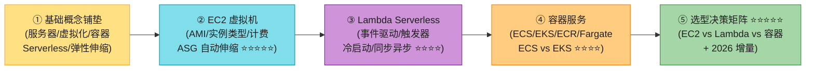

> 💡 **关键信号词**:**"EC2 像租整套独立公寓,自己装修自己管家"** + **"Lambda 像共享厨房,按次收费,只管做菜"** + **"容器是搬着集装箱的中间方案"** + **"Fargate 和 Lambda 都是 serverless,但 Fargate 跑长任务(容器),Lambda 跑短任务(函数)"**——这四句直接拿下面试。

---

## 🗺️ 章节概览

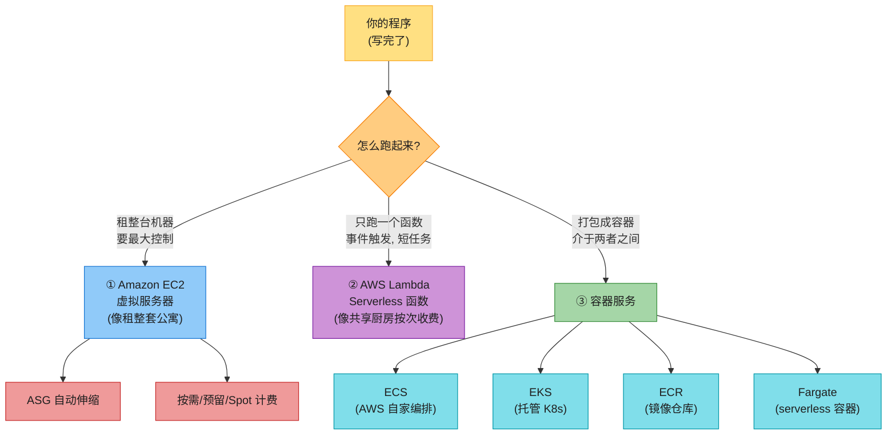

| 小节 | 要点 | 重要性 |
|------|------|--------|
| **🧱 基础概念铺垫** | 服务器/虚拟化(Hypervisor)/容器 vs VM/Serverless/弹性伸缩本质 | ⭐⭐⭐⭐⭐(非科班必看) |
| **1. Amazon EC2** | 虚拟服务器/AMI/实例类型/计费模式/ASG/user-data | ⭐⭐⭐⭐⭐ |
| **2. AWS Lambda** | 事件驱动/触发器/同步异步轮询/冷启动/部署包 | ⭐⭐⭐⭐ |
| **3. 容器服务** | ECS(EC2 vs Fargate)/EKS/ECR/Fargate | ⭐⭐⭐⭐ |
| **4. 选型决策矩阵** | EC2 vs Lambda vs 容器大对比 + 决策树 | ⭐⭐⭐⭐⭐ |
| **贯穿案例** | 图片转卡通应用三种方式部署 | ⭐⭐⭐⭐⭐ |
| **2026 现代增量** | Graviton4/SnapStart 扩展/App Runner/Inferentia2/Nitro Enclaves | ⭐⭐⭐⭐⭐ |

---

## 🧱 基础概念铺垫(给非科班读者)⭐⭐⭐⭐⭐

> 💡 **为什么单独开这一节?** 原书假设你已经懂"服务器""虚拟机""容器""serverless"这些词,直接讲 AWS 服务。但你是**非计算机科班**的自学者,可能第一次碰这些概念。这一节用最直白的比喻把它们讲透,后面所有 AWS 计算服务才看得懂。**这是本章和原书最大的区别——原书跳过的基础,我们补上。**

### 铺垫 1:什么是"服务器/计算"?——后厨与厨师的比喻

**问题**:你在自己电脑上写了个程序(比如图片转卡通),它只能在你电脑上跑。怎么让别人也能用?

**关键认识**:**程序 = 菜谱**,**运行程序的机器 = 厨师**。你的个人电脑就是一个"厨师",但只有你家的厨房能用。要让全世界的顾客(用户)都能点到这道菜,**你需要一个"全天开门的餐厅"——这就是服务器**。

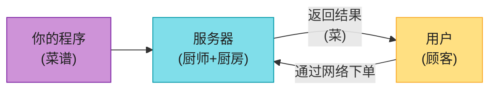

**服务器(server)的核心特征**(背):
- **本质上就是一台电脑**——有 CPU、内存、硬盘、网卡,和你家电脑一样。
- **但它几乎永不关机**(高可用)——专门为了"接受请求并返回响应"而存在。
- **它有公网地址**(公有 IP),别人能通过网络找到它。

> 💡 **AWS 提供的"计算服务"= 把服务器做成各种形式租给你**。最基本的形式叫 **EC2**,就是租一台"虚拟服务器"。

### 铺垫 2:什么是"虚拟化/Hypervisor"?——一栋楼隔成很多房间出租

**问题**:AWS 有几十万台物理服务器(裸金属 bare-metal),每台都很贵。如果每个客户都独占一台,既浪费(用不满)又太贵(客户付不起整台)。怎么办?

**解决**:**虚拟化(Virtualization)**——用一个叫 **Hypervisor(虚拟机监视器)** 的软件,**把一台物理服务器"隔"成好几台"虚拟机"(VM)**,每台虚拟机像独立的小电脑一样运行自己的操作系统。

**比喻**:
- **裸金属(Bare-metal)服务器** = **租整栋独栋别墅**——你一个人用整栋,最贵最自由,但邻居噪音、清洁都得自己管,而且大部分房间空着浪费。
- **虚拟机(VM)实例** = **一栋大楼隔成很多公寓出租**——每户有自己独立的房间、独立的门锁(操作系统隔离),共享同一栋楼的地基和水电(物理硬件),**便宜多了**。

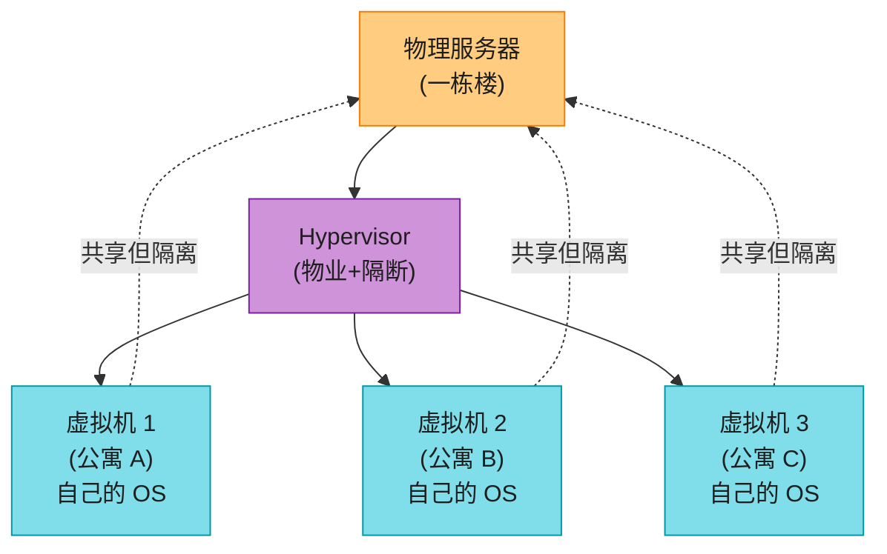

**AWS 支持两种 Hypervisor**(背):
- **Xen**——老一代虚拟化技术,AWS 早期主力,现在已基本退役。
- **Nitro**——AWS 自研的新一代虚拟化系统,**用专门的硬件卡卸载网络/存储/管理任务**,让虚拟机性能几乎接近裸金属。**2026 几乎所有新实例都是 Nitro**。

> 📝 **"实例(instance)"这个词**:在 AWS 里,**一台虚拟机就叫一个"实例"**。这是 AWS 文档的高频词,记住它就是"虚拟机"。

> 🪤 **追问陷阱**:"一个 EC2 实例对应一台物理服务器吗?" → **不一定**。多台 EC2 实例可能挤在同一台物理机上(共享租户 shared tenancy),除非你专门买**专属实例(Dedicated Instance)**或**专属主机(Dedicated Host)**独占一台。

### 铺垫 3:容器 vs 虚拟机——集装箱 vs 公寓

> 📝 **容器和 Docker 的原理在 aws_07 已讲透**(镜像/容器/分层/Dockerfile/部署演进)。这里只用比喻再讲一遍本质区别,不重复细节。

**虚拟机(VM)的问题**:每台 VM 都要装**完整的操作系统**(Windows/Linux),操作系统动辄几个 GB,**启动慢(分钟级)**,**占资源多**。如果你只想跑一个"图片转卡通"的小程序,却要为每台 VM 都装一套完整 OS,太浪费。

**容器的解决**:不装完整 OS,**只打包"程序本身 + 它依赖的库"**,共享宿主机的内核。启动快(秒级),占用小(MB 级),**可以一台机器跑几百个容器**。

**两个比喻**(背,面试随便答):

| 类型 | 比喻 | 隔离层级 | 启动时间 | 占用 | 迁移性 |
|------|------|---------|---------|------|--------|
| **虚拟机 VM** | **公寓**——每套公寓有自己独立的"地基+墙"(完整 OS),彻底隔离但占地大 | 操作系统级(完整 OS) | 分钟 | GB 级 | 差(整栋搬迁) |
| **容器 Container** | **集装箱**——标准化尺寸,共享地基(宿主机内核),搬到哪都能用,轻便 | 应用级(共享内核) | 秒 | MB 级 | **极好**(标准集装箱) |

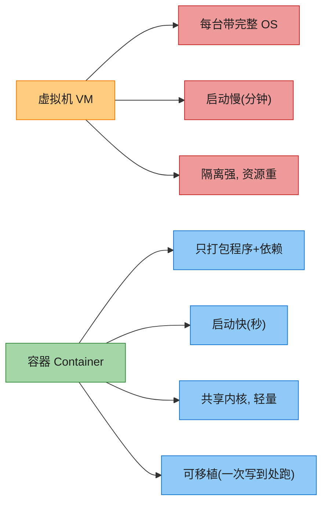

> 🪤 **一句话区分(背)**:**容器和虚拟机的本质区别是"隔离层级"——虚拟机隔离在 OS 层(每台完整 OS),容器隔离在应用层(共享宿主内核)**。容器更轻更快更易迁移,但隔离弱于 VM。

> 💡 **AWS 怎么跑容器**:AWS 提供了 **ECS**(自家编排)和 **EKS**(托管 K8s)两种"容器管家",还有 **Fargate**(serverless,连宿主机都不用管)。详见第 3 节。

### 铺垫 4:什么是 Serverless?——共享厨房按次收费

**问题**:就算用了容器,你还得管"宿主机"(EC2 实例)——什么时候扩容、什么时候缩容、OS 补丁、安全更新……**这些运维杂活让开发者分心**。能不能干脆**不管服务器,只管写代码**?

**解决**:**Serverless(无服务器)**——你**只上传代码(函数)**,**AWS 全权负责**:启动服务器、扩容、缩容、打补丁、高可用。你**只为代码实际执行的那点时间付费**。

**比喻**:**共享厨房按次收费**——你不用租整套带厨房的公寓(EC2),也不用搬集装箱进自家仓库(容器),而是**去共享厨房,带自己的菜谱(Lambda 函数),用一次付一次的钱**。厨房的清洁、维护、扩容(高峰加灶台)都是房东(AWS)的事。

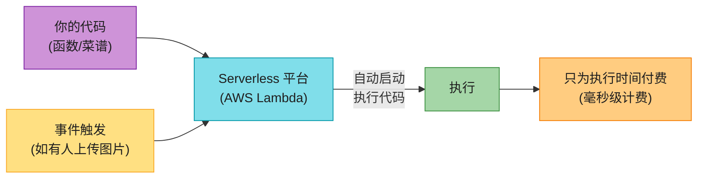

**Serverless 的核心特征**(背):
- **不用管服务器**——AWS 全权负责底层(扩容/补丁/HA)。
- **事件驱动(event-driven)**——代码不是常驻运行的,而是**有"事件"触发才跑**(有人上传图片、有定时任务、收到 API 请求)。
- **按用量计费**——**只为代码实际执行的次数 + 时长付费**,空闲时不收钱。
- **自动伸缩**——流量来了自动加实例,流量走了自动缩。

> 🪤 **常见误解**:"Serverless 是不是没有服务器?" → **错,当然有服务器**——只是服务器由 AWS 管,**你看不见也不用管**。Serverless 是"服务器对你隐形",不是"没有服务器"。

> 💡 **AWS 的两大 serverless 计算服务**:**Lambda**(函数级 serverless,短任务)和 **Fargate**(容器级 serverless,长任务)。两者都是 serverless 但定位不同,后面会详细对比。

### 铺垫 5:什么是"弹性伸缩(Autoscaling)"?——餐厅高峰期自动加桌

**问题**:你开了一家餐厅(应用),中午 12 点人满为患(高流量),凌晨 3 点只有几桌客人(低流量)。**如果永远只开固定数量的桌位**——高峰期顾客等不到位子(服务变慢/拒绝请求),低谷期桌位空着浪费(白付钱)。

**解决**:**弹性伸缩(Autoscaling)**——**根据负载自动增加或减少资源**。高峰期自动加桌,低谷期自动收桌。

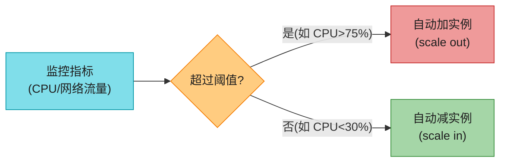

**两个方向**(背):
- **Scale out / scale in(水平伸缩)**——**增加/减少实例数量**(加桌/收桌)。AWS EC2 的 Autoscaling 主要做这个。
- **Scale up / scale down(垂直伸缩)**——**升级/降级单台实例的配置**(把小桌换成大桌)。比如从 2 核换成 8 核实例。

> 💡 **"弹性"是云的最大卖点**——传统机房扩容要买服务器(几周到几个月),AWS 弹性伸缩**几分钟就能加机器**。**autoscaling 原理在 aws_06(网络协议章)已涉及,本章只讲 EC2 ASG 怎么落地**。

---

## 1. Amazon EC2(虚拟服务器)⭐⭐⭐⭐⭐

**Amazon EC2(Elastic Compute Cloud)** 是 AWS **最古老、最基础、最广泛使用**的计算服务——它就是**租一台虚拟服务器**给你,你可以登录、装软件、跑程序,跟用自家电脑几乎一样,只是它在 AWS 的机房里、有公网地址、永不关机。

**EC2 解决的问题**:
- **不用买物理服务器**——按需租,几分钟启动。
- **想多大就多大**——从 1 核到几百核,从 0.5GB 到几 TB 内存,任你选。
- **想跑多久跑多久**——按秒计费,关掉就不收钱(按需模式)。
- **完全自主**——你拥有 root 权限,想装什么装什么(和自家电脑一样)。

> 💡 **EC2 的定位**:**控制力最强 + 运维负担最重**。它给你最大自由,代价是所有杂活(打补丁、备份、扩容、监控)都要你自己做。这是和 Lambda/Fargate 的核心区别。

### 1.1 EC2 是什么 & AMI(机器镜像)

**启动一台 EC2 实例**,你需要告诉 AWS 三件事:
1. **用什么"模板"** —— 即 **AMI**。
2. **什么配置** —— 即 **实例类型(instance type)**。
3. **放哪 / 怎么连 / 怎么防护** —— 区域/AZ、密钥对、安全组、网络。

**AMI(Amazon Machine Image,Amazon 机器镜像)** = **一个预配置的"装机包"**——包含操作系统、必要的软件、配置,用来启动 EC2 实例。**比喻:AMI 像一份"装机 U 盘"——插上它启动,就得到一台装好系统的电脑**。

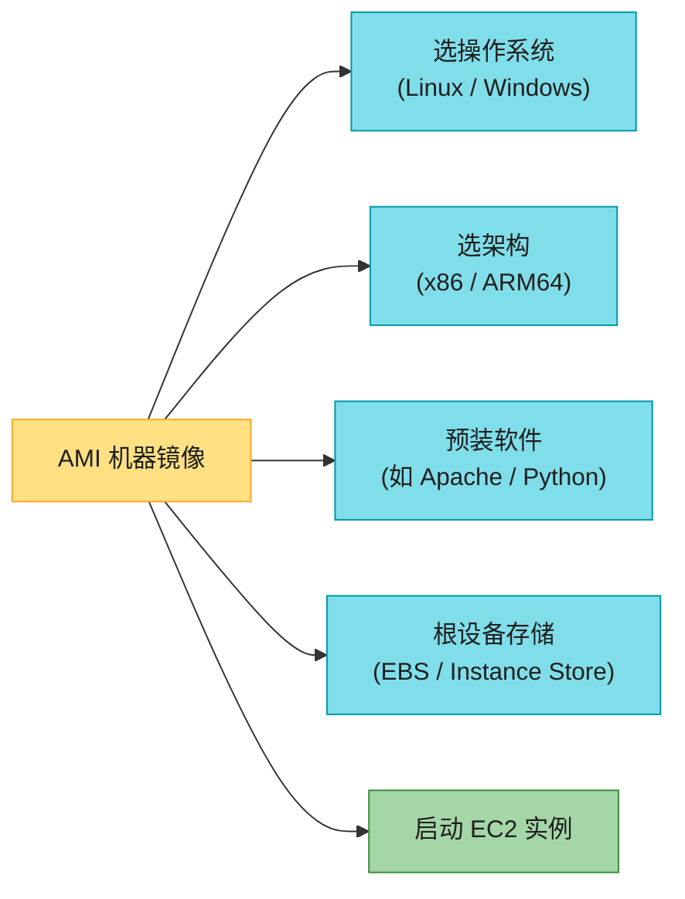

**AMI 从哪来?**(背):
- **AWS 提供**——比如 Amazon Linux 2023、Ubuntu、Windows Server,**免费**。
- **AWS Marketplace**——第三方卖的商业 AMI(如 Red Hat、预装 Oracle 的 AMI),**要付费**。
- **社区共享**——AWS 社区用户上传的免费 AMI。
- **自己做(custom AMI)**——把一台配好的 EC2 做成镜像,以后批量启动。**这是企业级的标准做法**(把安全补丁/监控 agent 全装好再做镜像,保证每台新机器都符合规范)。

**AMI 的几个考量**(原书强调):
- **Region 绑定**:AMI 属于某个 Region,跨 Region 要"复制 AMI"。
- **架构**:AMI 分 x86 和 ARM64(Graviton)两种架构,**必须和实例类型匹配**。
- **根设备**:AMI 可以用 **EBS** 做根盘(主流,启动快 < 1 分钟),也可以用 **Instance Store**(启动慢 < 5 分钟,但实例本地盘快)。**详见 aws_10 存储章**。

> 💡 **生产最佳实践**:**自己做黄金镜像(golden AMI)**——把基线安全补丁、监控 agent、日志采集器都装进去,所有新启动的 EC2 都用这个 AMI,保证一致性。可以用 **EC2 Image Builder** 自动化这个过程。

### 1.2 虚拟化:Bare-metal / Xen / Nitro

启动 EC2 时你要选**底层虚拟化方式**——这决定了"这台实例跑在什么样的硬件上"。

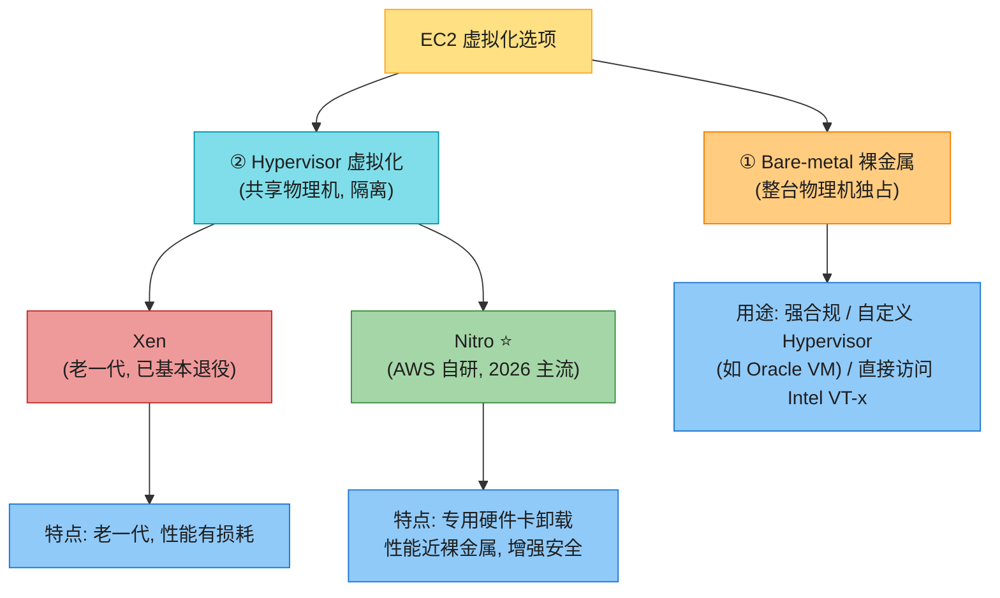

**Bare-metal server(裸金属服务器)**(原书定义):
- **物理服务器独占给一个租户**——不经过 Hypervisor,你直接拿到物理硬件。
- **适合场景**:强合规要求(金融/医疗)、要跑自定义 Hypervisor(如 Oracle VM)、需要直接访问 Intel VT-x 等硬件特性的工作负载。

**Hypervisor 虚拟化**:
- **Xen**——开源虚拟化,AWS 早期主力,因性能损耗和管理开销,2026 已基本退役。
- **Nitro**——**AWS 自研的下一代虚拟化系统**,核心创新是用**专用硬件卡**(Nitro Card)把网络、存储、管理任务从 CPU 卸载到硬件上,**让虚拟机性能几乎接近裸金属**,同时提供更强的安全隔离。

> 📝 **2026 现实**:**几乎所有新发布的 EC2 实例都是 Nitro 系统**(从 2017 年的 C5 开始就全面 Nitro)。Xen 只剩少数老机型(.large/.xlarge 之类)还在用,新业务根本不会碰到。**Nitro 还衍生出 Nitro Enclaves(机密计算)和 NitroTPM(可信启动)**,详见 2026 增量。

### 1.3 实例类型选型(通用/计算/内存/存储/加速 + Graviton ARM)⭐⭐⭐⭐⭐

**实例类型(instance type)** 决定了 EC2 的**硬件配置**——多少 vCPU、多少内存、什么网络、有没有 GPU。AWS 提供了几百种实例类型,按"家族(family)"分类。

**命名规则**(背,面试会问):`m5.large` / `c7g.xlarge` / `p5.48xlarge`
- **第一个字母**= 家族(M=通用、C=计算优化、R=内存优化、I=存储优化、P/G/Inf/Tr=加速计算)。
- **数字**= 代数(5/6/7/8,越大越新)。
- **可选字母**(如 `g`)= 处理器(`g`=Graviton ARM、`a`=AMD、`i`=Intel)。
- **点后**= 大小(`large`=2vCPU、`xlarge`=4、`2xlarge`=8……一直到 `48xlarge`)。

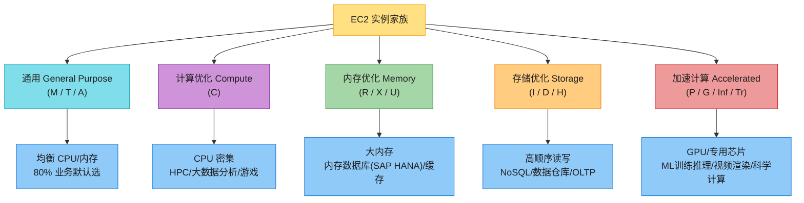

**五大实例家族详解**(背):

| 家族 | 代表 | 一句话定位 | 典型场景 |
|------|------|----------|---------|
| **通用 General-purpose** | M7、T4、A1 | **CPU/内存均衡** | 大多数业务(默认选这个);**T 系列有"突发积分"**——平时省,高峰能借 CPU |
| **计算优化 Compute** | C7 | **CPU 强,内存相对少** | 高性能计算(HPC)、批处理、游戏服务器、广告投放、大数据分析 |
| **内存优化 Memory** | R7、X、U | **超大内存** | 内存数据库(SAP HANA、Redis 大集群)、大缓存、关系数据库、实时分析 |
| **存储优化 Storage** | I4、D、H | **超大本地存储 + 高顺序 IO** | NoSQL(Cassandra/MongoDB)、数据仓库、OLTP、分布式文件系统 |
| **加速计算 Accelerated** | P5(GPU)、G5、Inf2、Tr2 | **带 GPU/专用加速芯片** | ML 训练/推理、视频渲染、科学计算、计算金融 |

> 💡 **选型经验(背)**:**不知道选什么,先选通用型(M 系列或 T 系列)**,跑起来观察指标,再做压测找瓶颈,根据瓶颈换家族。**AWS 自己的文档也是这么建议的**。

**AWS Graviton(ARM 处理器)**⭐⭐⭐⭐⭐:
- **Graviton 是 AWS 自研的 ARM 架构处理器**(由 Annapurna Labs 设计,基于 ARM Neoverse 核心)。
- **Graviton2(2020)**——比 x86 **性价比高 40%**,能效高 60%,启动了 ARM 在云上的逆袭。
- **Graviton3(2021)**——单核性能再提升 25%,特别优化了加密和 ML 工作负载。
- **Graviton4(2023-2024)**——核心数翻倍(最多 96 核),内存带宽大增,**全面追平甚至超越 x86**。

> 🪤 **追问陷阱(高频)**:"Graviton 为什么便宜?" → **三个原因**:① **ARM 架构能效高**——同样算力功耗更低,数据中心电费/散热成本低,AWS 把省下的成本让利给客户;② **AWS 自己设计芯片**——不依赖 Intel/AMD 的溢价,垂直整合降本;③ **没有 x86 的授权费**——ARM 授权模式便宜。所以 **Graviton 实例通常比同档 x86 便宜 20%**,且很多场景性能相当甚至更好。**前提是你的代码能跑在 ARM 上**(大部分 Java/Python/Go/Node 应用都没问题)。

> 📝 **2026 趋势**:**Graviton 已是 AWS 新实例的默认选择**——所有新发布的服务端实例(如 R8/M8/C8)都首选 Graviton4。**ARM 在云上全面胜利**,x86 主要保留给"必须用 Intel 特定指令集"的老应用。

### 1.4 计费模式:按需 / 预留 / Spot 竞价 ⭐⭐⭐⭐⭐

**这是 EC2 选型的核心权衡——花多少钱能跑这个工作负载**。AWS 提供三种主要计费模式:

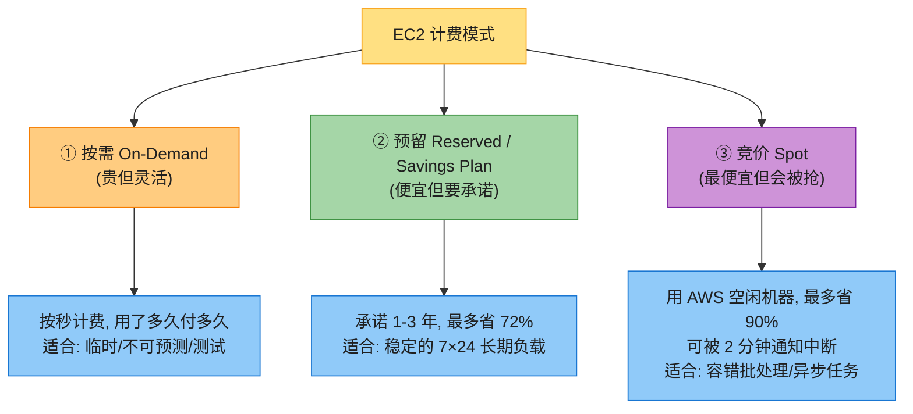

**三种模式详解**(背):

| 模式 | 怎么计费 | 折扣 | 适合谁 | 风险 |
|------|---------|------|-------|------|
| **按需(On-Demand)** | 按实际运行秒数计费,无承诺 | 0% | 临时任务、开发测试、不可预测流量、新业务试水 | 贵(原价) |
| **预留实例(RI)/ Savings Plan** | 承诺用 1 年或 3 年,提前付钱或承诺消费 | **省 30%-72%** | 稳定的 7×24 长期负载(数据库、核心服务) | 锁定(没用满也付钱) |
| **竞价(Spot)** | 用 AWS 数据中心**空闲的机器**,出价竞拍 | **省最多 90%** | 容错的批处理、异步任务、CI/CD、大数据(Spark) | **可被 2 分钟通知中断**(AWS 要回收机器) |

**Spot 实例的工作原理**(原书例子,背):
- 假设 us-east-1a 有 **100 台 m4.large 容量**,其中 50 台已被客户用,30 台 AWS 预测马上有客户要,**剩 20 台空着没人用**——AWS 把这 20 台作为 Spot 出来拍卖,**价格便宜很多**。
- 当真实客户要这 30 台时,AWS 会**中断 Spot 用户**,把机器腾出来给按需/预留客户(优先级更高)。
- **中断机制**:AWS 给 Spot 实例发一个**"2 分钟终止警告"**(2023 改进为支持"停止 vs 终止"两种,停止的可以再启动),你的程序必须能在这 2 分钟内**优雅保存状态、检查点、退出**。

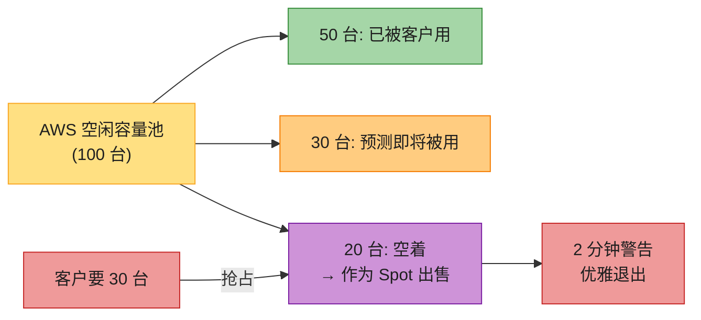

> 🪤 **超高频追问陷阱**:"Spot 实例能不能跑数据库?" → **不能(强烈不建议)**!数据库是有状态的,**Spot 被中断会丢数据 / 中断连接**。Spot 只适合**无状态、可重启、可容错**的工作负载——批处理、CI/CD、Spark/EMR、异步任务、模型训练(要支持检查点)。**数据库选预留实例或按需**。

> 💡 **成本优化的"金组合"**:**核心数据库/服务用预留实例(RI)**保稳定 + **批处理/CI/ML 训练用 Spot**省大钱 + **临时突发用按需**填峰。这是企业级标配。

### 1.5 Autoscaling 自动伸缩组(ASG)+ 与 ELB 配合

> 📝 **autoscaling 通用原理在 aws_06(网络章)和 aws_01(权衡章)讲过**。这里只讲 EC2 的 ASG 怎么落地。

**Autoscaling Group(ASG,自动伸缩组)** = **一组 EC2 实例的集合**,配合伸缩策略,**根据负载自动增加或减少实例数量**。

**ASG 的三个核心配置**(背):
1. **最小值(min)**——始终保持的最少实例数。
2. **最大值(max)**——最多不超过多少实例。
3. **期望值(desired)**——目标实例数(伸缩会朝这个值调整)。

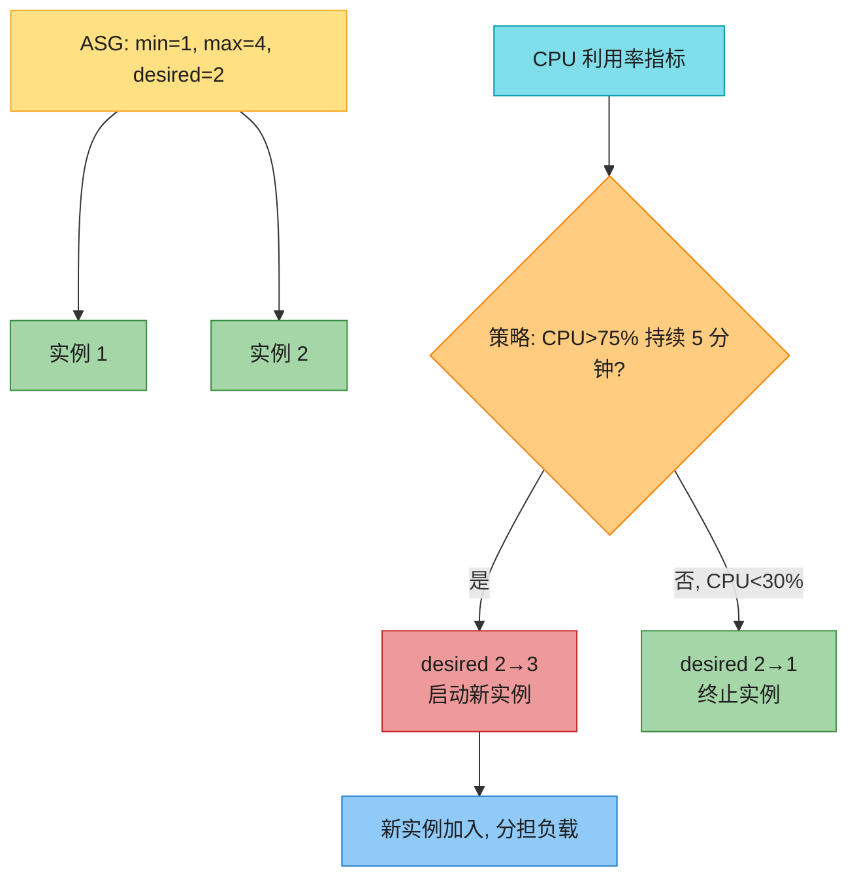

**ASG 伸缩的触发指标**(背):
- **CPU 利用率**(最常用,如 CPU>75% 持续 5 分钟)。
- **网络流量**(进/出带宽)。
- **请求数**(配合 ALB 的 RequestCountPerTarget)。
- **自定义指标**(如队列长度,通过 CloudWatch)。

**和 ELB 配合**(高频考点,引用 aws_09):

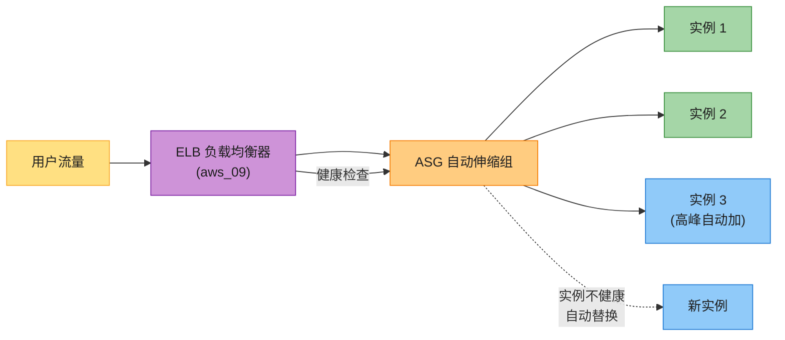

**ASG + ELB 的经典组合**(背):
- **ELB 把流量分发到 ASG 里的所有实例**——扩容时新实例自动注册到 ELB,缩容时优雅摘除。
- **ELB 做健康检查**——发现实例不健康,通知 ASG,**ASG 自动终止坏实例并启动新实例**(自愈能力)。
- **多 AZ 容灾**——ASG 配置跨多 AZ,某 AZ 挂了,ASG 在其他 AZ 自动补充实例。

**ASG 的局限**(原书强调):
- **应对尖峰流量慢**——启动新 EC2 实例需要时间(几十秒到几分钟),**对于突发的大流量峰值,ASG 可能来不及扩容导致服务降级**。
- **应对方法**:**预扩容(prescaling)**——预测高峰(如 NFL 比赛、黑色星期五)提前手动扩容;或**降低扩容阈值**(如 CPU>60% 而不是 80%)提前触发。
- **冷却时间(cooldown)**——默认 300 秒,伸缩活动后等冷却时间结束才允许下一次伸缩,**避免抖动**(刚扩容指标还没下降又扩)。

> 💡 **小镜像启动快**:**AMI 越小,启动越快**。把应用镜像做得尽量小,不包含多余依赖,新实例启动后能更快加入服务。这是应对尖峰流量的实用技巧。

### 1.6 user-data(启动脚本)

**user-data** = **EC2 启动时自动执行的脚本**——开机时跑一段 shell/PowerShell,**自动装软件、启动服务**,无需人工登录操作。

**典型 user-data 脚本**(装 nginx 并启动):

```bash
#!/bin/bash
yum update -y
yum install -y nginx
systemctl start nginx
systemctl enable nginx
echo "<h1>Hello from $(hostname -f)</h1>" > /usr/share/nginx/html/index.html
```

**user-data 的价值**(背):
- **自动化**——批量启动 100 台 EC2 都不用登录每台装软件。
- **可重复**——同样的 AMI + 同样的 user-data = 完全一致的实例。
- **配合 ASG**——ASG 自动启动的新实例,会用 user-data 自动配置好,真正"开箱即用"。

> 💡 **最佳实践**:**复杂初始化用 AMI,简单配置用 user-data**。把变化少的部分(基础环境、安全补丁)做进 AMI,变化多的部分(应用版本、环境变量)用 user-data 注入。这样既能快速启动,又保持灵活性。

### 1.7 EC2 的其他关键点

- **密钥对(Key Pair)**:启动 EC2 时选一个,**SSH 登录时验证身份**——私钥你自己保管,公钥 AWS 放进实例。**丢了私钥就登不进去**(但有 SSM Session Manager 可以替代 SSH)。
- **安全组(SG)**:实例级防火墙,控制哪些端口能进能出。**详见 aws_09 网络章**——本章不重复。
- **EBS 挂载**:EC2 的系统盘/数据盘用 EBS(块存储)。**详见 aws_10 存储章**。
- **多 AZ 部署**:ASG 跨多 AZ,某 AZ 故障不影响整体。**详见 aws_09**。
- **EC2 自动恢复**:实例硬件故障时,AWS 可以自动**用相同配置(实例 ID、IP、EBS、EIP)重新启动**实例。

> 💡 **EC2 一句话总结**:**EC2 = 租一台虚拟机,完全自主,适合需要深度控制的工作负载(数据库、长期服务、特殊配置)**。代价是运维负担重。

---

## 2. AWS Lambda(Serverless 函数)⭐⭐⭐⭐

**AWS Lambda** 是 AWS 的**完全托管的 serverless 计算服务**——你**只上传代码(函数)**,AWS 负责所有底层运维(服务器、扩容、补丁、高可用),**按代码实际执行的次数 + 时长计费**,空闲时零成本。

**Lambda 解决的问题**:
- **不管服务器**——你只写函数,AWS 管底层。
- **事件驱动**——有事件(如 S3 上传图片)才触发执行,没事件不收钱。
- **自动伸缩**——从 0 个请求到几千个并发,AWS 自动处理。
- **按用量付费**——只为执行时间付费(毫秒级计费),**省钱**(对低频任务)。

> 💡 **Lambda 的定位**:**控制力最弱 + 运维负担最轻 + 适合短任务**。它把"服务器"完全藏起来,代价是有一堆限制(执行时间上限、内存上限、冷启动)。

### 2.1 Lambda 是什么 & 事件驱动模型

**Lambda 的核心概念**(背):

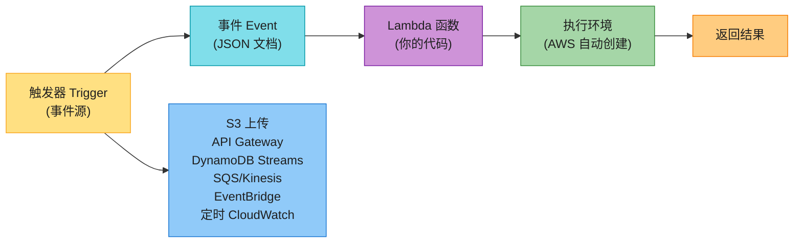

| 概念 | 说明 | 例子 |
|------|------|------|
| **函数 Function** | 你写的代码(支持 Python/Node.js/Java/Go/Ruby/.NET 等),用一个触发器调用执行特定逻辑 | 处理上传图片的 Python 函数 |
| **触发器 Trigger** | 任何能调用 Lambda 的资源/配置 | S3 桶、API Gateway、SQS 队列、定时任务 |
| **事件 Event** | 传给 Lambda 函数的输入数据(JSON 格式),含触发上下文 | `{"bucket": "photos", "key": "cat.jpg"}` |
| **执行环境 Execution Environment** | AWS 后端为函数创建的**安全隔离运行时**,配内存/语言运行时/超时 | Python 3.11 + 512MB 内存 |
| **部署包 Deployment Package** | 函数代码的打包方式 | `.zip`(≤250MB)或 **容器镜像(存 ECR,≤10GB)** |
| **层 Layers** | 公共代码(库/工具)打包成层,可挂到多个函数复用 | 一个装了 Pandas 的层 |
| **目标 Destination** | 异步执行完成后,把成功/失败记录发到另一个 AWS 服务 | SQS/SNS/Lambda/EventBridge |

**事件驱动(event-driven)的本质**:**Lambda 不是常驻运行的**——它"睡"着等事件,事件来了才"醒来"执行。这和 EC2(永远在跑)是根本区别。

**两种架构对比**:

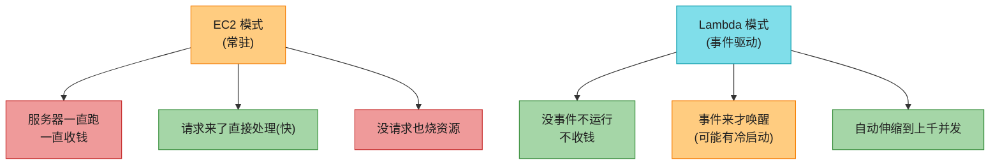

### 2.2 三种调用模式:同步 / 异步 / 轮询 ⭐⭐⭐⭐

Lambda 怎么被触发,取决于**触发它的源服务**。AWS 把调用方式分成三类:

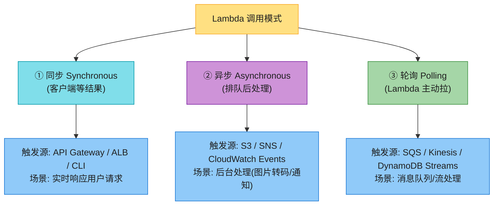

**三种模式详解**(背):

| 模式 | 触发源 | 工作方式 | 错误处理 | 适用 |
|------|--------|---------|---------|------|
| **同步(Synchronous)** | API Gateway、ALB、AWS CLI、SDK | 客户端**阻塞等待** Lambda 执行完返回结果 | 客户端负责重试 | 实时 API、用户请求、Web 后端 |
| **异步(Asynchronous)** | S3(对象上传)、SNS、CloudWatch Events/EventBridge | 触发后**立即返回**,请求进 Lambda 内部队列,异步处理;支持重试 + 目标(Destination) | 自动重试(默认 2 次),失败可发到死信队列(DLQ)或 Destination | 后台任务、通知、批处理 |
| **轮询(Polling)** | SQS、Kinesis、DynamoDB Streams、Kafka(MSK) | **Lambda 主动轮询**源服务,拉到消息后同步执行;**轮询本身不收费**(只收 Lambda 执行费) | 重试依赖源服务的消息保留(SQS 1 分钟-14 天) | 消息队列消费、流处理 |

> 🪤 **追问陷阱**:"Lambda 同步调用和异步调用怎么选?" → **看响应需求**:用户要立即看到结果(HTTP API)→ 同步(API Gateway 触发);不要求立即响应(上传图片后转码)→ 异步(S3 直接触发)。**异步模式还能配置重试和目标(Destination)**,适合可靠的后台处理。

> 💡 **执行超时**:Lambda 最长执行时间 **15 分钟**(原书强调)。但**通过其他服务触发时可能更短**——比如 API Gateway 触发的 Lambda,API Gateway 自己有 29 秒超时,所以即使 Lambda 能跑 15 分钟,API Gateway 也只等 29 秒。**这决定了 Lambda 只适合短任务**。

### 2.3 冷启动(Cold Start)⭐⭐⭐⭐⭐(本章重点之一)

**冷启动(cold start)** 是 Lambda 最经典的问题,面试**必问**。

**什么是冷启动**:Lambda 函数第一次被调用(或长时间没调用后),AWS 需要**从头创建执行环境**——下载代码、初始化运行时、加载依赖、执行初始化代码——**这段时间用户在等**,可能 **100ms 到数秒**(Java 函数尤其慢)。

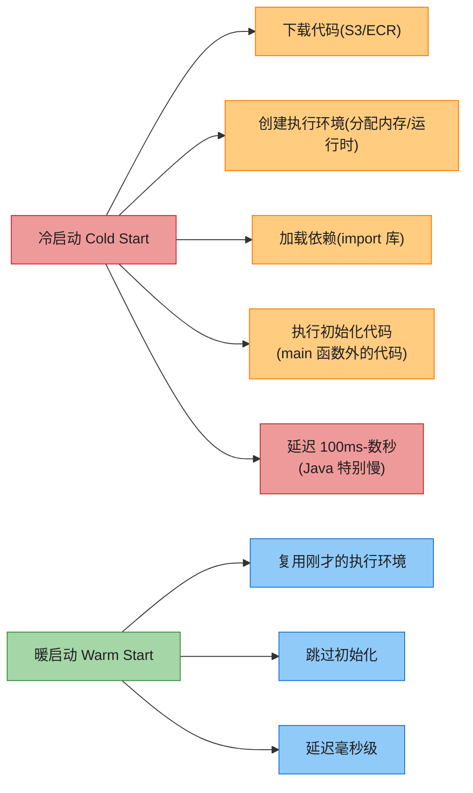

**暖启动(warm start)**:Lambda 执行完后,**执行环境不会立即销毁**,而是保留一段时间。**短时间内再次调用同一个函数,会复用这个环境,跳过初始化,毫秒级响应**——这就是暖启动。

**AWS 官方统计**:冷启动大约影响 **1% 的总调用**(生产环境),大部分请求是暖启动。但**对延迟敏感的场景**,这 1% 仍是问题。

**减少冷启动的方法**(背):

| 方法 | 做法 | 适用 |
|------|------|------|
| **Provisioned Concurrency(预置并发)** | **提前预热好若干个执行环境**,请求来了直接用,零冷启动 | 延迟敏感、高并发生产服务 |
| **优化初始化代码** | 只 import 必要依赖,把重活放函数外(只执行一次) | 所有 Lambda |
| **减小部署包** | 删除不用的依赖,精简镜像 | 所有 Lambda |
| **选轻量语言** | Python/Go/Node 启动快;**Java 最慢**(JVM 重) | 新项目 |
| **SnapStart(Java)** | 对 Java 函数,**拍摄初始化后的内存快照**,新调用从快照恢复 | **仅 Java**(2024 扩展到 Python/.NET) |
| **暖启动技巧(临时方案)** | 用 CloudWatch 定时器定期触发(保持环境暖) | 不推荐生产,只适合小流量 |

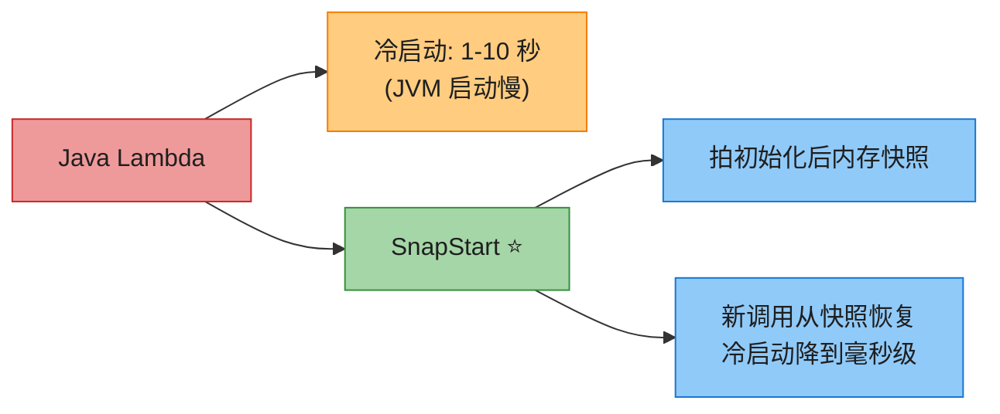

> 🪤 **追问陷阱(超高频)**:"Lambda 冷启动怎么治?" → **四板斧**:① **Provisioned Concurrency**(预热并发,最彻底但要钱);② **优化初始化**(只 import 必要库,大头放函数外);③ **减小部署包**(删冗余依赖);④ **Java 用 SnapStart**(拍快照,毫秒级)。**架构层**:把"用户能感知延迟"的逻辑放同步 Lambda,把"重活"异步化到另一个 Lambda。

### 2.4 部署包:.zip vs 容器镜像

Lambda 函数代码有两种打包方式(背):

| 方式 | 大小上限 | 内容 | 适用 |
|------|---------|------|------|
| **.zip 包** | **250 MB**(压缩后) | 代码 + 依赖,AWS 提供 OS 和运行时 | 标准函数 |
| **容器镜像** | **10 GB** | 完整的 OCI 镜像(含 OS + 运行时 + 代码 + 依赖),存 Amazon ECR | 大依赖、自定义 OS、复用 Docker 镜像 |

> 💡 **容器镜像部署 Lambda 的意义**:① 可以**复用已有的 Docker 镜像**(CI/CD 流程统一);② 可以**装大依赖**(如机器学习模型权重);③ 自定义 OS 层。**但运行时仍是 serverless,按 Lambda 模式计费**。

### 2.5 内存配置 & 计费

**Lambda 内存配置**:128 MB 到 **10,240 MB(10 GB)**。

**关键洞察**:**Lambda 的 CPU 算力是按内存比例分配的**——内存越大,CPU 也越强。所以**给 Lambda 加内存,可能反而更快**(因为 CPU 涨了,执行时间缩短,总费用可能更少)。AWS 提供 **Lambda Power Tuning** 工具帮你找最佳内存配置。

**Lambda 计费模型**(背):
- **按执行次数 + 执行时长 + 内存大小** 计费。
- **计费精度**:**原书年代是 100ms**,2023 改为 **1ms**(更精细,省钱)。
- **执行时长** = 从代码开始执行到结束(含初始化时间)。
- **免费额度**:每月 100 万次请求 + 40 万 GB-秒(永久免费层)。

> 💡 **什么时候 Lambda 比 EC2 便宜**:低频、突发的工作负载。一个每天只跑几次的任务,Lambda 几乎免费;EC2 则要 7×24 收钱。**反过来,高频 7×24 的服务,Lambda 可能比 EC2 贵**(这时候用 EC2 或 Fargate 更划算)。

### 2.6 Lambda 适用 / 不适用场景

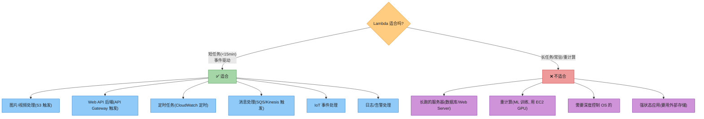

**Lambda 适合**(背):
- **事件驱动的短任务**(< 15 分钟):图片处理、日志处理、定时任务、消息消费、Web API 后端。
- **流量突发的场景**:从 0 到上千并发的瞬时扩展。
- **不规律/低频负载**:按用量付费,空闲零成本。

**Lambda 不适合**(背):
- **长跑/常驻服务**:超过 15 分钟的任务(用 EC2/Fargate)。
- **重计算任务**:ML 训练、大数据处理(用 EC2 加速实例)。
- **需要深度 OS 控制的工作负载**:Lambda 你碰不到底层。
- **强状态应用**:Lambda 执行环境是临时的,状态必须放外部(DynamoDB/S3/ElastiCache)。

> 💡 **Lambda 一句话总结**:**Lambda = 只管写函数,不管服务器,按用量付费,适合事件驱动的短任务**。代价是有执行时间上限 + 冷启动。

---

## 3. 容器服务:ECS / EKS / ECR / Fargate ⭐⭐⭐⭐

> 📝 **不重复 Part I**:容器、Docker、Kubernetes、部署演进(物理机→虚拟机→容器→K8s→serverless)的原理在 **aws_07** 讲透了。本章只讲 **AWS 把容器落地成什么托管服务**,以及它们之间怎么选。

**容器化的核心价值**(复习):**一次写,到处跑**——把应用 + 依赖打包成标准镜像,在开发、测试、生产环境**完全一致地运行**,消除"在我机器上能跑"的问题。

**AWS 容器服务的全貌**:

```mermaid
flowchart TD
    AWS_CTR["AWS 容器服务"] --> REG["镜像仓库"]
    AWS_CTR --> ORCH["编排引擎"]
    AWS_CTR --> COMP["计算后端"]

    REG --> ECR["Amazon ECR<br/>(存 Docker/OCI 镜像)"]

    ORCH --> ECS["ECS<br/>(AWS 自家编排)"]
    ORCH --> EKS["EKS<br/>(托管 Kubernetes)"]

    COMP --> EC2MODE["EC2 模式<br/>(自己管 EC2 实例)"]
    COMP --> FARGATE["Fargate 模式<br/>(serverless, AWS 管宿主机)"]

    ECS --> COMP
    EKS --> COMP

    style AWS_CTR fill:#FFE082,stroke:#F9A825,color:#1f1f1f
    style REG fill:#80DEEA,stroke:#0097A7,color:#1f1f1f
    style ORCH fill:#CE93D8,stroke:#7B1FA2,color:#1f1f1f
    style COMP fill:#A5D6A7,stroke:#388E3C,color:#1f1f1f
    style ECR fill:#90CAF9,stroke:#1976D2,color:#1f1f1f
    style ECS fill:#80DEEA,stroke:#0097A7,color:#1f1f1f
    style EKS fill:#80DEEA,stroke:#0097A7,color:#1f1f1f
    style EC2MODE fill:#FFCC80,stroke:#F57C00,color:#1f1f1f
    style FARGATE fill:#A5D6A7,stroke:#388E3C,color:#1f1f1f
```

### 3.1 Amazon ECS(EC2 模式 vs Fargate 模式)⭐⭐⭐⭐

**Amazon ECS(Elastic Container Service)** 是 AWS **自家研发的容器编排服务**——完全托管、高度可用,负责容器的**部署、运行、扩缩、负载均衡**。

**ECS 的核心概念**(背,面试会问):

```mermaid
flowchart TD
    CLUSTER["ECS Cluster<br/>(集群: 逻辑分组)"] --> SERVICE["ECS Service<br/>(服务: 管一组相同 Task)"]
    SERVICE --> TASK1["Task 1<br/>(运行 1+ 容器)"]
    SERVICE --> TASK2["Task 2"]
    SERVICE --> TASK3["Task N"]

    TASK1 --> CONT1["容器(来自镜像)"]
    TASKDEF["Task Definition<br/>(任务定义: 配置模板)"] --> TASK1
    TASKDEF --> TASK2
    TASKDEF --> TASK3

    style CLUSTER fill:#FFE082,stroke:#F9A825,color:#1f1f1f
    style SERVICE fill:#FFCC80,stroke:#F57C00,color:#1f1f1f
    style TASK1 fill:#A5D6A7,stroke:#388E3C,color:#1f1f1f
    style TASK2 fill:#A5D6A7,stroke:#388E3C,color:#1f1f1f
    style TASK3 fill:#A5D6A7,stroke:#388E3C,color:#1f1f1f
    style CONT1 fill:#80DEEA,stroke:#0097A7,color:#1f1f1f
    style TASKDEF fill:#CE93D8,stroke:#7B1FA2,color:#1f1f1f
```

| 概念 | 说明 | 比喻 |
|------|------|------|
| **Cluster(集群)** | 逻辑分组,所有 Task/Service 跑在里面 | 一栋大楼 |
| **Task Definition(任务定义)** | **JSON 配置模板**——定义 Task 的镜像、CPU/内存、网络、环境变量、端口等 | 装修图纸 |
| **Task(任务)** | 按任务定义**实例化运行**的单位,可含 1 个或多个容器 | 一个装修好的房间 |
| **Service(服务)** | 管理**一组相同的 Task**,负责扩缩、负载均衡、自愈 | 楼层管理员 |

**ECS 的两种启动模式**(必背,面试高频):

```mermaid
flowchart TD
    ECS["ECS 启动模式"] --> EC2M["① ECS EC2 模式"]
    ECS --> FARGM["② ECS Fargate 模式"]

    EC2M --> EC2M1["你自己管 EC2 实例池<br/>选机型/打补丁/扩缩宿主机"]
    EC2M2["✅ 高 CPU/内存需求可定制<br/>✅ 成本可控(用 Spot)<br/>✅ 持久存储(EBS)<br/>❌ 运维负担重"]

    FARGM --> FARGM1["AWS 全权管宿主机<br/>你只指定 Task 的 vCPU/内存"]
    FARGM2["✅ 完全 serverless, 不管服务器<br/>✅ 按 Task 实际资源计费<br/>✅ 适合小/中/突发负载<br/>❌ 不支持 GPU / EBS / 定制少"]

    EC2M --> EC2M2
    FARGM --> FARGM2

    style ECS fill:#FFE082,stroke:#F9A825,color:#1f1f1f
    style EC2M fill:#FFCC80,stroke:#F57C00,color:#1f1f1f
    style FARGM fill:#A5D6A7,stroke:#388E3C,color:#1f1f1f
    style EC2M1 fill:#90CAF9,stroke:#1976D2,color:#1f1f1f
    style EC2M2 fill:#90CAF9,stroke:#1976D2,color:#1f1f1f
    style FARGM1 fill:#90CAF9,stroke:#1976D2,color:#1f1f1f
    style FARGM2 fill:#90CAF9,stroke:#1976D2,color:#1f1f1f
```

**EC2 模式 vs Fargate 模式对比表**(背):

| 维度 | **ECS EC2 模式** | **ECS Fargate 模式** |
|------|------------------|---------------------|
| **谁管宿主机** | **你**——选实例类型/打 OS 补丁/扩缩 EC2 池 | **AWS**——serverless,你完全不管 |
| **定价** | 付 EC2 运行时间(+ 存储) | 付 Task 的 vCPU + 内存(只按 Task 活跃时) |
| **适用** | **高 CPU/内存**需求、**成本敏感**(可上 Spot)、**需要持久存储(EBS)**、合规要自管基础设施 | **低运维**优先、**小到中负载**、**偶尔突发**、批处理工作负载 |
| **限制** | 运维负担重 | **不支持 GPU**、**不支持 EBS**(只能用 EFS 做持久)、定制选项少 |

> 🪤 **追问陷阱(高频)**:"ECS 用 EC2 还是 Fargate?" → **看运维预算和负载特性**:**想要低运维、不要碰服务器、负载不大或波动大 → Fargate**(2026 默认推荐);**要高 CPU/内存定制、要 GPU、要 EBS、要极致成本优化(上 Spot)→ EC2 模式**。

**ECS 与其他 AWS 服务集成**(背):
- **CloudWatch**:监控 Task 指标(CPU/内存/网络)。
- **IAM**:控制 Task 的权限(Task 用一个 IAM Role 访问其他 AWS 服务)。
- **ALB/NLB**:负载均衡到 Task(详见 aws_09)。
- **Cloud Map**:服务发现(容器之间找对方)。

### 3.2 Amazon EKS(托管 Kubernetes)

> 📝 **Kubernetes 原理在 aws_07 讲透了**(Pod/Deployment/Service/控制平面/etcd/调度器)。本章只讲 AWS 怎么托管它。

**Amazon EKS(Elastic Kubernetes Service)** 是 AWS 的**托管 Kubernetes 服务**——AWS 帮你管 K8s 的**控制平面**(API Server、etcd、调度器),你只需管**工作节点**(跑 Pod 的 EC2/Fargate)。

```mermaid
flowchart TD
    EKS["Amazon EKS 集群"] --> CP["控制平面<br/>(AWS 托管)"]
    EKS --> WP["工作节点<br/>(你管或 Fargate)"]

    CP --> CP1["API Server"]
    CP --> CP2["etcd(3 AZ 高可用)"]
    CP --> CP3["调度器 / 控制器"]
    CP --> CP4["自动版本升级<br/>跨 3 AZ, 自动替换故障节点"]

    WP --> WPEC2["EC2 节点<br/>(自己管 + ASG)"]
    WP --> WPFAR["Fargate<br/>(serverless Pod)"]

    style EKS fill:#FFE082,stroke:#F9A825,color:#1f1f1f
    style CP fill:#A5D6A7,stroke:#388E3C,color:#1f1f1f
    style WP fill:#FFCC80,stroke:#F57C00,color:#1f1f1f
    style CP1 fill:#80DEEA,stroke:#0097A7,color:#1f1f1f
    style CP2 fill:#80DEEA,stroke:#0097A7,color:#1f1f1f
    style CP3 fill:#80DEEA,stroke:#0097A7,color:#1f1f1f
    style CP4 fill:#80DEEA,stroke:#0097A7,color:#1f1f1f
    style WPEC2 fill:#90CAF9,stroke:#1976D2,color:#1f1f1f
    style WPFAR fill:#CE93D8,stroke:#7B1FA2,color:#1f1f1f
```

**EKS 的核心价值**(背):
- **托管控制平面**——AWS 管 API Server、etcd、调度器,**消除管理 K8s 控制平面的运维负担**,保证高可用(控制平面跨 3 AZ,自动检测/替换不健康节点)。
- **多 AZ 高可用**——控制平面跨 3 AZ,工作节点也可以跨 AZ 部署。
- **自动版本升级**——AWS 自动处理 K8s 控制平面的版本升级和安全补丁。
- **混合部署**——用 **EKS on Outposts** 可以在本地机房跑 EKS(延迟敏感/合规)。
- **生态丰富**——K8s 是 CNCF 标准,**所有 K8s 工具(Helm/Istio/ArgoCD/Prometheus)都能用**。
- **支持 EC2 和 Fargate 启动类型**(和 ECS 类似)。
- **可用 Spot 实例**省钱,或用 **GPU 优化实例**做高性能计算。

### 3.3 ECS vs EKS 怎么选 ⭐⭐⭐⭐⭐(本章核心对比之一)

这是面试**高频题**——为什么有两个容器服务?怎么选?

```mermaid
flowchart TD
    Q{"团队/业务情况?"} -->|"只想跑容器<br/>不想学 K8s<br/>AWS 单云"| ECS["✅ ECS"]
    Q -->|"已用 K8s<br/>或要多云/混合云<br/>要丰富生态"| EKS["✅ EKS"]
    Q -->"|极端场景<br/>要 100% 控制<br/>愿意自己运维 K8s|"| SELF["自建 K8s(不推荐)"]

    style Q fill:#FFCC80,stroke:#F57C00,color:#1f1f1f
    style ECS fill:#A5D6A7,stroke:#388E3C,color:#1f1f1f
    style EKS fill:#80DEEA,stroke:#0097A7,color:#1f1f1f
    style SELF fill:#EF9A9A,stroke:#C62828,color:#1f1f1f
```

| 维度 | **Amazon ECS** | **Amazon EKS** |
|------|----------------|----------------|
| **谁是标准** | AWS 自家(闭源) | **开源 K8s**(CNCF 标准) |
| **学习曲线** | **简单**——AWS 控制台/CLI/Fargate 直观 | **陡峭**——K8s 概念多(Pod/Deployment/Service/Ingress/CRD) |
| **生态/工具** | AWS 生态为主 | **K8s 全生态**(Helm/Istio/ArgoCD/Prometheus/Grafana) |
| **可移植性** | 绑 AWS | **多云/混合云**(同样的 yaml 在 GKE/AKS/自建都跑) |
| **运维** | 简单(尤其 + Fargate) | 复杂(即使 EKS 托管,工作节点 + K8s 本身仍要懂) |
| **适合** | AWS 单云、不想学 K8s、追求简单 | 已有 K8s 经验、要多云/混合云、要丰富生态、大公司平台团队 |

> 💡 **选型口诀(背)**:**简单优先选 ECS(尤其 + Fargate);要 K8s 生态/多云/混合云选 EKS**。**别为了"显得先进"硬上 EKS**——K8s 的运维成本极高,小团队搞不动。

> 🪤 **追问陷阱**:"为什么不直接在 EC2 上装 K8s?" → **可以,但极不推荐**——你要自己管控制平面(API Server/etcd/调度器)、备份 etcd、版本升级、高可用、安全补丁……**全是你干**。**EKS 把这些全包了**,你只管业务。**生产环境几乎都用 EKS,不自己装**。

### 3.4 Amazon ECR(镜像仓库)

**Amazon ECR(Elastic Container Registry)** 是 AWS 的**托管容器镜像仓库**——存、拉、管理 **Docker / OCI 镜像**,集成 IAM 做权限控制,集成 KMS 做加密。

```mermaid
flowchart LR
    DEV["开发者<br/>构建镜像"] --> PUSH["docker push"]
    PUSH --> ECR["Amazon ECR<br/>(镜像仓库)"]
    ECR --> PULL["docker pull"]
    PULL --> ECS["ECS Task"]
    PULL --> EKS["EKS Pod"]
    PULL --> LAMBDA["Lambda(容器镜像部署)"]

    ECR --> SEC["集成 IAM 权限<br/>集成 KMS 加密<br/>漏洞扫描"]

    style DEV fill:#FFE082,stroke:#F9A825,color:#1f1f1f
    style PUSH fill:#80DEEA,stroke:#0097A7,color:#1f1f1f
    style ECR fill:#A5D6A7,stroke:#388E3C,color:#1f1f1f
    style PULL fill:#80DEEA,stroke:#0097A7,color:#1f1f1f
    style ECS fill:#CE93D8,stroke:#7B1FA2,color:#1f1f1f
    style EKS fill:#CE93D8,stroke:#7B1FA2,color:#1f1f1f
    style LAMBDA fill:#CE93D8,stroke:#7B1FA2,color:#1f1f1f
    style SEC fill:#FFCC80,stroke:#F57C00,color:#1f1f1f
```

**ECR 的价值**:
- **私有镜像仓库**——你的镜像不公开,只授权账号/角色能拉。
- **集成 IAM**——细粒度权限控制(谁能 push/pull 哪个仓库)。
- **漏洞扫描**——push 镜像时自动扫已知漏洞(集成 Amazon Inspector)。
- **生命周期策略**——自动清理旧镜像(只保留最近 N 个版本),省存储。
- **跨 Region 复制**——把镜像自动复制到其他 Region(全球部署)。

> 💡 **典型流程**:**开发者本地/CI 构建 Docker 镜像 → push 到 ECR → ECS/EKS/Lambda 从 ECR pull 镜像运行**。这是 AWS 容器化部署的标准流水线。

### 3.5 AWS Fargate(serverless 容器)⭐⭐⭐⭐

**AWS Fargate** 是 **serverless 容器计算引擎**——它**不是独立服务**,而是 **ECS 和 EKS 的"启动类型"**。用 Fargate 时,**你不用管 EC2 实例池**,**只指定每个容器(Task/Pod)需要多少 vCPU 和内存**,AWS 自动调度到合适的宿主机运行。

```mermaid
flowchart TD
    EC2RUN["传统容器<br/>(EC2 模式)"] --> EC2RUN1["你管 EC2 实例池<br/>选机型/扩缩/补丁"]
    EC2RUN --> EC2RUN2["容器跑在你的 EC2 上"]

    FAR["Fargate 模式"] --> FAR1["AWS 管宿主机<br/>你只指定 Task 的 vCPU/内存"]
    FAR --> FAR2["容器跑在 AWS 调度的机器上<br/>你看不见也管不着"]
    FAR --> FAR3["按 Task 资源 + 运行时间计费<br/>真正的 serverless 容器"]

    style EC2RUN fill:#FFCC80,stroke:#F57C00,color:#1f1f1f
    style EC2RUN1 fill:#EF9A9A,stroke:#C62828,color:#1f1f1f
    style EC2RUN2 fill:#EF9A9A,stroke:#C62828,color:#1f1f1f
    style FAR fill:#A5D6A7,stroke:#388E3C,color:#1f1f1f
    style FAR1 fill:#90CAF9,stroke:#1976D2,color:#1f1f1f
    style FAR2 fill:#90CAF9,stroke:#1976D2,color:#1f1f1f
    style FAR3 fill:#90CAF9,stroke:#1976D2,color:#1f1f1f
```

**Fargate 的核心特征**(背):
- **serverless**——不用管 EC2 实例池,AWS 全权调度。
- **按应用粒度配资源**——每个 Task/Pod 独立指定 vCPU(0.25-16)和内存(0.5-120GB)。
- **按 Task 活跃时间计费**——只付容器实际跑的时间。
- **隔离性更强**——每个 Task 跑在独立的隔离环境里(不像 EC2 模式共享宿主机)。
- **支持 ECS 和 EKS**——两个编排引擎都能用 Fargate。
- **2024 升级:Fargate 支持 GPU**(有限场景,如 Fargate for GPU),但还是不如 EC2 灵活。

**Fargate 的限制**:
- **比 EC2 贵**(同资源下)——你付了"省心"的溢价。
- **定制选项少**——不像 EC2 能选具体机型/网络/EBS。
- **不支持 EBS**——持久存储要用 EFS。
- **大集群不划算**——大量稳定负载,EC2(预留实例)+ Spot 更省钱。

> 🪤 **追问陷阱(超高频)**:"Fargate 和 Lambda 都是 serverless,区别在哪?" → **两者都是 serverless(你不管服务器),但定位不同**:
> - **Lambda** = **函数级 serverless**,适合**短任务**(<15 分钟)、事件驱动、突发流量。
> - **Fargate** = **容器级 serverless**,适合**长任务**、常驻服务、Web Server、不能拆成函数的传统应用。
>
> **一句话**:**Lambda 跑函数(短),Fargate 跑容器(长)**。Web API 既可以用 Lambda + API Gateway,也可以用 Fargate + ALB——前者更省钱(低流量),后者更稳(高流量 + 长连接)。

---

## 4. EC2 vs Lambda vs 容器 —— 选型决策矩阵 ⭐⭐⭐⭐⭐(本章核心对比)

这是本章**最核心**的部分——面试官最爱问"**这三种计算服务怎么选**?"。下面给一张大对比表 + 一个决策流程图。

### 4.1 大对比表(背)

| 维度 | **Amazon EC2** | **AWS Lambda** | **容器(ECS/EKS + Fargate)** |
|------|----------------|----------------|----------------------------|
| **计算模型** | 整台虚拟机(VM) | 函数(FaaS) | 容器(打包的应用) |
| **谁管服务器** | **你**全管(OS/补丁/扩容) | **AWS** 全管(你看不见) | ECS EC2 你管 / **Fargate AWS 管** |
| **启动时间** | 几十秒-分钟 | **冷启动 100ms-数秒**(暖启动 ms) | 秒级(EC2 模式要等 EC2 启动) |
| **运行时长** | 不限(7×24) | **最长 15 分钟** | 不限(7×24) |
| **最大内存** | 数 TB | **10 GB** | 数 TB(EC2 模式)/ 120 GB(Fargate) |
| **GPU 支持** | ✅(P/G/Inf/Tr 系列) | ❌ | ✅(EC2 模式)/ 有限(Fargate) |
| **伸缩模式** | ASG(分钟级) | **自动到上千并发**(毫秒级) | ECS Service/EKS HPA(秒-分钟级) |
| **计费** | 按秒(按需)/ 承诺(预留)/ 拍卖(Spot) | **按次数 + 时长 + 内存**(毫秒级) | EC2 按秒 / Fargate 按 Task 资源 + 时长 |
| **空闲成本** | **一直烧钱**(常驻) | **零**(不调用不收钱) | EC2 一直烧 / Fargate 只 Task 活跃时 |
| **状态管理** | 可有状态(本地盘/EBS) | **无状态**(必须用外部存储) | 容器无状态(用 EFS/EBS 持久) |
| **运维负担** | **最重** | **最轻** | 中等(EC2)/ 轻(Fargate) |
| **控制力** | **最强**(root 权限) | 最弱(碰不到 OS) | 中等 |
| **典型场景** | 数据库/长期服务/特殊配置/重计算 | 事件驱动短任务/Web API 后端/定时任务 | 微服务/容器化应用/已有 K8s 经验 |
| **不适合** | 短任务/事件驱动/不想运维 | 长任务/重计算/需深度控制 | 极简单脚本(用 Lambda)/ 极致自由(用 EC2) |

### 4.2 选型决策流程图(背)

```mermaid
flowchart TD
    START["我有应用要部署"] --> Q1{"运行时长?"}

    Q1 -->|"< 15 分钟 短任务"| Q2{"事件驱动?"}
    Q1 -->|"长任务/常驻"| Q3{"要深度控制 OS?"}

    Q2 -->|"是(上传/定时/消息)"| LAMB["✅ Lambda"]
    Q2 -->|"否(常驻 API)"| Q4{"流量模式?"}

    Q4 -->|"低频/突发"| LAMB
    Q4 -->|"高/稳定"| CTR["✅ 容器(Fargate)"]

    Q3 -->|"要(特殊配置/合规)"| EC2["✅ EC2"]
    Q3 -->|"不要"| Q5{"团队懂 K8s?"}

    Q5 -->|"懂, 要生态/多云"| EKS["✅ EKS + Fargate"]
    Q5 -->|"不懂, 追求简单"| Q6{"要 GPU/重计算?"}

    Q6 -->|"是"| EC2
    Q6 -->|"否"| ECSFAR["✅ ECS + Fargate"]

    style START fill:#FFE082,stroke:#F9A825,color:#1f1f1f
    style Q1 fill:#FFCC80,stroke:#F57C00,color:#1f1f1f
    style Q2 fill:#FFCC80,stroke:#F57C00,color:#1f1f1f
    style Q3 fill:#FFCC80,stroke:#F57C00,color:#1f1f1f
    style Q4 fill:#FFCC80,stroke:#F57C00,color:#1f1f1f
    style Q5 fill:#FFCC80,stroke:#F57C00,color:#1f1f1f
    style Q6 fill:#FFCC80,stroke:#F57C00,color:#1f1f1f
    style LAMB fill:#CE93D8,stroke:#7B1FA2,color:#1f1f1f
    style EC2 fill:#90CAF9,stroke:#1976D2,color:#1f1f1f
    style CTR fill:#A5D6A7,stroke:#388E3C,color:#1f1f1f
    style EKS fill:#80DEEA,stroke:#0097A7,color:#1f1f1f
    style ECSFAR fill:#A5D6A7,stroke:#388E3C,color:#1f1f1f
```

### 4.3 四个维度做选型(原书的"两扇门"哲学)

原书结尾给了一个很优雅的选型框架——**四个维度 + "两扇门"哲学**:

| 维度 | EC2 的位置 | Lambda 的位置 | 容器的位置 |
|------|-----------|--------------|-----------|
| **灵活性(Flexibility)** | **最高**——硬件层 + 软件层全可定制 | **最低**——抽象掉了基础设施,你只管代码(有 15 分钟上限) | 中等——容器内可定制,宿主机看模式 |
| **学习曲线(Learning Curve)** | 陡(要懂 OS/网络/扩容) | **最平**(只写函数) | 中(要懂 Docker,K8s 更陡) |
| **流量模式(Traffic Pattern)** | 适合高/稳定/延迟敏感 | 适合突发/事件驱动 | 两者皆可 |
| **成本(Cost)** | 稳定负载划算(预留),空闲烧钱 | 低频省钱,高频可能贵 | EC2 类似,Fargate 中等 |

> 💡 **"两扇门"哲学(背)**:Amazon 内部有个决策哲学——**"两扇门决策"**:有些决定是"单向门"(进了就难回头,要慎之又慎);有些是"双向门"(随时可以回头,试错成本低)。**计算平台选型是"双向门"**——你今天选 Lambda,明天流量涨了发现不划算,可以迁到 Fargate;反之亦然。**所以不要纠结太久,选一个先跑起来,根据真实数据迭代**。

### 4.4 一张图总结三种计算的本质区别

```mermaid
flowchart LR
    AXIS["控制力 ←─────────→ 省心程度"]
    AXIS2["运维重 ←─────────→ 运维轻"]
    AXIS3["成本可控 ←─────→ 空闲零成本"]

    EC2["EC2<br/>VM"] -->|"左端"| NOTE1["最大自由<br/>最大运维<br/>常驻烧钱"]
    CTR["容器<br/>(Fargate)"] -->|"中间"| NOTE2["平衡<br/>中等运维<br/>按 Task 计费"]
    LAMB["Lambda<br/>函数"] -->|"右端"| NOTE3["最省心<br/>零运维<br/>空闲零成本"]

    style EC2 fill:#90CAF9,stroke:#1976D2,color:#1f1f1f
    style CTR fill:#A5D6A7,stroke:#388E3C,color:#1f1f1f
    style LAMB fill:#CE93D8,stroke:#7B1FA2,color:#1f1f1f
    style NOTE1 fill:#FFCC80,stroke:#F57C00,color:#1f1f1f
    style NOTE2 fill:#FFCC80,stroke:#F57C00,color:#1f1f1f
    style NOTE3 fill:#FFCC80,stroke:#F57C00,color:#1f1f1f
```

> 💡 **一句话总结(背)**:**EC2 = 最大自由最大运维;Lambda = 最省心但有限制;容器 = 中庸之道**。**没有"最好"的,只有"最匹配你需求"的**。

---

## 贯穿案例:图片转卡通应用(image-to-cartoon)

**原书的贯穿案例**:你写了一个把图片转成卡通的程序(在你自己电脑上跑),想把它**部署到 AWS 给全世界用**。下面用**三种计算服务**分别怎么搭。

### 业务需求
- 用户上传一张图片,**返回卡通化的图片**。
- 要支持**突发流量**(可能在社交媒体爆火)。
- 图片处理逻辑用 Python 写,**依赖 OpenCV / TensorFlow**。

### 方案 A:用 EC2 部署

```mermaid
flowchart LR
    USER["用户"] --> R53["Route 53"]
    R53 --> CF["CloudFront"]
    CF --> ALB["ALB"]
    ALB --> ASG["ASG<br/>(min=2, max=10)"]
    ASG --> EC2A["EC2 实例 1<br/>(转卡通程序)"]
    ASG --> EC2B["EC2 实例 2"]
    ASG --> EC2C["EC2 N (高峰)"]
    EC2A --> S3OUT["S3 输出桶"]
    EC2B --> S3OUT

    S3IN["S3 输入桶<br/>(用户上传)"] --> EC2A

    style USER fill:#FFE082,stroke:#F9A825,color:#1f1f1f
    style R53 fill:#80DEEA,stroke:#0097A7,color:#1f1f1f
    style CF fill:#CE93D8,stroke:#7B1FA2,color:#1f1f1f
    style ALB fill:#FFCC80,stroke:#F57C00,color:#1f1f1f
    style ASG fill:#90CAF9,stroke:#1976D2,color:#1f1f1f
    style EC2A fill:#A5D6A7,stroke:#388E3C,color:#1f1f1f
    style EC2B fill:#A5D6A7,stroke:#388E3C,color:#1f1f1f
    style EC2C fill:#A5D6A7,stroke:#388E3C,color:#1f1f1f
    style S3IN fill:#EF9A9A,stroke:#C62828,color:#1f1f1f
    style S3OUT fill:#EF9A9A,stroke:#C62828,color:#1f1f1f
```

**特点**:常驻 EC2 跑 Web Server,接受用户上传,处理后存 S3,返回 URL。**适合稳定流量,但要一直付 EC2 钱**。

### 方案 B:用 Lambda 部署(事件驱动)

```mermaid
flowchart LR
    USER["用户"] --> APIS3["直接 PUT S3<br/>(预签名 URL)"]
    APIS3 --> S3IN["S3 输入桶"]
    S3IN -->|"上传事件触发"| LAMB["Lambda 函数<br/>(转卡通)"]
    LAMB --> S3OUT["S3 输出桶"]
    S3OUT -->|"通知"| USR2["用户收到 URL"]

    style USER fill:#FFE082,stroke:#F9A825,color:#1f1f1f
    style APIS3 fill:#80DEEA,stroke:#0097A7,color:#1f1f1f
    style S3IN fill:#EF9A9A,stroke:#C62828,color:#1f1f1f
    style LAMB fill:#CE93D8,stroke:#7B1FA2,color:#1f1f1f
    style S3OUT fill:#EF9A9A,stroke:#C62828,color:#1f1f1f
    style USR2 fill:#FFE082,stroke:#F9A825,color:#1f1f1f
```

**特点**:用户上传到 S3,**S3 直接触发 Lambda** 做转换,结果存另一个 S3。**完全事件驱动,空闲时零成本,自动伸缩到上千并发**。**适合突发流量 + 短任务**。但要小心冷启动。

### 方案 C:用 ECS + Fargate 部署

```mermaid
flowchart LR
    USER["用户"] --> ALB["ALB"]
    ALB --> ECS["ECS Service"]
    ECS --> TASK1["Fargate Task 1<br/>(容器: Flask + 转卡通)"]
    ECS --> TASK2["Fargate Task 2"]
    ECS --> TASKN["Fargate Task N<br/>(按 CPU 自动扩)"]

    TASK1 --> S3OUT["S3 输出"]
    TASK2 --> S3OUT

    ECR["ECR<br/>(镜像仓库)"] --> TASK1
    ECR --> TASK2

    style USER fill:#FFE082,stroke:#F9A825,color:#1f1f1f
    style ALB fill:#FFCC80,stroke:#F57C00,color:#1f1f1f
    style ECS fill:#A5D6A7,stroke:#388E3C,color:#1f1f1f
    style TASK1 fill:#80DEEA,stroke:#0097A7,color:#1f1f1f
    style TASK2 fill:#80DEEA,stroke:#0097A7,color:#1f1f1f
    style TASKN fill:#80DEEA,stroke:#0097A7,color:#1f1f1f
    style S3OUT fill:#EF9A9A,stroke:#C62828,color:#1f1f1f
    style ECR fill:#CE93D8,stroke:#7B1FA2,color:#1f1f1f
```

**特点**:容器化部署(打包成 Docker 镜像),用 **Fargate serverless 容器**——不用管 EC2,按 Task 资源计费。**适合长任务 + 微服务化 + 团队用 Docker**。

**三种方案对比**(背):

| 维度 | EC2 | Lambda | Fargate |
|------|-----|--------|---------|
| **空闲成本** | 一直烧 | **零** | 按 Task(少) |
| **突发伸缩** | 慢(分钟) | **快(毫秒到上千并发)** | 中(秒-分钟) |
| **冷启动** | 无 | **有(要 Provisioned Concurrency)** | 无 |
| **运维负担** | 重 | **零** | 轻 |
| **适合场景** | 稳定高流量 | 突发/事件驱动 | 长任务/微服务 |

> 💡 **2026 现代推荐**:**这个场景最佳实践是方案 B(Lambda + S3)**——完全 serverless、自动伸缩、空闲零成本,完美匹配"突发 + 短任务"特性。**如果流量大且稳定,迁到 Fargate**。

---

## 2026 现代增量(原书没讲的硬核)⭐⭐⭐⭐⭐

原书(2023)的 EC2/Lambda/容器讲得系统,但**几处停在 2022**。以下是 2026 必补的硬核料——面试讲出来直接拉开档次。

### 增量 1:Graviton4(2023-2024)与 ARM 在云上的全面胜利 ⭐⭐⭐⭐⭐

原书主角是 Graviton2(2020),但 **2023 年 AWS 发布 Graviton4**,核心数翻倍(最多 96 核)、内存带宽大增、L2 缓存加大,**全面追平甚至超越 x86 同档**。**2026 ARM 已是 AWS 新实例的默认选择**。

```mermaid
flowchart LR
    G2["Graviton2 (2020)<br/>原书主角"] --> G3["Graviton3 (2021)<br/>单核 +25%"]
    G3 --> G4["Graviton4 (2023-2024) ⭐<br/>最多 96 核, 全面追平 x86"]

    G4 --> WHY["为什么 ARM 赢了"]
    WHY --> W1["能效高 → 数据中心电费低 → 让利客户"]
    WHY --> W2["AWS 自研 → 不付 Intel/AMD 溢价"]
    WHY --> W3["无 x86 授权费"]
    WHY --> W4["生态成熟 → Java/Python/Go/Node 全适配"]

    style G2 fill:#FFCC80,stroke:#F57C00,color:#1f1f1f
    style G3 fill:#80DEEA,stroke:#0097A7,color:#1f1f1f
    style G4 fill:#A5D6A7,stroke:#388E3C,color:#1f1f1f
    style WHY fill:#CE93D8,stroke:#7B1FA2,color:#1f1f1f
    style W1 fill:#90CAF9,stroke:#1976D2,color:#1f1f1f
    style W2 fill:#90CAF9,stroke:#1976D2,color:#1f1f1f
    style W3 fill:#90CAF9,stroke:#1976D2,color:#1f1f1f
    style W4 fill:#90CAF9,stroke:#1976D2,color:#1f1f1f
```

> 🔄 **2026 话术(直接背)**:"原书主角是 Graviton2,但 **2023+ Graviton4 已发布**——核心数翻倍、内存带宽大增,**全面追平甚至超越 x86**,且**便宜 20%**。**2026 ARM 已是 AWS 新实例的默认**(M8/C8/R8 都首选 Graviton4)。原因:**能效高 + 自研降本 + 无 x86 授权费 + 生态成熟**。**迁移建议**:大部分 Java/Python/Go/Node 应用可平滑迁移,只有依赖特定 x86 指令集(如某些 C++ 库)才需重编译。"

### 增量 2:Lambda SnapStart 扩展到 Python/.NET + 1ms 计费 ⭐⭐⭐⭐⭐

原书讲 SnapStart 只支持 **Java 11**——但 **2023-2024 已扩展到 Python 和 .NET**,且 **计费精度从 100ms 降到 1ms**(更省钱)。

```mermaid
flowchart LR
    OLD["原书 SnapStart<br/>仅 Java 11"] -->|"2023-2024"| NEW["SnapStart 扩展 ⭐"]
    NEW --> N1["支持 Python / .NET"]
    NEW --> N2["拍初始化后内存快照"]
    NEW --> N3["冷启动从秒级降到毫秒级"]

    BILL["Lambda 计费"] --> BILL1["原书: 100ms 粒度"]
    BILL --> BILL2["2023+: 1ms 粒度 ⭐<br/>更精细, 更省钱"]

    style OLD fill:#FFCC80,stroke:#F57C00,color:#1f1f1f
    style NEW fill:#A5D6A7,stroke:#388E3C,color:#1f1f1f
    style N1 fill:#80DEEA,stroke:#0097A7,color:#1f1f1f
    style N2 fill:#80DEEA,stroke:#0097A7,color:#1f1f1f
    style N3 fill:#80DEEA,stroke:#0097A7,color:#1f1f1f
    style BILL fill:#CE93D8,stroke:#7B1FA2,color:#1f1f1f
    style BILL1 fill:#90CAF9,stroke:#1976D2,color:#1f1f1f
    style BILL2 fill:#90CAF9,stroke:#1976D2,color:#1f1f1f
```

> 🔄 **2026 话术**:"原书 SnapStart 只讲 Java 11——**2023 扩展到 Python、.NET**,拍初始化内存快照,**冷启动从秒级降到毫秒级**。**计费精度也从 100ms 降到 1ms**(2023 改进)——以前跑 150ms 算 200ms,现在算 150ms,**对高频短任务省一大笔**。"

### 增量 3:AWS App Runner —— 从源码直接跑,比 Fargate 更省心 ⭐⭐⭐⭐

原书没提 **AWS App Runner**——它是**比 Fargate 更省心的 serverless 容器**,你**只需提供源码或镜像,App Runner 自动构建、部署、扩缩、负载均衡、TLS**。

```mermaid
flowchart LR
    SRC["源码<br/>(GitHub 仓库)"] --> APPRUNNER["AWS App Runner"]
    APPRUNNER --> AUTO["自动构建镜像"]
    AUTO --> DEPLOY["自动部署"]
    DEPLOY --> RUN["自动扩缩 + LB + TLS"]

    APPRUNNER --> BENEFIT["零运维: 不用管 ECS/EKS/Task/Service"]

    style SRC fill:#FFE082,stroke:#F9A825,color:#1f1f1f
    style APPRUNNER fill:#A5D6A7,stroke:#388E3C,color:#1f1f1f
    style AUTO fill:#80DEEA,stroke:#0097A7,color:#1f1f1f
    style DEPLOY fill:#80DEEA,stroke:#0097A7,color:#1f1f1f
    style RUN fill:#80DEEA,stroke:#0097A7,color:#1f1f1f
    style BENEFIT fill:#CE93D8,stroke:#7B1FA2,color:#1f1f1f
```

> 🔄 **2026 话术**:"原书没提 App Runner——它是**比 Fargate 更省心的 serverless 容器**。你只需给源码(GitHub)或镜像,App Runner 自动构建/部署/扩缩/LB/TLS,**零运维**。**适合简单 Web 服务 + 团队不想碰容器编排**。代价是定制选项比 ECS 少。"

### 增量 4:Karpenter 取代 Cluster Autoscaler,ECS Anywhere / EKS Anywhere ⭐⭐⭐⭐

原书讲 ECS/EKS 扩容用 **Cluster Autoscaler**,但 2026 **Karpenter(AWS 开源)已成主流**——更智能、更省钱的 K8s 节点伸缩器。

```mermaid
flowchart LR
    OLD["原书: Cluster Autoscaler"] -->|"问题"| OLD1["基于 ASG<br/>扩容慢, 选机型呆板"]
    OLD -->|"2026"| NEW["Karpenter ⭐<br/>(AWS 开源)"]

    NEW --> N1["不基于 ASG, 直接管 EC2"]
    NEW --> N2["按 Pod 需求智能选机型"]
    NEW --> N3["极致利用 Spot 省钱"]
    NEW --> N4["扩容秒级"]

    ANY["Anywhere 系列"] --> A1["ECS Anywhere<br/>(本地机房跑 ECS Task)"]
    ANY --> A2["EKS Anywhere<br/>(本地机房跑 EKS)"]
    ANY --> A3["混合云统一编排"]

    style OLD fill:#FFCC80,stroke:#F57C00,color:#1f1f1f
    style OLD1 fill:#EF9A9A,stroke:#C62828,color:#1f1f1f
    style NEW fill:#A5D6A7,stroke:#388E3C,color:#1f1f1f
    style N1 fill:#80DEEA,stroke:#0097A7,color:#1f1f1f
    style N2 fill:#80DEEA,stroke:#0097A7,color:#1f1f1f
    style N3 fill:#80DEEA,stroke:#0097A7,color:#1f1f1f
    style N4 fill:#80DEEA,stroke:#0097A7,color:#1f1f1f
    style ANY fill:#CE93D8,stroke:#7B1FA2,color:#1f1f1f
    style A1 fill:#90CAF9,stroke:#1976D2,color:#1f1f1f
    style A2 fill:#90CAF9,stroke:#1976D2,color:#1f1f1f
    style A3 fill:#90CAF9,stroke:#1976D2,color:#1f1f1f
```

> 🔄 **2026 话术**:"原书 K8s 扩容讲 Cluster Autoscaler,但 **2026 Karpenter 是主流**——它不基于 ASG,直接管 EC2,**按 Pod 需求智能选机型 + 极致利用 Spot**,扩容秒级、更省钱。AWS 开源,专为 EKS 优化。另外 **ECS/EKS Anywhere** 让你在本地机房跑同样的编排,**混合云统一**。"

### 增量 5:Nitro Enclaves(机密计算)+ NitroTPM(可信启动)⭐⭐⭐⭐

Nitro 系统不只是更快的 Hypervisor,还衍生出**机密计算**和**可信启动**两个安全特性。

```mermaid
flowchart LR
    NITRO["Nitro 系统"] --> ENCLAVE["Nitro Enclaves<br/>(机密计算)"]
    NITRO --> TPM["NitroTPM<br/>(可信启动)"]

    ENCLAVE --> E1["从 EC2 隔离出加密内存区"]
    ENCLAVE --> E2["处理敏感数据(PCI/PII)<br/>连 AWS 都看不到"]
    ENCLAVE --> E3["场景: 加密货币/银行/医疗"]

    TPM --> T1["硬件级信任根"]
    TPM --> T2["启动时验证完整性"]
    TPM --> T3["防固件篡改/bootkit"]

    style NITRO fill:#FFE082,stroke:#F9A825,color:#1f1f1f
    style ENCLAVE fill:#CE93D8,stroke:#7B1FA2,color:#1f1f1f
    style TPM fill:#80DEEA,stroke:#0097A7,color:#1f1f1f
    style E1 fill:#90CAF9,stroke:#1976D2,color:#1f1f1f
    style E2 fill:#90CAF9,stroke:#1976D2,color:#1f1f1f
    style E3 fill:#90CAF9,stroke:#1976D2,color:#1f1f1f
    style T1 fill:#A5D6A7,stroke:#388E3C,color:#1f1f1f
    style T2 fill:#A5D6A7,stroke:#388E3C,color:#1f1f1f
    style T3 fill:#A5D6A7,stroke:#388E3C,color:#1f1f1f
```

> 🔄 **2026 话术**:"Nitro 不只是更快,还衍生 **Nitro Enclaves(机密计算)**——从 EC2 隔离出加密内存区处理 PCI/PII 等敏感数据,**连 AWS 都看不到**(硬件级隔离)。**NitroTPM** 提供可信启动——启动时验证完整性,防 bootkit/固件篡改。**金融/医疗/加密货币场景必备**。"

### 增量 6:AI 推理专用实例 Inferentia2 / Trainium2(与 Ch13 呼应)⭐⭐⭐⭐⭐

原书的"加速计算"讲了 GPU(P/G 系列),但 **2022+ AWS 推出 AI 专用芯片 Inferentia2(推理)和 Trainium2(训练)**,专为 ML 工作负载,**性价比碾压 GPU**。

```mermaid
flowchart LR
    GPU["GPU 实例<br/>(P/G 系列)"] --> GPU1["通用 GPU<br/>贵, 通用性强"]
    INF["Inferentia2<br/>(Inf2 实例)"] --> INF1["AI 推理专用<br/>性价比高数倍"]
    TR["Trainium2<br/>(Tr2 实例)"] --> TR1["AI 训练专用<br/>挑战 NVIDIA 垄断"]

    INF --> USE1["场景: 大模型推理<br/>(LLM serving)"]
    TR --> USE2["场景: 大模型训练<br/>(Anthropic 用 Tr2 训练 Claude)"]

    style GPU fill:#FFCC80,stroke:#F57C00,color:#1f1f1f
    style GPU1 fill:#90CAF9,stroke:#1976D2,color:#1f1f1f
    style INF fill:#A5D6A7,stroke:#388E3C,color:#1f1f1f
    style INF1 fill:#90CAF9,stroke:#1976D2,color:#1f1f1f
    style TR fill:#CE93D8,stroke:#7B1FA2,color:#1f1f1f
    style TR1 fill:#90CAF9,stroke:#1976D2,color:#1f1f1f
    style USE1 fill:#EF9A9A,stroke:#C62828,color:#1f1f1f
    style USE2 fill:#EF9A9A,stroke:#C62828,color:#1f1f1f
```

> 🔄 **2026 话术**:"原书加速计算讲 GPU,但 **2022+ AWS 自研 Inferentia2(推理)和 Trainium2(训练)**——AI 专用芯片,**性价比碾压 GPU**。**Anthropic 用 Trainium2 训练 Claude**(详见 aws_13)。这是云厂商自研 ASIC 挑战 NVIDIA GPU 垄断的趋势——**Google TPU / AWS Trainium / Meta MTIA** 都在做。"

### 增量 7:Lambda 响应流(Response Streaming)⭐⭐⭐⭐

原书没提 **Lambda 响应流(2023 GA)**——Lambda 可以**像 Server-Sent Events 一样流式返回**,而不是等整个执行完一次性返回。

```mermaid
flowchart LR
    OLD["原书: Lambda 同步<br/>等整个执行完一次返回"] -->|"2023+"| NEW["Lambda 响应流 ⭐"]
    NEW --> N1["流式返回(类似 SSE)"]
    NEW --> N2["场景: LLM token 流式输出"]
    NEW --> N3["场景: 实时日志/IoT 数据流"]

    style OLD fill:#FFCC80,stroke:#F57C00,color:#1f1f1f
    style NEW fill:#A5D6A7,stroke:#388E3C,color:#1f1f1f
    style N1 fill:#80DEEA,stroke:#0097A7,color:#1f1f1f
    style N2 fill:#90CAF9,stroke:#1976D2,color:#1f1f1f
    style N3 fill:#90CAF9,stroke:#1976D2,color:#1f1f1f
```

> 🔄 **2026 话术**:"**2023 Lambda 支持响应流**——可以像 SSE 一样流式返回,而不是等执行完一次返回。**最适合 LLM 场景**(LLM 一个 token 一个 token 流式输出,用户边看边等)。这让 Lambda 在 AI 应用里更有竞争力。"

---

## ⚠️ 已过时 / 书里没说(2022 → 2026)

| 原书(2023) | 2026 现状 | 面试应对 |
|------------|----------|---------|
| Xen 和 Nitro 并列讲 | **Nitro 几乎全面取代 Xen**(只剩老机型) | 讲 Nitro 是 2026 主流,Xen 历史遗留 |
| Graviton2 是主角 | **Graviton4(2023-2024)已发布**,ARM 全面胜利 | 讲 Graviton4 + ARM 在云上逆袭的原因 |
| SnapStart 仅 Java 11 | **扩展到 Python/.NET**,计费精度 100ms→1ms | 讲扩展 + 1ms 计费省钱的实战 |
| ECS/EKS 主推 EC2 模式 | **Fargate 是默认推荐**,Karpenter 取代 CAS | 讲 Fargate + Karpenter 的 2026 标配 |
| 没提 App Runner | **App Runner**(源码直跑,比 Fargate 更省心) | 讲 App Runner 适合简单 Web + 零运维 |
| 加速计算只讲 GPU | **Inferentia2 / Trainium2**(AI 专用 ASIC) | 讲 AI 推理专用芯片挑战 GPU(呼应 Ch13) |
| Spot 中断通知 2 分钟终止 | **2023 改进支持"停止 vs 终止"**(停止可再启动) | 讲 Spot 的优雅中断新机制 |
| Lambda 不支持响应流 | **2023 GA 响应流**(类似 SSE) | 讲 LLM 流式输出场景 |
| EC2 机型命名 v6 是最新 | **v7/v8 已发布**(M7/C7/M8 Graviton4) | 讲命名规则 + 新代数 |
| 没提 Nitro Enclaves / NitroTPM | **机密计算 + 可信启动** | 讲安全场景(金融/医疗) |

---

## 💻 代码示例(真实可用)

### 示例 1:AWS CLI 启动一台 EC2 实例(指定 AMI/类型/密钥/安全组/user-data)

```bash
# 1. 查找最新的 Amazon Linux 2023 AMI(每个 Region 不同)
AMI_ID=$(aws ssm get-parameters \
    --names /aws/service/ami-amazon-linux-latest/al2023-ami-kernel-6.1-x86_64 \
    --query 'Parameters[0].Value' \
    --output text)
echo "AMI: $AMI_ID"

# 2. 启动 EC2 实例(按需,t2.micro 免费层)
aws ec2 run-instances \
    --image-id "$AMI_ID" \
    --count 1 \
    --instance-type t3.micro \
    --key-name my-key-pair \
    --security-group-ids sg-0123456789abcdef0 \
    --subnet-id subnet-0123456789abcdef0 \
    --user-data file://user-data.sh \
    --tag-specifications 'ResourceType=instance,Tags=[{Key=Name,Value=web-server}]' \
    --block-device-mappings 'DeviceName=/dev/xvda,Ebs={VolumeSize=30,VolumeType=gp3,Encrypted=true}'

# 关键参数说明:
#   --image-id        AMI(操作系统 + 预装软件)
#   --instance-type   实例类型(t3.micro = 突发性能, 2 vCPU, 1GB)
#   --key-name        SSH 密钥对
#   --security-group-ids  安全组(防火墙, aws_09 讲过)
#   --subnet-id       子网(决定在哪个 AZ)
#   --user-data       启动时自动执行的脚本
#   --block-device-mappings  EBS 根盘(gp3 30GB)
```

### 示例 2:user-data 启动脚本(开机即装 nginx)

```bash
#!/bin/bash
# user-data.sh - EC2 启动时自动执行
# 这个脚本让 EC2 一启动就有 nginx 在跑, 无需人工登录

set -e

# 1. 更新系统
yum update -y

# 2. 安装 nginx
yum install -y nginx

# 3. 写一个简单的首页(显示主机名, 方便看是不是新实例)
cat > /usr/share/nginx/html/index.html << 'HTML_EOF'
<!DOCTYPE html>
<html>
<body>
<h1>Hello from image-to-cartoon server</h1>
<p>Hostname: $(hostname -f)</p>
<p>Started at: $(date)</p>
</body>
</html>
HTML_EOF

# 4. 启动 nginx 并设为开机自启
systemctl start nginx
systemctl enable nginx

# 5. 输出日志到 /var/log/user-data.log(方便排查)
echo "user-data script finished at $(date)" >> /var/log/user-data.log
```

### 示例 3:AWS CLI 创建 Lambda 函数 + 配 S3 触发器

```bash
# 1. 打包代码为 zip
zip function.zip image_to_cartoon.py

# 2. 上传到 S3(可选, 也可以直接传 zip)
aws s3 cp function.zip s3://my-deployment-bucket/

# 3. 创建 Lambda 函数(Python 3.11, ARM64 Graviton)
aws lambda create-function \
    --function-name image-to-cartoon \
    --runtime python3.11 \
    --architectures arm64 \
    --role arn:aws:iam::123456789012:role/lambda-exec-role \
    --handler image_to_cartoon.lambda_handler \
    --zip-file fileb://function.zip \
    --memory-size 1024 \
    --timeout 60 \
    --environment Variables='{LOG_LEVEL=INFO,MODEL_PATH=/opt/model}'

# 关键参数:
#   --runtime         语言运行时(Python/Node/Java/Go/Ruby/.NET)
#   --architectures   arm64(Graviton, 推荐)或 x86_64
#   --role            IAM 执行角色(Lambda 用它访问其他 AWS 服务)
#   --handler         入口函数(文件名.函数名)
#   --memory-size     内存(128MB-10GB, CPU 按比例分配)
#   --timeout         超时(秒, 最长 900 即 15 分钟)

# 4. 配置 S3 触发器(上传图片自动触发)
aws lambda add-permission \
    --function-name image-to-cartoon \
    --statement-id s3-trigger \
    --action lambda:InvokeFunction \
    --principal s3.amazonaws.com \
    --source-arn arn:aws:s3:::my-input-bucket \
    --source-account 123456789012

aws s3api put-bucket-notification-configuration \
    --bucket my-input-bucket \
    --notification-configuration '{
        "LambdaFunctionConfigurations": [{
            "LambdaFunctionArn": "arn:aws:lambda:us-east-1:123456789012:function:image-to-cartoon",
            "Events": ["s3:ObjectCreated:*"],
            "Filter": {"Prefix": "uploads/", "Suffix": ".jpg"}
        }]
    }'

# 现在: 用户上传 .jpg 到 my-input-bucket/uploads/,
#       Lambda 自动触发, 处理后存到另一个桶
```

### 示例 4:ECS Fargate Task Definition + Service(Terraform 风格)

```hcl
# ECS Fargate Task Definition + Service (Terraform 风格, 真实可用)
# 这个例子部署一个 Flask 转卡通服务到 Fargate

# 1. Task Definition: 定义容器配置
resource "aws_ecs_task_definition" "cartoon_app" {
  family                   = "image-to-cartoon"
  requires_compatibilities = ["FARGATE"]          # Fargate serverless 模式
  network_mode             = "awsvpc"             # Fargate 必须 awsvpc
  cpu                      = "512"                # 0.5 vCPU(单位 1/1024)
  memory                   = "1024"               # 1 GB
  execution_role_arn       = aws_iam_role.ecs_execution.arn
  task_role_arn            = aws_iam_role.ecs_task.arn

  container_definitions = jsonencode([{
    name      = "cartoon-server"
    image     = "${aws_ecr_repository.cartoon.repository_url}:latest"
    essential = true

    portMappings = [{
      containerPort = 5000
      hostPort      = 5000
      protocol      = "tcp"
    }]

    environment = [
      { name = "FLASK_ENV", value = "production" },
      { name = "S3_OUTPUT_BUCKET", value = aws_s3_bucket.output.id }
    ]

    logConfiguration = {
      logDriver = "awslogs"
      options = {
        "awslogs-group"         = "/ecs/cartoon-app"
        "awslogs-region"        = "us-east-1"
        "awslogs-stream-prefix" = "ecs"
      }
    }
  }])
}

# 2. ECS Service: 管理 Task 的扩缩 + 负载均衡
resource "aws_ecs_service" "cartoon_service" {
  name            = "cartoon-service"
  cluster         = aws_ecs_cluster.main.id
  task_definition = aws_ecs_task_definition.cartoon_app.arn
  desired_count   = 2                              # 跑 2 个 Task 副本
  launch_type     = "FARGATE"                      # serverless!

  # 自动伸缩: CPU > 70% 自动加 Task
  deployment_controller {
    type = "ECS"
  }

  load_balancer {
    target_group_arn = aws_lb_target_group.cartoon.arn
    container_name   = "cartoon-server"
    container_port   = 5000
  }

  network_configuration {
    subnets          = aws_subnet.private[*].id     # 私有子网
    security_groups  = [aws_security_group.ecs.id]
    assign_public_ip = false                        # 私有子网, 经 NAT 出网
  }
}
```

### 示例 5:Lambda Python 函数(S3 触发图片转卡通)

```python
import json
import urllib.parse
import boto3
from PIL import Image, ImageFilter
import io

s3 = boto3.client('s3')

INPUT_BUCKET = 'my-input-bucket'
OUTPUT_BUCKET = 'my-output-bucket'

def lambda_handler(event, context):
    """S3 触发: 用户上传图片 → 转卡通 → 存输出桶"""
    # 1. 从事件解析上传的 bucket 和 key
    bucket = event['Records'][0]['s3']['bucket']['name']
    key = urllib.parse.unquote_plus(event['Records'][0]['s3']['object']['key'])

    try:
        # 2. 从 S3 下载原图
        response = s3.get_object(Bucket=bucket, Key=key)
        image_data = response['Body'].read()
        img = Image.open(io.BytesIO(image_data))

        # 3. 转卡通(简化: 边缘增强 + 模糊, 真实场景用 ML 模型)
        edges = img.filter(ImageFilter.FIND_EDGES)
        cartoon = Image.blend(img, edges, 0.3)

        # 4. 存到输出桶
        out_key = f'cartoon/{key}'
        buf = io.BytesIO()
        cartoon.save(buf, format='JPEG', quality=90)
        buf.seek(0)
        s3.put_object(Bucket=OUTPUT_BUCKET, Key=out_key, Body=buf)

        return {
            'statusCode': 200,
            'body': json.dumps({
                'message': 'Cartoon generated',
                'input': f's3://{bucket}/{key}',
                'output': f's3://{OUTPUT_BUCKET}/{out_key}'
            })
        }
    except Exception as e:
        print(f'Error processing {key}: {e}')
        raise  # 异步调用会自动重试

# 关键洞察:
#   - 函数是无状态的, 状态必须放外部(这里用 S3)
#   - 函数短(< 60 秒), 完美匹配 Lambda
#   - S3 直接触发, 完全事件驱动, 空闲零成本
#   - 自动伸缩到上千并发(突发流量也不怕)
```

### 示例 6:图片转卡通应用三种部署架构对比(mermaid)

> 这个 mermaid 已在前面"贯穿案例"给出三套架构。这里给一个**对比视角的合并图**,看三种方案的差异:

```mermaid
flowchart TD
    subgraph EC2方案["EC2 方案(稳定高流量)"]
        U1["用户"] --> ALB1["ALB"]
        ALB1 --> ASG1["ASG<br/>(min=2,max=10)"]
        ASG1 --> E1["EC2 × N<br/>(Flask+OpenCV)"]
        E1 --> S31["S3 输出"]
    end

    subgraph LAMBDA方案["Lambda 方案(突发事件驱动)"]
        U2["用户"] --> PRESIGN["预签名URL<br/>直接PUT S3"]
        PRESIGN --> S3IN2["S3 输入桶"]
        S3IN2 -->|"上传事件触发"| L2["Lambda<br/>(转卡通)"]
        L2 --> S3OUT2["S3 输出"]
    end

    subgraph FARGATE方案["Fargate 方案(长任务微服务)"]
        U3["用户"] --> ALB3["ALB"]
        ALB3 --> ECS3["ECS Service"]
        ECS3 --> T3["Fargate Task × N<br/>(容器)"]
        ECR3["ECR 镜像"] --> T3
        T3 --> S3OUT3["S3 输出"]
    end

    style EC2方案 fill:#90CAF9,stroke:#1976D2,color:#1f1f1f
    style LAMBDA方案 fill:#CE93D8,stroke:#7B1FA2,color:#1f1f1f
    style FARGATE方案 fill:#A5D6A7,stroke:#388E3C,color:#1f1f1f
    style U1 fill:#FFE082,stroke:#F9A825,color:#1f1f1f
    style U2 fill:#FFE082,stroke:#F9A825,color:#1f1f1f
    style U3 fill:#FFE082,stroke:#F9A825,color:#1f1f1f
    style ALB1 fill:#FFCC80,stroke:#F57C00,color:#1f1f1f
    style ALB3 fill:#FFCC80,stroke:#F57C00,color:#1f1f1f
    style ASG1 fill:#80DEEA,stroke:#0097A7,color:#1f1f1f
    style E1 fill:#80DEEA,stroke:#0097A7,color:#1f1f1f
    style S31 fill:#EF9A9A,stroke:#C62828,color:#1f1f1f
    style PRESIGN fill:#80DEEA,stroke:#0097A7,color:#1f1f1f
    style S3IN2 fill:#EF9A9A,stroke:#C62828,color:#1f1f1f
    style L2 fill:#80DEEA,stroke:#0097A7,color:#1f1f1f
    style S3OUT2 fill:#EF9A9A,stroke:#C62828,color:#1f1f1f
    style ECS3 fill:#80DEEA,stroke:#0097A7,color:#1f1f1f
    style T3 fill:#80DEEA,stroke:#0097A7,color:#1f1f1f
    style ECR3 fill:#CE93D8,stroke:#7B1FA2,color:#1f1f1f
    style S3OUT3 fill:#EF9A9A,stroke:#C62828,color:#1f1f1f
```

---

## 🪤 追问陷阱(面试官最爱问,本章集)

1. **"EC2、Lambda、容器怎么选?"**(超高频)→ **四问**:**① 运行时长**(短 → Lambda;长 → EC2/容器);**② 流量模式**(突发 → Lambda;稳定 → EC2/容器);**③ 要不要深度控制 OS**(要 → EC2;不要 → Lambda/Fargate);**④ 团队懂 K8s**(懂 → EKS;只想跑容器 → ECS+Fargate)。核心权衡:**控制力 vs 运维负担 vs 成本**。

2. **"Spot 实例能不能跑数据库?"**(超高频)→ **不能**!数据库是有状态的,Spot 被中断会丢数据/断连接。Spot 只适合**无状态、可重启、可容错**的工作负载——批处理、CI/CD、Spark/EMR、异步任务、ML 训练(要支持检查点)。**数据库选预留或按需**。

3. **"Lambda 冷启动怎么治?"**(高频)→ **四板斧**:① **Provisioned Concurrency**(预热并发,最彻底但要钱);② **优化初始化**(只 import 必要库,重活放函数外);③ **减小部署包**(删冗余依赖);④ **Java 用 SnapStart**(2023 扩展到 Python/.NET)。架构层:把延迟敏感逻辑同步,重活异步。

4. **"容器和虚拟机的本质区别?"**(高频,一句话)→ **隔离层级不同**:**虚拟机隔离在 OS 层(每台完整 OS,启动分钟级),容器隔离在应用层(共享宿主内核,启动秒级)**。容器更轻更快更易迁移,但隔离弱于 VM。

5. **"Fargate 和 Lambda 都是 serverless,区别?"**(超高频)→ **两者都是 serverless,但定位不同**:**Lambda 是函数级 serverless,适合短任务(<15 分钟)、事件驱动、突发流量**;**Fargate 是容器级 serverless,适合长任务、常驻服务、Web Server**。**一句话:Lambda 跑函数(短),Fargate 跑容器(长)**。

6. **"Graviton 为什么便宜?"**(高频)→ **三个原因**:① **ARM 能效高**(功耗低,数据中心电费低,AWS 让利);② **AWS 自研**(不付 Intel/AMD 溢价);③ **无 x86 授权费**。所以 Graviton 实例通常比同档 x86 便宜 20%,很多场景性能相当。**前提是代码能跑 ARM**(大部分 Java/Python/Go/Node 都行)。

7. **"ECS 用 EC2 还是 Fargate?"**(高频)→ **看运维预算和负载特性**:**想要低运维、不想碰服务器、负载不大或波动大 → Fargate**(2026 默认);**要高 CPU/内存定制、要 GPU、要 EBS、要极致成本优化(上 Spot)→ EC2 模式**。

8. **"ECS 和 EKS 怎么选?"**(高频)→ **简单优先选 ECS(尤其+Fargate)**;**要 K8s 生态/多云/混合云/已有 K8s 经验选 EKS**。**别为了"显得先进"硬上 EKS**——K8s 运维成本极高,小团队搞不动。

9. **"Lambda 最长能跑多久?"** → **15 分钟(900 秒)**。但**通过其他服务触发可能更短**——比如 API Gateway 触发的 Lambda,API Gateway 自己有 29 秒超时。**长任务用 Fargate 或 EC2**。

10. **"Lambda 怎么计费?"**(高频)→ **按执行次数 + 时长 + 内存**。**2023 起计费精度从 100ms 降到 1ms**(更精细省钱)。免费层:每月 100 万请求 + 40 万 GB-秒。**低频省钱,高频可能比 EC2 贵**。

11. **"AMI 是什么?为什么要自己做?"**(高频)→ **AMI 是 EC2 的装机模板**(OS + 软件 + 配置)。自己做的"黄金镜像"把安全补丁、监控 agent、基线配置都装进去,**所有新启动的 EC2 都用这个 AMI,保证一致性**。可用 EC2 Image Builder 自动化。

12. **"EC2 的 ASG 怎么应对突发流量?"** → ASG 启动新实例要几十秒到分钟,**对突发峰值可能来不及**。**解决**:① **预扩容**(预测高峰提前手动扩);② **降低扩容阈值**(如 CPU>60% 而不是 80%);③ **小镜像启动快**(AMI 越小启动越快);④ **用 Lambda 替代**(毫秒级到上千并发)。

13. **"Xen 和 Nitro 区别?"** → **Xen 是老一代虚拟化(性能损耗);Nitro 是 AWS 自研新一代(用专用硬件卡卸载网络/存储/管理,性能近裸金属 + 增强安全)**。**2026 几乎所有新实例都是 Nitro**,Xen 只剩老机型。

14. **"Lambda 部署包 zip 和容器镜像区别?"** → **zip(≤250MB,AWS 提供 OS/运行时,简单)**;**容器镜像(≤10GB,完整 OCI 镜像,自定义 OS/大依赖/复用 Docker 镜像)**。**大依赖(ML 模型权重)用容器镜像**。

15. **"EC2 的 user-data 是什么?"** → **EC2 启动时自动执行的脚本**(装软件、启动服务),实现"开箱即用"。**配合 ASG 时,新实例自动用 user-data 配置好,无需人工登录**。

16. **"图片转卡通应用怎么部署?"**(原书场景)→ **最佳实践是 Lambda + S3**:用户 PUT S3(预签名 URL)→ S3 直接触发 Lambda 转换 → 存输出桶 → 通知用户。**完全 serverless,自动伸缩,空闲零成本,完美匹配"突发+短任务"**。流量大且稳定时迁到 Fargate。

17. **"Provisioned Concurrency 是什么?"** → **Lambda 的预热并发**——提前创建好若干个执行环境,请求来了直接用,**零冷启动**。适合延迟敏感的生产服务(如电商首页 API)。**要付费,但能消除冷启动抖动**。

18. **"什么是'两扇门'决策?"**(原书哲学)→ Amazon 内部哲学:**有些决定是单向门(难回头,慎之又慎);有些是双向门(随时回头,试错成本低)**。**计算平台选型是双向门**——选错了能迁,所以别纠结,选一个先跑,根据真实数据迭代。

19. **"App Runner 和 Fargate 区别?"**(2026)→ **App Runner 更省心**(给源码自动构建/部署/LB/TLS,零运维),但定制少;**Fargate 灵活**(给镜像,自己控制 Task 配置),但要懂 ECS/EKS。**简单 Web 服务选 App Runner,复杂微服务选 Fargate**。

20. **"Karpenter 是什么?"**(2026)→ **AWS 开源的 K8s 节点伸缩器**——不基于 ASG,直接管 EC2,**按 Pod 需求智能选机型 + 极致利用 Spot**,扩容秒级、更省钱。**2026 已取代 Cluster Autoscaler 成 EKS 主流**。

21. **"Lambda 响应流是什么?"**(2026)→ **2023 GA**——Lambda 可以像 SSE 一样流式返回,而不是等执行完一次返回。**最适合 LLM 场景**(token 流式输出,用户边看边等)。

22. **"Inferentia2 和 GPU 实例怎么选?"**(2026,呼应 Ch13)→ **GPU(P/G 系列)通用性强但贵**;**Inferentia2 是 AI 推理专用 ASIC,性价比高数倍**(专为 transformer 推理优化)。**纯推理选 Inf2,要训练选 Trainium2(Tr2),要通用 GPU 选 P/G**。

---

## 🏭 生产级产品速查表

| 服务 | 计算模型 | 启动时间 | 计费 | 典型场景 | 对标开源/自建 |
|------|---------|---------|------|---------|------------|
| **Amazon EC2** | 虚拟机(VM) | 几十秒-分钟 | 按需/预留/Spot(按秒) | 数据库/长期服务/特殊配置/重计算 | OpenStack / 自建虚拟化 |
| **EC2 Bare Metal** | 裸金属 | 分钟 | 按需/预留 | 强合规/自定义 Hypervisor | 物理服务器 |
| **AWS Lambda** | 函数(FaaS) | 冷启动 100ms-秒 | 按次数+时长+内存(1ms) | 事件驱动短任务/Web API/定时 | OpenFaaS / Knative |
| **Amazon ECS** | 容器编排(AWS 自家) | 秒(EC2)/ 秒(Fargate) | EC2 模式付 EC2 / Fargate 付 Task | 微服务/容器化应用 | Docker Swarm |
| **Amazon EKS** | 托管 K8s | 秒-分钟 | 控制平面固定费 + 节点 | 已用 K8s/多云/混合云/大平台 | 自建 K8s / GKE / AKS |
| **AWS Fargate** | serverless 容器 | 秒 | 按 Task 资源+时长 | 长任务 serverless/不想管 EC2 | — |
| **Amazon ECR** | 镜像仓库 | — | 按存储+传输 | 存 Docker/OCI 镜像 | Docker Hub / Harbor |
| **AWS App Runner**(2026) | serverless 容器(源码直跑) | 分钟 | 按实例+用量 | 简单 Web 服务/零运维 | Render / Railway |
| **EC2 Image Builder** | AMI 构建流水线 | — | 按用量 | 自动化黄金镜像 | Packer |
| **AWS Outposts** | 本地 AWS | 分钟 | 包月/年 | 混合云/低延迟/合规 | 本地机房 |
| **AWS Local Zones** | 城市级 AWS | 秒 | 按需 | 大城市个位数 ms 延迟 | — |
| **Inferentia2(Inf2)** | AI 推理 ASIC | 分钟 | 按需/Spot | LLM 推理服务 | NVIDIA GPU |
| **Trainium2(Tr2)** | AI 训练 ASIC | 分钟 | 按需/Spot | 大模型训练 | NVIDIA H100 |
| **Nitro Enclaves** | 机密计算 | — | 含在 EC2 | PCI/PII 敏感数据处理 | Intel SGX |
| **Karpenter**(2026) | K8s 节点伸缩 | — | 开源免费 | EKS 智能扩缩 + Spot 利用 | Cluster Autoscaler |

> 🏭 **业界标杆**:**EC2 是云上计算的鼻祖**(2006 AWS 第一个服务);**Lambda 开创了 serverless/FaaS 范式**(2014);**Fargate 是 serverless 容器的标杆**(2017);**EKS 让 K8s 在云上托管成主流**。**2026 新势力**:**Graviton4(ARM 全面胜利)、App Runner(源码直跑)、Karpenter(智能 K8s 扩缩)、Inferentia2/Trainium2(AI 专用芯片挑战 GPU)、Nitro Enclaves(机密计算)**。

---

## 📝 本章要点总结

```mermaid
flowchart LR
    ROOT(["B3-Ch11 AWS 计算服务<br/>把程序跑起来给全世界用"])

    B1["基础概念 ⭐⭐⭐⭐⭐<br/>────────<br/>• 服务器=厨师(程序=菜谱)<br/>• 虚拟化=一栋楼隔公寓<br/>• 容器=集装箱(共享内核)<br/>• Serverless=共享厨房按次<br/>• 弹性伸缩=高峰加桌"]
    B2["Amazon EC2 ⭐⭐⭐⭐⭐<br/>────────<br/>• AMI 模板/实例类型<br/>• 通用/计算/内存/存储/加速<br/>• Graviton(ARM 性价比)<br/>• 按需/预留/Spot 计费<br/>• ASG 自动伸缩 + ELB<br/>• user-data 启动脚本"]
    B3["AWS Lambda ⭐⭐⭐⭐<br/>────────<br/>• 函数级 serverless<br/>• 事件驱动(S3/API GW/SQS)<br/>• 同步/异步/轮询<br/>• 冷启动(Provisioned Concurrency<br/>+ SnapStart)<br/>• 最长 15 分钟<br/>• 按次数+时长+内存(1ms)"]
    B4["容器服务 ⭐⭐⭐⭐<br/>────────<br/>• ECS(EC2 vs Fargate)<br/>• EKS(托管 K8s)<br/>• ECR(镜像仓库)<br/>• Fargate(serverless 容器)<br/>• Task/Service/Cluster 概念"]
    B5["选型矩阵 ⭐⭐⭐⭐⭐<br/>────────<br/>• 短任务→Lambda<br/>• 长任务→EC2/容器<br/>• 要深度控制→EC2<br/>• 团队不懂K8s→ECS+Fargate<br/>• 两扇门哲学(双向门试错)"]
    B6["贯穿案例 ⭐⭐⭐⭐⭐<br/>────────<br/>• 图片转卡通应用<br/>• EC2方案(稳定高流量)<br/>• Lambda方案(突发事件驱动)<br/>• Fargate方案(长任务微服务)<br/>• 最佳: Lambda+S3"]
    B7["2026增量 ⭐⭐⭐⭐⭐<br/>────────<br/>• Graviton4(ARM全面胜利)<br/>• SnapStart扩展+1ms计费<br/>• App Runner(源码直跑)<br/>• Karpenter(智能K8s扩缩)<br/>• Inferentia2/Trainium2<br/>• Nitro Enclaves(机密计算)<br/>• Lambda响应流(LLM)"]

    ROOT --> B1
    ROOT --> B2
    ROOT --> B3
    ROOT --> B4
    ROOT --> B5
    ROOT --> B6
    ROOT --> B7

    style ROOT fill:#FFE082,stroke:#F57C00,color:#1f1f1f,stroke-width:3px
    style B1 fill:#80DEEA,stroke:#0097A7,color:#1f1f1f
    style B2 fill:#90CAF9,stroke:#1976D2,color:#1f1f1f
    style B3 fill:#CE93D8,stroke:#7B1FA2,color:#1f1f1f
    style B4 fill:#A5D6A7,stroke:#388E3C,color:#1f1f1f
    style B5 fill:#FFCC80,stroke:#F57C00,color:#1f1f1f
    style B6 fill:#EF9A9A,stroke:#C62828,color:#1f1f1f
    style B7 fill:#A5D6A7,stroke:#388E3C,color:#1f1f1f
```

**核心 Takeaways(背)**:

1. **AWS 计算三条主线**:**EC2(虚拟机,最大自由最大运维)、Lambda(只跑函数,事件驱动,完全不管服务器)、容器(ECS/EKS + Fargate,介于两者之间)**。选哪个看运行时长、流量模式、控制力需求、团队技能。

2. **服务器/虚拟化/容器/Serverless 的本质**:**服务器=厨师(程序=菜谱)**;**虚拟化=一栋楼隔公寓出租(Hypervisor 做隔断)**;**容器=集装箱(共享宿主内核,轻量便携)**;**Serverless=共享厨房按次收费(完全不管服务器,按用量付费)**。

3. **EC2 是最基础的计算服务**:租一台虚拟机,完全自主。**AMI(机器镜像)+ 实例类型 + 计费模式**是三大配置。**Nitro 已全面取代 Xen**(性能近裸金属)。**实例家族**:通用(M)、计算(C)、内存(R)、存储(I)、加速(P/G/Inf/Tr)。

4. **Graviton(ARM)是 2026 的默认选择**:**能效高 + AWS 自研 + 无 x86 授权费**,比同档 x86 便宜 20%,生态成熟。**Graviton4(2023-2024)全面追平 x86**。大部分 Java/Python/Go/Node 应用可平滑迁移。

5. **EC2 三种计费模式**:**按需(贵但灵活,临时任务)、预留(承诺 1-3 年省 30-72%,稳定负载)、Spot(用空闲机器省最多 90%,可被 2 分钟警告中断,只适合无状态可容错)**。**金组合:核心服务用预留 + 批处理用 Spot + 突发用按需**。

6. **ASG + ELB 是 EC2 弹性伸缩标配**:**ASG 按指标(CPU/网络/请求)自动增减实例**;**ELB 分发流量到 ASG 所有实例 + 健康检查 + 自动替换坏实例**。**应对突发流量要预扩容**(ASG 启动慢)。

7. **Lambda 是 serverless 函数**:事件驱动(S3/API Gateway/SQS/Kinesis 触发),最长 15 分钟,自动伸缩到上千并发,按次数+时长+内存(1ms 精度)计费。**适合事件驱动短任务**。

8. **Lambda 冷启动是头号问题**:首次调用要初始化(下载代码+加载依赖+执行初始化),100ms-数秒。**四板斧**:Provisioned Concurrency(预热)、优化初始化、减小部署包、SnapStart(Java/Python/.NET)。**架构层**:延迟敏感同步,重活异步。

9. **ECS(EC2 vs Fargate)和 EKS 是容器编排两兄弟**:**ECS 简单(AWS 自家)+ EKS 强大(托管 K8s,要多云/混合云/丰富生态)**;**ECS EC2 模式自己管宿主机 + Fargate serverless 不管宿主机**。**2026 默认推荐 Fargate**。

10. **Fargate vs Lambda 都是 serverless**:**Lambda 跑函数(短,<15 分钟),Fargate 跑容器(长,7×24)**。Web API 既可用 Lambda+API Gateway(低流量省钱),也可用 Fargate+ALB(高流量稳)。

11. **选型决策四问**:**① 运行时长?**(<15min → Lambda);**② 流量模式?**(突发 → Lambda,稳定 → EC2/容器);**③ 要深度控制 OS?**(要 → EC2);**④ 团队懂 K8s?**(懂 → EKS,不懂 → ECS+Fargate)。**计算平台选型是"两扇门"决策,选错了能迁,别纠结,先跑起来**。

12. **2026 七大硬核增量**:① **Graviton4**(ARM 全面胜利,新实例默认);② **SnapStart 扩展+1ms 计费**(Lambda 冷启动缓解+省钱);③ **App Runner**(源码直跑,比 Fargate 更省心);④ **Karpenter**(取代 Cluster Autoscaler,智能 K8s 扩缩);⑤ **Inferentia2/Trainium2**(AI 专用 ASIC 挑战 GPU,呼应 Ch13);⑥ **Nitro Enclaves**(机密计算);⑦ **Lambda 响应流**(LLM 流式输出场景)。

> 🔗 **连接上下章**:本章是 **Part II 计算篇**——存了数据(aws_10)就要有"计算"处理它。上接 **aws_09 网络** 和 **aws_10 存储**(计算服务跑在 VPC 里、用 EBS/S3 做存储)。下接 **Ch12 AWS 消息/编排/监控/IAM**——分布式计算服务之间怎么通信(SQS/SNS/Kafka)、怎么编排(Step Functions)、怎么监控(CloudWatch)、怎么鉴权(IAM)。交叉引用:**aws_07 容器化编排与部署**(Docker/K8s/部署演进原理在 aws_07 讲透,本章讲"AWS 怎么落地容器",不重复 Docker/K8s 细节);**aws_06 通信网络与协议**(含 autoscaling 通用原理);**aws_01 权衡**(本章选型处处是权衡——控制力 vs 运维负担、灵活性 vs 简单性、性能 vs 成本)。**EC2 选实例类型 = aws_01"性能 vs 成本"权衡的实战;Lambda vs EC2 = aws_01"灵活性 vs 简单性"权衡的实战**。**第 13 章会讲 AWS 大数据/ML**,Inferentia2/Trainium2 在那里详细对比 GPU。
