# Book 3 · Chapter 12: AWS 消息、编排、监控与访问管理 (AWS Messaging, Orchestration, Monitoring, and Access Management Services)

> 📑 **导航**:[← AWS计算](aws_11-AWS计算服务.md) · [📚 总目录](../README.md) · [AWS大数据/ML →](aws_13-AWS大数据与机器学习.md)
> 🔗 **相关**:[架构模式](aws_08-架构设计与模式.md) · [消息队列](../SDE-Vol2/ch2_04-设计分布式消息队列.md) · [通知系统](../SDE-Vol1/ch1_10-设计通知系统.md) · [聊天](../SDE-Vol1/ch1_12-设计聊天系统.md)


> **本章定位**:这是 **Part II(第 9-13 章)里最大的一章**(原书 65 页,覆盖四大类服务)。它把 **Part I(aws_08 架构设计与模式)** 里讲的 **Pub-Sub / CDC / EDA / Saga / Outbox 模式原理** 全部**落地到 AWS 云上**——告诉你"AWS 用什么服务把这些模式实现出来"。四大类是:**① 消息与流**(SQS / SNS / Kinesis / MSK)、**② 编排与工作流**(Step Functions / MWAA / AppSync)、**③ 监控与可观测**(CloudWatch / EventBridge)、**④ 访问管理**(IAM / Cognito)。一句话:**aws_08 讲"模式为什么这样设计",本章讲"AWS 怎么帮你落地这些模式"**。

> **本章和原书的区别**:原书(2023 O'Reilly)把这四大类一口气讲完,信息量很大,配 Cafe Delhi Heights 餐厅案例做串联,是面试"AWS 解耦/异步/事件驱动"题的标准参考。但**几处停在 2022**:① **CloudWatch Events 还在并列讲**——而 **2026 EventBridge 已是主角**(CW Events 是它的子集,控制台会自动跳转);② **MSK 还在讲 ZooKeeper**——而 **2024+ MSK 全面铺开 KRaft 模式(去 ZooKeeper)+ MSK Serverless 已成熟**;③ **Step Functions 只讲 Standard**——而 **2022+ Express Workflow 成流处理标配、2022+ Distributed Map 支持百万级并行**;④ **IAM 还在讲"长期 access key"**——而 **2026 已不推荐长期密钥,主推 IAM Role + STS 临时凭证(零长期凭证)**;⑤ **Cognito 只讲基础认证**——而 **2024+ Amazon Verified Permissions(ABAC/RBAC 现代授权)+ 高级安全特性**;⑥ **可观测性停在 CloudWatch 一家**——而 **2026 是 OpenTelemetry + ADOT(AWS Distro)+ X-Ray + CloudWatch RUM 现代栈**。本章把这些 2026 硬核料全补上,并为**非科班读者**加了一整节"基础概念铺垫"(同步/异步、队列/广播/流、编排/协同、监控三件套、authN/authZ 到底是什么)。

> **⭐ 面试权重**:**⭐⭐⭐⭐⭐**(系统设计面试"解耦 / 异步 / 削峰 / 事件驱动"几乎是必考题;SQS vs SNS vs Kinesis 三者选型是经典对比题;IAM 和 Cognito 是 AWS 架构师面试高频)

---

## 🎯 面试怎么答(被问到"系统解耦 / 异步 / AWS 消息选型 / IAM"时怎么开场)

**开场话术**(直接背):

> "系统解耦的核心是**把同步调用改成异步消息**——把'打电话'改成'发微信',让生产者和消费者互不依赖、独立扩展、独立故障。AWS 消息选型先看**三种本质区别**:**① SQS(队列)**——点对点、削峰、解耦,消费者**主动拉取(pull)**,一条消息只被一个消费者处理;**② SNS(发布订阅)**——一对多广播(fan-out),把消息**推给(push)** 所有订阅者;**③ Kinesis / MSK(流)**——有序流水账,数据**按分片/分区保留一段时间可重放**,适合实时分析和事件溯源。典型组合:**SNS 扇出到多个 SQS**(每个消费者独立队列、独立速率、独立重试)+ **DLQ 兜底失败消息**。复杂多步业务用 **Step Functions 状态机编排**(可视化的 if-else/retry/parallel),定时任务用 **EventBridge Scheduler**,监控用 **CloudWatch Logs/Metrics/Alarms**,认证授权用 **IAM(后端 AWS 资源)+ Cognito(前端用户)**,临时凭证走 **STS**(零长期密钥)。"

**5 步推进**(对应本章结构):

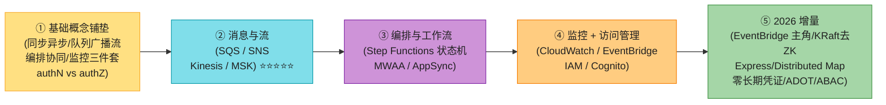

> 💡 **关键信号词**:**"把同步调用改成异步消息(打电话改发微信)"** + **"SQS 是队列(pull,一条只一个消费者),SNS 是广播(push,一对多),Kinesis 是流(有序可重放)"** + **"SNS + 多个 SQS = fan-out 经典架构"** + **"复杂多步用 Step Functions 状态机编排,不要每个 Lambda 自己链调用(那是协同 choreography,容易出 bug)"**——这四句直接拿下面试。

---

## 🗺️ 章节概览

```mermaid
flowchart TD
    CH12["AWS 消息、编排、监控与访问管理<br/>(本章四大类)"] --> CAT1["① 消息与流 Messaging & Streaming"]
    CH12 --> CAT2["② 编排与工作流 Orchestration"]
    CH12 --> CAT3["③ 监控与可观测 Monitoring"]
    CH12 --> CAT4["④ 访问管理 Access Management"]

    CAT1 --> SQS["Amazon SQS<br/>(队列, pull, 削峰解耦)"]
    CAT1 --> SNS["Amazon SNS<br/>(发布订阅, push, fan-out)"]
    CAT1 --> KIN["Amazon Kinesis 全家桶<br/>(KDS/Firehose/Analytics/Video)"]
    CAT1 --> MSK["Amazon MSK<br/>(托管 Kafka)"]

    CAT2 --> SFN["AWS Step Functions<br/>(状态机, 可视化编排)"]
    CAT2 --> MWAA["Amazon MWAA<br/>(托管 Airflow, 数据管道)"]
    CAT2 --> APPSYNC["AWS AppSync<br/>(托管 GraphQL + 实时)"]

    CAT3 --> CW["Amazon CloudWatch<br/>(Logs/Metrics/Alarms/Dashboards)"]
    CAT3 --> EB["Amazon EventBridge<br/>(事件总线, 事件驱动)"]

    CAT4 --> IAM["AWS IAM<br/>(User/Group/Role/Policy)"]
    CAT4 --> COG["Amazon Cognito<br/>(User Pool authN / Identity Pool authZ)"]

    style CH12 fill:#FFE082,stroke:#F9A825,color:#1f1f1f
    style CAT1 fill:#80DEEA,stroke:#0097A7,color:#1f1f1f
    style CAT2 fill:#CE93D8,stroke:#7B1FA2,color:#1f1f1f
    style CAT3 fill:#A5D6A7,stroke:#388E3C,color:#1f1f1f
    style CAT4 fill:#FFCC80,stroke:#F57C00,color:#1f1f1f
    style SQS fill:#90CAF9,stroke:#1976D2,color:#1f1f1f
    style SNS fill:#90CAF9,stroke:#1976D2,color:#1f1f1f
    style KIN fill:#90CAF9,stroke:#1976D2,color:#1f1f1f
    style MSK fill:#90CAF9,stroke:#1976D2,color:#1f1f1f
    style SFN fill:#EF9A9A,stroke:#C62828,color:#1f1f1f
    style MWAA fill:#EF9A9A,stroke:#C62828,color:#1f1f1f
    style APPSYNC fill:#EF9A9A,stroke:#C62828,color:#1f1f1f
    style CW fill:#80DEEA,stroke:#0097A7,color:#1f1f1f
    style EB fill:#80DEEA,stroke:#0097A7,color:#1f1f1f
    style IAM fill:#FFE082,stroke:#F9A825,color:#1f1f1f
    style COG fill:#FFE082,stroke:#F9A825,color:#1f1f1f
```

| 小节 | 要点 | 重要性 |
|------|------|--------|
| **🧱 基础概念铺垫** | 同步/异步、队列/广播/流、编排/协同、监控三件套、authN/authZ | ⭐⭐⭐⭐⭐(非科班必看) |
| **1.1 Amazon SQS** | 标准vs FIFO、可见性超时、DLQ、长轮询、消息保留、解耦削峰 | ⭐⭐⭐⭐⭐ |
| **1.2 Amazon SNS** | 发布订阅、扇出 fan-out(配 SQS)、主题、多端点、FIFO 主题、消息过滤 | ⭐⭐⭐⭐⭐ |
| **1.3 Amazon Kinesis** | KDS(shard/partition/生产消费/容量模式)、Firehose(投递)、Analytics(Flink)、Video | ⭐⭐⭐⭐ |
| **1.4 Amazon MSK** | 托管 Kafka、broker 节点、控制面/数据面、provisioned/serverless、ZooKeeper vs KRaft、IAM 认证 | ⭐⭐⭐ |
| **1.5 四者选型矩阵** | SQS vs SNS vs Kinesis vs MSK(本章核心对比) | ⭐⭐⭐⭐⭐ |
| **2.1 Step Functions** | 状态机、Task/Choice/Parallel/Wait/Map、Retry/Catch、标准 vs Express | ⭐⭐⭐⭐⭐ |
| **2.2 Amazon MWAA** | 托管 Airflow、DAG、Scheduler/Executor/Web/Metadata | ⭐⭐⭐ |
| **2.3 AWS AppSync** | 托管 GraphQL、Resolver/DataSource/Merged API、实时 | ⭐⭐⭐ |
| **3. CloudWatch + EventBridge** | Logs/Metrics/Alarms/Dashboards + EventBridge 事件总线 | ⭐⭐⭐⭐⭐ |
| **4. IAM + Cognito** | User/Group/Role/Policy、最小权限、STS 临时凭证、User Pool/Identity Pool、联合登录 | ⭐⭐⭐⭐⭐ |
| **2026 增量** | EventBridge 主角/KRaft 去 ZK/Express+Distributed Map/零长期凭证/ADOT/Verified Permissions | ⭐⭐⭐⭐⭐ |

---

## 🧱 基础概念铺垫(给非科班读者)⭐⭐⭐⭐⭐

> 💡 **为什么单独开这一节?** Part I(aws_01 同步/异步、aws_08 Pub-Sub/EDA/Saga)讲了**原理**,但很多非科班读者反馈"概念太多,看完还是分不清 SQS / SNS / Kinesis 到底有什么本质区别,编排到底编什么,authN/authZ 总是混"。这一节是给**完全没碰过消息中间件和云身份管理**的人补的底子。本章是 Part II 最大的一章,基础概念讲透了,后面四大类服务才看得懂。如果你已熟悉,可跳到第 1 节。

### 铺垫 ①:同步调用 vs 异步调用(打电话 vs 发微信)⭐⭐⭐⭐⭐

这是整个"消息服务"存在的根本理由。一句话:**同步 = 打电话(阻塞、要对方在场),异步 = 发微信(发完就走、对方有空再回)**。

**生活中的例子**:

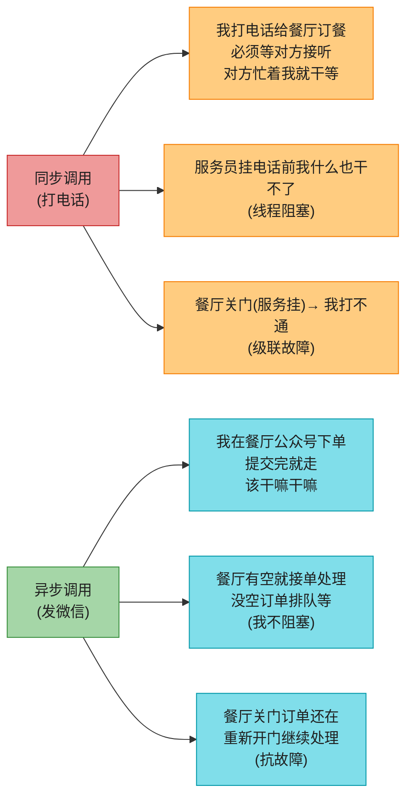

**为什么异步能解决三大痛点**(背这三点,面试常考):

| 痛点 | 同步的表现 | 异步怎么解 |
|------|-----------|-----------|
| **① 耦合(Coupling)** | 服务 A 直接调服务 B,B 改接口 A 就崩,B 挂了 A 也挂(级联故障) | 中间放个"消息队列",A 只管发,B 有空再取。**A 和 B 互不依赖,各自独立部署、独立扩展、独立故障** |
| **② 削峰(Back pressure)** | 黑五瞬间 10 万请求打过来,B 处理不过来直接被打爆(雪崩) | 请求先进队列排队,B 按**自己的节奏**慢慢消费(削峰填谷)。队列扛 10 万,B 慢慢跑到 1 万也不崩 |
| **③ 故障容忍(Fault tolerance)** | B 重启时 A 的请求全失败,用户体验崩 | 请求留在队列里,B 重启完继续消费,**用户感知不到** |

> 💡 **一句话**:**异步 = 加个中间人(消息队列/主题/流)缓冲 + 解耦 + 削峰 + 抗故障**。AWS 消息服务就是帮你把这个"中间人"做成了托管服务,你不用自己装 RabbitMQ/Kafka。

> 📝 **aws_01 第 2.1 节详细讲了同步/异步通信的原理**(响应时间 = 延迟 + 处理时间、阻塞/回调机制),本章只补"为什么 AWS 要做这么多消息服务"。**aws_08 第 3 节讲了 EDA(事件驱动架构)和 Pub-Sub 模式的原理**,本章讲"AWS 用 SQS/SNS/Kinesis/MSK 怎么落地"。

### 铺垫 ②:消息队列 vs 发布订阅 vs 事件流(三者的本质区别)⭐⭐⭐⭐⭐(本章最重要!)

这是 AWS 消息选型**最常考的第一问**,也是非科班最容易混的。一句话:**它们都是"中间人",但工作方式完全不同**。用三个生活比喻一次记住:

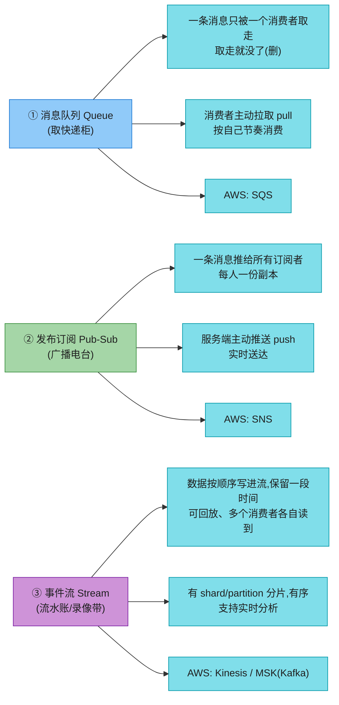

**三个比喻详细对比**(背这个,面试随便答):

| 类型 | 生活比喻 | 数据怎么流动 | 消息会被消费几次 | 消息是否保留 | AWS 服务 |
|------|---------|------------|----------------|------------|---------|
| **队列 Queue** | **快递柜**:你下单,快递放柜里,**只有你**凭码取走,取完柜子就空了 | 生产者推 → 队列存 → **一个消费者拉走并删除** | **一次**(一条消息只被一个消费者处理) | 取走就删,过期才留 | **SQS** |
| **发布订阅 Pub-Sub** | **广播电台**:电台发节目,所有调到这个频道的人**同时听到**,各听各的 | 生产者推 → 主题 → **推给所有订阅者(每人一份)** | **多次**(每个订阅者各得一份) | 推完就清(不存历史) | **SNS** |
| **事件流 Stream** | **录像带 / 流水账**:事情按顺序记下来,**保留一段时间**,谁想看就快进/回放,多人可同时看各自的进度 | 生产者追加写 → 分片/分区存 → 消费者按 offset 读,可回放 | **多次**(多个消费者各读各的进度) | 保留一段时间(可回放) | **Kinesis / MSK** |

**三句话口诀**(背):
- **队列 = 快递柜,一条只一个人取,削峰解耦用 SQS**。
- **广播 = 电台,一对多 fan-out,推给所有订阅者用 SNS**。
- **流 = 录像带,有序可回放,实时分析/事件溯源用 Kinesis 或 MSK**。

> 🪤 **追问陷阱(高频)**:"SNS 也是发布订阅,那它能像流一样回放吗?" → **不能**。SNS 推完就清,不保留历史;流(Kinesis/MSK)保留一段时间(默认 24 小时~7 天甚至 1 年),可以重放。所以**需要"重新处理历史事件"的场景(如事件溯源、出错后重跑)必须用流,不能用 SNS**。

> 🪤 **追问陷阱(超高频)**:"SQS 和 SNS 不都是消息吗,有啥本质区别?" → **本质区别在"消费模型"**:SQS 是**消费者主动拉取(pull)**,一条消息只被一个消费者处理(点对点);SNS 是**服务端推送(push)** 给所有订阅者(广播)。所以**点对点 + 削峰用 SQS,一对多广播用 SNS**。常组合:**SNS → 多个 SQS**(扇出,每个消费者独立速率/重试)。

### 铺垫 ③:什么是"编排(Orchestration)"?——交响乐团 vs 街头乐队 ⭐⭐⭐⭐

本章第 2 大类服务叫"编排与工作流",但"编排"到底是什么?一句话:**编排 = 有个总指挥(指挥家/状态机)统一调度每个步骤的执行顺序、失败重试、分支选择**。

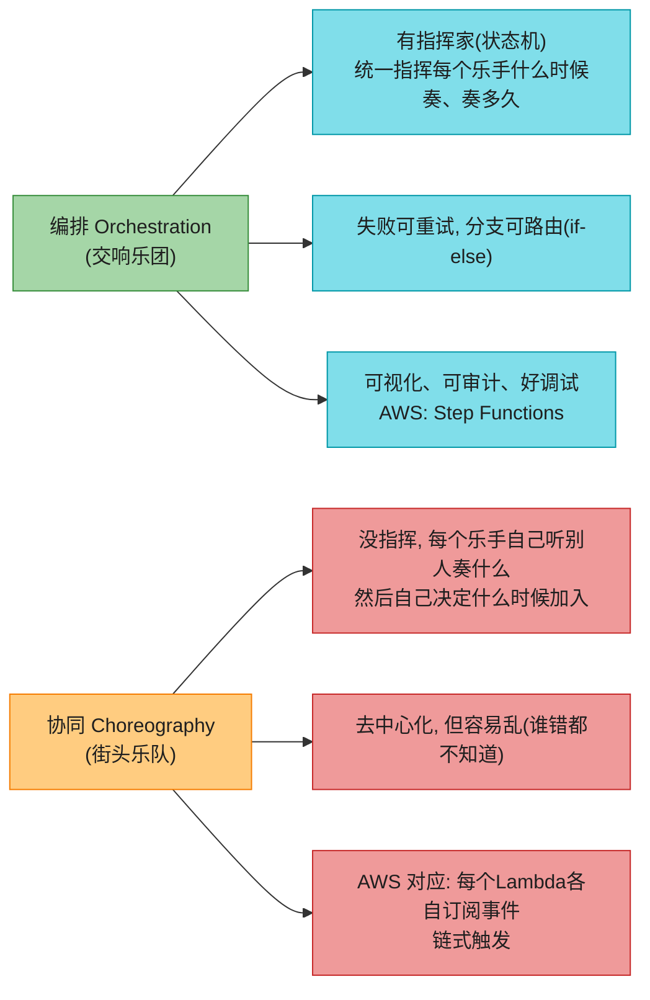

**用外卖订单讲透**:

假设用户下单,流程是:**① 扣款 → ② 通知餐厅接单 → ③ 调度骑手 → ④ 跟踪配送**。

- **协同(每个服务自己看事件,自己决定下一步)**:扣款服务发"已扣款"事件 → 餐厅服务订阅它,收到后发"已接单"事件 → 骑手服务订阅它……链式触发。**优点**:无中心,扩展性好;**缺点**:流程"看不见",一旦某环出错,排查噩梦(分布式 spaghetti)。
- **编排(状态机统一指挥)**:一个 Step Functions 状态机从头跑到尾,每个步骤是它的一个 state,失败自动重试,分支用 Choice 路由。**优点**:流程可视化、可审计、可重试;**缺点**:状态机本身是单点(但 AWS 给你做成高可用了)。

> 💡 **面试建议**:**生产环境复杂多步业务优先用编排(Step Functions)**。简单 2-3 步链式可以用协同(Lambda + SNS/SQS)。**别用 Lambda 链式嵌套调用**(一个 Lambda 调下一个),那是反模式——失败处理、超时、可观测性都烂。

> 📝 **aws_08 详细讲了 Saga 模式(分布式事务的编排 vs 协同两种实现)**,本章讲"AWS 用 Step Functions 怎么落地编排式 Saga"。

### 铺垫 ④:监控三件套——Metrics / Logs / Traces(体温计 vs 病历 vs 行程轨迹)⭐⭐⭐⭐

本章第 3 大类是"监控与可观测"。但 Metrics、Logs、Traces 这三个词经常被混着说。用医生看病的比喻一次讲清:

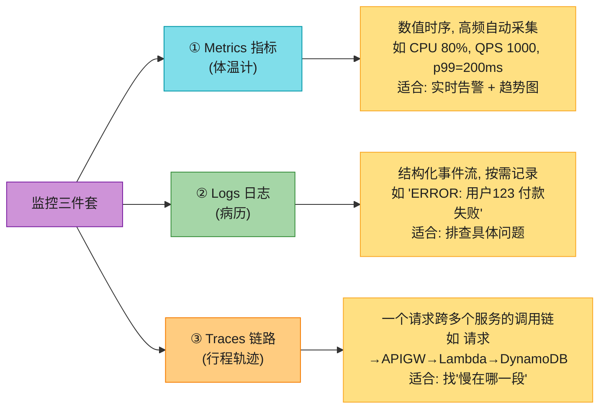

| 监控类型 | 比喻 | 看什么 | 采集方式 | 典型工具(AWS) |
|---------|------|--------|---------|---------------|
| **Metrics 指标** | **体温计**——一个数字告诉你"现在烧不烧" | 数值时序(CPU、内存、QPS、p99 延迟、错误率) | 系统自动高频采集 | **CloudWatch Metrics** |
| **Logs 日志** | **病历**——记录"什么时候发生了什么细节" | 结构化事件流(一行日志、错误堆栈、JSON 事件) | 应用按需 `print` 输出 | **CloudWatch Logs**(Logs Insights 查询) |
| **Traces 链路** | **行程轨迹**——一个请求"经过了哪些地方、每段花了多久" | 跨服务调用链(每个 span 的耗时) | SDK 自动埋点(请求头传递 traceId) | **AWS X-Ray**(2026 主推 OpenTelemetry / ADOT) |

**三者配合的工作流**(背):
1. **Metrics 告诉你"出问题了"**——告警:错误率 > 5% 持续 5 分钟。
2. **Logs 告诉你"具体是什么问题"**——查日志:看到 ERROR 堆栈,定位到某行代码。
3. **Traces 告诉你"问题在哪个环节"**——看 trace:发现请求卡在 DynamoDB 那一段 800ms。

> 💡 **一句话**:**Metrics 报警,Logs 定位,Traces 找瓶颈**。三者缺一不可。原书 CloudWatch 主要讲 Metrics + Logs(Traces 提了 X-Ray 但没深讲),2026 主推 **OpenTelemetry 统一三件套**(见后文增量)。

> 📝 **aws_01 准则三"性能:指标不说谎"和 2026 增量"可观测性四支柱"详细讲了 Metrics/Logs/Traces/Profiles** 的现代栈,本章讲"AWS 用 CloudWatch + X-Ray + ADOT 怎么落地"。

### 铺垫 ⑤:身份认证(authN) vs 授权(authZ)——"你是谁" vs "你能干什么" ⭐⭐⭐⭐⭐(高频混淆点!)

本章第 4 大类是"访问管理"。但**认证(authentication, authN)和授权(authorization, authZ)** 是面试里**最容易混的两个词**。用进小区的比喻一次讲清,以后再也不会混:

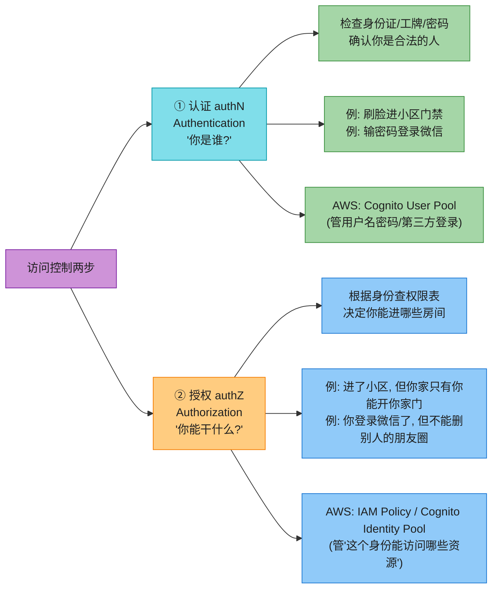

**记忆口诀**(背):
- **认证(authN,N = "Who are you?")** —— **"你是谁"**,验证身份(密码/刷脸/指纹/Token)。
- **授权(authZ,Z = "What can you do?")** —— **"你能干什么"**,根据身份赋予权限(能读哪些数据、能调哪些 API)。

> 🪤 **追问陷阱(超高频)**:"authN 和 authZ 区别?" → **认证(authN)回答"你是谁"(验证身份);授权(authZ)回答"你能干什么"(分配权限)**。两者顺序:先认证(确认你是合法用户)再授权(根据身份查权限表)。AWS 里:**Cognito User Pool 管 authN**(发 Token 证明你是谁),**IAM Policy + Identity Pool 管 authZ**(决定这个 Token 持有者能访问哪些 AWS 资源)。

**最小权限原则(Principle of Least Privilege)⭐⭐⭐⭐⭐**:

授权的核心原则:**给用户/服务**只分配完成任务所必需的最小权限**,不多给**。例:
- ❌ 错误:为了方便,给一个"只读日志"的支持工程师开了 Administrator(全部权限)。
- ✅ 正确:给他一个"只能 `logs:DescribeLogGroups` 和 `logs:FilterLogEvents`"的策略。
- ❌ 错误:一个 Lambda 只需要从 S3 读一个 bucket,却给它整个 S3 的读写权限。
- ✅ 正确:策略里 Resource 限定到那个具体 bucket 的 ARN,Action 只给 `s3:GetObject`。

> 💡 **为什么最小权限重要**:① **减小爆炸半径**——凭证泄露了,攻击者也只拿到最小权限;② **防误操作**——开发者手滑也不会删错生产资源;③ **合规审计**——SOC2/ISO27001 都要求。AWS 提供 **IAM Access Analyzer** 帮你扫描"权限给过头"的情况(见 2026 增量)。

---

## 1. 消息与流服务

这是本章的核心战场,AWS 提供了**四个主流消息服务**(SQS / SNS / Kinesis / MSK),它们对应铺垫 ② 里的三种模式(队列/广播/流)。逐个讲。

### 1.1 Amazon SQS(Simple Queue Service)—— 队列、削峰、解耦、DLQ ⭐⭐⭐⭐⭐

**一句话定位**:SQS 是 AWS 的**全托管消息队列服务**——就是铺垫 ② 里的"快递柜"。生产者把消息丢进队列,消费者主动拉取,一条消息只被一个消费者处理,处理完删除。

**它解决的痛点**(原书讲得很清楚):
- **应用解耦(Application decoupling)**:两个微服务不直接调,中间放 SQS。一个挂了不影响另一个。
- **背压控制(Back pressure control)**:消费者按自己的速率消费,消息最多在 SQS 留 **14 天**。

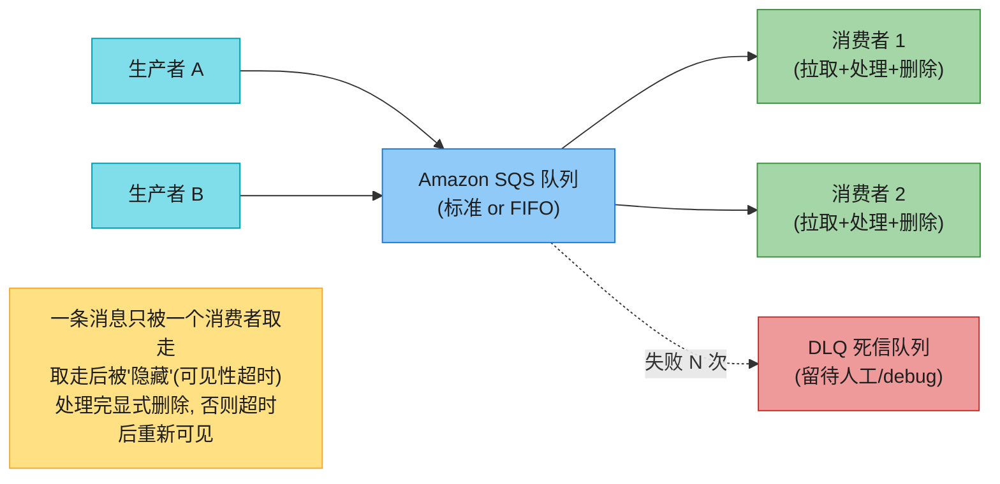

#### 1.1.1 SQS 的核心概念(必背)

| 概念 | 含义 | 取值范围 |
|------|------|---------|
| **可见性超时(Visibility Timeout)** ⭐⭐⭐ | 消息被一个消费者取走后,**对其他消费者"隐藏"的时间**。消费者必须在这段时间内处理完并显式删除;否则超时后消息重新可见,其他消费者能再取 | 0 秒 ~ 12 小时 |
| **保留期(Retention Period)** | 消息在队列里**最多留多久**(没人消费也不删) | 1 分钟 ~ 14 天 |
| **最大消息大小** | 单条消息上限 | **256 KB**(超了用 S3/DynamoDB 存,SQS 只放引用) |
| **死信队列(DLQ)** ⭐⭐⭐ | 消费者**处理失败 N 次**后,消息被自动推进 DLQ,留待人工排查或重试 | 配 `maxReceiveCount`(如 3 次) |
| **消息投递语义** | 标准队列**至少一次**(at-least-once,可能重复);FIFO **精确一次**(exactly-once) | — |

#### 1.1.2 可见性超时——SQS 最容易考的概念 ⭐⭐⭐⭐⭐

可见性超时是 SQS 设计的核心,面试**几乎必问**。用"快递柜"比喻:

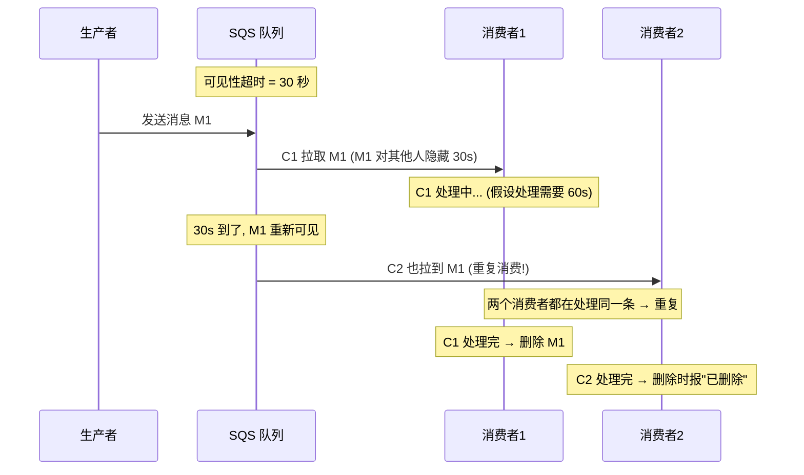

**可见性超时设短了会怎样?设长了会怎样?**(背):

| 设置 | 问题 | 后果 |
|------|------|------|
| **设太短**(如 5 秒,但处理要 30 秒) | 消费者还没处理完,消息就重新可见,被另一个消费者取走 | **重复消费**——同一条消息被处理多次(应用要做幂等) |
| **设太长**(如 1 小时,但处理只要 5 秒) | 消费者崩了,消息要等很久才能重新被消费 | **故障恢复慢**——消息卡在"看不见"状态很久 |

> 💡 **最佳实践**:**可见性超时 = 预期处理时间 × 2~3 倍**(留余量)。或者在代码里用 `ChangeMessageVisibility` API 动态延长(知道这次处理会久就提前续命)。

#### 1.1.3 标准队列 vs FIFO 队列 ⭐⭐⭐⭐

SQS 有两种队列类型,选错会出大问题(比如订单乱序):

| 对比维度 | 标准队列(Standard) | FIFO 队列 |
|---------|-------------------|----------|
| **消息顺序** | **尽量而为(best-effort)**,不保证顺序 | **严格保证顺序**(先进先出) |
| **吞吐** | **无限**(自动扩展) | 默认 **300 TPS**(批处理 10 条/批可达 3000 TPS) |
| **投递语义** | **至少一次**(at-least-once,**可能重复**,应用要幂等) | **精确一次**(exactly-once,不重复) |
| **成本** | 较便宜 | **比标准贵约 25%** |
| **适用场景** | 高吞吐、不要求顺序的任务(日志、埋点、邮件发送) | 要求严格顺序和去重的(订单状态机、账户扣款、库存扣减) |

> 🪤 **追问陷阱**:"FIFO 队列吞吐只有 300 TPS,我要更高怎么办?" → ① **批处理**:一次拉/发最多 10 条,等效 3000 TPS;② **消息组(Message Group)**:FIFO 队列内部分组,不同组可并行(同组内仍有序),用 `MessageGroupId` 分组;③ 还不够 → 拆多个 FIFO 队列。**注意:2019+ 高吞吐模式已默认开启**(见后文已过时)。

#### 1.1.4 长轮询 vs 短轮询 ⭐⭐⭐

消费者从 SQS 拉消息有两种方式:

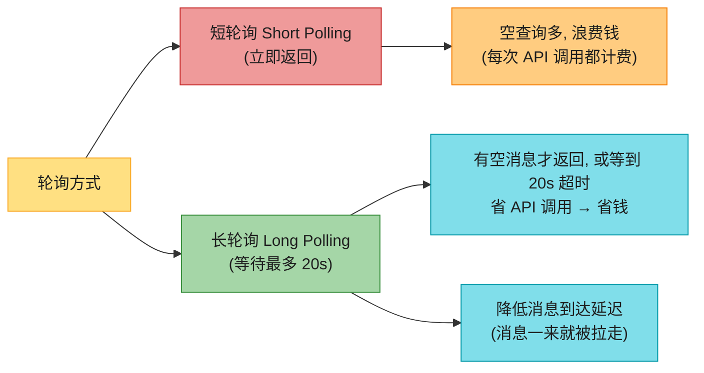

> 💡 **永远用长轮询**:`WaitTimeSeconds=20`。省钱 + 降延迟。短轮询只在临时调试时用。

#### 1.1.5 DLQ(死信队列)—— 失败兜底 ⭐⭐⭐⭐

DLQ 是 SQS 的"失败保险箱"。流程:

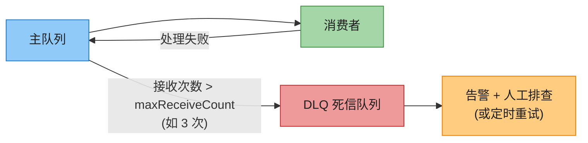

> 💡 **为什么需要 DLQ**:① **防毒丸消息(Poison Pill)**——一条永远处理失败的消息卡在主队列,反复重试拖垮消费者;② **可观测性**——DLQ 是排查 bug 的金矿,看 DLQ 就知道哪些消息处理失败了;③ **后续处理**——修了 bug 后从 DLQ 重新触发。

> 📝 **aws_08 第 4 节讲了 Outbox/Saga 等模式**,DLQ 是这些模式在 AWS 上的标配。

#### 1.1.6 SQS 典型应用:解耦 + 削峰

**场景**:外卖平台,中午 12 点订单瞬间涌入 10 万单,后端处理不过来。

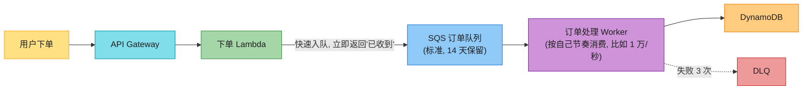

**效果**:用户**毫秒级**收到"已下单"响应(消息进队列就返回),后端 Worker 按 1 万/秒速率消费,**10 万单 10 秒消化完**——既不崩后端,又快响应。这就是"**削峰填谷**"。

### 1.2 Amazon SNS(Simple Notification Service)—— 发布订阅、扇出 fan-out ⭐⭐⭐⭐⭐

**一句话定位**:SNS 是 AWS 的**全托管发布订阅(Pub-Sub)消息服务**——铺垫 ② 里的"广播电台"。生产者发一条消息到 **Topic(主题)**,SNS 把它**推给(push)** 所有订阅者。

**支持的订阅端点**(很多,要记住大类):
- **Amazon SQS**(最常用,见 fan-out 架构)
- **AWS Lambda**(直接触发函数)
- **HTTP/HTTPS 端点**(回调第三方 webhook)
- **Email / SMS / 移动推送**(通知人)
- **Amazon Kinesis Data Firehose**(把消息投到 S3 等)

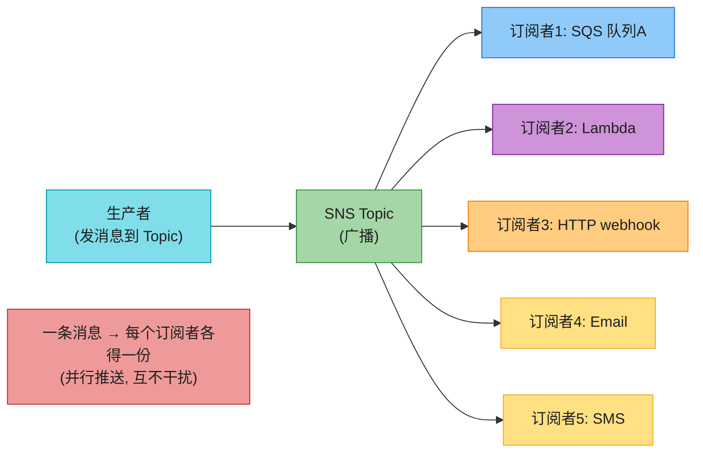

#### 1.2.1 SNS 的核心概念

| 概念 | 含义 |
|------|------|
| **Topic(主题)** | 消息的"广播频道",生产者发到 Topic,订阅者订阅 Topic |
| **Subscription(订阅)** | 一个端点(SQS/Lambda/HTTP/...)订阅一个 Topic |
| **消息过滤(Message Filtering)** ⭐ | 用**过滤策略(filter policy)** 让订阅者只收它关心的消息(基于 message attribute 或 body) |
| **消息属性(Message Attributes)** | 可选的元数据(key/value/type),用于过滤,不进消息体 |
| **FIFO 主题** | 严格顺序 + 精确一次(配合 FIFO SQS 用) |
| **消息持久化** | 收到消息后**跨多 AZ 存储再 ack**,保证 AZ 故障不丢消息 |

#### 1.2.2 消息过滤—— 只收你关心的

**例子**:SNS Topic 发"全亚洲天气",但印度订阅者只想要印度天气。

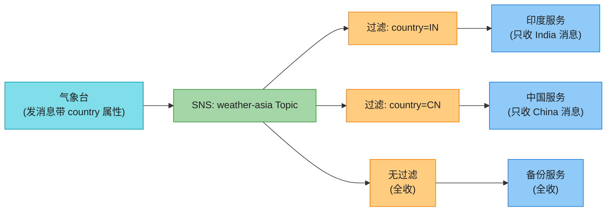

> 💡 **过滤的好处**:订阅端不用再写"if country==IN"逻辑,**减少网络流量 + 简化消费端代码**。

#### 1.2.3 fan-out 经典架构(SNS + 多个 SQS)⭐⭐⭐⭐⭐(必考)

**fan-out** = 一条消息扇形分发给多个独立消费者,每个消费者用独立的 SQS 队列(独立速率、独立重试、独立 DLQ)。这是 AWS 事件驱动架构的**最经典组合**。

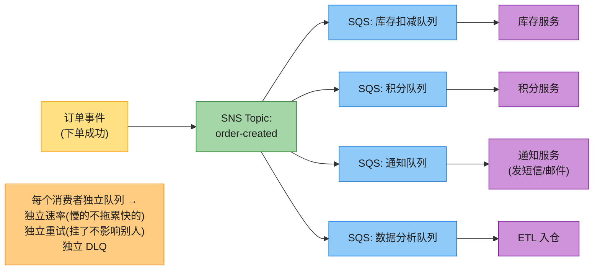

**为什么 fan-out 这么重要**(背):
- **解耦**:加新消费者不用改生产者代码,只需新订阅一个 SQS。
- **独立速率**:慢消费者(如数据分析)在自己的队列里慢慢消化,不拖累快的(如库存扣减)。
- **独立故障**:一个消费者挂了,消息留在它的 SQS 里,不影响别的。
- **独立重试 + DLQ**:每个消费者用自己的可见性超时和 DLQ。

> 🪤 **追问陷阱**:"SNS 直接推给多个 Lambda 不就行了,为什么要中间加 SQS?" → 加 SQS 解决三大问题:① **抗故障**(Lambda 挂了消息不丢,SQS 兜底);② **削峰**(Lambda 触发速率有上限,SQS 缓冲);③ **独立重试**(SQS 配可见性超时 + DLQ,SNS 直推 Lambda 失败只重试几次就丢)。

### 1.3 Amazon Kinesis(流)—— KDS / Firehose / Analytics / Video ⭐⭐⭐⭐

**一句话定位**:Kinesis 是 AWS 的**全托管实时数据流服务**全家桶——铺垫 ② 里的"录像带/流水账"。它有**四个子服务**,对应流的不同阶段(采集 / 投递 / 分析 / 视频):

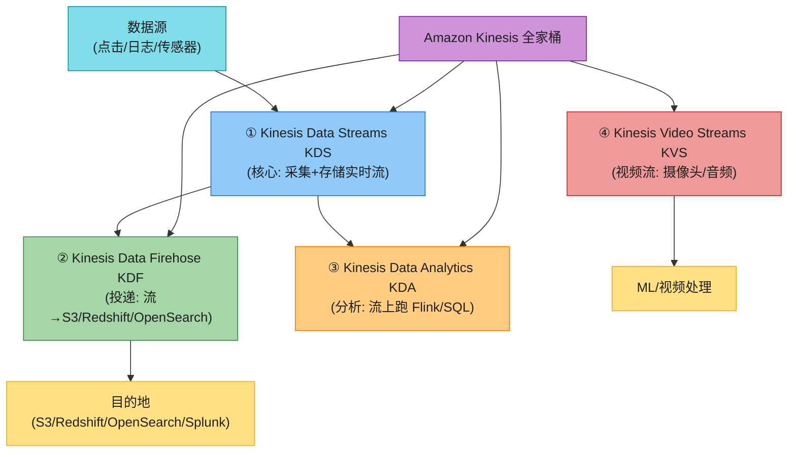

#### 1.3.1 Kinesis Data Streams (KDS) —— 核心采集

KDS 是 Kinesis 全家桶的核心。用"录像带"比喻:**生产者往流里追加记录,流按 shard 分片存储一段时间,消费者按自己的 offset 读,可回放**。

**核心概念**:

| 概念 | 含义 | 关键数字 |
|------|------|---------|
| **Shard(分片)** ⭐ | KDS 的**基础吞吐单位**,一个流由多个 shard 组成 | 每个 shard:**入 1 MB/s + 1000 records/s;出 2 MB/s** |
| **Record(记录)** | 一条数据,由 sequence number + partition key + data blob 组成 | data blob 最大 **1 MB** |
| **Partition Key** | 决定记录进哪个 shard(哈希后映射) | 应选**分布均匀**的 key |
| **Sequence Number** | KDS 自动分配,每条记录唯一,按 shard 内单调递增 | — |
| **保留期(Retention)** | 数据在流里保留多久,期间可重放 | 默认 24 小时,可延长**最多到 365 天** |
| **Enhanced Fan-out(EFO)** | 默认所有消费者共享 2 MB/s 出流量;EFO 给每个消费者**独享 2 MB/s** | 额外收费 |

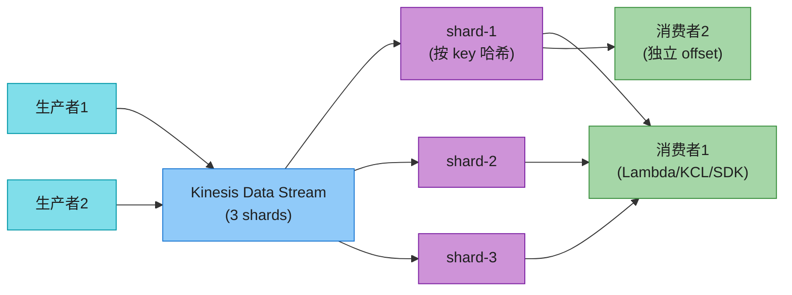

**容量模式(两种)**:
- **Provisioned(预置)**:你**手动指定 shard 数**,按 shard + PUT 操作数计费。要自己监控扩缩容(分片分裂 split / 合并 merge)。
- **On-Demand(按需)** ⭐:AWS 自动扩容,**不用算 shard**,按写入/读取的 GB 数计费。流量波动大的场景首选。

> 💡 **shard 太热/太冷怎么办**:**热(流量打满 1MB/s)** → 分裂 split 一个 shard 成两个;**冷(流量很小)** → 合并 merge 两个成一个。On-Demand 模式则自动处理。

#### 1.3.2 Kinesis Data Firehose (KDF) —— 投递到目的地

**一句话定位**:KDF 是**全自动的"流→目的地"投递服务**,你**不用写消费者代码**,配个 delivery stream 就行。

**与 KDS 的本质区别**(必考):
- **KDS**:你自己写消费者(Lambda / KCL 应用),数据在流里可重放。
- **KDF**:**没有自己的存储,不能重放**;它只负责把数据**批量、转换后投递**到目的地。

**支持的目的地**:S3 / OpenSearch / Redshift(先到 S3 再 COPY)/ Splunk / 任意 HTTP 端点。

**核心特性**:
- **批处理缓冲**:攒到一定 **buffer size(1~128 MB)** 或 **buffer interval(60~900 秒)** 再投递。
- **转换**:内置(转 Parquet/ORC)或用 **Lambda 自定义转换**。
- **压缩 + 加密**:投递前压缩(省存储)+ KMS 加密。
- **投递语义**:**至少一次**(at-least-once,重试可能重复)。

> 💡 **典型用法**:应用日志/点击流 → KDF → S3(Parquet 格式)→ Athena 查询。**全程零代码**,这是它最爽的地方。

#### 1.3.3 Kinesis Data Analytics (KDA) —— 流上跑 SQL/Flink

**一句话定位**:KDA 是**全托管的 Apache Flink**,在流上跑实时 SQL 或 Flink 应用。

**Apache Flink 是什么**:开源分布式流处理引擎,支持**有状态计算 + 精确一次(exactly-once)语义 + 检查点(checkpoint)容错**。KDA 把它全托管了,你写 SQL 或 Java/Scala/Python 应用,AWS 管部署/扩展/容错。

**典型场景**:实时聚合(每分钟 PV)、异常检测、窗口计算(滑动窗口/滚动窗口)。

> 📝 **KDA Studio**:基于 Apache Zeppelin 的 serverless notebook,交互式写 SQL/Scala/Python 分析流数据。

#### 1.3.4 Kinesis Video Streams (KVS) —— 视频/音频流

**一句话定位**:KVS 优化**视频/音频/RADAR 等实时流**,从百万级设备(摄像头/无人机)持续推到 AWS。

**典型场景**:家庭安防(摄像头实时推流到 AWS,手机 App 拉流查看)、工业质检、ML 视频分析。

### 1.4 Amazon MSK(Managed Streaming for Apache Kafka)—— 托管 Kafka ⭐⭐⭐

**一句话定位**:MSK 是 AWS 的**全托管 Apache Kafka 服务**。如果你已经在用 Kafka(开源),或者需要 Kafka 的高级特性(exactly-once、丰富生态、超长保留),不想自己运维,就用 MSK。

**Kafka vs Kinesis 的关系**:就像 aws_11 讲的 ECS vs EKS——**Kafka 是开源界的流处理王者**,生态丰富;**Kinesis 是 AWS 原生,集成简单但功能少**。MSK 让你"既享受 Kafka 的功能,又不用自己运维"。

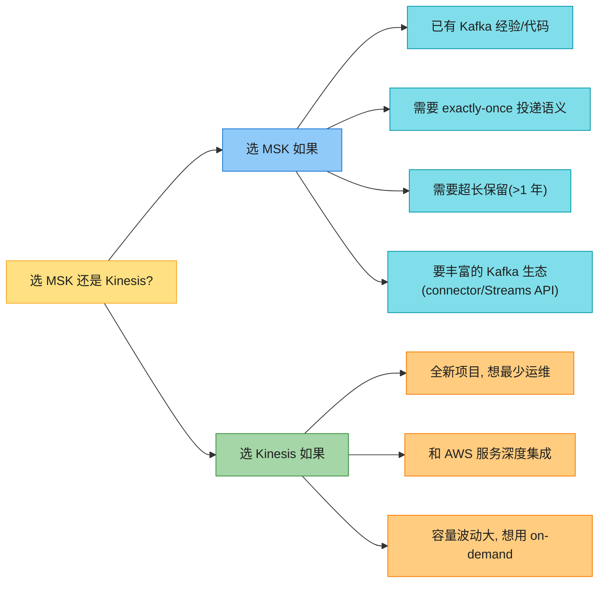

#### 1.4.1 MSK 的核心概念

| 概念 | 含义 |
|------|------|
| **Broker 节点** | Kafka 的工作节点,你指定数量和类型(最少 2 AZ,通常 3 broker 起步) |
| **控制面 vs 数据面** | **控制面**:创建/更新/删除集群;**数据面**:生产/消费消息(客户端做) |
| **容量模式** | **Provisioned**(你选 broker 类型 + 存储)vs **Serverless**(AWS 管,broker 自动扩缩)⭐ |
| **ZooKeeper vs KRaft** ⭐ | Kafka 协调节点的两种模式:传统用 ZooKeeper;**新版用 KRaft(Kafka 自带的 Raft 共识),去掉了 ZooKeeper**。MSK 3.7+ 支持 KRaft |
| **认证方式** | ① 无认证(不推荐);② **IAM 角色**(推荐);③ SASL/SCRAM(用户名密码,存 Secrets Manager);④ TLS 证书(存 ACM) |
| **加密** | 静态加密(KMS 管理 key)+ 传输加密(TLS) |
| **高可用** | 自动跨多 AZ 部署 broker,broker 故障**自动替换为同 IP 的健康节点** |

#### 1.4.2 MSK 集成的 AWS 服务

MSK 的话题(topic)可作为多种 AWS 服务的事件源:
- **AWS Lambda**(MSK topic → Lambda 触发)
- **Kinesis Data Firehose**(MSK → KDF → S3 等)
- **Amazon Redshift**(MSK → Redshift Streaming Ingestion)
- **Amazon OpenSearch**(MSK → OpenSearch 索引)

### 1.5 SQS vs SNS vs Kinesis vs MSK —— 四者选型矩阵 ⭐⭐⭐⭐⭐(本章核心对比)

这是本章**最常考的对比题**。把前面的铺垫 ② + 四个服务的细节浓缩成一张表:

| 对比维度 | **SQS** | **SNS** | **Kinesis (KDS)** | **MSK** |
|---------|---------|---------|------------------|---------|
| **模式** | 队列(点对点) | 发布订阅(广播) | 流(有序可回放) | 流(Kafka 生态) |
| **消费模型** | **消费者拉取 pull** | **服务端推送 push** | 消费者按 offset 读 | 消费者按 offset 读 |
| **一条消息被消费几次** | **1 次**(一个消费者取走删) | **N 次**(每个订阅者各一份) | 多次(多消费者各读各的进度) | 多次(多 consumer group) |
| **是否有序** | FIFO 队列有序;标准无序 | FIFO 主题有序;标准无序 | **shard 内有序** | partition 内有序 |
| **投递语义** | 标准至少一次;FIFO 精确一次 | 至少一次 | 至少一次 | **支持精确一次** |
| **数据保留** | 1 分钟~14 天 | 推完即清 | 24 小时~**365 天** | 受 broker 存储限制(可超 1 年) |
| **可重放?** | 否(取走就删) | 否(推完就清) | **是(保留期内可重放)** | **是** |
| **吞吐** | 无限(标准)/ 3000 TPS(FIFO) | 高 | shard 决定(扩 shard) | broker 决定(扩 broker) |
| **延迟** | 取决于轮询(长轮询可秒级) | 实时推送 | <200ms(EFO 更低) | 即时写入即可读 |
| **典型场景** | 削峰、解耦、订单处理、异步任务 | fan-out 广播、通知、webhook | 实时分析、点击流、日志、事件溯源 | 大数据、需要 Kafka 生态/精确一次 |
| **运维负担** | 全托管,零运维 | 全托管,零运维 | 全托管,要算 shard(on-demand 免) | MSK 比 Kinesis 重,但比自建 Kafka 轻 |
| **对标开源** | RabbitMQ / ActiveMQ 队列 | RabbitMQ Topic / NATS | Apache Kafka(简化版) | Apache Kafka(完整版) |

**选型决策树**(背):

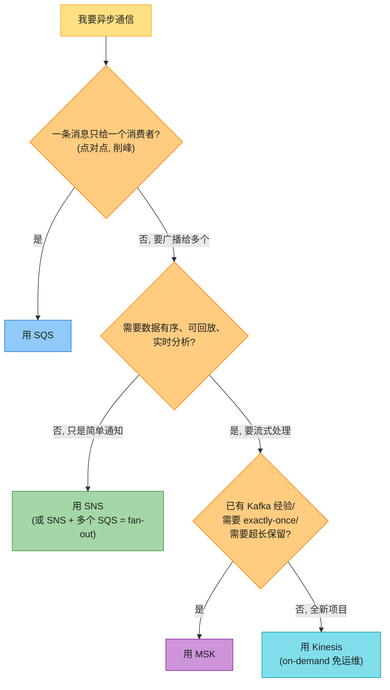

> 🪤 **追问陷阱(超高频)**:"什么时候用 Kinesis 不用 SQS?" → 三个信号:① **需要数据有序**(同用户事件按顺序);② **需要回放**(出错后重跑历史);③ **需要实时分析**(滑动窗口聚合)。SQS 是"取走就删",做不到这三点。

> 🪤 **追问陷阱**:"SNS + SQS fan-out 和 Kinesis 多消费者有什么区别?" → fan-out 是**推送模型**(SNS 推,SQS 缓冲),适合"通知多个独立服务";Kinesis 是**流模型**(数据保留可回放),适合"多个消费者各自分析同一份流"。**fan-out 不能回放,Kinesis 能**。

---

## 2. 编排与工作流(Orchestration)

铺垫 ③ 讲了"编排 vs 协同"。AWS 提供**三个编排服务**:Step Functions(状态机,通用)、MWAA(数据管道,基于 Airflow)、AppSync(GraphQL + 实时,更多是 API 聚合)。逐个讲。

### 2.1 AWS Step Functions —— 状态机编排 ⭐⭐⭐⭐⭐

**一句话定位**:Step Functions 是 AWS 的**全托管、可视化、无服务器状态机编排服务**——你用 JSON 定义工作流(谁先谁后、失败重试、分支选择),AWS 帮你跑、帮你可视化、帮你审计。

**它解决什么痛点**(对应铺垫 ③):
- **避免 Lambda 链式嵌套**(反模式:Lambda A 调 B 调 C)——失败、超时、可观测性都烂。
- **复杂流程可视化**——产品/运维看图就懂,不用读代码。
- **失败重试 + 分支路由**——内置 Retry/Catch/Choice,不用自己写。
- **长时间运行**——标准工作流可跑**最多 1 年**。

#### 2.1.1 Step Functions 的核心概念

| 概念 | 含义 |
|------|------|
| **状态机(State Machine)** | 整个工作流的定义(JSON),由一系列 state 组成 |
| **状态(State)/ 任务(Task)** | 工作流的一个步骤,可以是调用 Lambda、SQS、DynamoDB、ECS、Glue 等 |
| **Amazon States Language (ASL)** | 定义状态机的 JSON 结构化语言 |
| **执行(Execution)** | 一次状态机的运行实例(一次订单处理就是一次 execution) |
| **活动(Activity)** | 一种特殊的 Task,等外部 worker 来 poll(用 `GetActivityTask` API) |

#### 2.1.2 状态类型(State Types)⭐⭐⭐⭐⭐(必背)

Step Functions 有**8 种状态类型**,用外卖订单讲透:

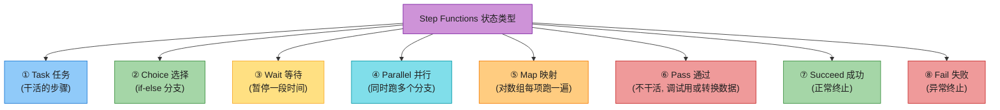

| 状态 | 作用 | 外卖订单例子 |
|------|------|------------|
| **Task** | **执行一个工作单元**(调 Lambda/SQS/DynamoDB 等) | "扣款"(调支付 Lambda) |
| **Choice** | **条件分支**(类似 if-else) | "支付成功?→通知餐厅;失败→告警" |
| **Wait** | **暂停**(相对秒数或绝对时间戳) | "等餐厅出餐 15 分钟后查骑手" |
| **Parallel** | **并行执行多个独立分支** | "同时:① 通知餐厅 ② 扣库存 ③ 推送用户" |
| **Map** | **对数组每项并行执行**(动态并行) | "对订单里每道菜各跑一遍出餐流程" |
| **Pass** | 不干活,**转换输入/调试用** | 把上一步的输出加个字段再传下一步 |
| **Succeed** | **正常终止** | 订单完成 |
| **Fail** | **异常终止**(可被 Catch 捕获) | 骑手多次失败,标记订单异常 |

> 💡 **Parallel vs Map 的区别**(常考):**Parallel 是静态分支**(你定义几个固定分支);**Map 是动态并行**(根据输入数组的大小决定跑几份)。

#### 2.1.3 错误处理:Retry + Catch ⭐⭐⭐⭐

生产级工作流**必须有错误处理**。Step Functions 提供:
- **Retry**:某状态失败时**自动重试**(指定错误码、最大次数、退避策略)。
- **Catch**:某状态失败后**捕获并转到 fallback 状态**(如转 DLQ、发告警)。

```mermaid
flowchart LR
    TASK["Task: 调支付 API"] -->|"失败 (超时/5xx)"| RETRY["Retry<br/>最大3次<br/>指数退避"]
    RETRY -->|"重试成功"| NEXT["下一步"]
    RETRY -->|"3次都失败"| CATCH["Catch"]
    CATCH --> FALLBACK["Fallback 状态<br/>(告警 + 入 DLQ)"]

    style TASK fill:#90CAF9,stroke:#1976D2,color:#1f1f1f
    style RETRY fill:#FFCC80,stroke:#F57C00,color:#1f1f1f
    style NEXT fill:#A5D6A7,stroke:#388E3C,color:#1f1f1f
    style CATCH fill:#EF9A9A,stroke:#C62828,color:#1f1f1f
    style FALLBACK fill:#FFE082,stroke:#F9A825,color:#1f1f1f
```

#### 2.1.4 标准工作流 vs Express 工作流 ⭐⭐⭐⭐(必考)

Step Functions 有两种类型,**选错会浪费钱或限制功能**:

| 对比维度 | **Standard 标准工作流** | **Express 快速工作流** |
|---------|----------------------|----------------------|
| **执行时长** | 最长 **1 年**(适合长流程) | 最长 **5 分钟** |
| **吞吐** | 适合中低吞吐 | **超高吞吐**(每秒数千~百万级) |
| **执行保证** | **精确一次**(exactly-once) | 异步**至少一次**;同步**最多一次** |
| **执行历史** | 完整审计(最多 25000 条事件) | 不存完整历史(进 CloudWatch Logs) |
| **可视化** | 控制台可视化每次执行 | 不支持单次执行可视化 |
| **Activity 支持** | 支持 | **不支持** |
| **典型场景** | ETL、订单处理、长流程审批 | **IoT 事件流、点击流、Lambda 触发的高并发** |
| **计费** | 按状态转换次数 | 按执行次数 + 消耗的 GB-秒 |

> 🪤 **追问陷阱(高频)**:"Standard 和 Express 怎么选?" → ① **执行时长 > 5 分钟?** → Standard;② **需要可视化每次执行?** → Standard;③ **超高并发(每秒千次以上)?** → Express;④ **短时事件处理(IoT/点击流)?** → Express。**注意:类型创建后不能改!**

> 📝 **2022+ Distributed Map**:支持从 S3 读 **JSON/CSV 大文件**,对每行并行执行,**最高 10,000 并行**(Inline Map 只有 40)。处理百万级任务利器(见 2026 增量)。

### 2.2 Amazon MWAA(Managed Workflows for Apache Airflow)—— 托管 Airflow ⭐⭐⭐

**一句话定位**:MWAA 是 AWS 的**全托管 Apache Airflow 服务**,专门为**数据管道(ETL/ELT)批处理**设计。

**Apache Airflow 是什么**:开源的"用代码定义工作流"工具,工作流写成 **DAG(Directed Acyclic Graph,有向无环图)**——一组按方向执行、没有循环的任务。Python 写 DAG,调度器定时触发。

**Airflow 架构四件套**:

```mermaid
flowchart LR
    DAG["你写的 DAG<br/>(Python 定义任务)"] --> SCHED["Scheduler<br/>(调度器, 触发任务)"]
    SCHED --> EXEC["Executor<br/>(决定串行/并行执行)"]
    SCHED --> WEB["Web Server<br/>(UI 界面)"]
    SCHED --> META["Metadata DB<br/>(存任务状态: Postgres/MySQL/SQLite)"]
    EXEC --> WORKER["Worker<br/>(实际跑任务)"]

    style DAG fill:#80DEEA,stroke:#0097A7,color:#1f1f1f
    style SCHED fill:#90CAF9,stroke:#1976D2,color:#1f1f1f
    style EXEC fill:#CE93D8,stroke:#7B1FA2,color:#1f1f1f
    style WEB fill:#A5D6A7,stroke:#388E3C,color:#1f1f1f
    style META fill:#FFCC80,stroke:#F57C00,color:#1f1f1f
    style WORKER fill:#EF9A9A,stroke:#C62828,color:#1f1f1f
```

**MWAA 帮你托管了什么**:
- **可扩展性**:你定义 min/max worker 数,AWS 自动扩缩。
- **安全**:IAM 角色/策略、worker 跑在 MWAA 自己的 VPC、KMS 加密、可私/公访问模式。
- **运维管理**:Console 几下点完,版本升级/安全补丁 AWS 管。
- **监控**:Airflow 日志/指标自动进 CloudWatch。

**Step Functions vs MWAA 怎么选**(常考):

| 维度 | **Step Functions** | **MWAA** |
|------|-------------------|---------|
| **适用** | 通用业务编排、实时流 + 批 | **批处理数据管道(ETL)为主** |
| **定义方式** | JSON(ASL) | **Python(DAG)** |
| **可视化** | 内置可视化 | Airflow Web UI |
| **生态** | AWS 服务深度集成 | Airflow 生态(大量 operator) |
| **运维** | 全托管,零运维 | 半托管(你管 DAG,AWS 管基础设施) |

> 💡 **经验法则**:**纯 AWS、要可视化业务流 → Step Functions;复杂数据 ETL、团队懂 Airflow → MWAA**。

### 2.3 AWS AppSync —— 托管 GraphQL + 实时 ⭐⭐⭐

**一句话定位**:AppSync 是 AWS 的**全托管 GraphQL 服务**——前端用一个 GraphQL 端点,后端可聚合多个数据源(DynamoDB/RDS/Lambda/HTTP)。

**它解决什么痛点**:前端要显示"餐厅 + 菜品 + 优惠券 + 评论",这些数据散在多个后端微服务。两种方案:
- **REST 方案**:前端发 4 个请求,自己拼装(慢 + 前端复杂)。
- **GraphQL(AppSync)**:前端发 1 个 GraphQL 查询,AppSync 帮你从 4 个数据源聚合后返回。

```mermaid
flowchart LR
    FE["前端 App"] -->|"单个 GraphQL 查询"| APPSYNC["AWS AppSync<br/>(GraphQL 端点)"]
    APPSYNC --> RES["Resolvers<br/>(转换 + 路由)"]
    RES --> DDB["DynamoDB<br/>(菜品)"]
    RES --> RDS["RDS/Aurora<br/>(订单)"]
    RES --> LAM["Lambda<br/>(优惠券逻辑)"]
    RES --> HTTP["HTTP API<br/>(第三方评论)"]

    APPSYNC -->|"实时(WebSocket)"| FE2["推送更新给订阅的客户端"]

    style FE fill:#FFE082,stroke:#F9A825,color:#1f1f1f
    style APPSYNC fill:#A5D6A7,stroke:#388E3C,color:#1f1f1f
    style RES fill:#FFCC80,stroke:#F57C00,color:#1f1f1f
    style DDB fill:#90CAF9,stroke:#1976D2,color:#1f1f1f
    style RDS fill:#90CAF9,stroke:#1976D2,color:#1f1f1f
    style LAM fill:#CE93D8,stroke:#7B1FA2,color:#1f1f1f
    style HTTP fill:#80DEEA,stroke:#0097A7,color:#1f1f1f
    style FE2 fill:#FFE082,stroke:#F9A825,color:#1f1f1f
```

**核心组件**:
- **GraphQL Schema**:数据模型 + 查询模式(Query/Mutation/Subscription)。
- **Resolvers**:连接 schema 和数据源,把 GraphQL payload 转成数据源的协议。
- **Data Source**:DynamoDB / RDS / Lambda / HTTP 等。
- **Merged API**:多个团队各自的 source API 合并成一个对外 API。

**AppSync 还支持**:
- **实时订阅(Subscription)**:基于托管 WebSocket,推实时更新(体育比分、聊天)。
- **离线支持**:配合 AWS Amplify,断网时本地缓存,联网自动同步。
- **内置 authN/authZ**:集成 Cognito / IAM / OIDC / API Key。
- **缓存 + WAF + TLS**:开箱即用。

> 📝 **aws_06 详细讲了 GraphQL 和 WebSocket/SSE 等推送协议的原理**,本章讲"AWS 用 AppSync 怎么落地 GraphQL + 实时"。

---

## 3. 监控与可观测:Amazon CloudWatch + EventBridge

铺垫 ④ 讲了监控三件套(Metrics/Logs/Traces)。AWS 的监控主力是 **CloudWatch**(覆盖 Metrics/Logs/Alarms/Dashboards),事件驱动的主力是 **EventBridge**(原 CloudWatch Events 的升级版)。

### 3.1 Amazon CloudWatch —— Logs / Metrics / Alarms / Dashboards ⭐⭐⭐⭐⭐

**一句话定位**:CloudWatch 是 AWS 的**统一可观测平台**——收日志、存指标、设告警、画仪表盘。几乎所有 AWS 服务都自动把指标/日志推到 CloudWatch。

```mermaid
flowchart TD
    CW["Amazon CloudWatch"] --> LOGS["① Logs 日志"]
    CW --> METRICS["② Metrics 指标"]
    CW --> ALARMS["③ Alarms 告警"]
    CW --> DASH["④ Dashboards 仪表盘"]

    APP["你的应用"] -->|"PutLogEvents / print"| LOGS
    AWS_SVC["AWS 服务<br/>(EC2/Lambda/SQS...)"] -->|"自动发布"| METRICS
    LOGS --> INSIGHTS["Logs Insights<br/>(SQL 查询日志)"]
    METRICS --> ALARMS
    ALARMS --> ACTION["触发动作:<br/>SNS 通知 / ASG 扩缩 / EC2 操作 / SSM OpsItem"]

    style CW fill:#80DEEA,stroke:#0097A7,color:#1f1f1f
    style LOGS fill:#90CAF9,stroke:#1976D2,color:#1f1f1f
    style METRICS fill:#A5D6A7,stroke:#388E3C,color:#1f1f1f
    style ALARMS fill:#EF9A9A,stroke:#C62828,color:#1f1f1f
    style DASH fill:#FFCC80,stroke:#F57C00,color:#1f1f1f
    style APP fill:#CE93D8,stroke:#7B1FA2,color:#1f1f1f
    style AWS_SVC fill:#FFE082,stroke:#F9A825,color:#1f1f1f
    style INSIGHTS fill:#80DEEA,stroke:#0097A7,color:#1f1f1f
    style ACTION fill:#FFE082,stroke:#F9A825,color:#1f1f1f
```

#### 3.1.1 CloudWatch Logs(日志)

| 概念 | 含义 |
|------|------|
| **日志事件(Log Event)** | 一条日志记录(时间戳 + 消息) |
| **日志流(Log Stream)** | 同一来源的日志事件序列(如一个 EC2 实例的日志) |
| **日志组(Log Group)** | 相同属性(来源/保留/权限)的日志流集合 | 保留期可配(1 天~10 年) |
| **Logs Insights** | 用 SQL 风格查询语言**跨多个日志组**交互查询(最多 50 个日志组) |
| **PII 检测** | CloudWatch 用模式匹配 + ML 自动识别并**遮蔽 PII**(如身份证、信用卡) |

**典型用法**:5 个微服务各自的日志组,出问题时用 Logs Insights 一条 SQL 查"过去 1 小时所有 `InternalServerException`",跨服务聚合分析。

#### 3.1.2 CloudWatch Metrics(指标)

| 概念 | 含义 |
|------|------|
| **指标(Metric)** | 时间序列数据点(如 CPU 利用率、API 调用数) |
| **命名空间(Namespace)** | 顶层隔离(如 `AWS/EC2` 是 EC2 的指标;自定义 `MyApp`) |
| **维度(Dimension)** | 名值对,标识指标(如 `API=login`,`metric=latency`);**单指标最多 30 维度** |
| **分辨率(Resolution)** | 标准(1 分钟粒度)或高(1 秒粒度) |
| **统计(Statistics)** | 聚合:max/min/sum/avg/percentile(如 p99 延迟) |
| **Metric Streams** | 实时流式输出指标到第三方(Datadog)或 S3(JSON / OpenTelemetry 0.7.0 格式) |

> 💡 **AWS 大部分服务免费发布默认指标**(如 Lambda 的 Invocations/Errors/Durations),但要更细粒度(如 Lambda 的并发数、内存用满)需开 **Lambda Insights** 或自定义指标(`PutMetricData` API)。

#### 3.1.3 CloudWatch Alarms(告警)⭐⭐⭐⭐

告警 = 在指标上设阈值,触发后执行动作。

```mermaid
flowchart LR
    METRIC["Metric<br/>(如 CPU 利用率)"] --> ALARM["Alarm<br/>(阈值: CPU > 75% 持续 15 分钟)"]
    ALARM --> STATE{"状态"}
    STATE -->|"OK"| OK_ST["正常"]
    STATE -->|"ALARM"| TRIGGER["触发动作"]
    STATE -->|"INSUFFICIENT"| INSUF["数据不足"]

    TRIGGER --> A1["SNS 通知<br/>(发邮件/短信)"]
    TRIGGER --> A2["Auto Scaling<br/>(加/减实例)"]
    TRIGGER --> A3["EC2 操作<br/>(重启/停止/恢复)"]
    TRIGGER --> A4["SSM OpsItem<br/>(运维工单)"]

    style METRIC fill:#90CAF9,stroke:#1976D2,color:#1f1f1f
    style ALARM fill:#FFCC80,stroke:#F57C00,color:#1f1f1f
    style STATE fill:#CE93D8,stroke:#7B1FA2,color:#1f1f1f
    style OK_ST fill:#A5D6A7,stroke:#388E3C,color:#1f1f1f
    style TRIGGER fill:#EF9A9A,stroke:#C62828,color:#1f1f1f
    style INSUF fill:#FFE082,stroke:#F9A825,color:#1f1f1f
    style A1 fill:#80DEEA,stroke:#0097A7,color:#1f1f1f
    style A2 fill:#80DEEA,stroke:#0097A7,color:#1f1f1f
    style A3 fill:#80DEEA,stroke:#0097A7,color:#1f1f1f
    style A4 fill:#80DEEA,stroke:#0097A7,color:#1f1f1f
```

**告警的三种状态**:OK(正常)、ALARM(报警)、INSUFFICIENT_DATA(数据不足)。

**两种阈值模式**:
- **静态阈值(Static)**:具体值,如 CPU > 75%。
- **异常检测(Anomaly Detection)** ⭐:CloudWatch 用 ML 学一个"正常带",超出带就告警(适合波动大的指标)。

**复合告警(Composite Alarm)**:把多个告警组合,"CPU 高 **且** 内存高 **且** 磁盘满"才告警——**降低告警噪音**(单指标偶尔抖动不告警)。

**Missing Data 处理**:指标没数据时怎么办?可设为:当做好/坏/忽略/缺失四种处理。

#### 3.1.4 CloudWatch Dashboards(仪表盘)

可自定义的可视化面板,放多个指标的图表,可跨账号/跨 Region 聚合。团队共享,大屏展示。

### 3.2 Amazon EventBridge —— 事件总线、事件驱动 ⭐⭐⭐⭐⭐

**一句话定位**:EventBridge 是 AWS 的**无服务器事件总线服务**——它是 **CloudWatch Events 的升级版**(底层架构相同,但 EventBridge 功能更多)。2026 主推 EventBridge,控制台选 CloudWatch Events 规则会自动跳转。

```mermaid
flowchart LR
    SRC1["AWS 服务状态变化<br/>(EC2 启动/Lambda 完成)"] --> BUS["EventBridge 事件总线"]
    SRC2["自定义事件<br/>(应用自己发)"] --> BUS
    SRC3["SaaS 集成<br/>(PagerDuty/Auth0)"] --> BUS
    SRC4["定时<br/>(cron/rate)"] --> BUS

    BUS --> RULE["规则 Rule<br/>(内容过滤 + 路由)"]
    RULE --> T1["目标1: Lambda"]
    RULE --> T2["目标2: SQS"]
    RULE --> T3["目标3: Step Functions"]
    RULE --> T4["目标4: API Gateway"]
    RULE --> T5["目标5: SSM 自动化"]

    style SRC1 fill:#80DEEA,stroke:#0097A7,color:#1f1f1f
    style SRC2 fill:#80DEEA,stroke:#0097A7,color:#1f1f1f
    style SRC3 fill:#80DEEA,stroke:#0097A7,color:#1f1f1f
    style SRC4 fill:#80DEEA,stroke:#0097A7,color:#1f1f1f
    style BUS fill:#A5D6A7,stroke:#388E3C,color:#1f1f1f
    style RULE fill:#FFCC80,stroke:#F57C00,color:#1f1f1f
    style T1 fill:#CE93D8,stroke:#7B1FA2,color:#1f1f1f
    style T2 fill:#90CAF9,stroke:#1976D2,color:#1f1f1f
    style T3 fill:#EF9A9A,stroke:#C62828,color:#1f1f1f
    style T4 fill:#FFE082,stroke:#F9A825,color:#1f1f1f
    style T5 fill:#FFE082,stroke:#F9A825,color:#1f1f1f
```

**EventBridge 相比 CloudWatch Events 多了什么**(必考):

| 特性 | CloudWatch Events | EventBridge |
|------|------------------|-------------|
| **底层架构** | 默认事件总线 | 相同 + **支持自定义事件总线** |
| **SaaS 集成** | 不支持 | **支持**(如 PagerDuty/Auth0,走 AWS 私网) |
| **内容过滤** | 简单 | **基于内容的精细过滤**(不用消费端再写 if) |
| **Schema Registry** | 无 | **有**(自动推断事件结构,辅助开发) |
| **API 兼容** | — | **向后兼容 CW Events API** |

**典型用法**:
1. **AWS 资源状态变化触发动作**:EC2 从 pending 变 running → 触发 Lambda 注册到监控。
2. **定时任务**(替代 cron):每天 7 点跑 Lambda 聚合昨日营收。
3. **跨服务编排**:EventBridge 收事件 → 路由到 Step Functions。
4. **SaaS 集成**:PagerDuty 告警 → EventBridge → 自动重启 EC2。

> 💡 **2022+ EventBridge Scheduler**:更精细的"定时即服务"——支持一次性/重复调度,**不用维护 cron 服务器**,可调度 200+ AWS 服务。

> 📝 **aws_08 第 3 节讲了 EDA(事件驱动架构)的原理**,本章讲"AWS 用 EventBridge + Lambda + SQS 怎么落地 EDA"。

---

## 4. 访问管理:IAM 与 Cognito

铺垫 ⑤ 讲了 authN vs authZ 和最小权限原则。AWS 的访问管理分**两层**:
- **IAM**:管 **AWS 资源的访问**(谁能开 EC2、谁能读 S3)——给**开发者/服务**用。
- **Cognito**:管 **应用最终用户的身份**(谁能登录你的 App)——给**App 的终端用户**用。

### 4.1 AWS IAM(Identity and Access Management)⭐⭐⭐⭐⭐

**一句话定位**:IAM 是 AWS 的**全局访问控制服务**——管"谁能进 AWS 账号、能操作哪些资源"。它**免费、全局**(不局限在某 Region)。

#### 4.1.1 IAM 的核心实体

```mermaid
flowchart TD
    IAM["AWS IAM"] --> ROOT["Root User 根用户<br/>(账号创建时生成, 全权限)"]
    IAM --> USER["IAM User 用户<br/>(人 或 服务, 长期凭证)"]
    IAM --> GROUP["IAM Group 组<br/>(用户的集合, 方便批量授权)"]
    IAM --> ROLE["IAM Role 角色 ⭐<br/>(临时身份, 被假设 assume)"]
    IAM --> POLICY["IAM Policy 策略<br/>(JSON, 定义权限)"]

    POLICY --> ATTACH["附加到"]
    ATTACH --> USER
    ATTACH --> GROUP
    ATTACH --> ROLE

    ROLE --> ASSUME["被谁 assume?"]
    ASSUME --> WHO1["EC2 / Lambda / ECS<br/>(服务自己取临时凭证)"]
    ASSUME --> WHO2["人<br/>(跨账号访问)"]
    ASSUME --> WHO3["外部 IdP<br/>(Google/Facebook 联合)"]

    style IAM fill:#FFE082,stroke:#F9A825,color:#1f1f1f
    style ROOT fill:#EF9A9A,stroke:#C62828,color:#1f1f1f
    style USER fill:#FFCC80,stroke:#F57C00,color:#1f1f1f
    style GROUP fill:#80DEEA,stroke:#0097A7,color:#1f1f1f
    style ROLE fill:#A5D6A7,stroke:#388E3C,color:#1f1f1f
    style POLICY fill:#CE93D8,stroke:#7B1FA2,color:#1f1f1f
    style ATTACH fill:#90CAF9,stroke:#1976D2,color:#1f1f1f
    style ASSUME fill:#90CAF9,stroke:#1976D2,color:#1f1f1f
    style WHO1 fill:#FFE082,stroke:#F9A825,color:#1f1f1f
    style WHO2 fill:#FFE082,stroke:#F9A825,color:#1f1f1f
    style WHO3 fill:#FFE082,stroke:#F9A825,color:#1f1f1f
```

| 实体 | 含义 | 关键点 |
|------|------|--------|
| **Root User 根用户** | 创建账号时生成,**有全部权限,无法被策略拒绝** | **平时不用**!只用它做"删账号/开通 GovCloud"等少数事;日常用 IAM User/Role |
| **IAM User 用户** | 一个人或服务,**长期凭证**(密码登 Console 或 access key 编程访问) | ⚠️ **2026 不推荐长期凭证**,优先用 Role + STS |
| **IAM Group 组** | 用户的集合,**批量授权**(给组加策略,组里用户继承) | 不能用组名登录 |
| **IAM Role 角色** ⭐ | **不绑定具体人/服务的"身份"**,被临时 assume(假设) | **推荐!**临时凭证、自动过期、跨账号/跨服务用 |
| **IAM Policy 策略** | JSON 文档,定义"允许/拒绝什么操作什么资源" | 附加到 User/Group/Role 或资源(S3 bucket) |

#### 4.1.2 IAM Policy 结构(必背)

```mermaid
flowchart LR
    POL["IAM Policy JSON"] --> VER["Version<br/>(策略语言版本)"]
    POL --> STMT["Statement 语句<br/>(可以有多个)"]
    STMT --> EFF["Effect: Allow / Deny<br/>(允许 or 拒绝)"]
    STMT --> ACT["Action: 操作<br/>(如 s3:GetObject)"]
    STMT --> RES["Resource: 资源 ARN<br/>(如 arn:aws:s3:::my-bucket/*)"]
    STMT --> COND["Condition (可选)<br/>(附加条件, 如 IP 限制)"]
    STMT --> PRIN["Principal (可选)<br/>(基于资源的策略用, 谁能访问)"]

    style POL fill:#CE93D8,stroke:#7B1FA2,color:#1f1f1f
    style VER fill:#80DEEA,stroke:#0097A7,color:#1f1f1f
    style STMT fill:#90CAF9,stroke:#1976D2,color:#1f1f1f
    style EFF fill:#A5D6A7,stroke:#388E3C,color:#1f1f1f
    style ACT fill:#FFCC80,stroke:#F57C00,color:#1f1f1f
    style RES fill:#EF9A9A,stroke:#C62828,color:#1f1f1f
    style COND fill:#FFE082,stroke:#F9A825,color:#1f1f1f
    style PRIN fill:#FFE082,stroke:#F9A825,color:#1f1f1f
```

**两种策略类型**:
- **基于身份的策略(Identity-based)**:附加到 User/Group/Role,定义"这个身份能干什么"。
- **基于资源的策略(Resource-based)**:附加到资源(如 S3 bucket policy),定义"谁能访问这个资源"。

**默认拒绝(Default Deny)原则**:没有显式 Allow 的都拒绝。**显式 Deny 优先级最高**(覆盖任何 Allow)。

#### 4.1.3 STS 临时凭证 + 跨账号访问 ⭐⭐⭐⭐

```mermaid
sequenceDiagram
    participant App as EC2 上的应用
    participant STS as AWS STS
    participant S3 as S3
    Note over App: 应用需要读 S3, 但它自己没有 access key
    App->>STS: AssumeRole(RoleARN)
    STS-->>App: 临时凭证(AK/SK/Token, 15min~12h 过期)
    Note over App: 用临时凭证调 S3
    App->>S3: GetObject (带临时凭证)
    S3-->>App: 文件内容
    Note over App: 凭证过期后自动失效<br/>(不用人工 rotate)
```

**STS(Security Token Service)** 的核心:**发放短期临时凭证**(15 分钟到 12 小时过期)。

**为什么临时凭证比长期 access key 好**(背):
1. **自动过期**:泄露窗口短,即使被偷也很快失效。
2. **不用人工 rotate**:长期 key 要定期换,麻烦且容易忘。
3. **跨账号安全**:A 账号的 Role 让 B 账号 assume,A 不用把 key 给 B。
4. **最小权限**:每次 assume 时按需给权限。

**跨账号访问(delegation)的两种策略**:
- **信任策略(Trust Policy)**:Role 的 trust policy 指定"哪些账号/用户可以 assume 我"。
- **权限策略(Permission Policy)**:Role 的 permission policy 指定"assume 后能干什么"。

> 💡 **2026 最佳实践**:**EC2/Lambda/ECS 一律用 IAM Role,不用 access key**。第三方客户端(没法 assume Role 的)才用 User + MFA。**零长期凭证(zero long-term credentials)** 是目标(见 2026 增量)。

#### 4.1.4 IAM 高频考点

> 🪤 **追问陷阱(高频)**:"IAM Role 和 IAM User 区别?" → **User 是绑定具体人/服务的长期身份**;**Role 是不绑定具体人的"可被假设的临时身份"**,被 EC2/Lambda/跨账号用户临时 assume,凭证自动过期。**生产环境优先用 Role**。

> 🪤 **追问陷阱**:"最小权限原则是什么?" → 给身份**只分配完成任务必需的最小权限**,不多给。减小爆炸半径 + 防误操作 + 合规。用 **IAM Access Analyzer** 扫描"给过头"的权限。

> 🪤 **追问陷阱**:"Root 用户能被策略限制吗?" → **不能被 IAM 策略拒绝**。只有 **SCP(组织级策略)** 能限制 root。所以**平时绝不用 root**,建一个管理员 User,把 root 锁起来。

### 4.2 Amazon Cognito —— User Pool authN / Identity Pool authZ ⭐⭐⭐⭐⭐

**一句话定位**:Cognito 是 AWS 的**面向应用最终用户的客户身份与访问管理(CIAM)服务**——管"用户怎么登录你的 App、登录后能访问什么 AWS 资源"。

**IAM vs Cognito 的区别**(必考):

| 维度 | **IAM** | **Cognito** |
|------|---------|------------|
| **服务对象** | AWS 账号内部(开发者/运维/服务) | **应用最终用户**(App 的终端用户) |
| **规模** | 几个~几百个用户 | **百万~亿级用户** |
| **认证方式** | 密码/access key/Role assume | 用户名密码 / 第三方 IdP / MFA / 托管 UI |
| **典型场景** | 谁能开 EC2、谁能读 S3 | 用户登录 App 后能否下单、能否上传图片 |

#### 4.2.1 Cognito 的两个 Pool(必考区别!)

Cognito 有两个"池子",**作用完全不同**,面试常考:

```mermaid
flowchart LR
    COG["Amazon Cognito"] --> UP["① User Pool 用户池<br/>(管 authN: 你是谁)"]
    COG --> IP["② Identity Pool 身份池<br/>(管 authZ: 你能访问哪些 AWS 资源)"]

    UP --> UP1["用户目录<br/>(注册/登录/找回密码)"]
    UP --> UP2["发 Token<br/>(JWT: ID Token / Access Token)"]
    UP --> UP3["集成第三方 IdP<br/>(Google/Facebook/Apple)"]
    UP --> UP4["MFA / 托管 UI"]

    IP --> IP1["用 Token 换 AWS 临时凭证<br/>(AK/SK/Session Token)"]
    IP --> IP2["临时凭证可调 AWS 服务<br/>(如直接上传 S3)"]
    IP --> IP3["支持游客(guest)访问"]

    style COG fill:#FFE082,stroke:#F9A825,color:#1f1f1f
    style UP fill:#A5D6A7,stroke:#388E3C,color:#1f1f1f
    style IP fill:#90CAF9,stroke:#1976D2,color:#1f1f1f
    style UP1 fill:#80DEEA,stroke:#0097A7,color:#1f1f1f
    style UP2 fill:#80DEEA,stroke:#0097A7,color:#1f1f1f
    style UP3 fill:#80DEEA,stroke:#0097A7,color:#1f1f1f
    style UP4 fill:#80DEEA,stroke:#0097A7,color:#1f1f1f
    style IP1 fill:#FFCC80,stroke:#F57C00,color:#1f1f1f
    style IP2 fill:#FFCC80,stroke:#F57C00,color:#1f1f1f
    style IP3 fill:#FFCC80,stroke:#F57C00,color:#1f1f1f
```

| 维度 | **User Pool(用户池)** | **Identity Pool(身份池)** |
|------|----------------------|--------------------------|
| **管什么** | **authN**(认证:你是谁) | **authZ**(授权:能访问什么 AWS 资源) |
| **核心功能** | 用户目录 + 注册/登录 + 发 JWT Token | 用 Token 换 **AWS 临时凭证**(STS) |
| **数据存哪** | Cognito 自己的目录 | 不存用户,只做"Token → 临时凭证"映射 |
| **典型场景** | 用户登录 App,拿到 JWT | 拿 JWT 换临时凭证,**直接上传 S3**(不用后端中转) |
| **是否支持游客** | 否(必须登录) | **支持**(未登录用户也给有限临时凭证) |

**完整登录流程**(背):

```mermaid
sequenceDiagram
    participant User as 用户
    participant App as App 前端
    participant UP as Cognito User Pool
    participant IP as Cognito Identity Pool
    participant S3 as S3
    Note over User,App: ① 注册/登录(authN)
    User->>App: 输入用户名密码
    App->>UP: 登录请求
    UP-->>App: JWT Token(ID Token + Access Token)
    Note over App,IP: ② 换 AWS 临时凭证(authZ)
    App->>IP: 提交 JWT
    IP->>IP: 验证 Token, 查权限映射
    IP-->>App: AWS 临时凭证(AK/SK/Token)
    Note over App,S3: ③ 直连 AWS 服务
    App->>S3: PutObject(带临时凭证)
    S3-->>App: 上传成功
```

#### 4.2.2 Cognito 的核心概念

| 概念 | 含义 |
|------|------|
| **身份提供商(IdP)** | 存用户身份的服务。Cognito 自己是 IdP,也可集成第三方(Google/Facebook/Amazon,协议 OAuth 2.0/SAML/OpenID) |
| **联合身份(Federation)** | 信任外部 IdP,让它的用户 assume 你的 Role/拿临时凭证 |
| **User Pool Hosted UI** | AWS 托管的登录页面(URL),可定制 logo/CSS,不用自己写登录 UI |
| **Triggers** | Cognito 事件(如 pre/post authentication)可触发 Lambda 跑额外逻辑(如校验地理位置) |
| **Attributes for Access Control** | 根据用户属性(如部门)动态分配 Role |

**集成 API Gateway**:Cognito User Pool 和 API Gateway 原生集成,**API Gateway 自动验证 JWT**,不用后端手写验证逻辑。

**S3 上传的两种方案**(Cognito 场景):
1. **S3 预签名 URL(Presigned URL)**:后端用自己权限生成临时 URL 给前端;适合"对象 key 已知"。
2. **Cognito Identity Pool**:前端拿临时凭证直接上传;适合"已用 Cognito 且需前端直传"。

> 🪤 **追问陷阱(高频)**:"Cognito 两个 Pool 区别?" → **User Pool 管 authN**(注册/登录/发 JWT),**Identity Pool 管 authZ**(用 JWT 换 AWS 临时凭证,决定能访问哪些 AWS 资源)。**先认证(User Pool)再授权(Identity Pool)**。Identity Pool 还支持游客(未登录也给有限凭证)。

> 🪤 **追问陷阱**:"为什么用 Cognito 而不是自己写认证?" → ① **不用维护用户密码存储**(安全风险大);② **托管的 MFA/找回密码/防爆破**;③ **第三方登录一行配置**;④ **亿级扩展,免费起步**。原书第 16 章会详细对比"自建 vs Cognito"。

---

## 2026 现代增量(原书没讲的硬核)⭐⭐⭐⭐⭐

原书(2023)的四大类讲得很系统,但**几处停在 2022**。本章大,多补几条 2026 必备料——面试讲出来直接拉开档次。

### 增量 1:CloudWatch Events → EventBridge 完全迁移 + EventBridge Scheduler ⭐⭐⭐⭐⭐

原书把 **CloudWatch Events** 和 **EventBridge** 并列讲,说"两者底层架构相同,EventBridge 功能更多"。但 **2026 EventBridge 已是绝对主角**,CW Events 只是个别名(控制台选 CW Events 规则自动跳转到 EventBridge)。

```mermaid
flowchart LR
    OLD["原书: CW Events + EventBridge 并列"] -->|"2026"| NEW["EventBridge 是主角 ⭐"]
    NEW --> EB1["EventBridge 统一事件总线<br/>(default + custom bus)"]
    NEW --> EB2["EventBridge Scheduler<br/>(2022+, 定时即服务)"]
    NEW --> EB3["EventBridge Pipes<br/>(2022+, 连接源→目标+中间转换)"]

    EB2 --> SCH1["替代自维护 cron 服务器"]
    EB2 --> SCH2["支持一次性 + 重复调度"]
    EB2 --> SCH3["可调度 200+ AWS 服务"]

    EB3 --> PIPE1["源(Kinesis/SQS/DynamoDB Stream)"]
    PIPE1 --> PIPE2["可选: 过滤 + 转换(Lambda/Step Functions)"]
    PIPE2 --> PIPE3["目标(API/SQS/Lambda)"]

    style OLD fill:#FFCC80,stroke:#F57C00,color:#1f1f1f
    style NEW fill:#A5D6A7,stroke:#388E3C,color:#1f1f1f
    style EB1 fill:#80DEEA,stroke:#0097A7,color:#1f1f1f
    style EB2 fill:#90CAF9,stroke:#1976D2,color:#1f1f1f
    style EB3 fill:#CE93D8,stroke:#7B1FA2,color:#1f1f1f
    style SCH1 fill:#FFE082,stroke:#F9A825,color:#1f1f1f
    style SCH2 fill:#FFE082,stroke:#F9A825,color:#1f1f1f
    style SCH3 fill:#FFE082,stroke:#F9A825,color:#1f1f1f
    style PIPE1 fill:#FFE082,stroke:#F9A825,color:#1f1f1f
    style PIPE2 fill:#FFE082,stroke:#F9A825,color:#1f1f1f
    style PIPE3 fill:#FFE082,stroke:#F9A825,color:#1f1f1f
```

> 🔄 **2026 话术(直接背)**:"原书把 CloudWatch Events 和 EventBridge 并列讲,但 **2026 EventBridge 已是绝对主角**,CW Events 只是别名。EventBridge 新增三大件:**① 统一事件总线**(default + 自定义 bus,支持 SaaS 集成);**② EventBridge Scheduler**(2022+,定时即服务,不用维护 cron 服务器,支持一次性/重复调度);**③ EventBridge Pipes**(2022+,把'源→可选过滤/转换→目标'连成管道,简化 ETL 编排)。"

### 增量 2:MSK 去 ZooKeeper(KRaft 模式)+ MSK Serverless ⭐⭐⭐⭐

原书说 MSK 用 ZooKeeper 协调 broker 节点,3.7.x 才提到 KRaft。**2024+ MSK 已全面铺开 KRaft 模式**,而 **MSK Serverless 已成熟**(无需管 broker)。

```mermaid
flowchart LR
    OLD["原书: MSK 用 ZooKeeper<br/>3.7.x 才提 KRaft"] -->|"2026"| NEW["KRaft 全面铺开 + Serverless 成熟 ⭐"]
    NEW --> KR["KRaft 模式"]
    KR --> KR1["Kafka 自带 Raft 共识<br/>去掉了 ZooKeeper"]
    KR --> KR2["更少组件 → 更少故障点 → 更省运维"]
    KR --> KR3["更快 broker 启动/扩容"]

    NEW --> SERV["MSK Serverless"]
    SERV --> SV1["不用算 broker 数/类型"]
    SERV --> SV2["按吞吐自动扩容"]
    SERV --> SV3["适合流量波动大的流处理"]

    style OLD fill:#FFCC80,stroke:#F57C00,color:#1f1f1f
    style NEW fill:#A5D6A7,stroke:#388E3C,color:#1f1f1f
    style KR fill:#90CAF9,stroke:#1976D2,color:#1f1f1f
    style KR1 fill:#80DEEA,stroke:#0097A7,color:#1f1f1f
    style KR2 fill:#80DEEA,stroke:#0097A7,color:#1f1f1f
    style KR3 fill:#80DEEA,stroke:#0097A7,color:#1f1f1f
    style SERV fill:#CE93D8,stroke:#7B1FA2,color:#1f1f1f
    style SV1 fill:#FFE082,stroke:#F9A825,color:#1f1f1f
    style SV2 fill:#FFE082,stroke:#F9A825,color:#1f1f1f
    style SV3 fill:#FFE082,stroke:#F9A825,color:#1f1f1f
```

> 🔄 **2026 话术**:"原书 MSK 还在讲 ZooKeeper 协调,但 **2024+ MSK 已全面铺开 KRaft 模式**——Kafka 自带 Raft 共识,去掉了 ZooKeeper 这个'额外要运维的组件',broker 启动和扩容都更快。同时 **MSK Serverless 已成熟**,不用算 broker 数和类型,按吞吐自动扩容。**KRaft + Serverless 让 MSK 的运维复杂度大幅下降,和 Kinesis 的差距越来越小**。"

### 增量 3:Step Functions Express Workflow + Distributed Map + Workflow Studio ⭐⭐⭐⭐

原书 Step Functions 重点讲 Standard,**Express Workflow 一笔带过**,Distributed Map 和 Workflow Studio 完全没讲。但 **2022+ 这三件已成流处理标配**。

```mermaid
flowchart LR
    OLD["原书: Standard 为主<br/>Express 一笔带过"] -->|"2026"| NEW["三件套标配 ⭐"]
    NEW --> EXPRESS["Express Workflow"]
    EXPRESS --> EX1["高吞吐流处理(IoT/点击流)"]
    EXPRESS --> EX2["5 分钟内, 每秒数千执行"]
    EXPRESS --> EX3["异步至少一次/同步最多一次"]

    NEW --> DMAP["Distributed Map"]
    DMAP --> DM1["从 S3 读 JSON/CSV 大文件"]
    DMAP --> DM2["每行并行, 最高 10,000 并行"]
    DMAP --> DM3["Inline Map 只有 40 并行"]

    NEW --> STUDIO["Workflow Studio"]
    STUDIO --> ST1["拖拽可视化设计状态机"]
    STUDIO --> ST2["不用手写 ASL JSON"]

    style OLD fill:#FFCC80,stroke:#F57C00,color:#1f1f1f
    style NEW fill:#A5D6A7,stroke:#388E3C,color:#1f1f1f
    style EXPRESS fill:#90CAF9,stroke:#1976D2,color:#1f1f1f
    style EX1 fill:#80DEEA,stroke:#0097A7,color:#1f1f1f
    style EX2 fill:#80DEEA,stroke:#0097A7,color:#1f1f1f
    style EX3 fill:#80DEEA,stroke:#0097A7,color:#1f1f1f
    style DMAP fill:#CE93D8,stroke:#7B1FA2,color:#1f1f1f
    style DM1 fill:#FFE082,stroke:#F9A825,color:#1f1f1f
    style DM2 fill:#FFE082,stroke:#F9A825,color:#1f1f1f
    style DM3 fill:#FFE082,stroke:#F9A825,color:#1f1f1f
    style STUDIO fill:#EF9A9A,stroke:#C62828,color:#1f1f1f
    style ST1 fill:#FFE082,stroke:#F9A825,color:#1f1f1f
    style ST2 fill:#FFE082,stroke:#F9A825,color:#1f1f1f
```

> 🔄 **2026 话术**:"原书 Step Functions 重点讲 Standard,但 **2022+ 三件已成标配**:**① Express Workflow**——5 分钟内高吞吐流处理,适合 IoT/点击流,**异步至少一次/同步最多一次**;**② Distributed Map**(2022+)——从 S3 读 JSON/CSV 大文件,每行并行,**最高 10,000 并行**(Inline Map 只有 40),处理百万级任务利器;**③ Workflow Studio**——拖拽可视化设计状态机,不用手写 ASL JSON。**Step Functions 已从'编排工具'升级成'大规模并行计算平台'**。"

### 增量 4:Kinesis On-Demand 自动扩容 + OpenSearch/Redshift 直接消费 ⭐⭐⭐⭐

原书 KDS 重点讲 Provisioned 模式(要算 shard 数)。**On-Demand 模式已是流量波动场景首选**,且 OpenSearch/Redshift 可直接消费 Kinesis(不用中间 Lambda)。

```mermaid
flowchart LR
    OLD["原书: KDS 算 shard 数<br/>扩缩要手动 split/merge"] -->|"2026"| NEW["On-Demand 自动扩容 ⭐"]
    NEW --> OD1["不用算 shard 数"]
    NEW --> OD2["按写入/读取 GB 自动扩容"]
    NEW --> OD3["流量波动大场景首选"]

    NEW --> DIRECT["直接消费(无中间 Lambda)"]
    DIRECT --> D1["Redshift Streaming Ingestion"]
    DIRECT --> D2["OpenSearch 直接订阅"]
    DIRECT --> D3["Lambda/MSK/Firehose 都集成"]

    style OLD fill:#FFCC80,stroke:#F57C00,color:#1f1f1f
    style NEW fill:#A5D6A7,stroke:#388E3C,color:#1f1f1f
    style OD1 fill:#80DEEA,stroke:#0097A7,color:#1f1f1f
    style OD2 fill:#80DEEA,stroke:#0097A7,color:#1f1f1f
    style OD3 fill:#80DEEA,stroke:#0097A7,color:#1f1f1f
    style DIRECT fill:#90CAF9,stroke:#1976D2,color:#1f1f1f
    style D1 fill:#FFE082,stroke:#F9A825,color:#1f1f1f
    style D2 fill:#FFE082,stroke:#F9A825,color:#1f1f1f
    style D3 fill:#FFE082,stroke:#F9A825,color:#1f1f1f
```

> 🔄 **2026 话术**:"原书 KDS 要算 shard 数、手动 split/merge。**2024+ On-Demand 模式已是流量波动场景首选**——AWS 自动按写入/读取 GB 扩容,**不用算 shard**。而且 Kinesis 已支持**OpenSearch/Redshift 直接消费**(Redshift Streaming Ingestion),不用中间写 Lambda 转发,**降低延迟和成本**。"

### 增量 5:OpenTelemetry + ADOT + CloudWatch RUM/X-Ray(可观测性现代栈)⭐⭐⭐⭐⭐

原书可观测性主要讲 CloudWatch(Metrics/Logs/Alarms),**Traces 只提了 X-Ray 没深讲**,完全没提 OpenTelemetry 统一标准。**2026 可观测性已是四支柱 + OpenTelemetry 统一 + ADOT(AWS Distro)+ RUM**。

```mermaid
flowchart TD
    OLD["原书: CloudWatch 为主<br/>X-Ray 一笔带过"] -->|"2026"| NEW["四支柱 + OpenTelemetry 统一 ⭐⭐⭐"]

    NEW --> OT["OpenTelemetry (CNCF 标准)"]
    OT --> OT1["一个 SDK 采集 Metrics/Logs/Traces"]
    OT --> OT2["厂商中立, 后端可换"]

    NEW --> ADOT["ADOT (AWS Distro for OpenTelemetry)"]
    ADOT --> ADOT1["AWS 维护的 OTel 发行版"]
    ADOT --> ADOT2["深度集成 CloudWatch/X-Ray/Prometheus"]

    NEW --> RUM["CloudWatch RUM (Real User Monitoring)"]
    RUM --> RUM1["采集前端真实用户体验"]
    RUM --> RUM2["前端错误 + 页面性能 + 用户行为"]

    NEW --> FOUR["四支柱完整"]
    FOUR --> F1["Metrics (CloudWatch)"]
    FOUR --> F2["Logs (CloudWatch Logs)"]
    FOUR --> F3["Traces (X-Ray + OTel)"]
    FOUR --> F4["Profiles (CodeGuru Profiler)"]

    style OLD fill:#FFCC80,stroke:#F57C00,color:#1f1f1f
    style NEW fill:#A5D6A7,stroke:#388E3C,color:#1f1f1f
    style OT fill:#90CAF9,stroke:#1976D2,color:#1f1f1f
    style OT1 fill:#80DEEA,stroke:#0097A7,color:#1f1f1f
    style OT2 fill:#80DEEA,stroke:#0097A7,color:#1f1f1f
    style ADOT fill:#CE93D8,stroke:#7B1FA2,color:#1f1f1f
    style ADOT1 fill:#FFE082,stroke:#F9A825,color:#1f1f1f
    style ADOT2 fill:#FFE082,stroke:#F9A825,color:#1f1f1f
    style RUM fill:#EF9A9A,stroke:#C62828,color:#1f1f1f
    style RUM1 fill:#FFE082,stroke:#F9A825,color:#1f1f1f
    style RUM2 fill:#FFE082,stroke:#F9A825,color:#1f1f1f
    style FOUR fill:#80DEEA,stroke:#0097A7,color:#1f1f1f
    style F1 fill:#FFE082,stroke:#F9A825,color:#1f1f1f
    style F2 fill:#FFE082,stroke:#F9A825,color:#1f1f1f
    style F3 fill:#FFE082,stroke:#F9A825,color:#1f1f1f
    style F4 fill:#FFE082,stroke:#F9A825,color:#1f1f1f
```

> 🔄 **2026 话术**:"原书可观测性主要讲 CloudWatch Metrics/Logs,Traces 只提了 X-Ray。**2026 是四支柱完整(Metrics/Logs/Traces/Profiles)+ OpenTelemetry 统一采集 + ADOT(AWS 维护的 OTel 发行版)**——一个 SDK 采集所有,厂商中立可换后端。再加 **CloudWatch RUM**(Real User Monitoring)采集**前端真实用户体验**(页面加载、JS 错误、用户行为)。呼应 **aws_08 讲的可观测性四支柱**,AWS 现代栈已完整落地。"

### 增量 6:IAM 零长期凭证 + Access Analyzer + Permissions Boundary ⭐⭐⭐⭐⭐

原书 IAM 还在讲"长期 access key"。**2026 已强烈不推荐长期密钥**,主推 **IAM Role + STS 临时凭证(零长期凭证)**,配合 **IAM Access Analyzer** 和 **Permissions Boundary** 做权限治理。

```mermaid
flowchart LR
    OLD["原书: 还在讲长期 access key<br/>(用户密码 + AK/SK)"] -->|"2026"| NEW["零长期凭证 ⭐⭐⭐"]
    NEW --> ZL["零长期凭证(Zero Long-term Keys)"]
    ZL --> ZL1["EC2/Lambda/ECS 一律用 IAM Role"]
    ZL --> ZL2["跨账号访问用 STS AssumeRole"]
    ZL --> ZL3["第三方用 IAM Identity Center(SSO)"]
    ZL --> ZL4["必须用 User 的场景加 MFA"]

    NEW --> AA["IAM Access Analyzer"]
    AA --> AA1["扫描'给过头'的权限"]
    AA --> AA2["发现跨账号/公网暴露的资源"]
    AA --> AA3["生成最小权限策略建议"]

    NEW --> PB["Permissions Boundary"]
    PB --> PB1["给身份设权限上限(天花板)"]
    PB --> PB2["即使策略给了更大权限, 也不能超 boundary"]
    PB --> PB3["适合委派管理员(delegated admin)"]

    style OLD fill:#FFCC80,stroke:#F57C00,color:#1f1f1f
    style NEW fill:#A5D6A7,stroke:#388E3C,color:#1f1f1f
    style ZL fill:#90CAF9,stroke:#1976D2,color:#1f1f1f
    style ZL1 fill:#80DEEA,stroke:#0097A7,color:#1f1f1f
    style ZL2 fill:#80DEEA,stroke:#0097A7,color:#1f1f1f
    style ZL3 fill:#80DEEA,stroke:#0097A7,color:#1f1f1f
    style ZL4 fill:#80DEEA,stroke:#0097A7,color:#1f1f1f
    style AA fill:#CE93D8,stroke:#7B1FA2,color:#1f1f1f
    style AA1 fill:#FFE082,stroke:#F9A825,color:#1f1f1f
    style AA2 fill:#FFE082,stroke:#F9A825,color:#1f1f1f
    style AA3 fill:#FFE082,stroke:#F9A825,color:#1f1f1f
    style PB fill:#EF9A9A,stroke:#C62828,color:#1f1f1f
    style PB1 fill:#FFE082,stroke:#F9A825,color:#1f1f1f
    style PB2 fill:#FFE082,stroke:#F9A825,color:#1f1f1f
    style PB3 fill:#FFE082,stroke:#F9A825,color:#1f1f1f
```

> 🔄 **2026 话术(直接背)**:"原书 IAM 还在讲长期 access key,但 **2026 已强烈不推荐**——主推**零长期凭证**:① EC2/Lambda/ECS **一律用 IAM Role + STS 临时凭证**;② 跨账号访问用 **STS AssumeRole**;③ 开发者登 Console 用 **IAM Identity Center(AWS SSO)**;④ 必须用 User 的(CodeCommit 等少数场景)加 **MFA**。配合 **IAM Access Analyzer** 扫描'给过头'的权限并生成最小权限建议,以及 **Permissions Boundary** 给身份设权限天花板(委派管理员场景)。**这是'最小权限'原则的工程化升级**。"

### 增量 7:Amazon Verified Permissions(ABAC/RBAC 现代授权)+ Cognito 高级安全 ⭐⭐⭐

原书 Cognito 只讲基础认证 + Identity Pool 授权。**2024+ Amazon Verified Permissions** 把"策略化授权"(基于属性的 ABAC / 基于角色的 RBAC)做成托管服务,且 Cognito 增加了高级安全特性(高级威胁防护、合规审计)。

```mermaid
flowchart LR
    OLD["原书: Cognito 基础认证<br/>Identity Pool 授权"] -->|"2026"| NEW["Verified Permissions + 高级安全 ⭐"]
    NEW --> AVP["Amazon Verified Permissions"]
    AVP --> AVP1["策略化授权(ABAC + RBAC)"]
    AVP --> AVP2["用 Cedar 策略语言写'谁能干什么'"]
    AVP --> AVP3["与 Cognito/Identity Center 集成"]
    AVP --> AVP4["适合细粒度授权(如'用户只能改自己部门的数据')"]

    NEW --> SEC["Cognito 高级安全特性"]
    SEC --> SEC1["高级威胁防护(凭据填充/异常登录)"]
    SEC --> SEC2["合规审计(WAF/Compromised Credentials)"]
    SEC --> SEC3["风险评分(基于 IP/设备/行为)"]

    style OLD fill:#FFCC80,stroke:#F57C00,color:#1f1f1f
    style NEW fill:#A5D6A7,stroke:#388E3C,color:#1f1f1f
    style AVP fill:#90CAF9,stroke:#1976D2,color:#1f1f1f
    style AVP1 fill:#80DEEA,stroke:#0097A7,color:#1f1f1f
    style AVP2 fill:#80DEEA,stroke:#0097A7,color:#1f1f1f
    style AVP3 fill:#80DEEA,stroke:#0097A7,color:#1f1f1f
    style AVP4 fill:#80DEEA,stroke:#0097A7,color:#1f1f1f
    style SEC fill:#CE93D8,stroke:#7B1FA2,color:#1f1f1f
    style SEC1 fill:#FFE082,stroke:#F9A825,color:#1f1f1f
    style SEC2 fill:#FFE082,stroke:#F9A825,color:#1f1f1f
    style SEC3 fill:#FFE082,stroke:#F9A825,color:#1f1f1f
```

> 🔄 **2026 话术**:"原书 Cognito 只讲基础认证,授权靠 Identity Pool 粗粒度映射。**2024+ Amazon Verified Permissions** 把授权策略化——用 **Cedar 策略语言** 写'谁能对什么资源干什么'(ABAC/RBAC),适合细粒度授权(如'用户只能改本部门数据')。同时 **Cognito 高级安全特性**提供凭据填充防护、异常登录检测、风险评分。**authZ 从'映射 Role'升级到'策略化细粒度授权'**。"

### 增量 8:SQS FIFO 高吞吐模式 + 与 EventBridge 整合 ⭐⭐⭐

原书 SQS FIFO 吞吐只写 300 TPS。**2019+ 高吞吐模式默认开启**达 3000 TPS,且 SQS 已深度整合 EventBridge(作为事件目标)。

> 🔄 **2026 话术**:"原书 SQS FIFO 300 TPS 是旧数字。**高吞吐模式(2019+)默认开启后,单队列可达 3000 TPS**(批处理 10 条);**Message Group** 支持不同组并行(同组内仍有序)。同时 SQS 已深度整合 **EventBridge**(作为事件目标),EventBridge → SQS 是事件驱动架构的标配落点。"

### 增量 9:AWS AppSync Merged API + 实时 WebSocket 优化 ⭐⭐⭐

原书 AppSync 只讲基础 GraphQL。**2021+ Merged API**(多团队各自 source API 合并)和**实时 WebSocket**(托管,百万连接)已成大型 App 标配。

> 🔄 **2026 话术**:"AppSync 2021+ 的 **Merged API** 让多个团队各自的 source API 合并成一个对外 API(团队独立演进);**托管 WebSocket** 让 Subscription 扩展到百万连接,不用自己运维 WebSocket 服务器。这让 AppSync 成为大型实时 App 的首选 GraphQL 后端。"

---

## ⚠️ 已过时 / 书里没说(2022 → 2026)

| 原书(2023) | 2026 现状 | 面试应对 |
|------------|----------|---------|
| CloudWatch Events 和 EventBridge 并列 | **EventBridge 是主角**,CW Events 是别名 | 讲 EventBridge 三件套(总线 + Scheduler + Pipes) |
| MSK 还在讲 ZooKeeper | **2024+ KRaft 全面铺开**(去 ZK)+ Serverless | 讲 KRaft 简化运维 + Serverless 免算 broker |
| Step Functions 只讲 Standard | **Express Workflow 成流处理标配 + Distributed Map 百万并行** | 讲 Express 适合高吞吐流处理,Distributed Map 处理大规模并行 |
| KDS 主讲 Provisioned(算 shard) | **On-Demand 自动扩容成首选** | 讲 On-Demand 免算 shard + Redshift/OpenSearch 直接消费 |
| IAM 还在讲"长期 access key" | **零长期凭证( Role + STS)** 强烈推荐 | 讲零长期凭证 + Access Analyzer + Permissions Boundary |
| Cognito 只讲基础认证 | **+ Verified Permissions(ABAC/RBAC)+ 高级安全** | 讲策略化细粒度授权 + 高级威胁防护 |
| 可观测性停在 CloudWatch | **四支柱 + OpenTelemetry/ADOT + RUM** | 讲统一采集 + 厂商中立 + 前端用户体验 |
| SQS FIFO 300 TPS | **高吞吐模式默认开启 3000 TPS** | 讲批处理 + Message Group 并行 |
| EventBridge 没讲 Scheduler/Pipes | **Scheduler(定时即服务)+ Pipes(源→转换→目标)** | 讲 Serverless 定时和事件管道 |
| X-Ray 单独讲 | **统一进 OpenTelemetry/ADOT** | 讲 OpenTelemetry 统一三件套 |

---

## 💻 代码示例

### 示例 1:AWS CLI 创建 SQS 标准队列 + 发送 + 接收 + 可见性超时 + 配 DLQ

```bash
# 1. 先创建 DLQ(死信队列),拿到它的 URL
DLQ_URL=$(aws sqs create-queue \
    --queue-name order-dlq \
    --query 'QueueUrl' --output text)

# 拿 DLQ 的 ARN(配置红字策略要用)
DLQ_ARN=$(aws sqs get-queue-attributes \
    --queue-url "$DLQ_URL" \
    --attribute-names QueueArn \
    --query 'Attributes.QueueArn' --output text)
echo "DLQ ARN: $DLQ_ARN"

# 2. 创建主队列,配置红字策略:接收 3 次失败后进 DLQ
aws sqs create-queue \
    --queue-name order-queue \
    --attributes file://sqs-attributes.json

# sqs-attributes.json 内容:
# {
#   "RedrivePolicy": "{\"deadLetterTargetArn\":\"arn:aws:sqs:us-east-1:123456:order-dlq\",\"maxReceiveCount\":\"3\"}",
#   "VisibilityTimeout": "60",
#   "MessageRetentionPeriod": "1209600"
# }

MAIN_URL=$(aws sqs get-queue-url --queue-name order-queue --output text)

# 3. 发送一条消息
aws sqs send-message \
    --queue-url "$MAIN_URL" \
    --message-body '{"orderId":"ord-001","amount":99.5}'

# 4. 拉取消息(长轮询 20 秒)
aws sqs receive-message \
    --queue-url "$MAIN_URL" \
    --wait-time-seconds 20 \
    --max-number-of-messages 10

# 5. 处理完后删除(消息被消费 3 次没删 → 自动进 DLQ)
aws sqs delete-message \
    --queue-url "$MAIN_URL" \
    --receipt-handle "<上面返回的 ReceiptHandle>"
```

### 示例 2:AWS CLI 创建 SNS 主题 + 订阅 SQS(fan-out 经典架构)

```bash
# 1. 创建 SNS 主题
TOPIC_ARN=$(aws sns create-topic --name order-created --query 'TopicArn' --output text)

# 2. 创建 3 个 SQS 队列(库存/积分/通知)
for q in inventory points notification; do
    aws sqs create-queue --queue-name "order-$q"
done

INV_ARN=$(aws sqs get-queue-attributes --queue-url "$(aws sqs get-queue-url --queue-name order-inventory --output text)" --attribute-names QueueArn --query 'Attributes.QueueArn' --output text)
PTS_ARN=$(aws sqs get-queue-attributes --queue-url "$(aws sqs get-queue-url --queue-name order-points --output text)" --attribute-names QueueArn --query 'Attributes.QueueArn' --output text)
NOTIFY_ARN=$(aws sqs get-queue-attributes --queue-url "$(aws sqs get-queue-url --queue-name order-notification --output text)" --attribute-names QueueArn --query 'Attributes.QueueArn' --output text)

# 3. 给每个 SQS 加策略,允许 SNS 主题发消息给它
for arn in $INV_ARN $PTS_ARN $NOTIFY_ARN; do
    qurl=$(aws sqs get-queue-url --queue-name "$(echo $arn | cut -d: -f6)" --output text)
    cat > policy.json <<EOF
{
  "Version": "2012-10-17",
  "Statement": [{
    "Effect": "Allow",
    "Principal": {"Service": "sns.amazonaws.com"},
    "Action": "sqs:SendMessage",
    "Resource": "$arn",
    "Condition": {"ArnEquals": {"aws:SourceArn": "$TOPIC_ARN"}}
  }]
}
EOF
    aws sqs set-queue-attributes --queue-url "$qurl" --attributes file://policy.json
done

# 4. 让 3 个 SQS 订阅 SNS 主题(fan-out!)
aws sns subscribe --topic-arn "$TOPIC_ARN" --protocol sqs --notification-endpoint "$INV_ARN"
aws sns subscribe --topic-arn "$TOPIC_ARN" --protocol sqs --notification-endpoint "$PTS_ARN"
aws sns subscribe --topic-arn "$TOPIC_ARN" --protocol sqs --notification-endpoint "$NOTIFY_ARN"

# 5. 发一条消息到主题 → 3 个队列各收到一份
aws sns publish --topic-arn "$TOPIC_ARN" --message '{"orderId":"ord-001"}'
```

### 示例 3:AWS CLI 创建 Kinesis Data Stream + put-record

```bash
# 1. 创建一个 on-demand 流(自动扩容,不用算 shard)
aws kinesis create-stream \
    --stream-name clickstream \
    --stream-mode-details StreamMode=ON_DEMAND

# 等它变成 ACTIVE
aws kinesis describe-stream-summary --stream-name clickstream

# 2. 写一条记录(partition key 决定进哪个 shard)
aws kinesis put-record \
    --stream-name clickstream \
    --partition-key "user-123" \
    --data $(echo -n '{"event":"click","page":"home"}' | base64)

# 3. 读记录(用 shard iterator)
SHARD_ID=$(aws kinesis list-shards --stream-name clickstream --query 'Shards[0].ShardId' --output text)
ITER=$(aws kinesis get-shard-iterator \
    --stream-name clickstream \
    --shard-id "$SHARD_ID" \
    --shard-iterator-type TRIM_HORIZON \
    --query 'ShardIterator' --output text)

aws kinesis get-records --shard-iterator "$ITER"
```

### 示例 4:Step Functions ASL 定义(含 Choice + Retry 的订单处理状态机)

```json
{
  "Comment": "订单处理状态机: 扣款 → 通知餐厅 → 调度骑手",
  "StartAt": "ChargePayment",
  "States": {
    "ChargePayment": {
      "Type": "Task",
      "Resource": "arn:aws:lambda:us-east-1:123456:function:charge-payment",
      "Retry": [
        {
          "ErrorEquals": ["States.Timeout", "States.TaskFailed"],
          "IntervalSeconds": 2,
          "MaxAttempts": 3,
          "BackoffRate": 2.0
        }
      ],
      "Catch": [
        {
          "ErrorEquals": ["States.ALL"],
          "Next": "PaymentFailedAlert",
          "ResultPath": "$.error"
        }
      ],
      "Next": "CheckPaymentResult"
    },
    "CheckPaymentResult": {
      "Type": "Choice",
      "Choices": [
        {
          "Variable": "$.payment.status",
          "StringEquals": "SUCCESS",
          "Next": "NotifyRestaurant"
        },
        {
          "Variable": "$.payment.status",
          "StringEquals": "FAILED",
          "Next": "RefundAndCancel"
        }
      ],
      "Default": "PaymentFailedAlert"
    },
    "NotifyRestaurant": {
      "Type": "Task",
      "Resource": "arn:aws:lambda:us-east-1:123456:function:notify-restaurant",
      "Next": "WaitForCooking"
    },
    "WaitForCooking": {
      "Type": "Wait",
      "Seconds": 900,
      "Next": "DispatchRider"
    },
    "DispatchRider": {
      "Type": "Task",
      "Resource": "arn:aws:lambda:us-east-1:123456:function:dispatch-rider",
      "End": true
    },
    "PaymentFailedAlert": {
      "Type": "Task",
      "Resource": "arn:aws:lambda:us-east-1:123456:function:alert-ops",
      "Next": "FailOrder"
    },
    "RefundAndCancel": {
      "Type": "Task",
      "Resource": "arn:aws:lambda:us-east-1:123456:function:refund",
      "Next": "FailOrder"
    },
    "FailOrder": {
      "Type": "Fail",
      "Error": "OrderFailed",
      "Cause": "订单处理失败, 详见 error 字段"
    }
  }
}
```

### 示例 5:IAM 策略 JSON(最小权限)+ 假设角色(assume-role)

```json
// policy-s3-readonly.json: 最小权限策略(只让 Lambda 读某个 bucket 的某个前缀)
{
  "Version": "2012-10-17",
  "Statement": [
    {
      "Effect": "Allow",
      "Action": ["s3:ListBucket"],
      "Resource": ["arn:aws:s3:::my-app-uploads"],
      "Condition": {
        "StringLike": {
          "s3:prefix": ["user-uploads/${aws:userid}/*"]
        }
      }
    },
    {
      "Effect": "Allow",
      "Action": ["s3:GetObject"],
      "Resource": ["arn:aws:s3:::my-app-uploads/user-uploads/${aws:userid}/*"]
    },
    {
      "Effect": "Deny",
      "Action": ["s3:DeleteObject", "s3:PutObject"],
      "Resource": ["*"]
    }
  ]
}
```

```bash
# 创建 Role(信任 EC2 能 assume)
cat > trust-policy.json <<EOF
{
  "Version": "2012-10-17",
  "Statement": [{
    "Effect": "Allow",
    "Principal": {"Service": "ec2.amazonaws.com"},
    "Action": "sts:AssumeRole"
  }]
}
EOF

aws iam create-role --role-name S3Reader --assume-role-policy-document file://trust-policy.json
aws iam put-role-policy --role-name S3Reader --policy-name S3ReadOnly --policy-document file://policy-s3-readonly.json

# 把 Role 挂到 EC2 实例(profile)
aws iam create-instance-profile --instance-profile-name S3ReaderProfile
aws iam add-role-to-instance-profile --instance-profile-name S3ReaderProfile --role-name S3Reader
# 启动 EC2 时指定 --iam-instance-profile Name=S3ReaderProfile
# 应用代码用 SDK 时不用传 access key, 自动用临时凭证

# 跨账号 assume role(账户 B 的用户假设账户 A 的 Role)
aws sts assume-role \
    --role-arn "arn:aws:iam::111111111111:role/CrossAccountAccess" \
    --role-session-name "dev-session" \
    --duration-seconds 3600
# 返回临时 AccessKeyId/SecretAccessKey/SessionToken(1 小时过期)
```

### 示例 6:完整事件驱动电商架构(SNS → SQS → Lambda → Step Functions → CloudWatch)

```mermaid
flowchart TD
    USER["用户下单"] --> APIGW["API Gateway<br/>(Cognito 验 JWT)"]
    APIGW --> ORD["OrderService Lambda"]
    ORD -->|"写库"| DDB["DynamoDB<br/>(订单表)"]
    ORD -->|"发事件"| SNS["SNS Topic:<br/>order-created"]

    SNS --> SQS1["SQS: 库存队列"]
    SNS --> SQS2["SQS: 积分队列"]
    SNS --> SQS3["SQS: 通知队列"]
    SNS --> SQS4["SQS: 履约队列"]

    SQS1 --> L1["库存 Lambda<br/>(扣库存)"]
    SQS2 --> L2["积分 Lambda<br/>(加积分)"]
    SQS3 --> L3["通知 Lambda<br/>(SNS/邮件/短信)"]
    SQS4 --> SFN["Step Functions<br/>(状态机编排履约)"]

    SFN --> PAY["Task: 扣款"]
    PAY --> REST["Task: 通知餐厅"]
    REST --> WAIT["Wait: 等出餐"]
    WAIT --> RIDE["Task: 调度骑手"]
    RIDE --> DONE["Succeed: 完成"]

    SQS1 -.->|失败3次| DLQ1["DLQ"]
    SQS4 -.->|失败3次| DLQ4["DLQ"]

    L1 -->|"PutMetricData + PutLogEvents"| CW["CloudWatch"]
    SFN -->|"执行日志 + 指标"| CW
    CW --> ALARM["告警"]
    ALARM --> SLACK["SNS → Slack/PagerDuty"]

    style USER fill:#FFE082,stroke:#F9A825,color:#1f1f1f
    style APIGW fill:#80DEEA,stroke:#0097A7,color:#1f1f1f
    style ORD fill:#CE93D8,stroke:#7B1FA2,color:#1f1f1f
    style DDB fill:#FFCC80,stroke:#F57C00,color:#1f1f1f
    style SNS fill:#A5D6A7,stroke:#388E3C,color:#1f1f1f
    style SQS1 fill:#90CAF9,stroke:#1976D2,color:#1f1f1f
    style SQS2 fill:#90CAF9,stroke:#1976D2,color:#1f1f1f
    style SQS3 fill:#90CAF9,stroke:#1976D2,color:#1f1f1f
    style SQS4 fill:#90CAF9,stroke:#1976D2,color:#1f1f1f
    style L1 fill:#CE93D8,stroke:#7B1FA2,color:#1f1f1f
    style L2 fill:#CE93D8,stroke:#7B1FA2,color:#1f1f1f
    style L3 fill:#CE93D8,stroke:#7B1FA2,color:#1f1f1f
    style SFN fill:#EF9A9A,stroke:#C62828,color:#1f1f1f
    style PAY fill:#FFCC80,stroke:#F57C00,color:#1f1f1f
    style REST fill:#FFCC80,stroke:#F57C00,color:#1f1f1f
    style WAIT fill:#FFE082,stroke:#F9A825,color:#1f1f1f
    style RIDE fill:#FFCC80,stroke:#F57C00,color:#1f1f1f
    style DONE fill:#A5D6A7,stroke:#388E3C,color:#1f1f1f
    style DLQ1 fill:#EF9A9A,stroke:#C62828,color:#1f1f1f
    style DLQ4 fill:#EF9A9A,stroke:#C62828,color:#1f1f1f
    style CW fill:#80DEEA,stroke:#0097A7,color:#1f1f1f
    style ALARM fill:#EF9A9A,stroke:#C62828,color:#1f1f1f
    style SLACK fill:#FFE082,stroke:#F9A825,color:#1f1f1f
```

---

## 🪤 追问陷阱(面试官最爱问,本章集)

1. **"同步和异步调用怎么选?"** → 实时响应用同步,灵活/鲁棒用异步。异步要配超时/重试/幂等。**异步的核心价值是解耦 + 削峰 + 抗故障**(打电话改发微信)。

2. **"SQS 和 SNS 区别?"** → 本质区别在**消费模型**:SQS 是**消费者主动拉取(pull)**,一条消息只被一个消费者处理(点对点);SNS 是**服务端推送(push)** 给所有订阅者(广播)。**点对点+削峰用 SQS,一对多广播用 SNS**。

3. **"什么时候用 Kinesis 不用 SQS?"** → 三个信号:① **需要数据有序**;② **需要回放**(出错后重跑历史);③ **需要实时分析**(滑动窗口)。SQS 取走就删,做不到这三点。

4. **"可见性超时是什么?设短了/长了会怎样?"** → 消息被一个消费者取走后**对其他消费者"隐藏"的时间**。**设太短**(处理没完消息就重新可见)→ 重复消费;**设太长**(消费者崩了消息卡很久)→ 故障恢复慢。**最佳 = 预期处理时间 × 2~3 倍**。

5. **"fan-out 怎么实现?"** → **SNS 主题 + 多个 SQS 订阅**。生产者发一条到 SNS,SNS 推给所有订阅的 SQS,每个消费者在自己的 SQS 独立消费(独立速率/重试/DLQ)。

6. **"DLQ 是什么,为什么需要?"** → 消费者**处理失败 N 次**后消息进 DLQ。**防毒丸消息**(永远失败的消息卡主队列)+ **可观测性**(看 DLQ 找 bug)+ **后续重试**(修了 bug 重新触发)。

7. **"Step Functions 标准流 vs Express 流?"** → ① **执行时长 > 5 分钟?** → Standard(最长 1 年);② **要可视化每次执行?** → Standard;③ **超高并发(每秒千次)?** → Express;④ **短时事件(IoT/点击流)?** → Express。**类型创建后不能改**。

8. **"编排 vs 协同(Choreography)?"** → **编排在指挥**(Step Functions 状态机统一调度,可视化可审计);**协同去中心**(每个服务自己订阅事件,链式触发,易乱)。**复杂多步优先编排**。

9. **"IAM Role 和 Policy 区别?"** → **Role 是"可被假设的临时身份"**(不绑人,被 EC2/Lambda/跨账号用户 assume,凭证自动过期);**Policy 是 JSON 权限文档**(定义"能干什么"),附加到 Role/User/Group。

10. **"authN 和 authZ 区别?"** → **认证(authN)= 你是谁**(验证身份);**授权(authZ)= 你能干什么**(分配权限)。**先认证再授权**。AWS 里:Cognito User Pool 管 authN(发 JWT),IAM/Identity Pool 管 authZ。

11. **"Cognito 两个 Pool 区别?"** → **User Pool 管 authN**(注册/登录/发 JWT);**Identity Pool 管 authZ**(用 JWT 换 AWS 临时凭证,决定能访问哪些 AWS 资源,支持游客)。

12. **"为什么不要用长期 access key?"** → ① **泄露风险**(写在配置/代码里易被偷);② **不过期**(泄露窗口长);③ **rotate 麻烦**(易忘)。**用 IAM Role + STS 临时凭证**(自动过期,零长期凭证)。

13. **"最小权限原则是什么?"** → 给身份**只分配完成任务必需的最小权限**。减小爆炸半径 + 防误操作 + 合规。用 **IAM Access Analyzer** 扫描给过头的权限。

14. **"CloudWatch Events 和 EventBridge 关系?"** → **底层架构相同,EventBridge 是 CW Events 的升级版**(功能更多:自定义事件总线、SaaS 集成、内容过滤、Schema Registry)。2026 EventBridge 是主角,CW Events 是别名。

15. **"Metrics / Logs / Traces 区别?"** → **Metrics 报警**(数值时序,CPU/QPS);**Logs 定位**(结构化事件流,ERROR 堆栈);**Traces 找瓶颈**(请求跨服务调用链,每段耗时)。

16. **"MSK 和 Kinesis 怎么选?"** → 已有 Kafka 经验/需要 exactly-once/需要超长保留/要 Kafka 生态 → **MSK**;全新项目/最少运维/AWS 深度集成/容量波动大 → **Kinesis(on-demand)**。

17. **"KDS 的 shard 是什么?热了/冷了怎么办?"** → shard 是基础吞吐单位(入 1MB/s+1000 records/s,出 2MB/s)。**热(shard 流量打满)** → split;**冷(流量很小)** → merge。On-Demand 模式自动处理。

18. **"Root 用户能被 IAM 策略限制吗?"** → **不能**。只有 **SCP(组织级策略)** 能限制 root。**平时绝不用 root**,建管理员 User,root 锁起来。

19. **"SNS 能像流一样回放吗?"** → **不能**。SNS 推完就清,不保留历史。需要回放必须用流(Kinesis/MSK,保留期内可重放)。

20. **"Step Functions Distributed Map 和 Inline Map 区别?"** → **Inline Map 最多 40 并行**,从上一步 JSON 数组输入;**Distributed Map 最高 10,000 并行**,可从 S3 读 JSON/CSV 大文件,处理百万级任务利器。

21. **"2026 可观测性比原书多了什么?"** → 原书停在 CloudWatch。**2026 是四支柱(Metrics/Logs/Traces/Profiles)+ OpenTelemetry 统一采集(ADOT 是 AWS 发行版)+ CloudWatch RUM(前端真实用户体验)**。

22. **"EventBridge Scheduler 解决什么?"** → **定时即服务**,不用维护 cron 服务器,支持一次性/重复调度,可调度 200+ AWS 服务。替代 EC2 上跑 crontab 的老方案。

---

## 🏭 生产级产品速查表

| 服务 | 类别 | 模型 | 典型场景 | 计费要点 | 对标开源 |
|------|------|------|---------|---------|---------|
| **Amazon SQS** | 消息 | 队列(pull) | 削峰/解耦/订单/异步任务 | 按 API 请求数 | RabbitMQ 队列 |
| **Amazon SNS** | 消息 | Pub-Sub(push) | fan-out/通知/webhook | 按 API 请求 + 数据量 | RabbitMQ Topic/NATS |
| **Kinesis Data Streams** | 流 | 流(shard) | 实时分析/点击流/事件溯源 | 按 shard 小时 + PUT 数 | Kafka(简化) |
| **Kinesis Data Firehose** | 流 | 投递 | 流→S3/Redshift/OpenSearch(零代码) | 按摄入数据量 | Logstash/Fluentd |
| **Kinesis Data Analytics** | 流 | 分析 | 流上 SQL/Flink 实时聚合 | 按 KPU 小时 | Apache Flink |
| **Kinesis Video Streams** | 流 | 视频 | 摄像头/音频流 | 按数据量 + 保留 | GStreamer |
| **Amazon MSK** | 流 | Kafka | 大数据/精确一次/超长保留 | 按 broker 小时 + 存储 | Apache Kafka(完整) |
| **AWS Step Functions** | 编排 | 状态机 | 多步业务/审批/ETL | 按状态转换数(Std)/执行+GB-秒(Express) | Temporal/Airflow |
| **Amazon MWAA** | 编排 | DAG | 数据管道 ETL 批处理 | 按 worker 小时 | Apache Airflow |
| **AWS AppSync** | 编排 | GraphQL | API 聚合/实时订阅 | 按 API 请求 + 实时连接分钟 | Apollo GraphQL |
| **CloudWatch Logs** | 监控 | 日志 | 应用/AWS 日志 + Insights 查询 | 按摄入 GB + 存储 GB + 查询 | ELK/Loki |
| **CloudWatch Metrics** | 监控 | 指标 | 资源/应用指标 + 告警 | 免费(默认)+ 自定义按指标数 | Prometheus |
| **CloudWatch Alarms** | 监控 | 告警 | 阈值/异常检测触发动作 | 按告警数/月 | Alertmanager |
| **Amazon EventBridge** | 监控/事件 | 事件总线 | 事件驱动/定时/SaaS 集成 | 按事件发布数 | Knative Eventing |
| **AWS IAM** | 访问 | 身份/策略 | AWS 资源访问控制 | 免费 | Keycloak(Vault) |
| **Amazon Cognito** | 访问 | CIAM | 应用最终用户登录/授权 | 按月活用户(MAU) | Auth0/Okta CIAM |
| **AWS STS** | 访问 | 临时凭证 | Role assume/跨账号 | 免费 | — |
| **Amazon Verified Permissions** | 访问 | 策略授权 | 细粒度 ABAC/RBAC(Cedar) | 按请求 | OPA/Cedar |

> 🏭 **业界标杆**:**SQS/SNS/Kinesis/MSK** 是 AWS 消息四件套,对应队列/广播/流三种模式;**Step Functions** 是云原生状态机编排标杆(对标 Temporal);**CloudWatch + EventBridge** 是 AWS 可观测+事件驱动主力;**IAM + Cognito** 是 AWS 访问管理双核(IAM 给开发者/服务,Cognito 给最终用户);**OpenTelemetry/ADOT** 是可观测性统一标准;**零长期凭证** 是 2026 IAM 最佳实践。

---

## 📝 本章要点总结

```mermaid
flowchart LR
    ROOT(["B3-Ch12 AWS 消息、编排、监控与访问管理<br/>把 Part I 的模式原理落地到 AWS"])

    B1["① 消息与流 ⭐⭐⭐⭐⭐<br/>────────<br/>• SQS(队列, pull, 削峰解耦)<br/>• SNS(Pub-Sub, push, fan-out)<br/>• Kinesis(KDS/Firehose/Analytics/Video)<br/>• MSK(托管 Kafka)<br/>• 三模式: 队列/广播/流"]
    B2["② 编排与工作流 ⭐⭐⭐⭐<br/>────────<br/>• Step Functions 状态机<br/>  (Task/Choice/Retry/Map)<br/>• Standard vs Express<br/>• MWAA(数据管道)<br/>• AppSync(GraphQL+实时)"]
    B3["③ 监控与可观测 ⭐⭐⭐⭐⭐<br/>────────<br/>• CloudWatch: Logs/Metrics/Alarms<br/>• EventBridge: 事件总线+Scheduler<br/>• 三件套: Metrics报警/Logs定位/Traces找瓶颈"]
    B4["④ 访问管理 ⭐⭐⭐⭐⭐<br/>────────<br/>• IAM: User/Group/Role/Policy<br/>• 最小权限 + STS临时凭证<br/>• Cognito: User Pool(authN)/Identity Pool(authZ)<br/>• authN vs authZ 高频混淆"]
    B5["2026 增量 ⭐⭐⭐⭐⭐<br/>────────<br/>• EventBridge 主角(去 CW Events)<br/>• KRaft 去 ZK + MSK Serverless<br/>• Express + Distributed Map<br/>• 零长期凭证 + Access Analyzer<br/>• OTel/ADOT/RUM 可观测栈<br/>• Verified Permissions ABAC/RBAC"]

    ROOT --> B1
    ROOT --> B2
    ROOT --> B3
    ROOT --> B4
    ROOT --> B5

    style ROOT fill:#FFE082,stroke:#F9A825,color:#1f1f1f,stroke-width:3px
    style B1 fill:#90CAF9,stroke:#1976D2,color:#1f1f1f
    style B2 fill:#CE93D8,stroke:#7B1FA2,color:#1f1f1f
    style B3 fill:#A5D6A7,stroke:#388E3C,color:#1f1f1f
    style B4 fill:#FFCC80,stroke:#F57C00,color:#1f1f1f
    style B5 fill:#EF9A9A,stroke:#C62828,color:#1f1f1f
```

**核心 Takeaways(背)**:

1. **AWS 把 Part I 的消息/事件/编排/认证模式做成了托管服务**:aws_08 讲"模式为什么这样设计",本章讲"AWS 怎么帮你落地"。

2. **异步通信的核心价值是解耦 + 削峰 + 抗故障**——把同步调用(打电话)改成异步消息(发微信),生产者和消费者互不依赖、独立扩展、独立故障。

3. **消息三模式的本质区别(背)**:**队列(快递柜,一条只一个消费者,pull)** = SQS;**发布订阅(广播电台,一对多,push)** = SNS;**流(录像带,有序可回放)** = Kinesis/MSK。**面试必考三者选型**。

4. **SQS 核心概念**:可见性超时(0~12h,设短重复/设长恢复慢)、保留期(1min~14天)、最大 256KB、标准至少一次/FIFO 精确一次、DLQ 兜底失败。**永远用长轮询**。

5. **SNS + 多个 SQS = fan-out 经典架构**——一条消息扇形分发给多个独立消费者(独立速率/重试/DLQ)。**AWS 事件驱动架构的标配**。

6. **Kinesis 全家桶四件套**:KDS(采集+存储,可重放)、Firehose(投递到 S3 等,零代码)、Analytics(Flink 流上 SQL)、Video(视频流)。**KDS 保留 24h~365 天**。

7. **MSK vs Kinesis**:已有 Kafka 经验/需要 exactly-once/超长保留 → MSK(2024+ KRaft 去 ZK + Serverless);全新项目/最少运维 → Kinesis On-Demand。

8. **Step Functions 8 种状态**:Task(干活)/Choice(if-else)/Wait/Parallel(静态并行)/Map(动态并行)/Pass/Succeed/Fail。**生产必须有 Retry+Catch**。

9. **Standard vs Express 工作流**:>5 分钟/可视化/精确一次 → Standard;<5 分钟/高吞吐/IoT 流 → Express。**类型不能改**。

10. **CloudWatch 四件套**:Logs(日志组/Logs Insights)、Metrics(命名空间/维度/统计)、Alarms(阈值/异常检测/复合)、Dashboards。**Metrics 报警,Logs 定位,Traces(X-Ray)找瓶颈**。

11. **EventBridge 是 CW Events 的升级版**(2026 主角):统一事件总线 + Scheduler(定时即服务) + Pipes(源→转换→目标) + SaaS 集成。

12. **IAM 四实体**:User(长期凭证,不推荐)/Group(批量授权)/Role(临时 assume,推荐)/Policy(JSON 权限)。**最小权限 + STS 临时凭证 = 零长期凭证**(2026 最佳实践)。

13. **Cognito 两 Pool**:User Pool(authN,发 JWT)/Identity Pool(authZ,JWT 换 AWS 临时凭证,支持游客)。**先认证再授权**。

14. **2026 六大硬核增量**:① **EventBridge 主角**(Scheduler+Pipes);② **MSK KRaft 去 ZK + Serverless**;③ **Step Functions Express + Distributed Map**(百万并行);④ **零长期凭证 + Access Analyzer + Permissions Boundary**;⑤ **OpenTelemetry/ADOT/RUM 可观测现代栈**;⑥ **Amazon Verified Permissions(ABAC/RBAC 策略化授权)**。

> 🔗 **连接上下章**:本章是 **Part II 第四大章**——"消息/编排/监控/IAM"。下接 **aws_13 大数据与 ML**——讲完"存储/网络/计算/消息"四大基础设施后,最后是"如何在 AWS 上跑大数据和 ML 工作负载"(EMR/Glue/Athena/Redshift/SageMaker/Bedrock)。本章的 **Kinesis(流)** + **Step Functions(编排)** + **CloudWatch(监控)** 是 aws_13 大数据管道的三大基石。交叉引用 **aws_08 架构模式**(Pub-Sub/EDA/Saga/Outbox 原理 → 本章 SQS/SNS/Kinesis/Step Functions 落地)、**aws_06 通信协议**(WebSocket/GraphQL/SSE → 本章 AppSync 落地)、**aws_09 网络**(VPC/SG → 本章 IAM 跨账号访问的网络层)、**aws_10 存储**(S3/DynamoDB Streams → 本章 EventBridge 事件源)。**SQS-SNS-Kinesis-MSK 选型矩阵 + IAM 最小权限** 是 AWS 架构师面试的核心考点。


