# Book 3 · Chapter 13: AWS 大数据、分析与机器学习 (Big Data, Analytics, and ML Services)

> **本章定位**:这是 **《System Design on AWS》Part II(云服务落地篇)的收官章**——它把 **Part I 的 aws_08(大数据架构 Lambda/Kappa/HDFS/Kafka)** 和 **aws_10(S3 数据湖 / Redshift)** 里的"原理"**落地到 AWS 云上的具体服务**。一句话:**之前你学了"大数据/ML 是什么、为什么要这套架构",本章告诉你"AWS 把每一步做成了什么产品、怎么串成一条数据流水线"**。两大主线:**大数据与分析(EMR / Glue / Athena / Redshift / QuickSight)** 和 **机器学习(SageMaker + 开箱即用服务 + Bedrock 生成式 AI)**。

> **本章和原书的区别**:原书(2023 O'Reilly)把 EMR/EMRFS、Glue(Crawler/Data Catalog/Data Quality)、Athena、QuickSight、Redshift(Spectrum/RMS/分布风格)、SageMaker(Build/Train/Deploy)、ML 应用服务(Rekognition/Comprehend/Transcribe/Polly/Translate/Forecast/Kendra/Lex/CodeWhisperer)、Inferentia/Trainium 一口气讲完,配餐厅案例串"最热菜 / 最高分餐厅 / 评论情感分析"——是面试"AWS 大数据/ML 怎么上云"的标准参考。但**几处停在 2022**:① **完全没讲生成式 AI / Amazon Bedrock**——而这是 **2023 后 AWS 最重磅发布,2026 已是 ML 章节必考**;② **CodeWhisperer 还在讲**——而 **2024 已升级为 Amazon Q Developer**;③ **Athena 引擎还写 Presto**——而 **2024 默认 Trino**;④ **SageMaker 还是一个大杂烩**——而 **2024 re:Invent 推出 Unified Studio / HyperPod / Canvas 无代码 ML,平台形态彻底变**;⑤ **Trainium 只提了 v1,没讲 Trainium2**——而 **2024 Trainium2 已是大模型训练主力(Anthropic 用它训 Claude)**;⑥ **数据湖治理只字未提 Lake Formation**;⑦ **流式入仓 / Aurora Zero-ETL 完全没讲**。本章把这些 2026 硬核料全补上,并为**非科班读者**加了一整节"基础概念铺垫"——把"什么是大数据、什么是 ETL、数据湖和数仓的区别、什么是机器学习、训练和推理是什么"这些**对非科班最陌生**的概念用比喻讲透。

> **⭐ 面试权重**:**⭐⭐⭐⭐**(AWS 大数据/ML 上云题是 SDE/AWS 架构师面试的常见题,虽然比存储/网络低半档,但 2026 后因为生成式 AI 爆发,**Bedrock + SageMaker 选型已成为新热点**)

---

## 🎯 面试怎么答(被问到"AWS 上怎么做大数据分析 / ML 怎么上云"时怎么开场)

**开场话术**(直接背):

> "AWS 大数据/ML 我会按**一条数据流水线**讲,分四个阶段:① **采集存储**——业务数据先落 S3 数据湖(无限廉价对象存储,见 aws_10),流式数据走 Kinesis/MSK;② **ETL 清洗**——**AWS Glue** 无服务器跑 Spark,用 **Crawler** 自动爬 S3 在 **Data Catalog** 建表元数据;③ **查询分析**——交互式 ad-hoc 查 **Athena**(无服务器,直接 SQL 查 S3,按扫描量计费),PB 级 BI/报表查 **Redshift**(列式数据仓库,MPP),重计算跑 **EMR**(托管 Hadoop/Spark);④ **可视化**——**QuickSight** 出仪表盘。ML 上:**自己训练用 SageMaker**(Build→Train→Deploy 全流程 + AMT 自动调优 + Clarify 公平性),**不想训练直接用**就调开箱即用的 Rekognition/Comprehend/Transcribe 等应用服务。2026 还要补一句:**生成式 AI 走 Amazon Bedrock**(托管基础模型 Claude/Llama/Titan,RAG + Agent),这是原书完全没讲但已是 ML 章最大增量。"

**4 步推进**:

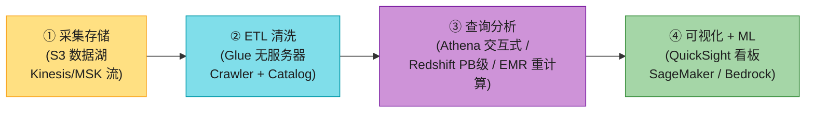

> 💡 **关键信号词**:**"S3 是数据湖的底座(无限廉价)"** + **"Glue = 无服务器 Spark + Data Catalog(数据目录)"** + **"Athena 直接 SQL 查 S3 按扫描量计费,不用建集群"** + **"Redshift 是列式 MPP 数据仓库,PB 级分析"** + **"SageMaker 自己训,Bedrock 调基础模型,Rekognition 等开箱即用"**——这五句直接拿下面试。

---

## 🗺️ 章节概览

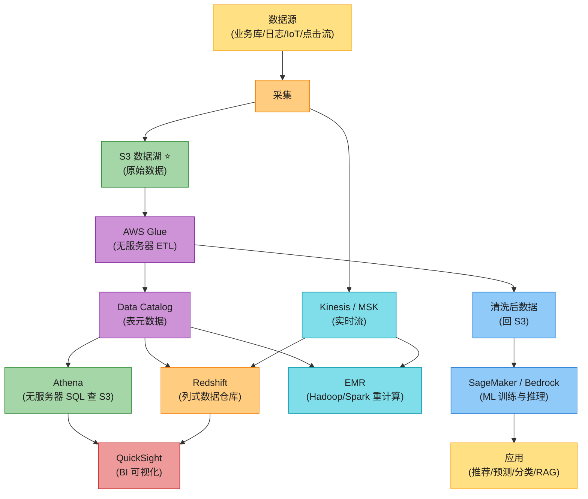

| 小节 | 要点 | 重要性 |
|------|------|--------|
| **🧱 基础概念铺垫** | 大数据 3V、批 vs 流、ETL、数仓 vs 数据湖 vs Lakehouse、ML 训练 vs 推理、监督 vs 无监督 | ⭐⭐⭐⭐⭐(非科班必看) |
| **1.1 Amazon EMR** | 托管 Hadoop/Spark、Primary/Core/Task 节点、**EMRFS 存算分离**、按需/竞价、serverless | ⭐⭐⭐⭐⭐ |
| **1.2 AWS Glue** | 无服务器 ETL、**Data Catalog + Crawler**、Glue Studio、三种数据引擎(Spark/Ray/Python) | ⭐⭐⭐⭐⭐ |
| **1.3 Amazon Athena** | 无服务器交互式 SQL 查 S3、Trino 引擎、按扫描量计费、联邦查询 | ⭐⭐⭐⭐ |
| **1.4 Amazon Redshift** | 列式数据仓库、MPP、leader-compute 架构、Spectrum 查 S3、RMS 存算分离 | ⭐⭐⭐⭐ |
| **1.5 Amazon QuickSight** | BI 可视化、SPICE 内存引擎、QuickSight Q 自然语言 | ⭐⭐⭐ |
| **2.1 Amazon SageMaker** | Build / Train / Deploy 全流程、Data Wrangler、Studio、Endpoints 多种 | ⭐⭐⭐⭐⭐ |
| **2.2 AMT / Clarify / Ground Truth** | 自动调参、偏差检测公平性、数据标注 | ⭐⭐⭐⭐ |
| **2.3 ML 芯片** | Inferentia 推理 / Trainium 训练 / EC2 P/G 系列 GPU | ⭐⭐⭐ |
| **2.4 开箱即用 ML 服务** | Rekognition/Comprehend/Transcribe/Polly/Translate/Forecast/Kendra/Lex | ⭐⭐⭐⭐ |
| **贯穿案例** | 餐厅"最热菜/最高分/评论情感"全链路 | ⭐⭐⭐⭐ |
| **2026 增量** | Bedrock / Amazon Q / Trainium2 / Lake Formation / Aurora Zero-ETL | ⭐⭐⭐⭐⭐ |

---

## 🧱 基础概念铺垫(给非科班读者)⭐⭐⭐⭐⭐

> 💡 **为什么单独开这一节**:Part I 的 aws_08 讲过大数据架构的"原理"(Lambda/Kappa/HDFS/Kafka),但对很多非科班读者来说,**"大数据"这个词本身就很模糊**——到底多大算"大"?"机器学习"听起来像科幻,**到底在学什么**?数据仓库和数据湖**到底区别在哪**?这一节用生活比喻把这些最基础的概念一次性讲透,后面所有 AWS 服务才看得懂。**这是本章和原书最大的区别——原书假设你已经懂 ML,直接讲服务;我们先把概念补上,因为这是 Part II 里对非科班最陌生的一章。**

### 铺垫 1:什么是"大数据"——3V 模型

"大数据"不是"数据多"这么简单。业内用 **3V** 来定义(后来有人加到 4V/5V,但 3V 是核心):

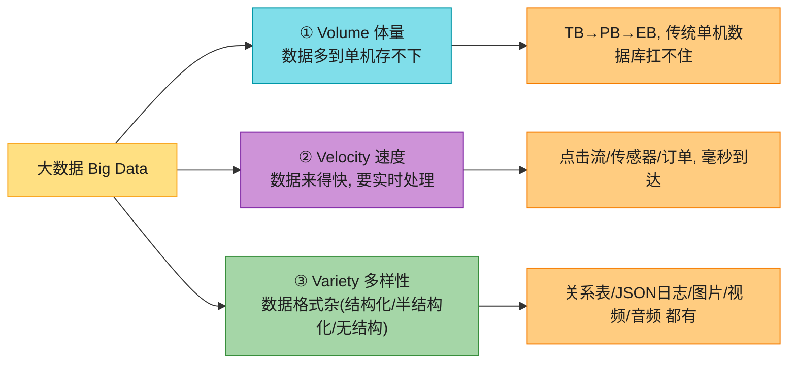

**餐厅比喻**(贯穿案例):

- **Volume**:Cafe Delhi Heights 一天 100 万订单,5 年累计 18 亿条订单记录 + 评论 + 图片 + 视频 → 单台 MySQL 服务器的硬盘装不下(几百 TB)。
- **Velocity**:用户每点一下 App,点击事件要**毫秒级**送到分析系统(做实时推荐"看这道菜的人还看了什么")。
- **Variety**:订单是结构化表,评论是 JSON,菜的照片是图片,客服电话录音是音频,**格式千差万别**。

> 🪤 **追问陷阱**:"数据多就是大数据吗?" → **不只是 Volume**。大数据是 **3V 的组合**——数据多(Volume)+ 来得快(Velocity)+ 格式杂(Variety)。三者都要专门工具(分布式存储、流处理、对象数据湖),传统单机数据库搞不定。后来还有 4V 加 **Veracity(真实性)**——数据脏不脏、可不可信;5V 加 **Value(价值)**——能不能从数据里挖出业务价值。

### 铺垫 2:批处理 vs 流处理(月底统一算账 vs 每笔实时记账)

> 📝 **大数据架构(Lambda/Kappa)的原理在 aws_08 第 4 节讲透了**,这里只补最基础的概念。

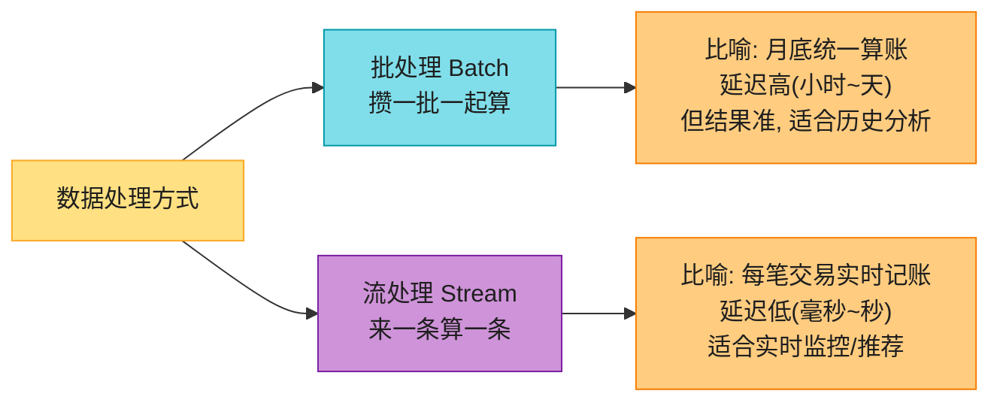

| 维度 | 批处理 Batch | 流处理 Stream |
|------|------------|--------------|
| **怎么算** | 攒一批(小时/天/月)一起算 | 来一条算一条 |
| **延迟** | 高(分钟到天) | 低(毫秒到秒) |
| **典型场景** | 月度报表、历史分析、夜间 ETL | 实时仪表盘、实时推荐、欺诈检测 |
| **AWS 工具** | **EMR / Glue / Athena / Redshift** | **Kinesis / MSK(Kafka)/ Flink** |
| **比喻** | 月底统一算账 | 每笔实时记账 |

> 💡 **Lambda 架构 = 批 + 流双路径**(aws_08 讲过)——批层算准的历史数据,流层算快的实时数据,合并给用户。**Kappa 架构 = 纯流**——把批也当"重放流"算,简化成一栈。**AWS 上的对应**:EMR/Glue 是批,Kinesis/MSK 是流;**Redshift Streaming / Aurora Zero-ETL** 是 2026 把"流直接进数仓"的整合(见增量)。

### 铺垫 3:什么是 ETL——"抽水→净化→蓄水池"

**ETL = Extract(抽取)→ Transform(转换)→ Load(加载)**,是数据从"原始乱"到"能用"的清洗流水线。

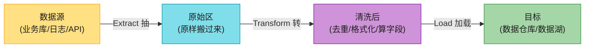

**自来水厂的比喻**(背):

- **Extract 抽水**:从河里(业务库/日志/API)把水抽到水厂。**对应**:把 MySQL 的订单、App 的点击日志、第三方 API 的天气数据,搬到 S3 的"原始区"。
- **Transform 净化**:过滤泥沙、加氯消毒、调 PH。**对应**:去重、补缺失值、统一日期格式、算衍生字段(如"订单金额 × 0.18 算税")、PII 脱敏(把手机号打码)。
- **Load 加载**:把干净水送到蓄水池给千家万户。**对应**:把清洗后的数据加载到数据仓库(Redshift)或数据湖(S3),供分析师查询、BI 出报表、ML 训练。

> 💡 **为什么需要 ETL**?——因为原始数据**脏**(格式不统一、有重复、有错误)、**散**(在多个系统)、**不能直接分析**(业务库的结构不适合分析查询)。ETL 是把"原始矿"炼成"精矿"的过程。**AWS Glue** 就是 AWS 的无服务器 ETL 服务(本章 1.2 详讲)。

> 🪤 **ETL vs ELT**:**ETL 是先 Transform 再 Load**(传统,适合数据仓库);**ELT 是先 Load 再 Transform**(现代,先把原始数据灌进数据湖/仓库,再用 SQL/Spark 现场转换,更灵活)。**AWS 上两者都支持**——Glue 经典 ETL,Athena/Redshift 联合 S3 是 ELT 思路。

### 铺垫 4:数据仓库 vs 数据湖 vs 湖仓一体(Lakehouse)⭐⭐⭐⭐⭐

这是**面试超高频考点**!三个词听起来像,本质完全不同。

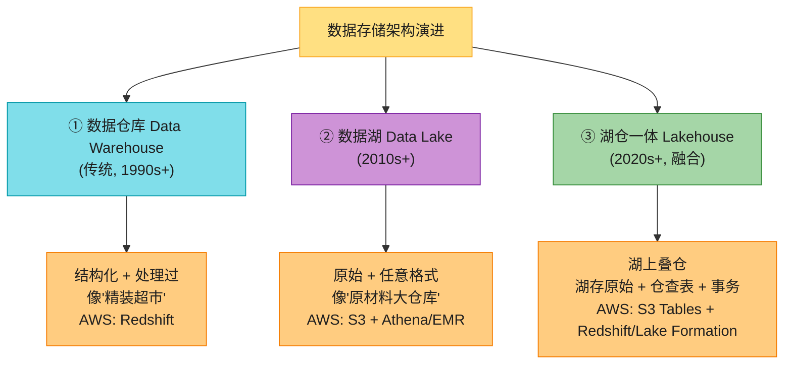

**三个比喻讲透**(背):

| 架构 | 比喻 | 存什么 | 谁来查 | AWS 服务 |
|------|------|--------|--------|---------|
| **数据仓库** | **精装超市**——货品分类摆好,标价清晰,顾客直接选购 | **结构化、已处理**的数据(表) | 业务分析师、BI 工具,用 SQL | **Redshift** |
| **数据湖** | **原材料大仓库**——什么格式都收(原油、矿石、半成品),需要自己加工 | **原始、任意格式**(表/JSON/图片/视频/日志) | 数据科学家、数据工程师,用 Spark/SQL/ML | **S3 + Athena + EMR + Glue** |
| **湖仓一体** | **湖上盖超市**——湖存原料,上面搭事务性的"表屋",既能存原始又能像仓库一样查 | 原始 + 表(事务性) | 两类用户都能用 | **S3 Tables(Iceberg)+ Redshift + Lake Formation** |

**详细对比**(背关键几行):

| 维度 | 数据仓库 | 数据湖 | 湖仓一体 |
|------|---------|--------|---------|
| **数据格式** | 只结构化(表) | 任意(结构化/半结构化/无结构) | 任意 + 表事务 |
| **数据状态** | 已处理(clean) | 原始(raw) | 两者都有 |
| **用户** | 业务分析师 | 数据科学家/工程师 | 两类都能用 |
| **存储** | 块/列式存储(贵) | 对象存储 S3(便宜) | S3 + 表格式 |
| **schema** | schema-on-write(写入时强约束) | schema-on-read(读取时才解析) | 两者结合 |
| **成本** | 高(专有存储) | 低(S3 廉价) | 低 + 灵活 |
| **典型工具** | Redshift / Snowflake | S3 + Spark + Athena | Databricks / S3 Tables + Iceberg |
| **痛点** | 贵 + 只能结构化 | "数据沼泽"(没治理难查) | 融合两者优势,但还在演进 |

> 🪤 **追问陷阱(超高频)**:"数据湖和数据仓库区别?" → **数据仓库存结构化已处理数据(schema-on-write,贵,适合 BI 分析);数据湖存原始任意格式数据(schema-on-read,便宜,适合数据科学/ML)**。简单口诀:**仓库=精装超市(查得快但贵),湖泊=原材料仓库(存得多但要自己加工)**。**湖仓一体(Lakehouse)是 2020+ 趋势——在 S3 数据湖上叠事务性表(Iceberg/Delta/Lakehouse),既保留湖的便宜灵活,又有仓的事务能力**。AWS 上对应 S3 Tables + Redshift + Lake Formation。

> 📝 **本章主线**:本章的大数据服务**正好对应这套架构**——**S3 是数据湖底座**(aws_10 讲过)、**Redshift 是数据仓库**、**Athena/EMR 是湖上查询计算**、**Glue 是 ETL 清洗**、**Lake Formation 是湖的治理**(2026 增量)。

### 铺垫 5:什么是机器学习——训练 vs 推理、监督 vs 无监督、模型是什么 ⭐⭐⭐⭐⭐

这一节**对非科班最关键**——ML 是 Part II 里最陌生的领域,这里用比喻讲透最基础的概念,不展开数学。

#### (1) AI / ML / DL / 生成式 AI 的关系

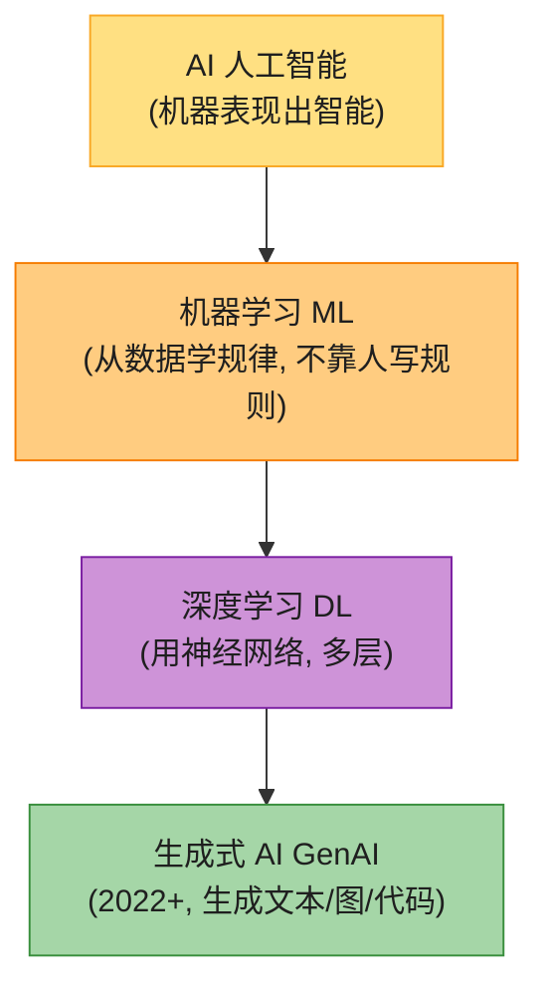

- **AI(人工智能)**:最外层概念——**让机器表现出智能**(下棋、识图、说话、决策)。
- **ML(机器学习)**:AI 的一个分支——**不靠人写 if-else 规则,而是从大量数据里自己学规律**。比如不让程序员写"长这样的图就是猫",而是给机器看 10 万张猫的图,它自己总结"猫的特征"。
- **DL(深度学习)**:ML 的一种主流方法——**用多层神经网络**(模拟大脑神经元的数学结构),2012 年后崛起,擅长图像、语音、文本。
- **生成式 AI(GenAI)**:DL 的最新分支——**不只分类/识别,还能"生成"新内容**(写文章、画画、写代码),代表是 ChatGPT、Claude、Stable Diffusion。

> 💡 **一句话**:AI ⊃ ML ⊃ DL ⊃ GenAI,层层包含。**本章原书主要讲 ML(传统机器学习 + 深度学习应用),2026 必须补 GenAI(Bedrock)**。

#### (2) 训练 vs 推理——"老师备课"vs"学生考试" ⭐⭐⭐⭐⭐

这是 ML 面试**最常考**的概念区分,务必背熟。

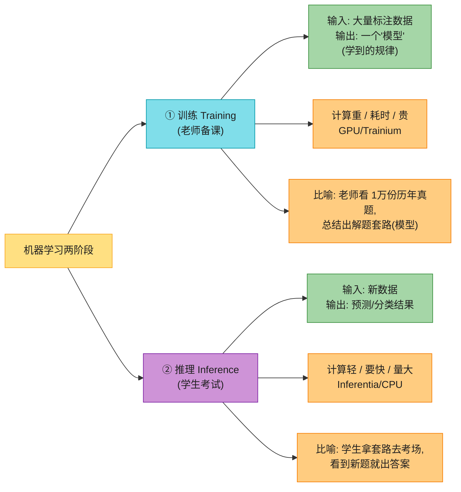

**老师备课 vs 学生考试的比喻**(背):

- **训练(Training)** = **老师备课**——老师(算法)看 1 万份历年真题和标准答案(标注数据),反复琢磨,**总结出一套解题套路**(这套套路就是**模型 Model**)。这个过程**计算量大、耗时长**(老师可能备一周课)、要用 **GPU/Trainium**(黑板/教具)。
- **推理(Inference)** = **学生考试**——学生拿老师总结的套路(模型)去考场,看到一道**新题**(新数据),套用套路**给出答案**(预测)。这个过程**计算量小、要快、频繁**(每天有成千上万学生考试)、用 **Inferentia/CPU**(普通笔)。

**关键区分**:

| 维度 | 训练 Training | 推理 Inference |
|------|--------------|---------------|
| **做什么** | 从数据学规律,产出"模型" | 用模型对新数据做预测 |
| **计算量** | **大**(几天到几月) | 小(毫秒到秒) |
| **频率** | 偶尔(模型迭代时) | **频繁**(每次用户请求) |
| **硬件** | GPU / **Trainium**(AWS 训练芯片) | CPU / **Inferentia**(AWS 推理芯片) |
| **成本** | 一次性大投入 | 持续按调用计费 |
| **比喻** | 老师备课(产出教案) | 学生考试(用教案解题) |

> 🪤 **追问陷阱(超高频)**:"训练和推理有什么区别?为什么有专用推理芯片?" → **训练是从数据学规律产出模型(计算重、偶尔做、用 GPU/Trainium);推理是用模型对新数据做预测(计算轻、频繁做、要低延迟,用 Inferentia/CPU)**。**为什么有专用推理芯片?**——因为推理是"频繁但每次计算小"的场景,通用 GPU 太贵浪费,**Inferentia 专为推理优化,单位成本下的吞吐比 GPU 高数倍**(详见 2.3)。

#### (3) "模型"是什么?——一本"解题套路手册"

**模型(Model)** 这个词反复出现,但非科班常常搞不清。**模型 = 训练后产出的"参数集合"**,可以理解为**一本"解题套路手册"**。

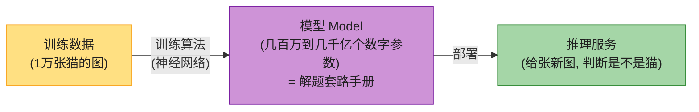

- **小模型**(传统 ML,如判断邮件是不是垃圾):可能就几百到几千个参数,几 MB 大小,逻辑回归、决策树之类。
- **大模型**(深度学习,如 ResNet 识图):几百万到几亿参数,几百 MB。
- **超大模型 / 大语言模型 LLM**(GPT-4 / Claude):**几千亿参数**,几百 GB 到 TB 级,这就是"大模型"的"大"。**Bedrock 托管的就是这类基础模型**(见 2026 增量)。

> 💡 **核心心智**:**模型 = 训练学到的"规律"的数学表达(一堆数字参数)**。训练的本质是"调整这堆参数让预测准";推理的本质是"用这堆参数算出新输入的预测"。

#### (4) 监督学习 vs 无监督学习

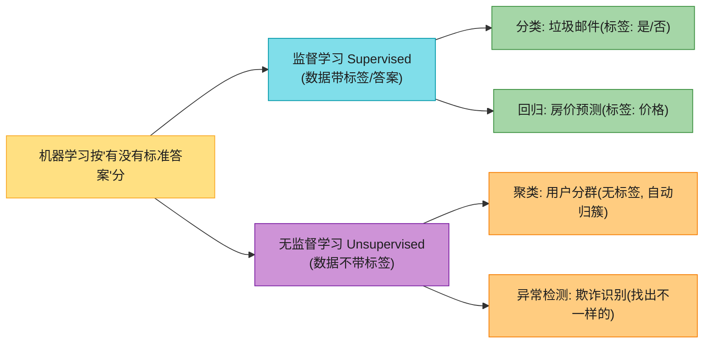

**比喻**:

- **监督学习** = **老师带着答案批改作业**——每道题(数据)都有标准答案(标签),机器对照答案学。比如给 1 万封邮件,每封标了"垃圾/正常",机器学会判断新邮件。**分类**(离散答案:是/否、猫/狗/鸟)和**回归**(连续答案:房价、温度)都是监督学习。
- **无监督学习** = **学生自己整理资料**——给一堆没标签的数据,机器自己找结构。比如给 10 万用户的行为数据,机器发现"这 5 类用户行为相似"(聚类),但不知道这 5 类叫什么。

> 💡 **餐厅案例**:评论情感分析(正面/负面/中性)是**监督学习分类**——需要先标几千条评论的"正/负"标签才能训;"哪些用户是相似口味"是**无监督聚类**——不用标签,机器自己分群。

#### (5) "传统 ML" vs "深度学习" vs "生成式 AI"的简单脉络

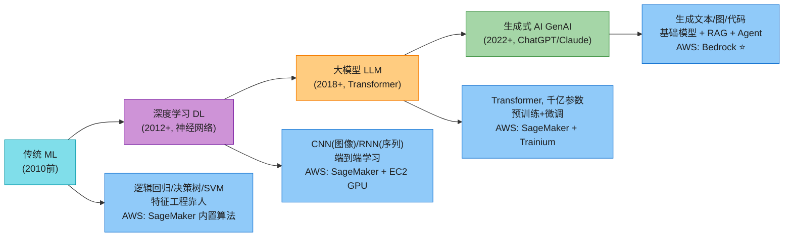

> 💡 **2026 的现实**:原书(2022)主要停在 T2/T3,GenAI 几乎没讲。**2026 面试必讲 Bedrock**(T4)——这是本章最大增量,见后文。

---

## 1. 大数据与分析服务

### 1.1 Amazon EMR(托管 Hadoop/Spark)+ EMRFS(存算分离)⭐⭐⭐⭐⭐

> 📝 **原理在 aws_08 第 8 节讲过**——HDFS(Hadoop 分布式文件系统)、MapReduce、Spark、Hive、Presto 是开源大数据生态的核心。本章讲"AWS 怎么托管这套"。

**Amazon EMR(Elastic MapReduce)** = AWS 的**托管大数据处理集群服务**——你点几下,AWS 几分钟内给你拉起一个装好 Hadoop/Spark/Hive/Presto/HBase 的集群,你直接提交作业跑大数据分析,**不用自己装软件、配集群、管运维**。

**EMR 解决的痛点**:

- 自己搭 Hadoop 集群要装几十个组件、调配置、管节点、修故障——**门槛高、运维重**。
- EMR 把这些全打包成托管服务,**几分钟拉集群,跑完自动关**(按需付费)。

**EMR 支持的开源框架**(背):**MapReduce、Apache Spark、Apache Hive、Apache HBase、Presto、Flink**(原书核心讲前几个)。

#### EMRFS——用 S3 替代 HDFS,实现存算分离 ⭐⭐⭐⭐⭐

这是 EMR 最关键的设计点,也是面试高频追问。

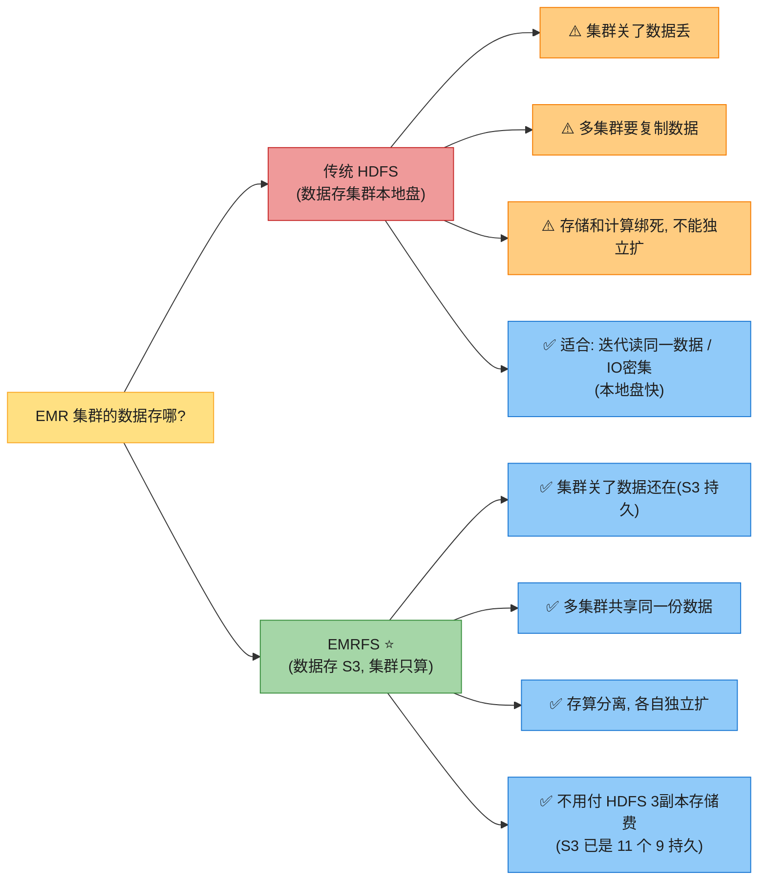

**EMRFS = EMR File System**——本质是个**连接器**,让 EMR 集群**把 S3 当文件系统用**(数据存 S3,集群只负责算)。这是云原生的**存算分离**(Storage-Compute Separation)思想在 EMR 上的落地。

**为什么 EMRFS 比传统 HDFS 好**(背 4 条):

1. **数据不丢 + 省钱**:HDFS 默认 3 副本(付 3 倍存储费);EMRFS 用 S3,S3 本身已经 11 个 9 持久(aws_10 讲过),不用再付副本费。
2. **集群可关 + 省计算费**:HDFS 数据绑死集群,集群不能关;EMRFS 数据在 S3,**集群跑完作业就能关,只付算的费用**。
3. **多集群共享**:HDFS 一个集群一份数据,别的集群要用得复制;EMRFS 多个集群**直接读同一份 S3 数据**。
4. **存算独立扩**:HDFS 加存储就要加计算节点(绑死);EMRFS 存储扩在 S3(无限),计算扩在 EMR 集群(独立)。

> 🪤 **追问陷阱(超高频)**:"EMRFS 为什么比 HDFS 好?" → **存算分离**:① 数据存 S3 不丢、不用付 3 副本费;② 集群可关省计算费;③ 多集群共享 S3 数据;④ 存储和计算独立扩。**但 EMRFS 不是万能**——对**迭代读同一数据集 / IO 密集**的作业,HDFS 本地盘更快(S3 走网络有延迟)。实战常**两者结合**:热数据放 HDFS,冷数据/共享数据放 S3,用 **S3DistCP** 在两者间搬运。

**EMRFS 最佳实践**(背):

- **数据分区**(partition):按日期/地区建目录(如 `year=2026/month=07/day=11/`),EMR 只拉需要的分区,省时省钱。
- **文件大小优化**:避免大量小文件(<128MB,会多发 S3 请求慢);也避免超大文件(难并行)。**128MB-1GB 最佳**。
- **数据压缩**:省存储 + 省网络传输费。**Parquet/ORC 列式格式**(适合"只取几列"的分析查询)、**Avro 行式格式**(适合"取整行")。
- **关键数据放 S3**(不丢),临时中间数据放 HDFS(快)。

#### EMR 集群架构:Primary / Core / Task 节点

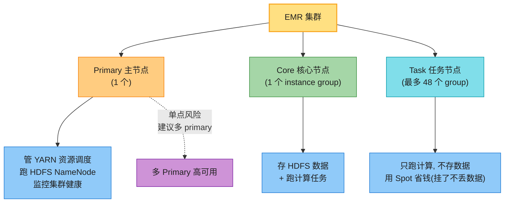

| 节点类型 | 数量 | 职责 | 能不能用 Spot |
|---------|------|------|-------------|
| **Primary(主)** | 1(或多主高可用) | YARN 资源管理 + HDFS NameNode + 健康监控 | ❌(挂了集群挂) |
| **Core(核心)** | 1 个 instance group(多实例) | 存 HDFS 数据 + 跑计算任务 | ❌(挂了数据丢) |
| **Task(任务)** | 最多 48 个 instance group | **只跑计算,不存数据** | ✅ **强烈推荐 Spot**(挂了不丢数据,只是慢) |

> 💡 **省钱组合**:**Core/Primary 用按需实例**(保数据保集群),**Task 用 Spot 竞价实例**(最高省 90%,挂了任务重跑不丢数据)。这是 EMR 最经典的成本优化。

#### EMR 部署形态 & 成本优化

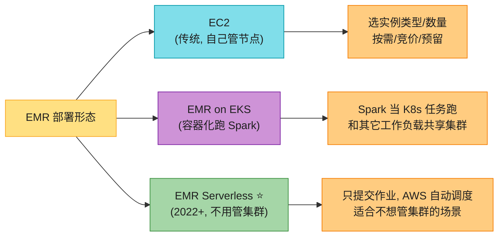

**成本优化手段**(背):

1. **自动终止集群**:作业跑完自动关集群(避免空跑烧钱)。
2. **长跑集群用预留实例 / Savings Plans**(aws_11 讲过)。
3. **Task 节点用 Spot**(最高省 90%)。
4. **自动扩缩**:按负载加/减 Task 节点。
5. **跨 AZ 部署**:节点分散到多 AZ(避免单 AZ 故障)。
6. **Hive metastore 放外部 RDS/Aurora**(不放 Primary 本地盘,集群关了不丢元数据)。
7. **多 Primary 高可用**(避免单点故障)。
8. **EventBridge + Step Functions 编排**:定时拉集群 → 跑作业 → 关集群,全自动。

> 🪤 **EMR Serverless vs Glue Spark 区别**(高频):**两者都是无服务器 Spark,但定位不同**——**EMR Serverless 是"数据处理和分析工具"**(更接近开源 Spark,适合重计算/复杂作业),**Glue 是"端到端 ETL 解决方案"**(带 Data Catalog、Crawler、数据集成抽象,偏数据集成场景)。**重计算/开源生态深度集成选 EMR,ETL/数据目录选 Glue**。

---

### 1.2 AWS Glue(无服务器 ETL + 数据目录 + Crawler)⭐⭐⭐⭐⭐

**AWS Glue** = AWS 的**无服务器数据集成服务**——核心是**无服务器 ETL**(不用管 Spark 集群),外加一个**数据目录(Data Catalog)**和**自动爬数据的 Crawler**。

**Glue 的三大核心**(背):

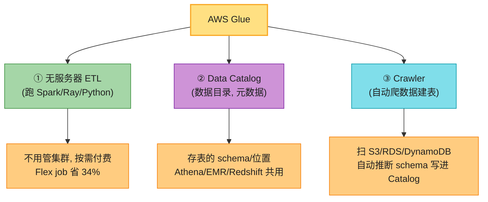

#### Glue 关键术语

| 术语 | 说明 |
|------|------|
| **Classifier(分类器)** | 判断数据格式(JSON/CSV/Parquet...),能用 Glue 内置的,也能自定义 |
| **Metadata(元数据)** | 分类器推断出的 schema(有哪些列、什么类型) |
| **Database(数据库)** | 存元数据表的逻辑容器(不指定就用 default) |
| **Data Catalog(数据目录)** | **AWS 的中央元数据仓库**,存所有 database/table,**Athena/EMR/Redshift 共享**——这是 Glue 最有价值的部分 |
| **Data Crawler(爬虫)** | 自动扫数据源(S3/RDS/DynamoDB),用 Classifier 推 schema,写进 Catalog |
| **Table Partitioning(分区)** | 按目录结构(如 `year=2026/month=07/`)加速查询 |
| **Data Engine(数据引擎)** | 跑 ETL 的引擎,Glue 支持 3 种(见下) |
| **DPU(Data Processing Unit)** | Glue 的计算单元,配置 worker 类型和数量 |

#### Glue 工作流(背)

```mermaid
flowchart LR
    S3["S3 原始数据"] --> CR["Crawler<br/>(定时爬或触发)"]
    CR --> CL["Classifier<br/>(识别格式)"]
    CL --> CAT["Data Catalog<br/>(建表 + schema)"]
    CAT --> JOB["ETL Job<br/>(Spark/Ray/Python)"]
    JOB --> OUT["清洗后数据<br/>(回 S3 或进 Redshift)"]
    OUT --> Q["Athena / Redshift / EMR 查询"]

    style S3 fill:#FFE082,stroke:#F9A825,color:#1f1f1f
    style CR fill:#80DEEA,stroke:#0097A7,color:#1f1f1f
    style CL fill:#80DEEA,stroke:#0097A7,color:#1f1f1f
    style CAT fill:#CE93D7,stroke:#7B1FA2,color:#1f1f1f
    style JOB fill:#A5D6A7,stroke:#388E3C,color:#1f1f1f
    style OUT fill:#90CAF9,stroke:#1976D2,color:#1f1f1f
    style Q fill:#FFCC80,stroke:#F57C00,color:#1f1f1f
```

**典型流程**:① S3 来了新数据 → ② Crawler 定时扫(或 EventBridge 触发)→ ③ Classifier 识别格式推断 schema → ④ 写进 Data Catalog 建表 → ⑤ 写 ETL Job(Spark/Ray/Python)清洗 → ⑥ 清洗后数据回 S3 或进 Redshift → ⑦ Athena/Redshift 直接查(用 Catalog 里的表元数据)。

#### 三种数据引擎

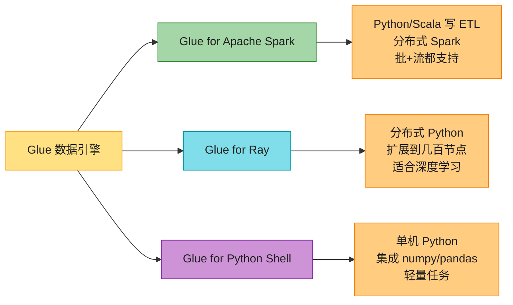

- **Glue for Apache Spark**:最常用,**分布式 Spark**(像无服务器的 EMR),Python/Scala 写 ETL,支持批 + 流。
- **Glue for Ray**:分布式 Python(基于开源 Ray 框架),适合深度学习/科学计算类工作负载。
- **Glue for Python Shell**:单机 Python,集成 numpy/pandas,适合轻量任务(数据量小、不需分布式)。

#### Glue 的其它特性

| 特性 | 做什么 |
|------|--------|
| **Glue Studio** | 可视化 ETL 工作流编辑器 + Notebook 测试,测好后导成 Job |
| **Data Quality** | 自动推断数据质量规则(如"年份不能早于公司成立年"),违规告警 |
| **PII 检测** | 自动识别敏感数据(身份证/信用卡),可脱敏 |
| **Autoscaling** | 按 workload 自动加减 worker,省钱 |
| **Flex job** | 类似 Spot,非关键任务省 34% |
| **调度** | 内置定时器,也能 EventBridge 触发 |
| **版本控制** | GitHub / AWS CodeCommit 集成 |
| **Schema Registry** | 流式数据(Kafka/Kinesis)的 schema 注册,保证兼容 |

> 💡 **Data Catalog 是 Glue 最有价值的部分**——它是 AWS 的**中央元数据仓库**,不只是 Glue 自己用,**Athena、EMR、Redshift 都共享这个 Catalog**。所以即使你不用 Glue 跑 ETL,**只用 Crawler + Catalog 给 Athena 提供表元数据**也是经典用法。

---

### 1.3 Amazon Athena(无服务器交互式 SQL 查 S3)

**Amazon Athena** = AWS 的**无服务器交互式查询服务**——**直接对 S3 上的数据跑标准 SQL,不用建任何集群**。

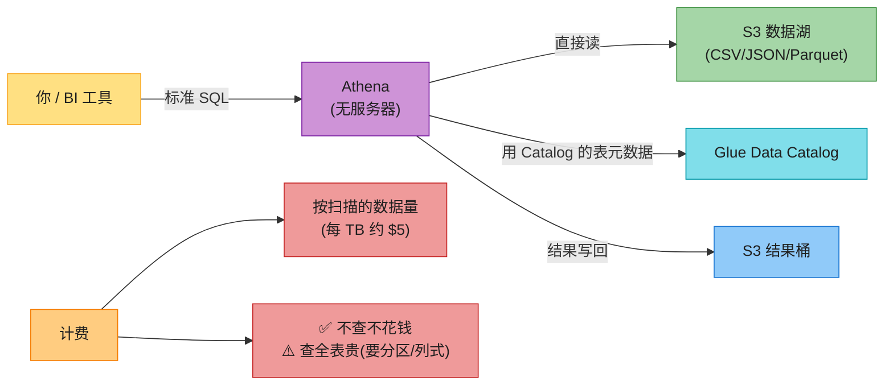

**Athena 核心特性**(背):

- **无服务器**:不用建集群、不用配实例,**直接 SQL 查 S3**。
- **标准 SQL**:底层是 **Presto / Trino**(原书写 Presto,2024 默认 Trino,见增量)。
- **按扫描量计费**:每 TB 数据扫描约 $5(具体价格记不准就模糊说"按扫描量")。
- **依赖 Glue Data Catalog**:你得先在 Catalog 里有表(手动建或 Crawler 爬),Athena 才能查。
- **结果异步**:查询是异步 job,结果写到指定的 S3 桶。
- **集成 QuickSight**:直连 QuickSight 出 BI 看板。

**Athena 高级特性**:

| 特性 | 做什么 |
|------|--------|
| **Federated Query(联邦查询)** | 不只查 S3,还能查 DynamoDB/RDS/On-prem,通过 Lambda connector |
| **UDF(用户定义函数)** | 在 SQL 里调 Java/Lambda 写的函数,做预处理/后处理(如脱敏) |
| **ML 集成** | SQL 里直接调 SageMaker 部署的模型(如评论情感分类) |

**Athena 省钱技巧**(背):

1. **数据分区**:按日期建目录,Athena 只扫需要的分区(从全表 → 单日,省钱 365 倍)。
2. **列式格式 Parquet/ORC**:只取需要的列,不扫全行(省 80%+ 扫描量)。
3. **压缩**:省存储 + 省扫描费。
4. **避免 SELECT ***:只取需要的列。

> 🪤 **追问陷阱(高频)**:"Athena 和 Redshift 都能查数据,什么时候用哪个?" → **Athena 适合"交互式 ad-hoc 查询"**(数据在 S3,偶尔查、量不大、不想建集群,按扫描量付费,简单);**Redshift 适合"PB 级 BI / 报表 / 高频复杂查询"**(预置集群,列式 MPP,查得快但要付费维持集群)。**简单说:Athena 是"按需付钱、偶尔查",Redshift 是"先付集群钱、频繁查快"**。

> 📝 **Athena 限制**:对**超大数据集**,查询延迟可能比 Redshift 高(无服务器要现拉资源),**不适合延迟敏感的实时查询**。这种场景选 Redshift 或 EMR。

---

### 1.4 Amazon Redshift(列式数据仓库 + Spectrum)

> 📝 **Redshift 在 aws_10(存储章)末尾作为"专用库"提过一句,本章详讲**——它是数据仓库,AWS 大数据栈的核心。

**Amazon Redshift** = AWS 的**列式数据仓库**——为 **PB 级商业智能(BI)、报表、OLAP 分析**优化的 SQL 数据库。

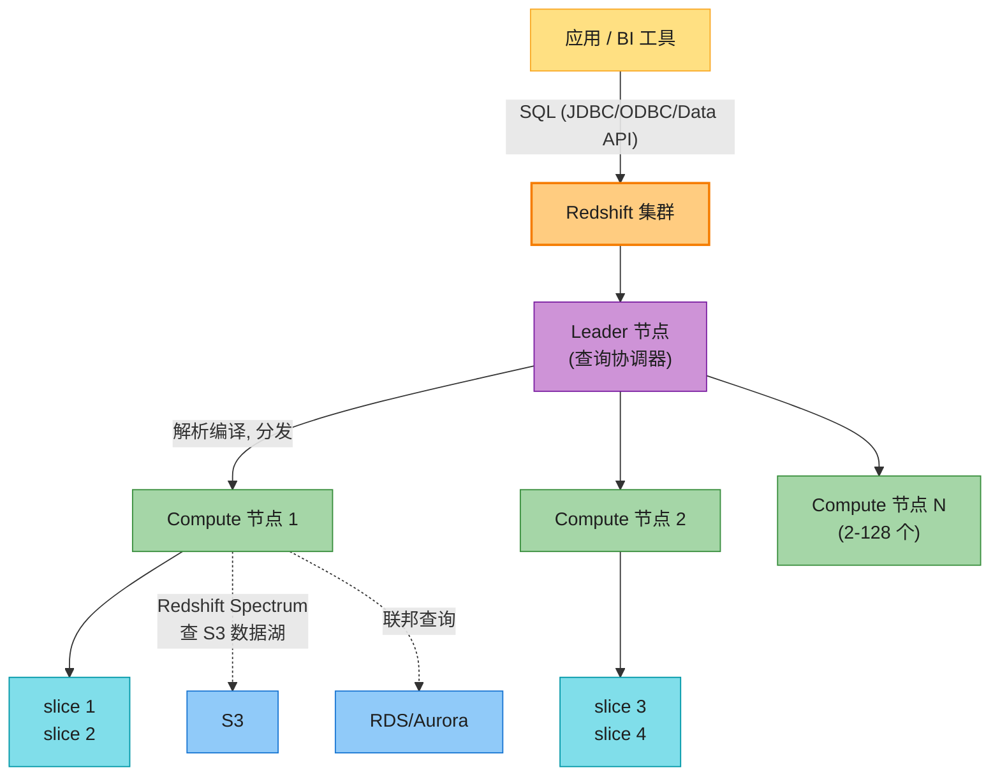

**Redshift 关键设计**(背):

- **列式存储(Columnar)**:数据按列存(不是按行),分析查询常只取几列,**列式存储只读需要的列,省 IO 快得多**。这是 OLAP 数据库和 OLTP(行存)的核心区别。
- **MPP(Massively Parallel Processing,大规模并行处理)**:**leader-compute 架构**——Leader 节点解析 SQL 分发给 2-128 个 Compute 节点,**每个 Compute 节点再切成 slice**,每个 slice 有独立 CPU/内存/磁盘,**并行干活**。
- **基于 PostgreSQL**:SQL 语法兼容 PostgreSQL(但底层重新设计了存储)。
- **PostgreSQL-based + 列式**:底层用 PostgreSQL 的 SQL 引擎,存储改造成列式 + 不可变 1MB 块。
- **Zone Maps(区域图)**:每个数据块维护 min/max 元数据,**查询时直接跳过不含目标值的块**(谓词下推),大幅加速。
- **Sort Key(排序键)**:数据按 sort key 物理排序,优化 zone map 剪枝效果。
- **Distribution Style(分布风格)**:决定数据怎么分散到各 slice,优化 JOIN 性能。

**四种分布风格**:

| 风格 | 怎么分布 | 适合 |
|------|---------|------|
| **AUTO(默认)** | Redshift 自己按表大小选 | 不确定时用 |
| **EVEN** | 轮询均匀分布 | 表没 JOIN 时 |
| **KEY** | 按某列哈希分布 | 经常按这列 JOIN(让 JOIN 键同 slice) |
| **ALL** | 整表复制到每个节点 | 小表 + 频繁 JOIN(广播) |

#### Redshift Spectrum——查 S3 数据湖

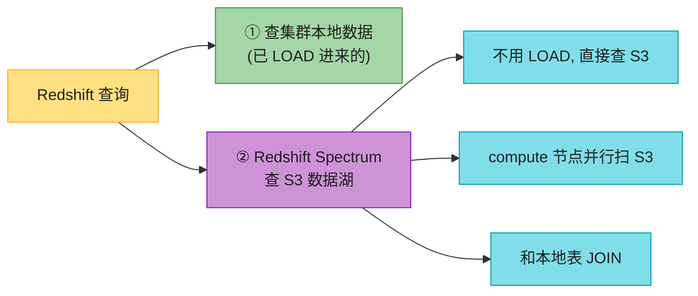

**Redshift Spectrum** 让 Redshift **直接查 S3 上的数据**(不用先 LOAD 进集群),compute 节点并行扫 S3,可以和集群本地表 JOIN。**和 Athena 类似但可配 compute,查询更快**。

#### Redshift Managed Storage(RMS)——存算分离

**Redshift Managed Storage(RMS)** 是新版 Redshift 的**存算分离架构**——存储层用 **S3 做持久化**,compute 节点配 SSD 做热点缓存(Tier 1 cache)。**单实例可扩到 128 TB,集群可扩到 16 PB**,再大就用 Spectrum 查 S3。**用 RA3 实例类型**才能享受 RMS。

**实例类型**(背关键):

| 类型 | 存储 | 适用 |
|------|------|------|
| **RA3** | **RMS(S3 + SSD 缓存)** | **2026 推荐**,存算分离,独立扩 |
| **DC2(Dense Compute)** | SSD 本地 | 中小数据量,要快 |
| **DS2(Dense Storage)** | 磁盘本地 | **已过时,不推荐**(原书还在讲) |

#### Redshift 其它特性

| 特性 | 做什么 |
|------|--------|
| **物化视图(Materialized View)** | 预计算 JOIN/聚合结果,查询加速;能在物化视图上再建物化视图 |
| **WLM(Workload Management)** | 给不同查询分配优先级,重要的先跑,次要的限流 |
| **COPY 命令** | 从 S3/DynamoDB/EMR 批量加载数据;**autocopy** 自动从 S3 灌 |
| **流式摄入** | 集成 MSK/Kinesis,直接吃流式数据(2026 增量) |
| **联邦查询** | 查 RDS/Aurora 的实时数据,不用先 LOAD |
| **Data Sharing** | 跨集群共享数据,隔离读负载 |
| **Aurora 集成** | Aurora 数据秒级同步到 Redshift(2026: Aurora Zero-ETL) |
| **Redshift Advisor** | 自动推荐优化(查询调优、删闲置集群、压缩) |
| **Serverless** | 不用配集群,按用量计费(2026 增量) |

> 🪤 **追问陷阱**:"Redshift Spectrum 和 Athena 都能查 S3,区别?" → **Spectrum 是 Redshift 的扩展**(可以配 compute,查询更快,能和 Redshift 本地表 JOIN,但要先有 Redshift 集群);**Athena 是独立无服务器服务**(不用集群,按扫描量计费,简单但慢)。**已经在用 Redshift 选 Spectrum,偶尔查/没集群选 Athena**。

---

### 1.5 Amazon QuickSight(BI 可视化)

**Amazon QuickSight** = AWS 的**无服务器 BI(商业智能)服务**——把数据变成**仪表盘、报表、图表**,给业务看。

```mermaid
flowchart LR
    SRC["数据源"] --> QS["QuickSight"]
    SRC --> S3["S3"]
    SRC --> ATH["Athena"]
    SRC --> RS["Redshift"]
    SRC --> RDS["RDS/Aurora"]
    SRC --> X3["第三方/SaaS/Excel"]

    QS --> SPICE["SPICE<br/>(内存计算引擎)"]
    QS --> DASH["仪表盘 / 报表 / 图表"]
    DASH --> USER["业务用户(浏览器)"]
    QS --> Q["QuickSight Q<br/>(自然语言提问)"]

    style SRC fill:#FFE082,stroke:#F9A825,color:#1f1f1f
    style QS fill:#CE93D7,stroke:#7B1FA2,color:#1f1f1f
    style S3 fill:#A5D6A7,stroke:#388E3C,color:#1f1f1f
    style ATH fill:#A5D6A7,stroke:#388E3C,color:#1f1f1f
    style RS fill:#A5D6A7,stroke:#388E3C,color:#1f1f1f
    style RDS fill:#A5D6A7,stroke:#388E3C,color:#1f1f1f
    style X3 fill:#A5D6A7,stroke:#388E3C,color:#1f1f1f
    style SPICE fill:#FFCC80,stroke:#F57C00,color:#1f1f1f
    style DASH fill:#80DEEA,stroke:#0097A7,color:#1f1f1f
    style USER fill:#EF9A9A,stroke:#C62828,color:#1f1f1f
    style Q fill:#90CAF9,stroke:#1976D2,color:#1f1f1f
```

**QuickSight 关键特性**:

- **无服务器 + Serverless**:不用管基础设施。
- **连接多种数据源**:S3、Athena、Redshift、RDS/Aurora、第三方 SaaS、Excel。
- **SPICE(Super-fast Parallel In-memory Calculation Engine)**:**内存计算引擎**,把数据预加载到内存,查询飞快。要配置 SPICE 容量。
- **两个版本**:Standard(基础)+ Enterprise(ML 洞察 + SSO + 加密 + 按会话计费)。
- **QuickSight Q(企业版)**:**自然语言提问**——直接问"Mumbai 前 5 名餐厅是哪些?",不用写 SQL。
- **ML Insights**:自动异常检测、预测(企业版)。

> 💡 **典型用法**:数据在 S3/Redshift/Athena → QuickSight 连过去 → 建仪表盘 → 业务用户浏览器看。**不用给业务用户直接访问数据库的权限**(安全),QuickSight 是中间层。

---

### 1.6 它们怎么串成一条"数据流水线"⭐⭐⭐⭐⭐

把本章前 5 节串起来——这是**面试答"AWS 大数据架构"的标配架构**:

```mermaid
flowchart LR
    APP["业务系统<br/>(订单/评论/点击)"] --> S3["S3 数据湖<br/>(原始数据)"]
    APP --> STREAM["Kinesis / MSK<br/>(实时流)"]

    S3 --> CR["Glue Crawler<br/>(定时爬)"]
    CR --> CAT["Glue Data Catalog<br/>(表元数据)"]

    S3 --> ETL["Glue ETL Job<br/>(无服务器 Spark 清洗)"]
    ETL --> CLEAN["清洗后数据<br/>(Parquet 回 S3)"]

    CAT --> ATH["Athena<br/>(ad-hoc 查 S3)"]
    CAT --> RS["Redshift<br/>(PB级 BI)"]
    CAT --> EMR["EMR<br/>(重计算 Spark)"]

    STREAM --> EMR
    CLEAN --> RS

    ATH --> QS["QuickSight 仪表盘"]
    RS --> QS
    CLEAN --> ML["SageMaker / Bedrock<br/>(ML 训练与推理)"]

    style APP fill:#FFE082,stroke:#F9A825,color:#1f1f1f
    style S3 fill:#A5D6A7,stroke:#388E3C,color:#1f1f1f
    style STREAM fill:#80DEEA,stroke:#0097A7,color:#1f1f1f
    style CR fill:#CE93D7,stroke:#7B1FA2,color:#1f1f1f
    style CAT fill:#CE93D7,stroke:#7B1FA2,color:#1f1f1f
    style ETL fill:#FFCC80,stroke:#F57C00,color:#1f1f1f
    style CLEAN fill:#90CAF9,stroke:#1976D2,color:#1f1f1f
    style ATH fill:#A5D6A7,stroke:#388E3C,color:#1f1f1f
    style RS fill:#FFCC80,stroke:#F57C00,color:#1f1f1f
    style EMR fill:#80DEEA,stroke:#0097A7,color:#1f1f1f
    style QS fill:#EF9A9A,stroke:#C62828,color:#1f1f1f
    style ML fill:#90CAF9,stroke:#1976D2,color:#1f1f1f
```

**逐层讲**:

1. **采集**:业务系统(订单/评论/点击)→ **S3 数据湖**(原始数据,无限廉价);实时数据走 **Kinesis/MSK**。
2. **元数据**:**Glue Crawler** 定时扫 S3 → 写进 **Data Catalog**(表 schema)。
3. **清洗**:**Glue ETL Job**(无服务器 Spark)清洗 → Parquet 格式回 S3。
4. **查询**:① **Athena**(ad-hoc 查 S3);② **Redshift**(PB 级 BI);③ **EMR**(重计算)。
5. **可视化**:**QuickSight** 出仪表盘给业务。
6. **ML**:清洗后数据喂 **SageMaker / Bedrock** 训练/推理(下一节)。

> 💡 **这就是 AWS 的标准大数据架构**——背下来,面试答"设计一个大数据分析系统"直接套。

---

## 2. 机器学习服务

AWS 把 ML 服务分成**三大类**(背这个分类,面试答得清晰):

```mermaid
flowchart TD
    AWS["AWS ML 服务三层"] --> APP["① 应用服务<br/>(开箱即用, 不用训练)"]
    AWS --> PLAT["② 平台服务<br/>(自己训练 + 部署)"]
    AWS --> INFRA["③ 框架与硬件<br/>(底层算力)"]

    APP --> APP1["Rekognition / Comprehend<br/>Transcribe / Polly / Translate<br/>Forecast / Kendra / Lex"]
    PLAT --> PLAT1["Amazon SageMaker ⭐<br/>(Build/Train/Deploy 全流程)"]
    PLAT --> BED["Amazon Bedrock ⭐(2026 增量)<br/>(生成式 AI / 基础模型)"]
    INFRA --> INFRA1["EC2 P/G 系列 GPU<br/>Inferentia(推理)/ Trainium(训练)"]

    style AWS fill:#FFE082,stroke:#F9A825,color:#1f1f1f,stroke-width:2px
    style APP fill:#A5D6A7,stroke:#388E3C,color:#1f1f1f
    style PLAT fill:#CE93D7,stroke:#7B1FA2,color:#1f1f1f
    style INFRA fill:#80DEEA,stroke:#0097A7,color:#1f1f1f
    style APP1 fill:#FFCC80,stroke:#F57C00,color:#1f1f1f
    style PLAT1 fill:#FFCC80,stroke:#F57C00,color:#1f1f1f
    style BED fill:#FFCC80,stroke:#F57C00,color:#1f1f1f
    style INFRA1 fill:#FFCC80,stroke:#F57C00,color:#1f1f1f
```

- **应用服务**:开箱即用,**API 一调就有结果**,不用训练不用懂 ML。
- **平台服务**:**自己控制全流程**(数据准备→训练→部署),要懂 ML。**SageMaker** 是主力。
- **框架与硬件**:底层算力(GPU / 自研芯片)。

### 2.1 Amazon SageMaker(Build / Train / Deploy 全流程)⭐⭐⭐⭐⭐

**Amazon SageMaker** = AWS 的**全流程 ML 平台**——从**准备数据 → 构建 → 训练 → 部署**模型,AWS 帮你管所有基础设施。

```mermaid
flowchart LR
    DATA["原始数据<br/>(S3 数据湖)"] --> PREP["① Prepare 准备"]
    PREP --> BUILD["② Build 构建"]
    BUILD --> TRAIN["③ Train 训练"]
    TRAIN --> DEP["④ Deploy 部署"]
    DEP --> USE["应用调用"]

    PREP --> PREP1["Data Wrangler<br/>(清洗/特征工程)"]
    PREP --> GT["Ground Truth<br/>(数据标注)"]
    BUILD --> BUILD1["SageMaker Studio<br/>(Jupyter Notebook)"]
    BUILD --> BUILD2["内置算法 + 框架<br/>(TensorFlow/PyTorch)"]
    TRAIN --> TRAIN1["托管基础设施"]
    TRAIN --> AMT["AMT 自动调参"]
    DEP --> DEP1["Endpoints<br/>(实时/无服务器/异步/批量)"]

    style DATA fill:#FFE082,stroke:#F9A825,color:#1f1f1f
    style PREP fill:#80DEEA,stroke:#0097A7,color:#1f1f1f
    style BUILD fill:#CE93D7,stroke:#7B1FA2,color:#1f1f1f
    style TRAIN fill:#FFCC80,stroke:#F57C00,color:#1f1f1f
    style DEP fill:#A5D6A7,stroke:#388E3C,color:#1f1f1f
    style USE fill:#EF9A9A,stroke:#C62828,color:#1f1f1f
    style PREP1 fill:#90CAF9,stroke:#1976D2,color:#1f1f1f
    style GT fill:#90CAF9,stroke:#1976D2,color:#1f1f1f
    style BUILD1 fill:#90CAF9,stroke:#1976D2,color:#1f1f1f
    style BUILD2 fill:#90CAF9,stroke:#1976D2,color:#1f1f1f
    style TRAIN1 fill:#90CAF9,stroke:#1976D2,color:#1f1f1f
    style AMT fill:#90CAF9,stroke:#1976D2,color:#1f1f1f
    style DEP1 fill:#90CAF9,stroke:#1976D2,color:#1f1f1f
```

**SageMaker 四阶段**(背):

#### ① Prepare 准备数据

| 工具 | 做什么 |
|------|--------|
| **Data Wrangler** | 导入/清洗/变换/特征工程/分析,可视化拖拽,可嵌入 ML 工作流 |
| **Ground Truth** | **数据标注**——找工人/团队标注数据(图片框选、文本分类等),输出高质量训练集 |
| **Feature Store** | 特征仓库,存特征供训练和推理复用(避免重复计算 + 保证一致) |
| **Geospatial ML** | 地理空间数据处理(2026 新) |

#### ② Build 构建

- **SageMaker Studio**:集成开发环境,内置 Jupyter Notebook,在浏览器写代码、调试。
- **内置算法**:AWS 自研优化算法(XGBoost、Image Classification、BlazingText 等),跑得快。
- **开源框架**:支持 **TensorFlow、PyTorch、MXNet、Hugging Face** 等,几乎全开源生态。
- **自定义代码**:内置不够用就自己写。

#### ③ Train 训练

- **托管训练基础设施**:不用自己搭 GPU 集群,SageMaker 拉起训练实例,跑完自动关。
- **分布式训练**:大模型自动分布式训练。
- **AMT(Automatic Model Tuning)**:**自动超参调优**——见 2.2 详讲。
- **Debugger**:监控训练指标(CPU/GPU/内存/网络/IO),识别瓶颈。

#### ④ Deploy 部署 ⭐⭐⭐⭐⭐

SageMaker 提供**四种部署方式**(背这个对比表):

| 部署方式 | 适合场景 | 特点 |
|---------|---------|------|
| **Real-time Endpoint(实时推理)** | **低延迟**(在线推荐、实时分类) | 一直在线,1 个 endpoint 1+ 实例,有冷启动 |
| **Serverless Inference(无服务器)** | **间歇流量、可容忍冷启动** | 完全无服务器,按调用计费,有冷启动 |
| **Asynchronous(异步推理)** | **大 payload(≤1GB)、近实时** | 队列模型,请求进队异步处理,推理完回调 |
| **Batch Transform(批量)** | **整批数据**(离线打标签、批量预测) | 不维持 endpoint,跑完关 |

```mermaid
flowchart TD
    Q{"推理需求?"} -->|"低延迟 在线"| RT["Real-time Endpoint"]
    Q -->|"间歇流量 可容忍冷启动"| SVR["Serverless Inference"]
    Q -->|"大 payload 近实时"| ASY["Asynchronous"]
    Q -->|"整批数据 离线"| BAT["Batch Transform"]

    style Q fill:#FFE082,stroke:#F9A825,color:#1f1f1f
    style RT fill:#A5D6A7,stroke:#388E3C,color:#1f1f1f
    style SVR fill:#80DEEA,stroke:#0097A7,color:#1f1f1f
    style ASY fill:#CE93D7,stroke:#7B1FA2,color:#1f1f1f
    style BAT fill:#FFCC80,stroke:#F57C00,color:#1f1f1f
```

**额外能力**:

- **A/B 测试**:一个 endpoint 后挂多个模型,分流测试哪个效果好。
- **Pipelines**:ML CI/CD 流水线,自动化从数据到部署。
- **Model Registry**:模型版本管理(注册、审批、追踪)。
- **Model Monitor**:监控部署后模型的表现(数据漂移、精度下降告警)。

> 🪤 **追问陷阱**:"SageMaker 部署模型有几种方式?" → **四种**:**实时(低延迟在线)/ 无服务器(间歇流量可容忍冷启动)/ 异步(大 payload 近实时,≤1GB)/ 批量(整批离线)**。选哪个看延迟要求和 payload 大小。

> 💡 **不必全套用**:SageMaker 是工具箱,你可以只用一部分。比如**模型在外面训好了,只把 SageMaker 当部署平台**也行;或者**只用 Data Wrangler 准备数据,训练部署用别的**。

---

### 2.2 AMT(自动调优)/ Clarify(公平性)/ Ground Truth(标注)

这三个是 SageMaker 的关键附加能力,面试常追问。

```mermaid
flowchart LR
    SM["SageMaker 附加能力"] --> AMT["① AMT<br/>Automatic Model Tuning"]
    SM --> CL["② Clarify"]
    SM --> GT["③ Ground Truth"]

    AMT --> AMT1["自动调超参<br/>(学习率/树深/正则...)"]
    AMT --> AMT2["多次跑训练 job<br/>找最优组合"]
    AMT --> AMT3["替代人手 grid/random search"]

    CL --> CL1["偏差检测 Bias<br/>(模型对某群体不公平?)"]
    CL --> CL2["可解释性 Explainability<br/>(特征贡献度 SHAP)"]

    GT --> GT1["数据标注(给数据贴标签)"]
    GT --> GT2["找众包工人/自有团队/<br/>AWS Marketplace 厂商"]

    style SM fill:#FFE082,stroke:#F9A825,color:#1f1f1f
    style AMT fill:#A5D6A7,stroke:#388E3C,color:#1f1f1f
    style CL fill:#CE93D7,stroke:#7B1FA2,color:#1f1f1f
    style GT fill:#80DEEA,stroke:#0097A7,color:#1f1f1f
    style AMT1 fill:#FFCC80,stroke:#F57C00,color:#1f1f1f
    style AMT2 fill:#FFCC80,stroke:#F57C00,color:#1f1f1f
    style AMT3 fill:#FFCC80,stroke:#F57C00,color:#1f1f1f
    style CL1 fill:#FFCC80,stroke:#F57C00,color:#1f1f1f
    style CL2 fill:#FFCC80,stroke:#F57C00,color:#1f1f1f
    style GT1 fill:#FFCC80,stroke:#F57C00,color:#1f1f1f
    style GT2 fill:#FFCC80,stroke:#F57C00,color:#1f1f1f
```

#### AMT(Automatic Model Tuning,自动模型调优)

**什么是超参数(Hyperparameter)**?——训练前设的"配置",如学习率、神经网络层数、决策树深度。**调对了模型准,调错了模型烂**。但人工调要试几十上百次组合,**很烦**。

**AMT** 让 SageMaker **自动多次跑训练 job,找最优超参组合**——比人手 grid search / random search 高效。背口诀:**AMT = 自动替你调超参**。

#### Clarify(公平性 + 可解释性)

**两个能力**(背):

- **偏差检测(Bias)**:检查模型是否对某群体不公平。比如招聘模型给女性评分系统性偏低 → Clarify 报警。**训练前(数据偏差)和训练后(预测偏差)都查**。
- **可解释性(Explainability)**:用**特征归因(SHAP)**解释模型为什么这么预测——"这个申请被拒,主要因为收入低(贡献 60%)、年龄(20%)、地区(15%)"。**金融/医疗等强合规场景必需**(否则监管问"为什么拒贷"你答不上)。

> 🪤 **追问陷阱**:"Clarify 解决什么问题?" → ① **公平性**(检测模型对某群体的偏差,如性别/种族歧视);② **可解释性**(用 SHAP 解释每个特征对预测的贡献度,满足合规审计需求)。

#### Ground Truth(数据标注)

监督学习需要**带标签的训练数据**(给图片标"猫/狗"、给评论标"正/负")。但标注是**人工累活**。

**Ground Truth** 提供:

- **标注界面**:Web 界面,工人框选/分类。
- **多种劳动力**:① **众包工人**(Mechanical Turk 上的自由职业者,便宜);② **你的私有团队**(自家员工);③ **AWS Marketplace 上的专业厂商**(贵但专业,如医学影像标注)。
- **自动标注**:数据多了 ML 自动学,简单数据机器自己标,只把难的丢给人(降成本)。
- **质量管控**:多人标同一条,不一致的复审。

---

### 2.3 ML 芯片:Inferentia(推理)/ Trainium(训练)

> 📝 **EC2 实例系列在 aws_11(计算章)讲过**,这里专讲 ML 加速芯片。

**为什么需要专用 ML 芯片**?——**通用 CPU 慢,GPU 贵且为图形设计**,ML 工作负载有大量矩阵运算,**专用芯片(加速器)性价比高得多**。

```mermaid
flowchart LR
    ACCEL["ML 加速器"] --> GPU["通用 GPU<br/>EC2 P/G 系列"]
    ACCEL --> INF["AWS Inferentia ⭐<br/>(推理专用)"]
    ACCEL --> TRN["AWS Trainium ⭐<br/>(训练专用)"]
    ACCEL --> FPGA["FPGA<br/>(可编程硬件)"]

    GPU --> GPU1["NVIDIA A100/H100<br/>通用, 贵, 训练推理都行"]
    INF --> INF1["高吞吐 低成本推理<br/>比可比实例省 70%"]
    TRN --> TRN1["深度学习训练优化<br/>比可比实例省 50%"]
    FPGA --> FPGA1["灵活可重配, 已少用"]

    style ACCEL fill:#FFE082,stroke:#F9A825,color:#1f1f1f
    style GPU fill:#80DEEA,stroke:#0097A7,color:#1f1f1f
    style INF fill:#A5D6A7,stroke:#388E3C,color:#1f1f1f
    style TRN fill:#CE93D7,stroke:#7B1FA2,color:#1f1f1f
    style FPGA fill:#FFCC80,stroke:#F57C00,color:#1f1f1f
    style GPU1 fill:#90CAF9,stroke:#1976D2,color:#1f1f1f
    style INF1 fill:#90CAF9,stroke:#1976D2,color:#1f1f1f
    style TRN1 fill:#90CAF9,stroke:#1976D2,color:#1f1f1f
    style FPGA1 fill:#90CAF9,stroke:#1976D2,color:#1f1f1f
```

| 芯片 | 定位 | 数据类型支持 | 关键卖点 |
|------|------|-------------|---------|
| **EC2 P/G 系列(GPU)** | 通用 GPU(NVIDIA) | 全部 | 通用,训练推理都行,生态最成熟,贵 |
| **AWS Inferentia** | **推理专用** | FP16/INT8/FP8(可配) | 高吞吐、低延迟,**比可比 EC2 省 70%、吞吐高数倍** |
| **AWS Trainium** | **训练专用** | FP32/TF32/BF16/FP16/UINT8/FP8(可配) | **深度学习训练**,比可比 EC2 **省 50%** |
| **FPGA** | 可编程 | — | 灵活但开发难,2026 已少用 |

**关键点**(背):

- **Inferentia 推理优化**:EC2 Inf1 实例比可比 GPU 实例**吞吐高 2.3×、成本低 70%**;**Inf2**(2023+)比 Inf1 **吞吐高 4×、延迟低 10×**,且支持**多加速器高速互联**(部署数十亿参数大模型)。
- **Trainium 训练优化**:支持 **AWS Neuron SDK**,原生集成 PyTorch/TensorFlow,**现有代码最少改动就能跑**。
- **数据类型**:训练用 FP32/TF32/BF16(精度高),推理用 FP16/INT8/FP8(精度够用、速度更快)。

> 🪤 **追问陷阱**:"为什么有专用推理芯片 Inferentia?" → **推理是"频繁但每次计算小"的场景,通用 GPU 太贵浪费**。Inferentia 专为推理优化(矩阵运算 + 低精度),**单位成本下的吞吐比 GPU 高数倍**。这是云厂商自研芯片的趋势——**用专用硬件换性价比**。

> 📝 **2026 增量**:**Trainium2**(2024)是大模型训练主力,Anthropic 用它训 Claude(详见后文增量 3)。

---

### 2.4 开箱即用的 ML 应用服务(一张速查表)⭐⭐⭐⭐

**核心卖点**:**API 一调就有结果,完全不用训练、不用懂 ML**。适合"通用 ML 需求 + 不想投入训练成本"。

```mermaid
flowchart TD
    APP["ML 应用服务"] --> IMG["图像/视频"]
    APP --> NLP["文本/NLP"]
    APP --> SPEECH["语音"]
    APP --> FORE["预测"]
    APP --> SEARCH["搜索"]
    APP --> CONV["对话"]
    APP --> CODE["代码"]

    IMG --> REK["Rekognition<br/>(图像/视频识别)"]
    NLP --> COMP["Comprehend<br/>(NLP/情感)"]
    SPEECH --> TRS["Transcribe<br/>(语音转文字)"]
    SPEECH --> POL["Polly<br/>(文字转语音)"]
    SPEECH --> TRA["Translate<br/>(翻译)"]
    FORE --> FOR["Forecast<br/>(时间序列预测)"]
    SEARCH --> KEN["Kendra<br/>(企业搜索)"]
    CONV --> LEX["Lex<br/>(对话机器人)"]
    CODE --> CW["CodeWhisperer<br/>(代码生成 → Amazon Q)"]

    style APP fill:#FFE082,stroke:#F9A825,color:#1f1f1f
    style IMG fill:#80DEEA,stroke:#0097A7,color:#1f1f1f
    style NLP fill:#80DEEA,stroke:#0097A7,color:#1f1f1f
    style SPEECH fill:#80DEEA,stroke:#0097A7,color:#1f1f1f
    style FORE fill:#80DEEA,stroke:#0097A7,color:#1f1f1f
    style SEARCH fill:#80DEEA,stroke:#0097A7,color:#1f1f1f
    style CONV fill:#80DEEA,stroke:#0097A7,color:#1f1f1f
    style CODE fill:#80DEEA,stroke:#0097A7,color:#1f1f1f
    style REK fill:#CE93D7,stroke:#7B1FA2,color:#1f1f1f
    style COMP fill:#CE93D7,stroke:#7B1FA2,color:#1f1f1f
    style TRS fill:#FFCC80,stroke:#F57C00,color:#1f1f1f
    style POL fill:#FFCC80,stroke:#F57C00,color:#1f1f1f
    style TRA fill:#FFCC80,stroke:#F57C00,color:#1f1f1f
    style FOR fill:#A5D6A7,stroke:#388E3C,color:#1f1f1f
    style KEN fill:#A5D6A7,stroke:#388E3C,color:#1f1f1f
    style LEX fill:#EF9A9A,stroke:#C62828,color:#1f1f1f
    style CW fill:#EF9A9A,stroke:#C62828,color:#1f1f1f
```

**速查大表**(背一句话定位):

| 服务 | 一句话定位 | 餐厅案例用法 |
|------|----------|------------|
| **Amazon Rekognition** | **图像/视频识别**——物体检测、人脸识别、内容审核、文字提取 | 用户上传的菜图自动打标签;评论图片审核(防黄暴) |
| **Amazon Comprehend** | **自然语言理解**——情感分析、实体提取、主题分类、PII 检测 | **评论情感分析**(正/负/中)、识别评论里提到的菜名 |
| **Amazon Transcribe** | **语音转文字**——多语言,自动加标点,识别说话人 | 客服电话转文字,提取投诉要点 |
| **Amazon Polly** | **文字转语音**——多种声音、多语言、SSML 控制 | 菜单朗读(无障碍);订单状态语音播报 |
| **Amazon Translate** | **机器翻译**——多语言,实时 | 评论自动翻译给外国游客看 |
| **Amazon Forecast** | **时间序列预测**——销量/流量/需求预测 | 预测下周末哪道菜会热销,提前备料 |
| **Amazon Kendra** | **企业智能搜索**——自然语言搜企业文档 | 员工搜"上次促销活动规则"直接找文档 |
| **Amazon Lex** | **对话式 AI / 聊天机器人**——同款 Alexa 引擎 | App 内聊天机器人帮用户下单/查订单 |
| **Amazon CodeWhisperer** | **代码生成**——AI 编程助手(2024 升级为 **Amazon Q Developer**) | 开发者写代码时实时建议 |

#### 几个重点服务详解

**Amazon Comprehend**(评论情感分析标配):

- 输入一段文本(如评论"菜很难吃,等了 1 小时")。
- 输出:**情感(NEGATIVE/POSITIVE/NEUTRAL/MIXED)+ 置信度**。
- 还能提取**实体**(人名/地点/物品)、**关键短语**、**语言**、**PII**(身份证/信用卡)。

**Amazon Rekognition**:

- **图像识别**:物体、场景、活动。
- **人脸**:检测、比对、搜索(找人)。
- **内容审核**:自动识别不当内容(成人/暴力)。
- **文字提取**(OCR):从图片提取文字。
- **视频分析**:同上但针对视频流。

**Amazon Forecast**:

- 输入历史时间序列数据(销量/流量)。
- 自动选合适的 ML 算法组合(不用你懂算法)。
- 输出未来 N 步的预测值 + 置信区间。
- 典型场景:库存预测、人员排班、容量规划。

**Amazon Lex**:

- 用 **Alexa 同款引擎**(ASR + NLU)。
- **语音 + 文字**双模聊天机器人。
- 集成 **AWS Lambda** 调后端业务逻辑(如"我要下单"→ Lambda 创建订单)。
- 一键发布到 **网页、Slack、Facebook Messenger、Twilio**。

**Amazon CodeWhisperer → Amazon Q Developer**(2024 升级,见增量):

- AI 编程助手,实时生成代码片段/整个函数。
- 安全扫描(发现漏洞)。
- 引用开源代码出处(避免版权问题)。

> 💡 **选型原则**:**通用需求 + 不想训练 → 应用服务**(API 一调);**有特殊需求 / 要私有数据训练 → SageMaker**;**生成式 AI / 大模型 → Bedrock**(2026 增量)。**先用应用服务快速上线,业务跑起来再考虑自训**——这是原书强调的"time to market"思维。

---

## 3. 选型:我要做 X,该选哪个?⭐⭐⭐⭐⭐

这是本章最实用的部分——给一张**决策树**,面试答"AWS 大数据/ML 怎么选"直接套。

```mermaid
flowchart TD
    START["我要处理数据 / 用 ML"] --> Q1{"是大数据分析 还是 ML?"}

    Q1 -->|"大数据分析"| Q2{"数据量 + 查询模式?"}
    Q1 -->|"ML"| Q3{"要不要自己训练?"}

    Q2 -->|"偶尔 ad-hoc 查 S3"| ATH["Athena<br/>(无服务器, 按扫描量)"]
    Q2 -->|"PB 级 BI/报表/高频查"| RS["Redshift<br/>(列式数据仓库)"]
    Q2 -->|"重计算 / 复杂 Spark 作业"| EMR["EMR<br/>(Hadoop/Spark 集群)"]
    Q2 -->|"ETL 清洗"| GLUE["Glue<br/>(无服务器 ETL)"]
    Q2 -->|"可视化"| QS["QuickSight"]

    Q3 -->|"开箱即用 不训练"| Q4{"什么任务?"}
    Q3 -->|"自己训练 自定义模型"| SM["SageMaker"]
    Q3 -->|"生成式 AI / 调大模型"| BED["Bedrock ⭐<br/>(2026 增量)"]

    Q4 -->|"图像/视频识别"| REK["Rekognition"]
    Q4 -->|"文本/情感分析"| COMP["Comprehend"]
    Q4 -->|"语音转文字"| TRS["Transcribe"]
    Q4 -->|"文字转语音"| POL["Polly"]
    Q4 -->|"翻译"| TRA["Translate"]
    Q4 -->|"时间序列预测"| FOR["Forecast"]
    Q4 -->|"企业搜索"| KEN["Kendra"]
    Q4 -->|"聊天机器人"| LEX["Lex"]

    style START fill:#FFE082,stroke:#F9A825,color:#1f1f1f
    style Q1 fill:#FFCC80,stroke:#F57C00,color:#1f1f1f
    style Q2 fill:#FFCC80,stroke:#F57C00,color:#1f1f1f
    style Q3 fill:#FFCC80,stroke:#F57C00,color:#1f1f1f
    style Q4 fill:#FFCC80,stroke:#F57C00,color:#1f1f1f
    style ATH fill:#A5D6A7,stroke:#388E3C,color:#1f1f1f
    style RS fill:#FFCC80,stroke:#F57C00,color:#1f1f1f
    style EMR fill:#80DEEA,stroke:#0097A7,color:#1f1f1f
    style GLUE fill:#CE93D7,stroke:#7B1FA2,color:#1f1f1f
    style QS fill:#EF9A9A,stroke:#C62828,color:#1f1f1f
    style SM fill:#90CAF9,stroke:#1976D2,color:#1f1f1f
    style BED fill:#A5D6A7,stroke:#388E3C,color:#1f1f1f
    style REK fill:#CE93D7,stroke:#7B1FA2,color:#1f1f1f
    style COMP fill:#CE93D7,stroke:#7B1FA2,color:#1f1f1f
    style TRS fill:#CE93D7,stroke:#7B1FA2,color:#1f1f1f
    style POL fill:#CE93D7,stroke:#7B1FA2,color:#1f1f1f
    style TRA fill:#CE93D7,stroke:#7B1FA2,color:#1f1f1f
    style FOR fill:#CE93D7,stroke:#7B1FA2,color:#1f1f1f
    style KEN fill:#CE93D7,stroke:#7B1FA2,color:#1f1f1f
    style LEX fill:#CE93D7,stroke:#7B1FA2,color:#1f1f1f
```

**大数据选型口诀**(背):

| 场景 | 选谁 | 为什么 |
|------|------|--------|
| 偶尔查 S3 数据 | **Athena** | 无服务器,按扫描量,简单 |
| PB 级 BI/报表 | **Redshift** | 列式 MPP,快 |
| 重 Spark 作业 | **EMR** | 托管 Hadoop/Spark,深度开源生态 |
| ETL 清洗 | **Glue** | 无服务器 Spark + Data Catalog |
| 可视化 | **QuickSight** | BI 标配 |
| 数据湖底座 | **S3** | 无限廉价对象存储 |

**ML 选型口诀**(背):

| 场景 | 选谁 | 为什么 |
|------|------|--------|
| 通用需求,不想训练 | **应用服务**(Rekognition/Comprehend...) | API 一调,time to market 快 |
| 自定义模型,自己训练 | **SageMaker** | 全流程控制 |
| 生成式 AI / 大模型 / RAG | **Bedrock** ⭐(2026) | 托管基础模型 |
| 推理量大要省钱 | **Inferentia 实例** | 推理专用芯片,省 70% |
| 大模型训练 | **Trainium2 实例** ⭐(2026) | 训练专用芯片 |

---

## 2026 现代增量(原书没讲的硬核)⭐⭐⭐⭐⭐

原书(2023)对大数据/ML 服务覆盖很全,但**几处停在 2022**。最重要的是——**生成式 AI 的爆发(2022 末 ChatGPT 后)彻底改变了 AWS ML 版图**,原书几乎没讲。以下是 2026 必补的硬核料。

### 增量 1:Amazon Bedrock + 生成式 AI(2023+,本章最大增量)⭐⭐⭐⭐⭐

**这是 2026 AWS ML 章节最重要的内容**——原书完全没讲(2022 写作时还没发布),但 2023 后已成为面试必考。

```mermaid
flowchart LR
    OLD["原书: 完全没讲生成式 AI<br/>(只讲传统 ML)"] -->|"2023+"| NEW["Amazon Bedrock ⭐<br/>(2023 GA, 托管基础模型)"]

    NEW --> N1["托管基础模型 FM<br/>(Claude/Llama/Titan/Mistral...)"]
    NEW --> N2["RAG(检索增强生成)<br/>Knowledge Base"]
    NEW --> N3["Agent(自主规划行动)"]
    NEW --> N4["Knowledge Base<br/>(自动 RAG: 接 S3)"]

    USECASE["典型用法"] --> UC1["聊天助手 / 客服机器人"]
    USECASE --> UC2["内容生成(营销文案/代码)"]
    USECASE --> UC3["文档问答(企业知识库 RAG)"]
    USECASE --> UC4["摘要/翻译/分类"]

    style OLD fill:#FFCC80,stroke:#F57C00,color:#1f1f1f
    style NEW fill:#A5D6A7,stroke:#388E3C,color:#1f1f1f
    style N1 fill:#80DEEA,stroke:#0097A7,color:#1f1f1f
    style N2 fill:#80DEEA,stroke:#0097A7,color:#1f1f1f
    style N3 fill:#80DEEA,stroke:#0097A7,color:#1f1f1f
    style N4 fill:#80DEEA,stroke:#0097A7,color:#1f1f1f
    style USECASE fill:#CE93D7,stroke:#7B1FA2,color:#1f1f1f
    style UC1 fill:#90CAF9,stroke:#1976D2,color:#1f1f1f
    style UC2 fill:#90CAF9,stroke:#1976D2,color:#1f1f1f
    style UC3 fill:#90CAF9,stroke:#1976D2,color:#1f1f1f
    style UC4 fill:#90CAF9,stroke:#1976D2,color:#1f1f1f
```

**什么是 Bedrock**?——AWS 的**全托管生成式 AI 平台**,**一个 API 调用就能用业界顶级基础模型**(Foundation Models, FM),**不用自己训练、不用管基础设施**。

**Bedrock 支持的模型**(背关键几家):

| 模型厂商 | 代表模型 | 擅长 |
|---------|---------|------|
| **Anthropic** | **Claude**(Sonnet/Haiku/Opus) | 通用对话、推理、代码、长上下文 |
| **Meta** | **Llama 3/4** | 开源,通用 |
| **Mistral AI** | Mistral / Mixtral | 欧洲,高效 |
| **Amazon** | **Titan**(Text/Multimodal/Embeddings) | AWS 自研,便宜,中文好 |
| **Cohere / AI21 Labs** | Command / Jurassic | 文本生成 |

**Bedrock 三大核心能力**:

1. **基础模型调用**:Text-to-Text(文本生成)、Text-to-Image(Titan Image Generator)、Embeddings(向量化)。
2. **Knowledge Base(知识库 RAG)**:把企业私有数据(存 S3)**自动做成向量库**,模型回答时自动检索相关文档喂进去,**让模型"知道"企业知识**(详见下文 RAG)。
3. **Agents(智能体)**:让模型**自主规划多步骤行动**,调外部 API(如查订单、下单、发邮件)。比如"帮我订明天去东京的机票"→ Agent 自动查航班、比价、下单。

#### 什么是 RAG(检索增强生成)?——给模型"开卷考试"

> 🔗 **向量库原理在 aws_03 增量 1 讲透了**,本章讲 AWS 落地。

```mermaid
flowchart LR
    Q["用户提问"] --> EMB1["把问题转向量化"]
    EMB1 --> SRCH["向量库相似检索<br/>(找最相关的文档片段)"]
    SRCH --> CTX["拼成上下文<br/>(问题 + 相关文档)"]
    CTX --> LLM["喂给 LLM<br/>(Bedrock 上的 Claude)"]
    LLM --> A["基于文档生成答案"]

    style Q fill:#FFE082,stroke:#F9A825,color:#1f1f1f
    style EMB1 fill:#80DEEA,stroke:#0097A7,color:#1f1f1f
    style SRCH fill:#CE93D7,stroke:#7B1FA2,color:#1f1f1f
    style CTX fill:#FFCC80,stroke:#F57C00,color:#1f1f1f
    style LLM fill:#A5D6A7,stroke:#388E3C,color:#1f1f1f
    style A fill:#EF9A9A,stroke:#C62828,color:#1f1f1f
```

**比喻**:**LLM 是个聪明的学生,但没读过你公司的资料**。RAG 就是"开卷考试"——**学生答前先翻你给的笔记(企业知识库),找到相关页,再答**。这样答案既准又新(资料可以随时更新,不用重训模型)。

**为什么不直接微调模型**?——RAG 适合**"事实性知识"**(产品手册、政策、订单),更新快、要溯源;微调适合**"风格/格式"**(让模型像某品牌语气说话)。**RAG 是 2026 企业落地 LLM 的主流方案**,Bedrock Knowledge Base 把整个流程托管化。

**Bedrock 的向量库选型**:OpenSearch Serverless 向量库、Aurora pgvector、Neo4j、Redis Enterprise、MongoDB Atlas(详见 aws_03 增量 1)。

> 🔄 **2026 话术(必背)**:"原书完全没讲生成式 AI,但 **2023 AWS 推出 Bedrock**——全托管基础模型平台,API 调用就能用 Claude/Llama/Titan 等。三大能力:① **基础模型调用**(文本/图像/嵌入);② **Knowledge Base RAG**(企业私有数据自动做向量库,让模型'开卷考试'答企业问题);③ **Agents**(自主多步行动)。**SageMaker 是'自己训',Bedrock 是'调现成大模型'**——这是 2026 AWS ML 选型的核心区分。RAG 是企业落地 LLM 的主流,比微调便宜、可溯源、易更新。"

### 增量 2:Amazon Q(2024,CodeWhisperer 升级版 + Business)⭐⭐⭐⭐

原书还在讲 **CodeWhisperer**,但 **2024 已升级为 Amazon Q**,且分两个产品线:

```mermaid
flowchart LR
    OLD["原书: CodeWhisperer<br/>(代码生成)"] -->|"2024 升级"| Q["Amazon Q"]

    Q --> QD["Q Developer<br/>(原 CodeWhisperer)"]
    Q --> QB["Q Business<br/>(企业助手)"]
    Q --> QBI["Q in BI/QuickSight<br/>(数据助手)"]

    QD --> QD1["代码生成/补全<br/>安全扫描 / 测试生成<br/>AWS 控制台内助手"]
    QB --> QB1["接企业数据源<br/>(S3/Confluence/SharePoint)<br/>员工问答助手"]
    QBI --> QBI1["自然语言生成 BI 报表<br/>(替代 QuickSight Q)"]

    style OLD fill:#FFCC80,stroke:#F57C00,color:#1f1f1f
    style Q fill:#A5D6A7,stroke:#388E3C,color:#1f1f1f
    style QD fill:#80DEEA,stroke:#0097A7,color:#1f1f1f
    style QB fill:#CE93D7,stroke:#7B1FA2,color:#1f1f1f
    style QBI fill:#EF9A9A,stroke:#C62828,color:#1f1f1f
    style QD1 fill:#90CAF9,stroke:#1976D2,color:#1f1f1f
    style QB1 fill:#90CAF9,stroke:#1976D2,color:#1f1f1f
    style QBI1 fill:#90CAF9,stroke:#1976D2,color:#1f1f1f
```

> 🔄 **2026 话术**:"原书讲的 **CodeWhisperer 2024 已升级为 Amazon Q Developer**——不只是代码生成,还含**安全扫描、测试生成、AWS 控制台内的助手**(自然语言问'怎么配 VPC'直接给操作)。还有 **Amazon Q Business**(企业助手,接 S3/Confluence 等数据源,员工问答)和 **Q in BI**(QuickSight 里自然语言生成报表)。**这是 AWS 把生成式 AI 嵌进所有产品的统一品牌**。"

### 增量 3:Trainium2 + SageMaker Unified Studio / HyperPod / Canvas(2024 re:Invent)⭐⭐⭐⭐⭐

```mermaid
flowchart LR
    SM24["2024 re:Invent<br/>SageMaker 大改造"] --> US["Unified Studio"]
    SM24 --> HP["HyperPod"]
    SM24 --> CV["Canvas"]
    SM24 --> TRN2["Trainium2"]

    US --> US1["统一入口<br/>(数据/模型/Bedrock 都在这)"]
    HP --> HP1["大规模分布式训练集群<br/>(训万亿参数模型)"]
    CV --> CV1["无代码 ML<br/>(业务人员拖拽训模型)"]
    TRN2 --> TRN21["大模型训练主力<br/>(Anthropic 用它训 Claude)"]

    style SM24 fill:#FFE082,stroke:#F9A825,color:#1f1f1f
    style US fill:#A5D6A7,stroke:#388E3C,color:#1f1f1f
    style HP fill:#80DEEA,stroke:#0097A7,color:#1f1f1f
    style CV fill:#CE93D7,stroke:#7B1FA2,color:#1f1f1f
    style TRN2 fill:#FFCC80,stroke:#F57C00,color:#1f1f1f
    style US1 fill:#90CAF9,stroke:#1976D2,color:#1f1f1f
    style HP1 fill:#90CAF9,stroke:#1976D2,color:#1f1f1f
    style CV1 fill:#90CAF9,stroke:#1976D2,color:#1f1f1f
    style TRN21 fill:#EF9A9A,stroke:#C62828,color:#1f1f1f
```

- **SageMaker Unified Studio**:2024 推出,**统一入口**——数据准备、模型训练、Bedrock 调用、部署,全在一个 IDE 里。替代原来分散的 Studio / Canvas / Data Wrangler。
- **HyperPod**:大规模分布式训练的**专用基础设施**,支持万亿参数模型训练(超长时间训练,自动从检查点恢复,断点续训)。
- **Canvas**:无代码 ML——**业务人员拖拽就能训模型**(不用写代码),适合分析师。
- **Trainium2**(2024 GA):**比 Trainium v1 快数倍,Anthropic 用它训 Claude**(业界标志性案例)。和 NVIDIA H100 在大模型训练上正面竞争。

> 🔄 **2026 话术**:"**2024 re:Invent 后 SageMaker 大改造**:① **Unified Studio** 统一入口(数据/训练/Bedrock/部署都在这);② **HyperPod** 大规模分布式训练集群(训万亿参数模型);③ **Canvas** 无代码 ML(业务人员拖拽训模型);④ **Trainium2** 大模型训练主力(Anthropic 用它训 Claude)。**原书的 SageMaker 是大杂烩,2024 后形态彻底变**——从'工具集合'变成'统一平台'。"

### 增量 4:EMR Serverless / EMR on EKS(容器化跑 Spark)⭐⭐⭐⭐

```mermaid
flowchart LR
    OLD["原书: EMR 主要讲 EC2 部署"] -->|"2022+"| NEW["新增两种部署"]

    NEW --> EKS["EMR on EKS<br/>(容器化跑 Spark)"]
    NEW --> SVR["EMR Serverless<br/>(无服务器)"]

    EKS --> E1["Spark 当 K8s 任务跑<br/>和其它工作负载共享 EKS 集群"]
    EKS --> E2["容器隔离, 资源利用率高"]
    SVR --> S1["不用管集群, 提交作业即可"]
    SVR --> S2["自动扩缩, 按用量计费"]

    style OLD fill:#FFCC80,stroke:#F57C00,color:#1f1f1f
    style NEW fill:#A5D6A7,stroke:#388E3C,color:#1f1f1f
    style EKS fill:#80DEEA,stroke:#0097A7,color:#1f1f1f
    style SVR fill:#CE93D7,stroke:#7B1FA2,color:#1f1f1f
    style E1 fill:#90CAF9,stroke:#1976D2,color:#1f1f1f
    style E2 fill:#90CAF9,stroke:#1976D2,color:#1f1f1f
    style S1 fill:#90CAF9,stroke:#1976D2,color:#1f1f1f
    style S2 fill:#90CAF9,stroke:#1976D2,color:#1f1f1f
```

> 🔄 **2026 话术**:"原书 EMR 主要讲 EC2 部署,2022+ 增加了 **EMR Serverless**(完全无服务器,提交作业即可,自动扩缩)和 **EMR on EKS**(Spark 当 K8s 任务跑,和其它容器化工作负载共享集群,资源利用率高)。**新业务首选 Serverless 或 on EKS**,EC2 部署适合对集群有精细控制需求的场景。"

### 增量 5:Redshift Streaming / Aurora Zero-ETL(流式入仓,无需 Glue)⭐⭐⭐⭐

```mermaid
flowchart LR
    OLD["传统: 流数据→Glue ETL→Redshift<br/>(要写 ETL job)"] -->|"2023+"| NEW["流式直接入仓"]

    NEW --> RSS["Redshift Streaming Ingestion<br/>(Kinesis/MSK 直接进 Redshift)"]
    NEW --> ZE["Aurora Zero-ETL<br/>(Aurora 数据秒级同步到 Redshift)"]

    RSS --> R1["无需 Glue, 几秒延迟"]
    RSS --> R2["实时仪表盘"]
    ZE --> Z1["Aurora 写入后秒级在 Redshift 可查"]
    ZE --> Z2["零运维, 自动同步"]

    style OLD fill:#FFCC80,stroke:#F57C00,color:#1f1f1f
    style NEW fill:#A5D6A7,stroke:#388E3C,color:#1f1f1f
    style RSS fill:#80DEEA,stroke:#0097A7,color:#1f1f1f
    style ZE fill:#CE93D7,stroke:#7B1FA2,color:#1f1f1f
    style R1 fill:#90CAF9,stroke:#1976D2,color:#1f1f1f
    style R2 fill:#90CAF9,stroke:#1976D2,color:#1f1f1f
    style Z1 fill:#90CAF9,stroke:#1976D2,color:#1f1f1f
    style Z2 fill:#90CAF9,stroke:#1976D2,color:#1f1f1f
```

> 🔄 **2026 话术**:"原书年代流式数据进数仓要写 Glue ETL job(延迟高、要维护)。**2023+ AWS 推出 Redshift Streaming Ingestion**(Kinesis/MSK 流式数据直接进 Redshift,几秒延迟)和 **Aurora Zero-ETL**(Aurora 写入后秒级自动同步到 Redshift,**完全不用写 ETL**)。**实时仪表盘场景彻底免除了 Glue 中间层**——这是'流批一体'在 AWS 上的落地。"

### 增量 6:OpenSearch Serverless + 向量检索(RAG 基建)⭐⭐⭐⭐

> 🔗 **向量库原理在 aws_03 增量 1 详讲**,这里讲 AWS 落地。

```mermaid
flowchart LR
    OLD["原书: OpenSearch 还是有服务器集群"] -->|"2023+"| NEW["OpenSearch Serverless"]

    NEW --> N1["无服务器, 自动扩缩"]
    NEW --> N2["向量检索(k-NN)"]
    NEW --> N3["RAG 基建"]

    N3 --> N4["Bedrock Knowledge Base 后端"]
    N3 --> N5["自建 RAG 的向量库"]

    style OLD fill:#FFCC80,stroke:#F57C00,color:#1f1f1f
    style NEW fill:#A5D6A7,stroke:#388E3C,color:#1f1f1f
    style N1 fill:#80DEEA,stroke:#0097A7,color:#1f1f1f
    style N2 fill:#80DEEA,stroke:#0097A7,color:#1f1f1f
    style N3 fill:#CE93D7,stroke:#7B1FA2,color:#1f1f1f
    style N4 fill:#90CAF9,stroke:#1976D2,color:#1f1f1f
    style N5 fill:#90CAF9,stroke:#1976D2,color:#1f1f1f
```

> 🔄 **2026 话术**:"**OpenSearch Serverless**(2023 GA)是 RAG 时代的向量库基建——无服务器、k-NN 向量检索、元数据过滤。**Bedrock Knowledge Base 的向量库后端之一就是 OpenSearch Serverless**。自建 RAG 时它也是首选(对应 aws_03 增量 1 的向量库选型)。"

### 增量 7:AWS Lake Formation(数据湖权限/治理统一)⭐⭐⭐

原书完全没提数据湖治理,但这是数据湖变成"数据沼泽"的关键防线。

```mermaid
flowchart LR
    PAIN["数据湖痛点<br/>(没治理)"] --> P1["权限散在各个服务(Athena/EMR/Redshift)"]
    PAIN --> P2["数据没人管 → '数据沼泽'<br/>(不知道有什么数据)"]
    PAIN --> P3["PII 散落, 合规风险"]

    LF["AWS Lake Formation"] --> L1["统一权限控制<br/>(表级/列级/行级)"]
    LF --> L2["集中数据目录 + 标签"]
    LF --> L3["PII 自动发现 + 脱敏"]
    LF --> L4["基于 Glue Data Catalog"]

    style PAIN fill:#EF9A9A,stroke:#C62828,color:#1f1f1f
    style P1 fill:#FFCC80,stroke:#F57C00,color:#1f1f1f
    style P2 fill:#FFCC80,stroke:#F57C00,color:#1f1f1f
    style P3 fill:#FFCC80,stroke:#F57C00,color:#1f1f1f
    style LF fill:#A5D6A7,stroke:#388E3C,color:#1f1f1f
    style L1 fill:#80DEEA,stroke:#0097A7,color:#1f1f1f
    style L2 fill:#80DEEA,stroke:#0097A7,color:#1f1f1f
    style L3 fill:#80DEEA,stroke:#0097A7,color:#1f1f1f
    style L4 fill:#80DEEA,stroke:#0097A7,color:#1f1f1f
```

> 🔄 **2026 话术**:"原书完全没讲数据湖治理,但**没治理的数据湖会变成'数据沼泽'**(数据散乱、权限不清、PII 失控)。**AWS Lake Formation** 是数据湖统一治理层——基于 Glue Data Catalog,提供**表/列/行级权限**(细到'某用户只能查某列脱敏后的值')、PII 发现与脱敏、集中数据目录。**生产级数据湖标配 Lake Formation**。"

### 增量 8:Athena 引擎从 Presto → Trino(2024)

```mermaid
flowchart LR
    OLD["原书: Athena = Presto"] -->|"2024"| NEW["Athena 默认 Trino 引擎<br/>(Trino 是 Presto 的分叉, 性能更好)"]
    NEW --> N1["Trino 引擎更快"]
    NEW --> N2["支持更多 SQL 语法"]
    NEW --> N3["联邦查询更强"]

    style OLD fill:#FFCC80,stroke:#F57C00,color:#1f1f1f
    style NEW fill:#A5D6A7,stroke:#388E3C,color:#1f1f1f
    style N1 fill:#80DEEA,stroke:#0097A7,color:#1f1f1f
    style N2 fill:#80DEEA,stroke:#0097A7,color:#1f1f1f
    style N3 fill:#80DEEA,stroke:#0097A7,color:#1f1f1f
```

> 🔄 **2026 话术**:"原书写 Athena 底层是 Presto。**2024 后 Athena 默认引擎是 Trino**(Presto 的开源分叉,性能更好、SQL 支持更全、联邦查询更强)。**Trino 是 Presto 的进化版**,两者 API 兼容。"

---

## ⚠️ 已过时 / 书里没说(2022 → 2026)

| 原书(2023) | 2026 现状 | 面试应对 |
|------------|----------|---------|
| **完全没讲生成式 AI / Bedrock** | **Bedrock 是 ML 章最大增量** | 重点讲 Bedrock + RAG + Agent |
| **CodeWhisperer 还在讲** | **2024 升级为 Amazon Q Developer** | 讲 Q Developer / Q Business / Q in BI 三产品线 |
| **SageMaker 是大杂烩** | **Unified Studio / HyperPod / Canvas / Trainium2 改造** | 讲 2024 形态变化 |
| **Trainium 只 v1** | **Trainium2(Anthropic 训 Claude)** | 讲 v2 是大模型训练主力 |
| **Athena 引擎 = Presto** | **2024 默认 Trino** | 讲 Trino 是 Presto 分叉 |
| **数据湖治理只字未提** | **Lake Formation 是标配** | 讲表/列/行级权限 + PII |
| **流式入仓要写 Glue ETL** | **Redshift Streaming / Aurora Zero-ETL** | 讲免 ETL 直接入仓 |
| **Redshift Spectrum 没讲 serverless** | **Redshift Serverless**(2022 GA) | 讲不用配集群按用量计费 |
| **EMR 主要讲 EC2** | **+ Serverless / on EKS** | 讲容器化和无服务器部署 |
| **OpenSearch 是有服务器集群** | **OpenSearch Serverless + 向量检索** | 讲 RAG 基建 |
| **QuickSight Q 自然语言** | **Amazon Q in BI 取代** | 讲品牌统一到 Q |

---

## 💻 代码示例

### 示例 1:Glue Crawler 爬 S3 建表 + 跑 ETL Job(AWS CLI)

```bash
# 1. 假设 S3 数据湖已有原始数据(订单 CSV)
#    s3://cafe-datalake-2026/raw/orders/year=2026/month=07/orders.csv

# 2. 创建 Glue Database(存放表元数据的容器)
aws glue create-database \
    --database-input Name=cafe_analytics \
    --region us-east-1

# 3. 创建 IAM Role 给 Crawler 用(glue-service-role, 略)

# 4. 创建 Crawler: 扫 S3 原始数据, 自动推断 schema
aws glue create-crawler \
    --name cafe-orders-crawler \
    --role arn:aws:iam::123456789012:role/glue-service-role \
    --database-name cafe_analytics \
    --targets '{
        "S3Targets": [{
            "Path": "s3://cafe-datalake-2026/raw/orders/"
        }]
    }' \
    --region us-east-1

# 5. 运行 Crawler(它会扫数据, 推断 schema, 在 Catalog 建表)
aws glue start-crawler --name cafe-orders-crawler --region us-east-1

# 6. 等爬完后, 查看自动建的表
aws glue get-table \
    --database-name cafe_analytics \
    --name orders \
    --region us-east-1
# 输出会包含: StorageDescriptor(位置)、Columns(自动推断的列和类型)、PartitionKeys(year, month)

# 7. 跑一个 ETL Job (Glue Spark): 清洗 → 写 Parquet 到 processed/
# (Job 脚本通常在 Glue Studio 写, 这里假设已创建 job 名 clean_orders)
aws glue start-job-run --job-name clean_orders --region us-east-1

# 注: Crawler 可定时(每天/每小时)重跑, 自动发现新分区/新字段
```

### 示例 2:Athena 直接查 S3 数据库(AWS CLI)

```bash
# 1. 在 Athena 里创建 database(指向 Glue Catalog)
aws athena start-query-execution \
    --query-string "CREATE DATABASE IF NOT EXISTS cafe_analytics" \
    --result-configuration OutputLocation=s3://cafe-athena-results/ \
    --region us-east-1

# 2. 查询(用 Glue Crawler 建好的表, 不用 LOAD, 直接查 S3)
aws athena start-query-execution \
    --query-string "
        SELECT restaurant_id, COUNT(*) AS order_count, AVG(rating) AS avg_rating
        FROM cafe_analytics.orders
        WHERE year='2026' AND month='07'
        GROUP BY restaurant_id
        ORDER BY avg_rating DESC
        LIMIT 10
    " \
    --work-group primary \
    --result-configuration OutputLocation=s3://cafe-athena-results/ \
    --region us-east-1
# 注: WHERE year/month 分区剪枝——只扫 2026/07 的数据, 不扫全表, 省钱

# 3. 查看结果(异步: 拿 QueryExecutionId 查状态和结果)
aws athena get-query-results --query-execution-id <ID> --region us-east-1

# 4. Athena 联邦查询(查 DynamoDB, 通过 Lambda connector)
aws athena start-query-execution \
    --query-string "
        SELECT * FROM lambda:dynamodb_cafe_users.users WHERE city='Mumbai'
    " \
    --result-configuration OutputLocation=s3://cafe-athena-results/

# 计费: 按扫描的数据量(每 TB ~$5), 用 Parquet + 分区可省 90%+
```

### 示例 3:SageMaker 训练 + 部署 endpoint 关键步骤(Python boto3)

```python
import boto3
import sagemaker
from sagemaker.estimator import Estimator

session = sagemaker.Session()
role = 'arn:aws:iam::123456789012:role/sagemaker-exec'

# ① 训练数据已在 S3: s3://cafe-ml/train/reviews_labeled.csv
#    (列: review_text, sentiment  sentiment 已标 POSITIVE/NEGATIVE)

# ② 创建训练 Job(用内置 BlazingText 算法做文本分类)
estimator = Estimator(
    image_uri=sagemaker.image_uris.retrieve('blazingtext', session.boto_region_name, 'supervised'),
    role=role,
    instance_count=1,
    instance_type='ml.c5.2xlarge',         # CPU 实例做轻量训练
    output_path='s3://cafe-ml/output',
    hyperparameters={'mode': 'supervised', 'epochs': 10, 'learning_rate': 0.05}
)

# 指定训练数据通道
estimator.fit({
    'train': sagemaker.inputs.TrainingInput(
        's3://cafe-ml/train/reviews_labeled.csv',
        content_type='text/csv'
    )
})

# ③ 自动模型调优(AMT, 可选) - 找最优超参
from sagemaker.tuner import HyperparameterTuner, ContinuousParameter
tuner = HyperparameterTuner(
    estimator=estimator,
    objective_metric_name='validation:accuracy',
    hyperparameter_ranges={'learning_rate': ContinuousParameter(0.01, 0.1)},
    max_jobs=20, max_parallel_jobs=4
)
# tuner.fit({...})  # 替代 estimator.fit

# ④ 部署成 Real-time Endpoint
predictor = estimator.deploy(
    initial_instance_count=1,
    instance_type='ml.inf2.xlarge',        # 用 Inferentia 推理芯片省钱
    endpoint_name='cafe-sentiment-endpoint'
)

# ⑤ 推理调用
result = predictor.predict(['The biryani was amazing, will order again!',
                            'Terrible service, food was cold.'])
print(result)
# [{'label': ['POSITIVE'], 'prob': ['0.97']},
#  {'label': ['NEGATIVE'], 'prob': ['0.91']}]

# ⑥ 用完清理(避免烧钱)
# predictor.delete_endpoint()
```

### 示例 4:Python boto3 调用开箱即用服务(Comprehend 情感 + Rekognition 识图)

```python
import boto3

comprehend = boto3.client('comprehend', region_name='us-east-1')
rekognition = boto3.client('rekognition', region_name='us-east-1')

# ① 评论情感分析(Comprehend)
review = "The butter chicken was delicious but delivery was super late!"
sentiment = comprehend.detect_sentiment(
    Text=review,
    LanguageCode='en'
)
print(sentiment['Sentiment'])        # 'MIXED'
print(sentiment['SentimentScore'])
# {'Positive': 0.55, 'Negative': 0.40, 'Neutral': 0.04, 'Mixed': 0.01}

# 批量分析多条评论
reviews = ["Great food!", "Awful, never again", "OK, nothing special"]
batch = comprehend.batch_detect_sentiment(
    TextList=reviews,
    LanguageCode='en'
)
for item in batch['ResultList']:
    print(item['Index'], item['Sentiment'])

# ② 提取评论里的实体(菜名/地点)
entities = comprehend.detect_entities(Text=review, LanguageCode='en')
for e in entities['Entities']:
    print(e['Type'], e['Text'])  # FOOD 'butter chicken'

# ③ 图片识别(Rekognition) - 用户上传的菜品图
with open('curry.jpg', 'rb') as f:
    image_bytes = f.read()

labels = rekognition.detect_labels(
    Image={'Bytes': image_bytes},
    MaxLabels=10,
    MinConfidence=80
)
for label in labels['Labels']:
    print(label['Name'], label['Confidence'])
# 'Food' 99.5, 'Curry' 95.2, 'Plant' 88.1, 'Bowl' 86.7 ...

# ④ 内容审核(防黄暴)
moderation = rekognition.detect_moderation_labels(Image={'Bytes': image_bytes})
for m in moderation['ModerationLabels']:
    print(m['Name'], m['Confidence'])  # 如 'Explicit Nudity' 表示违规

# ⑤ 调 Bedrock 做生成式 AI(2026 增量)
import boto3
bedrock = boto3.client('bedrock-runtime', region_name='us-east-1')
resp = bedrock.invoke_model(
    modelId='anthropic.claude-3-5-sonnet-20241022-v2:0',
    body='{"messages":[{"role":"user","content":"给这道菜写一句营销文案: 咖喱鸡"}],"max_tokens":100,"anthropic_version":"bedrock-2023-05-31"}',
    contentType='application/json'
)
print(resp['body'].read().decode())
```

### 示例 5:餐厅"最热菜 / 最高分 / 评论情感"全链路(架构 mermaid)

```mermaid
flowchart TD
    APP["餐厅 App<br/>(订单/评论/图片)"] --> S3RAW["S3 原始区<br/>raw/orders/<br/>raw/reviews/<br/>raw/images/"]

    S3RAW --> CR["Glue Crawler<br/>(定时爬)"]
    CR --> CAT["Glue Data Catalog<br/>(表元数据)"]

    S3RAW --> ETL["Glue ETL<br/>(Spark 清洗)"]
    ETL --> S3PROC["S3 处理区<br/>processed/ (Parquet)"]

    S3PROC --> ATH["Athena<br/>(ad-hoc 查)"]
    S3PROC --> RS["Redshift<br/>(BI 高频查)"]

    ATH --> Q1["① 最热菜 TOP 10<br/>(GROUP BY 菜名 COUNT)"]
    RS --> Q2["② 最高分餐厅<br/>(GROUP BY 餐厅 AVG rating)"]

    ATH --> QS["QuickSight<br/>仪表盘"]
    RS --> QS

    S3RAW --> COMP["Comprehend<br/>评论情感分析"]
    COMP --> S3PROC2["S3: reviews_with_sentiment/"]
    S3RAW --> REK["Rekognition<br/>图片标签 + 审核"]
    REK --> S3PROC2
    S3PROC2 --> SM["SageMaker<br/>(自定义推荐模型训练)"]
    S3PROC2 --> BED["Bedrock<br/>(生成式菜品文案/客服)"]

    style APP fill:#FFE082,stroke:#F9A825,color:#1f1f1f
    style S3RAW fill:#A5D6A7,stroke:#388E3C,color:#1f1f1f
    style CR fill:#80DEEA,stroke:#0097A7,color:#1f1f1f
    style CAT fill:#80DEEA,stroke:#0097A7,color:#1f1f1f
    style ETL fill:#CE93D7,stroke:#7B1FA2,color:#1f1f1f
    style S3PROC fill:#A5D6A7,stroke:#388E3C,color:#1f1f1f
    style ATH fill:#FFCC80,stroke:#F57C00,color:#1f1f1f
    style RS fill:#FFCC80,stroke:#F57C00,color:#1f1f1f
    style Q1 fill:#90CAF9,stroke:#1976D2,color:#1f1f1f
    style Q2 fill:#90CAF9,stroke:#1976D2,color:#1f1f1f
    style QS fill:#EF9A9A,stroke:#C62828,color:#1f1f1f
    style COMP fill:#CE93D7,stroke:#7B1FA2,color:#1f1f1f
    style REK fill:#CE93D7,stroke:#7B1FA2,color:#1f1f1f
    style S3PROC2 fill:#A5D6A7,stroke:#388E3C,color:#1f1f1f
    style SM fill:#80DEEA,stroke:#0097A7,color:#1f1f1f
    style BED fill:#80DEEA,stroke:#0097A7,color:#1f1f1f
```

**对应代码骨架**(各组件配置):

```jsonc
// 餐厅大数据 + ML 全链路(概念配置骨架)
{
  "ingestion": {
    "stream": "Kinesis Data Streams (实时订单事件)",
    "batch": "DMS CDC (Aurora → S3 增量同步)"
  },
  "storage": {
    "raw":      "S3 raw/ (原始 CSV/JSON)",
    "processed":"S3 processed/ (Parquet, 分区 year/month/day)",
    "catalog":  "Glue Data Catalog (中央元数据)"
  },
  "etl": "Glue Spark Job (清洗 + 加 sentiment 列)",
  "query": {
    "adhoc":      "Athena (分析师临时查)",
    "bi":         "Redshift (QuickSight 高频查)",
    "heavy":      "EMR (复杂 Spark 机器学习特征工程)"
  },
  "viz": "QuickSight (最热菜/最高分/情感分布仪表盘)",
  "ml": {
    "sentiment": "Comprehend (开箱即用)",
    "imageTags": "Rekognition (开箱即用)",
    "customRec": "SageMaker (自训推荐模型, Inferentia 部署)",
    "genAI":     "Bedrock Claude (客服对话/营销文案/菜品问答 RAG)"
  },
  "governance": "Lake Formation (表/列级权限 + PII 脱敏)"
}
```

---

## 🪤 追问陷阱(面试官最爱问,本章集)

1. **"数据湖和数据仓库区别?"**(超高频)→ **数据仓库存结构化已处理数据(schema-on-write,贵,适合 BI 分析);数据湖存原始任意格式数据(schema-on-read,便宜,适合数据科学/ML)**。口诀:仓库=精装超市(查得快但贵),湖泊=原材料仓库(存得多但要自己加工)。**湖仓一体(Lakehouse)是 2020+ 趋势——在 S3 上叠事务性表(Iceberg/Delta),既有湖的便宜灵活又有仓的事务能力**。

2. **"Athena 和 Redshift 都能查数据,什么时候用哪个?"**(高频)→ **Athena 适合"交互式 ad-hoc 查询"**(数据在 S3,偶尔查、量不大、不想建集群,按扫描量付费);**Redshift 适合"PB 级 BI / 报表 / 高频复杂查询"**(预置集群,列式 MPP,查得快但要付费维持集群)。**简单说:Athena 按需付钱偶尔查,Redshift 先付集群钱频繁查快**。

3. **"EMRFS 为什么比 HDFS 好?"**(超高频)→ **存算分离**:① 数据存 S3 不丢、不用付 3 副本费;② 集群可关省计算费;③ 多集群共享 S3 数据;④ 存储和计算独立扩。**但 EMRFS 不是万能**——对迭代读/IO 密集的作业,HDFS 本地盘更快。**热数据放 HDFS,冷数据/共享数据放 S3**。

4. **"批处理和流处理区别?"**(基础)→ **批处理攒一批一起算**(延迟高,适合历史分析/报表);**流处理来一条算一条**(延迟低,适合实时监控/推荐)。**Lambda = 批+流双路径,Kappa = 纯流**(aws_08 讲过)。**AWS:EMR/Glue 批,Kinesis/MSK 流,Redshift Streaming/Aurora Zero-ETL 是融合**。

5. **"ETL 是什么?"**(基础)→ **Extract 抽取 → Transform 转换 → Load 加载**。比喻:**抽水→净化→蓄水池**。AWS Glue 是无服务器 ETL + Data Catalog。**ELT 是现代变体**——先 LOAD 进数据湖/仓库再现场 TRANSFORM,更灵活。

6. **"ML 训练和推理区别?"**(超高频)→ **训练是从数据学规律产出模型(计算重、偶尔做、用 GPU/Trainium);推理是用模型对新数据做预测(计算轻、频繁做、要低延迟,用 Inferentia/CPU)**。**比喻:训练=老师备课(产出教案),推理=学生考试(用教案解题)**。

7. **"为什么有专用推理芯片 Inferentia?"**(高频)→ **推理是"频繁但每次计算小"的场景,通用 GPU 太贵浪费**。Inferentia 专为推理优化(矩阵运算 + 低精度),**单位成本下的吞吐比 GPU 高数倍**。这是云厂商自研芯片换性价比的趋势。

8. **"SageMaker 部署模型有几种方式?"**(高频)→ **四种**:① **实时**(低延迟在线);② **无服务器**(间歇流量可容忍冷启动);③ **异步**(大 payload 近实时,≤1GB);④ **批量**(整批离线)。选哪个看延迟 + payload。

9. **"SageMaker 和 Bedrock 区别?"**(2026 必考)→ **SageMaker = 自己训练 + 部署**(全流程控制,要懂 ML);**Bedrock = 调现成的基础模型**(Claude/Llama/Titan 等,API 一调,不用训练)。**自己训用 SageMaker,调大模型用 Bedrock**。**两者能结合**:用 SageMaker 准备数据 + Fine-tune Bedrock 模型 + 部署。

10. **"Rekognition / Comprehend 这些应用服务为什么不直接用 SageMaker?"**(高频)→ **应用服务"开箱即用,API 一调就有结果,完全不用训练"**;**SageMaker 要自己训,要懂 ML,要准备数据**。**通用需求 + time to market 选应用服务;特殊需求/私有数据/极高准确率选 SageMaker**。

11. **"什么是 RAG?为什么不用微调?"**(2026 必考)→ **RAG(检索增强生成)= 给 LLM"开卷考试"**——用户问题先转向量,向量库找相关文档,拼成上下文喂给 LLM 生成答案。**RAG 适合"事实性知识"**(更新快、要溯源,如产品手册);**微调适合"风格/格式"**(让模型像某品牌说话)。**RAG 是企业落地 LLM 的主流**——便宜、可溯源、易更新。AWS Bedrock Knowledge Base 全托管 RAG。

12. **"数据湖怎么治理?"** → **AWS Lake Formation**——基于 Glue Data Catalog,提供表/列/行级权限、PII 发现与脱敏、集中数据目录。没治理的数据湖会变成"数据沼泽"。

13. **"Athena 怎么省钱?"**(高频)→ ① **数据分区**(按日期建目录,只扫需要的分区);② **列式格式 Parquet/ORC**(只取需要的列);③ **压缩**;④ **避免 SELECT ***。组合起来可省 90%+。

14. **"Redshift 的列式存储为什么快?"**(高频)→ **分析查询常只取几列,列式存储只读需要的列,省 IO**。配合 **Zone Maps(每块 min/max)** 跳过不含目标值的块,**Sort Key** 物理排序优化剪枝,**MPP** 多节点并行。**OLAP 列存 vs OLTP 行存** 是经典区分。

15. **"CodeWhisperer 现在叫什么?"**(2026)→ **2024 升级为 Amazon Q Developer**——代码生成 + 安全扫描 + AWS 控制台助手。还有 **Amazon Q Business**(企业助手)和 **Q in BI**(QuickSight 自然语言生成报表)。

16. **"Inferentia 和 Trainium 区别?"**(高频)→ **Inferentia 推理专用**(高吞吐、低延迟,省 70%);**Trainium 训练专用**(深度学习训练优化,省 50%)。**Trainium2(2024)是大模型训练主力**(Anthropic 训 Claude)。**为什么分开?因为推理和训练的计算特性不同**——推理频繁但小,训练偶发但大。

17. **"EMR Serverless 和 Glue Spark 区别?"**(高频)→ **EMR Serverless 是"数据处理和分析工具"**(更接近开源 Spark,重计算/复杂作业);**Glue 是"端到端 ETL 解决方案"**(带 Data Catalog、Crawler、数据集成抽象)。**重计算选 EMR Serverless,ETL/数据目录选 Glue**。

18. **"Clarify 解决什么问题?"** → ① **公平性**(检测模型对某群体的偏差,如性别/种族歧视);② **可解释性**(用 SHAP 解释每个特征对预测的贡献度,满足金融/医疗合规审计)。

19. **"Aurora Zero-ETL 是什么?"**(2026 新)→ **Aurora 写入后秒级自动同步到 Redshift,完全不用写 ETL**。这是 2023+ AWS 把"流批一体"在云上落地的关键——实时分析无需 Glue 中间层。

20. **"EMR 集群的 Task 节点为什么用 Spot?"**(省钱技巧)→ **Task 节点只跑计算不存数据**(数据在 Core 节点 HDFS 或 S3),用 Spot 实例**挂了不丢数据,只是任务重跑**,最高省 90%。**Core/Primary 不能用 Spot**(挂了丢数据/集群挂)。

21. **"数据 3V 是什么?"**(基础)→ **Volume 体量 + Velocity 速度 + Variety 多样性**。后来加 **Veracity 真实性 + Value 价值** = 5V。

22. **"Glue Data Catalog 是什么?为什么重要?"**(高频)→ **AWS 的中央元数据仓库**——存所有 database/table 的 schema。**Athena、EMR、Redshift 共享**。**Glue Crawler 自动爬数据源建表写进 Catalog**。即使不用 Glue 跑 ETL,**只用 Crawler + Catalog 给 Athena 提供表元数据**也是经典用法。

---

## 🏭 生产级产品速查表

| 服务 | 类别 | 模型/特点 | 典型场景 | 计费 | 对标开源/自建 |
|------|------|----------|---------|------|------------|
| **Amazon EMR** | 大数据处理 | 托管 Hadoop/Spark/Hive/Presto | 重 Spark 作业 / 大数据 ETL | 实例 + EMR 费 | 自建 Hadoop 集群 |
| **EMR Serverless** | 大数据处理 | 无服务器 Spark | 不想管集群的 Spark 作业 | 按用量 | — |
| **AWS Glue** | ETL | 无服务器 Spark + Data Catalog | 数据清洗 / 表元数据 | DPU 时长 | Apache NiFi / Airflow |
| **Amazon Athena** | 交互式查询 | 无服务器 Trino(2024) | ad-hoc 查 S3 | 按扫描量(TB) | Presto/Trino 自建 |
| **Amazon Redshift** | 数据仓库 | 列式 MPP | PB 级 BI/报表 | 节点 + 存储 | Snowflake / BigQuery |
| **Redshift Serverless** | 数据仓库 | 无服务器 | 波动负载 | 按用量 | Snowflake |
| **Amazon QuickSight** | BI 可视化 | SPICE 内存引擎 | 仪表盘 / 报表 | 用户/会话 | Tableau / Power BI |
| **Amazon Managed Grafana** | 可视化 | 时序监控 | DevOps 监控 | 用户 | Grafana 自建 |
| **Amazon SageMaker** | ML 平台 | Build/Train/Deploy 全流程 | 自定义模型 | 实例 + 存储 | Kubeflow / MLflow |
| **SageMaker HyperPod** | ML 平台 | 大规模分布式训练 | 训万亿参数模型 | 实例 | — |
| **Amazon Bedrock** | 生成式 AI | 托管基础模型 | LLM/RAG/Agent | 按调用量/token | OpenAI API / Vertex AI |
| **Amazon Q Developer** | 代码助手 | AI 编程 | 代码生成 / 安全扫描 | 用户/月 | GitHub Copilot |
| **Amazon Q Business** | 企业助手 | 接企业数据源 | 员工问答 | 用户/月 | Glean |
| **Amazon Rekognition** | ML 应用 | 图像/视频识别 | 物体/人脸/审核 | 按图片数 | 自训 CNN |
| **Amazon Comprehend** | ML 应用 | NLP/情感 | 评论情感 / 实体 | 按文本量 | spaCy / HuggingFace |
| **Amazon Transcribe** | ML 应用 | 语音转文字 | 客服录音转文本 | 按秒 | Whisper |
| **Amazon Polly** | ML 应用 | 文字转语音 | 语音播报 | 按字符 | gTTS |
| **Amazon Translate** | ML 应用 | 翻译 | 多语言 | 按字符 | Google Translate |
| **Amazon Forecast** | ML 应用 | 时序预测 | 销量/需求预测 | 按预测量 | Prophet / sktime |
| **Amazon Kendra** | ML 应用 | 企业搜索 | 文档搜索 | 按小时 | Elasticsearch |
| **Amazon Lex** | ML 应用 | 对话机器人 | 客服 bot | 按请求 | Rasa / Dialogflow |
| **EC2 Inferentia(Inf2)** | ML 硬件 | 推理芯片 | 大量推理 | 实例费 | — |
| **EC2 Trainium(Trn2)** | ML 硬件 | 训练芯片 | 大模型训练 | 实例费 | NVIDIA H100 |
| **AWS Lake Formation** | 数据湖治理 | 权限/标签/PII | 数据湖安全治理 | 按权限请求 | Apache Ranger |

> 🏭 **业界标杆**:**EMR / Glue / Athena / Redshift** 是 AWS 大数据栈四大件(分别对应 重计算 / ETL / 交互查询 / 数据仓库);**SageMaker** 是自训 ML 主力;**Bedrock** 是生成式 AI 入口(2026 最大增量);**Rekognition/Comprehend** 等应用服务是"不想训练就调 API"的捷径;**Trainium2/Inferentia2** 是 AWS 自研芯片对抗 NVIDIA GPU 的主力。对标:**Snowflake/BigQuery ↔ Redshift**;**OpenAI API/Vertex AI ↔ Bedrock**;**GitHub Copilot ↔ Q Developer**。

---

## 📝 本章要点总结

```mermaid
flowchart LR
    ROOT(["B3-Ch13 AWS 大数据、分析与机器学习<br/>Part II 收官——大数据 + ML 上云"])

    B1["基础概念 ⭐⭐⭐⭐⭐<br/>────────<br/>• 大数据 3V(Volume/Velocity/Variety)<br/>• 批处理 vs 流处理<br/>• ETL(抽→转→加)<br/>• 数仓 vs 数据湖 vs Lakehouse<br/>• ML 训练 vs 推理(老师/学生)<br/>• 监督 vs 无监督<br/>• AI⊃ML⊃DL⊃GenAI"]
    B2["大数据服务 ⭐⭐⭐⭐⭐<br/>────────<br/>• EMR + EMRFS(存算分离)<br/>• Glue(无服务器 ETL + Catalog + Crawler)<br/>• Athena(无服务器 SQL 查 S3)<br/>• Redshift(列式 MPP 数仓 + Spectrum)<br/>• QuickSight(BI 可视化)<br/>• 数据流水线:S3→Glue→Athena/RS→QS"]
    B3["ML 服务 ⭐⭐⭐⭐⭐<br/>────────<br/>• SageMaker Build/Train/Deploy<br/>• AMT 自动调参 / Clarify 公平性<br/>• Ground Truth 数据标注<br/>• Inferentia(推理)/ Trainium(训练)<br/>• 应用服务(Rekognition/Comprehend<br/>/Transcribe/Polly/Forecast/Kendra/Lex)"]
    B4["选型决策 ⭐⭐⭐⭐⭐<br/>────────<br/>• 大数据:按量/查询模式选<br/>  Athena/Redshift/EMR/Glue/QuickSight<br/>• ML:按是否训练选<br/>  应用服务 / SageMaker / Bedrock"]
    B5["2026 增量 ⭐⭐⭐⭐⭐<br/>────────<br/>• Bedrock 生成式 AI(本章最大增量)<br/>• Amazon Q(CodeWhisperer 升级)<br/>• SageMaker Unified Studio/HyperPod/Canvas<br/>• Trainium2(Anthropic 训 Claude)<br/>• EMR Serverless / on EKS<br/>• Redshift Streaming / Aurora Zero-ETL<br/>• OpenSearch Serverless + 向量检索<br/>• Lake Formation 数据湖治理<br/>• Athena 引擎 Presto → Trino"]

    ROOT --> B1
    ROOT --> B2
    ROOT --> B3
    ROOT --> B4
    ROOT --> B5

    style ROOT fill:#FFE082,stroke:#F57C00,color:#1f1f1f,stroke-width:3px
    style B1 fill:#80DEEA,stroke:#0097A7,color:#1f1f1f
    style B2 fill:#A5D6A7,stroke:#388E3C,color:#1f1f1f
    style B3 fill:#CE93D7,stroke:#7B1FA2,color:#1f1f1f
    style B4 fill:#FFCC80,stroke:#F57C00,color:#1f1f1f
    style B5 fill:#EF9A9A,stroke:#C62828,color:#1f1f1f
```

**核心 Takeaways(背)**:

1. **大数据 3V**:Volume(体量,单机存不下)+ Velocity(速度,要实时)+ Variety(多样性,格式杂)。AWS 大数据栈应对这三 V。

2. **ETL = 抽水→净化→蓄水池**(Extract→Transform→Load)。**Glue 是 AWS 的无服务器 ETL** + **Data Catalog**(中央元数据,被 Athena/EMR/Redshift 共享)。**Crawler 自动爬数据建表**。

3. **数据湖 vs 数据仓库 vs Lakehouse**:湖=原材料仓库(原始任意格式,便宜);仓=精装超市(结构化已处理,贵,查得快);Lakehouse=湖上盖仓(2020+ 趋势,S3 + Iceberg/Delta + 事务)。**S3 是数据湖底座,Redshift 是数据仓库**。

4. **EMRFS 实现存算分离**:数据存 S3(不丢、不付 3 副本费、多集群共享、集群可关省计算费、存算独立扩),集群只算。**热数据可放 HDFS**(本地盘快)。**Task 节点用 Spot** 挂了不丢数据(只重跑)。

5. **Athena vs Redshift**:Athena=无服务器按扫描量付费,适合 ad-hoc 偶尔查;Redshift=列式 MPP 集群,适合 PB 级 BI/高频查快。**省钱:分区 + Parquet 列式 + 压缩 + 避免 SELECT ***。

6. **ML 训练 vs 推理**:训练=老师备课(计算重、偶尔、GPU/Trainium);推理=学生考试(计算轻、频繁、要低延迟、Inferentia/CPU)。**Inferentia 推理芯片比 GPU 省 70%**;**Trainium2 训练芯片是大模型主力**(Anthropic 训 Claude)。

7. **SageMaker 全流程**:Build(Data Wrangler / Studio / 算法)→ Train(托管基础设施 + AMT 自动调参 + Debugger)→ Deploy(四种:实时/无服务器/异步/批量)。**Clarify 公平性 + 可解释性,Ground Truth 数据标注**。

8. **ML 选型三层**:① **应用服务**(Rekognition/Comprehend 等,API 一调,不训练);② **SageMaker**(自己训,自定义);③ **Bedrock**(2026 增量,调基础模型 Claude/Llama/Titan + RAG + Agent)。**通用需求用应用服务,自定义用 SageMaker,生成式 AI 用 Bedrock**。

9. **AWS 大数据标准流水线**:业务数据 → S3 数据湖 → Glue Crawler/ETL → Athena/Redshift/EMR 查 → QuickSight 看板。**生产加 Lake Formation 治理**(表/列/行级权限 + PII 脱敏)。

10. **2026 七大硬核增量**:① **Bedrock 生成式 AI**(本章最大增量,RAG + Agent);② **Amazon Q**(CodeWhisperer 升级,Developer + Business + in BI);③ **SageMaker Unified Studio/HyperPod/Canvas**(2024 形态改造);④ **Trainium2**(大模型训练主力);⑤ **EMR Serverless / on EKS**(容器化/无服务器);⑥ **Redshift Streaming / Aurora Zero-ETL**(流式入仓免 ETL);⑦ **Lake Formation**(数据湖治理)+ **OpenSearch Serverless 向量检索**(RAG 基建)。

11. **RAG 是企业落地 LLM 的主流**:给 LLM"开卷考试"——问题转向量 → 向量库找相关文档 → 拼上下文喂 LLM 生成答案。**比微调便宜、可溯源、易更新**。**Bedrock Knowledge Base 全托管 RAG**。

12. **Part II 收官**:本章把 Part I(aws_08 大数据架构 Lambda/Kappa/HDFS/Kafka + aws_10 S3 数据湖/Redshift)的原理落到 AWS 服务。**至此 Part II(云服务落地篇)完结**——Ch9 网络 / Ch10 存储 / Ch11 计算 / Ch12 消息编排 / Ch13 大数据+ML 五大支柱覆盖,可以进入 Part III 综合实战。

> 🔗 **连接上下章**:本章是 **Part II 收官**——把 aws_08(大数据架构原理)和 aws_10(S3 数据湖 / Redshift)的概念落地到 AWS 服务。交叉引用:**aws_08 第 4 节大数据架构(Lambda/Kappa/Data Lake)→ 本章 EMR/Glue/Athena/Redshift 是其在 AWS 上的实现**;**aws_08 第 8 节 HDFS/Kafka → 本章 EMRFS 用 S3 替代 HDFS,MSK 托管 Kafka**;**aws_10 S3 数据湖 / Redshift 速览 → 本章详讲 Redshift + 数据流水线**;**aws_03 增量 1 向量库 → 本章 Bedrock Knowledge Base RAG 后端**;**aws_11 EC2 实例系列 → 本章 Inferentia/Trainium 是 ML 专用 EC2**。下接 **Part III 综合实战**(URL 短链等案例)——把 Part II 的服务串成完整系统。
