# Chapter 1: 从零扩展到百万用户 (Scale From Zero to Millions of Users)

> *"A journey of a thousand miles begins with a single step."* — 原书开篇
>
> **本章定位**:全书最该背熟的一章。它用"渐进式叙事"把分布式系统所有核心构件(LB、复制、缓存、CDN、无状态、多机房、MQ、分片)串成一条**可讲的故事线**。面试官让你"设计 X",你脑子里有了这条线,就能从第 1 集讲到第 8 集——**每一集解决上一集的痛点**。这是 strong hire 的核心信号。

---

## 🎯 面试怎么答(被问到"如何从单机扩展到百万用户 / 设计一个高并发系统"时)

### 开场话术(直接背)

> "我会从最简单的单机架构开始,**识别它的瓶颈**,然后**逐步引入组件解决**——每一步都说明**为什么**需要它、它解决了什么问题、又引入了什么新问题。最后我会画一张演进图。"

然后按下面 8 集推进(每集 ~1 分钟,边画边说):

```mermaid
flowchart LR
    S0["第0集<br/>单机"] --> S1["第1集<br/>Web+DB拆分"]
    S1 --> S2["第2集<br/>垂直→水平<br/>+LB"]
    S2 --> S3["第3集<br/>主从复制"]
    S3 --> S4["第4集<br/>缓存+CDN"]
    S4 --> S5["第5集<br/>无状态web"]
    S5 --> S6["第6集<br/>多机房"]
    S6 --> S7["第7集<br/>MQ解耦"]
    S7 --> S8["第8集<br/>分片+<br/>微服务化"]

    style S0 fill:#FFE082,stroke:#F9A825,color:#1f1f1f
    style S1 fill:#FFE082,stroke:#F9A825,color:#1f1f1f
    style S2 fill:#80DEEA,stroke:#0097A7,color:#1f1f1f
    style S3 fill:#80DEEA,stroke:#0097A7,color:#1f1f1f
    style S4 fill:#80DEEA,stroke:#0097A7,color:#1f1f1f
    style S5 fill:#A5D6A7,stroke:#388E3C,color:#1f1f1f
    style S6 fill:#A5D6A7,stroke:#388E3C,color:#1f1f1f
    style S7 fill:#CE93D8,stroke:#7B1FA2,color:#1f1f1f
    style S8 fill:#CE93D8,stroke:#7B1FA2,color:#1f1f1f
```

### 每一集的"痛点 → 解决 → 新痛点"模板

这是面试里你要**嘴上说出来**的核心节奏。背熟这张表,边画边念:

| 集 | 当前痛点(为什么动) | 引入什么 | 解决了什么 | 新引入的痛点(下一集) |
|---|---|---|---|---|
| 0→1 | 单机扛不住,web 和 DB 抢资源 | 拆 web / DB 两层 | 各自独立扩展 | DB 单点 |
| 1→2 | 单 web 单点 + 扩不了 | LB + 多 web(水平) | failover + 扩容 | DB 仍单点 |
| 2→3 | DB 单点 + 读压力大 | primary + 多 replica | 读分散 + 高可用 | 主挂了数据可能落后、读写不一致 |
| 3→4 | DB 被读拖垮、静态资源慢 | 缓存 + CDN | 读延迟↓、DB 负载↓ | 缓存一致性、缓存 SPOF |
| 4→5 | 水平扩展受 sticky session 限制 | session 移出 web 层 | 真正可 auto-scaling | 共享存储依赖 |
| 5→6 | 单机房故障、全球延迟高 | 多机房 + geoDNS | 容灾 + 就近访问 | 跨机房数据一致 |
| 6→7 | 组件耦合、慢任务阻塞主流程 | MQ | 解耦 + 异步 + 削峰 | 消息重复/顺序/丢失 |
| 7→8 | 单库到顶 | 分片 + 微服务 | 突破单库上限 | reshard、热点、跨片 join |

> 💡 **关键纪律**:不要一上来就画最终大图(那是 over-engineering 红旗)。**先画单机,每次只加一个组件**,边加边说"现在的问题是什么"。面试官要的就是这个推理过程。
>
> 💡 **时间感**:整段演进叙事控制在 **8-12 分钟**。超过就钻细节了。深入留给 Step 3。

---

## 🗺️ 章节概览

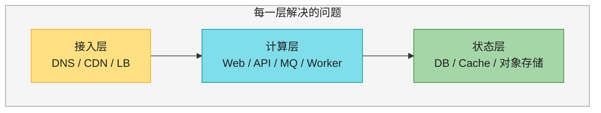

本章 8 集对应 3 层的逐步加固。下面逐集拆开讲,**每集都有:概念图 + 时序/流程 + 决策表 + 追问**。

---

## 第 0 集:单机架构 (Single Server)

一切从一台机器开始:

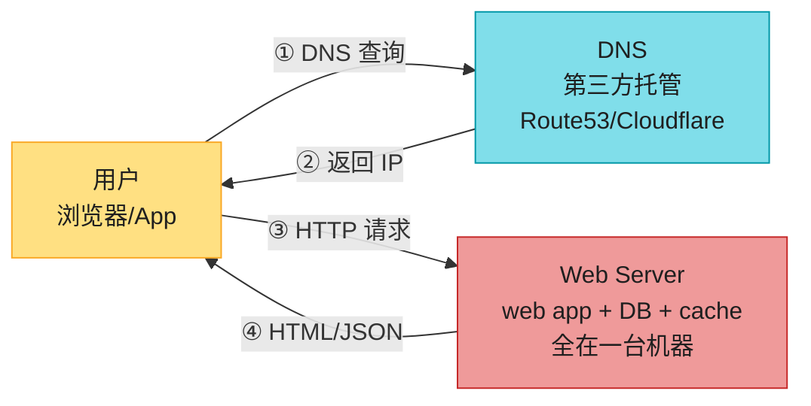

### DNS 怎么工作(追问高频,要会画)

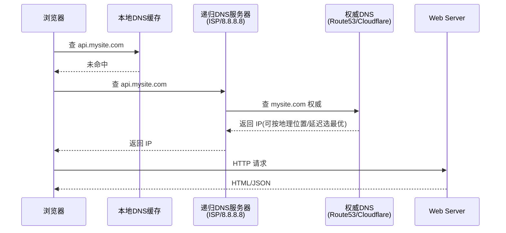

> 📝 **名词注释**
> - **DNS**:域名 → IP 的解析服务,**通常用第三方托管**(Route53、Cloudflare、DNSPod),不自己搭。面试当"已知外部服务"一笔带过,但要会画解析流程。
> - **递归 DNS**:用户 ISP 或 8.8.8.8 这类,替你一层层查。
> - **权威 DNS**:真正拥有该域名记录的服务器(Route53/Cloudflare 在这里)。
> - **流量来源**:web 应用(服务端渲染 + 客户端 JS)和 mobile 应用(HTTP + JSON)。现代基本是 mobile / SPA。

> 🔄 **2026 现代版怎么讲**(原书只说"DNS 是第三方服务"):
> "DNS 不只是解析,现代权威 DNS(Route53、Cloudflare)**还做地理路由(geoDNS)、延迟路由(latency-based routing)、健康检查 failover**。多机房架构里,全局流量调度的第一跳就是 DNS 层。"——这句能让你显得 senior。详见第 6 集。

**第 0 集痛点**:web app、DB、cache 全在一台机器 → 一台挂全挂,加 CPU/内存有硬上限,没有冗余。

---

## 第 1 集:Web 层与数据层分离

把数据库从 web 服务器里拆出来,各自独立扩展:

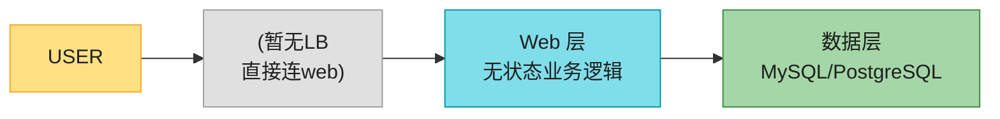

### SQL vs NoSQL 决策(原书决策 + 现代补充)

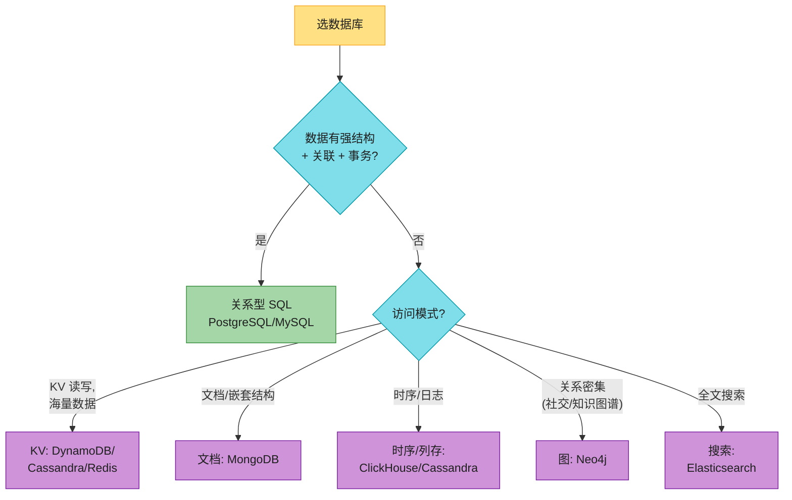

| 选 SQL(关系型) | 选 NoSQL |
|------|------|
| **默认首选**(40 年验证、ACID、生态成熟) | 需要超低延迟 |
| 强结构化、关系数据 | 数据非结构化 / schema 频繁变 |
| 需要 JOIN、跨表事务 | 只做 KV 序列化(JSON) |
| — | 海量数据 + 简单访问模式 |

> 🔄 **2026 现代版怎么讲**(原书停留在 2020 的 SQL/NoSQL 二分):
> "现在我会**先选 PostgreSQL**——它已经不只是关系库:JSONB 支持文档、扩展生态(pgvector 做向量、TimescaleDB 做时序、postgis 做地理)。**90% 的场景 PostgreSQL 单库 + 读写分离就够了**。只有当数据量真打到单机天花板(几 TB + 高写入),或者访问模式极端单一(纯 KV、纯时序),才上专门的 NoSQL。**别一上来就 NoSQL——那是过度工程**。"

> 🪤 **追问陷阱**:面试官问"那为什么大公司还用 NoSQL?" → 答:**特定场景的极致优化**(超大规模 + 简单访问)。MongoDB 存文档、Cassandra 存时序、DynamoDB 做 KV、Redis 做缓存。**别迷信"NoSQL 更先进"——大部分业务 SQL 就够**。

---

## 第 2 集:垂直 vs 水平扩展 + 负载均衡

### 垂直 (scale up) vs 水平 (scale out)——先搞清这两个词

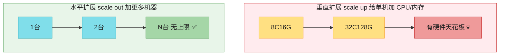

| | 垂直扩展 (scale up) | 水平扩展 (scale out) |
|---|---|---|
| 做法 | 给单机加 CPU/内存/磁盘 | 加更多机器 |
| 优点 | 简单,流量低时最优,**单机事务** | 无硬上限、有冗余、廉价机器 |
| 缺点 | 有硬件天花板、单点故障 | 复杂(状态、一致性、分布式) |
| 适用 | 早期、**数据库**(单机事务难拆) | 大规模、**web 层**(无状态好拆) |

> 💡 **真实数据(背下来当论据)**:AWS RDS 单机可到 **24 TB RAM**;Stack Overflow 2013 年用**1 台 master** 服务 1000 万月活;2026 年单机 NVMe + 大内存的能力比这还强。**单机能力远超你想象,别一上来就分布式**。

### 负载均衡 (Load Balancer)

水平扩展第一个组件就是 LB。它解决两件事:**failover**(一台挂了流量自动转走) + **横向扩容**(加机器即可):

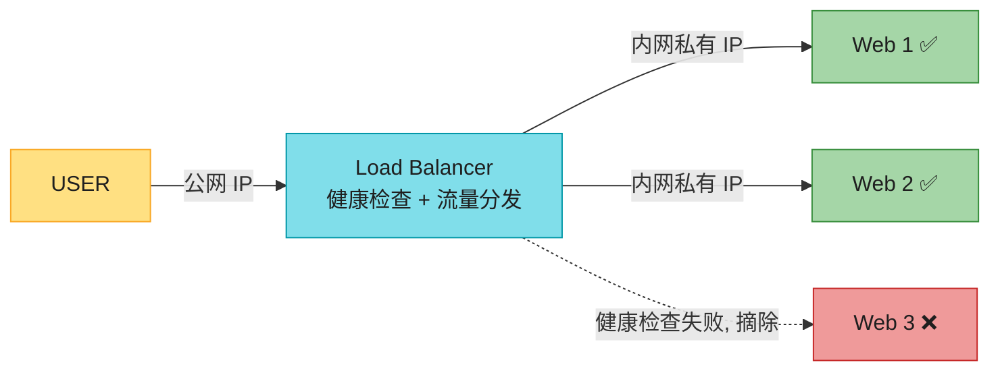

### LB 算法(必背对比表)

| 算法 | 怎么做 | 适用 |
|------|--------|------|
| **轮询 (Round Robin)** | 按顺序一台台发 | 机器配置相同 |
| **加权轮询** | 按机器能力分配权重 | 机器配置不同 |
| **最少连接 (Least Connections)** | 发给当前连接数最少的 | 长连接、请求耗时差异大 |
| **IP Hash / 一致性 Hash** | 同 IP/用户固定到同一台 | 需要 session 粘性(但更好是消灭粘性,见第 5 集) |
| **最少延迟 (Least Latency)** | 发给响应最快的 | 对延迟敏感(现代云 LB 默认) |

### L4 vs L7 负载均衡(高级岗必问)

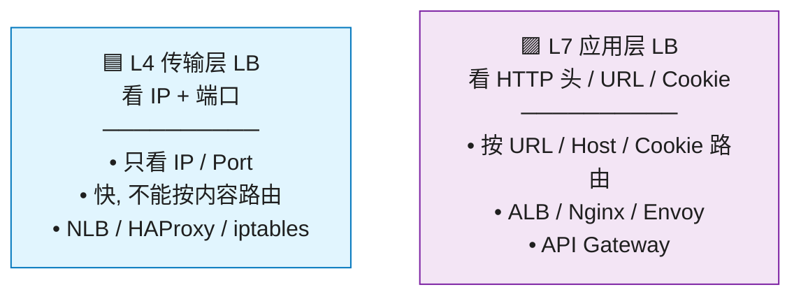

> 📝 **私有 IP**:机器间通信用内网 IP,客户端从公网**够不着**,提升安全性。LB 和 web 服务器都走内网。

> 🔄 **2026 现代版怎么讲**(原书只说"LB + 多 web"):
> "现代架构里 LB 这一层已经分化成三种形态:**①云托管 LB**(AWS ALB/NLB、GCP LB)做入口流量;**② API Gateway**(Kong、APISIX、AWS API Gateway)在 LB 之上做认证、限流、路由;**③ Service Mesh sidecar**(Envoy/Istio)把 LB 能力下沉到每台机器,做服务间通信的 mTLS 和细粒度流量治理。**web 层水平扩展在 2026 默认是 K8s + Service Mesh**,不是手动加机器。"——这套话术直接对标 senior。

> 🏭 **真实产品**:AWS **ALB/NLB**、Nginx、HAProxy、Envoy;托管 API Gateway:Kong、APISIX、AWS API Gateway;Service Mesh:Istio、Linkerd。

---

## 第 3 集:数据库主从复制 (Primary-Replica Replication)

LB 解决了 web 层单点,DB 还单点。引入**主从复制**:

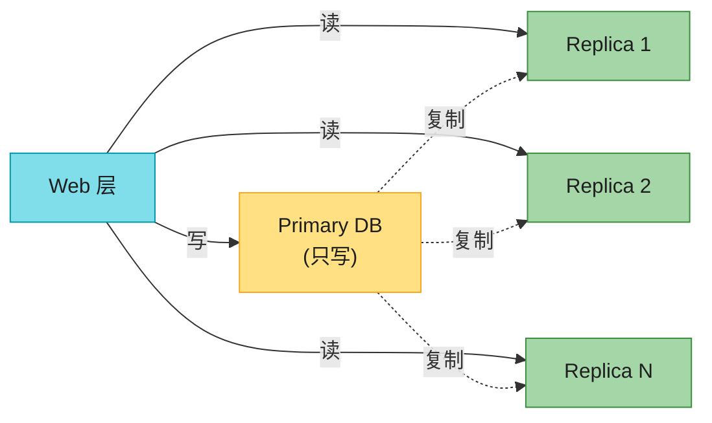

### 三点收益(背熟,面试必答)

1. **性能**:读分散到多个 replica,写集中在 primary。读多写少(典型 10:1),所以 replica 数量 >> primary。
2. **可靠性**:数据多副本,机器毁了数据还在。
3. **高可用**:一个库挂了,还能访问其他副本。

### 复制的三种模式(高级岗必问,原书没展开)

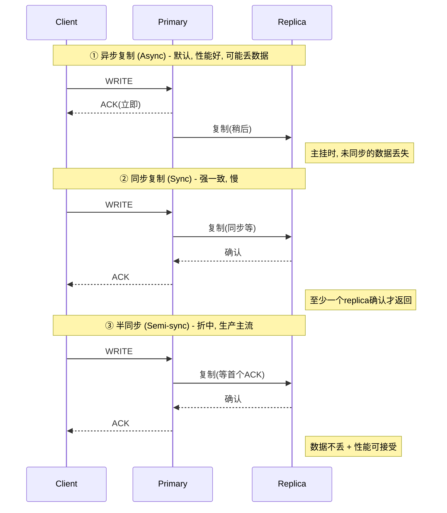

| 模式 | 性能 | 一致性 | 丢数据风险 | 适用 |
|------|------|--------|----------|------|
| **异步** | 最好(主不等) | 最终一致 | 主挂可能丢 | 日志、可重放数据 |
| **同步** | 最差(等所有) | 强一致 | 几乎不丢 | 金融交易 |
| **半同步** | 折中(等首个) | 较强 | 低 | **生产主流** |

### 故障切换 (Failover) 流程——重点

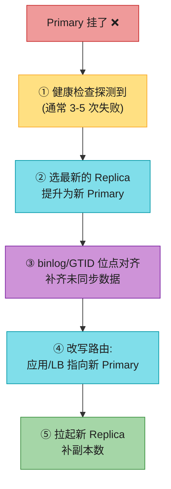

> ⚠️ 原书说"提升一个 slave 成新 master",但**生产环境这事很复杂**:replica 可能数据落后,需要 **binlog 位点 / GTID** 对齐,或运行数据恢复脚本。这正是 RPO(恢复点目标)的来源。

> 🪤 **追问陷阱 1**:"提升 Primary 时数据丢了怎么办?" →
> "三个手段:① **半同步复制**保证至少一个 replica 收到才返回;② 用 **GTID / binlog 位点**对齐,新 primary 必须追上旧位点;③ 业务层接受少量 RPO(比如 1 秒内的写入丢失)。金融场景必须半同步 + 跨机房副本。"

> 🪤 **追问陷阱 2**:"读写分离后,用户刚写完立即读不到怎么办?(读写一致性 / read-after-write)" → **这是面试必问、原书没讲的点**。三种解法:

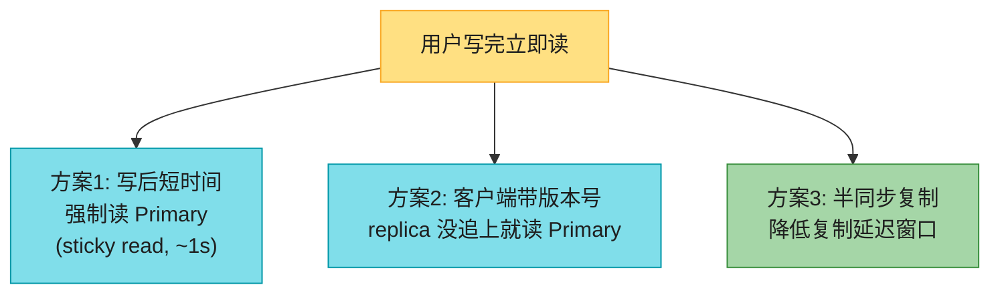

> 💡 **话术**:"我会用**写后 sticky read**——用户写完后,该用户的请求在 1-3 秒内强制路由到 primary,过了复制延迟窗口再恢复读 replica。这是 Instagram、Facebook 都在用的成熟方案。"

> 🔄 **2026 现代版怎么讲**(术语更新):
> "原书用 master/slave,**业界 2020 年后统一改 primary/replica 或 leader/follower**(MySQL 8.0.26 官方文档、PostgreSQL、MongoDB 都改了)。我会用 primary/replica。另外现代托管 DB(Aurora、Cloud SQL、TiDB)的 failover 已经**自动化到 30 秒内**——它们用存算分离 + 共享存储,primary 挂了新 primary 直接挂载同一份存储,不用追 binlog。"

---

#### 深入:异步复制延迟的 5 种读一致性陷阱(面试深水区)⭐⭐⭐

只要用异步/半同步复制,就一定有**复制延迟**(毫秒~秒级)。这个延迟会制造 5 种用户可感知的"诡异现象",**面试官最爱在这里连环追问**。每个都要会讲场景 + 时序 + 解法。

> 📝 **核心认知**:这些问题本质都是"**一致性保证不够强**"。SQL 标准里的"隔离级别"(read uncommitted / read committed / repeatable read / serializable)是针对**单机事务**的;**分布式复制引入了一致性级别**(strong / eventual / read-your-writes / monotonic / causal)。这两个概念不同,别混淆。

**陷阱 1:读己之写(Read-Your-Writes / read-after-write)**

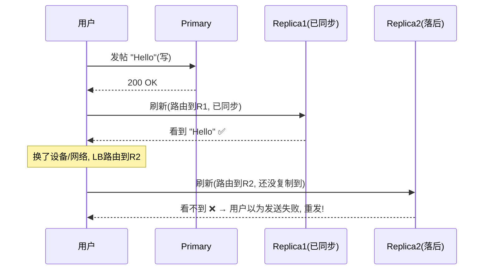

- **解法**(三选一):
  - **写后 sticky read**:用户写完后,该用户的请求在 1-3 秒内强制路由到 primary(Instagram/Facebook 用)。
  - **版本号路由**:客户端记下写操作的版本号,replica 没追上这个版本就读 primary。
  - **半同步复制**:写必须等至少一个 replica ack,缩短延迟窗口。

**陷阱 2:单调读(Monotonic Reads)**

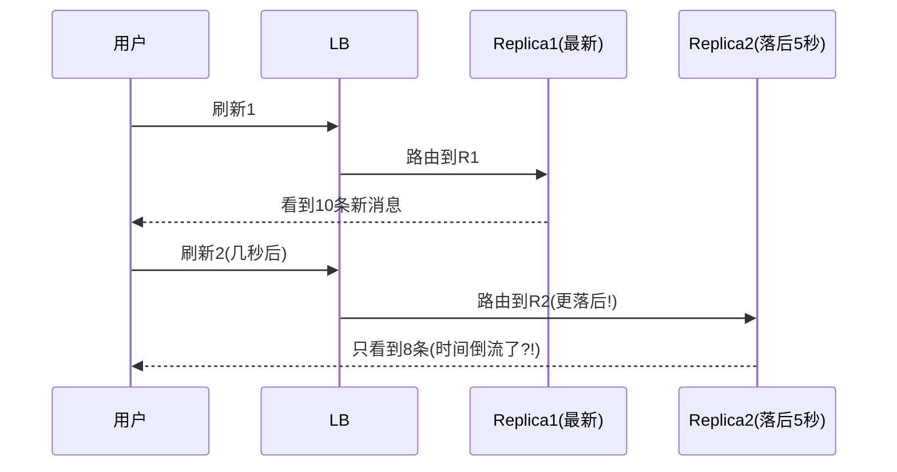

- **生活类比**:你正在看新闻,刷新一下新闻变少了——像时间倒流。
- **解法**:**同一用户的请求固定路由到同一个 replica**(基于 user_id 一致性哈希到 replica),避免在副本间跳来跳去。**别让 LB 随机选 replica**。

**陷阱 3:一致前缀读(Consistent Prefix Reads)**

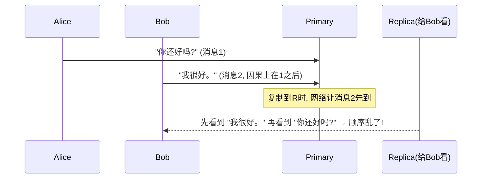

- **生活类比**:聊天里先看到"我很好"再看到"你还好吗",完全不知所云。
- **解法**:**因果相关的消息放同一分片**(同一会话/同一用户的写路由到同一 primary);或用版本号/向量时钟保证因果序。

**陷阱 4 & 5:事务边界 & 因果序**——更高级,Ch6/Ch10 详谈。

**决策表(背熟)**:

| 陷阱 | 现象 | 解法 | 代价 |
|------|------|------|------|
| 读己之写 | 写完读不到 | sticky read / 版本号 / 半同步 | primary 读压力↑ |
| 单调读 | 时间倒流感 | 同用户固定 replica | 负载不均 |
| 一致前缀读 | 因果顺序乱 | 同分片 / 版本号 | 牺牲并行度 |

> 🪤 **追问陷阱**(连环问):"你的 sticky read 多久才能切回 replica?" → "略大于复制延迟(通常 1-3 秒)。我可以**监控复制延迟**(MySQL `Seconds_Behind_Master`),动态调整 sticky 窗口。"——这一句直接 senior。
>
> 🪤 **再追问**:"能不能彻底消除这些问题?" → "能,**同步复制 + 只读 primary** 就彻底没有延迟。但代价是性能差 + 牺牲可用性。**工程上接受秒级最终一致 + 上述补偿机制**,是性能和一致性的最优折中。"

---

## 第 4 集:缓存与 CDN ⭐ 本章重点

读响应慢 → 加缓存;静态资源(图片/视频/CSS/JS)慢 → 上 CDN。这一集是面试**最深、追问最多**的地方,原书写得浅,我大幅扩充。

### 4.1 缓存层基本架构

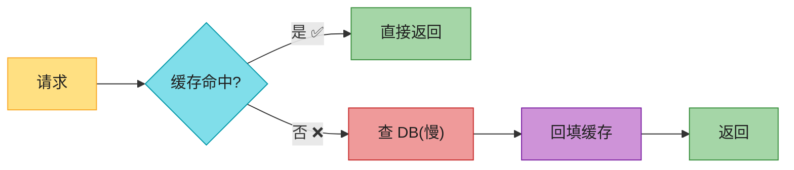

### 4.2 五种缓存策略(原书只提 read-through,这里全补)

这是面试**必考的深度题**,原书严重不足。背熟这张表 + 每种的时序:

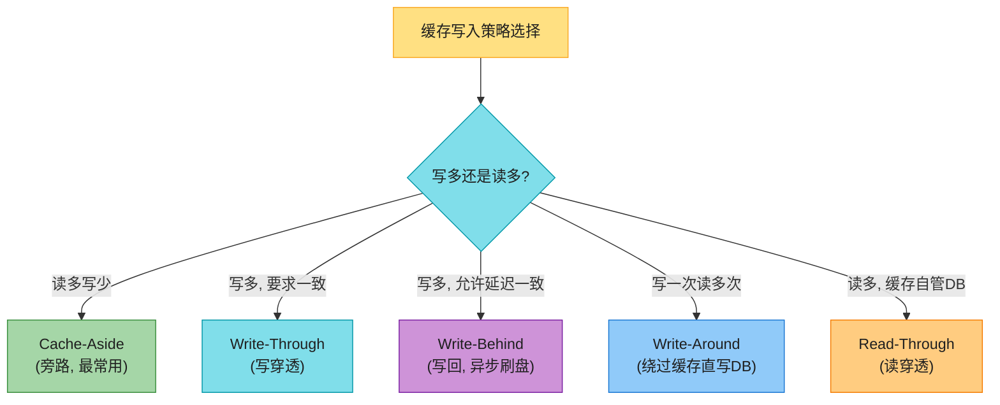

| 策略 | 写流程 | 读流程 | 一致性 | 适用 |
|------|--------|--------|--------|------|
| **Cache-Aside**(旁路) | 写 DB → **删**缓存 | 读缓存,未命中查 DB 回填 | 最终一致 | **最常用**,应用管缓存 |
| **Write-Through** | 写缓存 → 缓存同步写 DB | 读缓存 | 强一致 | 写多,可接受写延迟 |
| **Write-Behind**(写回) | 写缓存 → 缓存**异步**刷 DB | 读缓存 | 延迟一致(可能丢) | 写极多,可容忍丢失 |
| **Write-Around** | 直接写 DB,不写缓存 | 读缓存,未命中查 DB 回填 | 最终一致 | 写一次读多次,避免缓存被污染 |
| **Read-Through** | 同 Cache-Aside | 缓存层**自己**查 DB | 最终一致 | 应用不关心缓存 |

#### Cache-Aside 时序(必会画)

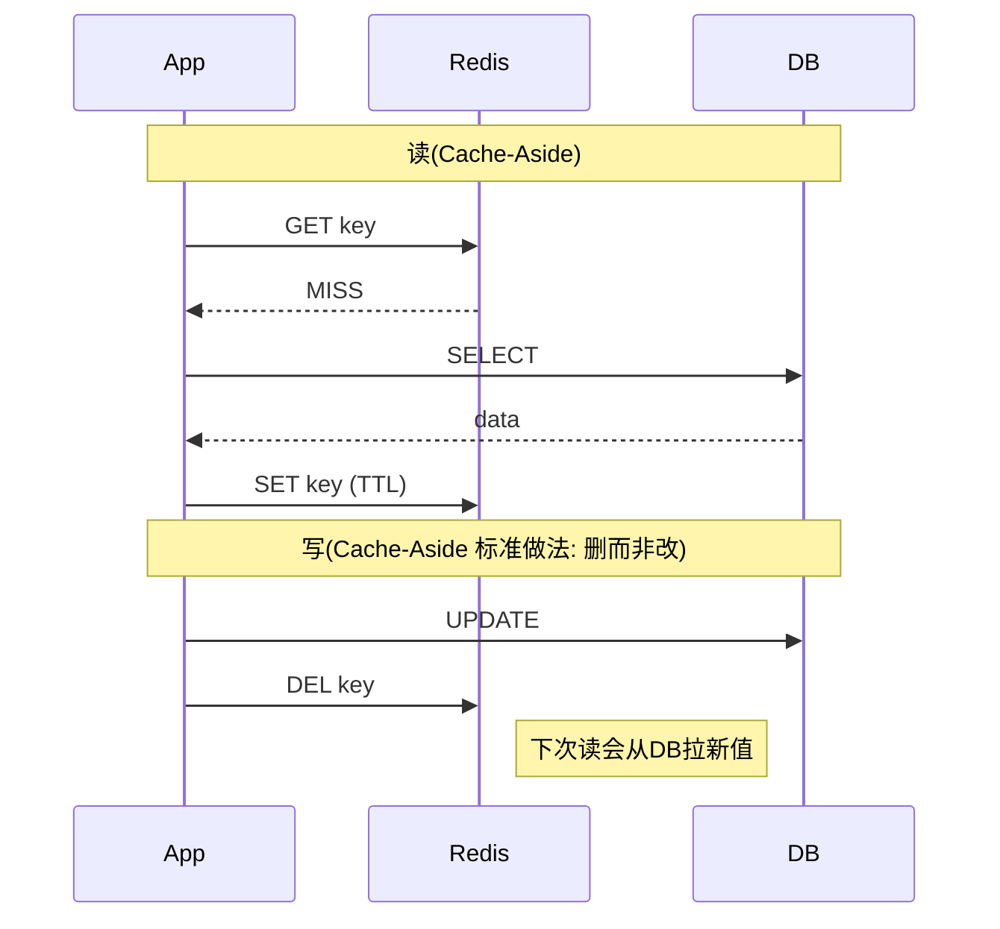

> 🪤 **追问陷阱(高频)**:"为什么写操作是**删**缓存而不是**更新**缓存?" → "**避免并发下 DB 与缓存不一致**。删缓存是幂等的;更新缓存则有'先更新的请求反而后写完'的经典并发问题。"看图:

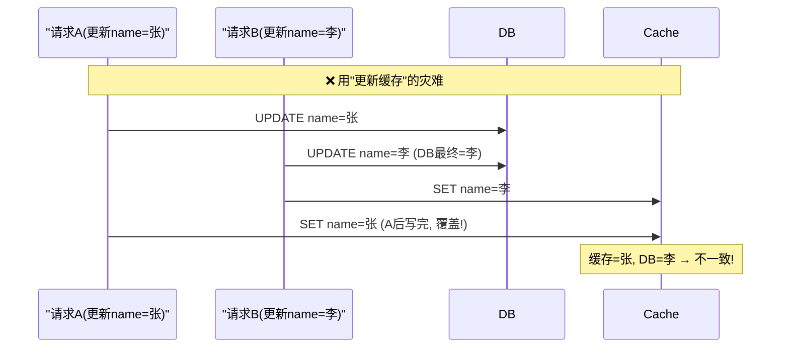

> 删缓存就没这问题——下次读统一从 DB 拉最新值。

### 4.3 缓存三大经典问题(面试必问,原书完全没讲)⭐⭐⭐

这是**国内大厂面试的固定三连问**,原书一个字没写,你必须会:

```mermaid
flowchart TB
    ROOT["缓存三大经典问题"] --> P1["① 缓存穿透<br/>查询根本不存在的key<br/>每次都打到DB"]
    ROOT --> P2["② 缓存击穿<br/>热点key过期<br/>瞬间大量请求打DB"]
    ROOT --> P3["③ 缓存雪崩<br/>大量key同时过期<br/>或缓存整体宕机"]

    style ROOT fill:#FFE082,stroke:#F9A825,color:#1f1f1f
    style P1 fill:#EF9A9A,stroke:#C62828,color:#1f1f1f
    style P2 fill:#FFCC80,stroke:#F57C00,color:#1f1f1f
    style P3 fill:#CE93D8,stroke:#7B1FA2,color:#1f1f1f
```

| 问题 | 场景 | 危害 | 解法 |
|------|------|------|------|
| **缓存穿透** | 查 `user_id=-1` 或恶意攻击不存在的 key | 每次穿透到 DB,DB 被打挂 | ① **缓存空值**(null 也缓存,短 TTL);② **布隆过滤器**(Bloom Filter)挡掉一定不存在的 key;③ 限流 |
| **缓存击穿** | 热点 key(如明星微博)突然过期 | 瞬间几万请求同时查 DB | ① **互斥锁**(Mutex)——只让一个请求查 DB 回填,其他等;② **热点 key 永不过期 + 后台异步刷新 |
| **缓存雪崩** | 大量 key 同时过期 / Redis 宕机 | DB 瞬间被压垮 | ① **TTL 加随机抖动**(如 `3600 + rand(300)`)防止同时过期;② **多级缓存**(本地 + Redis);③ Redis 高可用集群 |

> 💡 **话术模板**(被问"缓存怎么保证高可用"时直接背):
> "我会从三个维度设计:① **防穿透**——布隆过滤器 + 缓存空值;② **防击穿**——热点 key 用互斥锁或逻辑过期;③ **防雪崩**——TTL 随机化 + Redis Cluster 多副本 + 本地缓存兜底。这是生产级缓存的标配。"

### 4.4 缓存使用 5 考虑(原书清单,精简)

| 考虑 | 要点 |
|------|------|
| **何时用** | 读多写少的数据。缓存是易失内存,**不能当持久存储** |
| **过期策略** | 必须设 TTL;太短频繁回源,太长数据 stale |
| **一致性** | DB 和缓存不在同一事务,跨机房一致性极难(见 4.5) |
| **容错** | 单台 cache 是 SPOF,要**多副本 + 内存超配** |
| **淘汰策略** | 满了要淘汰。**LRU 最常用**,还有 LFU / FIFO |

> 📝 **名词注释**
> - **SPOF (Single Point of Failure)**:单点故障——一个组件挂了整个系统停摆。**主动指出"这是 SPOF"是加分项**。
> - **LRU (Least Recently Used)**:淘汰最久没访问的。Redis `maxmemory-policy allkeys-lru`。
> - **TTL (Time To Live)**:缓存过期时间。

### 4.5 缓存一致性——2026 现代方案(原书只引 Facebook 论文,这里给完整答案)

```mermaid
flowchart LR
    subgraph TRAD["传统: 应用自己同步缓存 (易不一致)"]
        APP1["App"] --> DB1["DB"]
        APP1 --> CACHE1["Redis"]
    end
    subgraph MODERN["2026 主流: CDC 自动同步"]
        APP2["App"] --> DB2["DB"]
        DB2 --> CDC["Debezium<br/>监听 binlog"]
        CDC --> K["Kafka"]
        K --> REFRESH["缓存刷新服务"]
        REFRESH --> CACHE2["Redis"]
        REFRESH --> ES["Elasticsearch<br/>(搜索索引)"]
    end

    style TRAD fill:#FFEBEE,stroke:#C62828,color:#1f1f1f
    style MODERN fill:#E8F5E9,stroke:#388E3C,color:#1f1f1f
    style APP1 fill:#80DEEA,stroke:#0097A7,color:#1f1f1f
    style DB1 fill:#A5D6A7,stroke:#388E3C,color:#1f1f1f
    style CACHE1 fill:#CE93D8,stroke:#7B1FA2,color:#1f1f1f
    style APP2 fill:#80DEEA,stroke:#0097A7,color:#1f1f1f
    style DB2 fill:#A5D6A7,stroke:#388E3C,color:#1f1f1f
    style CDC fill:#FFE082,stroke:#F9A825,color:#1f1f1f
    style K fill:#90CAF9,stroke:#1976D2,color:#1f1f1f
    style REFRESH fill:#80DEEA,stroke:#0097A7,color:#1f1f1f
    style CACHE2 fill:#CE93D8,stroke:#7B1FA2,color:#1f1f1f
    style ES fill:#FFCC80,stroke:#F57C00,color:#1f1f1f
```

> 🔄 **2026 现代版怎么讲**(原书只引论文,这里给可背话术):
> "缓存一致性我会分两层处理:① **强一致要求不高**的场景用 Cache-Aside + 删缓存 + TTL,接受秒级最终一致;② **强一致要求高**的场景,我用 **CDC(Debezium 监听 MySQL binlog / PostgreSQL WAL)→ Kafka → 缓存刷新服务**,DB 一变,缓存、搜索索引、派生数据全部自动同步。这正是派生数据(Derived Data)的思想——缓存和索引都能从 DB 重建。"
>
> 这是 **DDIA 的核心思想落地**——你在系统设计面试里说出 "CDC + Derived Data",面试官会眼前一亮。

> 🏭 **真实产品**:Redis(主流)、Memcached(Facebook 当年用,纯 KV 无持久化);托管:ElastiCache、Memorystore。CDC:Debezium。

---

#### 深入:缓存一致性的"延迟双删"——为什么单删不够 ⭐⭐

Cache-Aside 的标准做法是"写 DB 后删缓存"。但**单次删缓存在并发下会失效**。看这个经典陷阱:

```mermaid
sequenceDiagram
    participant C1 as 读请求C1
    participant C2 as 写请求C2
    participant DB
    participant Cache
    Note over C1,Cache: 缓存此时为空(刚过期)
    C1->>DB: 读到旧值 name=张
    Note over C1: C1 准备回填缓存(还没写)
    C2->>DB: UPDATE name=李 (DB=李)
    C2->>Cache: DEL key (删除, 但本来就是空的)
    C1->>Cache: SET name=张 (C1把旧值写回!)
    Note over Cache: 缓存=张(旧), DB=李(新) → 不一致! TTL到期前一直是错的
```

**问题根源**:读请求 C1 在写请求 C2 删缓存**之前**读到旧值,却在删缓存**之后**才回填——把旧值又写回了缓存,而后续删除已经发生,不会再有人删。

**解法:延迟双删**

```mermaid
flowchart LR
    A["写请求"] --> B["① 更新 DB"]
    B --> C["② 删缓存(第1次)"]
    C --> D["③ 延迟 N 毫秒<br/>(如500ms)"]
    D --> E["④ 再删缓存(第2次)"]
    E --> F["✅ 把C1类回填的旧值清掉"]

    style A fill:#FFE082,stroke:#F9A825,color:#1f1f1f
    style B fill:#80DEEA,stroke:#0097A7,color:#1f1f1f
    style C fill:#80DEEA,stroke:#0097A7,color:#1f1f1f
    style D fill:#FFCC80,stroke:#F57C00,color:#1f1f1f
    style E fill:#CE93D8,stroke:#7B1FA2,color:#1f1f1f
    style F fill:#A5D6A7,stroke:#388E3C,color:#1f1f1f
```

**N 取多少?** N 要**略大于一次读请求的耗时**(读 DB + 回填缓存),通常 **500ms ~ 1s**。

**代码**:

```python
import threading

def update_user_delayed_double_delete(user_id, **fields):
    db.update("users", user_id, fields)
    r.delete(f"user:{user_id}")                          # 第1次删
    def second_delete():
        import time; time.sleep(0.5)
        r.delete(f"user:{user_id}")                      # 第2次删
    threading.Thread(target=second_delete).start()        # 异步, 不阻塞主请求
```

**4 种一致性方案决策表(背熟)**:

| 方案 | 一致性 | 复杂度 | 适用 |
|------|--------|--------|------|
| **Cache-Aside 单删** | 最终一致(秒级) | 最低 | **90% 场景**,能容忍短暂不一致 |
| **延迟双删** | 准最终一致 | 低 | 写后立刻读的一致性要求较高 |
| **设短 TTL(如 1 分钟)** | 最终一致(分钟级) | 最低 | 兜底手段,任何方案都该加 |
| **CDC 同步(Debezium)** | 准强一致 | 高 | 多个派生数据(缓存+索引+数仓)统一同步 |
| **Write-Through + 同步双写** | 强一致 | 中 | 写少读多、可接受写延迟 |

> 🪤 **追问**:"延迟双删里第二次删也失败了怎么办?" → "① 重试 + 死信队列;② 兜底靠 **TTL**(缓存迟早过期);③ 用 **Redis 的 keyspace notification** 或后台 job 定期扫描对账。**没有任何方案能 100% 一致,都是降低不一致窗口 + TTL 兜底**。"

> 💡 **生活类比**:延迟双删就像你搬家后,先告诉快递公司新地址(第一次删),等你确认所有包裹都寄到新地址后(延迟),再正式注销旧地址(第二次删),防止有包裹还往旧地址寄。

---

## 第 4 集(续):CDN (Content Delivery Network)

CDN = 全球分布的边缘服务器,缓存静态内容,就近返回:

```mermaid
flowchart LR
    UA["用户 A<br/>请求 image.png"] --> CDN1["CDN 边缘节点<br/>(就近)"]
    CDN1 -->|"未命中"| SHIELD["Shield POP<br/>(中间缓存层)"]
    SHIELD -->|"仍未命中"| ORIGIN["源站<br/>S3 / Web"]
    ORIGIN -->|"返回 + TTL"| SHIELD
    SHIELD --> CDN1
    CDN1 -->|"缓存 + 返回"| UA
    UB["用户 B 请求同一张"] --> CDN1
    CDN1 -->|"命中(TTL 内)"| UB

    style UA fill:#FFE082,stroke:#F9A825,color:#1f1f1f
    style UB fill:#FFE082,stroke:#F9A825,color:#1f1f1f
    style CDN1 fill:#80DEEA,stroke:#0097A7,color:#1f1f1f
    style SHIELD fill:#90CAF9,stroke:#1976D2,color:#1f1f1f
    style ORIGIN fill:#A5D6A7,stroke:#388E3C,color:#1f1f1f
```

**4 个考虑**(原书):成本(按流量计费)、缓存过期(长则 stale 短则回源)、**CDN 故障 fallback**(客户端要能回源站)、**主动失效**(API 失效 或 URL 版本号 `image.png?v=2`)。

> 🔄 **2026 现代版怎么讲**(原书说"动态内容缓存超出范围"——已严重过时):
> "现代 CDN 早就超越'缓存静态文件'了:**① 动态内容加速**——按 path/query/cookie/header 缓存 HTML(Cloudflare、CloudFront、Fastly 都支持);**② 边缘计算**——Cloudflare Workers、Fastly Compute@Edge 让你在边缘跑代码(鉴权、A/B 测试、个性化);**③ 图片/视频实时转码**——CDN 边缘按设备返回不同分辨率;**④ Shield POP**——边缘和源站之间加一层缓存,保护源站。所以 CDN 现在是'离用户最近的计算层',不只是存储。"

> 🏭 **真实产品**:Cloudflare(~330+ 城市节点,2026)、AWS CloudFront、Akamai、Fastly。

---

## 第 5 集:无状态 Web 层 (Stateless Web Tier)

要水平扩展 web 层,**必须先把状态(session)从 web 层移走**。

```mermaid
flowchart TB
    subgraph BAD["❌ 有状态架构(扩展杀手)"]
        UA["User A"] -.->|"必须路由"| S1["Server 1<br/>(存 A 的 session)"]
        UA -.->|"不能去"| S2["Server 2"]
    end
    subgraph GOOD["✅ 无状态架构 (auto-scaling 前提)"]
        UB["User A"] --> LB["LB"]
        LB --> W1["Web 1"]
        LB --> W2["Web 2"]
        LB --> W3["Web 3"]
        W1 --> STORE["共享存储<br/>Redis / DB"]
        W2 --> STORE
        W3 --> STORE
    end

    style BAD fill:#FFEBEE,stroke:#C62828,color:#1f1f1f
    style GOOD fill:#E8F5E9,stroke:#388E3C,color:#1f1f1f
    style UA fill:#FFE082,stroke:#F9A825,color:#1f1f1f
    style S1 fill:#EF9A9A,stroke:#C62828,color:#1f1f1f
    style S2 fill:#EF9A9A,stroke:#C62828,color:#1f1f1f
    style UB fill:#FFE082,stroke:#F9A825,color:#1f1f1f
    style LB fill:#80DEEA,stroke:#0097A7,color:#1f1f1f
    style W1 fill:#A5D6A7,stroke:#388E3C,color:#1f1f1f
    style W2 fill:#A5D6A7,stroke:#388E3C,color:#1f1f1f
    style W3 fill:#A5D6A7,stroke:#388E3C,color:#1f1f1f
    style STORE fill:#CE93D8,stroke:#7B1FA2,color:#1f1f1f
```

| | 有状态 (stateful) | 无状态 (stateless) |
|---|---|---|
| session 存哪 | web 服务器内存 | 共享存储(Redis/DB) |
| 请求路由 | 必须同用户→同服务器(sticky session) | 任意服务器 |
| 扩容 | 难(加机器要搬 session) | 易(加机器即可) |
| 容错 | 难(挂了 session 丢) | 好(session 在共享存储) |

### Session 管理演进(原书没讲,面试加分)

```mermaid
flowchart LR
    A["① 服务端 Session<br/>(session id + 内存)"] --> B["② Sticky Session<br/>(LB 固定路由)"]
    B --> C["③ 分布式 Session<br/>(Redis 集中存)"]
    C --> D["④ JWT 无状态<br/>(token 自包含)"]

    style A fill:#EF9A9A,stroke:#C62828,color:#1f1f1f
    style B fill:#FFCC80,stroke:#F57C00,color:#1f1f1f
    style C fill:#80DEEA,stroke:#0097A7,color:#1f1f1f
    style D fill:#A5D6A7,stroke:#388E3C,color:#1f1f1f
```

> 📝 **JWT (JSON Web Token)**:把用户信息编码进 token,服务端**不存 session**,只验签。这是真正的"web 层无状态"。代价:token 难主动失效(需黑名单)。
>
> 🔄 **2026 现代版话术**:"web 层无状态我用 JWT + 短期 access token + 长期 refresh token;需要主动登出就维护一个 Redis 黑名单。这样 web 层完全无状态,可以随便扩缩。"

> 🪤 **追问陷阱**:"Sticky session 能解决有状态问题吗?" → "能缓解但**不推荐**——加减机器时 session 要迁移,机器故障 session 丢失。**消灭 sticky session = session 移到共享存储 / 用 JWT**,才是正解。"

---

## 第 6 集:多数据中心 (Multi-Data Center)⭐ 现代核心

用户遍布全球 + 不能单机房故障 → 多机房。**这一集原书写得最浅,但 2026 面试问得最多**(云原生时代默认多 Region)。

### 基本架构

```mermaid
flowchart TB
    USER["全球用户"] --> GEO["全局 DNS / Anycast<br/>(Route53 / Cloudflare)"]
    GEO -->|"按地理 + 健康"| R1["Region 1<br/>多AZ<br/>US-East"]
    GEO -->|"按地理 + 健康"| R2["Region 2<br/>多AZ<br/>US-West"]
    GEO -->|"按地理 + 健康"| R3["Region 3<br/>亚太"]
    R2 -.->|"故障 ❌"| GEO
    GEO -.->|"故障时全切 R1"| R1

    style USER fill:#FFE082,stroke:#F9A825,color:#1f1f1f
    style GEO fill:#80DEEA,stroke:#0097A7,color:#1f1f1f
    style R1 fill:#A5D6A7,stroke:#388E3C,color:#1f1f1f
    style R2 fill:#EF9A9A,stroke:#C62828,color:#1f1f1f
    style R3 fill:#A5D6A7,stroke:#388E3C,color:#1f1f1f
```

### Active-Active vs Active-Passive(必问)

```mermaid
flowchart LR
    subgraph AA["Active-Active 双活 两个 Region 都服务流量"]
        AA1["Region A"] <-->|"双向实时复制<br/>难: 一致性"| AA2["Region B"]
    end
    subgraph AP["Active-Passive 主备 只有 A 服务, B 热备"]
        AP1["Region A<br/>(读写)"] -->|"单向异步复制"| AP2["Region B<br/>(standby)"]
    end

    style AA fill:#E8F5E9,stroke:#388E3C,color:#1f1f1f
    style AP fill:#FFF8E1,stroke:#F9A825,color:#1f1f1f
    style AA1 fill:#80DEEA,stroke:#0097A7,color:#1f1f1f
    style AA2 fill:#80DEEA,stroke:#0097A7,color:#1f1f1f
    style AP1 fill:#80DEEA,stroke:#0097A7,color:#1f1f1f
    style AP2 fill:#90CAF9,stroke:#1976D2,color:#1f1f1f
```

| | Active-Active(双活) | Active-Passive(主备) |
|---|---|---|
| 流量 | 两个 Region 都接 | 只有一个接,另一个 standby |
| 故障切换 | 秒级(本来就活的) | 分钟级(要提升备为主) |
| 数据一致 | **难**(双向复制,冲突) | 相对易(单向异步) |
| 成本 | 高(双份活资源) | 中(备可降配) |
| 适用 | 全球用户、不能停服 | 中小公司、容忍分钟宕机 |

### 3 个技术挑战(原书清单,精简)

1. **流量路由**:geoDNS / Anycast 按用户位置 + 健康检查路由。
2. **数据同步**:各机房本地数据不同步 → failover 后可能数据缺失。**Netflix 用异步跨机房复制**。
3. **测试与部署**:多机房部署要一致,**自动化部署工具**必不可少。

> 🪤 **追问陷阱 1**:"Active-Active 双向复制冲突怎么办?(两地同时改同一条记录)" →
> "这是分布式写冲突。三种解法:① **避免跨 Region 写**——按用户归属固定写某个 Region(geo-sharding);② **CRDT(无冲突复制数据类型)**——自动合并(用于计数器、集合);③ **最后写入获胜(LWW)**——用时间戳(要求时钟同步,NTP/TrueTime)。这也是 CAP 定理的体现。"

> 🪤 **追问陷阱 2**:"多 Region 怎么保证低延迟 + 一致?" → "这就是 **CAP 取舍**:强一致(CP)要跨 Region 同步,延迟 100-200ms;高可用 + 低延迟(AP)接受最终一致。**Spanner 用 TrueTime 做全球强一致,代价是延迟**;大多数业务选 AP + 最终一致。"

> 🔄 **2026 现代版怎么讲**(原书用"数据中心",2026 是"Region/AZ"):
> "云时代不叫'多数据中心',叫**多 Region 多 AZ**:① **AZ(Availability Zone)** = 同一 Region 内的独立机房,做高可用(单 Region 多 AZ 是默认);② **Region** = 地理隔离的区域,做容灾 + 就近访问;③ **对象存储(S3)跨 Region 复制**是标配;④ **全局负载均衡**(Cloudflare、Route53 latency-based routing)做第一跳。多 Region active-active 是大厂标配,但**一致性代价高**——一般只对核心数据(账户、交易)做跨 Region 强一致,其余最终一致。"

---

#### 深入:CAP 的直觉 + 多机房写冲突怎么合并 ⭐⭐⭐

多机房(active-active)的真正难点是:**两个 Region 同时改同一条数据,谁赢?** 这本质是 CAP 定理。这里讲透——这是高级岗面试的"分水岭题"。

**① CAP 的直觉(不用数学也能讲清)**

很多人背成"三选二",这是**错的**。正确理解:

> **网络分区(P)是不可避免的**——网线会断、交换机会挂、机房会失联。所以 P 一定会发生。
> 真正的选择是:**当分区发生时,你要一致性(C)还是要可用性(A)?**

```mermaid
flowchart TD
    PART["网络分区发生了<br/>(两Region失联)"]
    PART --> Q{"怎么办?"}
    Q -->|"要 C(一致)<br/>拒绝服务, 返回错误"| CP["CP 系统<br/>强一致, 牺牲可用<br/>Spanner/etcd/ZK/PG同步"]
    Q -->|"要 A(可用)<br/>继续服务, 允许不一致"| AP["AP 系统<br/>高可用, 牺牲一致<br/>Cassandra/DynamoDB/Redis"]
    Q -->|"平时CA, 分区时让步<br/>(实际大多数系统)"| MID["BASE 系统<br/>最终一致<br/>主流业务系统"]

    style PART fill:#EF9A9A,stroke:#C62828,color:#1f1f1f
    style Q fill:#FFE082,stroke:#F9A825,color:#1f1f1f
    style CP fill:#80DEEA,stroke:#0097A7,color:#1f1f1f
    style AP fill:#A5D6A7,stroke:#388E3C,color:#1f1f1f
    style MID fill:#CE93D8,stroke:#7B1FA2,color:#1f1f1f
```

| | CP(一致) | AP(可用) |
|---|---|---|
| 分区时 | 拒绝写(返回错误) | 继续写,事后合并 |
| 一致性 | 强一致(线性一致) | 最终一致 |
| 可用性 | 分区时下降 | 始终可用 |
| 典型 | Spanner、etcd、ZooKeeper | Cassandra、DynamoDB、Redis Cluster |
| 适用 | 金融账户、配置中心、选主 | 社交 timeline、购物车、点赞数 |

> 💡 **话术**:"CAP 不是非此即彼。**正常无分区时,C 和 A 都能给**;只有分区那一刻才要二选一。而且系统可以**按数据粒度选**——账户余额用 CP,点赞数用 AP。"

**② 多机房写冲突的具体合并方法**

场景:Active-Active 下,Katy Perry 的粉丝在 **US Region** 把她的关注数 +1,同一时刻她在 **EU Region** 的关注数也 +1。两个 Region 各自的副本不一致。网恢复后,谁赢?

```mermaid
flowchart LR
    US["US Region<br/>粉丝数: 100→101"] x--x|"网络分区"| EU["EU Region<br/>粉丝数: 100→101"]
    NET["网络恢复"] --> RESOLVE{"怎么合并?"}
    RESOLVE --> A["① 避免冲突<br/>(geo-sharding)"]
    RESOLVE --> B["② LWW<br/>时间戳大的赢"]
    RESOLVE --> C["③ CRDT<br/>自动合并"]
    RESOLVE --> D["④ 应用层规则"]

    style US fill:#80DEEA,stroke:#0097A7,color:#1f1f1f
    style EU fill:#80DEEA,stroke:#0097A7,color:#1f1f1f
    style NET fill:#FFE082,stroke:#F9A825,color:#1f1f1f
    style RESOLVE fill:#80DEEA,stroke:#0097A7,color:#1f1f1f
    style A fill:#A5D6A7,stroke:#388E3C,color:#1f1f1f
    style B fill:#FFCC80,stroke:#F57C00,color:#1f1f1f
    style C fill:#CE93D8,stroke:#7B1FA2,color:#1f1f1f
    style D fill:#90CAF9,stroke:#1976D2,color:#1f1f1f
```

| 策略 | 怎么做 | 优点 | 缺点 |
|------|--------|------|------|
| **避免冲突(geo-sharding)** | 同一用户只能写归属的 Region | 无冲突 | Region 负载不均、用户跨区迁移难 |
| **LWW(Last-Write-Wins)** | 时间戳大的赢,丢弃小的 | 简单 | **丢数据**;要求时钟同步(NTP/TrueTime) |
| **CRDT(无冲突数据类型)** | 计数器(G-Counter)、集合(OR-Set)自动合并 | 不丢数据,自动 | 只适用特定结构;复杂 |
| **应用层规则** | 按业务规则(如订单状态机:已支付>待支付) | 业务正确 | 每个场景要单独写 |

**手算例子:粉丝数用什么?**
- 用 **LWW 会丢数据**(两个 +1 只留一个 → 少算一个粉丝)。
- 用 **CRDT 的 G-Counter** 才对:每个 Region 维护自己的计数向量 `(US:1, EU:1)`,合并时相加 = 总增量 2 → 100+2=102。**Cassandra 的计数器、Redis 的 INCR 都是类似思路**。

> 🪤 **追问**:"为什么 LWW 会丢数据?" → "因为 LWW 只保留时间戳大的那个版本,把另一个版本的修改整个丢弃。**计数场景必须用 CRDT 或把增量化成独立事件(每条 +1 是一个事件,合并时累加)**。"

**③ Quorum 机制:W + R > N(读最新值的保证)**

```mermaid
flowchart LR
    subgraph N["N=3 个副本"]
        R1["副本1<br/>v=2"]
        R2["副本2<br/>v=2"]
        R3["副本3<br/>v=1(旧)"]
    end
    NOTE["写要 W=2 个副本确认<br/>读要 R=2 个副本<br/>W+R=4 > N=3<br/>→ 读写必有交集, 至少一个副本有最新值"]

    style N fill:#E1F5FE,stroke:#0277BD,color:#1f1f1f
    style R1 fill:#A5D6A7,stroke:#388E3C,color:#1f1f1f
    style R2 fill:#A5D6A7,stroke:#388E3C,color:#1f1f1f
    style R3 fill:#FFCC80,stroke:#F57C00,color:#1f1f1f
    style NOTE fill:#FFE082,stroke:#F9A825,color:#1f1f1f
```

**为什么 W+R>N 能保证读到最新值?** 因为写确认了 W 个副本,读查询 R 个副本,两者总数超过 N,**必然有交集**——交集里的副本一定有最新值。这是 Dynamo/Cassandra 的核心。

**常见配置权衡**:

| 配置 | 行为 | 适用 |
|------|------|------|
| W=R=1, N=3 | 极快,可能读到旧值 | 缓存、可容忍不一致 |
| **W=2, R=2, N=3**(常用) | 读到最新值,延迟可接受 | **主流业务** |
| W=3, R=1 | 写慢,读快 | 读多写少 |
| W=1, R=3 | 写快,读慢 | 写多读少 |

**④ Spanner / CockroachDB 怎么做全球强一致(CP)**

```mermaid
flowchart LR
    TT["TrueTime API<br/>(GPS+原子钟)"] -->|"时钟误差 < 7ms"| SP["Spanner"]
    SP --> W1["写: 2PC 跨 Region 同步<br/>(等所有副本, 100ms+ 延迟)"]
    SP --> R1["读: 任何副本都能线性一致<br/>(用 TrueTime 等 commit 时间确定)"]

    style TT fill:#FFE082,stroke:#F9A825,color:#1f1f1f
    style SP fill:#80DEEA,stroke:#0097A7,color:#1f1f1f
    style W1 fill:#EF9A9A,stroke:#C62828,color:#1f1f1f
    style R1 fill:#A5D6A7,stroke:#388E3C,color:#1f1f1f
```

- **TrueTime**:Google 用 GPS + 原子钟给全球数据中心提供**误差 < 7ms** 的时钟。这是 Spanner 能做全球线性一致的根基——**没有准确的全球时钟,跨 Region 强一致是不可能的**(否则就要像 Raft/Paxos 那样用通信而非时钟)。
- **代价**:每次写要跨 Region 同步(2PC),延迟 100ms+,所以**只对核心数据(账户、交易)用 Spanner,其余用最终一致**。

> 🪤 **终极追问**:"那 etcd / ZooKeeper 没 TrueTime,怎么做强一致?" → "它们用 **Raft / Paxos 共识算法**——不依赖时钟,而是通过**多数派投票**达成一致。代价是跨 Region 延迟更高(每次写要过半节点同意)。详见 Ch6/Ch10。"

> 💡 **一句话总结多机房**:**业务层尽量 geo-sharding 避免跨 Region 写;实在要跨 Region,核心数据上 Spanner(CP),非核心用 AP + CRDT/LWW 合并**。这就是大厂多机房架构的真实写照。

---

## 第 7 集:消息队列 (Message Queue) 解耦

组件耦合、慢任务阻塞主流程 → 用 MQ 异步解耦:

```mermaid
flowchart LR
    USER -->|"上传照片"| WEB["Web Server"]
    WEB -->|"发布任务<br/>(不等处理完)"| MQ["Message Queue<br/>Kafka/RabbitMQ/SQS"]
    MQ -->|"消费"| W1["worker 1<br/>裁剪"]
    MQ -->|"消费"| W2["worker 2<br/>水印"]
    MQ -->|"消费"| W3["worker 3<br/>缩略图"]

    style USER fill:#FFE082,stroke:#F9A825,color:#1f1f1f
    style WEB fill:#80DEEA,stroke:#0097A7,color:#1f1f1f
    style MQ fill:#CE93D8,stroke:#7B1FA2,color:#1f1f1f
    style W1 fill:#A5D6A7,stroke:#388E3C,color:#1f1f1f
    style W2 fill:#A5D6A7,stroke:#388E3C,color:#1f1f1f
    style W3 fill:#A5D6A7,stroke:#388E3C,color:#1f1f1f
```

**核心收益 = 解耦**:生产者和消费者**互不依赖、独立扩缩**。队列堆积 → 加 worker;队列空 → 减 worker。

### MQ 的三种消息语义(原书没讲,高级追问必问)⭐

```mermaid
flowchart LR
    S["消息传递语义"] --> A["At-most-once<br/>最多一次<br/>可能丢"]
    S --> B["At-least-once<br/>至少一次<br/>可能重复"]
    S --> C["Exactly-once<br/>正好一次<br/>最理想但难"]

    style S fill:#FFE082,stroke:#F9A825,color:#1f1f1f
    style A fill:#EF9A9A,stroke:#C62828,color:#1f1f1f
    style B fill:#FFCC80,stroke:#F57C00,color:#1f1f1f
    style C fill:#A5D6A7,stroke:#388E3C,color:#1f1f1f
```

| 语义 | 实现 | 风险 | 适用 |
|------|------|------|------|
| **At-most-once** | 发完就忘,不确认 | 丢消息 | 日志、监控指标 |
| **At-least-once**(主流) | ack 机制,失败重试 | **重复**(消费方需幂等) | 大部分业务 |
| **Exactly-once** | 事务/幂等 + 去重 | 复杂、性能差 | 支付、计费 |

> 💡 **关键认知**:**业界实际只有 at-least-once + 消费方幂等**,这才是工程现实。"exactly-once" 通常是用幂等消费模拟出来的。**面试说这句显得很懂**。

> 🪤 **追问陷阱**:"用 MQ 后消息重复消费了怎么办?" → "**消费方必须幂等**——用业务唯一键(订单号、事件 id)去重,数据库唯一索引兜底。这是设计 MQ 消费者的铁律。"

> 🔄 **2026 现代版话术**:"我会按场景选 MQ:**高吞吐日志/事件流用 Kafka**(分区有序、持久化、可重放);**任务分发用 RabbitMQ / RocketMQ**(延迟低、路由灵活);**云原生无运维用 SQS / SNS / Pulsar**。所有消费者**强制幂等**。详见 Ch11/Ch12。"

> 🏭 **真实产品**:Kafka(高吞吐流)、RabbitMQ(传统 AMQP)、AWS SQS/SNS(托管)、RocketMQ(国内电商)、Pulsar(云原生流)。

---

## 第 8 集:数据库分片 (Sharding) + 微服务化

数据库到顶 → 分片。把大表按 key 拆成多个 shard:

```mermaid
flowchart LR
    APP["应用"] --> ROUTER["分片路由层<br/>(Sharding middleware)"]
    ROUTER -->|"user_id % 4 = 0"| S0["shard 0"]
    ROUTER -->|"= 1"| S1["shard 1"]
    ROUTER -->|"= 2"| S2["shard 2"]
    ROUTER -->|"= 3"| S3["shard 3"]

    style APP fill:#FFE082,stroke:#F9A825,color:#1f1f1f
    style ROUTER fill:#80DEEA,stroke:#0097A7,color:#1f1f1f
    style S0 fill:#A5D6A7,stroke:#388E3C,color:#1f1f1f
    style S1 fill:#A5D6A7,stroke:#388E3C,color:#1f1f1f
    style S2 fill:#A5D6A7,stroke:#388E3C,color:#1f1f1f
    style S3 fill:#A5D6A7,stroke:#388E3C,color:#1f1f1f
```

> 📝 **Sharding key(分片键)**:决定数据落到哪个 shard 的字段(如 `user_id`)。**选错分片键 = 系统灾难**。原则:**数据分布均匀 + 查询能定位到单分片**。

### 分片策略对比(原书只讲哈希,这里补全)

```mermaid
flowchart TD
    S["分片策略"] --> R["范围分片<br/>(Range)"]
    S --> H["哈希分片<br/>(Hash)"]
    S --> C["一致性哈希<br/>(Consistent)"]
    S --> D["目录分片<br/>(Directory)"]

    style S fill:#FFE082,stroke:#F9A825,color:#1f1f1f
    style R fill:#80DEEA,stroke:#0097A7,color:#1f1f1f
    style H fill:#80DEEA,stroke:#0097A7,color:#1f1f1f
    style C fill:#A5D6A7,stroke:#388E3C,color:#1f1f1f
    style D fill:#CE93D8,stroke:#7B1FA2,color:#1f1f1f
```

| 策略 | 怎么分 | 优点 | 缺点 |
|------|--------|------|------|
| **范围分片** | 按 key 范围(如日期、首字母) | 范围查询高效 | 易热点(最新数据集中) |
| **哈希分片** | `hash(key) % N` | 分布均匀 | 加减节点要全量迁移 |
| **一致性哈希** | hash 环 + 虚拟节点 | 加减节点只迁移最小数据 | 复杂(详见 Ch5) |
| **目录分片** | 查表决定 key→shard | 灵活 | 目录服务成单点 |

### 分片的 3 大坑(必背,面试加分)

| 坑 | 说明 | 应对 |
|---|---|---|
| **Resharding(重新分片)** | 数据增长 / 分片不均 → 要迁移。`user_id % 4` 改成 `% 8` 几乎所有数据都要动 | **一致性哈希**(Ch5)只迁移最小数据 |
| **Celebrity / Hotspot 问题(明星问题)** | Katy Perry / Justin Bieber 落同一分片 → 读爆 | 给明星单独分片 / 进一步细分 |
| **JOIN & 反规范化** | 跨分片 JOIN 极难 | 反规范化(冗余字段),查询只走单分片 |

> 💡 **伏笔**:**一致性哈希 → Ch5**;**KV 存储(分片+复制)→ Ch6**。

> 🔄 **2026 现代版话术**:"分片的复杂度太高,**2026 更推荐用原生分布式数据库**——TiDB、CockroachDB、Spanner、Aurora——它们在存储层内置了分片 + 多副本 + 自动 rebalance,业务无感。只有用 MySQL/PG 这种单机库且数据真打爆了,才手动分片。"

---

#### 深入:分片的两个老大难——二级索引 & 跨分片事务 ⭐⭐

分片后,这两个问题几乎必问,原书完全没讲。

**① 二级索引在分片下的 3 种实现**

痛点:`users` 表按 `user_id` 分片,但前端要按 `email` 登录、按 `phone` 查询——这些都是**非分片键**。怎么办?

```mermaid
flowchart LR
    subgraph BAD["❌ 本地索引 + Scatter-Gather"]
        Q1["按email查"] --> ALL["发给所有 N 个分片"]
        ALL --> S0["分片0 找"]
        ALL --> S1["分片1 找"]
        ALL --> S2["分片N 找"]
        ALL --> MERGE["合并结果(慢,<br/>要等最慢的分片)"]
    end
    subgraph GOOD["✅ 全局索引(单独存)"]
        Q2["按email查"] --> GI["全局索引表<br/>email→user_id→分片"]
        GI -->|"O(1)定位"| TARGET["只查目标分片"]
    end

    style BAD fill:#FFEBEE,stroke:#C62828,color:#1f1f1f
    style GOOD fill:#E8F5E9,stroke:#388E3C,color:#1f1f1f
    style Q1 fill:#FFE082,stroke:#F9A825,color:#1f1f1f
    style ALL fill:#EF9A9A,stroke:#C62828,color:#1f1f1f
    style S0 fill:#FFCC80,stroke:#F57C00,color:#1f1f1f
    style S1 fill:#FFCC80,stroke:#F57C00,color:#1f1f1f
    style S2 fill:#FFCC80,stroke:#F57C00,color:#1f1f1f
    style MERGE fill:#EF9A9A,stroke:#C62828,color:#1f1f1f
    style Q2 fill:#FFE082,stroke:#F9A825,color:#1f1f1f
    style GI fill:#CE93D8,stroke:#7B1FA2,color:#1f1f1f
    style TARGET fill:#A5D6A7,stroke:#388E3C,color:#1f1f1f
```

| 方案 | 怎么做 | 读 | 写 | 适用 |
|------|--------|----|----|------|
| **本地索引** | 每个分片建自己的二级索引 | 慢(scatter-gather,要查所有分片) | 快(只写本分片) | 二级查询少、写极多 |
| **全局索引** | 索引单独存(Elasticsearch / 单独的 KV 表) | 快(O(1) 定位分片) | 慢(要跨分片同步更新索引) | 二级查询多(如搜索) |
| **不分片** | 小表(配置表、字典表)每个分片都放一份 | 快 | 手动同步 | 数据量小且少变 |

> 🪤 **追问**:"全局索引写的时候要同步更新,会不会不一致?" → "会,所以全局索引通常用 **CDC 异步更新**(DB 变更 → Debezium → Elasticsearch),接受秒级延迟。强一致的全局索引代价极高,极少用。"——这又接回了缓存一致性的 CDC 方案。

**② 跨分片事务:2PC vs Saga(微服务必修)**

场景:转账,A 在分片 1,B 在分片 2,要保证"A 扣钱"和"B 加钱"同时成功或同时失败。

```mermaid
flowchart TB
    subgraph TPC["2PC 两阶段提交 (强一致, 阻塞)"]
        T1["① Prepare: 协调者问<br/>所有参与者能不能提交"] --> T2["所有参与者锁定资源,<br/>回答 YES/NO"]
        T2 --> T3{"都 YES?"}
        T3 -->|"是"| T4["② Commit:<br/>协调者发提交"]
        T3 -->|"否"| T5["② Rollback:<br/>协调者发回滚"]
    end
    subgraph SAGA["Saga 长事务 (最终一致, 非阻塞)"]
        S1["T1: A扣钱<br/>(补偿: A加钱回滚)"] --> S2["T2: B加钱<br/>(补偿: B扣钱回滚)"]
        S2 --> S3{"某步失败?"}
        S3 -->|"失败"| S4["反向执行补偿:<br/>B扣钱, A加钱"]
        S3 -->|"全成功"| S5["✅ 完成"]
    end

    style TPC fill:#FFEBEE,stroke:#C62828,color:#1f1f1f
    style SAGA fill:#E8F5E9,stroke:#388E3C,color:#1f1f1f
    style T1 fill:#FFE082,stroke:#F9A825,color:#1f1f1f
    style T2 fill:#FFE082,stroke:#F9A825,color:#1f1f1f
    style T3 fill:#80DEEA,stroke:#0097A7,color:#1f1f1f
    style T4 fill:#A5D6A7,stroke:#388E3C,color:#1f1f1f
    style T5 fill:#EF9A9A,stroke:#C62828,color:#1f1f1f
    style S1 fill:#80DEEA,stroke:#0097A7,color:#1f1f1f
    style S2 fill:#80DEEA,stroke:#0097A7,color:#1f1f1f
    style S3 fill:#FFE082,stroke:#F9A825,color:#1f1f1f
    style S4 fill:#FFCC80,stroke:#F57C00,color:#1f1f1f
    style S5 fill:#A5D6A7,stroke:#388E3C,color:#1f1f1f
```

| | 2PC(两阶段提交) | Saga |
|---|---|---|
| 一致性 | **强一致**(原子) | **最终一致**(中间态可见) |
| 阻塞 | **阻塞**(锁定资源等协调者) | 非阻塞 |
| 协调者 | 有,单点风险 | 无 |
| 分区容忍 | 差(分区时卡死) | 好 |
| 复杂度 | 协议复杂,参与者要支持 | 业务要写补偿事务 |
| 适用 | **单机房内**、节点少 | **微服务/跨机房**、长事务 |

> 💡 **大厂实践**:**微服务架构下几乎不用 2PC**(它违背"服务独立"原则,且协调者单点)。跨服务事务用 **Saga + 幂等 + 消息队列**(每步发消息,失败补偿)。电商下单 = Saga 典型:扣库存 → 扣余额 → 生成订单 → 发通知,任一步失败反向补偿。

> 🪤 **追问**:"Saga 中间态对外可见(钱已扣但订单没生成),用户看到怎么办?" → "① 业务上展示'处理中'状态;② 用**状态机**明确每个中间态;③ 关键操作配**幂等键**(订单号),失败重试不会重复扣款。"

> 🔄 **2026 现代版话术**:"跨分片事务我会**优先避免**——用领域驱动设计把强相关数据放同一分片。实在要跨,**单机房用 2PC**(如 TiDB 内部),**跨服务用 Saga + 幂等**。不要试图用分布式事务掩盖设计问题,那是过度工程。"

---

## 🔄 2026 现代版:从零到百万的完整现代架构(替代原书的"已过时")

这是本章**最重要的增量**。原书第 8 集后直接收尾,但 2026 年的真实系统会继续演进。下面给你一张**完整的现代架构图 + 每个现代组件的话术**,面试时可以主动画出来:

```mermaid
flowchart TB
    USER["用户<br/>Web/App/IoT"] --> DNS["全局 DNS<br/>Route53/Cloudflare<br/>(地理+延迟+健康路由)"]
    DNS --> CDN["CDN + 边缘计算<br/>Cloudflare Workers<br/>(静态+动态+边缘逻辑)"]
    CDN --> WAF["WAF<br/>(DDoS/SQL注入防护)"]
    WAF --> GW["API Gateway<br/>Kong/APISIX<br/>(认证/限流/路由)"]
    GW --> MESH["Service Mesh<br/>Envoy sidecar<br/>(mTLS/熔断/可观测)"]

    subgraph K8S["K8s 集群 (多 Region 多 AZ)"]
        SVC["微服务 Pods<br/>(HPA 自动扩缩)"]
        FaaS["FaaS<br/>(事件触发, 慢任务)"]
        SVC <--> MESH
        FaaS <--> MESH
    end

    SVC --> CACHE["Redis Cluster<br/>(多副本)"]
    SVC --> DB["分布式 DB<br/>TiDB/Aurora/PG<br/>(存算分离)"]
    SVC --> MQ["Kafka<br/>(事件流)"]
    MQ --> FaaS
    SVC --> OBJ["对象存储<br/>S3<br/>(跨Region复制)"]

    subgraph OBS["可观测性 (全链路)"]
        OTEL["OpenTelemetry"]
        PROM["Prometheus"]
        GRAF["Grafana"]
        JAEGER["Jaeger/Tempo"]
    end
    SVC -.-> OTEL -.-> PROM
    PROM -.-> GRAF
    OTEL -.-> JAEGER

    style USER fill:#FFE082,stroke:#F9A825,color:#1f1f1f
    style DNS fill:#80DEEA,stroke:#0097A7,color:#1f1f1f
    style CDN fill:#80DEEA,stroke:#0097A7,color:#1f1f1f
    style WAF fill:#FFCC80,stroke:#F57C00,color:#1f1f1f
    style GW fill:#80DEEA,stroke:#0097A7,color:#1f1f1f
    style MESH fill:#CE93D8,stroke:#7B1FA2,color:#1f1f1f
    style K8S fill:#E1F5FE,stroke:#0277BD,color:#1f1f1f
    style SVC fill:#A5D6A7,stroke:#388E3C,color:#1f1f1f
    style FaaS fill:#A5D6A7,stroke:#388E3C,color:#1f1f1f
    style CACHE fill:#CE93D8,stroke:#7B1FA2,color:#1f1f1f
    style DB fill:#A5D6A7,stroke:#388E3C,color:#1f1f1f
    style MQ fill:#90CAF9,stroke:#1976D2,color:#1f1f1f
    style OBJ fill:#FFE082,stroke:#F9A825,color:#1f1f1f
    style OBS fill:#F3E5F5,stroke:#7B1FA2,color:#1f1f1f
    style OTEL fill:#80DEEA,stroke:#0097A7,color:#1f1f1f
    style PROM fill:#80DEEA,stroke:#0097A7,color:#1f1f1f
    style GRAF fill:#80DEEA,stroke:#0097A7,color:#1f1f1f
    style JAEGER fill:#80DEEA,stroke:#0097A7,color:#1f1f1f
```

### 每个现代组件的话术(被问"你们公司架构长啥样"时)

| 原书(2020) | 2026 现代版 | 你的标准话术 |
|------------|------------|------------|
| DNS(只解析) | **全局 DNS + 智能路由** | "DNS 层用 Route53/Cloudflare 做地理 + 延迟 + 健康检查路由,这是多 Region 的第一跳" |
| CDN(静态) | **CDN + 边缘计算** | "CDN 不只缓存静态,还用 Cloudflare Workers 做边缘鉴权、A/B、个性化" |
| (无) | **WAF** | "入口加 WAF 防 DDoS、SQL 注入、CC 攻击" |
| LB + API | **API Gateway + Service Mesh** | "API Gateway(Kong/APISIX)统一认证限流;Mesh sidecar(Envoy)做服务间 mTLS 和熔断" |
| Web 服务器(手动扩) | **K8s + HPA + FaaS** | "web 层跑 K8s,HPA 按指标自动扩缩;慢任务用 FaaS 按需触发" |
| (无) | **可观测性** | "全链路 OpenTelemetry + Prometheus 指标 + Grafana 看板 + Jaeger 追踪" |
| MySQL+主从 | **分布式 DB / 存算分离** | "用 TiDB/Aurora/PG,存算分离,分片和副本存储层自动管" |
| 缓存(应用同步) | **缓存 + CDC** | "Redis Cluster + Debezium CDC 自动刷新缓存和搜索索引" |

> ⚠️ **最大的"过时":全书对 Serverless / K8s / Service Mesh 零覆盖**。如果面试官年轻或公司在云上,他默认这些是基础设施。**你必须能说出"web 层用 K8s 部署、Service Mesh 做 mTLS、慢任务用 FaaS"**——这是 2026 的及格线。

---

## 💻 代码示例

### 示例 1:Cache-Aside 实现(含防击穿互斥锁)

```python
"""
生产级 Cache-Aside:含防击穿(互斥锁)+ 防穿透(缓存空值)+ TTL 随机化(防雪崩)
"""
import redis, json, time, random
r = redis.Redis()

NULL_TTL = 60          # 空值缓存短一点
CACHE_TTL = 3600       # 正常 TTL
LOCK_TIMEOUT = 3

def get_user(user_id):
    key = f"user:{user_id}"
    val = r.get(key)
    if val is not None:
        data = json.loads(val)
        return None if data == "__NULL__" else data   # 空值也命中(防穿透)

    # 缓存未命中 → 加锁查 DB(防击穿: 只让一个请求查DB)
    lock_key = f"lock:{key}"
    got = r.set(lock_key, "1", nx=True, ex=LOCK_TIMEOUT)
    if not got:
        time.sleep(0.05)                               # 其他请求等一下重试
        return get_user(user_id)

    try:
        user = db.query("SELECT * FROM users WHERE id=%s", user_id)
        if user is None:
            r.setex(key, NULL_TTL, json.dumps("__NULL__"))   # 缓存空值防穿透
            return None
        # TTL 加随机抖动, 防止大量key同时过期(防雪崩)
        r.setex(key, CACHE_TTL + random.randint(0, 300), json.dumps(user))
        return user
    finally:
        r.delete(lock_key)

# 写操作: 更新 DB 后删缓存(不是改缓存!)
def update_user(user_id, **fields):
    db.update("users", user_id, fields)
    r.delete(f"user:{user_id}")
```

### 示例 2:健康检查驱动的 LB

```python
healthy = {s for s in pool if last_health_check(s).ok}

def route(request):
    if not healthy:
        return 503                                     # 全挂了
    target = least_connections(healthy)                # 最少连接算法
    return forward(target, request)
```

---

## 🪤 追问陷阱(面试官最爱问,本章集)

1. **"缓存和 DB 不一致怎么办?"** → Cache-Aside 删缓存 + TTL;强一致用 CDC(4.5)。
2. **"Primary 挂了,Replica 提升后丢数据怎么办?"** → 半同步复制 + GTID 对齐 + RPO 容忍(第 3 集)。
3. **"读写分离后写完立即读不到?"** → 写后 sticky read / 版本号路由 / 半同步(第 3 集)。
4. **"缓存穿透/击穿/雪崩?"** → 空值+布隆 / 互斥锁 / TTL 随机化(4.3)。
5. **"为什么 web 层要无状态?"** → auto-scaling 和容错的前提;有状态 = sticky = 加减机器痛苦。
6. **"分片键怎么选?"** → 高基数 + 查询能定位单分片 + 分布均匀(`user_id` 好,`gender` 烂)。
7. **"多机房数据一致性?"** → Active-Active 的代价,引出 CAP;geo-sharding 避免 cross-region 写(第 6 集)。
8. **"MQ 消息重复?"** → 消费方幂等 + 唯一索引兜底(第 7 集)。

---

## 🏭 生产级产品速查表

| 构件 | 自建 / 开源 | 云原生 / 托管 | 关键点 |
|------|-----------|-------------|--------|
| **全局 DNS** | — | Route53、Cloudflare DNS | 地理+延迟+健康路由 |
| **CDN** | — | Cloudflare、CloudFront、Akamai、Fastly | 边缘缓存 + 边缘计算 |
| **WAF** | ModSecurity | Cloudflare WAF、AWS WAF | DDoS/注入防护 |
| **LB** | Nginx、HAProxy、Envoy | ALB、NLB | L4/L7;现代:Service Mesh sidecar |
| **API Gateway** | Kong、APISIX | AWS API Gateway | 认证/限流/路由 |
| **关系 DB** | PostgreSQL、MySQL | Aurora、Cloud SQL、TiDB | primary/replica;存算分离 |
| **分布式 DB** | TiDB、CockroachDB | Spanner、Aurora | 内置分片+多副本 |
| **NoSQL** | Cassandra、MongoDB | DynamoDB、CosmosDB | KV/文档/列存 |
| **缓存** | Redis、Memcached | ElastiCache、Memorystore | LRU+TTL+多副本+Cluster |
| **MQ** | Kafka、RabbitMQ、RocketMQ | SQS/SNS、Pulsar | 解耦+削峰 |
| **对象存储** | MinIO | S3、GCS、R2 | 静态资源+跨区域复制 |
| **CDC** | Debezium | — | DB→缓存/索引/数仓同步 |
| **可观测性** | Prometheus、OTel、Jaeger | Datadog、CloudWatch | 指标+日志+追踪 |
| **编排** | K8s | EKS、GKE、AKS | HPA 自动扩缩 |

---

## 📝 本章要点总结

```mermaid
flowchart LR
    ROOT(["Ch1 从零到百万用户<br/>渐进式扩展: 每步解决上步痛点"])

    B1["拆 web/DB<br/>──────────<br/>• 单机→分离两层<br/>• SQL默认(PostgreSQL), NoSQL看场景<br/>• primary/replica"]
    B2["LB + 水平扩展<br/>──────────<br/>• 垂直有顶, 水平无顶<br/>• LB算法+L4/L7<br/>• 现代API Gateway+Service Mesh"]
    B3["主从复制<br/>──────────<br/>• 异步/半同步/同步<br/>• failover+GTID对齐<br/>• 读写一致性=sticky read"]
    B4["缓存+CDN ⭐<br/>──────────<br/>• 5种缓存策略<br/>• 3大问题(穿透/击穿/雪崩)<br/>• 一致性=CDC"]
    B5["无状态web<br/>──────────<br/>• session移到共享存储<br/>• 或用JWT<br/>• auto-scaling前提"]
    B6["多机房 ⭐<br/>──────────<br/>• Active-Active vs Passive<br/>• 多Region多AZ<br/>• CAP取舍"]
    B7["MQ + 分片<br/>──────────<br/>• 消息语义+幂等<br/>• 分片策略+3大坑<br/>• 一致性哈希→Ch5"]

    ROOT --> B1
    ROOT --> B2
    ROOT --> B3
    ROOT --> B4
    ROOT --> B5
    ROOT --> B6
    ROOT --> B7

    style ROOT fill:#FFE082,stroke:#F57C00,color:#1f1f1f,stroke-width:3px
    style B1 fill:#80DEEA,stroke:#0097A7,color:#1f1f1f
    style B2 fill:#80DEEA,stroke:#0097A7,color:#1f1f1f
    style B3 fill:#A5D6A7,stroke:#388E3C,color:#1f1f1f
    style B4 fill:#CE93D8,stroke:#7B1FA2,color:#1f1f1f
    style B5 fill:#90CAF9,stroke:#1976D2,color:#1f1f1f
    style B6 fill:#CE93D8,stroke:#7B1FA2,color:#1f1f1f
    style B7 fill:#FFCC80,stroke:#F57C00,color:#1f1f1f
```

**核心 Takeaways**:

1. **渐进式叙事是面试金钥匙**——别一上来画大图,从单机每步加一个组件,边加边讲"痛点→解决→新痛点"。
2. **每层都要冗余**——这是高可用的本质;现代用 Region/AZ 多副本。
3. **缓存是面试深水区**——5 种策略 + 3 大问题(穿透/击穿/雪崩)+ 一致性(CDC),原书全没讲透,你必须会。
4. **多机房/多 Region 是 2026 必问**——Active-Active 的代价 + CAP 取舍,主动说出 geo-sharding 避免写冲突。
5. **MQ 消费方必须幂等**——业界只有 at-least-once + 幂等。
6. **分片键是命门**——三大坑(reshard/热点/JOIN)必背;2026 优先用原生分布式 DB。
7. **原书停在 2020**——主动补 Serverless / K8s / Service Mesh / gRPC / CDC / 可观测性,才能拿 strong hire。

> 🔗 **连接下一章**:Ch1 教你"架构怎么长出来";**Ch2 教你"长出来的每个组件到底要多少台"**——容量估算是面试第 1 步必考。
