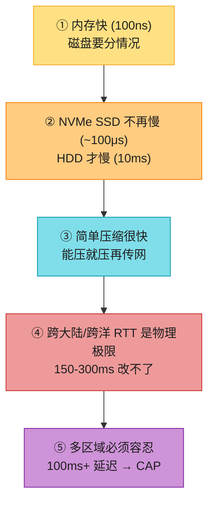
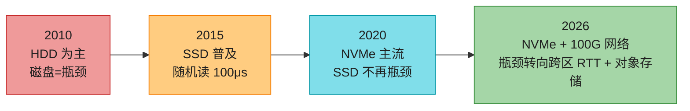
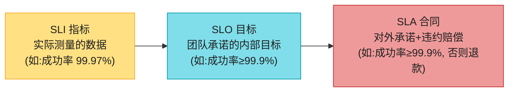
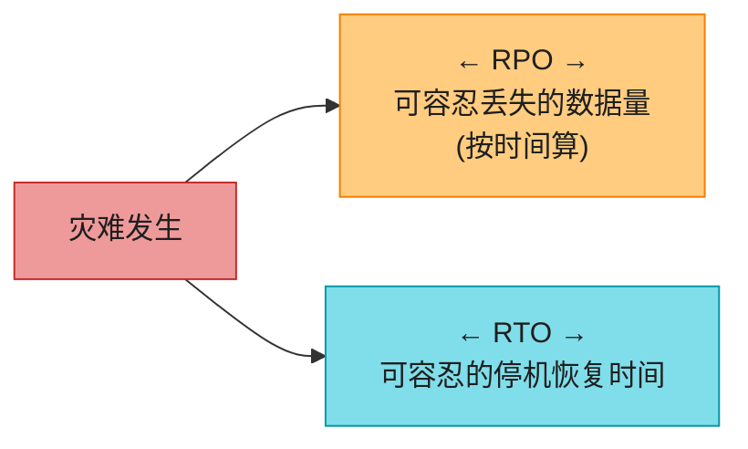
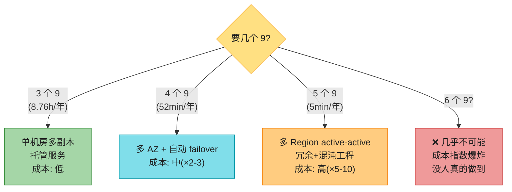
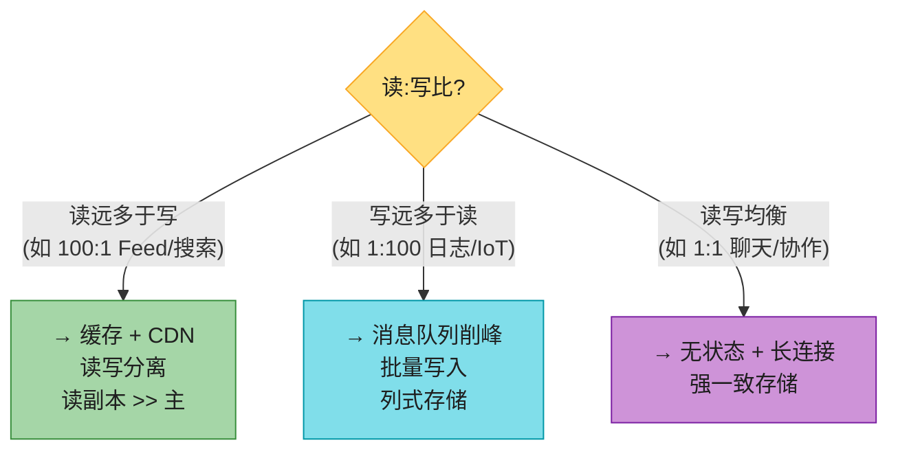
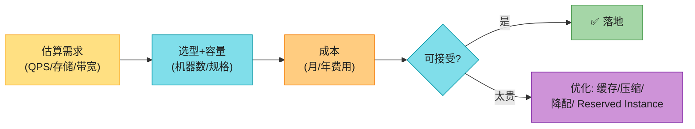
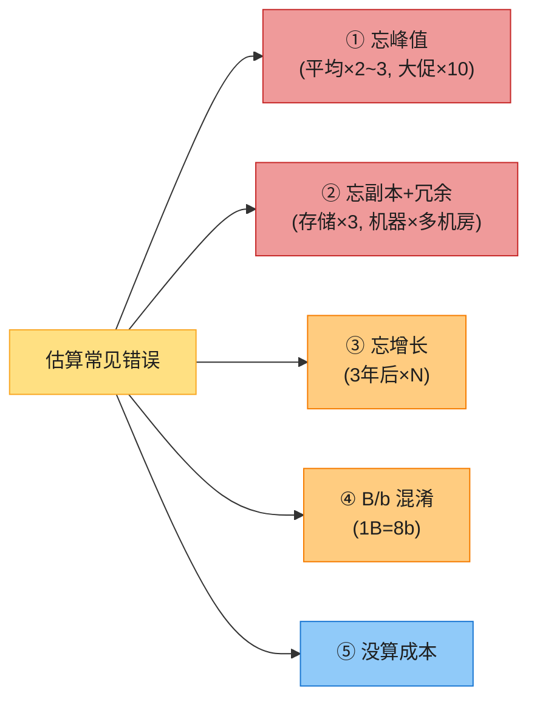
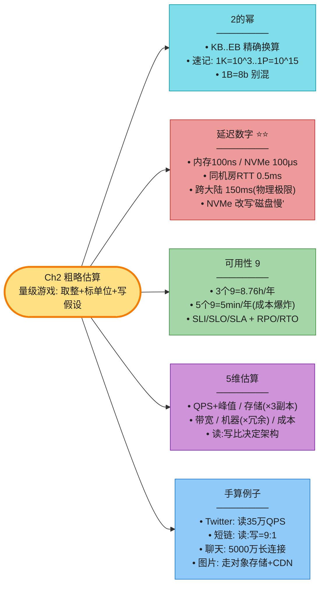

# Chapter 2: 粗略估算 (Back-of-the-Envelope Estimation)

> *"Back-of-the-envelope calculations are estimates you create using a combination of thought experiments and common performance numbers to get a good feel for which designs will meet your requirements."* — Jeff Dean, Google Senior Fellow

**本章是面试第 1 步的硬通货。** 面试官让你"设计 X",你回答前必先问规模,然后**当场估算 QPS / 存储 / 带宽 / 机器数 / 成本**。这本是 Google 工程师的基本功(Jeff Dean 名言),也是面试**最容易拉开差距**的环节——多数人能讲架构,但讲不清"到底要几台机器、花多少钱"。

> **本章和原书的区别**:原书只给了 2 的幂 + 一张 2010 年延迟表 + 一个 Twitter 例子。本章补:**2026 版延迟数字(NVMe 改写了结论)**、**完整 6 维估算方法论**、**4 个手算例子**、**读:写比决策**、**量级感训练**。看完你能当场算任何题。

---

## 🎯 面试怎么答(被问到"估算一下规模"时)

### 开场话术(直接背)

> "我先列假设,再分 **QPS、存储、带宽、机器数、成本** 五块估。所有数字我都标单位、用整数近似,峰值乘 2-3。"

### 估算 5 步法


> 💡 **关键原则**(原书 Tips,强化版):
> 1. **取整近似**:`99987/9.1` 直接算成 `100000/10`。面试不要算精确值。
> 2. **写下假设**:每个假设写在白板上,后面回查。
> 3. **永远标单位**:写 `5` 没意义,写 `5 MB` 才清楚。
> 4. **峰值 = 平均 ×2~3**:大促 ×10。**面试官最爱抓你忘了峰值**。
> 5. **存储要算副本**:×3 副本 + 备份。
> 6. **算成本**:机器数 × 单价,云时代这是 senior 必答。

---

## 🗺️ 章节概览

| 小节 | 要记的东西 | 重要性 |
|------|-----------|--------|
| 2 的幂 | KB/MB/GB/TB/PB/EB 精确换算 | ⭐⭐ |
| **延迟数字** | 内存/SSD/网络/跨机房 量级(**2026 修正版**) | ⭐⭐⭐⭐⭐ |
| 可用性数字 | 几个 9 = 多少停机;SLA/SLO/SLI;RPO/RTO | ⭐⭐⭐ |
| 估算方法论 | 5 步法 + 读:写比 | ⭐⭐⭐⭐ |
| 手算例子 | Twitter / 短链 / 聊天 / 图片 | ⭐⭐⭐⭐ |

---

## 1. 2 的幂 (Power of Two)

容量单位用 2 的幂(不是 10 的幂)。**必须背到 PB**:

| 单位 | 2 的幂 | 近似值 | 面试速记 |
|------|--------|--------|---------|
| 1 KB | 2^10 | 1,024 B | ≈ 10^3(千字节) |
| 1 MB | 2^20 | 1,048,576 B | ≈ 10^6(百万) |
| 1 GB | 2^30 | ~10^9 B | ≈ 10^9(十亿) |
| 1 TB | 2^40 | ~10^12 B | ≈ 10^12(万亿) |
| 1 PB | 2^50 | ~10^15 B | ≈ 10^15 |
| 1 EB | 2^60 | ~10^18 B | ≈ 10^18 |

> 💡 **面试速记口诀**:`1K=10^3 · 1M=10^6 · 1G=10^9 · 1T=10^12 · 1P=10^15 · 1E=10^18`。估算是量级游戏,近似到 10 的幂就够。

> 📝 **名词注释**
> - **1 byte = 8 bits**;1 个 ASCII 字符 = 1 byte,1 个 UTF-8 中文 ≈ 3 byte。
> - **存储用 Byte(B)**,**带宽用 bit per second(bps)**——**小写 b = bit,大写 B = byte**。`100 Mbps` 的网络 = `12.5 MB/s`(÷8)。面试算带宽别混。
> - **十进制 vs 二进制前缀**:硬盘厂商用十进制(1KB=1000B),内存用二进制(1KB=1024B)。估算无所谓,统一用 2 的幂。

---

## 2. 延迟数字(本章重头戏)⭐⭐⭐⭐⭐

这是面试**最常考、最能区分人**的一组数字。原书用的是 Jeff Dean 2010 版 + 2020 更新版。**但 2020 版的"磁盘慢"结论在 NVMe 时代已经部分失效**,下面给你 2026 修正版。

### 原书引用的 2020 版(Jeff Dean 经典数字)

| 操作 | 延迟(2020) | 量级感 |
|------|------------|--------|
| L1 缓存引用 | 0.5 ns | |
| 分支预测错误 | 3 ns | |
| L2 缓存引用 | 7 ns | |
| 互斥锁加/解锁 | 25 ns | |
| 主存引用 | 100 ns | **基准** |
| Zippy 压缩 1 KB | 3 μs | 3000 ns |
| 1 Gbps 网络发 1 KB | 10 μs | 10000 ns |
| **SSD 随机读 4 KB** | **150 μs** | 150000 ns |
| 内存顺序读 1 MB | 57 μs | |
| **同机房往返 (RTT)** | **500 μs** | 0.5 ms |
| **跨机房(加州→荷兰)往返** | **150 ms** | |
| HDD 随机寻道 | 10 ms | |
| 从 SSD 顺序读 1 MB | 1 ms | |
| 从网络顺序读 1 MB | 10 ms | |
| 从 HDD 顺序读 1 MB | 30 ms | |

### 2026 修正版(面试用这个更专业)

| 操作 | 2026 延迟 | 和原书的差异 | 面试要点 |
|------|----------|------------|---------|
| L1 / L2 缓存 | 1 / 4 ns | 没变(物理极限) | CPU 缓存比内存快 100× |
| 主存引用 (DRAM) | ~100 ns | 没变 | **所有估算的基准锚点** |
| **NVMe SSD 随机读 4 KB** | **~100 μs** | 和原书 SSD 接近,但**队列优化后更稳** | **SSD 不再是瓶颈** |
| **HDD 随机寻道** | **~10 ms** | **依然慢**(机械寻道,物理极限) | **机械盘才是"磁盘慢"的真凶** |
| 同机房 RTT | 0.1–0.5 ms | 略快(25/100 Gbps 网络) | 服务间调用按 0.5ms 估 |
| 100 Gbps 发 1 MB | ~0.1 ms | **快 10×**(带宽升级) | 现代数据中心内部带宽很便宜 |
| **跨大陆 RTT(中美)** | **150–200 ms** | **没变**(光速物理极限) | 多区域架构必须容忍 |
| **跨洋(全球最远)** | **200–300 ms** | **没变** | 这是地球的极限 |
| **对象存储(S3)GET 首字节** | **20–100 ms** | 新增(云时代必备) | 数仓/湖的基石延迟 |
| LLM API 调用(首 token) | 500–3000 ms | 新增(AI 时代必备) | AI 功能的延迟基准 |

### 5 条结论(原书,强化 + 修正)



1. **内存快,磁盘要分情况**:DRAM ~100ns;**NVMe SSD ~100μs(慢内存 1000×,可接受)**;HDD 寻道 ~10ms(慢内存 10 万×,真慢)。
2. **NVMe 改写了"磁盘慢"**:2026 的 OLTP 数据库跑 NVMe,瓶颈在网络不在磁盘。
3. **简单压缩算法很快**:Zippy/zstd 压缩 1KB 只要几 μs,值得。
4. **能压缩就压缩,再走网络**:网络是稀缺资源。
5. **跨大陆/跨洋 RTT 是物理极限**(光速),再快也降不下来。

> 🔄 **2026 现代版话术**(被问"你估算里磁盘延迟用多少"):
> "看介质:**NVMe SSD 随机读 ~100μs,机械盘 HDD ~10ms**——差 100 倍,不能笼统说'磁盘慢'。我的设计默认用 NVMe,只有冷数据归档用 HDD 或对象存储。这是 2020 之后最大的认知更新。"

> 🪤 **追问陷阱**(高频):"为什么跨大陆延迟 150ms 改不了?" → "**光速物理极限**。光在光纤里绕地球一圈理论 ~130ms,实际光纤折射 + 路由 ~200ms。这就是 CAP 定理里 P(网络分区)的根源——多区域架构必须假设跨区延迟 100ms+。"

---

#### 深入:延迟数字的演进 + 怎么在面试里用 ⭐⭐

**演进趋势(2010 → 2026)**:



**面试里怎么用延迟数字(3 个典型场景)**:

| 场景 | 用哪个数字 | 话术 |
|------|----------|------|
| 估算"缓存 vs DB"的收益 | DRAM 100ns vs NVMe 100μs | "缓存比 DB 快 1000 倍,所以热点数据必须进 Redis" |
| 估算"同机房服务调用链" | 同机房 RTT 0.5ms | "10 个服务串行调用 = 5ms,所以要并行化或合并" |
| 估算"全球用户延迟" | 跨大陆 150-200ms | "全球用户必须用多 Region + CDN,单 Region 拒绝服务" |

**量级感训练(背下来,面试能脱口而出)**:

- **ns 级**:CPU 缓存、寄存器
- **μs 级**:内存、SSD 随机读
- **ms 级**:同机房网络、HDD 寻道、跨城网络
- **百 ms 级**:跨大陆网络、对象存储 GET
- **秒级**:跨洋网络最远点、LLM 推理

> 💡 **面试官最爱问的"快多少倍"**(背熟):
> - 内存 vs NVMe SSD:**1000×**(100ns vs 100μs)
> - NVMe SSD vs HDD:**100×**(100μs vs 10ms)
> - 同机房 vs 跨大陆:**300×**(0.5ms vs 150ms)
> - 内存 vs HDD:**10 万×**(100ns vs 10ms)

---

## 3. 可用性数字 (Availability)

可用性 = 系统正常运行时间的百分比。**几个 9 对应多少停机时间**(必背):

| 可用性 | 年停机 | 月停机 | 日停机 | 典型 |
|--------|--------|--------|--------|------|
| 99%(2 个 9) | 3.65 天 | 7.3 小时 | 14.4 分钟 | 内部工具 |
| 99.9%(3 个 9) | 8.76 小时 | 43.8 分钟 | 1.44 分钟 | **云厂商底线** |
| 99.95% | 4.38 小时 | 21.9 分钟 | 43 秒 | 托管 DB |
| 99.99%(4 个 9) | 52.6 分钟 | 4.38 分钟 | 8.6 秒 | 核心业务 |
| 99.999%(5 个 9) | 5.26 分钟 | 25.9 秒 | 0.86 秒 | 金融、电信 |

### SLA / SLO / SLI(原书只讲 SLA,补全)



| 概念 | 含义 | 谁定 |
|------|------|------|
| **SLI (Service Level Indicator)** | 实际测量的指标(成功率、延迟、可用性) | 监控系统 |
| **SLO (Service Level Objective)** | 团队**内部**承诺的目标(比 SLA 严) | 工程团队 |
| **SLA (Service Level Agreement)** | **对外合同**,违约要赔偿 | 商务/法务 |

> 💡 **关系**:SLI(实测)→ 对比 SLO(内部目标)→ 兜底 SLA(对外合同)。**SLO 通常比 SLA 严**(留安全余量)。

### RPO / RTO(灾难恢复,高级岗必问)



| 概念 | 含义 | 典型 |
|------|------|------|
| **RPO (Recovery Point Objective)** | 灾难后**最多丢多少数据**(时间窗口) | 异步复制 RPO=秒级;同步复制 RPO=0 |
| **RTO (Recovery Time Objective)** | 灾难后**多久恢复服务** | 单机房分钟级;多区域秒级 |

> 🪤 **追问陷阱**:"你的系统 RPO 和 RTO 各是多少?" → "看场景:**金融用 RPO=0(同步复制)+ RTO<1min(多区域)**;**社交可接受 RPO=秒级(异步)+ RTO=分钟级**。这是 Ch1 第 6 集 CAP 取舍的具体体现。"

---

#### 深入:几个 9 的代价(为什么不止于 5 个 9)⭐



> 💡 **关键认知**:从 3 个 9 到 5 个 9,**成本指数级上升,但收益边际递减**。**面试要主动说"不是所有系统都要 5 个 9——按业务分级,核心交易 4 个 9,边缘功能 3 个 9 即可,这是成本最优"**。盲目追求高可用 = over-engineering。

---

## 4. 估算方法论(原书只有 Tips,这里给完整方法)

### 5 维估算(背熟)

| 维度 | 公式 | 关键点 |
|------|------|--------|
| **QPS** | DAU × 人均操作 / 86400 | 区分读 QPS / 写 QPS |
| **峰值 QPS** | 平均 QPS × 2~3(大促 ×10) | **必算,面试必抓** |
| **存储** | 日增量 × 天数 × 副本数 | 副本 ×3,备份另算 |
| **带宽** | QPS × 单次大小 × 8(bps) | 上行/下行分开,注意 B vs b |
| **机器数** | max(QPS/单机QPS, 存储/单机存储) × 冗余系数 | 冗余 ×1.5~2 |
| **成本** | 机器数 × 单价 × 时长 | senior 必答 |

### 读:写比——架构决策的隐含前提(原书没讲)⭐



> 💡 **读:写比是面试的"隐形考点"**——估算完 QPS,你要主动说"读:写 = 100:1,所以架构重点在缓存层"。这一句直接展示你懂架构决策。

### 容量规划闭环



---

## 5. 完整手算例子(4 个,背熟套路)

### 例 1:Twitter 估算(原书招牌)

**假设**:月活 3 亿 · 50% 日活 · 人均 2 推/天 · 10% 含媒体 · 存 5 年

**QPS 估算**:
```
DAU = 3亿 × 50% = 1.5亿
写 QPS = 1.5亿 × 2 / 86400 ≈ 3500
峰值写 QPS = 3500 × 2 ≈ 7000
读 QPS(读:写 = 100:1)= 3500 × 100 = 350000
```

**存储估算(只算媒体)**:
```
单推媒体:1 MB
日增 = 1.5亿 × 2 × 10% × 1MB = 30 TB/天
5 年 = 30TB × 365 × 5 ≈ 55 PB
含 3 副本 = 55 × 3 ≈ 165 PB
```

**带宽估算(下行)**:
```
读 QPS × 媒体大小 = 350000 × 1MB = 350 GB/s = 2.8 Tbps
→ 这就是必须用 CDN 的原因(DB 直接扛必爆)
```

**机器数**:
```
读:单机 10k QPS → 350000/10000 = 35 台(纯算力)
含冗余多机房 ×5 ≈ 175 台
存储:55PB / 单机 10TB = 5500 台 × 3 副本 ≈ 1.6 万台
```

### 例 2:短链服务(我补)

**假设**:日活 1 亿 · 人均 5 次点击短链 · 10% 创建短链 · 短链存 10 年

```
写 QPS = 1亿 × 5 × 10% / 86400 ≈ 600
读 QPS = 1亿 × 5 × 90% / 86400 ≈ 5200(读:写 ≈ 9:1)
峰值 = ×3 ≈ 1.5万 读 QPS

存储:每条短链 long_url + short_url ≈ 500B
日增 = 600 × 86400 × 500B ≈ 25 GB/天
10 年 ≈ 90 TB(含副本 ×3 = 270 TB)

机器:读 5200 QPS,单 KV 节点 50k QPS → 1 台够,实际多副本 3-5 台
```

> 💡 **结论**:短链是小系统,**读:写≈9:1,重点是缓存 + KV 存储**,不是分布式难题。详见 Ch8。

### 例 3:聊天系统(我补)

**假设**:5000 万 DAU · 人均 50 条消息 · 每条 200B · 离线 7 天 · 群聊平均 10 人

```
写 QPS = 5000万 × 50 / 86400 ≈ 29000
峰值 = ×2 ≈ 58000(早高峰)
读 QPS(群聊扩散)= 29000 × 10 = 290000

存储 = 29000 × 86400 × 200B ≈ 500 GB/天
7 天 ≈ 3.5 TB(消息体小,但索引/元数据更大)

机器:写 58000 QPS,长连接 5000 万 → 单机扛 10万连接 → ~500 台 WebSocket 服务器
```

> 💡 **结论**:聊天**难点在长连接数(5000 万并发)和消息扩散(群聊)**,不是存储。详见 Ch12。

### 例 4:图片/视频存储(我补)

**假设**:日活 2000 万 · 5% 用户上传 · 人均 5 张图 · 每张 1 MB · 存 5 年

```
写 = 2000万 × 5% × 5 = 500万张/天
日增存储 = 500万 × 1MB = 5 TB/天
5 年 = 5TB × 365 × 5 ≈ 9 PB × 3 副本 ≈ 27 PB

→ 用对象存储(S3),不用数据库
→ 加 CDN 加速读
```

---

#### 深入:常见估算错误 + 量级感(面试官吐槽点)⭐



**面试官最爱抓的 5 个错**(对照检查):
1. **忘了峰值**:平均 QPS 算完就停 → 被问"大促怎么办"时卡壳。
2. **忘了副本和冗余**:存储算完是裸值 → 实际 ×3 副本 + 备份 + 多机房。
3. **忘了增长**:只算当前 → 被问"3 年后呢"卡壳。
4. **B 和 b 混淆**:带宽 100Mbps 算成 100MB/s(差 8 倍)。
5. **没算成本**:只算技术指标 → senior 岗必问"月成本多少"。

**量级感(背熟,脱口而出)**:

| 量级 | 直觉 |
|------|------|
| 1 万 QPS | 单机轻松(nginx + 简单逻辑) |
| 10 万 QPS | 单机扛不住,要 LB + 多机 |
| 100 万 QPS | 大型应用,要缓存 + CDN + 分片 |
| 1000 万 QPS | 超大规模(双十一、春晚),要全链路优化 |

---

## 💻 估算速查代码(Python,可现场口算)

```python
# 面试估算模板:写下来,逐步算
DAU = 150_000_000            # 日活
per_user_per_day = 2         # 人均操作次数
seconds_per_day = 24 * 3600

qps = DAU * per_user_per_day / seconds_per_day
peak_qps = qps * 2
read_qps = qps * 100         # 读:写 = 100:1
print(f"写 QPS={qps:,.0f}, 峰值={peak_qps:,.0f}, 读 QPS={read_qps:,.0f}")

# 存储
media_pct, media_size, years = 0.10, 1<<20, 5
daily = DAU * per_user_per_day * media_pct * media_size
total = daily * 365 * years * 3   # ×3 副本
print(f"5y 存储(含3副本) = {total/1024**4:,.1f} TB")

# 带宽(下行, bps)
bw_bps = read_qps * media_size * 8
print(f"下行带宽 = {bw_bps/1e12:,.1f} Tbps → 必须用 CDN")

# 成本(粗估: EC2 ~$0.1/h)
machines = read_qps / 10000 * 5   # 单机10k QPS, ×5冗余
monthly = machines * 24 * 30 * 0.1
print(f"读层机器 ~{machines:.0f} 台, 月成本 ~${monthly:,.0f}")
```

---

## ⚠️ 已过时 / 书里没说(2020 → 2026)

| 原书 | 2026 现状 | 面试应对 |
|------|----------|---------|
| 延迟数字 2010/2020 版 | NVMe 改写"磁盘慢";100Gbps 网络;对象存储;LLM 延迟 | 用 2026 修正版表,主动说"SSD 已不是瓶颈" |
| 只估 QPS 和存储 | 现代面试还估**带宽、机器数、成本** | 主动补 5 维估算 |
| 没提"读:写比" | **读:写比是架构决策核心** | 主动说"读多→缓存;写多→队列" |
| 没提成本 | 云时代**成本估算 = 财务规划** | 估算末尾加成本(机器×单价) |
| 没提 RPO/RTO | 灾难恢复高级追问 | 主动说 RPO/RTO,接 CAP |
| 没提 SLI/SLO | Google SRE 标配 | 区分 SLI/SLO/SLA |

---

## 🪤 追问陷阱(连环问)

1. **"100 Gbps 网络发 1MB 多久?"** → `1MB=8Mb`,`8Mb/100Gbps=0.08ms`。别算成 1ms。
2. **"NVMe SSD 随机读比内存慢多少倍?"** → ~100μs vs ~100ns = **慢 1000 倍**(原书 HDD 时代是 10 万倍,**这是关键修正**)。
3. **"跨美东↔欧洲延迟?"** → ~80-100ms;**美东↔亚洲 ~200ms**。
4. **"3 个 9 和 4 个 9 差多少?"** → 年停机从 8.76h 降到 52min,**差 10 倍**,成本指数级上升。
5. **"你估算没考虑增长,3 年后怎样?"** → 主动说"×增长系数,3 年后存储可能 ×3,要提前规划 reshard"。
6. **"这套架构月成本多少?"** → 机器数 × 单价(EC2 ~$0.1/h)+ 存储($0.023/GB/月)+ 带宽($0.09/GB)。
7. **"RPO 和 RTO 各多少?"** → 看场景:金融 RPO=0/RTO<1min;社交 RPO=秒/RTO=分钟。

---

## 🏭 生产级速查表

| 资源 | 单机容量(2026 典型) | 面试估算用 |
|------|---------------------|-----------|
| CPU | 32-64 核 | 算力服务 10k-50k QPS/核 |
| 内存 | 128-512 GB | 缓存单机 100GB-1TB |
| NVMe SSD | 1-8 TB,随机读 100μs | 数据库单机 1-8TB |
| 网络带宽 | 10-100 Gbps | 单机 ~10k 并发连接 |
| 对象存储 | 无限,$0.023/GB/月 | 冷数据、媒体 |
| Redis 单实例 | 10万 QPS | 缓存估算基准 |
| Kafka 单分区 | 10万 msg/s 或 10MB/s | 消息吞吐基准 |

---

## 📝 本章要点总结



**核心 Takeaways**:

1. **估算考的是过程,不是结果**——写出每步假设,取整近似,标单位。
2. **延迟数字背 2026 修正版**:NVMe SSD 已改写"磁盘慢";跨大陆 RTT 150ms 是物理极限。
3. **可用性 9 + RPO/RTO**:3 个 9 是云厂商底线,5 个 9 要多区域双活,成本指数级。
4. **必估 5 维**:QPS(含峰值)、存储(含副本)、带宽、机器数(含冗余)、成本。
5. **读:写比决定架构**——读多缓存,写多削峰,这是 Ch4-15 所有设计题的隐含前提。
6. **量级感**:1万/10万/100万/1000万 QPS 对应单机/LB/缓存/全链路优化。

> 🔗 **连接下一章**:Ch2 教你"算规模";**Ch3 教你"拿着规模,怎么在 45 分钟里组织一场系统设计面试"**——框架是流程,估算是流程里 Step 1-2 的一环。
