# Chapter 3: 系统设计面试框架 (A Framework for System Design Interviews)

> 📑 **导航**:[← 估算](ch1_02-粗略估算.md) · [📚 总目录](../README.md) · [限流器 →](ch1_04-设计限流器.md)
> 🔗 **相关**:[扩展入门](ch1_01-从零扩展到百万用户.md) · [权衡原则](../SDA/aws_01-系统设计权衡与原则.md)

> *"The final design is less important compared to the work you put in the design process."* — 原书
>
> **本章是全书最重要的一章。** Ch1 教你架构怎么长、Ch2 教你怎么算、Ch4-15 教你具体题——但**怎么把这 45 分钟组织得让面试官点头**,只有 Ch3 教。很多人系统知识够,但面试挂,就是因为**没有框架**:要么抢答、要么钻细节、要么中途死寂。

本章给你一个**4 步法 + 时间分配 + 可背剧本 + 自救话术**,背熟它,你就有了所有系统设计面试的通用骨架。

---

## 🎯 面试怎么答(这一章本身就是"怎么答")

### 先理解系统设计面试的本质(原书核心,必背)

> 系统设计面试**不是**知识竞赛,**不是**让你在 1 小时里造出真 Google。
> 它是**模拟两个同事协作解决一个模糊问题**。开放、没标准答案。**过程 > 结果**。

### 面试官在评估什么(评分维度,背熟)

```mermaid
flowchart TD
    ROOT["面试官采集的信号"] --> A["技术设计能力<br/>(架构 / 取舍 / 深度)"]
    ROOT --> B["协作能力<br/>(把面试官当队友)"]
    ROOT --> C["抗压能力<br/>(卡住时不慌)"]
    ROOT --> D["解决模糊性<br/>(主动澄清)"]
    ROOT --> E["提问能力<br/>(问对问题)"]

    ROOT2["🚩 红旗(扣分项)"] --> F1["过度工程<br/>(为纯净忽略取舍)"]
    ROOT2 --> F2["抢答不思考<br/>(Jimmy 综合征)"]
    ROOT2 --> F3["钻牛角尖<br/>(时间失控)"]
    ROOT2 --> F4["沉默思考<br/>(没信号)"]
    ROOT2 --> F5["固执<br/>(不接受反馈)"]

    style ROOT fill:#FFE082,stroke:#F9A825,color:#1f1f1f
    style A fill:#A5D6A7,stroke:#388E3C,color:#1f1f1f
    style B fill:#A5D6A7,stroke:#388E3C,color:#1f1f1f
    style C fill:#A5D6A7,stroke:#388E3C,color:#1f1f1f
    style D fill:#A5D6A7,stroke:#388E3C,color:#1f1f1f
    style E fill:#A5D6A7,stroke:#388E3C,color:#1f1f1f
    style ROOT2 fill:#EF9A9A,stroke:#C62828,color:#1f1f1f
    style F1 fill:#FFCDD2,stroke:#C62828,color:#1f1f1f
    style F2 fill:#FFCDD2,stroke:#C62828,color:#1f1f1f
    style F3 fill:#FFCDD2,stroke:#C62828,color:#1f1f1f
    style F4 fill:#FFCDD2,stroke:#C62828,color:#1f1f1f
    style F5 fill:#FFCDD2,stroke:#C62828,color:#1f1f1f
```

> 💡 **最重要的红旗 = 过度工程 (over-engineering)**。原书原话:"Over-engineering is a real disease of many engineers"。**面试官最怕你为"设计纯净"忽略取舍**。主动说"这里我简化了,因为 X;生产环境要考虑 Y",比堆砌高级组件得分高。

> 🪤 **最大的 DON'T = 沉默思考**。算法面试可以安静 5 分钟,系统设计**绝对不行**——面试官看不到思路 = 没信号 = 低分。**全程出声思考,画图时也自言自语**。

---

## 🗺️ 4 步法总览(背熟时间分配)

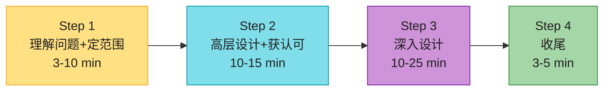

> ⚠️ **45 分钟是黄金分割**——很多人在 Step 1 浪费太久(纠结需求),或跳过 Step 1 直接 Step 3(钻细节)。**严格按时间走**是面试官给你的隐性信号之一。

---

## Step 1:理解问题,确定设计范围(3-10 分钟)

### 核心心法:别当 Jimmy

原书故事:班里有个叫 Jimmy 的孩子,问题一出就抢答,不管对错。**DON'T be like Jimmy**。

> 系统设计面试**抢答零加分**。没搞清需求就给方案 = 巨大红旗。**没有标准答案**。

### 怎么做:问 4 类问题

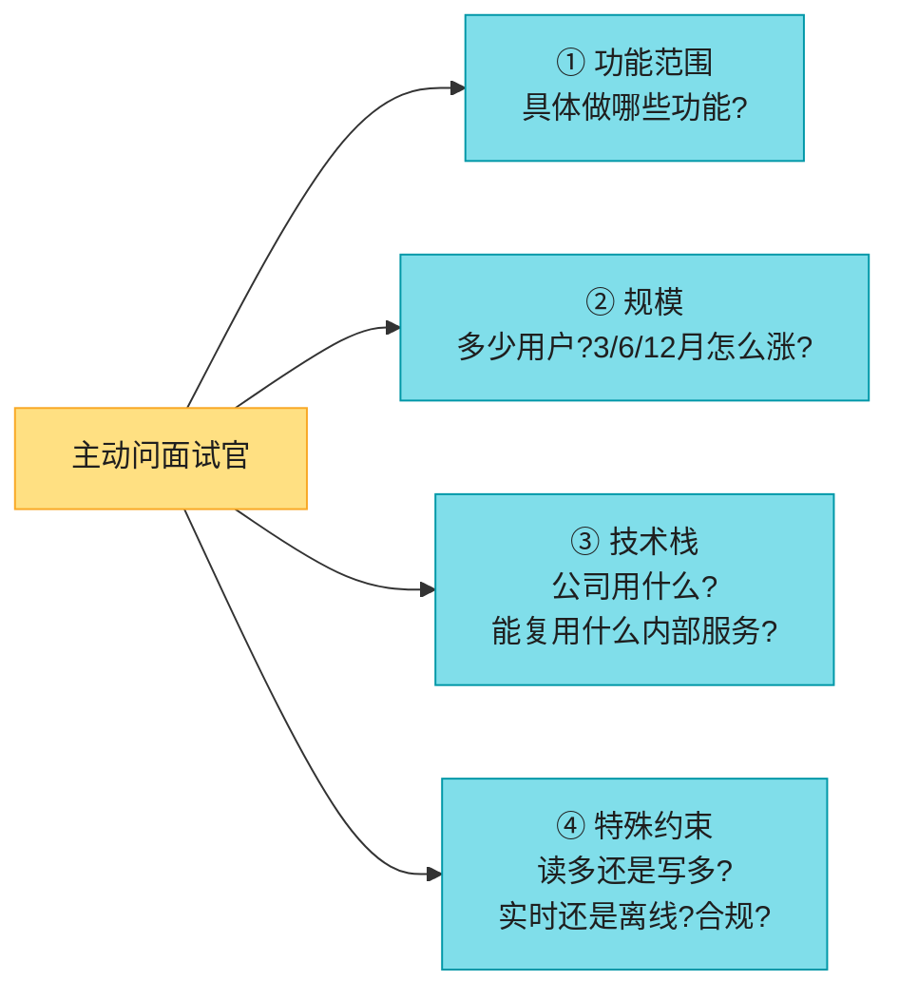

### 话术模板(以"设计 News Feed"为例,原书对话)

| 你 | 面试官 |
|----|-------|
| "是 mobile、web 还是都要?" | "都要" |
| "最重要的功能是什么?" | "发帖 + 看 feed" |
| "Feed 按时间倒序,还是有权重排序?" | "简化,按时间倒序" |
| "一个用户最多多少好友?" | "5000" |
| "流量规模?" | "1000 万 DAU" |
| "Feed 能含图片/视频吗?" | "可以含媒体" |

> 💡 **这一步的目标**:把"设计 X"收敛成**具体、可设计的边界**。问完后,双方对"做什么、多大、约束是什么"达成一致。

> 🪤 **追问陷阱**:面试官可能反问"你觉得呢?"——这时**给出假设并写在白板上**(后面回查),而不是继续追问到烦。

### 不同岗位在 Step 1 的差异

| 岗位 | Step 1 重点 |
|------|------------|
| 初级 (L3/L4) | 问清功能 + 规模 |
| 高级 (L5/L6) | + 问清**非功能需求**(延迟、可用性、一致性级别) |
| 资深 (L7+) | + 问清**业务约束**(成本上限、合规、多区域、团队规模) |

---

## Step 2:提出高层设计,获得 buy-in(10-15 分钟)

### 怎么做(4 个动作)

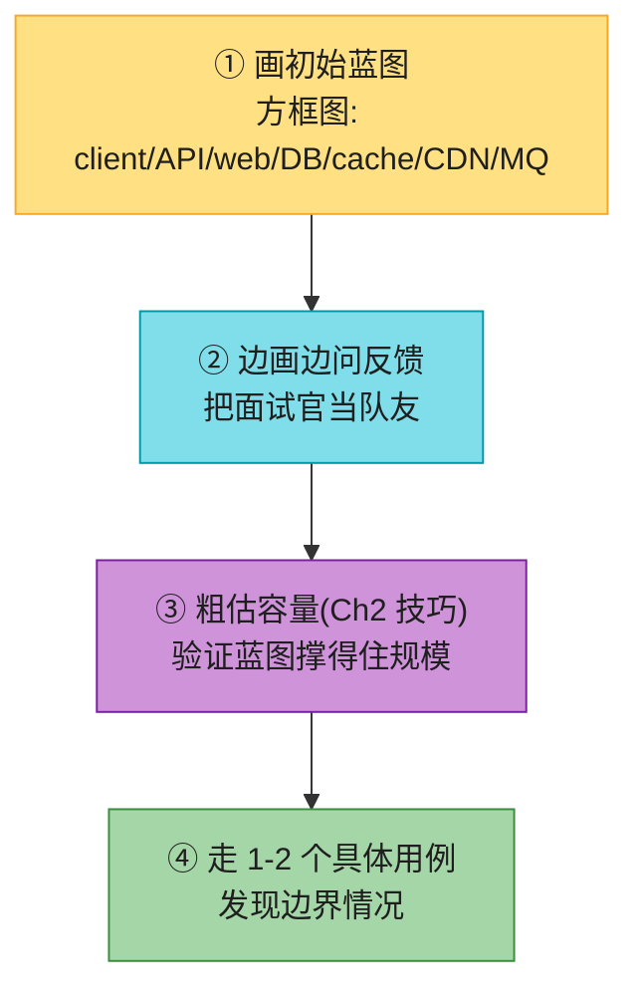

### 要不要定义 API 和 DB schema?

| 场景 | 要不要 |
|------|--------|
| 大题("设计 Google 搜索") | 不用,太底层 |
| 中小题("设计扑克游戏后端") | **要**,API + schema 是公平的 |
| 一般原则 | **问面试官**:"要不要我先定义 API 和 schema?" |

### 话术模板

> "我先用 5 分钟画个高层图,确认方向对了再深入。你看,client 这里...(画)。这层我想用 LB + 多个无状态 web...(画)。这一步方向 OK 吗?有没有要补的组件?"

> 🪤 **关键**:这一步结束时**必须和面试官达成共识(buy-in)**。如果他点头说"OK,继续",才有底气进 Step 3。**别自顾自往下走**——这是协作红旗。

---

## Step 3:深入设计(10-25 分钟)⭐ 全场最关键

到这一步,你和面试官应该已经:✅ 对功能范围达成共识 ✅ 画了高层蓝图 ✅ 收到反馈 ✅ 知道面试官想深入哪块。

### 怎么选深入哪块?(和面试官一起优先级排序)

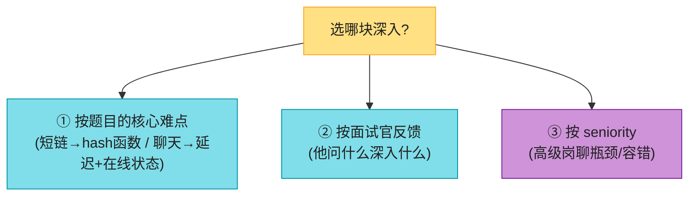

原书举例:短链 → 深入 **hash 函数**;聊天 → 深入 **降延迟** + **在线/离线状态**。

> ⚠️ **时间管理是命门**:很容易钻进一个细节出不来。原书反例:别花时间讲 Facebook EdgeRank 算法细节——这不证明你的设计能力。

### 不同岗位在 Step 3 的差异(拉开档位的关键)

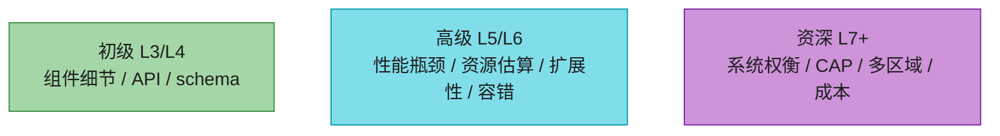

| 候选人类型 | Step 3 重点 |
|----------|------------|
| 初级 (L3/L4) | 组件细节、API、schema |
| 高级 (L5/L6) | **性能瓶颈、资源估算、扩展性、容错** |
| 资深 (L7+) | **系统权衡、CAP 取舍、多区域、成本** |

> 💡 **如果你面高级岗,Step 3 要主动聊瓶颈**(单点、热点、一致性、故障切换),而不是只画组件。**这是拉开档位的关键**。

---

## Step 4:收尾(3-5 分钟)

面试官可能追问,也可能让你自由发挥。**6 个方向**(挑 2-3 个讲):

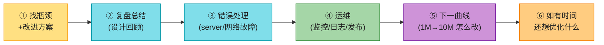

> ⚠️ **铁律**:**永远别说"我的设计完美,无可改进"**。一定有改进空间。这是展示批判性思维的最后机会。

---

## ✅ DO / ❌ DON'T(原书清单,强化)

### ✅ DO

- **总是先澄清**,别假设你的假设是对的。
- 记住:**没有唯一正确答案**——创业公司的方案 ≠ 大厂的方案。
- **思考要出声**,让面试官知道你在想什么。
- 尽量给**多个方案**,比较取舍。
- 和面试官就蓝图达成共识后,**再深入每个组件**,先做最关键的。
- **把想法抛给面试官**——好面试官会当队友。
- **永不放弃**。

### ❌ DON'T

- **别没澄清需求和假设就跳进方案**(Jimmy 综合征)。
- 别一开始就钻单个组件的细节。**先高层,再深入**。
- 卡住了**别犹豫要提示**。
- **别沉默思考**(最常见的坑!)。
- 别给出设计就觉得完事——**面试官说"完事"才算完事**。**早问反馈,勤问反馈**。

---

## 🎬 45 分钟实战剧本(可背)

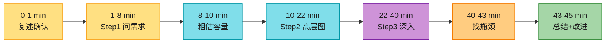

| 时间 | 动作 | 话术 |
|------|------|------|
| 0-1 min | 复述确认 | "我复述一下,你要的是..." |
| 1-8 min | Step 1 问需求 | "我先问几个问题确认范围:功能?规模?技术栈?约束?" |
| 8-10 min | 粗估容量 | "我估一下 QPS 和存储:DAU...×...≈..." |
| 10-22 min | Step 2 高层图 | "我画个高层图,你看方向对不对..." |
| 22-40 min | Step 3 深入 | "这块是核心,我深入讲讲:方案A...方案B...我选A因为..." |
| 40-43 min | 找瓶颈 | "这个设计有几个瓶颈:1.单点 2.热点..." |
| 43-45 min | 总结 + 改进 | "总结一下:...(回顾)。如果有时间我会优化..." |

> ⚠️ **每 10 分钟看一次表**。Step 1 超 10 分钟、Step 3 钻细节超过 25 分钟都是危险信号。

---

## 🖥️ 白板分区模板(隐性加分项)

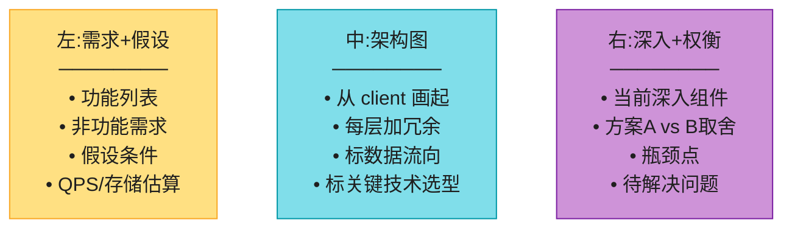

> 💡 **白板分区是隐性加分项**:面试官一眼能看清你的思路结构。混乱的白板 = 混乱的思路 = 低分。

---

#### 深入:每一步的深水区 + 卡住时怎么自救 ⭐⭐

这是原书完全没讲、但决定你能不能 hold 住现场的"急救手册"。

### Step 1 深水区:需求澄清的边界

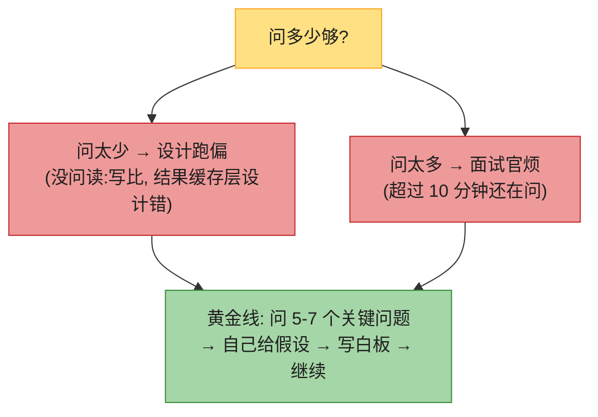

**必问清单(背熟)**:
1. 用户量级(DAU/MAU) + 增长预期
2. 核心 API / 功能列表
3. **读:写比**(决定架构!)
4. 延迟要求(实时?秒级?T+1?)
5. 一致性要求(强一致?最终一致?)
6. 可用性要求(几个 9)
7. 是否多区域/合规

### Step 2 深水区:buy-in 的话术

> 🪤 **很多人栽在"自顾自画完图,面试官不认可"**。buy-in 要这样问:
> - "这个高层方向你觉得 OK 吗?"(开放问)
> - "这块我用了 Kafka,你觉得合适吗?"(具体问)
> - "我有两个思路,A 是...B 是...,你倾向哪个?"(选择题)

### Step 3 深水区:卡住时怎么自救(最重要)⭐

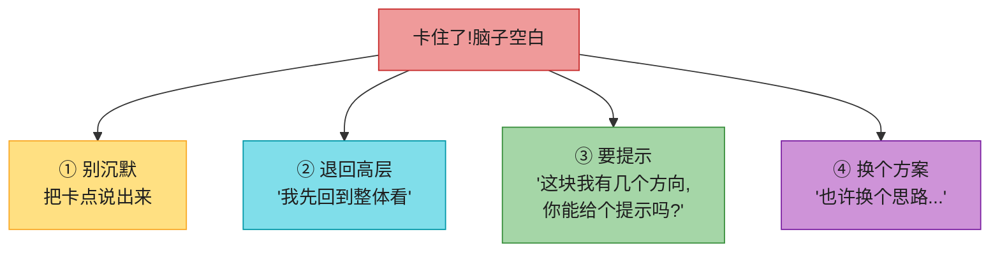

> 💡 **自救铁律**:**卡住时最忌讳沉默**。哪怕说"我理一下思路,目前卡在 X"都比沉默强。**要提示不丢人**——面试官期待你协作,不是单打独斗。原书 Don't 里也写了"If you get stuck, don't hesitate to ask for hints"。

### Step 4 深水区:找瓶颈的套路

**永远准备好 3 个瓶颈 + 改进**(背熟,被问"还有什么问题"时直接用):
1. **单点**:某组件没冗余 → 加副本/failover
2. **热点**:某 key 流量集中 → 分片/本地缓存
3. **一致性**:DB 与缓存不一致 → CDC + 延迟双删
4. **扩展性**:单库到顶 → 分片
5. **延迟**:跨区域慢 → 多 Region + CDN

---

#### 深入:常见失败模式诊断 ⭐

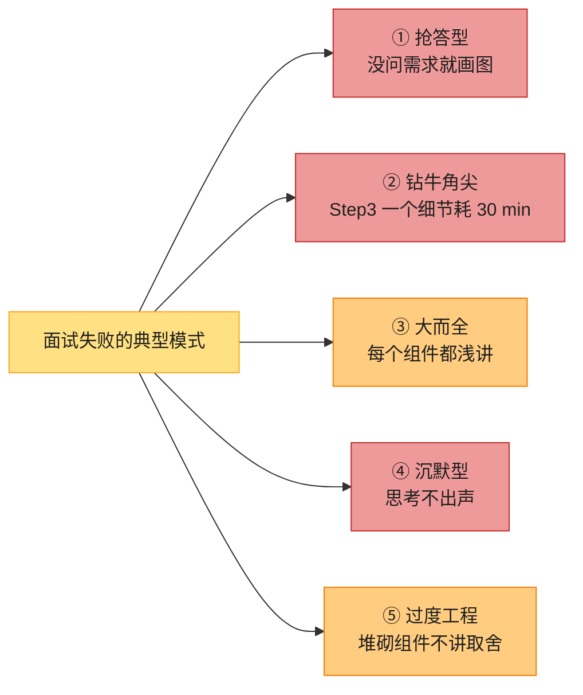

| 失败模式 | 症状 | 解药 |
|---------|------|------|
| 抢答型 | Step 1 跳过,直接画图 | 强制自己问 5-7 个问题 |
| 钻牛角尖 | Step 3 一个细节耗 30 min | 每 5 分钟看表,设时限 |
| 大而全 | 每个组件都浅讲 | **深度 > 广度**,选 1-2 个核心深入 |
| 沉默型 | 思考不出声 | 全程自言自语 |
| 过度工程 | 堆砌组件不讲取舍 | 每个组件说"为什么用 / 不用 X" |

> 💡 **最隐蔽的失败 = "大而全"**:什么都讲一点,什么都不深。**面试官要的是在一个点上挖到底**(比如限流器就深挖令牌桶 vs 滑动窗口),而不是把所有组件都点名一遍。

---

## ⚠️ 已过时 / 书里没说(2020 → 2026)

| 原书 | 2026 现状 | 面试应对 |
|------|----------|---------|
| 45 分钟标准 | 多数 **45-50 分钟**,virtual onsite 成主流 | 开场确认时长,倒推时间 |
| 白板画图 | **virtual 白板**(Excalidraw / Miro)成主流 | 提前练 Excalidraw;字写大 |
| 没提 API-first | 现代面试**期望 Step 1/2 就定义 API 合约** | 主动说"我先列 API endpoints" |
| 没提"先讲 trade-off 再选" | 高级岗**必考 trade-off 表述** | 每个关键决策给 2-3 方案 + 取舍 |
| 评分只列 5 维 | 现代还看**沟通结构、画图清晰度、时间把控** | 白板分区、勤看表 |
| 没提"先复述" | 面试官喜欢候选人**先复述问题** | 开场:"我复述一下..." |

> ⚠️ **2026 现代面试新趋势**:
> 1. **AI 工具讨论**:越来越多题问"如果用 LLM/向量库怎么做?"(Ch13 自动补全、Ch11 Feed 排序)。准备"传统方案 + ML 增强方案"两手。
> 2. **成本意识**:高级岗必问"这套架构月成本多少?"——估算里加成本。
> 3. **可观测性**:主动提 OpenTelemetry / Prometheus / 分布式追踪,显得 senior。
> 4. **容错演练**:主动聊"如果某组件挂了会怎样",展示 SRE 思维。
> 5. **Async 协作**:virtual 面试用共享文档,边打字边讲。

---

## 🪤 追问陷阱(面试官最爱的"还有呢?")

1. **"你觉得这个设计还有什么问题?"** → 永远准备好 2-3 个瓶颈 + 改进(单点、热点、一致性、扩展性)。
2. **"如果流量翻 10 倍呢?"** → 引出 reshard、读写分离、缓存层、CDN(回 Ch1 第 8 集)。
3. **"如果某个机房挂了呢?"** → 多区域 failover、CAP 取舍。
4. **"你怎么监控这个系统?"** → 4 个黄金信号(延迟、流量、错误、饱和度)+ 分布式追踪。
5. **"为什么选 A 不选 B?"** → 永远给取舍理由,不能只说"A 更好"。
6. **"你能画一下数据流吗?"** → 用时序图(sequenceDiagram)画请求链路。
7. **"卡住了怎么办?"**(元问题)→ "退回高层、要提示、换方案",展示协作姿态。

---

## 📝 本章要点总结

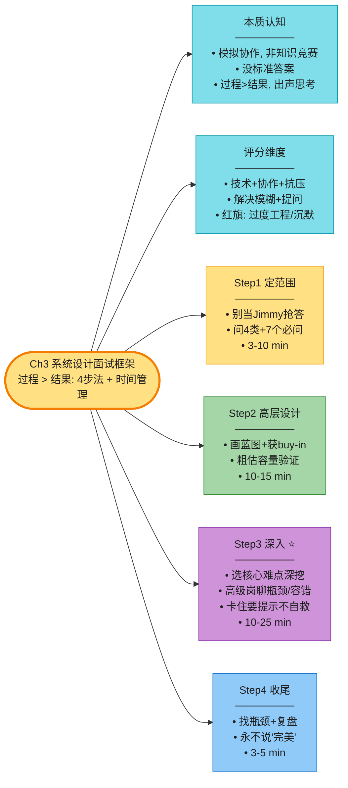

**核心 Takeaways**:

1. **系统设计面试考的是过程,不是结果**——展示你怎么思考、怎么取舍、怎么协作。
2. **4 步法背熟**:定范围(3-10)→ 高层(10-15)→ 深入(10-25)→ 收尾(3-5)。
3. **3 大致命错误**:抢答(Jimmy)、钻细节、沉默思考。
4. **最高级红旗 = 过度工程**——主动简化、主动说取舍,比堆组件得分高。
5. **卡住时最忌沉默**——退回高层、要提示、换方案;协作姿态 > 单打独斗。
6. **深度 > 广度**——选 1-2 个核心点挖到底,别"大而全"。
7. **白板分区 + 时间管理**是隐性加分——左需求、中架构、右权衡,每 10 分钟看表。

> 🔗 **连接下一章**:Ch1-3 是方法论。**Ch4 开始进入具体设计题**,第一个就是**限流器**——它是所有 API 服务的守门员,也是面试最高频的小型设计题之一。
