# Chapter 4: 设计限流器 (Design a Rate Limiter)

> 📑 **导航**:[← 面试框架](ch1_03-系统设计面试框架.md) · [📚 总目录](../README.md) · [一致性哈希 →](ch1_05-设计一致性哈希.md)
> 🔗 **相关**:[一致性哈希](ch1_05-设计一致性哈希.md) · [缓存](../SDA/aws_04-缓存策略与机制.md) · [AWS消息/IAM](../SDA/aws_12-AWS消息编排监控IAM.md)


> **本章定位**:限流器是所有 API 服务的"守门员",也是面试**最高频的小型设计题**之一。它麻雀虽小五脏俱全——考算法选择、分布式协调(Redis+Lua)、架构位置(API Gateway)、可观测性。一道题能把 Ch1-3 的功力全用上。

> **本章和原书的区别**:原书 5 种算法讲得清楚,但**分布式竞态只提了 Lua/sorted set 没讲透**、**限流位置只说 API Gateway 没提 Service Mesh**、**多级限流/滑动窗口的 Redis 实现没给代码**。本章补齐,并加**令牌桶手算 + 5 种算法决策表 + 时钟回拨 + 实际场景**。

---

## 🎯 面试怎么答(被问到"设计一个限流器"时)

**开场话术**(直接背):

> "我先确认范围:① 限流粒度(用户/IP/API)?② 单机还是分布式?③ 限流后怎么反馈(429+header)?④ 限流放在哪(应用/API Gateway)?然后我按 **算法选型 → 架构 → 分布式协调 → 监控** 四块讲。"

**4 步推进**:

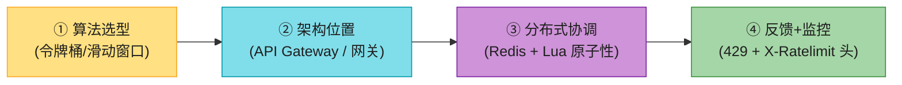

> 💡 **Step 1 必问**:限流维度(user_id / IP / API endpoint / 全局)?这决定 bucket 怎么设计。**别假设——问清楚**。

---

## 🗺️ 章节概览

| 小节 | 要点 | 重要性 |
|------|------|--------|
| 为什么限流 | 防 DoS / 降成本 / 防过载 | ⭐⭐ |
| 限流放哪 | client / server / API Gateway / Service Mesh | ⭐⭐⭐ |
| **5 种算法** | 令牌桶/漏桶/固定窗口/滑动窗口日志/滑动窗口计数 | ⭐⭐⭐⭐⭐ |
| 高层架构 | Redis(INCR+EXPIRE) + middleware | ⭐⭐⭐ |
| **分布式竞态** | Lua 脚本 / sorted set 保原子性 | ⭐⭐⭐⭐ |
| 限流头 | 429 + X-Ratelimit-* | ⭐⭐ |
| 监控 | 算法是否有效、规则是否太严/太松 | ⭐⭐ |

---

## 1. 为什么需要限流(3 个收益,背熟)

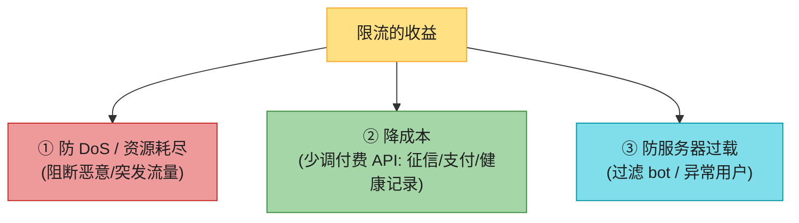

**真实例子(背当论据)**:
- Twitter:每用户 3 小时最多 300 条推文。
- Google Docs API:每用户 60 秒最多 300 次读。
- Stripe / AWS:付费 API 按 call 计费,限流 = 直接省钱。

---

## 2. 限流放在哪里?⭐

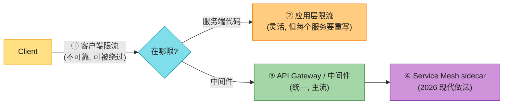

| 位置 | 优点 | 缺点 | 适用 |
|------|------|------|------|
| **客户端** | 早阻断 | **不可靠**(客户端可伪造/不受控) | 辅助手段 |
| **应用代码** | 完全控制算法 | 每个服务要重写 | 算法特殊 |
| **API Gateway / 中间件** | **统一管理**,解耦业务 | 受 gateway 支持的算法限制 | **主流** |
| **Service Mesh sidecar** | 服务间通信也限流,无侵入 | 复杂 | 2026 大厂 |

> 🔄 **2026 现代版话术**(原书只说 API Gateway):
> "限流位置我会**分两层**:① 入口流量在 **API Gateway**(Kong/APISIX/AWS API Gateway)统一限;② 服务间调用在 **Service Mesh sidecar**(Envoy/Istio)限——这是 2026 大厂标配,业务代码零侵入。原书只提了第一层。"

> 🪤 **追问陷阱**:"限流放 gateway 还是应用?" → 答:**公司技术栈 + 算法需求**。用现成 gateway 算法够就放 gateway(省事);要自定义算法放应用;大厂两层都做。

---

## 3. 五种限流算法 ⭐⭐⭐⭐⭐(本章核心)

### 算法 1:令牌桶 (Token Bucket)——主流首选

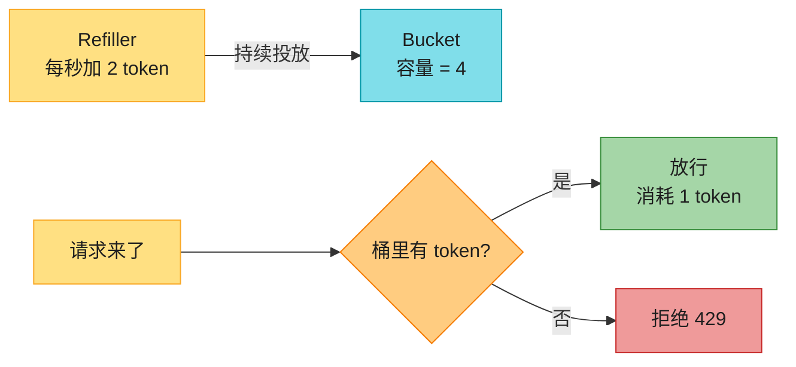

**两个参数**:`bucket size`(容量)+ `refill rate`(每秒投放数)。

**关键特性**:**允许突发**——桶满时瞬时能放行 capacity 个请求。这是它被 Amazon、Stripe 选用的原因。

**Bucket 怎么分?**(追问高频):
- 每个 API endpoint 一个 bucket
- 每个 user/IP 一个 bucket
- 全局一个 bucket(限总 QPS)

| 优点 | 缺点 |
|------|------|
| 简单、内存省 | 两参数调优有难度 |
| **允许突发**——主流场景都需要 | — |

> 🏭 **真实产品**:Amazon API Gateway、Stripe 都用令牌桶。

### 算法 2:漏桶 (Leaky Bucket)——平滑输出

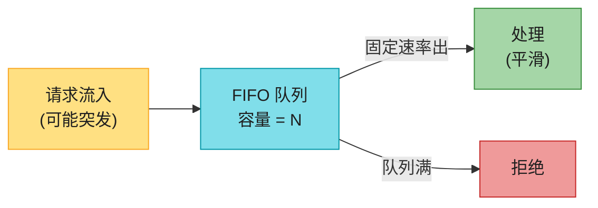

**特点**:请求以**固定速率**被处理(出桶),突发请求排队,队列满则拒绝。适合**需要稳定输出速率**的场景。

| 优点 | 缺点 |
|------|------|
| 内存省 | 突发填满队列后,**新请求被拒**(老请求占位) |
| 输出速率稳定 | 两参数调优 |

> 🏭 **真实产品**:Shopify 用漏桶。

### 算法 3:固定窗口计数 (Fixed Window Counter)——最简单但有临界突发

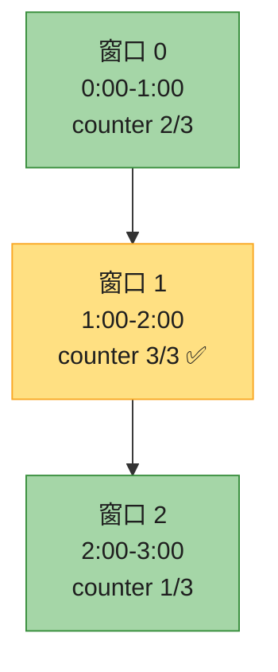

**致命缺陷——临界突发**:限制 5 次/分钟。0:55 来 5 个,1:05 又来 5 个——1 分钟内(0:30-1:30)实际过了 **10 个**,是限额的 2 倍。

| 优点 | 缺点 |
|------|------|
| 内存省、好懂 | **临界点突发**——窗口边界可双倍放量 |

### 算法 4:滑动窗口日志 (Sliding Window Log)——最精确但耗内存

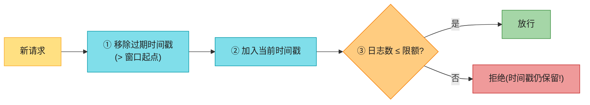

**特点**:精确记录每次请求时间戳(用 Redis sorted set),任意滚动窗口内都不会超限。

| 优点 | 缺点 |
|------|------|
| **最精确**——任意窗口都不超 | **耗内存**(拒绝的请求时间戳也存) |

### 算法 5:滑动窗口计数 (Sliding Window Counter)——平衡之选 ⭐

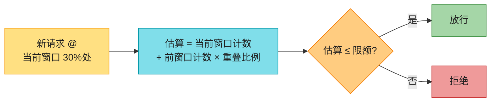

**手算例子**:限 7 次/分钟。前窗口 5 次,当前窗口 3 次,新请求在当前窗口 30% 处:
```
估算 = 3 + 5 × (1 - 0.3) = 3 + 3.5 = 6.5 → 下取整 6 ≤ 7,放行
```

| 优点 | 缺点 |
|------|------|
| 平滑突发、内存省 | **近似**(假设前窗口均匀分布)——但 Cloudflare 实测 4 亿次里仅 0.003% 误判 |

> 🏭 **真实产品**:**Cloudflare** 用滑动窗口计数(亿级流量验证)。

### 五种算法决策表(背熟,面试直接用)

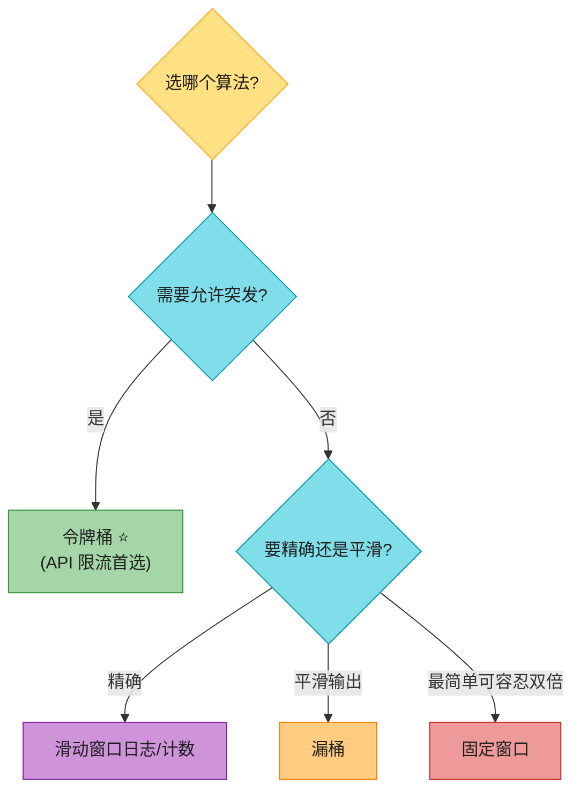

| 算法 | 突发 | 精确度 | 内存 | 适用 | 代表 |
|------|------|--------|------|------|------|
| **令牌桶** | ✅ 允许 | 中 | 低 | **API 限流(首选)** | Amazon/Stripe |
| 漏桶 | ❌ 平滑 | 中 | 低 | 稳定输出 | Shopify |
| 固定窗口 | 临界双倍 | 低 | 最低 | 简单场景 | — |
| 滑动窗口日志 | 精确 | **最高** | **高** | 严格合规 | — |
| **滑动窗口计数** | 平滑 | 高(近似) | 低 | **大流量** | Cloudflare |

> 💡 **面试默认答案**:**API 限流用令牌桶**(允许突发 + 主流);**大流量精确限流用滑动窗口计数**(Cloudflare 验证)。这两个能 cover 90% 场景。

---

## 4. 高层架构

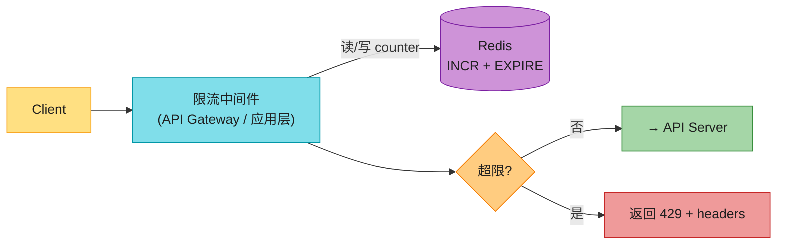

> 📝 **为什么用 Redis**:数据库太慢(磁盘);内存缓存快 + 支持 TTL 过期。Redis 两个核心命令:
> - **INCR**:counter +1
> - **EXPIRE**:设过期时间,到期自动删

> 📝 **名词注释**:**Rate limiting rules**(限流规则)——配置文件定义(Lyft 开源的 ratelimit 是工业模板),如"营销短信每用户每天 5 条""登录每分钟 5 次"。

---

## 5. 分布式限流的两个难点 ⭐⭐⭐(原书重点,但没讲透)

单机限流简单。**多机分布式**有两大坑:

### 难点 1:竞态条件 (Race Condition)

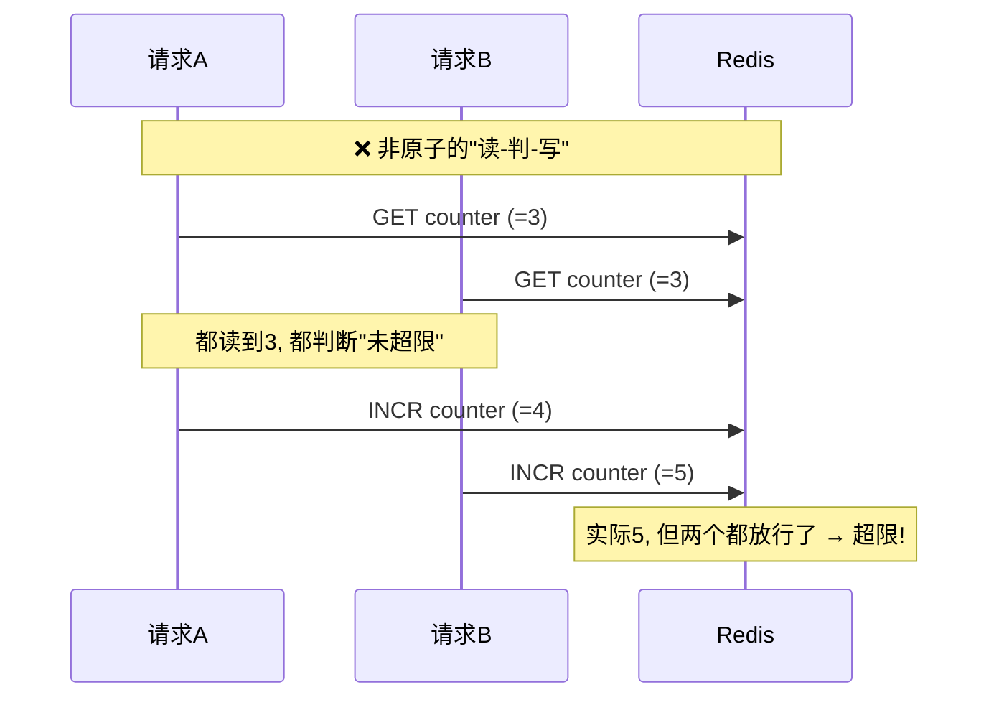

**问题**:高并发下,"读 counter → 判断 → 写回"不是原子的,两个请求同时读到旧值,都放行,导致**实际超限**。

**解法**(原书只提了名字,这里讲透):

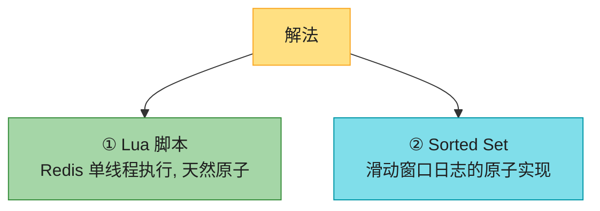

> 💡 **为什么 Lua 能解决**:Redis 是**单线程**执行命令的。把"读-判-写"写进一个 Lua 脚本,Redis 会**原子地执行完整个脚本**,中间不会插入其他命令。这是分布式限流的标准解法。

### 难点 2:多限流器节点的同步

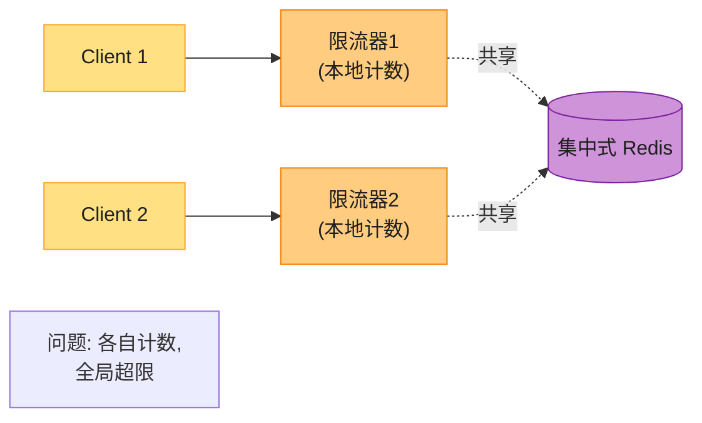

**问题**:web 层无状态,同一用户的请求可能打到不同限流器,各自本地计数 = 全局失效。

**解法**:**集中式 Redis**(所有限流器共享一个 Redis)。原书提到 sticky session 不推荐(不 scalable),集中存储是正解。

> 🪤 **追问陷阱**:"集中式 Redis 会不会成瓶颈/单点?" → "① Redis Cluster 分片;② 本地缓存 + 定期同步(容忍少量超限);③ 多机房各部署 Redis + 最终一致。"——这是高级追问。

---

#### 深入:令牌桶手算 + Lua 实现 ⭐⭐

**令牌桶手算**(面试可能让你演算):

参数:容量 4,补充速率 4 个/分钟。初始桶满(4 个)。

```
t=0:   桶=4
t=10s: 来 3 个请求 → 消耗 3,桶=1,全放行
t=20s: 来 2 个请求 → 消耗 1(桶只有1),放行1,拒绝1,桶=0
t=60s: 补充 4 个 → 桶=4(满)
t=61s: 来 5 个请求 → 放行4,拒绝1,桶=0
```

> 💡 **手算用离散补充**(每分钟边界一次性补 4 个)便于演算;**生产令牌桶是连续补充**(每过 dt 补 `rate × dt` 个,如下方 Lua)。两者模型不同,面试演算用离散即可,但要说明"生产是连续补充"。

**Lua 脚本实现令牌桶**(可直接背,面试白板能写):

```lua
-- KEYS[1] = bucket key, ARGV = [capacity, refill_rate, now, cost]
local key = KEYS[1]
local capacity = tonumber(ARGV[1])
local rate = tonumber(ARGV[2])       -- token / second
local now = tonumber(ARGV[3])
local cost = tonumber(ARGV[4])

local bucket = redis.call('HMGET', key, 'tokens', 'ts')
local tokens = tonumber(bucket[1]) or capacity
local ts = tonumber(bucket[2]) or now

-- 按经过时间补充 token
local delta = math.max(0, now - ts)
tokens = math.min(capacity, tokens + delta * rate)

local allowed = 0
if tokens >= cost then
    tokens = tokens - cost
    allowed = 1
end

redis.call('HMSET', key, 'tokens', tokens, 'ts', now)
redis.call('EXPIRE', key, 120)
return allowed
```

> 💡 **关键点**:整个"读 tokens → 算补充 → 判断 → 写回"在 Lua 里**原子执行**,解决竞态。

---

## 6. 超限后怎么反馈(HTTP 头)

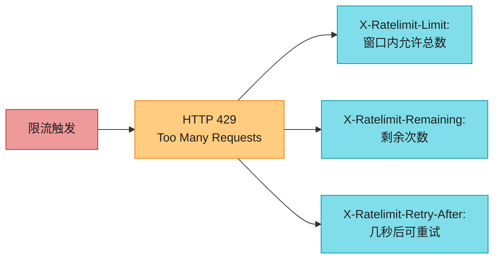

**处理策略**(可配):
- **直接拒绝**(默认):返回 429。
- **入队延后**(如订单超限):丢队列稍后处理。

---

## 7. 性能优化 + 监控

**性能**:
- **多机房部署**:用户就近访问边缘节点(Cloudflare 全球 330+ 节点)。
- **最终一致同步**:多机房 Redis 异步同步,容忍少量误差。

**监控 2 个指标**:
1. **算法是否有效**:突发时(秒杀)令牌桶是否挡住了。
2. **规则是否合理**:太严→大量正常请求被拒(放松);太松→限流形同虚设。

---

## 💻 代码示例

### Python 滑动窗口计数(Redis sorted set 实现)

```python
import redis, time
r = redis.Redis()

def rate_limit_sliding(user_id, limit=100, window=60):
    key = f"rl:{user_id}"
    now = int(time.time() * 1000)
    window_start = now - window * 1000
    pipe = r.pipeline()
    pipe.zremrangebyscore(key, 0, window_start)   # 移除过期
    pipe.zadd(key, {str(now): now})               # 加当前
    pipe.zcard(key)                                # 数当前窗口内
    pipe.expire(key, window)
    _, _, count, _ = pipe.execute()
    return count <= limit
```

### 多级限流(实际场景)

```python
def check(user_id, ip, api):
    return all([
        rate_limit(f"user:{user_id}", limit=1000),   # 用户级
        rate_limit(f"ip:{ip}", limit=500),           # IP 级(防刷)
        rate_limit(f"api:{api}", limit=10000),       # API 全局
    ])
```

> 💡 **多级限流是 2026 实战标配**:用户级防滥用 + IP 级防爬虫 + API 全局防过载,三层叠加。

---

## ⚠️ 已过时 / 书里没说(2020 → 2026)

| 原书 | 2026 现状 | 面试应对 |
|------|----------|---------|
| 限流位置只说 API Gateway | **Service Mesh sidecar(Envoy)** 做服务间限流成主流 | 主动提两层:gateway + sidecar |
| Lua/sorted set 只提名字 | **必须会写 Lua 令牌桶** | 背上面的 Lua 脚本 |
| 没提多级限流 | 用户/IP/API 三级限流是标配 | 主动说多级 |
| Cloudflare 194 节点(2020) | 2026 已 **330+ 城市** | 用最新数 |
| 没提 Service Mesh 限流 | Envoy rate limit filter / Istio | 提一句 sidecar 限流 |
| 没提全局总线(Global Token Bucket) | 跨机房限流用 Redis Cluster / 全局令牌桶 | 高级追问时答 |

---

## 🪤 追问陷阱

1. **"令牌桶和漏桶区别?"** → 令牌桶**允许突发**(桶满瞬时放行 capacity 个);漏桶**平滑输出**(固定速率出)。
2. **"高并发下计数不准怎么办?"** → Redis + **Lua 原子脚本**(单线程执行)。
3. **"多机房限流怎么做?"** → 集中 Redis Cluster + 异步同步,容忍少量超限;或全局令牌桶服务。
4. **"Redis 挂了限流怎么办?"** → fail-open(放行,保业务)还是 fail-close(拒绝,保后端)?**默认 fail-open + 告警**,业务连续性优先。
5. **"令牌桶参数怎么调?"** → capacity 设为峰值 QPS × 容忍突发秒数;refill rate 设为平均 QPS。
6. **"限流和熔断区别?"** → 限流是**入口防御**(超量拒绝);熔断是**下游保护**(下游挂了快速失败,不拖垮自己)。

---

## 🏭 生产级产品速查表

| 方案 | 类型 | 特点 |
|------|------|------|
| **AWS API Gateway** | 托管 | 令牌桶,自带限流 |
| **Kong / APISIX** | 开源 gateway | 插件化限流,支持多算法 |
| **Envoy / Istio** | Service Mesh | sidecar 限流,无侵入 |
| **Lyft ratelimit** | 开源库 | 工业级限流规则模板(YAML 配置) |
| **Redis + Lua** | 自研 | 最灵活,主流做法 |
| **Cloudflare** | 边缘 | 滑动窗口计数,全球 330+ 节点 |

---

## 📝 本章要点总结

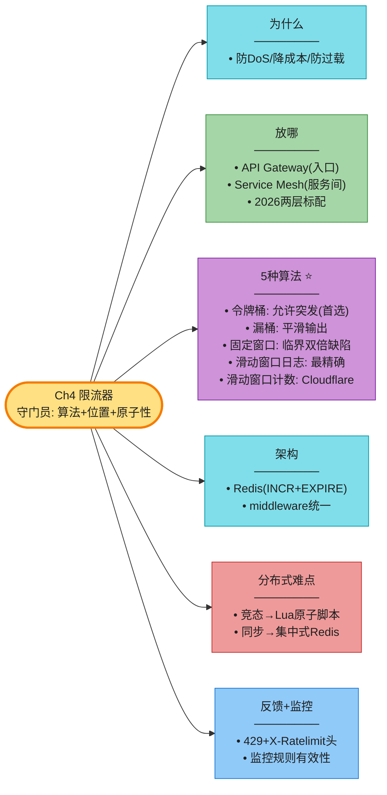

**核心 Takeaways**:

1. **算法默认答案**:API 限流用**令牌桶**(允许突发);大流量精确限用**滑动窗口计数**(Cloudflare)。
2. **位置分两层**:API Gateway(入口)+ Service Mesh sidecar(服务间),2026 标配。
3. **分布式竞态用 Lua**:Redis 单线程原子执行,是标准解法,**要会写**。
4. **集中式 Redis** 解决多节点同步;Redis 挂了默认 fail-open 保业务。
5. **多级限流**:用户/IP/API 三级叠加是实战标配。
6. **限流 vs 熔断**:入口防御 vs 下游保护,别混淆。

> 🔗 **连接下一章**:Ch4 限流是"控制请求速率";**Ch5 一致性哈希**是"把请求/数据均匀分到多机"——它是 Ch1 分片、Ch6 KV 存储的算法基础。
