# Chapter 5: 设计一致性哈希 (Design Consistent Hashing)

> 📑 **导航**:[← 限流器](ch1_04-设计限流器.md) · [📚 总目录](../README.md) · [键值存储 →](ch1_06-设计键值存储.md)
> 🔗 **相关**:[限流器](ch1_04-设计限流器.md) · [键值存储](ch1_06-设计键值存储.md) · [负载均衡](../SDA/aws_05-负载均衡.md)


> **本章定位**:一致性哈希是**分布式系统的基石算法**——Ch1 的分片、Ch6 的 KV 存储、Kafka 分区、Cassandra、Discord、Akamai CDN、Google Maglev LB 全用它。它解决一个问题:**加减机器时,如何只迁移最少的数据**。原书这章讲得清楚但偏理论,本章补**手算 + 虚拟节点为什么有效 + 现代变体(Maglev/Jump Hash)**。

---

## 🎯 面试怎么答(被问到"数据怎么均匀分到多机 / 加减机器怎么办"时)

**开场话术**(直接背):

> "水平扩展要把数据分到多机。最直觉的 `hash(key) % N` 在加减机器时会让**几乎所有数据重映射**——缓存雪崩。一致性哈希把机器和 key 都映射到环上,**加减一台机器只迁移 k/n 的数据**。我再讲虚拟节点解决均匀性。"

**3 步推进**:

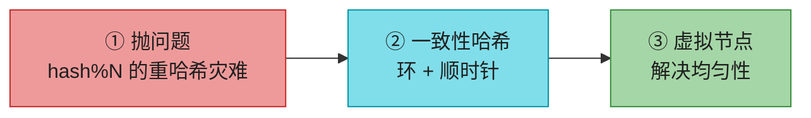

---

## 🗺️ 章节概览

| 小节 | 要点 |
|------|------|
| 重哈希问题 | `hash(key) % N` 加减机器 → 几乎全量重映射 |
| 哈希环 | 0 ~ 2^160 的环,机器和 key 都映射上去 |
| 顺时针查找 | key 顺时针找到的第一台机器负责它 |
| 加减机器 | 只影响相邻区间的 key |
| 两个问题 | 分区大小不均 + 键分布不均 |
| **虚拟节点** | 每台机器多个虚拟节点,标准差降到 5-10% |
| 受影响范围 | 加减机器时,重新分布的区间 |
| 现代变体 | Maglev / Jump Hash / Rendezvous |

---

## 1. 重哈希问题(为什么不能用 `hash % N`)

### 传统做法

```
serverIndex = hash(key) % N    // N = 服务器数
```

**手算例子**:4 台服务器,8 个 key:

| key | hash(key) % 4 |
|-----|---------------|
| key0 | 1 |
| key1 | 2 |
| key2 | 0 |
| key3 | 3 |
| key4 | 1 |
| key5 | 2 |
| key6 | 0 |
| key7 | 3 |

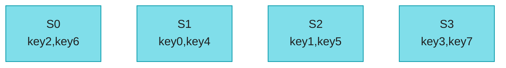

### 灾难:服务器 1 下线,N: 4 → 3

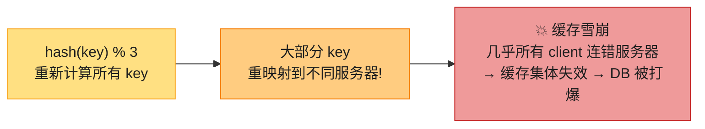

**关键问题**:服务器 1 挂了,本应只迁移它上面的 key。但 `hash % N` 因为 N 变了,**所有 key 的 serverIndex 都变了**——不只是 server 1 的 key,server 0/2/3 的 key 也大半跑路。这就是**缓存雪崩**。

> 🪤 **追问陷阱**:"为什么 `hash % N` 这么糟?" → "因为 N 出现在分母,N 一变,几乎所有结果都变。一致性哈希的精髓是**让映射结果不依赖 N**。"

---

## 2. 一致性哈希:哈希环

### 核心思想

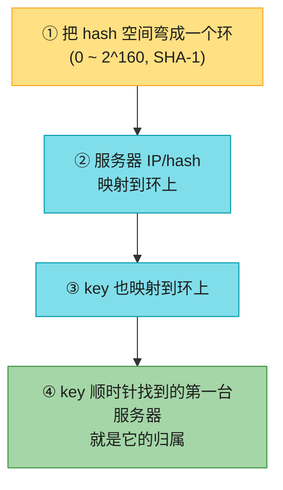

### 哈希环 + 顺时针查找

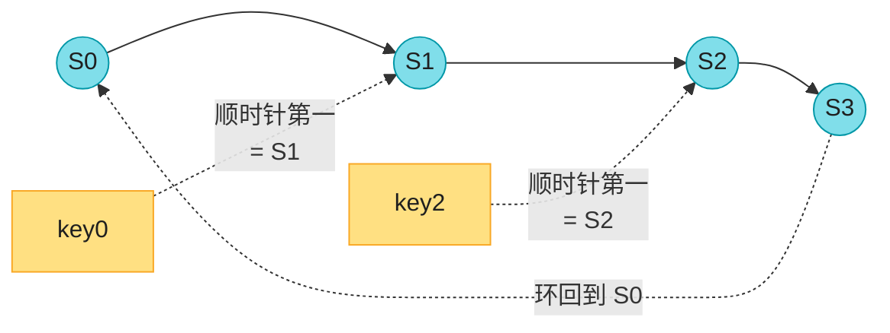

> 📝 **没有取模!** 这是和 `hash % N` 的本质区别。key 找服务器 = 在环上顺时针走,遇到的第一台。映射结果**不依赖服务器总数 N**。

---

## 3. 加减机器:只迁移相邻区间的数据 ⭐

### 加一台服务器


### 减一台服务器

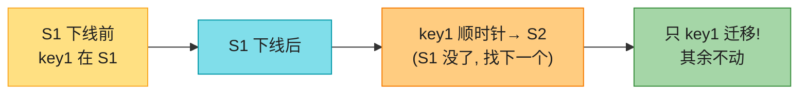

> 💡 **核心收益**(背熟):加减一台机器,**平均只迁移 k/n 个 key**(k=总 key 数,n=机器数)。而 `hash % N` 几乎迁移全部。这就是"一致性"的含义。

---

## 4. 基本方案的两个问题

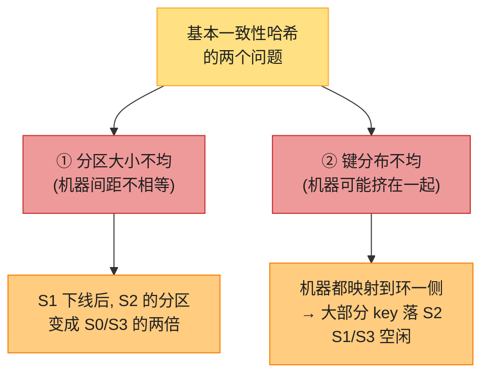

| 问题 | 现象 | 后果 |
|------|------|------|
| 分区不均 | 相邻机器间距不等 | 某机器负责的范围特别大/小 |
| 键分布不均 | 机器在环上扎堆 | 某机器过载,其他空闲 |

---

## 5. 虚拟节点(Virtual Nodes)——解法 ⭐⭐

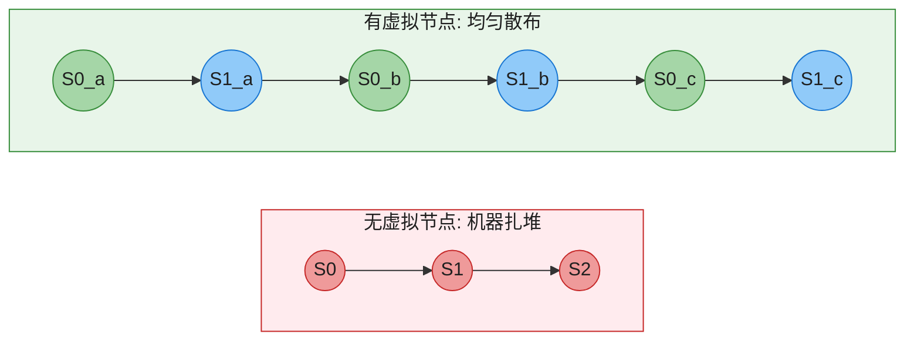

**核心思想**:每台**物理机器**对应**多个虚拟节点**散布在环上。如 S0 用 `S0_0, S0_1, S0_2` 三个点代表。key 顺时针找到的第一个虚拟节点,其归属的物理机器就是负责者。

**为什么有效**:虚拟节点越多,各机器负责的范围越趋近均匀(大数定律)。

### 手算:虚拟节点数 vs 标准差

| 虚拟节点数 | 标准差(相对均值) | 效果 |
|-----------|------------------|------|
| 1(无) | 极不均 | ❌ |
| 100 | ~10% | 可接受 |
| 200 | ~5% | ✅ 好 |
| 实际系统 | 几十~几百 | 均匀 |

> 💡 **权衡**:虚拟节点越多越均匀,但**内存开销增加**(要存虚拟节点表)。实际系统取 100-200 个,标准差 5-10%。

> 📝 **异构性加分**:虚拟节点数可**按机器能力分配**——强机器多分配虚拟节点(承担更多),弱机器少分配。这是 `hash % N` 做不到的。

---

## 6. 受影响范围(加减机器时迁移哪段数据)

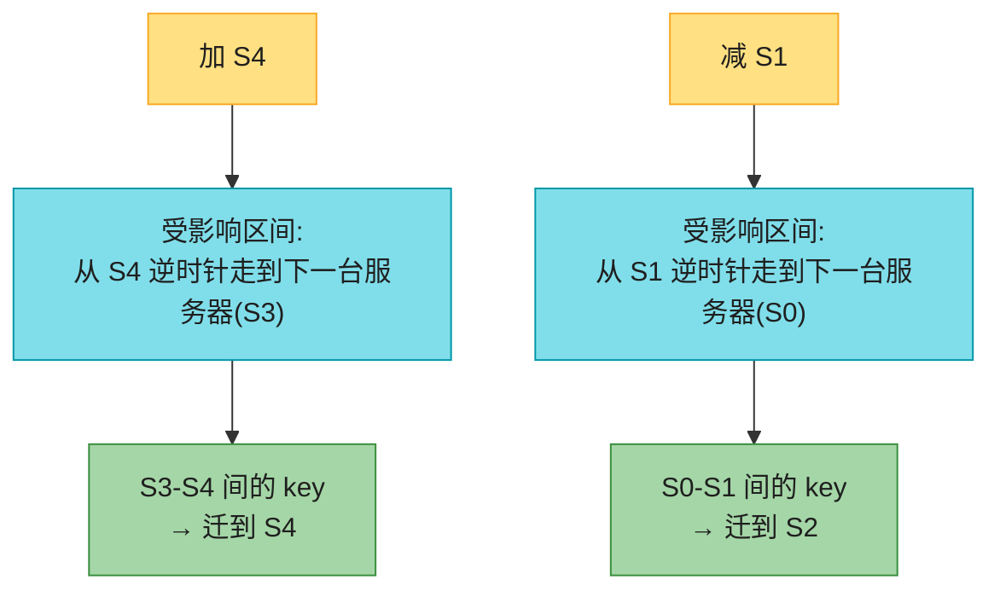

> 💡 **规律**:**逆时针**走到相邻服务器,这段区间的 key 就是受影响的。面试画环时这么讲最快。

---

## 7. 现代变体(原书没讲,高级岗加分)

一致性哈希是经典,但工业界还有几个变体,各有适用场景:

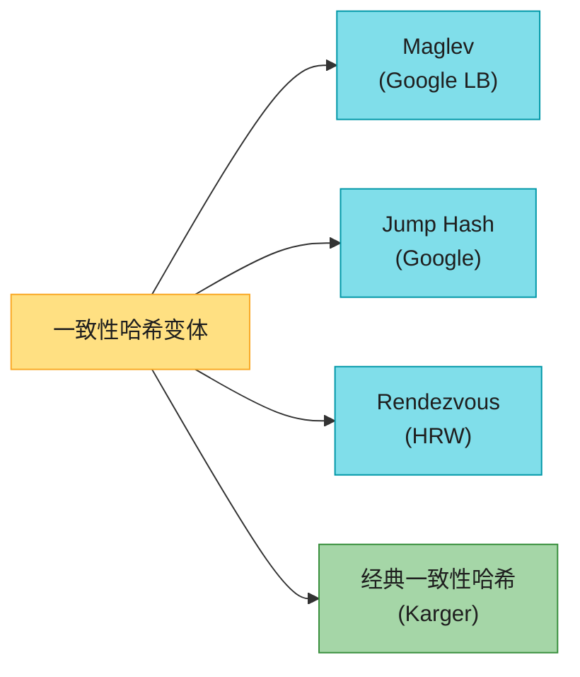

| 算法 | 特点 | 适用 | 代表 |
|------|------|------|------|
| **经典一致性哈希**(Karger) | 环 + 虚拟节点 | 通用 | Cassandra/Discord/Akamai |
| **Maglev** | 固定大小查找表(M=65537 素数),O(1) 查找,迁移最少 | **网络 LB(超低延迟)** | Google GCP LB |
| **Jump Hash** | 无内存,O(log N) 查找,但不支持任意节点名 | key→bucket(节点用 0..N-1) | Google 内部 |
| **Rendezvous (HRW)** | 无环,O(N) 查找,N 小时最优 | 节点数少(<100) | 部分 CDN/缓存 |

> 🔄 **2026 现代版话术**:"如果是**通用数据分片**,用经典一致性哈希 + 虚拟节点(Cassandra/Discord);如果是**超低延迟网络 LB**(每秒百万包),用 **Maglev**(Google)——它用固定大小查找表,O(1) 且迁移最少。这是高级岗的区分点。"

---

#### 深入:一致性哈希 vs Maglev vs Jump Hash ⭐

| 维度 | 经典一致性哈希 | Maglev | Jump Hash |
|------|--------------|--------|-----------|
| 查找复杂度 | O(log N)(二分环) | **O(1)** | O(log N) |
| 内存 | O(N × vnodes) | O(M)(M=查找表,Maglev 默认 **65537**=2¹⁶+1 素数) | **O(1)** |
| 加减节点迁移量 | k/n | 接近最优 | k/n |
| 支持任意节点名 | ✅ | ✅ | ❌(节点必须 0..N-1) |
| 均匀性 | 依赖虚拟节点 | 很好(查表) | 好 |
| 代表 | Cassandra/Discord | Google LB | Google 内部 |

> 🪤 **追问陷阱**:"为什么 Google 用 Maglev 不用经典一致性哈希?" → "**网络 LB 要求 O(1) 查找 + 超低延迟**,经典一致性哈希的二分查找太慢。Maglev 用固定查找表,每秒百万包无压力。这是 L7 LB 的选择。"

---

## 8. 实际应用(背熟,面试当论据)

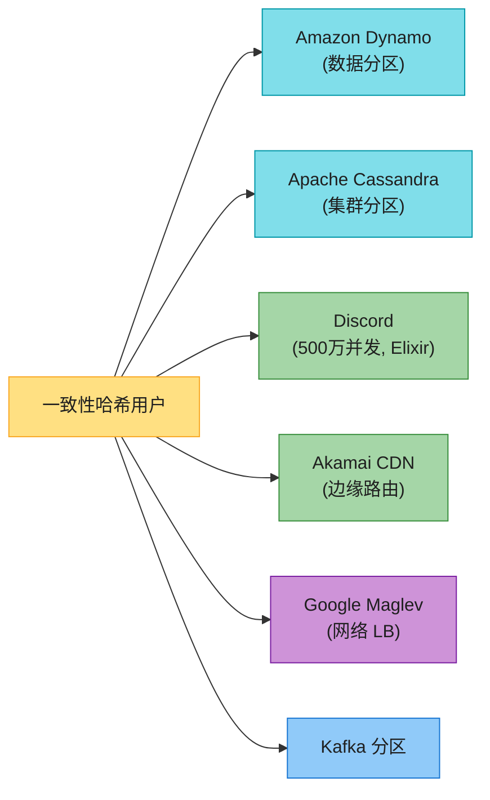

---

## 💻 代码示例(Python 最小实现)

```python
import hashlib, bisect

class ConsistentHash:
    def __init__(self, virtual_nodes=150):
        self.ring = {}            # hash -> node
        self.sorted_keys = []     # 排序的 hash 值
        self.vnodes = virtual_nodes

    def _hash(self, s):
        return int(hashlib.md5(s.encode()).hexdigest(), 16)

    def add_node(self, node):
        for i in range(self.vnodes):
            h = self._hash(f"{node}#{i}")
            self.ring[h] = node
            bisect.insort(self.sorted_keys, h)

    def remove_node(self, node):
        for i in range(self.vnodes):
            h = self._hash(f"{node}#{i}")
            self.ring.pop(h, None)
            self.sorted_keys.remove(h)

    def get_node(self, key):
        if not self.ring: return None
        h = self._hash(key)
        idx = bisect.bisect(self.sorted_keys, h)
        if idx == len(self.sorted_keys): idx = 0   # 环回
        return self.ring[self.sorted_keys[idx]]

# 用法
ch = ConsistentHash(virtual_nodes=150)
ch.add_node("S0"); ch.add_node("S1"); ch.add_node("S2")
print(ch.get_node("user:42"))   # 顺时针找到的节点
```

---

## ⚠️ 已过时 / 书里没说(2020 → 2026)

| 原书 | 2026 现状 | 面试应对 |
|------|----------|---------|
| 只讲经典一致性哈希 | **Maglev**(Google LB)、**Jump Hash** 是工业级变体 | 高级岗主动提 Maglev(GCP LB 用) |
| 虚拟节点只说概念 | 实际 **100-200 个** vnode,标准差 5-10% | 给具体数字 |
| 没提异构性 | vnode 数按机器能力分配 | 主动说"强机器多 vnode" |
| Discord 500万并发(2020) | Discord 已远超此数 | 用时说明是历史数据 |

---

## 🪤 追问陷阱

1. **"为什么不用 `hash % N`?"** → 加减机器时几乎所有数据重映射 → 缓存雪崩。
2. **"虚拟节点多少个?"** → 100-200,标准差 5-10%;权衡均匀性 vs 内存。
3. **"加一台机器迁移多少数据?"** → 平均 k/n(k=总 key,n=机器数)。
4. **"机器能力不同怎么办?"** → 强机器分配更多虚拟节点(异构性)。
5. **"一致性哈希能解决热点 key 吗?"** → **只能缓解**。Katy Perry 的 key 还是落到一台机器。要彻底解决需**应用层拆分**(给明星单独 shard)。
6. **"为什么 Google LB 用 Maglev?"** → O(1) 查找,超低延迟,经典 CH 的二分太慢。

---

## 🏭 生产级产品速查表

| 产品 | 用一致性哈希做什么 |
|------|------------------|
| **Amazon Dynamo / DynamoDB** | 数据分区 |
| **Cassandra** | 集群分区 + 虚拟节点(vnode) |
| **Discord** | 500万+并发用户路由 |
| **Akamai CDN** | 边缘节点路由 |
| **Google Maglev** | 网络 LB(变体) |
| **Kafka** | 分区分配(改进版) |
| **Redis Cluster** | 16384 槽位(类一致性哈希思想) |

---

## 📝 本章要点总结

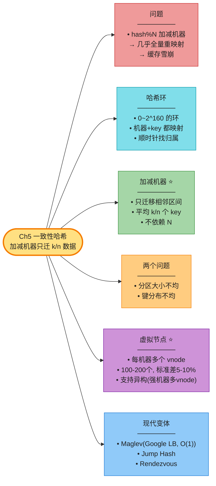

**核心 Takeaways**:

1. **`hash % N` 是反模式**——加减机器几乎全量重映射,缓存雪崩。
2. **一致性哈希 = 环 + 顺时针**——映射结果不依赖 N,加减只迁 k/n。
3. **虚拟节点解决均匀性**——100-200 个,标准差 5-10%,还支持异构。
4. **受影响区间** = 新节点逆时针到相邻服务器之间。
5. **现代变体**:通用用经典 CH;超低延迟 LB 用 Maglev(Google)。
6. **不能彻底解决热点 key**——明星数据要应用层单独拆分。

> 🔗 **连接下一章**:Ch5 给了分片算法;**Ch6 用它构建完整的分布式 KV 存储**——分区 + 复制 + Quorum + 故障处理 = 一个 Dynamo/Cassandra。
