# Chapter 6: 设计键值存储 (Design a Key-Value Store)

> 📑 **导航**:[← 一致性哈希](ch1_05-设计一致性哈希.md) · [📚 总目录](../README.md) · [唯一ID →](ch1_07-设计分布式唯一ID.md)
> 🔗 **相关**:[一致性哈希](ch1_05-设计一致性哈希.md) · [NoSQL](../SDA/aws_03-非关系型数据库.md) · [AWS存储](../SDA/aws_10-AWS存储服务.md)


> **本章定位**:这是全书**信息密度最高、最像真实分布式系统**的一章。它把 Ch1(复制/分片/CAP)、Ch5(一致性哈希)全用上,构建一个 **Dynamo / Cassandra 风格的分布式 KV**。掌握这章,你就掌握了分布式存储的"全家桶":CAP、Quorum、向量时钟、Gossip、Merkle 树、LSM 树。

> **本章和原书的区别**:原书讲得全但偏论文堆砌。本章补:**Quorum W+R>N 手算证明**、**向量时钟的现实(Cassandra 早就改 LWW)**、**LSM vs B 树对比**、**2026 现代实现(Redis Cluster/TiKV/Spanner/etcd Raft)**,并把 CAP 和 Ch1 的"多机房写冲突"打通。

---

## 🎯 面试怎么答(被问到"设计一个分布式 KV 存储"时)

**开场话术**(直接背):

> "我先定需求:KV 小(<10KB)、大数据、高可用、可调一致性、低延迟。然后按 **CAP 选型 → 分区+复制 → Quorum 一致性 → 故障处理 → 读写路径** 五块讲。本质是复刻 Dynamo/Cassandra。"

**5 步推进**:

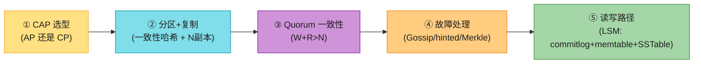

---

## 🗺️ 章节概览

| 小节 | 要点 | 重要性 |
|------|------|--------|
| 需求 | KV<10KB、大数据、高可用、可调一致性、低延迟 | ⭐⭐ |
| **CAP** | CP / AP 取舍(CA 不存在) | ⭐⭐⭐⭐⭐ |
| 分区 | 一致性哈希(Ch5)+ 虚拟节点 | ⭐⭐⭐ |
| 复制 | 顺时针取 N 个副本 | ⭐⭐⭐ |
| **Quorum** | N/W/R,W+R>N 保证强一致 | ⭐⭐⭐⭐⭐ |
| 一致性模型 | strong / eventual | ⭐⭐⭐ |
| 不一致解决 | 向量时钟(理论)→ LWW(现实) | ⭐⭐⭐ |
| 故障检测 | Gossip 协议 | ⭐⭐⭐ |
| 临时故障 | Sloppy quorum + hinted handoff | ⭐⭐⭐ |
| 永久故障 | Merkle 树反熵 | ⭐⭐⭐ |
| **写路径** | commit log → memtable → SSTable(LSM) | ⭐⭐⭐⭐ |
| **读路径** | memtable → Bloom filter → SSTable | ⭐⭐⭐⭐ |

---

## 1. 需求 + 单机 vs 分布式

**需求**(原书):
- KV 小(<10 KB)
- 存大数据
- 高可用(故障也快速响应)
- 高扩展(自动加减节点)
- **可调一致性**(tunable consistency)⭐
- 低延迟

**单机 KV** = 一个哈希表(全内存)。优化:压缩 + 热数据内存/冷数据落盘。但单机容量有限 → **必须分布式**。

---

## 2. CAP 定理 ⭐⭐⭐⭐⭐

### 定义(背熟)

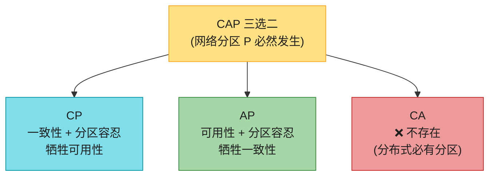

| 性质 | 含义 |
|------|------|
| **C (Consistency)** | 所有客户端**同时**看到相同数据,无论连哪个节点 |
| **A (Availability)** | 任何请求都有响应,即使部分节点宕机 |
| **P (Partition Tolerance)** | 网络分区时系统继续工作 |

> ⚠️ **关键认知(Ch1 已铺垫,这里强化)**:**P 是必然**(网络必断),所以**CA 在分布式系统中不存在**。实际选择是 **CP vs AP**。

### 理想 vs 真实分区

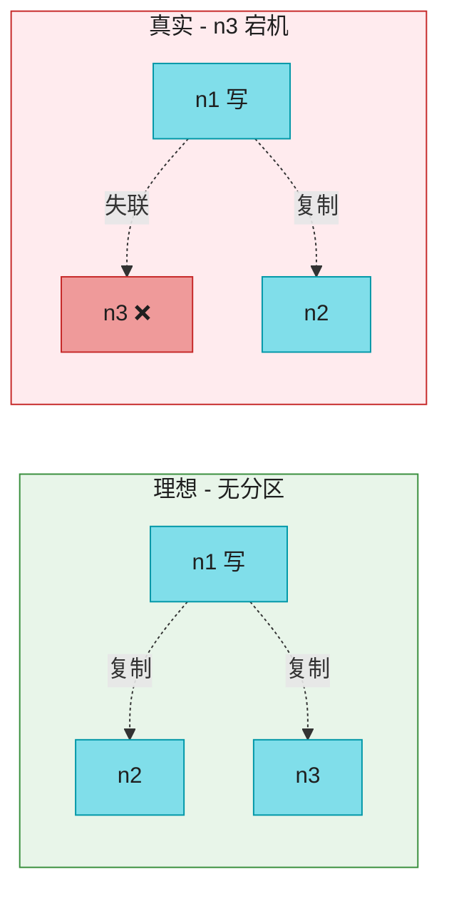

**分区时二选一**:

| 选 CP(银行) | 选 AP(社交) |
|------------|------------|
| 阻塞写,返回错误 | 继续接受读写 |
| 保证强一致 | 容忍 stale 数据 |
| 分区时不可用 | 始终可用 |
| 网络恢复后无需合并 | 网络恢复后要合并冲突 |

> 🔄 **2026 现代版话术**:"KV 存储的 CAP 选型看场景:**社交 timeline/购物车/计数器用 AP**(Cassandra/Dynamo);**账户余额/配置中心/选主用 CP**(Spanner/etcd/ZooKeeper)。**不是全局选一个,而是按数据类型选**。"

> 🪤 **追问陷阱**:"为什么 CA 不存在?" → "分布式系统**网络分区不可避免**(网线断、交换机挂、机房失联)。P 必然发生,所以只能在 C 和 A 之间取舍,没有 CA。"

---

## 3. 数据分区(Ch5 一致性哈希)


**两个优势**(原书):
1. **自动扩展**:按负载加减节点。
2. **异构性**:强机器分配更多虚拟节点(Ch5 讲过)。

> 🔗 详见 **Ch5**。这里不重复手算。

---

## 4. 数据复制(N 个副本)


**规则**:key 落环后,顺时针取前 N 台服务器存副本。**副本跨机房放置**(同机房一起挂)。

> 📝 **N=3 是常用默认**。虚拟节点可能让前 N 个虚拟节点属于同一物理机,所以要**跳过重复物理机,取 N 个不同的**。

---

## 5. Quorum 共识 ⭐⭐⭐⭐⭐(本章核心)

### 三个参数

| 参数 | 含义 |
|------|------|
| **N** | 副本数 |
| **W** | 写仲裁:写需 **W 个副本 ack** 才算成功 |
| **R** | 读仲裁:读需 **R 个副本响应** 才算成功 |

### W + R > N = 强一致(手算证明)⭐

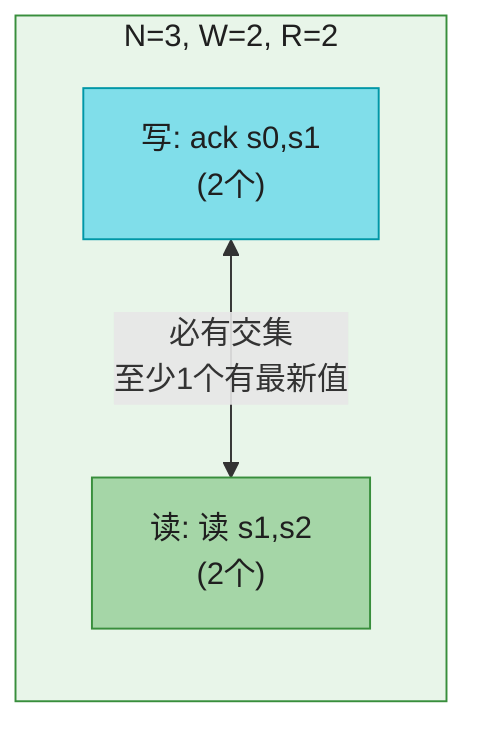

**为什么 W+R>N 保证读到最新值?**
- 写确认了 W 个副本有新值。
- 读查询了 R 个副本。
- W + R > N → **读集合和写集合必有交集**(鸽巢原理【Pigeonhole principle】)→ 交集中至少一个副本有最新值 → 读时取版本最高的即可。

**手算**:N=3, W=2, R=2。写进 s0/s1(ack 2 个)。读 s1/s2(s1 同时在写集和读集)→ s1 有最新值 → 返回。

### Quorum 配置权衡

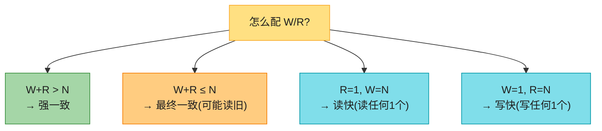

| 配置 | 行为 | 适用 |
|------|------|------|
| **W=R=1, N=3** | 极快,可能读旧 | 缓存 |
| **W=2, R=2, N=3**(常用) | 强一致,延迟可接受 | **主流业务** |
| W=3, R=1 | 写慢读快 | 读多写少 |
| W=1, R=3 | 写快读慢 | 写多读少 |

> 🪤 **追问陷阱**:"W=1 是不是只写了一个副本?" → "**不是**。数据仍写所有 N 个副本,W=1 只是**协调者收到 1 个 ack 就返回**,其余继续异步写。所以 W 是'确认数'不是'写入数'。"

---

## 6. 一致性模型


> 💡 **Dynamo / Cassandra 选最终一致**(高可用优先)。强一致要"所有副本同意才能继续"→ 阻塞 → 不适合高可用。

---

## 7. 不一致解决:版本 + 向量时钟

### 冲突怎么产生

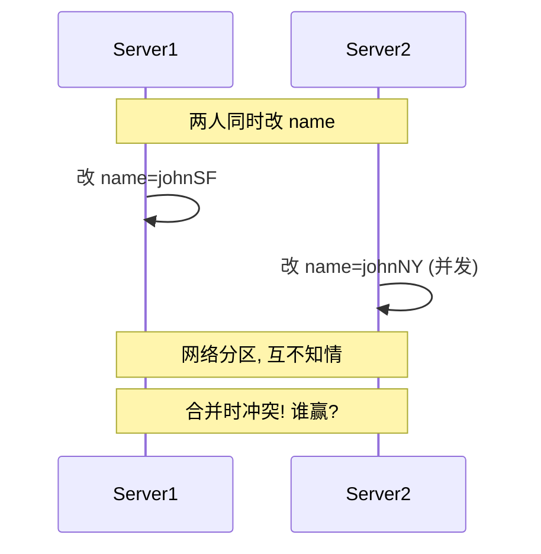

### 向量时钟(理论解法,原书重点)

向量时钟 = `[server, version]` 对的列表,用来判断版本间是**祖先关系(无冲突)**还是**兄弟关系(冲突)**。

**手算例子**(原书):
```
D1 [(Sx,1)]                              // 写 D1,经 Sx
D2 [(Sx,2)]                              // 改 D1,仍 Sx → D1 是 D2 祖先
D3 [(Sx,2),(Sy,1)]                       // 基于 D2 改,经 Sy
D4 [(Sx,2),(Sz,1)]                       // 基于 D2 改,经 Sz (并发于 D3!)
→ 读 D3,D4 发现冲突 → 客户端合并 → D5 [(Sx,3),(Sy,1),(Sz,1)]
```

**判断规则**:
- X 是 Y 祖先(无冲突):Y 的每个分量 ≥ X 对应分量。
- X 和 Y 兄弟(冲突):存在某分量 X > Y 且另一分量 Y > X。

### ⚠️ 向量时钟的现实(原书没讲)⭐

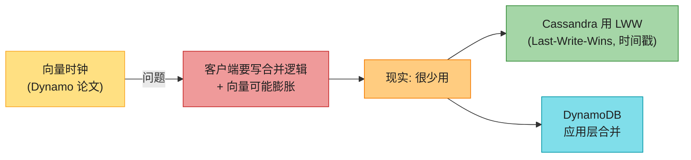


> 🔄 **2026 现代版话术**(原书把向量时钟当核心,但现实很少用):
> "向量时钟理论上优雅,但**要求客户端写冲突合并逻辑,且向量会膨胀**(要设阈值截断)。**生产系统很少用**:Cassandra 直接 **LWW(最后写入获胜,按时间戳)**;DynamoDB 让应用层合并;只有 Riak 真用向量时钟。**面试说一句'Cassandra 早改 LWW 了'会显得很懂**。"

> 🪤 **追问陷阱**:"LWW 不就丢数据吗?" → "**是**。LWW 会丢并发写里'输'的那个。所以**只适合值可覆盖的场景**(如状态、计数器用 CRDT)。敏感数据要应用层合并或用 CRDT。"


# 【🌹自己笔记】为什么会有冲突？
因为多个数据节点，有多个副本， 这多个副本都支持写入。  （像mysql就没这个问题，因为只有一台master机器支持写入）
```
# 1. 节点到底指什么？
**节点 = 分布式系统里一台独立的服务器/数据库分片/存储实例**
可以是：
- 分布式数据库：MySQL分片、Redis集群节点、TiDB、Cassandra 数据库节点；
- 缓存集群：多台Redis机器；
- 业务服务：多台业务应用服务器。

简单理解：
单机数据库：只有**1台机器**，所有读写都走它，天然有统一顺序，不需要向量时钟。
分布式数据库：数据会放在**多台机器**上，每一台机器就是一个节点。

# 2. 为什么多节点会修改同一份数据？3个现实业务原因
## 场景1：多副本（最普遍）
为了高可用、防宕机，一份数据会复制存到3台机器（副本）。
例：用户余额数据存 Sx、Sy、Sz 三台Redis。
- 主节点Sx正常写入；
- Sx宕机，系统自动切到Sy/Sz接管写入；
同一份数据，先后在不同节点被修改。

## 场景2：多客户端异地并行写入
异地多活架构：国内上海节点Sx、东南亚Sy、欧美Sz。
两个用户同时修改同一个商品库存：
用户A在上海Sx修改库存；
用户B在欧美Sz同时修改同一条库存；
**两地网络有延迟，互相感知不到对方的修改**，并行写同一份数据，必然产生并发冲突。

## 场景3：离线异步协同
协同文档（石墨、飞书文档）、分布式日志：
多人在不同服务器同时编辑同一份文档，就是多节点改写同一份数据。

核心痛点：
单机有全局时钟，可以用时间戳判断「谁先改、谁后改」；
跨地域分布式网络延迟不确定，**全局物理时钟无法对齐**，不能靠时间戳判断先后，于是诞生向量时钟。

# 3. 结合你之前的例子通俗重讲（抛开代码，只讲业务）
数据：某商品库存（唯一一条数据）
节点：Sx上海服务器、Sy东南亚服务器、Sz欧美服务器
1. D1：上海Sx第一次修改库存 → 向量时钟`[(Sx,1)]`
2. D2：依旧在上海Sx再次修改 → `[(Sx,2)]`
先后顺序明确，D1早于D2，无冲突。
3. D3：东南亚Sy拿着D2的旧库存，独立修改 → `[(Sx,2),(Sy,1)]`
4. D4：欧美Sz也拿着D2的旧库存，独立修改 → `[(Sx,2),(Sz,1)]`

### 关键：
Sy、Sz 互相看不到对方的修改，二者**同时基于同一个旧版本D2修改**。
- 用普通时间戳：网络延迟，无法判定谁先改；
- 用向量时钟：二者互相有一个节点版本更高 → 判定并发冲突，必须人工合并库存。

# 4. 向量时钟每个数字的直白含义
`(Sx,2)`：**Sx节点，对这条数据累计修改了2次**
一条数据在哪个节点被修改，哪个节点的计数器+1；
整条向量记录了：这条数据在全集群所有节点的修改履历。

### 判断逻辑大白话
1. A所有节点修改次数 ≤ B → B在A之后改，顺序执行，无冲突；
2. A一部分节点次数更高，B另一部分节点次数更高 → 两边分头并行修改，冲突。

# 5. 补充关键误区
1. 不是“多个节点同时强行写一条数据”，而是**多个节点各自拿着旧版本，在本地独立更新**；
2. 冲突根源：网络延迟带来的**信息不同步**，不是系统bug，是分布式固有问题；
3. 向量时钟**不解决冲突**，只精准发现冲突，最终数据合并还是靠业务规则（库存取最终计算值、文档文本合并）。

# 极简总结
1. 节点=分布式集群里一台独立服务器；
2. 多节点写同一份数据：异地多活、多副本、异地并行编辑的正常业务场景；
3. 向量时钟记录每条数据在各个服务器的修改次数，用来解决“网络不准、没法判断修改先后”的问题。
```


# 【🌹自己笔记】 什么是应用层和并，应用层怎么知道怎么合并？
```
# 一、先讲明白：什么叫「交给客户端合并」
## 1、底层前提
向量时钟**只干一件事：检测有没有冲突**，它没有能力看懂业务数据、不知道怎么融合两份矛盾数据。
- 服务端（数据库/集群）：只存储多版本、对比向量、标记冲突；
- 服务端**不会自动合并数据**：不同业务合并规则千差万别，服务端统一处理会极度臃肿、无法适配所有场景；
- 因此业界通用方案：**把冲突的多个版本下发给调用方（客户端），由客户端按照业务规则合并**，再把合并后的唯一新版本写回服务端。

客户端：前端、APP、后端业务服务、网关，只要主动调用分布式数据库的一方，都可以叫客户端。

举你之前的例子：
服务端检测到 D3、D4 冲突，不会擅自修改内容，而是把 D3、D4 两份数据全部发给客户端，客户端算出融合后的 D5，再把 D5 传回集群落地。

## 2、为什么服务端不自动合并？举3个直观例子
1. 协同文档
D3：删掉第一段；D4：修改第一段文字。服务端分不清该删还是该改；
2. 商品库存
D3：库存-5；D4：库存-10，服务端不知道最终库存该减5、10还是15；
3. 用户昵称
D3：昵称改为A；D4：昵称改为B，没有统一标准答案。
不同场景逻辑完全不一样，服务端无法内置万能合并算法。

# 二、客户端怎么知道该如何合并？
核心：**合并规则是项目开发阶段提前定义好、硬编码在客户端代码里**，客户端拿到冲突版本，执行提前写好的合并逻辑即可。
常见5大类工程落地合并方案，也是开发最常用的，由简单到复杂：

## 方案1：简单策略合并（数值类：余额、库存、计数器）
适用：数字类数据，加减、累加、取最大/最小。
### 示例：商品库存
D3：库存 = 95，D4：库存 = 90
预设规则：冲突时，以原始基数依次叠加两次扣减。
原始库存100，D3减5、D4减10 → 最终库存=85。
客户端拿到两份数据，执行减法叠加，算出结果，生成新版本写回。

## 方案2：Last-Writer-Wins（LWW 最后写入优先，最简单无脑）
适用：配置、昵称、开关这类**只保留一份最新内容**的数据。
实现方式补充二选一：
1. 给每个版本附带机器物理时间戳，客户端对比时间，丢弃更早的版本；
2. 向量时钟无法区分先后时，约定固定节点优先级（Sx > Sy > Sz），高优先级节点的版本直接覆盖低优先级。
例子：
D3(Sy修改昵称A)、D4(Sz修改昵称B)冲突，约定Sz优先级更高，客户端直接选用B作为最终结果。

## 方案3：结构化数据融合（JSON对象、键值对）
适用：用户资料、表单配置，两份修改修改了不同字段。
规则：**互不冲突的字段全部保留，同一字段冲突则执行预设策略**。
示例：
D3：{姓名:张三,年龄:20}
D4：{姓名:张三,性别:男}
无冲突字段直接合并 → {姓名:张三,年龄:20,性别:男}

进阶冲突：
D3年龄20，D4年龄21，提前约定年龄冲突取更大值，最终年龄=21。

## 方案4：文本协同合并（长文本、文档）
适用：石墨文档、飞书文档、笔记，采用成熟开源算法：
- OT 操作转换、CRDT 无冲突数据结构
客户端内置CRDT/OT算法，两份文本的增删改片段自动融合，像Word多人实时编辑一样，自动拼接内容。

## 方案5：人工兜底合并
适用：订单、合同等关键严肃数据，程序无法自动判定。
客户端检测自动合并失败，弹窗/后台告警，推送两份冲突内容给运营、人工编辑手动修改，人工确认后回写新版本。

# 三、完整闭环流程（冲突从产生→客户端合并→落盘全流程）
结合你D3、D4案例完整走一遍：
1. 分布式集群存储 D3、D4 两个版本；
2. 客户端查询数据，服务端读取两份向量时钟，判定二者并发冲突；
3. 服务端把 D3 业务数据、D4 业务数据一起下发给客户端；
4. 客户端调用内置业务合并函数，生成唯一融合内容；
5. 客户端把合并好的新内容发给服务端，服务端在Sx节点生成D5（向量取max、Sx版本+1）；
6. 集群统一落地D5，D3、D4标记为废弃版本，后续可垃圾回收删除。

# 四、补充现实落地细节
1. 很多中间件做了封装：
Cassandra、Riak 等数据库，可以提前注册自定义合并函数，把合并逻辑放在**网关/SDK**（广义客户端），业务服务不用每次手动写合并；
2. 不是每次冲突都要前端处理：
绝大多数场景，合并逻辑放在后端服务、组件SDK，对前端完全透明，前端只会拿到最终合并完成的数据，感知不到冲突；
3. 强一致性系统没有这个步骤：
MySQL主从、单主Redis，永远只有一个写入节点，不会并发冲突，完全不需要客户端合并。

# 极简总结
1. 交给客户端合并：服务端只发现冲突，把多版本下发给调用方，由调用方整合出新数据；
2. 客户端不会“凭空思考”，依靠**提前写死在代码里的业务规则**合并（数值运算、LWW覆盖、字段融合、CRDT文本算法、人工审核）；
3. 合并完成后生成唯一新版本回写到集群，旧版本作废清理。
```
“ 给每个版本附带机器物理时间戳，客户端对比时间，丢弃更早的版本”  为什么都说物理时间不可靠，这里还用物理时间呢？
向量时钟是基础，物理时间是上层策略。
没有 VC，你不知道什么时候该用 TS（不知道是不是真冲突）。
没有 TS，冲突时你无法自动解决，只能卡住等人工。

那只用TS行不行？ 不行，不同节点有time drift
```
# 结论前置
**只靠物理时间戳TS完全可以跑通系统，但代价极高：会出现无感知的数据丢失、新旧版本错乱，可靠性大幅下跌。**
二者核心区别：
- 向量时钟VC：**精准判断因果先后、区分真并发**（可靠）；
- 物理时间TS：**只能强行全局排序，无法识别因果，天生存在时钟偏差漏洞**。

## 一、只使用TS的完整运行逻辑（LWW 纯时间戳方案）
规则：每条数据只携带一个机器时间戳，写入时打上当前节点时间；冲突时，时间更大的版本直接覆盖旧版本。
流程：
1. 本地修改数据，打上本机最新TS；
2. 多副本同步，直接保留TS更大的数据；
3. 双写冲突，晚的时间戳覆盖早的。

### 优点
1. 结构极简：单数字，存储、传输、对比开销O(1)，无膨胀；
2. 逻辑简单，开发落地容易；
3. 冲突全自动解决，不需要人工、客户端自定义合并。

## 二、只使用TS，无法根治的致命缺陷（2个真实场景漏洞）
### 漏洞1：时钟漂移，出现「后发生的事件，时间戳更小」，新数据被旧数据覆盖
节点A、B跨机房，NTP同步存在50ms偏差：
1. 10:00:00.100，A修改数据，打上TS=100ms；
2. 10:00:00.120，B**晚20ms**并行修改同一条数据，但B本机时钟慢，TS=90ms；
按照纯LWW规则：90ms < 100ms，B的新修改直接被丢弃。
**真实发生的后置修改，被前置旧版本覆盖，悄无声息丢数据。**
根源：物理时钟无法绝对对齐，网络延迟、机器时钟漂移永远存在。

### 漏洞2：无法区分「顺序更新」和「并发分叉」，不该覆盖的时候乱覆盖
正常顺序场景：
V1(TS=100) → A节点顺序修改得到V2(TS=110)，V2天然更新，正常覆盖没问题。
并发分叉场景：
V1同步到A、B，A改出V_A(TS=105)，B改出V_B(TS=108)
纯TS判定：保留V_B、丢弃V_A。
看起来没问题，但换一种情况：
A时钟慢，V_A(TS=108)，B时钟快，V_B(TS=105)
**B明明和A是并发修改，却因为时钟跑得快，新版本被错误舍弃**。
VC可以一眼识别二者并发；TS做不到区分因果与并发，只会粗暴一刀切。

### 极端场景：单机回拨时钟
运维手动把服务器时间往前调，后续所有写入的TS都会变小，大批量新数据会被历史旧版本覆盖，系统灾难。

## 三、VC+TS 组合 对比 纯TS
|方案|能否判断因果|冲突处理方式|数据丢失风险|适用场景|
| ---- | ---- | ---- | ---- | ---- |
|纯TS(LWW)|不能，只会强行排序|自动覆盖|高（时钟漂移极易丢数据）|缓存、临时配置、对一致性不敏感业务|
|VC+TS组合|VC精准判断先后/并发|顺序直接取新版本；并发再用TS裁决|极低|主流分布式KV、协同系统|

## 四、什么时候可以只用TS？什么时候绝对不能只用TS？
### 1、可以只用TS的场景
- 临时缓存、开关配置、用户头像、个性化装饰：丢失一次修改影响很小，可接受偶尔错乱；
- 单机房集群，机器时钟偏差控制在10ms以内，出错概率极低；
- 追求极致简单、极致性能，一致性优先级最低。

### 2、严禁只用TS的场景
- 金融余额、订单、库存、合同：一丁点数据丢失就会造成资损；
- 异地多活跨大洲机房：时钟偏差可达几百毫秒，出错概率大幅上升；
- 协同文档、分布式日志：需要严格追溯修改先后顺序。

## 五、回到你最初的疑问：既然VC只是用来判断要不要用TS，那删掉VC行不行？
1. 删掉VC=无法区分「正常顺序更新」和「并发冲突」；
2. 顺序更新本就该直接用新版本，纯TS却还要靠时间对比，一旦时钟乱序，正常更新也会被吞；
3. VC的价值：**把99%的顺序更新做可靠处理，只把极少数并发交给TS兜底裁决**，大幅压缩出错概率；
纯TS是把100%的版本交给不可靠的时钟排序，全程暴露在风险里。

## 六、一句话总结
只用物理时间TS在工程上可行、实现简单，但一致性不可靠；
搭配向量时钟后，先用VC稳稳处理绝大多数顺序版本，仅极小范围并发交给TS自动兜底，在可用性与数据安全之间拿到最优平衡，这也是工业界普遍选择组合方案的原因。
```

# 【🌹自己笔记】向量时钟到底怎么工作的
```
# 一、极简具象例子，完整走一遍向量时钟全过程
## 前置设定
1. 集群3台机器（节点）：A、B、C；
2. 只跟踪**同一条数据：用户余额**；
3. 规则：
   - 谁修改数据，谁自身版本号+1；
   - 未修改过本条数据的节点，版本默认=0，不记录；
   - 对比两条版本：全量数字都更小=旧版本；互相有大有小=冲突。

### 步骤1：A节点第一次写入余额100
A本地修改，只有A自增1
版本V1：余额=100，向量`{A:1}`

### 步骤2：A再次修改，余额扣为90
依旧A修改，A计数+1
版本V2：余额=90，向量`{A:2}`
对比V1与V2：V1所有数字 ≤ V2 → V1是旧版本，直接丢弃V1。

### 步骤3：把V2同步到B节点
B拿到V2，向量合并：`{A:2}`，无本地修改，数字不变。
随后**B在本地独立修改余额：90→85**
B自身计数+1
版本V3：余额=85，向量`{A:2, B:1}`
V2所有数字 ≤ V3 → V2是旧版本。

### 步骤4：C节点也拿到V2，独立修改余额：90→80
C自身计数+1
版本V4：余额=80，向量`{A:2, C:1}`

### 关键对比：V3 和 V4
V3：{A:2，B:1}
V4：{A:2，C:1}
- B维度：V3=1 ＞ V4=0
- C维度：V4=1 ＞ V3=0
✅ 二者互相高低，判定：**并发冲突**
服务端不会自动处理，把V3、V4下发给客户端。

### 步骤5：客户端合并（业务规则：两次扣减叠加）
原始90，B扣5、C扣10，最终余额=75
在A节点生成新版本V5：
1. 合并两个向量，同节点取最大值：`A=2、B=1、C=1`
2. 当前执行节点A自增1 → A=3
V5：余额=75，向量`{A:3, B:1, C:1}`

### 收尾
V3、V4标记为过期版本，后续删除，系统只保留最新V5。

### 例子提炼核心工作逻辑
1. 单机顺序修改：向量单调变大，轻松分辨新旧，无冲突；
2. 多节点分叉修改：向量出现互相高低，识别冲突；
3. 冲突交给客户端按业务规则融合，生成统一新版本。

# 二、向量时钟如何存储（理论结构 + 工程落地结构）
## 1、两种存储结构
### 结构1：稀疏字典（线上100%使用，推荐）
格式：`{节点ID: 整型版本号}`
核心特点：**只记录修改过本条数据的节点，没改过的默认0，不存储**。
优势：
- 绝大多数数据长期只在1~2个节点修改，向量长度极短；
- 集群几千节点也不膨胀，开销极小。
示例：
长期只A修改：`{A:5}`
A、B交替修改：`{A:3,B:2}`

### 结构2：定长数组（教科书理论，线上完全不用）
提前给全集群节点排序，数组下标对应节点，每个位置存版本号。
缺点：集群节点越多，数组越长，大量0占位，极度浪费空间。

## 2、向量和业务数据的绑定存储方式
每一条业务数据，都封装成固定结构体，向量永远跟随数据生命周期：

一条完整数据 = 业务内容 + 向量时钟(稀疏字典) + 可选：物理时间戳

### ① 内存存储
对象常驻内存，读取数据时向量一同加载，修改时只改动对应key的值。
### ② 磁盘持久化
采用Protobuf/JSON序列化打包落盘，数据和向量绑定写入；
读取时一次性解析出内容+向量。
### ③ 网络传输
节点同步、客户端拉取数据时，**内容与向量一起传输**，没有向量就无法做版本判断。

## 3、怎么控制存储体量，防止无限膨胀
### 1）纵向膨胀（版本数字越来越大）
版本号用32位整型，可承载40亿次修改，正常业务数年用不完，无需处理。

### 2）横向膨胀（向量key越来越多）
1. 多副本约束：一条数据只存3~5个副本，向量最多只记录这几个节点；
2. 下线节点清理：节点永久下线，删除所有向量里该节点的key；
3. 过期版本回收：冲突合并后的旧版本直接删除，连带向量一起丢弃；
4. 收敛精简：数据长期固定单节点更新，多余节点key可以剔除。

## 4、写入、读取时向量的存储变动规则
### 写入改动（只有3种场景会修改向量）
1. 本地修改：仅当前节点key+1，其余不变；
2. 副本同步：新旧向量逐项取最大值，不自增；
3. 冲突合并：全节点取max，执行合并的节点+1。

### 读取改动
普通查询：向量原样读出，不修改；
多版本对比：只做数值比较，**只读不改**。

# 三、极简总结
1. 工作原理：单节点顺序修改→向量单向变大；多节点并行分叉→向量互相高低判定冲突；冲突客户端合并生成新版本；
2. 存储：工程统一用稀疏字典，只存改动过的节点，向量和数据绑定存放；依靠副本限制、过期清理，完全不用担心存储空间爆炸。
```
---

## 8. 故障检测:Gossip 协议 ⭐

**问题**:分布式系统里,**不能因为一台服务器说'X 挂了'就信**——要**至少两个独立来源**确认。全量广播(all-to-all)太贵。

### Gossip(流言协议)

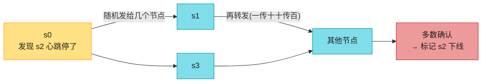

**机制**(背熟):
1. 每个节点维护**成员列表(member ID + heartbeat)**。
2. 定期**心跳计数器 +1**。
3. 定期把心跳**发给一组随机节点**,收到者再传播(流言扩散)。
4. **心跳超时未更新** → 标记下线,扩散给全网。

> 💡 **为什么用 Gossip**:去中心化、可扩展(O(log N) 收敛)、无需中心协调者。Cassandra/Dynamo/Consul 都用。

---

## 8.5 读修复(Read Repair)——最常被忽略的修复机制 ⭐

Dynamo/Cassandra 有**三种**副本修复机制,面试常考"怎么修",要会数全:

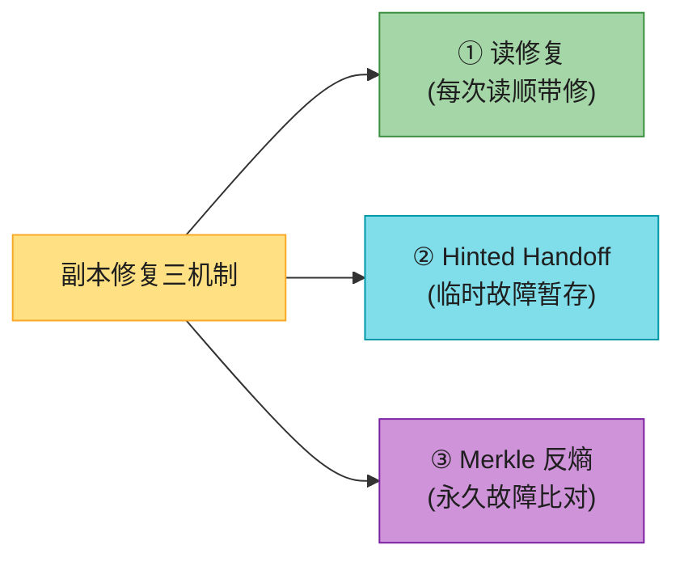

**读修复机制**(Coordinator 读 R 个副本时,发现某个副本版本旧):
1. 读时返回最新值给客户端。
2. **顺手把最新值回写到那个旧副本**——下次它就一致了。

> 💡 **为什么重要**:这是**最轻量、最常发生**的修复——每次读都顺带做,无需等故障触发。**只对"被读到的热 key"有效**,冷 key 还是要靠 Merkle 反熵兜底。三者配合:读修复修热数据,hinted handoff 修临时故障,Merkle 修永久故障 + 冷数据。

> 🪤 **追问陷阱**:"副本不一致怎么自动修?" → **三机制**:① 读修复(读时回写旧副本,修热数据);② hinted handoff(临时故障暂存,恢复移交);③ Merkle 反熵(永久故障,按差异桶同步)。冷 key 靠 Merkle 兜底。

---

## 9. 临时故障:Sloppy Quorum + Hinted Handoff

### Sloppy Quorum(宽松仲裁)

分区时,严格的 W/R 可能凑不齐(副本宕机)。**Sloppy quorum**:不强求原 N 个副本,而是在环上取**前 W/R 个健康节点**(可能是"替补"节点)。

### Hinted Handoff(提示移交)

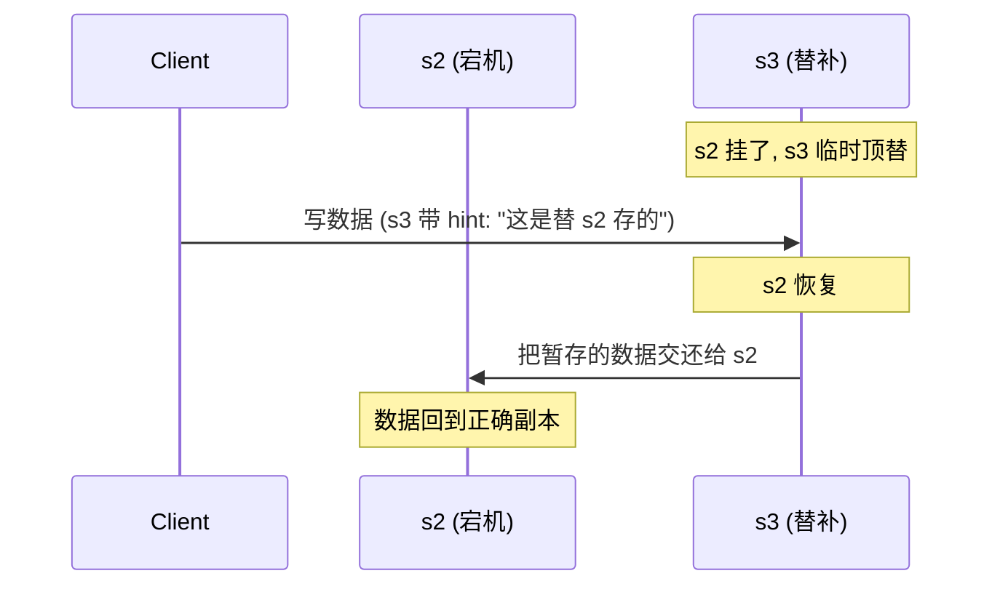

> 💡 **机制**:s2 挂时,s3 临时处理它的读写,并带"hint"(备注:替 s2 存的)。s2 恢复后,s3 把数据**移交**回去。保证可用性 + 最终一致。

---

## 10. 永久故障:Merkle 树反熵

**问题**:某副本**永久**下线(硬盘坏),hinted handoff 不够。要把别的副本数据同步过来——但**怎么高效对比哪些数据不一致**?

### Merkle 树(哈希树)

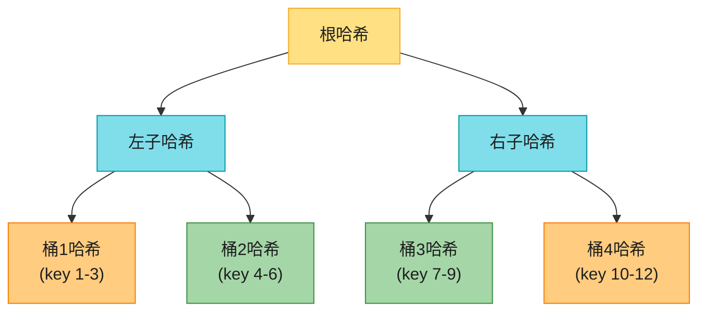

**对比流程**:
1. 把 key 空间分桶(如 10 亿 key / 100 万桶 = 每桶 1000 key)。
2. 每桶算哈希,自底向上建 Merkle 树。
3. 两副本**先比根哈希**:相同 → 完全一致;不同 → 递归比左右子树,定位到差异桶。
4. **只同步差异桶**,不是全量。

> 💡 **核心收益**:同步量正比于**差异大小**,不是数据总量。10 亿 key 只差 1000 个,只同步那 1 个桶。

> 📝 **名词注释**:**反熵(anti-entropy)** = 检测并修复副本间不一致的过程。Merkle 树是它的核心工具。

---

## 11. 整体架构

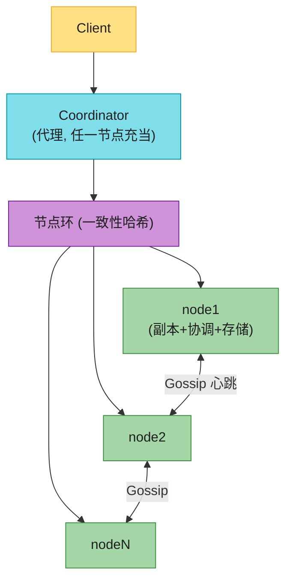

**特点**(背熟):
- 客户端用 `get/put` API。
- **Coordinator**:任一节点都可当代理(把请求路由到正确副本)。
- 节点在环上(一致性哈希)。
- **完全去中心化**——每节点职责相同,**无单点**。

---

## 12. 写路径(LSM 树)⭐⭐⭐⭐


**写流程**(Cassandra 风格):
1. **commit log**:顺序写盘(崩溃恢复用,append-only,极快)。
2. **memtable**:写内存(有序)。
3. memtable 满 → **flush 到 SSTable**(Sorted-String Table,磁盘有序 KV)。
4. 后台 **compaction** 合并多个 SSTable,去旧版本。

> 💡 **为什么写极快**:顺序写 commit log + 写内存,**不随机写盘**。这是 LSM(Log-Structured Merge)树的核心——**用顺序写换写吞吐**。

> 📝 **SSTable**:磁盘上的有序 `<key, value>` 表。不可变(immutable),只追加。

---

## 13. 读路径(Bloom filter + SSTable)⭐⭐⭐⭐

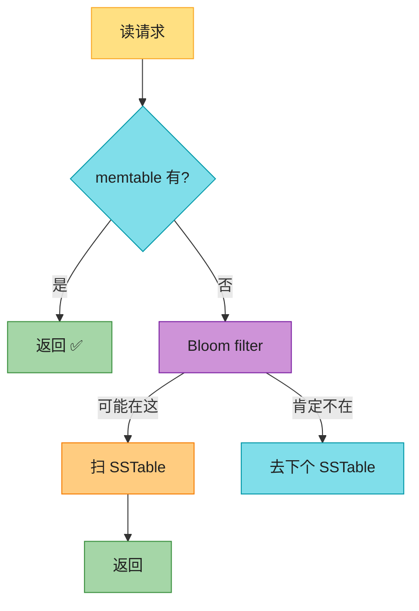

**读流程**:
1. 先查 **memtable**(内存)。
2. 没有 → 查 **Bloom filter**(判断 key 可能在哪个 SSTable)。
3. Bloom filter 说"可能在" → 扫对应 SSTable;说"肯定不在" → 跳过。
4. 返回结果。

> 📝 **Bloom filter**:概率数据结构。说"不在"就**肯定不在**;说"在"**可能误报**。用来避免扫所有 SSTable。

---

#### 深入:LSM 树 vs B 树 ⭐⭐(原书没讲,面试常对比)

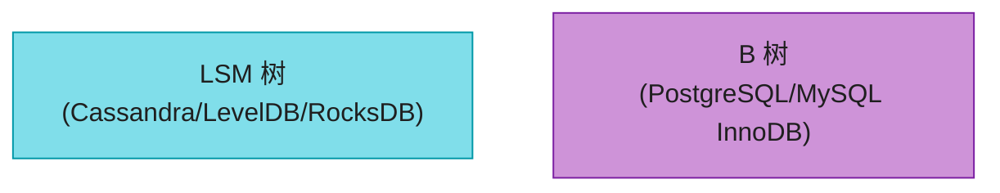

| 维度 | LSM 树 | B 树 |
|------|--------|------|
| 写吞吐 | **极快**(顺序写 + 内存) | 慢(随机写 + 改页) |
| 读延迟 | 较慢(查多层 SSTable) | **快**(一次磁盘查找) |
| 空间放大 | 有(多版本 + compaction 前) | 小(原地更新) |
| 写放大 | **高**(compaction 把数据重写多遍,是 LSM 痛点) | 中(改一行写整页 + WAL) |
| 读放大 | 高(查多层 + Bloom filter 兜底) | 低(一次查找) |
| 适合 | **写多读少**(日志、时序) | **读多写少**(OLTP) |
| 代表 | Cassandra/LevelDB/RocksDB | PostgreSQL/MySQL |

> 🪤 **追问陷阱**:"为什么 LSM 写快读慢?" → "写只追加(顺序写盘 + 内存),极快;但读要查 memtable + 多层 SSTable(虽然 Bloom filter 加速),比 B 树一次查找慢。**这是写吞吐和读延迟的根本权衡**。"

> 🪤 **追问陷阱**:"LSM 写得快,写放大也小吗?" → "**不是**,别混淆**写吞吐**和**写放大**。LSM 写吞吐高(顺序 IO),但**写放大高**——compaction 把每个 key 重写多遍(多层合并)。B 树写放大来自'改一行写整页 + WAL',相对可控。LSM 用'高写放大 + 高空间放大'换'高写吞吐'——所以才有 WiscKey/PebblesDB 等优化 compaction 的工作。"

> 🔄 **2026 现代版话术**:"现在很多数据库**两者结合**:TiDB/TiKV 用 LSM(TiKV)+ 事务层;PostgreSQL 也开始有列存扩展。**存储引擎选型本质是读写比的权衡**。"

---

## 14. 2026 现代 KV 存储对照

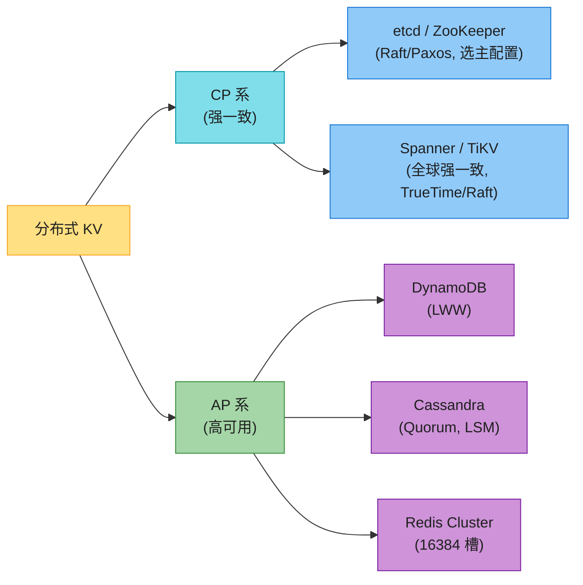

| 产品 | CAP | 一致性 | 分片 | 共识 |
|------|-----|--------|------|------|
| **Cassandra** | AP | Quorum 可调 | 一致性哈希(vnode) | 无(去中心化) |
| **DynamoDB** | AP | LWW | 一致性哈希 | 无 |
| **Redis Cluster** | AP | 主从异步(故障切换可丢已确认写) | 16384 槽 | 无 |
| **etcd** | CP | 强一致(Raft) | 单区域 | **Raft** |
| **TiKV / Spanner** | CP | 全球强一致 | Range 分片 | **Raft / Paxos** |

> 💡 **etcd/ZooKeeper 用 Raft/Paxos 共识算法**做到 CP(多数派同意才提交)。这和 Dynamo/Cassandra 的 Quorum 是两条路——**Quorum 是可调的(任意 W+R>N),Raft 是严格多数派(N/2+1)**。Raft/Paxos 是单独的大专题(强一致共识),面试问到再展开。

---

## ⚠️ 已过时 / 书里没说(2020 → 2026)

| 原书 | 2026 现状 | 面试应对 |
|------|----------|---------|
| 向量时钟当核心 | **Cassandra 早改 LWW**,向量时钟生产极少用 | 主动说"Cassandra 用 LWW,向量时钟理论意义大" |
| 没提 Raft/Paxos | **etcd/ZooKeeper/TiKV 全用 Raft/Paxos** | 主动提共识算法(Ch10) |
| 没提 Redis Cluster | Redis 用 **16384 槽**(类一致性哈希) | 提一句 Redis 分片 |
| 没对比 LSM vs B 树 | 这是面试**常考对比** | 背上面的对比表 |
| Dynamo 为蓝本 | DynamoDB 已演化(托管、global table) | 提现代 DynamoDB |

---

## 🪤 追问陷阱

1. **"CAP 怎么选?"** → 看数据:账户/配置选 CP(Spanner/etcd);timeline/计数选 AP(Cassandra)。
2. **"W+R>N 为什么强一致?"** → 读写集合必有交集(巢),交集副本有最新值。
3. **"W=1 是只写一个副本吗?"** → 不是,写所有副本,W=1 是 ack 数。
4. **"向量时钟缺点?"** → 客户端写合并逻辑 + 向量膨胀。现实用 LWW/CRDT。
5. **"Gossip 为什么不用广播?"** → 全量广播 O(N²) 太贵;Gossip O(log N) 收敛,去中心化。
6. **"LSM 为什么写快?"** → 顺序写 + 内存,不随机写盘。
7. **"LSM 读慢怎么优化?"** → Bloom filter 跳过无关 SSTable + compaction 控制层级。
8. **"Sloppy quorum 和严格 quorum 区别?"** → 严格的用原 N 个副本(宕机可能凑不齐);sloppy 用健康替补(hinted handoff 暂存)。

---

## 🏭 生产级产品速查表

| 产品 | 定位 | 特点 |
|------|------|------|
| **Cassandra** | AP, LSM | Quorum 可调,去中心化,时序/日志首选 |
| **DynamoDB** | AP, 托管 | AWS 托管,LWW,global table |
| **Redis Cluster** | AP(内存) | 16384 槽分片,主从异步 |
| **etcd** | CP | Raft 强一致,K8s 配置中心 |
| **TiKV** | CP | Raft + LSM + Range 分片,TiDB 底座 |
| **Spanner** | CP | TrueTime 全球强一致 |
| **HBase** | CP | BigTable 风格,列族 |

---

## 📝 本章要点总结


**核心 Takeaways**:

1. **CAP 选型看数据**:账户/配置 CP,社交/计数 AP。CA 不存在。
2. **Quorum W+R>N 强一致**:鸽巢原理【Pigeonhole principle】,读写集合必有交集。N=3/W=2/R=2 是主流。
3. **向量时钟理论优雅,现实少用**:Cassandra 用 LWW,要会区分。
4. **Gossip 去中心化故障检测**:O(log N) 收敛。
5. **临时故障 hinted handoff,永久 Merkle 反熵**:Merkle 树让同步量正比于差异。
6. **LSM 写快读慢**:顺序写 + 内存 vs B 树的随机写。读写比决定选型。
7. **现代 CP 用 Raft**(etcd/TiKV),不是 Quorum——Quorum 可调,Raft 严格多数派(另属共识算法专题)。

> 🔗 **连接下一章**:Ch6 是复杂的分布式存储;**Ch7 回到一个小的但高频的构件——分布式唯一 ID**(雪花算法),它是上面所有分布式系统的"身份"基础。
