# Chapter 6: 设计键值存储 (Design a Key-Value Store)

> **本章定位**:这是全书**信息密度最高、最像真实分布式系统**的一章。它把 Ch1(复制/分片/CAP)、Ch5(一致性哈希)全用上,构建一个 **Dynamo / Cassandra 风格的分布式 KV**。掌握这章,你就掌握了分布式存储的"全家桶":CAP、Quorum、向量时钟、Gossip、Merkle 树、LSM 树。

> **本章和原书的区别**:原书讲得全但偏论文堆砌。本章补:**Quorum W+R>N 手算证明**、**向量时钟的现实(Cassandra 早就改 LWW)**、**LSM vs B 树对比**、**2026 现代实现(Redis Cluster/TiKV/Spanner/etcd Raft)**,并把 CAP 和 Ch1 的"多机房写冲突"打通。

---

## 🎯 面试怎么答(被问到"设计一个分布式 KV 存储"时)

**开场话术**(直接背):

> "我先定需求:KV 小(<10KB)、大数据、高可用、可调一致性、低延迟。然后按 **CAP 选型 → 分区+复制 → Quorum 一致性 → 故障处理 → 读写路径** 五块讲。本质是复刻 Dynamo/Cassandra。"

**5 步推进**:

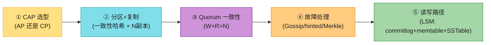

---

## 🗺️ 章节概览

| 小节 | 要点 | 重要性 |
|------|------|--------|
| 需求 | KV<10KB、大数据、高可用、可调一致性、低延迟 | ⭐⭐ |
| **CAP** | CP / AP 取舍(CA 不存在) | ⭐⭐⭐⭐⭐ |
| 分区 | 一致性哈希(Ch5)+ 虚拟节点 | ⭐⭐⭐ |
| 复制 | 顺时针取 N 个副本 | ⭐⭐⭐ |
| **Quorum** | N/W/R,W+R>N 保证强一致 | ⭐⭐⭐⭐⭐ |
| 一致性模型 | strong / eventual | ⭐⭐⭐ |
| 不一致解决 | 向量时钟(理论)→ LWW(现实) | ⭐⭐⭐ |
| 故障检测 | Gossip 协议 | ⭐⭐⭐ |
| 临时故障 | Sloppy quorum + hinted handoff | ⭐⭐⭐ |
| 永久故障 | Merkle 树反熵 | ⭐⭐⭐ |
| **写路径** | commit log → memtable → SSTable(LSM) | ⭐⭐⭐⭐ |
| **读路径** | memtable → Bloom filter → SSTable | ⭐⭐⭐⭐ |

---

## 1. 需求 + 单机 vs 分布式

**需求**(原书):
- KV 小(<10 KB)
- 存大数据
- 高可用(故障也快速响应)
- 高扩展(自动加减节点)
- **可调一致性**(tunable consistency)⭐
- 低延迟

**单机 KV** = 一个哈希表(全内存)。优化:压缩 + 热数据内存/冷数据落盘。但单机容量有限 → **必须分布式**。

---

## 2. CAP 定理 ⭐⭐⭐⭐⭐

### 定义(背熟)

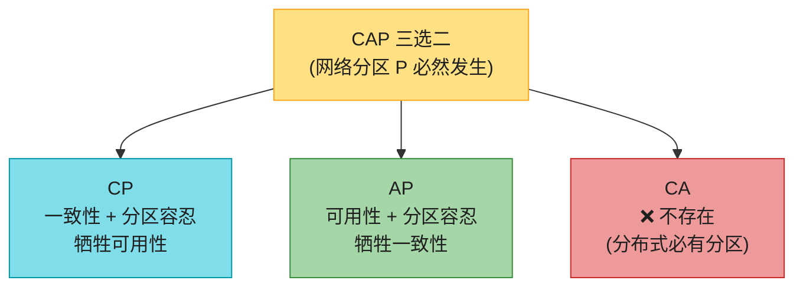

| 性质 | 含义 |
|------|------|
| **C (Consistency)** | 所有客户端**同时**看到相同数据,无论连哪个节点 |
| **A (Availability)** | 任何请求都有响应,即使部分节点宕机 |
| **P (Partition Tolerance)** | 网络分区时系统继续工作 |

> ⚠️ **关键认知(Ch1 已铺垫,这里强化)**:**P 是必然**(网络必断),所以**CA 在分布式系统中不存在**。实际选择是 **CP vs AP**。

### 理想 vs 真实分区

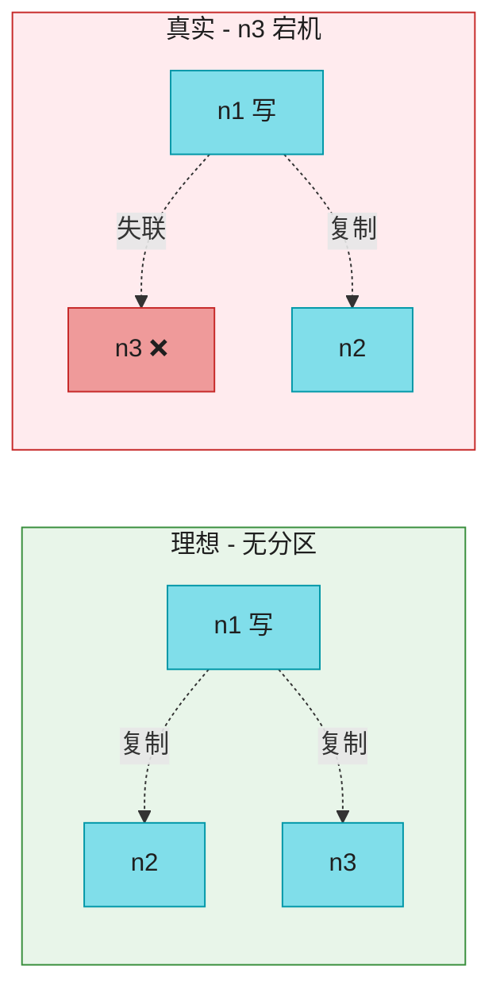

**分区时二选一**:

| 选 CP(银行) | 选 AP(社交) |
|------------|------------|
| 阻塞写,返回错误 | 继续接受读写 |
| 保证强一致 | 容忍 stale 数据 |
| 分区时不可用 | 始终可用 |
| 网络恢复后无需合并 | 网络恢复后要合并冲突 |

> 🔄 **2026 现代版话术**:"KV 存储的 CAP 选型看场景:**社交 timeline/购物车/计数器用 AP**(Cassandra/Dynamo);**账户余额/配置中心/选主用 CP**(Spanner/etcd/ZooKeeper)。**不是全局选一个,而是按数据类型选**。"

> 🪤 **追问陷阱**:"为什么 CA 不存在?" → "分布式系统**网络分区不可避免**(网线断、交换机挂、机房失联)。P 必然发生,所以只能在 C 和 A 之间取舍,没有 CA。"

---

## 3. 数据分区(Ch5 一致性哈希)

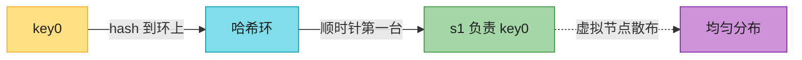

**两个优势**(原书):
1. **自动扩展**:按负载加减节点。
2. **异构性**:强机器分配更多虚拟节点(Ch5 讲过)。

> 🔗 详见 **Ch5**。这里不重复手算。

---

## 4. 数据复制(N 个副本)


**规则**:key 落环后,顺时针取前 N 台服务器存副本。**副本跨机房放置**(同机房一起挂)。

> 📝 **N=3 是常用默认**。虚拟节点可能让前 N 个虚拟节点属于同一物理机,所以要**跳过重复物理机,取 N 个不同的**。

---

## 5. Quorum 共识 ⭐⭐⭐⭐⭐(本章核心)

### 三个参数

| 参数 | 含义 |
|------|------|
| **N** | 副本数 |
| **W** | 写仲裁:写需 **W 个副本 ack** 才算成功 |
| **R** | 读仲裁:读需 **R 个副本响应** 才算成功 |

### W + R > N = 强一致(手算证明)⭐

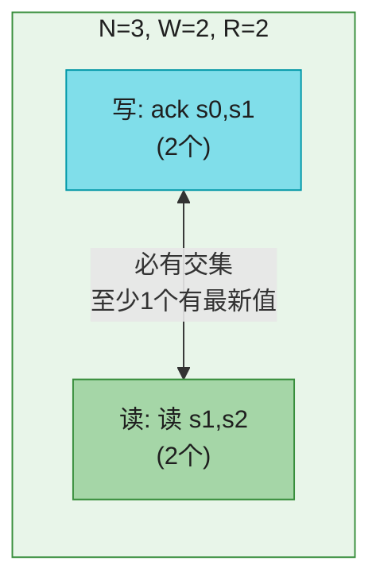

**为什么 W+R>N 保证读到最新值?**
- 写确认了 W 个副本有新值。
- 读查询了 R 个副本。
- W + R > N → **读集合和写集合必有交集**(鸽巢原理)→ 交集中至少一个副本有最新值 → 读时取版本最高的即可。

**手算**:N=3, W=2, R=2。写进 s0/s1(ack 2 个)。读 s1/s2(s1 同时在写集和读集)→ s1 有最新值 → 返回。

### Quorum 配置权衡

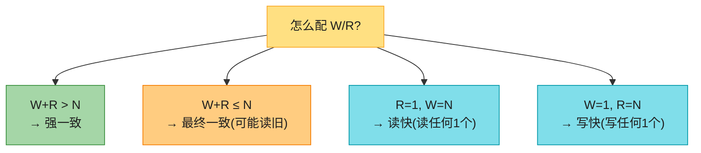

| 配置 | 行为 | 适用 |
|------|------|------|
| **W=R=1, N=3** | 极快,可能读旧 | 缓存 |
| **W=2, R=2, N=3**(常用) | 强一致,延迟可接受 | **主流业务** |
| W=3, R=1 | 写慢读快 | 读多写少 |
| W=1, R=3 | 写快读慢 | 写多读少 |

> 🪤 **追问陷阱**:"W=1 是不是只写了一个副本?" → "**不是**。数据仍写所有 N 个副本,W=1 只是**协调者收到 1 个 ack 就返回**,其余继续异步写。所以 W 是'确认数'不是'写入数'。"

---

## 6. 一致性模型


> 💡 **Dynamo / Cassandra 选最终一致**(高可用优先)。强一致要"所有副本同意才能继续"→ 阻塞 → 不适合高可用。

---

## 7. 不一致解决:版本 + 向量时钟

### 冲突怎么产生

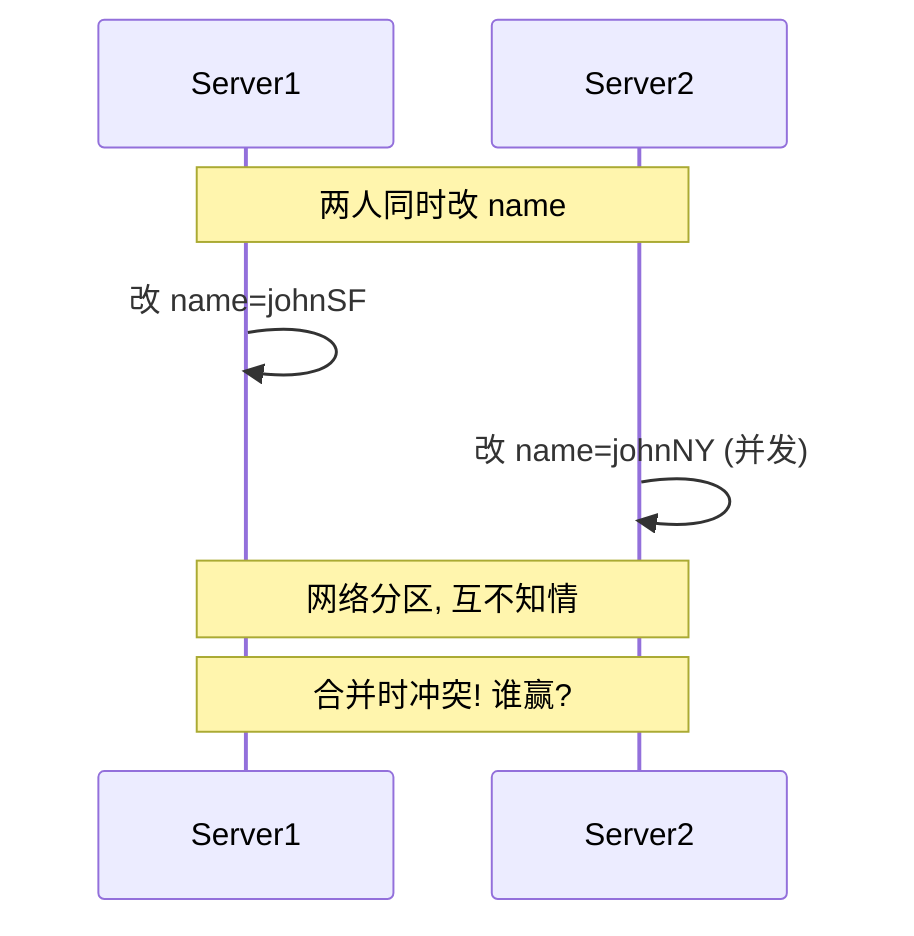

### 向量时钟(理论解法,原书重点)

向量时钟 = `[server, version]` 对的列表,用来判断版本间是**祖先关系(无冲突)**还是**兄弟关系(冲突)**。

**手算例子**(原书):
```
D1 [(Sx,1)]                              // 写 D1,经 Sx
D2 [(Sx,2)]                              // 改 D1,仍 Sx → D1 是 D2 祖先
D3 [(Sx,2),(Sy,1)]                       // 基于 D2 改,经 Sy
D4 [(Sx,2),(Sz,1)]                       // 基于 D2 改,经 Sz (并发于 D3!)
→ 读 D3,D4 发现冲突 → 客户端合并 → D5 [(Sx,3),(Sy,1),(Sz,1)]
```

**判断规则**:
- X 是 Y 祖先(无冲突):Y 的每个分量 ≥ X 对应分量。
- X 和 Y 兄弟(冲突):存在某分量 X > Y 且另一分量 Y > X。

### ⚠️ 向量时钟的现实(原书没讲)⭐

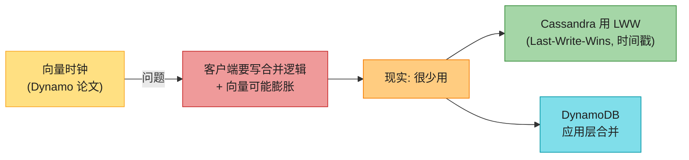

> 🔄 **2026 现代版话术**(原书把向量时钟当核心,但现实很少用):
> "向量时钟理论上优雅,但**要求客户端写冲突合并逻辑,且向量会膨胀**(要设阈值截断)。**生产系统很少用**:Cassandra 直接 **LWW(最后写入获胜,按时间戳)**;DynamoDB 让应用层合并;只有 Riak 真用向量时钟。**面试说一句'Cassandra 早改 LWW 了'会显得很懂**。"

> 🪤 **追问陷阱**:"LWW 不就丢数据吗?" → "**是**。LWW 会丢并发写里'输'的那个。所以**只适合值可覆盖的场景**(如状态、计数器用 CRDT)。敏感数据要应用层合并或用 CRDT。"

---

## 8. 故障检测:Gossip 协议 ⭐

**问题**:分布式系统里,**不能因为一台服务器说'X 挂了'就信**——要**至少两个独立来源**确认。全量广播(all-to-all)太贵。

### Gossip(流言协议)

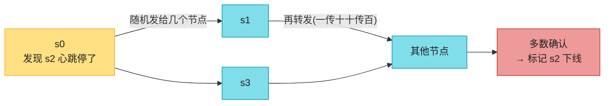

**机制**(背熟):
1. 每个节点维护**成员列表(member ID + heartbeat)**。
2. 定期**心跳计数器 +1**。
3. 定期把心跳**发给一组随机节点**,收到者再传播(流言扩散)。
4. **心跳超时未更新** → 标记下线,扩散给全网。

> 💡 **为什么用 Gossip**:去中心化、可扩展(O(log N) 收敛)、无需中心协调者。Cassandra/Dynamo/Consul 都用。

---

## 8.5 读修复(Read Repair)——最常被忽略的修复机制 ⭐

Dynamo/Cassandra 有**三种**副本修复机制,面试常考"怎么修",要会数全:

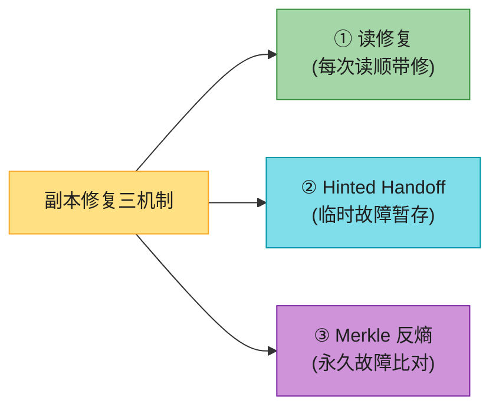

**读修复机制**(Coordinator 读 R 个副本时,发现某个副本版本旧):
1. 读时返回最新值给客户端。
2. **顺手把最新值回写到那个旧副本**——下次它就一致了。

> 💡 **为什么重要**:这是**最轻量、最常发生**的修复——每次读都顺带做,无需等故障触发。**只对"被读到的热 key"有效**,冷 key 还是要靠 Merkle 反熵兜底。三者配合:读修复修热数据,hinted handoff 修临时故障,Merkle 修永久故障 + 冷数据。

> 🪤 **追问陷阱**:"副本不一致怎么自动修?" → **三机制**:① 读修复(读时回写旧副本,修热数据);② hinted handoff(临时故障暂存,恢复移交);③ Merkle 反熵(永久故障,按差异桶同步)。冷 key 靠 Merkle 兜底。

---

## 9. 临时故障:Sloppy Quorum + Hinted Handoff

### Sloppy Quorum(宽松仲裁)

分区时,严格的 W/R 可能凑不齐(副本宕机)。**Sloppy quorum**:不强求原 N 个副本,而是在环上取**前 W/R 个健康节点**(可能是"替补"节点)。

### Hinted Handoff(提示移交)

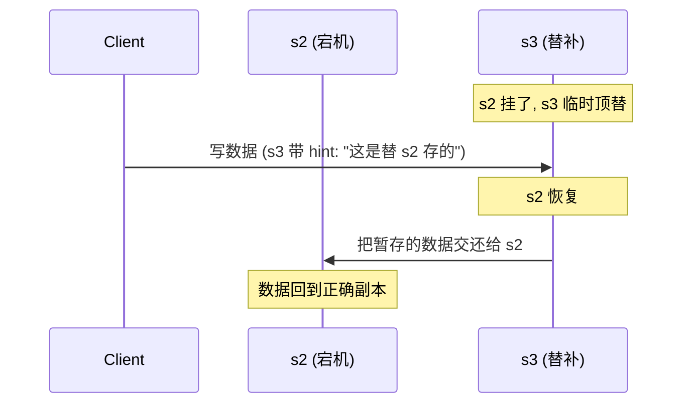

> 💡 **机制**:s2 挂时,s3 临时处理它的读写,并带"hint"(备注:替 s2 存的)。s2 恢复后,s3 把数据**移交**回去。保证可用性 + 最终一致。

---

## 10. 永久故障:Merkle 树反熵

**问题**:某副本**永久**下线(硬盘坏),hinted handoff 不够。要把别的副本数据同步过来——但**怎么高效对比哪些数据不一致**?

### Merkle 树(哈希树)

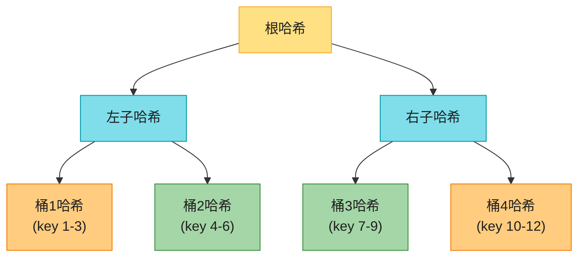

**对比流程**:
1. 把 key 空间分桶(如 10 亿 key / 100 万桶 = 每桶 1000 key)。
2. 每桶算哈希,自底向上建 Merkle 树。
3. 两副本**先比根哈希**:相同 → 完全一致;不同 → 递归比左右子树,定位到差异桶。
4. **只同步差异桶**,不是全量。

> 💡 **核心收益**:同步量正比于**差异大小**,不是数据总量。10 亿 key 只差 1000 个,只同步那 1 个桶。

> 📝 **名词注释**:**反熵(anti-entropy)** = 检测并修复副本间不一致的过程。Merkle 树是它的核心工具。

---

## 11. 整体架构

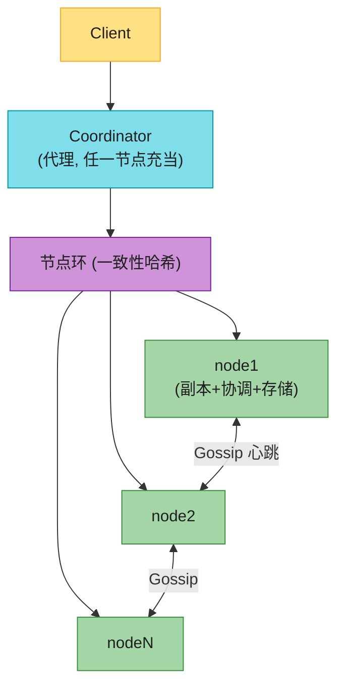

**特点**(背熟):
- 客户端用 `get/put` API。
- **Coordinator**:任一节点都可当代理(把请求路由到正确副本)。
- 节点在环上(一致性哈希)。
- **完全去中心化**——每节点职责相同,**无单点**。

---

## 12. 写路径(LSM 树)⭐⭐⭐⭐


**写流程**(Cassandra 风格):
1. **commit log**:顺序写盘(崩溃恢复用,append-only,极快)。
2. **memtable**:写内存(有序)。
3. memtable 满 → **flush 到 SSTable**(Sorted-String Table,磁盘有序 KV)。
4. 后台 **compaction** 合并多个 SSTable,去旧版本。

> 💡 **为什么写极快**:顺序写 commit log + 写内存,**不随机写盘**。这是 LSM(Log-Structured Merge)树的核心——**用顺序写换写吞吐**。

> 📝 **SSTable**:磁盘上的有序 `<key, value>` 表。不可变(immutable),只追加。

---

## 13. 读路径(Bloom filter + SSTable)⭐⭐⭐⭐

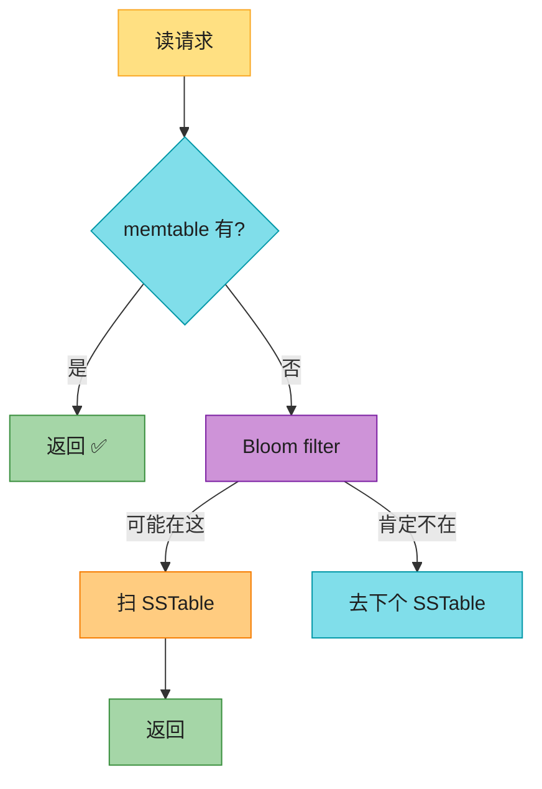

**读流程**:
1. 先查 **memtable**(内存)。
2. 没有 → 查 **Bloom filter**(判断 key 可能在哪个 SSTable)。
3. Bloom filter 说"可能在" → 扫对应 SSTable;说"肯定不在" → 跳过。
4. 返回结果。

> 📝 **Bloom filter**:概率数据结构。说"不在"就**肯定不在**;说"在"**可能误报**。用来避免扫所有 SSTable。

---

#### 深入:LSM 树 vs B 树 ⭐⭐(原书没讲,面试常对比)

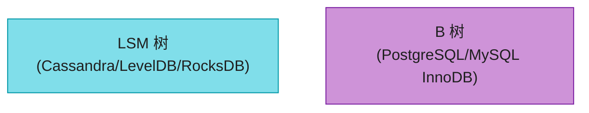

| 维度 | LSM 树 | B 树 |
|------|--------|------|
| 写吞吐 | **极快**(顺序写 + 内存) | 慢(随机写 + 改页) |
| 读延迟 | 较慢(查多层 SSTable) | **快**(一次磁盘查找) |
| 空间放大 | 有(多版本 + compaction 前) | 小(原地更新) |
| 写放大 | **高**(compaction 把数据重写多遍,是 LSM 痛点) | 中(改一行写整页 + WAL) |
| 读放大 | 高(查多层 + Bloom filter 兜底) | 低(一次查找) |
| 适合 | **写多读少**(日志、时序) | **读多写少**(OLTP) |
| 代表 | Cassandra/LevelDB/RocksDB | PostgreSQL/MySQL |

> 🪤 **追问陷阱**:"为什么 LSM 写快读慢?" → "写只追加(顺序写盘 + 内存),极快;但读要查 memtable + 多层 SSTable(虽然 Bloom filter 加速),比 B 树一次查找慢。**这是写吞吐和读延迟的根本权衡**。"

> 🪤 **追问陷阱**:"LSM 写得快,写放大也小吗?" → "**不是**,别混淆**写吞吐**和**写放大**。LSM 写吞吐高(顺序 IO),但**写放大高**——compaction 把每个 key 重写多遍(多层合并)。B 树写放大来自'改一行写整页 + WAL',相对可控。LSM 用'高写放大 + 高空间放大'换'高写吞吐'——所以才有 WiscKey/PebblesDB 等优化 compaction 的工作。"

> 🔄 **2026 现代版话术**:"现在很多数据库**两者结合**:TiDB/TiKV 用 LSM(TiKV)+ 事务层;PostgreSQL 也开始有列存扩展。**存储引擎选型本质是读写比的权衡**。"

---

## 14. 2026 现代 KV 存储对照

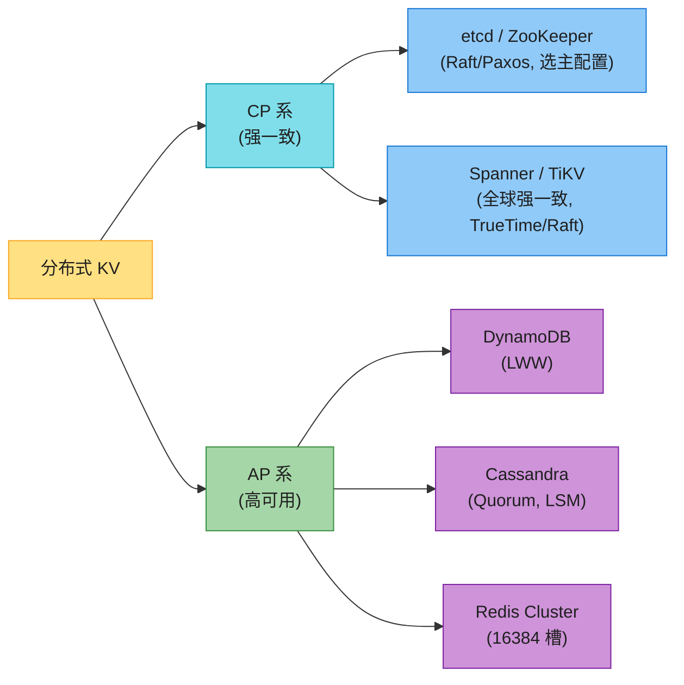

| 产品 | CAP | 一致性 | 分片 | 共识 |
|------|-----|--------|------|------|
| **Cassandra** | AP | Quorum 可调 | 一致性哈希(vnode) | 无(去中心化) |
| **DynamoDB** | AP | LWW | 一致性哈希 | 无 |
| **Redis Cluster** | AP | 主从异步(故障切换可丢已确认写) | 16384 槽 | 无 |
| **etcd** | CP | 强一致(Raft) | 单区域 | **Raft** |
| **TiKV / Spanner** | CP | 全球强一致 | Range 分片 | **Raft / Paxos** |

> 💡 **etcd/ZooKeeper 用 Raft/Paxos 共识算法**做到 CP(多数派同意才提交)。这和 Dynamo/Cassandra 的 Quorum 是两条路——**Quorum 是可调的(任意 W+R>N),Raft 是严格多数派(N/2+1)**。Raft/Paxos 是单独的大专题(强一致共识),面试问到再展开。

---

## ⚠️ 已过时 / 书里没说(2020 → 2026)

| 原书 | 2026 现状 | 面试应对 |
|------|----------|---------|
| 向量时钟当核心 | **Cassandra 早改 LWW**,向量时钟生产极少用 | 主动说"Cassandra 用 LWW,向量时钟理论意义大" |
| 没提 Raft/Paxos | **etcd/ZooKeeper/TiKV 全用 Raft/Paxos** | 主动提共识算法(Ch10) |
| 没提 Redis Cluster | Redis 用 **16384 槽**(类一致性哈希) | 提一句 Redis 分片 |
| 没对比 LSM vs B 树 | 这是面试**常考对比** | 背上面的对比表 |
| Dynamo 为蓝本 | DynamoDB 已演化(托管、global table) | 提现代 DynamoDB |

---

## 🪤 追问陷阱

1. **"CAP 怎么选?"** → 看数据:账户/配置选 CP(Spanner/etcd);timeline/计数选 AP(Cassandra)。
2. **"W+R>N 为什么强一致?"** → 读写集合必有交集(鸽巢),交集副本有最新值。
3. **"W=1 是只写一个副本吗?"** → 不是,写所有副本,W=1 是 ack 数。
4. **"向量时钟缺点?"** → 客户端写合并逻辑 + 向量膨胀。现实用 LWW/CRDT。
5. **"Gossip 为什么不用广播?"** → 全量广播 O(N²) 太贵;Gossip O(log N) 收敛,去中心化。
6. **"LSM 为什么写快?"** → 顺序写 + 内存,不随机写盘。
7. **"LSM 读慢怎么优化?"** → Bloom filter 跳过无关 SSTable + compaction 控制层级。
8. **"Sloppy quorum 和严格 quorum 区别?"** → 严格的用原 N 个副本(宕机可能凑不齐);sloppy 用健康替补(hinted handoff 暂存)。

---

## 🏭 生产级产品速查表

| 产品 | 定位 | 特点 |
|------|------|------|
| **Cassandra** | AP, LSM | Quorum 可调,去中心化,时序/日志首选 |
| **DynamoDB** | AP, 托管 | AWS 托管,LWW,global table |
| **Redis Cluster** | AP(内存) | 16384 槽分片,主从异步 |
| **etcd** | CP | Raft 强一致,K8s 配置中心 |
| **TiKV** | CP | Raft + LSM + Range 分片,TiDB 底座 |
| **Spanner** | CP | TrueTime 全球强一致 |
| **HBase** | CP | BigTable 风格,列族 |

---

## 📝 本章要点总结

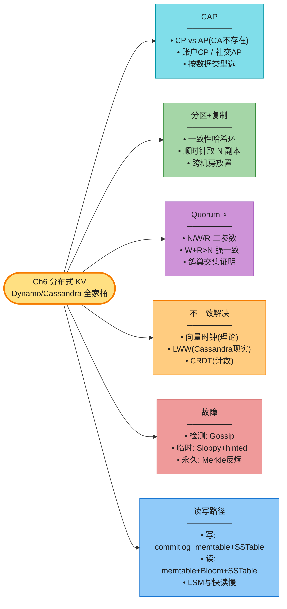

**核心 Takeaways**:

1. **CAP 选型看数据**:账户/配置 CP,社交/计数 AP。CA 不存在。
2. **Quorum W+R>N 强一致**:鸽巢原理,读写集合必有交集。N=3/W=2/R=2 是主流。
3. **向量时钟理论优雅,现实少用**:Cassandra 用 LWW,要会区分。
4. **Gossip 去中心化故障检测**:O(log N) 收敛。
5. **临时故障 hinted handoff,永久 Merkle 反熵**:Merkle 树让同步量正比于差异。
6. **LSM 写快读慢**:顺序写 + 内存 vs B 树的随机写。读写比决定选型。
7. **现代 CP 用 Raft**(etcd/TiKV),不是 Quorum——Quorum 可调,Raft 严格多数派(另属共识算法专题)。

> 🔗 **连接下一章**:Ch6 是复杂的分布式存储;**Ch7 回到一个小的但高频的构件——分布式唯一 ID**(雪花算法),它是上面所有分布式系统的"身份"基础。
