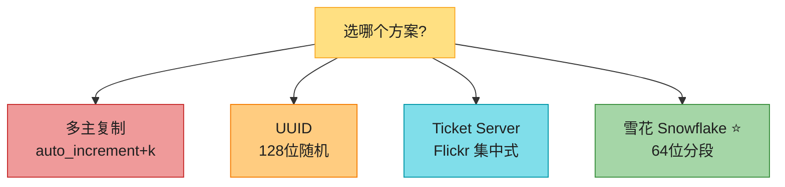
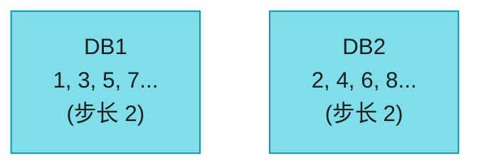
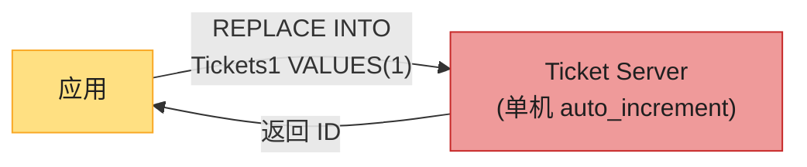
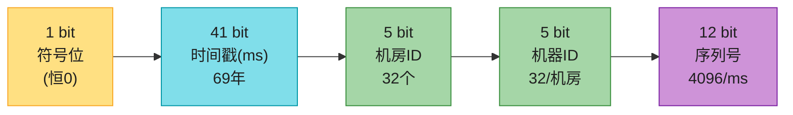
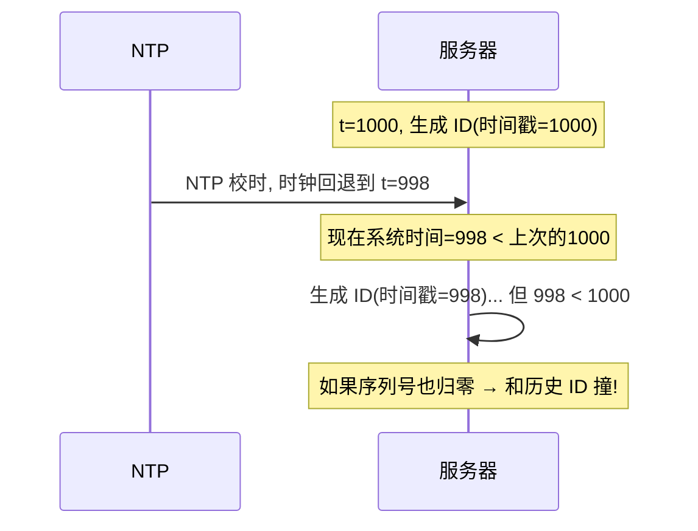
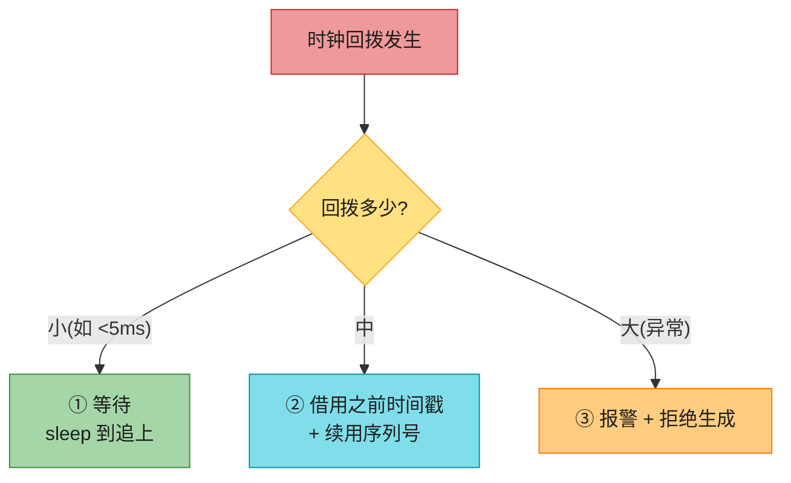
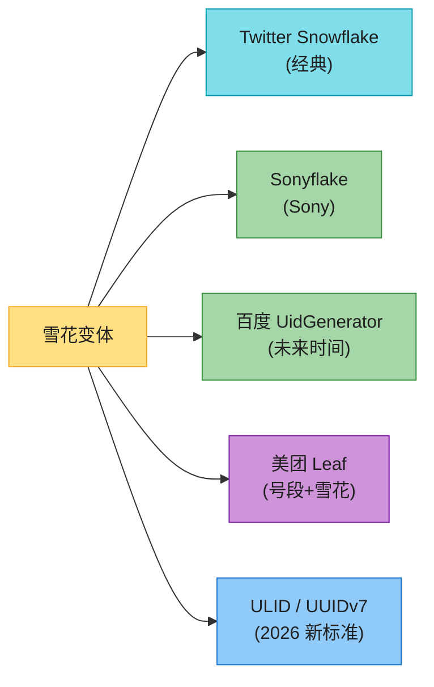
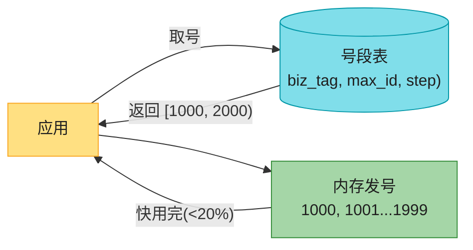
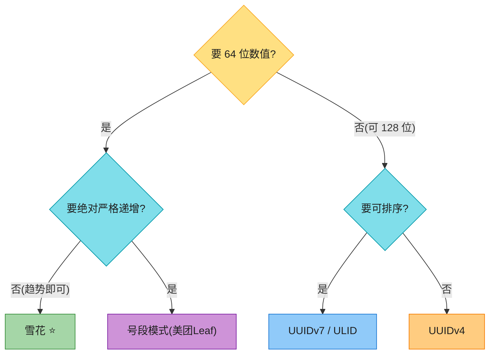
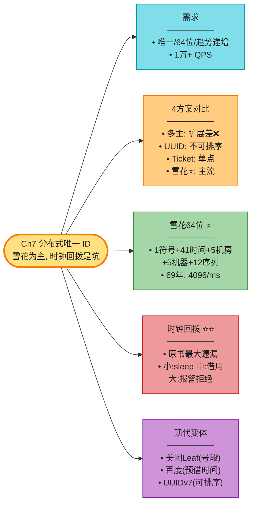

# Chapter 7: 设计分布式唯一 ID (Design a Unique ID Generator)

> **本章定位**:唯一 ID 是所有分布式系统的"身份基础"——订单号、消息号、trace_id、流水号。这道题**小而精**,考的是**方案对比 + 取舍**。原书给了 4 种方案,核心是 Twitter 雪花算法。本章补**雪花手算 + 时钟回拨(原书最大遗漏)+ 号段模式 + 2026 现代变体(Sonyflake/ULID/UUIDv7/美团 Leaf)**。

---

## 🎯 面试怎么答(被问到"设计分布式唯一 ID"时)

**开场话术**(直接背):

> "我先定需求:全局唯一、64 位、**趋势递增**(可排序)、高吞吐(1万+ QPS)。然后对比 4 种方案:多主 / UUID / Ticket Server / **雪花**。**雪花是标准答案**——但要主动讲**时钟回拨**这个坑,这是区分度。"

**4 方案对比**:



---

## 🗺️ 章节概览

| 小节 | 要点 |
|------|------|
| 需求 | 唯一、64 位、趋势递增、1万+ QPS |
| 方案 1:多主复制 | auto_increment + k,扩展差 |
| 方案 2:UUID | 128 位,简单但不可排序 |
| 方案 3:Ticket Server | 集中式,简单但单点 |
| **方案 4:雪花** ⭐ | 64 位分段,主流 |
| **时钟回拨** ⭐ | 雪花最大坑(原书没讲透) |
| 现代变体 | Sonyflake / 美团 Leaf / ULID / UUIDv7 |

---

## 1. 需求澄清(Step 1)

原书对话收敛出 5 个需求:

| 需求 | 说明 |
|------|------|
| **全局唯一** | 不能重复 |
| **数值类型** | 64 位整数 |
| **趋势递增** | 按时间排序(晚发的 ID 大) |
| **高吞吐** | 1 万+ ID/秒 |
| 不要求连续 | 不暴露业务量 |

> 💡 **为什么"趋势递增"而不是"严格递增 1"**:严格 +1 等于自增,分布式难做;趋势递增只要"晚生成的 ID 大",数据库 B+ 树索引友好(避免页分裂)。

---

## 2. 方案 1:多主复制(auto_increment + k)



**做法**:N 台 DB,每台 `auto_increment` 步长 = k(机器数),起始值不同。

| 优点 | 缺点 |
|------|------|
| 复用 DB 能力 | **难跨机房** |
| — | **加机器痛苦**(步长要重算) |
| — | ID **不随时间递增**(DB1 的 100 可能晚于 DB2 的 99) |

> 💡 **结论**:**不推荐**,扩展性差。

---

## 3. 方案 2:UUID

```
09c93e62-50b4-468d-bf8a-c07e1040bfb2   // 128 位
```

| 优点 | 缺点 |
|------|------|
| **无需协调**(各自生成) | **128 位**,超 64 位需求 |
| 不重复概率极高(10 亿/秒 × 100 年才 50% 冲突) | **不递增**(随机) |
| — | 可能非数值(含字母) |
| — | 太长,索引/存储浪费 |

> 💡 **适用**:文档/资源 ID(不要求排序)。**不适合数据库主键**(索引差)。

---

## 4. 方案 3:Ticket Server(Flickr 方案)



**做法**:一台专门 DB 用 `auto_increment` 发号。

| 优点 | 缺点 |
|------|------|
| 数值 ID、简单 | **单点故障**(挂了全瘫) |
| 中小规模可用 | 难扩展(多机要同步) |

> 💡 **解决单点**:多台 Ticket Server 步长分隔(类似方案 1)。但又回到方案 1 的问题。

---

## 5. 方案 4:Twitter 雪花(Snowflake)⭐⭐⭐ 标准答案

### 64 位布局(必背,要会画)



| 段 | 位数 | 含义 | 容量 |
|----|------|------|------|
| 符号位 | 1 | 恒 0 | — |
| **时间戳** | 41 | 自定义 epoch 起的毫秒 | **69 年** |
| 机房 ID | 5 | datacenter | 32 个机房 |
| 机器 ID | 5 | machine/进程 | 每机房 32 台 |
| **序列号** | 12 | 同毫秒内递增 | **4096/ms** |

### 容量手算(背熟)

```
时间戳: 2^41 - 1 = 2,199,023,255,551 ms
       ≈ 2.199 × 10^12 ms / 1000 / 86400 / 365 ≈ 69 年

序列号: 2^12 = 4096/ms → 单机 4096 × 1000 = 4,096,000 ID/秒

机房×机器: 2^5 × 2^5 = 32 × 32 = 1024 台机器
```

> 💡 **关键设计**:**时间戳在高位** → ID 趋势递增(晚生成的一定大)。这是雪花的精髓。

> 🪤 **追问陷阱:"worker_id(machine_id) 怎么分配?"**(高频运维追问)→ 三种做法:① **配置文件手填**(简单但易错,两台填一样 → 重复 ID);② **ZooKeeper/etcd 启动时自动领号**(Twitter 原版做法,节点注册拿唯一 ID,宕机释放);③ **DB 表分配**(启动 `INSERT ... RETURNING`)。生产用 ②,避免人为撞号。

### 为什么 41+5+5+12 = 63(+1 符号 = 64)

正好 64 位,`long` 类型。这是 Twitter 精心设计的。

> 🪤 **追问陷阱**:"为什么时间戳用 41 位不是 42?" → "留 1 位符号位(恒 0,保证 ID 是正数)。41 位时间戳 = 69 年,够用;到期换 epoch 或迁移。"

---

## 6. 时钟回拨 ⭐⭐⭐(原书最大遗漏)

**这是雪花算法最棘手的坑**,原书只说"用 NTP 解决",但生产环境时钟回拨天天发生。

### 问题:时钟回拨导致重复 ID



**根因**:雪花依赖**单调递增的时钟**。但 NTP 校时、虚拟机迁移、闰秒会让时钟**往回跳**,导致新生成的 ID 比旧的小,甚至重复。

### 解法(必背)



| 策略 | 做法 | 适用 |
|------|------|------|
| **等待(sleep)** | 回拨小,等到时钟追上再生成 | 回拨 < 几 ms |
| **借用上次时间戳** | 用上次最大时间戳 + 序列号续用 | 回拨中等 |
| **报警拒绝** | 回拨异常大,直接报错 | 回拨大(机器有问题) |
| **本地时钟** | 不依赖系统时钟,用本地单调时钟 | 高精度场景 |

> 🔄 **2026 现代版话术**(原书只说 NTP):
> "雪花算法最大的坑是**时钟回拨**——NTP 校时、VM 迁移、闰秒都会让时钟往回跳,导致 ID 重复或乱序。生产解法:**回拨小就 sleep 等待,中等就借用上次时间戳 + 序列号续用,大就报警拒绝**。百度 UidGenerator 用未来时间预借,Sonyflake 限制回拨只 sleep。**面试主动讲这个坑会非常加分**。"

---

## 7. 雪花的现代变体(原书没讲)



| 变体 | 改进点 | 特点 |
|------|--------|------|
| **Twitter Snowflake** | 经典 64 位 | 时钟回拨靠 NTP |
| **Sonyflake** | 时间戳 39 位 + 8 位序列(256/10ms) | 回拨只 sleep,更保守 |
| **百度 UidGenerator** | **预借未来时间戳** | 永不回拨,但 ID 超前 |
| **美团 Leaf** | **号段模式 + 雪花双方案** | 号段模式抗时钟回拨 |
| **ULID / UUIDv7** | 128 位 + 时间戳前缀 | 可排序的 UUID,2026 主流 |

### 号段模式(美团 Leaf-segment)⭐



**机制**:DB 存每个业务的 `max_id` 和步长 `step`。应用一次取一个号段(如 1000 个),在内存里发号,快用完再取。**DB 压力降 1000 倍**,且号段在内存里发,**不依赖时钟**。

> 💡 **号段 vs 雪花**:号段模式简单、抗时钟回拨,但需要 DB;雪花无中心、性能高,但有时钟回拨。**美团 Leaf 把两者结合**:双 buffer 号段 + 雪花兜底。

### ULID / UUIDv7(2026 现代)


> 🔄 **2026 趋势**:**UUIDv7** 是 2024 标准化的"可排序 UUID"(时间戳前缀 + 随机)。它解决了传统 UUID"不可排序"的痛点,正逐步取代 UUIDv4。如果不需要 64 位数值,UUIDv7 是 2026 首选。

---

## 8. 方案决策表(背熟)



| 方案 | 唯一 | 排序 | 长度 | 依赖 | 适用 |
|------|------|------|------|------|------|
| 多主复制 | ✅ | ❌ | 64 | DB | ❌ 不推荐 |
| UUID v4 | ✅ | ❌ | 128 | 无 | 资源 ID |
| Ticket Server | ✅ | ✅ | 64 | 单 DB | 中小规模 |
| **雪花** ⭐ | ✅ | ✅趋势 | 64 | 时钟 | **主流** |
| 号段(Leaf) | ✅ | ✅严格 | 64 | DB | 强一致 |
| **UUIDv7** | ✅ | ✅趋势 | 128 | 无 | **2026 新标准** |

---

## 💻 代码示例(雪花算法 + 时钟回拨处理)

```python
import time

class Snowflake:
    def __init__(self, datacenter_id, machine_id, epoch=1288834974657):
        self.datacenter_id = datacenter_id   # 5 bit
        self.machine_id = machine_id         # 5 bit
        self.epoch = epoch                   # Twitter 自定义 epoch
        self.last_ts = -1
        self.seq = 0

    def _now(self):
        return int(time.time() * 1000)

    def next_id(self):
        ts = self._now()
        # ★ 时钟回拨处理:回拨小就等待,大就报错
        if ts < self.last_ts:
            diff = self.last_ts - ts
            if diff <= 5:
                time.sleep(diff / 1000)      # 等 5ms
                ts = self._now()
            else:
                raise Exception(f"时钟回拨 {diff}ms, 拒绝生成")
        if ts == self.last_ts:
            self.seq = (self.seq + 1) & 0xFFF  # 12 bit, 4096
            if self.seq == 0:                   # 同毫秒序列用尽
                ts = self._wait_next_ms(ts)
        else:
            self.seq = 0
        self.last_ts = ts
        return ((ts - self.epoch) << 22) | \
               (self.datacenter_id << 17) | \
               (self.machine_id << 12) | \
               self.seq
```

> 💡 **关键**:时钟回拨处理是这段代码的灵魂(原书没有)。面试白板能写出回拨处理 = strong hire 信号。

---

## ⚠️ 已过时 / 书里没说(2020 → 2026)

| 原书 | 2026 现状 | 面试应对 |
|------|----------|---------|
| 时钟回拨只说 NTP | **生产必须处理**(sleep/借用/拒绝) | 主动讲回拨解法 |
| 没提号段模式 | **美团 Leaf 号段**是国产主流 | 提 Leaf 双方案 |
| 没提 UUIDv7 | **UUIDv7(2024 标准)**可排序 | 提 UUIDv7 取代 v4 |
| 雪花是唯一答案 | 大厂各有变体 | 提 Sonyflake/Baidu/Leaf |
| 没提 trace_id 场景 | 分布式追踪 ID 是高频用例 | 提 ID 用于 trace |

---

## 🪤 追问陷阱

1. **"雪花时钟回拨怎么办?"** → 小回拨 sleep 等待,中等借用上次时间戳,大回拨报警拒绝。
2. **"41 位时间戳能用多久?"** → 69 年(2^41 ms)。到期换 epoch。
3. **"为什么用自定义 epoch?"** → 节省时间戳位数(从 1970 算会浪费高位)。
4. **"单机一毫秒最多多少 ID?"** → 4096(12 位序列号)。超出要等下一毫秒。
5. **"号段模式为什么抗回拨?"** → 号段在内存发,不依赖时钟,只依赖 DB 的 max_id。
6. **"UUID 能当数据库主键吗?"** → 不推荐:128 位 + 无序 → B+ 树页分裂严重。用 UUIDv7(可排序)或雪花。
7. **"机器数超过 1024 怎么办?"** → 三种:① 扩位(占用序列号或机房位);② worker_id 不静态写死,用 ZooKeeper/etcd 动态分配(见上);③ 上层再套一层分片。

---

## 🏭 生产级产品速查表

| 方案 | 代表 | 场景 |
|------|------|------|
| **Twitter Snowflake** | Twitter | 经典 64 位 |
| **百度 UidGenerator** | 百度 | 预借未来时间,无回拨 |
| **美团 Leaf** | 美团 | 号段 + 雪花双方案 |
| **Sonyflake** | Sony | 保守,sleep 处理回拨 |
| **UUIDv7** | 2024 标准 | 可排序 UUID,新系统首选 |
| **Ticket Server** | Flickr | 中小规模集中式 |

---

## 📝 本章要点总结



**核心 Takeaways**:

1. **雪花是主流答案**:64 位分段(1+41+5+5+12),趋势递增,无中心。
2. **时钟回拨是最大坑**(原书没讲透):sleep / 借用时间戳 / 报警拒绝三档处理。
3. **号段模式(美团 Leaf)抗时钟回拨**:内存发号 + DB 存 max_id。
4. **UUIDv7(2024 标准)**可排序,正取代 UUIDv4。
5. **选型**:64 位数值用雪花;强一致用号段;128 位可排序用 UUIDv7。
6. **41 位时间戳 = 69 年**,到期换 epoch。

> 🔗 **连接下一章**:Ch4-7 构件篇完成。**Ch8 开始进入系统设计题篇**——把 Ch1-7 的积木组合成真实系统,第一个是**短链服务**(Ch8),它会用到 Ch2 估算、Ch6 KV 存储、Ch7 唯一 ID。
