# Chapter 8: 设计短链服务 (Design a URL Shortener)

> **本章定位**:短链是面试**最经典的入门系统设计题**(和限流器、KV 并列)。它小而完整——考 Ch2 估算、Ch6 KV 存储、Ch7 唯一 ID 的综合运用。掌握两个核心抉择:**301 vs 302** 和 **hash vs base62**,就能 hold 住这道题。

> **本章和原书的区别**:原书讲得清楚,但**301/302 的取舍只给了结论没给场景**、**hash 方案的冲突处理没讲透**、**base62 用什么生成 ID 没接上 Ch7**。本章补齐,并加 **Analytics 链路 + 2026 现代 KV 选型**。

---

## 🎯 面试怎么答(被问到"设计一个短链服务"时)

**开场话术**(直接背):

> "短链两个核心 API:① `shorten(long_url) → short_code` ② `redirect(short_code) → long_url`。我先估算规模,然后讲两个关键抉择:**301 vs 302**(SEO vs Analytics)、**hash vs base62**(无状态 vs 可读)。最后用 KV 存储 + Ch7 的雪花 ID 落地。"

**4 步推进**:

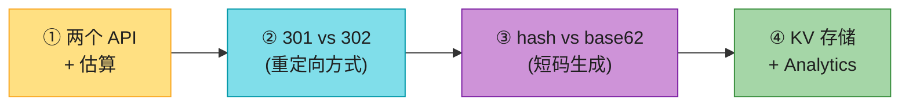

---

## 🗺️ 章节概览

| 小节 | 要点 |
|------|------|
| 需求 + 估算 | 两个 API;读写比 ~10:1 |
| **301 vs 302** | 永久 vs 临时重定向 |
| **hash vs base62** | MD5 截断 vs 自增 ID 编码 |
| 冲突处理 | hash 方案必处理冲突 |
| KV 选型 | Redis / Cassandra / DynamoDB |
| Analytics | 302 + 埋点统计点击 |

---

## 1. 需求 + 估算

**两个 API**(背熟):
```
shorten(long_url)        → short_code   // 长链 → 短码
redirect(short_code)     → long_url     // 短码 → 长链(重定向)
```

**估算**(用 Ch2,假设 1 亿用户):
```
写(shorten):DAU 1亿 × 10% 创建 × 1 次 / 86400 ≈ 100 QPS
读(redirect):写 × 100(每个短链被点 100 次)≈ 1万 QPS
读写比 ≈ 100:1 → 缓存友好

存储:每条 short_code + long_url ≈ 500B
日增 100万 × 500B = 500 MB/天
10年 ≈ 1.8 TB × 3副本 ≈ 5 TB(小系统)
```

> 💡 **结论**:短链是**小系统**——单表 + KV + 缓存就够,不是分布式难题。难点在**短码生成方案**和**重定向方式**。

---

## 2. 两个 API 的数据流

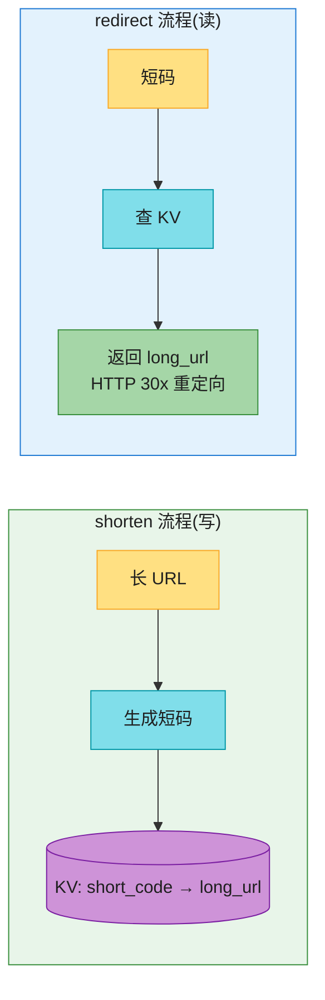

---

## 3. 301 vs 302 ⭐⭐(第一个核心抉择)

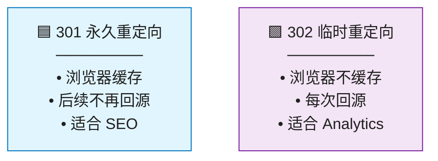

| | 301 永久 | 302 临时 |
|---|---|---|
| 浏览器缓存 | ✅ 缓存(后续直接跳,不回源) | ❌ 不缓存(每次回源) |
| 服务器压力 | 低(缓存后不再访问) | 高(每次都要查) |
| Analytics | ❌ 难统计(缓存后不回源) | ✅ **每次点击都能统计** |
| SEO | ✅ 权重传递 | ❌ 不传递 |
| 适用 | 永久跳转、SEO 优先 | **短链服务(要统计点击)** |

> 💡 **默认答案**:**短链服务用 302**——因为短链的核心价值之一是**统计点击**(Analytics),301 会被浏览器缓存,导致后续点击统计不到。原书没讲清这个场景。

> 🪤 **追问陷阱**:"为什么不用 301?" → "301 浏览器会缓存,后续点击不再回短链服务,**Analytics 统计不到**。短链要统计点击量,必须用 302(每次回源)。除非纯 SEO 场景才用 301。"

---

## 4. 短码生成:hash vs base62 ⭐⭐⭐(第二个核心抉择)

短码要求:**6-7 位、不可预测性可调、唯一**。两种主流方案:

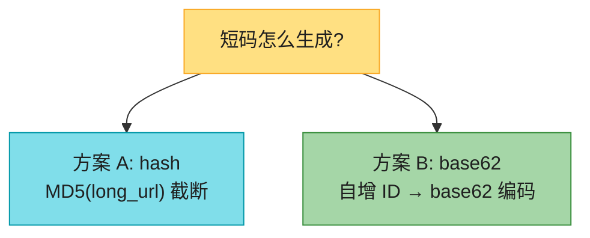

### 方案 A:hash(MD5 截断 + base62)

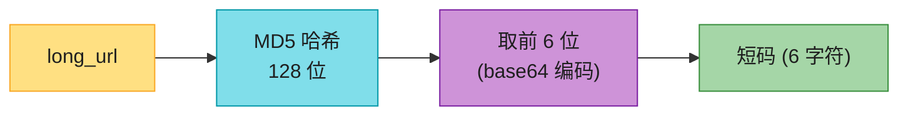

**做法**:`MD5(long_url)` → base64 → 取前 6 位。

| 优点 | 缺点 |
|------|------|
| **无状态**(同 URL 同短码) | **会冲突**(截断必然冲突) |
| 不需要 ID 生成器 | 冲突要查 DB 处理 |

> ⚠️ **冲突问题**:MD5 是 128 位,截断到 6 位(约 36 位)必然冲突(生日悖论:568 亿短码,几千条就可能冲突)。**必须查 DB 验证,冲突了换前缀重试**。

### 方案 B:base62(自增 ID + 编码)⭐ 推荐

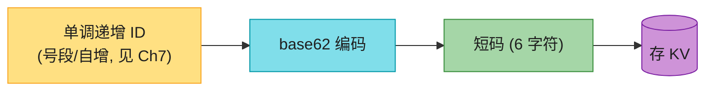

**做法**:用 Ch7 的**号段模式(美团 Leaf)或 DB 自增**生成**小量级、单调递增**的 ID → base62 编码成短码。

> ⚠️ **关键陷阱(原书没强调)**:**不能直接用雪花!** 雪花 ID 量级 ~10^18,base62 编码后是 **11 位**,根本编不成 6 位短码。要 6 位,喂给 base62 的 ID 必须 < 568 亿(62^6)。详见下方"短码 ID 从哪来"。

> 📝 **base62**:`[0-9a-zA-Z]` 共 62 个字符。**6 位 base62 = 62^6 ≈ 568 亿** 种组合,够用。

**手算**:ID = 12345 → base62:
```
12345 = 3×62 + 51 → "35" (不断除 62 取余)
→ 短码 "3j"(补到 6 位)
```

| 优点 | 缺点 |
|------|------|
| **无冲突**(ID 唯一) | 同 URL 每次短码不同(除非加映射) |
| 短码长度固定 | 需要 ID 生成器(Ch7) |
| 可排序 | 可预测(可猜相邻 ID) |

### hash vs base62 决策

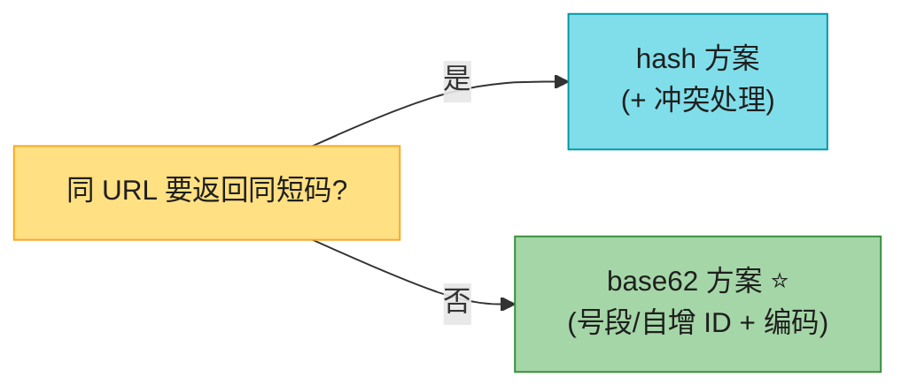

> 💡 **主流答案**:**base62 + 号段/自增 ID**(无冲突、可排序、6 位)。hash 方案的冲突处理麻烦,生产少用。**接上 Ch7 的号段模式(Leaf segment)**,不是雪花——这是综合题最常考错的点。

---

#### 深入:base62 编码手算 + 冲突概率 ⭐

**base62 编码**(面试可能让你写):
```python
BASE62 = "0123456789ABCDEFGHIJKLMNOPQRSTUVWXYZabcdefghijklmnopqrstuvwxyz"
def to_base62(num):
    if num == 0: return "0"
    s = []
    while num:
        s.append(BASE62[num % 62])
        num //= 62
    return ''.join(reversed(s)).rjust(6, '0')   # 补到 6 位
```

**6 位短码容量**:62^6 = 56,800,235,584 ≈ **568 亿**。够任何短链服务用几十年。

**hash 方案冲突概率**(生日悖论):
- 6 位 base62 空间 568 亿
- 存 30 万条时,冲突概率 ~50%(生日悖论 k ≈ √N)
- 所以 hash 方案**必须查 DB 验证**

---

#### 深入:短码 ID 从哪来?(雪花 vs 号段 vs 自增)⭐⭐⭐(原书最大的隐藏坑)

**面试高频踩坑题**。很多人脱口而出"用雪花生成 ID 再 base62",但**这在数学上不成立**:

| ID 方案(见 Ch7) | ID 量级 | base62 编码长度 | 适合 6 位短链? |
|----------------|---------|----------------|----------------|
| **DB 自增** / **号段模式(美团 Leaf segment)** | 1 → 568 亿 | **6 位** | **⭐ 推荐** |
| Snowflake 雪花 | ~10^18(64 位) | **11 位** ❌ | 不适合(太长) |
| UUID / UUIDv7 | ~10^38 | ~22 位 ❌ | 完全不适合 |

> ⚠️ **关键数学**:6 位 base62 = 62^6 ≈ 568 亿。**喂给 base62 的 ID 必须 < 568 亿**才能编成 6 位。雪花 ID ≈ 10^18(高位是毫秒时间戳),`to_base62(snowflake)` 出来是 **11 位**,不是 6 位——这是最常见的面试翻车点。

> 💡 **正确接 Ch7**:短链的 ID 源 = **号段模式(Leaf segment)** 或 **DB 自增**,两者都是**小量级、单调递增**。号段模式给每个 server 发一段连续 ID(如 `1001~2000`),用完再申请,既高吞吐又保证 ID 小、连续、可排序(早期短码短、后期短码长,自然分代)。**雪花是给"超高吞吐、不在乎长"的场景**(消息 ID、订单 ID)用的,不是给短链用的。

> 🪤 **追问陷阱**:"为什么不用雪花?" → "雪花 ID 量级 10^18,base62 后 11 位,编不成 6 位短码。短链要小量级单调递增 ID,用**号段模式或 DB 自增**。"

---

#### 深入:短链安全(钓鱼 / 可枚举 / 恶意)⭐⭐(原书完全没讲,2026 高频追问)

短链天然**隐藏目标 URL**,是钓鱼/恶意传播的温床。这是 2020 版完全没覆盖、但面试官很爱追问的点:

| 安全风险 | 说明 | 2026 解法 |
|---------|------|----------|
| **钓鱼/恶意跳转** | 短码藏恶意 URL,用户点开才知道 | 后台**黑名单校验**(Google Safe Browsing API)、恶意 URL 拦截 |
| **可枚举** | base62 + 自增 → 相邻 ID 可遍历,爬虫能 dump 所有短链 | **不可预测盐**(ID + 随机盐再 hash)、限流、预生成随机短码池 |
| **过期/失效** | 短链被删/长链失效,仍可访问? | 设 TTL、404 页面、定期清理 |
| **滥用** | 大量创建指向同一长链 | 同长链返回同码(去重)+ 创建限流 |

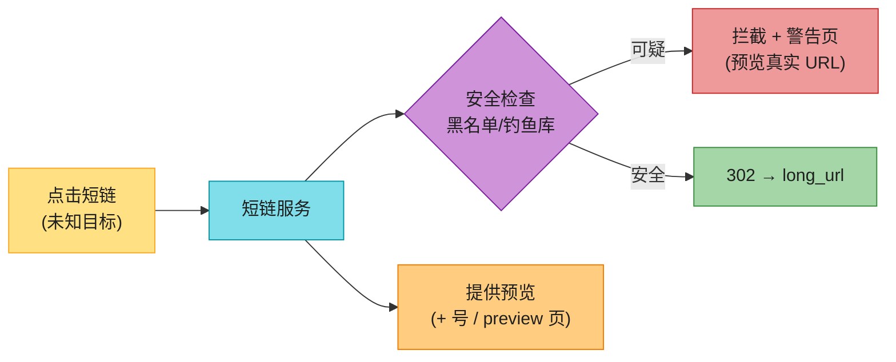

> 💡 **预览惯例**:很多短链服务支持 `短码+` 或 `preview./短码` 显示真实目标(如 bit.ly 的 `+`)。面试讲到"安全"时主动提一句,加分项。

> 🪤 **追问陷阱**:"短链可枚举怎么办?" → "base62+自增能被遍历爬取。解法:① 短码混入**随机盐**(ID 不连续);② **预生成随机短码池**(从池里取,而非算);③ 加**限流**防 dump。"

---

## 5. KV 存储选型

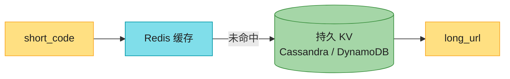

**选型**:
- **Redis 缓存**:热数据(读多),低延迟。
- **持久 KV**:Cassandra / DynamoDB / MySQL(小规模)。
- 不用关系库 JOIN,纯 KV 访问 → **NoSQL 友好**。

> 🔄 **2026 现代版话术**:"短链是典型 KV 场景——**DynamoDB / Cassandra + Redis 缓存**。读写比 100:1,缓存命中率 >95%,DB 压力很小。小规模用 PostgreSQL 单表也够。"

---

## 6. Analytics(点击统计)

短链的价值不只是"短",还有**统计点击**(谁、何时、什么设备)。用 **302 重定向 + 埋点**:

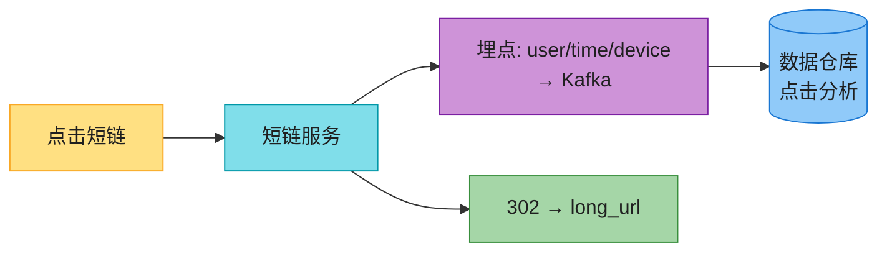

> 💡 这就是为什么用 **302 而非 301**——每次点击都回源,才能埋点统计。

**redirect 时序**(含缓存未命中 + 埋点):

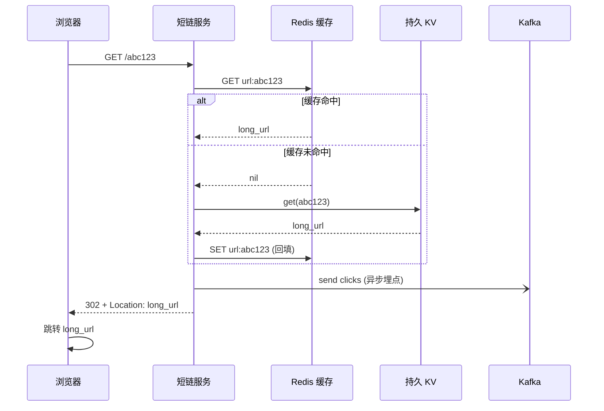

---

## 💻 代码示例

### base62 + 号段完整流程

```python
import redis
r = redis.Redis()

def shorten(long_url):
    # 反查:同长链返回同码(去重 + 防滥用)
    code = r.get(f"long:{hash(long_url)}")
    if code: return code
    uid = leaf.next_id()                   # Ch7 号段模式(Leaf segment),非雪花!
    code = to_base62(uid)                  # uid < 568亿 → 6 位
    r.set(f"url:{code}", long_url)         # 正向:code → long_url
    r.set(f"long:{hash(long_url)}", code)  # 反向:long_url → code
    return code

def redirect(code):
    long_url = r.get(f"url:{code}")
    if not long_url:
        long_url = db.get(code)            # 缓存未命中查 DB
        if long_url: r.set(f"url:{code}", long_url)
    if long_url:
        kafka.send('clicks', {'code': code, 'time': now()})  # Analytics 埋点
        return 302, long_url               # 302 才能统计点击
    return 404
```

---

## ⚠️ 已过时 / 书里没说(2020 → 2026)

| 原书 | 2026 现状 | 面试应对 |
|------|----------|---------|
| 301/302 只给结论 | **要讲 Analytics 场景**(为什么用 302) | 主动说"302 才能统计点击" |
| base62 没接 ID 生成器 | **接 Ch7 雪花** | 说"用雪花 ID + base62" |
| 冲突处理略过 | hash 方案**必须查 DB 重试** | 讲清冲突检测流程 |
| 没提 Analytics 链路 | 302 + Kafka + 数仓是标配 | 主动画 Analytics 流程 |
| 没提自定义短码 | bit.ly 等支持自定义 | 提一句"自定义短码优先于生成" |

---

## 🪤 追问陷阱

1. **"301 还是 302?"** → 短链用 302(统计点击);纯 SEO 跳转用 301。
2. **"hash 还是 base62?"** → base62 + 号段/自增(无冲突);hash 要处理冲突。
3. **"为什么不用雪花生成短码?"** → 雪花 ID ~10^18,base62 后 11 位,编不成 6 位。用号段/自增(小量级 ID)。
4. **"6 位够吗?"** → 62^6 = 568 亿,够用。不够加到 7 位(3.5 万亿)。
5. **"怎么加速 redirect?"** → Redis 缓存热短码(命中率 >95%)。
6. **"同 URL 多次 shorten 返回同码吗?"** → base62 方案不同(每次新 ID);要相同则先查 `long_url → code` 反向索引。
7. **"短码可预测/钓鱼怎么办?"** → base62 可枚举。加限流 + 不可预测盐 + 黑名单 + 预览页。

---

## 🏭 生产级产品速查表

| 产品 | 短码方案 | 特点 |
|------|---------|------|
| **bit.ly** | 自定义 + 生成 | 商业短链,Analytics 强 |
| **TinyURL** | base62 | 老牌 |
| **t.co (Twitter)** | base62 | 内置到推文 |
| **AWS 自建** | DynamoDB + Redis | KV + 缓存 |

---

## 📝 本章要点总结

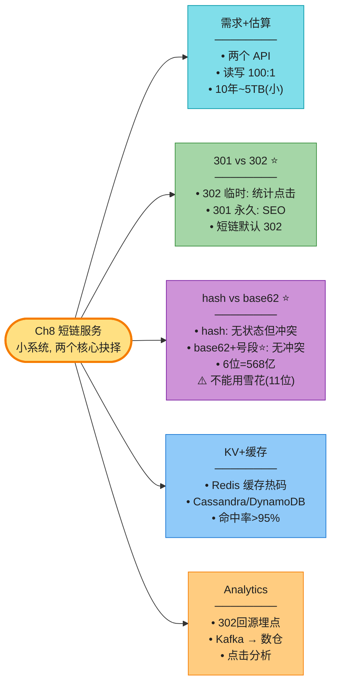

**核心 Takeaways**:

1. **两个核心抉择**:301 vs 302(Analytics)、hash vs base62(冲突)。
2. **短链用 302**:每次回源才能统计点击——这是短链的核心价值之一。
3. **base62 + 号段/自增** 是主流:无冲突、可排序、6 位。**不能用雪花**(ID 太大,base62 后 11 位)。
4. **安全**:短链易钓鱼/被枚举,要黑名单 + 预览 + 不可预测盐。
5. **小系统**:KV + Redis 缓存就够,别过度工程。
6. **6 位 = 568 亿**,够用;可预测是风险,加限流。

> 🔗 **连接下一章**:Ch8 是读写分离的小系统;**Ch9 网络爬虫**是另一个经典——它考 BFS、去重、分布式协调、反爬,复杂度上一个台阶。
