# Chapter 9: 设计网络爬虫 (Design a Web Crawler)

> **本章定位**:爬虫是面试**最复杂的"构件组合题"之一**——它把 Ch1 的 MQ、Ch6 的去重、Ch7 的 ID、BFS、布隆过滤器、DNS、容错全用上。Google/Bing 的核心就是爬虫。掌握这道题,系统设计能力上一个台阶。

> **本章和原书的区别**:原书讲了 frontier/去重/DNS,但**反爬(JS 渲染、验证码、IP 轮换)完全没提**——这是 2026 爬虫的真问题。本章补 **Headless 浏览器(Playwright)、反爬策略、分布式架构**,因为现代网页大量 JS 渲染,传统 HTTP 抓取抓不到内容。

---

## 🎯 面试怎么答(被问到"设计一个网络爬虫"时)

**开场话术**(直接背):

> "爬虫核心循环:**取 URL → 下载 → 解析 → 提取新 URL → 去重 → 入队**。我先定规模和目标(网页数、抓取频率),然后讲五个关键点:**① BFS frontier ② 去重(布隆) ③ DNS 缓存 ④ politeness ⑤ 容错**。最后补 2026 的反爬(JS 渲染)。"

**5 步推进**:

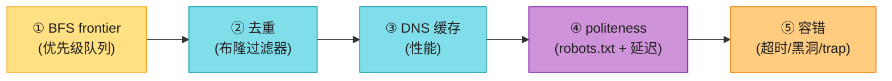

---

## 🗺️ 章节概览

| 小节 | 要点 |
|------|------|
| 需求 + 估算 | 10亿页面、月级抓取、新内容延迟 |
| 高层架构 | 取→下→解析→存→去重→入队 |
| **BFS + frontier** | 优先级队列 + politeness 队列 |
| **去重** | 布隆过滤器(内存省) |
| **DNS 缓存** | DNS 是性能瓶颈 |
| politeness | robots.txt + 同站点延迟 |
| 优先级 + fresh | 重要页面优先 + 重新抓取 |
| 容错 | 超时、黑洞、爬虫 trap、循环 |
| **反爬(2026)** | JS 渲染、验证码、IP 轮换 |

---

## 1. 需求 + 估算

**澄清问题**(Step 1):
- 抓什么?(HTML / 图片 / 全部)
- 规模?(10 亿页面 / 100 亿)
- 新内容多快发现?(天 / 周 / 月)
- 是否遵守 robots.txt?(必须)

**估算**(假设 10 亿页面,4 周抓完):
```
QPS = 10亿 / (4周 × 7 × 86400) ≈ 410 页/秒
存储:每页 ~500KB(含图片)→ 10亿 × 500KB = 500 PB
URL 去重表:10亿 URL × 100B = 100 GB
```

> 💡 **结论**:爬虫是**高吞吐 + 大存储**系统。重点是**下载吞吐**和**去重内存**。

---

## 2. 高层架构

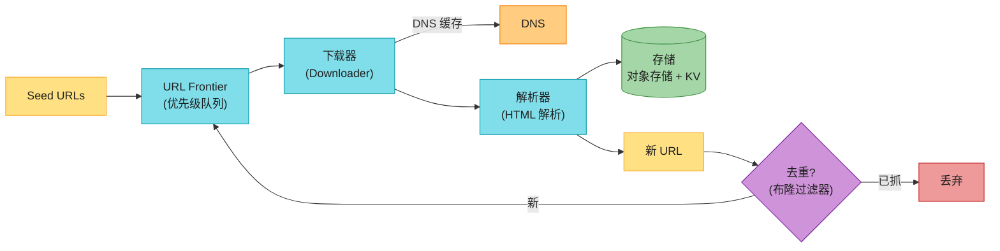

**核心循环**(背熟):**Seed → Frontier → 下载 → 解析 → 提取新 URL → 去重 → 入 Frontier**。这是爬虫的心脏。

**单 URL 处理时序**(画出这张图,面试官知道你懂细节):

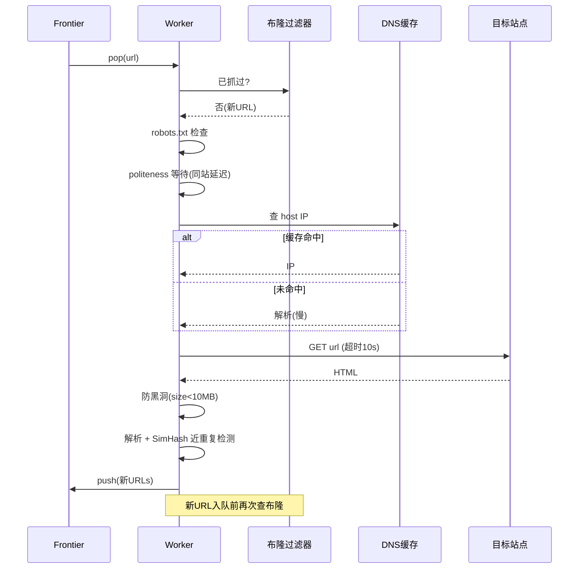

---

## 3. BFS + URL Frontier ⭐⭐

### 为什么用 BFS 不用 DFS

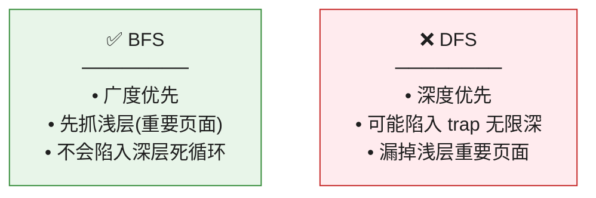

### URL Frontier(优先级 + politeness 双队列)⭐

这是爬虫的核心数据结构,不是简单 FIFO。它要解决两个问题:

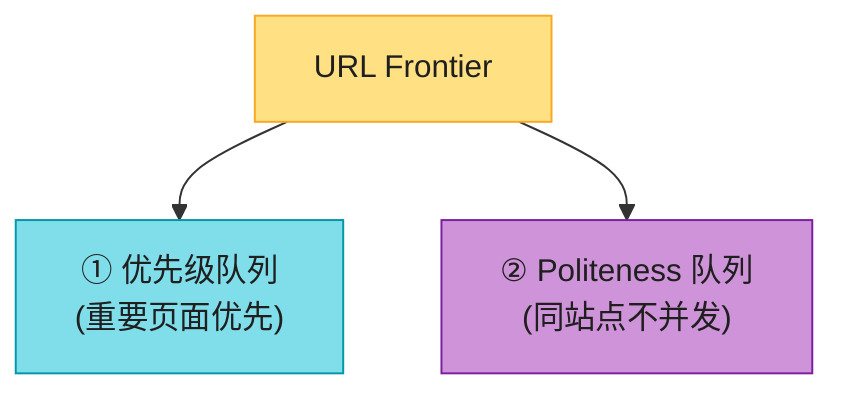

| 队列 | 解决的问题 | 做法 |
|------|----------|------|
| **优先级队列** | 重要页面先抓(如首页 vs 深层页) | 按 PageRank/权重排序 |
| **Politeness 队列** | **同一站点不并发**(否则被封) | 每个站点一个 FIFO 队列,轮询出队,加延迟 |

> 📝 **Politeness**:抓取同一站点的两个 URL 之间**必须有延迟**(如 1 秒),否则会被站点当成 DDoS 封 IP。这是爬虫礼仪。

> 🪤 **追问陷阱**:"为什么 frontier 不是单个 FIFO?" → "单个 FIFO 会**连续抓同一站点**(FIFO 顺序可能集中),触发反爬被封。**politeness 队列**让不同站点轮流出队,保证同站点延迟。"

---

## 4. URL 去重:布隆过滤器 ⭐⭐

10 亿 URL,去重表 100GB?太大了。用**布隆过滤器**(Bit array + 多哈希):

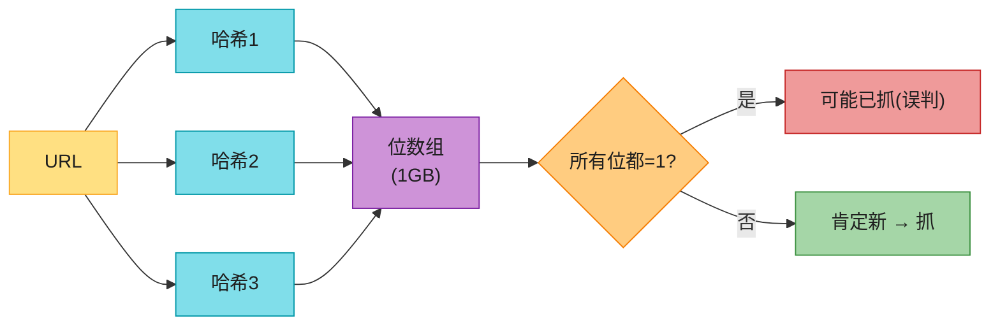

| 特性 | 说明 |
|------|------|
| **说"不在"** | ✅ **肯定不在**(无假阴性) |
| **说"在"** | ⚠️ **可能在**(有假阳性,可接受) |
| **内存** | 10亿 URL 只需 ~1-2 GB(对比哈希表 100GB) |

> 💡 **为什么用布隆**:爬虫 URL 量巨大,哈希表存不下。布隆过滤器**省内存 100 倍**,假阳性(少量重复抓)可接受。

> 🪤 **追问陷阱**:"布隆过滤器的误判怎么处理?" → "误判(说已抓,实际没)会漏抓少量页面。解法:① 重要页面用 KV 表精确去重;② 定期重建布隆;③ 接受少量漏抓。"

> 🪤 **追问陷阱**:"重抓(fresh)时,布隆里已经有的 URL 怎么办?" → "标准布隆**不能删除**(删一个位会影响多个元素)。重抓需求用 **Counting Bloom Filter**(位数组换成计数器,可增可减),或**周期性重建布隆**(配合 fresh 周期)。"

---

#### 深入:不止 URL 去重,还有内容去重(SimHash 近重复)⭐⭐⭐(原书没讲,区分候选人的点)

URL 去重(布隆)只解决"同一 URL 不重复抓"。但爬虫更大的坑是:**不同 URL 指向高度相似的内容**——镜像站、转载、聚合页。10 亿页里 30%+ 是近重复。这才是搜索引擎真正的难题,也是面试里区分"背过书"和"真做过"的点。

| 去重类型 | 方法 | 能否检测"相似"(非完全相同) |
|---------|------|---------------------------|
| URL 去重 | 布隆过滤器 | ❌ 只判完全相同 |
| 内容精确去重 | 内容 MD5/SHA | ❌ 改一个字就不同 |
| **内容近重复** | **SimHash / MinHash** | **✅ 检测 90%+ 相似** |

**SimHash 流程**(Google 2007 论文,工业标配):

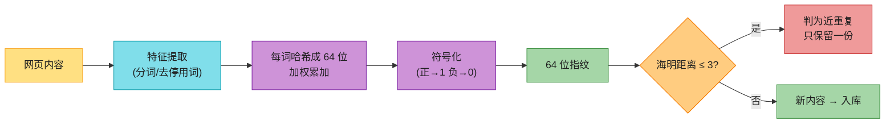

**关键点**:
- SimHash 把整篇文档压成 **64 位指纹**;局部改动(改几个词)只翻转少数几位。
- 两个文档**海明距离 ≤ 3** → 判为近重复(经验阈值)。
- **快速检索近重复**:把 64 位**分 4 段建倒排索引**(抽屉原理)——距离 ≤ 3 的两指纹必有一段完全相同 → 按段召回候选,再精确算海明距离。否则两两比对是 O(n²),10 亿页算不完。

> 💡 **面试加分**:"URL 去重只是第一步。生产爬虫还要做**内容近重复检测(SimHash)**,否则索引库里全是镜像/转载,搜出 10 条一样的结果。这是 Google 2007 论文的经典方法。"

> 🪤 **追问陷阱**:"10 亿文档怎么快速找近重复?" → "SimHash + **分段倒排(抽屉法)**。64 位分 4 段,距离 ≤ 3 的两指纹必有一段相同,按段建索引召回,再精确算海明距离。把 O(n²) 降到可接受。"

---

## 5. DNS 缓存(性能瓶颈)⭐

**问题**:每次下载都要 DNS 解析,而 **DNS 解析很慢(10-200ms)**,是爬虫的隐藏瓶颈。

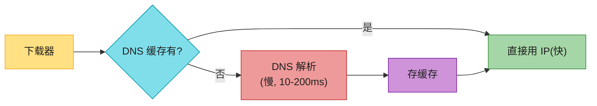

**解法**:**本地 DNS 缓存**(维护 IP → 域名映射),命中直接用,不每次查 DNS。Google 爬虫有专门的 DNS 缓存层。

---

## 6. politeness(robots.txt + 延迟)

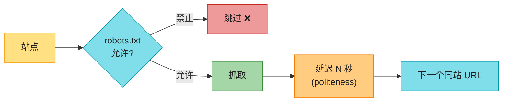

> 📝 **robots.txt**:站点根目录的协议文件,声明哪些页面**允许/禁止**爬虫抓取。**必须遵守**(法律 + 礼仪)。

> 🪤 **追问陷阱**:"不遵守 robots.txt 行不行?" → "技术上能抓,但**会被封 IP + 法律风险**。商业爬虫(Google/Bing)都遵守。"

---

## 7. 优先级 + fresh

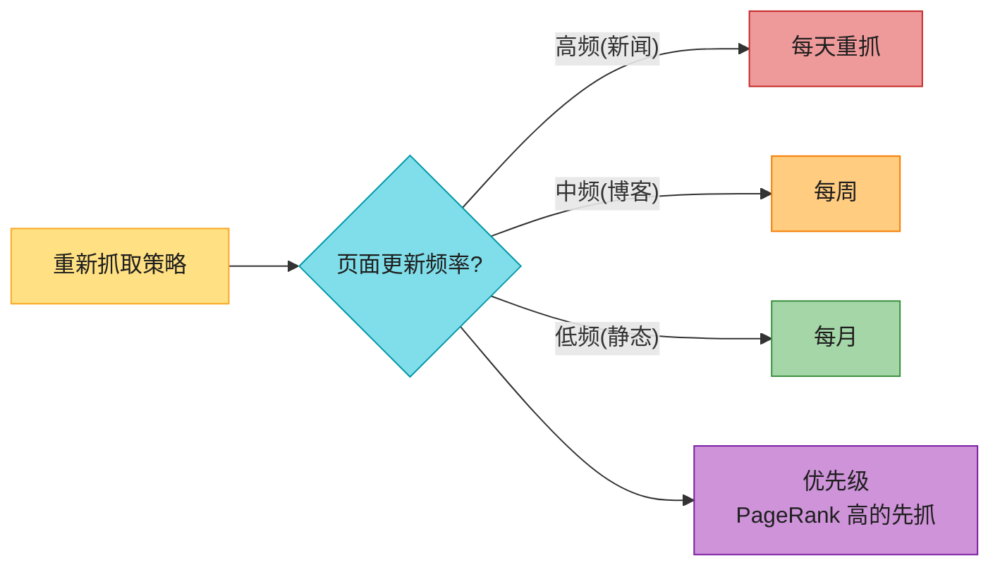

- **优先级**:PageRank/重要度高的页面优先抓(首页 vs 深层页)。
- **fresh**:根据页面历史更新频率,决定重抓周期。

---

## 8. 容错(健壮性)⭐

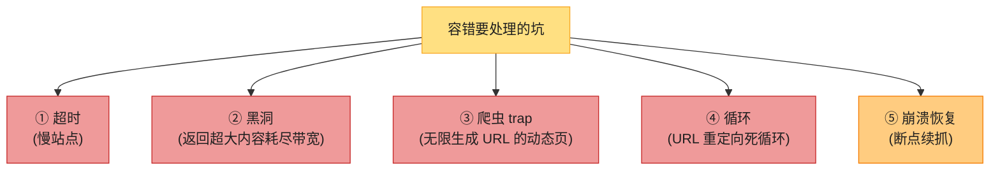

| 坑 | 解法 |
|----|------|
| 超时 | 设下载超时(如 10s),超时放弃 |
| 黑洞 | 限制单页最大 size(如 10MB) |
| **爬虫 trap** | 限制单域名 URL 数 + 深度上限 |
| 重定向循环 | 限制重定向次数(如 5 次) |
| 崩溃恢复 | frontier 持久化(已抓/未抓状态存盘) |

> 💡 **爬虫 trap**:有些动态站点无限生成 URL(如日历 `?day=1,2,3...`),爬虫会陷进去。解法:**限制单域名 URL 总数 + 路径深度上限**。

---

#### 深入:分布式爬虫架构 ⭐⭐(原书简化了)

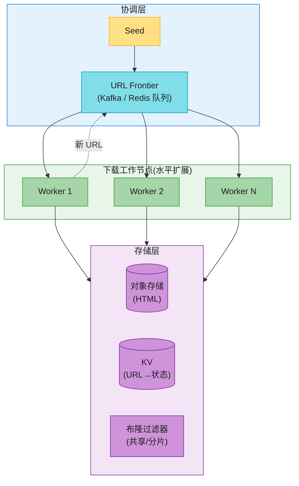

**关键**:Worker 无状态,水平扩展;Frontier 用 Kafka/Redis 共享;布隆过滤器**分片**(每个 worker 一份,或集中服务)。这是 Google/Mercator 的架构。

---

#### 深入:2026 反爬——JS 渲染(原书完全没讲)⭐⭐⭐

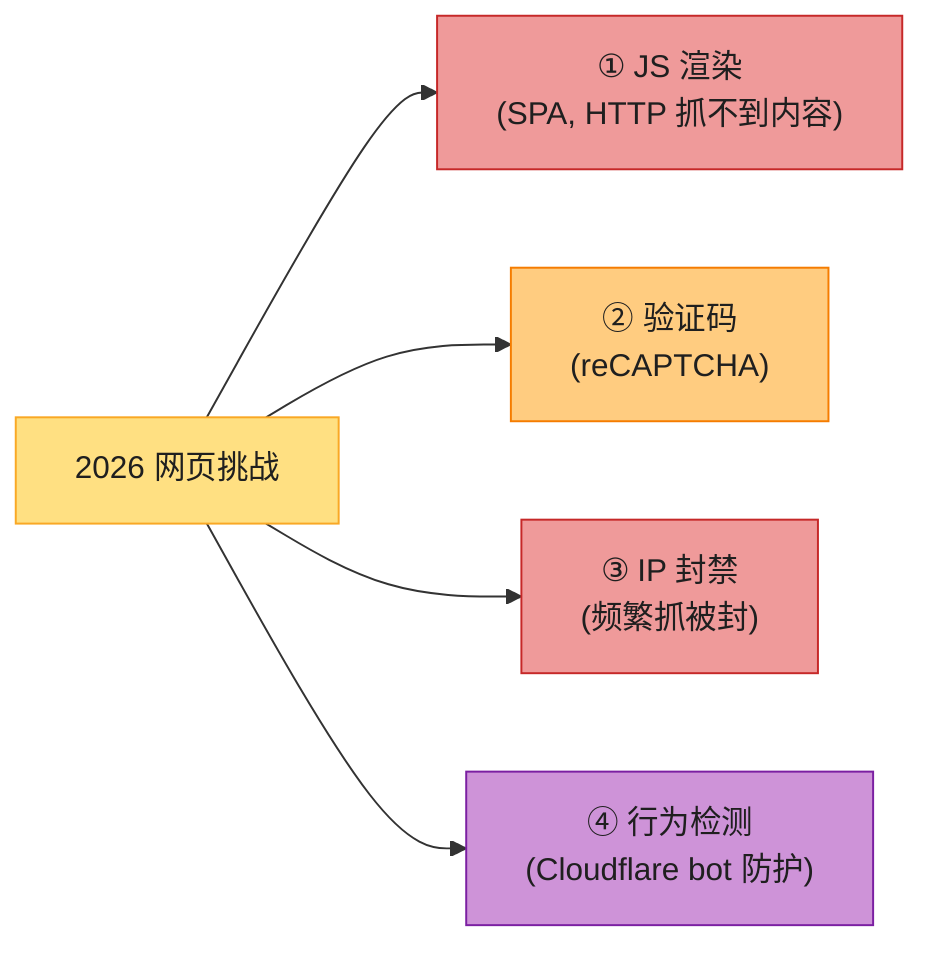

| 挑战 | 2026 解法 |
|------|----------|
| **JS 渲染**(React/Vue SPA) | **Headless 浏览器**(Playwright / Puppeteer)渲染后抓 DOM |
| 验证码 | 第三方打码服务 / ML 识别(谨慎,合规边界) |
| IP 封禁 | **代理池 + IP 轮换** |
| Bot 检测(Cloudflare) | 模拟真人(浏览器指纹、随机延迟) |

> 🔄 **2026 现代版话术**(原书只讲 HTTP 抓取,已严重过时):
> "2026 大量网页是 JS 渲染的 SPA,传统 HTTP GET 抓不到内容(拿到的是空壳 HTML)。现代爬虫必须区分:**静态页用 HTTP(快)**,**JS 渲染页用 Headless 浏览器(Playwright,慢但能渲染)**。再用代理池 + 轮换 IP 防封。这是原书 2020 版没覆盖的核心挑战。"

> 🪤 **追问陷阱**:"JS 渲染很慢,怎么平衡?" → "① **优先 HTTP 抓取**(大部分页是静态);② JS 页才用 Headless;③ Headless 用**无头 Chrome 池**(复用,避免每次启动);④ 并发受限(Headless 重,单机几十并发)。"

---

## 💻 代码示例(简化爬虫核心)

```python
import requests
from bs4 import BeautifulSoup

seen = set()   # 实际用布隆过滤器
frontier = PriorityQueue()

def crawl():
    while url := frontier.pop():
        host = hostname(url)
        if not robots_allows(url): continue
        sleep_until_polite(host)              # politeness 延迟
        try:
            resp = requests.get(url, timeout=10)  # 超时
            if len(resp.content) > 10*1024*1024: continue  # 防黑洞
        except Timeout:
            continue
        html = resp.text
        store(url, html)
        for new_url in extract_links(html):
            if not bloom_check(new_url):       # 布隆去重
                bloom_add(new_url)
                frontier.push(new_url, priority=estimate(url))
```

---

## ⚠️ 已过时 / 书里没说(2020 → 2026)

| 原书 | 2026 现状 | 面试应对 |
|------|----------|---------|
| 只讲 HTTP 抓取 | **JS 渲染页**必须 Headless 浏览器 | 主动提 Playwright + 何时用 |
| 反爬几乎没提 | **IP 轮换 + 代理池 + bot 检测** 是核心 | 讲反爬策略 |
| 布隆过滤器一笔带过 | 要会讲**假阳性 + 内存优势** | 给 1GB vs 100GB 对比 |
| DNS 缓存只提一句 | 是**隐藏性能瓶颈** | 强调 DNS 缓存层 |
| 没提断点续抓 | frontier **持久化**才能恢复 | 讲崩溃恢复 |
| 没提 sitemap | 大站用 **sitemap.xml** 加速发现 | 提 sitemap 补充 seed |
| **只讲 URL 去重** | **内容近重复(SimHash)** 才是真难题(30%+ 是镜像/转载) | 讲 SimHash + 抽屉法检索 |

---

## 🪤 追问陷阱

1. **"怎么避免重复抓?"** → 布隆过滤器(URL 哈希)+ 重要页面精确 KV 兜底。
2. **"同站点被反爬封怎么办?"** → politeness 延迟 + 代理池 IP 轮换。
3. **"JS 渲染页怎么抓?"** → Headless 浏览器(Playwright)。
4. **"爬虫 trap 怎么防?"** → 限制单域名 URL 数 + 路径深度上限。
5. **"DNS 慢怎么办?"** → 本地 DNS 缓存(命中直接用 IP)。
6. **"10 亿 URL 怎么去重?"** → 布隆过滤器(1-2GB)+ 分片。
7. **"新内容怎么发现?"** → sitemap.xml + ping 通知 + 重抓高频站点。
8. **"爬虫 worker 怎么扩展?"** → 无状态 worker + Kafka frontier 水平扩展。
9. **"镜像站/转载怎么去重?"** → URL 去重不够,要 **SimHash 内容指纹** + 海明距离 ≤ 3 判近重复(抽屉法快速检索)。

---

## 🏭 生产级产品速查表

| 产品 | 特点 |
|------|------|
| **Googlebot** | 全球最大,分布式,JS 渲染(WRS) |
| **Bingbot** | 类似 Google |
| **Scrapy** | Python 开源爬虫框架 |
| **Mercator / Heritrix** | 学术/归档爬虫 |
| **Playwright / Puppeteer** | Headless 浏览器(JS 渲染) |
| **Apache Nutch** | 分布式开源爬虫 |

---

## 📝 本章要点总结


**核心 Takeaways**:

1. **核心循环**:取→下→解→存→去重→入队,这是爬虫心脏。
2. **BFS + 双队列 frontier**:优先级(重要页先)+ politeness(同站延迟)。
3. **去重两层**:URL 去重(布隆,省内存 100 倍)+ **内容近重复去重(SimHash)**——后者原书没讲,是区分候选人的点。
4. **DNS 缓存**是隐藏性能瓶颈,必须有。
5. **容错五坑**:超时/黑洞/trap/循环/崩溃,各有解法。
6. **2026 反爬是核心增量**:JS 渲染用 Headless(Playwright),原书完全没讲——这是你和别人的区分点。
7. **分布式**:无状态 worker + Kafka frontier 水平扩展。

> 🔗 **连接下一章**:Ch9 爬虫是"主动抓数据";**Ch10 通知系统**是"主动推数据给用户"——SMS/Email/Push,另一个高频设计题。
