# Chapter 9: 设计网络爬虫 (Design a Web Crawler)

> 📑 **导航**:[← 短链](ch1_08-设计短链服务.md) · [📚 总目录](../README.md) · [通知系统 →](ch1_10-设计通知系统.md)
> 🔗 **相关**:[搜索补全](ch1_13-设计搜索自动补全.md) · [AWS存储](../SDA/aws_10-AWS存储服务.md) · [AWS计算](../SDA/aws_11-AWS计算服务.md) · [AWS消息/IAM](../SDA/aws_12-AWS消息编排监控IAM.md)


> **本章定位**:爬虫是面试**最复杂的"构件组合题"之一**——它把 Ch1 的 MQ、Ch6 的去重、Ch7 的 ID、BFS、布隆过滤器、DNS、容错全用上。Google/Bing 的核心就是爬虫。掌握这道题,系统设计能力上一个台阶。

> **本章和原书的区别**:原书讲了 frontier/去重/DNS,但**反爬(JS 渲染、验证码、IP 轮换)完全没提**——这是 2026 爬虫的真问题。本章补 **Headless 浏览器(Playwright)、反爬策略、分布式架构**,因为现代网页大量 JS 渲染,传统 HTTP 抓取抓不到内容。

---

## 🎯 面试怎么答(被问到"设计一个网络爬虫"时)

**开场话术**(直接背):

> "爬虫核心循环:**取 URL → 下载 → 解析 → 提取新 URL → 去重 → 入队**。我先定规模和目标(网页数、抓取频率),然后讲五个关键点:**① BFS frontier ② 去重(布隆) ③ DNS 缓存 ④ politeness ⑤ 容错**。最后补 2026 的反爬(JS 渲染)。"

**5 步推进**:

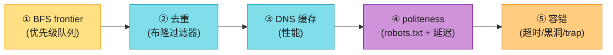

---

## 🗺️ 章节概览

| 小节 | 要点 |
|------|------|
| 需求 + 估算 | 10亿页面、月级抓取、新内容延迟 |
| 高层架构 | 取→下→解析→存→去重→入队 |
| **BFS + frontier** | 优先级队列 + politeness 队列 |
| **去重** | 布隆过滤器(内存省) |
| **DNS 缓存** | DNS 是性能瓶颈 |
| politeness | robots.txt + 同站点延迟 |
| 优先级 + fresh | 重要页面优先 + 重新抓取 |
| 容错 | 超时、黑洞、爬虫 trap、循环 |
| **反爬(2026)** | JS 渲染、验证码、IP 轮换 |

---

## 1. 需求 + 估算

**澄清问题**(Step 1):
- 抓什么?(HTML / 图片 / 全部)
- 规模?(10 亿页面 / 100 亿)
- 新内容多快发现?(天 / 周 / 月)
- 是否遵守 robots.txt?(必须)

**估算**(假设 10 亿页面,4 周抓完):
```
QPS = 10亿 / (4周 × 7 × 86400) ≈ 410 页/秒
存储:每页 ~500KB(含图片)→ 10亿 × 500KB = 500 PB
URL 去重表:10亿 URL × 100B = 100 GB
```

> 💡 **结论**:爬虫是**高吞吐 + 大存储**系统。重点是**下载吞吐**和**去重内存**。

---

## 2. 高层架构

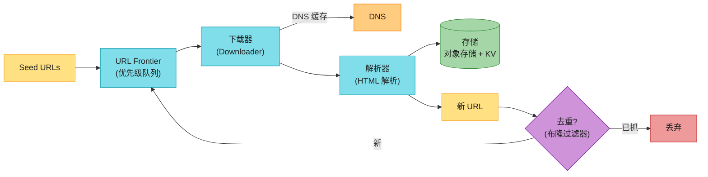

**核心循环**(背熟):**Seed → Frontier → 下载 → 解析 → 提取新 URL → 去重 → 入 Frontier**。这是爬虫的心脏。

**单 URL 处理时序**(画出这张图,面试官知道你懂细节):

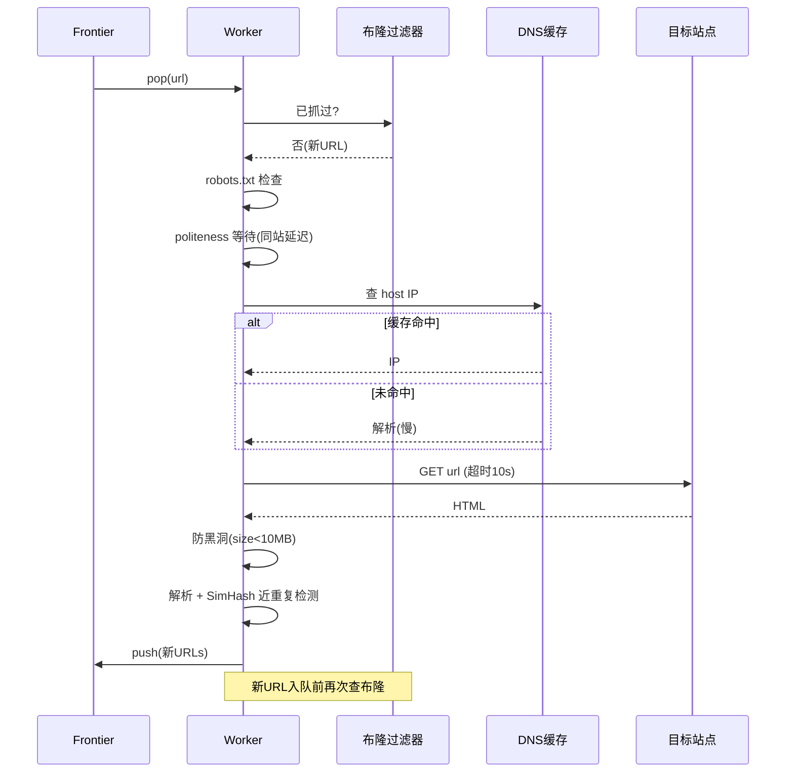

---

## 3. BFS + URL Frontier ⭐⭐

### 为什么用 BFS 不用 DFS

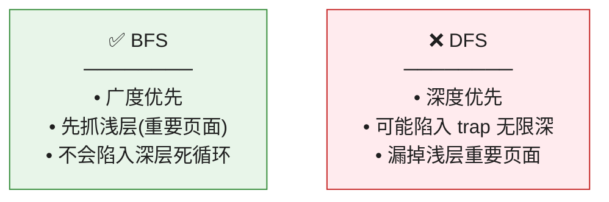

### URL Frontier(优先级 + politeness 双队列)⭐

这是爬虫的核心数据结构,不是简单 FIFO。它要解决两个问题:

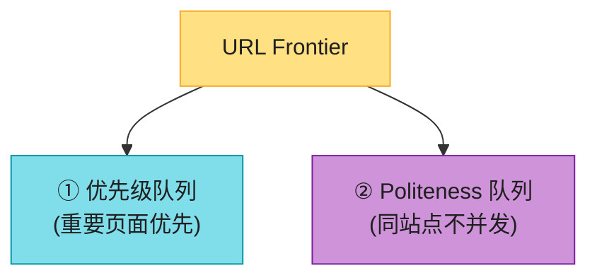

| 队列 | 解决的问题 | 做法 |
|------|----------|------|
| **优先级队列** | 重要页面先抓(如首页 vs 深层页) | 按 PageRank/权重排序 |
| **Politeness 队列** | **同一站点不并发**(否则被封) | 每个站点一个 FIFO 队列,轮询出队,加延迟 |

> 📝 **Politeness**:抓取同一站点的两个 URL 之间**必须有延迟**(如 1 秒),否则会被站点当成 DDoS 封 IP。这是爬虫礼仪。

> 🪤 **追问陷阱**:"为什么 frontier 不是单个 FIFO?" → "单个 FIFO 会**连续抓同一站点**(FIFO 顺序可能集中),触发反爬被封。**politeness 队列**让不同站点轮流出队,保证同站点延迟。"

---

## 4. URL 去重:布隆过滤器 ⭐⭐

10 亿 URL,去重表 100GB?太大了。用**布隆过滤器**(Bit array + 多哈希):

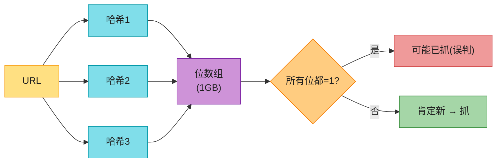

| 特性 | 说明 |
|------|------|
| **说"不在"** | ✅ **肯定不在**(无假阴性) |
| **说"在"** | ⚠️ **可能在**(有假阳性,可接受) |
| **内存** | 10亿 URL 只需 ~1-2 GB(对比哈希表 100GB) |

> 💡 **为什么用布隆**:爬虫 URL 量巨大,哈希表存不下。布隆过滤器**省内存 100 倍**,假阳性(少量重复抓)可接受。

> 🪤 **追问陷阱**:"布隆过滤器的误判怎么处理?" → "误判(说已抓,实际没)会漏抓少量页面。解法:① 重要页面用 KV 表精确去重;② 定期重建布隆;③ 接受少量漏抓。"

> 🪤 **追问陷阱**:"重抓(fresh)时,布隆里已经有的 URL 怎么办?" → "标准布隆**不能删除**(删一个位会影响多个元素)。重抓需求用 **Counting Bloom Filter**(位数组换成计数器,可增可减),或**周期性重建布隆**(配合 fresh 周期)。"

---

#### 深入:不止 URL 去重,还有内容去重(SimHash 近重复)⭐⭐⭐(原书没讲,区分候选人的点)

URL 去重(布隆)只解决"同一 URL 不重复抓"。但爬虫更大的坑是:**不同 URL 指向高度相似的内容**——镜像站、转载、聚合页。10 亿页里 30%+ 是近重复。这才是搜索引擎真正的难题,也是面试里区分"背过书"和"真做过"的点。

| 去重类型 | 方法 | 能否检测"相似"(非完全相同) |
|---------|------|---------------------------|
| URL 去重 | 布隆过滤器 | ❌ 只判完全相同 |
| 内容精确去重 | 内容 MD5/SHA | ❌ 改一个字就不同 |
| **内容近重复** | **SimHash / MinHash** | **✅ 检测 90%+ 相似** |

**SimHash 流程**(Google 2007 论文,工业标配):

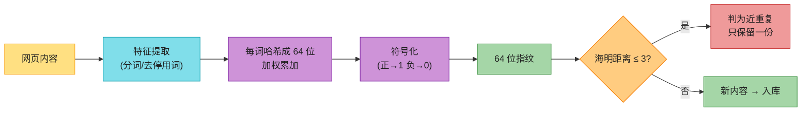

**关键点**:
- SimHash 把整篇文档压成 **64 位指纹**;局部改动(改几个词)只翻转少数几位。
- 两个文档**海明距离 ≤ 3** → 判为近重复(经验阈值)。
- **快速检索近重复**:把 64 位**分 4 段建倒排索引**(抽屉原理)——距离 ≤ 3 的两指纹必有一段完全相同 → 按段召回候选,再精确算海明距离。否则两两比对是 O(n²),10 亿页算不完。

> 💡 **面试加分**:"URL 去重只是第一步。生产爬虫还要做**内容近重复检测(SimHash)**,否则索引库里全是镜像/转载,搜出 10 条一样的结果。这是 Google 2007 论文的经典方法。"

> 🪤 **追问陷阱**:"10 亿文档怎么快速找近重复?" → "SimHash + **分段倒排(抽屉法)**。64 位分 4 段,距离 ≤ 3 的两指纹必有一段相同,按段建索引召回,再精确算海明距离。把 O(n²) 降到可接受。"

---

## 5. DNS 缓存(性能瓶颈)⭐

**问题**:每次下载都要 DNS 解析,而 **DNS 解析很慢(10-200ms)**,是爬虫的隐藏瓶颈。

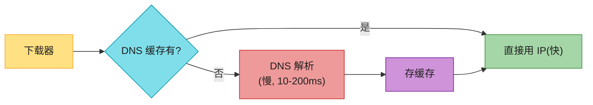

**解法**:**本地 DNS 缓存**(维护 IP → 域名映射),命中直接用,不每次查 DNS。Google 爬虫有专门的 DNS 缓存层。

---

## 6. politeness(robots.txt + 延迟)

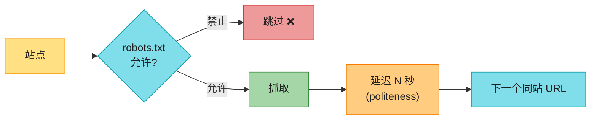

> 📝 **robots.txt**:站点根目录的协议文件,声明哪些页面**允许/禁止**爬虫抓取。**必须遵守**(法律 + 礼仪)。

> 🪤 **追问陷阱**:"不遵守 robots.txt 行不行?" → "技术上能抓,但**会被封 IP + 法律风险**。商业爬虫(Google/Bing)都遵守。"

---

## 7. 优先级 + fresh

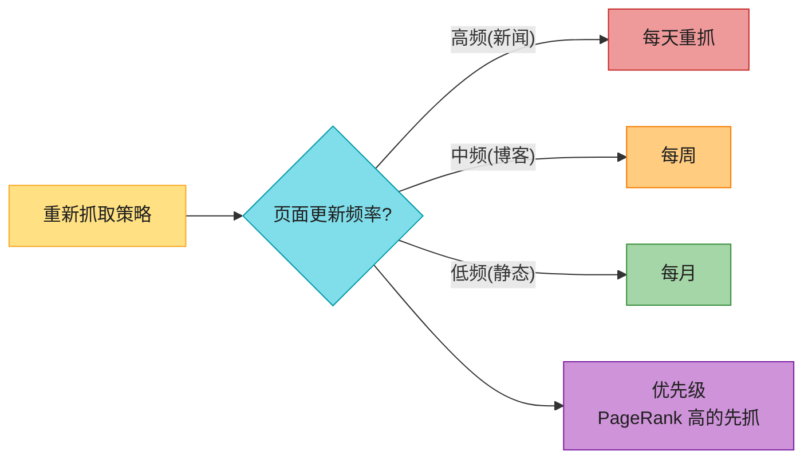

- **优先级**:PageRank/重要度高的页面优先抓(首页 vs 深层页)。
- **fresh**:根据页面历史更新频率,决定重抓周期。

---

## 8. 容错(健壮性)⭐

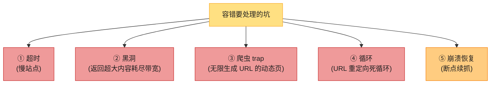

| 坑 | 解法 |
|----|------|
| 超时 | 设下载超时(如 10s),超时放弃 |
| 黑洞 | 限制单页最大 size(如 10MB) |
| **爬虫 trap** | 限制单域名 URL 数 + 深度上限 |
| 重定向循环 | 限制重定向次数(如 5 次) |
| 崩溃恢复 | frontier 持久化(已抓/未抓状态存盘) |

> 💡 **爬虫 trap**:有些动态站点无限生成 URL(如日历 `?day=1,2,3...`),爬虫会陷进去。解法:**限制单域名 URL 总数 + 路径深度上限**。

---

#### 深入:分布式爬虫架构 ⭐⭐(原书简化了)

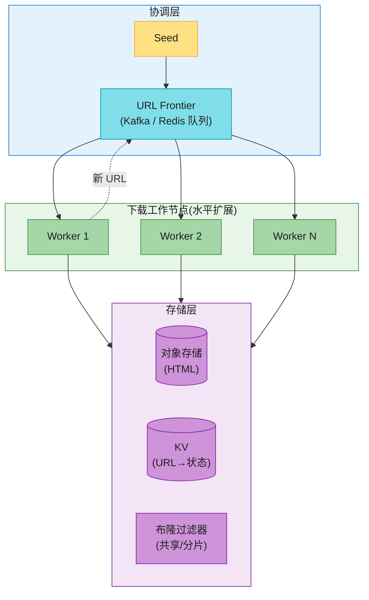

**关键**:Worker 无状态,水平扩展;Frontier 用 Kafka/Redis 共享;布隆过滤器**分片**(每个 worker 一份,或集中服务)。这是 Google/Mercator 的架构。

---

#### 深入:2026 反爬——JS 渲染(原书完全没讲)⭐⭐⭐

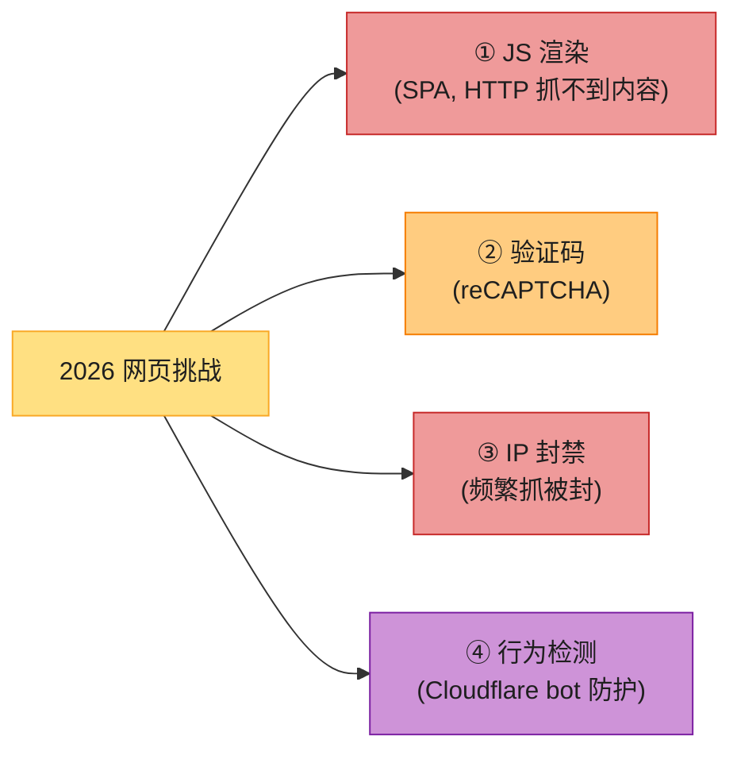

| 挑战 | 2026 解法 |
|------|----------|
| **JS 渲染**(React/Vue SPA) | **Headless 浏览器**(Playwright / Puppeteer)渲染后抓 DOM |
| 验证码 | 第三方打码服务 / ML 识别(谨慎,合规边界) |
| IP 封禁 | **代理池 + IP 轮换** |
| Bot 检测(Cloudflare) | 模拟真人(浏览器指纹、随机延迟) |

> 🔄 **2026 现代版话术**(原书只讲 HTTP 抓取,已严重过时):
> "2026 大量网页是 JS 渲染的 SPA,传统 HTTP GET 抓不到内容(拿到的是空壳 HTML)。现代爬虫必须区分:**静态页用 HTTP(快)**,**JS 渲染页用 Headless 浏览器(Playwright,慢但能渲染)**。再用代理池 + 轮换 IP 防封。这是原书 2020 版没覆盖的核心挑战。"

> 🪤 **追问陷阱**:"JS 渲染很慢,怎么平衡?" → "① **优先 HTTP 抓取**(大部分页是静态);② JS 页才用 Headless;③ Headless 用**无头 Chrome 池**(复用,避免每次启动);④ 并发受限(Headless 重,单机几十并发)。"

---

## 💻 代码示例(简化爬虫核心)

```python
import requests
from bs4 import BeautifulSoup

seen = set()   # 实际用布隆过滤器
frontier = PriorityQueue()

def crawl():
    while url := frontier.pop():
        host = hostname(url)
        if not robots_allows(url): continue
        sleep_until_polite(host)              # politeness 延迟
        try:
            resp = requests.get(url, timeout=10)  # 超时
            if len(resp.content) > 10*1024*1024: continue  # 防黑洞
        except Timeout:
            continue
        html = resp.text
        store(url, html)
        for new_url in extract_links(html):
            if not bloom_check(new_url):       # 布隆去重
                bloom_add(new_url)
                frontier.push(new_url, priority=estimate(url))
```

---

## ⚠️ 已过时 / 书里没说(2020 → 2026)

| 原书 | 2026 现状 | 面试应对 |
|------|----------|---------|
| 只讲 HTTP 抓取 | **JS 渲染页**必须 Headless 浏览器 | 主动提 Playwright + 何时用 |
| 反爬几乎没提 | **IP 轮换 + 代理池 + bot 检测** 是核心 | 讲反爬策略 |
| 布隆过滤器一笔带过 | 要会讲**假阳性 + 内存优势** | 给 1GB vs 100GB 对比 |
| DNS 缓存只提一句 | 是**隐藏性能瓶颈** | 强调 DNS 缓存层 |
| 没提断点续抓 | frontier **持久化**才能恢复 | 讲崩溃恢复 |
| 没提 sitemap | 大站用 **sitemap.xml** 加速发现 | 提 sitemap 补充 seed |
| **只讲 URL 去重** | **内容近重复(SimHash)** 才是真难题(30%+ 是镜像/转载) | 讲 SimHash + 抽屉法检索 |

---

## 🪤 追问陷阱

1. **"怎么避免重复抓?"** → 布隆过滤器(URL 哈希)+ 重要页面精确 KV 兜底。
2. **"同站点被反爬封怎么办?"** → politeness 延迟 + 代理池 IP 轮换。
3. **"JS 渲染页怎么抓?"** → Headless 浏览器(Playwright)。
4. **"爬虫 trap 怎么防?"** → 限制单域名 URL 数 + 路径深度上限。
5. **"DNS 慢怎么办?"** → 本地 DNS 缓存(命中直接用 IP)。
6. **"10 亿 URL 怎么去重?"** → 布隆过滤器(1-2GB)+ 分片。
7. **"新内容怎么发现?"** → sitemap.xml + ping 通知 + 重抓高频站点。
8. **"爬虫 worker 怎么扩展?"** → 无状态 worker + Kafka frontier 水平扩展。
9. **"镜像站/转载怎么去重?"** → URL 去重不够,要 **SimHash 内容指纹** + 海明距离 ≤ 3 判近重复(抽屉法快速检索)。

---

## 🏭 生产级产品速查表

| 产品 | 特点 |
|------|------|
| **Googlebot** | 全球最大,分布式,JS 渲染(WRS) |
| **Bingbot** | 类似 Google |
| **Scrapy** | Python 开源爬虫框架 |
| **Mercator / Heritrix** | 学术/归档爬虫 |
| **Playwright / Puppeteer** | Headless 浏览器(JS 渲染) |
| **Apache Nutch** | 分布式开源爬虫 |

---

## 📝 本章要点总结

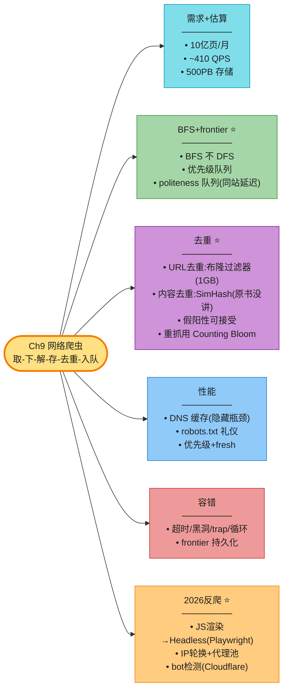

**核心 Takeaways**:

1. **核心循环**:取→下→解→存→去重→入队,这是爬虫心脏。
2. **BFS + 双队列 frontier**:优先级(重要页先)+ politeness(同站延迟)。
3. **去重两层**:URL 去重(布隆,省内存 100 倍)+ **内容近重复去重(SimHash)**——后者原书没讲,是区分候选人的点。
4. **DNS 缓存**是隐藏性能瓶颈,必须有。
5. **容错五坑**:超时/黑洞/trap/循环/崩溃,各有解法。
6. **2026 反爬是核心增量**:JS 渲染用 Headless(Playwright),原书完全没讲——这是你和别人的区分点。
7. **分布式**:无状态 worker + Kafka frontier 水平扩展。

> 🔗 **连接下一章**:Ch9 爬虫是"主动抓数据";**Ch10 通知系统**是"主动推数据给用户"——SMS/Email/Push,另一个高频设计题。

---

## ☁️ AWS 实现(Day 0 → 扩展 → Day N)⭐⭐⭐⭐⭐

> **本节定位**:这是 **AWS 书 Part III / Ch15 的落地视角**——把前面 SDE 设计的分布式爬虫(URL frontier + 布隆去重 + worker 池 + 内容存储)真正搬上 AWS。核心思路:**前面讲的每个抽象组件,在 AWS 都有对应的托管服务**,不必自建。引用 Part II:`aws_11`(EC2/ECS/Lambda 计算)、`aws_12`(SQS/Kinesis/Step Functions 编排)、`aws_10`(DynamoDB/S3/OpenSearch 存储)。

> 💡 **一句话开场(背)**:"前面的爬虫设计是**逻辑架构**(frontier/去重/存储);本节是**物理实现**——URL 队列用 **SQS**,worker 用 **ECS Fargate/EC2**,去重表用 **DynamoDB**,原始页面存 **S3**,全文索引用 **OpenSearch**。Day 0 先用托管服务跑通,扩展期按队列深度 autoscaling,Day N 多 Region 抓取 + S3+Athena 离线分析。"

---

### 🗺️ AWS 架构总览

把 SDE 设计的爬虫核心循环映射到 AWS 服务,每个抽象组件都对应一个托管服务,这样**不必自建基础设施**:

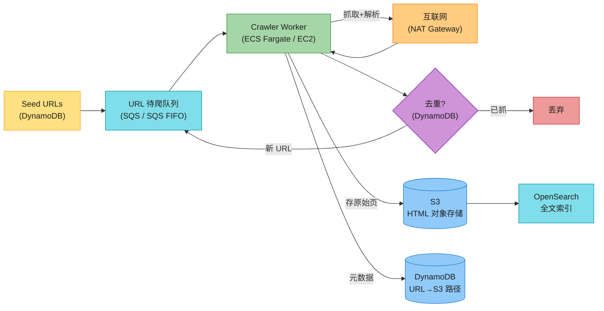

**组件映射表**(背):

| SDE 设计组件 | AWS 服务 | 为什么 |
|-------------|---------|--------|
| URL frontier(待爬队列) | **SQS / SQS FIFO** | 托管队列,自动削峰,FIFO 保同站点顺序(politeness) |
| Crawler worker(下载器) | **ECS Fargate / EC2** | 容器化 worker,水平扩展,Fargate 免运维 |
| 去重表(已爬 URL) | **DynamoDB** | KV 查询毫秒级,按 partition key=URL 直查 |
| 原始页面存储 | **S3** | 对象存储,极低成本,无限容量,自动多 AZ 复制 |
| 全文索引/搜索 | **OpenSearch** | 托管 Elasticsearch,倒排索引开箱即用 |
| robots/DNS 缓存 | **DynamoDB / ElastiCache** | 低延迟读,省往返 |

---

### Day 0 MVP(最小可跑通)

Day 0 目标:**最快跑通抓取循环**,全部用托管/无服务器服务,不操心扩缩容。

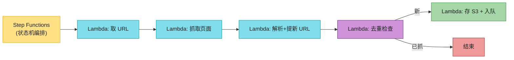

**Day 0 选型**(AWS 书原话思路):
- **编排**:用 **Step Functions**(状态机)把"取 URL → 抓取 → 解析 → 去重 → 入队"拆成独立步骤,每步一个 Lambda,Map state 并行化。
- **URL 队列**:用 **SQS** 当待爬队列(URL frontier)。URL 列表太大无法在状态间传递,必须持久化到 SQS/DynamoDB。
- **去重表**:**DynamoDB** 两张表——① frontier 表(跨 crawl 持久化存 URL+TTL);② 单次 crawl 去重表(crawl 开始建,crawl 结束删,保证单 URL 不重复抓)。
- **原始页面**:**S3** 存 HTML(对象存储首选);DynamoDB 存 URL→S3 路径的元数据映射。
- **搜索**:Day 0 直接用 **Amazon Kendra**(托管企业搜索,S3 连接器自动索引),连爬虫都不用自己写——Kendra 自带 web crawler connector。

**关键 CLI / Task 定义**(ECS Fargate worker 跑抓取):

```yaml
# ECS Task Definition(简化)
family: web-crawler-worker
networkMode: awsvpc
requiresCompatibilities: [FARGATE]
cpu: "1024"          # 1 vCPU
memory: "2GB"
containerDefinitions:
  - name: crawler
    image: <account>.dkr.ecr.<region>.amazonaws.com/crawler:latest
    environment:
      - name: SQS_QUEUE_URL
        value: https://sqs.<region>.amazonaws.com/<acct>/url-frontier.fifo
      - name: DEDUP_TABLE
        value: crawled-urls
      - name: S3_BUCKET
        value: raw-pages-prod
    logConfiguration:
      logDriver: awslogs
```

```python
# worker 核心循环(ECS 容器内跑)
import boto3, requests, hashlib
from bs4 import BeautifulSoup

sqs, ddb, s3 = boto3.client("sqs"), boto3.resource("dynamodb").Table("crawled-urls"), boto3.client("s3")

def poll_and_crawl():
    while True:
        msgs = sqs.receive_message(QueueUrl=Q, MaxNumberOfMessages=10, WaitTimeSeconds=20).get("Messages", [])
        for m in msgs:
            url = m["Body"]
            key = hashlib.sha256(url.encode()).hexdigest()
            # 去重:ConditionalWrite,已存在则跳过
            try:
                ddb.put_item(Item={"url_hash": key, "url": url},
                             ConditionExpression="attribute_not_exists(url_hash)")
            except Exception:  # 已抓过
                sqs.delete_message(QueueUrl=Q, ReceiptHandle=m["ReceiptHandle"]); continue
            html = requests.get(url, timeout=10).text
            s3.put_object(Bucket="raw-pages-prod", Key=f"{key}.html", Body=html.encode())
            for new_url in BeautifulSoup(html, "html.parser").find_all("a", href=True):
                sqs.send_message(QueueUrl=Q, MessageBody=new_url["href"],
                                 MessageGroupId=domain_of(new_url["href"]))  # FIFO 按域名分组
            sqs.delete_message(QueueUrl=Q, ReceiptHandle=m["ReceiptHandle"])
```

> 📝 **Day 0 关键点**:用 **DynamoDB ConditionalWrite** 实现"检查-插入"原子操作(避免并发重复抓);SQS FIFO 的 **MessageGroupId=域名** 实现同站点串行(politeness 免费拿到)。

---

### 扩展(单 Region)

Day 0 跑通后,瓶颈出现:① Lambda 冷启动 + 超时(15 分钟上限)不适合长抓取;② 单 worker 吞吐不够。扩展期解决:

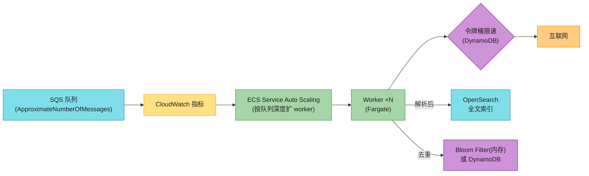

**扩展期三件事**:

1. **Worker 用 ECS Service + Auto Scaling**:从 Lambda 换到 **ECS Fargate**(无 15 分钟超时限制,适合长抓取/JS 渲染)。按 **SQS 队列深度**(`ApproximateNumberOfMessages`)做 target tracking autoscaling——队列积压就扩 worker,空了就缩。引用 `aws_11` 的 ECS Service Auto Scaling。

2. **抓取限速(令牌桶)**:politeness 要求同站点延迟。用 **DynamoDB** 存"域名→上次抓取时间",worker 抓前查+写;或用**令牌桶**(每域名一个桶,按速率补令牌)。也可以 ElastiCache Redis 做分布式限速。

3. **去重两层**:
   - **URL 去重**:数据量大用 **Bloom Filter**(worker 内存,1-2GB 省百倍);需要精确 + 重抓支持用 **DynamoDB**(Counting 思路:存抓取次数 + TTL)。
   - **页面解析后入 OpenSearch**:解析出的标题/正文/链接入 OpenSearch 建倒排索引,支持全文检索(引用 `aws_10` 的 OpenSearch)。

---

### Day 0 → Day N 对照表

SDE 设计的抽象组件 → AWS 服务的完整映射,这张表是面试核心:

| SDE 设计组件 | Day 0(托管) | 扩展期 | Day N(生产级) |
|-------------|------------|--------|--------------|
| URL frontier | SQS | SQS FIFO(按域名分组) | SQS FIFO + SNS 优先级路由 |
| 下载 worker | Lambda + Step Functions | ECS Fargate + Auto Scaling | EKS EC2(多 Region 部署) |
| URL 去重 | DynamoDB(单次 crawl 表) | Bloom Filter(内存)+ DynamoDB | DynamoDB Global Tables(多 Region) |
| robots/DNS 缓存 | DynamoDB | ElastiCache Redis | ElastiCache + 多 Region 副本 |
| 原始页存储 | S3 | S3 + 生命周期策略(转 Glacier) | S3 + Cross-Region Replication |
| 全文索引 | Kendra(托管) | OpenSearch | 自建倒排索引(S3 + Lucene) |
| 编排 | Step Functions | Step Functions / MWAA | Step Functions(批量重抓) |
| 监控 | CloudWatch | CloudWatch + X-Ray | CloudWatch + FIS(Chaos) |

> 💡 **选型权衡(背)**:Day 0 全用托管(Kendra/Lambda/Step Functions)图快;Day N 当规模到 Google 的 1/10 时,**自建比 Kendra 更省成本 + 更可控**——这正是 AWS 书强调的"管理服务 vs 自建"权衡(无免费午餐 TINSTAAFL,见 `aws_01` 准则四)。

---

### Day N 生产级

Day N 解决大规模生产环境的真实难题:多 Region、礼貌抓取、海量离线分析、监控、批量重抓。

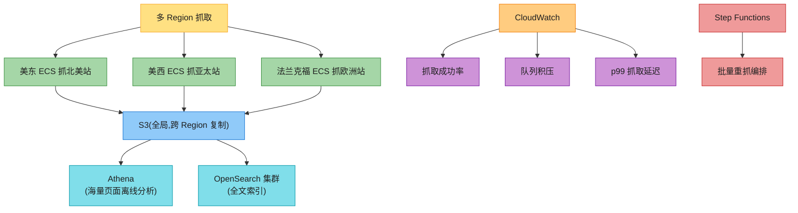

**Day N 五大要点**:

1. **多 Region 抓取**:爬虫部署在**靠近目标站点的 Region**(美东抓北美、法兰克福抓欧洲)。理由:① 降低 RTT 提吞吐;② 有些站点(如政府站)会封锁境外 IP,**必须在同 Region 抓**。AWS 书原话强调这点。

2. **礼貌抓取与 robots.txt**:遵守 robots.txt(法律 + 礼仪);同站点延迟用 DynamoDB 记"上次抓取时间"或令牌桶;robots 缓存存 ElastiCache 省往返。**不遵守会被封 IP + 法律风险**(见前面 SDE 章节)。

3. **S3 + Athena 离线分析**:海量原始页(20PB 级)存 S3 极便宜;用 **Athena**(无服务器 Presto)直接 SQL 查 S3 上的页面数据,做内容分析、链接图谱计算、近重复检测(SimHash)。不必把数据搬到计算集群——**计算向数据移动**。

4. **CloudWatch 监控**:核心指标——**抓取成功率**(HTTP 2xx 占比)、**SQS 队列积压**(ApproximateNumberOfMessages)、**p99 抓取延迟**、**被反爬封禁率**(429/403 占比)。配告警 + 错误预算(见 `aws_01` 增量 2)。

5. **Step Functions 编排批量重抓**:页面有 TTL(新闻每天重抓、静态页每月重抓)。用 Step Functions 编排:扫描 DynamoDB 过期 URL → 批量入队 → worker 重抓 → 更新 TTL。Step Functions 的错误处理 + 调试能力优于纯 SQS-SNS 编排(orchestration 优于 choreography,见 `aws_12`)。

---

### 💰 成本与性能

| 组件 | 计费模型 | 成本特性 |
|------|---------|---------|
| **Fargate** | 按 vCPU + 内存 × 秒 | 按任务计费,**适合波动型抓取**(队列空就缩到 0) |
| **Lambda** | 按请求数 × GB-秒 | 适合事件触发/轻量抓取,长任务不划算(15 分钟上限) |
| **EC2(EKS)** | 按实例小时 | 适合稳定大流量,Reserved Instance 省成本 |
| **S3** | 按 GB-月 + 请求数 | **存原始页成本极低**,Glacier 归档更省(冷数据) |
| **SQS** | 按请求数(非存储量) | **削峰利器**,百万消息也只算请求费 |
| **DynamoDB** | 按 RCU/WCU 或 on-demand | on-demand 适合不可预测负载;provisioned 适合稳态 |

> 💡 **成本优化(背)**:① **Fargate 按任务计费**适合爬虫的波动负载(白天多抓、夜间少抓,队列空缩到 0);② **S3 存原始页极便宜**(20PB 也能扛),配合生命周期策略把冷数据转 Glacier;③ **SQS 削峰**——突发 URL 发现不会压垮 worker,队列吸收波动;④ **Graviton(Arm)worker** 比 x86 性价比高 20-40%(见 2026 增量)。

---

### 🆕 2026 增量(AWS 书没讲的硬核)

AWS 书(2023)停在 Step Functions + Kendra,但 2026 爬虫在 AWS 上有这些新玩法:

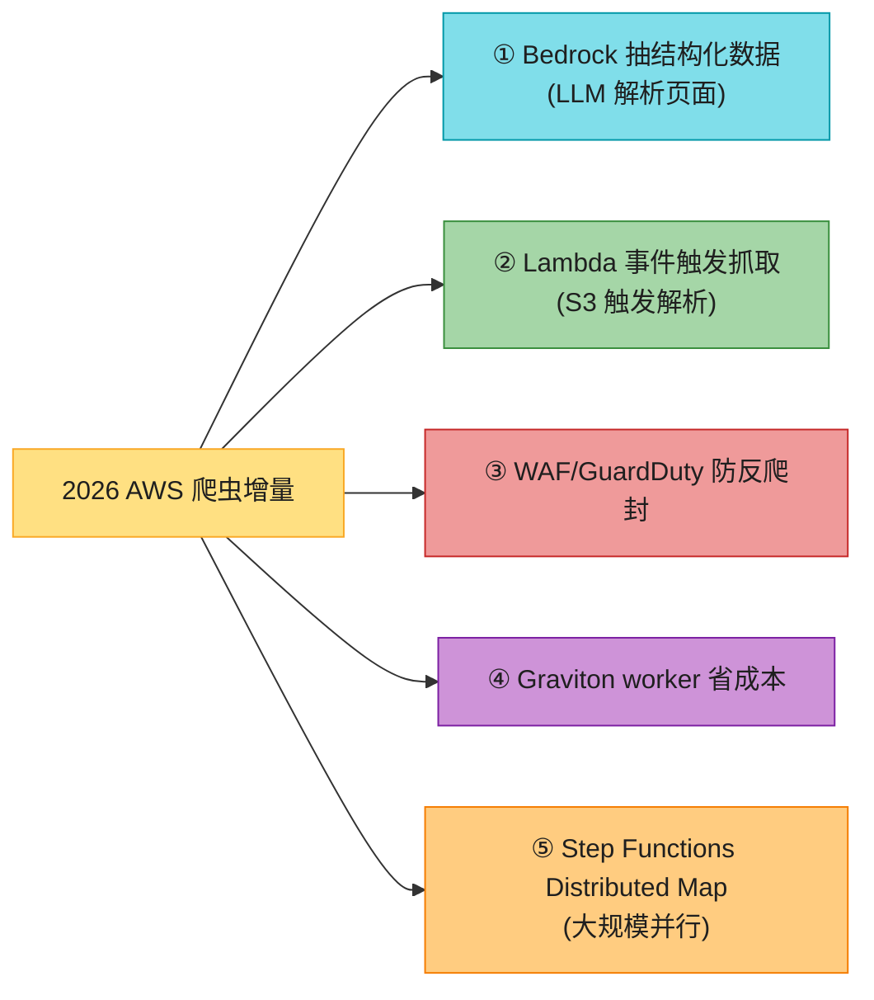

| 2026 增量 | 说明 |
|----------|------|
| **Bedrock 抽结构化数据** | 传统解析靠正则/CSS 选择器(脆弱,页面改版就挂)。**Bedrock 调 LLM**(Claude 等)直接从 HTML 抽"标题/价格/作者/发布时间"等结构化字段,**抗页面改版**。适合价格监控、新闻聚合。 |
| **Lambda 事件触发抓取** | S3 上传新页 → 触发 Lambda 解析 → 结果写 DynamoDB/OpenSearch。**事件驱动管道**,不必轮询。轻量解析用 Lambda,重 JS 渲染还是 ECS。 |
| **AWS WAF / GuardDuty 防被反爬封** | 爬虫自身也可能被目标站防护(Cloudflare/WAF)。用 **AWS WAF + 住宅 IP 代理池**降低被封概率;**GuardDuty** 检测异常出站流量(避免 worker 被当成攻击源)。 |
| **Graviton(Arm)worker 省成本** | ECS Fargate / EC2 选 Graviton3/4 实例,**性价比比 x86 高 20-40%**,爬虫是 CPU 密集(解析/哈希),Graviton 收益明显。 |
| **Step Functions Distributed Map** | 2023 新增,**单次执行可并行数千 Lambda**(突破旧 Map state 上限)。批量重抓 10 万 URL 一步并行,不再要拆多个状态机。 |

> 🔄 **2026 话术(直接背)**:"AWS 书的爬虫停在 Step Functions + Kendra(2023)。**2026 三个新玩法**:① **Bedrock + LLM 解析**——传统正则/CSS 选择器页面一改版就挂,LLM 直接抽结构化字段抗改版;② **Lambda 事件驱动**(S3 上传触发解析)省轮询;③ **Graviton worker 省 20-40% 成本**。再加 **WAF/GuardDuty 防被反爬封**——爬虫本身也可能被目标站当攻击源封掉。"

---

> 🔗 **本节回扣**:SDE 设计的 URL frontier / 布隆去重 / worker 池 / 内容存储,在 AWS 分别是 **SQS / DynamoDB(Bloom) / ECS / S3**。Day 0 全托管(Kendra+Lambda+Step Functions)图快,Day N 规模上来后**自建倒排索引比 Kendra 更省更可控**——这正是 `aws_01` 准则四"无免费午餐"和准则五"看场景"的实战。下一章 **Ch10 通知系统**会从"主动抓数据"转到"主动推数据给用户",用到 SNS/SQS/Push。
