# Chapter 10: 设计通知系统 (Design a Notification System)

> 📑 **导航**:[← 爬虫](ch1_09-设计网络爬虫.md) · [📚 总目录](../README.md) · [Feed →](ch1_11-设计新闻Feed.md)
> 🔗 **相关**:[消息队列](../SDE-Vol2/ch2_04-设计分布式消息队列.md) · [AWS消息/IAM](../SDA/aws_12-AWS消息编排监控IAM.md)


> **本章定位**:通知系统是**"看起来简单、做起来全是坑"**的题。它把 Ch1 的 MQ、Ch4 的限流、Ch6 的去重/幂等全用上。灵魂是三件事:**① 通道异构**(iOS/Android/SMS/Email/Web 协议、速率、合规各不同)② **可靠送达**(不丢、不重)③ **不骚扰用户**(限流 + 优先级 + 静默时段)。**做过 SMS/Push 的人这章要讲出"生产级"深度**——device token 失效、SMS 聚合商路由、投递率为什么只有 70%——这些才是区分点。

> **本章和原书的区别**:原书讲得清楚但**偏浅**——device token 失效生命周期(头号生产坑)没讲、SMS 聚合商路由/失败切换没讲、**FCM legacy API 2024 已废弃**没更新、去重只一笔带过、投递率没分析、合规(静默时段/退订)没提。本章按真实 SMS/Push 系统的标准补齐。

---

## 🎯 面试怎么答(被问到"设计一个通知系统"时)

**开场话术**(直接背):

> "通知系统我先确认四件事:① 支持哪些通道(iOS/Android/SMS/Email/Web Push)?② 单发还是群发(事务通知 vs 营销群发)?③ 可靠性要求(能不能丢/能不能重复)?④ 合规要求(防骚扰、静默时段、退订)?然后按 **通道选型 → 架构(API→MQ→通道 worker→三方)→ 可靠性(不丢 + 幂等去重)→ 防骚扰(限流 + 优先级)** 四块讲。"

**4 步推进**:

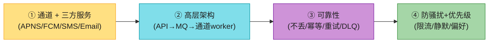

> 💡 **Step 1 必问**:通知**场景**决定一切。验证码(不能丢、要快、防刷)、订单通知(不能丢)、社交通知(可合并)、营销群发(可容忍丢失、要限流防骚扰)。**别假设——问清楚**。

---

## 🗺️ 章节概览

| 小节 | 要点 | 重要性 |
|------|------|--------|
| 需求 + 估算 | 通道、场景、可靠性、合规 | ⭐⭐ |
| **通道 + 三方** | APNS/FCM/SMS/Email/Web 各不同 | ⭐⭐⭐ |
| **高层架构** | API→MQ→分通道 worker→三方 + 反馈环 | ⭐⭐⭐⭐ |
| **可靠性** | 不丢(持久化+重试) + 不重(幂等去重) | ⭐⭐⭐⭐⭐ |
| **device token 生命周期** | 失效+反馈清理(头号生产坑) | ⭐⭐⭐⭐⭐ |
| **投递率分析** | 为什么只有 ~70% | ⭐⭐⭐⭐ |
| **SMS 深入** | 聚合商路由 + DLR + 签名模板合规 | ⭐⭐⭐⭐⭐ |
| 防骚扰+优先级+偏好 | 多级限流(接 Ch4)+ 静默 | ⭐⭐⭐⭐ |
| 事件追踪 | sent→delivered→opened 漏斗 | ⭐⭐⭐ |

---

## 1. 需求 + 估算

**澄清问题**(Step 1,直接问出来):

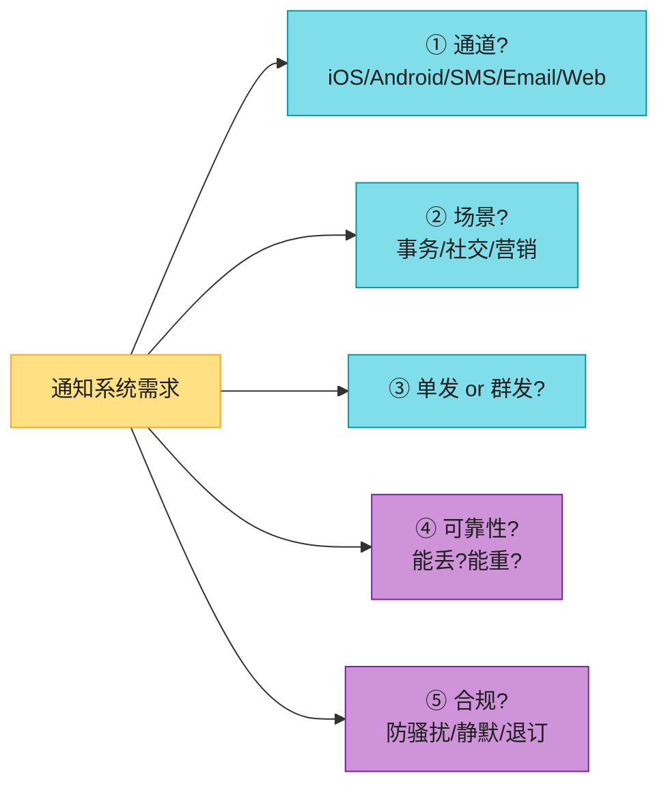

**估算**(假设 1000 万 DAU):

```
Push:    每人 ~10 条/天 = 1 亿/天 → 平均 1160 QPS,峰值 5x ≈ 5800 QPS
SMS:     占比小(贵)~10 万/天
Email:   批量为主 ~100 万/天
营销群发: 1000 万用户 / 10 分钟 = 1.67 万/秒 突发(受三方速率限制)

存储:    通知日志 1 亿 × 500B = 50 GB/天,留 30 天 ≈ 1.5 TB
```

> 💡 **结论**:通知是**中等吞吐、强可靠性、强合规**的系统。难点不在 QPS,而在**送达率**和**不骚扰**。

---

## 2. 通知类型 + 三方服务

一条通知 intent,要**按用户设备/偏好 fanout 到不同通道**。每个通道的协议、速率、合规、投递语义都不同——这是通知系统"异构"的本质。

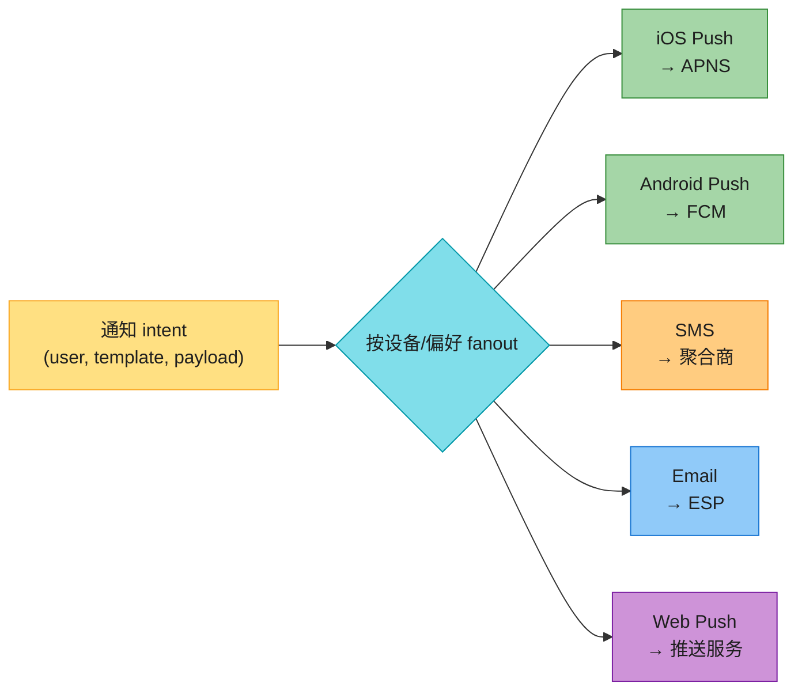

**五通道对比**(背熟):

| 通道 | 三方服务 | 协议/鉴权 | 投递语义 | 成本 | 合规要点 |
|------|---------|----------|---------|------|---------|
| **iOS Push** | **APNS**(Apple) | HTTP/2 + **JWT(p8 key)** | 尽力而为,**无设备回执** | 免费 | 静默 push iOS13 后被限流 |
| **Android Push** | **FCM**(Google) | **HTTP v1 + OAuth**(legacy 2024 废弃) | 有部分投递数据(BigQuery) | 免费 | Doze/省电会延迟 |
| **SMS** | Twilio/Nexmo/阿里云/腾讯云 | SMPP 或 HTTP | **有 DLR 回执** | **贵(按条)** | 中国须签名+模板审核 |
| **Email** | SendGrid/SES/Mailgun | SMTP / HTTP | bounce/complaint 回执 | 便宜 | SPF/DKIM/DMARC + 退订 |
| **Web Push** | FCM/Mozilla/APNS push | Web Push API + **VAPID** | 尽力而为 | 免费 | 需用户授权 |

> ⚠️ **2026 必须更新**:**FCM legacy API 2024 年 6 月已停用**,必须迁移到 **HTTP v1 + OAuth2**(用 service account JSON 签 token)。原书讲的还是 legacy server key——**面试说一句"legacy 废弃了"非常加分**。

> 💡 **APNS 鉴权演进**:老式证书(cert)鉴权已被 **token-based 鉴权(JWT,p8 椭圆曲线密钥)** 取代——一个 key 发所有 app,不用每年换证书。

---

## 3. 高层架构 ⭐⭐⭐⭐

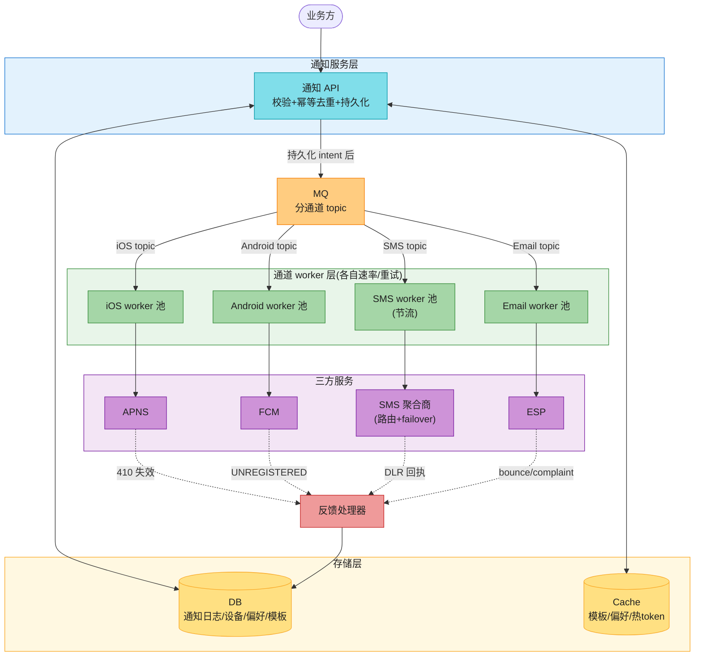

**组件职责**(背熟):

| 组件 | 职责 |
|------|------|
| **通知 API** | 接收业务方请求,**校验 + 幂等去重 + 持久化 intent + 入 MQ** |
| **DB** | 通知日志、设备表(token)、用户偏好、模板 |
| **Cache** | 热模板、用户偏好、热 token(读多) |
| **MQ(分通道 topic)** | 解耦、削峰、重试、**通道隔离**(iOS worker 挂不影响 SMS) |
| **通道 worker 池** | 消费对应 topic,调三方;**每个通道独立速率/重试策略** |
| **三方服务** | APNS/FCM/SMS/ESP |
| **反馈处理器** | 消费三方失效/回执,更新设备状态、投递结果 |

**为什么用 MQ(必答)**:
- **解耦**:API 快返回,异步发(三方调用慢)。
- **削峰**:营销群发 1.67 万/秒,worker 按三方速率消费。
- **重试**:MQ 持久化 + 消费者重试,三方暂时不可用不丢。
- **通道隔离**:分 topic,iOS 限流不影响 SMS。

> 🪤 **追问陷阱**:"为什么 worker 要分通道,不统一一个池?" → "每个通道**速率限制、重试策略、API、合规**都不同。SMS 按条计费要严控并发,APNS 高吞吐但 token 失效要特殊处理。混在一起一个慢通道拖垮全部。**分通道 topic + 独立 worker 池**是标准做法。"

---

## 4. 可靠性:不丢 + 不重 ⭐⭐⭐⭐⭐(本章核心)

通知系统的可靠性分两半:**不丢**(验证码丢了用户体验崩)和**不重**(用户收到两条一样的也烦)。

### 4.1 不丢:持久化 + 重试 + DLQ

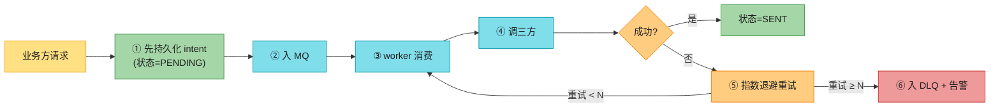

**关键**:**先持久化 intent,再入 MQ,再发**。这样即使 worker 崩、MQ 崩,notification 状态留在 DB,可从 DB + MQ 重放,**不丢**。

> 💡 **重试**:指数退避 + 抖动(`delay = base × 2^n × jitter`),避免雪崩。N 次(如 5 次)后入 **DLQ(死信队列)**,告警人工介入或换聚合商重试。

### 4.2 不重:幂等键 + 去重

通知是 **at-least-once**(MQ + 重试默认会重复)。靠**幂等**让用户体感"只收一次"。

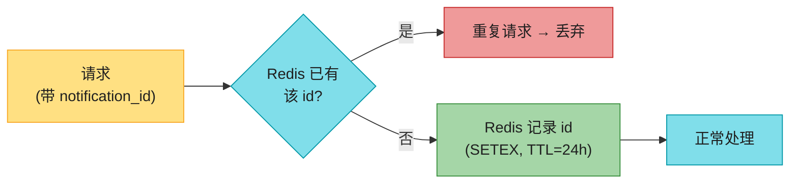

**两层去重**:
- **请求级去重**:`notification_id`(UUID,业务方生成)→ Redis SETEX。重试/重放命中同 id → 丢弃。
- **业务级去重**(防骚扰):dedup key = `user_id + template_id + 时间窗口`。如"同一用户 10 秒内同模板只发一条"。

> 🪤 **追问陷阱**:"怎么保证通知精确发一次?" → "**end-to-end 做不到** exactly-once(网络、APNS 自己会重试)。声明 **at-least-once** + 服务端 `notification_id` 幂等 + 客户端按 id 去重 = 用户体感'精确一次'。这是业界标准答案。"

---

#### 深入:device token 生命周期 ⭐⭐⭐(原书没讲,头号生产坑)

**device token / registration token 不是永久的!** 这是 push 系统最容易被坑、面试最常深挖的地方。继续往失效 token 推 = **浪费配额 + 拉低投递率 + APNS 可能限流你**。

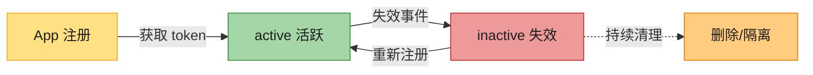

**token 失效的常见原因**(背熟,面试必问):
- App **卸载/重装**(最常见)
- 系统**升级/恢复**
- 用户在**系统设置关掉通知权限**
- token **过期**(FCM 会轮换)
- 设备长时间未上线

**反馈清理机制**:

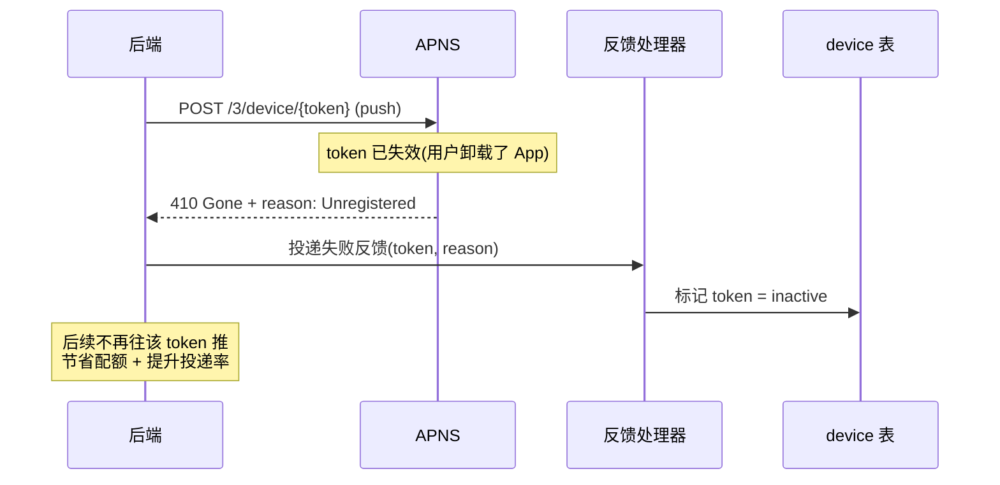

> 💡 **APNS 失效信号**:推送返回 **`410 Gone`** + `reason: Unregistered`(或 `DeviceTokenNotForTopic` / `BadDeviceToken`)。**FCM** 返回 `UNREGISTERED` error。**必须用反馈处理器捕获并标记 inactive**。

> 🪤 **追问陷阱**:"APNS 怎么知道 token 失效?" → "推送到 APNS 时,如果 token 对应设备已卸载 App / 关权限,APNS 返回 **410 Gone + Unregistered**。后端反馈处理器据此标记 token inactive。**APNS 没有'设备收到'的正向回执,只有失效的负向反馈**——这是投递率难精确统计的原因。"

---

#### 深入:投递率为什么只有 ~70%?⭐⭐(你做过会被深挖)

投递率 = 设备实际收到 / 服务端发出。**APNS 默认没有"设备收到"回执**,所以投递率靠 SDK 上报估算,真实生产里 push 投递率常只有 60-80%。原因:

| 原因 | 占比(经验) | 解法 |
|------|------------|------|
| **token 失效仍推**(最大) | 30-40% | feedback 清理 inactive token |
| **Android Doze/省电模式** | 10-15% | 用 **high priority** FCM message 唤醒 |
| 用户关通知权限 | 10% | 监听权限,降级 fallback(如转 SMS) |
| iOS **静默 push 被限流** | 5-10% | 用 visible push;静默 push iOS13 后配额制 |
| 设备离线太久 | 5% | APNS 缓存有限时间,超时丢弃 |

**投递率追踪闭环**(必须主动讲):
- push 带唯一 `notification_id` → SDK 收到时上报 `delivered` → 用户点击上报 `opened`。
- 事件入 Kafka → 数仓 → 算投递率/打开率漏斗。

> 🔄 **2026 现代版话术**:"投递率上不去的根因是 **APNS 没有设备回执**,只能 SDK 估算。我会在 payload 带 `notification_id`,SDK 收到上报,做闭环统计。Android 用 FCM **high priority** 对抗 Doze。token 失效靠 feedback 清理——这是投递率优化的最大杠杆。"

---

## 5. SMS 深入 ⭐⭐⭐⭐⭐(你做过,要拿满分)

SMS 比 push 复杂在**贵、慢、合规重、要路由**。

### 5.1 SMS 聚合商 + 路由 + failover

不自建短信中心(SMSC),用**聚合商**(aggregator):海外 Twilio / Vonage(Nexmo)/ MessageBird / Sinch / Infobip;国内阿里云通信 / 腾讯云短信 / 华为云短信 / 容联云 / 网易云信。聚合商对接运营商走 **SMPP** 协议。

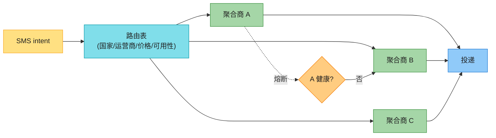

**路由策略**:按**国家/运营商/价格/成功率**选聚合商;某聚合商失败率高 → **熔断**(接 Ch4 思想)切到备用;多聚合商 **failover**。这是 SMS 系统的核心。

### 5.2 DLR(投递回执)

SMS 有 push 没有的优势:**DLR(Delivery Report)**——聚合商把投递结果**异步回调 webhook**。

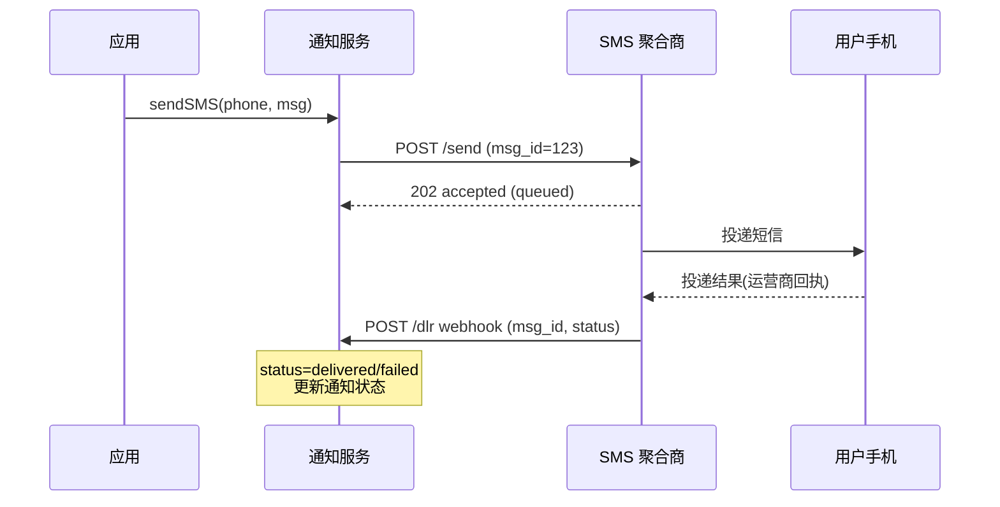

> 💡 **DLR 的价值**:push 收不到回执,SMS 有 DLR → **SMS 能精确统计投递率**,失败可按 msg_id 重试或换聚合商。`msg_id` 是去重/对账的关键。

### 5.3 中国 SMS:签名 + 模板(合规必讲)

中国 SMS 受强监管,**签名 + 模板都要审核**:

| 要素 | 说明 |
|------|------|
| **签名** | 短信开头 `【公司名】`,需服务商审核 |
| **模板** | 验证码 / 通知 / 营销,**不同模板走不同通道**,需审核 |
| **变量** | 模板里 `${code}` 占位,发送时替换 |
| **营销短信** | 仅 **8:00-20:00**、频率限制、必须含 **"回T退订"** |
| **验证码** | 独立**快速通道**(高优先级 + 防刷频控) |

> 🪤 **追问陷阱**:"中国营销短信有什么限制?" → "**只能 8:00-20:00 发**、**频率上限**、**必须含'回T退订'**、签名模板要审核、退订用户不能再发。验证码走独立快速通道,且要**频控防刷**(同手机号 1 分钟 1 条、1 小时 5 条)。"

### 5.4 SMS 吞吐与成本

- **按条/按国家计费,贵** → 去重 + 限流 = 直接省钱(国际短信单条可达几毛~几元)。
- **聚合商按秒限速** → worker 并发控制 + 排队,不能把聚合商打挂。
- **E.164 号码格式**(`+86138...`)、国家码、**HLR 查询**(号码是否有效/在网)。

---

## 6. 横切:防骚扰 + 优先级 + 用户偏好

### 6.1 多级限流(接 Ch4)⭐

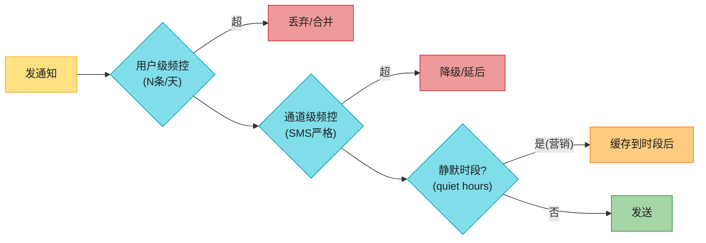

**四级频控**(Ch4 限流器的具体应用):
- **用户级**:同用户每天/每小时上限(防骚扰核心)。
- **通道级**:SMS 最严(贵+合规),push 宽松。
- **模板级**:同模板短时间去重(业务级 dedup)。
- **全局级**:保护三方配额不被打爆。

### 6.2 优先级(事务 > 社交 > 营销)

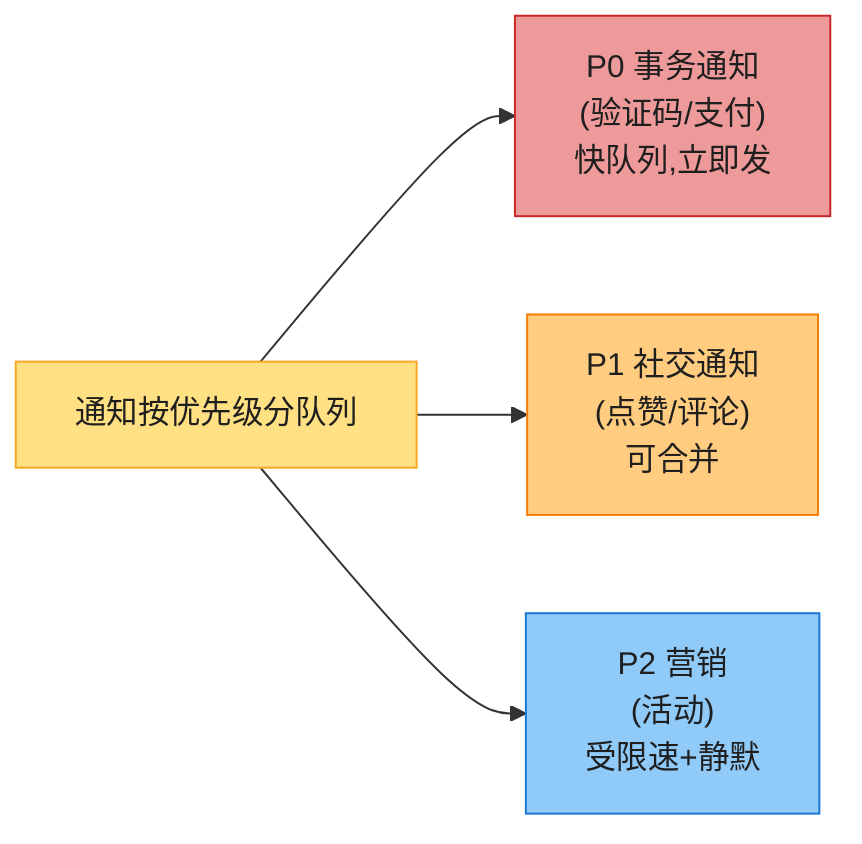

> 💡 **优先级队列**:验证码走**独立高优 topic + worker**,不被营销群发堵死。营销群发可延迟/批量,**社交通知可合并**(10 条点赞合成 1 条"X 等 10 人赞了你")。

### 6.3 用户偏好(consent)

- **opt-in/opt-out per channel**:用户可关掉某通道(如关 SMS 营销但留验证码)。
- **DND(Do Not Disturb)**:静默时段(如 22:00-8:00)不发营销,事务通知除外。
- **退订**(unsubscribe):营销必须支持,退订用户标记后不再发(合规)。

### 6.4 模板

- **版本化** + **i18n**(多语言)+ **动态变量**(`${name}`)+ **A/B 测试**。
- 模板缓存(读多),改模板不重启服务。

---

## 7. 事件追踪(analytics 漏斗)

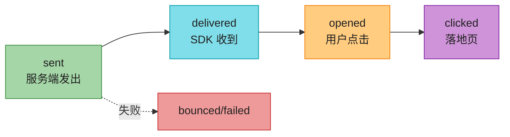

- 每个事件带 `notification_id`(接 Ch7),贯穿发送→收到→打开→点击。
- 事件入 **Kafka → 数仓**(接 Ch8/Ch9 的 analytics 链路),算漏斗转化率。
- push 打开靠 **deep link + notification_id 归因**。

---

## 8. 数据模型

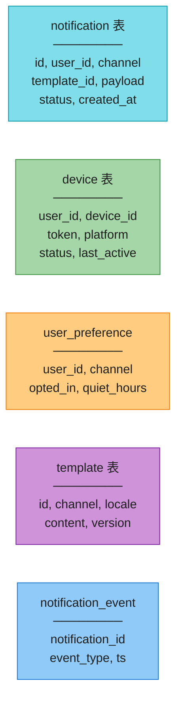

- **notification**:一次发送意图(状态机 PENDING→SENT→DELIVERED→FAILED)。
- **device**:用户的多设备,每个有 token + status(active/inactive)。**一对多**(用户 ↔ 设备)。
- **user_preference**:每通道的 consent + 静默时段。
- **template**:模板内容 + 多语言版本。
- **notification_event**:事件流(sentin/delivered/opened/clicked/bounced),用于漏斗。

---

## 💻 代码示例

### 通知 API(校验 + 幂等 + 入 MQ)

```python
import redis, uuid
r = redis.Redis()

def send_notification(user_id, template_id, payload, channel=None, nid=None):
    nid = nid or str(uuid.uuid4())           # 幂等键(业务方可传)
    # ① 请求级幂等去重
    if not r.set(f"nid:{nid}", 1, nx=True, ex=86400):
        return "duplicate, skipped"           # 重复请求丢弃
    # ② 多级限流(接 Ch4)
    if not rate_limit(f"user:{user_id}", limit=100):   return "rate limited"
    if channel == "sms" and not rate_limit(f"sms:{user_id}", limit=5): return "sms limited"
    # ③ 静默时段(营销)
    if is_marketing(template_id) and in_quiet_hours(user_id):  schedule_later(...)
    # ④ 持久化 intent(先落库,再入 MQ → 不丢)
    notif = db.insert_notification(id=nid, user_id=user_id, status="PENDING", ...)
    # ⑤ 用户偏好 + fanout 到各通道
    for ch in resolve_channels(user_id, channel):
        mq.publish(f"topic_{ch}", {"nid": nid, "user_id": user_id, ...})
    return nid
```

### SMS worker(消费 + 重试 + 熔断)

```python
def sms_worker():
    for msg in mq.consume("topic_sms"):
        try:
            provider = route(msg)             # 路由表选聚合商
            if circuit_open(provider):        # 熔断 → 换备用
                provider = failover(provider)
            msg_id = provider.send(msg.phone, render(msg))
            db.mark_sent(msg.nid, msg_id)     # 记 msg_id 等 DLR 对账
        except (Timeout, ProviderError):
            mq.retry(msg, backoff=exp_backoff(msg.attempts))   # 指数退避
            if msg.attempts >= 5:
                mq.send_to_dlq(msg); alert()  # DLQ + 告警
```

### 反馈处理(token 失效 + DLR)

```python
def apns_feedback(token, reason):
    if reason in ("Unregistered", "BadDeviceToken"):
        db.mark_device_inactive(token)        # 清理失效 token

def sms_dlr_callback(msg_id, status):
    nid = db.find_by_msg_id(msg_id)
    db.update_status(nid, status)             # delivered/failed
    emit_event(nid, status)                   # 入事件流
```

---

## ⚠️ 已过时 / 书里没说(2020 → 2026)

| 原书 | 2026 现状 | 面试应对 |
|------|----------|---------|
| FCM legacy server key | **2024 年 6 月已停用**,必须 **HTTP v1 + OAuth** | 主动说"legacy 废弃了" |
| device token 当永久 | **会失效**,要 feedback 清理(头号坑) | 讲 token 生命周期 |
| APNS 用证书 | 已改 **token-based(JWT, p8)** | 提 p8 key |
| 不区分通道 | 每通道**速率/合规/重试**不同 | 分通道 worker |
| 去重一笔带过 | **幂等键 + 窗口去重**是核心 | 讲两层去重 |
| SMS 只提 Twilio | 中国**签名模板合规 + 多聚合商路由** | 讲合规+failover |
| 没 Web Push | **iOS Safari 16.4+** 支持 Web Push | 提 Web Push + VAPID |
| 没 RCS | **RCS**(SMS 2.0)2024 Apple 接入 | 提 RCS 渐进替代 |
| 没投递率分析 | push 投递率只有 ~70% | 讲原因 + 闭环追踪 |

---

## 🪤 追问陷阱(你做过,会被深挖)

1. **"怎么保证通知精确发一次?"** → end-to-end 做不到 exactly-once;at-least-once + `notification_id` 幂等 + 客户端按 id 去重。
2. **"APNS token 失效怎么办?"** → 推送返回 410 Gone + Unregistered → 反馈处理器标记 inactive → 停推(省配额 + 提投递率)。
3. **"投递率低怎么排查?"** → token 失效(最大)/Doze/权限关/网络;靠 SDK + notification_id 闭环统计。
4. **"营销群发 1000 万怎么不超三方速率?"** → 分通道 topic + worker 节流 + 分片消费 + 受限并发;push 高吞吐,SMS 要排队。
5. **"三方(聚合商/APNS)挂了怎么办?"** → 多聚合商 failover + 熔断 + 重试 + DLQ。
6. **"怎么防骚扰?"** → 多级限流(Ch4)+ 静默时段 + 频次上限 + 优先级合并/digest + 退订。
7. **"验证码 SMS 没到怎么办?"** → 重试 + fallback(语音验证码/备用聚合商)+ **频控防刷**(同号 1 分钟 1 条)。
8. **"静默时段的通知发不发?"** → 事务通知立即发;营销缓存到时段后发或丢弃(看产品策略)。
9. **"如何统计打开率?"** → payload 带 notification_id + deep link,SDK 上报 opened/clicked → Kafka → 数仓。
10. **"push 还是 SMS 还是 Email,怎么选?"** → 按可靠性/成本/合规:验证码 SMS(确保)+ push(免费);营销 Email(便宜);push 不一定到达就 SMS 兜底。

---

## 🏭 生产级产品速查表

| 产品 | 类型 | 特点 |
|------|------|------|
| **APNS** | iOS push | Apple 官方,HTTP/2 + JWT |
| **FCM** | Android/Web push | Google 官方,HTTP v1 + OAuth |
| **OneSignal / Braze / Airship / Iterable** | 跨平台 push + 营销自动化 | 托管,analytics 强 |
| **Twilio / Vonage / MessageBird / Sinch** | SMS 聚合商 | 全球 |
| **阿里云 / 腾讯云 / 华为云短信** | 中国 SMS | 签名模板合规 |
| **SendGrid / Mailgun / SES / Postmark** | Email ESP | deliverability |
| **Kafka** | MQ | 分通道 topic、削峰、重试 |

---

## 📝 本章要点总结

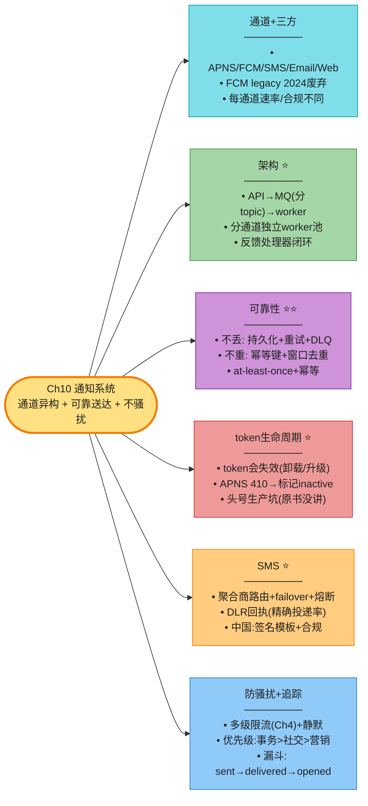

**核心 Takeaways**:

1. **灵魂三件事**:通道异构、可靠送达、不骚扰。
2. **架构** = API(校验+幂等+持久化)→ MQ(分通道 topic)→ 通道 worker → 三方 + 反馈处理器闭环。
3. **可靠性**:不丢(先持久化再发 + 重试 + DLQ)+ 不重(`notification_id` 幂等 + 窗口去重)。at-least-once + 幂等 = 近似精确一次。
4. **device token 会失效**(头号坑):APNS 410 → 标记 inactive → 停推。这是投递率的最大杠杆。
5. **SMS 三件套**:聚合商路由 + failover、DLR 回执、中国签名模板合规。
6. **防骚扰**:多级限流(接 Ch4)+ 静默时段 + 优先级队列 + 用户偏好。
7. **2026 必更新**:FCM legacy 已废弃(用 HTTP v1)、APNS 用 p8 JWT、Web Push 上 iOS、RCS 渐进替代 SMS。

> 🔗 **连接下一章**:Ch10 是"一对多推送"(服务 → 用户);**Ch11 新闻 Feed**是反向的"聚合拉取"——把多个来源的内容合并成用户的时间线,考 push/pull/hybrid 三种 fanout 模型。
