# Chapter 11: 设计新闻 Feed (Design a News Feed)

> **本章定位**:News Feed 是**读多写多、且写放大巨大**的题——它是 Facebook/Twitter 的核心,也是"**推 vs 拉**"这个分布式经典抉择的最佳教学场景。它把 Ch1 的缓存/MQ、Ch4 的限流、Ch6 的 Redis、Ch7 的 ID 全用上。灵魂是三件事:**① 怎么把一条帖子送到所有粉丝(push/pull/hybrid)② 怎么排序(时序/互动/ML)③ 怎么扛明星(明星问题)**。

> **本章和原书的区别**:原书只讲**关注流**(基于社交图的 push/pull/hybrid),讲得清楚但**完全没提 2026 的"推荐流"**——抖音/X/小红书的 For You 是基于 ML 的召回+精排,**不需要关注关系**。现代 App 通常三 tab 并存(关注 / 推荐 / 热门)。本章三流都讲,并补 **ML 排序 funnel**、**明星问题解法**、**cursor 分页**、**写放大估算**——这些是面试区分点。

---

## 🎯 面试怎么答(被问到"设计一个 News Feed"时)

**开场话术**(直接背):

> "我先问清楚是**哪种 feed**:① **关注流**(朋友圈/Twitter,基于关注,时序为主)② **推荐流**(抖音 For You,基于 ML,不需要关注)③ **热门流**(热搜)。三者架构差别巨大。然后按 **写路径(发帖 fanout)→ 读路径(看 feed)→ 排序 → 扛明星** 讲。核心抉择是 **push vs pull vs hybrid**。"

**4 步推进**:

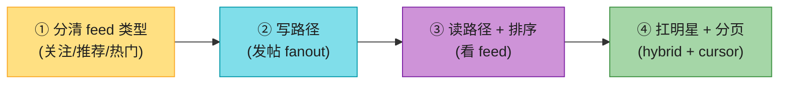

> 💡 **Step 1 必问**:**是哪种 feed?** 关注流(朋友圈)、推荐流(抖音)、还是混合?这一步定架构,问错了全盘皆错。

---

## 🗺️ 章节概览

| 小节 | 要点 | 重要性 |
|------|------|--------|
| 三种 feed 流 | 关注 / 推荐 / 热门,架构不同 | ⭐⭐⭐⭐⭐ |
| 需求 + 估算 | 读多写多,**push 写放大是重点** | ⭐⭐⭐ |
| 写路径 | 发帖 → fanout 到粉丝 feed | ⭐⭐⭐⭐ |
| 读路径 | 取预计算 feed + 补全内容 | ⭐⭐⭐⭐ |
| **Push vs Pull vs Hybrid** | 本章核心抉择 | ⭐⭐⭐⭐⭐ |
| **明星问题** | Katy Perry 1 亿粉的写放大 | ⭐⭐⭐⭐⭐ |
| 排序 | 时序 / 互动分 / ML | ⭐⭐⭐⭐ |
| **推荐流 funnel** | 召回→粗排→精排→重排 | ⭐⭐⭐⭐ |
| 分页 | cursor vs offset | ⭐⭐⭐⭐ |
| 缓存分层 | feed/content/user/graph | ⭐⭐⭐ |

---

## 1. 先分清三种 feed 流(2026 必讲)⭐

这是**面试第一步**,问错了后面全错。现代 App 通常**多 tab 并存**。

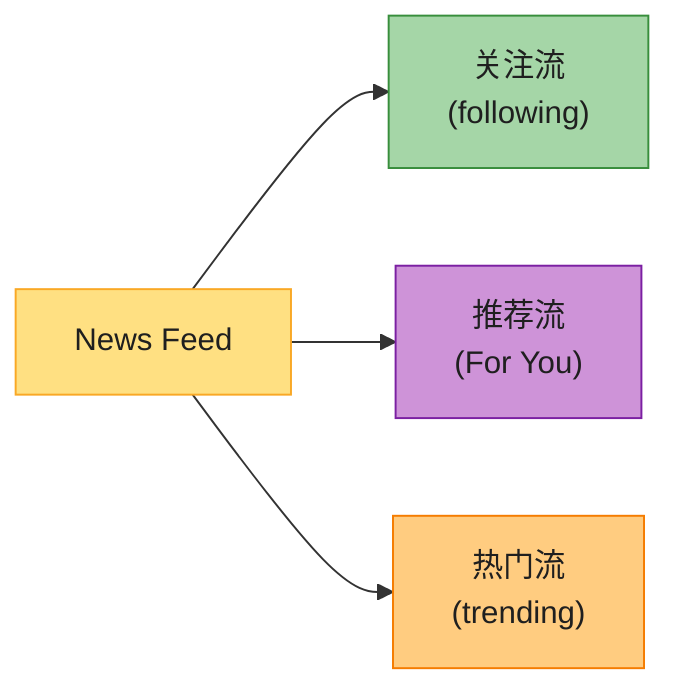

| feed 类型 | 数据来源 | 排序 | 是否需关注 | 代表 | 本题重点 |
|----------|---------|------|----------|------|---------|
| **关注流** | 关注的人的帖子 | 时序 / 简单互动分 | ✅ 需要 | 朋友圈/Twitter/微博 | **原书重点,push/pull/hybrid** |
| **推荐流** | 全量物品池(ML 召回) | **ML 精排打分** | ❌ 不需要 | 抖音/X/小红书 For You | **2026 核心,召回+精排 funnel** |
| **热门流** | 全局热度计算 | 热度分数 | ❌ | 微博热搜/Reddit | 批处理 + 缓存 |

> ⚠️ **原书只讲关注流**。但 2026 大多数 App 是**关注 + 推荐双 tab**(X、小红书、Instagram)。**面试官如果问"News Feed",你要先反问是哪种**——这本身就是加分(展示你知道三流不同)。

---

## 2. 需求 + 估算

**澄清问题**:
- 哪种 feed?(关注/推荐/混合)
- 时间线排序还是算法排序?
- 是否实时?
- 多端同步?(web/App)

**估算**(假设 1 亿 DAU,关注流):

```
发帖:  DAU 50% 发,人均 1 条 = 5000 万帖/天 → ~580 帖/秒均值,峰值 5x
读 feed: 人均 10 次/天 = 10 亿次/天 → ~1.16 万 QPS 均值,峰值 ~5.8 万 QPS

★ push 写放大(关键):
  平均每帖被 500 人关注(含明星拉高均值)
  → 5000 万 × 500 = 250 亿 fanout 写/天 → ~29 万 fanout/秒 均值
  → 这是 push 模型的真正成本中心,远超发帖本身

★ 明星一条:Katy Perry 1 亿粉 → 1 次发帖 = 1 亿次扇出(灾难,见明星问题)

存储: 帖子 5000 万 × 1KB = 50 GB/天;feed 缓存(Redis)才是大头
```

> 💡 **关键洞察**:**读 >> 写**(看的人多发的人少),但 **push 模型的"写"被扇出放大 500 倍**——所以 push/pull 的取舍本质是**写放大 vs 读延迟**的权衡。

---

## 3. 写路径(发帖)+ 读路径(看 feed)

Feed 系统就是两条路径。

### 3.1 写路径:发帖 → fanout

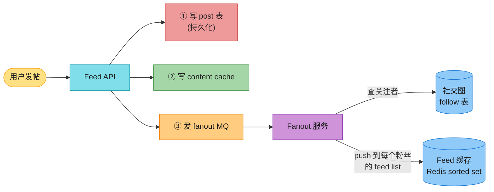

**写流程**(push 模型):
1. 写 post 表(持久化,**先落库不丢**)。
2. 写 content cache(post 对象,读时补全用)。
3. 发 fanout MQ(异步,解耦发帖 API 和扇出)。
4. Fanout 服务:查"谁关注了作者"→ 把 `post_id` push 到**每个粉丝的 feed list**(Redis sorted set,score=时间戳)。

### 3.2 读路径:看 feed

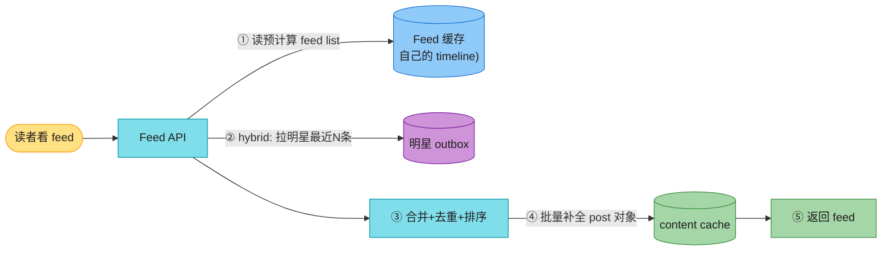

**读流程**:
1. 读自己的 feed list(push 预计算好的)。
2. **hybrid**:再拉关注的明星最近 N 条(明星没 push)。
3. 合并 + 去重 + 排序。
4. 批量从 content cache 补全 post 对象(只存了 post_id 的要展开)。
5. 返回。

> 💡 **关键优化**:feed list 只存 **post_id**(int),不存 post 全文——节省 Redis 内存 100 倍。post 全文走 content cache 补全。**ID 精简是 feed 系统的标配**。

---

## 4. 核心抉择:Push vs Pull vs Hybrid ⭐⭐⭐⭐⭐

这是本章灵魂。**fanout 发生在写时(push)还是读时(pull)?**

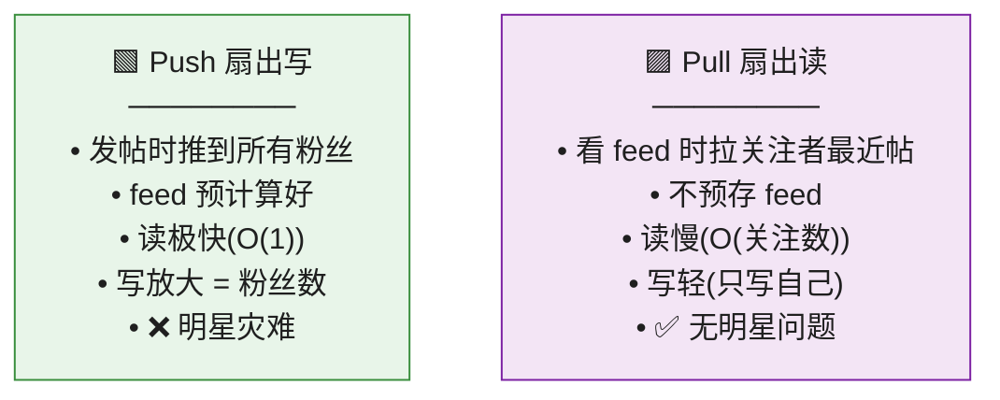

| 维度 | **Push(扇出写)** | **Pull(扇出读)** |
|------|------------------|------------------|
| fanout 时机 | **发帖时**(写放大) | **读 feed 时**(读放大) |
| 读延迟 | **极快**(预计算好) | 慢(实时聚合关注者) |
| 写开销 | 大(=粉丝数) | **小**(只写自己) |
| 存储 | 每人一份 feed list(大) | 不存 feed list(省) |
| 明星问题 | ❌ **灾难**(1 亿粉) | ✅ 无 |
| 过时数据 | feed list 可能存旧/删帖 | 总是实时 |
| 适合 | 普通用户(粉丝少) | 明星(粉丝巨多) |

**决策表**:

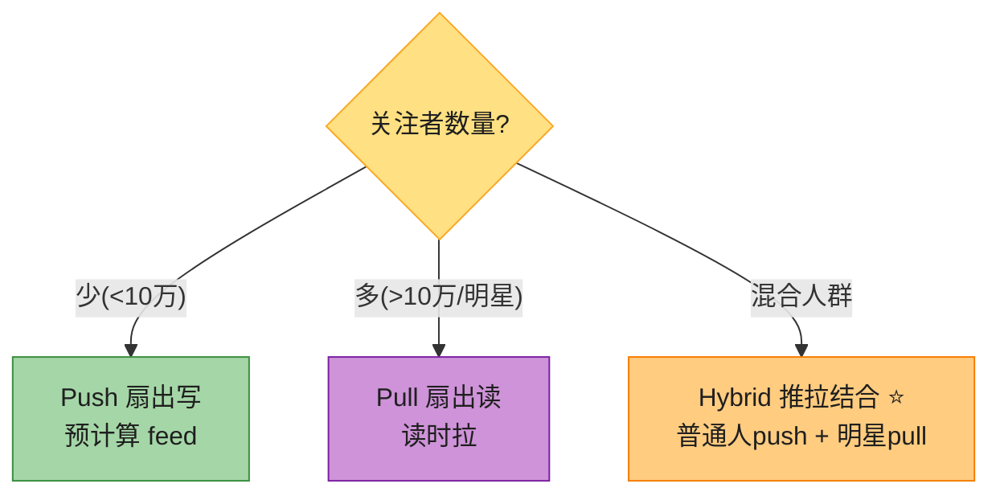

> 💡 **主流答案**:**Hybrid(推拉结合)**。普通人发帖 → push 到粉丝(读快);明星发帖 → 不 push,只更新自己的 **outbox**,粉丝读 feed 时**再拉**明星最近 N 条。门槛 = 关注数阈值(如 10 万)。**Twitter/微博都用 hybrid**。

---

#### 深入:明星问题(Hot Key)⭐⭐⭐(原书提了但没讲透)

**Katy Perry 1 亿粉,发一条推 → push 要写 1 亿次**。这是 feed 系统最经典的写放大灾难。

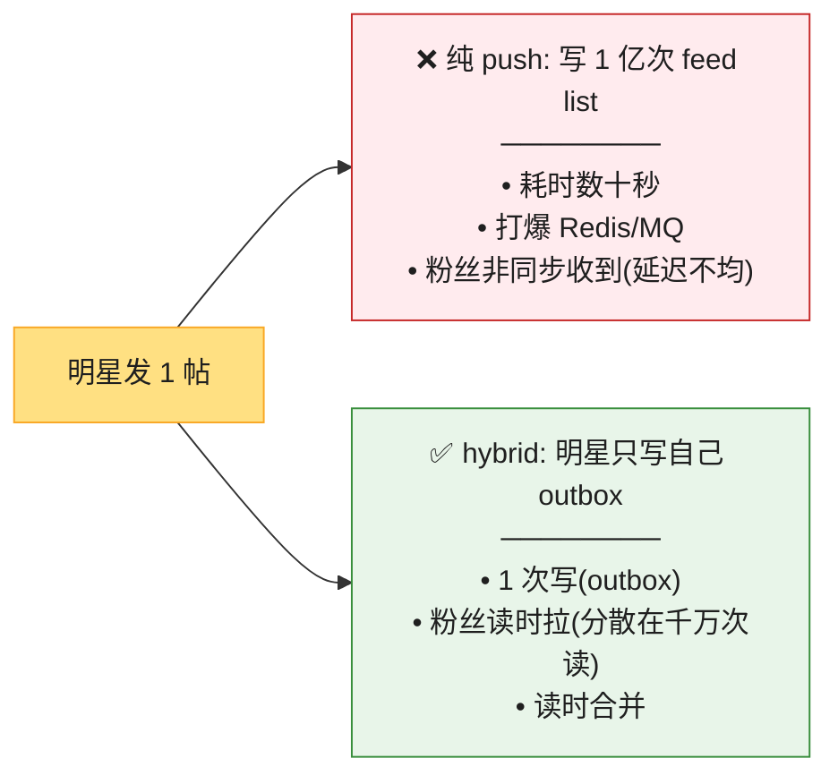

**为什么明星必须 pull**:
- 1 亿次 push 是**瞬时写尖峰**,Redis/MQ 扛不住,且粉丝收到时间严重不均(前面的秒收,最后面的等几十秒)。
- 改成 pull:明星只写 1 次到自己的 **outbox**(收件箱模式),1 亿粉丝的**读是分散在时间上的**,每个粉丝读时拉一下明星 outbox 最近 N 条——削峰。

**完整 hybrid 时序**:

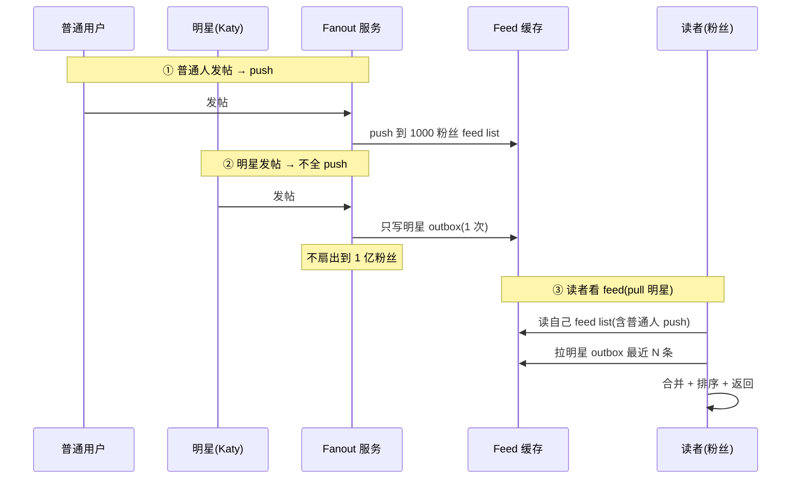

> 🪤 **追问陷阱**:"明星 push 不动,那明星的粉丝怎么能'及时'看到?" → "明星写 outbox 后,可对**活跃粉丝**(最近 7 天活跃)**异步分批 push**(限速),非活跃粉丝读时再 pull。既削峰又保证活跃用户体验。这是 Twitter 的做法。"

> 🪤 **追问陷阱**:"hybrid 的关注数阈值怎么定?" → "不是一刀切。可按**机器学习预测每用户的扇出成本**动态分类(超活跃用户/明星走 pull)。阈值经验值 10 万粉,但要 A/B 测读延迟和写成本。"

---

#### 深入:删帖/改帖后,已 push 的 feed 怎么一致?⭐⭐(原书没讲,生产高频坑)

Push 模型把 `post_id` 复制到了每个粉丝的 feed list。那么**作者删帖/改帖后,散落在千万粉丝 feed 里的引用怎么办?** 这是一致性问题,也是 push 模型的隐性代价。

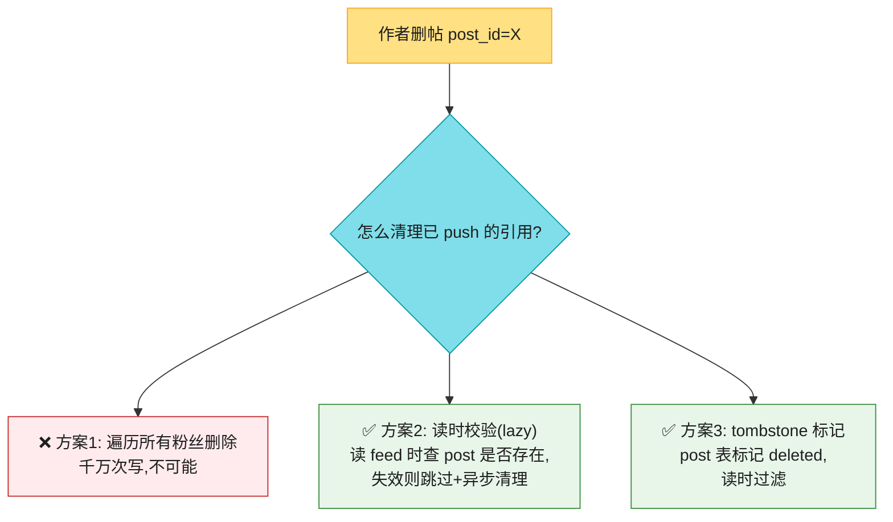

**主流做法(lazy + tombstone)**:
1. **删帖**:post 表标记 `deleted=true`(tombstone,接 Ch6 LSM 删除语义),**不主动清理** feed list。
2. **读 feed**:批量补全 post 对象时,把 `deleted=true` 的**过滤掉**(用户看不到)。
3. **异步清理**:后台 job 定期扫 feed list,删掉已 tombstone 的 post_id(降低长期膨胀)。

> 💡 **关键认知**:push 模型把"写"分摊到了千万粉丝,**删帖的一致性就反过来变成"读时兜底"**。这是 push 模型**读快写贵的延伸代价**——一致性也偏读侧。**不要追求强一致删帖**(遍历千万粉丝不现实),接受**最终一致 + 读时过滤**。

> 🪤 **追问陷阱**:"删帖后粉丝还看得到吗?" → "不会。删帖标记 tombstone,读 feed 时补全 post 会**过滤掉已删的**。不主动遍历粉丝清理(太贵),靠读时 lazy 过滤 + 后台异步清理。这是 push 模型读侧一致性的标准做法。"

---

## 5. 排序(时序 / 互动 / ML)

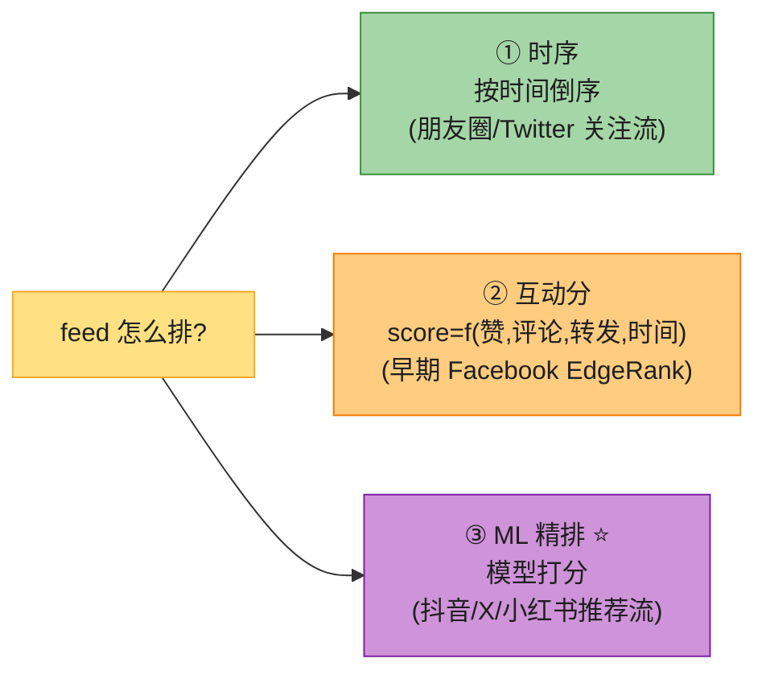

- **时序**:关注流默认,Redis sorted set score=timestamp,O(log N) 插入。
- **互动分**:早期 Facebook EdgeRank(`score = 亲和度 × 权重 × 时间衰减`)。简单可解释。
- **ML 精排(2026 主流)**:见下节推荐流。

---

## 6. 推荐流架构(2026 核心,原书完全没讲)⭐⭐⭐

抖音/X/小红书的 **For You** 不需要关注关系,靠 ML 从全量物品池召回 + 排序。这是个**漏斗**,逐层过滤:

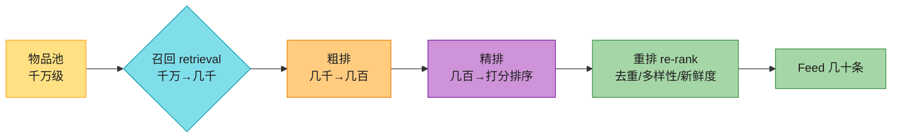

| 阶段 | 输入 → 输出 | 方法 | 速度要求 |
|------|-----------|------|---------|
| **召回 retrieval** | 千万 → 几千 | 协同过滤 / **双塔模型(two-tower)** / **向量检索 ANN** / 关注流 merge / 热门池 | 极快(多路并行) |
| **粗排** | 几千 → 几百 | 轻量模型(浅网络) | 快 |
| **精排** | 几百 → 打分 | 重模型(深度网络,特征:用户×内容×上下文) | 可慢(候选少) |
| **重排** | 打分后 → 最终 | **去重 + 多样性 + 新鲜度 + 业务规则 + EE(探索)** | 快 |

**关键概念**(背熟,2026 高频):
- **召回(recall/retrieval)**:从海量物品里**多路**捞候选。每路一个策略(兴趣向量、关注、热门、同城)。**召回层追求"不漏",不追求"准"**。
- **向量检索**:把用户和物品都编码成向量,ANN(Approximate Nearest Neighbor,如 FAISS/HNSW)找最相似的。这是 2026 召回主流(接向量数据库)。
- **精排**:深度模型,特征工程(用户画像、内容特征、行为序列、上下文),输出点击/停留/互动概率。
- **重排**:精排只看"单条最优",会**扎堆同类**。重排保证**多样性**(同类间隔)、**新鲜度**(新内容曝光)、**去重**(刚看过的不再推)、**EE**(exploration-exploitation,给新内容机会)。

> 🔄 **2026 现代版话术**:"关注流用 push/pull/hybrid(原书);但 2026 主流是**推荐流**——**多路召回 + 粗排 + 精排 + 重排**的漏斗,核心是向量检索召回 + 深度模型精排 + 重排保多样性。抖音/X/小红书都这套。原书完全没讲,这是最大缺口。"

> 🪤 **追问陷阱**:"推荐流为什么要分召回和精排两步,不直接精排?" → "**千万级物品直接精排算不完**。召回用便宜的方法(向量检索 O(logN))把候选砍到几千,粗排再砍到几百,**只让几百条进精排的深度模型**。这是'用召回换精排的计算量'——漏斗架构是推荐系统的标配。"

---

## 7. 分页:cursor vs offset ⭐⭐

Feed 必须**游标分页(cursor)**,不能用 offset。

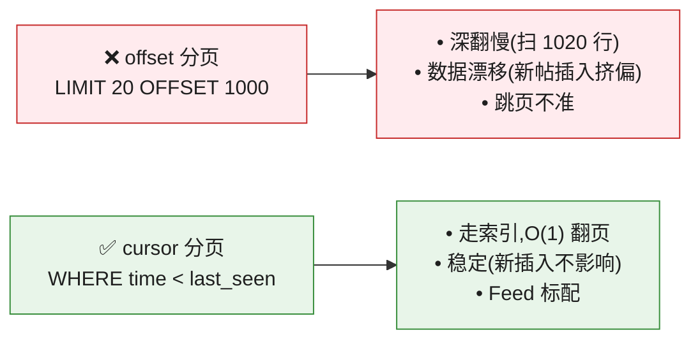

**cursor 实现**:
- 关注流(时序):cursor = `last_post_id` 或 `(created_at, post_id)` 复合。`WHERE created_at < cursor ORDER BY created_at DESC LIMIT 20`。
- 推荐流:cursor = 服务端返回的不透明 token(编码用户已看过的 post_id 集合,避免重复)。

> 🪤 **追问陷阱**:"feed 为什么不能用 offset 翻页?" → "**深翻慢**(OFFSET 1000 要先扫 1000 行)+ **数据漂移**(翻页间新帖插入,导致跳页/重复)。cursor 锚定'上次最后一条',走索引 O(1),且不受新插入影响。Feed 必须用 cursor。"

---

## 8. 缓存分层 + 数据模型

### 缓存分层(背熟)

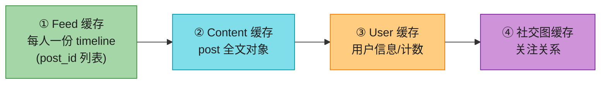

| 缓存层 | 内容 | 存储 | 备注 |
|--------|------|------|------|
| **Feed 缓存** | 每人的 timeline(post_id 列表) | Redis sorted set | push 预计算 / pull 实时 |
| **Content 缓存** | post 全文 | Redis(KV) | feed list 只存 id,这里补全 |
| **User 缓存** | 用户信息、粉丝/关注计数 | Redis | 读多 |
| **社交图缓存** | follow 关系 | Redis set / 图数据库 | fanout 查"谁关注了作者" |

### 数据模型

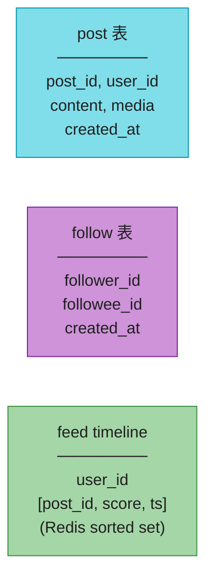

- **post 表**:按 `user_id` 分片(查某用户所有帖,fanout 用)。post_id 用 Ch7 雪花(趋势递增=天然时序)。
- **follow 表**:`(follower_id, followee_id)`。查"作者的所有粉丝"(`WHERE followee_id = X`)是 fanout 的热点,需按 followee_id 建索引。
- **feed timeline**:Redis sorted set,score=时间戳(时序)或互动分/ML 分(排序)。

---

## 9. 完整架构

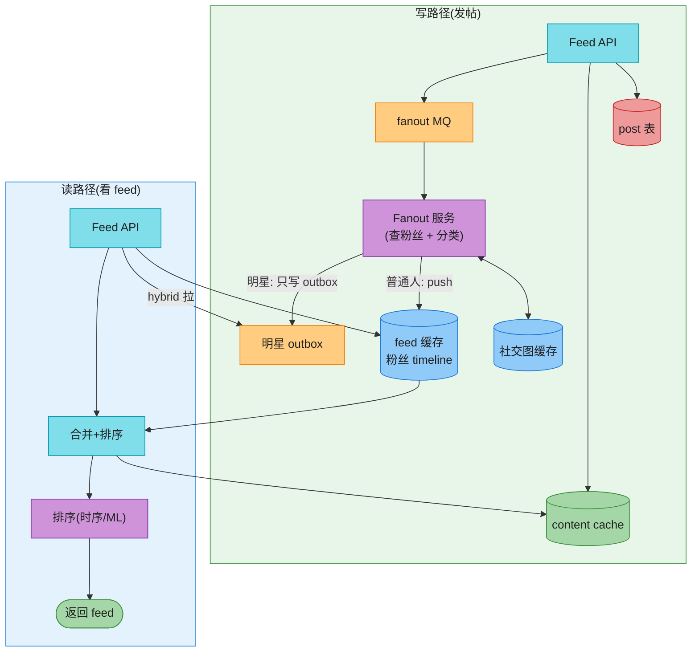

---

## 💻 代码示例

### 发帖 + fanout(push 模型)

```python
import redis, snowflake
r = redis.Redis()

def publish_post(user_id, content):
    post_id = snowflake.next_id()                # Ch7,趋势递增=时序
    db.insert_post(post_id, user_id, content)    # ① 先持久化
    r.set(f"post:{post_id}", content)            # ② content cache
    mq.publish("fanout_topic", {"post_id": post_id, "user_id": user_id,
                                "ts": post_id >> 22})  # ③ 异步 fanout

def fanout_worker():
    for msg in mq.consume("fanout_topic"):
        if is_celebrity(msg["user_id"]):
            r.zadd(f"outbox:{msg['user_id']}", {msg["post_id"]: msg["ts"]})  # 明星只写 outbox
            continue
        for fan in get_followers(msg["user_id"]):        # 查粉丝
            r.zadd(f"feed:{fan}", {msg["post_id"]: msg["ts"]})  # push 到粉丝 timeline
            r.zremrangebyrank(f"feed:{fan}", 0, -1001)   # 只保留最近 1000 条(滑动窗口)
```

### 读 feed(hybrid + cursor)

```python
def get_feed(user_id, cursor=None, limit=20):
    # ① 自己的 push timeline
    ids = r.zrevrange(f"feed:{user_id}", 0, limit*2)
    # ② hybrid: 拉关注的明星 outbox 最近帖
    for star in get_following_celebrities(user_id):
        ids += r.zrevrange(f"outbox:{star}", 0, 50)
    # ③ 合并去重排序,取 cursor 之后的 limit 条
    ids = sorted(set(ids), reverse=True)
    if cursor: ids = [i for i in ids if i < cursor][:limit]
    else:      ids = ids[:limit]
    # ④ 批量补全 post 对象
    posts = r.mget([f"post:{i}" for i in ids])
    return [{"id": i, "content": p} for i, p in zip(ids, posts) if p]
```

> 💡 **关键细节**:`zremrangebyrank` 让 feed timeline **只保留最近 N 条**(滑动窗口),控制 Redis 内存——老帖子不删(post 表还在),只是不缓存在 feed list 里。

---

## ⚠️ 已过时 / 书里没说(2020 → 2026)

| 原书 | 2026 现状 | 面试应对 |
|------|----------|---------|
| 只讲关注流 | **推荐流(For You)**才是主流 | 先反问哪种 feed,再讲推荐流 funnel |
| 排序只提时序/EdgeRank | **ML 精排**主导(召回+精排) | 讲召回→粗排→精排→重排 |
| 没讲向量检索 | **向量召回(ANN/FAISS/HNSW)**是标配 | 提双塔模型 + 向量数据库 |
| 明星问题只一句 | 要讲 **outbox + 活跃粉丝异步分批 push** | 讲 hybrid 完整方案 |
| 没提多 tab | 关注/推荐/热门**三 tab 并存** | 主动提多 feed |
| 没提实时推送 | WebSocket/SSE **实时 feed 更新**(接 Ch12) | 提 live update |
| 分页用 offset 隐含 | **必须 cursor** | 讲 cursor vs offset |

---

## 🪤 追问陷阱

1. **"push 还是 pull?"** → hybrid:普通人 push(读快),明星 pull(避免写放大)。门槛=关注数阈值。
2. **"明星发帖怎么处理?"** → 不全 push;只写 outbox,粉丝读时拉;活跃粉丝可异步分批 push 削峰。
3. **"feed 为什么只存 post_id 不存全文?"** → 节省 Redis 内存 100 倍;全文走 content cache 批量补全。
4. **"粉丝数 1 亿的 fanout 怎么扛?"** → 明星走 pull(outbox);普通人 push;MQ 削峰 + 异步分批。
5. **"feed 翻页用 offset 行吗?"** → 不行,深翻慢 + 数据漂移;用 cursor(`WHERE time < last_seen`)。
6. **"推荐流和关注流架构区别?"** → 关注流靠社交图 push/pull;推荐流靠 ML **召回+精排漏斗**,不需关注。
7. **"推荐流为什么不直接精排?"** → 千万级直接精排算不完;召回(向量检索)砍到几千,粗排砍到几百,只让几百进精排——漏斗换计算量。
8. **"删帖/改帖,已 push 的 feed 怎么办?"** → feed list 是 post_id 引用,删帖时**异步清理**所有引用(或读时校验 post 是否存在,失效则跳过)。
9. **"feed 怎么保证不重复?"** → 时序用 (created_at, post_id) 唯一;推荐流用 cursor token 编码"已看过"集合,重排去重。
10. **"热点事件突发流量怎么扛?"** → MQ 削峰 + fanout worker 弹性扩 + 缓存预热;限流(Ch4)保下游。

---

## 🏭 生产级产品速查表

| 产品 | feed 类型 | 特点 |
|------|----------|------|
| **Twitter/X** | 关注 + 推荐 hybrid | outbox 模式扛明星,推荐流 ML 排序 |
| **Facebook** | 关注 + 推荐 | EdgeRank → ML 排序演进 |
| **Instagram** | 关注 + 推荐 | 双 tab |
| **微博** | 关注 + 热门 + 推荐 | 热搜 + 三流 |
| **抖音/TikTok** | **纯推荐** | 召回+精排漏斗,无关注流 |
| **小红书** | 关注 + 推荐 | 图文+视频混合 feed |
| **朋友圈** | 关注(强关系) | 时序,push 模型 |

---

## 📝 本章要点总结

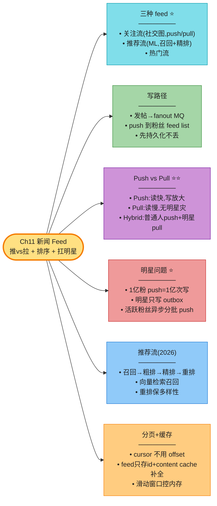

**核心 Takeaways**:

1. **先问哪种 feed**:关注(社交图 push/pull)/ 推荐(ML 召回+精排)/ 热门。问错全盘错。
2. **核心抉择 push vs pull vs hybrid**:普通人 push(读快),明星 pull(避免写放大),hybrid 是主流。
3. **明星问题**:1 亿粉 push 是灾难 → outbox 模式 + 活跃粉丝异步分批 push。
4. **推荐流是 2026 核心**(原书没讲):召回→粗排→精排→重排漏斗,向量检索召回,重排保多样性。
5. **feed 只存 post_id + content cache 补全**——节省 Redis 100 倍;滑动窗口控内存。
6. **cursor 分页**(不是 offset):O(1) 翻页 + 无数据漂移。
7. **写路径先持久化**(post 表)再 fanout,不丢;读路径合并去重排序补全。

> 🔗 **连接下一章**:Ch11 feed 是"**一对多推送 + 异步聚合**";**Ch12 聊天系统**是"**低延迟双向通信**"——WebSocket、消息状态、多端同步,从"读 feed"切换到"实时收发"。
