# Chapter 12: 设计聊天系统 (Design a Chat System)

> **本章定位**:聊天系统是**"状态长连接 + 低延迟 + 顺序敏感 + 多端一致"**的题——它是微信/WhatsApp/Slack/Discord 的核心,也是分布式系统里**最考验实时通信功底**的题。它把 Ch1 的无状态/有状态、Ch6 的 KV 存储、Ch7 的唯一 ID、Ch10 的推送通知全串起来。灵魂是四件事:**① 怎么做实时双向通信(协议选型:轮询/长轮询/WebSocket/MQTT/QUIC)② 消息怎么收发不丢不乱(message ID + sync queue)③ 在线状态怎么维护又准又不抖(心跳 + fanout)④ 多端/群聊怎么同步(每端 cur_max + 每人 inbox)**。

> **本章和原书的区别**:原书讲得清楚且结构完整,是面试标准答案的骨架——**轮询→长轮询→WebSocket 的演进讲得很透彻**。但**完全没提 MQTT**(Facebook Messenger 实际用 MQTT 做推送,这是业界最大反例)、**没提 QUIC/HTTP3**(2026 移动端弱网首选)、**没讲消息状态机**(sent/delivered/read 双勾蓝勾——这是 WhatsApp/微信的核心 UX)、**没讲交付语义**(at-least-once + 幂等)、**群聊只覆盖小群**(Discord 百万成员大群完全没讲)、**没讲 E2E 加密**(Signal Protocol)、**连接数估算停留在 "10K/连接单机 10GB"**(2026 已经 C10M)。本章把这些全补上。

---

## 🎯 面试怎么答(被问到"设计一个聊天系统 / 设计一个 IM"时)

**开场话术**(直接背):

> "聊天系统我先确认四件事:① 是哪种 IM(单聊 WhatsApp / 群聊 Slack / 大群游戏 Discord)?② 多大 DAU?③ 要不要多端同步、在线状态、已读回执?④ 要不要端到端加密?然后按 **协议选型(WebSocket 为主)→ 高层架构(无状态 + 有状态 chat server + service discovery)→ 消息流(收发 + 多端 + 群聊)→ 在线状态(心跳 + fanout)** 四块讲。核心抉择是 **实时通信协议** 和 **消息交付可靠性 + 顺序**。"

**4 步推进**:

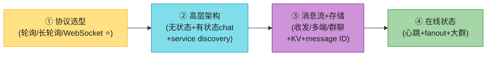

> 💡 **Step 1 必问**:**是哪种 IM?** 单聊(WhatsApp/微信)、办公群聊(Slack)、还是大群游戏语音(Discord)?三者架构差异巨大——单聊重"低延迟送达",群聊重"扇出效率",Discord 还要扛百万成员大群 + 实时语音。**问错了全盘皆错**。
>
> 💡 **关键信号词**:**主动说出"客户端之间不直接通信,都连 chat service"** + **"chat server 是有状态服务,要做 service discovery 调度"**——这两句直接证明你懂 IM 架构。

---

## 🗺️ 章节概览

| 小节 | 要点 | 重要性 |
|------|------|--------|
| 需求 + 估算 | 单聊+小群、50M DAU、多端、在线状态、推送 | ⭐⭐ |
| **协议选型** | 轮询/长轮询/WebSocket **本章灵魂** | ⭐⭐⭐⭐⭐ |
| **现代协议(2026)** | MQTT / QUIC / SSE / gRPC | ⭐⭐⭐⭐ |
| **高层架构** | 无状态 + 有状态 chat + service discovery + 三方推送 | ⭐⭐⭐⭐⭐ |
| **存储** | 通用数据→关系库;**聊天记录→KV**(HBase/Cassandra) | ⭐⭐⭐⭐⭐ |
| 数据模型 + message ID | 单聊/群聊表 + Snowflake/本地序列号 | ⭐⭐⭐⭐ |
| **消息流** | 单聊 / 多端 sync / 群聊(inbox) | ⭐⭐⭐⭐⭐ |
| **在线状态** | 心跳防抖 + pub-sub fanout + 大群优化 | ⭐⭐⭐⭐⭐ |
| **消息状态机(补)** | sent/delivered/read 双勾蓝勾 | ⭐⭐⭐⭐ |
| **交付语义(补)** | at-least-once + 幂等 + 顺序 | ⭐⭐⭐⭐ |
| **大群扇出(补)** | write-fanout vs read-fanout(Discord) | ⭐⭐⭐⭐ |
| **E2E 加密(补)** | Signal Protocol(X3DH + Double Ratchet) | ⭐⭐⭐ |
| 连接管理 | C10M、Erlang/Go/io_uring | ⭐⭐⭐ |

---

## 1. 需求 + 估算

**澄清问题**(原书对话,Step 1 直接问出来):

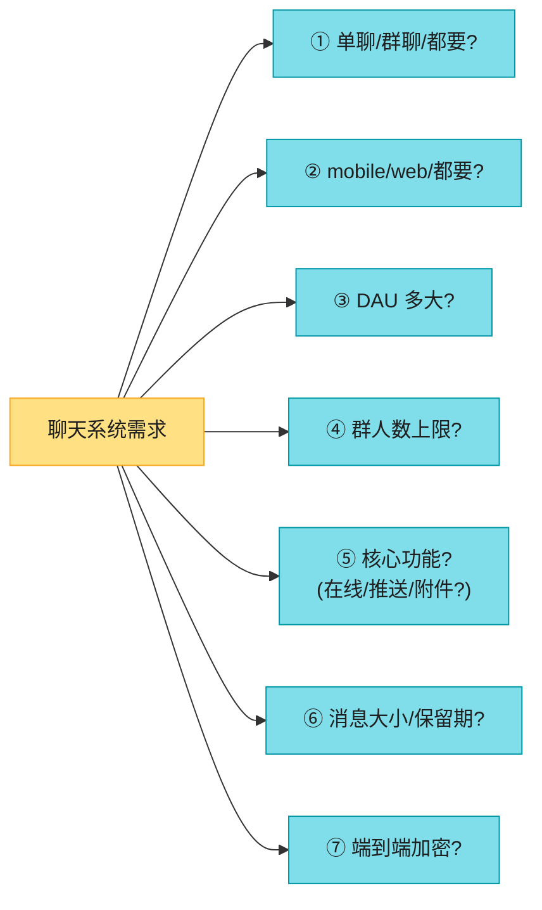

**原书确定的需求**(Facebook Messenger 风格):

| 维度 | 确认值 |
|------|--------|
| 形态 | 单聊 + 小群(≤100 人) |
| 端 | mobile + web 都要 |
| 规模 | **5000 万 DAU** |
| 功能 | 单聊低延迟、小群、在线状态、**多端同时登录**、推送通知 |
| 消息 | 纯文本,<100,000 字符 |
| 加密 | 暂不做 E2E(时间够再聊) |
| 历史 | **永久保留** |

**估算**(5000 万 DAU):

```
并发连接: 50M DAU,假设峰值 20% 同时在线 → 1000 万并发长连接(WebSocket)
发消息: 假设活跃用户日均发 40 条 → 50M × 0.5 活跃 × 40 = 10 亿条/天
        → ~1.2 万 msg/s 均值,峰值 ~6 万 msg/s
读:写 ≈ 1:1(单聊),群聊会放大(1 写 → N 读)

存储: 单条消息 ~100 字节(含元数据),10 亿/天 × 100B = 100 GB/天 → ~36 TB/年
      聊天历史永久保留 → 累积 PB 级(这就是为什么用 KV + 冷热分层)

并发连接内存: 1000 万 × 10KB/连接 ≈ 100 GB(需多台 chat server,单机扛不住)
```

> 💡 **关键数字**(背):WhatsApp + Messenger 日处理 **600 亿条消息/天**(原书引用);1000 万并发连接是 chat server 集群的规模——**这是连接数,不是 QPS**,IM 的瓶颈是"长连接数"而非"请求速率"。原书的"1M 并发单机 10GB"是为了说明连接便宜,但**真实生产不会单机扛,因为有状态服务的 failover 代价高**。

---

## 2. 协议选型 ⭐⭐⭐⭐⭐(本章灵魂)

聊天系统的第一个、也是最重要的技术抉择:**客户端和服务器怎么实时通信?**

> 📝 **核心认知**:聊天是**双向、实时、异步**的——发送方主动发(HTTP 能做),但接收方是**服务器主动推**(HTTP 做不了,因为 HTTP 是"客户端发起")。**所有协议选型的本质,都是在解决"服务器怎么把消息推到客户端"**。

客户端**不直接**和客户端通信,而是都连到 chat service:

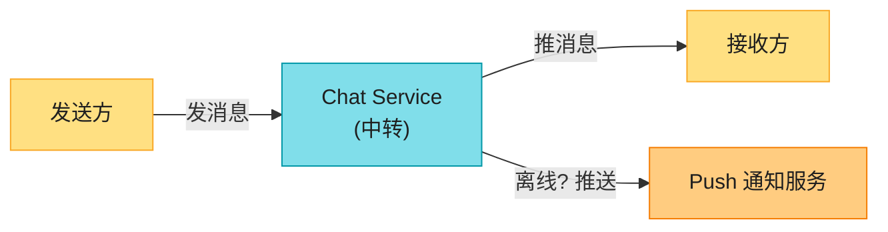

Chat service 的三大职责:① 接收客户端消息;② 找到接收者并转发;③ 接收者离线时暂存消息(等上线再推)。

### 2.1 三种传统方案:轮询 → 长轮询 → WebSocket

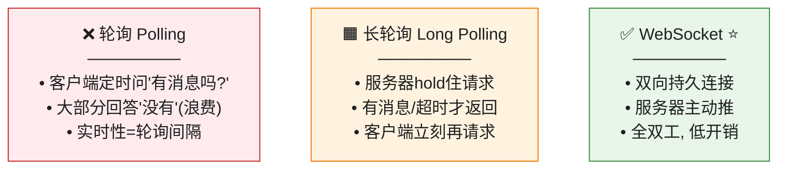

**① 轮询 (Polling)** —— 最朴素,客户端**周期性**问服务器"有新消息吗":

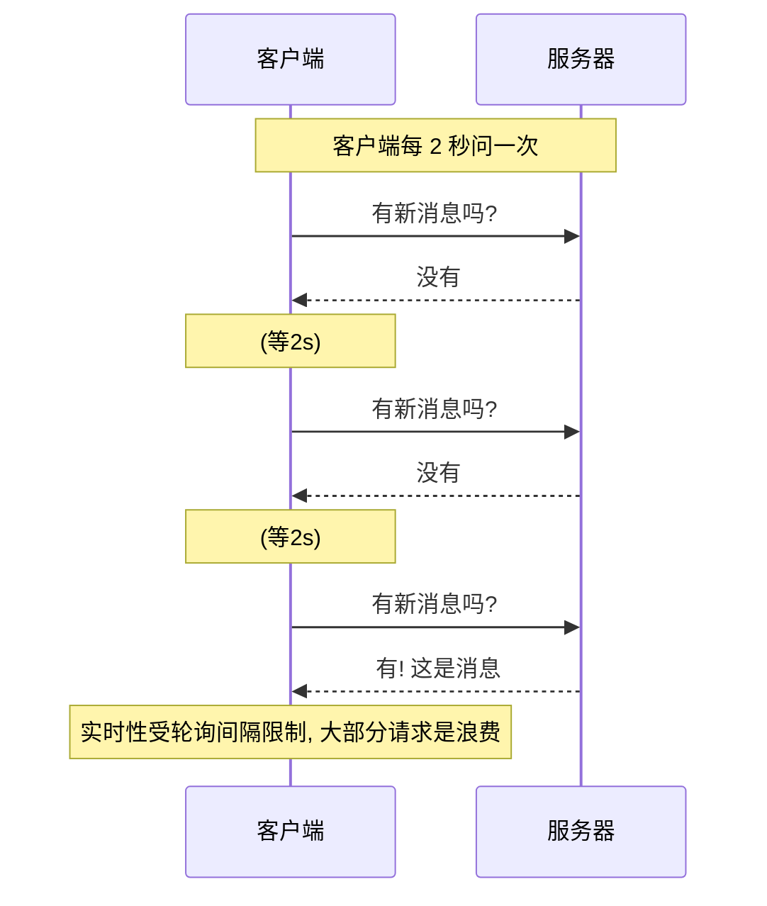

**问题**:服务器要应付海量"没有"的回答——**宝贵的资源浪费在空查询上**。轮询频率高 = 实时性好但服务器扛不住;频率低 = 实时性差。

**② 长轮询 (Long Polling)** —— 进化版,服务器**hold 住请求**直到有消息或超时:

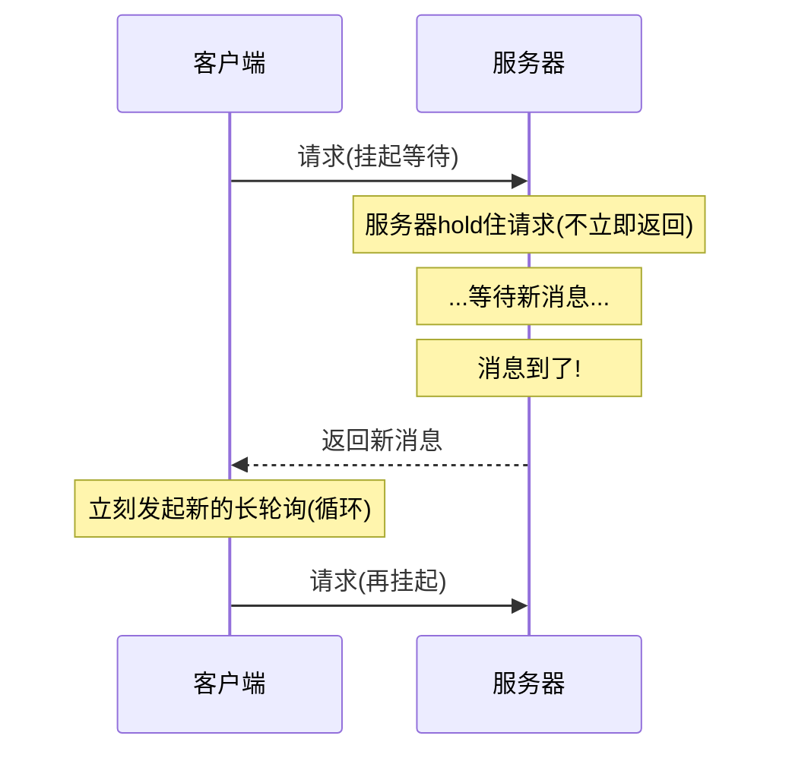

**长轮询的 3 个缺陷**(原书列出):

| 缺陷 | 说明 |
|------|------|
| **收发可能不在同一台 chat server** | HTTP 无状态 + LB 轮询 → 接收消息的服务器,可能没有接收方的长轮询连接 |
| **服务器难以察觉客户端断线** | 连接断了服务器不知道,白白 hold 住资源 |
| **低活跃用户仍低效** | 不怎么聊天的用户,超时后还是会周期性重连 |

> 🪤 **追问陷阱**:"长轮询为什么收发可能不在同一台服务器?" → "HTTP 是无状态的,LB 用轮询分发。发送方连到 chat server 1,接收方的长轮询连接可能在 chat server 2——server 1 收到消息后**不知道该转给谁**。所以**真正的 IM 几乎都用 WebSocket**(持久连接 + 有状态路由),长轮询只是历史过渡方案。"

**③ WebSocket ⭐** —— 终极方案,**双向、持久**:

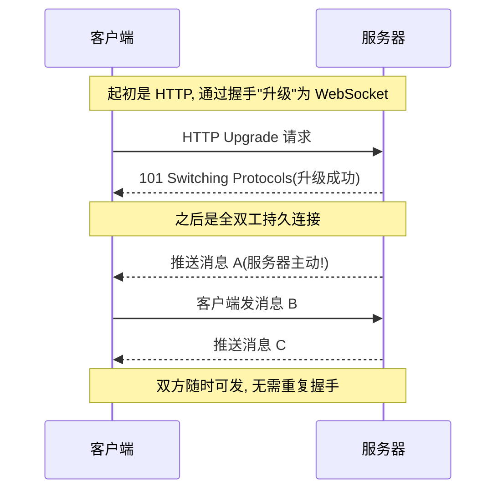

**WebSocket 的优势**(背熟):

| 优势 | 说明 |
|------|------|
| **客户端发起** | 由 HTTP Upgrade 握手升级而来,符合现有网络设施 |
| **双向全双工** | 服务器和客户端都能随时主动发 |
| **持久连接** | 一次握手长期复用,无重复 TCP 握手开销 |
| **穿防火墙** | 用 80/443 端口(和 HTTP/HTTPS 同),几乎不会被墙 |

> 💡 **原书关键结论**:**发送方用 HTTP 也行,但既然 WebSocket 是双向的,干脆收发都用 WebSocket**——简化设计,客户端/服务端实现都更直接。**这是面试标准答案**。
>
> 💡 **但要注意**:WebSocket 是**实时消息通道**,不是所有功能都用它——登录、注册、改资料这些传统请求/响应操作**还是走 HTTP**(REST API)。**不要为了"统一"把所有东西塞进 WebSocket**。

> 📝 **名词注释**
> - **Keep-alive**:HTTP 头,允许客户端和服务器**维持持久连接**,减少 TCP 握手次数。发送方用 HTTP + keep-alive 是早期方案(Facebook 起家用 HTTP 发消息)。
> - **全双工 (Full-duplex)**:双向**同时**收发(像打电话);半双工是轮流(像对讲机)。HTTP 是半双工,WebSocket 全双工。

### 2.2 现代协议(2026,原书完全没讲)⭐⭐⭐⭐

原书把 WebSocket 当唯一答案,但**真实世界的 IM 用了更多协议**。这是本章最大的增量。

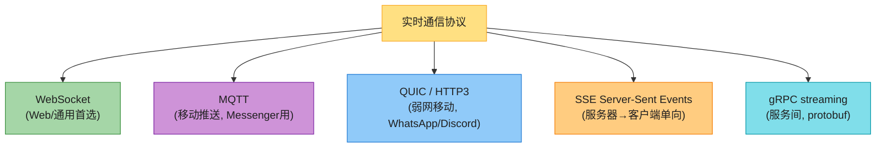

| 协议 | 特点 | 谁在用 | 适用 |
|------|------|--------|------|
| **WebSocket** | 全双工持久,Web 标准 | Slack、Discord、大多数 web IM | **通用首选**(原书答案) |
| **MQTT** | 发布订阅模型,**极省电省流量**,为物联网设计 | **Facebook Messenger**(推送)、IoT | 移动端弱网、省电场景 |
| **QUIC / HTTP3** | 基于 UDP,**0-RTT 握手**、抗丢包、连接迁移 | WhatsApp、Discord、Google | **移动弱网**(切 WiFi/4G 不断连) |
| **SSE** | 服务器→客户端单向流,基于 HTTP | 股票行情、AI 流式输出 | 只需服务器推、不需要客户端推 |
| **gRPC streaming** | protobuf 二进制、双向流 | 服务间通信 | 后端微服务间(非客户端) |

> 🔄 **2026 现代版话术**(原书只讲 WebSocket):
> "实时通信我会按场景选:**Web 端默认 WebSocket**(标准、穿墙);**移动端弱网考虑 MQTT 或 QUIC**——Facebook Messenger 历史上用 MQTT 做消息推送(极省电),WhatsApp/Discord 转向 QUIC 因为它**0-RTT 握手 + 连接迁移**(用户从 WiFi 切 4G 不掉线,这是 WebSocket 做不到的)。所以**面试说'用 WebSocket'是及格分,主动说出 MQTT/QUIC 的取舍才是 senior**。"

> 🪤 **追问陷阱**:"为什么 QUIC 比 WebSocket 更适合移动弱网?" → "WebSocket 基于 TCP——TCP 有**队头阻塞**(一个包丢了,后面的全卡住)+ **连接绑定四元组**(IP 变了连接就断,切网络就掉线)。QUIC 基于 UDP:**① 多流无队头阻塞**(一个流丢包不影响其他流);**② 0-RTT 握手**(重连几乎零延迟);**③ 连接迁移**(用 connection ID 而非 IP,切 WiFi/4G 不断连)。这正是移动 IM 的痛点。"

> 🪤 **追问陷阱**:"为什么 Messenger 用 MQTT?" → "MQTT 是为物联网设计的发布订阅协议,**协议头极小(2 字节)、支持遗嘱消息、QoS 分级、省电省流量**。移动 App 后台被系统杀、网络抖动时,MQTT 的轻量和 QoS1(至少一次)能保证消息送达。**不过 2026 Messenger 已逐步迁移到自研协议 + QUIC**——MQTT 也只是过渡。"

---

## 3. 高层架构 ⭐⭐⭐⭐⭐

确定 WebSocket 后,系统拆成**三大类服务**:

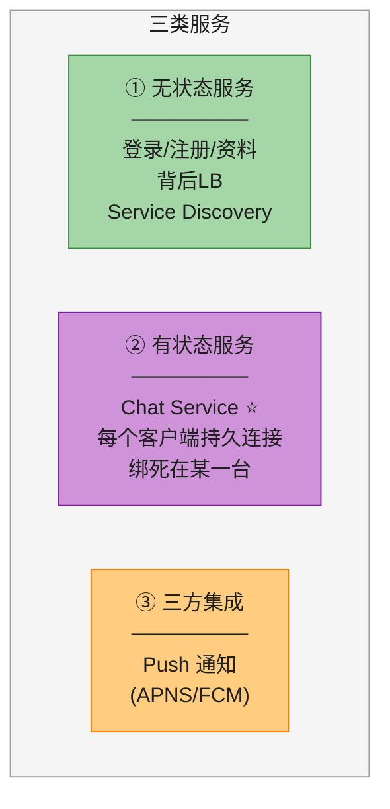

| 服务类别 | 有无状态 | 代表 | 关键点 |
|---------|---------|------|--------|
| **无状态服务** | 无 | 登录/注册/资料 API | 传统请求响应,挂 LB,**可任意扩缩** |
| **有状态服务** | **有** | **Chat Service** ⭐ | 每个客户端的**持久连接**绑在某一台,**不能随便切**(切了连接断) |
| **三方集成** | — | Push 通知 | App 没开时通过 APNS/FCM 推(接 Ch10) |

> 📝 **为什么 chat service 是有状态的?** —— 因为 WebSocket 是**持久连接**,客户端连上 chat server 1 后,这条连接就"住在"server 1 上。server 1 内存里持有"用户 A 的连接对象"。**只要 server 1 不挂,客户端就不该换服务器**(换了要重建连接)。这正是 chat service **不能像无状态 web 那样随便扩缩**的原因——**有状态 = 扩缩容要迁移连接 = 复杂**。

### 3.1 Service Discovery(服务发现)⭐

有状态服务的核心难题:**客户端怎么知道该连哪台 chat server?** —— 这就是 service discovery。

> 📝 **Service Discovery**:给客户端推荐**最佳 chat server** 的服务,依据**地理位置、服务器容量、负载**。原书用 **ZooKeeper**(也用 etcd / Consul / 自研)。

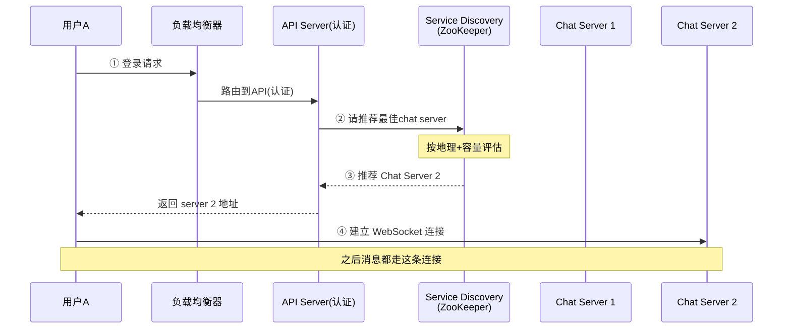

**完整流程**(4 步):① 用户登录 → LB 转到 API 认证 → ② service discovery 挑最佳 chat server(本例 server 2)→ ③ 地址返回客户端 → ④ 客户端 WebSocket 连上 server 2。

> 🪤 **追问陷阱**:"为什么不让客户端直接 LB 轮询到 chat server?" → "**轮询会破坏有状态**——接收方的连接可能在 chat server 2,但发送方的消息被轮询到 server 1,server 1 不知道接收方在哪。所以**先经 service discovery 固定到一台**,且服务端维护一张 **user→chat server 的路由表**,才能跨服务器转发消息。"——这就是原书"长轮询收发可能不在同一台"问题的根治方案。

> 🔄 **2026 现代版话术**(原书用 ZooKeeper):
> "ZooKeeper 偏重,2026 更常用 **etcd**(K8s 内置)、**Consul**,或大厂**自研服务发现**(微信/WhatsApp 都是自研——它们要兼顾地理位置路由、容量调度、灰度发布)。**consul/etcd + 一层调度策略(地理就近 + 一致性哈希分连接)**是主流。"

### 3.2 完整高层架构图

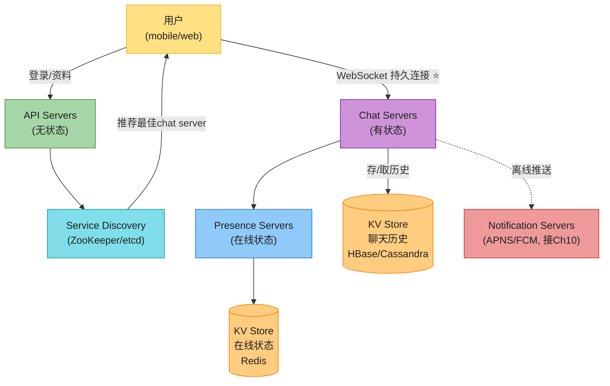

**五大组件**(背熟):
- **Chat Servers**:收发消息的实时核心(WebSocket、有状态)。
- **Presence Servers**:管理在线/离线状态(WebSocket)。
- **API Servers**:登录、注册、改资料等(无状态 HTTP)。
- **Notification Servers**:离线推送(APNS/FCM,接 Ch10)。
- **KV Store**:存聊天历史(离线用户上线后看历史)。

### 3.3 为什么不能单机?(原书的"红旗"提醒)

> 📝 **原书的提醒**:理论上 100 万并发连接、每连接 10KB 内存 → 单机 10GB 内存"塞得下"。但**单机设计是面试红旗**——SPOF(单点故障)是最大问题。**可以从单机起步,但要明确告诉面试官"这只是起点"**。

> 🔄 **2026 现代版怎么讲**(原书的连接估算已过时):
> "原书说'100 万连接单机 10GB'——2026 这个数字被彻底刷新了。**WhatsApp 用 Erlang/BEAM 单机扛 200 万+ 连接**;**Go 的 goroutine 让单机 1000 万连接(C10M)成为可能**(goroutine 几 KB,vs Java 线程 MB 级);**io_uring**(Linux 5.1+)用共享环形缓冲区把 syscall 开销降到接近零。所以**瓶颈不在内存,而在 chat server 挂了之后的 failover**——百万连接瞬间迁移是灾难。这就是为什么即使单机能扛,也要分布式 + service discovery。"——详见 8.2 连接管理。

---

## 4. 存储 ⭐⭐⭐⭐⭐(为什么聊天记录用 KV)

聊天的两类数据,**存储完全不同**:

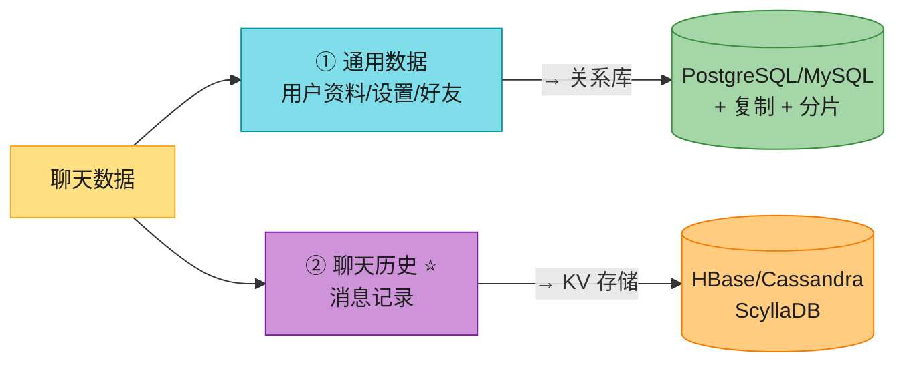

| 数据 | 特点 | 存储 |
|------|------|------|
| **通用数据** | 强结构化、关系、要事务 | **关系库**(复制 + 分片) |
| **聊天历史** ⭐ | 海量、只读近期、随机访问少、读写 1:1 | **KV 存储**(HBase/Cassandra) |

### 4.1 聊天历史的读写模式(为什么用 KV)

原书给出聊天历史的 4 个特征,**这是面试要复述的关键**:

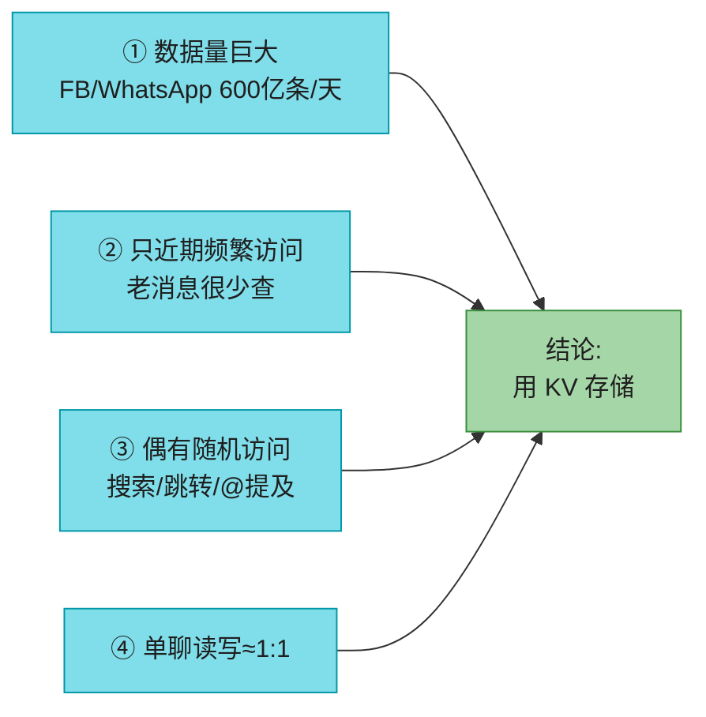

**为什么选 KV 而非关系库**(原书 4 理由):

| 理由 | 说明 |
|------|------|
| **易水平扩展** | KV 天生为分片设计 |
| **超低延迟** | KV 访问极快(满足实时读) |
| **关系库怕长尾** | 索引变大后随机访问昂贵(接长尾效应) |
| **业界验证** | FB Messenger 用 **HBase**、Discord 用 **Cassandra** |

> 📝 **名词注释**
> - **长尾效应 (Long Tail)**:大部分访问集中在近期(头部),但仍有少量访问到很久以前的消息(长尾)。关系库的索引随数据膨胀,访问长尾(很老的消息)的随机 IO 越来越贵;KV(列存 + 按时间排序)对"近期热 + 长尾冷"的访问模式更友好。
> - **HBase**:Google BigTable 的开源实现,列族存储,适合海量稀疏数据。
> - **Cassandra**:Dynamo + BigTable 混血,去中心化无主,写入吞吐高。

> 🔄 **2026 现代版话术**(原书说 Discord 用 Cassandra,已过时):
> "原书说 Discord 用 Cassandra——**但 2022 年 Discord 因为 Cassandra 的延迟尖刺(latency p99 飙升)+ 运维噩梦,把整个消息存储迁到了 ScyllaDB**(C++ 重写的 Cassandra,延迟稳定 10 倍提升)。这是**IM 存储选型的经典演进**:Cassandra 写吞吐强但读延迟不稳,ScyllaDB 兼容 Cassandra 协议但性能更好。**面试提一句'Discord 迁 ScyllaDB'能证明你关注工程前沿**。"

### 4.2 数据模型

**单聊消息表**(Fig 12-9):

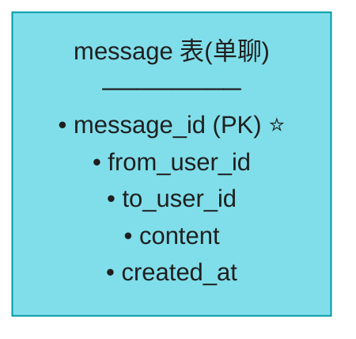

**群聊消息表**(Fig 12-10):

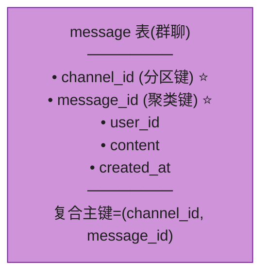

> 💡 **关键设计**:① **主键是 message_id,不能用 created_at 定序**——两条消息可能同一秒创建,created_at 无法区分先后;message_id 单调递增才能定序。② **群聊用复合主键 (channel_id, message_id)**,channel_id 作分区键(同一群的消息落同一分区,群内查询高效),message_id 作聚类键(群内排序)。

### 4.3 Message ID 怎么生成?(接 Ch7)

> 📝 message_id 承担**保证消息顺序**的重任,必须满足:**① 全局唯一;② 按时间可排序**(新消息 ID > 老消息)。

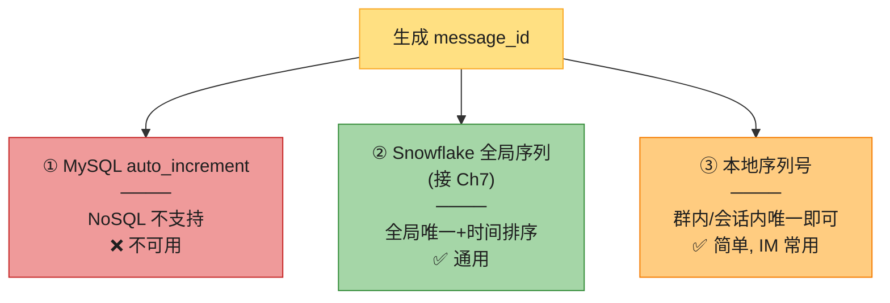

| 方案 | 做法 | 优劣 |
|------|------|------|
| **MySQL auto_increment** | 自增主键 | NoSQL 不支持,**不可用** |
| **Snowflake**(Ch7) | 全局 64bit,时间戳+机器+序列 | 全局唯一+可排序,**通用首选** |
| **本地序列号** | 只在**群/会话内**唯一 | **更简单**(IM 只需会话内有序),**微信/常用** |

> 💡 **关键洞察**:**消息顺序只需"会话内有序",不需要全局有序**——A 和 B 的对话不需要和 C、D 的对话比先后。所以**本地序列号(会话内自增)最简单实用**,这也是 IM 的常用方案。但跨设备同步、搜索全局去重时仍需全局 ID(Snowflake)。**两者常结合用**。

> 🪤 **追问陷阱**:"群聊里两人同时发消息,谁先?" → "**会话内用本地序列号**——chat server 收到后**串行化**写入该 channel 的 sync queue,先到的先拿小 ID。即'谁先到服务器谁在前',这是**服务器视角的顺序**,和客户端发送时刻可能不同(网络延迟)。客户端要接受这个'提交顺序'。"

---

## 5. 消息流 ⭐⭐⭐⭐⭐(收发 / 多端 / 群聊)

这是本章第二个核心:**消息端到端怎么走?** 三种场景:单聊、多端同步、群聊。

### 5.1 单聊消息流(Fig 12-12)

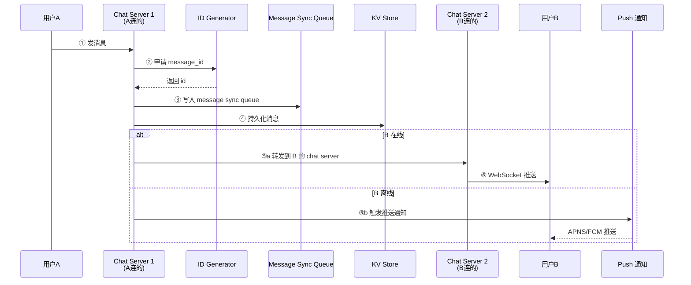

**6 步流程**(背熟):① A 发消息到 chat server 1 → ② 申请 message_id → ③ 写 sync queue(供多端/群聊同步)→ ④ 持久化 KV → ⑤ B 在线则转发到 B 的 chat server 推送,**离线则发推送通知** → ⑥ B 通过 WebSocket 收到。

> 💡 **关键设计**:**消息先持久化(KV)再推送**——即使 B 的 chat server 在推送时挂了,B 上线后也能从 KV sync 到历史。**持久化是消息不丢的根基**。

### 5.2 多端同步(Fig 12-13)⭐

一个用户**手机 + 笔记本**同时登录,怎么让两端都收到消息?

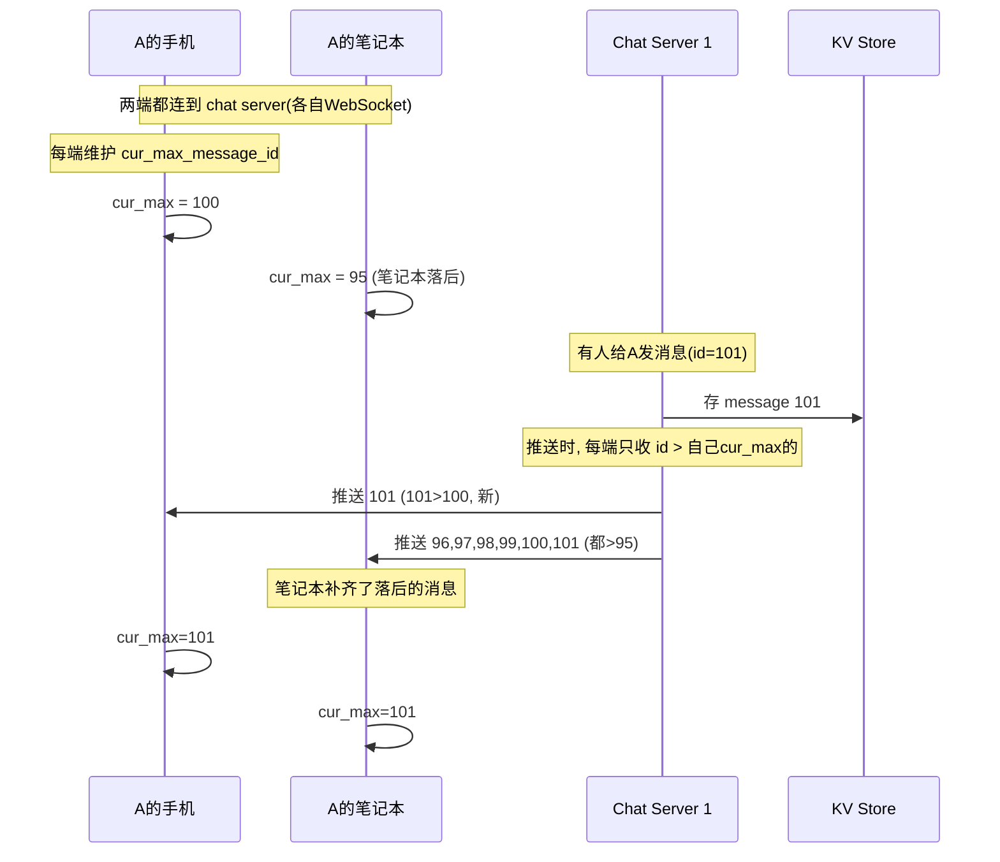

> 📝 **cur_max_message_id**:每个设备维护的"本设备见过的最大消息 ID"。新消息 = **接收者 == 当前登录用户** AND **消息 ID > 该设备的 cur_max**。**每端独立追踪**,天然解决多端同步。

**为什么这么简单就解决多端?** —— 因为消息都**先存进 KV**,每端只管"我要 KV 里 id > 我本地最大值的消息"。**离线设备上线后,从 KV 拉取 cur_max 之后的所有消息即可**——统一的同步机制。

> 🪤 **追问陷阱**:"多端同时发消息,ID 冲突吗?" → "message_id 由 **chat server 端统一生成**(Snowflake / 本地序列),客户端只提交内容不带 ID。所以**多端不会冲突**——ID 是服务端发的,天然唯一。"

### 5.3 群聊消息流(Fig 12-14/12-15)⭐

群聊的核心设计:**每个成员一个 inbox(message sync queue)**,消息**写到每个成员的 inbox**。

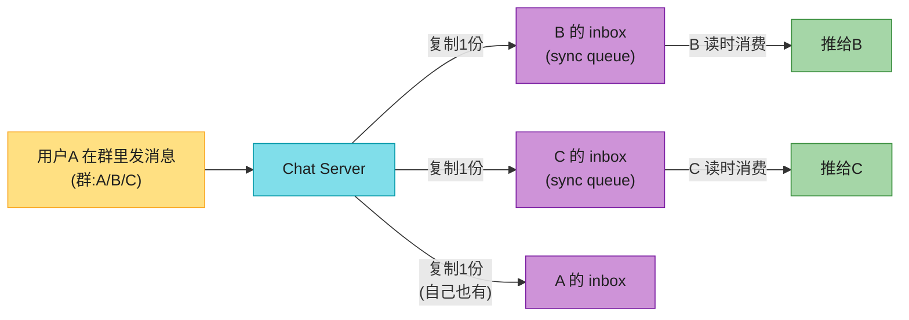

**为什么给每个成员复制一份?**(原书两点):
1. **简化同步**——每个客户端只需查自己的 inbox 就能拿到所有新消息(不用遍历群内所有人)。
2. **小群开销可接受**——成员少时,每人存一份副本不算贵。**微信用类似方案,群上限 500 人**。

> 📝 **inbox 模型**:每个接收者有一个 **message sync queue**,里面是**来自不同发送者**的消息。接收方只需"扫自己的 inbox"。这正是 **5.2 多端同步**的基础——**群聊本质是"一个用户从多个发送者收消息"的特例**。

---

#### 深入:小群 vs 大群的扇出策略(write-fanout vs read-fanout)⭐⭐⭐(原书只讲小群)

原书的"每人一份 inbox"方案对**小群(≤500)**有效,但 **Discord 的服务器有上百万成员**——给百万人各复制一份消息是灾难。这里讲透扇出策略的取舍,这是大厂 IM 面试的区分题。

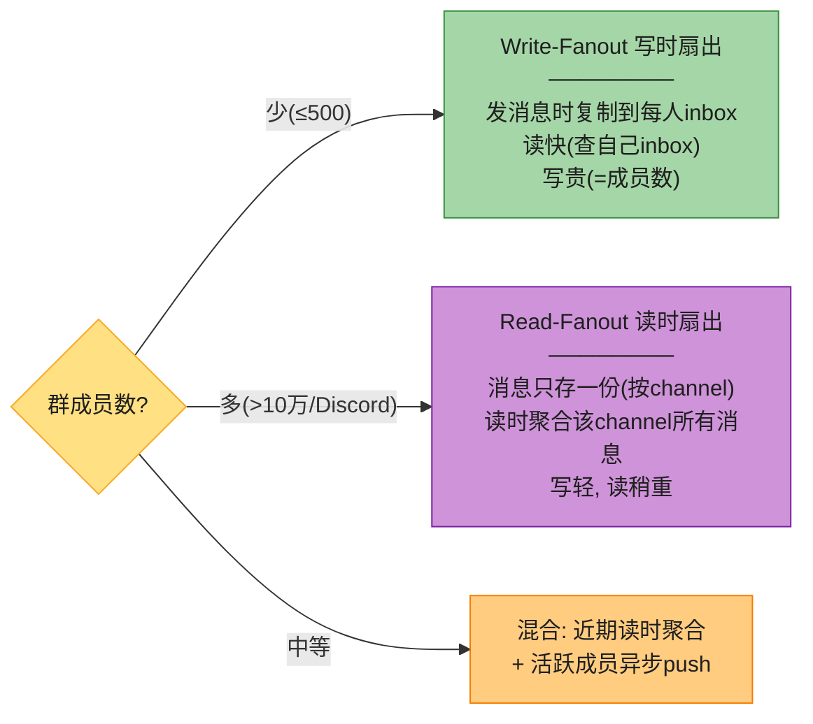

| 策略 | 怎么做 | 优点 | 缺点 | 适用 |
|------|--------|------|------|------|
| **Write-Fanout(写时扇出)** | 发消息时复制到**每个成员 inbox** | **读极快**(查自己 inbox 即可) | 写放大 = 成员数;存储膨胀 | 小群(微信 500)、单聊 |
| **Read-Fanout(读时扇出)** | 消息只存一份(按 channel),读时**聚合**该 channel 消息 | 写轻、存储省 | 读要聚合(稍慢) | 大群(Discord 百万成员) |
| **混合** | 活跃成员 push + 非活跃成员 pull | 平衡 | 复杂 | 中等规模 |

> 💡 **决策逻辑**(背):**粉丝/成员少 → write-fanout(读侧 O(1));成员巨多 → read-fanout(写侧 O(1))**。这和 **Ch11 Feed 的 push vs pull 是同一个思想**——本质都是"扇出放写时还是读时"。**Discord 大群走 read-fanout + 只对最近活跃成员做增量 push 通知**。

> 🪤 **追问陷阱**:"Discord 百万成员的大群,有人发消息怎么通知所有人?" → "**不可能全 push**(百万写)。Discord 的做法:① 消息只存一份(read-fanout);② 只对**最近活跃/在线**的成员做实时推送(在线状态见 6);③ 离线成员上线时,从 channel 拉取 cur_max 之后的消息(接 5.2 cur_max 同步);④ 配合**频道订阅模型**——只有订阅了该 channel 的人才收推送。"

> 🪤 **追问陷阱**:"群消息的'已读'怎么算?" → "**全局已读回执在大群不现实**(百万成员各报已读 = 百万写)。大群的已读通常是**个人维度**(每个成员自己看到哪了,cur_read_message_id),不广播给全群。**小群可广播单条已读**(WhatsApp 群聊蓝勾)。"

---

## 6. 在线状态 ⭐⭐⭐⭐⭐(心跳 + fanout + 大群)

在线状态(头像旁的绿点)看似简单,实则**全是坑**:网络抖动会乱跳、大群 fanout 会爆。这是 IM 面试的高频深水区。

Presence servers 通过 WebSocket 管理在线状态。触发状态变化的 4 种 flow:

```mermaid
flowchart LR
    P["在线状态变化"] --> F1["① 登录"]
    P --> F2["② 登出"]
    P --> F3["③ 断线(心跳防抖) ⭐"]
    P --> F4["④ 状态 fanout 给好友"]

    style P fill:#FFE082,stroke:#F9A825,color:#1f1f1f
    style F1 fill:#80DEEA,stroke:#0097A7,color:#1f1f1f
    style F2 fill:#80DEEA,stroke:#0097A7,color:#1f1f1f
    style F3 fill:#CE93D8,stroke:#7B1FA2,color:#1f1f1f
    style F4 fill:#FFCC80,stroke:#F57C00,color:#1f1f1f
```

### 6.1 登录 / 登出(简单)

```mermaid
flowchart LR
    L["登录"] --> S1["WebSocket 建立后<br/>online=true + last_active_at<br/>存 KV → 绿点亮"]
    LO["登出"] --> S2["online=false 存 KV<br/>→ 绿点灭"]

    style L fill:#80DEEA,stroke:#0097A7,color:#1f1f1f
    style LO fill:#80DEEA,stroke:#0097A7,color:#1f1f1f
    style S1 fill:#A5D6A7,stroke:#388E3C,color:#1f1f1f
    style S2 fill:#EF9A9A,stroke:#C62828,color:#1f1f1f
```

### 6.2 断线:心跳机制 ⭐(原书重点)

**朴素方案的缺陷**:断线就标离线、重连就标在线。**问题**:用户过隧道、地铁里网络忽断忽连,**绿点疯狂闪烁**,体验极差。

```mermaid
sequenceDiagram
    participant C as 客户端
    participant PS as Presence Server
    Note over C,PS: 心跳: 客户端每 5s 发一次
    C->>PS: 心跳 (t=5s)
    C->>PS: 心跳 (t=10s)
    C->>PS: 心跳 (t=15s)
    Note over C: 网络断了, 不再发心跳
    Note over PS: x=30s 内没收到心跳
    Note over PS: t=15+30=45s 仍无心跳
    PS->>PS: 判定离线 (online=false)
    Note over PS: 滞后判断, 抗抖动
```

> 📝 **心跳 (Heartbeat)**:客户端**周期性**(如每 5 秒)向 presence server 发"我还活着"信号。服务器若在 **x 秒(如 30 秒)内没收到心跳**,才判定离线。**这个"滞后窗口"吸收了短暂断线**,避免绿点乱跳。

| 参数 | 取值(经验) | 作用 |
|------|------------|------|
| **心跳间隔** | 5~30 秒 | 越短越实时,但越费电费流量 |
| **离线判定窗口 x** | 心跳间隔的 3~6 倍 | 容忍几次心跳丢失 |

> 🪤 **追问陷阱**:"心跳间隔设多少?太频繁费电,太疏又延迟。" → "移动端**省电优先**,心跳间隔可拉长到 30s~2min(配合 TCP keepalive);web 端有电可 5~10s。**还要做自适应**——网络好时拉长,差时缩短。**心跳的本质是 '应用层 keepalive'**,比 TCP keepalive 更可控(TCP keepalive 默认 2 小时,不适合 IM)。"

### 6.3 在线状态 fanout(Fig 12-19)⭐

A 的状态变了,B/C/D 怎么知道?—— **pub-sub 模型**,每对好友维护一个 channel。

```mermaid
flowchart LR
    A["A 的状态变了<br/>(上/下线)"] --> PUB["发布到 channels"]
    PUB -->|"A-B channel"| B["B 订阅 → 收到"]
    PUB -->|"A-C channel"| C["C 订阅 → 收到"]
    PUB -->|"A-D channel"| D["D 订阅 → 收到"]

    style A fill:#FFE082,stroke:#F9A825,color:#1f1f1f
    style PUB fill:#80DEEA,stroke:#0097A7,color:#1f1f1f
    style B fill:#A5D6A7,stroke:#388E3C,color:#1f1f1f
    style C fill:#A5D6A7,stroke:#388E3C,color:#1f1f1f
    style D fill:#A5D6A7,stroke:#388E3C,color:#1f1f1f
```

> 📝 **每对好友一个 channel**:A-B、A-C、A-D 各一条订阅通道。A 状态变化时**发布到 3 个 channel**,B/C/D 各自订阅自己的。通过实时 WebSocket 推送。**这又是 Ch11 Feed 的 fanout 思想**——状态变更 = 一条"事件"扇出给所有关注者。

### 6.4 大群的在线状态(原书优化)

**问题**:10 万人的群,某人上下线 → 10 万个 fanout 事件 → 灾难。

```mermaid
flowchart LR
    Q{"群/好友规模?"} -->|"小(≤500)"| S1["全量 fanout<br/>(pub-sub channel)"]
    Q -->|"大(>10万)"| S2["惰性拉取<br/>────────<br/>进群/刷新好友列表时<br/>才查在线状态<br/>不做实时 fanout"]

    style Q fill:#FFE082,stroke:#F9A825,color:#1f1f1f
    style S1 fill:#A5D6A7,stroke:#388E3C,color:#1f1f1f
    style S2 fill:#FFCC80,stroke:#F57C00,color:#1f1f1f
```

> 💡 **原书结论**:小群(微信 500 上限)用全量 fanout 没问题;**大群改为"惰性拉取"——只在用户进入群、或手动刷新好友列表时才查在线状态**,不做实时全量广播。**这是"实时性 vs 成本"的取舍**——大群牺牲实时在线状态换成本可控。

> 🪤 **追问陷阱**:"在线状态存哪?Redis 还是 KV?" → "**高频读写、可容忍偶尔不一致 → Redis**(online status 这种)。**要持久化历史(如 last_seen)→ KV 或关系库**。在线状态用 Redis 的原因是**极高频更新**(每 5s 心跳)且**丢了能恢复**(重连重建),不必进持久存储。"

---

## 7. 消息状态机 + 交付语义(原书完全没讲)⭐⭐⭐⭐

WhatsApp/微信的**单灰勾(发送)→ 双灰勾(送达)→ 蓝勾(已读)** 是核心 UX,原书完全没讲。这是 IM 面试的硬核加分项。

### 7.1 消息状态机

```mermaid
flowchart LR
    S1["① Sent 已发送<br/>(单灰勾)<br/>────────<br/>服务器收到"] --> S2["② Delivered 已送达<br/>(双灰勾)<br/>────────<br/>接收方设备收到"]
    S2 --> S3["③ Read 已读<br/>(蓝勾)<br/>────────<br/>接收方打开了对话"]

    style S1 fill:#FFE082,stroke:#F9A825,color:#1f1f1f
    style S2 fill:#80DEEA,stroke:#0097A7,color:#1f1f1f
    style S3 fill:#A5D6A7,stroke:#388E3C,color:#1f1f1f
```

```mermaid
sequenceDiagram
    participant A as 发送方A
    participant S as 服务器
    participant B as 接收方B
    A->>S: 发消息
    S-->>A: ACK → 状态变 Sent(单勾)①
    S->>B: 推送
    B-->>S: ACK(收到) → 状态变 Delivered(双勾)②
    S-->>A: 回执: Delivered
    Note over B: B 打开对话
    B->>S: 已读回执 → 状态变 Read(蓝勾)③
    S-->>A: 回执: Read
```

> 💡 **关键设计**:每个状态变化都是一次**回执(receipt)上报**。**回执本质也是一条消息**——通过同样的 WebSocket 通道发,只是 type=read_receipt。**回执要幂等**(重复收到的 Read 回执不能让状态倒退)。

> 🪤 **追问陷阱**:"已读回执丢了怎么办?" → "**回执也是消息,走 at-least-once + 幂等**。幂等靠 message_id——收到 Read(msg_id=X) 时,**只有当前状态 < Read 才推进**(Read > Delivered > Sent 是状态机),重复或乱序的回执不会让状态倒退。"

### 7.2 消息交付语义(IM 版的可靠性)

接 Ch1 的 MQ 消息语义,IM 消息也有**最多一次 / 至少一次 / 正好一次**:

```mermaid
flowchart LR
    S["消息交付语义"] --> A["At-most-once<br/>最多一次<br/>可能丢"]
    S --> B["At-least-once ⭐<br/>至少一次<br/>可能重复(需幂等)"]
    S --> C["Exactly-once<br/>正好一次<br/>理想但难"]

    style S fill:#FFE082,stroke:#F9A825,color:#1f1f1f
    style A fill:#EF9A9A,stroke:#C62828,color:#1f1f1f
    style B fill:#A5D6A7,stroke:#388E3C,color:#1f1f1f
    style C fill:#CE93D8,stroke:#7B1FA2,color:#1f1f1f
```

| 语义 | 实现 | IM 适用 |
|------|------|---------|
| **At-most-once** | 发完就忘,fire-and-forget | 不可接受(IM 不能丢消息) |
| **At-least-once** ⭐ | **ACK + 重试**(主流) | **IM 默认**——客户端给消息一个**客户端临时 ID**,服务器去重 |
| **Exactly-once** | 极难,需事务 | 几乎不用(用 at-least-once + 幂等模拟) |

> 💡 **业界现实**:**IM 实际是 at-least-once + 消费方幂等**。客户端发消息时带一个 **client_message_id(临时唯一 ID)**,服务器收到后:**① 用 client_message_id 去重(已处理则直接返回之前的 message_id);② 生成全局 message_id**。这样客户端重试(网络超时)不会产生重复消息。**这是 IM 不丢不重的标准做法,和 Ch1 MQ 幂等同源。**

> 🪤 **追问陷阱**:"怎么保证消息不丢?" → "三道防线:① **客户端 ACK + 重试**——服务器收不到 ACK 就重发;② **服务器先持久化 KV 再推送**——推送失败消息也在,接收方上线能 sync;③ **client_message_id 去重**保证重试不重复。三者结合 = at-least-once + 幂等。"

---

## 8. 2026 现代增量(原书没讲的硬核)⭐⭐⭐⭐

### 8.1 端到端加密(Signal Protocol)

原书只一句"WhatsApp 支持 E2E"。这里讲透——这是隐私话题下的必问点。

> 📝 **E2E 加密(End-to-End Encryption)**:**只有发送方和接收方能解密**,服务器、平台方都看不到明文。WhatsApp、Signal 默认开启;微信/Slack 不开启(平台可审计)。

```mermaid
flowchart LR
    A["发送方A"] -->|"加密(用B公钥)"| C["密文"]
    C -->|"服务器只见密文<br/>看不到内容"| S["Chat Server"]
    S --> C2["密文"]
    C2 -->|"解密(用B私钥)"| B["接收方B"]

    style A fill:#FFE082,stroke:#F9A825,color:#1f1f1f
    style C fill:#CE93D8,stroke:#7B1FA2,color:#1f1f1f
    style S fill:#80DEEA,stroke:#0097A7,color:#1f1f1f
    style C2 fill:#CE93D8,stroke:#7B1FA2,color:#1f1f1f
    style B fill:#A5D6A7,stroke:#388E3C,color:#1f1f1f
```

**Signal Protocol 的两大组件**(背熟,2026 高频):

| 组件 | 作用 |
|------|------|
| **X3DH(扩展三重 Diffie-Hellman)** | **密钥协商**——双方首次通信时,基于各自的长期/临时密钥对,协商出共享密钥。**支持"异步"**(对方离线也能发起,靠预上传的公钥) |
| **Double Ratchet(双棘轮)** | **前向保密**——每条消息用新密钥(棘轮不断滚动)。**即使某条消息密钥泄露,之前的消息仍安全**(前向保密);且能"后向安全"(未来消息也保护) |

> 💡 **话术**:"E2E 用 Signal Protocol——**X3DH 做密钥协商(支持离线发起)**,**Double Ratchet 做前向保密(每条消息换密钥,泄露一条不影响其他)**。代价是**服务器没法做服务端搜索/审核**(只见到密文)——所以微信等需要内容审核的平台**不开 E2E**。这是隐私 vs 可审计的取舍。"

> 🪤 **追问陷阱**:"E2E 下,群聊怎么加密?" → "**Sender Keys**——群成员各自生成一个发送密钥链,广播给其他成员。每个发送者用自己的 sender key 加密,接收方用对应发送者的 key 解密。**避免群内两两协商密钥**(N² 复杂度)。成员变动时轮换。Signal 群聊就用这套。"

### 8.2 连接管理:C10M(原书的单机估算已过时)

原书"100 万连接单机 10GB"在 2026 已被刷新。**IM 的连接数是核心瓶颈**,这里讲现代怎么扛。

```mermaid
flowchart LR
    Q["单机扛多少并发连接?"] --> A["Java 线程模型<br/>1 连接 = 1 线程<br/>≈ 1-10 万(线程MB级)"]
    Q --> B["Go goroutine<br/>1 连接 = 1 goroutine<br/>≈ 数百万(goroutine KB级)"]
    Q --> C["Erlang/BEAM<br/>WhatsApp 单机 200万+"]
    Q --> D["epoll / io_uring<br/>事件驱动<br/>单机千万级(C10M)"]

    style Q fill:#FFE082,stroke:#F9A825,color:#1f1f1f
    style A fill:#EF9A9A,stroke:#C62828,color:#1f1f1f
    style B fill:#A5D6A7,stroke:#388E3C,color:#1f1f1f
    style C fill:#CE93D8,stroke:#7B1FA2,color:#1f1f1f
    style D fill:#90CAF9,stroke:#1976D2,color:#1f1f1f
```

| 技术 | 单机连接量 | 谁用 |
|------|----------|------|
| Java 线程/连接 | 1~10 万 | 传统方案(线程开销大) |
| **Go goroutine** | 数百万 | 现代 IM 后端(轻量协程) |
| **Erlang/BEAM** | 200 万+ | **WhatsApp**(Erlang 是为电信级并发设计的) |
| **epoll / io_uring** | 千万级(C10M) | 高性能网关(Nginx/Envoy) |

> 💡 **话术**:"IM 的瓶颈是并发连接数,不是 QPS。**1 连接 1 线程的模型(JDBC 式)扛不了百万连接**。现代用**事件驱动(epoll/io_uring)**或**轻量协程(Go goroutine / Erlang process)**——每个连接几 KB,单机百万级。**WhatsApp 选 Erlang 就是冲着 BEAM 虚拟机的超轻量进程(每进程 ~300 字节)和软实时调度**。"

### 8.3 原书收尾提到但没讲的扩展点

原书 Step 4 提到的"额外话题",这里补成可答的话术:

| 扩展点 | 怎么答 |
|--------|--------|
| **媒体文件(图/视频)** | 走**对象存储(S3)+ CDN**,消息体只存 URL;客户端上传后拿 URL 再发文本消息。**压缩 + 缩略图 + 分块上传**(接 Ch15 Drive)。 |
| **客户端缓存** | 本地 SQLite 缓存近期消息,减少传输 + 离线可看。 |
| **加载速度** | Slack 用 **Flannel**(应用层边缘缓存)地理分布式缓存用户/频道数据,加速冷启动。 |
| **错误处理** | chat server 挂了 → service discovery(ZooKeeper)给客户端**新 chat server** 重连;消息**重试 + 队列**。 |
| **消息搜索** | 聊天记录全文搜索 → **Elasticsearch**(CDC 从 KV 同步)。原书提到"随机访问"但没讲搜索基础设施。 |

---

## ⚠️ 已过时 / 书里没说(2020 → 2026)

| 原书(2020) | 2026 现状 | 面试应对 |
|------------|----------|---------|
| 只讲 WebSocket | **MQTT(Messenger)/QUIC(WhatsApp/Discord)**也是主流 | 主动说按场景选协议,提 MQTT/QUIC 取舍 |
| 长轮询/轮询讲很细 | 2026 几乎淘汰,只作"演进史"提一句 | 一笔带过,重点放 WebSocket |
| 单机 100 万连接 10GB | **C10M**(Erlang/Go/io_uring)刷新 | 提 WhatsApp Erlang 200 万连接 |
| Discord 用 Cassandra | **2022 已迁 ScyllaDB**(延迟尖刺) | 提 Discord 迁库的演进 |
| 没讲消息状态机 | **sent/delivered/read 双勾蓝勾**是核心 UX | 讲三态状态机 + 回执幂等 |
| 没讲交付语义 | **at-least-once + client_message_id 幂等** | 讲不丢不重的标准做法 |
| 群聊只讲小群(inbox) | **Discord 百万大群 read-fanout** | 讲 write vs read fanout |
| E2E 只一句 | **Signal Protocol(X3DH + Double Ratchet)** | 讲密钥协商 + 前向保密 |
| 在线状态用 KV | **在线态用 Redis**(高频),last_seen 才持久化 | 区分热数据 vs 持久数据 |
| service discovery 用 ZooKeeper | **etcd / Consul / 自研**(微信/WhatsApp) | 提 K8s 时代 etcd 更主流 |
| 没提 gRPC | **服务间通信用 gRPC streaming**(protobuf) | 后端微服务间二进制高效 |

---

## 💻 代码示例

### 示例 1:WebSocket chat server(Python,含 message_id + sync queue)

```python
import asyncio, websockets, json, snowflake, redis
r = redis.Redis()
# user -> WebSocket 连接 的路由表(本机内存;跨机用 Redis 共享)
connections = {}   # {user_id: websocket}

async def handler(ws):
    user_id = await authenticate(ws)          # 从握手 token 认证
    connections[user_id] = ws                  # 注册本机连接
    try:
        async for raw in ws:
            msg = json.loads(raw)
            # ① 幂等去重(client_message_id)
            if r.set(f"dedup:{msg['client_id']}", "1", nx=True, ex=86400):
                await deliver(msg, user_id)    # 只在首次处理
    finally:
        connections.pop(user_id, None)         # 断开清理

async def deliver(msg, sender):
    msg_id = snowflake.next_id()               # ② 服务器生成全局 ID(Ch7)
    msg["message_id"] = msg_id
    r.hset(f"msg:{msg_id}", mapping=msg)       # ③ 持久化 KV(先存不丢)
    r.rpush(f"inbox:{msg['to']}", msg_id)      # ④ 写接收方 sync queue(inbox)
    # ⑤ 接收方在线则实时推, 离线则推送通知
    if msg["to"] in connections:
        await connections[msg["to"]].send(json.dumps(msg))
    else:
        await push_notification(msg["to"], msg)   # APNS/FCM(接 Ch10)
```

### 示例 2:多端同步(cur_max_message_id)

```python
def sync_device(user_id, device_cur_max):
    """设备上线/拉取时, 返回 id > 该设备 cur_max 的所有新消息"""
    msg_ids = r.lrange(f"inbox:{user_id}", 0, -1)      # 自己 inbox 的所有 id
    new_ids = [int(i) for i in msg_ids if int(i) > device_cur_max]
    msgs = r.hmget(f"msg:*", new_ids)                  # 批量取消息体
    return sorted(msgs, key=lambda m: m["message_id"]) # 按 id 排序(=时间序)
```

### 示例 3:在线状态心跳 + fanout

```python
HEARTBEAT_TIMEOUT = 30   # x 秒无心跳判离线

def on_heartbeat(user_id):
    r.setex(f"presence:{user_id}", HEARTBEAT_TIMEOUT, "online")  # TTL 自动过期→离线
    r.hset(f"last_seen:{user_id}", mapping={"ts": now()})        # 持久化最后活跃

def on_status_change(user_id, new_status):
    # fanout 给所有好友(pub-sub, 每对好友一个 channel)
    for friend in get_friends(user_id):
        r.publish(f"presence_ch:{sorted_pair(user_id, friend)}",
                  json.dumps({"user": user_id, "status": new_status}))
```

> 💡 **关键技巧**:`presence:{user_id}` 用 **Redis 的 TTL 自动过期**实现离线判定——心跳每次 `setex` 续命 30s,**30s 没续命就过期 = 离线**。比写定时扫描 job 更优雅。

---

## 🪤 追问陷阱(面试官最爱问,本章集)

1. **"WebSocket 还是 HTTP?"** → 收发都用 WebSocket(双向持久,简化设计);但登录/资料等仍走 HTTP REST。**别全塞 WebSocket**。
2. **"为什么不用轮询/长轮询?"** → 轮询浪费(大量空答);长轮询收发可能不同机(HTTP 无状态)+ 难察觉断线。**WebSocket 是 IM 标配**。
3. **"移动端弱网怎么办?"** → 主动提 **QUIC**(0-RTT + 连接迁移,切网络不断连)或 **MQTT**(省电)。这比"用 WebSocket"更 senior。
4. **"消息怎么保证顺序?"** → **message_id 单调递增**(不能用 created_at,可能同秒)。群内用本地序列号(chat server 串行写入,先到先小 ID)。
5. **"消息怎么不丢不重?"** → at-least-once + **client_message_id 去重** + 服务器先持久化再推送 + ACK 重试。
6. **"多端怎么同步?"** → 每端维护 cur_max_message_id,从 KV 拉 id > cur_max 的消息。统一机制,离线设备上线即补齐。
7. **"群聊怎么扇出?"** → 小群 write-fanout(每人 inbox 一份);大群 read-fanout(只存一份,读时聚合)。接 Ch11 push vs pull。
8. **"在线状态怎么不抖?"** → **心跳机制**(客户端周期发,服务器 x 秒无心跳才判离线),滞后窗口吸收短暂断线。
9. **"10 万人大群在线状态?"** → 不全量 fanout(10 万事件);**惰性拉取**——进群/刷新时才查。
10. **"已读回执怎么做?"** → sent/delivered/read 三态状态机,回执也是消息(走 WebSocket),靠 message_id 幂等防状态倒退。
11. **"端到端加密怎么做?"** → Signal Protocol:X3DH 密钥协商(支持离线)+ Double Ratchet 前向保密。代价:服务器无法审核内容。
12. **"chat server 挂了怎么办?"** → service discovery(ZooKeeper/etcd)给客户端**新 chat server** 重连;连接断开消息不丢(已持久化 KV,重连后 sync)。
13. **"单机扛多少连接?"** → 线程模型 1~10 万;**goroutine/Erlang/epoll 可达百万~千万**。WhatsApp Erlang 单机 200 万。瓶颈是连接数不是 QPS。

---

## 🏭 生产级产品速查表

| 产品 | 协议 | 存储 | 特色 |
|------|------|------|------|
| **WhatsApp** | 自研(曾 XMPP)+ **QUIC** | 自研 | **Erlang/BEAM**(单机 200 万连接)、**默认 E2E**(Signal) |
| **Facebook Messenger** | 曾 **MQTT** 推送 → 自研 + QUIC | **HBase** | 超大规模,逐步现代化 |
| **WeChat 微信** | 自研(**MMTLS**,基于 QUIC 思想) | 自研(消息 DB + KV) | 群上限 500,存储读写分离,自研一切 |
| **Slack** | WebSocket + REST | 自研 + **Flannel 边缘缓存** | 地理分布式缓存加速冷启动 |
| **Discord** | WebSocket + REST | **Cassandra → ScyllaDB**(2022) | 百万成员大群 read-fanout,频道订阅 |
| **Telegram** | 自研 MTProto | 自研 | 可选 E2E(秘密聊天),云端默认不加密 |

> 🏭 **存储演进**:**HBase**(FB,列存)→ **Cassandra**(Discord,去中心化)→ **ScyllaDB**(Discord 迁库,C++ 重写 Cassandra,延迟稳定)。**IM 存储的核心矛盾是"写吞吐 vs 读延迟稳定"**——Cassandra 写强但读延迟有尖刺,ScyllaDB 兼顾。

---

## 📝 本章要点总结

```mermaid
flowchart LR
    ROOT(["Ch12 聊天系统<br/>实时双向 + 不丢不乱 + 多端一致"])

    B1["协议选型 ⭐⭐<br/>────────<br/>• 轮询→长轮询→WebSocket<br/>• 收发都用WebSocket<br/>• 2026补: MQTT/QUIC(弱网)"]
    B2["高层架构 ⭐<br/>────────<br/>• 无状态(登录/资料)<br/>• 有状态chat server ⭐<br/>• Service Discovery(ZK/etcd)"]
    B3["存储+数据模型 ⭐<br/>────────<br/>• 通用→关系库<br/>• 聊天历史→KV(HBase/Cassandra)<br/>• message_id定序(Snowflake/本地)"]
    B4["消息流 ⭐⭐<br/>────────<br/>• 单聊: 持久化→sync queue→推<br/>• 多端: cur_max同步<br/>• 群聊: inbox(write-fanout)"]
    B5["在线状态 ⭐<br/>────────<br/>• 心跳防抖(5s心跳/30s判离)<br/>• pub-sub fanout给好友<br/>• 大群: 惰性拉取"]
    B6["2026增量(补)<br/>────────<br/>• 消息状态机(sent/delivered/read)<br/>• at-least-once+幂等<br/>• E2E(Signal), C10M, 大群read-fanout"]

    ROOT --> B1
    ROOT --> B2
    ROOT --> B3
    ROOT --> B4
    ROOT --> B5
    ROOT --> B6

    style ROOT fill:#FFE082,stroke:#F57C00,color:#1f1f1f,stroke-width:3px
    style B1 fill:#80DEEA,stroke:#0097A7,color:#1f1f1f
    style B2 fill:#A5D6A7,stroke:#388E3C,color:#1f1f1f
    style B3 fill:#90CAF9,stroke:#1976D2,color:#1f1f1f
    style B4 fill:#CE93D8,stroke:#7B1FA2,color:#1f1f1f
    style B5 fill:#FFCC80,stroke:#F57C00,color:#1f1f1f
    style B6 fill:#EF9A9A,stroke:#C62828,color:#1f1f1f
```

**核心 Takeaways**:

1. **协议选型是本章灵魂**——轮询/长轮询/WebSocket 的演进要会画时序图;**WebSocket 是 IM 标配**(双向持久、穿墙)。**主动提 MQTT/QUIC** = senior 信号。
2. **chat server 是有状态服务**——持久连接绑死在一台;**Service Discovery(ZooKeeper/etcd)** 解决"客户端连哪台"。这是 IM 区别于普通 web 的核心。
3. **聊天历史用 KV**(HBase/Cassandra/ScyllaDB),不用关系库——海量 + 近期热 + 长尾冷 + 读写 1:1。**Discord 2022 从 Cassandra 迁 ScyllaDB**。
4. **message_id 定序**(不用 created_at),Snowflake 或本地序列号;群内只需会话内有序。
5. **消息流三场景**:单聊(持久化→sync queue→推)、多端(cur_max 同步)、群聊(inbox write-fanout)。**大群改 read-fanout**(接 Ch11)。
6. **在线状态靠心跳防抖**(滞后判离线)+ pub-sub fanout;**大群惰性拉取**不做实时全量广播。
7. **可靠性 = at-least-once + client_message_id 幂等 + 先持久化再推 + ACK 重试**;消息状态机(sent/delivered/read)回执幂等防倒退。
8. **原书停在 2020**——主动补 MQTT/QUIC、消息状态机、E2E(Signal Protocol)、C10M(Erlang/Go)、大群扇出,才能拿 strong hire。

> 🔗 **连接上下章**:**Ch11 Feed** 是"一对多推送 + 异步聚合"(读侧为主),**Ch12 聊天**是"低延迟双向 + 状态长连接"(实时收发);**Ch13 搜索自动补全**则切到"**前缀匹配 + top-k 热度排序**"——从"实时通信"转向"输入即查询"的检索系统。


---

## ☁️ AWS 实现(Day 0 → 扩展 → Day N)⭐⭐⭐⭐⭐

> **AWS 书 Part III / Ch19 落地视角**——把上面 SDE 设计的聊天(WebSocket 长连接 / 消息存储 / 在线状态 / 推送)搬到 AWS 上。**聊天系统的本质是三件事:① 实时长连接(双向推送);② 消息可靠投递(存历史 + 不丢不重);③ 离线推送(APNs/FCM)。** AWS 上对应的"骨架三件套"是 **API Gateway WebSocket(或 AppSync)+ DynamoDB + SNS/SQS**。本节引用 Part II 的 aws_09(API Gateway WebSocket)、aws_10(DynamoDB / ElastiCache)、aws_12(SNS / SQS / Kinesis / AppSync)。

> 💡 **为什么 AWS 实现值得单独看?** SDE 章教你"为什么用 WebSocket、为什么用 KV 存消息"——是**思想**;AWS 章告诉你"**不用自己搭 Erlang 集群、不用自己运维 HBase**,托管服务怎么拼出 Day 0 MVP,再怎么演进到 Day N 全球聊天"。这是"系统设计"到"工程落地"的桥梁。**面试讲完思想,补一句'AWS 上我会用 API Gateway WebSocket + DynamoDB 起步'是 senior 信号。**

### 🗺️ AWS 架构总览

```mermaid
flowchart TB
    CLIENT["客户端<br/>(mobile / web)"] -->|"WebSocket wss://"| APIGW["API Gateway<br/>(WebSocket API)<br/>托管长连接"]
    APIGW -->|"$connect/$disconnect<br/>$default 路由"| LAMBDA["Lambda<br/>(消息处理)"]
    LAMBDA -->|"存消息历史<br/>(conversation_id 分区)"| DDB[("DynamoDB<br/>Messages 表")]
    LAMBDA -->|"在线状态/会话<br/>TTL 自动过期"| EC[("ElastiCache Redis<br/>presence + inbox")]
    LAMBDA -->|"群聊 fan-out"| SNS["SNS Topic<br/>(群消息扇出)"]
    LAMBDA -.->|"离线消息暂存"| SQS["SQS<br/>(离线队列)"]
    SNS --> SQS
    SQS --> SNSPUSH["SNS Platform Endpoint<br/>→ APNs / FCM"]
    SNSPUSH -.->|"离线推送"| CLIENT

    style CLIENT fill:#FFE082,stroke:#F9A825,color:#1f1f1f
    style APIGW fill:#80DEEA,stroke:#0097A7,color:#1f1f1f
    style LAMBDA fill:#CE93D8,stroke:#7B1FA2,color:#1f1f1f
    style DDB fill:#A5D6A7,stroke:#388E3C,color:#1f1f1f
    style EC fill:#FFCC80,stroke:#F57C00,color:#1f1f1f
    style SNS fill:#90CAF9,stroke:#1976D2,color:#1f1f1f
    style SQS fill:#EF9A9A,stroke:#C62828,color:#1f1f1f
    style SNSPUSH fill:#90CAF9,stroke:#1976D2,color:#1f1f1f
```

**骨架三件套对应 SDE 组件**(背):

| SDE 组件 | AWS 服务 | 为什么 |
|---------|---------|--------|
| **Chat Server(WebSocket 长连接)** | **API Gateway WebSocket API**(或 AppSync) | 托管 WebSocket,**不用自己运维 Erlang/Go 连接池**;自动扩容,$connect/$disconnect 内置 |
| **聊天历史 KV** | **DynamoDB** | 托管 KV,按 conversation_id 分区,sort key 保序;接 aws_10 |
| **在线状态(Redis)** | **ElastiCache for Redis** | 高频心跳 + TTL 自动过期判离线;接 aws_10 |
| **离线推送(APNs/FCM)** | **SNS + SQS** | SNS 接 APNs/FCM,SQS 暂存离线消息;接 aws_12 |
| **群聊 fan-out** | **SNS Topic** | 一条消息扇出给多个成员的 SQS 队列 |
| **Service Discovery** | **API Gateway + Route 53** | 托管,客户端不必自己找 chat server |

> 📝 **核心简化**:SDE 章讲"chat server 有状态、要做 service discovery、要管 failover"——在 AWS 上,**API Gateway WebSocket 把这些都托管了**:你只写 Lambda 处理业务逻辑,连接管理、扩容、故障转移全由 AWS 负责。**这就是 Day 0 用托管服务的最大价值:把"有状态长连接"这个最难的部分外包出去。**

### Day 0 MVP

**Day 0 目标**:用最少代码跑起一个能收发消息的聊天后端。三件套:**API Gateway WebSocket + Lambda + DynamoDB/ElastiCache**。

> 📝 **API Gateway WebSocket API 的工作方式**:它是一个**有状态网关**——每个客户端连上后,API Gateway 给一个 `connectionId`,所有后续消息都带这个 ID。它把三类事件路由到你的 Lambda:① `$connect`(连接建立);② `$disconnect`(连接断开);③ `$default` / 自定义路由(业务消息)。**Lambda 是无状态的,但 API Gateway 帮你记住了连接。**

```mermaid
sequenceDiagram
    participant C as 客户端
    participant AGW as API Gateway<br/>(WebSocket)
    participant L as Lambda
    participant DDB as DynamoDB
    participant EC as ElastiCache
    C->>AGW: wss://xxx.execute-api...<br/>(握手, 带 token)
    AGW->>L: $connect 事件<br/>(connectionId=abc)
    L->>EC: 记录 user→connectionId<br/>(presence:online + TTL)
    Note over C,AGW: 连接建立
    C->>AGW: 发消息 {to: userB, text:"hi"}
    AGW->>L: $default 事件<br/>(带 connectionId)
    L->>DDB: 存消息(conversation_id + msg_id)
    L->>EC: 查 userB 的 connectionId
    alt B 在线
        L->>AGW: PostToConnection(B的connId, 消息)
        AGW-->>C: (B 收到)
    else B 离线
        L->>EC: 标记离线消息
        Note over L: 触发 SNS 推送(见下)
    end
    C->>AGW: 断开
    AGW->>L: $disconnect 事件
    L->>EC: presence TTL 过期 → 离线
```

**Day 0 路由配置**(API Gateway WebSocket):

```
路由                → 后端
$connect            → Lambda: onConnect
$disconnect         → Lambda: onDisconnect
sendMessage         → Lambda: onMessage   (客户端发 {action:"sendMessage", ...})
```

**Day 0 Lambda 示例**(onMessage,简化):

```python
import boto3, json, time
apigw = boto3.client("apigatewaymanagementapi",
                     endpoint_url="https://xxx.execute-api.region.amazonaws.com/prod")
ddb = boto3.resource("dynamodb").Table("Messages")
elasticache = get_redis_client()   # ElastiCache

def lambda_handler(event, context):
    sender_conn = event["requestContext"]["connectionId"]
    body = json.loads(event["body"])              # {action, to, text}
    # ① 生成 message_id(单调递增, 定序)
    msg_id = str(int(time.time()*1000)) + "-" + sender_conn[-6:]
    conv_id = conv_key(sender_user, body["to"])   # 排序后的双方 ID 拼接
    # ② 持久化 DynamoDB(先存不丢)
    ddb.put_item(Item={
        "conversation_id": conv_id,                # 分区键
        "message_id": msg_id,                      # 排序键(单调)
        "from": sender_user, "to": body["to"],
        "text": body["text"], "ts": int(time.time())})
    # ③ 查接收方在线状态 + 转发
    receiver_conn = elasticache.get(f"user_conn:{body['to']}")
    if receiver_conn:
        apigw.post_to_connection(ConnectionId=receiver_conn,
                                 Data=json.dumps({"msg_id": msg_id, **body}))
    else:
        trigger_sns_push(body["to"], body)         # 离线走 SNS→APNs/FCM
    return {"statusCode": 200}
```

**DynamoDB Messages 表设计**(Day 0):

```
分区键(PK): conversation_id      (如 "u100_u200" 排序拼接, 群聊则 "g_groupid")
排序键(SK): message_id           (单调递增的时间戳/序列号)
属性:       from, to, text, ts, type(text/image)
```

> 💡 **关键设计**:① **按 conversation_id 分区**——同一对话的消息落同一分区,拉取聊天历史一次 Query 搞定(接 aws_10 DynamoDB 单表设计);② **message_id 作排序键单调递增**——保证会话内有序(对应 SDE 的"会话内有序"原则);③ **在线状态用 ElastiCache TTL**——心跳每次续命 30s,过期即离线,优雅。

> 📝 **Cognito 做用户认证**:Day 0 用 **Amazon Cognito** 做用户注册/登录/OTP 验证(手机号 OTP 需自定义 Lambda,因为 Cognito 不内置)。$connect 时校验 JWT token。

### 扩展(单 Region)

Day 0 跑通后,要扛更大规模——**单 Region 内扩展**:

```mermaid
flowchart LR
    SCALE["扩展维度"] --> S1["① 并发连接<br/>API Gateway 自动扩"]
    SCALE --> S2["② 消息有序<br/>DynamoDB 排序键 + 强一致读"]
    SCALE --> S3["③ 群聊 fan-out<br/>SNS 扇出多队列"]
    SCALE --> S4["④ 离线消息<br/>SQS 暂存 + SNS→APNs/FCM"]

    style SCALE fill:#FFE082,stroke:#F9A825,color:#1f1f1f
    style S1 fill:#80DEEA,stroke:#0097A7,color:#1f1f1f
    style S2 fill:#80DEEA,stroke:#0097A7,color:#1f1f1f
    style S3 fill:#A5D6A7,stroke:#388E3C,color:#1f1f1f
    style S4 fill:#CE93D8,stroke:#7B1FA2,color:#1f1f1f
```

| 扩展点 | 怎么做 | 对应 SDE 概念 |
|--------|--------|--------------|
| **大量并发连接** | API Gateway WebSocket **自动扩容**(无硬上限,文档明确),Lambda 并发也自动扩 | chat server 集群扩容 |
| **消息有序** | DynamoDB **排序键 message_id** + **强一致读**(StrongConsistent read) | message_id 定序 |
| **群聊 fan-out** | 用 **SNS Topic** 扇出——发消息到 Topic,每个成员订阅一个 SQS 队列,SNS 自动复制到各队列 | inbox write-fanout(小群) |
| **离线消息** | **SQS 暂存**离线消息(设置 retention,如 7 天),用户上线时拉取;**SNS Platform Endpoint** 推 APNs/FCM | 离线消息暂存 + 推送 |
| **写放大控制(大群)** | 大群改 **read-fanout**——消息只存一份,DynamoDB 按 channel_id 分区,读时 Query | Discord 大群 read-fanout |

> 🪤 **追问陷阱**:"API Gateway WebSocket 能扛多少连接?" → "AWS 文档**没有硬性上限**,它会随负载自动扩容。但要注意**计费是按连接分钟 + 消息数**——百万长连接 24 小时开着,连接费不小(见成本节)。所以**不要让空闲连接一直挂着**——客户端 idle 超过一段时间主动断,需要时再连。"

> 💡 **群聊 fan-out 用 SNS 还是 Lambda 直接循环?** 小群(≤100)Lambda 直接循环调 PostToConnection 就够;**中等群(百~千)用 SNS Topic 扇出到每个成员的 SQS**——SNS 负责复制,SQS 负责削峰(成员暂时离线时消息不丢);**大群(万+)改 read-fanout**,消息只写一份到 DynamoDB,读时聚合。

> 📝 **离线推送链路**:`Lambda → SNS Platform Application(iOS/Android)→ APNs/FCM → 设备`。SNS 屏蔽了 APNs/FCM 的差异,统一接口。**注意 APNs/FCM 的 token 要定期刷新**,Lambda 里要做 token 失效处理。

### Day 0 → Day N 对照表

把 SDE 设计的抽象组件,一一对应到 AWS 服务:

```mermaid
flowchart LR
    subgraph SDE["SDE 设计的抽象组件"]
        direction TB
        A1["WebSocket 长连接"]
        A2["Service Discovery"]
        A3["聊天历史 KV"]
        A4["在线状态 Redis"]
        A5["离线推送"]
        A6["群聊 fan-out"]
        A7["消息 ID 生成"]
    end
    subgraph AWS["AWS Day 0 服务"]
        direction TB
        B1["API Gateway WebSocket"]
        B2["API Gateway + Route 53"]
        B3["DynamoDB"]
        B4["ElastiCache Redis"]
        B5["SNS + SQS → APNs/FCM"]
        B6["SNS Topic"]
        B7["Snowflake / DynamoDB 序列号"]
    end
    A1 --> B1
    A2 --> B2
    A3 --> B3
    A4 --> B4
    A5 --> B5
    A6 --> B6
    A7 --> B7

    style SDE fill:#FFE082,stroke:#F9A825,color:#1f1f1f
    style AWS fill:#80DEEA,stroke:#0097A7,color:#1f1f1f
    style A1 fill:#CE93D8,stroke:#7B1FA2,color:#1f1f1f
    style A3 fill:#CE93D8,stroke:#7B1FA2,color:#1f1f1f
    style B1 fill:#A5D6A7,stroke:#388E3C,color:#1f1f1f
    style B3 fill:#A5D6A7,stroke:#388E3C,color:#1f1f1f
```

| SDE 组件 | Day 0 AWS | Day N AWS(进阶) |
|---------|-----------|------------------|
| WebSocket | API Gateway WebSocket | **AppSync Subscriptions** / 多 Region + Route 53 就近路由 |
| 消息存储 | DynamoDB(单 Region) | **DynamoDB Global Tables**(多 Region active-active) |
| 在线状态 | ElastiCache Redis | **ElastiCache Global Datastore**(跨 Region 同步) |
| 离线推送 | SNS + SQS | 同 + Lambda 死信队列 + 重试策略 |
| 群聊 | SNS fan-out | read-fanout + DynamoDB + Kinesis(大群审计) |
| Service Discovery | API Gateway(隐式) | Route 53 地理路由 + Global Accelerator |

### Day N 生产级

**Day N 目标**:全球用户、低延迟、高可用、可加密、支持 AI 聊天。关键升级:

```mermaid
flowchart LR
    DAYN["Day N 生产级<br/>(全球聊天)"] --> G1["① 全球: DynamoDB Global Tables<br/>+ Route 53 就近 WebSocket"]
    DAYN --> G2["② AppSync Subscriptions<br/>替代手撸 WebSocket"]
    DAYN --> G3["③ 消息加密 KMS"]
    DAYN --> G4["④ 大文件: S3 预签名 URL<br/>+ CloudFront CDN"]
    DAYN --> G5["⑤ 多 Region active-active<br/>ElastiCache Global Datastore"]

    style DAYN fill:#FFE082,stroke:#F9A825,color:#1f1f1f
    style G1 fill:#80DEEA,stroke:#0097A7,color:#1f1f1f
    style G2 fill:#A5D6A7,stroke:#388E3C,color:#1f1f1f
    style G3 fill:#CE93D8,stroke:#7B1FA2,color:#1f1f1f
    style G4 fill:#90CAF9,stroke:#1976D2,color:#1f1f1f
    style G5 fill:#FFCC80,stroke:#F57C00,color:#1f1f1f
```

| 升级 | 怎么做 | 解决什么 |
|------|--------|---------|
| **全球聊天** | **DynamoDB Global Tables**(多 Region 复制)+ **Route 53** 就近路由 WebSocket endpoint(用户连离自己最近的 Region) | 跨大洲延迟——美东用户连美东 endpoint,亚洲用户连亚太,消息通过 Global Tables 跨 Region 同步 |
| **跨 Region 路由** | 用 **ElastiCache Global Datastore** 做"用户在哪个 Region"的全局注册表——发消息时查这个表,定向投递,而非全 Region 广播 | SDE 章讲"全球 session service"——这就是它的 AWS 实现 |
| **AppSync 替代手撸 WebSocket** | **AppSync GraphQL Subscriptions** 内置 WebSocket 托管,客户端订阅 `onCreateMessage` 即可收到推送,**不用自己写 $connect/$disconnect 路由** | 把 WebSocket 管理完全外包,只写 GraphQL schema + resolver |
| **消息加密** | **KMS** 加密 DynamoDB / S3 / ElastiCache 的静态数据;传输层 TLS(API Gateway 默认);端到端用 Signal Protocol 在客户端做(AWS 只见密文) | 合规 + 隐私;E2E 时 AWS 也看不到内容 |
| **大文件 / 图片** | **S3 + 预签名 URL(presigned URL)**——客户端直传 S3,消息体只存 URL;**CloudFront** CDN 加速下载 | 避免大文件过 Lambda(有 6MB 同步限制);CDN 全球加速 |
| **媒体去重** | 上传前算 hash,查 DynamoDB 是否已存在,有则复用 URL | 省存储 + 省带宽(对应 SDE 章的媒体 hash 去重) |

> 💡 **AppSync vs API Gateway WebSocket 的取舍**:① **AppSync**——GraphQL Subscriptions,**开发效率高**(声明式订阅),适合"消息类型多、前端要灵活查询";② **API Gateway WebSocket**——**更底层、更可控**,适合"对协议有精细要求、要自定义二进制帧、超大规模下要精确控成本"。**Day 0 用 AppSync 快速上线,Day N 极限规模下可能切 API Gateway WebSocket 自控**。

> 🪤 **追问陷阱**:"全球聊天,两个用户在不同 Region,消息怎么投递?" → "两种方式(对应 AWS 书):① **发布到所有 Region**——每个 Region 的消费者判断接收方在不在本 Region,在就投递;② **Global Datastore 查表**——ElastiCache Global Datastore 维护全局 user→region 表,发消息时查到接收方在哪个 Region,定向投递。**方式 2 更精准(不全 Region 广播),推荐**。DynamoDB Global Tables 保证消息历史跨 Region 一致。"

### 💰 成本与性能

> 📝 **聊天系统在 AWS 上的成本大头是 API Gateway WebSocket 的"连接分钟数"**——百万用户 24h 挂着,这是主要开销,不是消息数。

| 计费项 | 怎么算 | 省钱技巧 |
|--------|--------|---------|
| **API Gateway WebSocket** | ① **连接分钟**($0.25/百万连接分钟);② **消息数**($1.00/百万消息) | **空闲连接主动断**——mobile 后台时切到 SNS 推送,不挂 WebSocket |
| **Lambda** | 按调用次数 + 执行时长 | 合并处理($connect 里顺带初始化,减少冷启动) |
| **DynamoDB** | 按请求(写 $1.25/百万写单位;读 $0.25/百万读单位) | 冷数据归档到 S3;用按需付费起步,稳定后切预留容量 |
| **ElastiCache** | 按节点小时(固定开销) | 在线状态用 TTL 自动过期,无需手动清理;选合适的节点规格 |
| **SNS / SQS** | 按请求次数(很便宜) | 群聊 fan-out 用 SNS 比 Lambda 循环便宜 |
| **数据传输** | 跨 Region 流量($0.02/GB) | Global Tables 复制会产跨区流量——控制副本数,只复制 2 个 Region |

> 💡 **成本优化关键**:① **移动端后台不挂 WebSocket**——切到 APNs/FCM 推送(App 退后台时主动断开 WebSocket),前端打开再重连;② **消息历史冷热分层**——近期消息在 DynamoDB,3 个月前的归档到 S3(便宜 10×);③ **ElastiCache 节点规格**按峰值连接数选,用集群模式分片。

> ⚠️ **性能注意**:① Lambda **冷启动**——首次 $connect 可能慢 100~500ms,对实时聊天敏感,可用 Provisioned Concurrency 预热;② **DynamoDB 强一致读**比最终一致读贵一倍且慢一点,只在"必须读最新消息"时用,大部分场景最终一致够;③ **跨 Region 延迟**——Global Tables 复制有秒级延迟,跨洲聊天别指望强一致。

### 🆕 2026 增量

原书(2023)的 AWS 实现停在 AppSync + DynamoDB,2026 有几个硬核增量:

```mermaid
flowchart LR
    OLD["原书 2023<br/>AppSync + DynamoDB"] -->|"2026"| NEW["新服务/能力"]
    NEW --> N1["AppSync Events(2024)<br/>简化实时推送"]
    NEW --> N2["DynamoDB Global Tables<br/>强一致读(2023+)"]
    NEW --> N3["Lambda Response Streaming<br/>流式回复(适配 AI 聊天)"]
    NEW --> N4["Bedrock 接入<br/>聊天机器人/智能客服"]

    style OLD fill:#FFCC80,stroke:#F57C00,color:#1f1f1f
    style NEW fill:#A5D6A7,stroke:#388E3C,color:#1f1f1f
    style N1 fill:#80DEEA,stroke:#0097A7,color:#1f1f1f
    style N2 fill:#CE93D8,stroke:#7B1FA2,color:#1f1f1f
    style N3 fill:#90CAF9,stroke:#1976D2,color:#1f1f1f
    style N4 fill:#EF9A9A,stroke:#C62828,color:#1f1f1f
```

| 增量 | 说明 | 对聊天系统的影响 |
|------|------|-----------------|
| **AppSync Events(2024)** | 比 GraphQL Subscriptions 更轻的**纯事件广播** API——不用定义 GraphQL schema,直接 publish/subscribe 事件 | **简化实时推送**——不需要 GraphQL 复杂度时,AppSync Events 几行代码搞定广播,适合"频道聊天/直播弹幕" |
| **DynamoDB Global Tables 强一致读(2023+)** | Global Tables 现在**支持强一致读**(以前只有最终一致) | 全球聊天的**消息历史可强一致读**——用户跨 Region 切换时不会看到旧消息(但写仍是最终一致) |
| **Lambda Response Streaming(2023)** | Lambda 可以**流式返回响应**(而非一次性返回) | **适配 AI 聊天**——ChatGPT 式的"逐字流式回复",Bedrock 调用结果边生成边推给客户端,UX 大幅提升 |
| **Bedrock 接入** | AWS 的托管大模型服务(Claude / Titan / Llama) | **聊天机器人/智能客服**——Lambda 调 Bedrock,流式返回;可在现有聊天架构上叠加 AI 能力,**不用换底层** |
| **IoT Core MQTT(替代方案)** | AWS IoT Core 支持 **MQTT over WebSocket** | 移动端省电场景可走 IoT Core 而非 API Gateway——对应 SDE 章的 MQTT 选项 |

> 🔄 **2026 话术(直接背)**:"原书的 AWS 实现是 AppSync + DynamoDB。**2026 我会补三件事**:① **AppSync Events(2024 新出)**——比 Subscriptions 轻,纯事件广播不用 GraphQL schema,适合直播弹幕/频道聊天;② **Lambda Response Streaming**——让聊天支持 AI 流式回复(Bedrock 边生成边推,ChatGPT 式 UX);③ **DynamoDB Global Tables 强一致读**——全球聊天的消息历史可强一致,跨 Region 切换不看旧消息。**这三点证明你关注 AWS 最新演进,而不是停在 2023 的书里。**"

> 🪤 **追问陷阱**:"聊天系统接 AI 怎么做?" → "**Lambda 调 Bedrock + Response Streaming**——客户端 WebSocket 发消息,Lambda 转发给 Bedrock(Claude/Titan),Bedrock 流式生成,Lambda 用 Response Streaming 把每个 token 边收边推给客户端(通过 API Gateway WebSocket 的 PostToConnection)。**复用现有聊天架构,不换底层**。瓶颈是 Bedrock 的生成速度(p50 几百 ms 首 token),要做超时和降级。"

> 💡 **拿不准处**:① **AppSync vs API Gateway WebSocket 的边界**——书里 Day 0 选 AppSync,但实际超大规模(WhatsApp 量级)大厂倾向自建(Erlang/ECS),AWS 托管服务在极致规模下成本和可控性都是问号,这点书里也承认;② **Global Tables 强一致读的具体语义**(是否对所有读都强一致、成本多少)建议查最新 AWS 文档确认,书里没细讲;③ **AppSync Events 的计费模型和限制**是 2024 新服务,生产案例还不多,谨慎采用。
