# Chapter 13: 设计搜索自动补全 (Design a Search Autocomplete System)

> **本章定位**:搜索自动补全(typeahead / search-as-you-type)是**"输入即查询 + top-k 热度排序 + 读极重写极轻"**的题——它是 Google/Amazon/淘宝搜索框的核心,也是**数据结构题(Trie)和系统设计题的交汇点**。它把 Ch1 的缓存/分片、Ch6 的 KV 存储、Ch11 的 top-k 全用上。灵魂是四件事:**① 怎么按前缀快速返回 top-k(数据结构 Trie ⭐)② 怎么把热度数据聚合进 Trie(数据收集服务,异步批处理)③ 怎么把查询做得极快(查询服务,缓存 + 浏览器缓存)④ 怎么扩展(Trie 分片)**。

> **本章和原书的区别**:原书把 **Trie 讲得清楚透彻**(基本 trie + 频率 + top-k 算法 + 两个优化),是面试标准答案。但**完全没提 Trie 的替代方案**——FST(Lucene/Elasticsearch 用)、Redis sorted set、TST;**完全没提客户端 debounce**(实务里自动补全的第一技巧:别每个键都发请求);**排序只按全局热度**,没讲**个性化 + ML 排序**(2026 主流);**CJK 中文拼音补全**只一句"存 Unicode"(中文补全是另一套系统);**实时热点(trending)**一笔带过;**隐私(GDPR / 差分隐私)**没提。本章把这些全补上。

---

## 🎯 面试怎么答(被问到"设计搜索自动补全 / design top-k"时)

**开场话术**(直接背):

> "自动补全我先确认四件事:① 是**全局热度**还是**个性化**(我的历史/位置)?② 匹配**前缀**还是**包含**(中间也能命中)?③ 返回**多少条**(5/10)?④ 要不要**实时热点**(突发新闻)?然后按 **数据结构选型(Trie ⭐)→ 两服务分离(数据收集 + 查询)→ 查询优化(缓存/debounce/浏览器缓存)→ 扩展(分片)** 四块讲。核心抉择是 **数据结构(Trie vs FST vs Redis)和实时性(批处理 vs 流式)**。"

**4 步推进**:


> 💡 **Step 1 必问**:**是前缀匹配还是包含匹配?** 前缀(打"d"补全"docker")和包含(打"dok"也能纠错补全"docker")架构完全不同——前缀用 Trie,包含要模糊匹配 + 拼写纠错(Levenshtein/BK-Tree)。**原书默认前缀**,问清楚别假设。
>
> 💡 **关键信号词**:**主动说出"Trie + 每个节点缓存 top-k + 限制前缀长度 → 查询 O(1)"** + **"数据收集和查询服务分离,异步批处理建 Trie"**——这两句直接证明你懂这道题的精髓。

---

## 🗺️ 章节概览

| 小节 | 要点 | 重要性 |
|------|------|--------|
| 需求 + 估算 | 前缀匹配、top5、**100ms 延迟红线**、24K QPS | ⭐⭐⭐ |
| **高层设计** | 数据收集 + 查询 两服务分离 | ⭐⭐⭐⭐ |
| **Trie 数据结构 ⭐⭐⭐** | 本章灵魂:前缀树 + 频率 + top-k 算法 | ⭐⭐⭐⭐⭐ |
| **Trie 两个优化** | 限制前缀长度 + 节点缓存 top-k → O(1) | ⭐⭐⭐⭐⭐ |
| 数据收集服务 | Log→聚合→Worker→Trie DB/Cache(异步批) | ⭐⭐⭐⭐⭐ |
| 查询服务 | LB→API→Trie Cache + AJAX/浏览器缓存/采样 | ⭐⭐⭐⭐ |
| Trie 操作 | create / update(更新祖先)/ delete(过滤层) | ⭐⭐⭐ |
| 存储扩展 | 分片 + shard map manager(历史分布) | ⭐⭐⭐⭐ |
| **替代方案(补)** | FST / Elasticsearch / Redis sorted set / TST | ⭐⭐⭐⭐ |
| **客户端 debounce(补)** | 实务第一技巧,书完全没提 | ⭐⭐⭐⭐⭐ |
| **个性化 + ML 排序(补)** | 2026 主流,书只讲全局热度 | ⭐⭐⭐⭐ |
| **CJK 中文拼音(补)** | 书只一句"存 Unicode" | ⭐⭐⭐⭐ |
| 实时热点 | trending(突发新闻) | ⭐⭐⭐ |

---

## 1. 需求 + 估算

**澄清问题**(原书对话,Step 1 直接问出来):

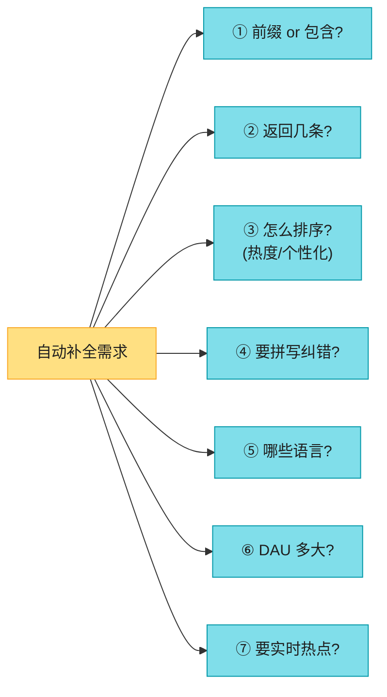

**原书确定的需求**:

| 维度 | 确认值 |
|------|--------|
| 匹配 | **仅前缀**(开头匹配,不打"包含") |
| 返回条数 | **5 条** |
| 排序 | **历史查询频率**(全局热度) |
| 拼写纠错 | 不要 |
| 语言 | 仅英文(小写,无特殊字符) |
| 规模 | **1000 万 DAU** |

**功能性 / 非功能性需求**(背熟):

| 需求 | 说明 |
|------|------|
| **快速响应** ⭐ | 必须 < **100ms**(FB 文章:超过会"卡顿 stuttering") |
| 相关 | 建议要和前缀相关 |
| 排序 | 按热度排序 |
| 可扩展 | 扛高流量 |
| 高可用 | 部分挂了仍可用 |

**估算**(背熟这些数字):

```
查询量: 10M DAU × 10 次/天 = 1 亿次查询/天
每查询发请求数: 每输入一个字符发一次请求,平均 20 字符/查询 → 20 次
QPS: 1 亿 × 20 / 86400 ≈ 23,000 ~ 24,000 QPS
峰值 QPS: × 2 ≈ 48,000 QPS

新增数据: 假设 20% 查询是新词
         10M × 10 × 20 字节 × 20% = 0.4 GB/天
```

> 💡 **关键洞察**:**自动补全是"读极重、写极轻"的系统**——每秒几万次读(QPS 24K),但数据每天才 0.4GB 新增。所以**架构应彻底偏向读优化**:把数据预计算成 Trie 放内存,查询走缓存。**写(数据收集)异步批处理,绝不能阻塞读**。

> 🔄 **2026 现代版怎么讲**(原书 100ms 红线偏宽松):
> "FB 那篇 100ms 是 2009 年的。2026 用户对延迟更敏感,**p99 应做到 30ms 以内**(最好是 10ms)。这意味着 Trie 必须全在内存 + 就近部署(同 region)+ 客户端 debounce。**延迟红线越紧,越要全内存 + 边缘缓存**。"

---

## 2. 高层设计:数据收集 + 查询 两服务分离

原书把系统拆成**两个独立服务**——这是本题的架构精髓:

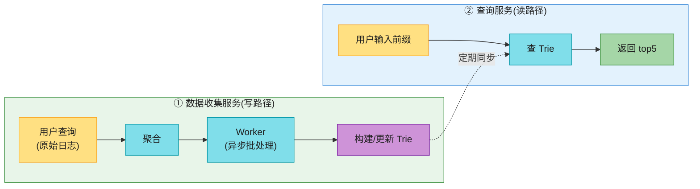

| 服务 | 职责 | 特点 |
|------|------|------|
| **数据收集服务** | 收集用户查询、聚合成热度 | 写路径,**异步批处理**(不实时) |
| **查询服务** | 给前缀返回 top5 | 读路径,**极快**(内存 Trie) |

### 2.1 朴素起点:频率表 + SQL

先用最简单的方案建立直觉。维护一张**频率表**:

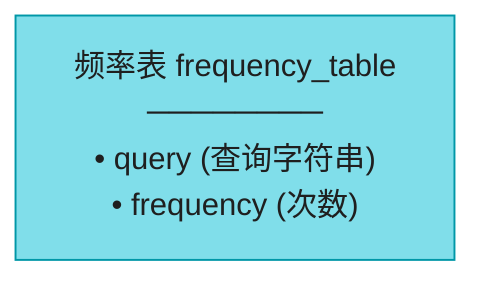

用户依次输入 "twitch"、"twitter"、"twitter"、"twillo",频率表演化:

| query | frequency |
|-------|-----------|
| twitch | 1 |
| twitter | 2 |
| twillo | 1 |

查询时,用户打 "tw",SQL:

```sql
SELECT * FROM frequency_table
WHERE query LIKE 'tw%'
ORDER BY frequency DESC
LIMIT 5;
```

> ⚠️ **原书的判断**:**小数据量能凑合,大数据量数据库是瓶颈**。`LIKE 'tw%'` 虽能走前缀索引,但要 `ORDER BY frequency DESC LIMIT 5`——数据量大时排序 + 扫描太慢,**撑不住 24K QPS**。**所以引入 Trie**。

---

## 3. Trie 数据结构 ⭐⭐⭐⭐⭐(本章灵魂)

> 📝 **Trie(前缀树,发音 "try",源自 retrieval)**:树状结构,紧凑存储字符串。**根=空串;每个节点存一个字符,最多 26 个子节点(英文字母);每个节点代表一个完整词或前缀**。Trie 是**前缀匹配的天然数据结构**——共享公共前缀的词共享路径。

### 3.1 基本 Trie(Fig 13-5)

存 "tree"、"try"、"true"、"toy"、"wish"、"win":

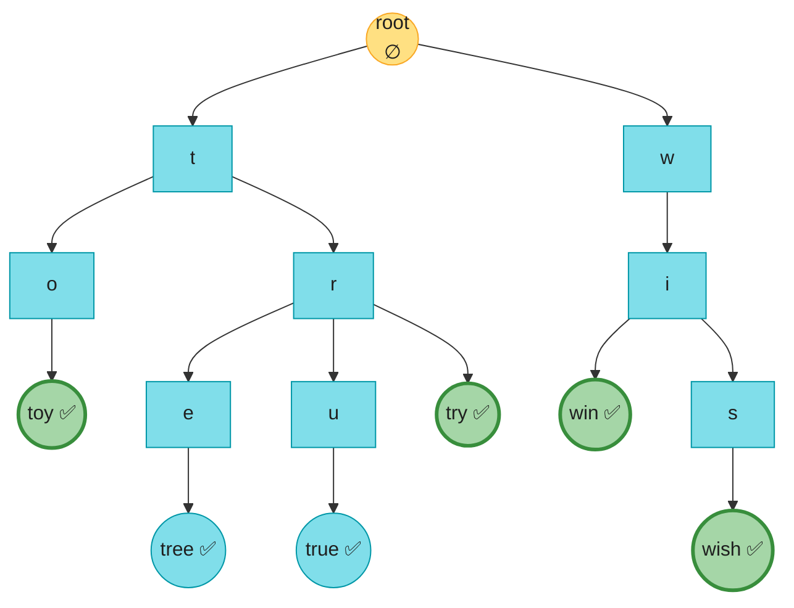

> 💡 **关键认知**:**公共前缀共享路径**——"tree/try/true" 共享 "tr" 路径。这就是 Trie 省空间 + 前缀查询快的原因。**粗框节点 = 完整词**(可能是查询终点)。

### 3.2 加频率(Fig 13-6)

基本 trie 只能"判断词存不存在",要按热度排序,得**在每个完整词节点存频率**:

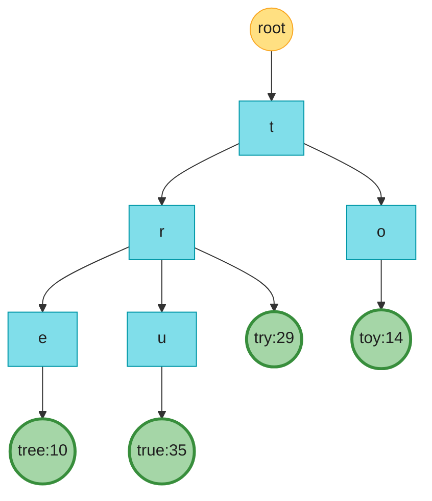

### 3.3 top-k 算法(未优化版)

**符号定义**(背):`p`=前缀长度,`n`=trie 总节点数,`c`=某节点的子节点数。

**三步算法**(Fig 13-7,以 k=2、用户打 "tr" 为例):

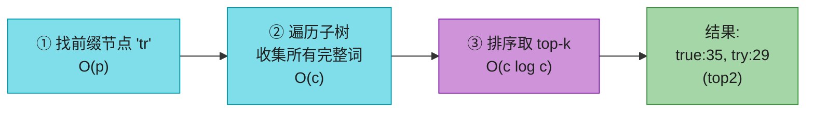

- **Step 1**:从 root 走 "t"→"r",定位到 "tr" 节点。**O(p)**。
- **Step 2**:从 "tr" 往下遍历整个子树,收集所有完整词:[tree:10, true:35, try:29]。**O(c)**。
- **Step 3**:按频率排序取 top-2 → [true:35, try:29]。**O(c log c)**。

**总复杂度 = O(p) + O(c) + O(c log c)**。

> ⚠️ **原书判断**:**最坏情况要遍历整棵 trie**(比如打 "t" 几乎遍历所有 t 开头的词),太慢。**撑不住 100ms**。

### 3.4 两个优化 → O(1) ⭐⭐⭐

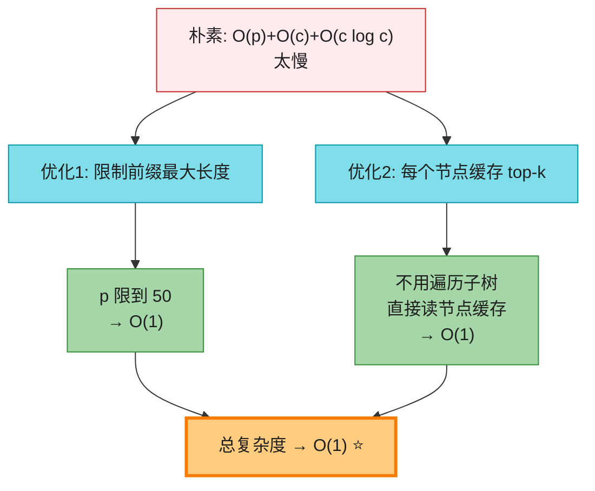

| 优化 | 做法 | 效果 |
|------|------|------|
| **① 限制前缀最大长度** | 用户很少打超长查询,把 p 限到 **50** | "找前缀" O(p) → **O(1)** |
| **② 节点缓存 top-k** | **每个节点直接存它的 top-5** 查询 | 不用遍历子树,直接读 → **O(1)** |

**优化后的节点(Fig 13-8)**——每个节点带 top-5 缓存。例 "be" 节点存:[best:35, bet:29, bee:20, be:15, beer:10]:

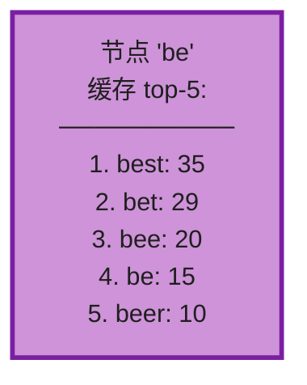

> 💡 **原书关键结论**:**两个优化后,查询 top-k 变成 O(1)**——找前缀 O(1)+ 读节点缓存 O(1)。**代价是空间**:每个节点都存 top-5,空间换时间。**对自动补全这种"延迟为王"的系统,这笔交易非常划算**。

> 🪤 **追问陷阱**:"每个节点都存 top-5,内存不爆吗?" → "**用空间换时间,值得**。自动补全的 top-5 是小列表(几十字节),节点总数虽多但可分片(见第 7 节)。真实系统(FB/Google)都这么干。而且可以**只在高频前缀节点缓存**,低频节点懒计算。"

---

#### 深入:Trie 的内存估算 + top-k 更新代价 ⭐⭐

原书没估算 Trie 内存,这是面试深水区。这里手算。

**① 内存估算**(假设 1000 万词,平均词长 7):

```
节点数: 1000 万词 × 7 字符 ≈ 7000 万节点(公共前缀共享后实际更少,假设 3000 万)
每节点开销:
  • 字符 + 子节点指针: 数组法 26×8B=208B / 哈希法 ~50B
  • top-5 缓存: 5 × (词串~20B + 频率 8B) ≈ 140B
  → 每节点 ~200B(含缓存)
总内存: 3000 万 × 200B ≈ 6 GB
```

> 💡 **结论**:**单机 6GB 能放下一个中等规模 Trie**,所以"全内存 Trie"可行。但大厂(谷歌全量词)要分片。

**② top-k 更新代价(Fig 13-13)**

更新某词频率时,**该词的所有祖先节点都要更新 top-k**(因为祖先的 top-k 是聚合子孙的)。例 "beer" 从 10 涨到 30:

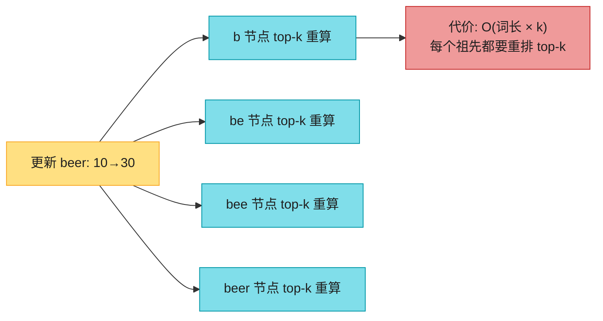

> 🪤 **追问陷阱**:"为什么原书说'直接更新单个节点很慢,要避免'?" → "因为更新一个词,它**所有祖先的 top-k 都要重算**(祖先的 top-k 是子孙聚合)。词长 7 就要重算 7 个节点的 top-5。所以**原书倾向'每周重建整个 Trie'而非实时单点更新**——重建比增量更新简单且一致。"

---

## 4. 数据收集服务 ⭐⭐⭐⭐⭐(异步批处理)

**朴素方案(实时更新)为什么不行?**(原书两点):
1. 用户每天数十亿查询,**每次都更新 Trie 会拖垮查询服务**。
2. Top 建议变化不大,**没必要频繁更新**。

> 📝 **核心认知**:**自动补全的数据"新鲜度"要求没那么高**——Google 关键词的 top 建议一天内几乎不变。所以**异步批处理(每天/每周建一次 Trie)足够**,且把写压力完全和读隔离。**Twitter 这种实时性要求高的,才用更短聚合间隔**。

### 4.1 完整数据流(Fig 13-9)

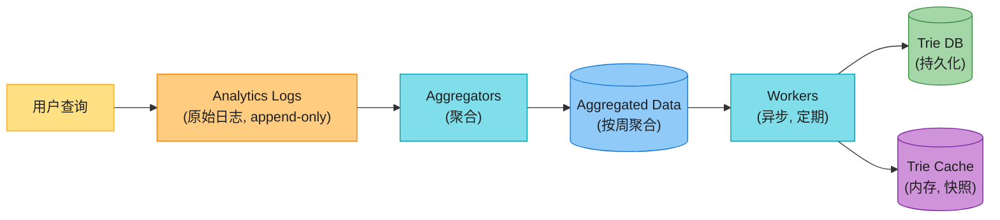

**6 个组件**(背熟):

| 组件 | 职责 | 关键点 |
|------|------|--------|
| **Analytics Logs** | 存原始查询日志 | **append-only,不建索引**(接 Ch9 爬虫日志思想) |
| **Aggregators** | 聚合日志成统计 | 实时场景(Twitter)短间隔;普通(Google)每周 |
| **Aggregated Data** | 聚合结果(时间+频率和) | 按周:time=周起始, frequency=本周总次数 |
| **Workers** | 异步服务器,定期跑 | **构建 Trie,存进 Trie DB** |
| **Trie Cache** | 分布式缓存,Trie 在内存 | 取 DB 的**每周快照** |
| **Trie DB** | 持久化存储 | 见 4.2 两种方案 |

> 💡 **聚合间隔怎么选?**(原书核心 trade-off)
> - **实时场景**(Twitter 突发热点):**分钟级**聚合 → 但 Worker 建 Trie 压力大。
> - **普通场景**(Google):**每周**重建一次 → 简单,够用。
> - **折中**:**每天**聚合 + **每周**全量重建,日常用增量。

### 4.2 Trie DB 怎么存?(Fig 13-10)

Trie 是内存结构,持久化有两种方案:

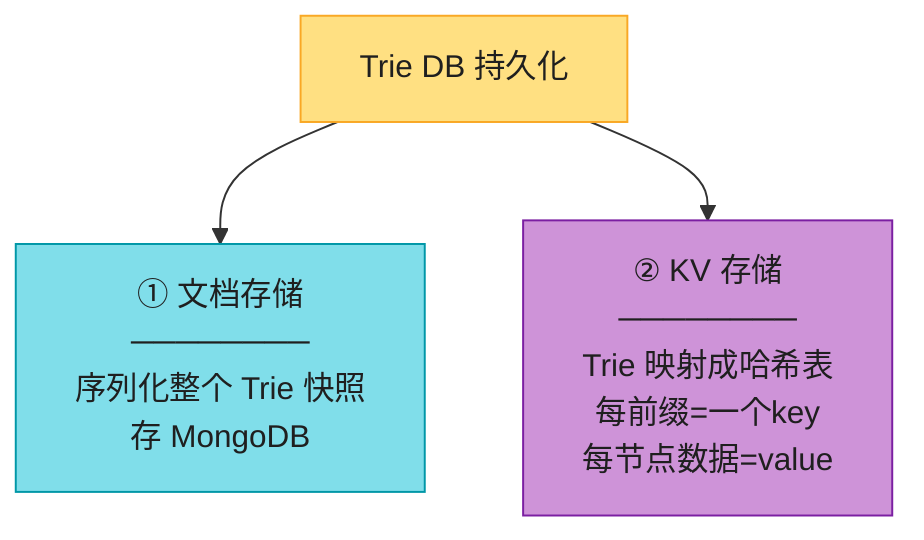

**KV 方案的映射**(Fig 13-10)——每个前缀映射成一个 key,节点数据映射成 value:

```
key="be"     → value={top5:[best:35, bet:29, ...], children:{'s','t','e','r'}}
key="bes"    → value={top5:[best:35], children:{'t'}}
key="best"   → value={top5:[best:35], frequency:35, is_word:true}
```

| 方案 | 怎么做 | 优劣 |
|------|--------|------|
| **文档存储(MongoDB)** | 序列化整个 Trie 快照存进去 | 简单,**适合每周整体替换** |
| **KV 存储** | Trie 映射成哈希表(接 Ch6) | 可**单点更新**(改一个前缀不影响其他),灵活 |

> 💡 **原书建议**:**每周重建 → 用文档存储**(整体序列化最简单);如果要**细粒度更新 → 用 KV 存储**。

---

## 5. 查询服务 ⭐⭐⭐⭐(极快读路径)

查询服务要从"读 DB"升级到"读 Trie Cache":

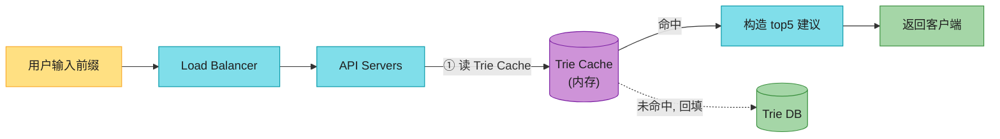

**4 步**(背):① 请求到 LB → ② LB 转 API server → ③ API 从 **Trie Cache** 取数据构造建议 → ④ Cache miss 时**回填**(后续同前缀走缓存)。Cache miss 发生在缓存服务器 OOM 或离线时。

### 5.1 查询优化(原书 3 招)

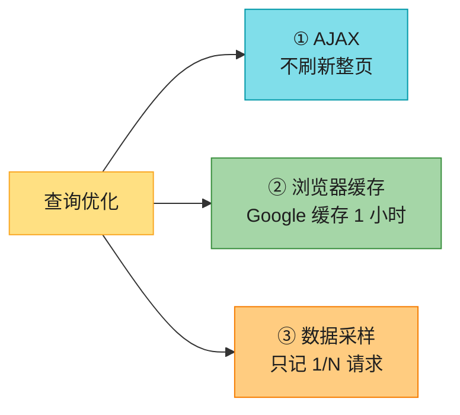

| 优化 | 做法 | 效果 |
|------|------|------|
| **AJAX** | Web 端用 AJAX 拉建议 | 收发请求**不刷新整页** |
| **浏览器缓存** | 短时间内建议不变,存浏览器 | Google 用 `Cache-Control: private, max-age=3600`(1 小时) |
| **数据采样** | 大规模系统只记 1/N 请求 | 省处理和存储(只影响数据收集,不影响查询) |

> 📝 **名词注释**
> - **AJAX**:异步 JS 请求,网页局部更新不刷新。现代用 `fetch`。
> - **`Cache-Control: private`**:只给单个用户缓存,**不能被共享 CDN 缓存**(个性化结果安全)。
> - **`max-age=3600`**:缓存有效期 3600 秒(1 小时)。

> 🪤 **追问陷阱**:"为什么 Google 用 `private` 不用 `public`?" → "自动补全结果可能含**个性化**(你的历史),如果 `public` 会被共享 CDN 缓存给其他用户 → 隐私泄露 + 错串。`private` 确保只在**用户自己浏览器**缓存。"

---

## 6. Trie 操作(create / update / delete)

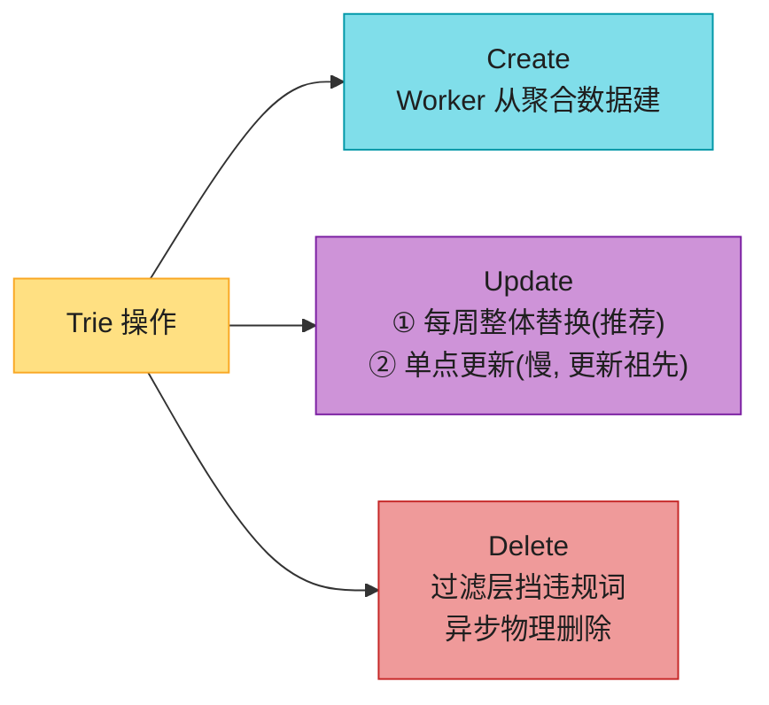

**三种操作**(背熟):

| 操作 | 做法 |
|------|------|
| **Create** | Worker 用聚合数据**从零建 Trie** |
| **Update** | **方案1(推荐):每周重建,新 Trie 替换旧的**;方案2:单点更新(慢,要更新所有祖先 top-k) |
| **Delete** | 加**过滤层**(Fig 13-14)在 Trie Cache 前挡掉仇恨/暴力/色情/危险词;异步从 DB 物理删除,下个周期重建时生效 |

**Delete 的过滤层**(Fig 13-14):

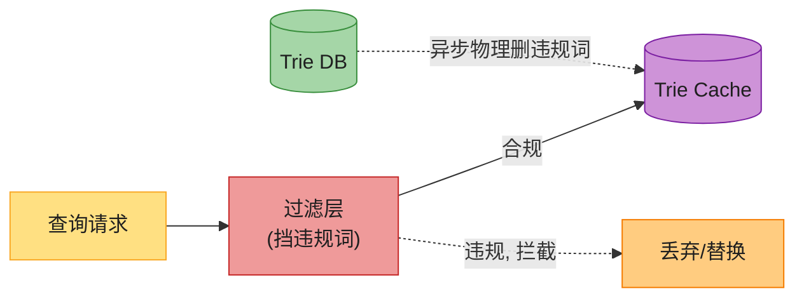

> 💡 **Delete 的两层设计**:**① 过滤层实时拦截(查询时挡)**——违规词即使还在 Trie 也不展示;**② 异步物理删除(数据层清)**——下次重建 Trie 时彻底没了。**两层分离 = 灵活 + 及时**(过滤层能立刻生效,不必等重建)。

---

## 7. 存储扩展:分片 ⭐⭐⭐⭐

Trie 太大单机放不下 → 分片。

### 7.1 朴素分片:按首字母(Fig 13-15 上半)

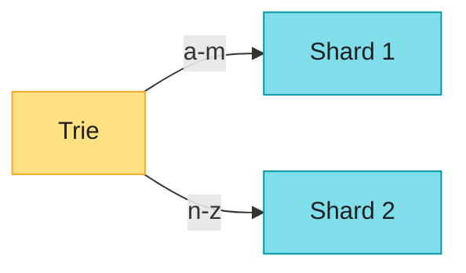

- 两台:a-m / n-z
- 三台:a-i / j-r / s-z
- 最多 26 台(首字母);超了按第二、三字母分(aa-ag / ah-an...)

**问题**(原书点出):**'c' 开头的词远多于 'x'** → **数据严重倾斜**,c 片爆,x 片空。

### 7.2 智能分片:shard map manager(Fig 13-15 下半)

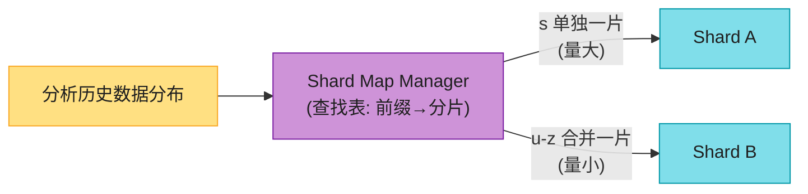

> 📝 **Shard Map Manager**:维护一张**查找表**,根据**历史数据分布**决定前缀落哪个分片。例:历史数据里 's' 的查询量 ≈ 'u'~'z' 的总和 → 's' 单独一片,'u-z' 合并一片。**目标是各分片负载均衡**。

> 🪤 **追问陷阱**:"分片后某词突然爆火(热点)怎么办?" → "**热点 key 问题**(接 Ch1/Ch11)。解法:① 该前缀**进一步细分**(s → sa-sm / sn-sz);② **热点分片加副本**分散读;③ shard map manager 监控后**动态重分片**。"

> 🔄 **2026 现代版怎么讲**(原书分片偏手工):
> "原书的 shard map manager 是手工调优。2026 更倾向**一致性哈希分片**(接 Ch5)+ 监控自动 rebalance。或者干脆**不用自建 Trie 集群,用 Elasticsearch**——它内置分片 + 副本 + completion suggester,运维省心。**自建 Trie 只在你需要极致延迟控制时才值得**。"

---

## 8. Trie 的替代方案(2026,原书完全没讲)⭐⭐⭐⭐

原书把 Trie 当唯一答案,但**真实世界有多种实现**,各有取舍。这是大厂面试的区分点。

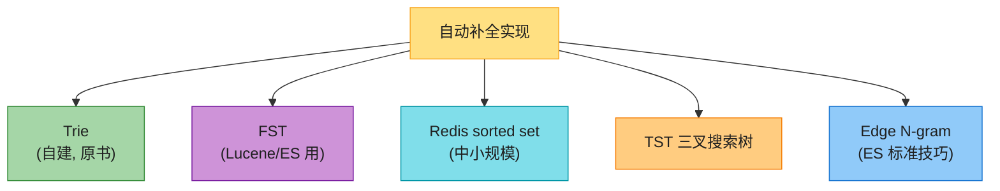

| 方案 | 原理 | 谁用 | 优劣 |
|------|------|------|------|
| **Trie(前缀树)** | 树状,共享前缀 | 原书、自建系统 | 前缀查询快;**空间大**(每节点存 26 指针) |
| **FST(有限状态转换器)** | 把 Trie **压缩成最小化自动机**,共享前后缀 | **Lucene / Elasticsearch** ⭐ | **极省内存**(可比 Trie 省 10×);查询 O(len) |
| **Redis sorted set** | 前缀作 key,候选词+分数作 ZSET 成员 | 中小规模、快速上线 | 简单、现成;**不适合超大规模**(内存爆炸) |
| **TST(三叉搜索树)** | 每节点 3 子(左/中/右),二叉搜索 | 内存敏感场景 | 比 Trie 省空间;查询略慢 |
| **Edge N-gram** | 把词拆成所有前缀 N-gram 索引 | **Elasticsearch 标准技巧** | 复用现有倒排索引;**存储放大** |

> 🔄 **2026 现代版话术**(原书只讲 Trie):
> "Trie 是教学经典,但生产里我会**先评估用 Elasticsearch 还是 Redis**:**① 中小规模 / 快速上线 → Redis sorted set**(几行代码搞定);**② 大规模 + 要复用搜索基建 → Elasticsearch 的 completion suggester 或 edge n-gram**(FST 内存极省);**③ 极致延迟 + 个性化 → 自建 Trie + ML 排序**(Google/FB 级别)。**别一上来就自建 Trie 集群——那是过度工程**,除非你能说清为什么 ES 不满足。"

> 🪤 **追问陷阱**:"为什么 Elasticsearch 用 FST 不用 Trie?" → "Trie 每节点存 26 指针,**空间浪费**(英文大量空指针);FST 是**最小化的有限状态机**,**共享前缀 + 后缀**(tree/true 共享 'tr' 前缀,bird/wird 共享 'ird' 后缀),内存可比 Trie 小一个数量级。Lucene 用 FST 存词典 + 倒排索引指针,是它低内存的关键。"

---

## 9. 客户端 debounce(实务第一技巧,书完全没提)⭐⭐⭐⭐⭐

这是**原书最大的实务缺口**。书说"每输入一个字符发一次请求"(20 次/查询),但**真实前端绝不会这么干**——会把后端打爆。

> 📝 **Debounce(防抖)**:用户连续输入时,**只在停止输入 N 毫秒后才发请求**,把中间的按键丢弃。这是自动补全**前端的标配**。

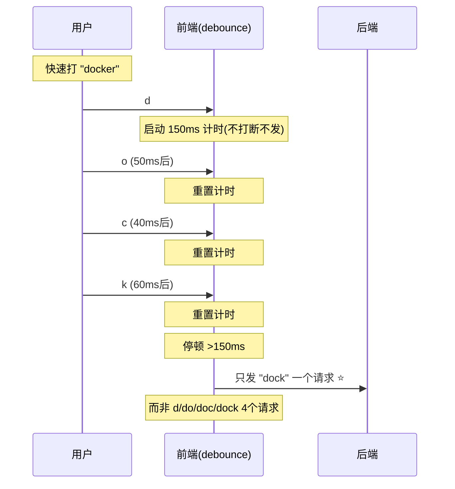

| 技巧 | 作用 |
|------|------|
| **Debounce(防抖)** | 停顿 N ms 才发,**合并连续按键**。自动补全用这个(150-300ms) |
| **Throttle(节流)** | 固定间隔最多发一次。适合滚动/resize |
| **最小长度过滤** | 打 1 个字符不发(太宽泛),≥2 字符才发 |
| **取消上一请求** | 新请求发出时**取消未完成的旧请求**(AbortController),避免乱序返回 |

> 💡 **话术**(被问"怎么减少自动补全的请求数"时直接背):
> "前端三层防护:① **debounce 150ms**——停顿才发,合并连续按键;② **最小 2 字符才查**——单字符太宽泛;③ **取消旧请求**——新输入时 abort 未返回的旧请求,避免乱序。这三招能把**实际请求数从 20 次/查询降到 3-5 次**,后端压力骤降。**原书只讲后端 Trie,但前端的 debounce 才是自动补全的命门**。"

---

## 10. 个性化 + ML 排序(2026 主流,书只讲全局热度)

原书只按**全局频率**排序,但 2026 的自动补全是**个性化 + ML**的。

```mermaid
flowchart LR
    Q["排序信号"] --> A["① 全局热度<br/>(原书)"]
    Q --> B["② 用户历史<br/>(我搜过的)"]
    Q --> C["③ 上下文<br/>(位置/时间/设备)"]
    Q --> D["④ ML 模型<br/>(CTR 预测)"]

    style Q fill:#FFE082,stroke:#F9A825,color:#1f1f1f
    style A fill:#80DEEA,stroke:#0097A7,color:#1f1f1f
    style B fill:#CE93D8,stroke:#7B1FA2,color:#1f1f1f
    style C fill:#FFCC80,stroke:#F57C00,color:#1f1f1f
    style D fill:#90CAF9,stroke:#1976D2,color:#1f1f1f
```

| 信号 | 说明 | 原书 |
|------|------|------|
| **全局热度** | 所有人搜得最多的 | ✅ 唯一信号 |
| **用户历史** | **我自己**搜过的优先(个人 Trie) | ❌ 没讲 |
| **上下文** | 位置(北京 vs 纽约)、时间(早餐搜吃的)、设备 | ❌ 没讲 |
| **ML 模型** | CTR 预测:用户×查询×上下文 → 点击概率 | ❌ 没讲 |

**个性化架构**(原书没有):

```mermaid
flowchart LR
    Q["前缀"] --> G["全局 Trie<br/>(top-k 候选)"]
    Q --> P["个人 Trie<br/>(我的历史)"]
    G --> MERGE["合并 + ML 重排"]
    P --> MERGE
    CTX["上下文<br/>(位置/时间)"] --> MERGE
    MERGE --> OUT["个性化 top5"]

    style Q fill:#FFE082,stroke:#F9A825,color:#1f1f1f
    style G fill:#80DEEA,stroke:#0097A7,color:#1f1f1f
    style P fill:#CE93D8,stroke:#7B1FA2,color:#1f1f1f
    style CTX fill:#FFCC80,stroke:#F57C00,color:#1f1f1f
    style MERGE fill:#90CAF9,stroke:#1976D2,color:#1f1f1f
    style OUT fill:#A5D6A7,stroke:#388E3C,color:#1f1f1f
```

> 💡 **话术**:"原书是全局热度排序,但真实系统是**全局候选 + 个人历史 + ML 重排**。① 全局 Trie 召回 top-20 候选;② 融合用户**个人 Trie**(我搜过的优先);③ **ML 模型**(特征:用户画像、查询历史、位置、时间)对候选重排,输出个性化 top-5。这又是 **Ch11 推荐流的召回+精排思路**——自动补全本质是个'超轻量推荐系统'。"

> 🪤 **追问陷阱**:"个人 Trie 怎么实现?" → "**每个用户维护一个小 Trie**(或 Redis sorted set),存他的历史查询。查询时先查个人 Trie(命中则置顶),再查全局 Trie 补充。**个人 Trie 要设上限**(最近 100 条)+ 过期清理,否则内存爆炸。"

---

## 11. CJK 中文/拼音补全(书只一句"存 Unicode")

原书 Step 4 一句"存 Unicode 就支持多语言"——**完全不对**。中文搜索补全是**另一套系统**,这是国内大厂(百度/微信/淘宝)的高频题。

```mermaid
flowchart LR
    Q["中文搜索补全"] --> P["① 拼音补全<br/>(输入 sj → 手机/时间)"]
    Q --> S["② 首字母缩写<br/>(sj → 手机)"]
    Q --> C["③ 中文前缀<br/>(手 → 手机)"]
    Q --> W["④ 整句分词<br/>(我想买 → 我想买手机)"]

    style Q fill:#FFE082,stroke:#F9A825,color:#1f1f1f
    style P fill:#CE93D8,stroke:#7B1FA2,color:#1f1f1f
    style S fill:#CE93D8,stroke:#7B1FA2,color:#1f1f1f
    style C fill:#80DEEA,stroke:#0097A7,color:#1f1f1f
    style W fill:#FFCC80,stroke:#F57C00,color:#1f1f1f
```

| 场景 | 例子 | 关键技术 |
|------|------|---------|
| **拼音补全** | "shouji"/"sj" → 手机 | **拼音→汉字映射表 + Trie** |
| **首字母缩写** | "sj" → 手机/时间/世界 | **缩写索引** |
| **中文前缀** | "手" → 手机/手表 | **中文 Trie(Unicode)** |
| **整句分词** | "我想买" → 我想买手机 | **分词(jieba/HanLP)+ 语言模型** |

**核心难点**(背):
- **输入是拼音/缩写,输出是汉字**——不能直接用汉字 Trie。要**建拼音 Trie**:把每个候选词的拼音(全拼 + 首字母)都建索引,映射回汉字。
- **分词**:中文没空格,"我想买手机" 要先分词才能做前缀匹配。
- **同音词/多音字**:shi/十/时/是 都映射,要靠**热度 + 上下文消歧**。

> 💡 **话术**:"原书说'存 Unicode 支持多语言'——这对中文是**严重低估**。中文补全要建**拼音 Trie**(全拼 + 首字母)映射回汉字,处理**分词 + 多音字 + 同音消歧**。这是国内大厂的专项题。**英文 Trie 解决不了拼音输入法场景**。"

---

## 12. 实时热点(trending)+ 隐私(原书收尾补充)

### 12.1 实时热点(突发新闻)

原书 Step 4 提到:突发新闻让某词突然爆火,但**每周重建 Trie 太慢**。

```mermaid
flowchart LR
    NEWS["突发新闻<br/>(词突然爆火)"] --> Q{"周重建够吗?"}
    Q -->|"否, 太慢"| S1["① 分片减小数据集"]
    Q -->|"否"| S2["② 排序加权近期<br/>(时间衰减 + 滑动窗口)"]
    Q -->|"否"| S3["③ 流式处理<br/>(Kafka + Flink/Spark)"]

    style NEWS fill:#FFE082,stroke:#F9A825,color:#1f1f1f
    style Q fill:#80DEEA,stroke:#0097A7,color:#1f1f1f
    style S1 fill:#A5D6A7,stroke:#388E3C,color:#1f1f1f
    style S2 fill:#FFCC80,stroke:#F57C00,color:#1f1f1f
    style S3 fill:#90CAF9,stroke:#1976D2,color:#1f1f1f
```

**原书给的思路**:① 分片减小工作集;② 排序模型给**近期查询更高权重**;③ 流式处理(Kafka + Spark Streaming / Storm / Flink)。

> 🔄 **2026 现代版话术**(原书列了一堆老框架):
> "实时热点用 **Kafka + Flink**(2026 主流,Spark Streaming/Storm 已边缘化)。Flink 做**滑动窗口计数**(最近 1 小时/5 分钟的查询频次),实时更新一个**热点 Trie**(独立于周重建的全量 Trie),两者结果合并。**热点词给时间衰减权重**,突发词快速上榜、热度退去快速消失。Twitter 的 trending 就是这套。"

### 12.2 隐私(GDPR / 差分隐私,原书没讲)

```mermaid
flowchart LR
    P["隐私考虑"] --> A["① PII 过滤<br/>(人名/电话不进 Trie)"]
    P --> B["② 差分隐私<br/>(Apple 用)"]
    P --> C["③ GDPR 被遗忘权<br/>(删我的历史)"]
    P --> D["④ 聚合阈值<br/>(低于 N 次不展示)"]

    style P fill:#FFE082,stroke:#F9A825,color:#1f1f1f
    style A fill:#80DEEA,stroke:#0097A7,color:#1f1f1f
    style B fill:#CE93D8,stroke:#7B1FA2,color:#1f1f1f
    style C fill:#FFCC80,stroke:#F57C00,color:#1f1f1f
    style D fill:#90CAF9,stroke:#1976D2,color:#1f1f1f
```

> 💡 **关键点**:**自动补全会泄露隐私**——如果你搜了自己的病/某人的名字,可能被聚合进全局 Trie 给别人看到。**Apple 用差分隐私(Differential Privacy)**:在数据里加噪声,让单个用户的查询不可识别,但整体统计仍准确。**敏感词(人名、电话、地址)要在数据收集阶段过滤**。

---

## ⚠️ 已过时 / 书里没说(2020 → 2026)

| 原书(2020) | 2026 现状 | 面试应对 |
|------------|----------|---------|
| 只讲 Trie | **FST(ES)/ Redis sorted set / edge n-gram** 都是主流 | 主动说按规模选方案,提 FST/ES |
| 每个字符发请求 | **前端 debounce 150ms**(实务命门) | 讲 debounce + 最小字符 + 取消旧请求 |
| 只按全局热度排序 | **个性化 + ML 重排**(个人 Trie + CTR) | 讲召回+精排思路 |
| 100ms 红线 | 2026 应 **p99 < 30ms** | 全内存 + 边缘部署 |
| 周重建 Trie | 实时热点用 **Kafka + Flink** 滑动窗口 | 讲流式 trending |
| "存 Unicode 支持多语言" | **CJK 拼音/缩写/分词是另一套系统** | 讲拼音 Trie + 分词 |
| Spark Streaming/Storm | **Flink** 主导流处理 | 用 Flink 替代 |
| 没提隐私 | **GDPR / 差分隐私(Apple)** | 讲 PII 过滤 + 差分隐私 |
| 手工分片 | **一致性哈希 + ES 内置分片** | 提省运维方案 |
| 没提缓存命中率 | 多级缓存(API + 浏览器 + CDN) | 讲缓存分层 |

---

## 💻 代码示例

### 示例 1:带 top-k 缓存的 Trie(Python)

```python
class TrieNode:
    def __init__(self):
        self.children = {}              # char -> TrieNode
        self.top_k = []                 # ⭐ 每节点缓存 top-5: [(query, freq)]
        self.freq = 0                   # 若是完整词, 存频率

class AutocompleteTrie:
    K = 5
    MAX_PREFIX = 50                     # 优化1: 限制前缀长度

    def __init__(self):
        self.root = TrieNode()

    def insert(self, word, freq):
        """插入并更新沿途所有节点的 top-k(优化2)"""
        node = self.root
        for ch in word:
            if ch not in node.children:
                node.children[ch] = TrieNode()
            node = node.children[ch]
            # 维护该节点的 top-K(按 freq 降序)
            self._update_top_k(node, word, freq)
        node.freq = freq
        node.is_word = True

    def search(self, prefix):
        """查询前缀的 top-5 —— O(1)(优化后)"""
        if len(prefix) > self.MAX_PREFIX:
            prefix = prefix[:self.MAX_PREFIX]
        node = self.root
        for ch in prefix:               # O(1) 因前缀长度受限
            if ch not in node.children:
                return []
            node = node.children[ch]
        return [q for q, _ in node.top_k]   # 直接读缓存 O(1)

    def _update_top_k(self, node, word, freq):
        """更新节点 top-K: 去重→插入→截断→排序"""
        node.top_k = [(w, f) for w, f in node.top_k if w != word]
        node.top_k.append((word, freq))
        node.top_k.sort(key=lambda x: -x[1])   # 按 freq 降序
        node.top_k = node.top_k[:self.K]        # 只留 top-K
```

### 示例 2:Redis sorted set 实现自动补全(中小规模,几行搞定)

```python
import redis
r = redis.Redis()

def record_query(query, weight=1):
    """记录查询: 把 query 加到它所有前缀的 ZSET 里"""
    for i in range(1, len(query) + 1):
        prefix = query[:i]
        r.zincrby(f"ac:{prefix}", weight, query)   # 分数=热度

def autocomplete(prefix, k=5):
    """查询: 直接取该前缀 ZSET 的 top-k"""
    return r.zrevrange(f"ac:{prefix}", 0, k - 1)    # 按分数降序取 top-k
```

> 💡 **Redis 方案的关键**:**每个前缀一个 sorted set**,成员是候选词,分数是热度。`zrevrange` O(log N + k) 取 top-k。**简单到不用自建 Trie**,适合中小规模。代价是**空间放大**(一个词要存进它所有前缀的 ZSET)——这正是 edge n-gram 的思路。

### 示例 3:前端 debounce + 取消旧请求

```javascript
// 自动补全前端: debounce 150ms + 最小2字符 + 取消旧请求
let controller = null;
const debouncedSearch = debounce(async (prefix) => {
    if (prefix.length < 2) return;             // 最小 2 字符
    controller?.abort();                         // 取消上一个未完成请求
    controller = new AbortController();
    try {
        const res = await fetch(`/ac?q=${prefix}`, { signal: controller.signal });
        showSuggestions(await res.json());
    } catch (e) {
        if (e.name !== 'AbortError') console.error(e);
    }
}, 150);

input.addEventListener('input', e => debouncedSearch(e.target.value));

function debounce(fn, ms) {
    let t;
    return (...args) => { clearTimeout(t); t = setTimeout(() => fn(...args), ms); };
}
```

---

## 🪤 追问陷阱(面试官最爱问,本章集)

1. **"用什么数据结构?"** → **Trie(前缀树)** + 每节点缓存 top-k + 限制前缀长度 → 查询 O(1)。
2. **"为什么不用 SQL LIKE?"** → 大数据量排序慢,撑不住 24K QPS;Trie 前缀匹配 + 缓存 top-k 是 O(1)。
3. **"Trie 怎么优化到 O(1)?"** → 两个优化:① 限制前缀长度(p≤50);② 每节点缓存 top-5。空间换时间。
4. **"每个节点存 top-5,内存不爆?"** → 值得(延迟为王);可只在高频前缀缓存;分片分散。
5. **"数据怎么实时更新?"** → 不实时!数据收集和查询分离,**异步批处理(周/天)重建 Trie**。实时性要求高才用流式。
6. **"Trie 怎么持久化?"** → ① 文档存储(序列化快照,适合周重建);② KV 存储(前缀→节点数据,适合细粒度更新)。
7. **"怎么减少请求数?"** → 前端 **debounce 150ms + 最小 2 字符 + 取消旧请求**,把 20 次/查询降到 3-5 次。(原书没讲,这是命门)
8. **"怎么分片?"** → 别按首字母(c 多 x 少,倾斜)。用 **shard map manager** 按历史分布,或一致性哈希。
9. **"Trie 还是 Elasticsearch?"** → 中小用 Redis sorted set;大规模复用搜索基建用 **ES(FST 省内存)**;极致延迟+个性化才自建 Trie。
10. **"为什么 ES 用 FST 不用 Trie?"** → FST 共享前后缀,内存比 Trie 小一个数量级。
11. **"突发热点怎么实时?"** → Kafka + Flink 滑动窗口计数,热点 Trie 独立于周重建,时间衰减权重。
12. **"个性化怎么做?"** → 全局 Trie 召回 + 个人 Trie(我的历史)+ ML 重排(CTR)。本质是轻量推荐系统。
13. **"中文拼音补全?"** → 建拼音 Trie(全拼+首字母)映射回汉字,处理分词 + 多音字 + 同音消歧。原书"存 Unicode"是严重低估。
14. **"违规词怎么删?"** → 过滤层实时拦截 + 异步物理删除(下周期重建生效)。两层分离。
15. **"隐私怎么保护?"** → PII 过滤(人名/电话不进 Trie)+ 差分隐私(Apple)+ 聚合阈值(低于 N 次不展示)。

---

## 🏭 生产级产品速查表

| 产品 | 实现 | 特色 |
|------|------|------|
| **Google** | 自建 Trie + **ML 个性化排序** | 浏览器缓存 1 小时,FST 类技术省内存 |
| **Facebook Typeahead** | 自建(FBLearner Flow)+ **UFO 内存缓存** | 业界经典案例("Life of a Typeahead Query") |
| **Elasticsearch** | **FST + completion suggester / edge n-gram** | 复用倒排索引,FST 极省内存 |
| **Redis** | **sorted set + 前缀 key** | 中小规模,几行代码 |
| **Lucene** | **FST** | ES 底层,FST 发源地 |
| **淘宝/百度(中文)** | **拼音 Trie + 分词 + ML** | 全拼/首字母/缩写多路召回 |
| **Twitter** | **实时 trending**(Kafka + 流式) | 突发热点分钟级上榜 |

> 🏭 **业界经典**:**Facebook 的 "The Life of a Typeahead Query"** 是自动补全必读论文——它讲了 FB 如何用**内存缓存(UFO)+ 两阶段查询(本地 cache → 集群)** 把延迟压到 25ms。**Prefixy** 是开源参考实现(基于 Redis)。

---

## 📝 本章要点总结

```mermaid
flowchart LR
    ROOT(["Ch13 搜索自动补全<br/>Trie + top-k + 读重写轻"])

    B1["需求+估算 ⭐<br/>────────<br/>• 前缀匹配, top5<br/>• 100ms红线(2026: 30ms)<br/>• 24K QPS, 读重写轻"]
    B2["两服务分离 ⭐<br/>────────<br/>• 数据收集(写, 异步批)<br/>• 查询服务(读, 极快)<br/>• 写读彻底隔离"]
    B3["Trie ⭐⭐<br/>────────<br/>• 前缀树+频率<br/>• top-k三步算法<br/>• 两优化→O(1)"]
    B4["数据收集 ⭐<br/>────────<br/>• Log→聚合→Worker<br/>• 周/天重建Trie<br/>• DB:文档/KV两种"]
    B5["查询+分片 ⭐<br/>────────<br/>• LB→API→Trie Cache<br/>• AJAX/浏览器缓存/采样<br/>• shard map manager分片"]
    B6["2026增量(补)<br/>────────<br/>• 替代: FST/ES/Redis<br/>• debounce(命门)<br/>• 个性化+ML / CJK拼音 / 隐私"]

    ROOT --> B1
    ROOT --> B2
    ROOT --> B3
    ROOT --> B4
    ROOT --> B5
    ROOT --> B6

    style ROOT fill:#FFE082,stroke:#F57C00,color:#1f1f1f,stroke-width:3px
    style B1 fill:#80DEEA,stroke:#0097A7,color:#1f1f1f
    style B2 fill:#A5D6A7,stroke:#388E3C,color:#1f1f1f
    style B3 fill:#CE93D8,stroke:#7B1FA2,color:#1f1f1f
    style B4 fill:#90CAF9,stroke:#1976D2,color:#1f1f1f
    style B5 fill:#FFCC80,stroke:#F57C00,color:#1f1f1f
    style B6 fill:#EF9A9A,stroke:#C62828,color:#1f1f1f
```

**核心 Takeaways**:

1. **Trie 是本章灵魂**——前缀树 + 频率;**两个优化(限前缀长度 + 节点缓存 top-k)把查询压到 O(1)**,空间换时间。
2. **两服务分离是架构精髓**——数据收集(写,异步批处理)和查询(读,内存 Trie)**彻底隔离**,写绝不阻塞读。
3. **数据收集异步批处理**——Log→聚合→Worker→Trie DB/Cache;周/天重建,实时场景才上流式。
4. **查询走多级缓存**——Trie Cache(内存)+ 浏览器缓存 + AJAX,**延迟为王**。
5. **分片用 shard map manager**(按历史分布),别按首字母(c 多 x 少倾斜)。
6. **原书最大缺口:前端 debounce**——每字符发请求会把后端打爆,**debounce 150ms + 最小2字符 + 取消旧请求**是实务命门。
7. **Trie 不是唯一答案**——Redis sorted set(中小)/ Elasticsearch FST(大规模)/ 自建 Trie(极致),按规模选。
8. **2026 = 个性化 + ML 排序**——全局候选 + 个人历史 + CTR 重排,本质是轻量推荐系统(接 Ch11)。
9. **CJK 中文是另一套系统**——拼音 Trie + 分词 + 多音字消歧,原书"存 Unicode"严重低估。
10. **原书停在 2020**——补 debounce/FST/个性化/CJK/隐私/Flink,才能拿 strong hire。

> 🔗 **连接上下章**:**Ch12 聊天**是"低延迟双向通信",**Ch13 自动补全**是"前缀检索 + top-k 排序"(数据结构密集型);**Ch14 YouTube** 则切到"**视频转码 + 自适应码率 + CDN**"——从"文本检索"转向"媒体流处理",挑战从延迟变成带宽和转码。
