# Chapter 14: 设计 YouTube (Design a YouTube / Video Sharing Platform)

> 📑 **导航**:[← 搜索补全](ch1_13-设计搜索自动补全.md) · [📚 总目录](../README.md) · [Drive →](ch1_15-设计GoogleDrive.md)
> 🔗 **相关**:[对象存储](../SDE-Vol2/ch2_09-设计对象存储.md) · [Drive](ch1_15-设计GoogleDrive.md) · [AWS网络](../SDA/aws_09-AWS网络服务.md) · [AWS存储](../SDA/aws_10-AWS存储服务.md) · [AWS计算](../SDA/aws_11-AWS计算服务.md)


> *"YouTube looks simple: content creators upload videos and viewers click play. Is it really that simple? Not really."* — 原书开篇
>
> **本章定位**:YouTube 是**"带宽密集 + 转码密集 + CDN 为王"**的题——它是视频流媒体的标杆,也是"**客户端 → CDN → 转码农场**"这条工业流水线的最佳教学。它把 Ch1 的 CDN/对象存储/MQ、Ch4 的限流、Ch13 的搜索召回全用上。灵魂是五件事:**① 视频怎么上传快(分块 + 断点续传)② 视频怎么转码(编码阶梯 + DAG 调度)③ 视频怎么流畅播放(自适应码率 HLS/DASH)④ 视频怎么分发得便宜(CDN + 长尾优化)⑤ 直播和短视频(2026 必问)**。

> **本章和原书的区别**:原书把**视频上传 + 转码 DAG + CDN 成本优化**讲得清楚透彻(这部分至今是面试标准答案)。但**完全没提 AV1**(2020+ 免授权费的新编码)、**完全没提 per-title encoding**(Netflix 按内容动态调阶梯)、**完全没提 CMAF / LL-HLS**(低延迟直播的事实标准)、**完全没提短视频**(TikTok/Shorts/Reels 是另一套架构)、**完全没提 GPU 转码**(转码是计算密集,2026 主流用 GPU)。**版权(ContentID)和内容审核(AI)**只在收尾一句带过。本章把这些全补上,并补**视频推荐 funnel**(接 Ch11)和**视频搜索**(接 Ch13)。

---

## 🎯 面试怎么答(被问到"设计 YouTube / 设计一个视频分享平台"时)

**开场话术**(直接背):

> "YouTube 我先确认五件事:① **直播还是点播**?(架构差异大)② **长视频还是短视频**?(TikTok/Shorts 是另一套)③ 客户端(web/App/智能 TV)?④ 支持的**分辨率和编码**(要不要 AV1)?⑤ **DAU 多大**?然后按 **上传流程(分块 + pre-signed URL)→ 转码 pipeline(DAG + 编码阶梯)→ 分发(CDN + 自适应码率 HLS/DASH)→ 成本优化(长尾)→ 直播/短视频(2026 加分)** 五块讲。核心抉择是 **编码选型(H.264/HEVC/AV1)和 CDN 成本控制**。"

**4 步推进**:


> 💡 **关键信号词**:**主动说出"编码阶梯(encoding ladder)+ 自适应码率 HLS/DASH + 分块上传按 GOP 对齐 + 长尾分布省 CDN"** 这四句,直接证明你懂视频流的工业流水线。再加一句 **"AV1 + per-title encoding + CMAF"** 就是 2026 的 senior 加分。

> 💡 **另一个信号**:视频题和之前所有题的**根本差异是带宽和成本**——之前的题(Feed/聊天/搜索)瓶颈在 QPS 或延迟,**视频题的瓶颈是带宽费(CDN 一天 15 万美元)和转码计算量**。主动点出"**这是个成本驱动的设计,要算 CDN 账**",面试官眼前一亮。

---

## 🗺️ 章节概览

| 小节 | 要点 | 重要性 |
|------|------|--------|
| 需求 + 估算 | 5M DAU,150TB/天存储,**CDN $150K/天**(成本驱动) | ⭐⭐⭐⭐ |
| **高层架构** | 客户端 + CDN + API server 三大件 | ⭐⭐⭐⭐ |
| **视频上传流程 ⭐** | 双并行(传视频 + 更元数据),分块 + pre-signed URL | ⭐⭐⭐⭐⭐ |
| **视频转码 ⭐⭐** | 为什么要转码(兼容/码率/网络),编码阶梯 | ⭐⭐⭐⭐⭐ |
| **转码 DAG 模型** | Facebook SVE 思路,任务编排 | ⭐⭐⭐⭐⭐ |
| **转码架构** | 预处理 + DAG 调度 + 资源管理 + worker | ⭐⭐⭐⭐ |
| **自适应码率 + 流媒体协议** | HLS / DASH / 流 vs 下载 | ⭐⭐⭐⭐⭐ |
| **系统优化** | 速度(并行/就近)+ 安全(pre-signed/DRM)+ 成本(长尾) | ⭐⭐⭐⭐ |
| 错误处理 | 可恢复 vs 不可恢复,逐组件 playbook | ⭐⭐⭐ |
| **AV1 + per-title(补)** | 2020+ 新编码 + 按内容动态阶梯 | ⭐⭐⭐⭐⭐ |
| **CMAF + LL-HLS(补)** | 统一分片 + 低延迟直播 | ⭐⭐⭐⭐⭐ |
| **直播流(补)** | RTMP 推流 → LL-HLS 分发;延迟对比 | ⭐⭐⭐⭐ |
| **短视频(补)** | TikTok/Shorts/Reels 的架构差异 | ⭐⭐⭐⭐ |
| **推荐 + 搜索(补)** | YouTube 推荐 funnel(接 Ch11)+ 视频搜索(接 Ch13) | ⭐⭐⭐ |
| **内容审核(补)** | ContentID 版权 + AI 审核 | ⭐⭐⭐ |
| HTTP/3 + 成本(补) | QUIC 流媒体 + 转码农场成本 | ⭐⭐⭐ |

---

## 1. 需求 + 估算

### 1.1 澄清问题(原书 Step 1 对话)

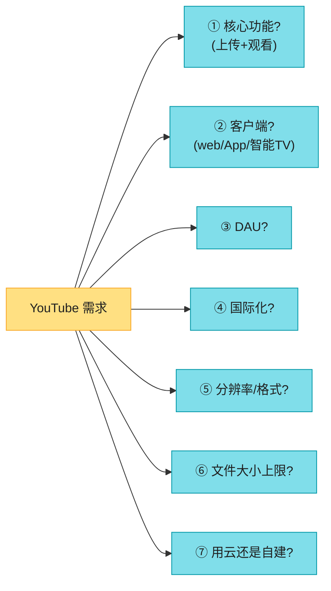

**原书确定的需求**(背熟):

| 维度 | 确认值 |
|------|--------|
| 核心功能 | **上传 + 观看**(评论/分享/点赞等先不设计) |
| 客户端 | 移动 App + web 浏览器 + 智能 TV |
| DAU | **500 万**(原书数字,实际 YouTube 是 20 亿+) |
| 人均观看时长 | 30 分钟/天 |
| 国际化 | 是(大部分用户在国际) |
| 分辨率/格式 | 接受大部分主流分辨率和格式 |
| 加密 | 需要 |
| 文件大小 | **中小视频,上限 1GB** |
| 基建 | **用云服务**(CDN + 对象存储,别自建) |

> ⚠️ **原书用 500 万 DAU 是为了好算,但 YouTube 真实数字是 20 亿+ MAU、每天 50 亿观看**。面试时**用 500 万讲估算,但提一句"真实规模 1000 倍"**,显得你心里有数。

> 🔄 **2026 现代版怎么讲**(原书"中小视频 1GB 上限"):
> "2026 这个上限太保守了——YouTube 已支持 **4K/8K 长视频(单文件几十 GB)**,Netflix 一集剧 4K HDR 能到 7GB+。我会按 **'短视频(<2GB)+ 长视频(可达几十 GB)'** 两档设计。长视频必须**分块上传 + 断点续传**(否则传到 90% 断网全废),这部分接 Ch15 Drive 详讲。"

### 1.2 估算(背熟,这是成本题)

```
★ 存储(上传):
  5M DAU × 10% 上传 1 视频 × 300MB/视频 = 150 TB/天
  → 每年 150TB × 365 ≈ 55 PB(只算原始视频,转码后还要 ×N)

★ CDN 带宽(观看,本题成本中心):
  5M DAU × 5 视频 × 0.3GB × $0.02/GB = $150,000/天 ≈ $5475 万/年
  ⭐ 这一笔就比很多公司全年营收高 —— 这就是为什么 CDN 成本优化是核心议题

★ 观看 QPS(参考):
  5M × 5 / 86400 ≈ 290 次播放请求/秒(均值);峰值 ×5

★ 出口带宽(峰值):
  假设峰值 290×5 ≈ 1500 路并发 × 5Mbps(1080p)= 7.5 Gbps
  (实际 YouTube 出口带宽是 Tbps 级)
```

> 💡 **关键洞察**:这个估算最大的信号是——**CDN 费用是天文数字($15万/天),远超存储和计算**。所以整章的设计重心不在"怎么扛 QPS",而在"**怎么省 CDN 钱**"。这是视频题区别于其他所有题的特征。

> 🔄 **2026 现代版怎么讲**(原书 $0.02/GB 偏高):
> "原书按 CloudFront $0.02/GB 估,2026 大客户谈下来能到 **$0.005~0.01/GB**;Netflix 自建 Open Connect 能压到更低。但**就算单价腰斩,日成本仍是 5-8 万美元级别**——成本驱动的设计逻辑不变。**真正能省钱的是 (1) AV1 把码率砍 30% (2) 长尾只缓存热片 (3) 自建 CDN**(详见第 7 节)。"

---

## 2. 高层设计:客户端 + CDN + API server

原书给了一个极简的高层架构,把系统拆成**三大件**——这是面试第一张图,要会画:

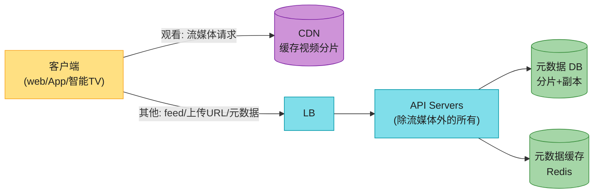

**三大件**(背):

| 组件 | 职责 | 关键点 |
|------|------|--------|
| **客户端** | 看 + 传视频 | 多端(web/App/TV) |
| **CDN** | 视频流媒体 | 边缘节点就近返回,**视频不经过 API server** |
| **API servers** | 一切非流媒体的事 | feed 推荐、生成上传 URL、更新元数据、用户注册… |

> 💡 **核心分离**:**视频流(大带宽)走 CDN,业务逻辑(小数据)走 API server**——这两条路径在架构上是**完全分离**的。视频绝不应该流经 API server(否则 API server 会被带宽打爆)。这是视频系统的第一原则。

### 2.1 为什么不自建 CDN 和对象存储?

原书明确建议**用云服务**(S3/CDN),理由:

| 理由 | 说明 |
|------|------|
| 面试不是"从零造轮子" | 时间有限,选对技术比讲清原理更重要 |
| 自建太贵太复杂 | **Netflix 用 AWS + 自己的 Open Connect;Facebook 用 Akamai**——连这些巨头都不全自建 |

> 🔄 **2026 现代版怎么讲**(原书说"Netflix 用 AWS"):
> "Netflix 的细节:它的**视频分发用自建 Open Connect**(因为 CDN 流量太大,自建比租便宜 10 倍),但**业务后端跑在 AWS**(EC2/S3/DynamoDB)。这叫**'核心瓶颈自建 + 通用部分上云'**——这是 2026 大厂的主流思路。面试讲 YouTube 时,我会说:**视频存储用 S3,转码用 EC2/GPU 实例,分发先用 CloudFront,规模够大后切自建 CDN**。"

面试官确认关注**两个流程**,接下来分别详讲:
- **视频上传流程**(第 3 节)
- **视频流媒体流程**(第 5 节)

---

## 3. 视频上传流程 ⭐⭐⭐⭐⭐

原书把上传拆成**两个并行的流程**——这是本题的高频考点。

### 3.1 上传流程的组件清单

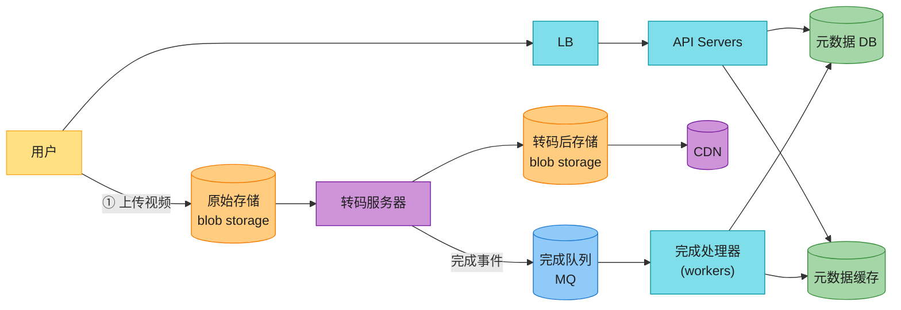

**11 个组件**(背熟,面试官会让你逐个讲):

| 组件 | 职责 |
|------|------|
| 用户 | 上传/观看 |
| LB | 分发请求 |
| API servers | 处理非流媒体请求 |
| **元数据 DB** | 视频 URL/大小/分辨率/格式/用户信息;**分片 + 副本** |
| 元数据缓存 | 视频 + 用户对象缓存 |
| **原始存储(blob)** | 存原始视频(S3 类) |
| **转码服务器** | 把视频转成多格式/多码率(本章灵魂) |
| **转码后存储** | blob,存转码后的多个版本 |
| CDN | 缓存视频,边缘就近返回 |
| **完成队列** | MQ,存转码完成事件 |
| **完成处理器** | workers,从队列拉事件,更新元数据 DB/缓存 |

> 📝 **名词注释**
> - **blob storage(对象存储)**:存二进制大文件的存储,BLOB = Binary Large OBject。代表产品 S3 / GCS / Azure Blob。视频、图片、备份都存这。**和块存储/文件存储不同**——它是 HTTP API 访问、扁平命名空间、海量廉价。
> - **转码(transcoding)** = 编码(encoding):把一种视频格式/码率转成其他格式/码率。原书把这两个词等同。
> - **元数据**:视频的"身份证"——URL、大小、分辨率、格式、上传者、时长、标签…是**结构化数据**,存关系库;而视频本身是**非结构化二进制**,存 blob。

### 3.2 流程 a:上传实际视频(并行流程 1)

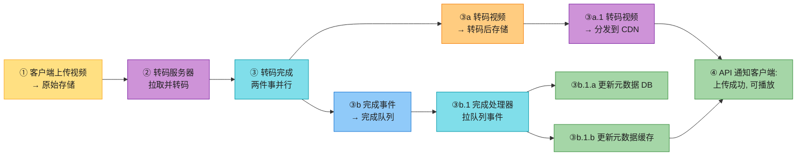

**8 步**(背):① 视频上传到原始存储 → ② 转码服务器拉取转码 → ③ 转码完成,**③a 和 ③b 并行** → ③a 转码视频进转码后存储 → ③b 完成事件进队列 → ③a.1 转码视频分发到 CDN → ③b.1 完成处理器拉队列 → ③b.1.a/b 更新元数据 DB 和缓存 → ④ API 通知客户端"上传成功,可播放"。

> 💡 **关键设计点**:**③a 和 ③b 并行**——分发到 CDN 和更新元数据**同时进行**,不互相阻塞。用 **MQ 解耦**:转码完成只管"丢个事件进队列",后续更新元数据由 completion handler 异步消费。**这是异步解耦的典型应用**(接 Ch1 第 7 集 MQ)。

### 3.3 流程 b:更新元数据(并行流程 2)

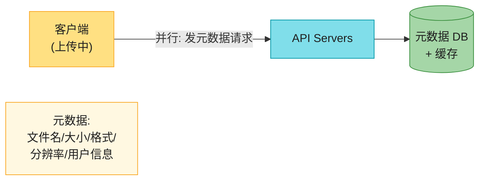

**流程 b 在流程 a 上传视频的同时并行**:客户端发一个请求,带文件名/大小/格式等元数据,API 更新元数据 DB 和缓存。**两条流程互不依赖,各自跑完**。

> 🪤 **追问陷阱**:"为什么上传和元数据更新要拆成两个并行流程?" → "因为**视频是大文件上传慢(分钟级),元数据是小数据更新快(毫秒级)**——拆开后,元数据可以先入库存着(状态=处理中),视频上传和转码异步推进,**客户端体验更好**(上传中就能看到自己的视频条目)。如果合一,客户端要等上传完才能看到。**这又是读写分离 + 异步解耦的思想**。"

---

## 4. 视频转码(Transcoding)⭐⭐⭐⭐⭐(本章灵魂)

### 4.1 为什么要转码?

原书给出**四个理由**(背熟):

| 理由 | 说明 |
|------|------|
| **① 原始视频太大** | 1 小时 60fps 高清视频原始能占**几百 GB**(raw/uncompressed) |
| **② 兼容性** | 不同设备/浏览器只支持某些格式,要编码成多种格式 |
| **③ 网络自适应** | 高带宽用户看高清,低带宽用户看低清——**同一视频要出多个码率版本** |
| **④ 网络变化** | 移动网络抖动时,客户端要能**自动切换码率**(自适应码率 ABR) |

> 💡 **一句话总结**:**转码 = 把一个原始视频,变成"多分辨率 × 多码率 × 多编码"的版本矩阵**。这就是后面要讲的"编码阶梯(encoding ladder)"。

### 4.2 编码格式:容器 + 编解码器

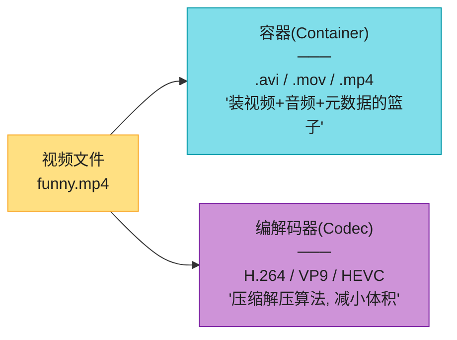

> 📝 **名词注释**
> - **容器(Container)**:像"篮子",装视频流 + 音频流 + 字幕 + 元数据。**用文件扩展名识别**(.mp4、.mov、.avi、.mkv)。容器不规定压缩方式。
> - **编解码器(Codec)**:压缩/解压算法,**目标是"减小体积同时保画质"**。原书列三个主流:**H.264**(老牌,兼容性最好)、**VP9**(Google,免授权费)、**HEVC/H.265**(压缩比 H.264 高约 50%)。
> - **码率(bitrate)**:单位时间处理的比特数(bps/Mbps)。码率高 = 画质好 = 文件大 = 需要带宽高。

#### 深入:编码阶梯(Encoding Ladder)⭐⭐⭐

这是视频流媒体的核心概念,原书用一张"编码后文件矩阵"图(Fig 14-9)展示。一个原始视频会被编码成**多个分辨率 × 多个码率**的版本:

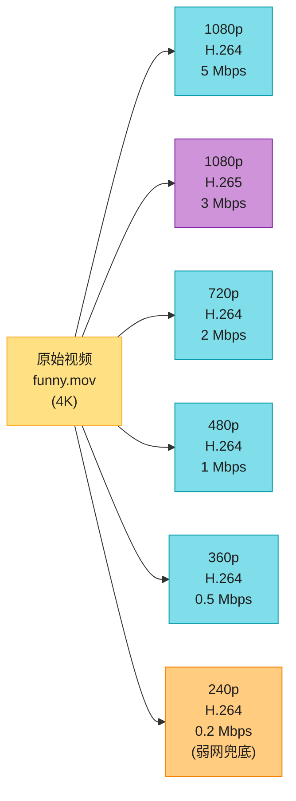

| 分辨率 | 码率(参考) | 用途 |
|--------|-----------|------|
| 4K(2160p) | 15-25 Mbps | 智能 TV / 大屏 |
| 1080p | 5 Mbps | 家用 WiFi / 手机 |
| 720p | 2.5 Mbps | 中等带宽 |
| 480p | 1 Mbps | 移动网络 |
| 360p | 0.5 Mbps | 弱网 |
| 240p | 0.3 Mbps | **兜底, 保证能播** |
| 144p | 0.1 Mbps | 极弱网 / 音频为主 |

> 🪤 **追问陷阱**:"为什么不只存一个最高清版本,让客户端按需降级?" → "因为**降级要在客户端实时转码,耗电+耗 CPU,移动端扛不住**。所以是**服务端预转码好多个版本**,客户端只负责选哪个版本播放——这就是 **ABR(Adaptive Bitrate Streaming,自适应码率)** 的本质。代价是**存储和转码成本翻倍**,但省了客户端算力和带宽浪费。"

> 🔄 **2026 现代版怎么讲**(原书用 H.264 为主,过时了):
> "2026 的编码阶梯我会有三层:**H.264(兼容兜底,所有设备都支持)+ H.265/HEVC(主流,压缩比好 50%)+ AV1(新部署,2020+ 免授权费,压缩比再好 30%,但编码慢)**。**Apple 设备强制 HEVC,Chrome/Android 推 AV1**——所以同一视频要出三套编码,存储成本×3,但带宽省一半。详见第 9 节 AV1。"

---

## 5. 视频转码架构:DAG 模型 ⭐⭐⭐⭐⭐

> 📝 **DAG(Directed Acyclic Graph,有向无环图)**:节点是任务,边是依赖。原书借鉴 **Facebook 的 SVE(Streaming Video Engine)** 论文思路——把转码拆成一堆任务,用 DAG 编排,**支持顺序执行和并行执行**。这是大厂视频流水线的标准模型。

### 5.1 为什么用 DAG?

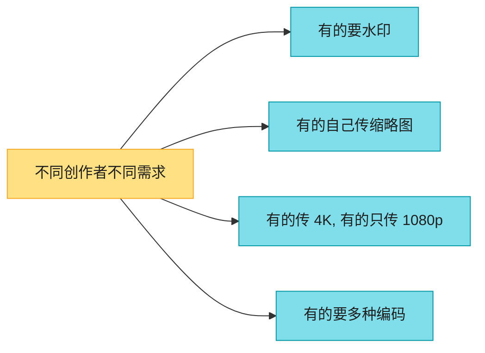

**问题**:转码很贵很慢,不同创作者需求不同。**不能写死一条流水线**——要能**配置化 + 高并行**。

**方案**:**用 DAG 编程模型**——创作者/系统配置一份 DAG(任务图),调度器按依赖关系执行,**互不依赖的任务并行跑**。

### 5.2 一个转码 DAG 的例子(Fig 14-8)

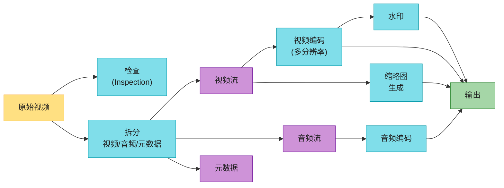

**可应用的任务**(背):

| 任务 | 说明 |
|------|------|
| **Inspection(检查)** | 视频质量、是否损坏 |
| **Video encoding(视频编码)** | 转多分辨率/编码/码率 |
| **Thumbnail(缩略图)** | 用户传 或 系统自动抽帧生成 |
| **Watermark(水印)** | 图片叠加,标识视频归属 |

> 💡 **DAG 的价值**:**视频编码、缩略图、音频编码互不依赖,可并行跑**;而水印依赖视频编码完成。DAG 让调度器自动识别哪些能并行、哪些必须串行——**比写死的 pipeline 灵活得多**。

### 5.3 转码架构的六大组件(Fig 14-10)

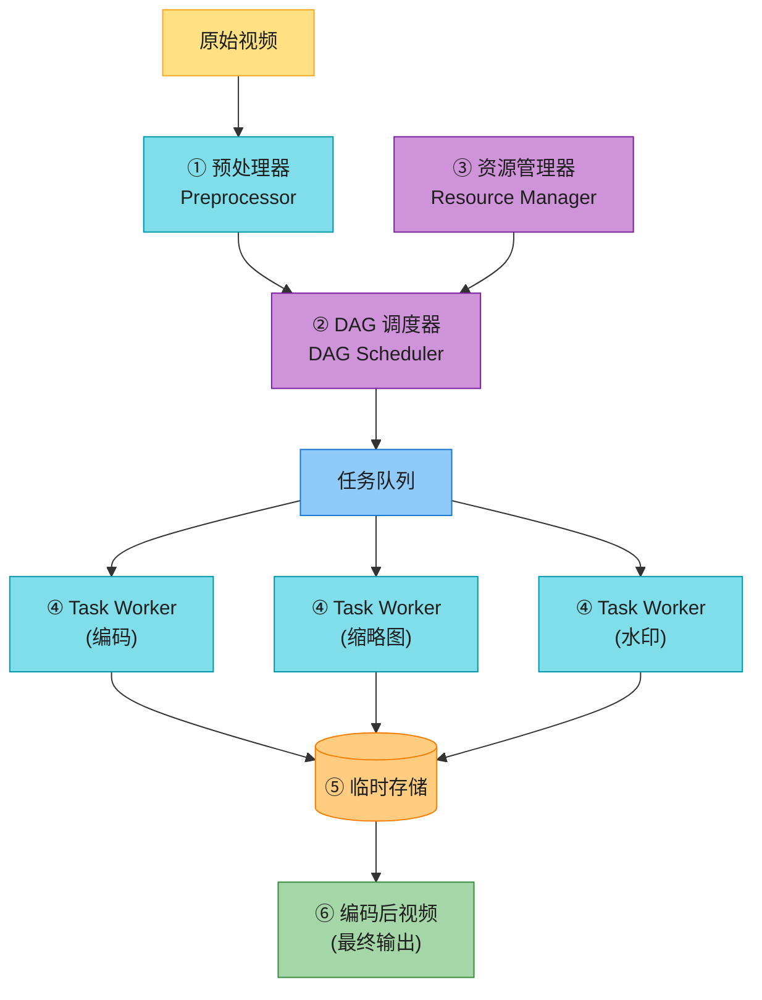

#### ① 预处理器(Preprocessor)的 4 个职责

| 职责 | 说明 |
|------|------|
| **a. 视频拆分** | 按 **GOP(Group of Pictures)** 对齐切成小段 |
| **b. 老客户端兼容** | 不支持拆分的老客户端,服务端代拆 |
| **c. DAG 生成** | 读配置文件,生成 DAG 图 |
| **d. 缓存数据** | 把 GOP + 元数据存临时存储,**转码失败可重试** |

> 📝 **GOP(Group of Pictures,图像组)**:一组按特定顺序排列的帧,**每个 chunk 是独立可播放单元,通常几秒长**。视频按 GOP 切分是**分块上传 + 分块转码**的基础——切到 GOP 边界才能独立解码。

#### ② DAG 调度器(DAG Scheduler)


**职责**:**把 DAG 拆成阶段(stage)的任务,丢进资源管理器的任务队列**。

#### ③ 资源管理器(Resource Manager)⭐

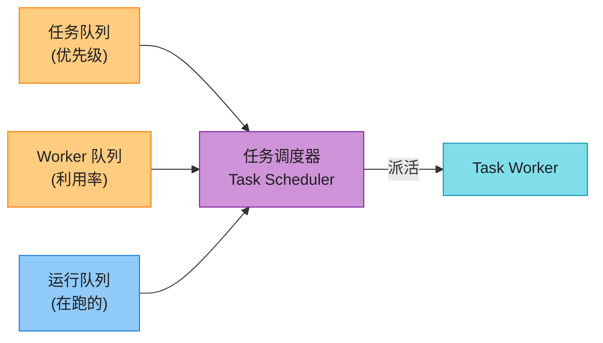

**三个队列 + 一个调度器**(背):

| 队列 | 内容 |
|------|------|
| **任务队列** | 待执行任务(**优先级队列**) |
| **Worker 队列** | worker 利用率信息 |
| **运行队列** | 当前正在跑的任务 + 跑它的 worker |

**任务调度器 5 步工作流**(背):
1. 从任务队列取**最高优先级**任务
2. 从 worker 队列取**最优** worker
3. 指示该 worker 执行任务
4. 把 task/worker 绑定信息丢进运行队列
5. 任务完成后从运行队列移除

> 💡 **设计精髓**:**任务和 worker 分开排队,调度器做"撮合"**——这样加 worker、加任务都灵活(分别扩缩),互不耦合。这又是 Ch1 第 7 集 MQ 解耦的思想。

#### ④ Task Workers

跑 DAG 定义的任务。**不同 worker 跑不同任务**(编码 worker、缩略图 worker、水印 worker…)——这是**专门化(specialization)**,每种 worker 配置最优(编码 worker 上 GPU)。

#### ⑤ 临时存储

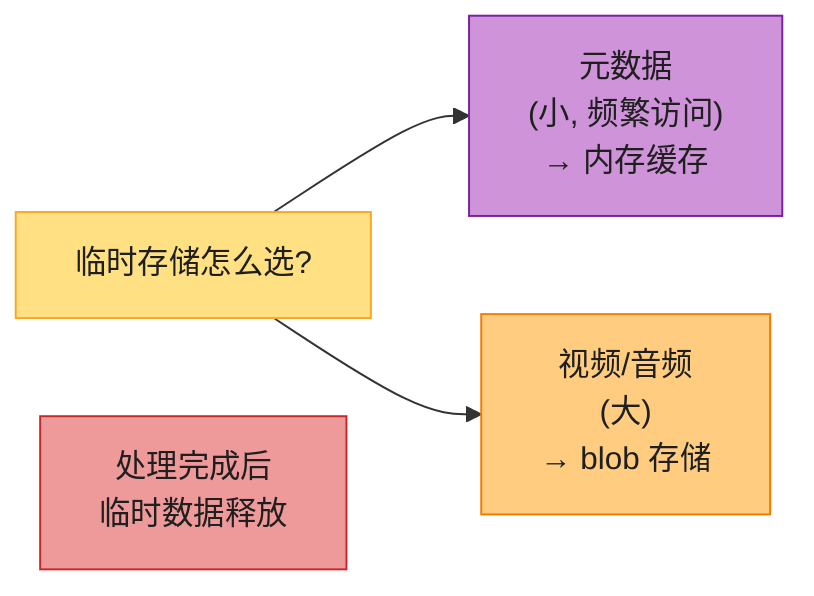

**按数据特征选存储**:元数据小且频繁访问 → 内存;视频音频大 → blob。**处理完成后临时数据全部释放**(不长期占空间)。

#### ⑥ 编码后视频(最终输出)

例:`funny_720p.mp4`、`funny_1080p.mp4`、`funny_360p.mp4`…一视频多版本。

---

## 6. 视频流媒体流程 ⭐⭐⭐⭐⭐

### 6.1 流 vs 下载(必背区分)

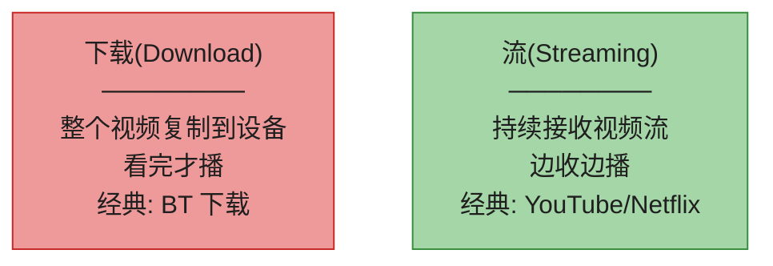

> 💡 **流媒体的本质**:**客户端每次只加载一小段数据**,所以**能立即播放 + 连续播放**,不用等整个视频下完。这是 YouTube 体验的核心。

### 6.2 流媒体协议(背名字 + 知道差异即可)

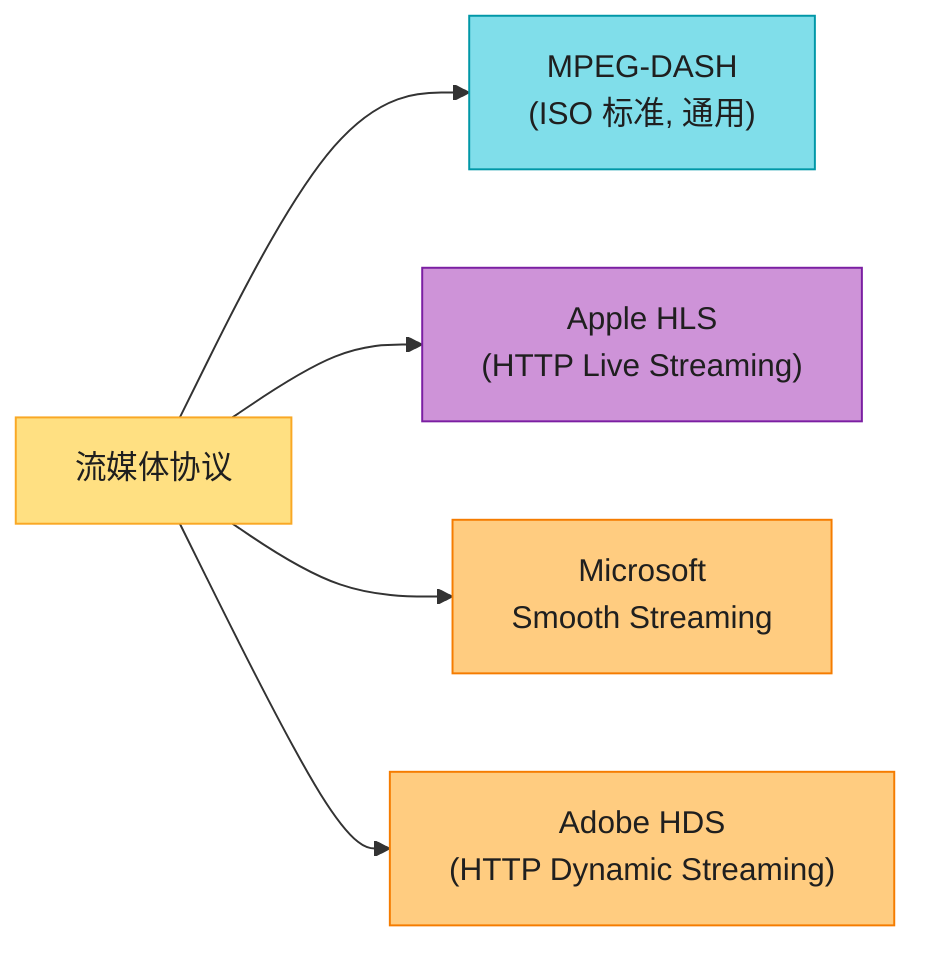

> 📝 **关键认知**:**面试不必背全部细节**。要点是:**不同协议支持不同的编码和播放器**,设计时要选对。2026 主流是 **HLS(Apple 主推,iOS/macOS/Safari 原生)+ DASH(Android/Chrome/Netflix)**。

### 6.3 高层流媒体流程(Fig 14-7)

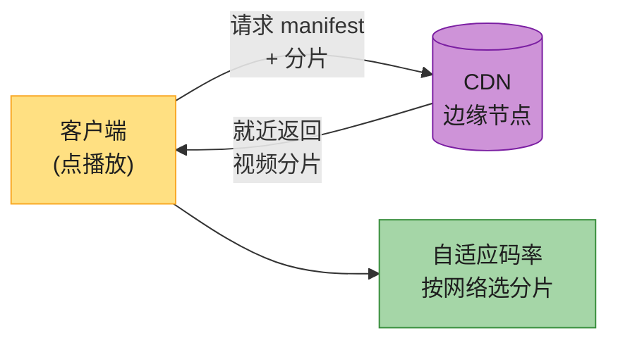

**视频直接从 CDN 流给客户端**——边缘节点就近,延迟极低。

> 🔄 **2026 现代版怎么讲**(原书 4 个协议并列,过时):
> "原书列的 Smooth Streaming 和 HDS **2026 基本退场**——现在主流是 **HLS + DASH**,而且 **CMAF(Common Media Application Format)** 让两者**共用同一种分片格式(.cmfv/.cmfa/.cmfm)**,一份分片同时服务 HLS 和 DASH,**转码/存储成本砍半**。这是 2017 后的大事,原书 2020 还没提。详见第 10 节 CMAF。"

---

## 7. 系统优化(速度 + 安全 + 成本)⭐⭐⭐⭐

### 7.1 速度优化 1:并行化上传(分块 + GOP)


**优化**:**按 GOP 对齐切 chunk,客户端并行上传,失败只重传失败的 chunk**(resumable upload)。原书提到 GOP 拆分可以**在客户端做**(老客户端不支持则服务端代拆)。

> 🔄 **2026 现代版怎么讲**:"这接 **Ch15 Drive 的分块上传 / 断点续传**—— YouTube/Drive 的上传协议本质一样:**预签 URL + 分块 + 客户端记录已传 chunk offset + 失败续传**。S3 的 multipart upload、GCS 的 resumable upload 都是这套。视频特别要用 **GOP 对齐**(否则切出来的 chunk 不能独立解码)。"

### 7.2 速度优化 2:上传中心就近用户

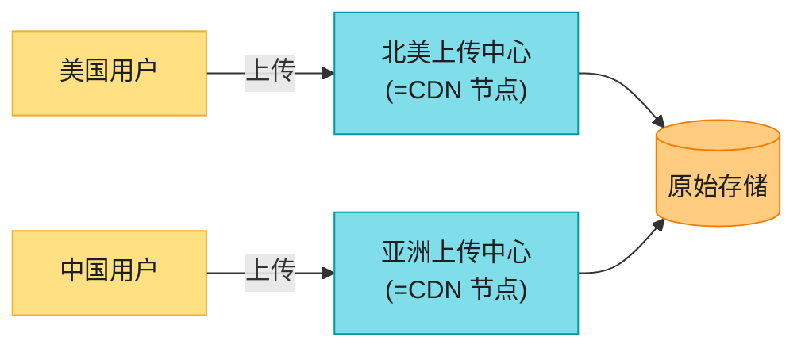

**用 CDN 做上传中心**——全球多节点,用户就近上传。这是 CDN 的**反向使用**(不只下载,上传也走 CDN 边缘)。

### 7.3 速度优化 3:处处并行(解耦)

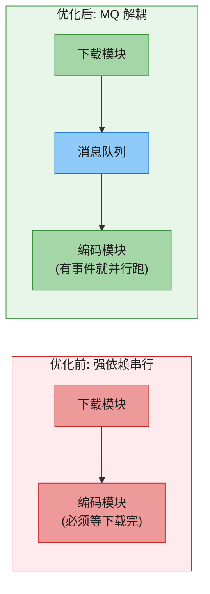

**核心**:在原存储 → 转码 → CDN 的链路里**插 MQ**,各模块不再强依赖,**有事件就并行**。这又是 Ch1 第 7 集 MQ 解耦思想。

### 7.4 安全优化 1:预签名上传 URL(pre-signed URL)⭐

```mermaid
sequenceDiagram
    participant C as 客户端
    participant API as API Server
    participant S3 as 对象存储<br/>(S3)
    C->>API: ① 请求上传 URL
    API-->>C: ② 返回 pre-signed URL<br/>(带权限+时效)
    C->>S3: ③ 用 pre-signed URL 直接上传
    S3-->>C: ④ 上传成功
```

**流程 4 步**(背):① 客户端向 API 请求上传 URL → ② API 返回 **pre-signed URL**(带访问权限 + 时效) → ③ 客户端用此 URL **直接上传到 S3**(不经 API) → ④ 上传完成。

> 📝 **pre-signed URL**:S3 的术语,**URL 里嵌入了访问权限和过期时间**。客户端拿这个 URL 能**直接上传到 S3,不经 API server**——这样 API server 不会被大文件带宽打爆。Azure 叫 **Shared Access Signature(SAS)**,原理一样。

> 💡 **关键设计**:**大文件传输绕开 API server,客户端直连对象存储**——这和"视频流绕开 API 走 CDN"是同一思想:**API server 只处理小数据,大数据走专用通道**。

> 🪤 **追问陷阱**:"pre-signed URL 泄露怎么办?" → "**有时效**(通常几分钟到几小时),过期就废了;且**限定单文件 + 单操作**(只能 PUT 这个对象)。再加 **HTTPS + 客户端鉴权** 拿 pre-signed URL 的环节。这比让 API server 中转上传安全得多。"

### 7.5 安全优化 2:保护视频(DRM / 加密 / 水印)

```mermaid
flowchart TD
    Q["视频保护方案"] --> DRM["① DRM 系统<br/>────────<br/>Apple FairPlay<br/>Google Widevine<br/>Microsoft PlayReady"]
    Q --> AES["② AES 加密<br/>────────<br/>加密视频<br/>播放时解密<br/>授权用户才能看"]
    Q --> WM["③ 可视水印<br/>────────<br/>图片叠加<br/>公司 logo/用户ID"]

    style Q fill:#FFE082,stroke:#F9A825,color:#1f1f1f
    style DRM fill:#CE93D8,stroke:#7B1FA2,color:#1f1f1f
    style AES fill:#80DEEA,stroke:#0097A7,color:#1f1f1f
    style WM fill:#FFCC80,stroke:#F57C00,color:#1f1f1f
```

| 方案 | 机制 | 适用 |
|------|------|------|
| **DRM** | 三大 DRM 系统,数字版权管理 | 付费内容(Netflix/电影) |
| **AES 加密** | 视频加密,授权用户解密播放 | 会员/付费视频 |
| **可视水印** | 视频上叠 logo/用户 ID | 防盗摄 + 溯源 |

### 7.6 成本优化:CDN 长尾分布 ⭐⭐⭐(本题核心)

```mermaid
flowchart LR
    POP["视频访问分布"] --> HEAD["头部: 少数爆款<br/>绝大多数观看"]
    POP --> TAIL["长尾: 大量冷门<br/>几乎没人看"]

    POP -.->|"长尾分布<br/>power law"| NOTE["结论: 只把热片<br/>放 CDN, 冷片走源站"]

    style POP fill:#FFE082,stroke:#F9A825,color:#1f1f1f
    style HEAD fill:#EF9A9A,stroke:#C62828,color:#1f1f1f
    style TAIL fill:#90CAF9,stroke:#1976D2,color:#1f1f1f
    style NOTE fill:#A5D6A7,stroke:#388E3C,color:#1f1f1f
```

**原书核心洞察**:**YouTube 视频访问服从长尾分布**——少数爆款被反复看,大量冷门视频几乎无人问津。基于此,**4 个成本优化**(背):

| 优化 | 做法 |
|------|------|
| **① 热片走 CDN,冷片走源站** | 只有爆款放 CDN,冷门视频从高容量存储服务器直接发 |
| **② 冷片少编码版本** | 冷门视频不必全编码,短视频**按需转码**(用户点了再转) |
| **③ 地区性爆款** | 只在热区缓存,不分发到全球所有 CDN 节点 |
| **④ 自建 CDN** | Netflix Open Connect 模式,和 ISP 合作,把缓存推到 ISP 机房 |

```mermaid
flowchart LR
    REQ["用户点视频"] --> Q{"热度分级"}
    Q -->|"热片"| CDN[("CDN<br/>就近缓存")]
    Q -->|"冷片"| ORIG[("源站存储服务器<br/>高容量, 便宜")]

    style REQ fill:#FFE082,stroke:#F9A825,color:#1f1f1f
    style Q fill:#80DEEA,stroke:#0097A7,color:#1f1f1f
    style CDN fill:#CE93D8,stroke:#7B1FA2,color:#1f1f1f
    style ORIG fill:#FFCC80,stroke:#F57C00,color:#1f1f1f
```

> 💡 **话术**(被问"CDN 太贵怎么办"时直接背):
> "**核心是利用长尾分布**——把视频按热度分级,只有热片进 CDN,冷片走源站高容量存储。再进一步:**冷片少编码版本**(甚至按需转码)、**地区性爆款只在热区缓存**、**规模够大就自建 CDN(Netflix Open Connect)**。这一套能把 CDN 成本砍 50% 以上。**所有优化都基于历史访问模式分析,不是拍脑袋**。"

> 🔄 **2026 现代版怎么讲**(原书自建 CDN 部分仍准):
> "Netflix 的 **Open Connect Appliance(OCA)** 是行业标杆——它把**专用存储设备直接放在 ISP 机房**,用户实际从 ISP 内网的 OCA 拉视频,**完全不经过公网**,带宽成本极低。YouTube 用 **Google Global Cache** 类似思路。**只有规模到 Tbps 级别才值得自建 CDN**,中小公司用 Cloudflare/CloudFront + 长尾优化就够。"

---

## 8. 错误处理(原书收尾)

### 8.1 两类错误

```mermaid
flowchart LR
    ERR["系统错误"] --> R["可恢复错误<br/>────────<br/>分片转码失败<br/>→ 重试几次"]
    ERR --> NR["不可恢复错误<br/>────────<br/>视频格式损坏<br/>→ 停止 + 返回错误码"]

    style ERR fill:#FFE082,stroke:#F9A825,color:#1f1f1f
    style R fill:#FFCC80,stroke:#F57C00,color:#1f1f1f
    style NR fill:#EF9A9A,stroke:#C62828,color:#1f1f1f
```

### 8.2 各组件错误处理 playbook(背熟)

| 组件出错 | 处理 |
|---------|------|
| 上传错误 | 重试几次 |
| 视频拆分错误 | 老客户端不能拆,服务端代拆 |
| 转码错误 | 重试 |
| 预处理器错误 | 重新生成 DAG |
| DAG 调度器错误 | 重新调度任务 |
| 资源管理器队列挂 | 用副本(replica) |
| Task worker 挂 | 在新 worker 上重试 |
| API server 挂 | 无状态,流量转其他 API server |
| 元数据缓存挂 | 多副本,挂一个用其他 + 拉新 |
| 元数据 DB master 挂 | 提升一个 slave 为新 master |
| 元数据 DB slave 挂 | 用其他 slave + 拉新副本 |

> 💡 **设计哲学**:**可恢复 → 重试;不可恢复 → 停止 + 报错**。每层都有兜底,这正是 Ch1 高可用思想的逐层落地。

---

## 9. ⚠️ 已过时 / 书里没说:AV1 + 新编码(2020 → 2026)

这是本章**最重要的 2026 增量**之一。原书列 H.264/VP9/HEVC,但 **AV1 是 2020 后的事实新标准**。

### 9.1 编码器演进 + 授权费烂账

```mermaid
flowchart LR
    H264["H.264 / AVC<br/>(2003)<br/>────────<br/>兼容性最广<br/>授权费贵(MPEG-LA)"]
    H265["H.265 / HEVC<br/>(2013)<br/>────────<br/>压缩比 H.264 好 50%<br/>授权费烂账💥"]
    VP9["VP9<br/>(Google, 2013)<br/>────────<br/>免授权费<br/>只有 Chrome/Android"]
    AV1["AV1<br/>(2020+, AOMedia)<br/>────────<br/>免授权费 ⭐<br/>压缩比 HEVC 再好 30%<br/>编码极慢💥"]

    H264 --> H265 --> AV1
    VP9 -.->|"演进"| AV1

    style H264 fill:#80DEEA,stroke:#0097A7,color:#1f1f1f
    style H265 fill:#FFCC80,stroke:#F57C00,color:#1f1f1f
    style VP9 fill:#90CAF9,stroke:#1976D2,color:#1f1f1f
    style AV1 fill:#A5D6A7,stroke:#388E3C,color:#1f1f1f,stroke-width:3px
```

| 编码器 | 压缩效率(同画质) | 编码速度 | 授权费 | 兼容性 |
|--------|-----------------|---------|--------|--------|
| **H.264(AVC)** | 基准(1.0×) | 快 | 收费(MPEG-LA) | **所有设备**(兜底) |
| **H.265(HEVC)** | 好 50%(0.66×) | 中 | **授权费烂账**💥 | Apple 设备强制 |
| **VP9** | ≈ HEVC | 中 | 免费 | Chrome/Android |
| **AV1** ⭐ | **比 HEVC 再好 30%(0.46×)** | **极慢**💥 | **免费** | 2020+ 新设备 |

> 🪤 **追问陷阱**:"为什么 H.265 推广受阻?" → "**授权费烂账**——HEVC 的专利分散在几十个公司手里(MPEG-LA + HEVC Advance + 其他池子),授权费计算极其复杂,大厂被坑过。这正是 Google 推 VP9、AOMedia 推 **AV1(免授权费,开源)** 的根本原因。**Netflix/YouTube 都在大量切 AV1**,目的是甩开 HEVC 的授权泥潭。"

> 💡 **AV1 的代价**:**编码极慢**(比 H.264 慢 10-100 倍),所以现在用 **GPU 转码 + 硬件加速**(Intel QAV1、NVIDIA NVAV1)。播放端也要硬件解码支持(2020 后的手机/显卡基本都支持)。

> 🔄 **2026 现代版怎么讲**(原书停在 H.264 时代):
> "2026 的编码策略:**H.264 兜底(所有设备)+ HEVC 主力(Apple + 4K HDR)+ AV1 前沿(2020+ 设备 + 省带宽)**。YouTube 在 2023 起对 8K + 部分热片切 AV1;Netflix 也在大量用。**AV1 编码慢的问题用 GPU 解决**。再展望:**H.266/VVC** 已出但还没大规模部署。"

### 9.2 Per-title Encoding(Netflix 首创)⭐⭐

原书用**固定编码阶梯**(所有视频统一 1080p→5Mbps、720p→2.5Mbps…)。但 Netflix 2015 发现:**不同内容的最佳码率差异巨大**——动画(画面简单)2Mbps 就够,游戏/体育(高频细节)要 6Mbps。

```mermaid
flowchart LR
    FIXED["固定阶梯(原书)<br/>────────<br/>所有视频同一套码率<br/>动画浪费 / 动作片糊"]
    FIXED --> PER["Per-title Encoding<br/>────────<br/>分析每个视频复杂度<br/>动态生成最优阶梯"]

    PER --> EX1["动画片<br/>→ 低码率即可<br/>省带宽"]
    PER --> EX2["游戏/体育<br/>→ 高码率保画质"]
    PER --> EX3["访谈(静止镜头)<br/>→ 极低码率"]

    style FIXED fill:#EF9A9A,stroke:#C62828,color:#1f1f1f
    style PER fill:#A5D6A7,stroke:#388E3C,color:#1f1f1f,stroke-width:3px
    style EX1 fill:#80DEEA,stroke:#0097A7,color:#1f1f1f
    style EX2 fill:#80DEEA,stroke:#0097A7,color:#1f1f1f
    style EX3 fill:#80DEEA,stroke:#0097A7,color:#1f1f1f
```

| 视频类型 | 复杂度 | per-title 码率 | 固定阶梯码率 | 节省 |
|---------|--------|---------------|-------------|------|
| 动画(简单) | 低 | 1.5 Mbps | 5 Mbps(1080p) | **70%** |
| 访谈(静止) | 低 | 1 Mbps | 5 Mbps | **80%** |
| 游戏/体育(高频) | 高 | 7 Mbps | 5 Mbps | 画质更好 |
| 电影(混合) | 中 | 4 Mbps | 5 Mbps | 20% |

> 💡 **话术**:"固定编码阶梯对动画/访谈浪费带宽,对动作片画质不够。Netflix 的 **per-title encoding**:先对视频跑一次复杂度分析(用多个码率试编码,看 PSNR/VMAF),**为每个视频生成定制阶梯**。再进一步是 **per-shot encoding**(按镜头切,每个镜头单独优化)。这是带宽优化的大杀器——**省 20-50% 流量**。"

---

## 10. ⚠️ 已过时 / 书里没说:CMAF + LL-HLS(低延迟直播)

原书几乎没讲直播,只在收尾提一句"直播延迟要求高"。但 **CMAF + LL-HLS** 是 2017 后的大事,**低延迟直播的事实标准**。

### 10.1 CMAF:统一分片格式

```mermaid
flowchart LR
    subgraph BEFORE["优化前: HLS 和 DASH 分片不同"]
        V1["同一视频"] --> HLS_SET["HLS 分片<br/>.ts + .m3u8"]
        V1 --> DASH_SET["DASH 分片<br/>.m4s + .mpd"]
        NOTE1["两套分片<br/>转码/存储成本 ×2"]
    end
    subgraph AFTER["CMAF 后: 统一分片"]
        V2["同一视频"] --> CMAF_SET["CMAF 分片<br/>.cmfv(视频)/.cmfa(音频)"]
        CMAF_SET --> HLS_MANIFEST[".m3u8(HLS manifest)"]
        CMAF_SET --> DASH_MANIFEST[".mpd(DASH manifest)"]
        NOTE2["一套分片<br/>+ 两种 manifest<br/>成本省一半 ⭐"]
    end

    style BEFORE fill:#FFEBEE,stroke:#C62828,color:#1f1f1f
    style AFTER fill:#E8F5E9,stroke:#388E3C,color:#1f1f1f
    style V1 fill:#FFE082,stroke:#F9A825,color:#1f1f1f
    style V2 fill:#FFE082,stroke:#F9A825,color:#1f1f1f
    style HLS_SET fill:#EF9A9A,stroke:#C62828,color:#1f1f1f
    style DASH_SET fill:#EF9A9A,stroke:#C62828,color:#1f1f1f
    style NOTE1 fill:#FFCC80,stroke:#F57C00,color:#1f1f1f
    style CMAF_SET fill:#A5D6A7,stroke:#388E3C,color:#1f1f1f
    style HLS_MANIFEST fill:#80DEEA,stroke:#0097A7,color:#1f1f1f
    style DASH_MANIFEST fill:#80DEEA,stroke:#0097A7,color:#1f1f1f
    style NOTE2 fill:#A5D6A7,stroke:#388E3C,color:#1f1f1f
```

> 📝 **CMAF(Common Media Application Format)**:2017 年 MPEG 标准,**统一了 HLS 和 DASH 的分片格式**(都基于 fMP4)。一份分片同时服务两种协议,**只 manifest 不同**。**这是 CDN/存储成本的大解放**——原书 2020 没提,2026 已是主流。

### 10.2 LL-HLS / LL-CMAF:低延迟直播

```mermaid
flowchart LR
    PUSHER["主播推流<br/>(RTMP)"] --> ENC["转码<br/>(低延迟模式)"]
    ENC -->|"LL-HLS 分片<br/>(CMAF + Partial Segment)|"| CDN[("CDN")]
    CDN -->|"低延迟分发<br/>2-5s 延迟"| VIEWER["观众"]

    style PUSHER fill:#FFE082,stroke:#F9A825,color:#1f1f1f
    style ENC fill:#CE93D8,stroke:#7B1FA2,color:#1f1f1f
    style CDN fill:#CE93D8,stroke:#7B1FA2,color:#1f1f1f
    style VIEWER fill:#A5D6A7,stroke:#388E3C,color:#1f1f1f
```

### 10.3 直播延迟对比 ⭐⭐

| 技术 | 延迟 | 适用 |
|------|------|------|
| **传统 HLS / DASH** | 10-30 秒 | 点播、传统直播 |
| **LL-HLS / LL-CMAF** | **2-5 秒** | 现代直播(Twitch/YouTube Live) |
| **WebRTC** | **<500ms** | 互动直播(连麦、视频会议) |
| **RTMP(推流端)** | 不直接给观众 | 主播→服务器推流(2026 仍是推流标准) |

> 🔄 **2026 现代版话术**(被问"怎么设计直播"时):
> "直播和点播**共享上传/转码/分发**管线,但有三处不同:**① 推流端用 RTMP**(至今没替代),**② 分发用 LL-HLS / LL-CMAF**(2-5 秒延迟,够绝大多数直播),**③ 互动直播(连麦)用 WebRTC**(<500ms 但成本高)。直播**不要分块上传整视频**(已经实时了),转码也是**实时流式**而非批量。延迟和成本/兼容性是三角权衡:**延迟越低,转码越赶、CDN 缓存越浅、成本越高**。"

> 🪤 **追问陷阱**:"为什么直播不用 WebRTC 全场景?" → "WebRTC 延迟最低(<500ms),但**每个观众要单独连接,CDN 缓存失效**(不能一个分片服务千万人),**成本是 HLS 的几十倍**。所以 WebRTC 只用在**真正需要互动的场景**(连麦、会议、答题直播),**百万级观看的直播仍用 LL-HLS**(2-5s 延迟可接受 + CDN 缓存高效)。"

---

## 11. ⚠️ 已过时 / 书里没说:短视频(TikTok/Shorts/Reels)

原书完全围绕"长视频(YouTube/Netflix)"设计。但 **2026 视频题高频考短视频**——TikTok、YouTube Shorts、Instagram Reels 是另一套架构。

### 11.1 长视频 vs 短视频架构差异

```mermaid
flowchart LR
    A["视频架构"] --> B["长视频<br/>(YouTube/Netflix)"]
    A --> C["短视频<br/>(TikTok/Shorts)"]

    style A fill:#FFE082,stroke:#F9A825,color:#1f1f1f
    style B fill:#80DEEA,stroke:#0097A7,color:#1f1f1f
    style C fill:#CE93D8,stroke:#7B1FA2,color:#1f1f1f,stroke-width:3px
```

| 维度 | 长视频(YouTube) | 短视频(TikTok) |
|------|----------------|----------------|
| **时长** | 几分钟到几小时 | **15 秒到 3 分钟** |
| **客户端** | 多端(web/App/TV) | **移动优先**(竖屏) |
| **核心** | 搜索 + 订阅 + 推荐 | **推荐为王**(For You 单列无限滑) |
| **预加载** | 点了才加载 | **预加载下一个**(无缝滑动) |
| **转码** | 多分辨率长阶梯 | **竖屏优先 + 少量分辨率**(省转码) |
| **CDN** | 长尾优化 | **预取 + 边缘缓存**(单视频被海量重复看) |
| **创作门槛** | 高(拍摄+剪辑) | **极低**(美颜/特效/模板 + 手机直拍) |
| **互动** | 评论/点赞为主 | **点赞 + 评论 + 合拍 + 模板跟拍** |
| **算法** | 关注流 + 推荐 | **纯推荐流**(召回+精排,接 Ch11) |

### 11.2 短视频的关键设计

```mermaid
flowchart LR
    WATCH["用户看视频 N"] --> PRE["预加载视频 N+1, N+2"]
    PRE --> SWIPE["用户上滑<br/>→ 立即播 N+1"]
    SWIPE -->|"无缝"| REC["推荐引擎实时<br/>更新 N+3, N+4"]
    REC --> SIGNAL["收集反馈:<br/>完播率/点赞/重看<br/>→ 实时训练"]

    style WATCH fill:#FFE082,stroke:#F9A825,color:#1f1f1f
    style PRE fill:#A5D6A7,stroke:#388E3C,color:#1f1f1f,stroke-width:3px
    style SWIPE fill:#80DEEA,stroke:#0097A7,color:#1f1f1f
    style REC fill:#CE93D8,stroke:#7B1FA2,color:#1f1f1f
    style SIGNAL fill:#FFCC80,stroke:#F57C00,color:#1f1f1f
```

| 设计 | 说明 |
|------|------|
| **预加载(preload)** | 用户看 N 时,**后台预下载 N+1、N+2**,上滑瞬间播放,无缓冲 |
| **无限滑动** | 单列全屏,无"下一页"按钮,**滑动=反馈信号** |
| **实时推荐** | 滑动、完播、点赞、重看 都是实时信号 → 更新推荐(接 Ch11 funnel) |
| **竖屏转码** | 默认 9:16,**分辨率阶梯少**(1080p/720p/480p 三档够用) |
| **CDN 预取** | 热门短视频预推到边缘,**命中率极高**(单视频被海量重复看) |

> 💡 **话术**:"短视频和长视频是两套题。**长视频**关心搜索、订阅、多分辨率、长尾优化;**短视频**关心**预加载(无缝滑动)+ 推荐为王(召回+精排)+ 竖屏转码 + 实时反馈训练**。**TikTok 的核心不是视频技术,是推荐算法**——所以它把推荐 funnel(接 Ch11)做到极致。**面试官问短视频,先把这条架构差异摆出来,显得你懂 TikTok 的命门**。"

---

## 12. ⚠️ 已过时 / 书里没说:视频推荐 + 搜索 + 内容审核

原书把 YouTube 当"上传+播放"工具,但**推荐、搜索、版权审核**才是 YouTube 真正的护城河。

### 12.1 视频推荐 funnel(接 Ch11)

```mermaid
flowchart LR
    POOL["百万视频池"] -->|"召回"| CAND["千级候选"]
    CAND -->|"粗排"| ROUGH["百级"]
    ROUGH -->|"精排"| FINE["几十级<br/>(ML 打分)"]
    FINE -->|"重排<br/>(多样性/新鲜度)"| TOP["top 10 展示"]

    style POOL fill:#FFE082,stroke:#F9A825,color:#1f1f1f
    style CAND fill:#80DEEA,stroke:#0097A7,color:#1f1f1f
    style ROUGH fill:#80DEEA,stroke:#0097A7,color:#1f1f1f
    style FINE fill:#CE93D8,stroke:#7B1FA2,color:#1f1f1f
    style TOP fill:#A5D6A7,stroke:#388E3C,color:#1f1f1f
```

**YouTube 推荐的核心信号**(背):用户历史观看、完播率、点赞/踩、订阅、停留时长、**会话时长**(session time,YouTube 最看重的指标——把人留住)。详见 Ch11 推荐流 funnel。

### 12.2 视频搜索(接 Ch13)

| 搜索维度 | 说明 |
|---------|------|
| **标题/描述/标签** | 文本检索(Elasticsearch) |
| **语音转文字** | 自动字幕 → 全文检索(YouTube 自动 CC) |
| **视频内容识别** | 关键帧抽 + 图像识别 + 物体/场景标签 |
| **用户行为** | 点击率、完播率作为排序信号 |

> 💡 **话术**:"YouTube 搜索比 Ch13 的搜索框复杂——它能搜到**视频里说的话**(靠自动字幕 ASR)+ **视频画面内容**(关键帧 + 视觉模型)。这是**多模态检索**,2026 主流。**接 Ch11 召回+精排 + Ch13 搜索补全**的思路。"

### 12.3 内容审核:版权 + AI

```mermaid
flowchart LR
    UP["上传视频"] --> CID["ContentID<br/>────────<br/>指纹比对<br/>识别盗版"]
    UP --> AI["AI 审核<br/>────────<br/>暴力/色情/违规<br/>语音+画面双审"]
    CID -->|"命中版权"| BLOCK1["下架/分润/区域封禁"]
    AI -->|"命中违规"| BLOCK2["人工复核→下架"]

    style UP fill:#FFE082,stroke:#F9A825,color:#1f1f1f
    style CID fill:#CE93D8,stroke:#7B1FA2,color:#1f1f1f
    style AI fill:#80DEEA,stroke:#0097A7,color:#1f1f1f
    style BLOCK1 fill:#EF9A9A,stroke:#C62828,color:#1f1f1f
    style BLOCK2 fill:#EF9A9A,stroke:#C62828,color:#1f1f1f
```

| 审核 | 机制 |
|------|------|
| **版权(ContentID)** | 视频指纹(音频+视觉指纹)和版权方库比对,命中后**自动下架 / 广告分润 / 区域封禁** |
| **AI 审核** | 暴力/色情/恐怖/违规,语音 + 画面双模态,命中进**人工复核** |
| **用户举报** | 兜底,大量举报触发人工审核 |

> 🪤 **追问陷阱**:"ContentID 怎么工作?" → "**视频指纹**(音频用频谱特征,画面用关键帧哈希)和版权方提交的参考库比对。指纹比对是**模糊匹配**(能识别翻拍、变速、剪辑)。命中后版权方设定策略:**屏蔽 / 分润(把钱给版权方)/ 区域限制**。这是 YouTube 处理百万级盗版的核心自动化系统。"

---

## 13. ⚠️ 已过时 / 书里没说:GPU 转码 + 成本 + HTTP/3

### 13.1 转码是计算密集 + 贵 ⭐

```mermaid
flowchart LR
    SRC["一个 4K 视频"] --> CPU["CPU 转码<br/>────────<br/>出全阶梯<br/>要几小时"]
    SRC --> GPU["GPU 转码<br/>────────<br/>快 5-50 倍<br/>AV1 必须用 GPU"]
    CPU --> COST1["CPU 工厂<br/>EC2 实例 ×数千"]
    GPU --> COST2["GPU 工厂<br/>NVIDIA T4/A10 ×数百"]

    style SRC fill:#FFE082,stroke:#F9A825,color:#1f1f1f
    style CPU fill:#EF9A9A,stroke:#C62828,color:#1f1f1f
    style GPU fill:#A5D6A7,stroke:#388E3C,color:#1f1f1f,stroke-width:3px
    style COST1 fill:#FFCC80,stroke:#F57C00,color:#1f1f1f
    style COST2 fill:#80DEEA,stroke:#0097A7,color:#1f1f1f
```

| 优化 | 做法 |
|------|------|
| **GPU 转码** | AV1/HEVC 必须用 GPU(NVIDIA NVENC/NVAV1),比 CPU 快 5-50 倍 |
| **转码农场** | 大规模 GPU 集群 + 任务队列(接第 5 节 DAG 调度) |
| **优先级队列** | 热门视频优先转码,冷视频延后 |
| **AV1 选择性转码** | 只对热片出 AV1 版本(冷片不值得,编码太慢) |
| **分辨率裁剪** | 原始 4K 但只传 1080p → 只出到 1080p,省一半 |

> 💡 **话术**:"转码是视频系统**最大的计算成本中心**——一个 4K 视频出全阶梯(多分辨率 × 多编码),CPU 要几小时。所以大厂都建 **GPU 转码农场** + DAG 调度 + 优先级队列(热片先转、AV1 只给热片)。**这是计算优化的核心**,接 Ch1 第 7 集 MQ 任务分发。"

### 13.2 HTTP/3 / QUIC 流媒体

```mermaid
flowchart LR
    H2["HTTP/2 over TCP<br/>────────<br/>队头阻塞<br/>弱网卡顿"]
    H3["HTTP/3 over QUIC<br/>────────<br/>无队头阻塞<br/>弱网流畅<br/>连接迁移"]

    H2 -->|"演进"| H3

    style H2 fill:#FFCC80,stroke:#F57C00,color:#1f1f1f
    style H3 fill:#A5D6A7,stroke:#388E3C,color:#1f1f1f,stroke-width:3px
```

> 📝 **QUIC**:Google 开发的 **UDP-based 传输协议**,HTTP/3 的底层。优势:**无队头阻塞(HOL blocking)**、**连接迁移**(切 WiFi/4G 不断流)、**0-RTT 握手**。YouTube/Netflix 已大量用 HTTP/3,**弱网体验显著改善**。原书 2020 没提。

> 🔄 **2026 现代版话术**:"视频流走 **HTTP/3 over QUIC**——QUIC 解决了 TCP 的队头阻塞(一个分片丢包不阻塞其他分片),弱网下卡顿大幅减少。**移动端切 WiFi/4G 不断流**(连接迁移),这对手机看视频体验关键。Cloudflare/YouTube/Netflix 都已默认 HTTP/3。"

---

## 💻 代码示例

### 示例 1:分块上传 + 断点续传(Python,接 Ch15)

```python
"""
视频分块上传 + 断点续传:
1. 客户端按 GOP 对齐切 chunk
2. 每个chunk拿独立pre-signed URL
3. 失败只重传失败的chunk
4. 全部完成后通知API合并
"""
import boto3, requests
s3 = boto3.client("s3")

CHUNK_SIZE = 5 * 1024 * 1024   # 5MB/chunk(注意要对齐GOP边界)

def upload_video_resumable(video_path, api_base, token):
    # ① 请求API初始化分块上传,拿upload_id + 第一个chunk的pre-signed URL
    init = requests.post(f"{api_base}/upload/init",
                         json={"filename": video_path, "size": get_size(video_path)},
                         headers={"Auth": token}).json()
    upload_id = init["upload_id"]

    # ② 查询已上传的chunk(断点续传: 失败重试时跳过已传的)
    completed = set(requests.get(f"{api_base}/upload/{upload_id}/progress").json()["completed"])

    # ③ 逐chunk上传
    for idx, chunk in enumerate(read_chunks(video_path, CHUNK_SIZE)):
        if idx in completed:
            continue                       # 已传过, 跳过(断点续传)
        url = requests.post(f"{api_base}/upload/{upload_id}/chunk/{idx}/url",
                            headers={"Auth": token}).json()["url"]
        for attempt in range(3):           # 失败重试3次
            try:
                requests.put(url, data=chunk)
                break
            except Exception as e:
                if attempt == 2: raise

    # ④ 全部完成, 通知API合并
    requests.post(f"{api_base}/upload/{upload_id}/complete", headers={"Auth": token})
```

### 示例 2:转码 DAG 调度(简化版)

```python
"""
转码 DAG: 定义任务 + 依赖, 调度器按依赖并行执行
"""
from collections import defaultdict, deque

class DAGScheduler:
    def __init__(self):
        self.tasks = {}                # task_id -> task
        self.deps = defaultdict(set)   # task_id -> 依赖的task_id集合
        self.dependents = defaultdict(set)  # task_id -> 依赖它的task_id

    def add_task(self, tid, fn, depends_on=()):
        self.tasks[tid] = fn
        for d in depends_on:
            self.deps[tid].add(d)
            self.dependents[d].add(tid)

    def run(self):
        ready = deque(t for t in self.tasks if not self.deps[t])
        done = set()
        while ready:
            tid = ready.popleft()
            self.tasks[tid]()                          # 执行任务(可丢给worker池)
            done.add(tid)
            for nxt in self.dependents[tid]:
                self.deps[nxt].discard(tid)
                if not self.deps[nxt]:                 # 依赖全清, 可执行
                    ready.append(nxt)

# 用例: 视频转码DAG
sched = DAGScheduler()
sched.add_task("inspect", lambda: print("检查视频质量"))
sched.add_task("split", lambda: print("拆分视频/音频"), depends_on=("inspect",))
sched.add_task("encode_1080p", lambda: print("编码1080p"), depends_on=("split",))
sched.add_task("encode_720p", lambda: print("编码720p"), depends_on=("split",))   # 和1080p并行
sched.add_task("thumbnail", lambda: print("生成缩略图"), depends_on=("split",))   # 和编码并行
sched.add_task("watermark", lambda: print("加水印"), depends_on=("encode_1080p",))
sched.run()
```

### 示例 3:HLS manifest 结构示意

```xml
<!-- .m3u8 主manifest: 列出所有码率版本, 客户端按网络自适应选 -->
#EXTM3U
#EXT-X-STREAM-INF:BANDWIDTH=5000000,RESOLUTION=1920x1080
1080p.m3u8
#EXT-X-STREAM-INF:BANDWIDTH=2500000,RESOLUTION=1280x720
720p.m3u8
#EXT-X-STREAM-INF:BANDWIDTH=1000000,RESOLUTION=640x480
480p.m3u8
#EXT-X-STREAM-INF:BANDWIDTH=500000,RESOLUTION=480x360
360p.m3u8

<!-- 720p.m3u8 子manifest: 列出该码率的所有分片(.ts) -->
#EXTM3U
#EXT-X-VERSION:3
#EXT-X-TARGETDURATION:10      <!-- 每分片10秒 -->
#EXTINF:10.0,
segment_001.ts
#EXTINF:10.0,
segment_002.ts
...
#EXT-X-ENDLIST
```

> 💡 **ABR 工作原理**:客户端先拉主 manifest,**根据当前带宽选一个码率版本**;播放时**持续监测带宽**,变差就切到低码率子 manifest,变好就切高码率。**这就是"自适应"的本质**——分片是 HTTP 静态文件,CDN 缓存高效。

---

## ⚠️ 已过时 / 书里没说(2020 → 2026,汇总表)

| 原书(2020) | 2026 现状 | 面试应对 |
|------------|----------|---------|
| 编码停在 H.264/HEVC/VP9 | **AV1** 是 2020+ 新标准(免授权费 + 压缩更好) | 讲 AV1 优势 + GPU 编码;HEVC 授权烂账 |
| 固定编码阶梯 | **per-title encoding**(Netflix) | 讲按内容动态优化阶梯,省 20-50% 带宽 |
| HLS + DASH 两套分片 | **CMAF** 统一分片格式 | 一份分片服务两协议,成本省半 |
| 直播一句话带过 | **LL-HLS / LL-CMAF**(2-5s 延迟) | 讲直播延迟三角权衡(HLS/LL-HLS/WebRTC) |
| 只讲长视频 | **短视频**(TikTok/Shorts/Reels) | 讲预加载 + 推荐为王 + 竖屏转码 |
| 没讲 GPU 转码 | AV1 必须用 **GPU 转码农场** | 讲计算成本 + 优先级队列 |
| HTTP/1.1 假设 | **HTTP/3 / QUIC** 流媒体 | 讲无队头阻塞 + 连接迁移 |
| 没讲版权/审核 | **ContentID + AI 审核** | 讲视频指纹 + 多模态 AI 审核 |
| 没讲推荐/搜索 | **召回+精排 funnel + 多模态搜索** | 接 Ch11 + Ch13 |
| "1GB 上限" | 4K/8K 长视频几十 GB | 讲分块上传 + 断点续传(接 Ch15) |

---

## 🏭 真实产品速查表

| 产品 | 做法 | 特色 |
|------|------|------|
| **YouTube** | Google Global Cache(自建 CDN)+ 自动字幕(ASR)+ AV1 部署 | 全球最大视频平台,推荐算法是护城河 |
| **Netflix** | **Open Connect**(自建 CDN,设备放 ISP 机房)+ per-title + AV1 | 带宽成本控制标杆 |
| **TikTok** | 短视频 + 推荐为王 + 预加载 + 竖屏 | 推荐算法是核心(接 Ch11) |
| **Twitch** | 直播为主 + LL-HLS + 低延迟互动 | 直播延迟优化的代表 |
| **Facebook SVE** | DAG 编排视频流水线(论文:SVE) | DAG 模型发源地 |
| **Bilibili** | 弹幕 + UGC + ABM(自适应码率) | 国内 UGC 视频代表 |
| **Cloudflare Stream** | 边缘转码 + 边缘分发 | 把转码推到 CDN 边缘 |

> 🏭 **业界经典**:Netflix 的 **Open Connect** 是自建 CDN 的标杆(带宽成本比租 CDN 低一个数量级);Netflix 的 **per-title encoding** 论文(2015)是编码优化的必读;Facebook 的 **SVE 论文**(SOSP 2017)是 DAG 转码的必读。

---

## 🪤 追问陷阱(面试官最爱问,本章集)

1. **"视频为什么不能经过 API server?"** → 视频是大带宽,API server 会被打爆。**视频走 CDN,业务逻辑走 API,两条路径分离**。
2. **"为什么上传和元数据更新要拆成并行流程?"** → 视频上传慢(分钟级),元数据更新快(毫秒级)。拆开后客户端上传中就能看到视频条目,体验更好。**异步解耦**。
3. **"为什么要转码?只存原始不行吗?"** → ① 原始太大 ② 兼容性(不同设备格式不同)③ 网络自适应(高/低带宽用户不同码率)④ 网络变化时自动切码率。**转码 = 出"多分辨率 × 多码率 × 多编码"矩阵**。
4. **"什么是编码阶梯?"** → 同一视频编码成多个分辨率/码率版本(1080p/720p/480p/360p…),客户端按网络自适应选。这就是 **ABR**。
5. **"为什么不只存最高清版本让客户端降级?"** → 客户端实时降级耗电耗 CPU,移动端扛不住。**服务端预转码好,客户端只选版本**。代价是存储/转码成本,但省客户端算力。
6. **"pre-signed URL 怎么工作?泄露怎么办?"** → URL 嵌权限 + 时效,客户端直传 S3 不经 API。泄露风险有限(短时效 + 单文件 + HTTPS + 鉴权拿 URL 的环节)。
7. **"CDN 太贵怎么办?"** → 长尾分布!热片走 CDN,冷片走源站;冷片少编码版本;地区性爆款只热区缓存;**规模够大自建 CDN(Netflix Open Connect)**。省 50%+。
8. **"GOP 是什么?为什么要按 GOP 切?"** → Group of Pictures,独立可播放单元。**必须按 GOP 切才能独立解码**——分块上传和分块转码的基础。
9. **"AV1 比 HEVC 好在哪?为什么推 AV1?"** → 压缩比 HEVC 再好 30% + **免授权费**(HEVC 授权烂账)。代价是编码慢,所以用 **GPU 转码**。
10. **"per-title encoding 是什么?"** → Netflix 首创,分析每个视频复杂度,**动态生成最优码率阶梯**(动画低码率,游戏高码率)。省 20-50% 带宽。
11. **"CMAF 解决了什么?"** → 统一 HLS 和 DASH 的分片格式,**一份分片服务两协议**,成本省半。
12. **"直播延迟怎么选?"** → 三角权衡:传统 HLS(10-30s,缓存高效)→ LL-HLS(2-5s,主流)→ WebRTC(<500ms,只给互动场景,成本高)。
13. **"短视频和长视频架构差在哪?"** → 短视频:**移动优先 + 竖屏 + 预加载 + 推荐为王 + 实时反馈**;长视频:搜索订阅 + 多分辨率 + 长尾优化。**TikTok 的核心是推荐算法**。
14. **"转码农场怎么设计?"** → GPU 集群 + DAG 调度 + **优先级队列**(热片先转,AV1 只给热片)+ 任务/worker 分开排队。计算成本中心。
15. **"ContentID 怎么识别盗版?"** → 视频指纹(音频频谱 + 画面关键帧哈希)和版权库**模糊匹配**(能识别翻拍/变速/剪辑)。命中后版权方设策略:屏蔽/分润/区域封禁。

---

## 📝 本章要点总结

```mermaid
flowchart LR
    ROOT(["Ch14 YouTube<br/>上传→转码→自适应码率→CDN"])

    B1["需求+估算 ⭐<br/>────────<br/>• 5M DAU, 150TB/天<br/>• CDN $15万/天(成本中心)<br/>• 视频题=成本驱动"]
    B2["高层架构 ⭐<br/>────────<br/>• 客户端+CDN+API三件<br/>• 视频走CDN, 业务走API<br/>• 用云不自建"]
    B3["上传流程 ⭐⭐<br/>────────<br/>• 双并行(视频+元数据)<br/>• pre-signed URL<br/>• 分块+断点续传"]
    B4["转码DAG ⭐⭐<br/>────────<br/>• 编码阶梯(多分辨率)<br/>• DAG编排+并行<br/>• 6组件: 预处理/调度/资源/worker/临时/输出"]
    B5["流媒体+优化 ⭐<br/>────────<br/>• HLS/DASH自适应码率<br/>• MQ解耦处处并行<br/>• 长尾省CDN(省50%+)"]
    B6["2026增量(补)<br/>────────<br/>• AV1+per-title编码<br/>• CMAF+LL-HLS直播<br/>• 短视频/GPU转码/HTTP3/审核"]

    ROOT --> B1
    ROOT --> B2
    ROOT --> B3
    ROOT --> B4
    ROOT --> B5
    ROOT --> B6

    style ROOT fill:#FFE082,stroke:#F57C00,color:#1f1f1f,stroke-width:3px
    style B1 fill:#80DEEA,stroke:#0097A7,color:#1f1f1f
    style B2 fill:#A5D6A7,stroke:#388E3C,color:#1f1f1f
    style B3 fill:#CE93D8,stroke:#7B1FA2,color:#1f1f1f
    style B4 fill:#CE93D8,stroke:#7B1FA2,color:#1f1f1f
    style B5 fill:#FFCC80,stroke:#F57C00,color:#1f1f1f
    style B6 fill:#EF9A9A,stroke:#C62828,color:#1f1f1f
```

**核心 Takeaways**:

1. **视频题的本质是成本驱动**——CDN 一天 15 万美元远超其他成本,所以设计重心是"省 CDN 钱",不是"扛 QPS"。
2. **视频走 CDN,业务走 API**——两条路径完全分离,API server 绝不经手视频字节。
3. **上传双并行**——视频上传(慢)和元数据更新(快)并行,异步解耦,客户端体验好。
4. **转码是核心**——出"多分辨率 × 多码率 × 多编码"矩阵(编码阶梯);DAG 编排(接 Facebook SVE)让任务并行。
5. **自适应码率(ABR)**——HLS/DASH 把视频切成小分片,客户端按网络自适应选码率,**分片是 HTTP 静态文件,CDN 缓存高效**。
6. **CDN 长尾优化是省钱关键**——少数爆款走 CDN,大量冷门走源站;冷片少编码、地区性爆款只热区缓存;规模够大自建 CDN(Netflix Open Connect)。
7. **pre-signed URL 让客户端直传 S3**——大文件绕开 API,API 只签发带权限的 URL。
8. **AV1 + per-title encoding 是 2026 编码前沿**——AV1 免授权费 + 压缩更好(GPU 编码解决慢);per-title 按内容动态优化阶梯(省 20-50% 带宽)。原书停在 H.264 时代。
9. **CMAF + LL-HLS 是直播主流**——CMAF 统一分片(一份服务两协议);LL-HLS 2-5s 延迟;WebRTC <500ms 只给互动场景。
10. **短视频是另一套题**——移动优先 + 竖屏 + 预加载 + 推荐为王(接 Ch11 funnel);TikTok 的核心是算法不是视频技术。
11. **转码农场用 GPU + 优先级队列**——AV1/HEVC 必须用 GPU,热片优先转、冷片延后。
12. **原书停在 2020**——补 AV1/per-title/CMAF/LL-HLS/短视频/GPU 转码/HTTP3/ContentID/推荐 funnel,才能拿 strong hire。

> 🔗 **连接上下章**:**Ch14 YouTube** 的"**分块上传 + 断点续传 + pre-signed URL**"在 **Ch15 Google Drive** 会更深入——Drive 把"块级同步、版本、协作冲突"做到极致,上传协议是同一套但冲突解决是另一套题。从"视频流处理"转向"文件同步与协作"。


---

## ☁️ AWS 实现(Day 0 → 扩展 → Day N)⭐⭐⭐⭐⭐

> 📖 **引文(信源)**:本节落地视角取自 **AWS 书 Part III / Ch20 *Designing a Video-Processing Pipeline for a Streaming Service***——把本章前面设计的视频平台(上传 → 转码 DAG → CDN 分发 → 自适应码率播放)整体搬上 AWS。**核心一条主链:`S3 原始桶 → MediaConvert / ECS 转码 → S3 输出桶 → CloudFront 分发`**,元数据落 DynamoDB,事件链路用 EventBridge + Step Functions 串起来。Part II 服务交叉引用:**aws_09 CloudFront**(CDN + Origin Shield)、**aws_10 S3**(原始/输出桶 + 存储分级)、**aws_11 ECS/EC2**(自建 FFmpeg 转码 + Spot)、**aws_12 SQS/Kinesis/MediaConvert**(任务削峰 + 托管转码)。

> 💡 **为什么单独成节**:前 13 节讲的是"**怎么设计**"(编码阶梯、DAG、长尾优化、AV1…),这一节讲"**怎么落地**"——同一套设计,在 AWS 上 Day 0 用全托管快速上线、扩展阶段权衡托管 vs 自建、Day N 上多 Region + 直播 + DRM + AI 审核。**面试被追问"部署在 AWS 怎么做"时,这节就是答案**。

### 🗺️ AWS 架构总览

```mermaid
flowchart LR
    UP["客户端<br/>(上传)"] -->|"① pre-signed URL<br/>直传绕过 API"| S3O[("S3 原始桶<br/>source")]
    S3O -->|"② ObjectCreated<br/>事件"| EB["EventBridge"]
    EB -->|"③ 触发"| SF["Step Functions<br/>(编排)"]
    SF -->|"④ 调起"| MC["MediaConvert<br/>或 ECS+FFmpeg<br/>(转码)"]
    MC -->|"⑤ 多码率 HLS/DASH<br/>输出"| S3T[("S3 输出桶<br/>transcoded")]
    S3T -->|"⑥ 回源"| CF[("CloudFront<br/>CDN")]
    CF -->|"⑦ 边缘分发"| VIEW["观众"]
    SF -->|"⑧ 元数据"| DDB[("DynamoDB<br/>视频元数据")]
    SF -->|"⑨ 缩略图"| LAMBDA["Lambda<br/>+ FFmpeg"]
    LAMBDA --> S3T

    style UP fill:#FFE082,stroke:#F9A825,color:#1f1f1f
    style S3O fill:#FFCC80,stroke:#F57C00,color:#1f1f1f
    style EB fill:#90CAF9,stroke:#1976D2,color:#1f1f1f
    style SF fill:#CE93D8,stroke:#7B1FA2,color:#1f1f1f
    style MC fill:#EF9A9A,stroke:#C62828,color:#1f1f1f
    style S3T fill:#FFCC80,stroke:#F57C00,color:#1f1f1f
    style CF fill:#80DEEA,stroke:#0097A7,color:#1f1f1f
    style VIEW fill:#A5D6A7,stroke:#388E3C,color:#1f1f1f
    style DDB fill:#A5D6A7,stroke:#388E3C,color:#1f1f1f
    style LAMBDA fill:#CE93D8,stroke:#7B1FA2,color:#1f1f1f
```

**主链 9 步**(背):① 客户端拿 pre-signed URL **直传 S3 原始桶**(绕开 API,大文件不经服务端)→ ② S3 `ObjectCreated` 事件被 **EventBridge** 捕获 → ③ EventBridge 触发 **Step Functions** 状态机 → ④ Step Functions 调起转码(**MediaConvert 托管** 或 **ECS+FFmpeg 自建**)→ ⑤ 转码产出多码率 HLS/DASH 分片写入 **S3 输出桶** → ⑥ CloudFront 以输出桶为 origin 回源 → ⑦ 边缘节点就近分发给观众 → ⑧ 元数据(URL/分辨率/状态)落 **DynamoDB** → ⑨ 缩略图由 **Lambda + FFmpeg** 抽帧生成。

> 💡 **对应本章前 6 节的设计**:S3 原始桶 = 第 3 节"原始存储 blob";转码 = 第 4-5 节"编码阶梯 + DAG"(AWS 书把 DAG 直接交给 Step Functions);S3 输出桶 = "转码后存储";CloudFront = "CDN";DynamoDB = "元数据 DB"。**设计一字未改,只是把抽象组件换成了 AWS 服务名**。

### Day 0 MVP:全托管,几小时上线

Day 0 的目标是**用全托管服务快速跑通主链**,不碰运维。AWS 书原话:"start with fully managed services to launch quickly"。

```mermaid
flowchart LR
    C["客户端"] -->|"GET pre-signed"| API["API Gateway<br/>+ Lambda"]
    API -->|"签 URL"| S3O[("S3 原始桶")]
    C -->|"PUT 直传"| S3O
    S3O -->|"S3 事件"| L1["Lambda 触发器"]
    L1 -->|"提交 Job"| MC["MediaConvert<br/>(托管转码)"]
    MC -->|"HLS/DASH<br/>多码率"| S3T[("S3 输出桶")]
    S3T --> CF[("CloudFront")]
    CF --> V["观众"]
    MC -->|"完成回调"| L2["Lambda<br/>写元数据"]
    L2 --> DDB[("DynamoDB")]

    style C fill:#FFE082,stroke:#F9A825,color:#1f1f1f
    style API fill:#80DEEA,stroke:#0097A7,color:#1f1f1f
    style S3O fill:#FFCC80,stroke:#F57C00,color:#1f1f1f
    style L1 fill:#CE93D8,stroke:#7B1FA2,color:#1f1f1f
    style MC fill:#EF9A9A,stroke:#C62828,color:#1f1f1f
    style S3T fill:#FFCC80,stroke:#F57C00,color:#1f1f1f
    style CF fill:#80DEEA,stroke:#0097A7,color:#1f1f1f
    style V fill:#A5D6A7,stroke:#388E3C,color:#1f1f1f
    style L2 fill:#CE93D8,stroke:#7B1FA2,color:#1f1f1f
    style DDB fill:#A5D6A7,stroke:#388E3C,color:#1f1f1f
```

**Day 0 选型理由**(背):

| 选项 | 为什么 Day 0 选它 |
|------|----------------|
| **客户端直传 S3(pre-signed URL)** | 大文件绕开 API server,带宽不经过业务后端。对应本章 7.4 节 |
| **S3 事件 → Lambda → MediaConvert** | 全托管事件驱动,无需自己跑轮询。Lambda 按调用计费,Day 0 量小几乎免费 |
| **AWS Elemental MediaConvert** | 托管转码,提交 Job 即出多分辨率 HLS/DASH,**不用维护 FFmpeg 集群**。对应第 4 节编码阶梯 |
| **S3 输出桶 + CloudFront** | 输出桶做 origin,CloudFront 一键启用 CDN。对应第 6 节流媒体 |
| **DynamoDB 存元数据** | NoSQL,毫秒级读写,托管扩缩。对应第 3 节元数据 DB |

> 📝 **AWS Elemental MediaConvert**:AWS 的专业文件转码服务(基于 Elemental 技术,亚马逊 2015 收购)。提交一个 Job(JSON 描述输入 + 输出组),它自动跑出**多分辨率 × 多码率的 HLS/DASH 自适应码率包**——**正好对应本章第 4.2 节的"编码阶梯"**。按转码时长(分钟)× 输出分辨率档次计费。

**示例 1:签发 pre-signed URL(客户端直传 S3)**

```python
import boto3
from datetime import datetime, timedelta

s3 = boto3.client("s3")

def get_upload_url(bucket, key, expires=3600):
    """签发 pre-signed PUT URL, 客户端拿它直传 S3, 不经 API server"""
    return s3.generate_presigned_url(
        "put_object",
        Params={"Bucket": bucket, "Key": key},
        ExpiresIn=expires,                       # 时效(秒), 过期作废
        HttpMethod="PUT",
    )

# 客户端: requests.put(get_upload_url(...), data=video_bytes)
# 上传完成后, S3 ObjectCreated 事件自动触发后续转码链路
```

**示例 2:提交 MediaConvert 转码 Job(生成多码率 HLS)**

```python
import boto3

mc = boto3.client("mediaconvert", region_name="us-east-1")
ENDPOINT = "https://abc123.mediaconvert.us-east-1.amazonaws.com"   # 账户专属 endpoint

def submit_transcode_job(src_s3, out_s3):
    """提交转码 Job: 一个源视频 → 多码率 HLS 自适应码率包"""
    job = {
        "Role": "arn:aws:iam::111122223333:role/MediaConvertRole",
        "Settings": {
            "Inputs": [{"FileInput": src_s3}],                          # s3://source/raw.mov
            "OutputGroups": [{
                "Name": "HLS_GROUP",
                "OutputGroupSettings": {
                    "Type": "HLS_GROUP_SETTINGS",
                    "HlsGroupSettings": {
                        "Destination": out_s3,                          # s3://out/hls/
                        "SegmentLength": 10,                            # 每分片 10 秒(对应 HLS manifest)
                    },
                },
                "Outputs": [
                    # 编码阶梯: 1080p / 720p / 480p / 360p(对应本章表 4.2)
                    {"VideoDescription": {"Width":1920,"Height":1080,
                        "CodecSettings":{"Codec":"H_264","H264Settings":{"Bitrate":5000000}}},
                     "ContainerSettings":{"Container":"M3U8","M3u8Settings":{}}},
                    {"VideoDescription": {"Width":1280,"Height":720,
                        "CodecSettings":{"Codec":"H_264","H264Settings":{"Bitrate":2500000}}},
                     "ContainerSettings":{"Container":"M3U8","M3u8Settings":{}}},
                    {"VideoDescription": {"Width":640,"Height":480,
                        "CodecSettings":{"Codec":"H_264","H264Settings":{"Bitrate":1000000}}},
                     "ContainerSettings":{"Container":"M3U8","M3u8Settings":{}}},
                ],
            }],
        },
    }
    return mc.create_job(**job)["Job"]["Id"]
```

> 💡 **Day 0 的取舍**:全托管 = **省心但贵且不可控**。MediaConvert 按分钟计费,量大了成本失控;转码参数、分块策略都被 AWS 锁定。所以 Day 0 用来快速验证,一旦上量就要切到扩展方案(自建转码)。

### 扩展(单 Region):托管 vs 自建,削峰与预热

Day 0 跑通后,流量上来就要扩展。AWS 书原话:"MediaConvert is a great solution to start with, but you're dependent on AWS for encoding decisions. Keeping this in-house helps you fully control the implementation logic." —— **这就是托管 vs 自建的权衡**。

```mermaid
flowchart LR
    SRC["S3 原始桶"] -->|"上传完成"| SQS[("SQS<br/>转码任务队列<br/>削峰")]
    SQS -->|"拉任务"| ECS["ECS + FFmpeg<br/>自建转码集群<br/>(EC2 Spot 省钱)"]
    SQS -->|"或拉任务"| MC["MediaConvert<br/>(托管, 省心)"]
    ECS --> S3T[("S3 输出桶")]
    MC --> S3T
    S3T -->|"热度信号"| PRE["CloudFront<br/>预热(热门视频)"]
    S3T --> CF[("CloudFront<br/>Origin Shield")]
    CF --> V["观众"]
    META["元数据"] --> DDB[("DynamoDB<br/>GlobalSecondaryIndex")]

    style SRC fill:#FFCC80,stroke:#F57C00,color:#1f1f1f
    style SQS fill:#90CAF9,stroke:#1976D2,color:#1f1f1f
    style ECS fill:#EF9A9A,stroke:#C62828,color:#1f1f1f
    style MC fill:#CE93D8,stroke:#7B1FA2,color:#1f1f1f
    style S3T fill:#FFCC80,stroke:#F57C00,color:#1f1f1f
    style PRE fill:#80DEEA,stroke:#0097A7,color:#1f1f1f
    style CF fill:#80DEEA,stroke:#0097A7,color:#1f1f1f
    style V fill:#A5D6A7,stroke:#388E3C,color:#1f1f1f
    style META fill:#FFE082,stroke:#F9A825,color:#1f1f1f
    style DDB fill:#A5D6A7,stroke:#388E3C,color:#1f1f1f
```

**扩展阶段四件事**(背):

| 维度 | 做法 | 对应 AWS 服务 |
|------|------|--------------|
| **转码削峰** | 上传流量尖刺时,**任务先进 SQS 排队**,转码 worker 按自身速率消费,**保护转码集群不被打爆**。对应本章 7.3 节 MQ 解耦 | **SQS**(aws_12) |
| **转码自建** | 量大后切 **ECS/EC2 + FFmpeg + Spot 实例** 自建转码农场——**完全可控编码策略(per-title / AV1 / 分块)**,Spot 省 70% 成本 | **ECS + EC2 Spot**(aws_11) |
| **热门预热** | 新爆款视频上传后,**主动推到 CloudFront 缓存**(避免第一个观众冷回源慢)。对应本章 7.6 节热片优先 | **CloudFront invalidation /预热 API**(aws_09) |
| **缩略图** | 视频转码完成,**Lambda + FFmpeg** 抽关键帧生成缩略图,写回 S3。无服务器,按调用计费 | **Lambda**(aws_12) |

> 🪤 **追问陷阱**:"什么时候从 MediaConvert 切自建?" → "三条信号:① **成本**(MediaConvert 按分钟计费,量大比 EC2 Spot 贵 3-5 倍);② **可控性**(要做 per-title encoding / AV1 / 自定义分块策略,MediaConvert 参数受限);③ **规模**(日处理数千小时视频后,自建 ROI 显现)。**AWS 书原话就是:托管 start,自建 scale**。但自建要维护 FFmpeg 集群、Spot 中断恢复、DAG 调度器(接本章第 5 节),运维成本不低。"

> 💡 **Origin Shield**:CloudFront 的"二级缓存"——在源站(S3 输出桶)前再加一层缓存,**提升命中率 + 减轻源站负载**。AWS 书专门提了这个特性。多个边缘节点 miss 时只回源到 Origin Shield 一次,Origin Shield 再回源 S3。

### Day 0 → Day N 对照表

把本章前 13 节的设计组件,一一对应到 AWS 服务:

```mermaid
flowchart LR
    SDE["本章设计组件"] -->|"映射"| AWS["AWS 服务"]

    SDE --> D1["原始/输出存储(blob)"]
    SDE --> D2["转码 DAG(预处理+调度+worker)"]
    SDE --> D3["CDN 分发"]
    SDE --> D4["自适应码率(HLS/DASH)"]
    SDE --> D5["元数据 DB(分片+副本)"]
    SDE --> D6["完成队列(MQ)"]
    SDE --> D7["分块上传 + pre-signed URL"]
    SDE --> D8["缩略图生成"]
    SDE --> D9["弹幕/评论(实时)"]

    AWS --> A1["S3(原始桶+输出桶)"]
    AWS --> A2["MediaConvert 或 ECS+FFmpeg + Step Functions"]
    AWS --> A3["CloudFront(+Origin Shield)"]
    AWS --> A4["MediaConvert 输出 HLS/DASH 包"]
    AWS --> A5["DynamoDB(+GS2 索引)"]
    AWS --> A6["SQS(削峰)"]
    AWS --> A7["S3 pre-signed URL + multipart"]
    AWS --> A8["Lambda + FFmpeg(无服务器)"]
    AWS --> A9["Kinesis Data Streams + DynamoDB"]

    style SDE fill:#FFE082,stroke:#F9A825,color:#1f1f1f
    style AWS fill:#A5D6A7,stroke:#388E3C,color:#1f1f1f
    style D1 fill:#80DEEA,stroke:#0097A7,color:#1f1f1f
    style D2 fill:#80DEEA,stroke:#0097A7,color:#1f1f1f
    style D3 fill:#80DEEA,stroke:#0097A7,color:#1f1f1f
    style D4 fill:#80DEEA,stroke:#0097A7,color:#1f1f1f
    style D5 fill:#80DEEA,stroke:#0097A7,color:#1f1f1f
    style D6 fill:#80DEEA,stroke:#0097A7,color:#1f1f1f
    style D7 fill:#80DEEA,stroke:#0097A7,color:#1f1f1f
    style D8 fill:#80DEEA,stroke:#0097A7,color:#1f1f1f
    style D9 fill:#80DEEA,stroke:#0097A7,color:#1f1f1f
    style A1 fill:#CE93D8,stroke:#7B1FA2,color:#1f1f1f
    style A2 fill:#CE93D8,stroke:#7B1FA2,color:#1f1f1f
    style A3 fill:#CE93D8,stroke:#7B1FA2,color:#1f1f1f
    style A4 fill:#CE93D8,stroke:#7B1FA2,color:#1f1f1f
    style A5 fill:#CE93D8,stroke:#7B1FA2,color:#1f1f1f
    style A6 fill:#CE93D8,stroke:#7B1FA2,color:#1f1f1f
    style A7 fill:#CE93D8,stroke:#7B1FA2,color:#1f1f1f
    style A8 fill:#CE93D8,stroke:#7B1FA2,color:#1f1f1f
    style A9 fill:#CE93D8,stroke:#7B1FA2,color:#1f1f1f
```

| 本章设计组件 | AWS 服务 | 落地要点 |
|------------|---------|---------|
| 原始/输出 blob 存储 | **S3**(原始桶 + 输出桶) | 桶分离便于权限/生命周期;存原始 4K 单文件几十 GB 没问题 |
| 转码 DAG(预处理+调度+worker) | **Step Functions + (MediaConvert 或 ECS+FFmpeg)** | Step Functions 天然 DAG,每步幂等可重试;worker 池用 ECS |
| CDN 分发 | **CloudFront + Origin Shield** | Origin Shield 提升命中率;边缘节点全球覆盖 |
| 自适应码率(HLS/DASH) | **MediaConvert 输出 HLS/DASH 包** | 一个 Job 出多码率 manifest,客户端 ABR 自适应 |
| 元数据 DB | **DynamoDB + GlobalSecondaryIndex** | NoSQL,按 user_id / video_id 建索引;按需扩容 |
| 完成队列(MQ) | **SQS**(标准队列削峰) | 解耦转码完成与元数据更新;自动重试 |
| 分块上传 + pre-signed URL | **S3 multipart upload + pre-signed URL** | 对应本章 7.1/7.4;按 GOP 对齐切 chunk |
| 缩略图生成 | **Lambda + FFmpeg** | 事件触发,无服务器,按调用计费 |
| 弹幕/评论(实时) | **Kinesis Data Streams + DynamoDB** | 弹幕是高频实时数据流,Kinesis 写入 + Lambda 落库 |
| 编排(端到端) | **Step Functions** | AWS 书 Day N 首选;每步 stateless + idempotent |

### Day N 生产级:多 Region + 直播 + DRM + AI

AWS 书 Day N 架构把所有微服务部署到 **EKS(Kubernetes)**,Pod 跨 AZ 自动扩缩。除此之外,Day N 还要解决四个 Day 0 没碰的问题:**多 Region、直播、DRM、视频 AI**。

```mermaid
flowchart LR
    subgraph GLOBAL["Day N 全球生产级"]
        direction LR
        SRC2["S3 原始桶<br/>(跨 Region 复制)"] --> MC2["EKS 集群<br/>转码微服务<br/>(跨 AZ 自愈)"]
        MC2 --> S3T2[("S3 输出桶<br/>(多 Region 副本)")]
        S3T2 --> MP["MediaPackage<br/>(DRM + 打包)"]
        MP --> CF2[("CloudFront<br/>全球边缘<br/>+ 嵌入式 PoP")]
        CF2 --> V2["全球观众"]
    end

    LIVE["直播源<br/>(摄像机/RTMP)"] --> ML["MediaLive<br/>(实时编码)"]
    ML --> MP
    ML --> KV["Kinesis Video Streams<br/>(AI 输入)"]
    KV --> REK["Rekognition<br/>(内容审核/标签)"]

    DRM["DRM 密钥<br/>Widevine/PlayReady/FairPlay"] -.->|"授权"| MP

    style GLOBAL fill:#FFF8E1,stroke:#F9A825,color:#1f1f1f
    style SRC2 fill:#FFCC80,stroke:#F57C00,color:#1f1f1f
    style MC2 fill:#EF9A9A,stroke:#C62828,color:#1f1f1f
    style S3T2 fill:#FFCC80,stroke:#F57C00,color:#1f1f1f
    style MP fill:#CE93D8,stroke:#7B1FA2,color:#1f1f1f
    style CF2 fill:#80DEEA,stroke:#0097A7,color:#1f1f1f
    style V2 fill:#A5D6A7,stroke:#388E3C,color:#1f1f1f
    style LIVE fill:#FFE082,stroke:#F9A825,color:#1f1f1f
    style ML fill:#EF9A9A,stroke:#C62828,color:#1f1f1f
    style KV fill:#90CAF9,stroke:#1976D2,color:#1f1f1f
    style REK fill:#90CAF9,stroke:#1976D2,color:#1f1f1f
    style DRM fill:#CE93D8,stroke:#7B1FA2,color:#1f1f1f
```

| Day N 能力 | 落地 | AWS 服务 |
|-----------|------|---------|
| **多 Region S3 复制** | 原始桶跨 Region 异步复制,**就近上传 + 全球容灾**。观众就近读输出桶,跨区带宽费省一半 | **S3 Cross-Region Replication**(aws_10) |
| **CloudFront 全球 + 嵌入式 PoP** | AWS 书提到 CloudFront 推出 **embedded PoPs**(直接部署到 ISP 机房,128TB/台,70Gbps),**对标 Netflix Open Connect** | **CloudFront**(aws_09) |
| **直播:实时编码** | **MediaLive** 在源端实时编码压缩(对应本章第 10 节 LL-HLS);**Direct Connect** 专用线路避开公网拥塞。Amazon Prime 周四橄榄球赛延迟 <10 秒 | **MediaLive + Direct Connect** |
| **DRM 数字版权** | **MediaPackage** 负责内容保护(Widevine/PlayReady/FairPlay 三大 DRM)+ manifest 生成 + HLS/DASH 设备适配 | **MediaPackage** |
| **视频 AI 审核/标签** | 视频流过 **Kinesis Video Streams** → **Rekognition** 自动识别暴力/色情/违规 + 打场景标签,对应本章 12.3 节 ContentID 之外的 AI 审核 | **Kinesis Video + Rekognition** |
| **A/B 转码策略** | 同一视频用不同编码参数出两版,**A/B 测哪种码率/编码组合 VMAF 更高、带宽更省**;对应本章 9.2 节 per-title encoding 的工程化 | **MediaConvert + Step Functions** |
| **直播低延迟分发** | MediaLive → MediaPackage → CloudFront 全链路 LL-HLS,延迟 2-5 秒,千万级并发 | **MediaLive + MediaPackage + CloudFront** |
| **分布式追踪** | 转码链路跨多微服务,**AWS X-Ray** 追踪请求,排障定位到具体哪一步失败 | **X-Ray** |

> 💡 **AWS 书对 Netflix 的引用**:Netflix 自建 **Open Connect Appliance(OCA)** 把内容推到 ISP 机房(对应本章 7.6 节自建 CDN);业务后端跑 AWS(EC2/S3/DynamoDB);转码用自研 Conductor/Maestro 编排(对应本章第 5 节 DAG)。**AWS 书建议:中小公司用 CloudFront,规模到 Tbps 级才考虑自建 CDN**。

> 🪤 **追问陷阱**:"Day N 为什么用 EKS 而不是 Lambda?" → "视频转码是**长时计算密集任务**(单视频转码几分钟到几小时),Lambda 最长 15 分钟超时,且重状态(FFmpeg 进程、临时文件)不适合无服务器。**EKS + Spot 实例**是转码农场的标配——容器化 FFmpeg worker,跨 AZ 自愈,Spot 中断自动迁移。Lambda 只用在轻量任务(缩略图、元数据更新、事件路由)。"

### 💰 成本与性能(本题核心,接本章第 1.2 节)

AWS 书强调"the most important parameter for scaling is execution time and cost"。视频平台的成本结构特殊:**转码是最大计算成本,CDN 出口流量是最大带宽成本,存储是长期累积成本**——三者都要分别优化。

```mermaid
flowchart LR
    COST["视频平台成本结构"] --> T["① 转码成本<br/>(计算密集, 最大计算开销)"]
    COST --> C["② CDN 出口流量<br/>(带宽大头)"]
    COST --> S["③ S3 长期存储<br/>(累积成本)"]

    T --> T1["MediaConvert 按分钟计费<br/>vs EC2 Spot 自建省 70%"]
    C --> C1["CloudFront 按出口 GB 计费<br/>长尾优化 + 自建 CDN 省最多"]
    S --> S1["S3 分级: 热→Standard<br/>温→Infrequent Access<br/>冷→Glacier"]

    style COST fill:#FFE082,stroke:#F9A825,color:#1f1f1f
    style T fill:#EF9A9A,stroke:#C62828,color:#1f1f1f
    style C fill:#CE93D8,stroke:#7B1FA2,color:#1f1f1f
    style S fill:#80DEEA,stroke:#0097A7,color:#1f1f1f
    style T1 fill:#FFCC80,stroke:#F57C00,color:#1f1f1f
    style C1 fill:#FFCC80,stroke:#F57C00,color:#1f1f1f
    style S1 fill:#FFCC80,stroke:#F57C00,color:#1f1f1f
```

| 成本类型 | 量级 | 优化手段 | AWS 服务 |
|---------|------|---------|---------|
| **转码计算** | 日处理数千小时视频,MediaConvert $0.012-0.024/分钟 | 量大切 **EC2 Spot + FFmpeg** 省 70%;**AV1 只给热片**(对应本章 13.1 节);per-title 省码率 | MediaConvert / EC2 Spot(aws_11/12) |
| **CDN 出口流量** | **本题最大头**(本章估 $15万/天) | 长尾优化(冷片走源站);CloudFront 流量包预购;规模够大自建(embedded PoPs) | CloudFront(aws_09) |
| **S3 长期存储** | 55 PB/年累积 | **S3 生命周期策略**:热视频 Standard,温转 S3 Standard-IA,冷门转 Glacier 归档,冷数据省 80% | **S3 存储分级**(aws_10) |
| **Step Functions 编排** | 按状态转换次数计费 | AWS 书警告:量大了状态转换费累积,可切自建编排(Netflix Conductor) | Step Functions(aws_12) |

> 💡 **S3 存储分级(对应 aws_10)**:本章第 7.6 节讲"长尾分布"——大量冷门视频几乎无人看,却长期占存储。S3 解决方案:**Lifecycle 规则**自动把 N 天没访问的对象从 Standard 迁到 **Infrequent Access**(便宜 40%)再到 **Glacier**(便宜 80% 但取回要分钟到小时)。**冷视频归档 Glacier 是 S3 账单的大救星**。

> 🪤 **追问陷阱**:"视频平台最该优化哪一项成本?" → "**CDN 出口流量**——它通常是总成本的 60-80%,远超存储和计算。其次是转码计算。优化顺序:① 长尾(冷片走源站)② AV1/per-title 砍码率 ③ S3 分级归档冷视频 ④ 量大自建 CDN。这个顺序也是 ROI 从高到低的顺序。"

### 🆕 2026 增量(AWS 服务的新东西)

AWS 书 2023 出版,几处停在 2022。2026 在视频管线场景有几个值得讲的增量:

```mermaid
flowchart LR
    OLD["AWS 书(2023)<br/>停在 2022 视频栈"] -->|"2026"| NEW["视频管线新栈 ⭐"]

    NEW --> N1["S3 Express One Zone<br/>(热视频元数据毫秒级)"]
    NEW --> N2["MediaConvert AV1/HEVC<br/>(托管新编码)"]
    NEW --> N3["CloudFront LL-HLS<br/>(实时直播)"]
    NEW --> N4["Graviton(ARM)转码<br/>(省成本)"]
    NEW --> N5["Bedrock 视频内容理解<br/>(自动字幕/摘要/标签)"]

    style OLD fill:#FFCC80,stroke:#F57C00,color:#1f1f1f
    style NEW fill:#A5D6A7,stroke:#388E3C,color:#1f1f1f
    style N1 fill:#80DEEA,stroke:#0097A7,color:#1f1f1f
    style N2 fill:#CE93D8,stroke:#7B1FA2,color:#1f1f1f
    style N3 fill:#80DEEA,stroke:#0097A7,color:#1f1f1f
    style N4 fill:#CE93D8,stroke:#7B1FA2,color:#1f1f1f
    style N5 fill:#EF9A9A,stroke:#C62828,color:#1f1f1f
```

| 2026 增量 | 解决什么 | 替代/补充了什么 |
|----------|---------|----------------|
| **S3 Express One Zone** | 单 AZ 极低延迟对象存储(10x 普通 S3),**热视频元数据 / 频繁访问的分片索引**毫秒级返回 | 补 Standard S3 在低延迟场景的不足(aws_10) |
| **MediaConvert AV1 / HEVC 托管** | 2024 起 MediaConvert 原生支持 AV1 / HEVC 输出,**不用自建也能上 AV1**(对应本章第 9 节) | 弥补 Day 0 全托管无法用新编码的缺口 |
| **CloudFront 实时直播(LL-HLS)** | CloudFront 原生支持 LL-HLS 分发,**直播延迟 2-5 秒**(对应本章第 10 节) | 替代传统 HLS 10-30 秒延迟 |
| **Graviton(Arm)实例转码** | Graviton3/4 跑 FFmpeg **性价比比 x86 高 20-40%**,转码农场省成本 | 替代传统 x86 EC2 转码 worker(aws_11) |
| **Bedrock 视频内容理解** | 多模态大模型做**自动字幕生成(ASR)、视频摘要、场景标签、内容审核**——替代传统 Rekognition 的固定模型 | 补本章 12.3 节 AI 审核的"固定模型 vs 大模型"差距 |
| **Kinesis Video Streams → S3 直通** | 2024 起 KVS 简化到 S3 的管道,**直播录制归档更省事** | 简化直播归档链路 |

> 🔄 **2026 话术**(被问"在 AWS 上怎么做"时):
> "Day 0 我会用 **S3 原始桶 + pre-signed URL 直传 + MediaConvert 托管转码 + CloudFront 分发 + DynamoDB 元数据**,几小时跑通主链。扩展阶段把转码切 **ECS + FFmpeg + Spot**(省钱、可控 per-title / AV1),用 **SQS** 削峰,**CloudFront 预热**热片。Day N 上 **多 Region S3 复制 + CloudFront 全球 + 嵌入式 PoP**,直播用 **MediaLive + MediaPackage + LL-HLS**,DRM 用 MediaPackage 接 Widevine/PlayReady,AI 审核用 **Rekognition + Bedrock** 多模态。**最大成本是 CDN 出口流量,不是计算**——所以优化优先长尾省 CDN,其次 AV1/per-title 砍码率,最后 S3 分级归档冷视频。"

> ⚠️ **拿不准处**:① MediaConvert 的 AV1 托管输出在 2024 才逐步铺开,**部分 Region 可能仍需自建 FFmpeg 切 AV1**,生产前需查 AWS 区域可用性;② Bedrock 做视频内容理解目前主要是**逐帧 + ASR 文本路径**,真正的端到端视频大模型(如 Gemini 1.5 视频原生)在 AWS 上还要等更上层服务封装,设计时建议讲"Bedrock + Rekognition 组合"而非单一依赖;③ CloudFront embedded PoP 的部署门槛高(需和 AWS 商务谈,要求带宽基数),中小客户拿不到,**面试讲"理论上对标 Open Connect,实际中小用标准 CloudFront"即可**。

> 🔗 **连接本节**:本节是 **Ch14 YouTube 的 AWS 落地**——把本章前 13 节的设计(上传/转码/CDN/编码)对应到具体 AWS 服务。Part II 交叉引用:**aws_09 CloudFront**(CDN + Origin Shield + 嵌入式 PoP)、**aws_10 S3**(原始/输出桶 + 存储分级 + Cross-Region Replication)、**aws_11 ECS/EC2**(Spot 转码农场 + Graviton)、**aws_12 SQS/Kinesis/MediaConvert**(任务削峰 + 托管转码 + Step Functions 编排)。和 **Ch15 Drive** 的分块上传是同一套(S3 multipart + pre-signed),只是视频多了转码链路。
