# Chapter 15: 设计 Google Drive (Design Google Drive / Cloud File Storage)

> **本章定位**:Google Drive 是**"块级存储 + 多端同步 + 版本历史 + 协作冲突"**的题——它是 Dropbox / OneDrive / iCloud Drive 的核心,也是系统设计面试里**"文件型系统"的代表题**(与 Ch14 YouTube 的"视频流"对称)。它把 Ch1 的渐进扩展、Ch6 的 LSM/版本、Ch12 的多端同步状态、Ch13 的增量计算全串起来。灵魂是四件事:**① 怎么把文件拆块高效存取(block service + 去重)② 怏速上传/下载大文件(断点续传 / S3 multipart ⭐)③ 多端怎么保持一致(notification service + 同步流程)④ 协作冲突怎么解决(版本号 vs OT vs CRDT ⭐⭐)**。

> **本章和原书的区别**:原书是这道题的**标准答案骨架**——"单机 → 加 LB/S3/分片 → block service 分块 + delta sync + 去重 + 冲突用'先到先得 + 版本号'"讲得清晰。但**完全没讲 Google Docs 的实时协作**(只一句"out of scope"),而这恰恰是 2026 大厂高频追问(**OT vs CRDT 是分水岭题**);**S3 只说"用了",没讲 multipart upload 的 ETag/part size/断点续传机制**;**去重只说"哈希相同就跳过",没讲内容寻址存储(content-addressable storage)和块级 vs 文件级去重**;**加密只说"加密了",没讲 at-rest / in-transit / 客户端 E2E 零知识三种模式的权衡**;**版本只说"存 file_version 表",没讲 copy-on-write / delta 增量 / 快照**;**冲突解决只给"先到先得",没讲这是 LWW 的退化、以及为什么 Google Docs 不能这么干**。本章把这十个增量全补上。

---

## 🎯 面试怎么答(被问到"设计 Google Drive / Dropbox / 云盘"时)

**开场话术**(直接背):

> "云盘我先确认五件事:① 是**纯文件**(Google Drive 风格)还是**含实时协作文档**(Google Docs 风格)?这两类架构差一个量级。② 文件**大小上限**(原书 10GB,2026 真实单文件可达 TB)?③ 是否需要**多端实时同步**?④ 是否需要**版本历史**和**分享**?⑤ DAU 多大?然后按 **存储分层(block service + 对象存储 + 元数据 DB)→ 上传/下载流程(断点续传 ⭐)→ 多端同步(notification service)→ 冲突解决(版本号 → OT/CRDT ⭐⭐)→ 省存储(去重 + 冷存)** 五块讲。核心抉择是 **冲突解决策略**(LWW / OT / CRDT)和 **上传协议**(simple vs resumable/multipart)。"

**4 步推进**:

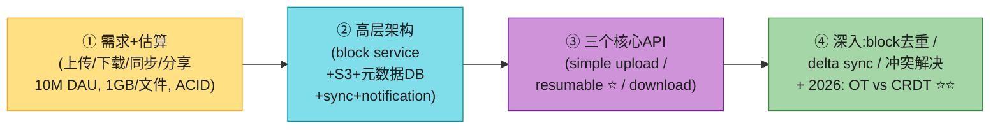

> 💡 **关键信号词**:**主动说出"文件按 4MB 分块、每块算 SHA256 哈希、相同哈希就跳过(去重)"** + **"大文件用 S3 multipart upload 做断点续传,part size 5MB+,每 part 有 ETag"** + **"多端冲突用版本号先到先得,但实时协作用 OT 或 CRDT"**——这三句直接证明你懂这道题的精髓。

> ⚠️ **最大的雷**:原书说"实时协作 out of scope",但面试官**几乎必追问**"那 Google Docs 怎么做?"。如果你只答"先到先得版本号",面试官会觉得你**只懂云盘不懂协作**。本章第 4 节的 OT vs CRDT 是拿 strong hire 的关键。

---

## 🗺️ 章节概览

| 小节 | 要点 | 重要性 |
|------|------|--------|
| 需求 + 估算 | 上传/下载/同步/分享,10M DAU,文件 ≤10GB,ACID 强一致 | ⭐⭐⭐ |
| 从单机演进 | 单机 → 加 LB/web/S3/分库 → 解耦 | ⭐⭐⭐ |
| **高层架构 ⭐** | block service + 对象存储 + 元数据 DB + notification + offline queue | ⭐⭐⭐⭐⭐ |
| **三个核心 API** | simple upload / **resumable upload ⭐**(断点续传)/ download / list_revisions | ⭐⭐⭐⭐⭐ |
| **block service 深入 ⭐** | 分块 + 压缩 + 加密 + delta sync(只传改动的块) | ⭐⭐⭐⭐⭐ |
| 元数据 DB schema | user/device/namespace/file/file_version/block 表 | ⭐⭐⭐⭐ |
| **强一致性(ACID)** | 选关系库;缓存写时失效 | ⭐⭐⭐⭐ |
| 上传 / 下载流程 | 时序图(并行元数据 + 内容) | ⭐⭐⭐⭐ |
| notification service | long polling(Dropbox)vs WebSocket | ⭐⭐⭐⭐ |
| **省存储 ⭐** | 去重 + 智能版本数 + 冷存(S3 Glacier) | ⭐⭐⭐⭐ |
| 失败处理 | 每个组件的 failover | ⭐⭐⭐ |
| **2026:OT vs CRDT ⭐⭐⭐** | 实时协作冲突解决,大厂分水岭 | ⭐⭐⭐⭐⭐ |
| **2026:S3 multipart ⭐** | 断点续传 / 并行上传大文件 / ETag | ⭐⭐⭐⭐⭐ |
| **2026:内容寻址去重 ⭐** | SHA256 作 key,块级 vs 文件级 | ⭐⭐⭐⭐ |
| **2026:加密三模式** | at-rest / in-transit / 客户端 E2E 零知识 | ⭐⭐⭐⭐ |
| **2026:Dropbox delta sync** | 鼻祖架构,只同步变化块 | ⭐⭐⭐⭐ |
| 离线编辑 / 版本 / 大文件 / 分享 | copy-on-write、delta 增量、ACL | ⭐⭐⭐⭐ |
| 与 iCloud/OneDrive 对比 | 各家取舍 | ⭐⭐ |

---

## 1. 需求 + 估算

### 1.1 澄清问题(Step 1 必问)

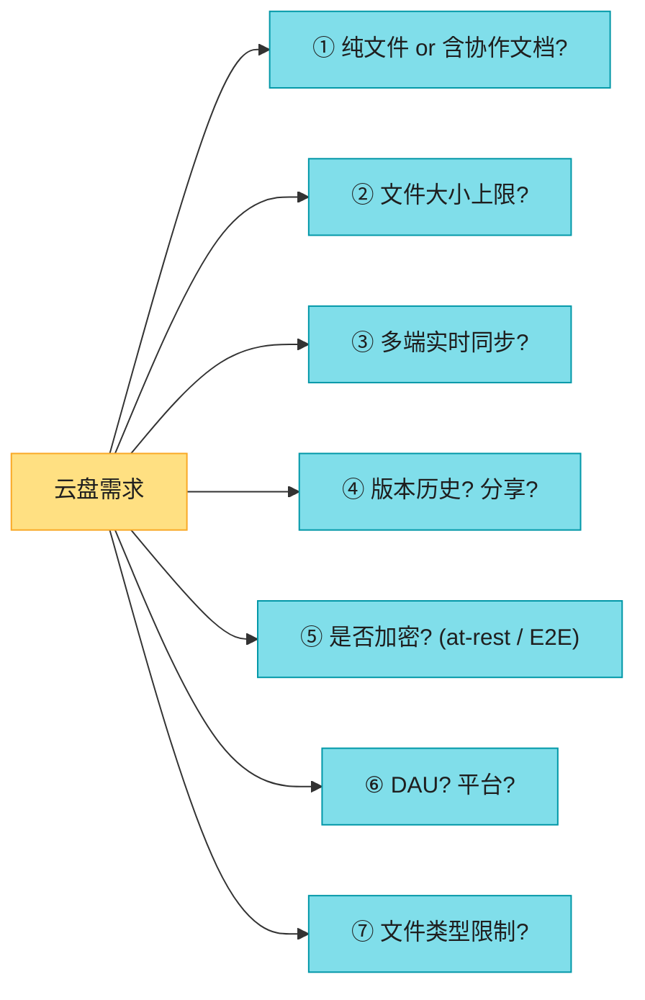

**原书确定的需求**(背):

| 维度 | 确认值 |
|------|--------|
| 范围 | **纯文件**(Google Docs 协作明确 out of scope,但本章补) |
| 文件大小 | ≤ **10 GB**(2026 Google Drive 单文件实际可达 5TB) |
| 加密 | **存储必须加密** |
| 平台 | Web + 移动 |
| 文件类型 | 任意 |
| 规模 | **50M 注册用户,10M DAU** |
| 空间 | 每用户 **10 GB 免费** |

**功能 / 非功能需求**(背熟):

| 需求 | 说明 |
|------|------|
| 上传 / 下载文件 | 拖拽上传,跨端下载 |
| **多端同步** ⭐ | 一端改了,其他端自动拉最新 |
| 文件版本 | 查看历史 revision |
| 分享 | 给朋友 / 同事 |
| 通知 | 文件被改 / 删 / 分享时通知 |
| **可靠性** ⭐⭐ | 数据丢失**不可接受** |
| **快速同步** ⭐ | 同步慢用户会流失 |
| 省带宽 | 移动流量下尤其敏感 |
| 可扩展 / 高可用 | 高流量 + 部分挂了仍可用 |

> 📝 **关键认知**:**云盘是"读 ≈ 写"的系统**(原书假设 1:1),和 Ch13 自动补全(读极重写极轻)相反。所以架构不能偏向读或写,要平衡。**真正的瓶颈不是 QPS,而是带宽和存储**——单文件 1GB、每人 10GB、5000 万用户 = **500 PB**。

### 1.2 估算(背熟)

```
注册用户: 50M,DAU 10M
每用户免费空间: 10 GB
总空间: 50M × 10 GB = 500 PB  ⭐

假设每用户每天上传 2 个文件,平均 500 KB/文件
上传 QPS: 10M × 2 / 86400 ≈ 240
峰值 QPS: × 2 ≈ 480
读写比: 1:1 → 下载 QPS ≈ 上传 QPS ≈ 240
```

> 🔄 **2026 现代版怎么讲**(原书数字偏保守):
> "原书假设平均文件 500KB,但 2026 真实云盘**视频/相册占主导**,平均文件 5-50MB,单文件最大 5TB(Google Drive Workspace)。所以**带宽才是真瓶颈,不是 QPS**。我会按**带宽估算**:10M DAU × 每天上传 100MB(含相册自动备份)= 1 PB/天上传流量,**出口流量按 1:1 也是 1 PB/天**。这是云盘成本的大头——所以**delta sync 和去重在 2026 是省钱的命门**。"

> 🪤 **追问陷阱**:"500PB 怎么存?" → "**对象存储(S3) + 冷热分层**。热数据(近 30 天访问)放 S3 Standard,冷数据(数月未访问)沉到 S3 Glacier(便宜 10×)。再加**去重**(块级 SHA256 去重,常见文件只存一份)和**压缩**。真实云盘的去重收益能到 **30-60%**(用户大量重复存系统镜像/安装包)。"

---

## 2. 从单机演进(Ch1 风格的暖场)

原书用"渐进式叙事"开头(和 Ch1 一脉相承),先从一台机器开始,逐步发现问题。

### 第 0 集:单机

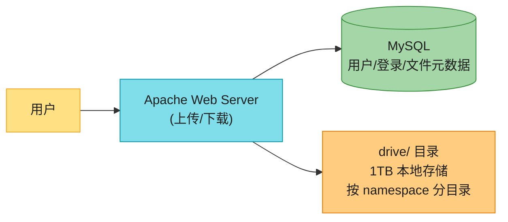

**目录布局**(Fig 15-3):`drive/<namespace>/<相对路径>`。namespace = 用户根目录,加相对路径唯一标识一个文件。

> 📝 **namespace**:用户的根目录。每个用户的文件隔离在自己的 namespace 下。

**第 0 集痛点**:① 单机存储 1TB,500PB 需求**根本放不下**;② 单机是 SPOF,挂了数据丢;③ 上传/下载抢 web 资源。

### 第 1 集:存储告急 → 分片 + S3

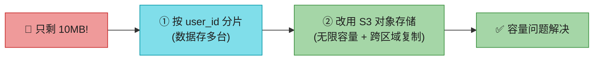

> 📝 **Amazon S3(Simple Storage Service)**:对象存储。**bucket = 文件夹**(概念上的),存的是对象(object)。S3 提供:**同区域复制 + 跨区域复制(Cross-Region Replication)**——同一份文件存多个地理区域,防数据丢失。这是云盘"数据不可丢"的根基。

> 💡 **为什么是 S3 不是块存储?** 对象存储**天然适合大文件、写一次读多次、无限水平扩展**;按用量计费(GB × 月 + 请求次数)。云盘 99.9% 的文件是"写一次读多次",完美匹配 S3 模型。详见第 8 节"S3 multipart"。

### 第 2 集:解耦 → LB + 多 web + 独立 DB + S3

把 web / DB / 文件存储彻底解耦(接 Ch1 第 1-2 集):

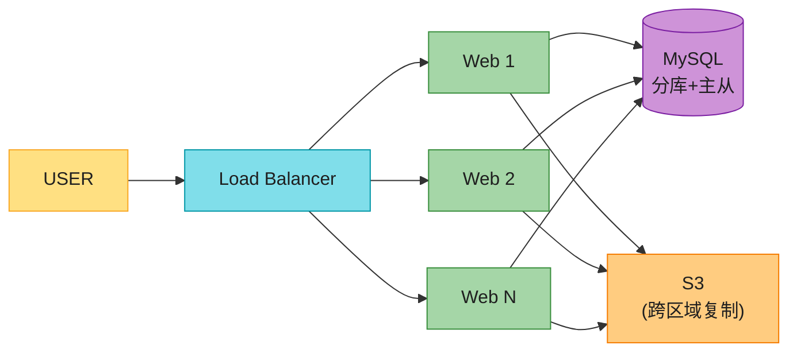

### 同步冲突(sync conflicts)——引出本章核心难点之一

两用户**同时改同一文件**怎么办?原书给的是**"先到先得 + 版本号"**:

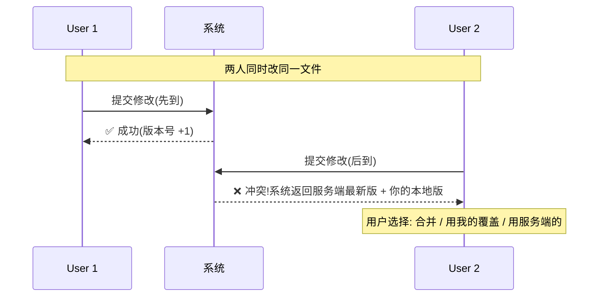

> ⚠️ **原书的局限**:这是 **LWW(Last-Write-Wins 的退化版)+ 人工合并**——文件级、异步、用户体验差(冲突了要手动选)。**对纯文件(Word/Excel 离线编辑)够用,但 Google Docs 这种实时协作根本不能这么干**(每打一个字都冲突,用户会疯)。**这是引出 OT/CRDT 的关键铺垫**,详见第 4 节。

---

## 3. 高层架构 ⭐⭐⭐⭐⭐

原书的高层架构图(Fig 15-10)是这道题的**面试标准答案**,必须会画:

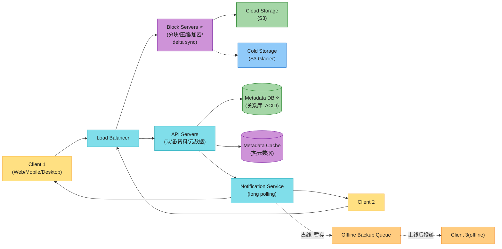

**9 个核心组件**(背熟):

| 组件 | 职责 | 关键点 |
|------|------|--------|
| **Client** | 用户在 Web/Mobile/Desktop 用 App | 桌面端有本地副本(离线可用) |
| **Block Servers ⭐** | 上传块到云存储:**分块 + 压缩 + 加密 + delta sync** | 本章灵魂之一(第 4 节深入) |
| **Cloud Storage(S3)** | 存文件块 | 跨区域复制,防丢失 |
| **Cold Storage** | 存冷数据(久未访问) | S3 Glacier,便宜 10× |
| **Load Balancer** | 分发请求 | 健康检查 + failover |
| **API Servers** | 一切非上传的逻辑:认证、资料、元数据更新 | 无状态,可水平扩展 |
| **Metadata DB ⭐** | 存元数据:user/file/block/version | **关系库**(要 ACID,见第 5 节) |
| **Metadata Cache** | 热元数据缓存 | Redis,加速读 |
| **Notification Service** | 文件变动时通知相关客户端 | long polling(Dropbox) |
| **Offline Backup Queue** | 客户端离线时暂存通知 | 上线后投递 |

> 📝 **名词注释**
> - **Block storage(块存储)** vs **Object storage(对象存储)** vs **File storage(文件存储)**:三个易混的存储术语。**块存储**(EBS)给虚拟机当硬盘用,随机读写快;**对象存储**(S3)存大对象,HTTP API 访问,无限扩展;**文件存储**(EFS/NFS)提供文件系统语义,多机共享。**云盘用对象存储存文件内容 + 关系库存元数据**——这是标准分层。
> - **Cold storage(冷存储)**:存"几个月甚至几年没人访问"的数据。**S3 Glacier** 检索要分钟到小时级,但价格只有 S3 Standard 的 1/10。云盘的历史版本、归档文件沉到冷存。
> - **Long polling(长轮询)**:客户端发请求,服务器**hold 住不返回**,直到有事件或超时。客户端收到后立刻再发新请求(接 Ch12 第 2 集)。Dropbox 用它做通知。

---

## 4. 三个核心 API ⭐⭐⭐⭐⭐

### 4.1 上传 API(simple vs resumable ⭐)

原书定义两种上传:

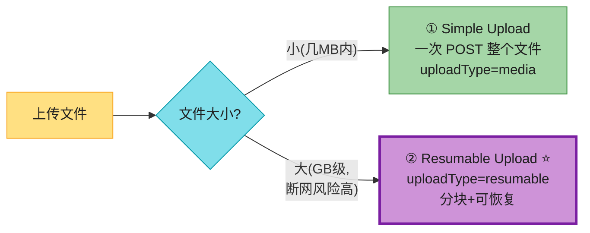

**Resumable upload 三步流程**(Fig,背熟):

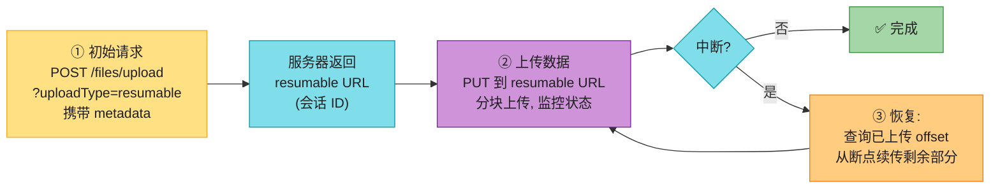

> 📝 **Resumable upload(断点续传)** 的价值:① **网络中断可恢复**——上传 1GB 时断网,恢复后从断点继续,**不用重传整个文件**;② **大文件可靠**——GB 级文件几乎不可能一次成功;③ **可查询进度**——客户端随时查"已上传到第几个 byte"。这是 **S3 multipart upload** 的应用层封装(第 8 节深入)。

> 💡 **关键话术**:"上传流程我会**分两种**:小文件(<5MB)用 simple upload 一次 POST,省一次往返;大文件一律走 resumable——**先发 metadata 拿到 session URL,再分块 PUT,每块带 Content-Range**。断点续传靠的是服务器记的'已上传 offset',客户端断了重连先查 offset 再续。这是 S3 multipart 和 Google Drive API 的标准做法。"

### 4.2 下载 API

```
POST https://api.example.com/files/download
Params:
{
  "path": "/recipes/soup/best_soup.txt"
}
```

下载逻辑:① 客户端通过 notification 知道文件变了;② 拉 metadata(block 列表);③ 从 S3 拉缺失的块;④ 拼装成完整文件。

### 4.3 文件版本 API

```
POST https://api.example.com/files/list_revisions
Params:
{
  "path": "/recipes/soup/best_soup.txt",
  "limit": 20
}
```

返回该文件的历史版本列表(每个版本对应一组 block)。所有 API 都走 **HTTPS(SSL/TLS)** + 用户认证。

---

## 5. 深入:block service ⭐⭐⭐⭐⭐(本章灵魂之一)

对**频繁更新的文件**,每次改一个字就重传整个文件是**带宽灾难**。Block service 的两个核心优化:

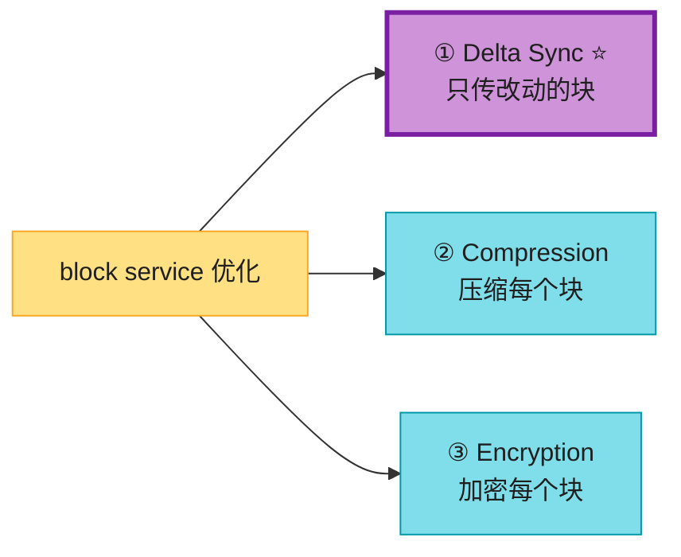

### 5.1 新文件上传:分块 + 压缩 + 加密(Fig 15-11)

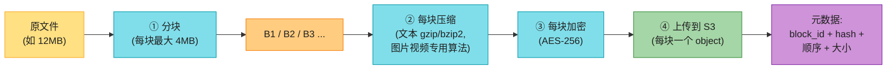

> 📝 **block size 选 4MB 的原因**(原书引 Dropbox):① **太大** → delta sync 收益小(改一个字也要重传大块);② **太小** → 元数据爆炸(一个 1GB 文件 25 万个块,元数据 DB 撑不住);③ **4MB 是 Dropbox 实测的最优值**——在"delta sync 收益"和"元数据开销"间平衡。

### 5.2 Delta sync ⭐(Fig 15-12)——只传改动的块

文件被修改,只上传**变化的块**:

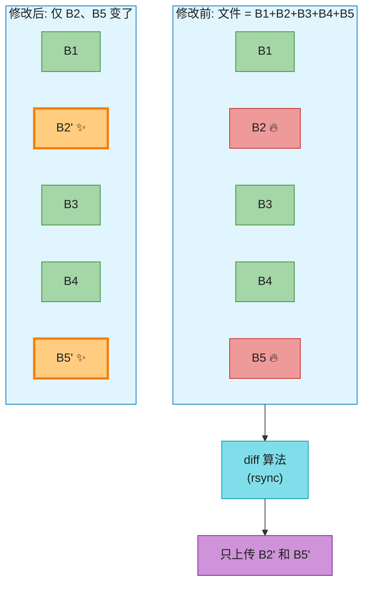

> 📝 **rsync 算法**:Tridgell & Mackerras 1996 年提出。核心是**滚动哈希 + 强哈希**找出文件中变化的块,**只传输变化部分**。Dropbox / rsync / librsync 都基于它。Delta sync 让"改一个字"只传 4MB(变化的块),而不是整个文件。

> 💡 **delta sync 的真实价值**(背):对一个**频繁改的 1GB 文件**,没有 delta sync 每次改都要传 1GB;有了 delta sync(4MB 块),改一段文字只传 **1-2 个块 = 4-8MB**——**带宽节省 99%+**。这是云盘在弱网/移动网络下能用的根基。

### 5.3 高一致性要求(ACID)

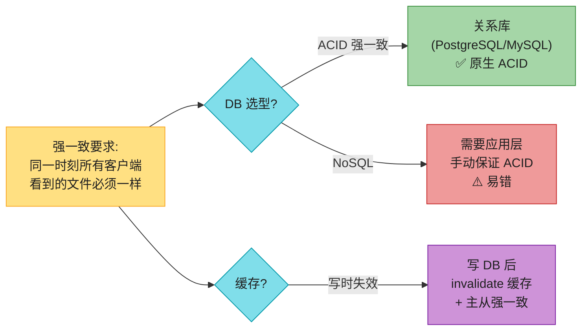

> 💡 **原书的关键判断**:**云盘必须强一致**(同一文件不能在不同端显示不同版本)→ **选关系库**(ACID 原生支持)+ **缓存写时失效**(写 DB 后立即 invalidate 缓存,确保缓存和 DB 一致)。**不用 NoSQL**(ACID 要应用层实现,易错)。这是接 Ch1 第 1 集"SQL vs NoSQL"决策的实际应用——**强一致需求 → SQL**。

> 🪤 **追问陷阱**:"缓存和 DB 不一致怎么办?" → "**写时失效**(invalidate,不是 update)+ 主从强一致同步。这接 Ch1 第 4 集 Cache-Aside 的标准做法。注意是**删缓存不是改缓存**——避免并发更新顺序问题。"

---

## 6. 元数据 DB Schema ⭐⭐⭐⭐(Fig 15-13)

原书的简化 schema,5 张核心表:

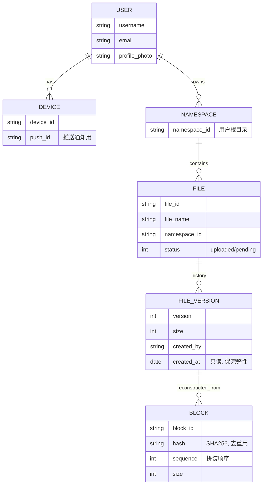

| 表 | 用途 | 关键点 |
|------|------|--------|
| **user** | 用户基本信息 | username/email/profile |
| **device** | 设备信息 | **一个用户多设备**;push_id 用于移动推送(接 Ch10) |
| **namespace** | 用户根目录 | 隔离用户文件 |
| **file** | 最新文件信息 | file_name/status |
| **file_version** | 版本历史 | **只读**(保完整性,不能改历史) |
| **block** | 文件块信息 | hash 用于去重;sequence 用于拼装 |

> 💡 **关键设计**:**file_version 表只读**——历史版本不能改,保证 revision history 完整可信。重建某版本 = 按 sequence 顺序 join 所有 block。这是接 Ch6 LSM "多版本" 思想的简化版。

> 🪤 **追问陷阱**:"block 表为什么要存 hash?" → "**去重**——两个 block 的 hash 相同就是内容相同(哈希碰撞概率忽略不计),只在 S3 存一份,引用计数 +1。这是块级去重的核心(第 9 节深入)。"

---

## 7. 上传 / 下载流程 ⭐⭐⭐⭐

### 7.1 上传流程时序图(Fig 15-14)⭐

客户端**并行**发两个请求:**① 加文件元数据** + **② 上传文件内容**。

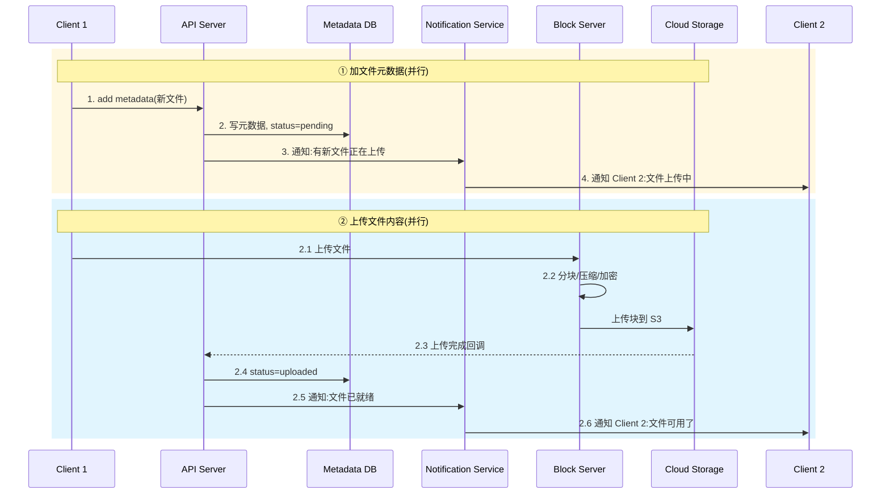

> 💡 **为什么要并行两个请求?** 元数据先入库(status=pending)是为了让**其他客户端立刻知道"有文件在传"**(避免重复上传)。内容传完后回调把 status 改成 uploaded,再通知其他客户端"可以下载了"。**两阶段通知 = 用户体验更好**(看到"上传中"而不是干等)。

### 7.2 下载流程时序图(Fig 15-15)⭐

下载由 **notification 触发**——客户端被告知"别处改了文件",主动拉取。

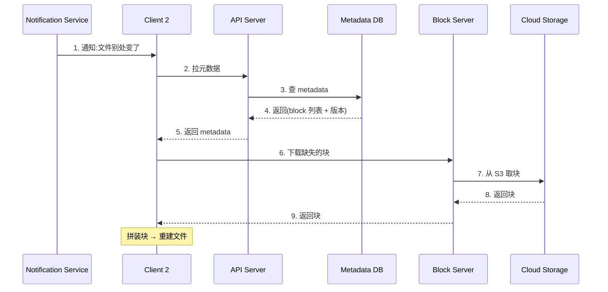

> 💡 **关键认知**:**下载是"拉"模型**——客户端被通知后主动拉。不是服务器推文件内容(推文件会浪费带宽,客户端可能根本不需要)。**通知只是"信号",实际数据靠客户端按需拉**。这接 Ch11 Feed 的拉模型思想。

---

## 8. Notification Service ⭐⭐⭐⭐

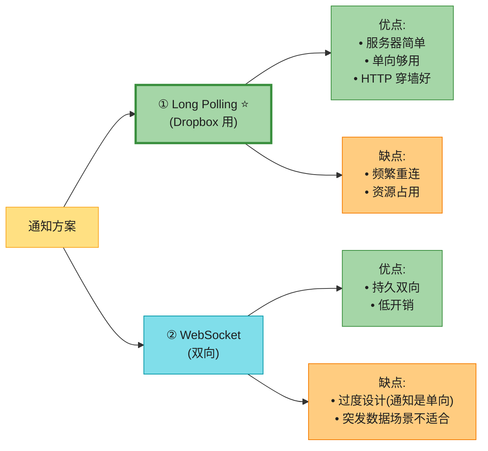

> 💡 **原书的关键选择**:**用 long polling 不用 WebSocket**。理由:① 通知是**单向**(服务器→客户端),不需要双向;② WebSocket 是为**实时双向突发通信**(如聊天)设计的,云盘通知**频率低、无突发**,long polling 更合适。接 Ch12 第 2 集——**聊天必须 WebSocket,云盘 long polling 够用**。

> 🪤 **追问陷阱**:"long polling 不是更耗资源吗?" → "单连接看 long polling 略耗(频繁重连),但**云盘通知频率低**(一天就几次),WebSocket 反而是**过度工程**——要保持双向连接、处理心跳、做路由。**按场景选协议**:聊天用 WebSocket,云盘用 long polling。Dropbox 实测有效。"

> 🔄 **2026 现代版怎么讲**(原书停在 long polling):
> "long polling 是 Dropbox 2012 年的方案。2026 我会**按场景分**:① **桌面端 / Web**:用 **WebSocket 或 Server-Sent Events(SSE)**——现代浏览器对 SSE 支持好,单向推送正合适,比 long polling 省资源;② **移动端**:用 **FCM/APNS 推送**(系统级,App 不用常驻);③ **极端实时**:才用 WebSocket。原书的 long polling 现在已偏旧,主流是 **SSE + 推送**组合。"

---

## 9. 省存储空间 ⭐⭐⭐⭐(云盘成本命门)

云盘要存**多版本 + 跨区域复制**,存储成本爆炸。原书给三种优化:

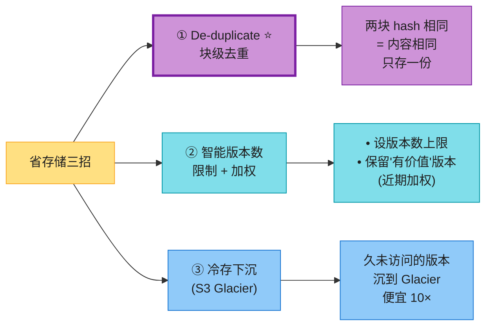

### 9.1 去重 dedup ⭐

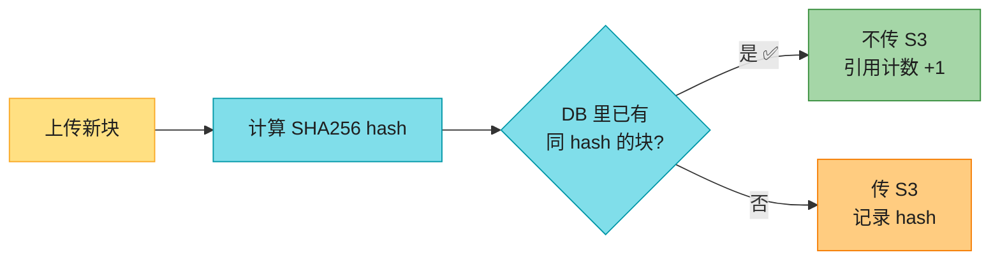

> 💡 **去重的真实收益**:**账号级去重**——同一账号内、不同账号间,重复的系统镜像/安装包/视频只存一份。Dropbox/Google Drive 的去重收益**公开数据是 25-40%**。**跨用户去重**有隐私争议(E2E 加密后无法去重,见第 12 节)。

### 9.2 智能版本数

- **设上限**:版本超过 N 个,最旧的被替换。
- **保留有价值版本**:频繁改的文档(可能 1000 次编辑)不能全存——给**近期版本更高权重**,合并相邻的小改动。

### 9.3 冷存下沉

久未访问的历史版本沉到 **S3 Glacier**(检索分钟级,价格 1/10)。

---

## 10. 失败处理

| 组件失败 | 处理 |
|---------|------|
| **Load balancer** | 备用 LB 通过**心跳**接管(接 Ch1 第 2 集) |
| **Block server** | 其他 server 接手未完成的 job |
| **Cloud storage(S3)** | 跨区域复制,某 region 挂了从其他 region 取 |
| **API server** | 无状态,LB 重定向到其他 |
| **Metadata cache** | 多副本,挂一个还有其他;拉起新的补 |
| **Metadata DB master** | 提升 slave 为新 master,拉新 slave(接 Ch1 第 3 集) |
| **Metadata DB slave** | 用其他 slave 读,拉新 slave 补 |
| **Notification service** ⭐ | 单机扛 **100 万+连接**(Dropbox 2012 数据);挂了所有客户端重连,**不能一次全连**(慢)→ 客户端**退避重连**(backoff) |
| **Offline backup queue** | 多副本;一个 queue 挂了消费者重订阅备份 |

> 🪤 **追问陷阱**:"notification server 挂了,百万连接全断,怎么避免重连风暴?" → "**指数退避 + 随机抖动**——客户端随机延迟 1-30 秒再重连,避免同时打到服务器。这是接 Ch4 限流思想在客户端的应用。这也是为什么云盘要把'在线/离线'拆成独立 presence service(原书 Step 4 建议)。"

---

## 11. 收尾 + 原书的设计权衡

原书 Step 4 讨论了两个有趣的设计选择:

### 选择 1:客户端直传 S3 还是经过 block server?

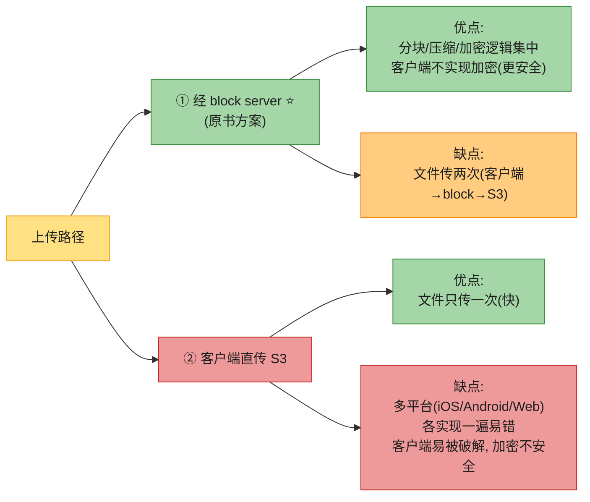

> 💡 **原书选择**:经 block server——**安全 + 集中**胜过"传两次"的代价。**客户端不可信**(易被破解),加密逻辑不能放客户端。这是接 Ch1"信任边界"的设计原则。

> 🔄 **2026 现代版话术**:"2026 我会重新评估:① **预签名 URL(presigned URL)** 让客户端直传 S3 但不暴露密钥——S3 标准做法,**解决了原书的安全顾虑**;② 客户端用 **WASM/WebCrypto** 实现分块加密,跨平台一致性。**Google Drive / Dropbox 现在都让大文件直传**(省一次带宽),小文件仍走 API。原书的'必须经 block server'在 2026 已不是铁律。"

### 选择 2:把在线/离线逻辑拆成独立 presence service

> 💡 **原书建议**:把 online/offline 检测从 notification service 拆出去,做成独立的 **presence service**——这样其他服务(分享、协作)也能复用在线状态。接 Ch12 第 5 节"在线状态"——**presence 是 IM/云盘/协作的共享基建**。

---

## 12. ⭐⭐⭐ 2026 增量 1:OT vs CRDT(实时协作冲突解决)——大厂分水岭题

原书把"Google Docs 协作"标为 out of scope,但这是**大厂面试的高频追问**——也是 ch15 和 ch12(聊天)的交汇点。如果两个用户**同时实时编辑**同一个文档,版本号"先到先得"根本行不通(每打一个字都冲突)。这就是 **OT 和 CRDT** 的战场。

### 12.1 为什么"先到先得"在实时协作下崩溃

> 💡 **核心痛点**:文档当前是 "HELLO",Alice 想在开头加 "W"(并发 insert(0,"W")),Bob 想在结尾加 "!"(并发 insert(5,"!"))。LWW 会丢掉其中一个人的字——**用户每秒打 5 个字,冲突频率 5 次/秒**,LWW/版本号根本行不通。需要一种**能合并并发操作、且不丢数据**的算法。这就是 **OT** 和 **CRDT**。

### 12.2 方案 A:OT(Operational Transformation,操作变换)⭐

> 📝 **OT(操作变换)**:Google Docs、Office 365、Etherpad 用的方案。核心思想——**客户端发"操作"(insert/delete),服务器对并发操作做"变换(transform)",让所有副本最终一致**。**中心化,需要服务器仲裁**。

**OT 的核心:transform 函数**

两个并发操作 T1、T2,要算 T1' = transform(T1, T2),使得"先做 T2 再做 T1'"等价于"先做 T1 再做 T2'"。**变换让并发操作可以无冲突地按不同顺序应用**。

**手算例子**(背):

```
初始文档: "AB"
Alice 操作 T1: insert(1, "x")  → 想变成 "AxB"
Bob   操作 T2: insert(2, "y")  → 想变成 "ABy"

两操作并发。若服务器先做 T1 再做 T2:
  做 T1: "AB" → "AxB"   (在位置1插x)
  做 T2 原样: 在位置2插y → "AxyB" ❌  (Bob想插在B前, 但位置漂移了!)

OT 的解法 —— transform:
  T2' = transform(T2, T1) = insert(3, "y")  (因为T1在T2前面插了1个字符, T2位置+1)
  先做 T1: "AB" → "AxB"
  再做 T2': 在位置3插y → "AxBy" ✅

反过来若服务器先做 T2:
  T1' = transform(T1, T2) = insert(1, "x")  (T2在T1后面插, T1位置不变)
  先做 T2: "AB" → "ABy"
  再做 T1': 在位置1插x → "AxBy" ✅

两种顺序 → 同一结果 "AxBy"。这就是 OT 的魔力:transform 让并发操作可以无冲突地按不同顺序应用。
```

**OT 的难点**(面试常被追问):

| 难点 | 说明 |
|------|------|
| **transform 函数极难正确实现** | 任意两个操作的组合都要覆盖(insert+insert / insert+delete / delete+delete),边界条件爆炸。**Google Docs 团队写了大量论文 + 多年调试**才稳定 |
| **需要中心化服务器仲裁** | 操作要经过服务器排序、变换,再广播。**没法去中心化** |
| **不支持离线长时间编辑** | 客户端离线几小时后重连,要重放大量操作,变换栈爆炸 |
| **收敛性证明复杂** | 要证明"任意操作序列最终收敛到同一状态"(CP1/CP2/CP3 性质) |

### 12.3 方案 B:CRDT(无冲突复制数据类型)⭐

> 📝 **CRDT(Conflict-free Replicated Data Type,无冲突复制数据类型)**:Notion、Figma、Yjs、Automerge 用的方案。核心思想——**数据结构本身设计成"任意合并顺序都收敛"**,不需要服务器仲裁。**去中心化,P2P 友好**。分两大类:**① 状态型(CvRDT)**——合并函数 `merge(s1,s2)` 满足交换/结合/幂等(例:G-Counter、OR-Set);**② 操作型(CmRDT)**——每个操作带唯一 ID,任意顺序应用都一致(例:文本编辑)。接 Ch1 第 6 集提到的 CRDT——这里展开。

**① G-Counter(增长计数器)** ——接 Ch1 第 6 集:

每个节点维护自己的计数向量。例 3 个节点:

```
节点 A: [3, 0, 0]   (A 自己 +3 次)
节点 B: [0, 2, 0]   (B 自己 +2 次)
节点 C: [0, 0, 5]   (C 自己 +5 次)
合并: merge = [max(3,0,0), max(0,2,0), max(0,0,5)] = [3, 2, 5]
总值 = 3 + 2 + 5 = 10 ✅
```

**为什么 G-Counter 不丢数据?** `max` 函数满足**交换律 + 结合律 + 幂等**——任意合并顺序都得到相同结果。**两个 +1 都被保留**,而 LWW 会丢一个。这是接 Ch1"粉丝数用 G-Counter"的展开。

**② OR-Set(Observed-Remove Set)** ——用于"集合"协作(如待办清单):

加元素时给它一个**唯一 tag**(UUID);删元素时只删"已经看到的 tag"。并发的 add 和 remove 不会冲突——add 赢(因为 delete 没看到这个新 tag)。

**③ 文本 CRDT(RGA / Treedoc / Logoot)** ——用于富文本协作(Figma/Notion):

每个字符带**唯一 ID + 逻辑时钟**,字符间用**偏序关系**排序。任意两个客户端按相同规则插入,最终顺序一致。

**手算:CRDT 文本合并**

```
初始: 字符序列带 ID:  H(1) E(2) L(3) L(4) O(5)
Alice 在位置1插 "x",tag=A1: H(1) x(A1) E(2) L(3) L(4) O(5)
Bob   在位置2插 "y",tag=B1: H(1) E(2) y(B1) L(3) L(4) O(5)

合并时, CRDT 按 ID 排序规则决定 x(A1) 和 y(B1) 的相对位置:
  规则: 新字符附在它的"前驱"之后, 若同前驱则按 tag 比较
  x(A1) 的前驱是 H(1), y(B1) 的前驱也是 H(1)(因为Bob离线时H是最新)
  → 同前驱, 按 tag 排: A1 < B1 → x 在 y 前
  最终: H x y E L L O ✅ (两边的字都没丢)

关键: 不管 Alice 和 Bob 谁先到达, 合并结果都是 "HxyELLO"。
```

### 12.4 OT vs CRDT 决策表(背熟,面试必答)⭐⭐

| 维度 | **OT** | **CRDT** |
|------|--------|----------|
| **思想** | 服务器变换并发操作 | 数据结构天生可合并 |
| **架构** | **中心化**(需服务器仲裁) | **去中心化**(P2P 友好) |
| **离线编辑** | 弱(重放操作栈爆炸) | **强**(可长时间离线) |
| **实现难度** | transform 函数极难(多年调试) | 数据结构复杂但有现成库(Yjs/Automerge) |
| **延迟** | 低(服务器快速广播) | 中(元数据开销) |
| **谁用** | **Google Docs / Office 365 / Etherpad** | **Notion / Figma / Yjs / Automerge** |
| **元数据开销** | 小(只存操作) | 大(每个字符带 ID/tag) |
| **历史** | 1989 论文,Google 2006 落地 | 2011 论文,2018 后才工程化 |

```mermaid
flowchart TD
    Q["实时协作选型"] --> A{"要离线编辑?"}
    A -->|"是, 长时间离线"| CRDT["CRDT ⭐<br/>(Notion/Figma)"]
    A -->|"否, 实时为主"| B{"要中心化控制?"}
    B -->|"是(审查/权限)"| OT["OT ⭐<br/>(Google Docs)"]
    B -->|"否, P2P"| CRDT
    CRDT --> CRDT_LIB["用现成库:<br/>Yjs / Automerge"]
    OT --> OT_LIB["用现成库:<br/>ShareDB / OT.js"]

    style Q fill:#FFE082,stroke:#F9A825,color:#1f1f1f
    style A fill:#80DEEA,stroke:#0097A7,color:#1f1f1f
    style B fill:#80DEEA,stroke:#0097A7,color:#1f1f1f
    style CRDT fill:#CE93D8,stroke:#7B1FA2,color:#1f1f1f
    style OT fill:#A5D6A7,stroke:#388E3C,color:#1f1f1f
    style CRDT_LIB fill:#90CAF9,stroke:#1976D2,color:#1f1f1f
    style OT_LIB fill:#90CAF9,stroke:#1976D2,color:#1f1f1f
```

> 💡 **面试话术**:"Google Docs 用 **OT**(中心化,服务器仲裁,适合实时+审查),Notion/Figma 用 **CRDT**(去中心化,支持长时间离线编辑)。**2026 的趋势是 CRDT**——Yjs/Automerge 这些库成熟后,CRDT 的工程难度大幅下降,而且天然支持离线 + P2P。但**文档编辑这种'字符级元数据开销'敏感的场景,OT 仍有优势**(Google 不会轻易换)。**别自己实现 OT 或 CRDT**——transform 函数和 CRDT 数据结构都极难,用现成库。"

> 🪤 **追问陷阱 1**:"为什么 Google Docs 用 OT 不用 CRDT?" → "**历史原因 + 元数据开销**。Google 2006 年开始做 Docs 时 CRDT 还不成熟,选了 OT,十几年积累的稳定性不会轻易换。另外 CRDT 每个字符带 ID/tag,**元数据膨胀**(对超长文档,元数据可能和正文一样大),Google 觉得不划算。**但新出的协作产品(Figma/Notion)都选 CRDT**。"

> 🪤 **追问陷阱 2**:"CRDT 真的不会冲突吗?" → "**不会**——这是数学证明的(CRDT 的 merge 满足交换/结合/幂等)。但代价是 **元数据开销大** + **某些语义需要妥协**(比如不能严格保证'用户最后看到的版本'就是最终版本,只能保证最终收敛)。**没有银弹**。"

> 🪤 **追问陷阱 3**:"那云盘(非协作)为什么不用 CRDT?" → "**没必要**——纯文件是'整块替换',LWW + 人工合并就够。CRDT 是为'细粒度字符级并发编辑'设计的,文件级别用 CRDT 是过度工程。**协作文档才需要 CRDT/OT,纯文件用版本号 + 人工合并**。这正是原书把协作标 out of scope 的原因——但面试官会追问。"

---

## 13. ⭐ 2026 增量 2:S3 multipart upload / 断点续传

原书只说"用 S3",没讲 S3 **multipart upload**——这是大文件上传的核心机制,也是 resumable upload 的底层实现。

### 13.1 multipart upload 三步

```mermaid
flowchart LR
    S1["① CreateMultipartUpload<br/>初始化, S3 返回 uploadId"] --> S2["② UploadPart<br/>每个 part 单独 PUT<br/>S3 返回 ETag"]
    S2 --> S3["③ CompleteMultipartUpload<br/>提交所有 part 的 ETag 列表<br/>S3 拼装成完整对象"]
    S3 --> DONE["✅ 对象可读"]

    S2 -.->|"中断"| S4["AbortMultipartUpload<br/>或后续续传<br/>(凭 uploadId)"]

    style S1 fill:#FFE082,stroke:#F9A825,color:#1f1f1f
    style S2 fill:#CE93D8,stroke:#7B1FA2,color:#1f1f1f
    style S3 fill:#80DEEA,stroke:#0097A7,color:#1f1f1f
    style DONE fill:#A5D6A7,stroke:#388E3C,color:#1f1f1f
    style S4 fill:#FFCC80,stroke:#F57C00,color:#1f1f1f
```

**关键参数**(背):

| 参数 | 值 | 说明 |
|------|------|------|
| **part size** | **5 MB ~ 5 GB**(最后一块可小于 5MB) | part size 越大,请求数越少;越小,中断损失越小 |
| **最大 part 数** | **10,000** | 单对象最大 = 10000 × 5GB = **5 TB** |
| **ETag** | 每个 part 的 MD5/哈希 | 用于**校验完整性 + 续传定位** |

### 13.2 multipart 的三大价值

```mermaid
flowchart LR
    MP["S3 multipart upload"] --> V1["① 断点续传 ⭐<br/>中断的 part 重传,<br/>已成功的 part 不重传"]
    MP --> V2["② 并行上传 ⭐<br/>多 part 并发 PUT,<br/>大文件吞吐 ×N"]
    MP --> V3["③ 校验完整性<br/>每 part 的 ETag 校验,<br/>Complete 时全部验证"]

    style MP fill:#FFE082,stroke:#F9A825,color:#1f1f1f
    style V1 fill:#CE93D8,stroke:#7B1FA2,color:#1f1f1f,stroke-width:3px
    style V2 fill:#CE93D8,stroke:#7B1FA2,color:#1f1f1f,stroke-width:3px
    style V3 fill:#80DEEA,stroke:#0097A7,color:#1f1f1f
```

> 💡 **断点续传怎么实现**(背):① 客户端上传前调 CreateMultipartUpload 拿 uploadId;② 把文件切成 N 块,每块带 partNumber PUT;③ 中断了,客户端**重新 list 已上传的 part**(凭 uploadId),只传缺失的;④ 全部成功后 Complete,带所有 ETag。**uploadId 是会话标识,S3 保存所有 part 状态直到 Complete 或 Abort**。

> 💡 **并行上传**:10 GB 文件切成 100 个 100MB part,**10 个并发上传,吞吐提升近 10 倍**。这是大文件传输的标配。

> 🪤 **追问陷阱**:"part size 怎么选?" → "**5MB 是下限**(S3 硬规定);**实际选 part size = max(5MB, 文件大小 / 10000)**——保证 part 数不超 10000 上限。常见选 **8-16MB**(平衡请求数和中断损失)。大文件(GB 级)用更大 part,TB 级必须用接近 5GB 的 part。"

> 🪤 **追问陷阱**:"ETag 是什么?和 hash 一样吗?" → "**ETag 是 S3 给每个对象/part 的标识**。简单上传时 ETag 通常是 MD5;**multipart 上传时 ETag 是各 part MD5 拼接后再 MD5 + `-part数`**(如 `abc-5`)。所以**判断 multipart 对象是否相同不能只比 ETag**——要分别算各 part 的 hash。这是云盘去重要注意的坑。"

---

## 14. ⭐ 2026 增量 3:内容寻址存储 + 块级 vs 文件级去重

原书的去重只说"hash 相同就跳过",但**真实世界的去重是分层 + 内容寻址的**。

### 14.1 内容寻址存储(Content-Addressable Storage, CAS)

```mermaid
flowchart LR
    TRAD["传统: 路径寻址<br/>key = /user/alice/file.txt"] -.->|"内容改了<br/>路径不变"| TRAD2["覆盖旧内容"]
    CAS["内容寻址 ⭐<br/>key = SHA256(内容)"] -.->|"内容改了<br/>hash 变"| CAS2["新 key, 旧 key 还在"]

    style TRAD fill:#FFCC80,stroke:#F57C00,color:#1f1f1f
    style TRAD2 fill:#FFCC80,stroke:#F57C00,color:#1f1f1f
    style CAS fill:#CE93D8,stroke:#7B1FA2,color:#1f1f1f,stroke-width:3px
    style CAS2 fill:#CE93D8,stroke:#7B1FA2,color:#1f1f1f
```

> 📝 **内容寻址存储(CAS)**:**用内容的 hash 作为存储 key**(如 `sha256:abc123...`)。**内容相同 = key 相同 = 只存一份**,天然去重。**Git 就是 CAS**——每个 commit/tree/blob 都用 SHA 哈希寻址。**Docker 镜像层、IPFS、Caserta 都是 CAS**。云盘的 block 用 hash 寻址 = CAS 思想。

### 14.2 块级 vs 文件级去重

```mermaid
flowchart LR
    DEDUP["去重粒度"] --> F["① 文件级<br/>(整文件 hash)"]
    DEDUP --> B["② 块级 ⭐<br/>(每块 hash)"]

    F --> F1["收益低:<br/>改一个字 = 整文件 hash 变<br/>= 完全不同的文件"]
    B --> B1["收益高 ⭐:<br/>两文件大部分块相同<br/>只存差异块"]

    style DEDUP fill:#FFE082,stroke:#F9A825,color:#1f1f1f
    style F fill:#FFCC80,stroke:#F57C00,color:#1f1f1f
    style B fill:#A5D6A7,stroke:#388E3C,color:#1f1f1f,stroke-width:3px
    style F1 fill:#EF9A9A,stroke:#C62828,color:#1f1f1f
    style B1 fill:#A5D6A7,stroke:#388E3C,color:#1f1f1f
```

**手算对比**(背):

```
场景: 1000 个用户各自存了一份"10MB 的 PDF",每个人改了 1 个字(改了 1 个块 = 4MB)

文件级去重:
  hash 不同(每个改了一点) → 1000 个文件全存 → 10GB ❌

块级去重 ⭐:
  9 个块相同(hash 一致)只存 1 份 = 36MB
  1 个块不同 × 1000 用户 = 4GB
  总计 ≈ 4GB(节省 60%) ✅
```

> 💡 **为什么云盘必须块级去重**:① **delta sync 本身就产生了块**——去重是免费搭车;② 用户大量存"几乎相同"的文件(同一文档多版本、系统镜像、安装包),**块级去重收益 30-60%**,文件级只有 5-10%;③ **块级去重和版本历史天然兼容**——多个版本共享大部分块。

> 🪤 **追问陷阱**:"去重有隐私风险吗?" → "**有**——**跨用户去重会让用户知道'别人也有这个文件'**(通过 hash 探测)。早期 Dropbox 跨用户去重,有人用它**探测文件是否存在**(上传一个敏感文件,如果秒传成功,说明别人也存过)。**E2E 加密后无法跨用户去重**(每个用户的密钥不同,密文 hash 不同)——这是零知识云盘(Tresorit/Mega)的成本。详见第 16 节加密。"

---

## 15. ⭐ 2026 增量 4:Dropbox 的块级同步架构(鼻祖)

Dropbox 是云盘鼻祖,它的架构是这道题的"参考实现"。Dropbox 2012 的工程演讲("How We've Scaled Dropbox")是必读。

```mermaid
flowchart LR
    C["客户端<br/>(本地文件系统监视器<br/>inotify/FSEvents)"] -->|"文件变动"| CH["Channel Server<br/>(长轮询入口)"]
    CH --> MS["Metadata Server<br/>(元数据)"]
    MS --> DB[("MySQL<br/>分片")]
    C -->|"上传变化块"| BS["Block Server<br/>(分块/压缩/加密)"]
    BS --> S3["S3"]
    BS --> B["Bloom Filter<br/>(快速判断块是否已存)"]

    MS --> NS["Notification<br/>(通知其他端)"]
    NS --> C2["其他设备"]

    style C fill:#FFE082,stroke:#F9A825,color:#1f1f1f
    style CH fill:#80DEEA,stroke:#0097A7,color:#1f1f1f
    style MS fill:#80DEEA,stroke:#0097A7,color:#1f1f1f
    style DB fill:#A5D6A7,stroke:#388E3C,color:#1f1f1f
    style BS fill:#CE93D8,stroke:#7B1FA2,color:#1f1f1f
    style S3 fill:#FFCC80,stroke:#F57C00,color:#1f1f1f
    style B fill:#90CAF9,stroke:#1976D2,color:#1f1f1f
    style NS fill:#80DEEA,stroke:#0097A7,color:#1f1f1f
    style C2 fill:#FFE082,stroke:#F9A825,color:#1f1f1f
```

**Dropbox 的几个关键设计**(背):

| 设计 | 说明 |
|------|------|
| **本地文件系统监视** | 桌面客户端用 **inotify(Linux)/FSEvents(Mac)/ReadDirectoryChangesW(Windows)** 监听文件变化,**不需要用户手动上传**——文件一改就自动同步。这是云盘 UX 的根基 |
| **Bloom filter 加速去重** | block server 上传前先查 **Bloom filter**(接 Ch6 第 13 节)判断块是否已存在,**避免 DB 查询**。Bloom 说"不在"就肯定不在,"在"再查 DB 确认 |
| **Magical foldelr** | 用户把文件丢进 Dropbox 文件夹,后台自动同步——**UX 极简** |
| **每机器 100 万长连接** | Dropbox 2012 单 notification server 扛 100 万+长轮询连接(原书引用) |

> 💡 **Dropbox 的核心创新**:把"同步"做成**文件系统级**(监视本地目录),用户感知不到"上传"——这是 Dropbox 击败早期 Web-only 云盘的关键。

---

## 16. ⭐ 2026 增量 5:加密三模式(at-rest / in-transit / E2E)

原书只说"文件必须加密",但**加密有三种模式,权衡完全不同**:

```mermaid
flowchart LR
    ENC["加密模式"] --> A["① At Rest 静态加密<br/>(S3 SSE)<br/>存储侧加密"]
    ENC --> B["② In Transit 传输加密<br/>(TLS/HTTPS)<br/>链路加密"]
    ENC --> C["③ E2E 客户端加密 ⭐<br/>(零知识)<br/>客户端加密, 服务器看不到明文"]

    A --> A1["• 服务器持有密钥<br/>• 防物理盘泄露<br/>• 服务器/内部员工能看明文"]
    B --> B1["• 防中间人窃听<br/>• 到服务器就解密<br/>• 不防服务器本身"]
    C --> C1["• 客户端加密, 密钥不给服务器<br/>• 服务器只存密文<br/>• 真正零知识"]

    style ENC fill:#FFE082,stroke:#F9A825,color:#1f1f1f
    style A fill:#80DEEA,stroke:#0097A7,color:#1f1f1f
    style B fill:#80DEEA,stroke:#0097A7,color:#1f1f1f
    style C fill:#CE93D8,stroke:#7B1FA2,color:#1f1f1f,stroke-width:3px
    style A1 fill:#80DEEA,stroke:#0097A7,color:#1f1f1f
    style B1 fill:#80DEEA,stroke:#0097A7,color:#1f1f1f
    style C1 fill:#CE93D8,stroke:#7B1FA2,color:#1f1f1f
```

### 16.1 At Rest(静态加密)

> 📝 **S3 SSE(Server-Side Encryption)**:S3 提供的服务器端加密。**S3 在写盘前加密,读盘时解密**,客户端无感。SSE-S3(S3 管密钥)/ SSE-KMS(KMS 管密钥)/ SSE-C(客户提供密钥)三种。**防物理盘泄露**,但**服务器/内部员工能看明文**——不是真正的隐私保护。

### 16.2 In Transit(传输加密)

> 📝 **TLS/HTTPS**:链路加密。防中间人窃听,但**数据到服务器就解密**。所有云盘都默认有 TLS(原书提到 SSL)。

### 16.3 E2E 客户端加密(零知识)⭐

> 📝 **E2E 流程**:客户端用**用户密钥**加密 → 上传密文 → 服务器只存密文(永远看不到明文)→ 其他设备下载密文 → 用同一密钥解密。**服务器零知识**——即使传票/泄露也无法解密。

**E2E 加密的代价**(背):

| 代价 | 说明 |
|------|------|
| **密钥管理复杂** | 用户密钥丢了 = 数据永远无法恢复(零知识 = 服务器帮不了你)。需要**恢复码**、**多设备密钥同步** |
| **失去跨用户去重** | 每个用户密钥不同,相同文件的密文 hash 不同 → **去重收益归零** |
| **失去服务器端搜索** | 服务器看不到明文,无法做全文搜索、AI 索引 |
| **网页端 UX 受限** | 浏览器要解密,**密钥不能存在服务器**,要用 WebCrypto + 用户密码派生 |

> 💡 **谁用 E2E**:**Tresorit、Mega、pCloud、Proton Drive** 是 E2E 云盘。**Google Drive / Dropbox / iCloud 是 at-rest + in-transit**(方便,但服务器可看明文——配合传票/广告)。**iCloud Advanced Data Protection** 是 Apple 2022 推出的 E2E 选项(用户开启后连 Apple 都看不到)。

> 🪤 **追问陷阱**:"E2E 云盘怎么共享文件?" → "**用接收方的公钥加密文件密钥**,把加密后的'文件密钥'发给接收方。或者生成一个**共享链接 + 链接密钥**,链接密钥不放服务器(放在 URL fragment `#key=xxx`,fragment 不发给服务器)。这是 Proton Drive / Mega 的做法。"

> 🪤 **追问陷阱**:"零知识证明(zero-knowledge)是啥?" → "**服务器'不知道'用户存的是什么**——这是营销用语,严格说是'客户端加密 + 服务器不持密钥'。和密码学里的'零知识证明'(zero-knowledge proof,ZKP)不是一回事。**别混淆**——ZKP 是'证明你知道某事而不泄露这件事本身'(如证明你满 18 岁不透露生日)。"

---

## 17. ⭐ 2026 增量 6:版本控制 + 离线编辑 + 大文件 + 分享

### 17.1 版本控制:copy-on-write + delta 增量

> 📝 **Copy-on-Write(COW,写时复制)**:不真的复制数据,只在新版本里**记录"哪些块变了"**。共享的块只存一份,变化的块单独存——v1=完整文件,v2=v1+改动块,v3=v2+改动块。传统全量拷贝存 100 版要 100 倍空间,COW 只存"差异"。**ZFS / Btrfs / Git** 都用 COW。云盘的 `file_version` + `block` 表正是 COW 的实现——版本间共享块,只新增变化的块。定期做**快照(snapshot)= 全量 + 中间 delta**,防止 delta 链过长。

> 💡 **接 Ch6 LSM**:Ch6 讲过 SSTable 是 immutable + 多版本 + compaction 合并。云盘的版本历史是同样的思想——**历史版本不可变(只读),共享块,定期 compaction 合并相邻小版本**。

### 17.2 离线编辑 + 同步(引出冲突)

```mermaid
sequenceDiagram
    participant U as 用户(飞机上)
    participant L as 本地副本
    participant S as 服务器
    Note over U: 飞机模式, 无网络
    U->>L: 编辑文件(本地操作日志)
    Note over L: 离线积累多个修改
    Note over U: 落地, 联网
    L->>S: 上传改动
    alt 无冲突
        S-->>L: ✅ 合并成功
    else 有冲突(别人也改了)
        S-->>L: ❌ 冲突
        Note over L: 引出冲突解决(LWW/OT/CRDT)
    end
```

> 💡 **离线编辑是 OT/CRDT 的另一个驱动力**——用户离线几小时积累的操作,联网后要和服务器状态合并。**OT 在这里力不从心**(操作栈太长),**CRDT 天然适合**(状态合并,不依赖操作顺序)。这是 Figma/Notion 选 CRDT 的关键原因。

### 17.3 大文件传输:分块并行 + 限速 + 校验

**关键点**:① **分块并行**——多 part 并发 PUT,吞吐 ×N(接 S3 multipart);② **限速**——移动网络下用户不希望云盘吃满带宽,客户端**自适应限速**;③ **校验**——每块算 checksum(MD5/CRC32),服务器校验 ETag,**防止传输错误**(网络层 CRC 不够,应用层再校一次)。

### 17.4 权限 / 共享

| 方式 | 说明 |
|------|------|
| **① ACL** | 精确到"用户 × 文件 × 权限"(读/写/评论/编辑) |
| **② 共享链接** | URL,可选密码 + 有效期 + 限速 |
| **③ 共享 Drive** | 团队空间,成员继承权限(Google Shared Drive) |
| **④ 公开** | 任何人可访问(慎用) |

> 📝 **ACL(Access Control List)**:精确到"用户 × 文件 × 权限"的列表。Google Drive 用 ACL(每个文件可单独授权)+ 共享 Drive(团队空间,成员继承)。接 Ch12 群聊的权限模型——**协作系统的标配**。

> 🪤 **追问陷阱**:"共享链接怎么防止被猜测?" → "**链接要够长**(Google Drive 用 33-64 字符随机字符串,暴力枚举不可能)。**敏感场景加密码 + 有效期 + 限速**。**企业版加'仅域内可访问'**。**真正机密的文件用 ACL 精确授权,不发链接**。"

---

## 18. 与 iCloud / OneDrive / Dropbox 对比

| 维度 | **Google Drive** | **Dropbox** | **OneDrive** | **iCloud Drive** |
|------|------|------|------|------|
| **同步粒度** | 块级(4MB) | **块级(4MB,鼻祖)** | 块级 | 块级 |
| **协作** | **Docs/Sheets/Slides OT** ⭐ | **Paper(类 Notion)** | **Office 365 OT** ⭐ | Pages/Numbers(OT 风格) |
| **加密** | at-rest + in-transit | at-rest + in-transit | at-rest + in-transit | at-rest + in-transit,**可选 E2E(Advanced Data Protection 2022)** |
| **E2E** | ❌ | ❌ | ❌ | ✅(可选) |
| **存储后端** | Colossus(Google 内部) | **AWS S3** | Azure Blob | Apple 内部 + AWS/GCP |
| **平台** | 全平台 | 全平台 | Windows 优先 | Apple 生态优先 |
| **特色** | Workspace 协作 + AI 搜索 | 第三方集成丰富 | Office 深度集成 | 设备备份(Photo/设备镜像) |

> 💡 **面试加分**:**iCloud Advanced Data Protection 是 2022 年的里程碑**——Apple 把绝大多数 iCloud 数据(备份、相册、文件)升级到 E2E,**即使 Apple 自己也解不开**。这是大厂对"政府传票要数据"的回应。**Google Drive / Dropbox 至今没默认 E2E**(因为要保留 AI 搜索/广告能力)——这是隐私 vs 功能的经典权衡。

---

## ⚠️ 已过时 / 书里没说(2020 → 2026)

| 原书(2020) | 2026 现状 | 面试应对 |
|------------|----------|---------|
| 协作 out of scope | **OT vs CRDT 是大厂分水岭题** | 第 12 节,Google Docs 用 OT,Figma/Notion 用 CRDT |
| 只说"用 S3" | **S3 multipart + presigned URL** | 第 13 节,part size / ETag / 断点续传 |
| 去重只说"hash 相同" | **内容寻址(CAS)+ 块级 vs 文件级** | 第 14 节,Git/Docker 都用 CAS |
| 加密只说"必须加密" | **at-rest / in-transit / E2E 三模式** | 第 16 节,iCloud ADP 是 E2E 里程碑 |
| 没提 Dropbox 架构 | **Dropbox 是鼻祖,必懂** | 第 15 节,Bloom filter + inotify |
| 版本只说"存 file_version 表" | **copy-on-write + delta + 快照** | 第 17 节,接 Ch6 LSM 思想 |
| long polling 通知 | **SSE + FCM/APNS 推送**是 2026 主流 | 第 8 节,移动端用系统推送 |
| 客户端必须经 block server | **presigned URL 直传 S3** 已解决安全顾虑 | 第 11 节,大文件直传省一次带宽 |

---

## 💻 代码示例

### 示例 1:文件分块 + 去重(Python)

```python
import hashlib

BLOCK_SIZE = 4 * 1024 * 1024  # 4MB, Dropbox 标准

def split_and_hash(filepath):
    """把文件切成 4MB 块, 每块算 SHA256 —— 去重 + delta sync 的基础"""
    blocks = []
    with open(filepath, 'rb') as f:
        seq = 0
        while True:
            chunk = f.read(BLOCK_SIZE)
            if not chunk:
                break
            h = hashlib.sha256(chunk).hexdigest()
            blocks.append({
                'sequence': seq,
                'hash': h,           # ⭐ 内容寻址 key
                'size': len(chunk),
            })
            seq += 1
    return blocks

def upload_with_dedup(filepath, block_service, s3, metadata_db):
    """上传 + 去重: 只传 DB 里没有的块"""
    blocks = split_and_hash(filepath)
    new_blocks = []
    for b in blocks:
        if not metadata_db.block_exists(b['hash']):  # ⭐ 去重
            data = read_block(filepath, b['sequence'])
            s3.put_object(Key=b['hash'], Body=data)  # CAS: hash 当 key
            metadata_db.insert_block(b)
            new_blocks.append(b)
        else:
            metadata_db.incr_refcount(b['hash'])      # 已存在, 引用计数 +1
    # 文件元数据 = block 列表(顺序敏感)
    metadata_db.insert_file(filepath, [b['hash'] for b in blocks])
    print(f"总块 {len(blocks)}, 新传 {len(new_blocks)}, 节省 {len(blocks)-len(new_blocks)} 块")
```

### 示例 2:S3 multipart upload 断点续传(boto3)

```python
import boto3
s3 = boto3.client('s3')
PART_SIZE = 16 * 1024 * 1024  # 16MB / part

def resumable_upload(bucket, key, filepath):
    """S3 multipart upload: 断点续传(实际用 ThreadPoolExecutor 并行 upload_part)"""
    # ① 初始化, 拿 uploadId(整个会话的标识)
    upload_id = s3.create_multipart_upload(Bucket=bucket, Key=key)['UploadId']
    parts = []
    try:
        for part_num, offset in enumerate(range(0, get_size(filepath), PART_SIZE), 1):
            data = read_range(filepath, offset, PART_SIZE)
            resp = s3.upload_part(Bucket=bucket, Key=key, PartNumber=part_num,
                                  UploadId=upload_id, Body=data)
            parts.append({'PartNumber': part_num, 'ETag': resp['ETag']})  # ⭐ ETag 校验
        # ② 完成: 提交所有 part 的 ETag, S3 拼装成完整对象
        s3.complete_multipart_upload(Bucket=bucket, Key=key, UploadId=upload_id,
                                     MultipartUpload={'Parts': parts})
    except Exception:
        s3.abort_multipart_upload(Bucket=bucket, Key=key, UploadId=upload_id); raise

def resume_after_interrupt(bucket, key, upload_id):
    """断点续传: 列已上传的 part, 只补缺失的(凭 uploadId)"""
    uploaded = s3.list_parts(Bucket=bucket, Key=key, UploadId=upload_id)
    done = {p['PartNumber'] for p in uploaded['Parts']}
    # ... 只上传 part_num not in done 的部分, 不重传已成功的
```

### 示例 3:简单的 CRDT G-Counter(Python)

```python
class GCounter:
    """G-Counter (Grow-only Counter) CRDT —— 接 Ch1 第 6 集"""
    def __init__(self, node_id):
        self.node_id = node_id
        self.counts = {}            # {node_id: count}

    def increment(self, n=1):
        self.counts[self.node_id] = self.counts.get(self.node_id, 0) + n

    def value(self):
        return sum(self.counts.values())

    def merge(self, other):
        """合并: 每个节点取 max —— 交换/结合/幂等 ⭐"""
        for nid, cnt in other.counts.items():
            self.counts[nid] = max(self.counts.get(nid, 0), cnt)

# 演示: 两个节点并发 +1, 合并不丢数据
a = GCounter('A'); b = GCounter('B')
a.increment(); b.increment()              # A:{A:1}, B:{B:1}
a.merge(b); b.merge(a)                    # 互相合并
assert a.value() == 2 == b.value()        # ✅ 收敛到 2, 没丢数据
# 对比 LWW: max(timestamp) 只留一个 → value=1 ❌ 丢了
# E2E 客户端加密(零知识)用 Fernet(密钥)+ PBKDF2(密码派生密钥), 密钥不离开客户端
```

> 💡 **CRDT 的核心**:`merge` 函数满足**交换律 + 结合律 + 幂等**——任意顺序、任意次数合并都得到相同结果。**这就是 CRDT"无冲突"的数学保证**。

---

## 🏭 生产级产品速查表

| 产品 | 同步策略 | 协作方案 | 加密 | 特色 |
|------|---------|---------|------|------|
| **Google Drive** | 块级(4MB)+ delta sync | **Docs/Sheets 用 OT** ⭐ | at-rest + in-transit | Workspace 集成、AI 搜索 |
| **Dropbox** | **块级鼻祖**(4MB)+ Bloom filter 去重 | Paper(类 Notion) | at-rest + in-transit | inotify 文件系统监视、跨平台 |
| **Microsoft OneDrive** | 块级 + delta sync | **Office 365 用 OT** ⭐ | at-rest + in-transit | Windows 深度集成、Files On-Demand |
| **Apple iCloud Drive** | 块级 + 设备备份 | Pages/Numbers(OT 风格) | at-rest + **可选 E2E(ADP 2022)** ⭐ | Apple 生态、Photo 备份 |
| **Tresorit / Mega / Proton Drive** | 块级 | 有限协作 | **E2E 零知识** ⭐ | 隐私优先,放弃搜索/去重 |
| **Figma** | 块级 | **CRDT(Yjs 风格)** ⭐ | at-rest | 实时设计协作,离线友好 |
| **Notion** | 块级 | **CRDT** ⭐ | at-rest | 块化文档,离线编辑 |
| **Git** | 内容寻址(CAS) | merge / rebase | — | 代码版本控制,CAS 鼻祖 |

> 🏭 **业界经典**:Dropbox 2012 演讲 "How We've Scaled Dropbox"(原书引用 [6])是云盘必读——讲了**单机 100 万连接、块级同步、Bloom filter 去重**。**Figma 的 "How Figma's multiplayer technology works"** 是 CRDT 在生产落地的最佳案例。**Etherpad 的 EPL 协议论文**是 OT 的开源参考。

---

## 🪤 追问陷阱(面试官最爱问,本章集)

1. **"大文件怎么上传?"** → **S3 multipart upload**——part size 5MB+,并行上传,ETag 校验,断点续传凭 uploadId。
2. **"上传中断了怎么办?"** → resumable upload——客户端重连后 list 已上传的 part,只补缺失的(凭 uploadId + ETag)。
3. **"为什么按 4MB 分块?"** → 太大 delta sync 收益小,太小元数据爆炸。Dropbox 实测 4MB 最优。
4. **"delta sync 怎么实现?"** → rsync 算法(滚动哈希 + 强哈希找变化块),只传变化的块。
5. **"去重怎么实现?"** → 内容寻址(SHA256 当 key),块级去重收益 30-60%(文件级只有 5-10%)。
6. **"两用户同时改同一文件怎么办?"** → 纯文件用 LWW + 人工合并(先到先得);**实时协作用 OT 或 CRDT**(第 12 节)。
7. **"Google Docs 怎么协作?"** → **OT**(中心化,服务器变换并发操作)。Google 2006 选 OT 因为当时 CRDT 不成熟。
8. **"OT vs CRDT 怎么选?"** → 离线编辑选 CRDT(Notion/Figma),中心化审查选 OT(Google Docs)。决策表见 12.4。
9. **"CRDT 真的不会冲突吗?"** → 数学保证(merge 交换/结合/幂等)。代价是元数据开销 + 语义妥协。
10. **"云盘用什么 DB?"** → **关系库**(PostgreSQL/MySQL),因为要 ACID 强一致。NoSQL 要应用层手动保证 ACID,易错。
11. **"通知用 long polling 还是 WebSocket?"** → 云盘用 long polling(单向,Dropbox);聊天用 WebSocket(双向)。2026 移动端用 FCM/APNS 推送。
12. **"notification server 挂了百万连接怎么办?"** → 客户端**指数退避 + 随机抖动**重连,避免风暴。
13. **"加密怎么做?"** → at-rest(S3 SSE)+ in-transit(TLS)是标配;**E2E 客户端加密**(零知识)是隐私优先选项(Tresorit/Mega/iCloud ADP)。
14. **"E2E 加密的代价?"** → 失去跨用户去重、服务器端搜索、AI 索引;密钥管理复杂(丢了无法恢复)。
15. **"版本历史怎么存不爆?"** → copy-on-write(共享块)+ delta 增量 + 智能版本数上限 + 冷存下沉(Glacier)。
16. **"客户端直传 S3 还是经 block server?"** → 原书选 block server(安全);2026 用 **presigned URL 直传**(省一次带宽,S3 标准做法)。
17. **"为什么选 S3 不用块存储?"** → 对象存储匹配"写一次读多次 + 无限扩展 + 跨区域复制",云盘 99% 是这种访问模式。
18. **"Dropbox 架构有什么特别的?"** → 文件系统级监视(inotify/FSEvents)+ Bloom filter 加速去重 + 单机百万长连接。
19. **"iCloud 和 Google Drive 加密有什么不同?"** → iCloud 2022 推出 **Advanced Data Protection(E2E)**,Apple 自己都解不开;Google Drive 至今 at-rest(服务器可看明文)。
20. **"离线编辑后再联网,冲突怎么解?"** → 纯文件:用户手动合并;实时文档:CRDT 天然支持(状态合并,不依赖操作顺序),这是 Figma/Notion 选 CRDT 的关键。

---

## 📝 本章要点总结

```mermaid
flowchart LR
    ROOT(["Ch15 设计 Google Drive<br/>块级同步 + 多端一致 + 协作冲突"])

    B1["需求+估算<br/>────────<br/>• 上传/下载/同步/分享<br/>• 10M DAU, 500PB<br/>• ACID强一致"]
    B2["高层架构 ⭐<br/>────────<br/>• block service(分块/压缩/加密)<br/>• S3对象存储+跨区域<br/>• 元数据DB(关系库)<br/>• notification(long polling)"]
    B3["三个API ⭐<br/>────────<br/>• simple upload(小文件)<br/>• resumable upload ⭐(大文件)<br/>• download/list_revisions"]
    B4["block service ⭐⭐<br/>────────<br/>• 4MB分块<br/>• delta sync(rsync只传变化块)<br/>• 压缩+加密<br/>• 强一致=关系库"]
    B5["上传/下载流程 ⭐<br/>────────<br/>• 并行:元数据+内容<br/>• 下载=拉模型<br/>• 两阶段通知"]
    B6["省存储 ⭐<br/>────────<br/>• 去重(块级hash)<br/>• 智能版本数<br/>• 冷存Glacier下沉"]
    B7["2026增量 ⭐⭐⭐<br/>────────<br/>• OT vs CRDT(协作冲突)<br/>• S3 multipart(断点续传)<br/>• 内容寻址(CAS)+块级去重<br/>• 加密三模式(E2E零知识)<br/>• Dropbox架构+版本COW"]

    ROOT --> B1
    ROOT --> B2
    ROOT --> B3
    ROOT --> B4
    ROOT --> B5
    ROOT --> B6
    ROOT --> B7

    style ROOT fill:#FFE082,stroke:#F57C00,color:#1f1f1f,stroke-width:3px
    style B1 fill:#80DEEA,stroke:#0097A7,color:#1f1f1f
    style B2 fill:#A5D6A7,stroke:#388E3C,color:#1f1f1f
    style B3 fill:#90CAF9,stroke:#1976D2,color:#1f1f1f
    style B4 fill:#CE93D8,stroke:#7B1FA2,color:#1f1f1f
    style B5 fill:#FFCC80,stroke:#F57C00,color:#1f1f1f
    style B6 fill:#80DEEA,stroke:#0097A7,color:#1f1f1f
    style B7 fill:#EF9A9A,stroke:#C62828,color:#1f1f1f
```

**核心 Takeaways**:

1. **云盘 = 块级存储 + 多端同步 + 版本历史**——核心是 **block service(分块 + 压缩 + 加密 + delta sync)**,这是带宽和存储命门。
2. **大文件用 resumable upload ⭐**——simple upload 只适合小文件;大文件走 S3 multipart,part size 5MB+,ETag 校验,**断点续传 + 并行上传**。
3. **delta sync 是省带宽的关键**——只传变化的块(rsync 算法),4MB 分块让"改一个字"只传几 MB 而非整个文件。
4. **去重 + 内容寻址(CAS)**——块级 SHA256 寻址,相同内容只存一份,**块级去重收益 30-60%**(远高于文件级)。
5. **多端同步 = notification + 拉模型**——服务器只通知"文件变了",客户端按需拉元数据和块。**long polling 够用**(Dropbox),2026 移动端用 FCM/APNS 推送。
6. **元数据用关系库(ACID)**——云盘必须强一致;选 PostgreSQL/MySQL,缓存写时失效。**别用 NoSQL**(ACID 要应用层实现)。
7. **冲突解决分两层**:① 纯文件 = LWW + 人工合并(原书方案);② **实时协作文档 = OT 或 CRDT**(大厂分水岭题)。
8. **OT vs CRDT ⭐⭐**——Google Docs 用 OT(中心化),Notion/Figma 用 CRDT(去中心化,支持离线)。**别自己实现,用现成库**(ShareDB / Yjs / Automerge)。
9. **加密三模式**:at-rest(S3 SSE,默认)+ in-transit(TLS,标配)+ **E2E 客户端加密**(零知识,隐私优先,代价是失去去重/搜索/AI)。iCloud Advanced Data Protection 是 E2E 里程碑。
10. **省存储三招**——块级去重 + 智能版本数(copy-on-write + delta)+ 冷存下沉(Glacier)。云盘成本的大头是存储,这三招能省 50%+。
11. **原书停在 2020**——补 **OT/CRDT、S3 multipart、内容寻址去重、E2E 加密、Dropbox 架构、版本 COW、SSE/推送、presigned URL 直传**才能拿 strong hire。

> 🔗 **连接下一章**:**Ch15 云盘**讲的是"块级同步 + 多端一致",核心是**带宽和存储优化**;**Ch16 持续学习**是全书收尾——把 1-15 章的方法论、构件、题型串成**一张面试地图**,给你学习路径、参考书目和临场 checklist。从"设计一个具体系统"回到"如何持续提升系统设计能力"。
