# Chapter 16: 持续学习 (The Learning Continues)

> 📑 **导航**:[← Drive](ch1_15-设计GoogleDrive.md) · [📚 总目录](../README.md) · [邻近服务 →](../SDE-Vol2/ch2_01-设计邻近服务.md)
> 🔗 **相关**:[面试框架](ch1_03-系统设计面试框架.md) · [权衡原则](../SDA/aws_01-系统设计权衡与原则.md)

> *"Designing good systems requires years of accumulation of knowledge. One shortcut is to dive into real-world system architectures."* — 原书
>
> **本章定位**:这是**全书的收尾**——不是设计题,而是**方法论 + 学习资源 + 面试冲刺手册**。前 15 章你学了"怎么设计一个系统",这一章告诉你:**面试前一周怎么冲刺、面试后怎么持续精进、原书没覆盖的 2026 必学清单、从入门到 strong hire 的路线图**。读完前 15 章你拿到了"及格分",这一章是让你拿到 **strong hire** 并长期立于不败之地的最后一公里。

> **本章和原书的区别**:原书 ch16 只有 5 页——一段"研究真实系统"的方法论 + 一堆公司工程博客清单(goo.gl 短链大量已失效)+ 极简的 checklist。**它停在 2020 年**——没有 LLM/RAG/向量库、没有 Serverless/K8s/Service Mesh、没有国内大厂高频题(秒杀/支付/排行榜)、没有"考前必背清单"。本章把原书的资源整理成可执行清单,并补上**让你 2026 仍然 strong hire 的全部增量**。

---

## 🎯 面试前一周冲刺 checklist(本章最实用)

如果你只有一周,**别再从头读书**。按这张表冲——它把全书 15 章浓缩成"考前必背"。每一天一个主题,Day 7 留给模拟。

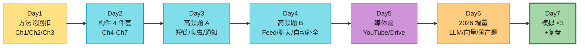

### Day 1:方法论回扣(Ch1 + Ch2 + Ch3)⭐⭐⭐⭐⭐

| 必背 | 一句话 |
|------|--------|
| **Ch1 渐进式 8 集** | 单机→拆 web/DB→LB→主从→缓存/CDN→无状态→多机房→MQ→分片。**每一集:痛点→解决→新痛点** |
| **Ch2 延迟数字(2026)** | 内存 100ns · SSD 100μs · 1Gbps 网络 1ms · 同城机房 1-2ms · 跨洲 100-200ms · HDD 寻道 10ms(2026 用 NVMe) |
| **Ch2 QPS 估算套路** | DAU × 人均次数 / 86400 = 平均 QPS;× 2-3 = 峰值;存储 = 单条大小 × 写量 |
| **Ch2 可用性 9** | 2 个 9=99%(3.65天/年宕机)· 3 个 9(8.8h)· 4 个 9(52.6min)· 5 个 9(5.3min) |
| **Ch3 4 步法时间分配** | Step1 定范围 3-10min · Step2 高层 10-15min · Step3 深入 10-25min · Step4 收尾 3-5min |
| **Ch3 5 个红旗** | 抢答(Jimmy)· 沉默思考 · 钻牛角尖 · 过度工程 · 不接受反馈 |
| **Ch3 自救铁律** | 卡住**别沉默**,退回高层 / 要提示 / 换方案 |

### Day 2:构件 4 件套(Ch4-Ch7)⭐⭐⭐⭐

| 章节 | 一句话核心 | 必背细节 |
|------|----------|---------|
| **Ch4 限流器** | **令牌桶**(允许突发)vs **滑动窗口**(严格) | 分布式用 Redis+Lua;API 层最先做;限流维度:IP/UID/API |
| **Ch5 一致性哈希** | 解决"加节点要重哈希几乎所有数据" | **虚拟节点**抹平倾斜;手算:哈希环 + 节点倍数 |
| **Ch6 KV 存储** | Dynamo 风格:AP,最终一致 | sloopy quorum + 读修复 + 向量时钟;Cassandra 现用 LWW |
| **Ch7 唯一 ID** | **雪花(时间+机器+序列)** 最主流 | 多主/UUID/号段各有取舍;**时钟回拨**要处理 |

### Day 3:高频题 A(Ch8-Ch10)

| 章节 | 一句话核心 | 必背细节 |
|------|----------|---------|
| **Ch8 短链** | hash(base62)vs 自增 ID | **302(可统计)优先于 301(缓存)**;热点缓存;布隆去重 |
| **Ch9 爬虫** | BFS + URL 厃去重 + 优先级 | 布隆过滤器去重;DNS 缓存;反爬礼貌策略;增量爬取 |
| **Ch10 通知** | SMS/Email/Push 多通道 + MQ 解耦 | **APNS→FCM**(2026);限流;重试;幂等 |

### Day 4:高频题 B(Ch11-Ch13)⭐⭐⭐⭐⭐(最常考)

| 章节 | 一句话核心 | 必背细节 |
|------|----------|---------|
| **Ch11 Feed** | **推模型(写扩散)** vs **拉模型(读扩散)** vs 推拉结合 | 大 V 用拉;普通用户用推;MQ 削峰;分页 cursor |
| **Ch12 聊天** | **WebSocket** 双向;消息状态机 | 长轮询退化方案;群聊按房间分片;多端同步;在线状态 Redis set |
| **Ch13 自动补全** | **Trie + 节点缓存 top-k + 限前缀长度 → O(1)** | 数据收集与查询分离;**前端 debounce 是命门**;ES FST 替代 |

### Day 5:媒体题(Ch14-Ch15)

| 章节 | 一句话核心 | 必背细节 |
|------|----------|---------|
| **Ch14 YouTube** | 转码 + **DASH/HLS 自适应码率** + CDN | 直播用 RTMP→HLS;原始文件存对象存储;转码任务队列 |
| **Ch15 Drive** | 块级同步 + 分块上传 + 版本 | **断点续传**;协作冲突 OT/CRDT;CDN 下发;通知中心 |

### Day 6:2026 增量(原书没覆盖,本章第 7 节详讲)⭐⭐⭐⭐⭐

| 主题 | 必背一句 |
|------|---------|
| **LLM 系统** | RAG = 向量召回 + LLM 生成;embedding + 向量库(Pinecone/Milvus)+ prompt 工程 |
| **推理服务** | KV cache · paged attention · 量化(GPTQ/AWQ)· vLLM/TensorRT-LLM |
| **向量数据库** | HNSW 索引;ANN 召回;hybrid 检索(向量+BM25) |
| **流处理** | **Flink**(2026 主流)滑动窗口;Kafka + CDC;Lakehouse |
| **Serverless/K8s** | K8s 编排;Service Mesh(Istio)管 mTLS;gRPC/HTTP3 |
| **国内高频题** | 秒杀/库存、支付订单、排行榜、附近的人、Feed、红包 |

### Day 7:模拟 ×3 + 复盘 ⭐⭐⭐⭐⭐

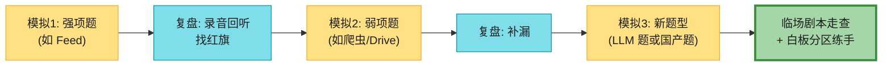

> 💡 **模拟怎么练**:① 找人当面试官,**严格 45 分钟 + 白板**(Excalidraw/Miro);② **录音回听**,听自己有没有沉默、抢答、钻细节;③ 把答得不好的点写进"漏点本";④ 隔天再练一次同类型题,固化肌肉记忆。**模拟 3 次比读 30 页书管用**。

---

## 🗺️ 章节概览(本章 8 个模块)

| 模块 | 要点 | 重要性 |
|------|------|--------|
| 🎯 考前一周 checklist | 7 天冲刺表 | ⭐⭐⭐⭐⭐ |
| 📖 持续学习方法论 | 怎么研究真实系统 | ⭐⭐⭐⭐ |
| 🏭 真实系统论文清单 | 公司工程博客 + 经典论文 | ⭐⭐⭐⭐⭐ |
| 📚 推荐书目 | 原书 + 补充必读 | ⭐⭐⭐⭐ |
| ⚠️ 2026 必学清单 | 原书缺的现代技术 | ⭐⭐⭐⭐⭐ |
| 🇨🇳 国内大厂高频题 | 原书完全没覆盖 | ⭐⭐⭐⭐⭐ |
| 🗺️ 学习路线图 | 从入门到 strong hire | ⭐⭐⭐⭐ |
| 📝 全书收尾速查表 | Ch1-15 一句话串联 | ⭐⭐⭐⭐⭐ |
| 🪤 面试常见陷阱 | 全书汇总 | ⭐⭐⭐⭐⭐ |

---

## 📖 持续学习的方法论(原书核心观点)

### 原书的核心论断

> **"Designing good systems requires years of accumulation of knowledge. One shortcut is to dive into real-world system architectures."**
> 设计好系统需要多年积累。**捷径就是钻研真实系统架构**。

原书给了两个具体方法:

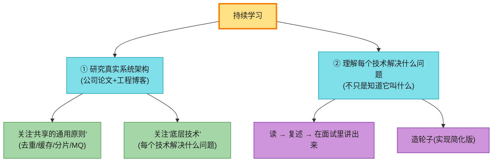

> 💡 **关键认知**:**读论文/博客的回报来自"复述和讲解"**,而不是"读过"。一份论文读完如果你不能用自己的话在 3 分钟内讲清楚它的核心 trade-off,等于没读。**面试里能用上 = 真的学到了**。

#### 深入:研究真实系统的 4 步法(原书没明说,但可提炼)

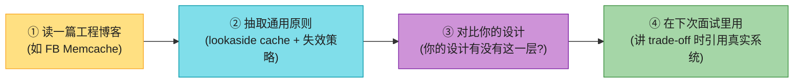

| 步骤 | 做什么 | 输出 |
|------|--------|------|
| ① 读 | 选一篇经典工程博客,30 分钟读完 | 笔记:核心问题 + 方案 |
| ② 抽原则 | 不记具体数字,记**通用模式** | "XX 系统也是这个套路" |
| ③ 对比 | 问自己"我设计时会想到这层吗?" | 补自己的盲点 |
| ④ 讲 | 在面试的 Step 3/4 引用:"FB 的 Memcache 就是..." | 加分信号 |

> 🪤 **追问陷阱**(面试官问"你怎么知道这些的?"):答 **"我读过 XX 公司的工程博客,讲的是 YY 系统,它用了 ZZ 模式"** —— 这比"我凭经验"有说服力十倍。**主动引用真实系统 = senior 信号**。

---

## 🏭 真实系统工程博客资源(原书清单 + 2026 更新)

原书列了一大堆公司工程博客。这里整理成**可执行清单**,**标注哪些必读**(2026 仍有价值)。

### 第一梯队:必读经典论文(原书列出 + 精选)

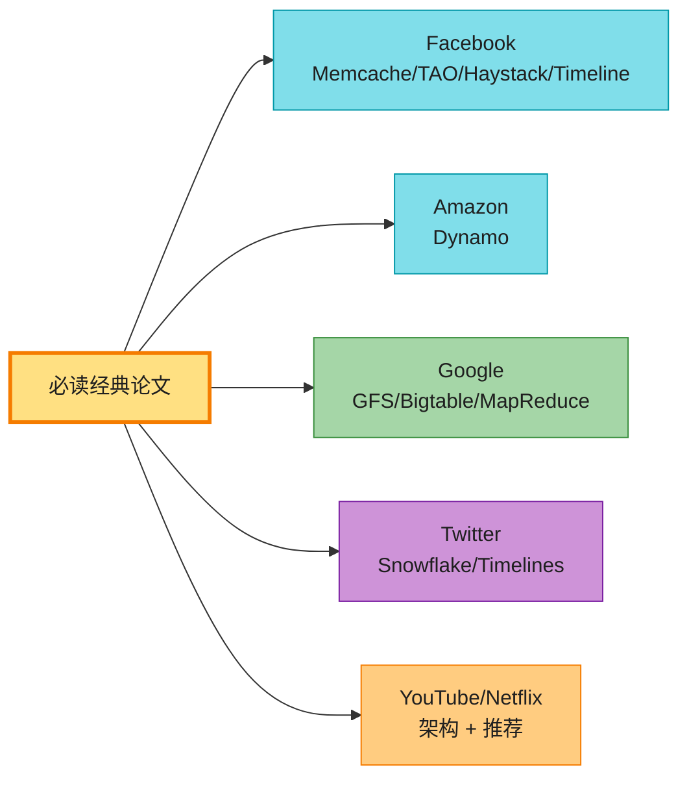

| 公司 | 必读论文 / 文章 | 对应本书章节 | 核心收获 |
|------|----------------|------------|---------|
| **Facebook** | Scaling Memcache at Facebook | Ch1 缓存 | lookaside cache 模式、cache coalescing、lease 防惊群 |
| **Facebook** | TAO: Distributed Data Store for Social Graph | Ch11 Feed | 图存储 + 边缘缓存;社交关系建模 |
| **Facebook** | Finding a Needle in Haystack(照片存储) | Ch15 Drive / Ch14 YouTube | 对象存储优化;元数据内存化 |
| **Facebook** | Building Timeline / Serving Multifeed | Ch11 Feed | 推→拉演进;fan-out on write vs read |
| **Facebook** | Erlang at Facebook(Facebook Chat) | Ch12 聊天 | 长连接;Erlang 并发模型 |
| **Amazon** | Dynamo: Highly Available KV Store ⭐ | **Ch6 KV 存储** | **AP 系统、向量时钟、sloppy quorum、读修复**——全书 Ch6 的原型 |
| **Google** | The Google File System | Ch14/Ch15 | 分布式文件系统;chunk 设计 |
| **Google** | Bigtable | Ch6 KV | 宽表存储;sstable + LSM |
| **Google** | Differential Synchronization(Google Docs) | Ch15 Drive | **OT/CRDT 协同编辑**——本题灵魂 |
| **YouTube** | YouTube Architecture / Scalability | Ch14 YouTube | 转码 + CDN + 自适应码率 |
| **Twitter** | Announcing Snowflake ⭐ | **Ch7 唯一 ID** | **雪花算法原型**——Ch7 直接复刻 |
| **Twitter** | Timelines at Scale | Ch11 Feed | 推/拉模型的真实演进 |
| **Uber** | How Uber Scales Real-Time Market Platform | Ch11/Ch12 | 实时地理调度;事件驱动 |
| **Netflix** | 360 Degree View of Netflix Stack | Ch1/Ch14 | 微服务 + 多区域 + Chaos |
| **Netflix** | Beyond the 5 Stars(推荐) | Ch11 Feed | ML 排序;A/B 实验 |

> ⚠️ **原书链接已过时**:原书大量用 `goo.gl` 短链,2024 年 Google 已停用 goo.gl 重定向,**绝大多数链接失效**。直接 Google 论文标题,或去公司工程博客搜索即可。

### 第二梯队:公司工程博客(原书清单,定期刷)

> 📝 **核心观点**(原书):**面哪家公司,就读哪家的工程博客**——熟悉他们用的技术栈和系统。日常定期刷,有助成为更好的工程师。

| 公司 | 博客地址 | 强项 / 必读主题 |
|------|---------|---------------|
| **Netflix** | netflixtechblog.com | 微服务、多区域、混沌工程、推荐 |
| **Uber** | eng.uber.com | 地理调度、实时、MapReduce |
| **Facebook/Meta** | engineering.fb.com | 缓存、社交图、AI infra |
| **Google** | developers.googleblog.com | 论文、AI、基础设施 |
| **Stripe** | stripe.com/blog/engineering | 支付、幂等、分布式事务 |
| **Airbnb** | medium.com/airbnb-engineering | 数据平台、增长 |
| **Slack** | slack.engineering | 协作、长连接 |
| **Dropbox** | dropbox.tech | 同步、存储、Magic Pocket |
| **Cloudflare** | blog.cloudflare.com ⭐ | 边缘计算、DDoS、网络(2026 强烈推荐) |
| **Discord** | discord.com/blog ⭐ | 实时聊天、Go/Rust、Elixir(2026) |
| **Pinterest** | engineering.pinterest.com | Graph、推荐 |
| **LinkedIn** | engineering.linkedin.com | 数据管线、Espresso |
| **Shopify** | engineering.shopify.com | 高并发电商、Rails 扩展 |
| **Instagram** | engineering.instagram.com | 照片存储、Feed |
| **High Scalability** | highscalability.com ⭐ | 聚合各大厂架构案例,**入门必读** |

> 💡 **2026 新增推荐**(原书没列但已成为必读):**Cloudflare 博客**(网络/边缘/DDoS 的金矿)、**Discord 博客**(实时聊天工程实战)、**AWS Architecture Blog**(云原生)、**ByteByteGo / Alex Xu Newsletter**(原书作者本人的持续更新)。

### 第三梯队:开源系统设计文档(2026 补充)

> ⚠️ 原书只列了公司博客,**没列开源系统的设计文档**——但这些才是 2026 工程师日常参考最多的。

| 项目 | 设计文档 / RFC | 必读场景 |
|------|--------------|---------|
| **Kafka** | kafka.apache.org/documentation/#design | Ch11 MQ、流处理 |
| **Cassandra** | cassandra.apache.org/doc/latest/architecture | Ch6 KV、AP 系统 |
| **Redis** | redis.io/docs/reference/ | 缓存、限流、sorted set |
| **Flink** | flink.apache.org | 流处理、窗口 |
| **Kubernetes** | kubernetes.io/docs/concepts | 编排、声明式 |
| **etcd / Raft** | raft.github.io | 强一致、共识算法 |
| **Milvus / Qdrant** | 向量库文档 | LLM/RAG ⭐ |
| **vLLM** | docs.vllm.ai | LLM 推理服务 ⭐ |

---

## 📚 推荐书目(原书 + 补充)

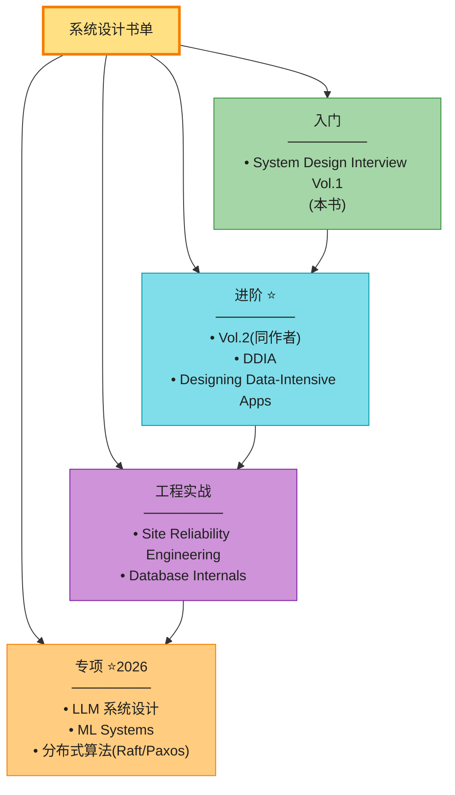

### 原书 + 同系列

| 书 | 评价 | 重点 |
|----|------|------|
| **System Design Interview Vol.1**(Alex Xu,2020) | **面试入门最好的起点**(本书笔记的源书) | 16 章覆盖经典题 + 方法论 |
| **System Design Interview Vol.2**(Alex Xu,2022)⭐ | **本书的天然续集**,补 Vol.1 没讲的题 | 邻近服务、分布式消息队列、**支付系统**、限速、对象存储、多人协同、S3 like、股票撮合 |
| **ByteByteGo Newsletter / 系统设计 Algomonster** | 原书作者的持续更新 | 2026 最新趋势 |

### 进阶必读

| 书 | 作者 | 为什么必读 |
|----|------|-----------|
| **Designing Data-Intensive Applications(DDIA)** ⭐⭐⭐⭐⭐ | Martin Kleppmann | **系统设计领域的圣经**。深入讲复制、分区、事务、一致性的本质。**读完 Vol.1 后必读这本**。 |
| **Database Internals** | Alex Petrov | 存储引擎(B+tree/LSM)、事务、共识。补充 DDIA 的存储层细节。 |
| **Site Reliability Engineering(SRE)** | Google | **运维 + 可用性**。SLI/SLO、错误预算、混沌工程——面试"你怎么监控"的答案库。 |
| **The SRE Workbook** | Google | SRE 的实操版 |
| **Microservices Patterns** | Chris Richardson | 微服务拆分、Saga、API gateway——面"微服务"题必读 |

### 2026 专项补充

| 书 / 资源 | 主题 |
|----------|------|
| **Fundamentals of LLM Serving**(博客集合) | LLM 推理服务、KV cache、batching |
| **Machine Learning Systems Design**(Chip Huyen) | ML 系统设计、特征平台、推理管线 |
| **Vector Search**(Pinecone 等) | 向量检索、ANN、RAG |
| **Designing ML Systems**(Chip Huyen) | ML 生命周期 |
| **Streaming Systems**(Flink 团队) | 流处理、watermark、窗口 |

> 💡 **怎么读最有效**:**别从头读到尾**。① 先读 DDIA 的第 5/6/7 章(复制/分区/事务)——这是系统设计面试的"内功";② 再按面试题对应章节精读 Vol.2;③ 用 SRE 当工具书,被问"监控/容错"时翻。**做题 + 读论文 > 读书**。

---

## ⚠️ 原书没覆盖的 2026 必学清单(本章核心增量)

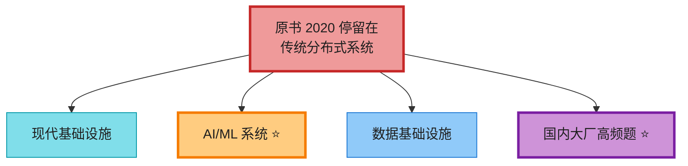

> **这是 ch16 最重要的增量**。2026 面试里,**这些题目出现频率已经接近甚至超过原书某些章节**。如果你只读原书,在 LLM/RAG/向量库相关题上会直接挂。

### 模块 1:现代基础设施

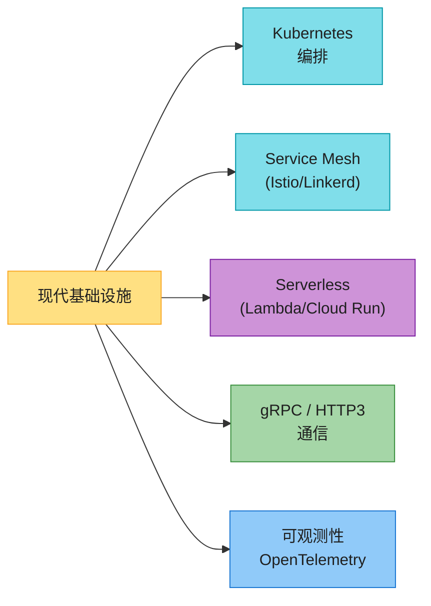

| 技术 | 解决什么 | 面试应用 |
|------|---------|---------|
| **Kubernetes** | 容器编排:声明式、滚动发布、自愈 | 设计题里"怎么部署扩容"——别再画虚机,讲 Pod/Deployment/H PA |
| **Service Mesh(Istio)** | sidecar 代理统一管 mTLS/限流/熔断/追踪 | "服务间安全/限流怎么做"——讲 sidecar 模式,Ch4 限流可下沉到 mesh 层 |
| **Serverless(Lambda/Cloud Run)** | 事件驱动、自动扩缩、按用量付费 | 适合突发流量、批处理;**冷启动**是 trade-off |
| **gRPC** | Protobuf + HTTP2,内部服务高效通信 | 微服务间通信用 gRPC,对外用 REST/GraphQL |
| **HTTP/3(QUIC)** | UDP 基础,多路复用、0-RTT、抗丢包 | Ch12 聊天、Ch10 通知的传输层升级 |
| **OpenTelemetry** | 统一 metrics/logs/traces 标准 | "你怎么监控"——讲 OTel + Prometheus + Jaeger |
| **Envoy / Nginx** | 数据面代理 | API gateway、流量管控 |

> 💡 **话术**(高级岗被问"你怎么部署这个系统"时):"我会用 **K8s Deployment + HPA(基于 CPU/QPS 自动扩缩)**,**Service Mesh(Istio)** 做 mTLS + 限流 + 熔断下沉到 sidecar,**API gateway**(Envoy/Kong)对外,**OpenTelemetry** 全链路追踪。**业务层只关心逻辑,基础设施能力下沉到平台层**——这是 2026 的标准姿势。"

### 模块 2:AI/ML 系统 ⭐⭐⭐⭐⭐(2026 最高频增量)

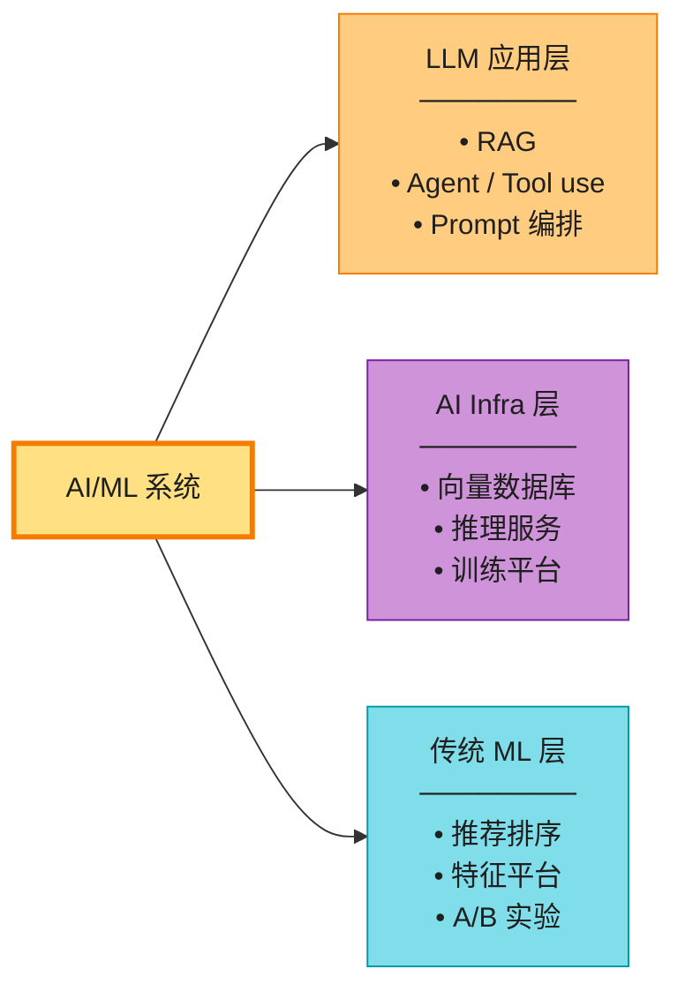

**① RAG(检索增强生成)系统**——2026 出现频率最高的新题型

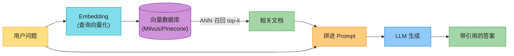

| 组件 | 选型 | 关键 trade-off |
|------|------|--------------|
| **Embedding 模型** | OpenAI text-embedding-3 / BGE / Cohere | 维度(1536/768)、成本、多语言 |
| **向量数据库** | Milvus / Pinecone / Qdrant / pgvector | HNSW 索引;内存 vs 磁盘;规模 |
| **检索策略** | 纯向量 / **hybrid(向量 + BM25)** / 重排 | hybrid 是 2026 主流;rerank 提升 precision |
| **LLM** | GPT-4 / Claude / 开源(Llama) | 成本 vs 质量;延迟;上下文窗口 |
| **缓存** | 缓存 embedding + 缓存答案 | 省 LLM 调用(最贵) |

> 📝 **必背 RAG 架构**:查询 → embedding → 向量库 ANN 召回 top-k → (可选 rerank) → 拼 prompt → LLM 生成 → 返回带引用的答案。**核心难点是召回质量**(chunk 切分、混合检索、rerank)和**成本控制**(缓存)。

**② LLM 推理服务**

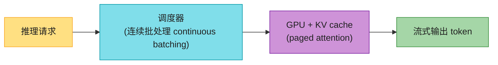

| 概念 | 解决什么 | 面试讲点 |
|------|---------|---------|
| **KV cache** | 避免重复计算 attention 的 K/V | 内存占用大头;长上下文成本 |
| **PagedAttention(vLLM)** | 把 KV cache 分页管理,碎片降低 | vLLM 的核心创新,提升吞吐数倍 |
| **连续批处理(continuous batching)** | 动态凑批,不等齐 | 提升吞吐 |
| **量化(GPTQ/AWQ/INT8)** | 减少模型内存、加速推理 | 精度损失 trade-off |
| **推测解码(speculative decoding)** | 小模型草拟 + 大模型校验 | 降延迟 |

> 💡 **话术**("怎么设计 LLM 推理服务"):"用 **vLLM 或 TensorRT-LLM** 做推理引擎——核心是 **PagedAttention**(KV cache 分页)+ **continuous batching**(动态凑批);模型用 **AWQ 量化**省显存;前面加路由层(按模型/租户/SLA 路由)+ 请求队列 + **token bucket 限流**(按 token/分钟)。**最贵的是 GPU,所有优化都围绕吞吐和显存**。"

**③ 传统 ML 排序**(Ch11/Ch13 的灵魂)

| 模块 | 作用 | 阶段 |
|------|------|------|
| **召回(recall)** | 从海量候选里粗筛 top-N | 多路(热度/个性化/向量)+ 并行 |
| **粗排** | 轻量模型快速过滤 | embedding 内积 |
| **精排(rank)** | 强模型对 top-N 排序 | CTR/CVR 预测(GBDT/DNN) |
| **重排(re-rank)** | 业务规则 + 多样性 | 去重、打散、加权和 |

> 💡 **Ch11 Feed / Ch13 自动补全 的"ML 排序"都是这套召回+精排+重排**。这是 2026 推荐类系统设计的通用骨架,务必背熟。

### 模块 3:数据基础设施

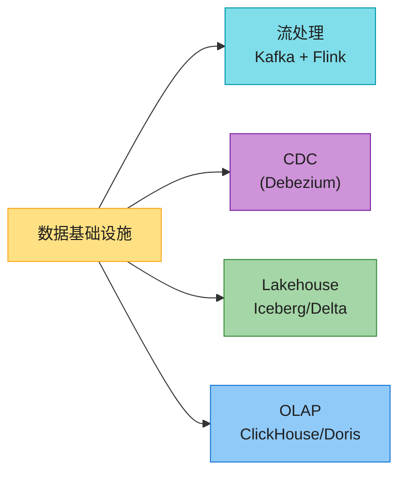

| 技术 | 解决什么 | 面试讲点 |
|------|---------|---------|
| **Kafka** | 高吞吐消息队列 + 事件日志 | Ch11 Feed / Ch13 trending 的异步骨架 |
| **Flink** | 流处理(窗口、watermark、状态) | 替代 Spark Streaming/Storm(2026 边缘化) |
| **CDC(Debezium)** | 把 DB binlog 变化流出来 | 缓存与 DB 一致性的解法(Ch1 第 4 集深水区) |
| **Lakehouse(Iceberg/Delta)** | 数据湖 + 事务 | 替代 Hive;ACID on object storage |
| **OLAP(ClickHouse/Doris)** | 实时分析查询 | 监控、报表、count distinct |

> 💡 **2026 现代数据栈话术**:"业务 DB → **CDC(Debezium)→ Kafka → Flink 实时计算 → Lakehouse(Iceberg)→ OLAP(ClickHouse)→ BI**。这条链路解决了'实时数仓'和'缓存一致性'两大难题。面试里讲 CDC + Flink 是 senior 信号。"

### 模块 4:国内大厂高频题(原书完全没覆盖)⭐⭐⭐⭐⭐

> ⚠️ **原书是硅谷视角**,完全没覆盖国内大厂(阿里/腾讯/字节/美团/拼多多)面试的高频题。如果你面国内公司,**以下 6 道题比原书任何一章都常考**。

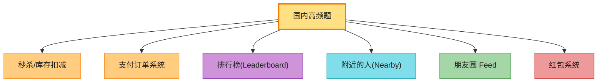

| 题 | 核心难点 | 必杀技 |
|----|---------|--------|
| **秒杀/库存扣减** | 高并发防超卖;热点 key | **Redis + Lua 原子扣减** + 分桶 + 限流 + 异步落库;DB 用乐观锁兜底 |
| **支付订单系统** | 幂等、对账、状态机、分布式事务 | **幂等 key(订单号)** + TCC / Saga + 定时对账 + 消息最终一致 |
| **排行榜** | 实时 top-N、多维排序 | **Redis sorted set** + 分片(按时间/类目) + ZSET 聚合 |
| **附近的人/店** | 地理位置检索 | **GeoHash / Redis GEO / S2/R-tree**;geohash 前缀分桶 |
| **朋友圈 Feed** | 推/拉模型 + 隐私权限 + 视频 | Ch11 推拉结合 + ACL 权限校验 + 对象存储 |
| **红包系统** | 海量并发 + 随机金额 + 资金安全 | **预生成 + 异步落库**;Redis 缓存红包;DB 最终一致 |

> 💡 **秒杀题话术**(国内必考):"① **流量前置拦截**:CDN 静态化 + 答题/验证码削峰 + 限流(令牌桶);② **库存前置到 Redis**——`EVAL Lua 原子扣减`防超卖,**绝不直接打 DB**;③ **库存分桶**(100 件库存拆 10 桶各 10 件)分散热点;④ **异步落库**——MQ 削峰,DB 慢慢消费;⑤ **DB 兜底乐观锁**`UPDATE stock SET n=n-1 WHERE id=? AND n>0`。**核心思想:把 DB 保护在最后,前面层层缓冲**。"

> 💡 **支付题话术**:"① **幂等 key = 商户号 + 订单号**,重复请求直接返回原结果;② **状态机**(待支付→支付中→成功/失败),非法跃迁拒绝;③ **分布式事务用 TCC 或 Saga**(2PC 性能差,生产少用);④ **异步对账**——定时和银行通道对账,补偿差错;⑤ **重试 + 死信队列**;⑥ 风控前置(限频、黑名单)。"

> 🪤 **追问陷阱**(排行榜题):"亿级用户怎么排?" → "**分片**:按维度(类目/地区/时间)分片,每片一个 sorted set;**全局 top** 聚合各片 top;**热点(前 100)** 单独维护一个高保真 ZSET;用户自己排名用 `ZREVRANK`。**别想一次排全量——分而治之**。"

> 🔄 **国内大厂题 vs 硅谷题**:硅谷题偏"设计 X 系统"(架构演进),国内题偏"**极端并发下的某个点**(秒杀的库存、支付的幂等、排行榜的实时性)"——**深度更甚**。两套都要练。

---

## 🗺️ 学习路线图:从入门到 strong hire

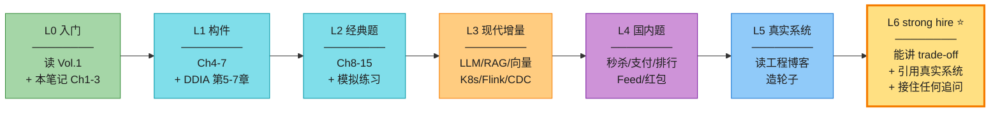

| Level | 目标 | 怎么练 | 检验标准 |
|-------|------|--------|---------|
| **L0 入门** | 建立框架 | 读 Vol.1 Ch1-3 + 本笔记 | 能复述 4 步法 |
| **L1 构件** | 掌握积木 | Ch4-7 + DDIA 第 5-7 章 | 能手算一致性哈希、令牌桶 |
| **L2 经典题** | 会答常规题 | Ch8-15 + 模拟 5 次 | 45 分钟能 hold 住一道经典题 |
| **L3 现代增量** | 不落伍 | LLM/RAG/向量/K8s/Flink | 能讲 RAG 架构、推理服务 |
| **L4 国内题** | 面国内必备 | 秒杀/支付/排行/Feed | 能讲 Redis Lua 扣减、幂等 |
| **L5 真实系统** | 有说服力 | 每周读 1-2 篇工程博客 | 能在面试引用真实案例 |
| **L6 strong hire** ⭐ | 拿 offer | 持续模拟 + 造轮子 | **任何题都能拆解 + trade-off + 引用真实系统 + 接住追问** |

> 💡 **L6 strong hire 的 4 个标志**:
> 1. **任何题都能拆解**:陌生题也能套 4 步法,从不慌。
> 2. **每个决策都讲 trade-off**:不是"A 更好",而是"A 因为 X,代价是 Y"。
> 3. **引用真实系统**:"FB Memcache 这么做"、"Twitter Snowflake 的方案"。
> 4. **接住任何追问**:从基础题深入到 LLM/成本/容错都不卡。

---

## 📝 全书收尾速查表(Ch1-15 一句话串联)

把全书 15 章串成**一张可背诵的总览**——呼应 README 的全书架构总览,面试前一晚扫一遍。

```mermaid
flowchart TB
    subgraph M["方法论篇"]
        C1["Ch1<br/>从零扩展<br/>渐进式 8 集"]
        C2["Ch2<br/>粗略估算<br/>QPS+延迟+可用性"]
        C3["Ch3<br/>4 步法框架<br/>过程>结果"]
    end
    subgraph B["构件篇"]
        C4["Ch4<br/>限流器<br/>令牌桶/滑动窗口"]
        C5["Ch5<br/>一致性哈希<br/>虚拟节点"]
        C6["Ch6<br/>KV 存储<br/>Dynamo AP"]
        C7["Ch7<br/>唯一 ID<br/>雪花算法"]
    end
    subgraph S["系统设计题篇"]
        C8["Ch8 短链<br/>base62+302"]
        C9["Ch9 爬虫<br/>BFS+去重"]
        C10["Ch10 通知<br/>MQ+多通道"]
        C11["Ch11 Feed<br/>推/拉模型"]
        C12["Ch12 聊天<br/>WebSocket"]
        C13["Ch13 自动补全<br/>Trie+top-k"]
        C14["Ch14 YouTube<br/>转码+CDN"]
        C15["Ch15 Drive<br/>块同步+CRDT"]
    end
    M --> B --> S

    style M fill:#A5D6A7,stroke:#388E3C,color:#1f1f1f
    style B fill:#80DEEA,stroke:#0097A7,color:#1f1f1f
    style S fill:#CE93D8,stroke:#7B1FA2,color:#1f1f1f
    style C1 fill:#FFE082,stroke:#F9A825,color:#1f1f1f
    style C2 fill:#FFE082,stroke:#F9A825,color:#1f1f1f
    style C3 fill:#FFE082,stroke:#F9A825,color:#1f1f1f
    style C4 fill:#FFE082,stroke:#F9A825,color:#1f1f1f
    style C5 fill:#FFE082,stroke:#F9A825,color:#1f1f1f
    style C6 fill:#FFE082,stroke:#F9A825,color:#1f1f1f
    style C7 fill:#FFE082,stroke:#F9A825,color:#1f1f1f
    style C8 fill:#FFE082,stroke:#F9A825,color:#1f1f1f
    style C9 fill:#FFE082,stroke:#F9A825,color:#1f1f1f
    style C10 fill:#FFE082,stroke:#F9A825,color:#1f1f1f
    style C11 fill:#FFE082,stroke:#F9A825,color:#1f1f1f
    style C12 fill:#FFE082,stroke:#F9A825,color:#1f1f1f
    style C13 fill:#FFE082,stroke:#F9A825,color:#1f1f1f
    style C14 fill:#FFE082,stroke:#F9A825,color:#1f1f1f
    style C15 fill:#FFE082,stroke:#F9A825,color:#1f1f1f
```

### 每章一句话核心(背熟,可串联讲)

| Ch | 一句话 | 必杀关键词 |
|----|--------|----------|
| **Ch1** | 单机→拆 web/DB→LB→主从→缓存/CDN→无状态→多机房→MQ→分片,**每集痛点→解决→新痛点** | 渐进式 8 集 |
| **Ch2** | QPS = DAU × 人均 / 86400;延迟:内存 ns / SSD μs / 网络 ms;可用性 N 个 9 | 2/3/4/5 个 9 |
| **Ch3** | 4 步法(定范围/高层/深入/收尾),**过程 > 结果**,最大红旗 = 过度工程 | buy-in、自救 |
| **Ch4** | 限流器:**令牌桶**(允许突发)主流;分布式 Redis+Lua;限在 API 层最先 | 令牌桶 |
| **Ch5** | 一致性哈希 + **虚拟节点**解决倾斜;加节点只迁移相邻段 | 哈希环 + 虚拟节点 |
| **Ch6** | Dynamo 风格 KV:AP,最终一致,sloppy quorum + 读修复 + 向量时钟 | AP vs CP |
| **Ch7** | 唯一 ID:**雪花(时间+机器+序列)** 主流;时钟回拨要处理 | 雪花 |
| **Ch8** | 短链:base62 hash;**302 优先(可统计)**;热点缓存 + 布隆去重 | 302 vs 301 |
| **Ch9** | 爬虫:BFS + URL 布隆去重 + 优先级 + 增量爬取 + 礼貌策略 | 布隆去重 |
| **Ch10** | 通知:SMS/Email/Push 多通道 + MQ 解耦;**FCM 取代 APNS**(2026);幂等 | FCM、幂等 |
| **Ch11** | Feed:**推(写扩散)vs 拉(读扩散)vs 推拉结合**;大 V 用拉;MQ 削峰 | 推拉结合 |
| **Ch12** | 聊天:**WebSocket** 双向;消息状态机;群聊按房间分片;多端同步 | WebSocket |
| **Ch13** | 自动补全:**Trie + 节点缓存 top-k + 限前缀长度 → O(1)**;前端 debounce 是命门 | Trie + debounce |
| **Ch14** | YouTube:转码 + **DASH/HLS 自适应码率** + CDN;直播 RTMP→HLS | 自适应码率 |
| **Ch15** | Drive:块级同步 + 分块上传 + 版本;协作冲突 **OT/CRDT** | OT/CRDT |

> 💡 **面试时怎么用这张表**:被问任何题,先在脑里把它定位到"这是哪一类"(读重写轻?推送还是拉取?需要低延迟双向?),然后从对应章节的构件库里挑积木组装。**全书 15 章本质就是积木库——题只是积木的不同组合**。

---

## 🪤 面试常见陷阱 / 红线(全书汇总)

汇总全书 15 章里反复出现的"红旗"。**面试官看到任何一个都会扣分**——把它们刻进肌肉记忆,见到就主动规避。

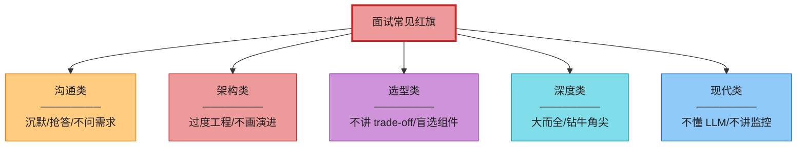

### 1. 沟通类红旗(Ch3 详讲)

| 红旗 | 表现 | 解药 |
|------|------|------|
| **沉默思考** | 卡住 5 分钟不出声 | 全程自言自语,哪怕说"我在想 X" |
| **Jimmy 抢答** | 不问需求直接画图 | 强制问 5-7 个问题再动笔 |
| **不接受反馈** | 面试官提示"要不要考虑 X",你坚持己见 | 当队友,反馈立刻落到图上 |
| **不复述问题** | 上来就开干 | 开场:"我复述一下,你要的是..." |

### 2. 架构类红旗

| 红旗 | 表现 | 解药 |
|------|------|------|
| **过度工程** ⭐ | 一上来就堆 Kafka + K8s + ES + 多区域 | 从单机画起,**每加一个组件说"因为 X 痛点"** |
| **不画演进** | 直接画最终大图 | 渐进式叙事(Ch1 第 1-8 集) |
| **忽视单点** | 某关键组件没冗余 | Step 4 主动找单点 + failover |
| **无监控** | 设计里没有可观测性 | 主动加 Prometheus + OTel + 4 黄金信号 |

### 3. 选型类红旗

| 红旗 | 表现 | 解药 |
|------|------|------|
| **不讲 trade-off** | "我用 Kafka" 不说为什么 | "A vs B,A 因为 X,代价 Y" |
| **盲选流行组件** | 上来就"用 ES" 但讲不清为什么 | 按规模选型:中小 Redis / 大规模 ES / 极致自建 |
| **忽视成本** | 高级岗不聊月成本 | 估算里加 $/月 |
| **忽视一致性** | 缓存 + DB 不一致没考虑 | CDC + 延迟双删 + TTL 兜底 |

### 4. 深度类红旗

| 红旗 | 表现 | 解药 |
|------|------|------|
| **大而全** | 每个组件都点名,都不深 | **深度 > 广度**,选 1-2 个核心挖到底 |
| **钻牛角尖** | 一个细节耗 30 min | 每 5 分钟看表,设时限 |
| **不讲瓶颈** | Step 4 说"设计很好" | 永远准备 3 个瓶颈 + 改进 |

### 5. 现代类红旗(2026 新增)

| 红旗 | 表现 | 解药 |
|------|------|------|
| **不懂 LLM** | 被问"用 LLM 怎么做"卡住 | 至少讲清 RAG 架构 + 向量库 |
| **过时技术** | 还在讲 APNS / Storm / 手工部署 | FCM / Flink / K8s |
| **不讲可观测性** | 监控只说"日志" | OTel + Prometheus + 分布式追踪 |
| **不讲容错** | 没聊"挂了怎么办" | 主动:某组件挂 → failover + 降级 |

---

## 📝 本章要点总结

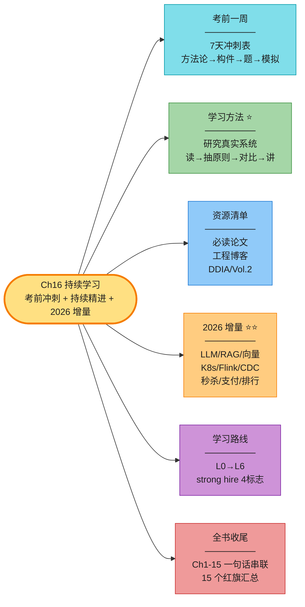

**核心 Takeaways**:

1. **ch16 不是设计题,是全书的收尾**——把方法论、资源、增量、路线图串起来。
2. **考前一周最有用的是 7 天冲刺表 + 全书一句话串联表**——直接背,直接用。
3. **原书的核心论断:捷径 = 钻研真实系统**。读 → 抽原则 → 对比 → 讲出来,四步闭环。
4. **原书停留在 2020**,你必须在它的基础上补:**LLM/RAG/向量库、K8s/Flink/CDC、国内大厂高频题(秒杀/支付/排行)**。
5. **国内大厂题偏"极端并发下的某个点"**(库存/幂等/实时性),比硅谷题更深——面国内必须练。
6. **L6 strong hire 的 4 个标志**:任何题能拆解、每个决策讲 trade-off、引用真实系统、接住任何追问。
7. **15 个红旗汇总**:沉默/抢答/过度工程/不讲 trade-off/大而全/不懂 LLM——主动规避。
8. **持续学习是终身的事**:每周 1-2 篇工程博客,每月造一个小轮子,**读和讲结合**——这才是 strong hire 的长期姿势。

---

> 🔗 **全书到此结束**。Ch1 教你架构怎么长,Ch2 教你怎么算,Ch3 教你怎么组织 45 分钟,Ch4-7 给你积木,Ch8-15 给你真题套路,Ch16 告诉你怎么持续精进。**这套笔记的目标**:不读原书也能 hold 住面试 + 在原书基础上拿到 strong hire。
>
> 但**面试不是终点**——真正的工程师会持续钻研真实系统、追踪技术演进(2026 的 LLM/向量/Serverless,2030 会有新东西)、造轮子、写博客、和同行讨论。**系统设计是一门手艺,而手艺需要时间**。原书开篇那句话也是本笔记的收尾:*"A journey of a thousand miles begins with a single step."* —— 这 16 章是第一步,后面的路靠你自己走。
>
> 祝你面试顺利,拿到心仪的 offer。🚀
