# Volume 2 · Chapter 1: 设计邻近服务 (Design a Proximity Service)

> 📑 **导航**:[← 持续学习](../SDE-Vol1/ch1_16-持续学习.md) · [📚 总目录](../README.md) · [附近好友 →](ch2_02-设计附近的好友.md)
> 🔗 **相关**:[附近好友](ch2_02-设计附近的好友.md) · [Maps](ch2_03-设计GoogleMaps.md)


> **本章定位**:邻近服务(LBS,Location-Based Service)是**"二维空间索引 + 读极重 + 低延迟"**的题——它是 Yelp(附近餐厅)、Google Maps(附近加油站)、美团/大众点评(附近商家)、滴滴(附近车)的核心。灵魂就一句话:**怎么把二维的(经纬度)数据,高效地"按范围"检索出来**。Vol.1 的所有积木在这里重新组合:**地理空间索引**(geohash / quadtree / S2 三选一)+ **读副本 / 缓存**(读极重)+ **多 Region 就近部署**(物理距离决定延迟)。它是 Vol.2 的开篇,也是国内大厂"附近的人/商家/车"类题的祖型。

> **本章和原书的区别**:原书把**五种索引方案的演进(2D 搜索 → 均匀网格 → geohash → quadtree → S2)讲得非常透彻**,geohash 边界问题、quadtree 内存估算、S2/Hilbert 都覆盖了,是面试标准答案。但**完全没提 Redis GEO 命令族**(GEOADD/GEOSEARCH——这是 2026 生产第一实现)、**没提 PostGIS**、**没提 Uber H3 六边形网格**(2026 最火的替代方案,六边形邻居性质优于方形网格)、**没讲 Haversine 公式**(按距离排序必备)、**没讲 geofencing 推送**(进区域触发通知,S2 的强项)、**隐私只提 GDPR 没讲脱敏手段**(位置模糊化/k-匿名/差分隐私)。本章把这些全补上。

---

## 🎯 面试怎么答(被问到"设计附近商家 / 附近的人 / 邻近服务"时)

**开场话术**(直接背):

> "邻近服务我先确认四件事:① 是**附近商家**(静态,CRUD 低频)还是**附近的人/车**(实时位置上报)?② 搜索半径选项(0.5/1/2/5/20km)?③ 数据更新要实时吗?④ 要不要多 Region?然后按 **地理索引选型(geohash / quadtree / S2 ⭐)→ 高层架构(LBS + Business 两服务)→ 读扩展(读副本 + Redis 缓存)→ 多 Region 就近** 四块讲。核心抉择是 **二维数据怎么索引**。"

**4 步推进**:

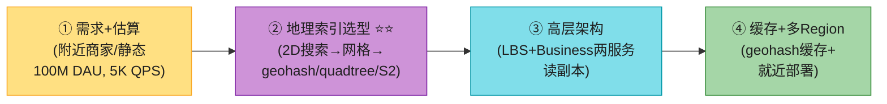

> 💡 **Step 2 是命门**:**地理空间索引选型**是这题的灵魂。**主动说出"二维数据降成一维索引"** 这个核心思想 + 能讲清 geohash 的边界问题 + quadtree 的内存估算 = 直接拿下面试。**面试选 geohash 或 quadtree 讲**(S2 太复杂,不易讲清)。
>
> 💡 **关键信号词**:"**读极重、写极轻** → 用读副本而非分片扩展 geo 索引"——这句直接证明你懂 trade-off(原书重点)。

---

## 🗺️ 章节概览

| 小节 | 要点 | 重要性 |
|------|------|--------|
| 需求 + 估算 | 附近商家、半径选项、**100M DAU / 200M 商家 / 5K QPS** | ⭐⭐⭐ |
| 高层架构 | LBS(读) + Business(写) 两服务分离 + DB 主从 | ⭐⭐⭐⭐ |
| API + 数据模型 | GET /search/nearby;business 表 + geo 索引表 | ⭐⭐⭐ |
| **地理索引选型 ⭐⭐⭐** | 2D→网格→**geohash→quadtree→S2**(本章灵魂) | ⭐⭐⭐⭐⭐ |
| **Geohash 深入** | 手算 + 12 精度 + **两个边界问题** + 邻居 | ⭐⭐⭐⭐⭐ |
| **Quadtree 深入** | 内存估算(1.71GB)+ 构建时间 + 运维 | ⭐⭐⭐⭐ |
| Google S2 | Hilbert 曲线 + geofencing + region cover | ⭐⭐⭐⭐ |
| 数据库扩展 | business 表分片;**geo 索引用读副本非分片** | ⭐⭐⭐⭐⭐ |
| 缓存 | geohash→ID 列表 + business_id→对象;多精度 | ⭐⭐⭐⭐ |
| 多 Region 多 AZ | 就近 + GDPR 本地化 | ⭐⭐⭐⭐ |
| **2026增量(补)** | Redis GEO/PostGIS/**H3 六边形**/Haversine/geofencing/隐私 | ⭐⭐⭐⭐ |

---

## 1. 需求 + 估算

**澄清问题**(原书对话,Step 1 直接问出来):

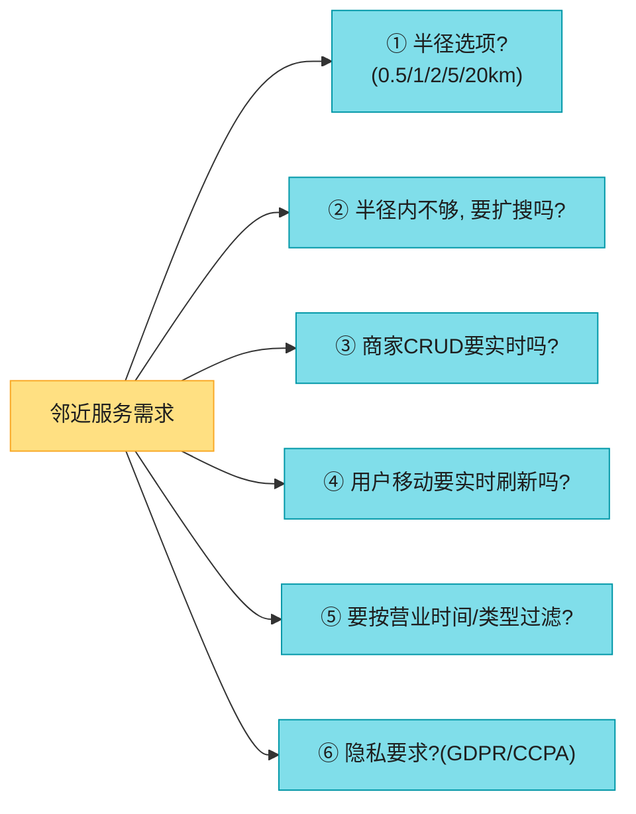

**原书确定的需求**:

| 维度 | 确认值 |
|------|--------|
| 形态 | **附近商家**(静态 POI,非实时人/车) |
| 半径选项 | 0.5 / 1 / 2 / 5 / 20 km(UI 可选) |
| 半径内不够 | 先只返回半径内的(时间够再聊扩搜) |
| 商家 CRUD | 商家自己增删改,**次日生效**(非实时) |
| 用户移动 | 假设移动慢,**不需实时刷新页面** |
| 过滤 | 按营业时间 / 类型(后置过滤即可) |

**功能性 / 非功能性需求**(背熟):

| 需求 | 说明 |
|------|------|
| **低延迟** ⭐ | 用户要快速看到附近商家 |
| **数据隐私** ⭐ | 位置敏感,遵守 GDPR / CCPA |
| **高可用 + 可扩展** | 密集区域高峰流量(饭点)要扛住 |

**估算**(背熟):

```
DAU: 1 亿
商家总数: 2 亿
每人每天搜索: 5 次
Search QPS = 1 亿 × 5 / 10^5(一天的秒数,本书用 10^5 简化)= 5,000 QPS

★ 读 >> 写(搜索 + 看详情 远多于 商家增删改)→ 读极重型系统
```

> 💡 **关键洞察**:**这是"读极重、写极轻"的系统**(接 Vol.1 Ch1 的缓存思想)。所以架构应**彻底偏向读优化**:数据预计算成索引放内存 + 多级缓存。**写(CRUD)低频且次日生效,绝不阻塞读**。

> 🔄 **2026 现代版怎么讲**(区分题类):
> "邻近服务分两种:**附近商家**(本题,静态 POI,CRUD 低频)和**附近的人/车**(Vol.2 Ch2,实时位置上报,WebSocket 推送)。两者架构差异巨大——本题重'索引 + 缓存',附近的人重'实时位置上报 + 推送'。**问清楚是哪种,问错全盘错**。"

---

## 2. 高层架构:LBS + Business 两服务

原书把系统拆成**两个独立服务**,这是架构精髓:

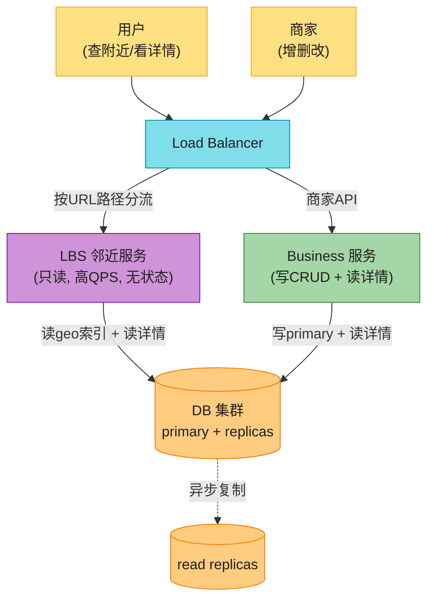

| 服务 | 职责 | 特点 |
|------|------|------|
| **LBS(邻近服务)** ⭐ | 按经纬度 + 半径找附近商家 | **只读、无写、高 QPS、无状态**(易水平扩展) |
| **Business 服务** | 商家 CRUD(写)+ 看详情(读) | 写低频;读详情高峰 QPS 高 |
| **DB 集群** | primary 写 + 多 replica 读 | 异步复制;LBS 读 replica |

> 📝 **为什么分两个服务?** 因为**读写特征完全不同**:LBS 是纯读高 QPS,Business 有写。**分离后各自独立扩展**——LBS 饭点加机器扛读,Business 平时少量机器够。这是 Vol.1 Ch1"读写分离"思想的落地。
>
> ⚠️ **复制延迟的影响**:LBS 读 replica,primary 写入后有复制延迟。但**本题商家次日生效**,这点不一致完全可接受。**如果改成实时(附近的车),就要读 primary 或半同步**(接 Vol.1 Ch1 读写一致性)。

### 2.1 API 设计

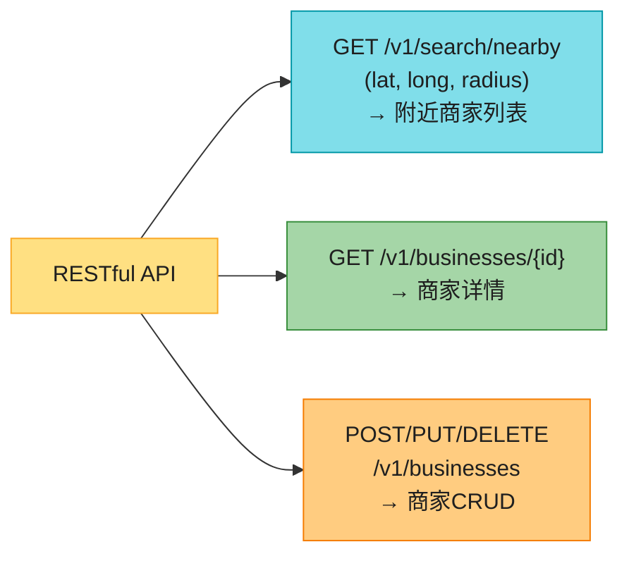

**核心端点**:
- `GET /v1/search/nearby?latitude=&longitude=&radius=`(radius 默认 5000m)
- 商家 CRUD:`GET/POST/PUT/DELETE /v1/businesses/{id}`

> 💡 **设计要点**:`/search/nearby` 只返回**列表摘要**(够渲染结果页),点进详情页再调 `GET /businesses/{id}` 拿完整信息(图片、评论、星级)。**列表和详情分离 = 减少单次传输量**。响应要支持**分页**(cursor,接 Vol.1 Ch11)。

### 2.2 数据模型

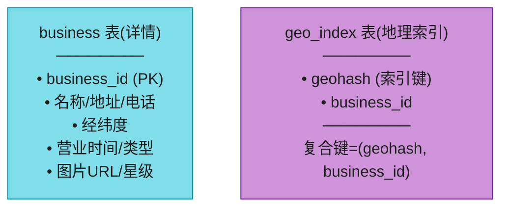

| 表 | 用途 | 读/写 |
|----|------|-------|
| **business 表** | 商家完整详情 | 读(详情)+ 写(CRUD) |
| **geo_index 表** | **地理空间索引**(高效检索附近) | 读(LBS 核心查) |

> 💡 **读极重 → 关系库够用**:read-heavy 系统用 MySQL + 读写分离即可。geo_index 表是性能关键,**geohash 怎么存见第 6 节**。

---

## 3. 地理空间索引:五种方案演进 ⭐⭐⭐⭐⭐(本章灵魂)

> 📝 **核心难题**:**二维数据(经纬度)怎么高效"按范围"检索?** 关系库的索引是一维的,直接对 lat/long 建索引,要**两个一维索引求交集**,数据集仍巨大。所以要把**二维降成一维**。

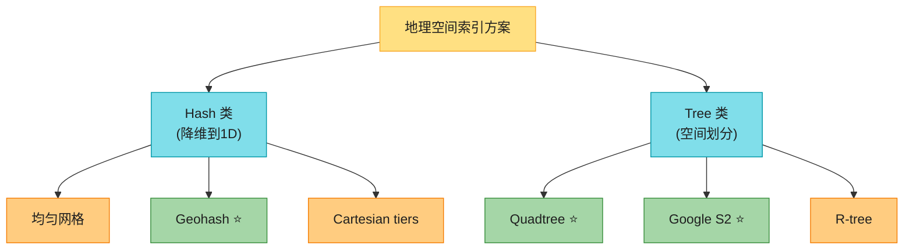

> 💡 **所有方案的本质**:**把地图切成更小的格子,对格子建索引**。区别只在"怎么切"。下面对 5 种逐一演进。

### 3.1 方案一:二维搜索(朴素,淘汰)

画一个圆,找圆内所有商家:

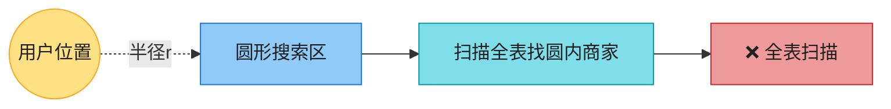

**伪 SQL**:
```sql
SELECT * FROM business
WHERE latitude  BETWEEN my_lat-r AND my_lat+r
  AND longitude BETWEEN my_long-r AND my_long+r;
```

**问题**:**全表扫描**。即使对 lat、long 分别建索引,也只优化了一个维度——要**两个一维结果集求交集**,每个结果集仍巨大(图:dataset1 ∩ dataset2)。

> ⚠️ **核心痛点**:**关系库索引只能优化一维**。二维数据要降维。

### 3.2 方案二:均匀网格(淘汰)

把世界均匀切成小方格:


**问题**:**商家分布极不均匀**——纽约市中心一格几万个商家,沙漠/海洋一格零个。均匀切格产生**严重数据倾斜**。**理想是密集区细网格、稀疏区粗网格**(quadtree/S2 能做到)。

### 3.3 方案三:Geohash ⭐⭐⭐(主流推荐)

> 📝 **Geohash**:把二维经纬度**降成一维字符串**(字母+数字)。核心思想:递归地把世界切成更小的格,每多一位编码,格子变小。

**怎么编码**(手算过程):

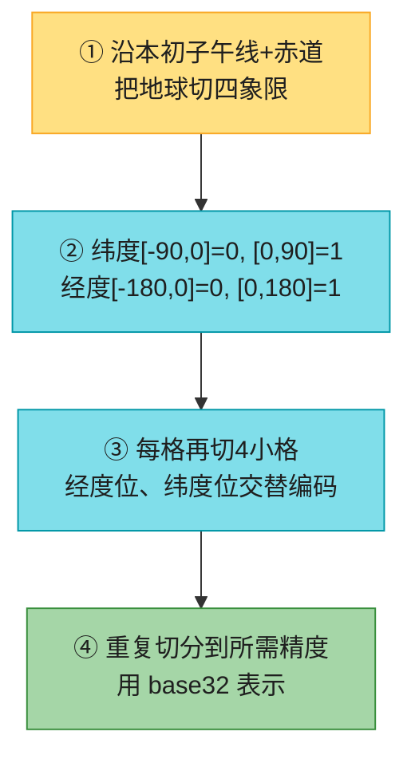

**例子**(长度 6):
- Google 总部 → `9q9hvu`
- Facebook 总部 → `9q9jhr`
- 公共前缀 `9q9` 越长 = 越接近

**12 个精度等级**(背关键的 4-6):

| Geohash 长度 | 格子宽 × 高 | 适用半径 |
|------------|-----------|---------|
| 4 | 39.1km × 19.5km | 5km / 20km |
| 5 | 4.9km × 4.9km | 1km / 2km |
| **6** | **1.2km × 609m** | **0.5km** |
| 7 | 152.9m × 152.4m | — |

> 💡 **我们只关心长度 4-6**:>6 格子太小(查不到几个),<4 格子太大(返回太多)。**半径 → geohash 长度映射表**是面试要复述的(0.5km→6,1km/2km→5,5km/20km→4)。

---

#### 深入:Geohash 的两个边界问题 ⭐⭐⭐(面试必问)

geohash 有个**诱人但不成立的性质**:公共前缀越长 = 越近。**反过来不成立**——两个很近的点可能**完全没有公共前缀**。

**边界问题 1:近在咫尺却无公共前缀**

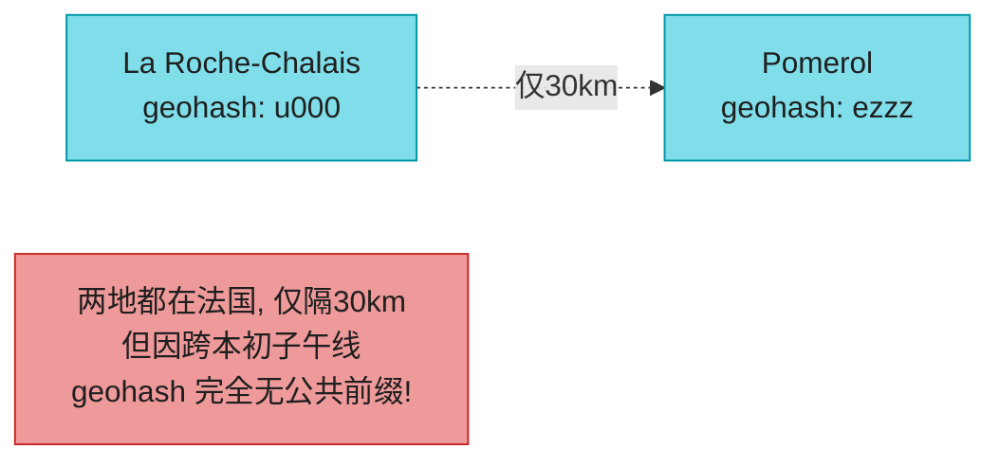

**原因**:跨赤道 / 本初子午线的两点,在"世界两半"上,geohash 第一位就不同。所以**只查 `WHERE geohash LIKE '9q8zn%'` 会漏掉边界对面的邻居**。

**边界问题 2:有长公共前缀却不在同一格**

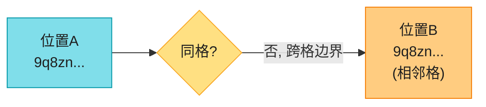

**通用解法**:**不只查当前格,还要查它所有邻居格**(8 个邻居)。邻居的 geohash 可在 **O(1) 时间**算出。

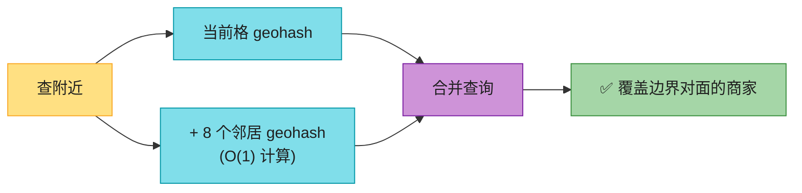

> 🪤 **追问陷阱(高频)**:"geohash 公共前缀长就一定近吗?" → "**不成立**。公共前缀长 → 近,**但近 → 公共前缀长 不成立**(跨赤道/本初子午线的近点完全无公共前缀)。所以查附近必须**当前格 + 8 邻居**一起查,否则漏边界对面。"

**半径内商家不够怎么办?**

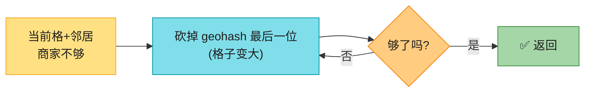

**扩搜**:每次砍掉 geohash 最后一位 = 格子放大一级,**逐级扩大直到结果够**。

### 3.4 方案四:Quadtree ⭐⭐(主流推荐)

> 📝 **Quadtree(四叉树)**:递归地把空间**切成 4 个象限**,直到每个格子的内容满足条件(如**每格 ≤100 个商家**)。**密集区切得细、稀疏区切得粗**——正好解决均匀网格的倾斜问题。

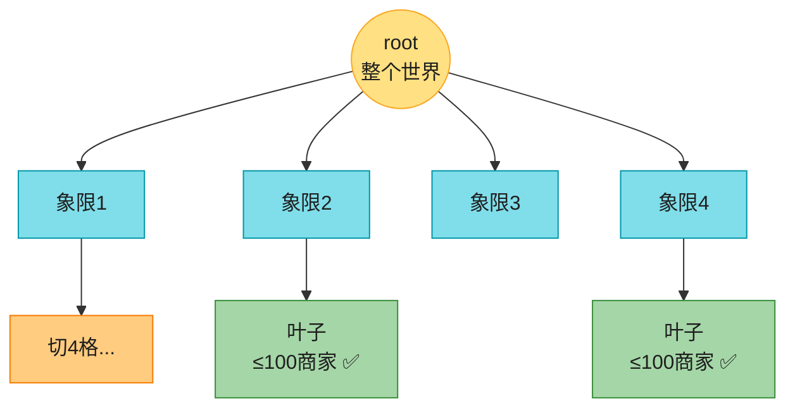

**关键性质**:**内存数据结构,不是数据库方案**。每个 LBS 服务器**启动时在内存里建树**,查询走内存(超快)。

---

#### 深入:Quadtree 的内存估算 + 构建(面试加分)⭐⭐

原书给的手算过程,这是 quadtree 选型的关键论据。

**节点数据结构**:

| 节点类型 | 内容 | 大小 |
|---------|------|------|
| **叶子节点** | 格子四角坐标(32B)+ 最多 100 个商家 ID(8B×100) | **832 字节** |
| **内部节点** | 格子四角坐标(32B)+ 4 个子节点指针(32B) | **64 字节** |

**总内存估算**(2 亿商家,每格 ≤100):
```
叶子数 = 2 亿 / 100 = 200 万
内部节点数 = 叶子数 × 1/3 ≈ 67 万(四叉树性质:内部节点约为叶子的 1/3)
总内存 = 200万 × 832B + 67万 × 64B ≈ 1.71 GB
```

> 💡 **结论**:**1.71GB,单机轻松放下**。这是 quadtree 选型的核心论据——索引不大,内存够。**但单机扛不住的是 CPU/网络(读量大),所以仍要多副本分散读**(见第 6 节)。

**构建时间**:O((n/100)·log(n/100)),2 亿商家约**几分钟**。

**运维要点**(原书强调):
- **构建几分钟 → 启动慢** → 不能整批重启(服务中断)。用**滚动发布**或**蓝绿部署**。
- **更新方式**:① 每晚重建(nightly job,简单,接受短暂 stale);② 实时增量更新(需加锁,复杂,多线程下要并发控制)。
- **批量失效风暴**:nightly job 同时失效大量 key,打爆缓存(接 Vol.1 Ch1 缓存雪崩)。

### 3.5 方案五:Google S2 ⭐⭐

> 📝 **Google S2**:内存方案,把**球面**映射到 **1D 索引**(基于 **Hilbert 曲线**,空间填充曲线)。Google Maps、Tinder 用。

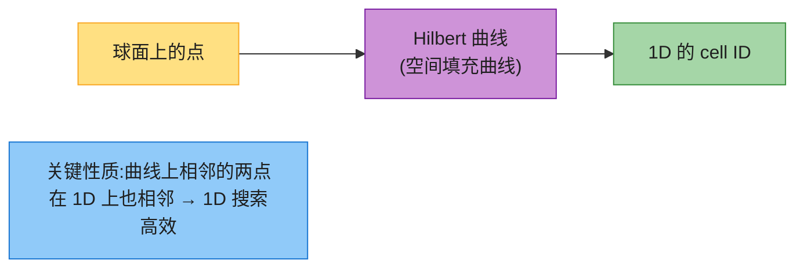

**Hilbert 曲线的魔力**:空间填充曲线把 2D"折叠"成 1D。Hilbert 曲线比简单的 Z 曲线(Morton 码)**保局部性更好**——曲线上相邻的点,2D 上也相邻(geohash 用 Z 曲线,边界问题更严重)。

**S2 的两大杀手锏**:

| 特性 | 说明 |
|------|------|
| **Geofencing(地理围栏) ⭐** | 用**任意层级**的 cell 覆盖任意区域(学校、社区、自定义多边形)。**用户进入/离开区域时触发通知**——Tinder 用这个做"匹配范围内的用户"。 |
| **Region Cover 算法** | 不像 geohash 固定精度,S2 可指定 min/max level + max cells,**格子大小灵活**,覆盖更精细省。 |

> 🪤 **追问陷阱**:"S2 比geohash好在哪?" → "三点:① **球面**(geohash 是平面投影,极区失真);② **Hilbert 曲线局部性更好**(比 geohash 的 Z 曲线边界问题轻);③ **geofencing + region cover 灵活**(任意层级覆盖任意区域)。代价是**复杂,面试不易讲清**,所以原书建议面试选 geohash/quadtree。"

### 3.6 三方案对比 + 选型建议

| 维度 | **Geohash** | **Quadtree** | **Google S2** |
|------|------------|--------------|--------------|
| 类型 | Hash(1D 字符串) | Tree(内存树) | 球面 → 1D(Hilbert) |
| 实现 | **简单**,无需建树 | 需建树,稍复杂 | 复杂 |
| 动态密度 | ❌ 固定格大小 | ✅ 密集区切细 | ✅ 灵活 |
| 半径查询 | ✅ | ✅ | ✅ |
| **k-nearest** | 一般 | ✅ 强(按 k 自动扩范围) | ✅ |
| **geofencing** | 弱 | 弱 | ✅ 强 |
| 更新 | **简单**(改一行) | 复杂(改树 + 锁) | 中 |
| 边界问题 | ✅ 有(需查邻居) | 无 | 无 |
| 谁用 | Bing/Redis/MongoDB/Lyft | Yext/ES | Google Maps/Tinder |

> 💡 **原书建议**:**面试选 geohash 或 quadtree**(S2 太复杂不易讲清)。我个人补充:**"附近商家"选 geohash(简单 + 边界靠查邻居);"k 最近"选 quadtree;"geofencing 推送"选 S2**。

---

## 4. 数据库扩展 ⭐⭐⭐⭐⭐(读副本 vs 分片)

原书这里有个**反直觉但正确的判断**:geo 索引表**不要分片,用读副本**。

### 4.1 business 表:按 business_id 分片

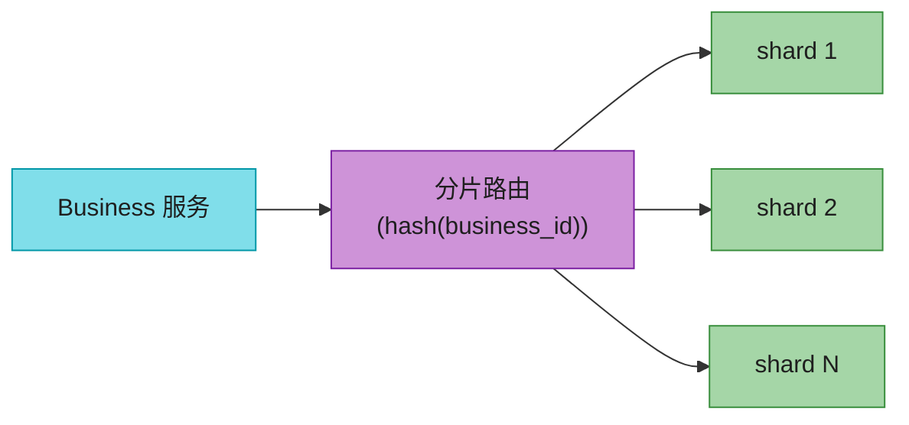

business 表数据量大(2 亿商家 + 详情),按 `business_id` 分片,**负载均匀、运维简单**(接 Vol.1 Ch1 分片)。

### 4.2 geo_index 表:两种结构

| 方案 | 结构 | 优劣 |
|------|------|------|
| **方案 1**:JSON 数组 | 一个 geohash 一行,值是 business_id 数组 | 更新要扫数组 + 加锁,**复杂** ❌ |
| **方案 2**:每商家一行 ⭐ | `(geohash, business_id)` 复合键,一商家一行 | 增删改**无需锁**,简单 ✅ |

> 💡 **原书推荐方案 2**:复合主键 `(geohash, business_id)`,增删商家只是增删一行,**无锁、无并发问题**。这是 geo 索引表设计的标准答案。

### 4.3 geo_index 表:读副本,不分片 ⭐(反直觉)

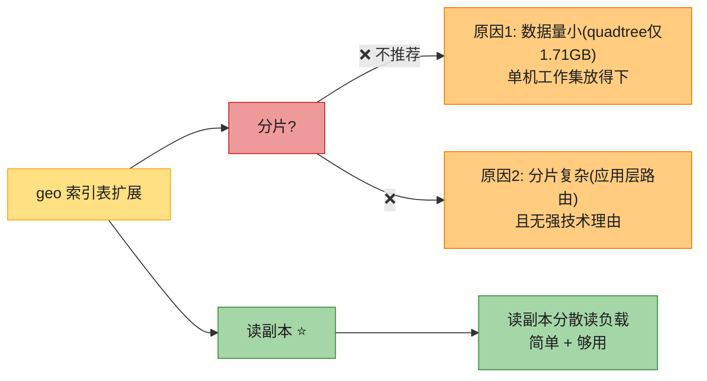

> 📝 **原书核心判断**:**geo 索引表数据量小(整个 quadtree 才 1.71GB),单机内存工作集放得下。瓶颈不是存储而是 CPU/网络(读量)。所以用读副本分散读,不要分片**——分片会引入应用层路由复杂度,却解决不了真正的瓶颈。
>
> 🪤 **追问陷阱(高频)**:"geo 索引表为什么不分片?" → "**数据量小**(1.71GB 单机放得下),**瓶颈是读不是存储**。分片解决存储瓶颈,但增加应用层路由复杂度,对读瓶颈无帮助。**读副本才解决读瓶颈**。这是'对症下药'——别为了分片而分片。"——这句直接 senior。

---

## 5. 缓存 ⭐⭐⭐⭐(geohash 多精度)

### 5.1 要不要缓存?(原书的审慎)

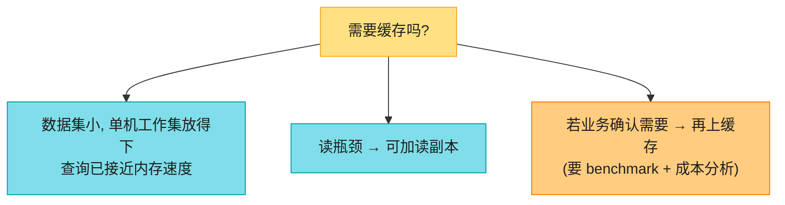

> ⚠️ **原书的审慎**(加分点):**不要无脑加缓存**。数据集小 + 查询已接近内存速度,缓存收益不明显。**要先确认读瓶颈,benchmark 后再上**。这是"别过度工程"的体现。

### 5.2 缓存 key 怎么选?(原书关键)

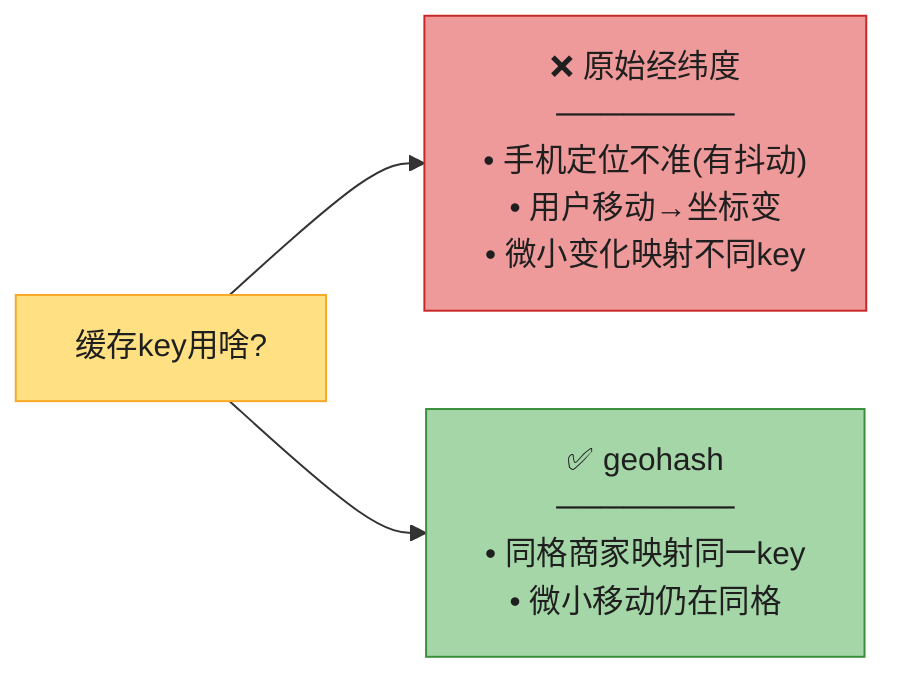

> 📝 **关键认知**:**原始经纬度不是好 key**——手机定位有抖动(原地不动坐标也微变)+ 用户移动。**理想是"小范围位置变化映射同一 key"**。geohash 天然满足(同格所有商家共享 key)。

### 5.3 缓存两类数据

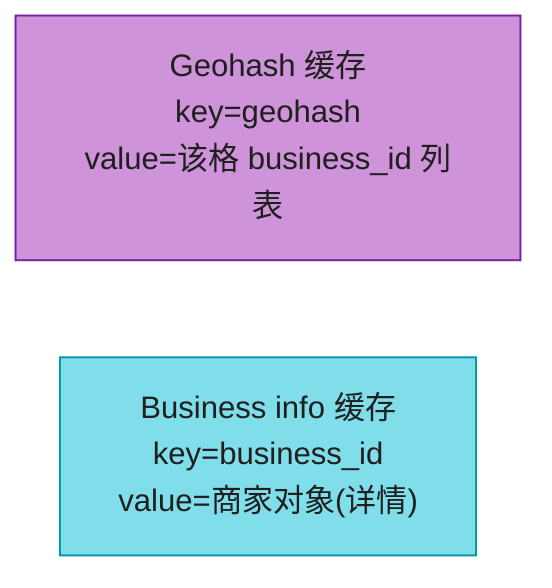

| 缓存 | key | value | 用途 |
|------|-----|-------|------|
| **Geohash 缓存** | geohash | business_id 列表 | LBS 快速拿附近 ID |
| **Business info 缓存** | business_id | 商家对象 | 补全详情 |

**多精度缓存**:用户可选 4 个半径(0.5/1/2/5km)→ 对应 geohash 长度 6/5/5/4。**预计算 3 个精度(geohash_4/5/6)的 ID 列表存 Redis**。

**内存估算**:
```
200M 商家 × 8 字节(ID) × 3 精度 ≈ 5 GB
```

> 💡 **5GB 单 Redis 够,但为低延迟 + 高可用,全球部署多副本**(每大区一份)。这呼应第 7 节多 Region。

---

## 6. 多 Region 多 AZ ⭐⭐⭐⭐

```mermaid
flowchart TB
    U["全球用户"] --> GEO["全局 DNS<br/>(按地理路由)"]
    GEO -->|"北美用户"| R1["Region: US<br/>多AZ"]
    GEO -->|"欧洲用户"| R2["Region: EU<br/>多AZ"]
    GEO -->|"亚洲用户"| R3["Region: Asia<br/>多AZ"]

    style U fill:#FFE082,stroke:#F9A825,color:#1f1f1f
    style GEO fill:#80DEEA,stroke:#0097A7,color:#1f1f1f
    style R1 fill:#A5D6A7,stroke:#388E3C,color:#1f1f1f
    style R2 fill:#A5D6A7,stroke:#388E3C,color:#1f1f1f
    style R3 fill:#A5D6A7,stroke:#388E3C,color:#1f1f1f
```

**三大收益**(背熟):

| 收益 | 说明 |
|------|------|
| **就近(低延迟)** | 用户连物理最近的机房(US-West 用户连 US-West) |
| **流量分散** | 日韩人口密集 → 独立 Region 或多 AZ 分担 |
| **隐私合规** ⭐ | 某国要求数据本地存储 → 在该国设 Region + DNS 路由限制 |

> 💡 **隐私这点是 LBS 特有**:位置数据受 GDPR/CCPA 严格管控,**某些国家强制数据不出境**(中国、欧盟)。**DNS 按国家路由到本地 Region** 是合规手段(接 Vol.1 Ch1 多机房)。

---

## 7. 完整架构(最终设计图 Fig 21)

```mermaid
flowchart TB
    U["用户<br/>(查附近)"] --> LB["Load Balancer"]
    LB --> LBS["LBS 邻近服务"]
    LBS -->|"① 算 geohash + 邻居"| CALC["本地计算"]
    LBS -->|"② 并行查 ID 列表"| GR[("Geohash Redis<br/>geohash→IDs")]
    LBS -->|"③ 批量补全详情"| BR[("Business info Redis<br/>id→对象")]
    LBS -->|"④ 算距离+排序"| RANK["Haversine 排序"]
    RANK --> RET["返回列表"]

    BO["商家<br/>(CRUD)"] --> LB
    LB --> BIZ["Business 服务"]
    BIZ -->|"写"| DB[("DB primary")]
    BIZ -->|"读详情(缓存miss)"| DB
    DB -.->|"复制"| REPL[("读副本")]
    NOTE["nightly job<br/>次日生效, 刷缓存"]

    style U fill:#FFE082,stroke:#F9A825,color:#1f1f1f
    style BO fill:#FFE082,stroke:#F9A825,color:#1f1f1f
    style LB fill:#80DEEA,stroke:#0097A7,color:#1f1f1f
    style LBS fill:#CE93D8,stroke:#7B1FA2,color:#1f1f1f
    style CALC fill:#80DEEA,stroke:#0097A7,color:#1f1f1f
    style GR fill:#90CAF9,stroke:#1976D2,color:#1f1f1f
    style BR fill:#90CAF9,stroke:#1976D2,color:#1f1f1f
    style RANK fill:#FFCC80,stroke:#F57C00,color:#1f1f1f
    style RET fill:#A5D6A7,stroke:#388E3C,color:#1f1f1f
    style BIZ fill:#A5D6A7,stroke:#388E3C,color:#1f1f1f
    style DB fill:#FFCC80,stroke:#F57C00,color:#1f1f1f
    style REPL fill:#FFCC80,stroke:#F57C00,color:#1f1f1f
    style NOTE fill:#EF9A9A,stroke:#C62828,color:#1f1f1f
```

**查附近的 6 步流程**(背熟):
1. 客户端发 (lat, long, radius=500m) 给 LB。
2. LB 转 LBS。
3. LBS 查半径→geohash 长度表(500m→长度 6)。
4. LBS 算当前 geohash + 8 邻居 geohash。
5. **并行**从 Geohash Redis 拿每格的 business_id 列表(并行降延迟)。
6. 用 ID 列表从 Business info Redis 批量补全详情 → **Haversine 算距离 → 排序 → 返回**。

---

## 8. 2026 现代增量(原书没讲的硬核)⭐⭐⭐⭐

### 8.1 Redis GEO 命令族(生产第一实现)

原书只提"Redis geohash",但没讲**实际的 GEO 命令族**——这是 2026 生产里用得最多的。

```mermaid
flowchart LR
    G["Redis GEO 命令族"] --> A["GEOADD key lng lat member<br/>添加商家"]
    G --> B["GEOSEARCH key<br/>FROGMEMBER/FROMMEMBER<br/>BYRADIUS r m<br/>ASC/DESC COUNT k<br/>⭐ 核心"]
    G --> C["GEODIST<br/>两点距离"]
    G --> D["GEOHASH<br/>返回geohash"]

    style G fill:#FFE082,stroke:#F9A825,color:#1f1f1f
    style A fill:#80DEEA,stroke:#0097A7,color:#1f1f1f
    style B fill:#A5D6A7,stroke:#388E3C,color:#1f1f1f
    style C fill:#FFCC80,stroke:#F57C00,color:#1f1f1f
    style D fill:#FFCC80,stroke:#F57C00,color:#1f1f1f
```

> 📝 **Redis GEO 底层就是 geohash + sorted set**(score=geohash 整数编码)。`GEOSEARCH`(Redis 6.2+ 取代废弃的 `GEORADIUS`)一行搞定"附近 + 半径 + 排序 + 限量"。**Lyft 用 Redis 扛 1000 万 QPS 做附近车匹配**(原书引用)。**面试说"用 Redis GEOSEARCH"就是生产级答案**,不用自己实现 geohash。

### 8.2 PostGIS(关系库的地理扩展)

```mermaid
flowchart LR
    P["PostGIS(PostgreSQL扩展)"] --> A["GIST 空间索引"]
    P --> B["ST_DWithin<br/>(是否在距离内)"]
    P --> C["ST_Distance<br/>(两点距离)"]
    P --> D["ST_DWithin 走索引, 极快"]

    style P fill:#80DEEA,stroke:#0097A7,color:#1f1f1f
    style A fill:#A5D6A7,stroke:#388E3C,color:#1f1f1f
    style B fill:#A5D6A7,stroke:#388E3C,color:#1f1f1f
    style C fill:#A5D6A7,stroke:#388E3C,color:#1f1f1f
    style D fill:#FFCC80,stroke:#F57C00,color:#1f1f1f
```

> 💡 **PostgreSQL + PostGIS 是 2026 做 LBS 的"不用造轮子"首选**——`ST_DWithin(geom, point, radius)` 直接走 GIST 空间索引,不需要自己实现 geohash/quadtree。**面试说"用 PostGIS"也是及格答案**,但要能讲清 GIST 索引原理(R-tree 变种)。

### 8.3 Uber H3 六边形网格(2026 最火的替代)⭐⭐⭐

原书完全没提。这是大厂地理题的**新潮流**。

```mermaid
flowchart LR
    H["Uber H3 六边形网格"] --> A["球面六边形铺满<br/>(非方形)"]
    H --> B["六边形邻居性质优于方形"]
    H --> C["谁用: Uber/滴滴/<br/>城市规划/流行病"]

    style H fill:#CE93D8,stroke:#7B1FA2,color:#1f1f1f
    style A fill:#80DEEA,stroke:#0097A7,color:#1f1f1f
    style B fill:#A5D6A7,stroke:#388E3C,color:#1f1f1f
    style C fill:#FFCC80,stroke:#F57C00,color:#1f1f1f
```

| 对比 | 方形网格(geohash) | **六边形网格(H3)** |
|------|------------------|-------------------|
| 邻居数 | 8 个(但分两类:边邻/点邻,距离不同) | **6 个等距邻居**(性质统一) |
| 邻居距离 | 不等(角邻居更远) | **等距** |
| 球面 | 平面投影失真 | **真球面铺贴** |
| 应用 | 传统 LBS | Uber 定价区、热力图、流量分析 |

> 💡 **为什么六边形好?** 方形网格的 8 个邻居里,**边邻居和角邻居到中心的距离不同**(角邻居远 √2 倍),做"邻居合并/扩散"时距离不均。**六边形的 6 个邻居到中心等距**,做空间聚合(如"该区订单量")更自然。**Uber 用 H3 做动态定价( surge)的区域划分**。

> 🪤 **追问陷阱(高级)**:"六边形比方形好在哪?" → "**邻居等距**。方形 8 邻居里角邻居距离是边邻居的 √2 倍,做空间扩散/聚合距离不均;六边形 6 邻居等距,聚合更自然。Uber 用 H3 做 surge 定价分区。这是 2026 地理题的新答案。"

### 8.4 Haversine 公式(按距离排序必备)

原书没讲,但"算用户到商家的距离 + 排序"必须用。

```python
import math
def haversine(lat1, lon1, lat2, lon2):
    """球面两点距离(公里), 经纬度算距离的标准公式"""
    R = 6371  # 地球半径 km
    p1, p2 = math.radians(lat1), math.radians(lat2)
    dphi = math.radians(lat2 - lat1)
    dlmb = math.radians(lon2 - lon1)
    a = math.sin(dphi/2)**2 + math.cos(p1)*math.cos(p2)*math.sin(dlmb/2)**2
    return 2 * R * math.asin(math.sqrt(a))
```

> 📝 **Haversine**:基于球面三角,算两经纬度点的大圆距离。**geohash 只能粗筛"哪几格",精确距离和排序要 Haversine**。这是 LBS"排序"环节的标配。

### 8.5 Geofencing 推送(S2 的强项)

```mermaid
sequenceDiagram
    participant U as 用户(移动)
    participant L as LBS(上报位置)
    participant G as Geofence 服务
    participant P as Push
    Note over U,G: 用户进入某区域(如商场)
    U->>L: 上报位置
    L->>G: 查是否进入 geofence
    G-->>P: 触发(进入商场)
    P-->>U: 推送"商场优惠券"
```

> 💡 **Geofencing**:用户**进入/离开**预设区域时触发动作。**Tinder 用 S2 做"匹配范围内的用户"**,外卖 App 用它做"到店提醒"。这是"附近商家"之上更高级的玩法,用 **S2 region cover** 实现最自然。

### 8.6 隐私脱敏(原书只提 GDPR)

原书提了 GDPR/CCPA 但没讲**技术手段**:

```mermaid
flowchart TD
    P["位置隐私手段"] --> A["① 位置模糊化<br/>(精度降到街区级)"]
    P --> B["② k-匿名<br/>(位置至少k人共享)"]
    P --> C["③ 差分隐私<br/>(加噪声, Apple用)"]
    P --> D["④ 短期保留+不留轨迹<br/>(只存当前, 不存历史)"]
    P --> E["⑤ 本地化存储<br/>(数据不出境)"]

    style P fill:#FFE082,stroke:#F9A825,color:#1f1f1f
    style A fill:#80DEEA,stroke:#0097A7,color:#1f1f1f
    style B fill:#80DEEA,stroke:#0097A7,color:#1f1f1f
    style C fill:#CE93D8,stroke:#7B1FA2,color:#1f1f1f
    style D fill:#A5D6A7,stroke:#388E3C,color:#1f1f1f
    style E fill:#FFCC80,stroke:#F57C00,color:#1f1f1f
```

> 💡 **话术**:"位置是敏感数据。我会:① **精度降级**(查附近商家不需要米级精度,街区级够,降低可识别性);② **不存历史轨迹**(只存当前位置,用完即删);③ 差分隐私聚合统计;④ 数据本地化(不出境)。**Apple 的'重要地点'就用差分隐私 + 端侧处理,服务器拿不到原始轨迹**。"

---

## ⚠️ 已过时 / 书里没说(2022 → 2026)

| 原书(2022) | 2026 现状 | 面试应对 |
|------------|----------|---------|
| 自己实现 geohash | **Redis GEOSEARCH / PostGIS** 现成 | 说"用 Redis GEO/PostGIS",讲清底层 |
| 只讲方形网格 | **Uber H3 六边形**是新潮流 | 讲六边形邻居等距优势 |
| 没讲距离公式 | **Haversine** 是排序必备 | 给出公式,讲排序环节 |
| geofencing 一笔带过 | S2 region cover + 推送是大玩法 | 讲进入区域触发通知 |
| 隐私只提 GDPR | 差分隐私/k-匿名/模糊化 | 讲技术手段,不只合规名词 |
| DB 用 MySQL | **PostgreSQL+PostGIS** 更适合 LBS | 提 PostGIS GIST 索引 |
| 没提向量 | 现代推荐也融合 ANN(接 Vol.1 Ch11) | 提"附近+个性化"融合 |
| 实时性"次日生效" | 外卖/打车要**近实时** | 区分静态POI vs 动态,讲 trade-off |

---

## 💻 代码示例

### 示例 1:Redis GEOSEARCH(生产级一行搞定)

```python
import redis
r = redis.Redis()

def add_business(biz_id, lng, lat):
    r.geoadd("businesses", (lng, lat, biz_id))      # GEOADD key lng lat member

def search_nearby(lng, lat, radius_m=500, limit=20):
    # GEOSEARCH key FROMLONLAT lng lat BYRADIUS r m ASC COUNT k
    return r.geosearch(
        "businesses",
        longitude=lng, latitude=lat,
        radius=radius_m, unit="m",
        sort="ASC",           # 按距离升序
        count=limit,
        withdist=True,        # 返回距离
        withcoord=True,
    )
# 底层: geohash + sorted set, 自动处理边界(查邻居格)
```

### 示例 2:Geohash 手算 + 邻居(不用库)

```python
BASE32 = "0123456789bcdefghjkmnpqrstuvwxyz"

def encode_geohash(lat, lng, precision=6):
    """经纬度 → geohash 字符串"""
    min_lat, max_lat = -90.0, 90.0
    min_lng, max_lng = -180.0, 180.0
    geohash = []
    bits = [16,8,4,2,1]; bit = 0; ch = 0; even = True
    while len(geohash) < precision:
        if even:                              # 经度
            mid = (min_lng + max_lng) / 2
            if lng >= mid: ch |= bits[bit]; min_lng = mid
            else: max_lng = mid
        else:                                 # 纬度
            mid = (min_lat + max_lat) / 2
            if lat >= mid: ch |= bits[bit]; min_lat = mid
            else: max_lat = mid
        even = not even
        if bit < 3: bit += 1
        else: geohash.append(BASE32[ch]); bit = 0; ch = 0
    return "".join(geohash)

# 附近查询: 当前格 + 8 邻居(邻居 geohash 可 O(1) 计算)
def nearby_geohashes(gh):
    return [gh] + compute_8_neighbors(gh)      # 邻居算法见 geohash 邻居表
```

### 示例 3:查询流程(LBS 核心)

```python
RADIUS_TO_LEN = {500: 6, 1000: 5, 2000: 5, 5000: 4, 20000: 4}   # 半径→geohash长度

def get_nearby_businesses(lat, lng, radius_m=500):
    gh_len = RADIUS_TO_LEN[radius_m]
    my_gh = encode_geohash(lat, lng, gh_len)
    ghs = [my_gh] + compute_8_neighbors(my_gh)                  # 当前+8邻居
    # ① 并行查每格的 business_id 列表(缓存)
    pipe = redis_redis.pipeline()
    for gh in ghs:
        pipe.smembers(f"geo:{gh}")                             # geohash→ID集合
    id_lists = pipe.execute()
    biz_ids = set().union(*id_lists)
    # ② 批量补全详情
    biz_objs = redis_redis.mget([f"biz:{i}" for i in biz_ids])
    # ③ Haversine 算距离 + 排序
    ranked = sorted(
        [b for b in biz_objs if b],
        key=lambda b: haversine(lat, lng, b.lat, b.lng)
    )
    return ranked[:20]
```

---

## 🪤 追问陷阱(面试官最爱问,本章集)

1. **"二维数据怎么索引?"** → **降维**:geohash(1D 字符串)/ quadtree(内存树)/ S2(Hilbert)。本质都是"切格子建索引"。
2. **"为什么不能直接对 lat/long 建索引?"** → 关系库索引是一维的,两个一维索引求交集,结果集仍巨大。
3. **"geohash 公共前缀长就一定近吗?"** → **不成立**!跨赤道/本初子午线的近点无公共前缀。查附近必须**当前格 + 8 邻居**。
4. **"geohash 还是 quadtree?"** → 附近商家选 geohash(简单);k-nearest 选 quadtree(按 k 自动扩范围);geofencing 选 S2。
5. **"quadtree 内存够吗?"** → 2 亿商家约 1.71GB(叶子 832B × 200万 + 内部 64B × 67万),**单机轻松放下**。
6. **"geo 索引表为什么不分片?"** → 数据量小(1.71GB)单机够,瓶颈是读不是存储。**读副本解决读瓶颈,分片只增加复杂度**。
7. **"缓存 key 用经纬度行吗?"** → 不行,手机定位抖动 + 移动,微小变化映射不同 key。**用 geohash**(同格映射同一 key)。
8. **"半径内商家不够?"** → 砍掉 geohash 最后一位(格子放大),逐级扩搜。
9. **"商家增删改怎么更新索引?"** → geohash 简单(改一行,复合键无锁);quadtree 复杂(改树 + 锁)。本题次日生效 → nightly job 重建。
10. **"六边形(H3)比方形好在哪?"** → 邻居等距(方形角邻居远 √2 倍),聚合自然。Uber 用 H3 做 surge 定价。
11. **"怎么按距离排序?"** → geohash 粗筛后用 **Haversine 公式**算精确距离 + 排序。
12. **"附近的人 vs 附近商家?"** → 商家静态(索引+缓存);人/车实时(位置上报 + WebSocket 推送,接 Vol.2 Ch2)。
13. **"位置隐私怎么保护?"** → 精度降级 + 不存轨迹 + 差分隐私 + 数据本地化。
14. **"geofencing 推送怎么做?"** → 用户上报位置,查是否进入预设区域(S2 region cover),进入则触发 push。
15. **"多 Region 为什么必要?"** → 就近(低延迟)+ 分散流量 + **隐私合规**(数据不出境)。

---

## 🏭 生产级产品速查表

| 产品 | 索引方案 | 特色 |
|------|---------|------|
| **Yelp** | geohash + 业务层 | 本题原型 |
| **Lyft** | **Redis GEO**(geohash+sorted set) | **1000 万 QPS** 扛附近车匹配 |
| **Uber** | **H3 六边形** ⭐ | surge 定价分区、热力图 |
| **Google Maps** | **S2** | 球面 + Hilbert + region cover |
| **Tinder** | **S2** | geofencing 匹配范围内用户 |
| **Yext** | **Quadtree** | Denver 附近的真实 quadtree 实例 |
| **Bing Maps / MongoDB** | **Geohash** | 2d index |
| **Elasticsearch** | geohash + quadtree | geo_shape + geo_distance |
| **PostgreSQL** | **PostGIS(GIST)** | `ST_DWithin` 走空间索引 |

> 🏭 **业界标杆**:**Lyft 的 "1000 万 QPS Redis 架构"**(原书引用视频)是 LBS 必看——它用 Redis GEO + 一致性哈希分片 + 全球部署,扛住了打车高峰。**Uber H3** 是六边形网格的开源标杆。

---

## 📝 本章要点总结

```mermaid
flowchart LR
    ROOT(["V2-Ch1 邻近服务<br/>地理索引 + 读极重 + 多Region"])

    B1["需求+估算 ⭐<br/>────────<br/>• 附近商家(静态)<br/>• 100M DAU, 5K QPS<br/>• 读极重写极轻"]
    B2["地理索引 ⭐⭐<br/>────────<br/>• 2D→均匀网格→geohash<br/>→quadtree→S2<br/>• 本质:切格子建索引"]
    B3["Geohash ⭐⭐<br/>────────<br/>• 降维1D字符串<br/>• 两个边界问题→查8邻居<br/>• 半径→长度映射"]
    B4["Quadtree/S2 ⭐<br/>────────<br/>• 四叉树内存1.71GB<br/>• 密集区切细<br/>• S2:Hilbert+geofencing"]
    B5["扩展+缓存 ⭐⭐<br/>────────<br/>• business分片<br/>• geo索引用读副本非分片<br/>• geohash多精度缓存"]
    B6["2026增量(补)<br/>────────<br/>• Redis GEO/PostGIS<br/>• Uber H3六边形<br/>• Haversine/geofencing/隐私"]

    ROOT --> B1
    ROOT --> B2
    ROOT --> B3
    ROOT --> B4
    ROOT --> B5
    ROOT --> B6

    style ROOT fill:#FFE082,stroke:#F57C00,color:#1f1f1f,stroke-width:3px
    style B1 fill:#80DEEA,stroke:#0097A7,color:#1f1f1f
    style B2 fill:#CE93D8,stroke:#7B1FA2,color:#1f1f1f
    style B3 fill:#A5D6A7,stroke:#388E3C,color:#1f1f1f
    style B4 fill:#90CAF9,stroke:#1976D2,color:#1f1f1f
    style B5 fill:#FFCC80,stroke:#F57C00,color:#1f1f1f
    style B6 fill:#EF9A9A,stroke:#C62828,color:#1f1f1f
```

**核心 Takeaways**:

1. **地理索引选型是灵魂**——二维降一维:geohash / quadtree / S2 三选一。**面试选 geohash 或 quadtree 讲清**(S2 太复杂)。
2. **Geohash 两个边界问题必背**——近点可能无公共前缀(跨赤道/本初子午线)→ **查当前格 + 8 邻居**。
3. **Quadtree 是内存方案**——1.71GB 单机放下,密集区切细;构建慢→滚动发布/nightly 重建。
4. **读极重 → 用读副本而非分片扩展 geo 索引**(数据小,瓶颈是读)。这是反直觉但正确的判断。
5. **缓存 key 用 geohash 不用经纬度**(抖动 + 移动);多精度预计算(geohash_4/5/6)。
6. **多 Region 三收益**:就近 + 分流 + **隐私合规**(数据不出境)。
7. **2026 生产首选 Redis GEOSEARCH / PostGIS**(不用自己实现);**Uber H3 六边形**是新潮流(邻居等距)。
8. **Haversine 算距离排序**是 LBS 标配;geofencing(S2)做"进入区域触发"是高级玩法。
9. **区分静态 vs 动态**:附近商家(本题,索引+缓存)vs 附近的人/车(Vol.2 Ch2,实时上报+推送)。
10. **原书停在 2022**——补 Redis GEO/PostGIS/H3/Haversine/geofencing/隐私脱敏,才能拿 strong hire。

> 🔗 **连接上下章**:**Vol.1 Ch1** 的"读写分离 / 缓存 / 多 Region"是本题地基;本题的 **geohash / Redis GEO** 直接服务于 **V2-Ch2 附近的好友**(把"附近商家"换成"附近在线好友" + 实时位置上报);**V2-Ch3 Google Maps** 把地理索引推到路网级别(最短路径)。
