# Volume 2 · Chapter 2: 设计附近的好友 (Design Nearby Friends)

> **本章定位**:附近的好友是**"实时位置 + 好友图 + 推送扇出"**的题——它是 Facebook "Nearby Friends"、微信"附近的人"、Snapchat **zenly**、Life360 家人定位的核心。和 V2-Ch1 邻近服务(附近**商家**)长得像,但有本质区别:**商家位置静态、客户端拉(pull);好友位置动态、服务器推(push)**。灵魂是三件事:**① 怎么把一个人的位置更新,实时扇出(fan-out)给所有在线好友(Redis pub/sub)② 怎么扛海量并发更新(334K 更新/秒,扇出后 1300 万/秒)③ 有状态服务的运维(连接排空、一致性哈希扩缩容)**。它把 Vol.1 Ch12 聊天的 WebSocket、Ch5 一致性哈希全用上。

> **本章和原书的区别**:原书把**"周期位置更新 → pub/sub 扇出 → 距离过滤"的实时推送架构讲得很透彻**,Redis pub/sub 的 CPU vs 内存瓶颈手算、一致性哈希分片、连接排空都覆盖,是面试标准答案。但**完全没讲移动端怎么获取位置 + 省电**(这是附近好友 App 的头号工程难题——GPS 极耗电,固定 30s 上报会很快耗光电量)、**隐私只说"暂不考虑 GDPR"**(2026 隐私是附近好友的生死线:zenly 靠"模糊位置/ghost mode"卖隐私)、**Redis pub/sub 的替代没讲全**(只提 Erlang,没提 **Redis Streams/Kafka/NATS/MQTT** 的取舍)、**推送效率优化没讲**(原书把每次更新扇出给**所有**好友再按距离过滤,更高效的是**用 geohash 索引只推给真在附近的好友**)。本章把这些全补上。

---

## 🎯 面试怎么答(被问到"设计附近的好友 / 实时共享位置"时)

**开场话术**(直接背):

> "附近的好友我先确认四件事:① '附近'多远(可配置)?② 用户规模(1亿? 10%用此功能)?③ 要存位置历史吗?④ 多久刷新一次(步行速度 → 30s)?然后按 **高层架构(WebSocket + Redis cache + Redis pub/sub)→ 位置更新流程(8步扇出)→ 扩展(pub/sub 分片 + 有状态运维)→ 移动端省电 + 隐私** 四块讲。核心抉择是 **怎么把位置更新实时扇出给在线好友**。"

**4 步推进**:

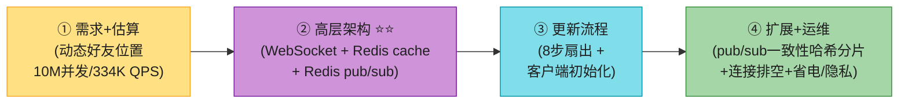

> 💡 **Step 1 关键区分**:**附近商家(Ch1) vs 附近好友(Ch2)**——商家静态、客户端拉、走地理索引;好友动态、服务器推、走好友图 + pub/sub。**主动说出这个区别 = 直接证明你懂两章的边界**。
>
> 💡 **关键信号词**:**"位置更新经 WebSocket → 发布到自己的 Redis pub/sub channel → 在线好友的连接处理器订阅 → 算距离 → 在半径内才推"** + **"pub/sub 瓶颈是 CPU 不是内存,要一致性哈希分片"**——这两句直接拿下面试。

---

## 🗺️ 章节概览

| 小节 | 要点 | 重要性 |
|------|------|--------|
| 需求 + 估算 | 5英里、30s 刷新、**10M 并发、334K 更新/秒、扇出 1300 万/秒** | ⭐⭐⭐⭐ |
| **与 Ch1 的区别** ⭐ | 静态 vs 动态;pull vs push;地理索引 vs 好友图 | ⭐⭐⭐⭐⭐ |
| **高层架构** | WebSocket + REST API + Redis cache + Redis pub/sub + 历史 DB | ⭐⭐⭐⭐⭐ |
| **位置更新流程 ⭐⭐** | 8 步:上报→存历史→刷缓存→发布→扇出→算距→过滤→推 | ⭐⭐⭐⭐⭐ |
| 客户端初始化 | 7 步:连接→刷缓存→加载好友→批量取位置→订阅 channel | ⭐⭐⭐⭐ |
| 数据模型 | location cache(user_id→位置)+ history DB(Cassandra) | ⭐⭐⭐⭐ |
| **Redis pub/sub 扩展 ⭐⭐** | CPU 瓶颈(130台)vs 内存(2台);一致性哈希分片 | ⭐⭐⭐⭐⭐ |
| 有状态运维 | 连接排空、扩缩容、服务发现 etcd | ⭐⭐⭐⭐ |
| 扩展功能 | 附近陌生人(geohash channel)+ 海量好友 + Erlang 替代 | ⭐⭐⭐ |
| **2026增量(补)** | 移动端定位+省电、隐私、Redis Streams/Kafka/NATS、geo索引优化 | ⭐⭐⭐⭐ |

---

## 1. 需求 + 估算

**澄清问题**(原书对话):

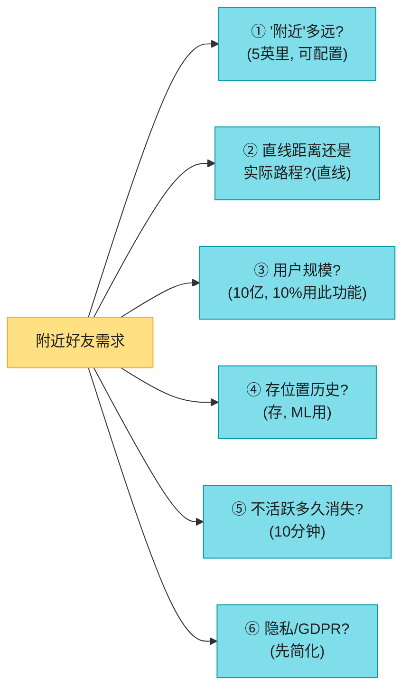

**原书确定的需求**:

| 维度 | 确认值 |
|------|--------|
| "附近" | **5 英里**(可配置) |
| 距离 | 直线距离(不管河流等障碍) |
| 用户 | 10 亿,**10% 用此功能** = 1 亿 DAU |
| 历史位置 | **要存**(ML 用) |
| 不活跃 | **>10 分钟**从列表消失(不显示最后位置) |
| 隐私 | 先简化 |

**功能性 / 非功能性需求**(背熟):

| 需求 | 说明 |
|------|------|
| 功能 | 看到附近好友(距离 + 上次更新时间戳);**几秒刷新一次** |
| **低延迟** ⭐ | 位置更新不能太延迟 |
| **可靠性** | 整体可靠,**偶尔丢数据点可接受** |
| **最终一致** ⭐ | 位置存储不强一致,**副本间几秒延迟可接受** |

> 💡 **关键认知**:**"偶尔丢数据点可接受 + 最终一致"** 是附近好友的精髓——位置是瞬态数据,丢一两个更新无所谓(几秒后又来新的)。这决定了**用 Redis(易失) + pub/sub(fire-and-forget)** 而非持久强一致存储。

**估算**(背熟,这是本章核心数字):

```
DAU: 1 亿(用此功能的)
并发用户: 10% × 1亿 = 1000 万并发
位置刷新: 30 秒一次(步行速度慢, 30s 内移动不多)
人均好友: 400 个, 假设都开此功能

★ 位置上报 QPS = 1000万 / 30 ≈ 334,000 QPS
★ 扇出: 每次更新转发给 好友400 × 在线+附近10% = 40 个好友
  → 后端每秒转发 = 334K × 40 ≈ 1300 万次/秒 ⚠️ 这是真正的负载
```

> 💡 **核心洞察**:**"上报 33 万/秒"不是最吓人的,"扇出 1300 万/秒"才是**。每个用户的位置更新要扇出给约 40 个在线+附近的好友——这是 **fan-out 放大**(接 Vol.1 Ch11 Feed 的 push 模型,同源思想)。**架构要为"扇出"而非"上报"优化**。

---

## 2. 与 Ch1 邻近服务的本质区别 ⭐⭐⭐⭐⭐

这一节是本章的"开场必讲"——主动讲清和 Ch1 的区别,证明你懂两章边界。

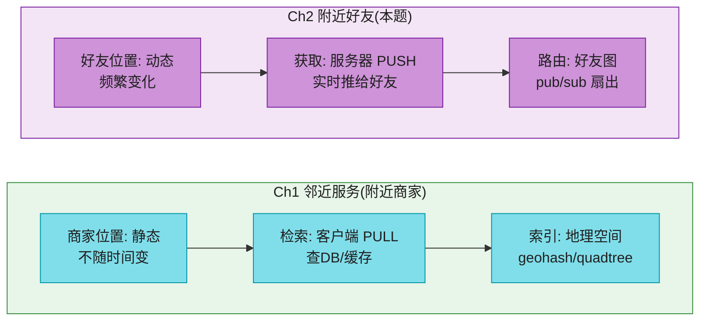

| 维度 | **Ch1 附近商家** | **Ch2 附近好友** |
|------|-----------------|-----------------|
| 位置 | **静态**(商家不动) | **动态**(用户到处跑) |
| 获取方式 | **PULL**(客户端主动查) | **PUSH**(服务器主动推) |
| 索引 | 地理空间(geohash/quadtree) | **好友图 + pub/sub** |
| 更新频率 | 商家 CRUD 低频(次日生效) | **30s 一次高频上报** |
| 一致性 | 可接受复制延迟 | 最终一致(丢点可接受) |
| 关系 | 任意位置 → 任意商家 | **限于好友关系** |

> 💡 **为什么不用 Ch1 的 geohash 直接做?** 附近好友**只关心好友**(不是任意人),且位置**高频变化**。如果每次都查 geohash 索引拉附近好友,**334K QPS 的拉会把索引打爆**。所以改成 **push 模型**:好友上报位置时,经 pub/sub **主动推**给订阅了 ta 的好友。**这是 pull → push 的范式转换**。

---

## 3. 高层架构 ⭐⭐⭐⭐⭐

> 📝 **核心思想**:**每个用户有一条自己的 Redis pub/sub channel**。用户上报位置 → 发布到自己的 channel → **在线好友的 WebSocket 连接处理器订阅了这条 channel** → 收到更新后算距离 → 在半径内才推给客户端。

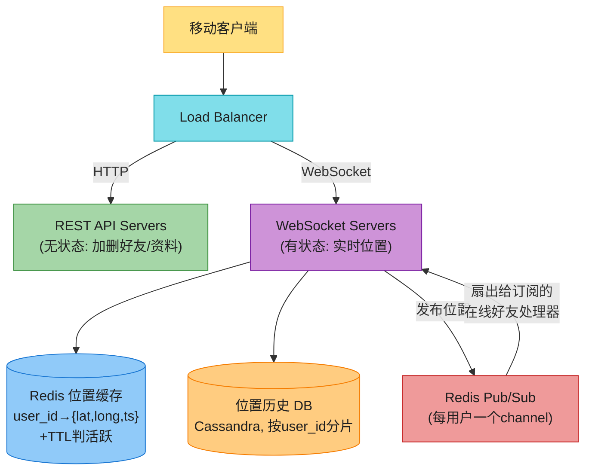

**6 大组件**(背熟):

| 组件 | 类型 | 职责 |
|------|------|------|
| **Load Balancer** | — | LB 前置,分发到 REST API + WebSocket |
| **REST API Servers** | 无状态 | 加删好友、改资料等辅助 |
| **WebSocket Servers** ⭐ | **有状态** | 持久连接、实时位置推送、客户端初始化 |
| **Redis 位置缓存** | 易失 | 每个活跃用户的最新位置 + **TTL 判活跃** |
| **User DB** | 持久 | 资料 + 好友关系(按 user_id 分片) |
| **位置历史 DB** | 持久 | 历史轨迹(Cassandra,**ML 用**) |
| **Redis Pub/Sub** ⭐ | 路由 | 每用户一 channel,扇出位置更新给好友 |

> 💡 **为什么用 Redis pub/sub?** —— **channel 极轻量**:GB 级内存的 Redis 能撑**数百万 channel**。channel 无订阅者时发布消息直接丢弃,**零 CPU**。这正适合"用户可能离线"的场景。**创建 channel 几乎免费**。

---

## 4. 核心流程:周期位置更新(8 步)⭐⭐⭐⭐⭐

这是本章**最重要**的流程,面试要能逐步画出。

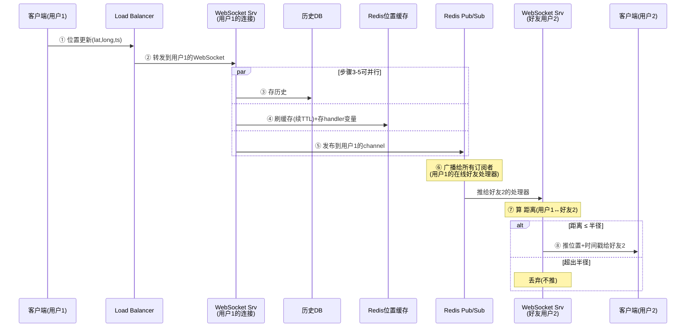

**8 步详解**(背熟):
1. 客户端经 WebSocket 发位置更新到 LB。
2. LB 转发到**持有该客户端连接**的 WebSocket 服务器。
3. WebSocket 存历史到 location history DB。
4. WebSocket **刷位置缓存**(续 TTL,判活跃)+ 把新位置存到**连接处理器(handler)的变量**(供后续算距)。
5. WebSocket **发布新位置到用户自己的 channel**。
   - ⚠️ **步骤 3-5 可并行**(互不依赖,降延迟)。
6. pub/sub **广播给所有订阅者**(用户的所有在线好友处理器)。
7. 每个好友处理器收到后,**算发送者与该好友的距离**。
8. **距离 ≤ 半径 → 推给好友客户端;超出 → 丢弃**。

> 💡 **关键设计**:**距离过滤在订阅端做**(每个好友处理器自己算距),不在发布端。这样发布端只需"扇出给所有好友",订阅端各自判断"够不够近"。**职责分离 = 简单**。
>
> 🪤 **追问陷阱**:"为什么不在发布端就按距离过滤,只推给真在附近的好友?" → "理论上更省,但发布端要**查每个好友的位置**才能算距,**334K×400 次查询/秒打爆缓存**。原书把过滤放订阅端(好友处理器已有自己位置 + 收到的对方位置,本地 O(1) 算),更简单。**更高效的方案是用 geohash 索引只推给同格好友**(见第 11 节优化)。"

### 4.1 客户端初始化(7 步)

App 启动时,客户端建立 WebSocket 连接,服务器初始化(7 步):

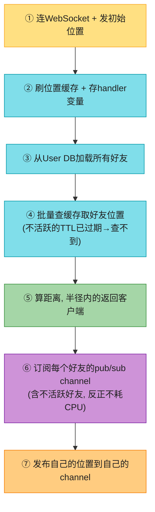

> 💡 **关键细节 ⑥**:**订阅所有好友(含不活跃)的 channel**。为什么不只订活跃的?因为**创建/维护 channel 极便宜,不活跃好友的 channel 不消耗 CPU**(没人发布)。**用内存换简单**——不用处理"好友上线时订阅、下线时退订"的复杂逻辑。这是原书的精明权衡。

---

## 5. 数据模型

### 5.1 位置缓存(Redis)

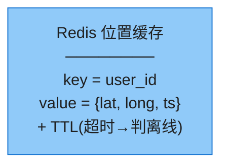

> 📝 **为什么不用数据库存位置?** ① 附近好友**只关心当前位置**,每个用户一条;② Redis **超快 + TTL 自动判离线**;③ **不需要持久**(Redis 挂了换新实例,靠后续上报重新填满,最多漏一两个更新周期——可接受)。这是"瞬态数据用易失存储"的典型。

### 5.2 位置历史 DB(Cassandra)

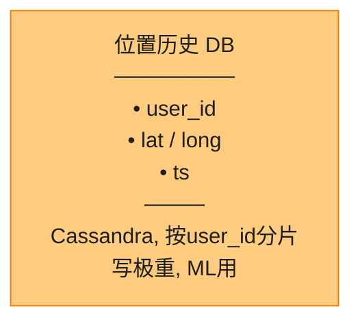

历史轨迹**写极重**(334K 写/秒)、要水平扩展 → **Cassandra**(写优化,接 Vol.1 Ch6)。关系库也能用但单机装不下,要按 user_id 分片。

---

## 6. 深入:Redis pub/sub 扩展(本章核心难点)⭐⭐⭐⭐⭐

### 6.1 瓶颈是 CPU 不是内存(原书手算)

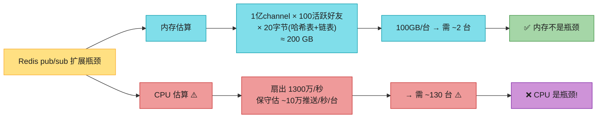

**手算**(背熟):
- **内存**:1 亿 channel × 平均 100 活跃好友 × 20 字节(哈希表 + 链表追踪订阅者)≈ **200 GB**。100GB/台 → **只需 ~2 台**。✅ 不是瓶颈。
- **CPU**:扇出 1300 万/秒;保守按每台 10 万推送/秒(千兆网卡)→ **需 ~130 台**。❌ **CPU 是瓶颈**。

> 💡 **结论**:**pub/sub 瓶颈是 CPU(扇出),不是内存(channel)**。要**分布式集群**(130 台),不是单机。这是本章最重要的判断。

### 6.2 一致性哈希分片(接 Vol.1 Ch5)


**channel 独立**(互不影响)→ 按**发布者 user_id 一致性哈希**分到某台 pub/sub。

> 📝 **service discovery(etcd / Zookeeper)** 维护**一致性哈希环**:
> - key: `/config/pub_sub_ring`
> - value: `["p_1","p_2",...,"p_130"]`(所有活跃 pub/sub 节点)
>
> WebSocket 服务器**缓存一份哈希环**(本地内存),**订阅 service discovery 的更新**保持同步。需要时查环定位 channel 所在服务器。**这是一致性哈希(Vol.1 Ch5)的真实落地**。

### 6.3 有状态集群的运维(原书重点)

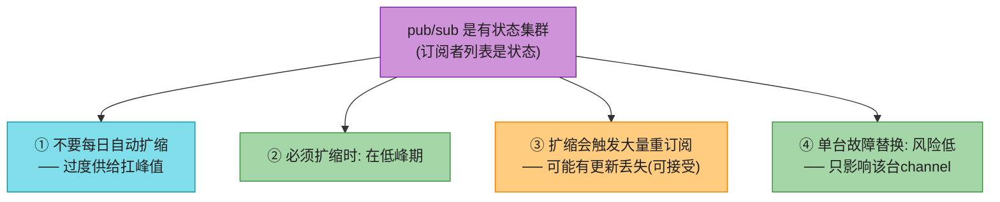

> ⚠️ **关键认知**:pub/sub **既是无状态(消息不持久,转发即删)又是有状态(订阅者列表)**。从运维角度**当有状态集群对待**(像存储集群):**过度供给、不频繁扩缩、低峰期操作**。
>
> 🪤 **追问陷阱**:"pub/sub 该像无状态还是像有状态服务那样扩缩?" → "**当有状态**。虽然消息不持久(无状态一面),但**订阅者列表是状态**——channel 迁移(扩缩容/故障替换)时所有订阅者要重订阅。所以**过度供给、低峰扩缩**,不像无状态服务那样随意 daily auto-scale。"

### 6.4 WebSocket 服务器的连接排空

WebSocket 是有状态的(持有连接),**下线前要排空连接**:


> 💡 接 Vol.1 Ch12 聊天系统的 chat server 下线处理,同源思想。

---

## 7. 扩展功能

### 7.1 附近陌生人(geohash channel,接 Ch1)

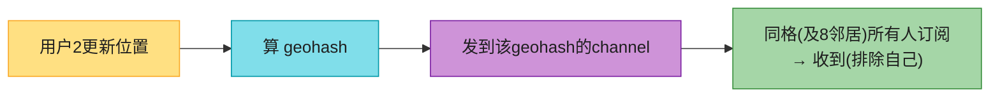

> 💡 **附近陌生人**用 **geohash 作 channel**(不是 user_id)——**同格所有人共享一条 channel**。处理边界问题:**订阅当前格 + 8 邻居格**(共 9 格,接 Ch1 geohash 边界)。**这是 Ch1 geohash 在实时推送场景的复用**。

### 7.2 海量好友(不是问题)

好友数有硬上限(Facebook 5000),且**好友分散在不同 WebSocket 服务器** → 扇出负载天然分散,**不会热点**。(对比:Vol.1 Ch11 的明星问题——关注模型才有百万粉丝热点;**双向好友没有**。)

### 7.3 Erlang 替代方案

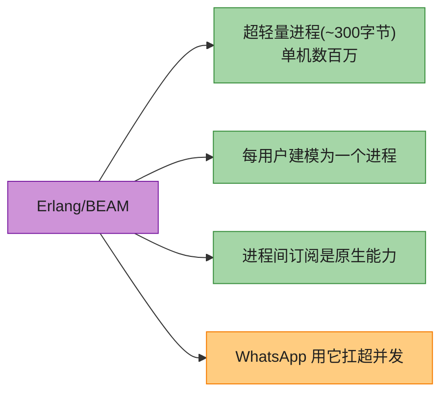

> 💡 **Erlang 可能比 Redis pub/sub 更好**(原书观点)——**BEAM VM 的进程极轻(~300B),把 1000 万活跃用户各建模为一个进程,进程间订阅原生支持**。WhatsApp 就靠 Erlang 扛超并发。**代价:Erlang 程序员难招**。

---

## 8. 2026 现代增量(原书没讲的硬核)⭐⭐⭐⭐

### 8.1 移动端定位 + 省电(头号工程难题)⭐⭐⭐

原书说"30s 上报一次"一笔带过,但**移动端怎么获取位置 + 省电是附近好友 App 的命门**——GPS 持续定位会很快耗光电量。

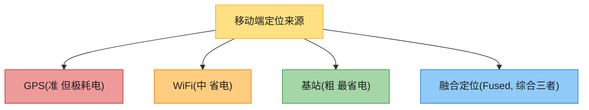

| 定位源 | 精度 | 耗电 | 适用 |
|--------|------|------|------|
| **GPS** | 高(米) | **极高** | 户外精确 |
| **WiFi** | 中 | 中 | 室内/城区 |
| **基站(Cell)** | 低(百米) | **极低** | 大致位置 |
| **融合定位(Fused Location)** | 自适应 | 优化 | **生产首选** |

**省电策略**(2026 必讲):
- **自适应刷新率**:移动快 → 多上报;静止 → 少上报。iOS 的 **Significant Location Change**、Android 的 **Fused Location Provider** 都支持。
- **地理围栏触发**:进/出区域才上报,平时休眠。
- **批处理上报**:累积多个位置点,合并上报(降频)。
- **后台限制**:iOS/Android 后台定位有严格限制,要申请后台定位权限 + 显示持续定位图标。

> 💡 **话术**:"原书固定 30s 上报在真实移动端不可行——GPS 持续开 1 小时电量见底。我会用 **Fused Location Provider 自适应刷新**:移动快时 10s 一次,静止时降到 2 分钟一次,进好友 5 英里范围才提频。**省电是附近好友 App 留存率的关键**(用户不会容忍一个后台狂耗电的 App)。"

### 8.2 隐私(2026 生死线)

原书"暂不考虑 GDPR"——2026 这是不可接受的。附近好友 App 靠**隐私**立足(zenly、Snap Map)。

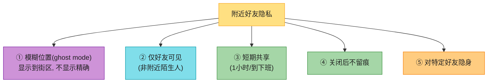

> 💡 **zenly/Snap Map 的 ghost mode** 是隐私标杆——**可显示模糊位置(到城市/街区)、或对特定好友隐身、或只在用 App 时共享**。这是附近好友 App 的**差异化卖点**。**面试讲隐私 = senior 信号**。

### 8.3 Redis pub/sub 的替代(原书只提 Erlang)

| 方案 | 持久化 | 适用 | 取舍 |
|------|--------|------|------|
| **Redis pub/sub**(原书) | ❌ fire-and-forget | 附近好友(丢点可接受) | 轻量,channel 几乎免费 |
| **Redis Streams** | ✅ 持久 + 消费组 | 不能丢的场景 | 比pub/sub重,但可靠 |
| **Kafka** | ✅ 持久 | 事件流、历史回放 | 重,但生态强 |
| **NATS** | 可选 | 超轻量消息总线 | 比 Redis pub/sub 更快 |
| **MQTT** | QoS 分级 | 移动端弱网 | 省电(接 Vol.1 Ch12) |
| **Erlang/BEAM**(原书) | 进程内存 | 超并发 | 难招人 |

> 💡 **话术**:"原书选 Redis pub/sub 是对的——附近好友**丢一两个更新无所谓**(几秒后又来),fire-and-forget 最轻。如果要求**不能丢**(如家人定位安全),换 **Redis Streams(消费组 + 持久)** 或 Kafka。**移动端省电场景甚至可用 MQTT**(QoS1 保证至少一次)。"

### 8.4 推送效率优化:geo 索引只推真在附近的好友

原书把每次更新扇出给**所有好友**再按距离过滤——400 好友都收,但只有 ~40 在附近,**358 次浪费**。

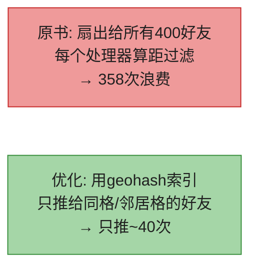

> 💡 **优化方案**:**好友按 geohash 分组订阅**(类似附近陌生人,但限于好友)。用户上报时,只推给"自己 geohash + 8 邻居"里的好友。**把扇出从 400 降到 ~40**,大幅省 pub/sub CPU。这是把 **Ch1 geohash + Ch2 好友图融合**的进阶方案。

---

## ⚠️ 已过时 / 书里没说(2022 → 2026)

| 原书(2022) | 2026 现状 | 面试应对 |
|------------|----------|---------|
| 固定 30s 上报 | **自适应刷新 + Fused Location** | 讲省电,移动快多报、静止少报 |
| "暂不考虑隐私" | **隐私是生死线**(zenly ghost mode) | 讲模糊位置/隐身/短期共享 |
| pub/sub 只提 Erlang | **Redis Streams/Kafka/NATS/MQTT** 都要对比 | 讲持久化 vs fire-and-forget |
| 扇出给所有好友 | **geo 索引只推附近好友**(优化) | 讲把扇出从 400 降到 40 |
| 没讲定位源 | **GPS/WiFi/基站/融合定位** | 讲精度 vs 耗电 |
| 用 WebSocket | 移动弱网可 **MQTT/QUIC** | 接 Vol.1 Ch12 |
| 没提实时一致性 | 位置是**最终一致 + 丢点可接受** | 明确这点(原书已提) |

---

## 💻 代码示例

### 示例 1:WebSocket 连接处理器(发布 + 订阅)

```python
import redis, asyncio, websockets
r = redis.Redis()
RADIUS_MILES = 5

class ConnectionHandler:
    """每个活跃用户的 WebSocket 连接处理器"""
    def __init__(self, ws, user_id):
        self.ws = ws
        self.user_id = user_id
        self.cur_location = None     # 自己最新位置(算距用)
        self.pubsub = None

    async def on_location_update(self, lat, lng, ts):
        """收到客户端上报(8步流程)"""
        self.cur_location = (lat, lng, ts)
        r.hset("loc_cache", self.user_id, f"{lat},{lng},{ts}")  # ④ 刷缓存+续TTL
        r.expire(f"loc:{self.user_id}", 600)                     # TTL 10分钟判活跃
        # ③ 存历史(异步)、⑤ 发布到自己的channel(可并行)
        await asyncio.gather(
            save_history(self.user_id, lat, lng, ts),
            publish_loc(self.user_id, lat, lng, ts),
        )

    async def on_friend_update(self, friend_id, lat, lng, ts):
        """收到好友的位置更新(经pub/sub扇出, 第⑦⑧步)"""
        if self.cur_location is None: return
        dist = haversine(self.cur_location, (lat, lng))
        if dist <= RADIUS_MILES:                       # ⑦ 算距, 半径内才推
            await self.ws.send(json.dumps({            # ⑧ 推给客户端
                "friend": friend_id, "lat": lat, "lng": lng,
                "ts": ts, "dist": round(dist, 2)}))

    async def init(self):
        """客户端初始化(7步): 加载好友 + 订阅channel"""
        friends = get_friends(self.user_id)            # ③
        # ④ 批量查好友位置(不活跃的TTL已过期→查不到)
        # ⑥ 订阅每个好友的channel
        self.pubsub = r.pubsub()
        for fid in friends:
            self.pubsub.subscribe(f"loc_channel:{fid}")
        asyncio.create_task(self._listen())            # 后台监听

    async def _listen(self):
        for msg in self.pubsub.listen():
            if msg["type"] == "message":
                data = json.loads(msg["data"])
                await self.on_friend_update(**data)

async def publish_loc(user_id, lat, lng, ts):
    # 按user_id一致性哈希定位到目标pub/sub服务器后发布
    r.publish(f"loc_channel:{user_id}",
              json.dumps({"lat": lat, "lng": lng, "ts": ts}))
```

### 示例 2:附近陌生人(geohash channel,接 Ch1)

```python
import geohash
NEIGHBORS_OFFSETS = [(0,0),(-1,0),(1,0),(0,-1),(0,1),(-1,-1),(-1,1),(1,-1),(1,1)]

def publish_to_nearby_strangers(user_id, lat, lng, ts):
    gh = geohash.encode(lat, lng, precision=6)
    # 发到当前格 + 8邻居格(共9个channel, 处理边界)
    for dlat, dlng in NEIGHBORS_OFFSETS:
        n_gh = geohash.adjust(gh, dlat, dlng)
        r.publish(f"stranger_channel:{n_gh}",
                  json.dumps({"user": user_id, "lat": lat, "lng": lng, "ts": ts}))

def subscribe_nearby_strangers(user_id, lat, lng):
    gh = geohash.encode(lat, lng, precision=6)
    for dlat, dlng in NEIGHBORS_OFFSETS:
        n_gh = geohash.adjust(gh, dlat, dlng)
        ps.subscribe(f"stranger_channel:{n_gh}")     # 订阅9格
```

---

## 🪤 追问陷阱(面试官最爱问,本章集)

1. **"和附近商家(Ch1)有什么区别?"** → 静态 vs 动态;pull vs push;地理索引 vs 好友图 + pub/sub。**主动说区别 = 懂边界**。
2. **"怎么把位置更新扇出给好友?"** → 发布到自己的 Redis pub/sub channel → 在线好友处理器订阅 → 算距 → 半径内才推。
3. **"为什么用 pub/sub 不用消息队列?"** → channel 极轻量(百万级);丢点可接受(瞬态数据);fire-and-forget 最适合实时位置。
4. **"pub/sub 瓶颈是内存还是 CPU?"** → **CPU**!内存 200GB(2 台够),但扇出 1300 万/秒要 ~130 台。
5. **"130 台 pub/sub 怎么分?"** → channel 独立 → **按发布者 user_id 一致性哈希**(接 Vol.1 Ch5);service discovery(etcd)维护哈希环。
6. **"pub/sub 怎么扩缩容?"** → 当**有状态集群**(订阅者列表是状态):过度供给、低峰期扩缩、扩缩触发大量重订阅。
7. **"WebSocket 服务器下线怎么办?"** → LB 标 draining,排空连接再移除(接 Vol.1 Ch12)。
8. **"客户端初始化要订阅所有好友(含离线)吗?"** → 是。channel 创建免费,离线好友 channel 不耗 CPU(没人发布)。**用内存换简单**。
9. **"距离过滤在哪做?"** → 订阅端(每个好友处理器本地算)。发布端只扇出,订阅端判断够不够近。
10. **"附近陌生人怎么做?"** → geohash 作 channel(不是 user_id),同格 + 8 邻居共享,接 Ch1 geohash。
11. **"30s 上报会耗光电量怎么办?"** → 用 **Fused Location 自适应刷新**:移动快多报、静止少报,省电是留存关键。原书固定 30s 不可行。
12. **"隐私怎么处理?"** → 模糊位置(ghost mode)、仅好友可见、短期共享、关闭不留痕。zenly/Snap Map 是标杆。
13. **"能不能用 Kafka 替代 pub/sub?"** → 能但不能丢点时才用(Kafka 持久但重)。附近好友丢点可接受,pub/sub 更轻。
14. **"扇出 400 好友太浪费?"** → 用 geohash 索引**只推同格好友**,把扇出从 400 降到 ~40(Ch1+Ch2 融合优化)。
15. **"Redis 挂了怎么办?"** → 换新实例,靠后续上报重新填满,最多漏一两个更新周期(可接受)。位置是瞬态数据,不需持久。

---

## 🏭 生产级产品速查表

| 产品 | 特色 | 技术点 |
|------|------|--------|
| **Facebook Nearby Friends** | 附近好友鼻祖(本题原型) | Redis pub/sub 扇出 |
| **Snapchat zenly / Snap Map** | 实时好友地图 + **ghost mode 隐私** | 模糊位置 + 个性化 |
| **Life360** | 家人位置共享(安全导向) | 持久存储 + 不可丢(Redis Streams/Kafka) |
| **WeChat 附近的人** | 附近陌生人 | geohash channel |
| **Google Maps 位置共享** | 好友实时位置 | 融合定位 + 低延迟 |
| **WhatsApp** | Erlang/BEAM 扛超并发 | 轻量进程模型每用户一进程 |

> 🏭 **业界标杆**:**Facebook Nearby Friends**(本题原型,TechCrunch 2014)、**zenly**(被 Snap 收购,以流畅实时地图 + 隐私 ghost mode 闻名)、**Life360**(家人安全定位,持久不可丢)。

---

## 📝 本章要点总结

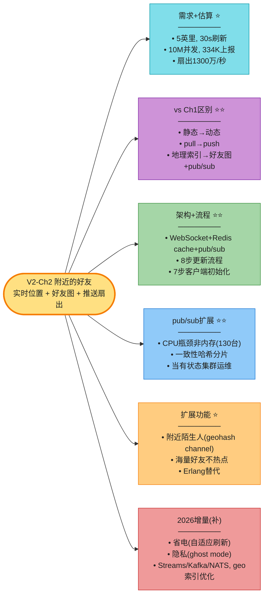

**核心 Takeaways**:

1. **vs Ch1 的区别是开场必讲**——静态 vs 动态,pull vs push,地理索引 vs 好友图。**主动说 = 懂边界**。
2. **核心架构是 push 模型**——用户上报 → 发到自己 pub/sub channel → 在线好友处理器订阅 → 算距过滤 → 推。
3. **8 步更新流程 + 7 步客户端初始化**要能逐步画出。
4. **pub/sub 瓶颈是 CPU 不是内存**(内存 2 台,CPU 130 台)→ 一致性哈希分片(接 Vol.1 Ch5)。
5. **pub/sub 当有状态集群运维**——订阅者列表是状态,过度供给、低峰扩缩。
6. **位置是瞬态数据**——Redis 易失可接受(挂了换新,漏一两个周期无所谓);最终一致 + 丢点可接受。
7. **省电是移动端命门**——Fused Location 自适应刷新,原书固定 30s 不可行。
8. **隐私是 2026 生死线**——ghost mode 模糊位置是 zenly/Snap 的卖点。
9. **优化扇出**:geohash 索引只推附近好友,把扇出从 400 降到 ~40(Ch1+Ch2 融合)。
10. **原书停在 2022**——补省电/隐私/Streams-Kafka-NATS/geo优化/Erlang,才能 strong hire。

> 🔗 **连接上下章**:**V2-Ch1 邻近服务**是"静态 POI + 拉模型";**V2-Ch2 附近好友**是"动态好友 + 推模型 + pub/sub",把 Ch1 的 geohash 复用到"附近陌生人";**V2-Ch3 Google Maps** 把地理服务推到**路网级别**——从"直线距离"升级到"真实路径(最短路径 Dijkstra/A*)",挑战从"实时推送"变成"海量路网图算法"。
