# Volume 2 · Chapter 3: 设计 Google Maps (Design Google Maps)

> **本章定位**:Google Maps 是**"海量瓦片 + 图算法导航 + ML 预测 ETA"**的超大规模综合题——它是 Vol.2 里**最复杂、最综合**的一章,把前面所有知识用遍:**地图瓦片 tiling + CDN**(地图渲染)、**geohash**(瓦片/路由 tile 编址)、**图算法 A*/Dijkstra**(最短路径)、**ML/GNN**(ETA 预测)、**Cassandra + Kafka**(高写位置流)、**WebSocket**(自适应重路由推送)。三大子系统各有灵魂:**① 地图渲染(预生成瓦片 + CDN + 向量瓦片)② 导航(分层 routing tile + A* + ML ETA + ranker)③ 位置服务(批处理上报 + 流式消费)**。它是地理服务题的天花板——从 V2-Ch1 的"附近商家(直线距离)"升级到"真实路网(最短路径 + 实时交通)"。

> **本章和原书的区别**:原书把**三大子系统和 routing tile 机制讲得相当完整**——分层 routing tile、A* 在 tile 上按需 hydrate、自适应 ETA 的 super-tile 优化、向量瓦片优化都覆盖了,是面试标准答案。但**最短路径只提 Dijkstra/A***,没讲 2026 生产真正用的 **Contraction Hierarchies(CH)和 Customizable Route Planning(CRP)**(Google/HERE 实际方案,毫秒级跨大陆寻路);**ML ETA 只说"用 ML",没讲 Google+DeepMind 的 **GNN(图神经网络)** 具体做法;**向量瓦片(WebGL/Mapbox GL/MVT)** 只作"优化"提一句,实际是 2026 主流(光栅瓦片已淘汰);**离线地图/AR 导航(Live View)/多模态**完全没提。本章把这些补上。

---

## 🎯 面试怎么答(被问到"设计 Google Maps / 地图导航 App"时)

**开场话术**(直接背):

> "Google Maps 是个超综合题,我先确认聚焦哪三大功能:**① 位置上报 ② 导航 + ETA ③ 地图渲染**。然后分三块讲:**地图渲染 = 预生成瓦片 + CDN + 向量瓦片(geohash 编址);导航 = geocoding + 分层 routing tile + A* 最短路径 + ML(GNN)预测 ETA + ranker 过滤;位置服务 = 客户端批处理上报 + Cassandra + Kafka 流式消费(更新路况/路网)**。核心抉择是 **路网怎么切(routing tile)+ 路径怎么搜(A*/CH)+ 瓦片怎么发(CDN + 向量)**。"

**4 步推进**:

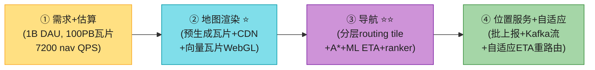

> 💡 **Step 1 必问**:**聚焦哪些功能?** Google Maps 功能太多(街景/卫星图/商家照片/多停靠点),面试必须先砍范围。**本题聚焦三大件:位置上报 + 导航 + 渲染**,其余砍掉。
>
> 💡 **关键信号词**:**"路网太大不能整图跑 A*,切成 routing tile 按需 hydrate"** + **"瓦片按 zoom 预生成,geohash 编址,CDN 就近发"** + **"ETA 用 ML(GNN)预测未来 10-20 分钟路况"**——这三句直接证明你懂这道题的精髓。

---

## 🗺️ 章节概览

| 小节 | 要点 | 重要性 |
|------|------|--------|
| 需求 + 估算 | 1B DAU、**100PB 瓦片**、7200 nav QPS、200K 位置 QPS | ⭐⭐⭐⭐ |
| **Map 101 基础** | 投影/geocoding/geohash/tiling/**routing tile**/分层 | ⭐⭐⭐⭐⭐ |
| **三大子系统** | 位置服务 / 导航 / 地图渲染 | ⭐⭐⭐⭐ |
| **地图渲染 ⭐⭐** | 预生成瓦片 + CDN + geohash 编址 + **向量瓦片** | ⭐⭐⭐⭐⭐ |
| **导航服务 ⭐⭐⭐** | geocoding→最短路径(A*)→ML ETA→ranker | ⭐⭐⭐⭐⭐ |
| **routing tile 分层 ⭐** | 3 级精度(本地/干道/高速)+ 跨层连接 | ⭐⭐⭐⭐⭐ |
| 位置服务 | 批上报 + Cassandra + Kafka 流消费 | ⭐⭐⭐⭐ |
| **自适应 ETA + 重路由** | super-tile 优化 + WebSocket 推送 | ⭐⭐⭐⭐ |
| **2026增量(补)** | 向量瓦片/WebGL、GNN ETA、CH/CRP、离线/AR | ⭐⭐⭐⭐⭐ |

---

## 1. 需求 + 估算

**澄清问题**(原书对话):

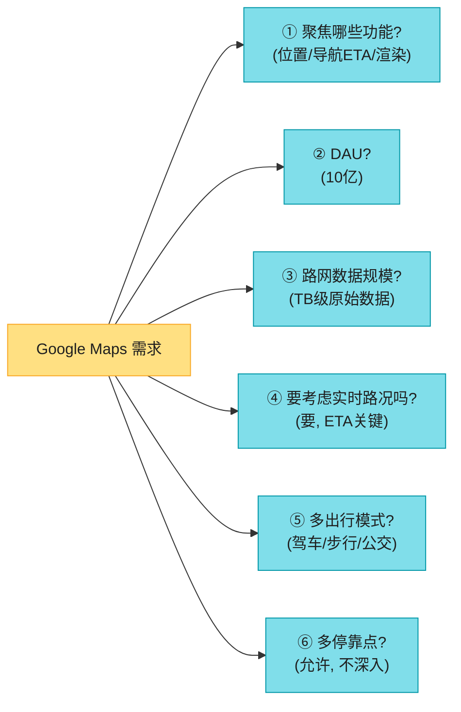

**原书确定的需求**:

| 维度 | 确认值 |
|------|--------|
| DAU | **10 亿** |
| 聚焦 | **位置上报 + 导航 + ETA + 地图渲染**(砍掉街景/商家/多停靠点) |
| 路网 | TB 级原始数据(外部来源) |
| 路况 | **要**(ETA 准确性关键) |
| 出行模式 | 驾车/步行/公交 |
| 设备 | **手机为主**(省流量省电关键) |

**非功能性需求**(背熟):

| 需求 | 说明 |
|------|------|
| **准确** ⭐ | 不能给错方向 |
| **流畅渲染** | 客户端地图渲染丝滑 |
| **省流量 + 省电** ⭐ | 手机关键 |
| 可用 + 可扩展 | — |

**估算**(背熟,数据量很震撼):

```
★ 存储估算
  地图瓦片: 最高zoom(21) = 4.3万亿块 × 100KB = 440 PB
           但 90% 地表无人(海洋/沙漠/山地)高压缩 → 减 80-90%
           → 50 PB;所有zoom级 50+50/4+... ≈ 67 PB → 约 100 PB ⚠️
  路网数据: TB级原始 → routing tile 也 TB级

★ 吞吐
  导航 QPS: 1B × 5次/周 / 7 / 10^5 ≈ 7,200; 峰值×5 = 36,000
  位置上报: 5B分钟/天 × 60 = 3M QPS;批处理(每15s) → 200K QPS;峰值 1M
  CDN流量: 5B分钟 × 1.25MB = 6.25B MB/天 = 62,500 MB/秒;200个POP → ~300MB/秒/POP
```

> 💡 **核心洞察**:**100PB 瓦片 + 100万/秒位置上报**——这规模决定了两个关键设计:① 瓦片**必须预生成 + CDN**(不能动态生成);② 位置上报**必须批处理**(每秒上报会打爆,每 15s 批一次降 15 倍)。

---

## 2. Map 101 基础知识 ⭐⭐⭐⭐⭐

这一节是本章的"地基",不讲清这些,后面导航/渲染无从谈起。

### 2.1 坐标 + 投影 + geocoding

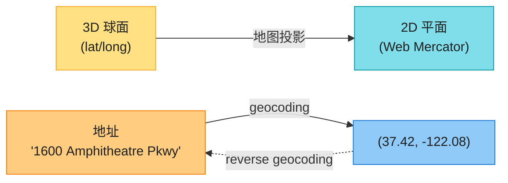

| 概念 | 说明 |
|------|------|
| **lat/long** | 经纬度(球面坐标) |
| **地图投影** | 3D→2D,都有失真;Google 用 **Web Mercator**(改版) |
| **geocoding** | 地址 → lat/lng(用 GIS 数据插值) |
| **reverse geocoding** | lat/lng → 地址 |
| **geohash** | 递归切格编码(接 V2-Ch1,本题用于**瓦片编址**) |

### 2.2 地图渲染:tiling(瓦片)⭐

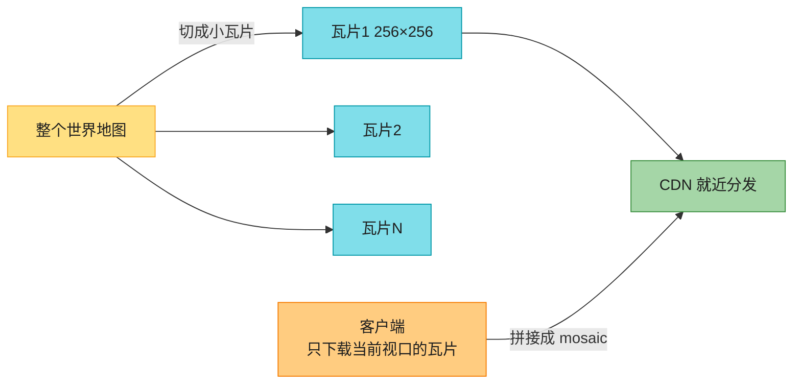

> 📝 **tiling(瓦片化)**:世界切成小图(256×256 像素),客户端**只下载视口所需瓦片**,像马赛克拼起来。**不同 zoom level 有不同瓦片集**——zoom 0 整个世界就 1 块瓦片;每升一级,瓦片数 ×4。

**21 个 zoom level**(背关键的):
- Level 0:**1 块**(整个世界,256×256)
- 每升一级:瓦片数 ×4(南北 ×2、东西 ×2)
- Level 21:**4.3 万亿块**

> 💡 **为什么分 zoom level?** 用户缩小看全世界时,不需要下载 Level 21 的几十亿块细节瓦片(浪费带宽)。**按视口 zoom 选合适层级**,只下所需细节。

### 2.3 路网:routing tile(路由瓦片)⭐⭐⭐(本章灵魂)

**核心难题**:**路径算法(Dijkstra/A*)对图规模极敏感**。把全世界路网当一张图跑 → 内存爆 + 太慢。所以要**切**。

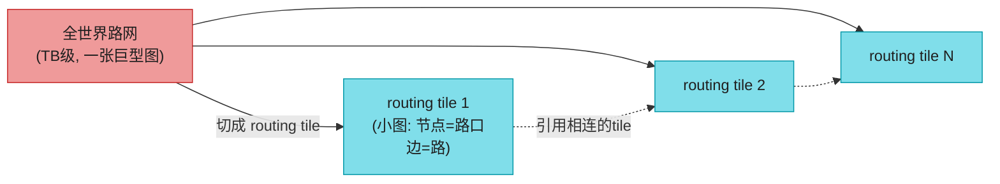

> 📝 **routing tile**:用类似 geohash 的切分,把路网切成小格子,每格存**该区域的小图(路口=节点,路=边)+ 引用相连的 tile**。算法**按需 hydrate**(加载)相邻 tile 扩展搜索。**只加载搜索路径上的 tile,内存可控**。
>
> 💡 **routing tile vs map tile**:都是切格,但 **map tile 是 PNG 图片(给人看),routing tile 是路网二进制图(给算法跑)**。

**分层 routing tile ⭐**(关键优化):

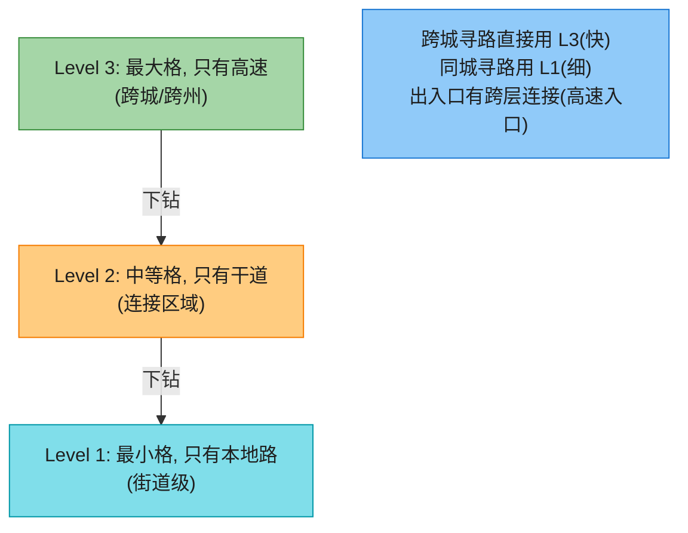

| 层级 | 覆盖 | 含路 | 用途 |
|------|------|------|------|
| **Level 1(最细)** | 小区域 | 仅本地街道 | 同城导航 |
| **Level 2** | 较大 | 仅干道 | 跨区 |
| **Level 3(最粗)** | 大区域 | 仅高速 | **跨城/跨州**(图小,飞快) |

> 💡 **分层的好处**:**跨城寻路直接在 Level 3 跑(图小,毫秒级)**,不用遍历所有街道。各层之间有**跨层连接**(如"本地街道 A → 高速 F 入口"的引用),算法可在层间切换。**这是 Google Maps 毫秒级跨大陆寻路的根基**。

---

## 3. 三大子系统高层架构

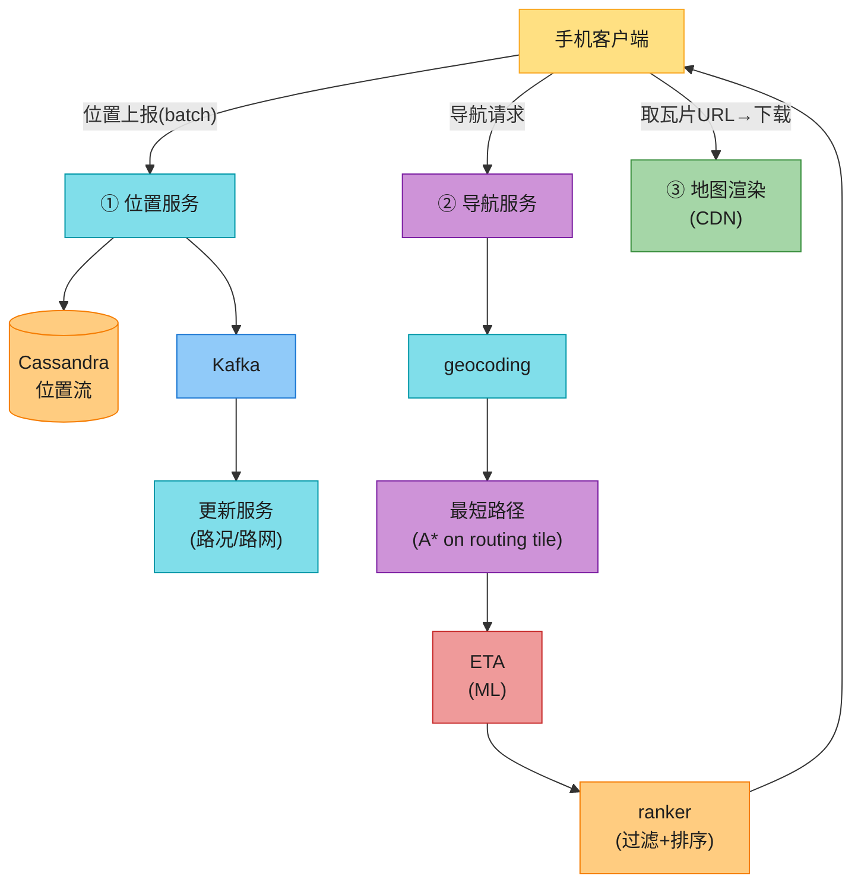

---

## 4. 子系统一:地图渲染 ⭐⭐⭐⭐⭐(预生成瓦片 + CDN)

### 4.1 两种方案对比

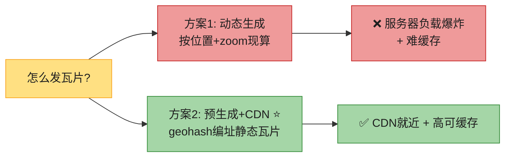

| 方案 | 做法 | 问题 |
|------|------|------|
| **动态生成** | 按位置+zoom 现算瓦片 | **服务器负载爆炸 + 难缓存**(组合无限) |
| **预生成 + CDN ⭐** | 瓦片按 geohash 静态预生成,CDN 分发 | **可缓存 + CDN 就近** ✅ |

### 4.2 客户端怎么拿瓦片 URL?


**两种 URL 计算方式**(原书 trade-off):

| 方式 | 做法 | 取舍 |
|------|------|------|
| **客户端硬编码算 geohash** | 客户端本地算 geohash→URL | 快;但**算法固化在所有客户端**,改方案要发版(慢+险) |
| **map tile 服务中转 ⭐** | 客户端问"地图瓦片服务"要 URL | 多一跳;但**服务端可灵活改方案**(改 URL 逻辑不用发版) |

> 💡 **原书倾向 map tile 服务中转**——**移动发版慢且险,把 URL 逻辑放服务端,可随时调整**。返回**当前格 + 8 邻居**共 9 个 URL(预下载,移动到邻居格不卡)。

### 4.3 数据用量估算(省流量)

```
假设 30km/h, 每块瓦片覆盖 200m×200m(256×256像素, ~100KB)
1km² = 25块 = 2.5MB
30km/h → 75MB/小时 → 1.25MB/分钟
```

> 💡 **1.25MB/分钟**听着多,但**客户端有缓存**(用户每天走相似路线,瓦片复用),实际流量低得多。**省流量靠:客户端缓存 + 预生成静态瓦片(可被 CDN/浏览器缓存)+ 向量瓦片(见 4.4)**。

### 4.4 向量瓦片优化(2026 主流)⭐⭐⭐

原书作为"优化"提一句,但这是 **2026 地图渲染的事实标准**。

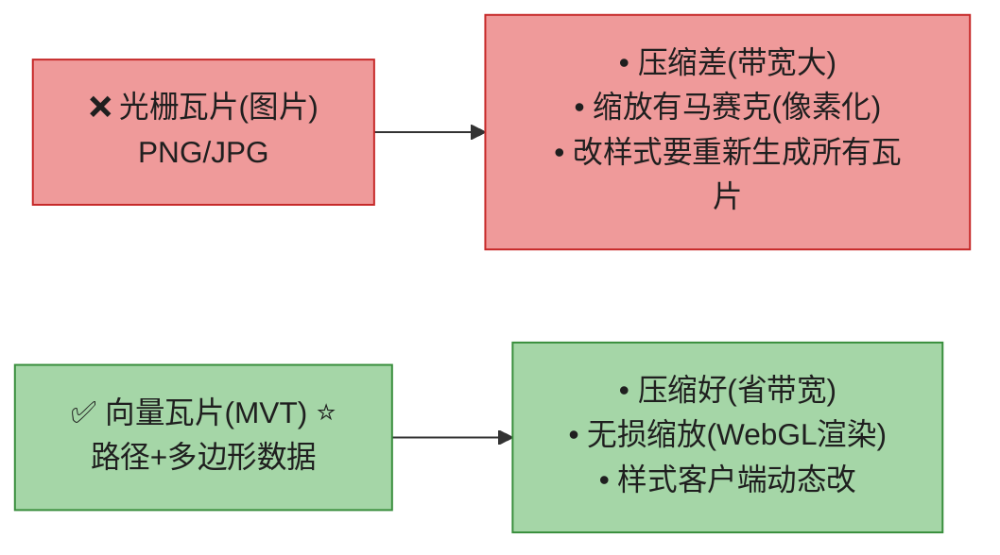

| 维度 | 光栅瓦片(图片) | **向量瓦片(MVT)** ⭐ |
|------|--------------|---------------------|
| 内容 | PNG/JPG 像素 | **路径 + 多边形(矢量)** |
| 压缩 | 差 | **好**(省带宽) |
| 缩放 | **马赛克/像素化** | **无损**(WebGL 实时渲染) |
| 样式 | 改样式→重生所有瓦片 | **客户端动态改样式** |
| 渲染 | 服务端画好 | **客户端 WebGL 画** |

> 🔄 **2026 现代版话术**(原书只提"优化"):
> "向量瓦片是 2026 主流——**Mapbox GL / MapLibre / Google 新版地图**都从光栅切到向量。三大优势:① **带宽省**(矢量压缩远好于图片);② **缩放丝滑**(WebGL 实时画,无像素化,这是 Google Maps 'Prototyping a Smoother Map' 那篇文章的核心);③ **样式灵活**(夜间模式、3D、个性化样式客户端动态切,不用服务端重生瓦片)。**光栅瓦片已基本淘汰**。"

---

## 5. 子系统二:导航服务 ⭐⭐⭐⭐⭐

导航是个 **pipeline**:geocoding → 最短路径 → ETA → ranker。


### 5.1 geocoding 服务

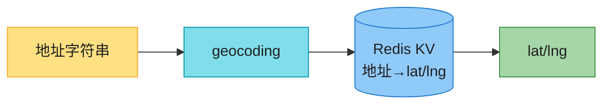

地址 → lat/lng。**读多写少** → Redis KV(读极快)。

### 5.2 最短路径服务(A* on routing tile)⭐⭐

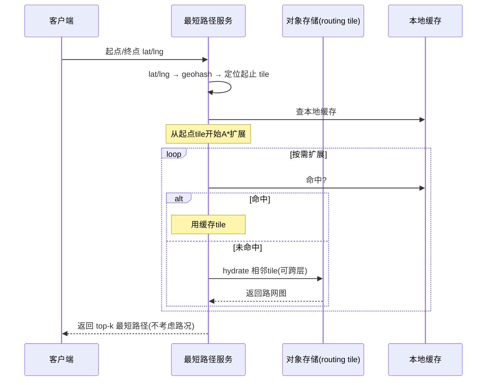

**A* 在 routing tile 上的流程**:
1. 起点/终点 lat/lng → **geohash → 定位起止 routing tile**。
2. 从起点 tile 开始 A* 扩展。
3. **按需 hydrate**(加载)相邻 tile(命中本地缓存优先,否则从对象存储拉)。
4. 可**跨层切换**(进入高速大 tile),直到找到 top-k 最短路径。

> 💡 **关键设计**:**路网结构很少变 → 路径结果可缓存**(同起终点直接返回缓存)。**routing tile 按需 hydrate** 是控制内存的核心——不全量加载,只加载搜索路径上的。

### 5.3 ETA 服务(ML 预测)⭐

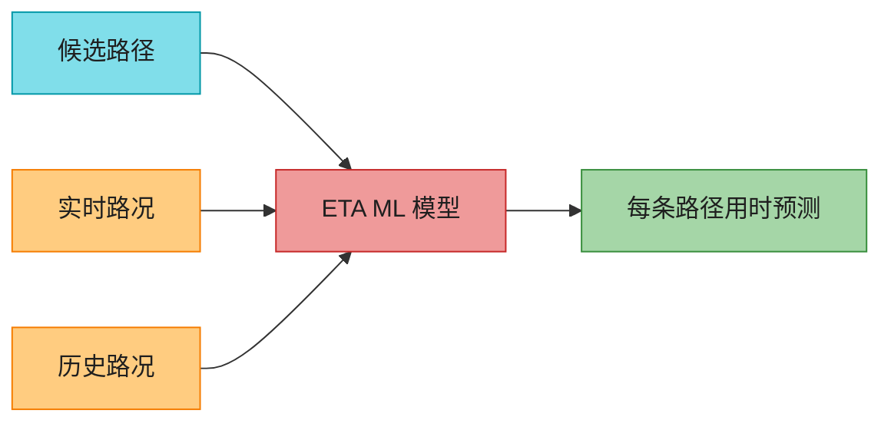

> 📝 **ETA 用 ML**:基于**实时路况 + 历史数据**预测每条路径用时。**难点**:不仅要现在路况,还要**预测 10-20 分钟后**(用户开到那段路时)的路况。这是 ML 算法层面的挑战。

### 5.4 ranker 服务


应用用户偏好过滤(避高速/避收费),按用时排序,返回 top-k。

---

## 6. 子系统三:位置服务 ⭐⭐⭐⭐

### 6.1 批处理上报(省流量)

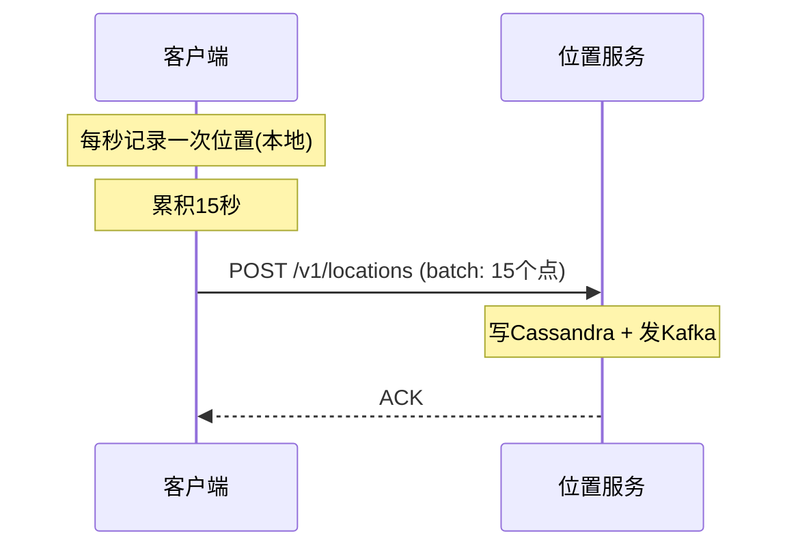

> 💡 **批处理是省流量的关键**:**每秒上报 = 3M QPS(打爆);每 15s 批一次 = 200K QPS(降 15 倍)**。客户端本地累积,批量发。**堵车时还可降频**(移动慢,少上报)。接 V2-Ch2 的移动端省电思想。

### 6.2 数据模型(Cassandra + Kafka)

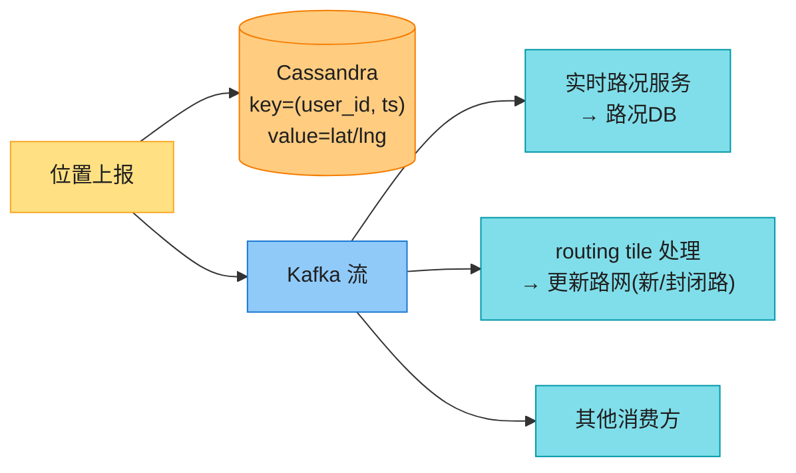

| 存储 | 用途 | 选型理由 |
|------|------|---------|
| **Cassandra** | 持久位置数据 | **高写**(100万/秒)+ AP(可用优先)。key=`(user_id, ts)`,user_id 分区、ts 聚类 → 单用户时间范围查极快 |
| **Kafka** | 位置流分发 | 多消费方(路况/路网更新)统一消费 |

> 📝 **位置数据的多重价值**:① 检测新/封闭路 → 更新 routing tile;② 实时路况 → ETA 更准;③ 个性化。所以**写 Cassandra 持久化的同时,发 Kafka 给下游流式消费**。

---

## 7. 深入:自适应 ETA + 重新路由 ⭐⭐⭐⭐

**问题**:导航中路况变了(事故/拥堵),怎么实时通知受影响的用户重新算 ETA/换路?

### 7.1 朴素方案(慢)

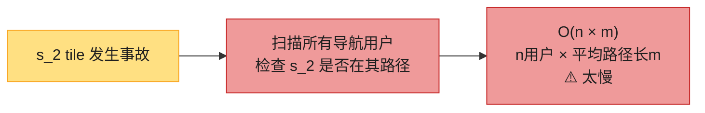

每个用户存路径 `[s_1, s_2, ..., s_k]`,事故在 s_2 → 扫所有用户找谁路径含 s_2。**O(n×m) 太慢**。

### 7.2 super-tile 优化(原书方案)⭐

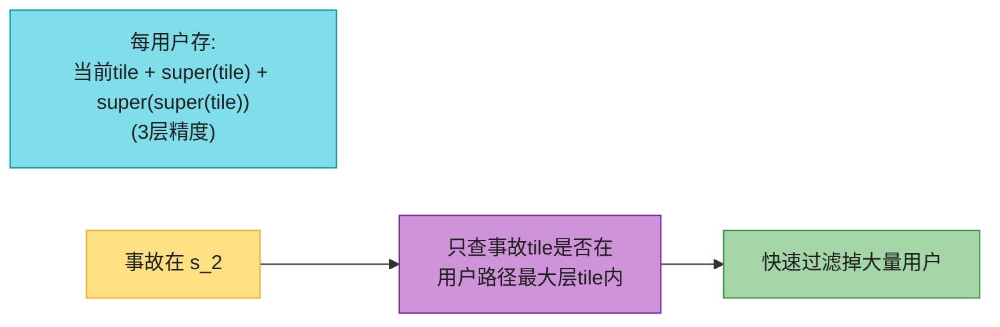

**优化**:每用户存 `当前tile, super(当前tile), super(super(当前tile))`(三层)。判断用户是否受影响:**只查事故 tile 是否在该用户最大层 tile 内**——快速过滤掉绝大多数无关用户。

### 7.3 推送协议

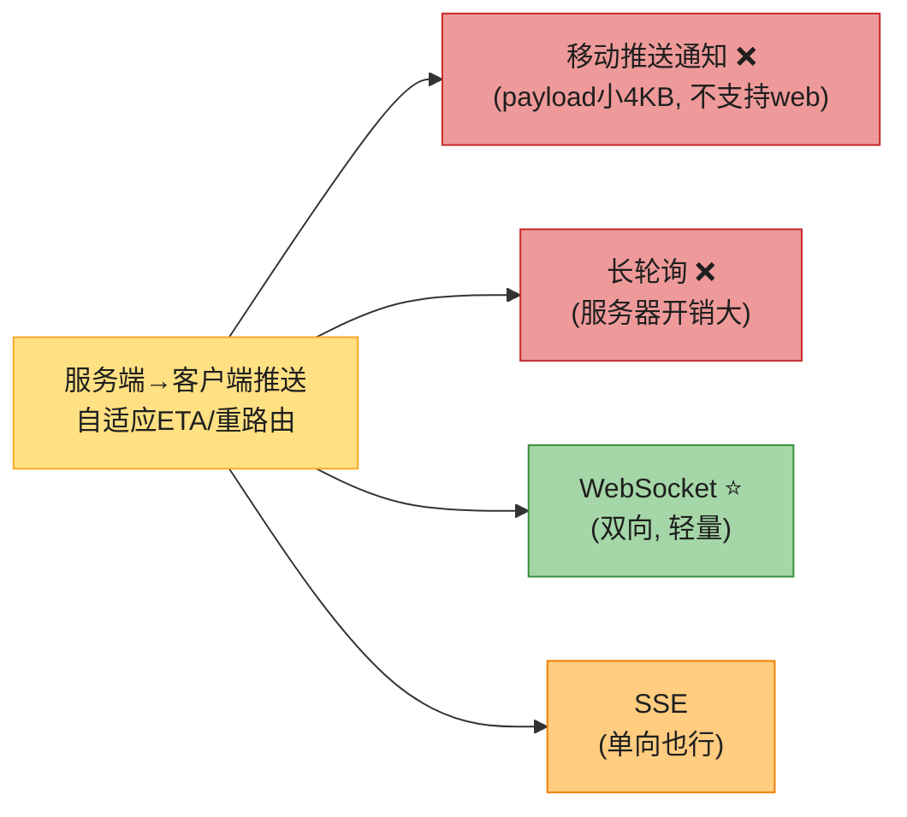

**原书选 WebSocket**——双向(最后一公里定位可能要双向实时)、服务器开销轻(接 Vol.1 Ch12)。

---

## 8. 深入:最短路径算法的 2026 现状(CH/CRP)⭐⭐⭐(原书只提 A*)

原书只提 Dijkstra/A*,但**生产级毫秒寻路用 Contraction Hierarchies 和 CRP**。这是大厂地图题的硬核加分。

```mermaid
flowchart TD
    ALG["最短路径算法"] --> D["Dijkstra<br/>朴素, O(E log V)"]
    ALG --> A["A*<br/>启发式, 原书用"]
    ALG --> CH["Contraction Hierarchies ⭐<br/>预处理+超快查询"]
    ALG --> CRP["Customizable Route Planning ⭐<br/>Google/HERE用"]

    style ALG fill:#FFE082,stroke:#F9A825,color:#1f1f1f
    style D fill:#80DEEA,stroke:#0097A7,color:#1f1f1f
    style A fill:#A5D6A7,stroke:#388E3C,color:#1f1f1f
    style CH fill:#CE93D8,stroke:#7B1FA2,color:#1f1f1f
    style CRP fill:#CE93D8,stroke:#7B1FA2,color:#1f1f1f
```

| 算法 | 思想 | 速度 | 谁用 |
|------|------|------|------|
| **Dijkstra** | 朴素最短路 | 慢(整图) | 教学 |
| **A*** | Dijkstra + 启发式(朝目标方向优先) | 中 | 原书方案 |
| **Contraction Hierarchies(CH)** ⭐ | **预处理**:把重要节点(高速)提升到上层,构造"捷径"。查询只在上层飞,跳过街道 | **超快**(毫秒级跨大陆) | OSRM、GraphHopper |
| **Customizable Route Planning(CRP)** ⭐ | CH 思想 + **路权(速度/收费)可快速重定制**(不用重预处理) | 快 + **支持实时路况** | **Google、HERE** |

> 📝 **为什么需要 CH/CRP?** 跨大陆寻路(纽约→洛杉矶),纯 A* 要遍历整个美国路网(几亿节点),秒级。**CH 预处理出"高速捷径层"**,查询时直接在高速层飞,毫秒级。**CRP 是 CH 的进化——支持实时改路权(堵车时某段变慢),不用重新预处理**,这正是 Google Maps 的实际方案。
>
> 💡 **话术**:"原书用 A*,但生产级毫秒寻路用 **Contraction Hierarchies 或 CRP**——预处理把高速提升到'捷径层',查询时跨大陆毫秒级。**Google/HERE 用 CRP**(支持实时路况重定制,不用重预处理)。这是 2026 地图题的硬核区分点。"

---

## 9. 2026 现代增量(原书没讲的硬核)⭐⭐⭐⭐

### 9.1 GNN 预测 ETA(DeepMind + Google)

原书说"ETA 用 ML",但没讲 Google 的实际做法——**图神经网络(GNN)**。

```mermaid
flowchart LR
    G["路网图<br/>(节点=路口, 边=路段)"] --> GNN["GNN 图神经网络"]
    FEAT["特征: 实时路况/历史/天气/事件"] --> GNN
    GNN --> PRED["预测每段路未来10-20分钟路况"]

    style G fill:#80DEEA,stroke:#0097A7,color:#1f1f1f
    style GNN fill:#EF9A9A,stroke:#C62828,color:#1f1f1f
    style FEAT fill:#FFCC80,stroke:#F57C00,color:#1f1f1f
    style PRED fill:#A5D6A7,stroke:#388E3C,color:#1f1f1f
```

> 💡 **Google + DeepMind 2020 用 GNN 预测路况**(原书引用)。**路网天然是图**,GNN 在图上学习"路况如何在路网上传播"(一段堵→影响相邻段)。预测未来 10-20 分钟路况 → 更准 ETA。**这是 ETA 精度碾压竞品的根基**。

### 9.2 开源生态(OSM / Valhalla / OSRM / GraphHopper)

| 项目 | 定位 |
|------|------|
| **OpenStreetMap(OSM)** | 开源世界地图数据(众包,Google 数据的开放替代) |
| **Valhalla** | 开源路由引擎(原书引用,**routing tile 思想来源**) |
| **OSRM** | 开源路由(用 **CH** 快速寻路) |
| **GraphHopper** | 开源路由(CH + 灵活) |
| **Mapbox / MapLibre GL** | 商业/开源**向量瓦片 + WebGL 渲染** |

> 💡 **话术**:"生产做地图不必从零造——**OSM 提供数据,Valhalla/OSRM/GraphHopper 提供路由,Mapbox/MapLibre 提供向量渲染**。原书的 routing tile 概念就来自 Valhalla。"

### 9.3 离线地图 / AR 导航 / 多模态(原书没提)

```mermaid
flowchart LR
    EXT["Google Maps 扩展"] --> OFF["离线地图<br/>下载区域瓦片离线用"]
    EXT --> AR["AR 导航(Live View)<br/>摄像头+街景叠加方向"]
    EXT --> MM["多模态<br/>骑行+地铁+步行组合"]
    EXT --> DASH["众包更新<br/>用户上报路况/事故"]

    style EXT fill:#FFE082,stroke:#F9A825,color:#1f1f1f
    style OFF fill:#80DEEA,stroke:#0097A7,color:#1f1f1f
    style AR fill:#CE93D8,stroke:#7B1FA2,color:#1f1f1f
    style MM fill:#FFCC80,stroke:#F57C00,color:#1f1f1f
    style DASH fill:#A5D6A7,stroke:#388E3C,color:#1f1f1f
```

| 特性 | 说明 |
|------|------|
| **离线地图** | 用户下载某区域所有瓦片,无网可用(地铁/漫游)。靠客户端缓存 + 区域打包 |
| **AR 导航(Live View)** | 摄像头实时画面 + 街景 + AR 箭头导航(步行最后一公里) |
| **多模态** | 骑行到地铁站 + 地铁 + 步行,组合最优 |
| **众包更新** | 用户上报事故/施工/新路 → 实时更新路网 |

### 9.4 隐私(接 V2-Ch2)

位置轨迹高度敏感:**短期保留 + 差分隐私聚合 + 不关联身份**。Google 的"时间线"数据端侧加密存储(2026 改革)。

---

## ⚠️ 已过时 / 书里没说(2022 → 2026)

| 原书(2022) | 2026 现状 | 面试应对 |
|------------|----------|---------|
| 光栅瓦片为主 | **向量瓦片(MVT)+ WebGL** 是主流 | 讲 Mapbox/MapLibre,讲带宽+丝滑缩放 |
| 最短路 Dijkstra/A* | **CH / CRP** 毫秒级跨大陆 | 讲预处理捷径层,Google 用 CRP |
| ETA"用 ML" | **GNN(DeepMind)** 预测传播 | 讲路网是图,GNN 学路况传播 |
| 没提开源 | OSM/Valhalla/OSRM/GraphHopper/Mapbox | 说不用从零造 |
| 没提离线/AR | 离线地图 + AR Live View 是标配 | 讲客户端缓存 + 摄像头叠加 |
| 没提众包 | 用户上报路况/事故是实时更新主力 | 讲 crowd-sourcing |
| 路况靠位置流 | + 事件报告 + 路侧传感器 | 多源融合 |
| 没提隐私 | 轨迹敏感,端侧加密 + 差分隐私 | 接 Ch2 |

---

## 💻 代码示例

### 示例 1:geohash → 瓦片 URL(渲染)

```python
BASE32 = "0123456789bcdefghjkmnpqrstuvwxyz"

def latlng_to_tile_url(lat, lng, zoom):
    """位置+zoom → geohash → CDN 瓦片URL"""
    gh = encode_geohash(lat, lng, precision=zoom_to_precision(zoom))
    return f"https://cdn.map-provider.com/tiles/{gh}.mvt"   # 向量瓦片(.mvt)

def zoom_to_precision(z):
    """zoom level → geohash 精度"""
    return min(max((z + 2) // 3, 1), 8)

def get_tile_urls(lat, lng, zoom):
    """返回当前格 + 8 邻居(共9格)瓦片URL, 预下载防卡顿"""
    gh = encode_geohash(lat, lng, precision=zoom_to_precision(zoom))
    neighbors = [gh] + compute_8_neighbors(gh)
    return [f"https://cdn.map-provider.com/tiles/{n}.mvt" for n in neighbors]
```

### 示例 2:A* 在 routing tile 上(导航核心)

```python
import heapq

def shortest_path(origin_latlng, dest_latlng):
    """A* 在 routing tile 上, 按需 hydrate 相邻 tile"""
    start_tile = geohash_tile(origin_latlng)
    goal_tile = geohash_tile(dest_latlng)
    open_set = [(heuristic(origin_latlng, dest_latlng), 0, origin_latlng, [])]
    visited = set()
    while open_set:
        _, g, node, path = heapq.heappop(open_set)
        if node in visited: continue
        visited.add(node)
        path = path + [node]
        if node == dest_latlng:
            return path
        tile = get_routing_tile(node, cache=True)   # 按需hydrate(命中缓存优先)
        for neighbor, weight in tile.edges(node):
            if neighbor in visited: continue
            f = g + weight + heuristic(neighbor, dest_latlng)
            heapq.heappush(open_set, (f, g + weight, neighbor, path))
    return None

def get_routing_tile(node, cache=True):
    """按 geohash 从对象存储 hydrate routing tile(命中缓存优先)"""
    gh = geohash_tile(node)
    if cache and gh in local_tile_cache:
        return local_tile_cache[gh]
    tile = s3.get(f"routing_tiles/{gh}.bin")        # 二进制邻接表
    local_tile_cache[gh] = tile
    return tile
```

### 示例 3:位置批处理上报 + Kafka

```python
# 客户端: 累积15秒批量上报
def flush_locations():
    batch = location_buffer.flush_all()   # [(lat,lng,ts), ...]
    http.post("/v1/locations", json={"locs": batch})

# 服务端: 写Cassandra + 发Kafka
def on_location_batch(user_id, locs):
    for lat, lng, ts in locs:
        cassandra.execute(
            "INSERT INTO locations (user_id, ts, lat, lng) VALUES (%s,%s,%s,%s)",
            (user_id, ts, lat, lng))
    kafka_produce("location_stream", {"user_id": user_id, "locs": locs})
    # 下游: 路况服务/routing tile 处理 消费 Kafka
```

---

## 🪤 追问陷阱(面试官最爱问,本章集)

1. **"路网这么大,A* 怎么跑?"** → 切 **routing tile**(按 geohash),算法按需 hydrate 相邻 tile,不全量加载。
2. **"跨城寻路很慢吧?"** → **分层 routing tile**(本地/干道/高速三层),跨城直接在高速层飞,毫秒级。
3. **"瓦片怎么发?"** → **预生成静态瓦片 + CDN**(光栅)/ **向量瓦片 + WebGL**(2026 主流)。动态生成不可行(负载+难缓存)。
4. **"向量瓦片比光栅好在哪?"** → 带宽省 + 缩放丝滑(无像素化)+ 样式客户端动态改。
5. **"瓦片 URL 客户端算还是服务端算?"** → 服务端算(map tile 服务)更灵活,改方案不用发版。
6. **"ETA 怎么算?"** → **ML(GNN)** 预测每段路未来 10-20 分钟路况(实时+历史+天气)。
7. **"位置上报每秒一次行吗?"** → 不行,3M QPS 打爆。**客户端批 15s 一次** → 200K QPS。
8. **"位置数据存哪?"** → Cassandra(高写 + AP),key=(user_id, ts),分区键 user_id、聚类键 ts。
9. **"位置数据除了存还能干嘛?"** → 发 Kafka,下游消费:**实时路况、检测新/封闭路、个性化**。
10. **"事故发生了,怎么找受影响用户?"** → super-tile 优化:用户存 3 层 tile,只查事故 tile 是否在用户最大层 tile 内,快速过滤。
11. **"自适应 ETA 怎么推给客户端?"** → WebSocket(双向 + 轻量),不用推送通知(payload 小)。
12. **"最短路 A* 够吗?"** → 生产用 **CH/CRP** 毫秒级跨大陆;A* 是基础,Google 用 CRP(支持实时路权)。
13. **"地图怎么省流量?"** → 客户端缓存 + 预生成可缓存瓦片 + 向量瓦片 + 批上报 + 离线地图。
14. **"100PB 瓦片怎么存?"** → 对象存储(S3)+ CDN;90% 无人区高压缩;按 zoom 预生成。
15. **"多停靠点导航(TSP)?"** → 原书提为扩展;外卖/物流用,接近旅行商问题(TSP),DP 或启发式。

---

## 🏭 生产级产品速查表

| 产品 | 特色 | 技术点 |
|------|------|--------|
| **Google Maps** | 业界标杆 | CRP 路由 + GNN ETA + 向量瓦片 + DeepMind |
| **Mapbox** | 向量瓦片先驱 | **MVT + Mapbox GL WebGL** |
| **MapLibre** | 开源 Mapbox 替代 | 开源向量渲染 |
| **HERE** | 老牌图商 | CRP + 路侧传感器数据 |
| **OpenStreetMap** | 开源地图数据 | 众包数据(谷歌的开放替代) |
| **Valhalla / OSRM / GraphHopper** | 开源路由引擎 | **CH 快速寻路** + routing tile |
| **苹果地图** | iOS 集成 | 向量化 + 隐私优先 |
| **高德 / 百度地图** | 中国市场 | 本地化路网 + 实时路况 + 国密合规 |

> 🏭 **业界标杆**:**Google Maps**(本题原型)+ **DeepMind GNN ETA**(路网图神经网络预测路况,2020 论文)+ **Valhalla routing tile**(开源 routing tile 思想来源)+ **Mapbox 向量瓦片**(MVT 标准)。

---

## 📝 本章要点总结

```mermaid
flowchart LR
    ROOT(["V2-Ch3 Google Maps<br/>瓦片渲染 + 图算法导航 + ML ETA"])

    B1["需求+估算 ⭐<br/>────────<br/>• 1B DAU<br/>• 100PB瓦片, 7200 nav QPS<br/>• 三大子系统"]
    B2["Map 101 ⭐⭐<br/>────────<br/>• 投影/geocoding/geohash<br/>• tiling瓦片<br/>• routing tile + 分层"]
    B3["地图渲染 ⭐⭐<br/>────────<br/>• 预生成瓦片+CDN<br/>• geohash编址URL<br/>• 向量瓦片(WebGL)2026主流"]
    B4["导航 ⭐⭐⭐<br/>────────<br/>• geocoding→最短路(A*/CH)<br/>→ML ETA(GNN)→ranker<br/>• 按需hydrate routing tile"]
    B5["位置服务 ⭐<br/>────────<br/>• 批处理上报(15s)<br/>• Cassandra+Kafka流<br/>• 路况/路网更新"]
    B6["2026增量(补)<br/>────────<br/>• CH/CRP快速寻路<br/>• GNN ETA(DeepMind)<br/>• 向量瓦片/离线/AR/开源"]

    ROOT --> B1
    ROOT --> B2
    ROOT --> B3
    ROOT --> B4
    ROOT --> B5
    ROOT --> B6

    style ROOT fill:#FFE082,stroke:#F57C00,color:#1f1f1f,stroke-width:3px
    style B1 fill:#80DEEA,stroke:#0097A7,color:#1f1f1f
    style B2 fill:#CE93D8,stroke:#7B1FA2,color:#1f1f1f
    style B3 fill:#A5D6A7,stroke:#388E3C,color:#1f1f1f
    style B4 fill:#90CAF9,stroke:#1976D2,color:#1f1f1f
    style B5 fill:#FFCC80,stroke:#F57C00,color:#1f1f1f
    style B6 fill:#EF9A9A,stroke:#C62828,color:#1f1f1f
```

**核心 Takeaways**:

1. **三大子系统各有灵魂**——渲染(预生成瓦片+CDN)、导航(routing tile+A*+ML ETA)、位置(批上报+Kafka 流)。
2. **routing tile 是导航灵魂**——路网太大切不成图,按 geohash 切 tile,A* 按需 hydrate;**分层 tile**(本地/干道/高速)让跨城毫秒级。
3. **地图渲染 = 预生成 + CDN**(动态生成不可行);**2026 是向量瓦片 + WebGL**(带宽省 + 缩放丝滑 + 样式灵活)。
4. **ETA 用 ML(GNN)**——路网是图,GNN 学路况传播,预测未来 10-20 分钟。
5. **位置服务批处理上报**(每 15s 一次降 15 倍 QPS)+ Cassandra(高写 AP)+ Kafka(多下游消费)。
6. **自适应 ETA 用 super-tile 优化**——用户存 3 层 tile,事故快速过滤受影响用户;WebSocket 推送。
7. **生产寻路用 CH/CRP** 而非纯 A*(预处理捷径层,毫秒跨大陆;Google 用 CRP 支持实时路权)。
8. **省流量省电**:客户端缓存 + 可缓存瓦片 + 向量瓦片 + 批上报 + 离线地图(接 V2-Ch2)。
9. **开源生态**:OSM 数据 + Valhalla/OSRM/GraphHopper 路由 + Mapbox/MapLibre 渲染,不用从零造。
10. **原书停在 2022**——补向量瓦片/GNN/CH-CRP/开源/离线-AR,才能 strong hire。

> 🔗 **连接上下章**:**V2-Ch1 邻近服务**(附近商家,直线距离,静态)、**V2-Ch2 附近好友**(动态位置,推送扇出)、**V2-Ch3 Google Maps**(真实路网,最短路径 + ML ETA)——三章是**地理服务的难度递进**:直线 → 实时 → 路网图算法。**V2-Ch4 分布式消息队列**则切到**数据基础设施**——Kafka 类系统(本章位置流已用到 Kafka)。
