# Volume 2 · Chapter 4: 设计分布式消息队列 (Design a Distributed Message Queue)

> 📑 **导航**:[← Maps](ch2_03-设计GoogleMaps.md) · [📚 总目录](../README.md) · [监控告警 →](ch2_05-设计监控告警系统.md)
> 🔗 **相关**:[聊天](../SDE-Vol1/ch1_12-设计聊天系统.md) · [通知系统](../SDE-Vol1/ch1_10-设计通知系统.md) · [AWS消息/IAM](../SDA/aws_12-AWS消息编排监控IAM.md) · [架构模式](../SDA/aws_08-架构设计与模式.md)


> **本章定位**:分布式消息队列是**"现代架构的中枢神经"**——它是 Vol.1 Ch1 第 7 集 MQ 的深化版,也是 Kafka/RocketMQ/Pulsar 的设计骨架。所有微服务解耦、削峰、异步、事件驱动都靠它。灵魂是六件事:**① topic/partition/broker 怎么切分扩展 ② 消息怎么持久化(顺序写的 WAL ⭐) ③ 生产/消费怎么批处理提吞吐 ④ push vs pull + 消费者组 rebalancing ⑤ 复制 + ISR 保高可用 ⑥ 交付语义(at-least/exactly-once)**。它把 Vol.1 Ch1 的 MQ、Ch5 一致性哈希、Ch6 复制全深化。**它还是 V2-Ch3 Maps 位置流、Ch6 广告聚合的底层基础设施**。

> **本章和原书的区别**:原书把 **Kafka 的核心机制讲得相当完整**——topic/partition/broker、WAL 顺序写、消费者组 + rebalancing、producer 路由 + buffer、push vs pull、复制都覆盖,是面试标准答案。但**复制只讲了"3 副本 + leader/follower",没讲 ISR(In-Sync Replicas)**这个 Kafka 高可用的真正核心;**交付语义只说"可配置",没讲 exactly-once 怎么实现(幂等 producer + 事务协调器)**;**全程用 ZooKeeper 协调,但 2022 Kafka 已经 KRaft 去掉了 ZK**(KIP-500,Kafka 3.3+,这是本书出版后最大的架构变更);**提到 Pulsar 但没讲它的存算分离**架构(对比 Kafka 的 broker 内置存储);**没讲 tiered storage**(冷数据上 S3 降留存成本)、**Schema Registry**(Avro/Protobuf 演进)、**压缩**、**Redpanda**(C++ Kafka 替代)。本章补上。

---

## 🎯 面试怎么答(被问到"设计分布式消息队列 / 设计 Kafka"时)

**开场话术**(直接背):

> "消息队列我先确认四件事:① 是传统 MQ(消费即删)还是事件流(可重放 + 长留存)?② 要不要保序?③ 留存多久?④ 交付语义(at-least/exactly-once)?然后按 **topic/partition/broker 怎么扩展 → 存储(WAL 顺序写 ⭐)→ 批处理提吞吐 → push vs pull + 消费者组 rebalancing → 复制 + ISR** 五块讲。核心抉择是 **吞吐 vs 延迟的批处理权衡** 和 **顺序写的磁盘利用**。"

**4 步推进**:

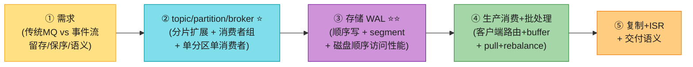

> 💡 **Step 1 关键区分**:**传统 MQ vs 事件流平台**——传统 MQ(RabbitMQ)消费即删、不保序、短留存,设计简单;事件流(Kafka)可重放、保序、长留存,设计复杂。**本题设计的是带事件流特性的 MQ**(更难)。主动说这个区别 = 懂边界。
>
> 💡 **关键信号词**:**"分区是最小存储单元,单分区单消费者保序"** + **"WAL 顺序写,磁盘顺序访问几百 MB/秒,加 OS 磁盘缓存几乎等于内存速度"** + **"批处理摊薄网络 + 顺序写,吞吐延迟的权衡"**——这三句直接拿下面试。

---

## 🗺️ 章节概览

| 小节 | 要点 | 重要性 |
|------|------|--------|
| MQ 价值 + MQ vs 事件流 | 解耦/扩展/可用/异步;Kafka 是事件流非严格MQ | ⭐⭐⭐⭐ |
| 需求 + 传统MQ简化 | 文本KB、可重放、保序、2周留存、3种语义 | ⭐⭐⭐ |
| **topic/partition/broker ⭐** | 分片扩展、FIFO、offset、key 路由 | ⭐⭐⭐⭐⭐ |
| **消费者组 ⭐⭐** | 组内单分区单消费者保序、点对点/发布订阅统一 | ⭐⭐⭐⭐⭐ |
| 高层架构 | broker + 3存储(data/state/metadata)+ 协调服务 | ⭐⭐⭐⭐ |
| **WAL 存储 ⭐⭐⭐** | append-only + segment + 顺序写磁盘性能 | ⭐⭐⭐⭐⭐ |
| 消息结构 + 批处理 | 零拷贝、批处理摊薄、吞吐vs延迟 | ⭐⭐⭐⭐⭐ |
| **producer flow** | 路由层 vs 客户端路由+buffer | ⭐⭐⭐⭐ |
| **consumer flow ⭐⭐** | push vs pull + 长轮询 + rebalancing | ⭐⭐⭐⭐⭐ |
| 状态/元数据 + Zookeeper | offset/topic配置 + leader选举 | ⭐⭐⭐⭐ |
| **复制 + ISR ⭐** | 3副本 leader/follower + ISR | ⭐⭐⭐⭐⭐ |
| **2026增量(补)** | exactly-once、KRaft去ZK、Pulsar存算分离、tiered storage | ⭐⭐⭐⭐⭐ |

---

## 1. 消息队列的价值 + MQ vs 事件流

### 1.1 为什么需要消息队列?

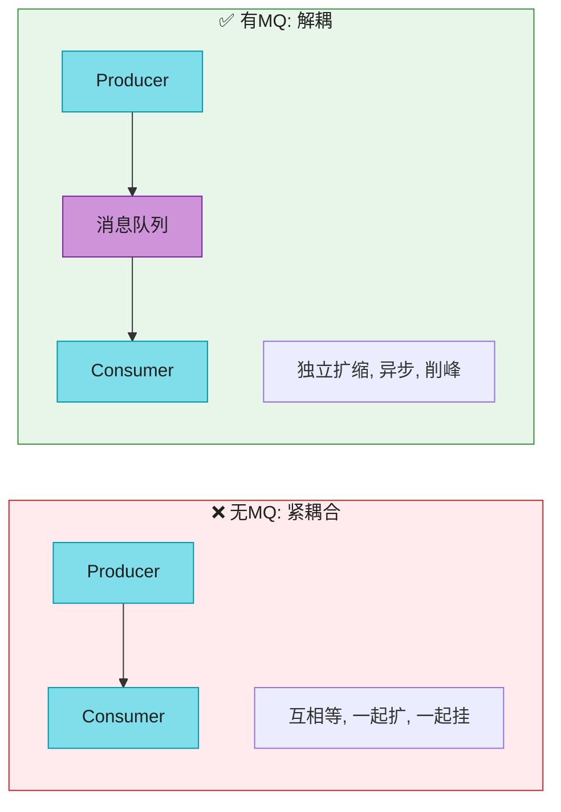

**四大收益**(背熟):

| 收益 | 说明 |
|------|------|
| **解耦** | 消除组件紧耦合,各自独立更新 |
| **可扩展** | producer/consumer 独立扩(高峰加 consumer) |
| **高可用** | 一部分挂了,其他仍能经队列交互 |
| **高性能** | 异步通信——producer 不等响应,consumer 有空再消费 |

### 1.2 传统 MQ vs 事件流平台 ⭐(关键区分)

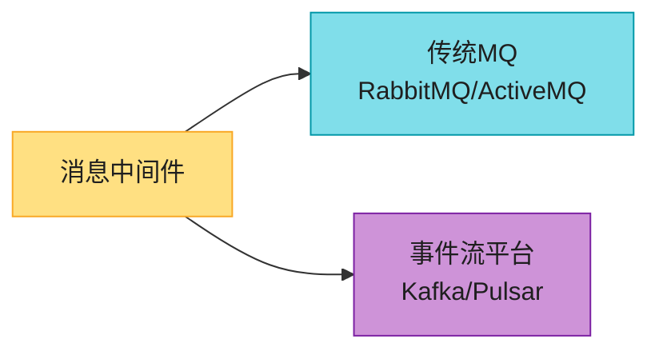

| 维度 | **传统 MQ(RabbitMQ)** | **事件流平台(Kafka)** |
|------|---------------------|---------------------|
| 消费后消息 | **删除** | **保留**(可重放) |
| 顺序保证 | 通常**不保证** | **分区保序** |
| 留存 | 内存为主 + 小磁盘溢出 | **长留存**(周/月/年) |
| 设计复杂度 | 简单 | 复杂 |

> 💡 **界限在模糊**:**RabbitMQ 加了 streams**(append-only log,像事件流);**Pulsar 既像 Kafka 又能当传统 MQ**。**本题设计"带事件流特性的 MQ"**(可重放 + 保序 + 长留存)——更难,但更通用。

---

## 2. 需求 + 估算

**澄清问题**(原书对话):

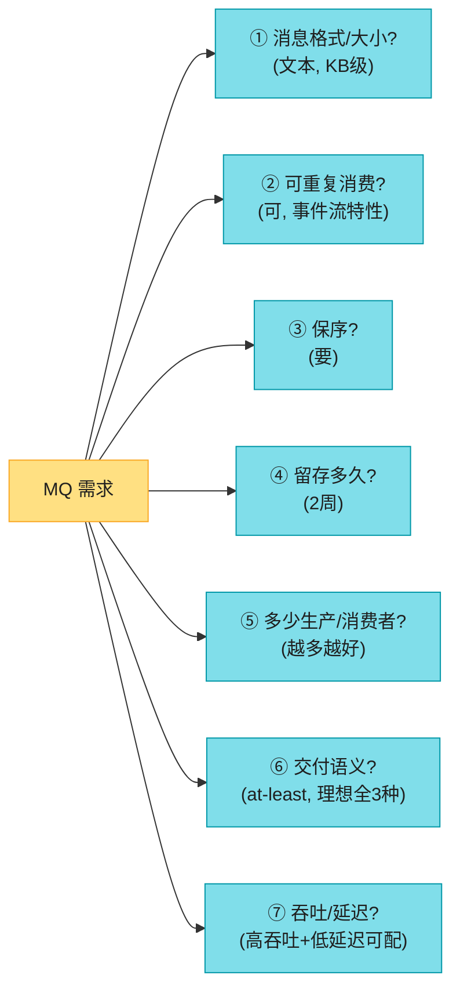

**原书确定的需求**:

| 维度 | 确认值 | 备注 |
|------|--------|------|
| 消息 | 文本,KB 级 | — |
| 重复消费 | ✅ | 事件流特性(传统MQ不支持) |
| 保序 | ✅ | 事件流特性 |
| 留存 | 2 周 | 事件流特性 |
| 语义 | **at-least-once 起,理想 3 种可配** | — |
| 吞吐/延迟 | **高吞吐(日志聚合)+ 低延迟(传统MQ),可配** | — |

**非功能性**:**高吞吐/低延迟可配**;**分布式可扩展**(扛突发);**持久 + 多副本**(磁盘 + 跨节点复制)。

> 💡 **传统 MQ 的简化**:如果你面试的是传统 MQ(RabbitMQ),**去掉"重放 + 保序 + 长留存"**,设计大幅简化(内存为主,不持久化每条)。**本题设计的是复杂版**。

---

## 3. 消息模型 + topic/partition/broker ⭐⭐⭐⭐⭐

### 3.1 两种消息模型

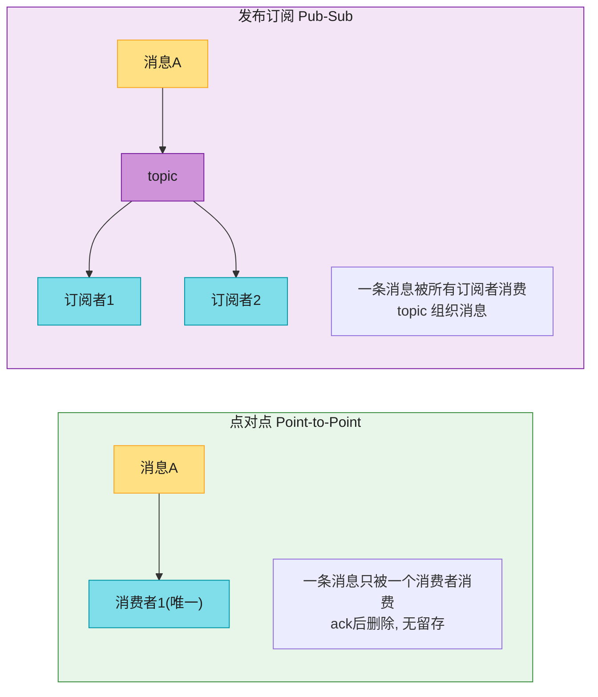

> 💡 **本题设计两种都支持**:pub-sub 靠 **topic**;点对点靠 **消费者组**(所有消费者放一组 → 同分区只一个消费者 → 等价点对点)。**一个概念统一两个模型**,这是 Kafka 的精妙设计。

### 3.2 topic / partition / broker(核心)

> 📝 **核心概念**:
> - **topic**:消息的分类(全集群唯一名)。
> - **partition(分区)**:topic 分片,**FIFO 队列**,消息在分区内有序;位置叫 **offset**。
> - **broker**:持有分区的服务器;分区**均匀分布**在 broker 上。
> - **message key**:可选,`hash(key) % 分区数` → 同 key 进同分区(保序);无 key 随机。

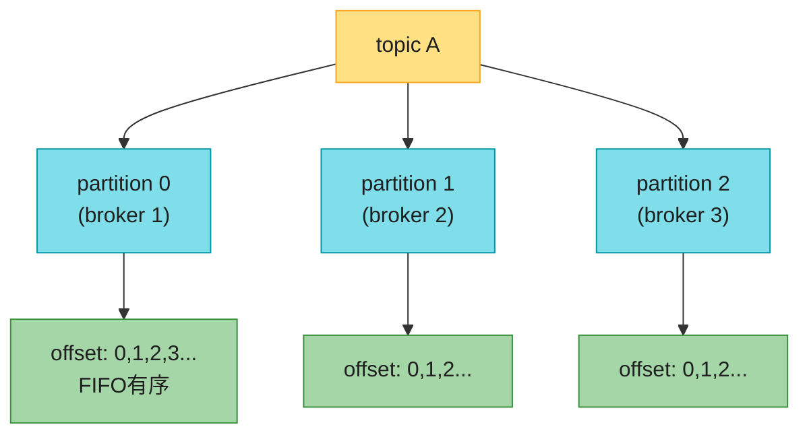

> 💡 **扩展靠分区**:**topic 容量不够 → 加分区**。分区跨 broker 分布 → 水平扩展。这是 Kafka 高扩展的根基。

### 3.3 消费者组 ⭐⭐(统一两种模型 + 保序约束)

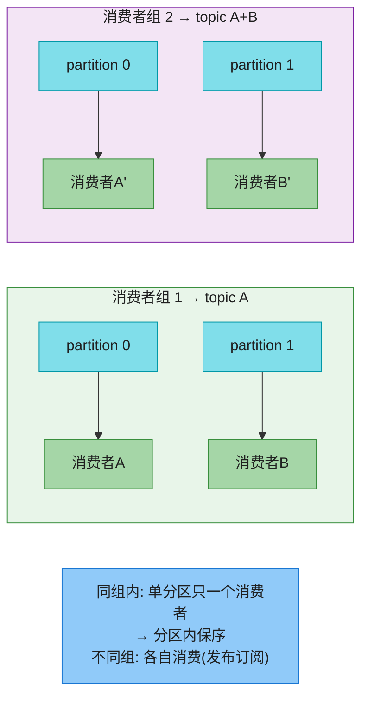

**关键约束 ⭐**:**同一消费者组内,一个分区只能被一个消费者消费**。

| 约束 | 后果 |
|------|------|
| 同组单分区单消费者 | **分区内顺序保证**(不会两个消费者乱序消费) |
| 消费者 > 分区 | 多余的消费者**空闲**(拿不到分区) |
| 所有消费者放一组 | = 点对点模型 |
| 不同组各消费 | = 发布订阅模型 |

> 💡 **精妙设计**:**预分配大量分区(远多于消费者)**,避免动态加分区(重哈希灾难);要扩容**只需加消费者**,不用动分区。这是 Kafka 的扩展哲学。

> 🪤 **追问陷阱(高频)**:"分区数能随便改吗?" → "**不能轻易加**。`hash(key)%N` 的 N 变了,几乎所有消息的路由都变,顺序被打乱(同 key 可能换分区)。所以**预先分配足够分区**(远超当前消费者数),扩容只加消费者不动分区。Kafka 也只允许加不允许减分区。"

---

## 4. 高层架构

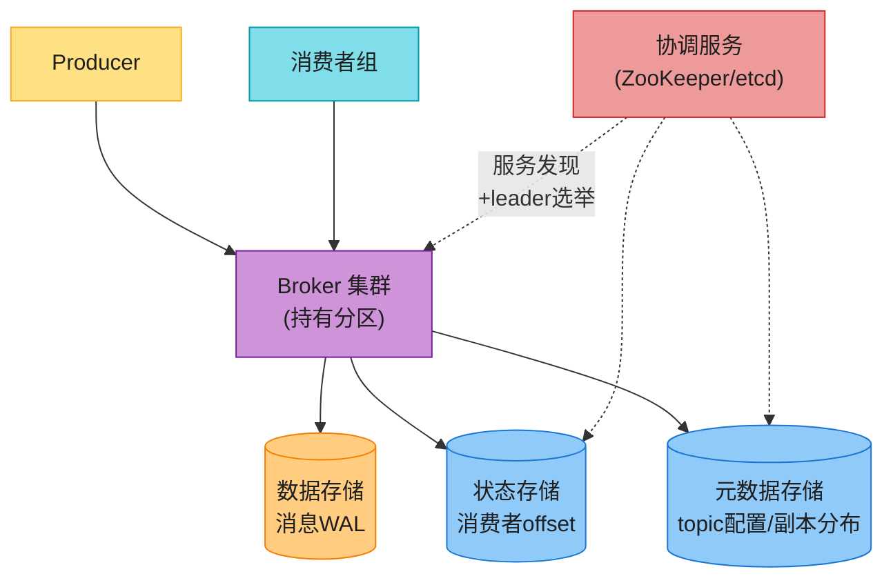

**组件分层**(背熟):

| 层 | 组件 | 职责 |
|----|------|------|
| 客户端 | Producer / 消费者组 | 生产/消费消息 |
| 核心 | **Broker** | 持有分区,存消息 |
| 存储 | 数据/状态/元数据 | 消息WAL / 消费者offset / topic配置 |
| 协调 | **协调服务(ZK/etcd)** | 服务发现 + leader 选举(active controller) |

> 📝 **协调服务**:维护"哪些 broker 活着"、**选出一个 active controller**(负责分配分区)。原书用 **ZooKeeper / etcd**。

---

## 5. 存储:WAL(Write-Ahead Log)⭐⭐⭐⭐⭐(本章灵魂)

### 5.1 为什么不用数据库?

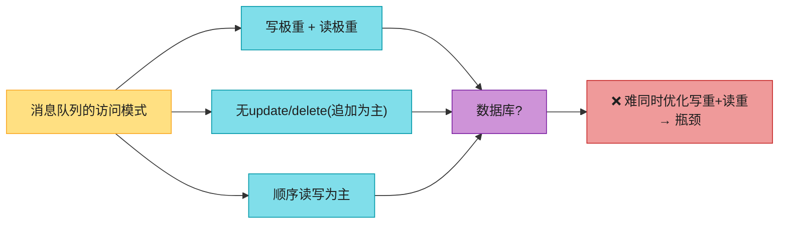

数据库要同时优化写重+读重,大规模下是瓶颈。**消息队列的访问模式(追加 + 顺序)适合专门的存储**。

### 5.2 WAL:append-only log ⭐

> 📝 **WAL(Write-Ahead Log,预写日志)**:一个纯文件,新消息**追加到尾部**,offset 单调递增。MySQL redo log、ZooKeeper 的 WAL 都是这个。

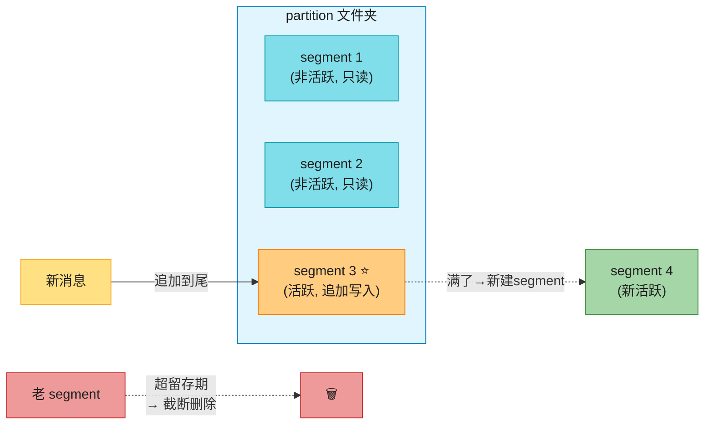

**segment 机制**(背):
- 文件不能无限长 → 切成 **segment**。
- **活跃 segment**(最后一个):接收新写入。
- **非活跃 segment**:只读;**超留存期/容量 → 截断删除**。
- 同 partition 的 segment 放一个文件夹 `Partition-{:id}/`。

### 5.3 磁盘顺序访问的性能(反直觉)⭐⭐

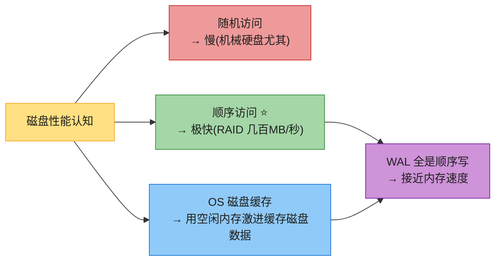

> 📝 **反直觉但关键**:**机械盘不是慢,是"随机访问"慢**。**顺序访问在 RAID 下能几百 MB/秒**,加上 OS 激进用空闲内存做磁盘缓存,**WAL 全顺序写几乎等于内存速度**。这是 Kafka 选磁盘(而非纯内存)存消息的根基——**大容量 + 便宜 + 顺序访问够快**。
>
> 🪤 **追问陷阱(高频)**:"消息队列为什么放磁盘不放内存?" → "**顺序写磁盘在 RAID + OS 缓存下接近内存速度,但容量大、便宜、持久**。纯内存(Redis)贵且容量有限,扛不住长留存(2周/PB级)。**Kafka 靠'顺序写 + 磁盘缓存'把磁盘用出内存的感觉**——这是它的核心优化。"

---

## 6. 消息结构 + 批处理

### 6.1 消息结构(零拷贝设计)

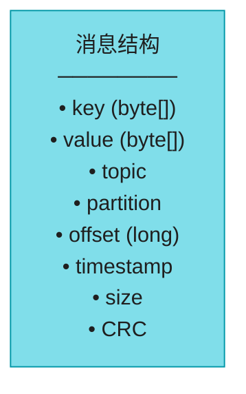

| 字段 | 说明 |
|------|------|
| **key** | 决定分区(`hash(key)%N`);可空(随机分区);不暴露给客户端 |
| **value** | 载荷(文本或压缩二进制) |
| **topic/partition/offset** | 三元组唯一定位一条消息 |
| **CRC** | 循环冗余校验,保证数据完整性 |

> 💡 **key ≠ KV 存储的 key**:消息 key 不唯一、可空、不用于查 value。它只用于**分区路由**(同 key 同分区 → 保序)。

> 📝 **零拷贝思想**:**消息从 producer → 队列 → consumer 全程不被修改**(统一 byte[] 结构),避免昂贵的拷贝。这是高吞吐的关键。**Linux 的 sendfile 零拷贝**(数据从磁盘直接到网卡,不进用户态)是 Kafka 的高吞吐神器。

### 6.2 批处理(吞吐的灵魂)⭐⭐⭐

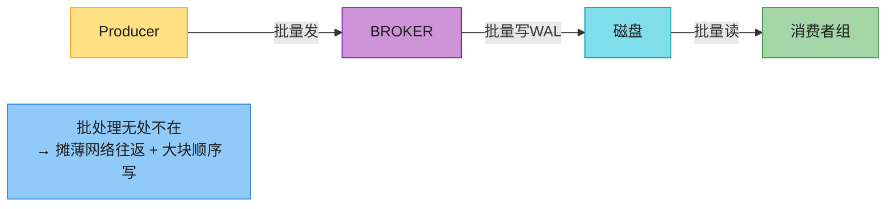

**批处理贯穿三处**:producer 批量发、broker 批量写、consumer 批量读。

**吞吐 vs 延迟的权衡 ⭐**:

| 批大小 | 吞吐 | 延迟 |
|--------|------|------|
| **大** | **高**(摊薄往返 + 大块顺序写) | 高(等凑批) |
| **小** | 低 | **低**(立刻发) |

> 💡 **可调**:**日志聚合场景用大批(高吞吐容忍延迟);传统 MQ 用小批(低延迟)**。这是"高吞吐 + 低延迟可配"的实现。

---

## 7. Producer flow:路由 + buffer

### 7.1 两种方案

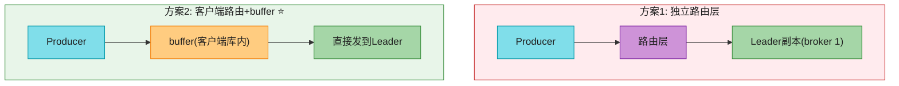

| 方案 | 优劣 |
|------|------|
| **独立路由层** | 多一跳网络延迟;没考虑批处理 ❌ |
| **客户端路由 + buffer ⭐** | 少一跳(低延迟)+ producer 自定分区逻辑 + buffer 批量发(高吞吐) ✅ |

> 💡 **原书选方案 2**:**路由 + buffer 打包进 producer 客户端库**——少网络跳数 + 批处理提吞吐。这是 Kafka producer 的实际设计。

### 7.2 写入 + 复制流程

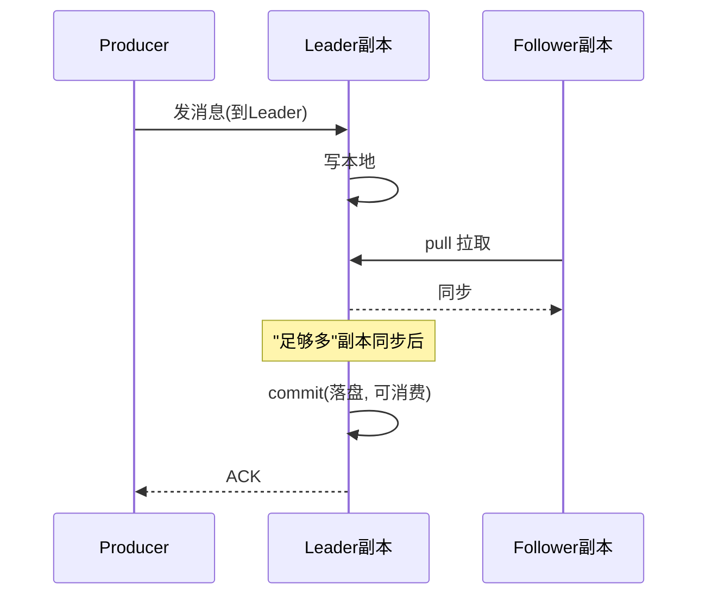

producer 发到 **leader 副本**;follower **pull** 同步;**足够多副本同步 → leader commit(落盘)→ ack producer**。"足够多"由 **ISR** 定义(见第 9 节)。

---

## 8. Consumer flow:push vs pull + rebalancing ⭐⭐⭐⭐⭐

### 8.1 push vs pull

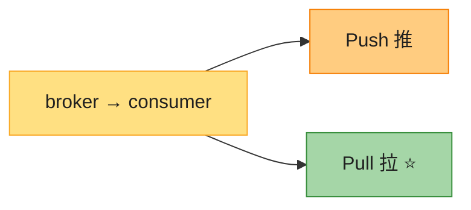

| 模型 | 优 | 劣 |
|------|----|----|
| **Push** | **低延迟**(broker 即收即推) | 慢消费者被压垮;broker 控速率难适配异构消费者 |
| **Pull ⭐**(多数 MQ 选) | **消费者控速率**;批处理友好;落后可扩容追赶 | 空队列空轮询浪费 → **长轮询(long polling)解决** |

> 💡 **原书选 pull**:消费者自主控速、批处理友好、可实时可批处理。**空队列的浪费用长轮询解决**(消费者拉时,broker 没消息就 hold 住请求一段时间,等新消息或超时)。

### 8.2 consumer 拉取流程

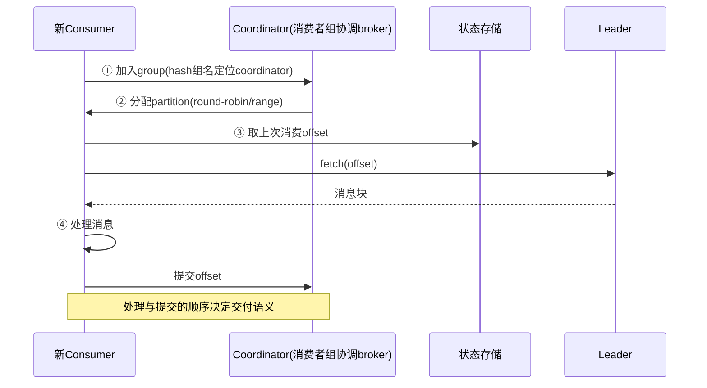

> 📝 **coordinator**:某个 broker,**通过 hash 消费者组名定位**(同组消费者连同一 coordinator)。负责组成员管理 + offset。
>
> ⚠️ **注意区分两种 coordinator**:① **消费者组 coordinator**(broker,管 consumer);② **broker 集群协调服务**(ZK/etcd,管 broker)。名字像但不同。

### 8.3 消费者组 rebalancing ⭐⭐

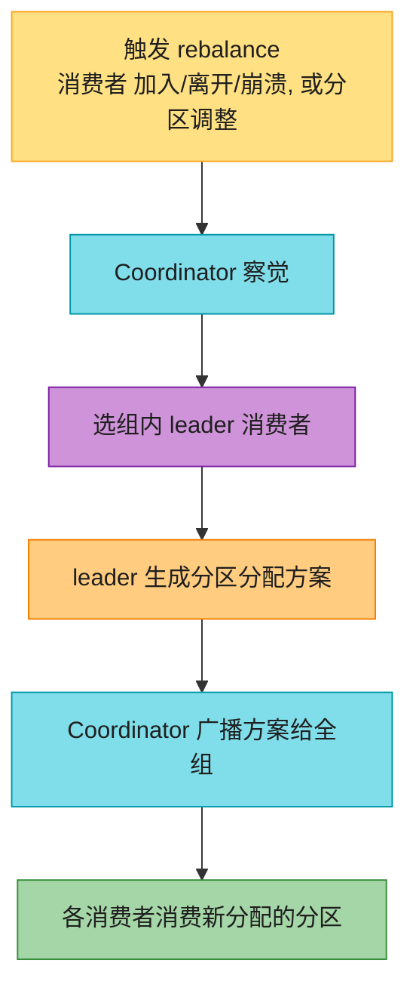

**三种触发场景**(背):
| 场景 | 机制 |
|------|------|
| **新消费者加入** | coordinator 在心跳时通知现有消费者 rejoin → 选 leader → 重分配 |
| **消费者主动离开** | 发离开请求 → rebalance |
| **消费者崩溃** | **心跳超时** → coordinator 标记死亡 → rebalance |

> 🪤 **追问陷阱(高频)**:"rebalance 期间能消费吗?" → "**不能(或叫 stop-the-world)**。rebalance 时全组暂停消费,重新分配分区后才能继续。**这是 Kafka 的痛点**(大集群 rebalance 可能几秒到几十秒)。**2026 的 Cooperative Rebalancing(增量 rebalance)只迁移受影响分区,不停全组**,是优化。"

---

## 9. 复制 + ISR ⭐⭐⭐(高可用核心)

### 9.1 基本复制

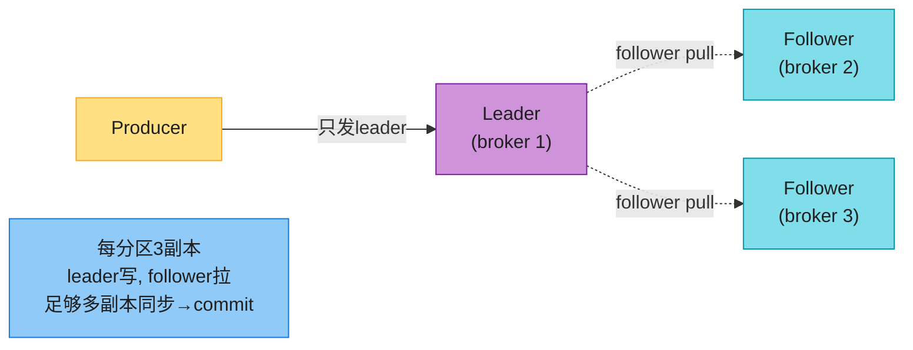

**原书设计**:每分区 3 副本,分布在不同 broker;producer 只发 leader;follower pull;"足够多"副本同步 → leader commit。

### 9.2 ISR(In-Sync Replicas)⭐(原书"足够多"的精确定义)

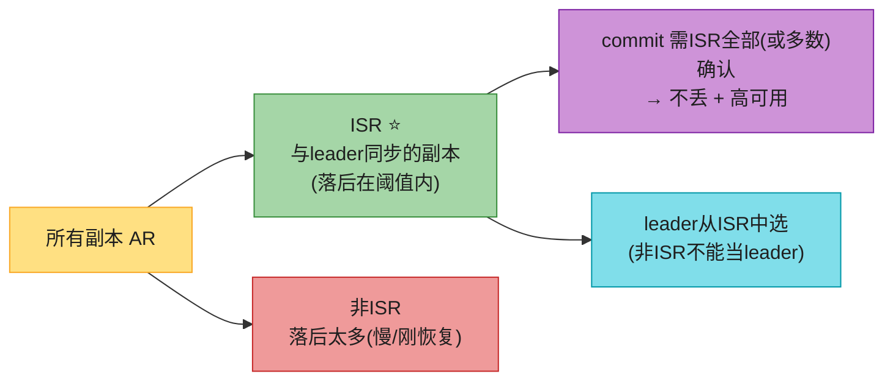

> 📝 **ISR(In-Sync Replicas)**:**与 leader 保持同步的副本集合**(落后在阈值时间内)。原书说的"足够多副本"= **ISR**。
> - **commit 条件**:ISR 中所有副本确认(Kafka 默认 `acks=all`)→ **消息不丢**。
> - **leader 选举**:leader 挂了**只从 ISR 选新 leader**——保证新 leader 有完整数据。**非 ISR 不能当 leader**(否则丢数据)。
> - ISR 动态伸缩:副本落后超阈值 → 移出 ISR;追上 → 加回。

> 🪤 **追问陷阱(高频)**:"leader 挂了,数据会不会丢?" → "**ISR 机制保证不丢**——commit 前要 ISR 全部确认(acks=all),所以 leader 挂了 ISR 里其他副本有完整数据。新 leader 只从 ISR 选。**代价**:ISR 越大、ack 等待越久,延迟越高;可用性 vs 延迟的权衡。"

---

## 10. 2026 现代增量(原书没讲的硬核)⭐⭐⭐⭐⭐

### 10.1 交付语义 + Exactly-Once(原书只说"可配置")

```mermaid
flowchart LR
    S["交付语义"] --> A["at-most-once<br/>可能丢"]
    S --> B["at-least-once<br/>可能重(需幂等)"]
    S --> C["exactly-once ⭐<br/>正好一次"]

    style S fill:#FFE082,stroke:#F9A825,color:#1f1f1f
    style A fill:#EF9A9A,stroke:#C62828,color:#1f1f1f
    style B fill:#FFCC80,stroke:#F57C00,color:#1f1f1f
    style C fill:#A5D6A7,stroke:#388E3C,color:#1f1f1f
```

**exactly-once 怎么实现**(Kafka 0.11+,2026 主流):

| 机制 | 作用 |
|------|------|
| **幂等 producer** | producer 带 **PID + 序列号**,broker 去重 → 单分区内不重 |
| **事务(Transactional Coordinator)** | 跨分区原子写 + 消费-生产一起提交 → 端到端 exactly-once |
| **消费者 read-process-write** | 消费 + 处理 + 生产新消息 + 提交 offset 在一个事务 |

> 💡 **话术**:"原书说'语义可配'但没讲 exactly-once 怎么做。Kafka 的 exactly-once = **幂等 producer(PID+序列号去重)+ 事务协调器(跨分区原子提交)**。注意:**exactly-once 只在 Kafka 内部闭环**(消费Kafka+生产Kafka);跨外部系统(DB)仍要消费方幂等。接 Vol.1 Ch1 MQ 幂等。"

### 10.2 KRaft:去掉 ZooKeeper(2022 重大变更)⭐⭐⭐

```mermaid
flowchart LR
    OLD["原书: Kafka + ZooKeeper<br/>────────<br/>ZK 存元数据 + leader选举"] --> NEW["2022+: KRaft (KIP-500)<br/>────────<br/>Kafka 内置 Raft 共识<br/>去ZooKeeper"]
    NOTE["Kafka 3.3+ 生产可用<br/>更少组件, 更快启动, 更大规模"]

    style OLD fill:#FFCC80,stroke:#F57C00,color:#1f1f1f
    style NEW fill:#A5D6A7,stroke:#388E3C,color:#1f1f1f
    style NOTE fill:#90CAF9,stroke:#1976D2,color:#1f1f1f
```

> 🔄 **2026 现代版话术**(原书全程用 ZK,已过时):
> "原书用 ZooKeeper 存元数据 + 选举。**但 2022 Kafka 3.3+ 用 KRaft 去掉了 ZK**(KIP-500)——Kafka 内置 **Raft 共识**算法管理元数据。好处:**少一个组件、启动快(分钟→秒)、支持更大集群**(ZK 在大集群下是瓶颈)。**2026 新部署的 Kafka 默认 KRaft,不再装 ZK**。这是本书出版后最大的架构变更。"

### 10.3 Pulsar 存算分离(原书提 Pulsar 但没讲架构)

```mermaid
flowchart TB
    subgraph KAFKA["Kafka: 存算一体"]
        KB["Broker"] --> KD["内置本地磁盘<br/>(broker既算又存)"]
    end
    subgraph PULSAR["Pulsar: 存算分离 ⭐"]
        PB["Broker<br/>(无状态, 只算)"] --> BK["BookKeeper<br/>(Bookie存数据, 分层)"]
    end

    style KAFKA fill:#FFCC80,stroke:#F57C00,color:#1f1f1f
    style PULSAR fill:#A5D6A7,stroke:#388E3C,color:#1f1f1f
    style KB fill:#80DEEA,stroke:#0097A7,color:#1f1f1f
    style KD fill:#EF9A9A,stroke:#C62828,color:#1f1f1f
    style PB fill:#80DEEA,stroke:#0097A7,color:#1f1f1f
    style BK fill:#90CAF9,stroke:#1976D2,color:#1f1f1f
```

| | Kafka | **Pulsar** |
|---|------|----------|
| 架构 | **存算一体**(broker 内置磁盘) | **存算分离**(broker 无状态 + BookKeeper 存) |
| 扩容 | broker 扩容要**迁移数据**(慢) | broker 扩容**秒级**(无状态),存储独立扩 |
| 故障恢复 | rebalance + 数据迁移 | broker 挂了无状态,秒级恢复 |

> 💡 **话术**:"Pulsar 的存算分离是它对 Kafka 的核心差异化——**broker 无状态,存储层(BookKeeper)独立**。扩容 broker 不用搬数据(秒级),而 Kafka 扩容要迁移分区数据。**代价是架构更复杂**。"

### 10.4 其他 2026 增量

| 技术 | 说明 |
|------|------|
| **Tiered Storage** | 热数据本地盘,冷数据上 **S3/对象存储**,降长留存成本(Kafka 3.6+) |
| **Schema Registry** | Avro/Protobuf 模式演进管理(Confluent Schema Registry)——消息格式变更不破坏消费方 |
| **压缩** | 批量压缩(snappy/lz4/gzip/zstd),**压缩在 batch 级**——压缩 + 批处理叠加提吞吐 |
| **Redpanda** | **C++ 重写的 Kafka**(无 JVM、无 ZK),线程级而非 broker 级,性能更高 |
| **Kafka Streams** | 流处理库(在 MQ 之上做 join/聚合/窗口),接 V2-Ch6 聚合 |
| **Cooperative Rebalance** | 增量 rebalance,不停全组(解决 8.3 痛点) |

---

## ⚠️ 已过时 / 书里没说(2022 → 2026)

| 原书(2022) | 2026 现状 | 面试应对 |
|------------|----------|---------|
| 全程 ZooKeeper 协调 | **KRaft 去掉 ZK**(Kafka 3.3+) | 讲内置 Raft,新部署不用 ZK |
| 复制只讲 leader/follower | **ISR** 是高可用核心 | 讲 ISR 定义 + commit 条件 + leader 选举 |
| 语义只说"可配" | **exactly-once = 幂等producer + 事务** | 讲 PID+序列号 + 事务协调器 |
| 提 Pulsar 没讲架构 | **存算分离**(broker 无状态 + BookKeeper) | 对比 Kafka 存算一体 |
| 长留存全本地盘 | **Tiered Storage**(冷数据上 S3) | 讲分层降成本 |
| 没讲模式演进 | **Schema Registry**(Avro/Protobuf) | 讲格式演进管理 |
| 没讲压缩 | **batch 级压缩**(snappy/lz4/zstd) | 讲压缩+批处理叠加 |
| rebalance stop-the-world | **Cooperative Rebalance**(增量) | 讲不停全组优化 |
| Kafka 是唯一 | **Redpanda**(C++ 重写,无 JVM/ZK) | 提性能替代 |

---

## 💻 代码示例

### 示例 1:Producer(批处理 + 同 key 保序)

```python
from kafka import KafkaProducer
import json

producer = KafkaProducer(
    bootstrap_servers=['broker1:9092', 'broker2:9092'],
    acks='all',                          # ISR 全确认(at-least-once + 不丢)
    linger_ms=10,                        # 批处理: 攒10ms再发(吞吐vs延迟权衡)
    batch_size=16384,                    # 批大小
    compression_type='lz4',              # batch级压缩
    value_serializer=lambda v: json.dumps(v).encode(),
)

def send_order(user_id, order):
    # 同 user_id → 同分区 → 该用户事件保序
    producer.send('orders', key=str(user_id).encode(), value=order)
producer.flush()
```

### 示例 2:Consumer(消费者组 + offset 提交)

```python
from kafka import KafkaConsumer

consumer = KafkaConsumer(
    'orders',
    bootstrap_servers=['broker1:9092'],
    group_id='billing-service',          # 消费者组(同组单分区单消费者)
    enable_auto_commit=False,            # 手动提交(控制语义)
    auto_offset_reset='earliest',
)
for msg in consumer:
    process(msg.value)                   # 处理(必须幂等! at-least-once可能重)
    consumer.commit()                    # 处理后提交offset
    # ⚠️ 先处理后提交=at-least-once; 先提交后处理=at-most-once
```

### 示例 3:exactly-once(事务,消费-处理-生产)

```python
# 幂等producer + 事务: 消费A → 处理 → 生产B + 提交offset, 原子
producer.init_transactions()
for msg in consumer:
    producer.begin_transaction()
    try:
        result = process(msg.value)
        producer.send('output', value=result)           # 生产新消息
        producer.send_offsets_to_transaction(           # 提交offset进事务
            {TopicPartition(msg.topic, msg.partition): OffsetAndMetadata(msg.offset+1)},
            consumer.group_id)
        producer.commit_transaction()                   # 原子提交(全成功或全回滚)
    except Exception:
        producer.abort_transaction()
```

---

## 🪤 追问陷阱(面试官最爱问,本章集)

1. **"传统MQ和Kafka区别?"** → 传统MQ消费即删/不保序/短留存(简单);Kafka 可重放/保序/长留存(复杂)。
2. **"怎么扩展 topic?"** → 分区(partition),分区跨 broker 分布;扩容加分区(但别轻易加,路由乱)。
3. **"怎么保证消息顺序?"** → **同 key 同分区**(FIFO);同组单分区单消费者。
4. **"分区数能改吗?"** → 别轻易加(`hash(key)%N` 变 → 顺序乱);**预分配大分区,扩容只加消费者**。
5. **"消费者比分区多怎么办?"** → 多余的空闲。所以**预分配分区 >> 消费者**。
6. **"消息存磁盘还是内存?"** → 磁盘 WAL。**顺序写 + OS 缓存接近内存速度**,且大容量便宜可持久。
7. **"为什么不用数据库存消息?"** → 数据库难同时优化写重+读重;WAL 专为追加+顺序访问,更快。
8. **"push 还是 pull?"** → **pull**(消费者控速 + 批处理友好);空队列用长轮询。
9. **"消费者挂了,谁来重分配?"** → coordinator 心跳超时 → 标记死亡 → rebalance → 选 leader 消费者 → 重分配。
10. **"rebalance 期间能消费吗?"** → 传统 stop-the-world;**Cooperative Rebalance 增量不停全组**。
11. **"leader 挂了数据丢吗?"** → **ISR 保证不丢**(acks=all 要 ISR 全确认,新 leader 从 ISR 选)。
12. **"exactly-once 怎么实现?"** → 幂等 producer(PID+序列号)+ 事务协调器(跨分区原子);只在 Kafka 内闭环,跨外部系统仍要幂等。
13. **"at-least-once 重复消费怎么办?"** → **消费方幂等**(业务唯一键去重),接 Vol.1 Ch1。
14. **"还需要 ZooKeeper 吗?"** → **2022+ KRaft 去掉 ZK**(Kafka 内置 Raft),新部署不用装。
15. **"Kafka vs Pulsar?"** → Kafka 存算一体(broker 内置盘,扩容搬数据);Pulsar 存算分离(broker 无状态 + BookKeeper,扩容秒级)。
16. **"长留存成本高?"** → **Tiered Storage**(热本地盘,冷上 S3)+ 压缩(lz4/zstd)。

---

## 🏭 生产级产品速查表

| 产品 | 类型 | 特色 |
|------|------|------|
| **Apache Kafka** | 事件流(本题原型) | WAL + 分区 + ISR;KRaft 去 ZK |
| **Apache Pulsar** | 事件流 | **存算分离**(broker + BookKeeper) |
| **RocketMQ** | 消息队列(国内电商) | 阿里,高吞吐 + 事务消息 |
| **RabbitMQ** | 传统 MQ | AMQP;消费即删 + streams 扩展 |
| **ActiveMQ** | 传统 MQ | 老牌 JMS |
| **Redpanda** | 事件流 | **C++ 重写 Kafka**(无 JVM/ZK,更快) |
| **NATS / JetStream** | 轻量消息 | 极简超快 |
| **AWS SQS/SNS** | 托管 MQ | 无运维 |
| **Redis Streams** | 轻量流 | Redis 内置,持久 + 消费组 |

> 🏭 **业界标杆**:**Kafka**(本题原型,LinkedIn 开源,事实标准)、**Pulsar**(Yahoo 开源,存算分离)、**RocketMQ**(阿里,电商事务消息)、**Redpanda**(C++ Kafka 替代)。**Kafka 设计哲学**:顺序写磁盘 + 批处理 + 零拷贝 = 高吞吐。

---

## 📝 本章要点总结

```mermaid
flowchart LR
    ROOT(["V2-Ch4 分布式消息队列<br/>Kafka: 分区+WAL+批处理+ISR"])

    B1["模型+需求 ⭐<br/>────────<br/>• MQ vs 事件流<br/>• 可重放/保序/长留存<br/>• 3种交付语义"]
    B2["topic/partition ⭐⭐<br/>────────<br/>• 分区FIFO+offset<br/>• key路由保序<br/>• 消费者组统一两模型"]
    B3["WAL存储 ⭐⭐⭐<br/>────────<br/>• append-only+segment<br/>• 顺序写磁盘=近内存<br/>• OS磁盘缓存"]
    B4["批处理 ⭐⭐<br/>────────<br/>• producer/queue/consumer全批<br/>• 摊薄网络+大块写<br/>• 吞吐vs延迟可配"]
    B5["生产消费 ⭐⭐<br/>────────<br/>• 客户端路由+buffer<br/>• pull+长轮询<br/>• rebalance(coordinator)"]
    B6["复制+ISR+2026<br/>────────<br/>• ISR保证不丢<br/>• exactly-once(幂等+事务)<br/>• KRaft去ZK/Pulsar分离/tiered"]

    ROOT --> B1
    ROOT --> B2
    ROOT --> B3
    ROOT --> B4
    ROOT --> B5
    ROOT --> B6

    style ROOT fill:#FFE082,stroke:#F57C00,color:#1f1f1f,stroke-width:3px
    style B1 fill:#80DEEA,stroke:#0097A7,color:#1f1f1f
    style B2 fill:#CE93D8,stroke:#7B1FA2,color:#1f1f1f
    style B3 fill:#A5D6A7,stroke:#388E3C,color:#1f1f1f
    style B4 fill:#90CAF9,stroke:#1976D2,color:#1f1f1f
    style B5 fill:#FFCC80,stroke:#F57C00,color:#1f1f1f
    style B6 fill:#EF9A9A,stroke:#C62828,color:#1f1f1f
```

**核心 Takeaways**:

1. **MQ 价值 = 解耦 + 独立扩展 + 高可用 + 异步**;区分传统 MQ(简单)vs 事件流(复杂,本题)。
2. **topic/partition/broker 是扩展根基**——分区 FIFO + offset;**同 key 同分区保序**;消费者组统一点对点/发布订阅。
3. **单分区单消费者约束**保序;**预分配大分区,扩容只加消费者**(别轻易加分区)。
4. **WAL 顺序写磁盘 + OS 缓存 ≈ 内存速度**,大容量便宜持久——这是 Kafka 选磁盘的根基。
5. **批处理贯穿三处**(producer/queue/consumer),**吞吐 vs 延迟靠批大小可调**。
6. **producer 客户端路由 + buffer**(少跳数 + 批量);**consumer 选 pull**(控速 + 批处理 + 长轮询)。
7. **rebalancing** 靠 coordinator 心跳;stop-the-world 痛点 → Cooperative Rebalance 优化。
8. **ISR 保高可用不丢**——acks=all 要 ISR 全确认,新 leader 从 ISR 选。
9. **exactly-once = 幂等 producer + 事务**(Kafka 内闭环);跨外部系统仍要消费方幂等。
10. **2026:KRaft 去掉 ZK**(Kafka 3.3+);Pulsar 存算分离;Tiered Storage + Schema Registry + 压缩 + Redpanda 是演进。

> 🔗 **连接上下章**:**V2-Ch3 Maps** 的位置流已用到 Kafka(本章是它的底层);**V2-Ch4 消息队列**是**数据基础设施**;**V2-Ch5 监控告警**和**V2-Ch6 广告点击聚合**都建立在消息队列之上——Kafka 是流式数据的中枢。从"地理服务"切回"数据基础设施"。
