# Volume 2 · Chapter 5: 设计监控告警系统 (Design a Metrics Monitoring and Alerting System)

> 📑 **导航**:[← 消息队列](ch2_04-设计分布式消息队列.md) · [📚 总目录](../README.md) · [广告聚合 →](ch2_06-设计广告点击聚合.md)
> 🔗 **相关**:[AWS消息/IAM](../SDA/aws_12-AWS消息编排监控IAM.md) · [架构模式](../SDA/aws_08-架构设计与模式.md) · [广告聚合](ch2_06-设计广告点击聚合.md)


> **本章定位**:监控告警是**"写极重 + 读尖峰 + 时序数据"**的题——它是 Prometheus/Datadog/CloudWatch 的设计骨架,也是"高可用系统的眼睛"。它把 V2-Ch4 的 Kafka、Vol.1 Ch6 的存储全用上。灵魂是五件事:**① 数据怎么采(pull vs push)② 海量时序数据怎么存(时序数据库 + 低基数 label ⭐)③ 写极重怎么扛(Kafka 削峰 + 降采样 + 压缩)④ 怎么告警(规则 + 状态机 + 至少一次)⑤ 怎么可视化(Grafana)**。它是 2026 "可观测性(Observability)"的根基——metrics/logs/traces 三支柱里的 metrics。

> **本章和原书的区别**:原书把**五大组件 + 时序数据模型 + pull/push 对比 + Kafka 削峰 + 降采样**讲得相当完整,是面试标准答案。但**完全没提 OpenTelemetry**(2026 统一 metrics/logs/traces 的标准,正在整合 OpenMetrics/OpenTracing/OpenCensus);**只说"label 低基数"没讲基数爆炸**(把 user_id 当 label → 百万时序 → Prometheus 内存爆炸,这是生产头号坑);**提了 Gorilla(Facebook)但没讲它的压缩算法**(delta-of-delta 时间戳 + XOR 数值,这是 InfluxDB 压缩的基础);**没提 Prometheus 生态**(PromQL/Alertmanager/Thanos/Mimir);**没提 eBPF**(2026 内核级免改应用观测);**没提"可观测性 vs 监控"**的概念升级;**告警只讲阈值,没讲 ML 异常检测**。本章把这些全补上。

---

## 🎯 面试怎么答(被问到"设计监控告警系统 / metrics monitoring"时)

**开场话术**(直接背):

> "监控告警我先确认四件事:① 监控什么(运维指标 vs 业务指标 vs 日志)?② 规模(多少机器 × 多少指标)?③ 留存多久 + 降采样策略?④ 告警渠道?然后按 **五大组件(采集→传输→存储→告警→可视化)→ 采集 pull/push 选型 → 存储(时序DB + 低基数 label ⭐)→ 写极重扛(Kafka 削峰 + 降采样)→ 告警(规则 + 至少一次)** 五块讲。核心抉择是 **时序数据库选型 + label 基数控制 + 采集模型**。"

**4 步推进**:

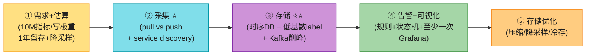

> 💡 **Step 1 必问**:**监控什么?** 运维指标(CPU/内存/QPS,本题)、业务指标(订单量)、日志(ELK 那套)、分布式追踪(Zipkin/Jaeger)是**不同系统**。**本题只做运维 metrics**,别混进日志/追踪。
>
> 💡 **关键信号词**:**"写极重读尖峰,用时序数据库(不用 MySQL)"** + **"label 必须低基数(别拿 user_id 当 label,否则基数爆炸)"** + **"近期数据热点(85% 查询在 26 小时内)→ 优化近期 + 降采样老数据"**——这三句直接拿下面试。

---

## 🗺️ 章节概览

| 小节 | 要点 | 重要性 |
|------|------|--------|
| 需求 + 估算 | 运维指标、**10M 指标**、1年留存、分辨率策略 | ⭐⭐⭐⭐ |
| **五大组件** | 采集→传输→存储→告警→可视化 | ⭐⭐⭐⭐ |
| **数据模型 ⭐** | 时序:name + labels + (value,ts);line protocol | ⭐⭐⭐⭐⭐ |
| **访问模式** | **写极重(持续)+ 读尖峰(突发)** | ⭐⭐⭐⭐⭐ |
| **存储选型 ⭐⭐** | 时序DB(InfluxDB/Prometheus),不用 MySQL/通用NoSQL | ⭐⭐⭐⭐⭐ |
| **采集 pull vs push ⭐⭐** | Prometheus pull / CloudWatch push;优劣对比 | ⭐⭐⭐⭐⭐ |
| 扩展:Kafka 削峰 | collector→Kafka→流处理→TSDB | ⭐⭐⭐⭐ |
| 聚合位置 | agent / ingestion / query 三处权衡 | ⭐⭐⭐⭐ |
| 查询 + 告警 | 查询语言(Flux/PromQL)+ 告警状态机 | ⭐⭐⭐⭐ |
| **存储优化 ⭐** | 压缩(delta)/降采样/冷存 | ⭐⭐⭐⭐⭐ |
| **2026增量(补)** | OpenTelemetry/Prometheus生态/基数爆炸/Gorilla算法/eBPF | ⭐⭐⭐⭐⭐ |

---

## 1. 需求 + 估算

**澄清问题**(原书对话):

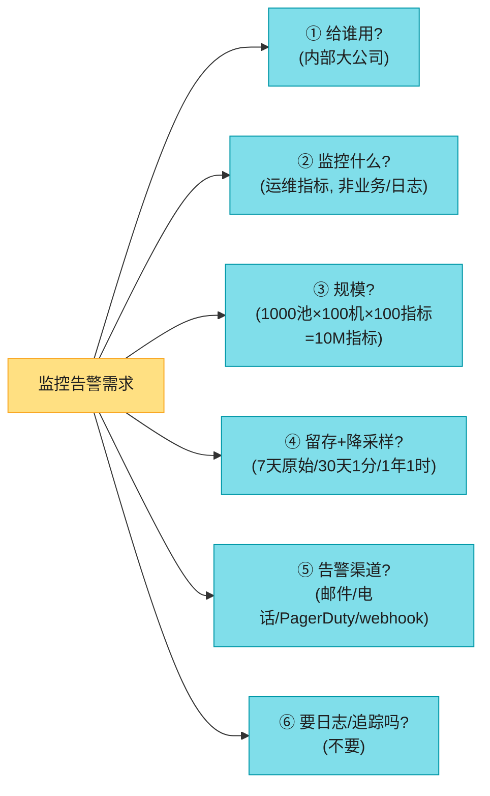

**原书确定的需求**:

| 维度 | 确认值 |
|------|--------|
| 用户 | 内部大公司(非 SaaS) |
| 监控 | **运维指标**(CPU/内存/磁盘/QPS/实例数);**不含业务指标/日志/追踪** |
| 规模 | 100M DAU;**1000 池 × 100 机 × 100 指标 ≈ 1000 万指标** |
| 留存 | **1 年** |
| 分辨率策略 | 原始 7 天 → 1 分钟精度 30 天 → 1 小时精度 1 年 |
| 告警渠道 | 邮件/电话/PagerDuty/webhook |

**非功能性**:可扩展;低查询延迟(看板/告警);**可靠(不能漏关键告警)**;灵活(易集成新技术)。

**估算**(背):

```
指标量: 1000池 × 100机 × 100指标 = 1000万(10M)指标
★ 写极重: 持续高频写入(每个指标定期上报)
★ 读尖峰: 看板/告警突发查询
★ 留存: 1年 → 需降采样控存储
```

> 💡 **核心洞察**:**写极重 + 读尖峰 + 时序热点(近期数据查得多)**——这三个特征决定了:**用时序数据库(非 MySQL)+ Kafka 削峰 + 降采样老数据**。Facebook 研究表明 **85% 查询针对过去 26 小时数据**——优化近期 + 降采样老数据是关键。

---

## 2. 五大组件 + 数据模型

### 2.1 监控系统五大组件

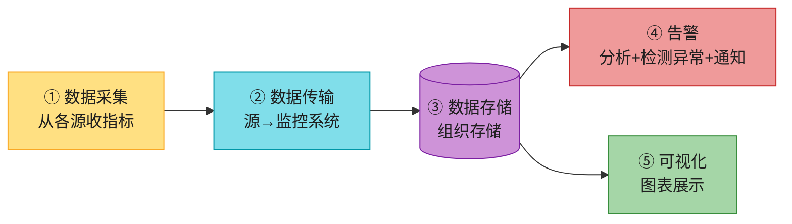

| 组件 | 职责 |
|------|------|
| **数据采集** | 从应用/DB/MQ 等源收集指标 |
| **数据传输** | 源 → 监控系统 |
| **数据存储** | 组织存储时序数据 |
| **告警** | 分析、检测异常、发告警到多渠道 |
| **可视化** | 图表展示(人眼善于从图形识别模式) |

### 2.2 数据模型:时序(time series)⭐⭐

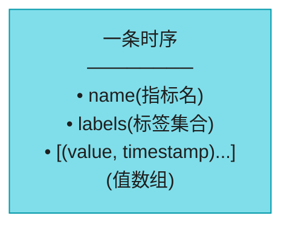

**例子**:CPU 负载

```
metric_name: cpu.load
labels:      host:i631, env:prod
timestamp:   1613707265
value:       0.29
```

> 📝 **line protocol**(Prometheus/OpenTSDB 通用格式):
> ```
> cpu.load host=webserver01,region=us-west 1613707265 50
> ```
> **一条时序 = name + labels 唯一标识**,其下挂 (value, ts) 数组。

### 2.3 访问模式 ⭐⭐(写极重 + 读尖峰)

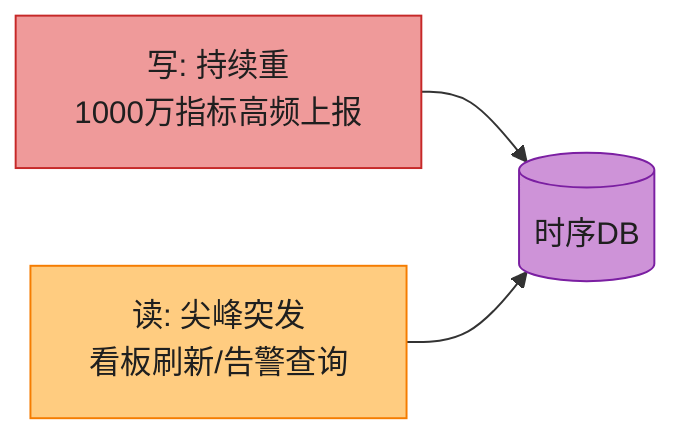

> 💡 **核心特征**:**持续重写 + 突发尖峰读**。这与一般业务系统(读写均衡)不同——**存储要为"持续写"优化**(WAL/LSM 那类),查询要有缓存。

---

## 3. 存储选型:为什么用时序数据库?⭐⭐⭐⭐⭐

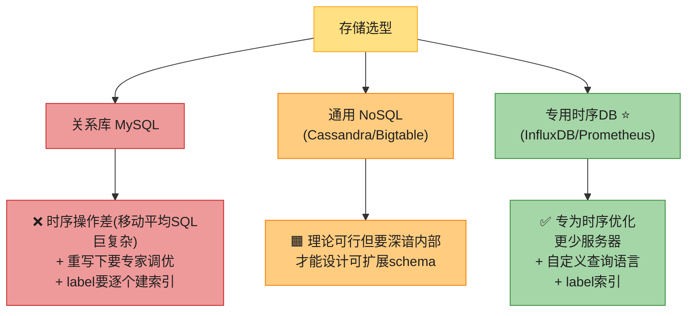

| 方案 | 问题 |
|------|------|
| **关系库 MySQL** | 时序操作差(移动平均 SQL 难写);持续重写下要专家调优;label 要逐个建索引 ❌ |
| **通用 NoSQL** | 理论可行(Cassandra/Bigtable),但要深谙内部才能设计好 schema |
| **专用时序DB ⭐** | **专为时序优化**:更少服务器扛同量数据 + 自定义查询语言 + label 索引 + 留存/聚合管理 |

> 💡 **InfluxDB 实测**:8 核 32GB 扛 **25 万写/秒**。**这是"专业问题用专业工具"的典范**。

### 3.1 label 低基数(时序DB 的命门)⭐⭐

> 📝 时序DB 靠**给 label 建索引**做快速查找。**关键是每个 label 低基数(可能值少)**——如 `env:prod/staging`(2 值)、`region:us-west/eu`(几值)。

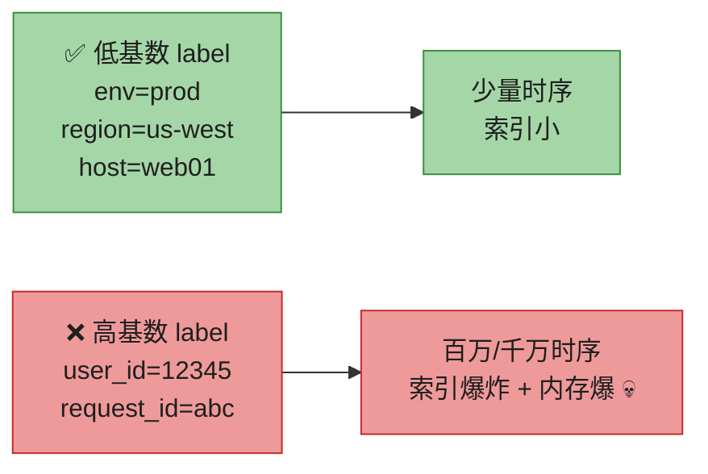

> 🪤 **追问陷阱(高频,生产头号坑)**:"能不能把 user_id 当 label 区分用户?" → "**绝对不行(基数爆炸)**。label 的每个不同值生成一条新时序。user_id 有百万千万个 → 百万千万条时序 → Prometheus 内存爆炸、索引崩溃。**高基数维度要用别的工具**(如把 user_id 放日志/追踪,或用专门的高基数时序DB)。**这是 Prometheus 生产头号坑**。"

---

## 4. 采集:pull vs push ⭐⭐⭐⭐⭐(经典之争)

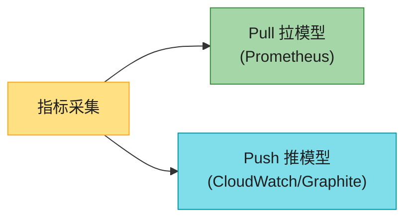

### 4.1 Pull 模型(Prometheus)

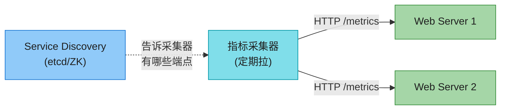

**Pull 流程**:采集器经 **service discovery(etcd/ZK)** 知道有哪些服务端点 → 定期 HTTP 拉 `/metrics`。**多个采集器用一致性哈希分工**(避免重复拉),接 Vol.1 Ch5。

### 4.2 Push 模型(CloudWatch/Graphite)

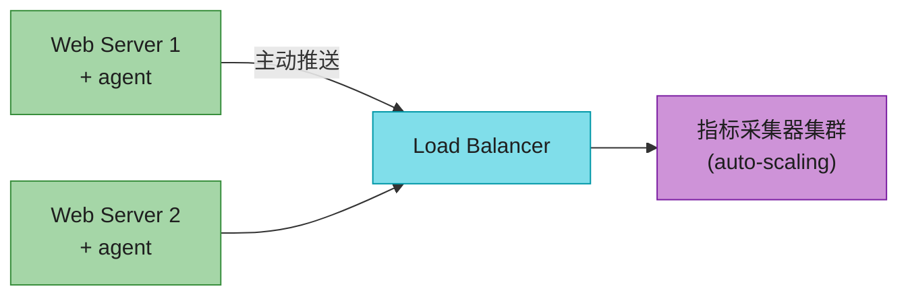

**Push 流程**:每台被监控机装 **agent**,定期推送。agent 可**本地聚合**(计数器合并)减少流量;采集器拒收时本地缓冲重发。

### 4.3 Pull vs Push 全面对比(背熟)⭐⭐

| 维度 | **Pull(Prometheus)** | **Push(CloudWatch/Graphite)** |
|------|---------------------|------------------------------|
| **易调试** | ✅ `/metrics` 端点随时可看(本机都行) | ❌ 难 |
| **健康检查** | ✅ 拉不到 = 服务挂了 | 🟧 收不到可能是网络问题 |
| **短任务(cron/batch)** | ❌ 存活太短来不及拉(**用 Pushgateway 补**) | ✅ 主动推 |
| **防火墙/多机房** | ❌ 要所有端点可达,复杂 | ✅ LB + auto-scaling,任何地方都能推 |
| **性能** | TCP | **UDP(更低延迟)** |
| **数据真实性** | ✅ 配置文件预定义,可信 | ❌ 任何客户端都能推(**白名单/鉴权补**) |
| **代表** | **Prometheus** | **CloudWatch、Graphite** |

> 💡 **原书结论**:**没有赢家**。大组织**两种都要**(尤其 Serverless 无法装 agent,只能 push)。**面试要讲清优劣,而非选边**。

> 🪤 **追问陷阱**:"短任务怎么用 pull 监控?" → "**短任务存活太短,pull 来不及**。Prometheus 的解法是 **Pushgateway**——短任务把指标 push 到 gateway,采集器再从 gateway pull。这是 pull 模型对短任务的补充。"

---

## 5. 扩展:Kafka 削峰 + 聚合位置

### 5.1 Kafka 解耦(防 DB 挂丢数据)

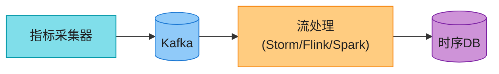

**为什么加 Kafka**:**时序DB 挂了会丢数据**。加 Kafka 在中间:**解耦采集与处理** + **DB 挂时数据留 Kafka 不丢** + Kafka 分区按指标名/tag 扩展(接 V2-Ch4)。

> 💡 **替代方案**:Facebook **Gorilla** 内存时序DB——即使部分网络故障也保持写高可用,**不靠中间队列也够可靠**(原书引用)。

### 5.2 聚合在哪做?(三处权衡)⭐

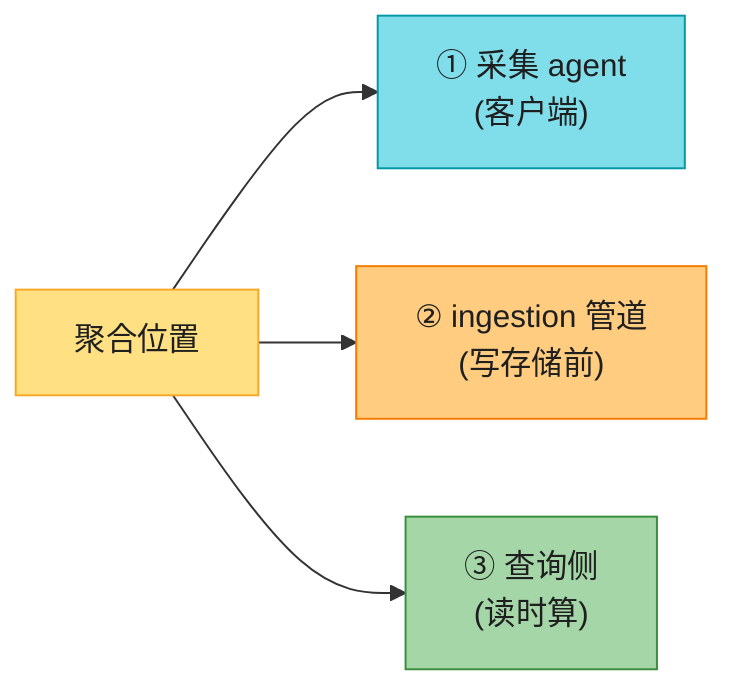

| 位置 | 做法 | 取舍 |
|------|------|------|
| **采集 agent** | 简单聚合(计数器每分钟合并) | 简单,但只能轻量逻辑 |
| **ingestion 管道** | Flink 聚合后写 | **大幅降写量**,但丢精度 + 晚到事件难处理 |
| **查询侧** | 读时聚合 | **不丢数据**,但查询慢 |

> 💡 **权衡**:**要省存储 → ingestion 聚合(丢精度);要保精度 → 查询侧聚合(慢)**。生产常组合:近期原始查询侧算,老数据 ingestion 降采样存。

---

## 6. 查询 + 告警 + 可视化

### 6.1 查询服务 + 缓存

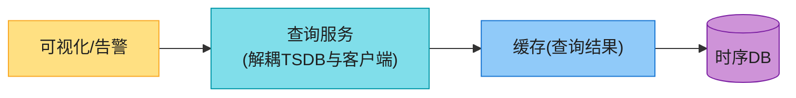

**查询服务**解耦 TSDB 与客户端(灵活换库);加**缓存**存热门查询结果降负载。但**好的 TSDB + 插件可能不需要自己的查询服务/缓存**(原书"case against")。

### 6.2 时序DB 查询语言(不用 SQL)

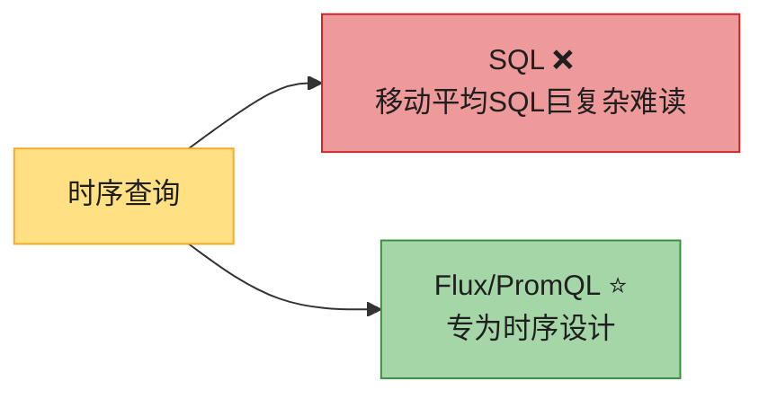

**指数移动平均**对比:
- **SQL**:嵌套 4 层窗口函数,难读
- **Flux**(InfluxDB):`from(db) |> range(-1h) |> filter(...) |> exponentialMovingAverage(10s)` —— 清晰

### 6.3 告警系统(状态机 + 至少一次)⭐

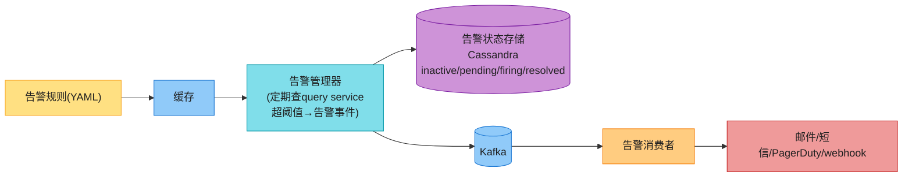

**告警管理器职责**:① filter/merge/dedupe(合并同实例告警,防告警风暴);② access control;③ **retry(至少一次,不能漏关键告警)**。

**告警状态**(背):`inactive → pending → firing → resolved`。

> 💡 **Build vs Buy**:告警 + 可视化**强烈建议买现成**(Grafana + Alertmanager),自建难、投入大。**senior 要能 justify 决策**。

---

## 7. 存储优化:压缩 + 降采样 + 冷存 ⭐⭐⭐⭐⭐

### 7.1 数据编码压缩(delta)

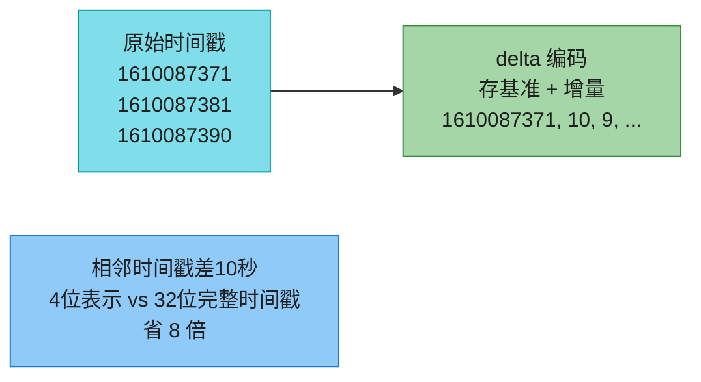

> 💡 **delta 编码**:相邻时间戳差值小(10秒),用 4 位表示差值而非 32 位绝对值。**时序数据天然适合增量编码**(时间单调、值连续)。

### 7.2 降采样(downsampling)⭐

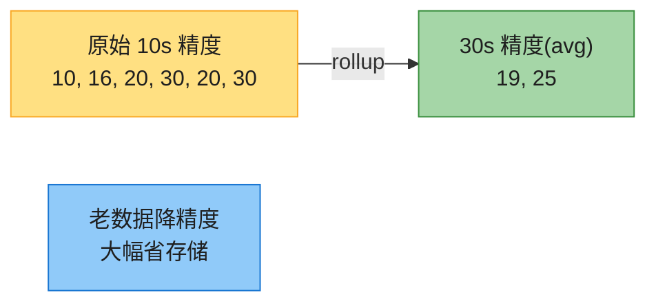

**留存策略**(背):
- 原始 7 天
- → 1 分钟精度 30 天
- → 1 小时精度 1 年

**降采样 = rollup**:把高精度聚合(平均/最大/求和)成低精度。老数据少查、降精度,省存储。

### 7.3 冷存储

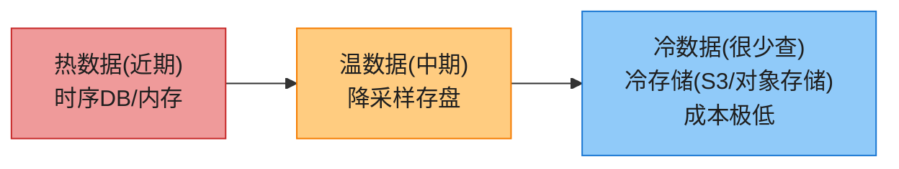

> 💡 **分层存储**:近期热(内存/SSD)→ 中期温(降采样存盘)→ 老期冷(对象存储,极便宜)。**85% 查询在近 26 小时**(Facebook 研究)→ 优化热层 + 冷数据上 S3。

---

## 8. 2026 现代增量(原书没讲的硬核)⭐⭐⭐⭐⭐

### 8.1 OpenTelemetry:统一可观测性标准(2026 重磅)

原书把 metrics/logs/traces 分开讲,**2026 已被 OpenTelemetry 统一**。

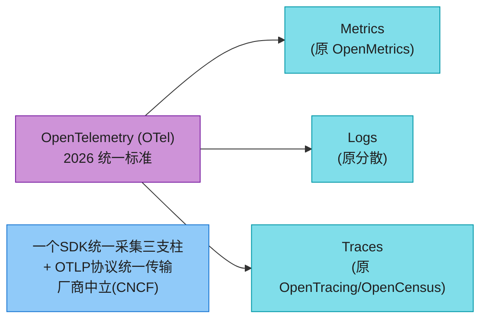

> 🔄 **2026 现代版话术**(原书三大支柱分开):
> "原书把 metrics/logs/traces 当独立系统。**2026 已被 OpenTelemetry(OTel,CNCF 标准)统一**——一个 SDK + OTLP 协议同时采三支柱,厂商中立,后端可换(Prometheus/Jaeger/Loki 通用)。**新系统默认上 OTel,不再各装一套 agent**。**主动提 OTel = 知道 2026 可观测性主流**。"

### 8.2 可观测性 vs 监控(概念升级)

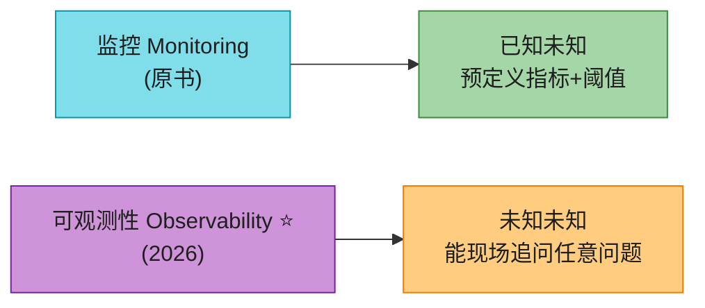

> 💡 **话术**:"**监控**是'已知未知'(预定义看什么);**可观测性**是'未知未知'(出事时能现场追问)。可观测性 = metrics + logs + traces 三支柱融合,能从指标下钻到日志到追踪,定位根因。**2026 招聘 JD 都写'observability'而非'monitoring'**。"

### 8.3 Gorilla 压缩算法(原书提 Gorilla 没讲算法)

```mermaid
flowchart LR
    G["Facebook Gorilla 压缩"] --> TS["时间戳: delta-of-delta<br/>(相邻差值的差值)<br/>大多数→1-2位"]
    G --> VAL["数值: XOR 编码<br/>(与前值的异或)<br/>连续值→前导0多→极省"]

    style G fill:#CE93D8,stroke:#7B1FA2,color:#1f1f1f
    style TS fill:#80DEEA,stroke:#0097A7,color:#1f1f1f
    style VAL fill:#A5D6A7,stroke:#388E3C,color:#1f1f1f
```

> 📝 **Gorilla(论文)** 是 InfluxDB/Prometheus 压缩的基础:① **时间戳 delta-of-delta**(相邻差值的变化,大多稳定→1-2 位);② **数值 XOR**(与前值异或,连续值前导 0 多→极省)。**典型时序压缩比 10-20×**。

### 8.4 Prometheus 生态 + 长期存储(Thanos/Mimir)

```mermaid
flowchart LR
    PRO["Prometheus"] --> AM["Alertmanager(告警)"]
    PRO --> PQ["PromQL(查询语言)"]
    PRO --> PG["Pushgateway(短任务)"]
    PRO -.->|"本地只存短期<br/>长期用:"| TH["Thanos/Mimir/Cortex<br/>+ 对象存储"]

    style PRO fill:#CE93D8,stroke:#7B1FA2,color:#1f1f1f
    style AM fill:#EF9A9A,stroke:#C62828,color:#1f1f1f
    style PQ fill:#80DEEA,stroke:#0097A7,color:#1f1f1f
    style PG fill:#FFCC80,stroke:#F57C00,color:#1f1f1f
    style TH fill:#90CAF9,stroke:#1976D2,color:#1f1f1f
```

> 💡 **Prometheus 本地只存短期**(默认 15 天)。长期留存靠 **Thanos/Mimir/Cortex**——把 Prometheus 数据持续上传到对象存储 + 全局查询。**这是 2026 Prometheus 长留存的标配**。

### 8.5 其他 2026 增量

| 技术 | 说明 |
|------|------|
| **eBPF** | 2026 内核级观测——**不改应用代码**采集网络/系统调用/性能,极低开销(Cilium、Pixie) |
| **ML 异常检测** | 原书阈值告警;2026 用 ML 学正常基线,自动检测异常(不依赖人工设阈值) |
| **Grafana LGTM 栈** | **Loki(日志)+ Grafana(指标)+ Tempo(追踪)+ Mimir(metrics)** 一体化 |
| **采集 agent** | Telegraf / Vector.dev(现代高性能采集) |

---

## ⚠️ 已过时 / 书里没说(2022 → 2026)

| 原书(2022) | 2026 现状 | 面试应对 |
|------------|----------|---------|
| metrics/logs/traces 分开 | **OpenTelemetry 统一**三支柱 | 讲 OTel + OTLP 标准化 |
| "监控" | **可观测性**(metrics+logs+traces 融合下钻) | 讲概念升级 |
| label 低基数只一句 | **基数爆炸是头号生产坑** | 讲别拿 user_id 当 label |
| 提 Gorilla 没讲算法 | **delta-of-delta + XOR** 压缩 | 讲压缩比 10-20× |
| Prometheus 单机短期 | **Thanos/Mimir** 长期存储 | 讲对象存储 + 全局查询 |
| 阈值告警 | **ML 异常检测**自动学基线 | 讲自适应告警 |
| 没提 eBPF | **eBPF 内核级免改应用观测** | 讲零侵入 |
| 查询语言 Flux | **PromQL**(Prometheus 事实标准) | 讲 PromQL 生态 |

---

## 💻 代码示例

### 示例 1:Prometheus 指标埋点(pull 模型)

```python
from prometheus_client import Counter, Gauge, Histogram, start_http_server

# 三种指标类型
requests = Counter('http_requests_total', 'Total requests', ['method', 'status'])
cpu_load = Gauge('cpu_load', 'CPU load', ['host'])
latency = Histogram('http_latency_seconds', 'Request latency', ['endpoint'])

start_http_server(8000)   # 暴露 /metrics 端点供 Prometheus pull

@app.route('/api')
def api():
    with latency.labels('/api').time():
        requests.labels('GET', '200').inc()
        return 'ok'
# ⚠️ label 必须低基数! 别用 user_id/request_id(基数爆炸)
```

### 示例 2:PromQL 查询(时序查询语言)

```promql
# 最近5分钟所有web服务器的平均CPU负载,按region聚合
avg by (region) (cpu_load{host=~"web.*"}[5m])

# 错误率 = 5xx / 总请求
sum(rate(http_requests_total{status=~"5.."}[5m]))
  / sum(rate(http_requests_total[5m]))

# 移动平均(对比SQL的巨复杂)
avg_over_time(cpu_load[10m])
```

### 示例 3:告警规则(YAML)

```yaml
groups:
- name: instance_alerts
  rules:
  - alert: HighCPU          # 告警名
    expr: avg by(host)(cpu_load) > 0.9   # PromQL 阈值
    for: 5m                 # 持续5分钟才触发(防抖)
    labels:
      severity: page        # 严重级别
    annotations:
      summary: "CPU > 90% on {{ $labels.host }}"
```

---

## 🪤 追问陷阱(面试官最爱问,本章集)

1. **"监控什么?"** → 运维指标(本题)/业务指标/日志/追踪是不同系统。**本题只运维 metrics**。
2. **"为什么用 MySQL 不行?"** → 时序操作(移动平均)SQL 巨复杂;持续重写要专家调优;label 要逐个建索引。用时序DB。
3. **"为什么用专用时序DB?"** → 专为时序优化(压缩/降采样/label索引),更少服务器,自定义查询语言。
4. **"label 能用 user_id 吗?"** → **绝对不行(基数爆炸)**!百万 user_id = 百万时序,内存爆。高基数用日志/追踪。
5. **"pull 还是 push?"** → 无赢家。pull(Prometheus)易调试/健康检查/可信;push(CloudWatch)短任务/防火墙友好。大组织都要。
6. **"短任务怎么 pull 监控?"** → Pushgateway(短任务推到网关,采集器再拉)。
7. **"采集器怎么避免重复拉?"** → 一致性哈希,每台被监控机只归一个采集器。
8. **"时序DB 挂了丢数据?"** → 加 Kafka 中间削峰,数据留 Kafka 不丢(接 V2-Ch4)。
9. **"聚合在哪做?"** → agent(简单)/ingestion(省存储但丢精度)/query(不丢但慢)。组合用。
10. **"老数据怎么省存储?"** → 降采样(rollup 高精度→低精度)+ 压缩(delta)+ 冷存储(S3)。
11. **"85% 查询在近 26 小时,怎么利用?"** → 优化近期(内存/SSD)+ 老数据降采样上冷存。
12. **"告警怎么不漏?"** → 告警状态机(inactive/pending/firing/resolved)+ 至少一次重试 + Kafka。
13. **"告警风暴怎么办?"** → alert manager 合并/去重(同实例告警合并)。
14. **"告警/可视化自建还是买?"** → 强烈建议买(Grafana + Alertmanager),senior 要能 justify。
15. **"监控和可观测性区别?"** → 监控=已知未知(预定义);可观测性=未知未知(现场下钻 metrics→logs→traces)。
16. **"2026 怎么统一采 metrics/logs/traces?"** → **OpenTelemetry**(OTel + OTLP,CNCF 标准)。

---

## 🏭 生产级产品速查表

| 产品 | 类型 | 特色 |
|------|------|------|
| **Prometheus** | 时序DB + 采集(pull) | CNCF 事实标准;PromQL;短期本地存储 |
| **Thanos / Mimir / Cortex** | Prometheus 长期存储 | 扩展到对象存储 + 全局查询 |
| **InfluxDB** | 时序DB | Flux 查询语言;高写入 |
| **Grafana** | 可视化 | 事实标准;接所有 TSDB |
| **Grafana LGTM** | 可观测性栈 | Loki(日志)+Tempo(追踪)+Mimir(指标) |
| **Datadog** | SaaS 全栈 | 商业一体化 |
| **CloudWatch** | AWS 托管 | push 模型 |
| **OpenTelemetry** | 采集标准 | CNCF,统一三支柱 |
| **VictoriaMetrics** | 时序DB | Prometheus 兼容,更省资源 |
| **Facebook Gorilla** | 内存时序DB | delta-of-delta/XOR 压缩(论文) |

> 🏭 **业界标杆**:**Prometheus + Grafana**(开源监控事实标准)、**Datadog**(商业全栈)、**Facebook Gorilla**(压缩算法论文,影响深远)、**OpenTelemetry**(2026 统一采集标准)。

---

## 📝 本章要点总结

```mermaid
flowchart LR
    ROOT(["V2-Ch5 监控告警<br/>时序DB + 写极重 + 可观测性"])

    B1["需求+估算 ⭐<br/>────────<br/>• 运维metrics, 10M指标<br/>• 写极重读尖峰<br/>• 1年留存+降采样"]
    B2["数据模型 ⭐⭐<br/>────────<br/>• 时序: name+labels+(value,ts)<br/>• line protocol<br/>• 写极重读尖峰"]
    B3["存储 ⭐⭐<br/>────────<br/>• 时序DB(不用MySQL)<br/>• label低基数(防爆)<br/>• 85%查询在26h内"]
    B4["采集pull/push ⭐⭐<br/>────────<br/>• pull(Prometheus)易调试/健康检查<br/>• push(CloudWatch)短任务/防火墙<br/>• 无赢家, 大组织都要"]
    B5["扩展+告警 ⭐<br/>────────<br/>• Kafka削峰防丢<br/>• 聚合三处权衡<br/>• 告警状态机+至少一次"]
    B6["优化+2026<br/>────────<br/>• 压缩(delta)/降采样/冷存<br/>• OpenTelemetry统一<br/>• 可观测性/eBPF/ML告警"]

    ROOT --> B1
    ROOT --> B2
    ROOT --> B3
    ROOT --> B4
    ROOT --> B5
    ROOT --> B6

    style ROOT fill:#FFE082,stroke:#F57C00,color:#1f1f1f,stroke-width:3px
    style B1 fill:#80DEEA,stroke:#0097A7,color:#1f1f1f
    style B2 fill:#CE93D8,stroke:#7B1FA2,color:#1f1f1f
    style B3 fill:#A5D6A7,stroke:#388E3C,color:#1f1f1f
    style B4 fill:#90CAF9,stroke:#1976D2,color:#1f1f1f
    style B5 fill:#FFCC80,stroke:#F57C00,color:#1f1f1f
    style B6 fill:#EF9A9A,stroke:#C62828,color:#1f1f1f
```

**核心 Takeaways**:

1. **五大组件**:采集→传输→存储→告警→可视化;数据是**时序**(name+labels+(value,ts))。
2. **写极重 + 读尖峰**——存储为持续写优化;查询靠缓存。
3. **用专用时序DB**(InfluxDB/Prometheus),不用 MySQL——时序操作 + label 索引 + 压缩/降采样都内置。
4. **label 必须低基数**——别拿 user_id 当 label(基数爆炸,Prometheus 头号坑)。
5. **pull vs push 无赢家**——pull(Prometheus)易调试/健康检查/可信;push(CloudWatch)短任务/防火墙;大组织都要。
6. **Kafka 削峰防丢**;聚合三处(agent/ingestion/query)权衡精度 vs 速度。
7. **存储优化三招**:压缩(delta/delta-of-delta/XOR)+ 降采样(rollup)+ 冷存储(S3);85% 查询在近 26h。
8. **告警状态机 + 至少一次 + 合并去重**(防告警风暴);可视化/告警建议买(Grafana)。
9. **2026:OpenTelemetry 统一三支柱**;可观测性 > 监控;PromQL/Thanos/eBPF/ML 告警是演进。
10. **原书停在 2022**——补 OTel/基数爆炸/Gorilla算法/Thanos/eBPF/可观测性,才能 strong hire。

> 🔗 **连接上下章**:**V2-Ch4 消息队列**(Kafka)是本章采集管道的底层;**V2-Ch5 监控告警**是"写极重的流式数据";**V2-Ch6 广告点击聚合**是更纯粹的"流式聚合"(Lambda/Kappa 架构),把本章的 Kafka + 流处理推到极致。
