# Volume 2 · Chapter 6: 设计广告点击事件聚合 (Design Ad Click Event Aggregation)

> 📑 **导航**:[← 监控告警](ch2_05-设计监控告警系统.md) · [📚 总目录](../README.md) · [酒店预订 →](ch2_07-设计酒店预订系统.md)
> 🔗 **相关**:[消息队列](ch2_04-设计分布式消息队列.md) · [AWS消息/IAM](../SDA/aws_12-AWS消息编排监控IAM.md) · [AWS大数据/ML](../SDA/aws_13-AWS大数据与机器学习.md)


> **本章定位**:广告点击聚合是**"超大规模流式大数据处理"**的题——它是 Facebook/Google 广告系统的核心,也是 **Kafka + Flink + OLAP** 这套现代实时数据栈的教科书案例。它把 V2-Ch4 消息队列、V2-Ch5 监控(流式采集)全推到极致。灵魂是六件事:**① 海量点击事件怎么异步聚合(双 MQ + MapReduce DAG)② 流式 vs 批处理(Lambda vs Kappa ⭐)③ 时间语义(event time + watermark + 窗口 ⭐)④ 计费准确性(exactly-once + 去重 + 分布式事务 ⭐)⑤ 热点广告怎么扛(动态加节点)⑥ 数据正确性(对账 reconciliation)**。它是大数据流处理的集大成章。

> **本章和原书的区别**:原书把**流式聚合的全套概念讲得很完整**——MapReduce DAG、Lambda/Kappa、event time vs processing time、watermark、窗口(tumbling/sliding)、exactly-once 去重、热点、对账都覆盖,是面试标准答案。但**全程用抽象的"聚合服务"讲,没具名 Flink**——而 Flink 是 2026 这些概念(状态/水印/检查点/窗口/精确一次)的事实实现;**容错只说"snapshot"没讲机制**——实际是 Flink 的**分布式快照(Chandy-Lamport 异步屏障)**,这是精确一次 + 快速恢复的根基;**OLAP 只作"替代方案"提一句**——而 ClickHouse/Druid/**Apache Pinot** 是 2026 实时广告分析的事实选择(Uber 用 Flink+Kafka+Pinot);**top-N 用精确 heap**——超大规模可用 **Count-Min Sketch 近似**;**没讲流式 SQL**(Flink SQL 让流处理像写 SQL)。本章把这些具名化、现代化。

---

## 🎯 面试怎么答(被问到"设计广告点击聚合 / 实时事件聚合系统"时)

**开场话术**(直接背):

> "广告点击聚合我先确认四件事:① 数据源格式(日志)?② 量级(10亿/天)?③ 要哪几个查询(某广告 M 分钟点击数 / top-N / 按维度过滤)?④ 延迟要求(分钟级,用于计费)?然后按 **异步管道(双 MQ + MapReduce DAG)→ 流式架构(Lambda/Kappa 选 Kappa)→ 时间语义(event time + watermark + 窗口)→ 精确一次(分布式事务去重)→ 对账保正确** 五块讲。核心抉择是 **流处理框架(Flink)+ 时间语义 + 计费准确性**。"

**4 步推进**:

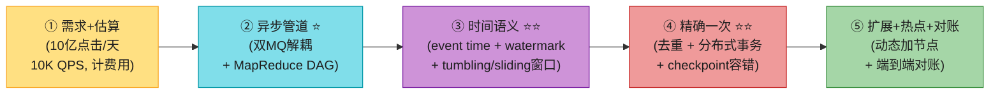

> 💡 **Step 1 关键**:**延迟要求决定架构**。RTB(实时竞价)< 1 秒;但**点击聚合用于计费/报表,几分钟延迟可接受**。这决定了用"近实时流处理"而非"在线服务"。**主动说这个区别 = 懂业务**。
>
> 💡 **关键信号词**:**"event time + watermark 处理乱序/迟到事件"** + **"Kafka 端到端精确一次靠分布式事务(offset+结果原子提交)"** + **"Kappa 架构重算走同一条流"**——这三句直接证明你懂流处理精髓。

---

## 🗺️ 章节概览

| 小节 | 要点 | 重要性 |
|------|------|--------|
| 业务背景 | RTB、CTR/CVR、计费用途 | ⭐⭐⭐ |
| 需求 + 估算 | 3 查询、10 亿点击/天、10K QPS、计费准确 | ⭐⭐⭐⭐ |
| API + 数据模型 | raw + aggregated 都存、star schema 维度 | ⭐⭐⭐⭐ |
| **异步管道 ⭐⭐** | 双 MQ(log watcher→聚合→writer)、解耦 | ⭐⭐⭐⭐⭐ |
| **MapReduce DAG ⭐⭐** | Map/Aggregate/Reduce、top-N heap | ⭐⭐⭐⭐⭐ |
| **流式 vs 批 / Lambda vs Kappa ⭐⭐** | 三系统对比、Kappa 重算 | ⭐⭐⭐⭐⭐ |
| **时间 + watermark + 窗口 ⭐⭐⭐** | event/processing time、tumbling/sliding | ⭐⭐⭐⭐⭐ |
| **精确一次 + 去重 ⭐⭐⭐** | offset 管理、分布式事务 | ⭐⭐⭐⭐⭐ |
| 扩展 + 热点 | ad_id 分区、动态加节点、虚拟节点 | ⭐⭐⭐⭐ |
| 容错 | 内存聚合 → snapshot/checkpoint 恢复 | ⭐⭐⭐⭐ |
| **对账 ⭐** | 端到日批 job 对账实时结果 | ⭐⭐⭐⭐ |
| **2026增量(补)** | Flink 具名化、checkpoint、OLAP(Pinot/ClickHouse)、Count-Min | ⭐⭐⭐⭐⭐ |

---

## 1. 业务背景 + 需求估算

### 1.1 在线广告基本概念

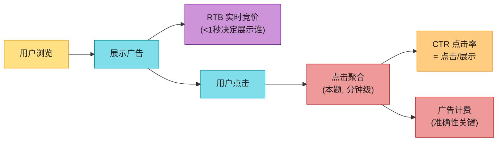

> 📝 **关键区别**:RTB(竞价)< 1 秒(实时性);**点击聚合几分钟延迟可接受**(用于计费/报表,非实时响应)。**聚合结果直接影响广告主付多少钱**——所以**准确性是头号要求**(几个百分点差异 = 数百万美元)。

### 1.2 需求(原书对话)

**澄清问题**:数据格式(日志)、量级(10亿/天,200万广告,30%年增长)、查询、边界情况(迟到/重复/故障)、延迟(分钟级)。

**3 个核心查询**(背):
1. 某广告**最近 M 分钟**的点击数。
2. **最近 M 分钟 top-N 最多点击广告**(每分钟聚合,N/M 可配)。
3. 上述两查询支持按 **ip / user_id / country 过滤**。

**边界情况**:迟到事件、重复事件、部分故障恢复。

**非功能性**:**准确性(计费用)**;处理迟到/重复;健壮性;分钟级延迟。

### 1.3 估算

```
DAU 10亿,人均1次点击/天 = 10亿点击/天
点击 QPS = 10亿 / 10^5 = 10,000; 峰值 ×5 = 50,000
单事件 0.1KB → 100GB/天, 3TB/月
```

---

## 2. API + 数据模型

### 2.1 两个 API

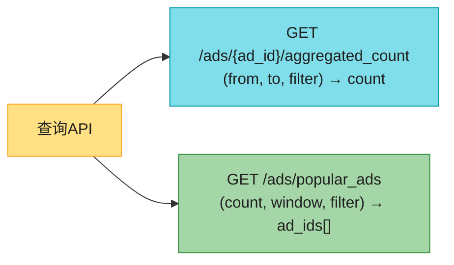

### 2.2 数据模型:raw + aggregated 都存 ⭐

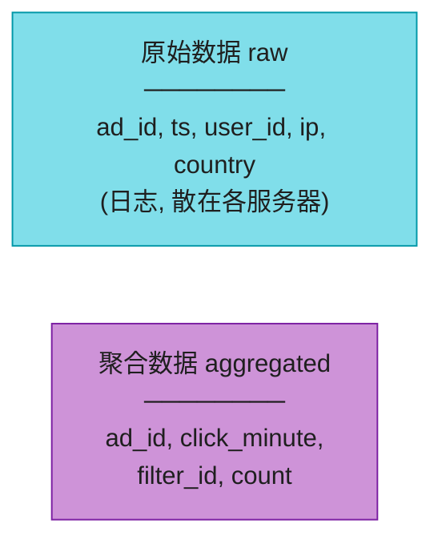

| 数据 | 用途 | 存储 |
|------|------|------|
| **原始数据** | 调试 + 重算备份 + ML(用户响应预测) | Cassandra/InfluxDB(写重);老数据上 S3 冷存 |
| **聚合数据** | 快速查询(看板/告警) | 同类型 DB,调查询性能 |

> 💡 **为什么要存两份?**
> - **原始数据** = 备份 + 调试 + bug 后能从 raw **重算**;ML 数据源。老的上冷存省钱。
> - **聚合数据** = 查询活跃数据,体量小查得快。
> - **只存原始 → 查得慢;只存聚合 → 丢精度不能重算**。**两份是工程现实**。

### 2.3 过滤:star schema(星型模式)⭐

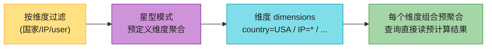

> 📝 **star schema(星型模式)**:数据仓库经典。**过滤字段叫"维度"**,按维度组合**预聚合**。查询直接读预计算结果(快)。**代价**:维度组合多 → 桶/记录爆炸。

---

## 3. 高层架构:异步管道 + 双 MQ ⭐⭐⭐⭐⭐

### 3.1 为什么要异步 + 双 MQ

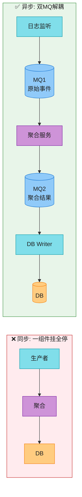

**为什么异步**:生产者/消费者容量不等,突发流量会 OOM/挂;同步链一挂全停。**用 MQ 解耦**,各组件独立扩缩。

**为什么双 MQ ⭐**:**第二个 MQ 是为了端到端精确一次(原子提交)**——见第 6 节。

---

## 4. 聚合服务:MapReduce DAG ⭐⭐⭐⭐⭐

> 📝 聚合服务用 **MapReduce 范式**,建模成 **DAG(有向无环图)**——拆成小的计算单元(Map / Aggregate / Reduce)。

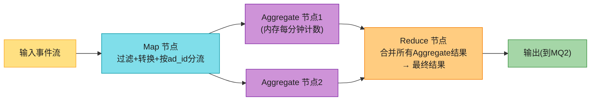

**三类节点**(背):
| 节点 | 职责 |
|------|------|
| **Map** | 读数据源、过滤、转换、按 ad_id 分流(如 `ad_id%2`) |
| **Aggregate** | **内存里**按 ad_id 每分钟计数(属于 Reduce 的一部分) |
| **Reduce** | 合并所有 Aggregate 节点的结果 → 最终 |

> 💡 **为什么需要 Map 节点**(不能直接 Kafka 分区订阅)?① 输入可能要清洗/规范化;② 可能无法控制数据怎么生产,**同 ad_id 可能落不同 Kafka 分区**,Map 节点重新按 ad_id 路由。

### 4.1 三大用例怎么落地

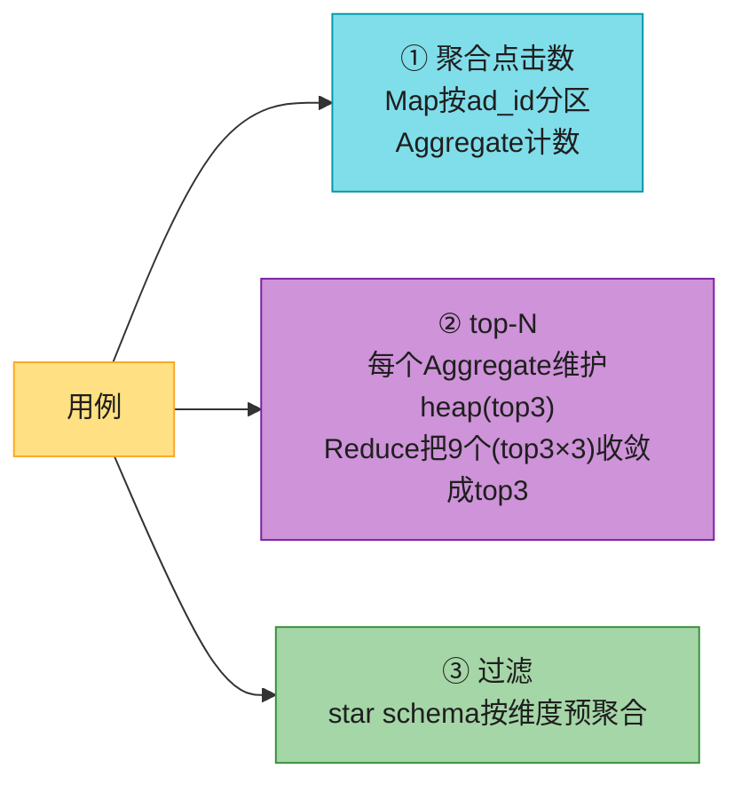

> 💡 **top-N 的精妙**:每个 Aggregate 节点维护小顶堆(min-heap)拿本地 top-3;Reduce 节点把所有节点的 top-3(如 9 个)再收敛成全局 top-3。**分布式 top-k 的经典模式**(map 各算各 → reduce 合并)。

---

## 5. 流式 vs 批处理:Lambda vs Kappa ⭐⭐⭐⭐⭐

### 5.1 三类系统

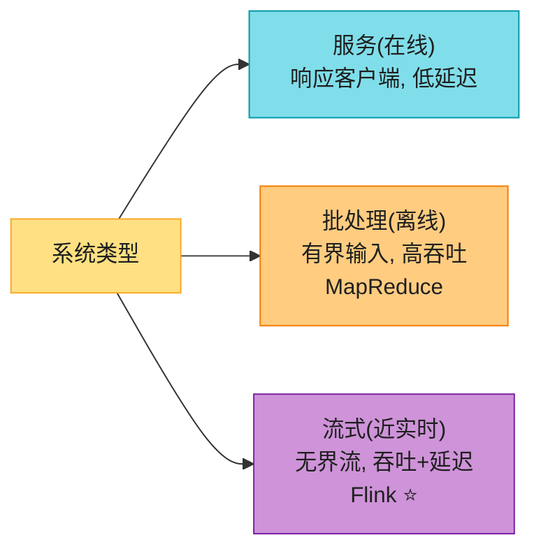

### 5.2 Lambda vs Kappa(经典架构之争)⭐⭐

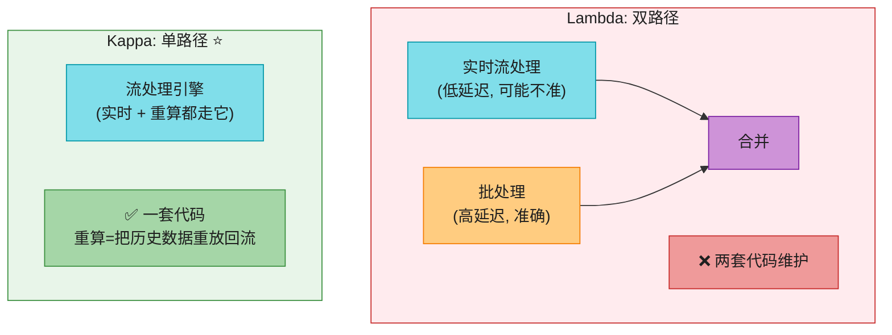

| 架构 | 做法 | 优劣 |
|------|------|------|
| **Lambda** | 实时流 + 批处理**两条路径**,结果合并 | 准确;但**两套代码维护**(痛点) |
| **Kappa ⭐** | **一条流路径**;重算 = 历史数据重放回流 | **一套代码**;本题选 Kappa |

> 💡 **数据重算(bug 后)**:Kappa 下,**重算走同一条流**——重算服务从 raw 数据读取 → 发到**专用聚合服务**(不影响实时)→ 结果进 MQ2 更新 DB。**一套代码处理实时 + 重算**。

---

## 6. 时间语义 + watermark + 窗口 ⭐⭐⭐⭐⭐(本章难点)

### 6.1 event time vs processing time

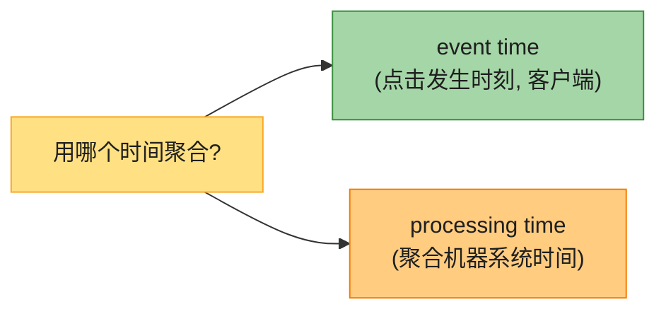

| 时间 | 优 | 劣 |
|------|----|----|
| **event time** ⭐ | **准确**(客户端知道真实点击时刻) | 依赖客户端(可能时钟错/恶意) |
| **processing time** | 服务器可靠 | 迟到事件不准确 |

> 💡 **计费要准确 → 选 event time**。但 event time 有**乱序/迟到**问题(网络延迟 + 异步 MQ,事件可能晚到几小时)。

### 6.2 watermark(水位线)⭐⭐处理迟到

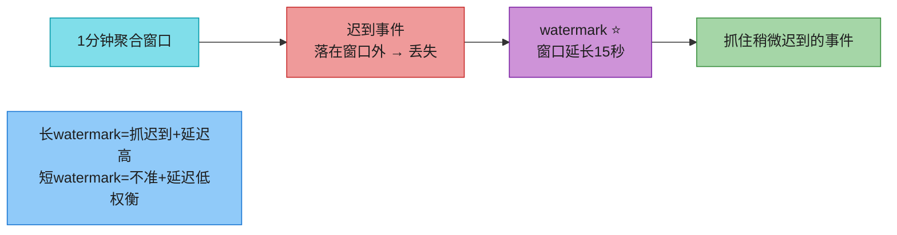

> 📝 **watermark**:聚合窗口的**延伸**。如窗口 +15 秒 watermark,稍迟到的事件能被抓住。**长 watermark 抓更多迟到 + 延迟高;短 watermark 不准 + 延迟低**。**超长延迟事件 watermark 抓不住 → 端到日对账纠正**。

### 6.3 聚合窗口类型(DDIA)

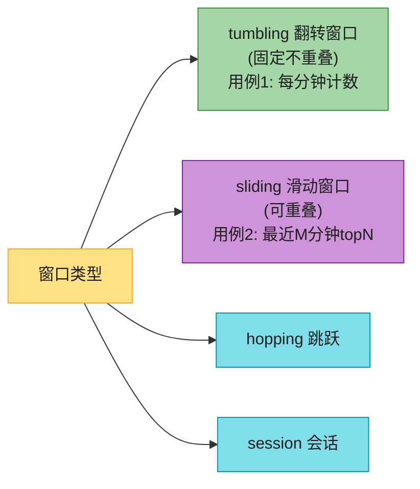

| 窗口 | 特点 | 用例 |
|------|------|------|
| **tumbling(翻转)** | 等长不重叠 | **每分钟计数**(用例1) |
| **sliding(滑动)** | 可重叠 | **最近 M 分钟 top-N**(用例2) |
| hopping / session | — | 其他场景 |

---

## 7. 交付语义:精确一次 + 去重 ⭐⭐⭐⭐⭐

> 📝 **计费用 → 准确性头号要求**。几个百分点差异 = 数百万美元。**选 exactly-once**(不是 at-least-once)。

### 7.1 重复数据来源

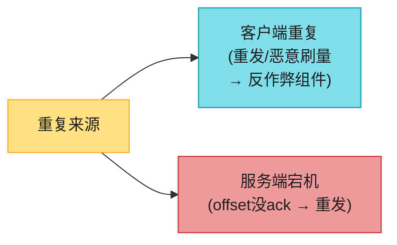

### 7.2 offset 管理的坑(精确一次核心)⭐⭐

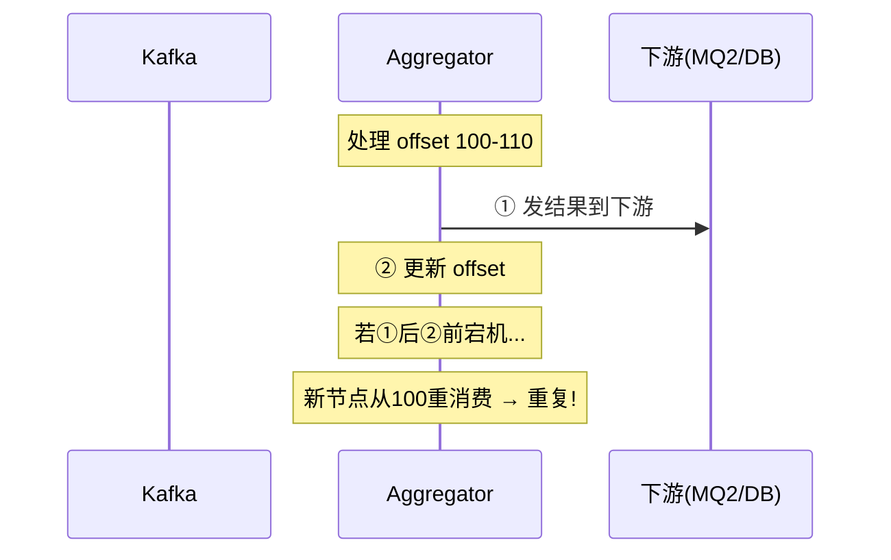

**两个错误时机**(背):
- **offset 先存,结果后发**:offset 存了但结果没发 → **丢数据**。
- **结果先发,offset 后存**:结果发了 offset 没存 → 重启从旧 offset 重消费 → **重复**。

### 7.3 解法:分布式事务(精确一次)⭐⭐⭐

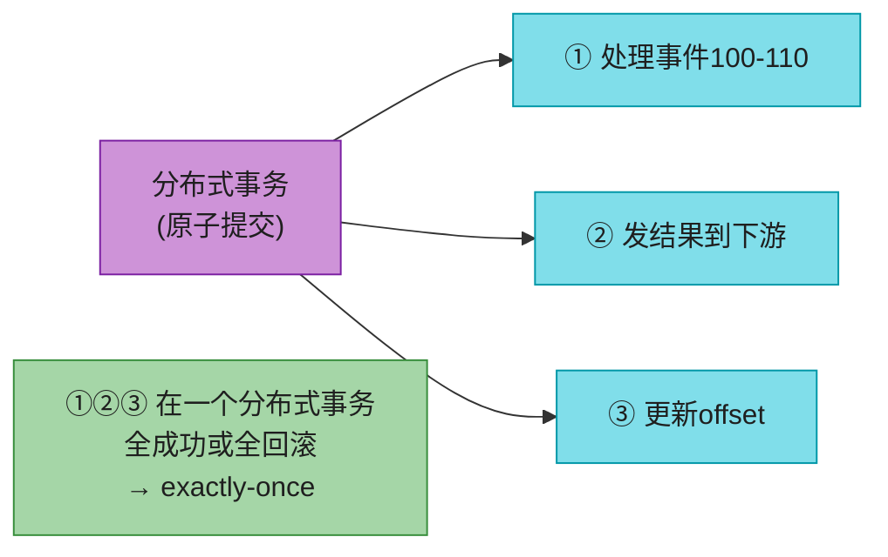

> 💡 **精确一次的本质**:**处理 + 发下游 + 更新 offset 放进一个分布式事务**(全成功或全回滚)。这就是**第二个 MQ 存在的意义**——结果写 MQ2 + offset 提交 Kafka 在一个事务里原子完成。**Flink 的精确一次就是这套**(见第 11 节 checkpoint)。

---

## 8. 扩展 + 热点 + 容错

### 8.1 三个组件独立扩展

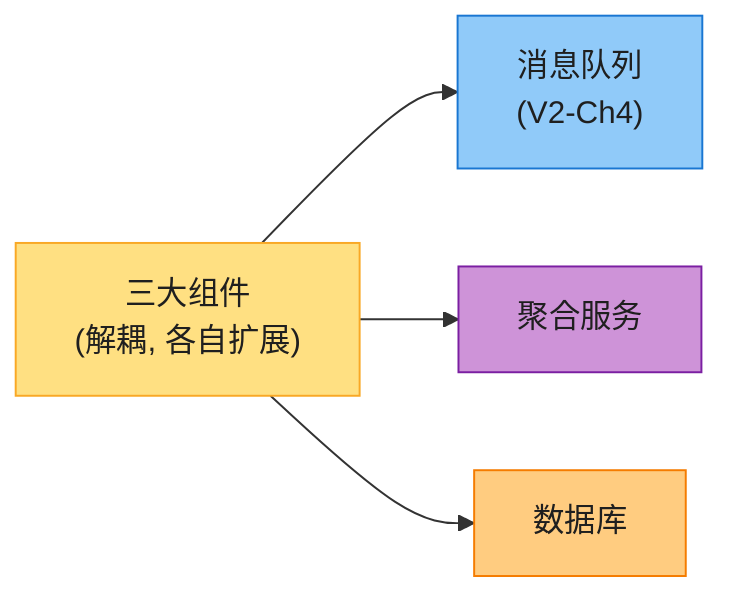

**MQ 扩展**(接 V2-Ch4):
- **ad_id 作 hash key** → 同广告同分区,聚合服务从一个分区拿全。
- **预分配足够分区**(别动态加,路由乱)。
- **topic 物理分片**(按地理 / 业务类型)减少单 topic 消费者、加速 rebalance。

**聚合服务扩展**:多线程(简单)vs **Hadoop YARN 多进程**(实际更常用,加计算资源即可)。

**DB 扩展**:Cassandra 原生水平扩展(虚拟节点 + 一致性哈希,接 Vol.1 Ch5)。

### 8.2 热点广告(热门广告过载)⭐


> 💡 **热点解法**:**资源管理器动态给热点广告分配更多聚合节点**,分摊负载。进阶:**Global-Local Aggregation / Split Distinct Aggregation**。

### 8.3 容错:snapshot 恢复

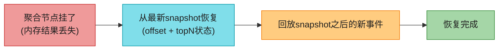

> 💡 **聚合在内存** → 节点挂了结果丢。**从 Kafka 全量回放慢**;最佳实践:**定期 snapshot 系统状态(offset + top-N)** → 从最新 snapshot 恢复 + 回放增量。**(实际是 Flink 的 checkpoint,见第 11 节)**。

---

## 9. 数据正确性:监控 + 对账 ⭐

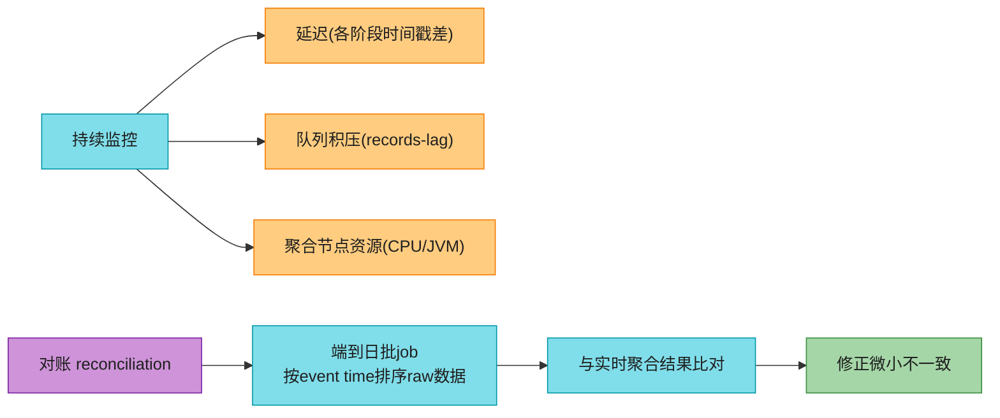

> 📝 **对账(reconciliation)**:广告聚合没有第三方记录可比对(不像银行对账)。做法:**端到日批 job 按 event time 排序 raw 数据,与实时聚合结果比对**。要更高准确度 → 缩小窗口(1 小时)。**注意:批结果与实时结果可能不完全一致**(迟到事件),对账纠微小偏差。

---

## 10. 完整架构

```mermaid
flowchart TB
    LOG["日志(各服务器)<br/>ad_id,ts,user_id,ip,country"] --> LW["日志监听器"]
    LW --> MQ1[("MQ1 Kafka<br/>原始事件")]
    MQ1 --> AGG["聚合服务<br/>(MapReduce DAG)"]
    AGG -->|"实时"| MQ2[("MQ2 Kafka<br/>聚合结果")]
    AGG -.->|"bug重算<br/>(Kappa)"| RC["重算服务<br/>从raw读"]
    RC -.-> MQ2
    MQ2 --> DW["DB Writer"] --> DB[("Cassandra<br/>聚合数据")]
    LOG --> RAW[("原始数据<br/>S3冷存")]
    DB --> DASH["看板/告警"]
    DB -.->|"端到日对账"| RECON["批job对账"]

    style LOG fill:#FFE082,stroke:#F9A825,color:#1f1f1f
    style LW fill:#80DEEA,stroke:#0097A7,color:#1f1f1f
    style MQ1 fill:#90CAF9,stroke:#1976D2,color:#1f1f1f
    style AGG fill:#CE93D8,stroke:#7B1FA2,color:#1f1f1f
    style MQ2 fill:#90CAF9,stroke:#1976D2,color:#1f1f1f
    style RC fill:#FFCC80,stroke:#F57C00,color:#1f1f1f
    style DW fill:#80DEEA,stroke:#0097A7,color:#1f1f1f
    style DB fill:#FFCC80,stroke:#F57C00,color:#1f1f1f
    style RAW fill:#90CAF9,stroke:#1976D2,color:#1f1f1f
    style DASH fill:#A5D6A7,stroke:#388E3C,color:#1f1f1f
    style RECON fill:#EF9A9A,stroke:#C62828,color:#1f1f1f
```

---

## 11. 2026 现代增量:具名化(原书抽象,这里点名)⭐⭐⭐⭐⭐

原书用抽象概念讲,2026 这些都有具体的最强实现。

### 11.1 Flink:流处理的事实标准

原书的"聚合服务 + event time + watermark + 窗口 + 精确一次 + snapshot"**全是 Flink 的核心特性**。

```mermaid
flowchart LR
    FL["Apache Flink ⭐"] --> A["event time + watermark<br/>(原生支持)"]
    FL --> B["窗口(tumbling/sliding/session)<br/>内置"]
    FL --> C["精确一次<br/>(端到端)"]
    FL --> D["状态管理<br/>(Keyed State)"]
    FL --> E["checkpoint 容错 ⭐⭐"]

    style FL fill:#CE93D8,stroke:#7B1FA2,color:#1f1f1f
    style A fill:#80DEEA,stroke:#0097A7,color:#1f1f1f
    style B fill:#80DEEA,stroke:#0097A7,color:#1f1f1f
    style C fill:#80DEEA,stroke:#0097A7,color:#1f1f1f
    style D fill:#80DEEA,stroke:#0097A7,color:#1f1f1f
    style E fill:#EF9A9A,stroke:#C62828,color:#1f1f1f
```

> 🔄 **2026 现代版话术**(原书抽象讲,这里具名):
> "原书的聚合服务概念,event time/watermark/窗口/精确一次/snapshot——**2026 全部由 Apache Flink 实现**。**Flink 是有状态流处理的事实标准**:原生 event time + watermark,内置窗口算子,端到端精确一次,**checkpoint(Chandy-Lamport 分布式快照)** 做容错。**生产做广告聚合直接上 Flink + Kafka,不用自己写 DAG**。"

### 11.2 checkpoint(Chandy-Lamport 分布式快照)⭐⭐

原书说"snapshot 恢复",但没讲机制——实际是 **Flink 的异步屏障快照(Chandy-Lamport 算法)**。

```mermaid
flowchart LR
    CP["Flink Checkpoint"] --> A["定期向数据流注入 barrier(屏障)"]
    A --> B["算子收到barrier<br/>异步保存自己状态到持久存储"]
    B --> C["全链barrier对齐<br/>→ 全局一致快照"]
    C --> D["故障时从快照恢复<br/>+ 回放barrier之后的数据"]

    style CP fill:#CE93D8,stroke:#7B1FA2,color:#1f1f1f
    style A fill:#80DEEA,stroke:#0097A7,color:#1f1f1f
    style B fill:#80DEEA,stroke:#0097A7,color:#1f1f1f
    style C fill:#FFCC80,stroke:#F57C00,color:#1f1f1f
    style D fill:#A5D6A7,stroke:#388E3C,color:#1f1f1f
```

> 📝 **Chandy-Lamport 分布式快照**:Flink 定期向流注入 **barrier**(屏障);算子收到 barrier 时**异步**把自己的状态(offset + top-N)存到持久存储;全链 barrier 对齐 → 全局一致快照。**故障时从快照恢复 + 回放 barrier 后数据**。这是 Flink 精确一次 + 快速恢复的根基——**不靠重放全量 Kafka**(慢),而是从最近 checkpoint 增量恢复。

### 11.3 OLAP 数据库(实时广告分析的事实选择)⭐

原书把 ClickHouse/Druid 当"替代方案",但**2026 实时广告分析的事实选择就是 OLAP**。

```mermaid
flowchart LR
    OL["OLAP 列存数据库"] --> CH["ClickHouse<br/>(超快聚合, 俄系)"]
    OL --> DR["Apache Druid<br/>(实时分析)"]
    OL --> PIN["Apache Pinot ⭐<br/>(LinkedIn, Uber用)"]
    NOTE["star schema + 亚秒查百亿行<br/>Flink+Kafka+Pinot = 实时数据栈标配"]

    style OL fill:#CE93D8,stroke:#7B1FA2,color:#1f1f1f
    style CH fill:#80DEEA,stroke:#0097A7,color:#1f1f1f
    style DR fill:#80DEEA,stroke:#0097A7,color:#1f1f1f
    style PIN fill:#FFCC80,stroke:#F57C00,color:#1f1f1f
    style NOTE fill:#90CAF9,stroke:#1976D2,color:#1f1f1f
```

> 💡 **话术**:"原书的 Cassandra 是通用写重型。**广告聚合的查询侧(看板/分析)更适合 OLAP 列存**——ClickHouse/Druid/**Apache Pinot** 支持星型模式 + 亚秒查百亿行。**Uber 的实时广告处理就是 Flink + Kafka + Pinot**(原书引用)。**2026 实时数据栈标配:Kafka(传输)+ Flink(流处理)+ Pinot/ClickHouse(OLAP 查询)**。"

### 11.4 其他 2026 增量

| 技术 | 说明 |
|------|------|
| **Count-Min Sketch** | 超大规模 top-N 用**近似算法**(概率数据结构),比精确 heap 省内存;原书用精确 heap |
| **Flink SQL** | **流式 SQL**——用 SQL 写流处理(窗口/聚合),不用写 Java DAG,大幅降低门槛 |
| **Schema Registry(Avro)** | 流数据格式演进管理(接 V2-Ch4) |
| **列存格式** | raw 数据存 S3 用 **ORC/Parquet/AVRO** 列式格式(原书提到),省存储 + 加速分析 |

---

## ⚠️ 已过时 / 书里没说(2022 → 2026)

| 原书(2022) | 2026 现状 | 面试应对 |
|------------|----------|---------|
| 抽象"聚合服务" | **Flink** 是事实实现 | 具名 Flink:event time/watermark/窗口/精确一次 |
| "snapshot"恢复 | **Chandy-Lamport 分布式快照**(checkpoint) | 讲 barrier + 异步状态保存 |
| Cassandra 查询 | **OLAP(Pinot/ClickHouse/Druid)** 更适合分析侧 | 讲 Flink+Kafka+Pinot 栈 |
| 精确 heap top-N | **Count-Min Sketch 近似**(超大规模) | 讲概率数据结构 |
| 手写 DAG | **Flink SQL** 流式 SQL | 讲用 SQL 写流处理 |
| 提 Hive+ES 替代 | OLAP 列存(ClickHouse/Druid)主流 | 讲列存省存储+加速 |

---

## 💻 代码示例

### 示例 1:Flink 流式聚合(event time + watermark + 窗口)

```java
StreamExecutionEnvironment env = StreamExecutionEnvironment.getExecutionEnvironment();
env.setStreamTimeCharacteristic(TimeCharacteristic.EventTime);  // event time

DataStream<AdClick> clicks = env.addSource(kafkaSource)
    // watermark: 允许5秒乱序
    .assignTimestampsAndWatermarks(
        WatermarkStrategy.<AdClick>forBoundedOutOfOrderness(Duration.ofSeconds(5))
            .withTimestampAssigner((e, t) -> e.clickTimestamp));

// 用例1: 每分钟按ad_id计数(tumbling窗口)
clicks.keyBy(c -> c.adId)
      .window(TumblingEventTimeWindows.of(Time.minutes(1)))
      .aggregate(new CountAggregator())
      .addSink(kafkaSink);   // 写MQ2

// 用例2: 最近M分钟top-N(sliding窗口)
clicks.keyBy(c -> c.adId)
      .window(SlidingEventTimeWindows.of(Time.minutes(5), Time.minutes(1)))
      .aggregate(new TopNAggregator(100))
      .addSink(kafkaSink);
```

### 示例 2:Flink SQL(流式 SQL,2026 主流)

```sql
-- 每分钟每广告点击数(tumbling窗口), 一行SQL搞定
INSERT INTO ad_clicks_per_minute
SELECT
    ad_id,
    TUMBLE_START(click_ts, INTERVAL '1' MINUTE) AS win_start,
    COUNT(*) AS click_count
FROM ad_click_stream
GROUP BY ad_id, TUMBLE(click_ts, INTERVAL '1' MINUTE);

-- top-100 最近5分钟(sliding窗口)
SELECT ad_id FROM (
    SELECT ad_id, ROW_NUMBER() OVER (
        ORDER BY COUNT(*) DESC) AS rn
    FROM ad_click_stream
    GROUP BY ad_id, HOP(click_ts, INTERVAL '1' MINUTE, INTERVAL '5' MINUTE)
) WHERE rn <= 100;
```

### 示例 3:Count-Min Sketch 近似 top-N(超大规模)

```python
# 精确heap: 内存=O(广告数); 超大规模(千万广告)爆
# Count-Min Sketch: 概率近似, 固定小内存, 误差可控
from pyprobables import CountMinSketch

cms = CountMinSketch(width=10000, depth=5)   # 固定内存
for event in stream:
    cms.add(event.ad_id)                      # O(1) 增量
# 查某广告近似计数(可能略高, 永不低于)
approx_count = cms.check("ad001")
```

---

## 🪤 追问陷阱(面试官最爱问,本章集)

1. **"为什么用流处理不用在线服务?"** → 点击聚合用于计费/报表,**分钟级延迟可接受**(RTB 才需 <1秒);流处理扛海量写 + 近实时。
2. **"raw 和 aggregated 都存吗?"** → **都存**。raw 备份+调试+重算+ML;aggregated 查得快。只存 raw 慢,只存 agg 不能重算。
3. **"为什么要两个 MQ?"** → 第二个 MQ 为**端到端精确一次**(结果写 MQ2 + offset 提交 Kafka 一个事务原子)。
4. **"Lambda 还是 Kappa?"** → **Kappa**(一套代码)。Lambda 两套代码维护痛苦;Kappa 重算走同一条流。
5. **"用 event time 还是 processing time?"** → **event time**(计费要准确);但需 watermark 处理乱序/迟到。
6. **"迟到事件怎么办?"** → **watermark** 抓稍迟到(窗口+15s);超长延迟 watermark 抓不住 → 端到日对账纠正。
7. **"tumbling 还是 sliding 窗口?"** → 每分钟计数用 **tumbling**(不重叠);最近 M 分钟 top-N 用 **sliding**(可重叠)。
8. **"怎么保证精确一次?"** → 处理+发下游+更新 offset **放一个分布式事务**(全成功或全回滚)。Flink 原生支持。
9. **"offset 先存还是后存?"** → **都不能单独做**(先存丢数据,后存重复)。必须分布式事务原子。
10. **"重复数据哪来的?"** → 客户端(重发/刷量→反作弊)+ 服务端宕机(offset 没 ack 重发)。
11. **"热点广告过载?"** → 资源管理器**动态给热点广告加聚合节点**;进阶 Global-Local Aggregation。
12. **"聚合节点挂了内存结果丢?"** → 从 **checkpoint(分布式快照)** 恢复 + 回放增量;不从 Kafka 全量重放(慢)。
13. **"ad_id 怎么做 Kafka 分区键?"** → 同广告同分区,聚合服务从一个分区拿全;预分配分区别动态加。
14. **"怎么保证数据正确(计费)?"** → **端到日对账**:批 job 按 event time 排序 raw 与实时结果比对,修正偏差。
15. **"2026 用什么实现?"** → **Flink + Kafka + Pinot/ClickHouse**(实时数据栈标配)。Flink 做流处理(checkpoint 精确一次),Pinot 做 OLAP 查询。
16. **"top-N 内存爆?"** → 超大规模用 **Count-Min Sketch 近似**(固定内存,误差可控)。

---

## 🏭 生产级产品速查表

| 产品 | 角色 | 特色 |
|------|------|------|
| **Apache Kafka** | 消息队列/日志 | 事实标准(接 V2-Ch4) |
| **Apache Flink** ⭐ | 流处理 | event time/watermark/精确一次/checkpoint |
| **Apache Spark (Structured) Streaming** | 流处理 | 微批为主,生态强 |
| **Apache Pinot** | OLAP(实时分析) | LinkedIn,Uber 用,亚秒查 |
| **ClickHouse** | OLAP | 超快聚合,俄系 |
| **Apache Druid** | OLAP(实时) | 时序+实时分析 |
| **Cassandra** | 通用写重型 | raw 数据存储 |
| **Apache Hadoop YARN** | 资源管理 | 聚合服务弹性扩缩 |

> 🏭 **业界标杆**:**Uber 的 Flink + Kafka + Pinot 实时广告处理**(原书引用)是标杆——Flink 做精确一次流处理,Pinot 做亚秒 OLAP 查询。**这是 2026 实时大数据栈的黄金组合**。

---

## 📝 本章要点总结

```mermaid
flowchart LR
    ROOT(["V2-Ch6 广告点击聚合<br/>大数据流处理: Flink+Kafka+OLAP"])

    B1["需求+估算 ⭐<br/>────────<br/>• 3查询, 10亿点击/天<br/>• 计费用→准确性头号<br/>• 分钟级延迟"]
    B2["异步管道+MapReduce ⭐⭐<br/>────────<br/>• 双MQ解耦(精确一次)<br/>• Map/Aggregate/Reduce DAG<br/>• top-N用heap"]
    B3["流式架构 ⭐⭐<br/>────────<br/>• 服务/批/流三类系统<br/>• Lambda双路径 vs Kappa单路径<br/>• 选Kappa(重算走同流)"]
    B4["时间+watermark+窗口 ⭐⭐⭐<br/>────────<br/>• event time(准)<br/>• watermark抓迟到<br/>• tumbling/sliding窗口"]
    B5["精确一次 ⭐⭐⭐<br/>────────<br/>• offset管理坑<br/>• 分布式事务原子提交<br/>• Flink checkpoint容错"]
    B6["扩展+对账+2026<br/>────────<br/>• 热点动态加节点<br/>• 端到日对账<br/>• Flink+Kafka+Pinot栈"]

    ROOT --> B1
    ROOT --> B2
    ROOT --> B3
    ROOT --> B4
    ROOT --> B5
    ROOT --> B6

    style ROOT fill:#FFE082,stroke:#F57C00,color:#1f1f1f,stroke-width:3px
    style B1 fill:#80DEEA,stroke:#0097A7,color:#1f1f1f
    style B2 fill:#CE93D8,stroke:#7B1FA2,color:#1f1f1f
    style B3 fill:#A5D6A7,stroke:#388E3C,color:#1f1f1f
    style B4 fill:#90CAF9,stroke:#1976D2,color:#1f1f1f
    style B5 fill:#FFCC80,stroke:#F57C00,color:#1f1f1f
    style B6 fill:#EF9A9A,stroke:#C62828,color:#1f1f1f
```

**核心 Takeaways**:

1. **业务定位**:RTB <1秒;**点击聚合分钟级**(计费/报表);**准确性头号**(计费)。
2. **raw + aggregated 都存**——raw 备份/调试/重算/ML;aggregated 快查。
3. **双 MQ 异步管道**——解耦 + **第二个 MQ 为精确一次**(结果+offset 原子提交)。
4. **聚合 = MapReduce DAG**(Map 分流/Aggregate 内存计数/Reduce 合并);top-N 各节点 heap + reduce 收敛。
5. **Kappa 优于 Lambda**——一套代码,重算走同一条流。
6. **event time + watermark**——计费要准用 event time;watermark 抓稍迟到;超长延迟靠对账。
7. **tumbling(每分钟计数)/ sliding(最近 M 分钟 top-N)**。
8. **精确一次 = 分布式事务**(处理+下游+offset 原子);offset 不能单独先/后存。
9. **热点广告动态加节点**;**容错靠 checkpoint(分布式快照)恢复**,不全量重放。
10. **端到日对账**保证计费正确(批 job 排序 raw 与实时比对)。
11. **2026:Flink + Kafka + Pinot/ClickHouse** 是实时大数据栈标配;Flink 实现了全部概念(checkpoint/Chandy-Lamhort);Flink SQL 降门槛;Count-Min Sketch 处理超大规模 top-N。

> 🔗 **连接上下章**:**V2-Ch4 消息队列**(Kafka)+ **V2-Ch5 监控**(流式采集)是本章的底层;**V2-Ch6 广告聚合**把"流式大数据处理"推到极致(Flink+Kafka+OLAP)。**V2-Ch7 酒店预订**则切回**业务系统**——从"流式聚合"转向"高并发预订(超卖/库存/缓存)"。
