# Volume 2 · Chapter 7: 设计酒店预订系统 (Design a Hotel Reservation System)

> **本章定位**:酒店预订是**"低 TPS 高并发尖峰 + 强一致 + 并发抢占"**的业务系统题——它是 Marriott/Booking/携程/美团的预订核心,也是**秒杀/抢购/库存类题的祖型**。它把 Vol.1 Ch1 的缓存/分片、ACID 事务、V2-Ch4 的幂等全用上。灵魂是五件事:**① 业务建模(订房型不订具体房 ⭐)② 并发双重预订怎么防(幂等 key + 悲观/乐观锁/CHECK 约束 ⭐⭐⭐)③ 房型库存表设计(一行一日期,room_type_inventory)④ 超售(10% overbooking)⑤ 微服务数据一致性(2PC vs Saga)**。它是国内大厂"秒杀/库存/订单"三件套的面试标准答案。

> **本章和原书的区别**:原书把**并发双重预订讲得极透彻**——幂等 key 防重复点击、悲观/乐观锁/CHECK 约束防竞争条件、room_type_inventory 表设计、超售实现都覆盖,是面试标准答案。但**没把这道题和"秒杀/抢购"挂钩**——而酒店+超售本质就是秒杀(高并发抢有限库存),这是国内大厂高频题的连接点;**锁只讲 DB 级(悲观/乐观/CHECK),没讲 Redis 级(Lua 原子预扣 + Redlock)**——2026 秒杀的实际做法是 Redis Lua 原子扣减库存,把并发挡在 DB 之外;**Saga 只提名字没讲透**——现代用 **Outbox 模式**可靠发事件;**微服务一致性 hybrid 方案很务实**但没讲清楚为什么;**定价只说"动态",没讲 ML 收益管理**(航空式按预测定价)+ **超售比例靠 ML 预测 no-show**。本章把这些补上。

---

## 🎯 面试怎么答(被问到"设计酒店预订 / Airbnb / 订单库存系统"时)

**开场话术**(直接背):

> "酒店预订我先确认四件事:① 规模(多少酒店/房)?② 付全款还是到店付?③ 要不要支持超售?④ 价格是否动态?然后按 **业务建模(订房型不订具体房 ⭐)→ 并发双重预订(幂等 key + 锁 ⭐⭐⭐)→ room_type_inventory 表设计 → 扩展(分片+Redis缓存)→ 微服务一致性(2PC vs Saga)** 五块讲。核心抉择是 **怎么防并发双重预订(锁的选型)** 和 **库存怎么建模(一行一日期)**。"

**4 步推进**:

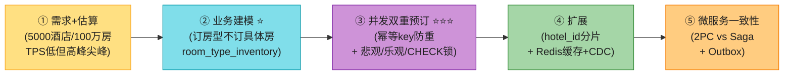

> 💡 **Step 1 关键**:**确认是超售吗?** 原书允许 10% overbooking(酒店预期有人取消)。**有超售 vs 无超售,锁和库存校验逻辑不同**(超售把阈值放宽到 110%)。
>
> 💡 **关键信号词**:**"订的是房型(room_type)不是具体房间(房间号 check-in 才分配)"** + **"reservation_id 做幂等键防重复点击;乐观锁/CHECK 防并发抢占"** + **"room_type_inventory 一行一日期,复合主键 (hotel_id, room_type_id, date)"**——这三句直接证明你懂这道题的精髓。

---

## 🗺️ 章节概览

| 小节 | 要点 | 重要性 |
|------|------|--------|
| 需求 + 估算 | 5000酒店/100万房、**超售10%**、动态定价、TPS低(3)但高峰 | ⭐⭐⭐ |
| API 设计 | hotel/room/reservation CRUD;**reservation_id 幂等键** | ⭐⭐⭐⭐ |
| **业务建模 ⭐⭐** | **订房型不订具体房**;room_type_inventory | ⭐⭐⭐⭐⭐ |
| 高层架构 | 微服务(Hotel/Rate/Reservation/Payment/Management)+ gRPC | ⭐⭐⭐⭐ |
| **并发双重预订 ⭐⭐⭐** | 幂等防重 + 悲观/乐观/CHECK 锁防竞争 | ⭐⭐⭐⭐⭐ |
| **room_type_inventory ⭐⭐** | 一行一日期、复合主键、预生成2年 | ⭐⭐⭐⭐⭐ |
| 超售 overbooking | 110% × total_inventory | ⭐⭐⭐⭐ |
| 扩展 | hotel_id 分片 + Redis 缓存 + CDC 一致性 | ⭐⭐⭐⭐ |
| **微服务一致性 ⭐** | 2PC vs Saga;hybrid 同库务实方案 | ⭐⭐⭐⭐⭐ |
| **2026增量(补)** | 秒杀连接、Redis Lua 预扣、Redlock、Outbox、ML 定价 | ⭐⭐⭐⭐⭐ |

---

## 1. 需求 + 估算

**澄清问题**(原书对话):

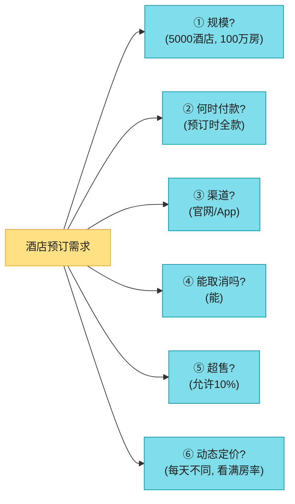

**原书确定的需求**:

| 维度 | 确认值 |
|------|--------|
| 规模 | **5000 酒店,100 万房** |
| 付款 | 预订时**全款**付 |
| 渠道 | 官网 / App |
| 取消 | 支持 |
| **超售** ⭐ | **允许 10%**(预期有人取消) |
| 定价 | **动态**(每天不同,看满房率) |
| 聚焦 | 酒店页/房型详情页/预订/管理后台/超售(**搜索不在范围**) |

**非功能性**:**高并发**(旺季/大事件,热门房型被抢);**中等延迟**(几秒可接受)。

**估算**(背):

```
70%入住率, 平均住3天
日预订量 = (100万 × 0.7) / 3 ≈ 24万
预订 TPS = 24万 / 10^5 ≈ 3 TPS  ⚠️ 均值很低!

★ 漏斗(每步90%流失):
  详情页 300 QPS → 预订页 30 QPS → 下单 3 TPS
★ 但: 旺季/大事件 热门房型瞬时高并发(秒杀特征)
```

> 💡 **核心洞察**:**均值 TPS 只有 3,但旺季热门房型瞬时高并发**——这是"低均值 + 高尖峰"的秒杀特征。**架构要为尖峰设计**(锁/缓存扛并发),不能只看均值。

---

## 2. 业务建模:订房型不订具体房 ⭐⭐⭐⭐⭐(核心洞察)

> 📝 **关键业务洞察**:**酒店预订订的是"房型"(标准间/大床房/双床房),不是具体房间号**。房间号是 **check-in 时才分配**的。这和 Airbnb(订整个 listing,有具体 ID)根本不同。

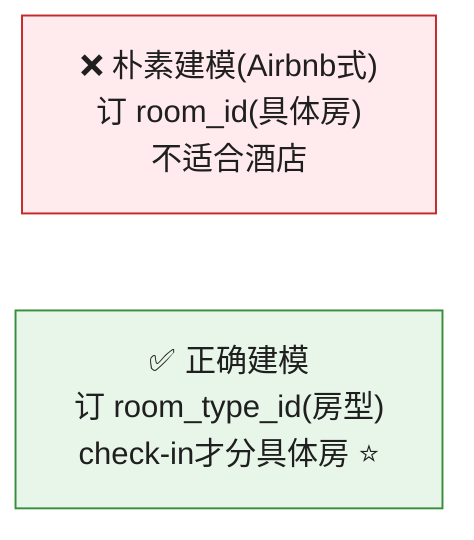

> 🪤 **追问陷阱(高频)**:"酒店预订和 Airbnb 预订的数据模型区别?" → "**Airbnb 订具体 listing(有 listing_id);酒店订房型(room_type),具体房间号 check-in 才分配**。所以酒店的库存表是**按房型+日期**统计余量,不是按具体房间。这是本题最关键的业务洞察——**很多人一上来按 Airbnb 建模就错了**。"

### 2.1 为什么用关系库?

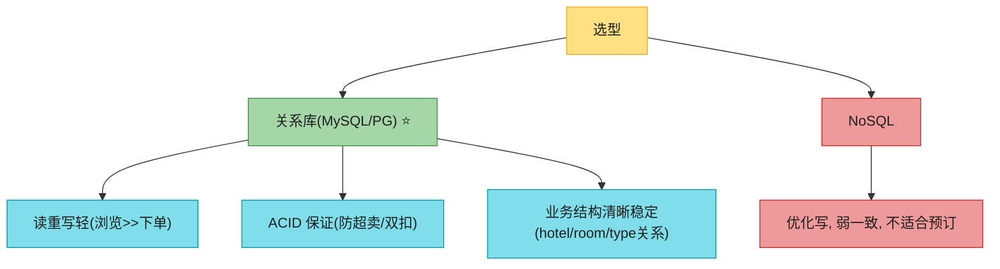

> 💡 **关系库三理由**:① 读重写轻;② **ACID 保证**(防负余额/双扣/双订,简化应用代码);③ 业务结构清晰稳定。**预订系统默认关系库**。

---

## 3. API + 高层架构

### 3.1 核心 API

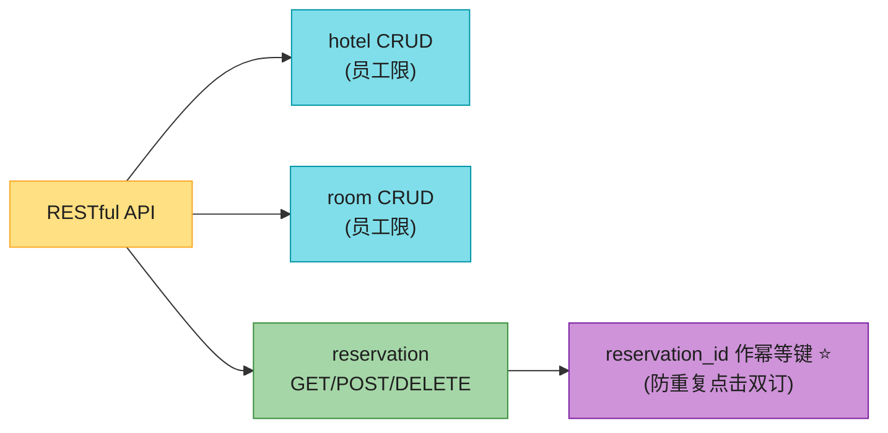

**预订请求**(注意 `reservationID`):
```json
{ "startDate":"2021-04-28", "endDate":"2021-04-30",
  "hotelID":"245", "roomTypeID":"12354673389",
  "roomCount":"3", "reservationID":"U12354673390" }
```
> 💡 **reservationID = 幂等键**(第 4 节详述)。

### 3.2 微服务架构

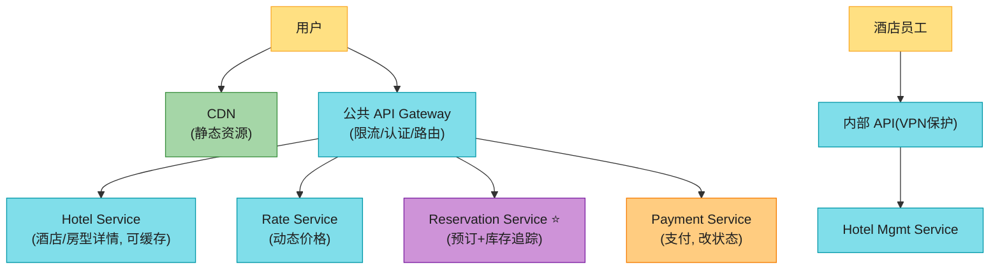

| 服务 | 职责 |
|------|------|
| **Hotel Service** | 酒店房型详情(静态,可缓存) |
| **Rate Service** | 动态价格(满房率决定) |
| **Reservation Service** ⭐ | 预订 + 库存追踪 |
| **Payment Service** | 支付,改预订状态(paid/rejected) |
| **Hotel Mgmt Service** | 员工管理后台 |

> 💡 **服务间通信用 gRPC**(高性能 RPC)。

---

## 4. 并发双重预订 ⭐⭐⭐⭐⭐(本章灵魂)

两个场景:**① 同一用户重复点击 ② 多用户同时抢同一房型**。

### 4.1 场景一:同一用户重复点击 → 幂等键

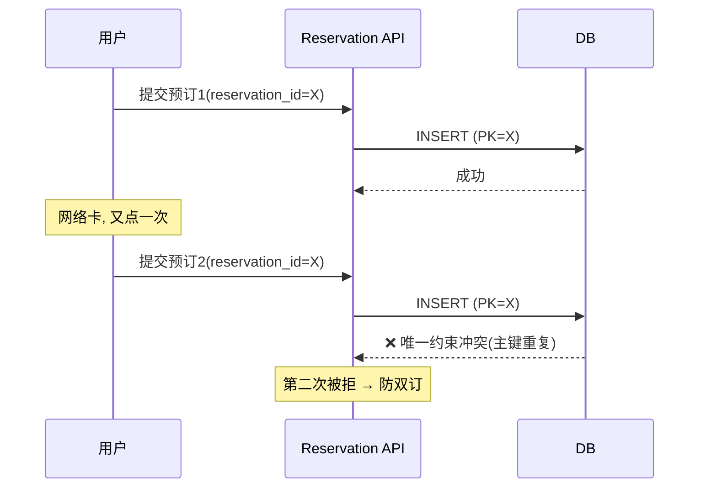

**解法**:**reservation_id 作主键(PK)**,靠**唯一约束**——第二次插入主键冲突被拒。

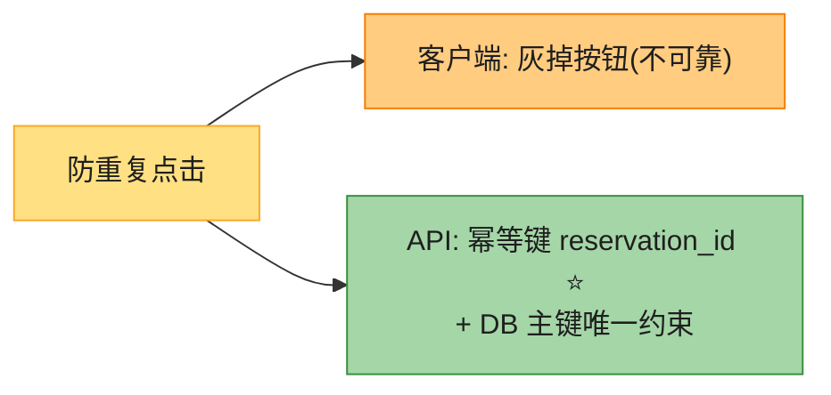

> 💡 **幂等键**接 Vol.1 Ch1 的幂等思想——**reservation_id 由全局唯一 ID 生成器产生**(接 Vol.1 Ch7),作为幂等键。客户端禁用按钮(灰掉)是辅助但不可靠(可禁 JS)。

### 4.2 场景二:多用户同时抢 → 竞争条件(race condition)⭐⭐⭐

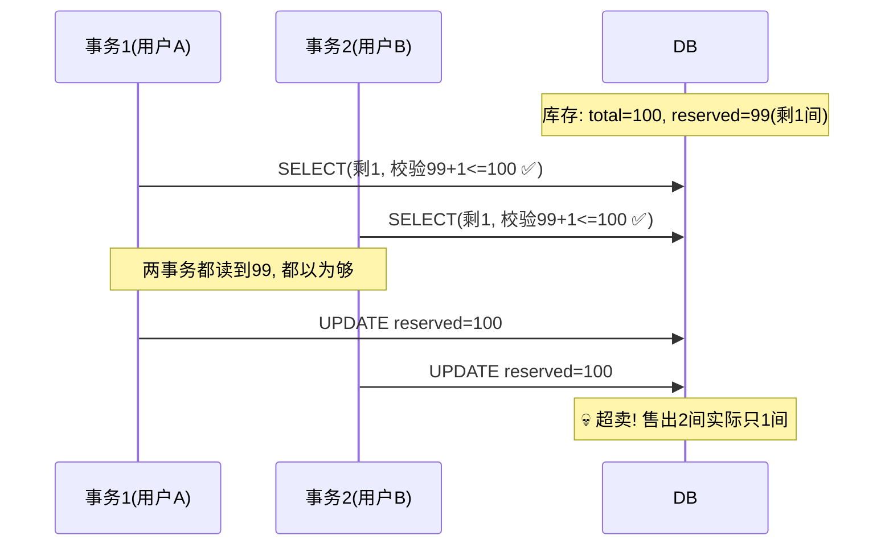

**根因**:**非串行化隔离级别**下,事务1的修改在提交前对事务2不可见(ACID 的 I),两事务都读到旧值 99,都通过校验,都更新 → 超卖。

> 🪤 **追问陷阱**:"为什么 ACID 的隔离性反而导致超卖?" → "隔离性(I)保证事务未提交的修改别人看不到。所以事务1改了 reserved=100 但没提交时,事务2 SELECT 仍读到旧的 99,通过校验后也改成 100 → 超卖。**隔离性是双刃剑:保证一致的同时制造了读旧值窗口**。解法是加锁或约束。"

### 4.3 三种解法(背熟对比)⭐⭐⭐

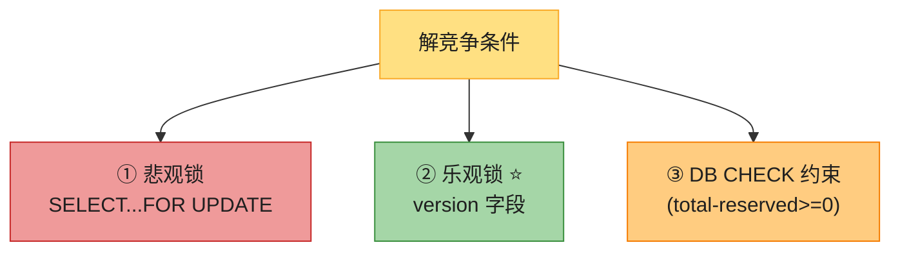

| 方案 | 机制 | 优 | 劣 | 适用 |
|------|------|----|----|------|
| **① 悲观锁** | `SELECT...FOR UPDATE` 锁行,他人等 | 简单,序列化更新 | **死锁**;长锁伤性能,不可扩展 | ❌ **不推荐**(预订) |
| **② 乐观锁 ⭐** | version 字段;更新时校验 version+1 | 不锁 DB,快 | **高并发下重试风暴**(只有一个成功) | ✅ **酒店(QPS低)** |
| **③ CHECK 约束** | `CHECK(total_inventory-total_reserved>=0)` | 易实现 | 高并发失败多;不跨库可移植 | ✅ **酒店(低争用)** |

#### 乐观锁详解(推荐)

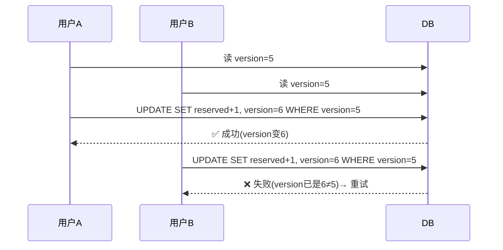

**乐观锁**:加 `version` 列;读时记 version;更新时 `WHERE version=旧值`,version+1。**校验失败则重试**。

> 💡 **为什么推荐乐观锁给酒店?** 酒店预订 **QPS 低**(均值 3 TPS),**数据争用少**——乐观锁在低争用下几乎不重试,又不像悲观锁那样锁 DB。**高争用场景(秒杀)乐观锁会重试风暴**(只有一个成功,其余全失败重试),这时要换 Redis 预扣(见第 9 节)。

---

## 5. room_type_inventory 表设计 ⭐⭐⭐⭐⭐

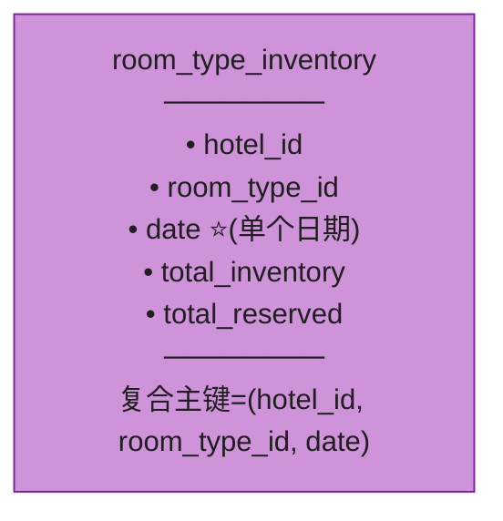

**关键设计**:**一行一个日期**——这让日期范围内的查询和管理极简单。

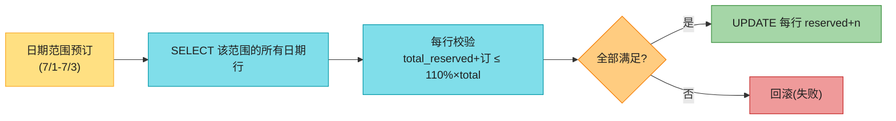

**超售实现**:校验放宽到 `(total_reserved + n) <= 110% × total_inventory`。

**容量估算**:
```
5000酒店 × 20房型 × 2年 × 365天 = 7300万行
单库够 + 多区副本高可用(数据量不大)
```

**预生成**:daily job 提前生成未来 2 年的库存行(日期推进时补)。

> 💡 **为什么一行一日期?** 让"日期范围查询 + 范围内每天校验"变成简单的 `WHERE date BETWEEN start AND end`。**按天拆行 = 按天管理库存**。接 V2-Ch5 的时序"一行一时戳"思想同源。

---

## 6. 扩展:分片 + Redis 缓存

### 6.1 数据库分片(按 hotel_id)

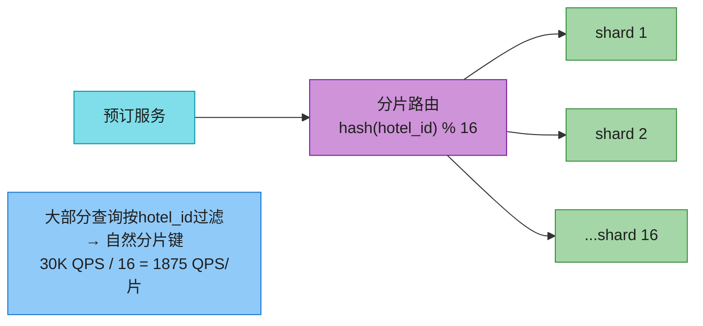

> 💡 **分片键 = hotel_id**(大部分查询先选酒店)。30K QPS 分 16 片 → 1875 QPS/片(单 MySQL 扛得住)。**历史预订数据归档冷存**(只查当前/未来)。

### 6.2 Redis 缓存(库存前置)

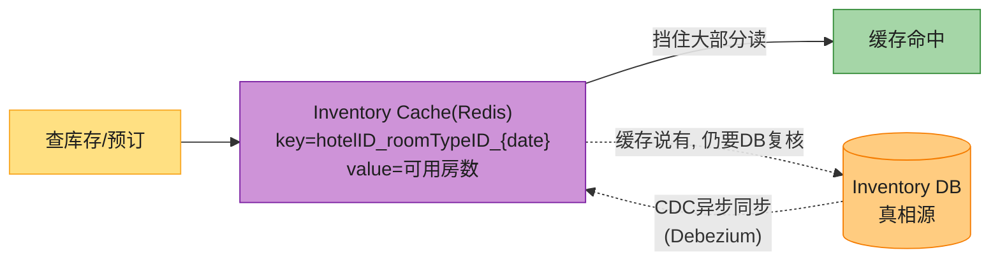

**关键纪律**:**即使缓存说有房,仍要在 DB 复核**(DB 是真相源)。缓存-DB 不一致可接受,只要 DB 做最终校验。

> 🪤 **追问陷阱**:"缓存和 DB 库存不一致怎么办?" → "**DB 先更新,缓存 CDC 异步同步(可能短暂不一致)**。但**只要 DB 做最终校验就不影响正确性**——缓存可能多报一间(用户看到有房),但下单到 DB 时被拒('刚被订走')。用户刷新就同步了。**缓存不一致 + DB 终审 = 可接受的体验**。"

---

## 7. 微服务数据一致性:2PC vs Saga ⭐⭐⭐

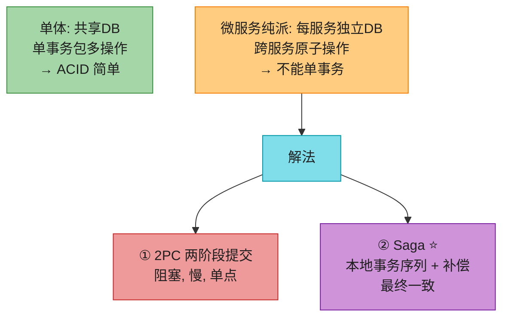

| 方案 | 机制 | 优劣 |
|------|------|------|
| **2PC** | 跨节点原子提交(全成或全败) | 阻塞,单点故障卡死,**性能差** |
| **Saga ⭐** | 本地事务序列;每步发消息触发下一步;失败执行**补偿事务** | 最终一致,非阻塞;但要写补偿逻辑 |

### Saga 示例(预订 = 扣库存 + 扣款 + 生成订单)

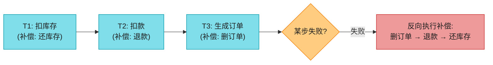

> 💡 接 Vol.1 Ch1 的 Saga 思想(电商下单同源)。

### 务实的 hybrid 方案(原书选择)

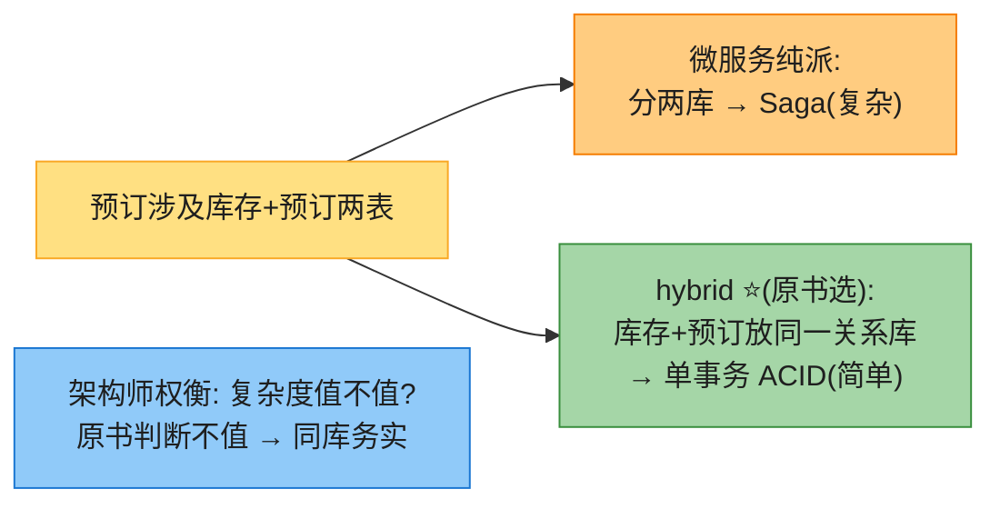

> 💡 **senior 信号**:**架构师要权衡复杂度值不值**。微服务纯派每服务独立库很优雅,但跨服务一致性引入 Saga 大量复杂度。**本题原书判断"不值"——库存+预订放同一库用单事务 ACID**。这是务实的工程判断(不是教条主义)。

---

## 8. 2026 现代增量(原书没讲的硬核)⭐⭐⭐⭐⭐

### 8.1 秒杀连接(国内大厂高频题的祖型)⭐⭐⭐

原书没把酒店预订和"秒杀"挂钩,但**酒店+超售本质就是秒杀**(高并发抢有限库存)。

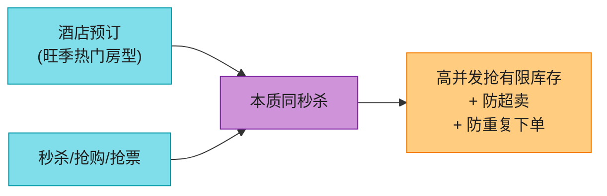

> 💡 **话术**:"酒店旺季热门房型预订本质是**秒杀**——高并发抢有限库存、防超卖、防重复。国内大厂'设计秒杀系统'的标准答案就是本题 + Redis 预扣(下节)。**主动说出'这是秒杀' = 连接到大厂高频题**。"

### 8.2 Redis Lua 原子预扣(秒杀实际做法)⭐⭐⭐

原书锁都在 DB 级(悲观/乐观/CHECK)。但**秒杀的实际做法是把并发挡在 DB 之前——Redis Lua 原子扣减**。

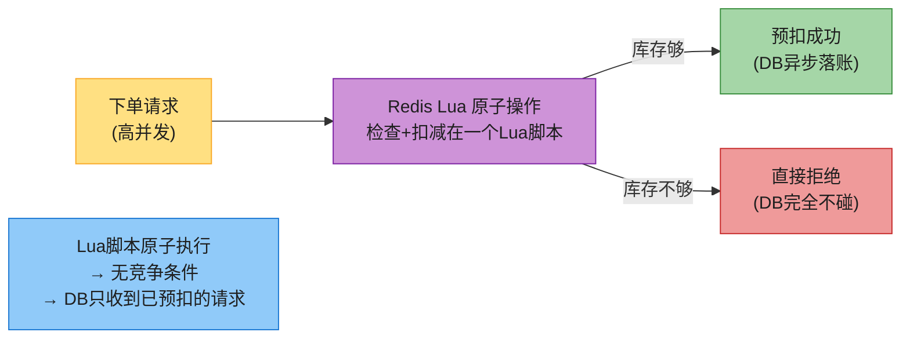

> 📝 **Redis Lua 预扣**:用 Lua 脚本在 Redis 里**原子地"检查库存 + 扣减"**(Lua 单线程执行,天然无竞争)。库存不够直接拒(不碰 DB)。预扣成功的请求再异步落 DB。**把高并发挡在 Redis,DB 只处理已预扣的**——这是秒杀扛 10 万 QPS 的核心。
>
> 🔄 **2026 现代版话术**(原书锁都在 DB):
> "原书的悲观/乐观/CHECK 锁都在 DB 级,酒店低 QPS 够用。但**真秒杀(10万+ QPS)DB 锁扛不住**。生产做法:**Redis Lua 原子预扣库存**——Lua 脚本单线程执行天然无竞争,检查+扣减原子完成,库存不够直接拒(不碰 DB),预扣成功再异步落 DB。**把并发挡在 Redis 之前**,DB 只收到已预扣的请求。**这是秒杀扛超并发的核心模式**。"

### 8.3 库存预扣 + 异步确认(防占着不放)

```mermaid
flowchart LR
    S1["① Redis预扣库存"] --> S2["② 生成预订单(待支付)"]
    S2 --> S3["③ 限时支付(如15分钟)"]
    S3 --> Q{"支付?"}
    Q -->|"成功"| S4["④ DB落账确认"]
    Q -->|"超时未付"| S5["⑤ Redis还库存(释放)"]

    style S1 fill:#80DEEA,stroke:#0097A7,color:#1f1f1f
    style S2 fill:#80DEEA,stroke:#0097A7,color:#1f1f1f
    style S3 fill:#FFCC80,stroke:#F57C00,color:#1f1f1f
    style Q fill:#FFE082,stroke:#F9A825,color:#1f1f1f
    style S4 fill:#A5D6A7,stroke:#388E3C,color:#1f1f1f
    style S5 fill:#EF9A9A,stroke:#C62828,color:#1f1f1f
```

> 💡 **预扣 + 限时确认**:Redis 预扣后给用户限时支付(15分钟),超时未付自动还库存。**防"占着不付"导致库存假性耗尽**。这是电商下单的标准模式(淘宝/京东都这套)。

### 8.4 其他 2026 增量

| 技术 | 说明 |
|------|------|
| **Redlock(Redis 分布式锁)** | 跨节点分布式锁;原书锁 DB 级,跨服务用 Redis 分布式锁 |
| **Outbox 模式** | 微服务可靠发事件——业务写 DB + 事件写 outbox 表同一事务,CDC 读 outbox 发 Kafka(保证事件不丢) |
| **ML 收益管理定价** | 航空式按预测满房率动态定价;原书说"动态"没讲 ML |
| **ML 预测 no-show 算超售比例** | 10% 超售是经验值;2026 用 ML 预测取消率动态调超售比例(收益最大化) |
| **Saga + 事件溯源** | 现代用事件溯源 + Outbox 实现 Saga |

---

## ⚠️ 已过时 / 书里没说(2022 → 2026)

| 原书(2022) | 2026 现状 | 面试应对 |
|------------|----------|---------|
| 锁都在 DB 级 | **Redis Lua 原子预扣**(秒杀扛超并发) | 讲把并发挡在 DB 之前 |
| 没挂钩秒杀 | **本质同秒杀**(国内大厂高频题) | 主动说"这是秒杀" |
| Saga 只提名字 | **Outbox 模式**可靠发事件 | 讲事务性 outbox + CDC |
| 超售 10% 经验值 | **ML 预测 no-show 动态调比例** | 讲收益管理 |
| 动态定价一句话 | **ML 收益管理**(航空式) | 讲按预测定价 |
| hybrid 同库 | 强调架构师权衡复杂度 | justify 为什么不值 |
| 没提预扣确认 | **预扣+限时支付+超时还库存** | 讲电商标准模式 |

---

## 💻 代码示例

### 示例 1:乐观锁防并发(SQL)

```sql
-- 读时记 version
SELECT date, total_inventory, total_reserved, version
FROM room_type_inventory
WHERE room_type_id = ? AND hotel_id = ? AND date BETWEEN ? AND ?;

-- 应用校验每行: total_reserved + n <= 1.1 * total_inventory
-- 更新时带 version(乐观锁)
UPDATE room_type_inventory
SET total_reserved = total_reserved + ?,
    version = version + 1
WHERE room_type_id = ? AND hotel_id = ? AND date BETWEEN ? AND ?
  AND version = ?;   -- 乐观锁: version 必须匹配
-- 受影响行数 < 预期 → 并发冲突 → 重试
```

### 示例 2:CHECK 约束防超卖

```sql
ALTER TABLE room_type_inventory
ADD CONSTRAINT chk_room_count
CHECK (total_inventory - total_reserved >= 0);
-- 超卖时 reserved > inventory → 约束违反 → 自动回滚
```

### 示例 3:Redis Lua 原子预扣(秒杀核心)

```lua
-- KEYS[1] = 库存key  KEYS[2] = 已售key  ARGV[1] = 抢购数  ARGV[2] = 用户id(幂等)
local stock = tonumber(redis.call('GET', KEYS[1]))
local sold = tonumber(redis.call('SCARD', KEYS[2]))   -- 已售用户集合
local want = tonumber(ARGV[1])
local user = ARGV[2]

if redis.call('SISMEMBER', KEYS[2], user) == 1 then
    return -2   -- 已抢过(幂等防重)
end
if stock - sold < want then
    return -1   -- 库存不足(拒绝, 不碰DB)
end
redis.call('SADD', KEYS[2], user)   -- 标记已抢
return stock - sold - want          -- 返回剩余库存(预扣成功)
-- 整个脚本原子执行, 天然无竞争
```

```python
# Python 调用
def flash_sale(room_type_id, user_id):
    remaining = r.eval(lua_script, 2, f"stock:{room_type_id}",
                       f"sold:{room_type_id}", 1, user_id)
    if remaining == -1:  return "售罄"
    if remaining == -2:  return "已抢过"
    # 预扣成功 → 异步落 DB + 限时支付
    mq.publish("order_topic", {"user": user_id, "room_type": room_type_id})
    return "抢到了, 15分钟内支付"
```

---

## 🪤 追问陷阱(面试官最爱问,本章集)

1. **"酒店预订和 Airbnb 区别?"** → 酒店订**房型**(check-in 分房),Airbnb 订具体 listing。库存表按房型+日期,不是按房间。
2. **"为什么用关系库?"** → 读重写轻 + **ACID**(防超卖/双扣)+ 结构清晰。NoSQL 弱一致不适合预订。
3. **"怎么防同一用户重复下单?"** → **reservation_id 幂等键 + 主键唯一约束**。客户端灰按钮是辅助不可靠。
4. **"多用户同时抢最后一间怎么办?"** → 锁。悲观(`FOR UPDATE`)/乐观(version)/CHECK 约束三选一。
5. **"悲观锁为什么不适合预订?"** → 死锁 + 长锁伤性能 + 不可扩展。
6. **"乐观锁高并发会怎样?"** → **重试风暴**(只有一个成功,其余全失败重试)。酒店 QPS 低够用,秒杀不行。
7. **"乐观锁和 CHECK 约束区别?"** → 乐观锁靠应用 version 校验;CHECK 靠 DB 约束自动回滚。CHECK 更简单但不可移植。
8. **"ACID 隔离性为什么导致超卖?"** → 未提交修改别人看不到,两事务都读旧值通过校验。解法是锁/约束。
9. **"room_type_inventory 为什么一行一日期?"** → 日期范围查询/管理简单(`WHERE date BETWEEN`)。
10. **"超售怎么实现?"** → 校验放宽到 `reserved+n ≤ 110% × inventory`。
11. **"分片键选什么?"** → **hotel_id**(大部分查询先选酒店)。
12. **"缓存和 DB 库存不一致?"** → DB 先更新 + CDC 异步同步缓存;**DB 做最终校验就不影响正确性**(缓存多报被 DB 拒)。
13. **"微服务怎么保证跨服务一致?"** → 2PC(阻塞差)/ **Saga**(本地事务+补偿,最终一致)。原书选 hybrid 同库单事务(务实)。
14. **"Saga 中间态可见怎么办?"** → 业务展示"处理中"+ 状态机 + 幂等键(接 Vol.1 Ch1)。
15. **"这是秒杀吗?"** → **是!** 高并发抢有限库存。秒杀实际用 **Redis Lua 原子预扣**把并发挡在 DB 之前,不是 DB 锁。
16. **"预扣后用户不付怎么办?"** → 限时支付(15分钟)+ 超时自动还库存(防占着不放)。
17. **"微服务怎么可靠发事件?"** → **Outbox 模式**(业务+事件同事务写,CDC 读 outbox 发 Kafka,保证不丢)。

---

## 🏭 生产级产品速查表

| 产品 | 特色 |
|------|------|
| **Marriott / 万豪** | 本题原型(连锁酒店) |
| **Booking.com** | 聚合平台(QPS 1000×连锁) |
| **Airbnb** | 订 listing(非房型),数据模型不同 |
| **Expedia** | OTA 聚合 |
| **携程 / 美团** | 国内,酒店+超售+秒杀特征 |
| **12306 抢票** | 秒杀极致(Redis 预扣 + 排队) |

> 🏭 **业界标杆**:**Booking.com 的库存管理**是本题原型;国内 **12306 抢票 / 淘宝秒杀**是 Redis Lua 预扣的极致案例。**电商下单(扣库存+扣款+订单)是 Saga 的经典场景**。

---

## 📝 本章要点总结

```mermaid
flowchart LR
    ROOT(["V2-Ch7 酒店预订<br/>并发抢占 + 强一致 + 秒杀"])

    B1["需求+估算 ⭐<br/>────────<br/>• 5000酒店/100万房<br/>• TPS低(3)但高峰尖峰<br/>• 超售10%, 动态定价"]
    B2["业务建模 ⭐⭐<br/>────────<br/>• 订房型不订具体房<br/>• 关系库(ACID)<br/>• room_type_inventory一行一日期"]
    B3["并发双重预订 ⭐⭐⭐<br/>────────<br/>• 幂等键防重复点击<br/>• 悲观/乐观/CHECK防竞争<br/>• 酒店选乐观锁(QPS低)"]
    B4["扩展 ⭐<br/>────────<br/>• hotel_id分片<br/>• Redis缓存+CDC<br/>• DB终审(缓存不一致OK)"]
    B5["微服务一致 ⭐⭐<br/>────────<br/>• 2PC(阻塞)vs Saga(补偿)<br/>• hybrid同库务实方案<br/>• 架构师权衡复杂度"]
    B6["2026增量(补)<br/>────────<br/>• 本质=秒杀<br/>• Redis Lua原子预扣<br/>• Outbox/ML定价/预扣确认"]

    ROOT --> B1
    ROOT --> B2
    ROOT --> B3
    ROOT --> B4
    ROOT --> B5
    ROOT --> B6

    style ROOT fill:#FFE082,stroke:#F57C00,color:#1f1f1f,stroke-width:3px
    style B1 fill:#80DEEA,stroke:#0097A7,color:#1f1f1f
    style B2 fill:#CE93D8,stroke:#7B1FA2,color:#1f1f1f
    style B3 fill:#EF9A9A,stroke:#C62828,color:#1f1f1f
    style B4 fill:#90CAF9,stroke:#1976D2,color:#1f1f1f
    style B5 fill:#FFCC80,stroke:#F57C00,color:#1f1f1f
    style B6 fill:#A5D6A7,stroke:#388E3C,color:#1f1f1f
```

**核心 Takeaways**:

1. **核心业务洞察**:订**房型不订具体房**(check-in 才分房)——区别于 Airbnb。很多人这里就错了。
2. **关系库**:读重写轻 + **ACID**(防超卖/双扣)+ 结构清晰。预订默认关系库。
3. **防双重预订**:① 幂等键(reservation_id 主键)防重复点击;② 锁防并发竞争。
4. **三种锁**:悲观(`FOR UPDATE`,不推荐)/ **乐观(version,推荐低QPS)**/ CHECK 约束。酒店选乐观锁。
5. **room_type_inventory**:一行一日期,复合主键 (hotel_id, room_type_id, date),预生成 2 年;超售放宽到 110%。
6. **分片按 hotel_id**;Redis 缓存库存 + **DB 做终审**(缓存不一致不影响正确性)。
7. **微服务一致性**:2PC(差)/ **Saga**(补偿,最终一致);原书务实选 hybrid 同库单事务。
8. **架构师权衡**:微服务纯派每服务独立库很优雅,但 Saga 复杂度大——**本题不值,同库 ACID 务实**。
9. **本质 = 秒杀**(国内大厂高频题);真秒杀用 **Redis Lua 原子预扣**把并发挡在 DB 之前,DB 锁扛不住。
10. **预扣 + 限时支付 + 超时还库存**(电商标准模式);**Outbox 模式**可靠发事件;**ML 定价/超售预测**是收益管理。

> 🔗 **连接上下章**:**V2-Ch6 广告聚合**(流式大数据)是"写重无状态";**V2-Ch7 酒店预订**是"高并发强一致有状态"(锁/事务)——从流处理切回业务交易系统。**V2-Ch8 分布式邮件**继续业务系统,但换到"异步可靠投递"场景(SMTP/IMAP + 队列 + 送达率)。
