# Volume 2 · Chapter 8: 设计分布式邮件服务 (Design a Distributed Email Service)

> **本章定位**:分布式邮件是**"存储极重 + 异步可靠投递 + 送达率 + 全文搜索"**的综合业务题——它是 Gmail/Outlook/QQ 邮箱的设计骨架。它把 Vol.1 Ch1 的缓存/MQ、V2-Ch4 的消息队列、Ch7 的有状态服务全用上。灵魂是六件事:**① 收发协议(SMTP/IMAP/POP)② 元数据怎么存(自定义分布式DB + 反规范化)③ 附件怎么存(S3 对象存储)④ 怎么实时推送新邮件(WebSocket)⑤ 怎么全文搜索(Elasticsearch / LSM 原生)⑥ 送达率(为什么 50% 邮件是垃圾 + SPF/DKIM/DMARC)**。它是少有的"协议古老(1970s SMTP)但规模现代(10亿用户/PB级)"的题。

> **本章和原书的区别**:原书把**分布式邮件的架构和元数据建模讲得相当完整**——传统 Maildir 演进、收发流程、反规范化解决 NoSQL 读/未读查询、JWZ 会话线程、送达率(SPF/DKIM/DMARC)、Elasticsearch vs 原生搜索都覆盖,是面试标准答案。但**用 HTTP/REST 作客户端协议**,而 2026 现代邮件客户端协议是 **JMAP**(HTTP/JSON 替代 IMAP,RFC 8621,快得多);**Gmail 用"自定义 DB"一笔带过**——实际是 **Bigtable + Colossus(GFS)+ 原生搜索**,这是 Google 的真实栈;**反垃圾只说"过滤",没讲 ML**(Gmail 用 TensorFlow);**认证只提 SPF/DKIM/DMARC,没提 BIMI(品牌标识)/ARC(转发链)**;**附件去重**只在收尾提一句——实际群发场景去重是省 PB 级存储的关键;**冷存储分层**没讲(Gmail 老邮件上冷存)。本章补上。

---

## 🎯 面试怎么答(被问到"设计 Gmail / 分布式邮件服务"时)

**开场话术**(直接背):

> "邮件服务我先确认四件事:① 规模(10亿用户)?② 要哪些功能(收发/搜索/反垃圾)?③ 客户端协议(HTTP/IMAP/JMAP)?④ 要附件吗?然后按 **协议(SMTP/IMAP/JMAP)→ 高层架构(web服务器+实时推送+元数据DB+附件S3+搜索)→ 收发异步流程(队列解耦)→ 元数据建模(反规范化读/未读)→ 送达率(SPF/DKIM/DMARC)** 五块讲。核心抉择是 **元数据存储(自定义分布式DB)+ 送达率(为什么邮件难送达)**。"

**4 步推进**:

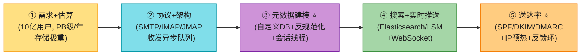
```mermaid
flowchart LR
    S1["① 需求+估算<br/>(10亿用户, PB级/年<br/>存储极重)"] --> S2["② 协议+架构<br/>(SMTP/IMAP/JMAP<br/>+收发异步队列)"]
    S2 --> S3["③ 元数据建模 ⭐<br/>(自定义DB+反规范化<br/>+会话线程)"]
    S3 --> S4["④ 搜索+实时推送<br/>(Elasticsearch/LSM<br/>+WebSocket)"]
    S4 --> S5["⑤ 送达率 ⭐<br/>(SPF/DKIM/DMARC<br/>+IP预热+反馈环)"]

    style S1 fill:#FFE082,stroke:#F9A825,color:#1f1f1f
    style S2 fill:#80DEEA,stroke:#0097A7,color:#1f1f1f
    style S3 fill:#CE93D8,stroke:#7B1FA2,color:#1f1f1f
    style S4 fill:#A5D6A7,stroke:#388E3C,color:#1f1f1f
    style S5 fill:#FFCC80,stroke:#F57C00,color:#1f1f1f
```

> 💡 **Step 1 关键**:**邮件是存储极重型**——1亿用户 × 40封/天 × 50KB 元数据 = **730 PB/年**。架构要为存储优化(分布式DB + 冷热分层 + 附件去重)。
>
> 💡 **关键信号词**:**"SMTP 收发、IMAP/JMAP 客户端读取、DNS MX 记录定位收件服务器"** + **"邮件难送达是新 IP 没信誉,要预热 2-6 周 + SPF/DKIM/DMARC 防钓鱼"** + **"读/未读用反规范化(NoSQL 只能查分区/聚类键)"**——这三句直接拿下面试。

---

## 🗺️ 章节概览

| 小节 | 要点 | 重要性 |
|------|------|--------|
| 需求 + 估算 | 10亿用户、**730PB元数据/年**、附件1460PB/年 | ⭐⭐⭐⭐ |
| **邮件协议 101** | SMTP/POP/IMAP/MX/MIME/Base64 | ⭐⭐⭐⭐⭐ |
| 传统 vs 分布式邮件服务器 | Maildir 单机瓶颈 → 分布式 | ⭐⭐⭐ |
| **收发流程 ⭐⭐** | 发送/接收异步队列解耦 | ⭐⭐⭐⭐⭐ |
| 高层架构 | web服务器+实时+元数据DB+附件S3+缓存+搜索 | ⭐⭐⭐⭐ |
| **元数据建模 ⭐⭐⭐** | 自定义DB + 反规范化读/未读 + 会话线程 | ⭐⭐⭐⭐⭐ |
| **送达率 ⭐⭐⭐** | IP预热+分类+反馈环+SPF/DKIM/DMARC | ⭐⭐⭐⭐⭐ |
| 搜索 | Elasticsearch vs 原生(LSM) | ⭐⭐⭐⭐ |
| 扩展+可用 | 水平扩展 + 多机房 | ⭐⭐⭐ |
| **2026增量(补)** | JMAP、Gmail真实栈、ML反垃圾、BIMI/ARC、冷存 | ⭐⭐⭐⭐⭐ |

---

## 1. 需求 + 估算

**澄清问题**(原书对话):

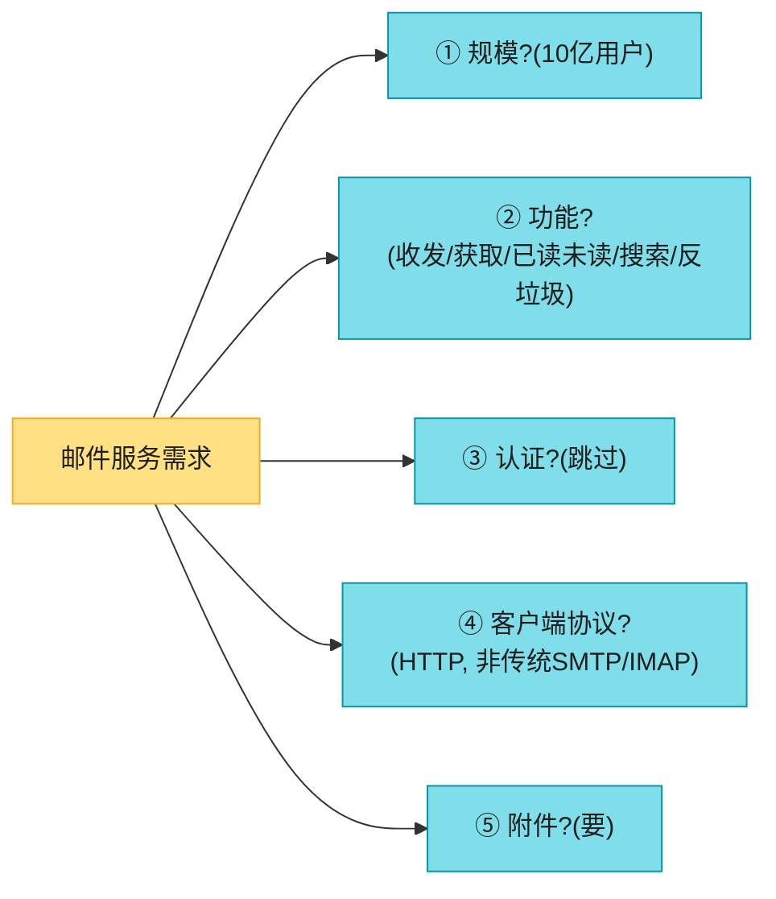
```mermaid
flowchart LR
    Q["邮件服务需求"] --> A["① 规模?(10亿用户)"]
    Q --> B["② 功能?<br/>(收发/获取/已读未读/搜索/反垃圾)"]
    Q --> C["③ 认证?(跳过)"]
    Q --> D["④ 客户端协议?<br/>(HTTP, 非传统SMTP/IMAP)"]
    Q --> E["⑤ 附件?(要)"]

    style Q fill:#FFE082,stroke:#F9A825,color:#1f1f1f
    style A fill:#80DEEA,stroke:#0097A7,color:#1f1f1f
    style B fill:#80DEEA,stroke:#0097A7,color:#1f1f1f
    style C fill:#80DEEA,stroke:#0097A7,color:#1f1f1f
    style D fill:#80DEEA,stroke:#0097A7,color:#1f1f1f
    style E fill:#80DEEA,stroke:#0097A7,color:#1f1f1f
```

**非功能性**:**可靠(不能丢邮件)**;可用(多副本+部分故障可运行);可扩展;灵活可扩展(传统协议功能有限,可能要自定义协议)。

**估算**(背,存储很震撼):

```
10亿用户
发: 人均10封/天 → 发送 QPS = 10亿×10/10^5 = 100,000
收: 人均40封/天, 元数据50KB
  元数据/年 = 10亿 × 40 × 365 × 50KB = 730 PB ⚠️
附件: 20%含附件, 均500KB
  附件/年 = 10亿 × 40 × 365 × 20% × 500KB = 1,460 PB ⚠️
→ 必须分布式DB + 冷热分层 + 去重
```

> 💡 **核心洞察**:**邮件是存储极重型**(每年 PB 级)。架构核心是**存储优化**:分布式元数据DB + 附件对象存储 + 去重 + 冷热分层。

---

## 2. 邮件协议 101 ⭐⭐⭐⭐⭐

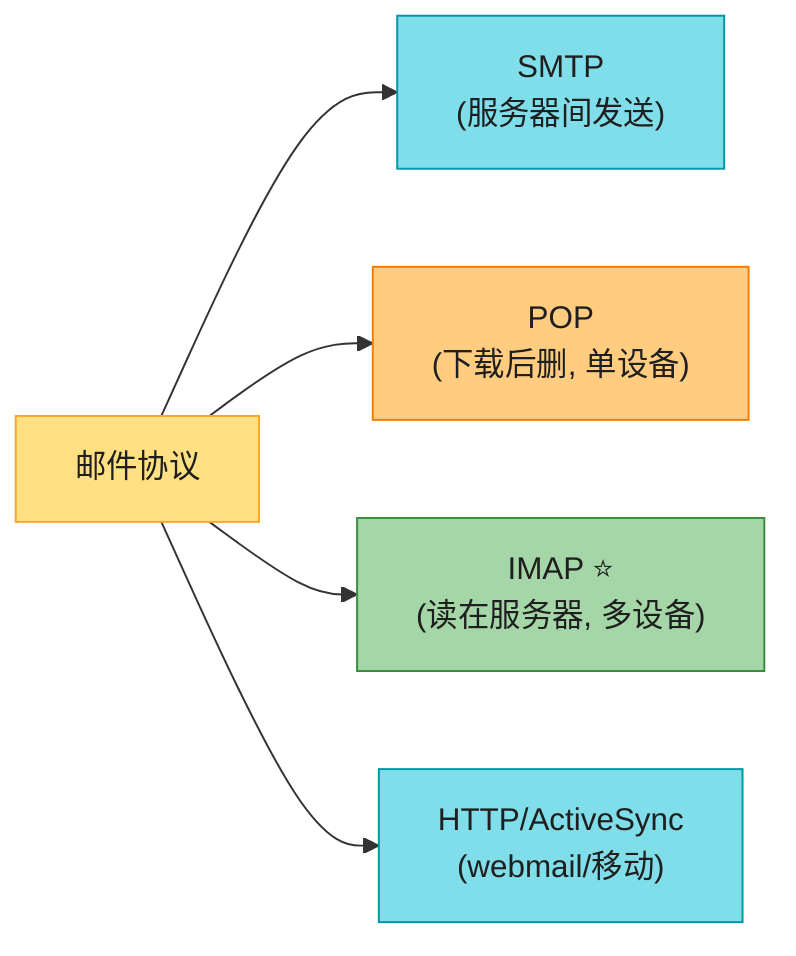
```mermaid
flowchart LR
    PROTO["邮件协议"] --> SMTP["SMTP<br/>(服务器间发送)"]
    PROTO --> POP["POP<br/>(下载后删, 单设备)"]
    PROTO --> IMAP["IMAP ⭐<br/>(读在服务器, 多设备)"]
    PROTO --> HTTP["HTTP/ActiveSync<br/>(webmail/移动)"]

    style PROTO fill:#FFE082,stroke:#F9A825,color:#1f1f1f
    style SMTP fill:#80DEEA,stroke:#0097A7,color:#1f1f1f
    style POP fill:#FFCC80,stroke:#F57C00,color:#1f1f1f
    style IMAP fill:#A5D6A7,stroke:#388E3C,color:#1f1f1f
    style HTTP fill:#80DEEA,stroke:#0097A7,color:#1f1f1f
```

| 协议 | 用途 | 特点 |
|------|------|------|
| **SMTP** | **服务器之间发送** | 标准发送协议 |
| **POP** | 下载到本地 | **下载后从服务器删除** → 只能一个设备访问;要下整封(大附件慢) |
| **IMAP** ⭐ | 读取(主流) | **邮件留服务器**,多设备访问;点击才下载;慢连接友好(先下头) |
| **HTTP/ActiveSync** | webmail/移动 | Outlook 用 ActiveSync over HTTPS |

**其它基础**:
- **DNS MX 记录**:定位收件域的邮件服务器(带优先级,低的优先)。`gmail.com` 的 MX 优先级 5 → 优先用 `gmail-smtp-in.l.google.com`。
- **附件**:**Base64 编码**(二进制→文本传输);大小限制(Outlook 20MB / Gmail 25MB);**MIME** 规范。

> 📝 **传统邮件服务器**:单机 + **Maildir**(每封邮件一个文件,用户目录)。**不扩展**(数十亿邮件磁盘 IO 瓶颈)+ **无高可用**(盘坏/机挂丢数据)→ 需分布式。

---

## 3. 分布式邮件架构 ⭐⭐⭐⭐⭐

### 3.1 核心组件

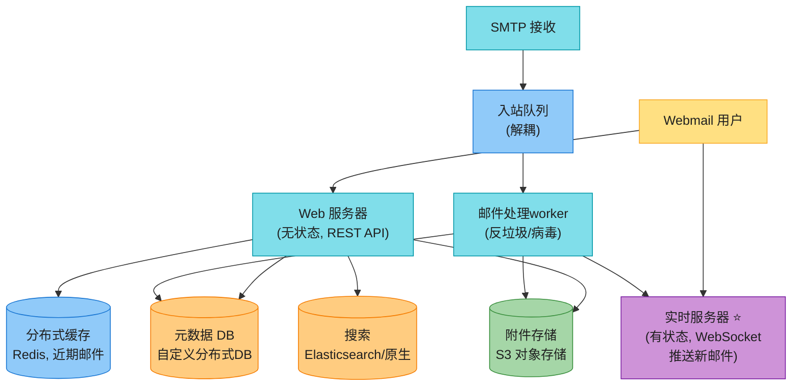
```mermaid
flowchart TB
    U["Webmail 用户"] --> WS["Web 服务器<br/>(无状态, REST API)"]
    U --> RT["实时服务器 ⭐<br/>(有状态, WebSocket<br/>推送新邮件)"]
    WS --> META[("元数据 DB<br/>自定义分布式DB")]
    WS --> CACHE[("分布式缓存<br/>Redis, 近期邮件")]
    WS --> ATT[("附件存储<br/>S3 对象存储")]
    WS --> SEARCH[("搜索<br/>Elasticsearch/原生")]
    SMTPIN["SMTP 接收"] --> Q["入站队列<br/>(解耦)"] --> WORK["邮件处理worker<br/>(反垃圾/病毒)"]
    WORK --> META
    WORK --> ATT
    WORK --> RT

    style U fill:#FFE082,stroke:#F9A825,color:#1f1f1f
    style WS fill:#80DEEA,stroke:#0097A7,color:#1f1f1f
    style RT fill:#CE93D8,stroke:#7B1FA2,color:#1f1f1f
    style META fill:#FFCC80,stroke:#F57C00,color:#1f1f1f
    style CACHE fill:#90CAF9,stroke:#1976D2,color:#1f1f1f
    style ATT fill:#A5D6A7,stroke:#388E3C,color:#1f1f1f
    style SEARCH fill:#FFCC80,stroke:#F57C00,color:#1f1f1f
    style SMTPIN fill:#80DEEA,stroke:#0097A7,color:#1f1f1f
    style Q fill:#90CAF9,stroke:#1976D2,color:#1f1f1f
    style WORK fill:#80DEEA,stroke:#0097A7,color:#1f1f1f
```

| 组件 | 职责 |
|------|------|
| **Web 服务器** | 无状态,处理 REST API(登录/收发/读文件夹) |
| **实时服务器** ⭐ | **有状态**,WebSocket 推送新邮件(Vol.1 Ch12 同源) |
| **元数据 DB** | 邮件元数据(主题/正文/发收件人) |
| **附件存储** | S3(大文件,Cassandra 不适合:blob 实际 <1MB + 占行缓存) |
| **分布式缓存** | Redis 缓存近期邮件(82% 读在 16 天内) |
| **搜索存储** | 倒排索引全文搜索 |

### 3.2 发送流程 ⭐⭐

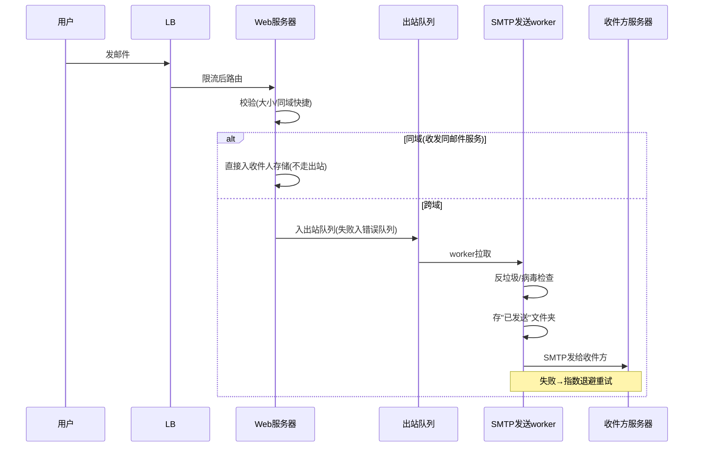
```mermaid
sequenceDiagram
    participant U as 用户
    participant LB as LB
    participant WS as Web服务器
    participant Q as 出站队列
    participant W as SMTP发送worker
    participant R as 收件方服务器
    U->>LB: 发邮件
    LB->>WS: 限流后路由
    WS->>WS: 校验(大小/同域快捷)
    alt 同域(收发同邮件服务)
        WS->>WS: 直接入收件人存储(不走出站)
    else 跨域
        WS->>Q: 入出站队列(失败入错误队列)
        Q->>W: worker拉取
        W->>W: 反垃圾/病毒检查
        W->>W: 存"已发送"文件夹
        W->>R: SMTP发给收件方
        Note over W,R: 失败→指数退避重试
    end
```

**发送流程**(背):
1. 用户发邮件 → LB 限流 → Web 服务器。
2. **基本校验**(大小限制等)。
3. **同域快捷**:收发同域 → 直接入存储,收件人 REST 拉取,**不走出站队列**。
4. **跨域**:入**出站队列**(失败入错误队列)→ SMTP 发送 worker 拉取(反垃圾/病毒检查)→ 存"已发送"→ SMTP 发给收件方。
5. 失败 → **指数退避重试**;监控队列堆积。

### 3.3 接收流程 ⭐⭐

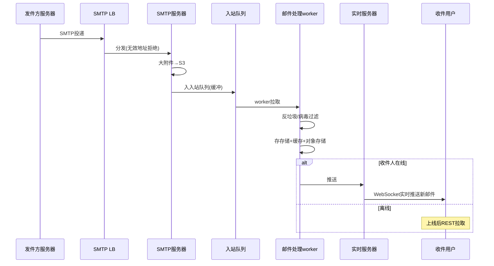
```mermaid
sequenceDiagram
    participant S as 发件方服务器
    participant LB as SMTP LB
    participant SS as SMTP服务器
    participant Q as 入站队列
    participant W as 邮件处理worker
    participant RT as 实时服务器
    participant U as 收件用户
    S->>LB: SMTP投递
    LB->>SS: 分发(无效地址拒绝)
    SS->>SS: 大附件→S3
    SS->>Q: 入入站队列(缓冲)
    Q->>W: worker拉取
    W->>W: 反垃圾/病毒过滤
    W->>W: 存存储+缓存+对象存储
    alt 收件人在线
        W->>RT: 推送
        RT->>U: WebSocket实时推送新邮件
    else 离线
        Note over U: 上线后REST拉取
    end
```

**接收流程**(背):
1. SMTP 投递 → SMTP LB → SMTP 服务器(无效地址直接拒,避免无谓处理)。
2. 大附件 → 附件存储(S3)。
3. 入**入站队列**(缓冲,削峰)。
4. 邮件处理 worker:**反垃圾/病毒过滤** → 存储层 + 缓存 + 对象存储。
5. 收件人在线 → 实时服务器 **WebSocket 推送**;离线 → 上线后 REST 拉。

> 💡 **队列是关键**:出站/入站队列**解耦 SMTP worker 与 web/SMTP 服务器**,各自独立扩缩;队列还做**削峰缓冲**(邮件量突增)。

---

## 4. 元数据建模 ⭐⭐⭐⭐⭐(本章难点)

### 4.1 邮件元数据特征

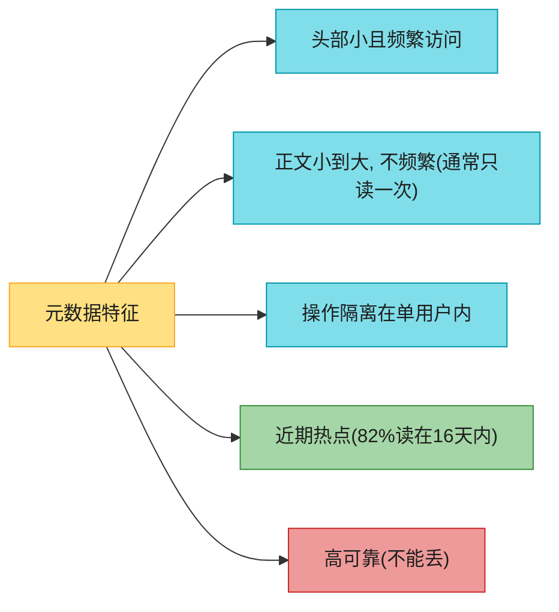
```mermaid
flowchart LR
    CH["元数据特征"] --> C1["头部小且频繁访问"]
    CH --> C2["正文小到大, 不频繁(通常只读一次)"]
    CH --> C3["操作隔离在单用户内"]
    CH --> C4["近期热点(82%读在16天内)"]
    CH --> C5["高可靠(不能丢)"]

    style CH fill:#FFE082,stroke:#F9A825,color:#1f1f1f
    style C1 fill:#80DEEA,stroke:#0097A7,color:#1f1f1f
    style C2 fill:#80DEEA,stroke:#0097A7,color:#1f1f1f
    style C3 fill:#80DEEA,stroke:#0097A7,color:#1f1f1f
    style C4 fill:#A5D6A7,stroke:#388E3C,color:#1f1f1f
    style C5 fill:#EF9A9A,stroke:#C62828,color:#1f1f1f
```

### 4.2 数据库选型(Gmail 规模要自定义)

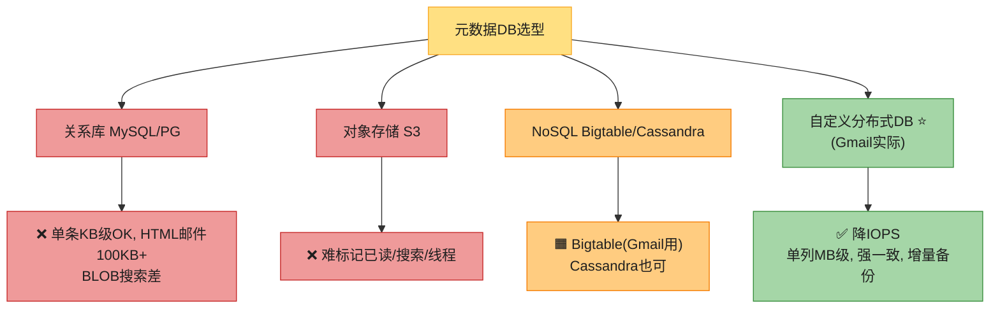
```mermaid
flowchart TD
    Q["元数据DB选型"] --> R["关系库 MySQL/PG"]
    Q --> O["对象存储 S3"]
    Q --> N["NoSQL Bigtable/Cassandra"]
    Q --> CUST["自定义分布式DB ⭐<br/>(Gmail实际)"]
    R --> RBAD["❌ 单条KB级OK, HTML邮件100KB+<br/>BLOB搜索差"]
    O --> OBAD["❌ 难标记已读/搜索/线程"]
    N --> NOK["🟧 Bigtable(Gmail用)<br/>Cassandra也可"]
    CUST --> CGOOD["✅ 降IOPS<br/>单列MB级, 强一致, 增量备份"]

    style Q fill:#FFE082,stroke:#F9A825,color:#1f1f1f
    style R fill:#EF9A9A,stroke:#C62828,color:#1f1f1f
    style O fill:#EF9A9A,stroke:#C62828,color:#1f1f1f
    style N fill:#FFCC80,stroke:#F57C00,color:#1f1f1f
    style CUST fill:#A5D6A7,stroke:#388E3C,color:#1f1f1f
    style RBAD fill:#EF9A9A,stroke:#C62828,color:#1f1f1f
    style OBAD fill:#EF9A9A,stroke:#C62828,color:#1f1f1f
    style NOK fill:#FFCC80,stroke:#F57C00,color:#1f1f1f
    style CGOOD fill:#A5D6A7,stroke:#388E3C,color:#1f1f1f
```

> 💡 **面试要点**:讲清**理想的元数据 DB 应有什么特性**(单列 MB 级、强一致、低 IOPS、高可用、增量备份),而非真设计一个。**大厂(Gmail)用自定义 DB**。

### 4.3 数据模型(分区键 + 聚类键)

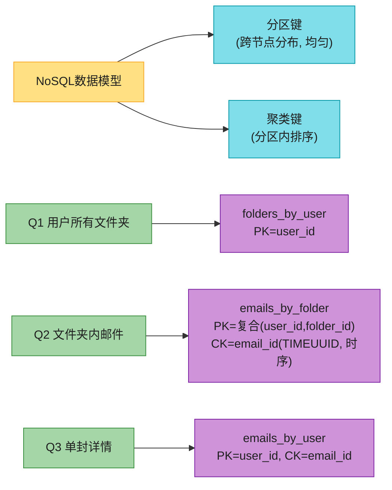
```mermaid
flowchart LR
    MODEL["NoSQL数据模型"] --> PK["分区键<br/>(跨节点分布, 均匀)"]
    MODEL --> CK["聚类键<br/>(分区内排序)"]
    Q1["Q1 用户所有文件夹"] --> T1["folders_by_user<br/>PK=user_id"]
    Q2["Q2 文件夹内邮件"] --> T2["emails_by_folder<br/>PK=复合(user_id,folder_id)<br/>CK=email_id(TIMEUUID, 时序)"]
    Q3["Q3 单封详情"] --> T3["emails_by_user<br/>PK=user_id, CK=email_id"]

    style MODEL fill:#FFE082,stroke:#F9A825,color:#1f1f1f
    style PK fill:#80DEEA,stroke:#0097A7,color:#1f1f1f
    style CK fill:#80DEEA,stroke:#0097A7,color:#1f1f1f
    style Q1 fill:#A5D6A7,stroke:#388E3C,color:#1f1f1f
    style T1 fill:#CE93D8,stroke:#7B1FA2,color:#1f1f1f
    style Q2 fill:#A5D6A7,stroke:#388E3C,color:#1f1f1f
    style T2 fill:#CE93D8,stroke:#7B1FA2,color:#1f1f1f
    style Q3 fill:#A5D6A7,stroke:#388E3C,color:#1f1f1f
    style T3 fill:#CE93D8,stroke:#7B1FA2,color:#1f1f1f
```

- **folders_by_user**:PK=user_id(同用户文件夹在一分区)。
- **emails_by_folder**:复合分区键 `<user_id, folder_id>`(同用户同文件夹邮件在一分区)+ 聚类键 `email_id`(TIMEUUID,时间排序)。
- **email_id 用 TIMEUUID**:天然时序排序(接 Vol.1 Ch7)。

### 4.4 反规范化:读/未读查询 ⭐⭐⭐(NoSQL 经典)

> 📝 **痛点**:**NoSQL 一般只支持分区键/聚类键查询**。`is_read` 既非分区键也非聚类键,`WHERE is_read=false` 查询会被拒。

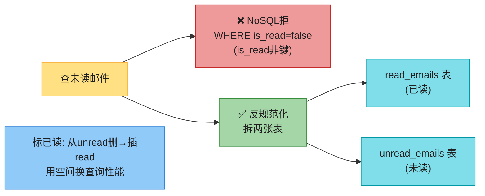
```mermaid
flowchart LR
    Q["查未读邮件"] --> BAD["❌ NoSQL拒<br/>WHERE is_read=false<br/>(is_read非键)"]
    Q --> DENORM["✅ 反规范化<br/>拆两张表"]
    DENORM --> T1["read_emails 表<br/>(已读)"]
    DENORM --> T2["unread_emails 表<br/>(未读)"]
    NOTE["标已读: 从unread删→插read<br/>用空间换查询性能"]

    style Q fill:#FFE082,stroke:#F9A825,color:#1f1f1f
    style BAD fill:#EF9A9A,stroke:#C62828,color:#1f1f1f
    style DENORM fill:#A5D6A7,stroke:#388E3C,color:#1f1f1f
    style T1 fill:#80DEEA,stroke:#0097A7,color:#1f1f1f
    style T2 fill:#80DEEA,stroke:#0097A7,color:#1f1f1f
    style NOTE fill:#90CAF9,stroke:#1976D2,color:#1f1f1f
```

**反规范化**(背):拆 `read_emails` + `unread_emails` 两表。**标已读 = 从 unread 删 + 插 read**。**用空间换查询性能**(NoSQL 常见手法)。

### 4.5 会话线程(JWZ 算法,加分点)

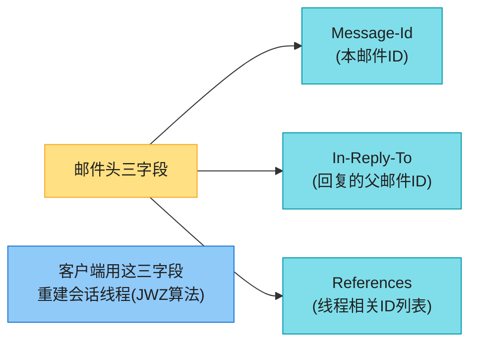
```mermaid
flowchart LR
    H["邮件头三字段"] --> M["Message-Id<br/>(本邮件ID)"]
    H --> IRT["In-Reply-To<br/>(回复的父邮件ID)"]
    H --> REF["References<br/>(线程相关ID列表)"]
    NOTE["客户端用这三字段<br/>重建会话线程(JWZ算法)"]

    style H fill:#FFE082,stroke:#F9A825,color:#1f1f1f
    style M fill:#80DEEA,stroke:#0097A7,color:#1f1f1f
    style IRT fill:#80DEEA,stroke:#0097A7,color:#1f1f1f
    style REF fill:#80DEEA,stroke:#0097A7,color:#1f1f1f
    style NOTE fill:#90CAF9,stroke:#1976D2,color:#1f1f1f
```

> 💡 **会话线程**:把回复和原邮件分组。靠邮件头的 **Message-Id / In-Reply-To / References** 三字段,用 **JWZ 算法**重建。**这是面试加分点**。

### 4.6 一致性权衡

> 📝 邮件**正确性极重要** → 设计**每个邮箱单 primary**(failover 时暂停访问,直到切换完成)。**牺牲可用性换一致性**(接 Vol.1 Ch1 CAP)。

---

## 5. 送达率(Deliverability)⭐⭐⭐⭐⭐(本章难点,现实最痛)

> 📝 **现实痛点**:**搭邮件服务器容易,让邮件真正进收件箱极难**。新 IP 没信誉 → 大概率进垃圾箱。**>50% 邮件是垃圾**(Statista)。

### 5.1 提高送达率的手段

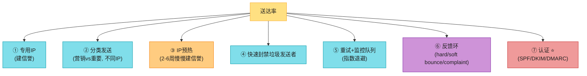
```mermaid
flowchart TD
    D["送达率"] --> A["① 专用IP<br/>(建信誉)"]
    D --> B["② 分类发送<br/>(营销vs重要, 不同IP)"]
    D --> C["③ IP预热<br/>(2-6周慢慢建信誉)"]
    D --> E["④ 快速封禁垃圾发送者"]
    D --> F["⑤ 重试+监控队列<br/>(指数退避)"]
    D --> G["⑥ 反馈环<br/>(hard/soft bounce/complaint)"]
    D --> H["⑦ 认证 ⭐<br/>(SPF/DKIM/DMARC)"]

    style D fill:#FFE082,stroke:#F9A825,color:#1f1f1f
    style A fill:#80DEEA,stroke:#0097A7,color:#1f1f1f
    style B fill:#80DEEA,stroke:#0097A7,color:#1f1f1f
    style C fill:#FFCC80,stroke:#F57C00,color:#1f1f1f
    style E fill:#80DEEA,stroke:#0097A7,color:#1f1f1f
    style F fill:#80DEEA,stroke:#0097A7,color:#1f1f1f
    style G fill:#CE93D8,stroke:#7B1FA2,color:#1f1f1f
    style H fill:#EF9A9A,stroke:#C62828,color:#1f1f1f
```

| 手段 | 说明 |
|------|------|
| **专用 IP** | 新 IP 无历史,ISP 不信任 |
| **分类发送** | 营销和重要邮件分 IP(避免营销污染重要) |
| **IP 预热** | 慢慢发,2-6 周建信誉(AWS SES) |
| **快速封垃圾** | 发送者信誉受损前封 |
| **重试 + 监控队列** | 指数退避;队列堆积要排查 |
| **反馈环** | 收 ISP 反馈,降低投诉率 |

### 5.2 反馈分类(独立队列)

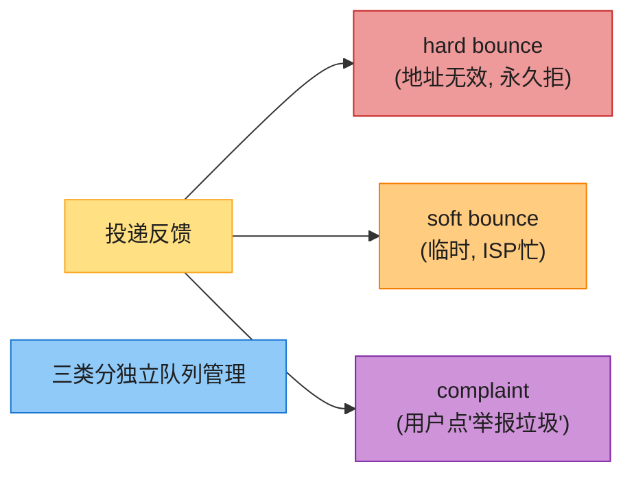
```mermaid
flowchart LR
    FB["投递反馈"] --> HB["hard bounce<br/>(地址无效, 永久拒)"]
    FB --> SB["soft bounce<br/>(临时, ISP忙)"]
    FB --> CP["complaint<br/>(用户点'举报垃圾')"]
    NOTE["三类分独立队列管理"]

    style FB fill:#FFE082,stroke:#F9A825,color:#1f1f1f
    style HB fill:#EF9A9A,stroke:#C62828,color:#1f1f1f
    style SB fill:#FFCC80,stroke:#F57C00,color:#1f1f1f
    style CP fill:#CE93D8,stroke:#7B1FA2,color:#1f1f1f
    style NOTE fill:#90CAF9,stroke:#1976D2,color:#1f1f1f
```

### 5.3 邮件认证(SPF / DKIM / DMARC)⭐⭐⭐(防钓鱼,93% 数据泄露来自钓鱼)

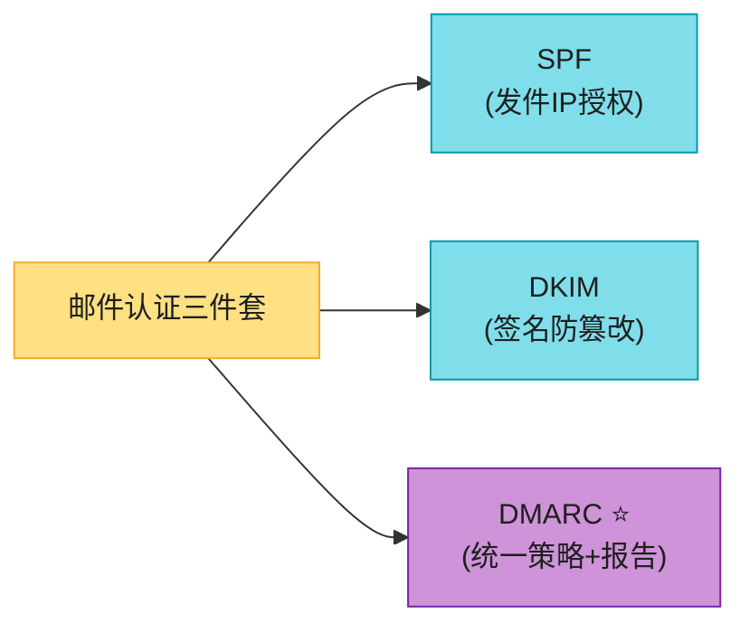
```mermaid
flowchart LR
    AUTH["邮件认证三件套"] --> SPF["SPF<br/>(发件IP授权)"]
    AUTH --> DKIM["DKIM<br/>(签名防篡改)"]
    AUTH --> DMARC["DMARC ⭐<br/>(统一策略+报告)"]

    style AUTH fill:#FFE082,stroke:#F9A825,color:#1f1f1f
    style SPF fill:#80DEEA,stroke:#0097A7,color:#1f1f1f
    style DKIM fill:#80DEEA,stroke:#0097A7,color:#1f1f1f
    style DMARC fill:#CE93D8,stroke:#7B1FA2,color:#1f1f1f
```

| 认证 | 作用 |
|------|------|
| **SPF(Sender Policy Framework)** | DNS 声明"哪些 IP 可代表本域发信" → 防伪造发件域 |
| **DKIM** | 邮件**签名**,收件方验签 → 防篡改 |
| **DMARC** ⭐ | **统一 SPF+DKIM 策略 + 失败报告** → 告诉收件方"验证失败怎么处理(拒/隔离/无)" |

> 🪤 **追问陷阱(高频)**:"怎么防钓鱼邮件?" → "**SPF + DKIM + DMARC 三件套**。SPF 授权发件 IP;DKIM 签名防篡改;DMARC 统一策略+报告。**93% 数据泄露来自钓鱼**(Verizon),这是邮件安全的地基。"

---

## 6. 搜索:Elasticsearch vs 原生

### 6.1 邮件搜索 vs Google 搜索

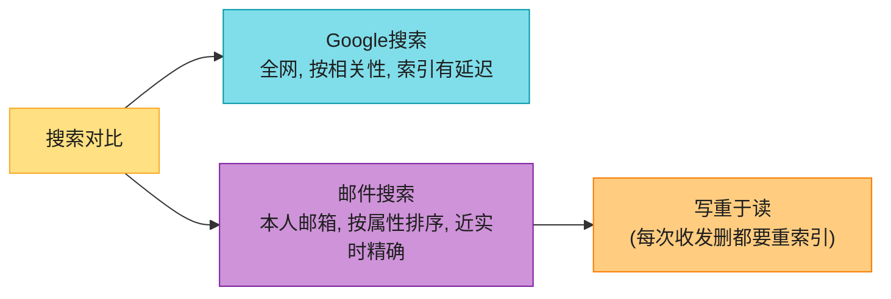
```mermaid
flowchart LR
    Q["搜索对比"] --> G["Google搜索<br/>全网, 按相关性, 索引有延迟"]
    Q --> E["邮件搜索<br/>本人邮箱, 按属性排序, 近实时精确"]
    E --> W["写重于读<br/>(每次收发删都要重索引)"]

    style Q fill:#FFE082,stroke:#F9A825,color:#1f1f1f
    style G fill:#80DEEA,stroke:#0097A7,color:#1f1f1f
    style E fill:#CE93D8,stroke:#7B1FA2,color:#1f1f1f
    style W fill:#FFCC80,stroke:#F57C00,color:#1f1f1f
```

**邮件搜索特点**:① 范围是**本人邮箱**;② 按属性排序(时间/附件/未读);③ **近实时精确**(不能漏);④ **写重于读**(每次收发删都重索引)。

### 6.2 两种方案

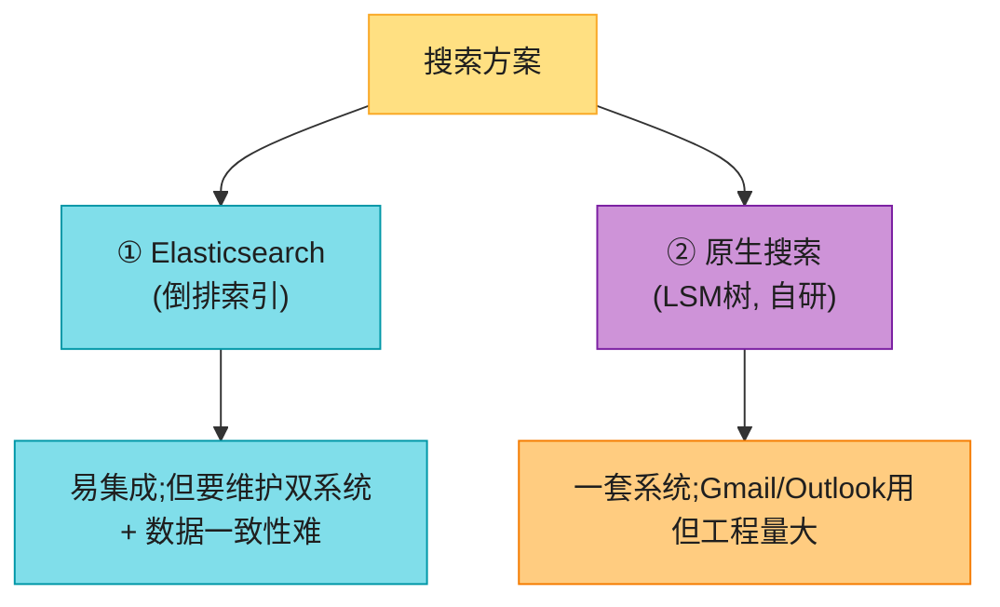
```mermaid
flowchart TD
    S["搜索方案"] --> ES["① Elasticsearch<br/>(倒排索引)"]
    S --> CUST["② 原生搜索<br/>(LSM树, 自研)"]
    ES --> ESP["易集成;但要维护双系统<br/>+ 数据一致性难"]
    CUST --> CUSTP["一套系统;Gmail/Outlook用<br/>但工程量大"]

    style S fill:#FFE082,stroke:#F9A825,color:#1f1f1f
    style ES fill:#80DEEA,stroke:#0097A7,color:#1f1f1f
    style CUST fill:#CE93D8,stroke:#7B1FA2,color:#1f1f1f
    style ESP fill:#80DEEA,stroke:#0097A7,color:#1f1f1f
    style CUSTP fill:#FFCC80,stroke:#F57C00,color:#1f1f1f
```

| 方案 | 机制 | 优劣 |
|------|------|------|
| **Elasticsearch** | 倒排索引;user_id 分区;Kafka 解耦重索引 | 易集成;但**双系统 + 一致性难** |
| **原生搜索** | **LSM 树**(写优化,顺序写);分离稳定邮件数据 vs 易变文件夹数据 | 一套系统;Gmail/Outlook 用;**但工程量大** |

> 📝 **LSM 树**(接 Vol.1 Ch6):写优化(只顺序写),是 Bigtable/Cassandra/RocksDB 的核心。邮件**写重于读** → LSM 适合。**分离频繁变化的文件夹信息 vs 稳定邮件数据**,文件夹变更只改文件夹部分。

> 💡 **选型经验**:**小规模用 Elasticsearch**(易);**Gmail/Outlook 规模用原生搜索**(嵌入式,免双系统同步)。

---

## 7. 扩展 + 可用性

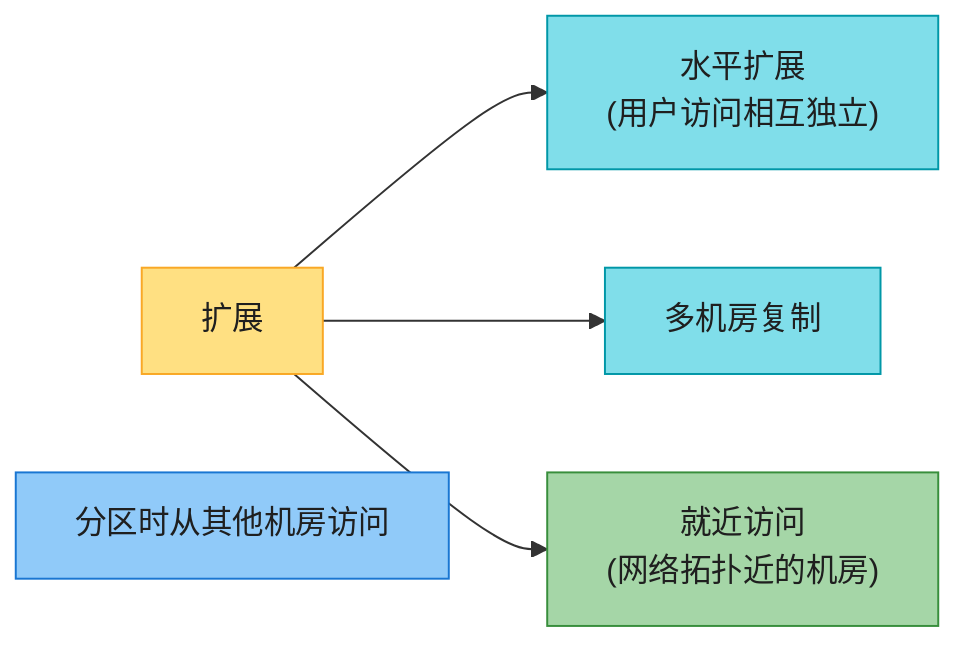
```mermaid
flowchart LR
    SCAL["扩展"] --> H["水平扩展<br/>(用户访问相互独立)"]
    SCAL --> R["多机房复制"]
    SCAL --> N["就近访问<br/>(网络拓扑近的机房)"]
    NOTE["分区时从其他机房访问"]

    style SCAL fill:#FFE082,stroke:#F9A825,color:#1f1f1f
    style H fill:#80DEEA,stroke:#0097A7,color:#1f1f1f
    style R fill:#80DEEA,stroke:#0097A7,color:#1f1f1f
    style N fill:#A5D6A7,stroke:#388E3C,color:#1f1f1f
    style NOTE fill:#90CAF9,stroke:#1976D2,color:#1f1f1f
```

> 💡 **邮件天然水平可扩展**(用户访问相互独立)。多机房复制 + 就近访问 + 分区容错(从其他机房访问)。

---

## 8. 2026 现代增量(原书没讲的硬核)⭐⭐⭐⭐⭐

### 8.1 JMAP:现代邮件客户端协议(取代 IMAP)⭐⭐⭐

原书用 HTTP/REST,但 **2026 现代邮件客户端协议是 JMAP**。

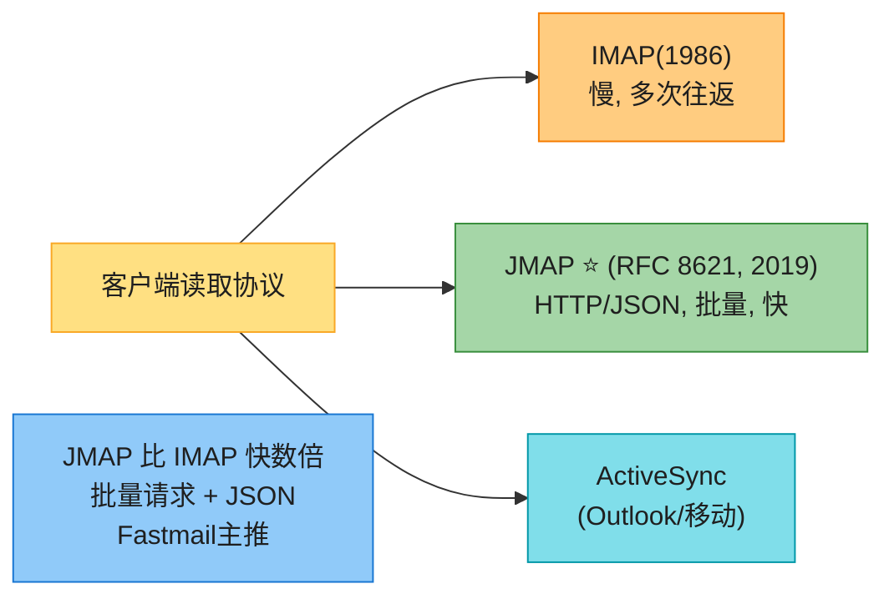
```mermaid
flowchart LR
    PROTO["客户端读取协议"] --> IMAP["IMAP(1986)<br/>慢, 多次往返"]
    PROTO --> JMAP["JMAP ⭐ (RFC 8621, 2019)<br/>HTTP/JSON, 批量, 快"]
    PROTO --> AS["ActiveSync<br/>(Outlook/移动)"]
    NOTE["JMAP 比 IMAP 快数倍<br/>批量请求 + JSON<br/>Fastmail主推"]

    style PROTO fill:#FFE082,stroke:#F9A825,color:#1f1f1f
    style IMAP fill:#FFCC80,stroke:#F57C00,color:#1f1f1f
    style JMAP fill:#A5D6A7,stroke:#388E3C,color:#1f1f1f
    style AS fill:#80DEEA,stroke:#0097A7,color:#1f1f1f
    style NOTE fill:#90CAF9,stroke:#1976D2,color:#1f1f1f
```

> 🔄 **2026 现代版话术**(原书用 HTTP/REST):
> "原书假设客户端用 HTTP。但**现代邮件客户端协议是 JMAP(RFC 8621,2019)**——HTTP/JSON、批量请求,**比 IMAP 快数倍**(IMAP 多次往返慢)。Fastmail/Cyrus 主推。Apache James 也支持 JMAP over WebSocket。**说一句 JMAP = 知道 2026 邮件协议演进**。"

### 8.2 Gmail 的真实栈(原书"自定义DB")

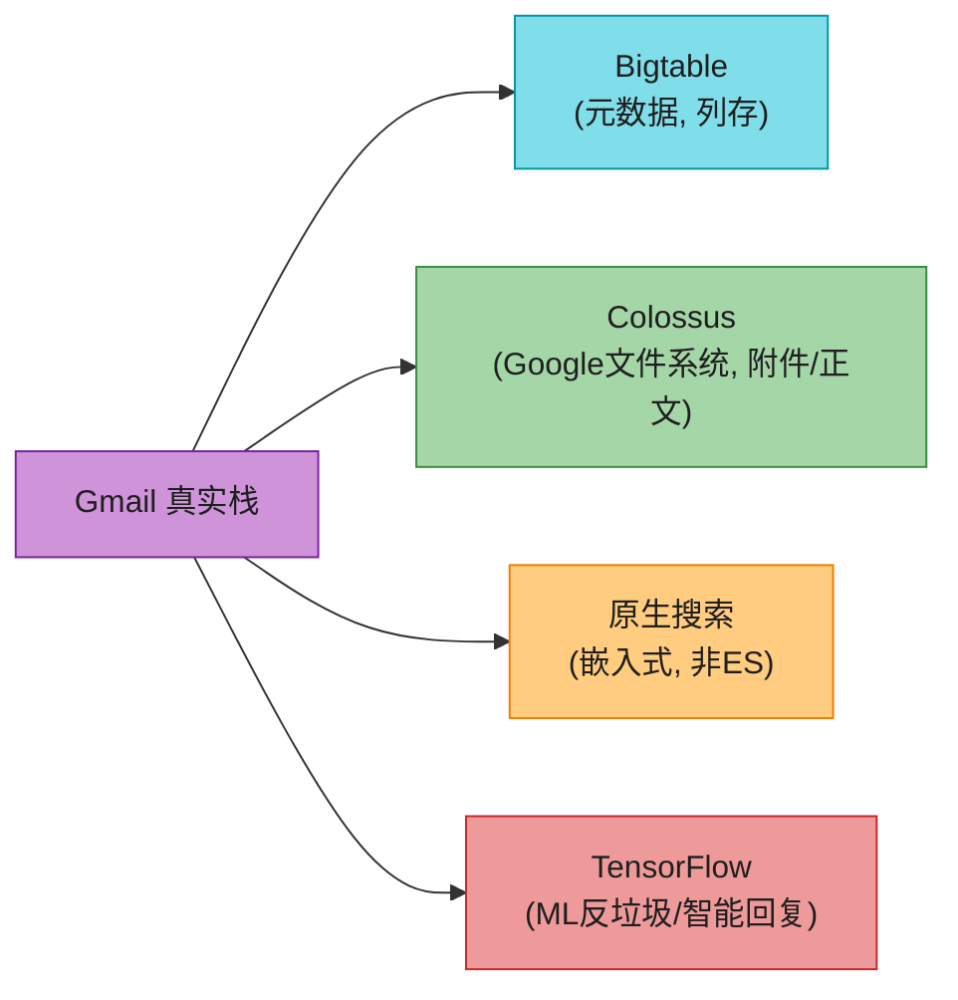
```mermaid
flowchart LR
    G["Gmail 真实栈"] --> B["Bigtable<br/>(元数据, 列存)"]
    G --> C["Colossus<br/>(Google文件系统, 附件/正文)"]
    G --> S["原生搜索<br/>(嵌入式, 非ES)"]
    G --> ML["TensorFlow<br/>(ML反垃圾/智能回复)"]

    style G fill:#CE93D8,stroke:#7B1FA2,color:#1f1f1f
    style B fill:#80DEEA,stroke:#0097A7,color:#1f1f1f
    style C fill:#A5D6A7,stroke:#388E3C,color:#1f1f1f
    style S fill:#FFCC80,stroke:#F57C00,color:#1f1f1f
    style ML fill:#EF9A9A,stroke:#C62828,color:#1f1f1f
```

> 💡 **话术**:"原书说 Gmail 用'自定义 DB'。实际是 **Bigtable(元数据)+ Colossus(GFS,附件/正文)+ 原生搜索(嵌入式,不依赖 ES)+ TensorFlow(ML 反垃圾/智能回复)**。**Gmail 把搜索嵌进存储层,免双系统同步**——这是 Gmail 规模的工程取舍。"

### 8.3 ML 反垃圾(原书只说"过滤")

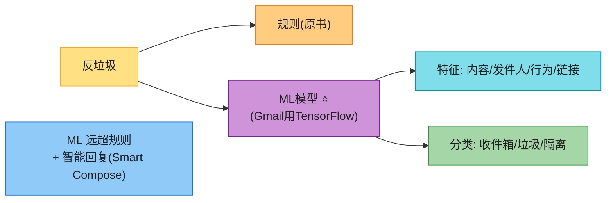
```mermaid
flowchart LR
    SPAM["反垃圾"] --> RULE["规则(原书)"]
    SPAM --> ML["ML模型 ⭐<br/>(Gmail用TensorFlow)"]
    ML --> FEAT["特征: 内容/发件人/行为/链接"]
    ML --> RES["分类: 收件箱/垃圾/隔离"]
    NOTE["ML 远超规则<br/>+ 智能回复(Smart Compose)"]

    style SPAM fill:#FFE082,stroke:#F9A825,color:#1f1f1f
    style RULE fill:#FFCC80,stroke:#F57C00,color:#1f1f1f
    style ML fill:#CE93D8,stroke:#7B1FA2,color:#1f1f1f
    style FEAT fill:#80DEEA,stroke:#0097A7,color:#1f1f1f
    style RES fill:#A5D6A7,stroke:#388E3C,color:#1f1f1f
    style NOTE fill:#90CAF9,stroke:#1976D2,color:#1f1f1f
```

> 💡 **Gmail 用 TensorFlow 做反垃圾**(99.9% 拦截)+ Smart Compose/Reply(智能回复)。原书只说"过滤",2026 是 ML 主场。

### 8.4 其它 2026 增量

| 技术 | 说明 |
|------|------|
| **BIMI** | 品牌标识(邮件旁显示公司 logo),基于 DMARC |
| **ARC** | Authenticated Received Chain,邮件转发链的认证(避免转发被判垃圾) |
| **E2EE(PGP/S-MIME)** | 端到端加密;Gmail confidential mode(阅后即焚/禁止转发) |
| **附件去重** ⭐ | 群发同附件只存一份(内容寻址 hash),省 PB 级存储 |
| **冷存储分层** | 老邮件上冷存(Gmail 这样做);82% 读在 16 天内 → 近期热 |

---

## ⚠️ 已过时 / 书里没说(2022 → 2026)

| 原书(2022) | 2026 现状 | 面试应对 |
|------------|----------|---------|
| HTTP/REST 客户端 | **JMAP**(RFC 8621,取代 IMAP) | 讲 JMAP 比 IMAP 快 |
| Gmail "自定义DB" | **Bigtable + Colossus + 原生搜索** | 讲真实栈 |
| 反垃圾只说"过滤" | **ML(TensorFlow)** 反垃圾 + Smart Compose | 讲 ML 超规则 |
| 认证只 SPF/DKIM/DMARC | + **BIMI/ARC** | 讲品牌标识 + 转发链 |
| 附件去重收尾一句 | **内容寻址去重**(群发场景) | 讲省 PB 级存储 |
| 没提冷存 | **老邮件冷存储分层** | 讲 Gmail 冷热分层 |
| 没提 E2EE | **PGP/S-MIME/confidential mode** | 讲端到端加密 |
| 没提合规 | **GDPR/PII/合法监听** | 讲数据本地化 |

---

## 💻 代码示例

### 示例 1:邮件 API(RESTful)

```python
# 发邮件
POST /v1/messages
{ "from":{"name":"Alice","email":"a@x.com"},
  "to":[{"name":"Bob","email":"b@y.com"}],
  "subject":"hi", "body":"...", "attachments":["s3://..."] }

# 文件夹列表(GET /v1/folders) → 默认: All/Archive/Drafts/Flagged/Junk/Sent/Trash
# 文件夹内邮件(分页, 支持连续1-50/范围73-87)
GET /v1/folders/{folder_id}/messages?from=1&to=50
# 单封详情
GET /v1/messages/{message_id}
```

### 示例 2:反规范化读/未读(CQL)

```sql
-- 反规范化: 读/未读分两表(NoSQL只能查键)
CREATE TABLE unread_emails (
    user_id uuid, folder_id uuid, email_id timeuuid,  -- TIMEUUID时序排序
    subject text, from_email text,
    PRIMARY KEY ((user_id, folder_id), email_id)
);
CREATE TABLE read_emails ( /* 同结构 */ );

-- 标已读: 原子删unread + 插read
BEGIN BATCH
  DELETE FROM unread_emails WHERE user_id=? AND folder_id=? AND email_id=?;
  INSERT INTO read_emails (...) VALUES (...);
APPLY BATCH;
-- 查未读: 直接查unread_emails(无需WHERE is_read, NoSQL支持)
SELECT * FROM unread_emails WHERE user_id=? AND folder_id=? ORDER BY email_id;
```

### 示例 3:发送重试(指数退避)

```python
def send_smtp_with_retry(email, recipient_server):
    for attempt in range(MAX_RETRIES):
        try:
            smtp.deliver(email, recipient_server)
            return "sent"
        except (ConnectionError, ServerBusy) as e:
            backoff = min(2 ** attempt, 3600)   # 指数退避, 上限1小时
            time.sleep(backoff + random.uniform(0, 60))  # 加抖动
        except InvalidAddress:
            mq.publish("hard_bounce_queue", email)   # 永久失败→hard bounce队列
            return "bounced"
    mq.publish("soft_bounce_queue", email)  # 重试耗尽→soft bounce
    return "failed"
```

---

## 🪤 追问陷阱(面试官最爱问,本章集)

1. **"SMTP/POP/IMAP 区别?"** → SMTP 服务器间发送;POP 下载后删(单设备);**IMAP 留服务器多设备**(主流)。
2. **"邮件怎么找到收件服务器?"** → **DNS MX 记录**(带优先级,低的优先)。
3. **"附件怎么存?"** → **S3 对象存储**(大文件;Cassandra 不适合:blob 实际<1MB + 占行缓存)。元数据和附件分离。
4. **"为什么用队列?"** → 出站/入站队列**解耦 SMTP worker 与 web/SMTP 服务器**,各自扩缩 + 削峰缓冲。
5. **"同域邮件要走出站队列吗?"** → **不用**(同域快捷:直接入收件人存储)。
6. **"邮件实时推送怎么做?"** → 实时服务器 **WebSocket**(在线);离线存存储,上线 REST 拉(接 Vol.1 Ch12)。
7. **"Gmail 用什么存元数据?"** → **自定义分布式 DB**(Gmail 用 Bigtable)。关系库 BLOB 搜索差,对象存储难标记已读。
8. **"NoSQL 怎么查未读邮件?"** → **反规范化**:拆 read_emails + unread_emails 两表(NoSQL 只查分区/聚类键,is_read 不是键)。
9. **"邮件会话线程怎么实现?"** → 邮件头 Message-Id/In-Reply-To/References 三字段 + **JWZ 算法**。
10. **"为什么新邮件服务器发的邮件进垃圾箱?"** → **新 IP 没信誉**。要**专用 IP + 预热 2-6 周 + 分类发送**。
11. **"怎么防钓鱼?"** → **SPF + DKIM + DMARC**。SPF 授权 IP;DKIM 签名防篡改;DMARC 统一策略+报告。
12. **"hard bounce 和 soft bounce 区别?"** → hard=地址无效(永久拒);soft=临时(ISP 忙)。分独立队列。
13. **"邮件搜索用什么?"** → 小规模 **Elasticsearch**(倒排索引);Gmail 规模用**原生搜索(LSM 树,嵌入式)**免双系统同步。
14. **"邮件搜索 vs Google 搜索?"** → 邮件搜本人邮箱/按属性/近实时精确/写重于读;Google 搜全网/按相关性/索引有延迟。
15. **"2026 客户端协议?"** → **JMAP**(RFC 8621,HTTP/JSON,比 IMAP 快数倍)。
16. **"群发同附件怎么省存储?"** → **内容寻址去重**(hash 相同只存一份),省 PB 级。
17. **"邮件一致性怎么保证?"** → 每邮箱**单 primary**,failover 暂停访问(牺牲可用换一致)。

---

## 🏭 生产级产品速查表

| 产品 | 特色 |
|------|------|
| **Gmail** | Bigtable+Colossus+原生搜索+TensorFlow;18亿用户 |
| **Outlook** | ActiveSync;Exchange 原生搜索 |
| **Yahoo / QQ邮箱** | 大规模;QQ 邮箱有中文优化分享(82% 读 16 天内数据) |
| **Fastmail / Cyrus** | **JMAP 主推**(现代协议) |
| **Apache James** | 开源邮件服务器,支持 JMAP over WebSocket |
| **AWS SES / SendGrid** | 邮件发送服务(送达率/IP 预热托管) |

> 🏭 **业界标杆**:**Gmail** 是本题原型(Bigtable+Colossus+原生搜索);**QQ 邮箱**的优化分享(82% 读在 16 天内)是数据特征的经典数据(原书引用);**JMAP** 是 2026 现代邮件协议方向。

---

## 📝 本章要点总结

```mermaid
flowchart LR
    ROOT(["V2-Ch8 分布式邮件<br/>存储极重 + 异步投递 + 送达率"])

    B1["需求+估算 ⭐<br/>────────<br/>• 10亿用户<br/>• 730PB元数据/年<br/>• 存储极重型"]
    B2["协议+架构 ⭐⭐<br/>────────<br/>• SMTP/POP/IMAP/JMAP<br/>• web服务器+实时+DB+S3+搜索<br/>• 收发异步队列"]
    B3["元数据建模 ⭐⭐⭐<br/>────────<br/>• 自定义DB(Bigtable)<br/>• 反规范化读/未读<br/>• 会话线程(JWZ)"]
    B4["搜索 ⭐<br/>────────<br/>• Elasticsearch(小)<br/>• 原生LSM(Gmail规模)<br/>• 写重于读"]
    B5["送达率 ⭐⭐⭐<br/>────────<br/>• IP预热+分类<br/>• 反馈环(bounce/complaint)<br/>• SPF/DKIM/DMARC"]
    B6["2026增量(补)<br/>────────<br/>• JMAP取代IMAP<br/>• Gmail真实栈/ML反垃圾<br/>• 去重/冷存/BIMI/ARC"]

    ROOT --> B1
    ROOT --> B2
    ROOT --> B3
    ROOT --> B4
    ROOT --> B5
    ROOT --> B6

    style ROOT fill:#FFE082,stroke:#F57C00,color:#1f1f1f,stroke-width:3px
    style B1 fill:#80DEEA,stroke:#0097A7,color:#1f1f1f
    style B2 fill:#CE93D8,stroke:#7B1FA2,color:#1f1f1f
    style B3 fill:#EF9A9A,stroke:#C62828,color:#1f1f1f
    style B4 fill:#90CAF9,stroke:#1976D2,color:#1f1f1f
    style B5 fill:#FFCC80,stroke:#F57C00,color:#1f1f1f
    style B6 fill:#A5D6A7,stroke:#388E3C,color:#1f1f1f
```

**核心 Takeaways**:

1. **邮件是存储极重型**(730PB元数据/年)——架构核心是存储优化:分布式元数据DB + 附件S3 + 去重 + 冷热分层。
2. **协议**:SMTP 服务器间发送;**IMAP 客户端读取主流**(多设备);DNS MX 定位收件服务器;附件 Base64+MIME。
3. **收发异步队列解耦**——出站/入站队列削峰 + 各自扩缩;同域邮件走快捷路径不走出站。
4. **实时推送**靠 WebSocket(在线);离线存存储上线 REST 拉(接 Vol.1 Ch12)。
5. **元数据建模**:Gmail 用自定义 DB(Bigtable);**反规范化**解决 NoSQL 读/未读查询(拆两表);**JWZ 会话线程**靠 Message-Id/In-Reply-To/References。
6. **每邮箱单 primary** 牺牲可用换一致(邮件正确性极重要)。
7. **送达率是现实最痛**——新 IP 没信誉要预热 2-6 周 + 分类发送 + 反馈环(hard/soft bounce/complaint)。
8. **防钓鱼三件套**:SPF(IP授权)+ DKIM(签名)+ DMARC(策略+报告);93% 数据泄露来自钓鱼。
9. **搜索**:小规模 Elasticsearch;Gmail 规模用原生 LSM(嵌入式,免双系统同步);邮件搜索写重于读。
10. **2026:JMAP 取代 IMAP**(HTTP/JSON 快数倍);Gmail 真实栈(Bigtable+Colossus+原生搜索+TensorFlow ML);附件去重省 PB;冷存储分层。

> 🔗 **连接上下章**:**V2-Ch7 酒店预订**(强一致并发)是"交易系统";**V2-Ch8 分布式邮件**是"存储极重 + 异步可靠投递"——从交易切到异步消息传递。**V2-Ch9 对象存储(S3)**把本章的附件存储深化——从"邮件附件"抽象到"通用 PB 级对象存储"(EC 纠删码 + 多副本)。
