# Volume 2 · Chapter 9: 设计对象存储 (Design an S3-like Object Storage)

> 📑 **导航**:[← 邮件服务](ch2_08-设计分布式邮件服务.md) · [📚 总目录](../README.md) · [排行榜 →](ch2_10-设计游戏排行榜.md)
> 🔗 **相关**:[YouTube](../SDE-Vol1/ch1_14-设计YouTube.md) · [Drive](../SDE-Vol1/ch1_15-设计GoogleDrive.md) · [AWS存储](../SDA/aws_10-AWS存储服务.md)


> **本章定位**:对象存储是**"海量不可变数据 + 极致持久性 + 低成本"**的基础设施题——它是 AWS S3 的设计骨架。它把 Vol.1 Ch6 的存储引擎(LSM/B+树)、Vol.1 Ch5 的哈希一致性、Vol.2 Ch4 的一致性协议全用上。灵魂是六件事:**① 元数据和数据分离(inode 思想)② 小对象合并成大文件(WAL 思想)③ 持久性靠多副本/纠删码(6-11 个 9)④ 失败域隔离(机架/AZ)⑤ 数据校验(checksum)⑥ 海量元数据分片**。它是少有的"CAP 里宁可牺牲性能也要耐久性和成本"的系统——为冷数据而生。

> **本章和原书的区别**:原书把**对象存储的高层架构、数据节点小对象合并、元数据分片、版本化、multipart、垃圾回收 compaction**讲得相当完整——存储 101、bucket/object 概念、6 个 9 持久性、3 副本 vs 纠删码、checksum、SQLite 存 object_mapping,都覆盖,是面试标准答案。但**主用 3 副本(说纠删码"复杂度高")**——而 **2026 真实 S3 主力是纠删码**(成本和 11 个 9 持久性碾压);**checksum 用 MD5**——而 **S3 自 2022 起支持 CRC32/CRC32C/SHA-1/SHA-256,MD5 已弱**;**没提 Facebook Haystack/f4**(本题的设计原型论文);**没提强一致**——而 **S3 2020.12 起默认强一致(read-after-write)**,原书还在说"最终一致是可接受的";**没提分级存储**(Glacier 冷存/Intelligent-Tiering);**没提 S3 Select / Object Lambda / S3 Tables**。本章补上。

---

## 🎯 面试怎么答(被问到"设计 S3 / 对象存储"时)

**开场话术**(直接背):

> "对象存储我先确认四件事:① 规模(100PB/年)?② 要哪些功能(上传/下载/版本化/list)?③ 持久性和可用性 SLA(6 个 9 / 4 个 9)?④ 对象大小分布(小到 KB 大到 GB)?然后按 **存储 101(block/file/object 区别)→ 高层架构(LB+API+IAM+元数据DB+数据节点)→ 数据节点设计(小对象合并 WAL + object_lookup)→ 持久性(3 副本 vs 纠删码 + 失败域 + checksum)→ 元数据分片(hash bucket+object name)** 五块讲。核心抉择是 **数据/元数据分离** + **持久性(副本 vs 纠删码)**。"

**4 步推进**:

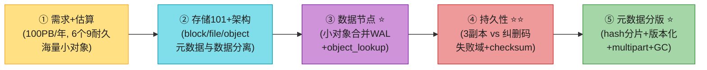
```mermaid
flowchart LR
    S1["① 需求+估算<br/>(100PB/年, 6个9耐久<br/>海量小对象)"] --> S2["② 存储101+架构<br/>(block/file/object<br/>元数据与数据分离)"]
    S2 --> S3["③ 数据节点 ⭐<br/>(小对象合并WAL<br/>+object_lookup)"]
    S3 --> S4["④ 持久性 ⭐⭐<br/>(3副本 vs 纠删码<br/>失败域+checksum)"]
    S4 --> S5["⑤ 元数据分版 ⭐<br/>(hash分片+版本化<br/>+multipart+GC)"]

    style S1 fill:#FFE082,stroke:#F9A825,color:#1f1f1f
    style S2 fill:#80DEEA,stroke:#0097A7,color:#1f1f1f
    style S3 fill:#CE93D8,stroke:#7B1FA2,color:#1f1f1f
    style S4 fill:#EF9A9A,stroke:#C62828,color:#1f1f1f
    style S5 fill:#A5D6A7,stroke:#388E3C,color:#1f1f1f
```

> 💡 **Step 1 关键**:**对象存储是存储极重型**——100PB/年、0.68 亿对象、元数据 0.68TB。架构核心是 **数据/元数据分离**(inode 思想)。
>
> 💡 **关键信号词**:**"对象不可变(write once read many,95% 读)"** + **"元数据和数据分离(类 UNIX inode)"** + **"持久性靠 3 副本或纠删码(6-11 个 9)+ 失败域隔离 + checksum 校验"**——这三句直接拿下面试。

---

## 🗺️ 章节概览

| 小节 | 要点 | 重要性 |
|------|------|--------|
| 需求 + 估算 | 100PB/年、**6 个 9 耐久 / 4 个 9 可用**、0.68 亿对象 | ⭐⭐⭐⭐ |
| **存储 101** | block / file / object 对比 | ⭐⭐⭐⭐⭐ |
| **高层架构** | LB+API+IAM+元数据DB+数据节点 | ⭐⭐⭐⭐⭐ |
| **数据节点设计 ⭐⭐⭐** | 小对象合并(WAL)+ object_lookup + 一致性-延迟权衡 | ⭐⭐⭐⭐⭐ |
| **持久性 ⭐⭐⭐** | 3 副本 vs 纠删码 + 失败域 + checksum | ⭐⭐⭐⭐⭐ |
| **元数据建模 ⭐⭐** | bucket/object schema + hash 分片 + listing | ⭐⭐⭐⭐ |
| 版本化 + multipart + GC | TIMEUUID 版本 + 分段上传 + compaction | ⭐⭐⭐⭐ |
| **2026增量(补)** | 纠删码为主、强一致、Haystack/f4、分级存储、S3 Select/Tables | ⭐⭐⭐⭐⭐ |

---

## 1. 需求 + 估算

**澄清问题**(原书对话):

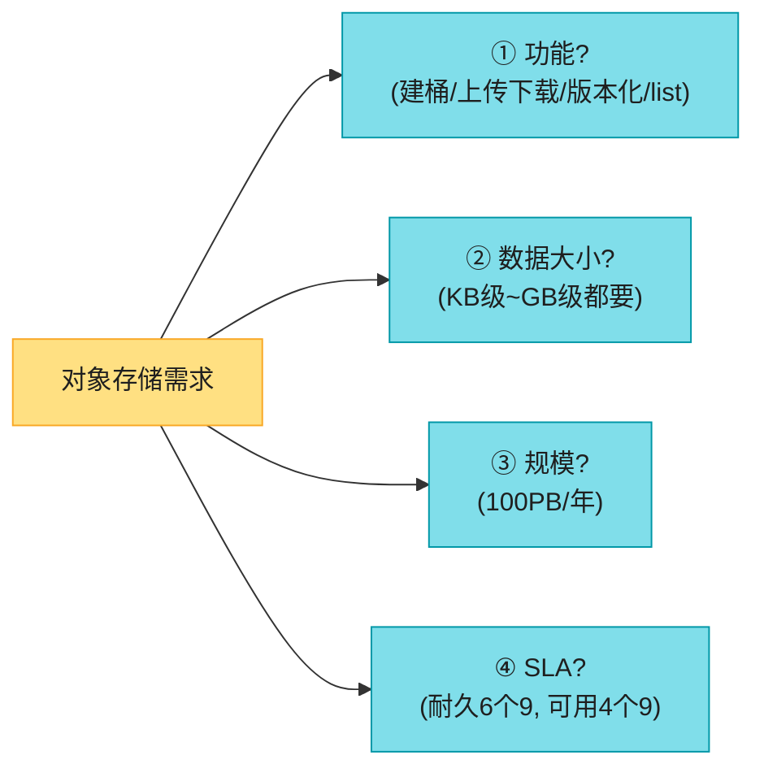
```mermaid
flowchart LR
    Q["对象存储需求"] --> A["① 功能?<br/>(建桶/上传下载/版本化/list)"]
    Q --> B["② 数据大小?<br/>(KB级~GB级都要)"]
    Q --> C["③ 规模?<br/>(100PB/年)"]
    Q --> D["④ SLA?<br/>(耐久6个9, 可用4个9)"]

    style Q fill:#FFE082,stroke:#F9A825,color:#1f1f1f
    style A fill:#80DEEA,stroke:#0097A7,color:#1f1f1f
    style B fill:#80DEEA,stroke:#0097A7,color:#1f1f1f
    style C fill:#80DEEA,stroke:#0097A7,color:#1f1f1f
    style D fill:#80DEEA,stroke:#0097A7,color:#1f1f1f
```

**功能**:建桶 / 上传下载对象 / 版本化 / 列桶内对象(类似 `aws s3 ls`)。

**非功能性**:**100PB 数据**;耐久 **6 个 9(99.9999%)**;可用 **4 个 9(99.99%)**;**存储效率**(降本同时高可靠)。

**估算**(背):

```
对象大小分布: 20%小(<1MB), 60%中(1~64MB), 20%大(>64MB)
取中位数: 0.5MB / 32MB / 200MB, 40%存储利用率
100PB = 10^11 MB
对象总数 = (10^11 × 0.4) / (0.2×0.5 + 0.6×32 + 0.2×200) = 0.68 亿
元数据(每对象1KB) = 0.68 TB
单盘 SATA 7200rpm: 100~150 IOPS
→ 数据节点合并小对象(降IOPS), 元数据分片(0.68TB超单机)
```

> 💡 **核心洞察**:**小对象是 IOPS 杀手**——百万级小文件浪费盘块 + 耗尽 inode。**必须合并成大文件**。

---

## 2. 存储 101:Block / File / Object ⭐⭐⭐⭐⭐

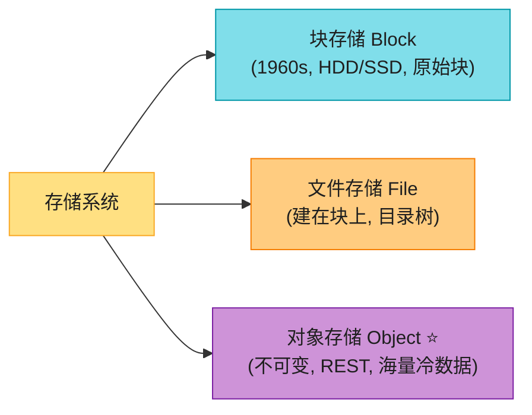
```mermaid
flowchart LR
    ST["存储系统"] --> BLK["块存储 Block<br/>(1960s, HDD/SSD, 原始块)"]
    ST --> FIL["文件存储 File<br/>(建在块上, 目录树)"]
    ST --> OBJ["对象存储 Object ⭐<br/>(不可变, REST, 海量冷数据)"]

    style ST fill:#FFE082,stroke:#F9A825,color:#1f1f1f
    style BLK fill:#80DEEA,stroke:#0097A7,color:#1f1f1f
    style FIL fill:#FFCC80,stroke:#F57C00,color:#1f1f1f
    style OBJ fill:#CE93D8,stroke:#7B1FA2,color:#1f1f1f
```

| 维度 | 块存储 | 文件存储 | **对象存储** ⭐ |
|------|--------|---------|----------------|
| **可变性** | 可变 | 可变 | **不可变**(版本化,无原地更新) |
| **成本** | 高 | 中高 | **低** |
| **性能** | 中高/极高 | 中高 | **低-中** |
| **一致性** | 强 | 强 | **强**(2020 起) |
| **访问** | SAS/iSCSI/FC | NFS/CIFS/SMB | **RESTful API** |
| **可扩展** | 中 | 高 | **海量** |
| **适用** | VM、数据库、高性能应用 | 通用文件共享 | **二进制/非结构化冷数据** |

> 📝 **对象存储的"刻意取舍"**:**牺牲性能换极高耐久 + 海量 + 低成本**。面向"冷数据"(归档/备份/图片视频),不面向热数据库。

**核心术语**:
- **Bucket(桶)**:逻辑容器,**桶名全局唯一**;上传对象前必须先建桶。
- **Object(对象)**:= 数据(payload)+ 元数据(name-value 对)。
- **Versioning(版本化)**:桶级开关,保留多版本(防误删/覆盖)。
- **URI**:资源唯一标识(RESTful 访问)。
- **SLA**:例 S3 Standard-IA,**11 个 9 耐久**(跨多 AZ),**99.9% 可用**。

---

## 3. 高层架构 ⭐⭐⭐⭐⭐

### 3.1 设计哲学:类 UNIX 文件系统(inode)

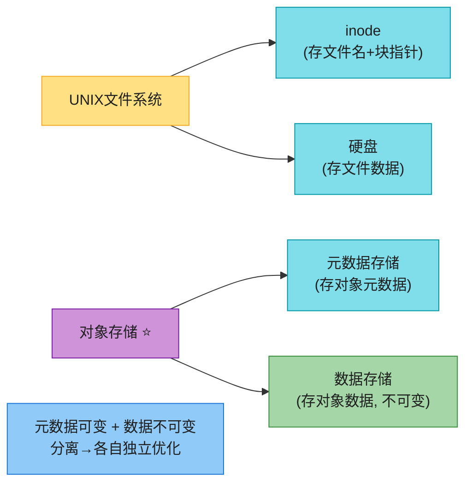
```mermaid
flowchart LR
    UNX["UNIX文件系统"] --> INO["inode<br/>(存文件名+块指针)"]
    UNX --> DISK["硬盘<br/>(存文件数据)"]
    OBJ["对象存储 ⭐"] --> META["元数据存储<br/>(存对象元数据)"]
    OBJ --> DATA["数据存储<br/>(存对象数据, 不可变)"]
    NOTE["元数据可变 + 数据不可变<br/>分离→各自独立优化"]

    style UNX fill:#FFE082,stroke:#F9A825,color:#1f1f1f
    style INO fill:#80DEEA,stroke:#0097A7,color:#1f1f1f
    style DISK fill:#80DEEA,stroke:#0097A7,color:#1f1f1f
    style OBJ fill:#CE93D8,stroke:#7B1FA2,color:#1f1f1f
    style META fill:#80DEEA,stroke:#0097A7,color:#1f1f1f
    style DATA fill:#A5D6A7,stroke:#388E3C,color:#1f1f1f
    style NOTE fill:#90CAF9,stroke:#1976D2,color:#1f1f1f
```

> 💡 **核心思想**:**元数据(可变)和对象数据(不可变)分离**——就像 UNIX 把 inode 和数据块分开。这让我们**独立优化**两者(元数据用关系库/分片,数据用 WAL 合并 + 多副本)。

### 3.2 组件

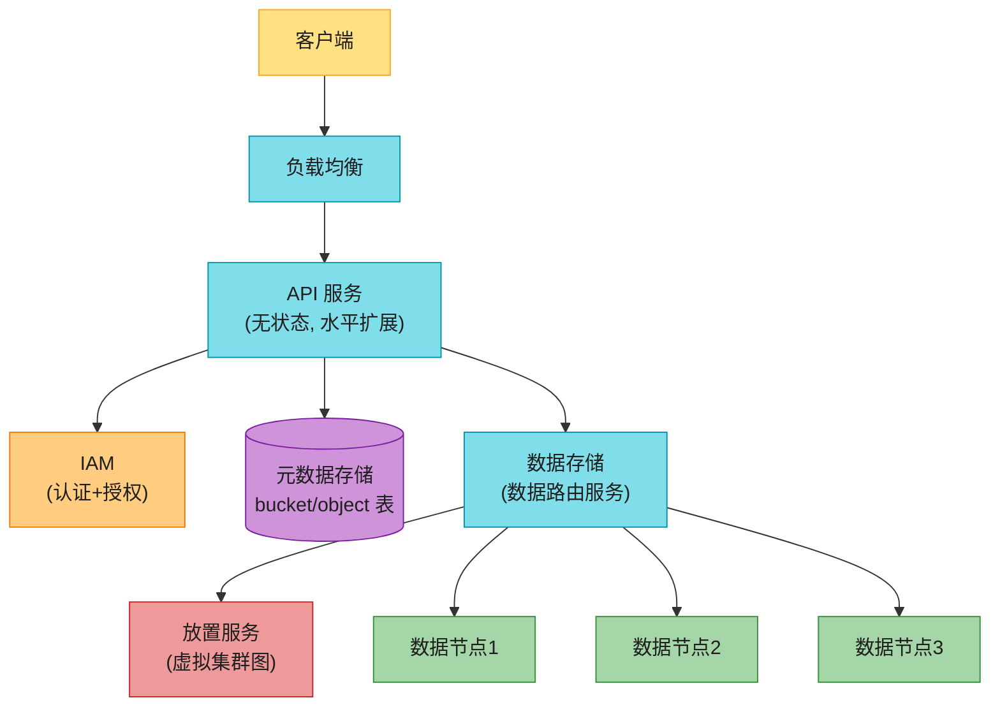
```mermaid
flowchart TB
    C["客户端"] --> LB["负载均衡"]
    LB --> API["API 服务<br/>(无状态, 水平扩展)"]
    API --> IAM["IAM<br/>(认证+授权)"]
    API --> META[("元数据存储<br/>bucket/object 表")]
    API --> DS["数据存储<br/>(数据路由服务)"]
    DS --> PL["放置服务<br/>(虚拟集群图)"]
    DS --> DN1["数据节点1"]
    DS --> DN2["数据节点2"]
    DS --> DN3["数据节点3"]

    style C fill:#FFE082,stroke:#F9A825,color:#1f1f1f
    style LB fill:#80DEEA,stroke:#0097A7,color:#1f1f1f
    style API fill:#80DEEA,stroke:#0097A7,color:#1f1f1f
    style IAM fill:#FFCC80,stroke:#F57C00,color:#1f1f1f
    style META fill:#CE93D8,stroke:#7B1FA2,color:#1f1f1f
    style DS fill:#80DEEA,stroke:#0097A7,color:#1f1f1f
    style PL fill:#EF9A9A,stroke:#C62828,color:#1f1f1f
    style DN1 fill:#A5D6A7,stroke:#388E3C,color:#1f1f1f
    style DN2 fill:#A5D6A7,stroke:#388E3C,color:#1f1f1f
    style DN3 fill:#A5D6A7,stroke:#388E3C,color:#1f1f1f
```

| 组件 | 职责 |
|------|------|
| **负载均衡** | 分发 RESTful 请求到 API 服务 |
| **API 服务** | 无状态,编排 IAM/元数据/数据存储调用;水平扩展 |
| **IAM** | 认证(你是谁)+ 授权(你能做什么) |
| **元数据存储** | 存对象元数据(bucket_id/object_id/object_name/...) |
| **数据存储** | 存取实际数据,基于 **object_id(UUID)** 操作 |

> 📝 **数据存储用 object_id(UUID)而非对象名**——数据存储只认 UUID,对象名→UUID 的映射在元数据层。这解耦了"用户看到的名字"和"存储的位置"。

### 3.3 上传流程(7 步)

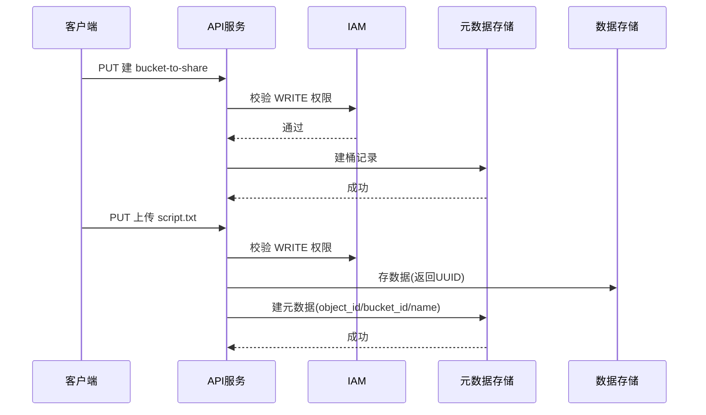
```mermaid
sequenceDiagram
    participant C as 客户端
    participant API as API服务
    participant IAM as IAM
    participant MS as 元数据存储
    participant DS as 数据存储
    C->>API: PUT 建 bucket-to-share
    API->>IAM: 校验 WRITE 权限
    IAM-->>API: 通过
    API->>MS: 建桶记录
    MS-->>API: 成功
    C->>API: PUT 上传 script.txt
    API->>IAM: 校验 WRITE 权限
    API->>DS: 存数据(返回UUID)
    API->>MS: 建元数据(object_id/bucket_id/name)
    MS-->>API: 成功
```

**上传流程**(背):① 建桶(IAM 校验 + 元数据建桶记录)→ ② 上传对象(IAM 校验 → 数据存储存数据返回 UUID → 元数据建记录含 object_id/bucket_id/object_name)。

### 3.4 下载流程(5 步)

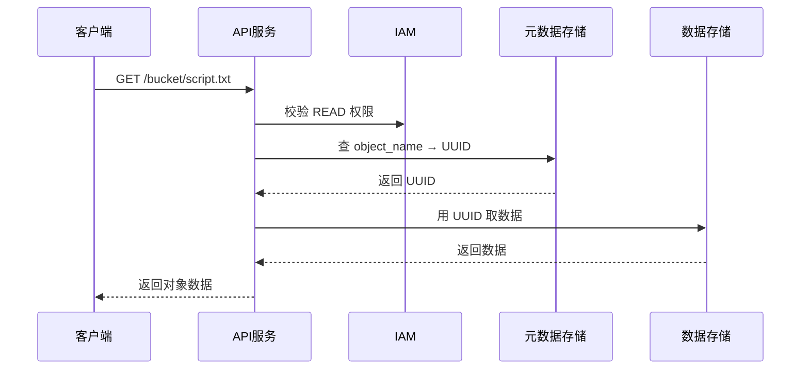
```mermaid
sequenceDiagram
    participant C as 客户端
    participant API as API服务
    participant IAM as IAM
    participant MS as 元数据存储
    participant DS as 数据存储
    C->>API: GET /bucket/script.txt
    API->>IAM: 校验 READ 权限
    API->>MS: 查 object_name → UUID
    MS-->>API: 返回 UUID
    API->>DS: 用 UUID 取数据
    DS-->>API: 返回数据
    API-->>C: 返回对象数据
```

**下载流程**(背):① GET → IAM 校验 READ → **元数据查 name→UUID** → 数据存储用 UUID 取数据 → 返回。

> 💡 **关键**:数据存储**只认 UUID**,所以下载要先去元数据层做 **name→UUID 映射**。

---

## 4. 数据存储设计 ⭐⭐⭐⭐⭐(本章难点)

数据存储 = **数据路由服务 + 放置服务 + 数据节点**。

### 4.1 三大组件

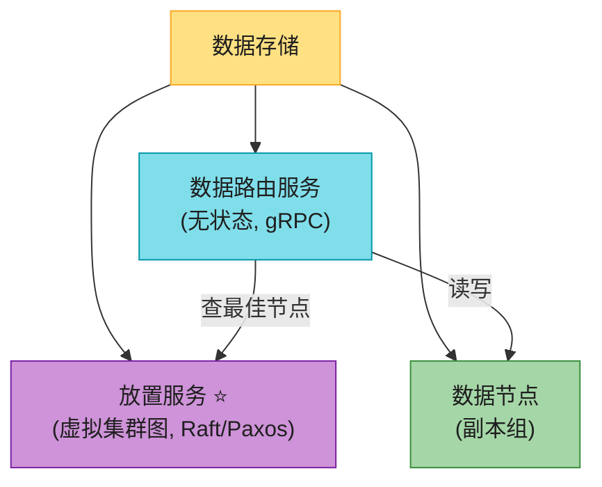
```mermaid
flowchart TB
    DS["数据存储"] --> DRS["数据路由服务<br/>(无状态, gRPC)"]
    DS --> PL["放置服务 ⭐<br/>(虚拟集群图, Raft/Paxos)"]
    DS --> DN["数据节点<br/>(副本组)"]
    DRS -->|查最佳节点| PL
    DRS -->|读写| DN

    style DS fill:#FFE082,stroke:#F9A825,color:#1f1f1f
    style DRS fill:#80DEEA,stroke:#0097A7,color:#1f1f1f
    style PL fill:#CE93D8,stroke:#7B1FA2,color:#1f1f1f
    style DN fill:#A5D6A7,stroke:#388E3C,color:#1f1f1f
```

| 组件 | 职责 |
|------|------|
| **数据路由服务** | 无状态;查放置服务选节点;读写数据节点 |
| **放置服务** ⭐ | 维护**虚拟集群图**(物理拓扑);心跳 15s 监控;**5-7 节点 Raft/Paxos**(多数派存活即工作) |
| **数据节点** | 存数据;复制到副本组(replication group) |

> 📝 **放置服务是核心**:它用虚拟集群图确保**副本物理隔离**(不同机架/AZ)——这是高耐久的关键。5-7 节点 + Raft/Paxos 容错(7 节点容忍 3 故障)。

### 4.2 数据持久流程(5 步)

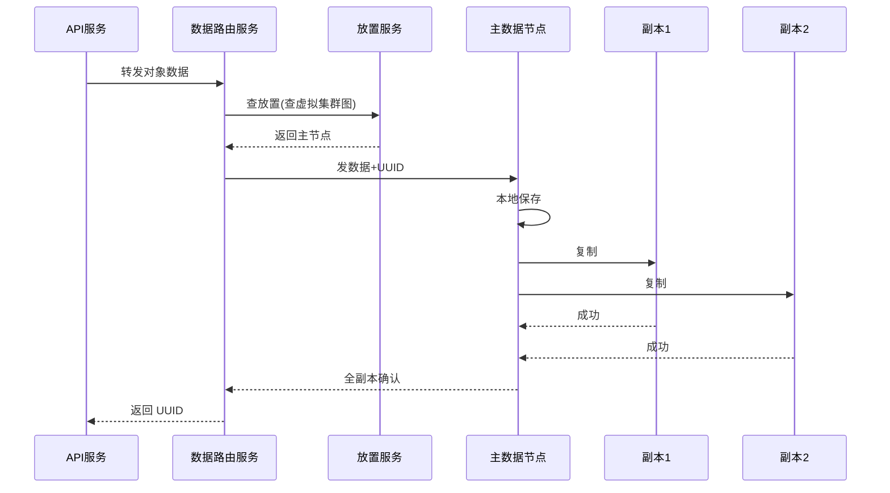
```mermaid
sequenceDiagram
    participant API as API服务
    participant DRS as 数据路由服务
    participant PL as 放置服务
    participant P as 主数据节点
    participant S1 as 副本1
    participant S2 as 副本2
    API->>DRS: 转发对象数据
    DRS->>PL: 查放置(查虚拟集群图)
    PL-->>DRS: 返回主节点
    DRS->>P: 发数据+UUID
    P->>P: 本地保存
    P->>S1: 复制
    P->>S2: 复制
    S1-->>P: 成功
    S2-->>P: 成功
    P-->>DRS: 全副本确认
    DRS-->>API: 返回 UUID
```

- **步骤 2**:放置服务用**一致性哈希**(接 Vol.1 Ch5)返回副本组——**确定性 + 抗增删节点**。
- **步骤 4**:主节点**等所有副本确认才返回** → 强一致(但延迟高,等最慢副本)。

### 4.3 一致性-延迟权衡 ⭐⭐(接 Vol.1 Ch1 CAP)

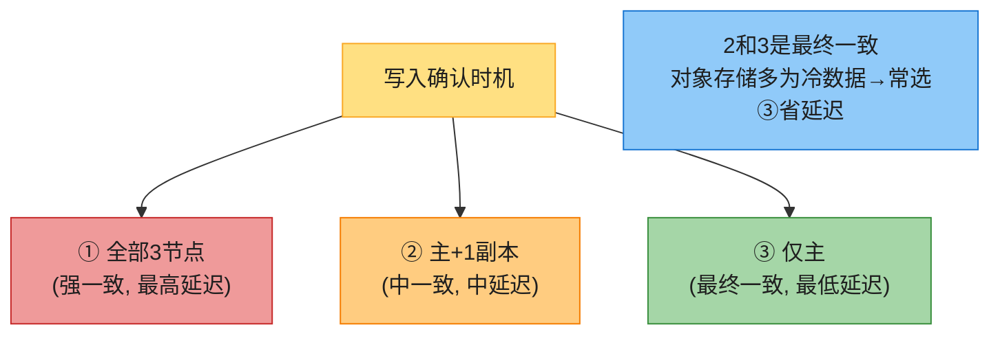
```mermaid
flowchart TD
    W["写入确认时机"] --> W1["① 全部3节点<br/>(强一致, 最高延迟)"]
    W --> W2["② 主+1副本<br/>(中一致, 中延迟)"]
    W --> W3["③ 仅主<br/>(最终一致, 最低延迟)"]
    NOTE["2和3是最终一致<br/>对象存储多为冷数据→常选③省延迟"]

    style W fill:#FFE082,stroke:#F9A825,color:#1f1f1f
    style W1 fill:#EF9A9A,stroke:#C62828,color:#1f1f1f
    style W2 fill:#FFCC80,stroke:#F57C00,color:#1f1f1f
    style W3 fill:#A5D6A7,stroke:#388E3C,color:#1f1f1f
    style NOTE fill:#90CAF9,stroke:#1976D2,color:#1f1f1f
```

> 📝 **权衡**:等副本越多数一致越强但延迟越高。**2 和 3 都是最终一致**。对象存储数据冷 + write-once-read-many,常选低延迟档。

### 4.4 数据怎么组织:小对象合并(WAL 思想)⭐⭐⭐

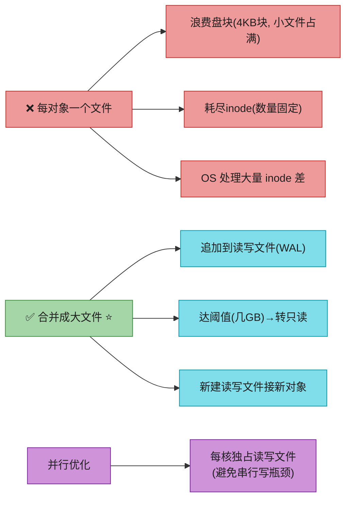
```mermaid
flowchart LR
    BAD["❌ 每对象一个文件"] --> B1["浪费盘块(4KB块, 小文件占满)"]
    BAD --> B2["耗尽inode(数量固定)"]
    BAD --> B3["OS 处理大量 inode 差"]
    GOOD["✅ 合并成大文件 ⭐"] --> G1["追加到读写文件(WAL)"]
    GOOD --> G2["达阈值(几GB)→转只读"]
    GOOD --> G3["新建读写文件接新对象"]
    PAR["并行优化"] --> P1["每核独占读写文件<br/>(避免串行写瓶颈)"]

    style BAD fill:#EF9A9A,stroke:#C62828,color:#1f1f1f
    style B1 fill:#EF9A9A,stroke:#C62828,color:#1f1f1f
    style B2 fill:#EF9A9A,stroke:#C62828,color:#1f1f1f
    style B3 fill:#EF9A9A,stroke:#C62828,color:#1f1f1f
    style GOOD fill:#A5D6A7,stroke:#388E3C,color:#1f1f1f
    style G1 fill:#80DEEA,stroke:#0097A7,color:#1f1f1f
    style G2 fill:#80DEEA,stroke:#0097A7,color:#1f1f1f
    style G3 fill:#80DEEA,stroke:#0097A7,color:#1f1f1f
    style PAR fill:#CE93D8,stroke:#7B1FA2,color:#1f1f1f
    style P1 fill:#CE93D8,stroke:#7B1FA2,color:#1f1f1f
```

> 💡 **小对象合并是核心优化**(本质是 WAL):
> - 每个对象**追加**到当前**读写文件**;
> - 文件达阈值(几 GB)→ 转**只读**,新建读写文件;
> - 只读文件只服务读。
> - **并行瓶颈**:读写文件写必须串行 → 多核竞争 → **每核独占一个读写文件**。
>
> 这就是 Facebook **Haystack** 论文的核心思想(本章设计原型)。

### 4.5 对象查找(object_mapping)⭐⭐

合并后,怎么按 UUID 找对象?需要三要素:**哪个文件 + 起始偏移 + 大小**。

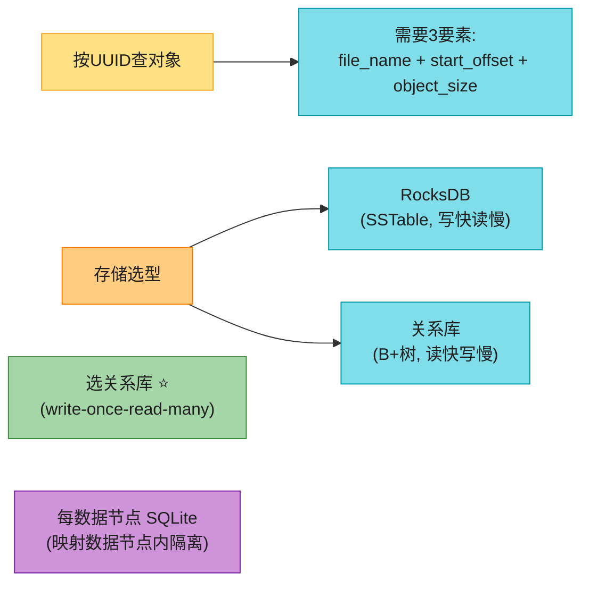
```mermaid
flowchart LR
    LOOK["按UUID查对象"] --> NEED["需要3要素:<br/>file_name + start_offset + object_size"]
    OPT["存储选型"] --> RK["RocksDB<br/>(SSTable, 写快读慢)"]
    OPT --> RD["关系库<br/>(B+树, 读快写慢)"]
    CHOOSE["选关系库 ⭐<br/>(write-once-read-many)"]
    DEPLOY["每数据节点 SQLite<br/>(映射数据节点内隔离)"]

    style LOOK fill:#FFE082,stroke:#F9A825,color:#1f1f1f
    style NEED fill:#80DEEA,stroke:#0097A7,color:#1f1f1f
    style OPT fill:#FFCC80,stroke:#F57C00,color:#1f1f1f
    style RK fill:#80DEEA,stroke:#0097A7,color:#1f1f1f
    style RD fill:#80DEEA,stroke:#0097A7,color:#1f1f1f
    style CHOOSE fill:#A5D6A7,stroke:#388E3C,color:#1f1f1f
    style DEPLOY fill:#CE93D8,stroke:#7B1FA2,color:#1f1f1f
```

| object_mapping 字段 | 含义 |
|---------------------|------|
| object_id | 对象 UUID |
| file_name | 含该对象的文件名 |
| start_offset | 文件内起始地址 |
| object_size | 字节数 |

> 📝 **选型逻辑**:数据访问是 **write-once-read-many**(LinkedIn:95% 读)→ **读性能优先** → 关系库(B+树)优于 RocksDB(SSTable)。映射数据**节点内隔离**(无需跨节点共享)→ **每节点部署 SQLite**(文件型,轻量)。

> 💡 **注意**:这里选关系库是因为**对象映射表是读多写少**;但**元数据存储**(下一节)在海量规模下用 RocksDB/embedded 更常见(2026 增量会讲)。两个不同场景,别混淆。

---

## 5. 持久性(Durability)⭐⭐⭐⭐⭐(本章难点)

> 📝 **耐久性是对象存储的灵魂**——S3 11 个 9 意味着存 1000 万对象,1000 万年才丢 1 个。

### 5.1 失败域隔离(Failure Domain)

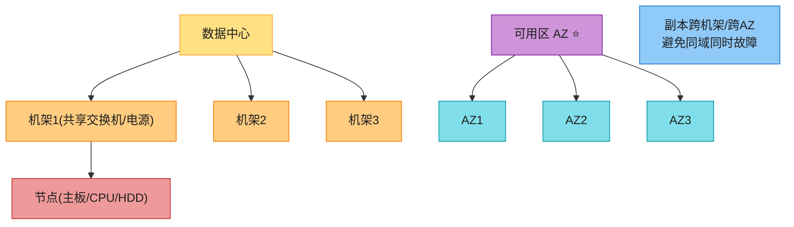
```mermaid
flowchart TB
    DC["数据中心"] --> R1["机架1(共享交换机/电源)"]
    DC --> R2["机架2"]
    DC --> R3["机架3"]
    R1 --> N1["节点(主板/CPU/HDD)"]
    AZ["可用区 AZ ⭐"] --> AZ1["AZ1"]
    AZ --> AZ2["AZ2"]
    AZ --> AZ3["AZ3"]
    NOTE["副本跨机架/跨AZ<br/>避免同域同时故障"]

    style DC fill:#FFE082,stroke:#F9A825,color:#1f1f1f
    style R1 fill:#FFCC80,stroke:#F57C00,color:#1f1f1f
    style R2 fill:#FFCC80,stroke:#F57C00,color:#1f1f1f
    style R3 fill:#FFCC80,stroke:#F57C00,color:#1f1f1f
    style N1 fill:#EF9A9A,stroke:#C62828,color:#1f1f1f
    style AZ fill:#CE93D8,stroke:#7B1FA2,color:#1f1f1f
    style AZ1 fill:#80DEEA,stroke:#0097A7,color:#1f1f1f
    style AZ2 fill:#80DEEA,stroke:#0097A7,color:#1f1f1f
    style AZ3 fill:#80DEEA,stroke:#0097A7,color:#1f1f1f
    style NOTE fill:#90CAF9,stroke:#1976D2,color:#1f1f1f
```

- **失败域**:一个物理/逻辑分区,关键服务出问题时受负面影响。
- **层级**:节点级(主板/HDD)→ 机架级(共享交换机/电源)→ AZ 级(整个数据中心)。
- **隔离**:副本放**不同机架 / 不同 AZ** → 大规模停电/制冷失效/自然灾害时不丢数据。

### 5.2 3 副本复制 vs 纠删码 ⭐⭐⭐⭐⭐(核心抉择)

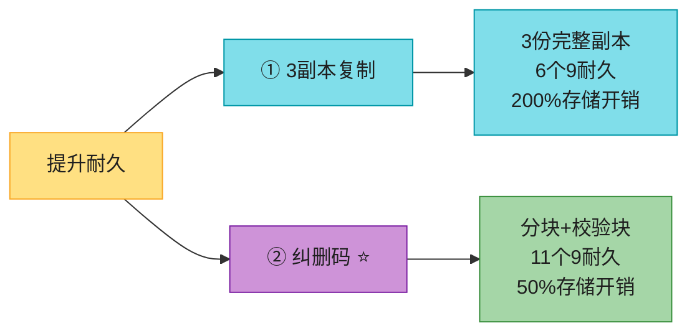
```mermaid
flowchart LR
    DUR["提升耐久"] --> REP["① 3副本复制"]
    DUR --> EC["② 纠删码 ⭐"]
    REP --> REPC["3份完整副本<br/>6个9耐久<br/>200%存储开销"]
    EC --> ECC["分块+校验块<br/>11个9耐久<br/>50%存储开销"]

    style DUR fill:#FFE082,stroke:#F9A825,color:#1f1f1f
    style REP fill:#80DEEA,stroke:#0097A7,color:#1f1f1f
    style EC fill:#CE93D8,stroke:#7B1FA2,color:#1f1f1f
    style REPC fill:#80DEEA,stroke:#0097A7,color:#1f1f1f
    style ECC fill:#A5D6A7,stroke:#388E3C,color:#1f1f1f
```

**3 副本**:3 个完整副本。盘年故障率 0.81% → 可靠性 `1-(0.0081)³ ≈ 6 个 9`。

**纠删码**(Erasure Coding, Reed-Solomon):把数据**分块** + 算**校验块**,散布到不同失败域。例 **(8+4)**:8 数据块 + 4 校验块,12 块散到 12 个失败域,**最多 4 节点宕机仍能重建**。

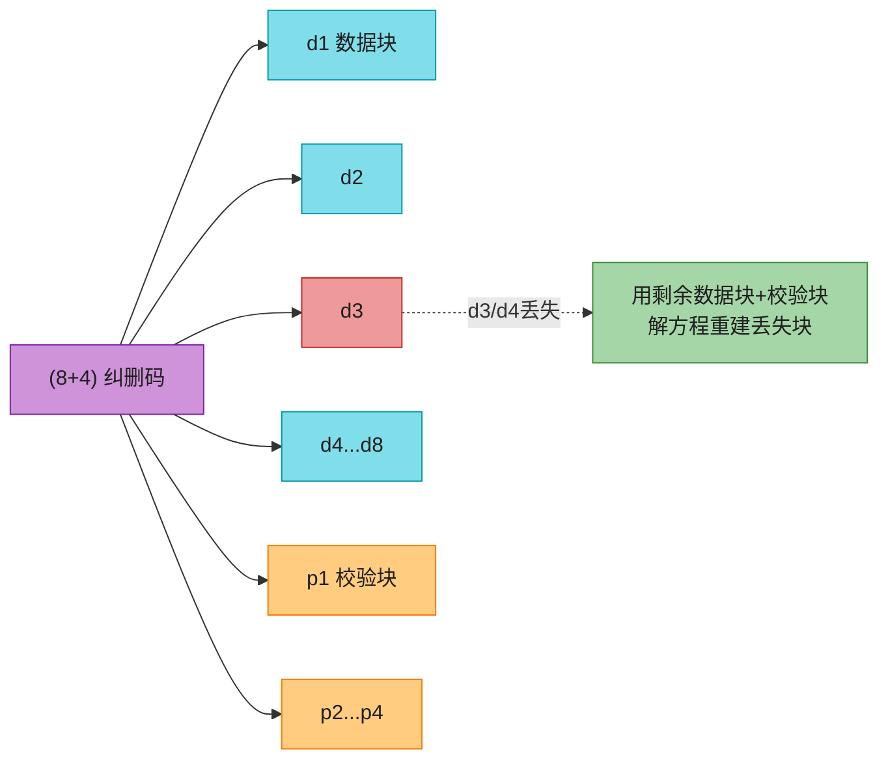
```mermaid
flowchart LR
    EC["(8+4) 纠删码"] --> D1["d1 数据块"]
    EC --> D2["d2"]
    EC --> D3["d3"]
    EC --> D4["d4...d8"]
    EC --> P1["p1 校验块"]
    EC --> P2["p2...p4"]
    D3 -.->|"d3/d4丢失"| REC["用剩余数据块+校验块<br/>解方程重建丢失块"]

    style EC fill:#CE93D8,stroke:#7B1FA2,color:#1f1f1f
    style D1 fill:#80DEEA,stroke:#0097A7,color:#1f1f1f
    style D2 fill:#80DEEA,stroke:#0097A7,color:#1f1f1f
    style D3 fill:#EF9A9A,stroke:#C62828,color:#1f1f1f
    style D4 fill:#80DEEA,stroke:#0097A7,color:#1f1f1f
    style P1 fill:#FFCC80,stroke:#F57C00,color:#1f1f1f
    style P2 fill:#FFCC80,stroke:#F57C00,color:#1f1f1f
    style REC fill:#A5D6A7,stroke:#388E3C,color:#1f1f1f
```

**对比表**(必背):

| 维度 | 3 副本 | 纠删码 | 胜者 |
|------|--------|--------|------|
| **耐久** | 6 个 9 | 11 个 9 | 纠删码 |
| **存储效率** | 200% 开销 | 50% 开销 | 纠删码 |
| **计算** | 无 | 算校验块耗 CPU | 副本 |
| **写性能** | 复制即可 | 写前算校验,延迟高 | 副本 |
| **读性能** | 单副本读 | 读多块重组;故障更慢 | 副本 |

> 💡 **选型经验**:**延迟敏感用副本;降本用纠删码**。原书主用副本(说纠删码复杂),但 **2026 真实 S3 主力是纠删码**(成本 + 11 个 9 碾压)——见 2026 增量。

### 5.3 数据校验(Checksum)

> 📝 **静默数据损坏**(bit rot)在大规模是常态——内存/磁盘 bit 翻转,盘没坏但数据错了。

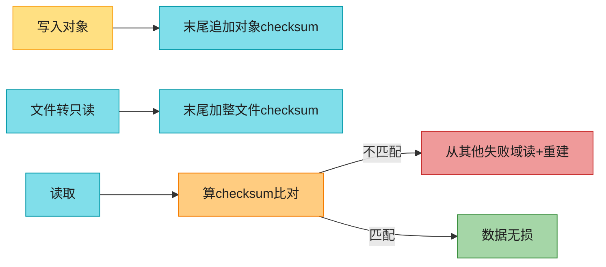
```mermaid
flowchart LR
    WRITE["写入对象"] --> APP["末尾追加对象checksum"]
    SEAL["文件转只读"] --> WHOLE["末尾加整文件checksum"]
    READ["读取"] --> V["算checksum比对"]
    V -->|不匹配| REC2["从其他失败域读+重建"]
    V -->|匹配| OK["数据无损"]

    style WRITE fill:#FFE082,stroke:#F9A825,color:#1f1f1f
    style APP fill:#80DEEA,stroke:#0097A7,color:#1f1f1f
    style SEAL fill:#80DEEA,stroke:#0097A7,color:#1f1f1f
    style WHOLE fill:#80DEEA,stroke:#0097A7,color:#1f1f1f
    style READ fill:#80DEEA,stroke:#0097A7,color:#1f1f1f
    style V fill:#FFCC80,stroke:#F57C00,color:#1f1f1f
    style REC2 fill:#EF9A9A,stroke:#C62828,color:#1f1f1f
    style OK fill:#A5D6A7,stroke:#388E3C,color:#1f1f1f
```

- **设计**:每个对象末尾加 checksum;文件转只读前加整文件 checksum(MD5/SHA1/HMAC)。
- **读取**:取数据 + checksum,重算比对 → 不匹配则从其他失败域读 + 重建。

---

## 6. 元数据建模 ⭐⭐⭐⭐

### 6.1 Schema(支撑 3 类查询)

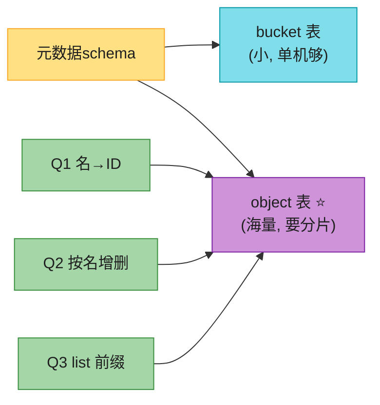
```mermaid
flowchart LR
    SCHEMA["元数据schema"] --> BT["bucket 表<br/>(小, 单机够)"]
    SCHEMA --> OT["object 表 ⭐<br/>(海量, 要分片)"]
    Q1["Q1 名→ID"] --> OT
    Q2["Q2 按名增删"] --> OT
    Q3["Q3 list 前缀"] --> OT

    style SCHEMA fill:#FFE082,stroke:#F9A825,color:#1f1f1f
    style BT fill:#80DEEA,stroke:#0097A7,color:#1f1f1f
    style OT fill:#CE93D8,stroke:#7B1FA2,color:#1f1f1f
    style Q1 fill:#A5D6A7,stroke:#388E3C,color:#1f1f1f
    style Q2 fill:#A5D6A7,stroke:#388E3C,color:#1f1f1f
    style Q3 fill:#A5D6A7,stroke:#388E3C,color:#1f1f1f
```

**3 类查询**:① 名→ID;② 按名增删;③ 按前缀 list。

**bucket 表**:用户建桶数有限 → 表小(假设 100 万用户 × 10 桶 × 1KB = 10GB)→ 单机够,读多用副本分摊。

**object 表**:海量 → **必须分片**。

### 6.2 分片策略 ⭐⭐

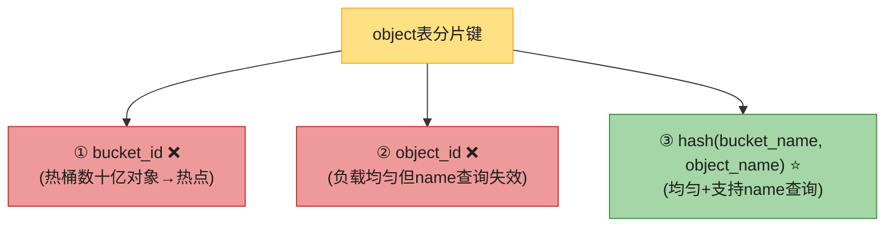
```mermaid
flowchart TD
    SH["object表分片键"] --> SB["① bucket_id ❌<br/>(热桶数十亿对象→热点)"]
    SH --> SO["② object_id ❌<br/>(负载均匀但name查询失效)"]
    SH --> SBO["③ hash(bucket_name, object_name) ⭐<br/>(均匀+支持name查询)"]

    style SH fill:#FFE082,stroke:#F9A825,color:#1f1f1f
    style SB fill:#EF9A9A,stroke:#C62828,color:#1f1f1f
    style SO fill:#EF9A9A,stroke:#C62828,color:#1f1f1f
    style SBO fill:#A5D6A7,stroke:#388E3C,color:#1f1f1f
```

> 💡 **选 hash(bucket_name, object_name)**:① 均匀分布;② 大部分元数据操作基于对象 URI(name),所以按 name 分片能高效支持查询 1、2。

### 6.3 列桶(Listing)⭐⭐(分片下的难点)

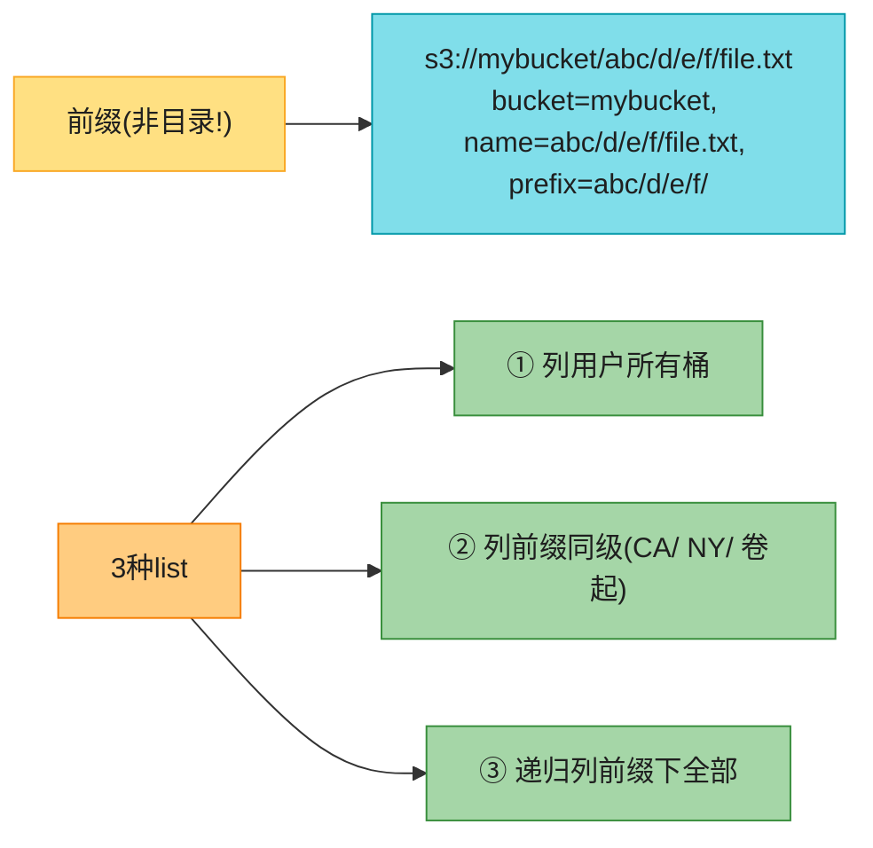
```mermaid
flowchart LR
    PRE["前缀(非目录!)"] --> EX["s3://mybucket/abc/d/e/f/file.txt<br/>bucket=mybucket, name=abc/d/e/f/file.txt, prefix=abc/d/e/f/"]
    LIST["3种list"] --> L1["① 列用户所有桶"]
    LIST --> L2["② 列前缀同级(CA/ NY/ 卷起)"]
    LIST --> L3["③ 递归列前缀下全部"]

    style PRE fill:#FFE082,stroke:#F9A825,color:#1f1f1f
    style EX fill:#80DEEA,stroke:#0097A7,color:#1f1f1f
    style LIST fill:#FFCC80,stroke:#F57C00,color:#1f1f1f
    style L1 fill:#A5D6A7,stroke:#388E3C,color:#1f1f1f
    style L2 fill:#A5D6A7,stroke:#388E3C,color:#1f1f1f
    style L3 fill:#A5D6A7,stroke:#388E3C,color:#1f1f1f
```

**前缀 ≠ 目录**:对象存储是**扁平结构**;前缀只是"对象名开头的字符串",模拟目录。列桶 = `WHERE object_name LIKE 'abc/%'`。

**分片下列桶的难点 ⭐⭐**:

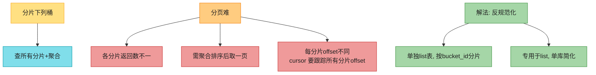
```mermaid
flowchart TD
    DIS["分片下列桶"] --> Q["查所有分片+聚合"]
    PG["分页难"] --> P1["各分片返回数不一"]
    PG --> P2["需聚合排序后取一页"]
    PG --> P3["每分片offset不同<br/>cursor 要跟踪所有分片offset"]
    SOL["解法: 反规范化"] --> S1["单独list表, 按bucket_id分片"]
    SOL --> S2["专用于list, 单库简化"]

    style DIS fill:#FFE082,stroke:#F9A825,color:#1f1f1f
    style Q fill:#80DEEA,stroke:#0097A7,color:#1f1f1f
    style PG fill:#FFCC80,stroke:#F57C00,color:#1f1f1f
    style P1 fill:#EF9A9A,stroke:#C62828,color:#1f1f1f
    style P2 fill:#EF9A9A,stroke:#C62828,color:#1f1f1f
    style P3 fill:#EF9A9A,stroke:#C62828,color:#1f1f1f
    style SOL fill:#A5D6A7,stroke:#388E3C,color:#1f1f1f
    style S1 fill:#A5D6A7,stroke:#388E3C,color:#1f1f1f
    style S2 fill:#A5D6A7,stroke:#388E3C,color:#1f1f1f
```

> 📝 **分片分页难点**:对象散布各分片,各分片返回数不一(有的满页,有的空),应用聚合排序后取一页,未取中的下轮要再算 → **每分片 offset 不同**,cursor 要跟踪所有分片 offset(几百个)。
>
> 💡 **解法(反规范化)**:把 list 数据反规范化到**单独表(按 bucket_id 分片)**,专用于 list。对象存储 list 性能本就不是优先级,这样**把 list 查询隔离到单库**,大幅简化。

---

## 7. 版本化 + Multipart + 垃圾回收 ⭐⭐⭐⭐

### 7.1 版本化(TIMEUUID)

```mermaid
flowchart LR
    V["版本化(桶级开关)"] --> UP["上传同名对象"]
    UP --> INS["不覆盖, 插新行<br/>object_version=TIMEUUID"]
    CUR["当前版本"] --> MAX["最大TIMEUUID的记录"]
    DEL["删除"] --> DM["插 delete marker(成为当前版)"]
    GETV["GET 当前版=delete marker"] --> N404["返回 404 Not Found"]

    style V fill:#FFE082,stroke:#F9A825,color:#1f1f1f
    style UP fill:#80DEEA,stroke:#0097A7,color:#1f1f1f
    style INS fill:#CE93D8,stroke:#7B1FA2,color:#1f1f1f
    style CUR fill:#80DEEA,stroke:#0097A7,color:#1f1f1f
    style MAX fill:#80DEEA,stroke:#0097A7,color:#1f1f1f
    style DEL fill:#FFCC80,stroke:#F57C00,color:#1f1f1f
    style DM fill:#EF9A9A,stroke:#C62828,color:#1f1f1f
    style GETV fill:#80DEEA,stroke:#0097A7,color:#1f1f1f
    style N404 fill:#EF9A9A,stroke:#C62828,color:#1f1f1f
```

- **版本化**:开版本化后,**不覆盖**旧记录,插新行(同 bucket_id+object_name,新 object_id+object_version)。
- **object_version = TIMEUUID**(接 Vol.1 Ch7):当前版 = 最大 TIMEUUID。
- **删除 = 插 delete marker**(成为当前版),GET 命中 marker 返回 404。旧版本保留可恢复。

### 7.2 Multipart Upload(大文件分段)

```mermaid
sequenceDiagram
    participant C as 客户端
    participant DS as 数据存储
    C->>DS: 发起 multipart 上传
    DS-->>C: 返回 uploadID
    Note over C: 切片(如1.6GB→8×200MB)
    C->>DS: 上传 part1(+uploadID)
    DS-->>C: ETag(md5 of part)
    C->>DS: 上传 partN...
    C->>DS: complete(uploadID, part号, ETags)
    DS->>DS: 按 part号重组
    DS-->>C: 成功
```

**为什么 multipart**:大文件直传慢 + 网络中断要重传全部。**切片独立上传** + 断点续传 + 并行。每个 part 返回 **ETag(md5 校验)**;complete 后按 part 号重组。**残留 part 由 GC 回收**。

### 7.3 垃圾回收(Compaction)

```mermaid
flowchart LR
    G["垃圾来源"] --> G1["惰性删除(标删未真删)"]
    G --> G2["孤儿数据(上传一半/弃)"]
    G --> G3["损坏数据(checksum失败)"]
    CMP["compaction"] --> C1["复制存活对象到新文件(跳过删除标记)"]
    CMP --> C2["更新object_mapping(file_name+offset)<br/>用事务保证一致"]
    CMP --> C3["攒大量只读文件再compact<br/>(避免碎小文件)"]

    style G fill:#FFE082,stroke:#F9A825,color:#1f1f1f
    style G1 fill:#FFCC80,stroke:#F57C00,color:#1f1f1f
    style G2 fill:#FFCC80,stroke:#F57C00,color:#1f1f1f
    style G3 fill:#FFCC80,stroke:#F57C00,color:#1f1f1f
    style CMP fill:#A5D6A7,stroke:#388E3C,color:#1f1f1f
    style C1 fill:#80DEEA,stroke:#0097A7,color:#1f1f1f
    style C2 fill:#CE93D8,stroke:#7B1FA2,color:#1f1f1f
    style C3 fill:#80DEEA,stroke:#0097A7,color:#1f1f1f
```

**GC 不立即删**,定期 compaction:复制存活对象到新文件(跳过删除标记)→ 更新 object_mapping(file_name/offset **用事务**)→ 攒大量只读文件再 compact(避免碎文件)。副本/纠删码都要在所有节点删(3 副本删 3 节点;(8+4) 删 12 节点)。

---

## 8. 2026 现代增量(原书没讲的硬核)⭐⭐⭐⭐⭐

### 8.1 纠删码已成主流(原书主用副本)⭐⭐⭐

```mermaid
flowchart LR
    REP["原书: 3副本为主"] -->|"2026"| EC["纠删码为主 ⭐"]
    EC --> S3["S3/MinIO/Ceph/Backblaze 全用EC"]
    EC --> WHY["成本50% vs 200%<br/>+ 11个9 vs 6个9"]
    OPT["EC优化"] --> CLAY["CLAY码(降修复带宽)"]
    OPT --> RS["Reed-Solomon(经典)"]

    style REP fill:#FFCC80,stroke:#F57C00,color:#1f1f1f
    style EC fill:#A5D6A7,stroke:#388E3C,color:#1f1f1f
    style S3 fill:#80DEEA,stroke:#0097A7,color:#1f1f1f
    style WHY fill:#CE93D8,stroke:#7B1FA2,color:#1f1f1f
    style OPT fill:#80DEEA,stroke:#0097A7,color:#1f1f1f
    style CLAY fill:#80DEEA,stroke:#0097A7,color:#1f1f1f
    style RS fill:#80DEEA,stroke:#0097A7,color:#1f1f1f
```

> 🔄 **2026 现代版话术**(原书主用 3 副本):
> "原书主用 3 副本(说纠删码复杂度高)。但 **2026 真实 S3 主力是纠删码**——存储开销 50% vs 副本 200%,耐久 11 个 9 vs 6 个 9,在 PB 级规模成本碾压。**S3/MinIO/Ceph/Backblaze 全用纠删码**。改进方向:**CLAY 码**(降修复带宽,单节点宕机重建省流量)。冷数据用 EC,热数据用副本(分层)。"

### 8.2 强一致(read-after-write,原书说最终一致可接受)

```mermaid
flowchart LR
    OLD["原书: 最终一致可接受"] -->|"2020.12"| NEW["S3 默认强一致 ⭐<br/>(read-after-write)"]
    NEW --> IMPL["写成功后立即可读"]
    NEW --> COND["前提: PUT返回200=已持久化+可读"]

    style OLD fill:#FFCC80,stroke:#F57C00,color:#1f1f1f
    style NEW fill:#A5D6A7,stroke:#388E3C,color:#1f1f1f
    style IMPL fill:#80DEEA,stroke:#0097A7,color:#1f1f1f
    style COND fill:#90CAF9,stroke:#1976D2,color:#1f1f1f
```

> 💡 **2020.12 起 S3 默认强一致**——写成功后立即可读。原书还在说"最终一致可接受",已过时。

### 8.3 Checksum 升级(原书用 MD5)

```mermaid
flowchart LR
    OLD2["原书: MD5"] -->|"2022+"| NEW2["S3 多算法 ⭐<br/>(CRC32/CRC32C/SHA-1/SHA-256/MD5)"]
    WHY2["为什么升级"] --> W1["MD5 有碰撞, 已不安全"]
    WHY2 --> W2["CRC32C 硬件加速, 快"]
    WHY2 --> W3["SHA-256 抗碰撞"]

    style OLD2 fill:#FFCC80,stroke:#F57C00,color:#1f1f1f
    style NEW2 fill:#A5D6A7,stroke:#388E3C,color:#1f1f1f
    style WHY2 fill:#80DEEA,stroke:#0097A7,color:#1f1f1f
    style W1 fill:#EF9A9A,stroke:#C62828,color:#1f1f1f
    style W2 fill:#80DEEA,stroke:#0097A7,color:#1f1f1f
    style W3 fill:#80DEEA,stroke:#0097A7,color:#1f1f1f
```

> 💡 **2022 起 S3 支持 CRC32/CRC32C/SHA-1/SHA-256/MD5 多算法**(via `x-amz-checksum-*` header)。**CRC32C 有硬件加速(快)**;MD5 有碰撞不安全。原书只用 MD5,2026 该升级。

### 8.4 Facebook Haystack / f4(本题原型,原书没提)

```mermaid
flowchart LR
    FB["Facebook对象存储栈"] --> HAY["Haystack(2010)<br/>(热照片, 多副本)"]
    FB --> F4["f4(2014)<br/>(温视频, 纠删码)"]
    FB --> TEC["Tectonic(2021)<br/>(统一文件/对象/块)"]
    NOTE["本章设计=Haystack<br/>(小对象合并+元数据分离)"]

    style FB fill:#CE93D8,stroke:#7B1FA2,color:#1f1f1f
    style HAY fill:#80DEEA,stroke:#0097A7,color:#1f1f1f
    style F4 fill:#80DEEA,stroke:#0097A7,color:#1f1f1f
    style TEC fill:#80DEEA,stroke:#0097A7,color:#1f1f1f
    style NOTE fill:#90CAF9,stroke:#1976D2,color:#1f1f1f
```

> 💡 **话术**:"本章设计本质是 Facebook **Haystack**(2010)——**小对象合并成大文件 + 元数据/数据分离 + 多副本**,为热照片设计。**f4**(2014)是温视频的纠删码版本。**Tectonic**(2021)是统一文件/对象/块的超大规模文件系统。**讲一句 Haystack = 知道本题的工业原型**。"

### 8.5 分级存储 / 冷存(原书没提)

```mermaid
flowchart LR
    TIER["S3 存储分级"] --> HOT["热: Standard"]
    TIER --> IA["温: Standard-IA(低频)"]
    TIER --> OZ["单区: One Zone-IA"]
    TIER --> EXP["极速: Express One Zone(2023, ms级)"]
    TIER --> GLA["冷: Glacier(分钟~小时取回)"]
    TIER --> DG["极冷: Glacier Deep Archive(12小时, 最便宜)"]
    TIER --> IT["智能: Intelligent-Tiering(自动迁移)"]

    style TIER fill:#CE93D8,stroke:#7B1FA2,color:#1f1f1f
    style HOT fill:#EF9A9A,stroke:#C62828,color:#1f1f1f
    style IA fill:#FFCC80,stroke:#F57C00,color:#1f1f1f
    style OZ fill:#FFCC80,stroke:#F57C00,color:#1f1f1f
    style EXP fill:#EF9A9A,stroke:#C62828,color:#1f1f1f
    style GLA fill:#80DEEA,stroke:#0097A7,color:#1f1f1f
    style DG fill:#90CAF9,stroke:#1976D2,color:#1f1f1f
    style IT fill:#A5D6A7,stroke:#388E3C,color:#1f1f1f
```

> 💡 **分级存储是降本关键**:热数据贵快(Standard/Express One Zone ms 级),冷数据便宜慢(Glacier Deep Archive 12 小时取回但最便宜)。**Intelligent-Tiering 自动按访问频率迁移**。原书没提,2026 必讲。

### 8.6 其它 2026 增量

| 技术 | 说明 |
|------|------|
| **MinIO** | 开源 S3 兼容对象存储(纠删码内置),自建首选 |
| **Ceph RADOS / RadosGW** | 统一块/文件/对象(原书提一句) |
| **S3 Select** | 直接对对象跑 SQL 过滤(只返回匹配行,省带宽) |
| **Object Lambda** | 取对象时挂 Lambda 转换(动态水印/脱敏) |
| **S3 Tables(2024)** ⭐ | S3 原生存 Iceberg 表(对象存储变数据湖仓) |
| **ZNS SSD / SMR 盘** | 顺序写优化盘,匹配 WAL 合并访问模式 |
| **内容寻址去重(CAS)** | hash 相同只存一份(同邮件附件去重) |
| **NVMe-oF / RDMA** | 数据节点高速网络,降 EC 读放大延迟 |

---

## ⚠️ 已过时 / 书里没说(2022 → 2026)

| 原书(2022) | 2026 现状 | 面试应对 |
|------------|----------|---------|
| 主用 3 副本 | **纠删码为主**(成本+11个9) | 讲 EC + CLAY 码 + 冷热分层 |
| 最终一致可接受 | **S3 2020.12 起默认强一致** | 讲 read-after-write |
| Checksum 用 MD5 | **多算法 CRC32C/SHA-256**(MD5 不安全) | 讲硬件加速 CRC32C |
| 没提原型论文 | **Haystack/f4/Tectonic** | 讲设计原型 |
| 没提分级存储 | **Glacier/Intelligent-Tiering/Express** | 讲冷热分层降本 |
| 没提内容寻址 | **CAS 去重** | 讲群发附件省 PB |
| 元数据只讲关系库 | 海量用 **RocksDB/embedded KV** | 讲场景区分 |
| 没提数据湖 | **S3 Tables(Iceberg)** | 讲湖仓一体 |

---

## 💻 代码示例

### 示例 1:对象存储 API(RESTful)

```http
# 上传对象
PUT /bucket-to-share/script.txt HTTP/1.1
Host: foo.s3example.org
Date: Sun, 12 Sept 2021 17:51:00 GMT
Authorization: <签名>          # IAM 校验
Content-Type: text/plain
Content-Length: 4567
x-amz-meta-author: Alex        # 自定义元数据
x-amz-checksum-sha256: <hash>  # 2022+ 支持多算法
[4567 bytes of object data]

# 下载对象(数据存储只认 UUID, 需先查元数据 name→UUID)
GET /bucket-to-share/script.txt HTTP/1.1

# 列桶内对象(前缀模拟目录)
GET /?list-type=2&prefix=abc/&delimiter=/ HTTP/1.1
```

### 示例 2:object_mapping 表(SQLite)

```sql
-- 每数据节点本地 SQLite(映射数据节点内隔离)
CREATE TABLE object_mapping (
    object_id    TEXT PRIMARY KEY,   -- UUID
    file_name    TEXT,               -- 合并后的大文件
    start_offset INTEGER,            -- 文件内起始偏移
    object_size  INTEGER             -- 字节数
);
-- 读多写少(write-once-read-many)→ B+树关系库优于 RocksDB
SELECT file_name, start_offset, object_size
FROM object_mapping WHERE object_id = ?;
```

### 示例 3:版本化元数据(CQL / TIMEUUID)

```sql
-- 版本化: 不覆盖, 插新行(同name不同version)
CREATE TABLE object (
    bucket_id      uuid,
    object_name    text,
    object_id      uuid,             -- 每版本不同UUID
    object_version timeuuid,         -- TIMEUUID, 当前版=最大
    is_deleted     boolean,          -- delete marker
    PRIMARY KEY ((bucket_id, object_name), object_version)
);
-- 查当前版本: 聚类键 object_version 降序取第一条
SELECT * FROM object
WHERE bucket_id=? AND object_name=?
ORDER BY object_version DESC LIMIT 1;
```

### 示例 4:multipart 上传(伪码)

```python
def multipart_upload(file_path, bucket, key, part_size=200*1024*1024):
    upload_id = s3.initiate_multipart(bucket, key)      # 发起
    parts = []
    for part_no, chunk in enumerate(split(file_path, part_size), 1):
        etag = s3.upload_part(bucket, key, upload_id, part_no, chunk)  # ETag=md5
        parts.append((part_no, etag))
    s3.complete_multipart(bucket, key, upload_id, parts)  # 重组; 残留part由GC回收
```

---

## 🪤 追问陷阱(面试官最爱问,本章集)

1. **"块/文件/对象存储区别?"** → 块(原始块,VM/DB);文件(目录树,NFS/SMB);**对象(不可变,REST,海量冷数据)**。
2. **"对象存储为什么慢?"** → **刻意取舍**:牺牲性能换极高耐久 + 海量 + 低成本(面向冷数据)。
3. **"元数据和数据为什么要分离?"** → **类 UNIX inode 思想**:元数据可变、数据不可变,分离后**各自独立优化**。
4. **"小对象怎么存?"** → **合并成大文件(WAL 思想)**:追加到读写文件,达阈值转只读;每核独占读写文件避串行。
5. **"怎么按 UUID 找合并文件里的对象?"** → object_mapping 表(object_id→file_name+start_offset+object_size);读多写少选**关系库(SQLite)**。
6. **"怎么保证 6 个 9 耐久?"** → **3 副本**(0.81% 故障率 → 1-0.0081³≈6 个 9)+ **失败域隔离**(跨机架/AZ)+ checksum。
7. **"3 副本 vs 纠删码?"** → 副本:200% 开销/6 个 9/写读快;**纠删码:50% 开销/11 个 9/写前算校验慢**。2026 真实 S3 主用纠删码。
8. **"数据损坏(盘没坏但数据错)怎么办?"** → **静默损坏是常态**,用 checksum 比对,不匹配从其他失败域读 + 重建。
9. **"object 表怎么分片?"** → **hash(bucket_name, object_name)**:均匀 + 支持 name 查询。bucket_id 会热点,object_id 不支持 name 查询。
10. **"分片下列桶为什么难?"** → 各分片返回数不一,**分页 offset 每分片不同**。解法:**反规范化单独 list 表**(按 bucket_id 分片)。
11. **"版本化怎么实现?"** → 不覆盖,插新行(object_version=TIMEUUID),当前版=最大 TIMEUUID;删除=插 delete marker。
12. **"大文件怎么上传?"** → **multipart 分段**:切片独立上传(断点续传),每 part 返 ETag,complete 后重组;残留 part 由 GC 回收。
13. **"GC 怎么做?"** → 不立即删,定期 **compaction**:复制存活对象到新文件(跳过删除标记),更新 mapping 用事务。
14. **"写入确认时机怎么选?"** → 全 3 副本(强一致高延迟)/ 主+1(中)/ 仅主(最终一致低)。对象冷数据常选低延迟。
15. **"2026 S3 默认一致模型?"** → **强一致(read-after-write,2020.12 起)**。
16. **"本题工业原型?"** → Facebook **Haystack**(小对象合并+元数据分离)+ **f4**(温数据纠删码)。
17. **"怎么降本?"** → 纠删码(50% vs 200%)+ **分级存储**(热 Standard/冷 Glacier)+ CAS 去重 + 小对象合并。

---

## 🏭 生产级产品速查表

| 产品 | 特色 |
|------|------|
| **AWS S3** | 行业标杆;11 个 9 耐久;纠删码;分级存储;2020 起强一致 |
| **MinIO** | 开源 S3 兼容;纠删码内置;自建首选 |
| **Ceph RADOS / RadosGW** | 统一块/文件/对象;RadosGW 提 S3 API |
| **Google Cloud Storage** | 类 S3;Autoclass 自动分级 |
| **Azure Blob Storage** | 分 Hot/Cool/Archive;Hot/Cool 强一致 |
| **Backblaze B2** | 纠删码;公开耐久计算(11 个 9) |
| **Facebook Haystack/f4/Tectonic** | 工业原型论文链 |

> 🏭 **业界标杆**:**AWS S3** 是本题原型(11 个 9/纠删码/分级存储/强一致);**Facebook Haystack** 是设计原型论文(小对象合并 + 元数据分离);**MinIO** 是自建开源首选(纠删码内置)。**Backblaze** 公开硬盘故障率数据(0.81%/年)是耐久估算的权威来源。

---

## 📝 本章要点总结

```mermaid
flowchart LR
    ROOT(["V2-Ch9 对象存储<br/>海量不可变 + 极致耐久 + 低成本"])

    B1["需求+估算 ⭐<br/>────────<br/>• 100PB/年, 0.68亿对象<br/>• 6个9耐久/4个9可用<br/>• 小对象是IOPS杀手"]
    B2["存储101+架构 ⭐⭐<br/>────────<br/>• block/file/object对比<br/>• 元数据与数据分离(inode)<br/>• LB+API+IAM+DB+数据节点"]
    B3["数据节点 ⭐⭐⭐<br/>────────<br/>• 小对象合并(WAL/Haystack)<br/>• object_mapping(SQLite)<br/>• 一致性-延迟权衡"]
    B4["持久性 ⭐⭐⭐<br/>────────<br/>• 3副本 vs 纠删码<br/>• 失败域隔离(机架/AZ)<br/>• checksum校验"]
    B5["元数据建模 ⭐⭐<br/>────────<br/>• hash分片<br/>• 反规范化list表<br/>• 版本化+multipart+GC"]
    B6["2026增量(补)<br/>────────<br/>• 纠删码为主/强一致<br/>• Haystack/f4/分级存储<br/>• 多算法checksum/S3 Tables"]

    ROOT --> B1
    ROOT --> B2
    ROOT --> B3
    ROOT --> B4
    ROOT --> B5
    ROOT --> B6

    style ROOT fill:#FFE082,stroke:#F57C00,color:#1f1f1f,stroke-width:3px
    style B1 fill:#80DEEA,stroke:#0097A7,color:#1f1f1f
    style B2 fill:#CE93D8,stroke:#7B1FA2,color:#1f1f1f
    style B3 fill:#EF9A9A,stroke:#C62828,color:#1f1f1f
    style B4 fill:#FFCC80,stroke:#F57C00,color:#1f1f1f
    style B5 fill:#90CAF9,stroke:#1976D2,color:#1f1f1f
    style B6 fill:#A5D6A7,stroke:#388E3C,color:#1f1f1f
```

**核心 Takeaways**:

1. **对象存储是"刻意取舍"**——牺牲性能换极高耐久(6-11 个 9)+ 海量 + 低成本,面向冷数据;不可变、REST 访问、扁平结构。
2. **元数据/数据分离**(类 UNIX inode)是核心思想:元数据可变、数据不可变,各自独立优化。
3. **小对象合并成大文件**(WAL/Haystack 思想):追加到读写文件,达阈值转只读;**每核独占读写文件**避串行;object_mapping 用 SQLite(读多写少)。
4. **持久性靠副本/纠删码 + 失败域 + checksum**:3 副本 6 个 9(200% 开销);**纠删码 11 个 9(50% 开销)**;副本跨机架/AZ;checksum 防静默损坏。
5. **2026 真实 S3 主用纠删码**(成本+耐久碾压副本),CLAY 码降修复带宽;冷热分层(副本热/EC 冷)。
6. **元数据分片**:hash(bucket_name, object_name);**分片下列桶难**(每分片 offset 不同)→ 反规范化单独 list 表。
7. **版本化**用 TIMEUUID(不覆盖 + delete marker);**multipart** 分段上传大文件;**GC** compaction 回收(事务更新 mapping)。
8. **2020.12 起 S3 默认强一致**(read-after-write);checksum 多算法(CRC32C 硬件加速,MD5 不安全)。
9. **分级存储降本**(Standard/IA/Glacier/Deep Archive/Intelligent-Tiering);CAS 去重省 PB。
10. **工业原型是 Facebook Haystack**(2010,小对象合并)/ **f4**(温数据 EC)/ **Tectonic**(2021 统一);**MinIO** 是自建开源首选。

> 🔗 **连接上下章**:**V2-Ch8 分布式邮件**的附件存储就是对象存储(S3)——本章把"附件"抽象到"通用 PB 级对象存储"。**V2-Ch9 对象存储**是"海量不可变数据的耐久与成本";**V2-Ch10 游戏排行榜**切换到"实时高频更新的有序排名"——从存储密集切到内存计算密集(Redis ZSET)。
