# Volume 2 · Chapter 10: 设计实时游戏排行榜 (Design a Real-time Gaming Leaderboard)

> 📑 **导航**:[← 对象存储](ch2_09-设计对象存储.md) · [📚 总目录](../README.md) · [支付 →](ch2_11-设计支付系统.md)
> 🔗 **相关**:[缓存](../SDA/aws_04-缓存策略与机制.md) · [AWS存储](../SDA/aws_10-AWS存储服务.md)


> **本章定位**:排行榜是**"海量高频更新 + 实时有序排名"**的内存计算题——它是手游锦标赛/积分系统的设计骨架。它把 Vol.1 的哈希一致性、Vol.2 Ch2 的有状态服务全用上。灵魂是六件事:**① 为什么要服务端设分(防作弊)② 关系库为什么不行(ORDER BY 全表 O(n))③ Redis ZSET(跳表)为什么是银弹(O(log n))④ 怎么取 Top10 / 个人排名 / 前后 ±4 ⑤ 怎么扩展(500M DAU 分片:固定分区 vs 哈希分区)⑥ 平局打破 + 故障恢复**。它最大的考点是**数据结构选型**——一道题考透跳表 + 有序集合。

> **本章和原书的区别**:原书把**关系库方案为什么不行、Redis ZSET 工作流、跳表原理、固定/哈希分区、NoSQL 替代、平局打破**讲得相当完整——ZADD/ZINCRBY/ZREVRANGE/ZREVRANK、650MB 内存估算、scatter-gather、DynamoDB write sharding、percentile 都覆盖,是面试标准答案。但**全文是"内存数独"思维,默认单 Redis 撑 5M DAU**——而 **2026 超大规模(亿级玩家)需要更激进的方案**(lookup table O(1) 排名、tier 分层);**没提 DragonflyDB**(多线程 Redis 替代,吞吐 25×);**没提 AWS MemoryDB**(持久化 Redis 当主库);**没提 CRDT 跨区排行榜**;**percentile 用 cron 离线算**——而 2026 用 **t-digest 流式近似**;**没提 Redis 7 listpack**(替代 ziplist,小集合省内存);**实时推送客户端拉取**(GET 轮询)——而 2026 用 **WebSocket/SSE 推送**。本章补上。

---

## 🎯 面试怎么问(被问到"设计游戏排行榜"时)

**开场话术**(直接背):

> "排行榜我先确认四件事:① 规模(5M DAU)?② 分数怎么算(赢一局 +1)?③ 要哪些查询(Top10 / 个人排名 / 前后 ±4)?④ 要实时吗(是)?然后按 **架构(游戏服务 + 排行榜服务 + 存储)→ 为什么服务端设分(防作弊)→ 数据结构(关系库❌ → Redis ZSET✅ 跳表)→ 工作流(ZINCRBY/ZREVRANGE/ZREVRANK)→ 扩展(500M DAU 分片)** 五块讲。核心抉择是 **数据结构:Redis ZSET(跳表,O(log n))**。"

**4 步推进**:

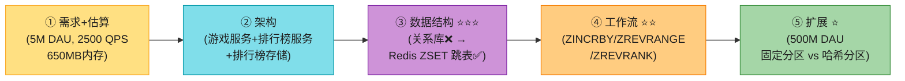
```mermaid
flowchart LR
    S1["① 需求+估算<br/>(5M DAU, 2500 QPS<br/>650MB内存)"] --> S2["② 架构<br/>(游戏服务+排行榜服务<br/>+排行榜存储)"]
    S2 --> S3["③ 数据结构 ⭐⭐⭐<br/>(关系库❌ →<br/>Redis ZSET 跳表✅)"]
    S3 --> S4["④ 工作流 ⭐⭐<br/>(ZINCRBY/ZREVRANGE<br/>/ZREVRANK)"]
    S4 --> S5["⑤ 扩展 ⭐<br/>(500M DAU<br/>固定分区 vs 哈希分区)"]

    style S1 fill:#FFE082,stroke:#F9A825,color:#1f1f1f
    style S2 fill:#80DEEA,stroke:#0097A7,color:#1f1f1f
    style S3 fill:#CE93D8,stroke:#7B1FA2,color:#1f1f1f
    style S4 fill:#FFCC80,stroke:#F57C00,color:#1f1f1f
    style S5 fill:#A5D6A7,stroke:#388E3C,color:#1f1f1f
```

> 💡 **Step 1 关键**:**排行榜是高频更新 + 实时有序**——5M DAU,峰值 2500 QPS 写,但**单 Redis 撑得住**(650MB 内存,2500 QPS 轻松)。
>
> 💡 **关键信号词**:**"服务端设分防 MITM 作弊"** + **"关系库 ORDER BY 全表 O(n) 慢,Redis ZSET(跳表)O(log n)"** + **"5M 单 Redis 够,500M 才需分片(固定分区按分数段)"**——这三句直接拿下面试。

---

## 🗺️ 章节概览

| 小节 | 要点 | 重要性 |
|------|------|--------|
| 需求 + 估算 | 5M DAU、**2500 峰值 QPS**、650MB 内存 | ⭐⭐⭐⭐ |
| **高层架构** | 游戏服务 + 排行榜服务 + 存储 | ⭐⭐⭐⭐ |
| **为什么服务端设分** | 防 MITM 作弊;server-authoritative | ⭐⭐⭐⭐ |
| **数据结构 ⭐⭐⭐** | 关系库❌ → Redis ZSET(跳表)✅ | ⭐⭐⭐⭐⭐ |
| **ZSET 工作流 ⭐⭐** | ZINCRBY/ZREVRANGE/ZREVRANK | ⭐⭐⭐⭐⭐ |
| 存储 + 持久化 | 650MB 单机;副本 failover;MySQL 重建 | ⭐⭐⭐⭐ |
| **扩展 Redis ⭐⭐** | 固定分区 vs 哈希分区;scatter-gather | ⭐⭐⭐⭐⭐ |
| NoSQL 替代 | DynamoDB write sharding;percentile | ⭐⭐⭐ |
| 平局 + 故障恢复 | Hash 存时间戳;MySQL 重建 | ⭐⭐⭐ |
| **2026增量(补)** | DragonflyDB、lookup table O(1)、MemoryDB、t-digest、推送 | ⭐⭐⭐⭐⭐ |

---

## 1. 需求 + 估算

**澄清问题**(原书对话):

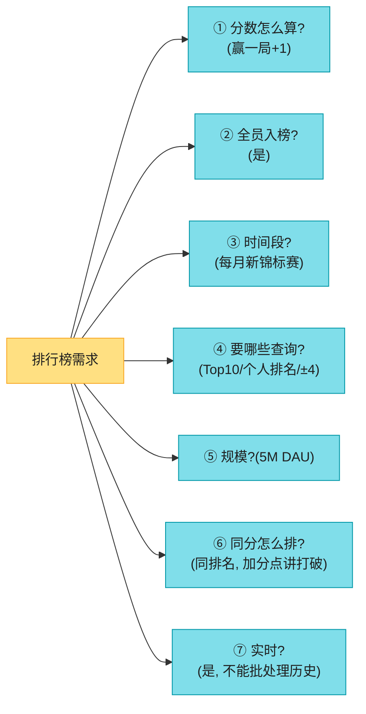
```mermaid
flowchart LR
    Q["排行榜需求"] --> A["① 分数怎么算?<br/>(赢一局+1)"]
    Q --> B["② 全员入榜?<br/>(是)"]
    Q --> C["③ 时间段?<br/>(每月新锦标赛)"]
    Q --> D["④ 要哪些查询?<br/>(Top10/个人排名/±4)"]
    Q --> E["⑤ 规模?(5M DAU)"]
    Q --> F["⑥ 同分怎么排?<br/>(同排名, 加分点讲打破)"]
    Q --> G["⑦ 实时?<br/>(是, 不能批处理历史)"]

    style Q fill:#FFE082,stroke:#F9A825,color:#1f1f1f
    style A fill:#80DEEA,stroke:#0097A7,color:#1f1f1f
    style B fill:#80DEEA,stroke:#0097A7,color:#1f1f1f
    style C fill:#80DEEA,stroke:#0097A7,color:#1f1f1f
    style D fill:#80DEEA,stroke:#0097A7,color:#1f1f1f
    style E fill:#80DEEA,stroke:#0097A7,color:#1f1f1f
    style F fill:#80DEEA,stroke:#0097A7,color:#1f1f1f
    style G fill:#80DEEA,stroke:#0097A7,color:#1f1f1f
```

**功能**:① 显 Top10;② 显用户个人排名;③ 显某用户前后 ±4(加分项)。

**非功能性**:**实时更新分数**(写入即时反映到榜);可扩展;可用;可靠。

**估算**(背):

```
5M DAU / 10^5s = 50 用户/s(均匀)
峰值 5× = 250 用户/s
分数更新 QPS = 50 × 10局/天 = 500, 峰值 2500
Top10 获取 QPS ≈ 50(开游戏时拉一次)
存储: 25M MAU 最坏每人入榜
  每条 = 24B(user_id) + 2B(score) = 26B
  25M × 26B = 650MB(翻倍算跳表/hash开销 → ~1.3GB)
→ 单 Redis 撑得住(内存 + 2500 QPS 都够)
```

> 💡 **核心洞察**:**5M DAU 规模,单 Redis 完全够**(650MB 内存,2500 QPS)。**只有到 500M DAU 才需分片**。

---

## 2. 高层架构 ⭐⭐⭐⭐

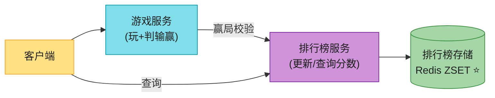
```mermaid
flowchart LR
    C["客户端"] --> GS["游戏服务<br/>(玩+判输赢)"]
    GS -->|"赢局校验"| LS["排行榜服务<br/>(更新/查询分数)"]
    LS --> STORE[("排行榜存储<br/>Redis ZSET ⭐")]
    C -->|"查询"| LS

    style C fill:#FFE082,stroke:#F9A825,color:#1f1f1f
    style GS fill:#80DEEA,stroke:#0097A7,color:#1f1f1f
    style LS fill:#CE93D8,stroke:#7B1FA2,color:#1f1f1f
    style STORE fill:#A5D6A7,stroke:#388E3C,color:#1f1f1f
```

| 组件 | 职责 |
|------|------|
| **游戏服务** | 用户玩游戏、判定输赢有效 |
| **排行榜服务** | 更新分数、查询榜单(Top10 / 个人 / ±4) |
| **排行榜存储** | Redis ZSET(有序集合) |

### 2.1 为什么服务端设分(防作弊)⭐⭐⭐⭐

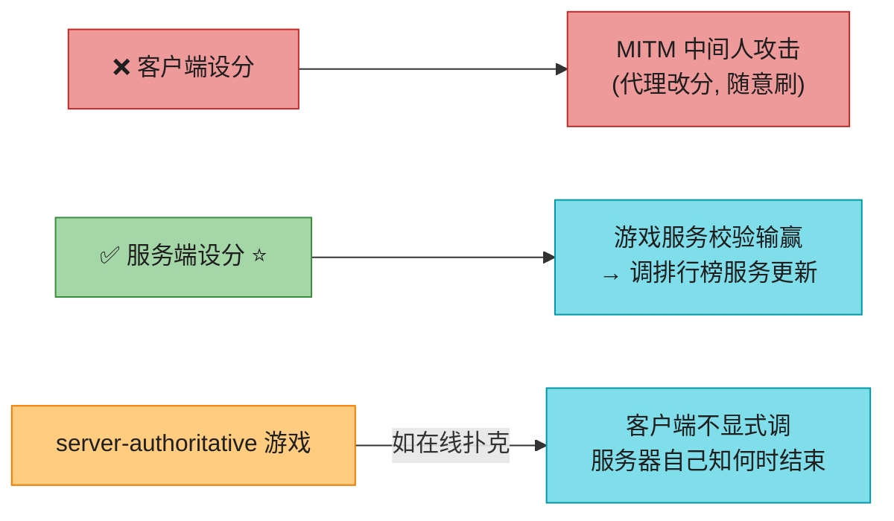
```mermaid
flowchart LR
    BAD["❌ 客户端设分"] --> MITM["MITM 中间人攻击<br/>(代理改分, 随意刷)"]
    GOOD["✅ 服务端设分 ⭐"] --> SAFE["游戏服务校验输赢<br/>→ 调排行榜服务更新"]
    SA["server-authoritative 游戏"] -->|"如在线扑克"| NOCALL["客户端不显式调<br/>服务器自己知何时结束"]

    style BAD fill:#EF9A9A,stroke:#C62828,color:#1f1f1f
    style MITM fill:#EF9A9A,stroke:#C62828,color:#1f1f1f
    style GOOD fill:#A5D6A7,stroke:#388E3C,color:#1f1f1f
    style SAFE fill:#80DEEA,stroke:#0097A7,color:#1f1f1f
    style SA fill:#FFCC80,stroke:#F57C00,color:#1f1f1f
    style NOCALL fill:#80DEEA,stroke:#0097A7,color:#1f1f1f
```

> 🪤 **追问陷阱(高频)**:"分数为什么不能客户端设?" → "**客户端设分会被 MITM 中间人攻击**(玩家挂代理改分)。必须**服务端设分**:游戏服务校验输赢 → 调排行榜服务更新。**server-authoritative 游戏(如扑克)服务端自己知何时结束,客户端甚至不显式调用**。"

### 2.2 要不要消息队列?

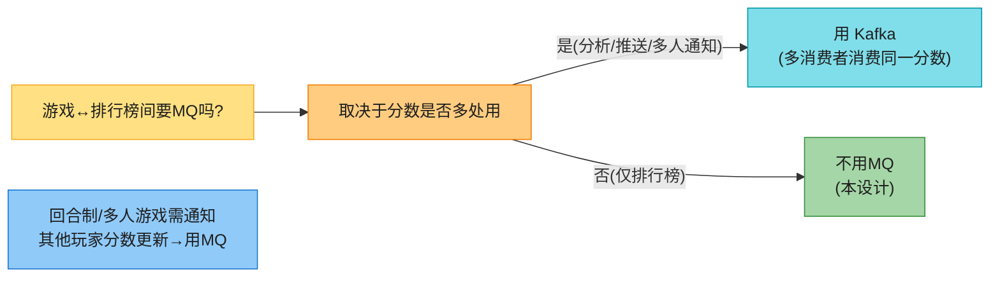
```mermaid
flowchart LR
    Q["游戏↔排行榜间要MQ吗?"] --> DEP["取决于分数是否多处用"]
    DEP -->|"是(分析/推送/多人通知)"| MQ["用 Kafka<br/>(多消费者消费同一分数)"]
    DEP -->|"否(仅排行榜)"| NO["不用MQ<br/>(本设计)"]
    NOTE["回合制/多人游戏需通知<br/>其他玩家分数更新→用MQ"]

    style Q fill:#FFE082,stroke:#F9A825,color:#1f1f1f
    style DEP fill:#FFCC80,stroke:#F57C00,color:#1f1f1f
    style MQ fill:#80DEEA,stroke:#0097A7,color:#1f1f1f
    style NO fill:#A5D6A7,stroke:#388E3C,color:#1f1f1f
    style NOTE fill:#90CAF9,stroke:#1976D2,color:#1f1f1f
```

> 💡 **看场景**:分数仅用于排行榜 → 不用 MQ;分数还用于**分析/推送/多人通知** → 用 Kafka(多消费者)。本设计不是显式需求,不用 MQ。

---

## 3. 数据结构 ⭐⭐⭐⭐⭐(本章核心)

### 3.1 API 设计

```
POST /v1/scores              # 更新分数(内部API, 仅游戏服务调)
  { user_id, points }
GET /v1/scores               # 取 Top10
GET /v1/scores/{user_id}     # 取个人排名
```

### 3.2 方案一:关系库(❌ 不行)⭐⭐⭐

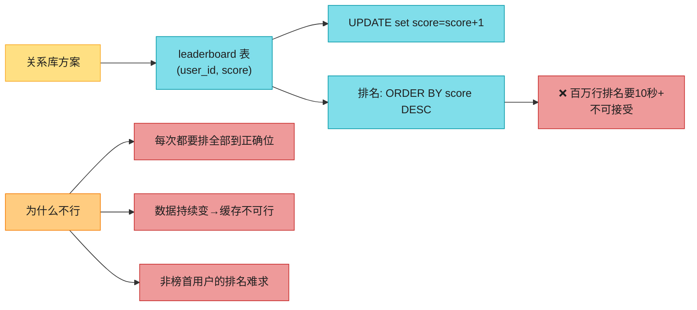
```mermaid
flowchart LR
    RDS["关系库方案"] --> T["leaderboard 表<br/>(user_id, score)"]
    T --> UP["UPDATE set score=score+1"]
    T --> RANK["排名: ORDER BY score DESC"]
    RANK --> SLOW["❌ 百万行排名要10秒+<br/>不可接受"]
    PROB["为什么不行"] --> P1["每次都要排全部到正确位"]
    PROB --> P2["数据持续变→缓存不可行"]
    PROB --> P3["非榜首用户的排名难求"]

    style RDS fill:#FFE082,stroke:#F9A825,color:#1f1f1f
    style T fill:#80DEEA,stroke:#0097A7,color:#1f1f1f
    style UP fill:#80DEEA,stroke:#0097A7,color:#1f1f1f
    style RANK fill:#80DEEA,stroke:#0097A7,color:#1f1f1f
    style SLOW fill:#EF9A9A,stroke:#C62828,color:#1f1f1f
    style PROB fill:#FFCC80,stroke:#F57C00,color:#1f1f1f
    style P1 fill:#EF9A9A,stroke:#C62828,color:#1f1f1f
    style P2 fill:#EF9A9A,stroke:#C62828,color:#1f1f1f
    style P3 fill:#EF9A9A,stroke:#C62828,color:#1f1f1f
```

> 📝 **关系库方案**:leaderboard 表,赢一局 `UPDATE score=score+1`;排名 `SELECT ... ORDER BY score DESC`。**问题**:
> - 排名要排全部玩家到正确位(可能同分)→ **百万行要 10 秒+**;
> - 数据**持续变化** → 缓存不可行;
> - **非榜首用户排名难求**(要嵌套子查询 `COUNT(*) WHERE score>=`)。

```sql
-- 关系库求排名(嵌套查询, 慢)
SELECT *, (SELECT COUNT(*) FROM leaderboard lb2
           WHERE lb2.score >= lb1.score) AS rank
FROM leaderboard lb1
WHERE lb1.user_id = ?;
-- LIMIT 10 只解 Top10, 个人排名仍要全表扫
```

### 3.3 方案二:Redis ZSET(✅ 银弹)⭐⭐⭐⭐⭐

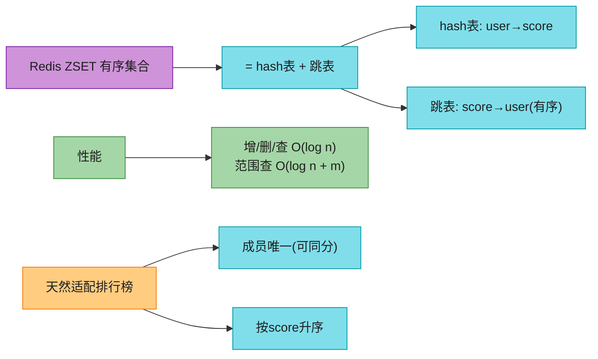
```mermaid
flowchart LR
    ZSET["Redis ZSET 有序集合"] --> STRUCT["= hash表 + 跳表"]
    STRUCT --> HT["hash表: user→score"]
    STRUCT --> SK["跳表: score→user(有序)"]
    PERF["性能"] --> LOG["增/删/查 O(log n)<br/>范围查 O(log n + m)"]
    FIT["天然适配排行榜"] --> F1["成员唯一(可同分)"]
    FIT --> F2["按score升序"]

    style ZSET fill:#CE93D8,stroke:#7B1FA2,color:#1f1f1f
    style STRUCT fill:#80DEEA,stroke:#0097A7,color:#1f1f1f
    style HT fill:#80DEEA,stroke:#0097A7,color:#1f1f1f
    style SK fill:#80DEEA,stroke:#0097A7,color:#1f1f1f
    style PERF fill:#A5D6A7,stroke:#388E3C,color:#1f1f1f
    style LOG fill:#A5D6A7,stroke:#388E3C,color:#1f1f1f
    style FIT fill:#FFCC80,stroke:#F57C00,color:#1f1f1f
    style F1 fill:#80DEEA,stroke:#0097A7,color:#1f1f1f
    style F2 fill:#80DEEA,stroke:#0097A7,color:#1f1f1f
```

> 💡 **ZSET 是为排行榜而生的数据结构**:**成员唯一 + 按分数排序 + 跳表实现**。增删查 **O(log n)**,范围查 **O(log n + m)**(m=取的条数)。

### 3.4 跳表原理 ⭐⭐(面试常问)

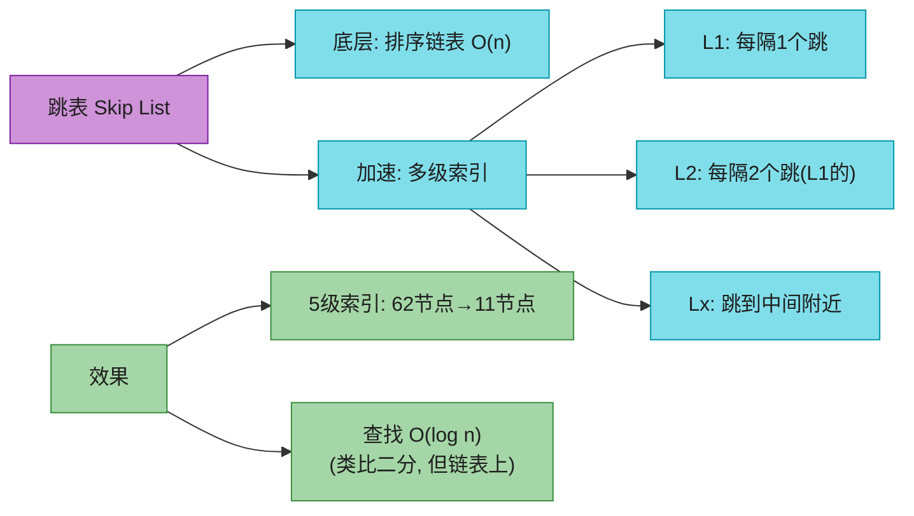
```mermaid
flowchart LR
    SKIP["跳表 Skip List"] --> BASE["底层: 排序链表 O(n)"]
    SKIP --> IDX["加速: 多级索引"]
    IDX --> L1["L1: 每隔1个跳"]
    IDX --> L2["L2: 每隔2个跳(L1的)"]
    IDX --> LX["Lx: 跳到中间附近"]
    EFF["效果"] --> E1["5级索引: 62节点→11节点"]
    EFF --> LOG2["查找 O(log n)<br/>(类比二分, 但链表上)"]

    style SKIP fill:#CE93D8,stroke:#7B1FA2,color:#1f1f1f
    style BASE fill:#80DEEA,stroke:#0097A7,color:#1f1f1f
    style IDX fill:#80DEEA,stroke:#0097A7,color:#1f1f1f
    style L1 fill:#80DEEA,stroke:#0097A7,color:#1f1f1f
    style L2 fill:#80DEEA,stroke:#0097A7,color:#1f1f1f
    style LX fill:#80DEEA,stroke:#0097A7,color:#1f1f1f
    style EFF fill:#A5D6A7,stroke:#388E3C,color:#1f1f1f
    style E1 fill:#A5D6A7,stroke:#388E3C,color:#1f1f1f
    style LOG2 fill:#A5D6A7,stroke:#388E3C,color:#1f1f1f
```

> 📝 **跳表** = 排序链表 + 多级索引(类比链表上的二分)。底层 O(n),加 L1(每隔一个跳)/L2/.../Lx 索引 → 查找 **O(log n)**。例 5 级索引,从底层走 62 节点 → 跳表只走 11 节点。**每次插入/更新自动放到正确位**(关系库要重排)。

---

## 4. ZSET 工作流 ⭐⭐⭐⭐⭐

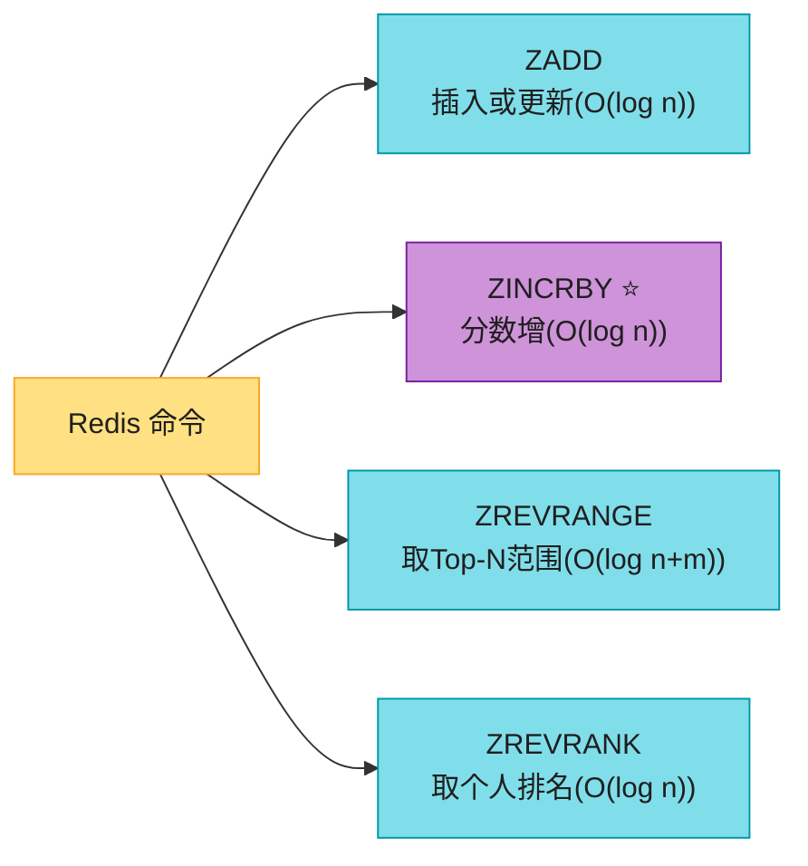
```mermaid
flowchart LR
    OP["Redis 命令"] --> ZADD["ZADD<br/>插入或更新(O(log n))"]
    OP --> ZIN["ZINCRBY ⭐<br/>分数增(O(log n))"]
    OP --> ZRANGE["ZREVRANGE<br/>取Top-N范围(O(log n+m))"]
    OP --> ZRANK["ZREVRANK<br/>取个人排名(O(log n))"]

    style OP fill:#FFE082,stroke:#F9A825,color:#1f1f1f
    style ZADD fill:#80DEEA,stroke:#0097A7,color:#1f1f1f
    style ZIN fill:#CE93D8,stroke:#7B1FA2,color:#1f1f1f
    style ZRANGE fill:#80DEEA,stroke:#0097A7,color:#1f1f1f
    style ZRANK fill:#80DEEA,stroke:#0097A7,color:#1f1f1f
```

| 命令 | 用途 | 复杂度 |
|------|------|--------|
| **ZADD** | 不存在则插入,存在则更新分数 | O(log n) |
| **ZINCRBY** ⭐ | 分数增(不存在则从 0 起) | O(log n) |
| **ZREVRANGE** | 降序取范围(Top-N)+ WITHSCORES | O(log n + m) |
| **ZREVRANK** | 取个人排名(降序) | O(log n) |

### 4.1 四个核心操作

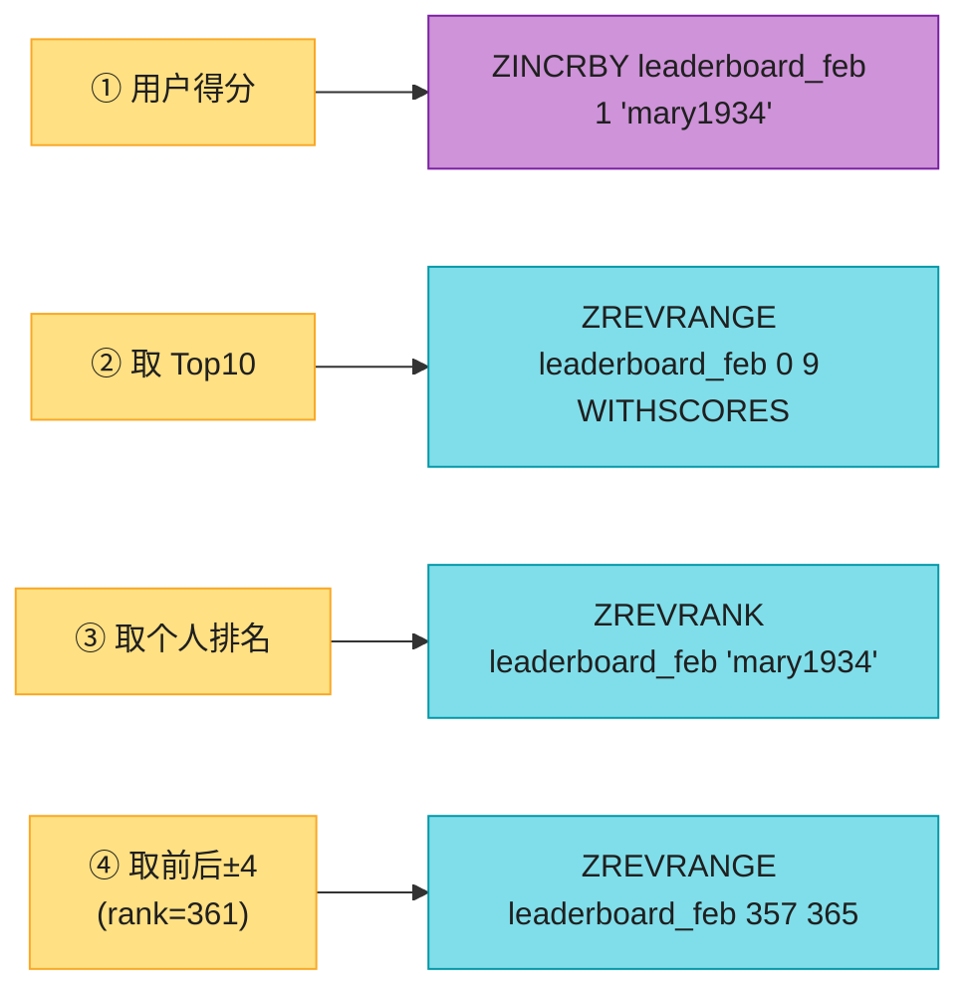
```mermaid
flowchart LR
    W1["① 用户得分"] --> C1["ZINCRBY leaderboard_feb 1 'mary1934'"]
    W2["② 取 Top10"] --> C2["ZREVRANGE leaderboard_feb 0 9 WITHSCORES"]
    W3["③ 取个人排名"] --> C3["ZREVRANK leaderboard_feb 'mary1934'"]
    W4["④ 取前后±4<br/>(rank=361)"] --> C4["ZREVRANGE leaderboard_feb 357 365"]

    style W1 fill:#FFE082,stroke:#F9A825,color:#1f1f1f
    style C1 fill:#CE93D8,stroke:#7B1FA2,color:#1f1f1f
    style W2 fill:#FFE082,stroke:#F9A825,color:#1f1f1f
    style C2 fill:#80DEEA,stroke:#0097A7,color:#1f1f1f
    style W3 fill:#FFE082,stroke:#F9A825,color:#1f1f1f
    style C3 fill:#80DEEA,stroke:#0097A7,color:#1f1f1f
    style W4 fill:#FFE082,stroke:#F9A825,color:#1f1f1f
    style C4 fill:#80DEEA,stroke:#0097A7,color:#1f1f1f
```

- **得分**:`ZINCRBY leaderboard_feb_2021 1 'mary1934'`(赢一局 +1)。
- **取 Top10**:`ZREVRANGE leaderboard_feb_2021 0 9 WITHSCORES`(降序 0-9 + 带分数)。
- **个人排名**:`ZREVRANK leaderboard_feb_2021 'mary1934'`。
- **前后 ±4**:先 `ZREVRANK` 拿到 rank=361,再 `ZREVRANGE 357 365`(前后各 4)。

> 💡 **每月新建一个 ZSET**(`leaderboard_<月>`),旧的转历史存储。

---

## 5. 存储 + 持久化

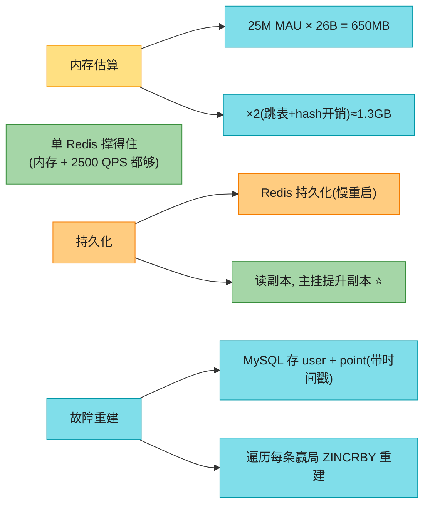
```mermaid
flowchart LR
    MEM["内存估算"] --> M1["25M MAU × 26B = 650MB"]
    MEM --> M2["×2(跳表+hash开销)≈1.3GB"]
    VERDICT["单 Redis 撑得住<br/>(内存 + 2500 QPS 都够)"]
    PERS["持久化"] --> P1["Redis 持久化(慢重启)"]
    PERS --> P2["读副本, 主挂提升副本 ⭐"]
    REBUILD["故障重建"] --> R1["MySQL 存 user + point(带时间戳)"]
    REBUILD --> R2["遍历每条赢局 ZINCRBY 重建"]

    style MEM fill:#FFE082,stroke:#F9A825,color:#1f1f1f
    style M1 fill:#80DEEA,stroke:#0097A7,color:#1f1f1f
    style M2 fill:#80DEEA,stroke:#0097A7,color:#1f1f1f
    style VERDICT fill:#A5D6A7,stroke:#388E3C,color:#1f1f1f
    style PERS fill:#FFCC80,stroke:#F57C00,color:#1f1f1f
    style P1 fill:#FFCC80,stroke:#F57C00,color:#1f1f1f
    style P2 fill:#A5D6A7,stroke:#388E3C,color:#1f1f1f
    style REBUILD fill:#80DEEA,stroke:#0097A7,color:#1f1f1f
    style R1 fill:#80DEEA,stroke:#0097A7,color:#1f1f1f
    style R2 fill:#80DEEA,stroke:#0097A7,color:#1f1f1f
```

> 💡 **持久化**:Redis 持久化(磁盘重启慢)→ 用**读副本**(主挂提升副本 + 挂新副本)。
>
> 📝 **配套 MySQL**:存 user 表(ID + 显示名)和 point 表(user_id + score + 时间戳)——用于游戏历史 + **Redis 全挂时从 MySQL 重建**(遍历每条赢局 ZINCRBY)。
>
> 💡 **小优化**:Top10 玩家详情(名/头像)单独缓存(最频繁访问)。

---

## 6. 云 vs 自管(Deep Dive 入口)

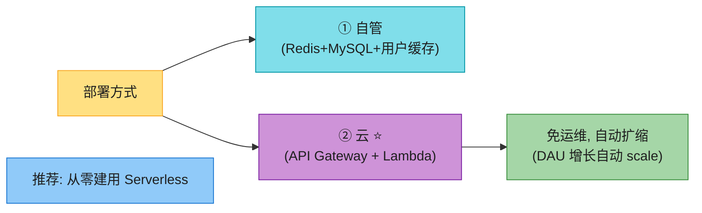
```mermaid
flowchart LR
    DEPLOY["部署方式"] --> SELF["① 自管<br/>(Redis+MySQL+用户缓存)"]
    DEPLOY --> CLOUD["② 云 ⭐<br/>(API Gateway + Lambda)"]
    CLOUD --> ADV["免运维, 自动扩缩<br/>(DAU 增长自动 scale)"]
    REC["推荐: 从零建用 Serverless"]

    style DEPLOY fill:#FFE082,stroke:#F9A825,color:#1f1f1f
    style SELF fill:#80DEEA,stroke:#0097A7,color:#1f1f1f
    style CLOUD fill:#CE93D8,stroke:#7B1FA2,color:#1f1f1f
    style ADV fill:#A5D6A7,stroke:#388E3C,color:#1f1f1f
    style REC fill:#90CAF9,stroke:#1976D2,color:#1f1f1f
```

**自管**:Redis + MySQL + Top10 用户详情缓存。
**云**:API Gateway + Lambda(serverless,免运维,自动扩缩);Lambda 调 Redis/MySQL。**从零建推荐 serverless**(GCP Cloud Functions / Azure Functions 同理)。

| API | Lambda 函数 |
|------|------|
| `POST /v1/scores` | LeaderboardUpdateScore |
| `GET /v1/scores` | LeaderboardFetchTop10 |
| `GET /v1/scores/{user_id}` | LeaderboardFetchPlayerRank |

---

## 7. 扩展 Redis:500M DAU 分片 ⭐⭐⭐⭐⭐(本章难点)

> 📝 **5M DAU 单 Redis 够**;**500M DAU(100×)→ 65GB 内存 + 250K QPS → 必须分片**。

### 7.1 两种分区

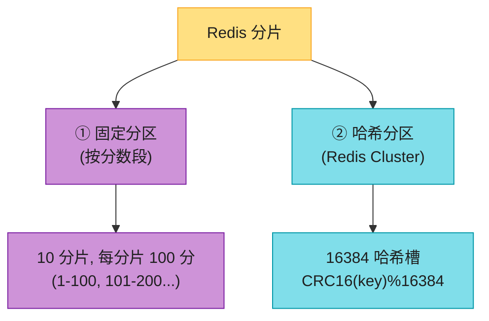
```mermaid
flowchart TD
    PART["Redis 分片"] --> FIX["① 固定分区<br/>(按分数段)"]
    PART --> HASH["② 哈希分区<br/>(Redis Cluster)"]
    FIX --> FIXP["10 分片, 每分片 100 分<br/>(1-100, 101-200...)"]
    HASH --> HASHP["16384 哈希槽<br/>CRC16(key)%16384"]

    style PART fill:#FFE082,stroke:#F9A825,color:#1f1f1f
    style FIX fill:#CE93D8,stroke:#7B1FA2,color:#1f1f1f
    style HASH fill:#80DEEA,stroke:#0097A7,color:#1f1f1f
    style FIXP fill:#CE93D8,stroke:#7B1FA2,color:#1f1f1f
    style HASHP fill:#80DEEA,stroke:#0097A7,color:#1f1f1f
```

### 7.2 固定分区(按分数段)⭐⭐

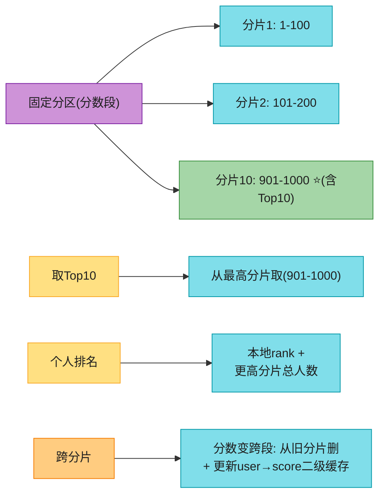
```mermaid
flowchart LR
    FIX["固定分区(分数段)"] --> S1["分片1: 1-100"]
    FIX --> S2["分片2: 101-200"]
    FIX --> S10["分片10: 901-1000 ⭐(含Top10)"]
    TOP["取Top10"] --> TOPF["从最高分片取(901-1000)"]
    RANK["个人排名"] --> RK["本地rank +<br/>更高分片总人数"]
    CROSS["跨分片"] --> CR["分数变跨段: 从旧分片删<br/>+ 更新user→score二级缓存"]

    style FIX fill:#CE93D8,stroke:#7B1FA2,color:#1f1f1f
    style S1 fill:#80DEEA,stroke:#0097A7,color:#1f1f1f
    style S2 fill:#80DEEA,stroke:#0097A7,color:#1f1f1f
    style S10 fill:#A5D6A7,stroke:#388E3C,color:#1f1f1f
    style TOP fill:#FFE082,stroke:#F9A825,color:#1f1f1f
    style TOPF fill:#80DEEA,stroke:#0097A7,color:#1f1f1f
    style RANK fill:#FFE082,stroke:#F9A825,color:#1f1f1f
    style RK fill:#80DEEA,stroke:#0097A7,color:#1f1f1f
    style CROSS fill:#FFCC80,stroke:#F57C00,color:#1f1f1f
    style CR fill:#80DEEA,stroke:#0097A7,color:#1f1f1f
```

**固定分区**:按**分数段**分(如 1-100, 101-200, ..., 901-1000)。
- **取 Top10**:直接从**最高分片**取(分数段 901-1000 含 Top10)。
- **个人排名**:**本地 rank + 更高分片总人数**(分片人数用 `INFO keyspace` O(1) 取)。
- **挑战**:用户分数变跨段 → 从旧分片删 + 更新 **user→score 二级缓存**(避查 MySQL)。
- **要求**:分数均匀分布,否则调分数段。

### 7.3 哈希分区(Redis Cluster)与 scatter-gather ⭐⭐

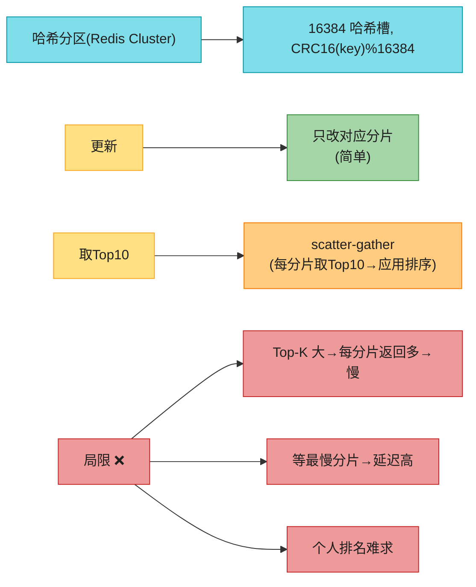
```mermaid
flowchart LR
    HASH["哈希分区(Redis Cluster)"] --> SLOT["16384 哈希槽, CRC16(key)%16384"]
    UPD["更新"] --> JUST["只改对应分片<br/>(简单)"]
    TOP["取Top10"] --> SG["scatter-gather<br/>(每分片取Top10→应用排序)"]
    BAD2["局限 ❌"] --> B1["Top-K 大→每分片返回多→慢"]
    BAD2 --> B2["等最慢分片→延迟高"]
    BAD2 --> B3["个人排名难求"]

    style HASH fill:#80DEEA,stroke:#0097A7,color:#1f1f1f
    style SLOT fill:#80DEEA,stroke:#0097A7,color:#1f1f1f
    style UPD fill:#FFE082,stroke:#F9A825,color:#1f1f1f
    style JUST fill:#A5D6A7,stroke:#388E3C,color:#1f1f1f
    style TOP fill:#FFE082,stroke:#F9A825,color:#1f1f1f
    style SG fill:#FFCC80,stroke:#F57C00,color:#1f1f1f
    style BAD2 fill:#EF9A9A,stroke:#C62828,color:#1f1f1f
    style B1 fill:#EF9A9A,stroke:#C62828,color:#1f1f1f
    style B2 fill:#EF9A9A,stroke:#C62828,color:#1f1f1f
    style B3 fill:#EF9A9A,stroke:#C62828,color:#1f1f1f
```

**哈希分区**:Redis Cluster 自动分片,**CRC16(key)%16384** 哈希槽。
- **更新**:简单,只改对应分片。
- **取 Top10**:**scatter-gather**(每分片取 Top10 → 应用归并排序,可并行降延迟)。
- **局限**:① Top-K 大 → 每分片返回多 → 慢;② 等最慢分片 → 延迟高;③ **个人排名难求**。

> 💡 **原书倾向固定分区**:因为哈希分区 Top10/个人排名都不直观。**固定分区更适合排行榜**。

### 7.4 Redis 节点选型

> 📝 **写重应用要 2× 内存**(留余量做故障快照)。**Redis-benchmark** 工具压测选节点规格。

---

## 8. NoSQL 替代(DynamoDB)⭐⭐⭐

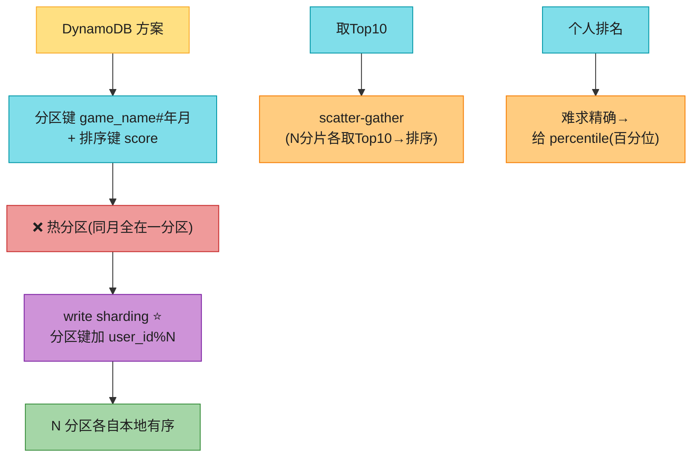
```mermaid
flowchart TD
    DDB["DynamoDB 方案"] --> PK["分区键 game_name#年月<br/>+ 排序键 score"]
    PK --> HOT["❌ 热分区(同月全在一分区)"]
    HOT --> WS["write sharding ⭐<br/>分区键加 user_id%N"]
    WS --> LOCALLY["N 分区各自本地有序"]
    TOP2["取Top10"] --> SG2["scatter-gather<br/>(N分片各取Top10→排序)"]
    RANK2["个人排名"] --> HARD2["难求精确→<br/>给 percentile(百分位)"]

    style DDB fill:#FFE082,stroke:#F9A825,color:#1f1f1f
    style PK fill:#80DEEA,stroke:#0097A7,color:#1f1f1f
    style HOT fill:#EF9A9A,stroke:#C62828,color:#1f1f1f
    style WS fill:#CE93D8,stroke:#7B1FA2,color:#1f1f1f
    style LOCALLY fill:#A5D6A7,stroke:#388E3C,color:#1f1f1f
    style TOP2 fill:#80DEEA,stroke:#0097A7,color:#1f1f1f
    style SG2 fill:#FFCC80,stroke:#F57C00,color:#1f1f1f
    style RANK2 fill:#80DEEA,stroke:#0097A7,color:#1f1f1f
    style HARD2 fill:#FFCC80,stroke:#F57C00,color:#1f1f1f
```

> 📝 **DynamoDB**:分区键 `game_name#年月` + 排序键 score + GSI。**热分区问题**(同月全在一分区)→ **write sharding**(分区键加 `user_id%N`,散到 N 分区)。
> - **取 Top10**:scatter-gather。
> - **个人排名难求精确** → 给 **percentile**(百分位)。

### percentile 替代精确排名 ⭐

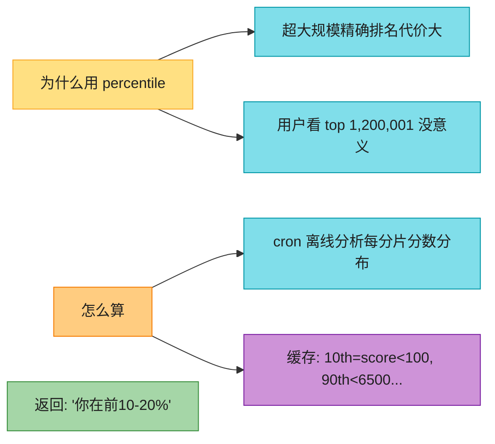
```mermaid
flowchart LR
    WHY["为什么用 percentile"] --> W1["超大规模精确排名代价大"]
    WHY --> W2["用户看 top 1,200,001 没意义"]
    HOW["怎么算"] --> H1["cron 离线分析每分片分数分布"]
    HOW --> H2["缓存: 10th=score<100, 90th<6500..."]
    RESULT["返回: '你在前10-20%'"]

    style WHY fill:#FFE082,stroke:#F9A825,color:#1f1f1f
    style W1 fill:#80DEEA,stroke:#0097A7,color:#1f1f1f
    style W2 fill:#80DEEA,stroke:#0097A7,color:#1f1f1f
    style HOW fill:#FFCC80,stroke:#F57C00,color:#1f1f1f
    style H1 fill:#80DEEA,stroke:#0097A7,color:#1f1f1f
    style H2 fill:#CE93D8,stroke:#7B1FA2,color:#1f1f1f
    style RESULT fill:#A5D6A7,stroke:#388E3C,color:#1f1f1f
```

> 💡 **percentile 比精确排名更友好**——告诉玩家"你在前 10-20%"比"第 1,200,001 名"体验好。**cron 离线分析每分片分数分布,缓存分位数→score 映射**。(2026 增量:t-digest 流式近似)

---

## 9. 平局打破 + 故障恢复(加分项)

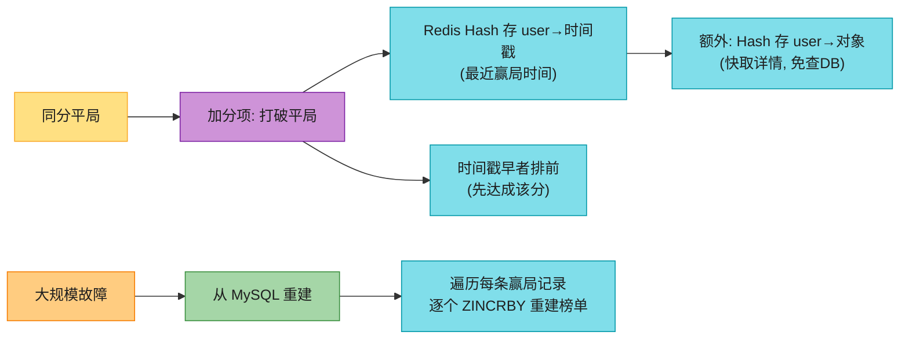
```mermaid
flowchart LR
    TIE["同分平局"] --> BREAK["加分项: 打破平局"]
    BREAK --> HASH2["Redis Hash 存 user→时间戳<br/>(最近赢局时间)"]
    BREAK --> RULE["时间戳早者排前<br/>(先达成该分)"]
    HASH2 --> U2["额外: Hash 存 user→对象<br/>(快取详情, 免查DB)"]
    FAIL["大规模故障"] --> REB["从 MySQL 重建"]
    REB --> REB2["遍历每条赢局记录<br/>逐个 ZINCRBY 重建榜单"]

    style TIE fill:#FFE082,stroke:#F9A825,color:#1f1f1f
    style BREAK fill:#CE93D8,stroke:#7B1FA2,color:#1f1f1f
    style HASH2 fill:#80DEEA,stroke:#0097A7,color:#1f1f1f
    style RULE fill:#80DEEA,stroke:#0097A7,color:#1f1f1f
    style U2 fill:#80DEEA,stroke:#0097A7,color:#1f1f1f
    style FAIL fill:#FFCC80,stroke:#F57C00,color:#1f1f1f
    style REB fill:#A5D6A7,stroke:#388E3C,color:#1f1f1f
    style REB2 fill:#80DEEA,stroke:#0097A7,color:#1f1f1f
```

**平局打破**:用 Redis Hash 存 `user→最近赢局时间戳`,同分时**先达成者排前**。Hash 还可存 `user→对象`,快速取详情(免查 DB)。

**故障恢复**:Redis 全挂 → 从 MySQL 遍历每条赢局记录(带时间戳),逐个 `ZINCRBY` 重建榜单(离线脚本)。

---

## 10. 2026 现代增量(原书没讲的硬核)⭐⭐⭐⭐⭐

### 10.1 超大规模:lookup table O(1) 精确排名(原书用 percentile)⭐⭐⭐

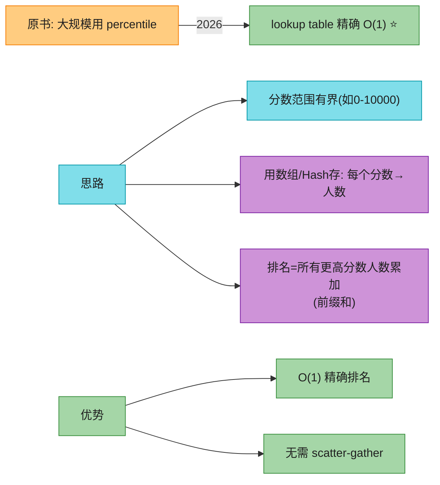
```mermaid
flowchart LR
    OLD["原书: 大规模用 percentile"] -->|"2026"| NEW["lookup table 精确 O(1) ⭐"]
    IDEA["思路"] --> I1["分数范围有界(如0-10000)"]
    IDEA --> I2["用数组/Hash存: 每个分数→人数"]
    IDEA --> I3["排名=所有更高分数人数累加<br/>(前缀和)"]
    ADV["优势"] --> A1["O(1) 精确排名"]
    ADV --> A2["无需 scatter-gather"]

    style OLD fill:#FFCC80,stroke:#F57C00,color:#1f1f1f
    style NEW fill:#A5D6A7,stroke:#388E3C,color:#1f1f1f
    style IDEA fill:#80DEEA,stroke:#0097A7,color:#1f1f1f
    style I1 fill:#80DEEA,stroke:#0097A7,color:#1f1f1f
    style I2 fill:#CE93D8,stroke:#7B1FA2,color:#1f1f1f
    style I3 fill:#CE93D8,stroke:#7B1FA2,color:#1f1f1f
    style ADV fill:#A5D6A7,stroke:#388E3C,color:#1f1f1f
    style A1 fill:#A5D6A7,stroke:#388E3C,color:#1f1f1f
    style A2 fill:#A5D6A7,stroke:#388E3C,color:#1f1f1f
```

> 🔄 **2026 现代版话术**(原书大规模只能 percentile):
> "原书到 500M DAU 只能近似 percentile。但**游戏分数范围往往有界**(如 0-10000),可用 **lookup table(查找表)**:一个数组存'每个分数对应的人数',排名 = 更高分数人数的前缀和 → **O(1) 精确排名**,无需 scatter-gather。Redis 用 Hash + BITFIELD/PFCOUNT 实现。**这是大规模排行榜的银弹**(Discord/Reddit 都用)。"

### 10.2 DragonflyDB:多线程 Redis 替代(原书没提)

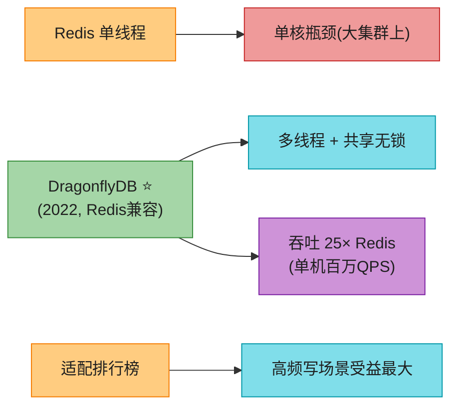
```mermaid
flowchart LR
    REDIS["Redis 单线程"] --> BOTT["单核瓶颈(大集群上)"]
    DRAG["DragonflyDB ⭐<br/>(2022, Redis兼容)"] --> MT["多线程 + 共享无锁"]
    DRAG --> PERF["吞吐 25× Redis<br/>(单机百万QPS)"]
    FIT2["适配排行榜"] --> F1["高频写场景受益最大"]

    style REDIS fill:#FFCC80,stroke:#F57C00,color:#1f1f1f
    style BOTT fill:#EF9A9A,stroke:#C62828,color:#1f1f1f
    style DRAG fill:#A5D6A7,stroke:#388E3C,color:#1f1f1f
    style MT fill:#80DEEA,stroke:#0097A7,color:#1f1f1f
    style PERF fill:#CE93D8,stroke:#7B1FA2,color:#1f1f1f
    style FIT2 fill:#FFCC80,stroke:#F57C00,color:#1f1f1f
    style F1 fill:#80DEEA,stroke:#0097A7,color:#1f1f1f
```

> 💡 **DragonflyDB**(2022)是 Redis 兼容的多线程内存库,单机吞吐号称 **25× Redis**。排行榜高频写场景受益最大。**讲一句 = 知道 2026 内存库演进**。

### 10.3 其它 2026 增量

```mermaid
flowchart LR
    MOD["2026 排行榜增量"] --> MDB["AWS MemoryDB<br/>(持久化Redis当主库)"]
    MOD --> PUSH["WebSocket/SSE 推送<br/>(原书客户端轮询)"]
    MOD --> TD["t-digest 流式 percentile<br/>(替代cron离线)"]
    MOD --> CRDT["CRDT 跨区排行榜<br/>(多region合并)"]
    MOD --> LP["Redis 7 listpack<br/>(替代ziplist, 小集合省内存)"]

    style MOD fill:#CE93D8,stroke:#7B1FA2,color:#1f1f1f
    style MDB fill:#80DEEA,stroke:#0097A7,color:#1f1f1f
    style PUSH fill:#80DEEA,stroke:#0097A7,color:#1f1f1f
    style TD fill:#80DEEA,stroke:#0097A7,color:#1f1f1f
    style CRDT fill:#80DEEA,stroke:#0097A7,color:#1f1f1f
    style LP fill:#80DEEA,stroke:#0097A7,color:#1f1f1f
```

| 技术 | 说明 |
|------|------|
| **AWS MemoryDB for Redis** | **持久化 Redis 当主库**(免 MySQL 重建,Redis 本身就 durable) |
| **WebSocket/SSE 推送** | 原书客户端 GET 轮询;2026 推送 Top10 变化(接 Vol.1 Ch12) |
| **t-digest** | 流式百分位近似(替代原书 cron 离线算),内存省、实时 |
| **CRDT 排行榜** | 跨区/全球排行榜,多 region 合并(接 V2-Ch2 有状态) |
| **Redis 7 listpack** | 替代 ziplist 存小集合,省内存 + 修复溢出 bug |
| **分层存储** ⭐ | Top-N 留 Redis 热层,其余冷层 percentile 近似(亿级玩家) |
| **RedisTimeseries** | 时序排行榜(赛季曲线/趋势榜) |

---

## ⚠️ 已过时 / 书里没说(2022 → 2026)

| 原书(2022) | 2026 现状 | 面试应对 |
|------------|----------|---------|
| 大规模只能 percentile | **lookup table O(1) 精确排名** | 讲分数有界用查找表 |
| Redis 单线程 | **DragonflyDB 多线程 25×** | 讲高频写用 DragonflyDB |
| MySQL 重建 | **AWS MemoryDB(持久 Redis 当主库)** | 讲免重建 |
| 客户端 GET 轮询 | **WebSocket/SSE 推送** | 讲实时推送 |
| cron 离线 percentile | **t-digest 流式近似** | 讲实时百分位 |
| 没提跨区 | **CRDT 多 region 排行榜** | 讲全球榜合并 |
| 没提分层 | **热榜 Redis + 冷层 percentile** | 讲亿级玩家分层 |
| Redis 6 ziplist | **Redis 7 listpack** | 讲省内存 |

---

## 💻 代码示例

### 示例 1:Redis ZSET 操作

```bash
# 每月新建一个 leaderboard(旧的转历史)
ZINCRBY leaderboard_2026_07 1 'mary1934'           # 赢一局 +1(不存在从0起)

# 取 Top10(降序 + 带分数)
ZREVRANGE leaderboard_2026_07 0 9 WITHSCORES
# → [(user2, 965), (user1, 950), ...]

# 个人排名
ZREVRANK leaderboard_2026_07 'mary1934'            # → 3

# 前后 ±4(rank=361)
ZREVRANGE leaderboard_2026_07 357 365              # 357~365
```

### 示例 2:平局打破(Hash 存时间戳)

```bash
# 赢局时同步存最近赢局时间(同分时先达成者排前)
ZINCRBY leaderboard_2026_07 1 'mary1934'
HSET last_win_ts_2026_07 'mary1934' 1752100000     # Hash: user→时间戳

# 同分排序逻辑(应用层): 同分则时间戳小者(先达成)排前
# HGET user_id → 比较时间戳
```

### 示例 3:固定分区(分数段)分片

```python
def shard_for_score(score, shards=10, per_shard=100):
    return min(score // per_shard, shards - 1)     # 分数→分片

def get_top10(shards):
    # Top10 在最高分片
    return redis.zrevrange(f'lb_2026_07_{shards-1}', 0, 9, withscores=True)

def get_rank(user_id, score, shards):
    local_rank = redis.zrevrank(f'lb_2026_07_{shard_for_score(score)}', user_id)
    # 排名 = 本地rank + 更高分片总人数
    higher = sum(redis.zcard(f'lb_2026_07_{s}')      # INFO keyspace O(1)
                 for s in range(shard_for_score(score)+1, shards))
    return local_rank + higher
```

### 示例 4:lookup table O(1) 精确排名(2026 增量)

```python
# 分数有界(0-10000): 用计数数组 + 前缀和做 O(1) 精确排名
def update_score(user_id, new_score):
    redis.hset('score_of', user_id, new_score)      # user→当前分
    redis.hincrby('count_at', new_score, 1)         # 该分数人数+1

def get_rank(user_id):
    score = int(redis.hget('score_of', user_id))
    # 排名 = 所有更高分数的人数累加(前缀和, 可预计算缓存)
    higher = sum(int(redis.hget('count_at', s) or 0)
                 for s in range(score+1, 10001))
    return higher + 1                               # O(分数范围), 可用BIT优化到O(log)
```

---

## 🪤 追问陷阱(面试官最爱问,本章集)

1. **"分数为什么不能客户端设?"** → 客户端设分会被 **MITM 中间人攻击**(挂代理改分)。**服务端设分**:游戏服务校验输赢 → 调排行榜服务。
2. **"关系库为什么不行?"** → `ORDER BY score DESC` 排全部百万行 **10 秒+**;数据持续变缓存不可行;非榜首排名要嵌套子查询全表扫。
3. **"用什么数据结构?"** → **Redis ZSET(有序集合)** = hash 表 + 跳表;增删查 O(log n),范围查 O(log n+m)。**为排行榜而生**。
4. **"跳表是什么?"** → 排序链表 + 多级索引(链表上的二分);底层 O(n) → 加索引 O(log n);**插入自动放正确位**(关系库要重排)。
5. **"取 Top10 怎么做?"** → `ZREVRANGE leaderboard_<月> 0 9 WITHSCORES`(降序 + 带分数)。
6. **"取个人排名怎么做?"** → `ZREVRANK leaderboard_<月> user_id`(O(log n))。
7. **"取前后 ±4 怎么做?"** → 先 `ZREVRANK` 拿 rank,再 `ZREVRANGE rank-4 rank+4`。
8. **"单 Redis 够吗?"** → 5M DAU:650MB 内存(×2 算开销 1.3GB)+ 2500 QPS,**单 Redis 撑得住**。500M DAU 才需分片。
9. **"持久化怎么做?"** → Redis 持久化(重启慢)→ **读副本 failover**;配套 MySQL 存 point(带时间戳),**全挂可重建**。
10. **"500M DAU 怎么分片?"** → **固定分区(按分数段)**:Top10 从最高分片取;个人排名 = 本地 rank + 更高分片总人数(分片人数 O(1) 取)。哈希分区 Top10/排名都难,不如固定。
11. **"哈希分区为什么不如固定分区?"** → 哈希分区 Top10 要 scatter-gather(慢);个人排名难求;等最慢分片延迟高。
12. **"同分怎么排?"** → 用 Redis Hash 存 `user→最近赢局时间戳`,同分时**先达成者排前**。
13. **"Redis 全挂怎么办?"** → 从 MySQL 遍历每条赢局记录(带时间戳),逐个 `ZINCRBY` 重建榜单(离线脚本)。
14. **"大规模个人排名太贵怎么办?"** → 用 **percentile**(百分位,"前 10-20%"比"第 1,200,001"友好);2026 用 **lookup table**(分数有界时 O(1) 精确排名)或 **t-digest**(流式近似)。
15. **"要不要 MQ?"** → 分数仅用于排行榜不用;分数还用于分析/推送/多人通知 → 用 Kafka 多消费者。回合制游戏需通知其他玩家分数 → 用 MQ。
16. **"2026 超大规模怎么搞?"** → **DragonflyDB**(多线程 25× 吞吐)+ **lookup table**(O(1) 精确排名)+ **分层**(Top-N 热层 Redis,其余冷层 percentile)+ **MemoryDB**(持久化免重建)。

---

## 🏭 生产级产品速查表

| 产品 | 特色 |
|------|------|
| **Redis ZSET** | 排行榜银弹;跳表实现;O(log n) |
| **AWS ElastiCache for Redis** | 托管 Redis;排行榜官方博客案例 |
| **AWS MemoryDB for Redis** | **持久化 Redis 当主库**(免 MySQL 重建) |
| **DragonflyDB** | Redis 兼容多线程;单机吞吐 25× Redis |
| **DynamoDB** | write sharding + GSI;percentile 近似排名 |
| **GameSpark / PlayFab** | 游戏后端即服务,内置排行榜 |
| **Discord / Reddit** | lookup table 精确排名工业实践 |

> 🏭 **业界标杆**:**Redis ZSET** 是排行榜银弹(跳表 O(log n));**AWS ElastiCache** 有官方排行榜案例;**DragonflyDB** 是 2026 多线程替代;**Discord/Reddit** 公开 lookup table 大规模精确排名实践。

---

## 📝 本章要点总结

```mermaid
flowchart LR
    ROOT(["V2-Ch10 游戏排行榜<br/>海量高频更新 + 实时有序排名"])

    B1["需求+估算 ⭐<br/>────────<br/>• 5M DAU, 2500峰值QPS<br/>• 650MB内存(单Redis够)<br/>• 实时有序"]
    B2["架构 ⭐⭐<br/>────────<br/>• 游戏服务+排行榜服务+存储<br/>• 服务端设分(防MITM)<br/>• MQ看场景"]
    B3["数据结构 ⭐⭐⭐<br/>────────<br/>• 关系库❌(ORDER BY全表)<br/>• Redis ZSET(跳表)✅<br/>• O(log n)"]
    B4["工作流 ⭐⭐<br/>────────<br/>• ZINCRBY得分<br/>• ZREVRANGE取Top10<br/>• ZREVRANK个人排名"]
    B5["扩展 ⭐⭐<br/>────────<br/>• 500M DAU固定分区(分数段)<br/>• 哈希分区scatter-gather<br/>• percentile近似"]
    B6["2026增量(补)<br/>────────<br/>• lookup table O(1)精确<br/>• DragonflyDB/MemoryDB<br/>• 推送/t-digest/分层"]

    ROOT --> B1
    ROOT --> B2
    ROOT --> B3
    ROOT --> B4
    ROOT --> B5
    ROOT --> B6

    style ROOT fill:#FFE082,stroke:#F57C00,color:#1f1f1f,stroke-width:3px
    style B1 fill:#80DEEA,stroke:#0097A7,color:#1f1f1f
    style B2 fill:#CE93D8,stroke:#7B1FA2,color:#1f1f1f
    style B3 fill:#EF9A9A,stroke:#C62828,color:#1f1f1f
    style B4 fill:#FFCC80,stroke:#F57C00,color:#1f1f1f
    style B5 fill:#90CAF9,stroke:#1976D2,color:#1f1f1f
    style B6 fill:#A5D6A7,stroke:#388E3C,color:#1f1f1f
```

**核心 Takeaways**:

1. **排行榜的核心是数据结构选型**——关系库 `ORDER BY` 全表 O(n) 不行;**Redis ZSET(跳表)O(log n)** 是银弹。
2. **服务端设分防作弊**——客户端设分会被 MITM 攻击;游戏服务校验输赢 → 调排行榜服务。
3. **Redis ZSET = hash 表 + 跳表**:ZINCRBY 得分;ZREVRANGE 取 Top10;ZREVRANK 个人排名;ZREVRANGE 取前后 ±4。
4. **5M DAU 单 Redis 够**(650MB 内存,2500 QPS);持久化用读副本 failover + MySQL 存 point 供重建。
5. **500M DAU 分片**:**固定分区(按分数段)** 优于哈希分区——Top10 从最高分片取,个人排名 = 本地 rank + 更高分片总人数。
6. **percentile 比精确排名友好**——"前 10-20%" 比"第 1,200,001"体验好;cron 离线算分位数→score 映射。
7. **平局打破**:Hash 存 `user→时间戳`,同分先达成者排前;**故障恢复**:从 MySQL 遍历赢局重建。
8. **2026 lookup table**:分数有界时,计数数组 + 前缀和做 **O(1) 精确排名**(Discord/Reddit 实践),无需 scatter-gather。
9. **DragonflyDB**(多线程 25× Redis)+ **MemoryDB**(持久化免重建)+ **WebSocket 推送**(替代轮询)+ **t-digest**(流式 percentile)+ **分层**(热 Redis/冷 percentile)。
10. **从零建推荐 serverless**(API Gateway + Lambda,免运维自动扩缩)。

> 🔗 **连接上下章**:**V2-Ch9 对象存储**是"海量不可变数据的耐久与成本";**V2-Ch10 游戏排行榜**是"实时高频更新的有序排名"(内存计算密集)。**V2-Ch11 支付系统**切换到"金融级强一致 + 事务"——从内存跳表切到分布式事务/对账/幂等,难度上一个台阶(金融三件套:支付/钱包/证券)。


---

## ☁️ AWS 实现(Day 0 → 扩展 → Day N)⭐⭐⭐⭐⭐

> **本节定位**:AWS 书 Part III / Ch17 落地视角——把上面 SDE 设计的排行榜(ZSET/跳表/固定分区/scatter-gather/percentile)搬上 AWS。一句话:**Redis ZSET(跳表)还是那个 ZSET,但运维、扩展、跨区、容灾全交给托管服务**。引用 Part II 服务:`aws_10`(DynamoDB/ElastiCache Redis)、`aws_09`(CloudFront/API Gateway)、`aws_12`(Kinesis 实时)。
>
> **AWS 书原文(信源)**:`/tmp/aws_ch17_raw.txt`(Ch17 Designing an Online Game,44KB)。原书给的是 **Day 0 MVP → 扩展 → Day N 生产级** 三段式落地路径,正好补本章"代码示例之后、过时表之前"的工程化缺口。

### 🗺️ AWS 架构总览

```mermaid
flowchart LR
    C["游戏客户端<br/>(玩家)"] --> CF["CloudFront<br/>(缓存榜单, 短TTL)"]
    CF --> AGW["API Gateway<br/>(安全/限流/路由)"]
    AGW --> L1["Lambda<br/>分数提交"]
    AGW --> L2["Lambda<br/>榜单查询"]
    L1 --> SQS["SQS<br/>(异步解耦)"]
    SQS --> L3["Lambda<br/>排名更新"]
    L3 --> EC["ElastiCache Redis<br/>(ZSET 存排行 ⭐)"]
    L3 --> DDB["DynamoDB<br/>(玩家档案/分数)"]
    L2 --> EC
    L2 --> DDB
    L3 --> SNS["SNS<br/>(排名变化通知)"]
    SNS --> C

    style C fill:#FFE082,stroke:#F9A825,color:#1f1f1f
    style CF fill:#90CAF9,stroke:#1976D2,color:#1f1f1f
    style AGW fill:#80DEEA,stroke:#0097A7,color:#1f1f1f
    style L1 fill:#CE93D8,stroke:#7B1FA2,color:#1f1f1f
    style L2 fill:#CE93D8,stroke:#7B1FA2,color:#1f1f1f
    style L3 fill:#CE93D8,stroke:#7B1FA2,color:#1f1f1f
    style SQS fill:#FFCC80,stroke:#F57C00,color:#1f1f1f
    style EC fill:#A5D6A7,stroke:#388E3C,color:#1f1f1f
    style DDB fill:#A5D6A7,stroke:#388E3C,color:#1f1f1f
    style SNS fill:#80DEEA,stroke:#0097A7,color:#1f1f1f
```

| AWS 服务 | 在排行榜里的角色 | 对应 Part II 章 |
|---------|----------------|----------------|
| **API Gateway** | 入口:安全/限流/路由 REST API(`POST /scores`、`GET /scores`) | `aws_09` |
| **Lambda** | 三类无状态函数:分数提交、榜单查询、排名更新(消费 SQS) | — |
| **ElastiCache for Redis** ⭐ | **ZSET 存排行榜**(ZADD/ZREVRANGE/ZRANK 天生适配) | `aws_10` |
| **DynamoDB** | 存玩家档案/分数/历史(NoSQL,按 player_id 分区) | `aws_10` |
| **SQS** | 异步解耦:分数提交 → 队列 → 排名更新(削峰) | — |
| **SNS** | 排名变化通知(推 mobile/email/SMS) | — |
| **CloudFront** | 缓存榜单响应(短 TTL),读多写少场景省 Redis 压力 | `aws_09` |
| **Kinesis**(Day N) | 实时分数变更流式处理(替代/补 SQS) | `aws_12` |

> 💡 **为什么 Redis ZSET 在 AWS 上更顺**:ElastiCache 是托管 Redis,**ZADD/ZREVRANGE/ZRANK 原生支持**,不用自己实现跳表。原书原话:"In-memory data stores like Redis sorted sets provide built-in support for these operations with high performance"(书页 830)。**这是排行榜上 AWS 的第一理由**。

### Day 0 MVP(千级玩家,简单省钱)

```mermaid
flowchart LR
    DAY0["Day 0 MVP<br/>(~1000 玩家)"] --> API["API Gateway + Lambda"]
    API --> D0A["① 分数写 DynamoDB"]
    API --> D0B["② ZADD 写 Redis ZSET"]
    D0A --> SIMP["单节点 Redis<br/>(非集群)"]
    D0B --> SIMP
    SIMP --> OK["650MB 内存, 2500 QPS<br/>单 Redis 撑得住"]
    CHEAP["省钱思路"] --> C1["Lambda 按调用付费"]
    CHEAP --> C2["DynamoDB on-demand"]
    CHEAP --> C3["Redis 单节点"]

    style DAY0 fill:#FFE082,stroke:#F9A825,color:#1f1f1f
    style API fill:#80DEEA,stroke:#0097A7,color:#1f1f1f
    style D0A fill:#A5D6A7,stroke:#388E3C,color:#1f1f1f
    style D0B fill:#CE93D8,stroke:#7B1FA2,color:#1f1f1f
    style SIMP fill:#A5D6A7,stroke:#388E3C,color:#1f1f1f
    style OK fill:#A5D6A7,stroke:#388E3C,color:#1f1f1f
    style CHEAP fill:#FFCC80,stroke:#F57C00,color:#1f1f1f
    style C1 fill:#FFE082,stroke:#F9A825,color:#1f1f1f
    style C2 fill:#FFE082,stroke:#F9A825,color:#1f1f1f
    style C3 fill:#FFE082,stroke:#F9A825,color:#1f1f1f
```

**Day 0 选型理由(原书)**:千级玩家,**单节点 Redis + DynamoDB on-demand + Lambda** 足够;架构简单、按用量付费、免运维。原书书页 840-841 明确列出 Day 0 六件套:API Gateway / Lambda / DynamoDB / ElastiCache / SQS / SNS。

**DynamoDB schema**(原书 Table 17-2):

| 表 | 分区键 | 排序键 | 其它属性 |
|----|--------|--------|---------|
| Player Scores | Player ID | Timestamp / session ID | Score, metadata, region |
| Leaderboard | `Global#{lbId}` 等 | Rank(倒序便于降序查) | Player ID, score |

> 💡 **Redis ZSET 命令直译 SDE 设计**——上面 4.1 节的 `ZINCRBY leaderboard_feb 1 'mary1934'` 在 ElastiCache 里**一字不改**就能跑。

**Lambda 函数示例(分数提交 → ZADD + DynamoDB)**:

```python
import boto3, json, os
redis = boto3.client('elasticache')  # 实际用 redis-py 连 ElastiCache endpoint
dynamodb = boto3.resource('dynamodb')
sqs = boto3.client('sqs')
score_table = dynamodb.Table('PlayerScores')
LB_KEY = os.environ['LEADERBOARD_KEY']  # 如 leaderboard_2026_07

def submit_score_handler(event, context):
    """API Gateway 触发: 玩家提交分数"""
    body = json.loads(event['body'])
    user_id, points = body['user_id'], body['points']
    # ① Redis ZSET 增分(跳表 O(log n))
    redis.zincrby(LB_KEY, points, user_id)
    # ② DynamoDB 落档(持久化, 供重建/分析)
    score_table.put_item(Item={
        'player_id': user_id,
        'timestamp': int(event['requestContext']['requestTimeEpoch']),
        'score': points, 'region': body.get('region', 'global'),
    })
    # ③ SQS 异步触发排名更新/通知
    sqs.send_message(QueueUrl=os.environ['QUEUE_URL'], MessageBody=json.dumps({'user_id': user_id}))
    return {'statusCode': 200, 'body': json.dumps({'status': 'ok'})}
```

> 📝 **三件套逻辑**(原书 Flow 17-3):① ZADD/ZINCRBY 写 Redis ZSET(实时榜);② put_item 落 DynamoDB(持久化);③ SQS 解耦排名更新/通知(削峰)。**Lambda 是无状态的,状态全在 Redis + DynamoDB**。

### 扩展(单 Region,百万级玩家)

```mermaid
flowchart TD
    SCALE["扩展(单 Region)"] --> REDIS["Redis 分片"]
    REDIS --> CLUSTER["Redis Cluster mode<br/>(多分片 + 副本)"]
    REDIS --> PARTITION["固定分区 vs 哈希分区<br/>(见 SDE §7)"]
    PARTITION --> FIX["固定: 按分数段多 key<br/>lb_2026_07_0 ... _9"]
    PARTITION --> HASH["哈希: CRC16 % 16384 槽"]
    BIG["全球榜太大"] --> SPLIT["Top-N 留 Redis<br/>全量存 DynamoDB"]
    READ["读多写少"] --> CF2["CloudFront 缓存榜单<br/>(几秒 TTL)"]
    CF2 --> LESS["省 Redis 压力 + 降延迟"]

    style SCALE fill:#FFE082,stroke:#F9A825,color:#1f1f1f
    style REDIS fill:#CE93D8,stroke:#7B1FA2,color:#1f1f1f
    style CLUSTER fill:#80DEEA,stroke:#0097A7,color:#1f1f1f
    style PARTITION fill:#FFCC80,stroke:#F57C00,color:#1f1f1f
    style FIX fill:#80DEEA,stroke:#0097A7,color:#1f1f1f
    style HASH fill:#80DEEA,stroke:#0097A7,color:#1f1f1f
    style BIG fill:#FFCC80,stroke:#F57C00,color:#1f1f1f
    style SPLIT fill:#A5D6A7,stroke:#388E3C,color:#1f1f1f
    style READ fill:#FFCC80,stroke:#F57C00,color:#1f1f1f
    style CF2 fill:#90CAF9,stroke:#1976D2,color:#1f1f1f
    style LESS fill:#A5D6A7,stroke:#388E3C,color:#1f1f1f
```

**SDE 分区方案在 AWS 上的落地**:

| SDE 设计 | AWS 落地 | 备注 |
|---------|---------|------|
| **固定分区(分数段)** | ElastiCache 多个 key:`lb_<月>_0`~`_9`,按分数段路由 | SDE §7.2;Top10 从最高 key 取 |
| **哈希分区(scatter-gather)** | ElastiCache **Cluster mode**(CRC16 % 16384 自动分片) | SDE §7.3;Top10 用 scatter-gather |
| **个人排名(percentile)** | DynamoDB write sharding + GSI(详见 SDE §8) | 超大规模精确排名太贵 |
| **冷热分离** | Top-N 留 Redis(热),全量/历史存 DynamoDB(冷) | 亿级玩家必备 |

**ElastiCache Cluster mode 关键点**(原书书页 851-852):
- **多分片**:数据散到多节点,扩容加 shard 即可(原书:"Redis cluster mode, allowing the cluster to store more data and handle higher throughput")。
- **副本 + 自动 failover**:每分片主 + 从,主挂提升从(原书:"enhances the fault tolerance via automatic failovers to replicas")。
- **Global Datastore**:跨 Region 复制缓存(对应 DynamoDB Global Tables)。

**CloudFront 缓存榜单**(原书书页 863):榜单是"读多写少 + 可短暂过期"——**CloudFront 缓存 `GET /scores` 几秒 TTL**,全球用户就近命中边缘,Redis 读 QPS骤降。这是分层缓存的一环(原书:"hierarchical caching that includes ... edge caching with services like Amazon CloudFront")。

> 🪤 **追问陷阱**:"CloudFront 缓存榜单会不会让玩家看到旧分?" → **几秒 TTL 是可接受的最终一致**(玩家容忍 2-3 秒延迟看到新分,但不容忍 10 秒+)。**个人排名查询不缓存**(走 Redis ZRANK 实时)。

### Day 0 → Day N 对照表

| SDE 设计组件 | AWS 服务 | 角色演变 |
|-------------|---------|---------|
| **Redis ZSET(跳表)** | **ElastiCache for Redis** | 单节点 → Cluster mode(分片 + 副本)→ Global Datastore(跨区) |
| **跳表 O(log n)** | ElastiCache 内置(ZADD/ZREVRANGE) | 无需自实现,托管 |
| **固定分区(分数段)** | ElastiCache 多 key + 应用路由 | 应用层按分数段选 key |
| **scatter-gather** | ElastiCache Cluster mode + Lambda 并行 | 每分片 ZREVRANGE → Lambda 归并 |
| **percentile 近似排名** | DynamoDB write sharding + GSI + cron | 离线算分位数 → 缓存(2026 用 t-digest) |
| **MySQL 重建用** | **DynamoDB**(替代)+ Point-in-time Recovery | 持久化 + 备份 |
| **轮询客户端** | **AppSync(GraphQL over WebSocket)** | 原书书页 852:push 替代 pull |
| **服务端设分(防作弊)** | Lambda 校验输赢 | 同 SDE §2.1 |
| **平局打破(时间戳)** | Redis Hash + DynamoDB attribute | 同 SDE §9 |

### Day N 生产级(千万~亿级玩家,全球多区)

```mermaid
flowchart LR
    DAYN["Day N 生产级"] --> EC2["ElastiCache 集群<br/>(多分片 + 副本)"]
    DAYN --> GT["DynamoDB Global Tables<br/>(跨 Region 存玩家数据)"]
    DAYN --> KIN["Kinesis 实时流<br/>(分数变更流式更新)"]
    DAYN --> COLD["冷热分离<br/>(实时榜 Redis / 历史榜 DDB)"]
    DAYN --> APP["AppSync WebSocket<br/>(push 替代 pull)"]
    DAYN --> MON["CloudWatch + X-Ray<br/>(监控/告警/链路)"]

    EC2 --> RPO1["自动 failover + 快照"]
    GT --> RPO2["多区 active-active, RPO≈0"]
    KIN --> RT["毫秒级实时更新"]
    COLD --> COST["省 Redis 内存"]

    style DAYN fill:#FFE082,stroke:#F9A825,color:#1f1f1f
    style EC2 fill:#A5D6A7,stroke:#388E3C,color:#1f1f1f
    style GT fill:#A5D6A7,stroke:#388E3C,color:#1f1f1f
    style KIN fill:#CE93D8,stroke:#7B1FA2,color:#1f1f1f
    style COLD fill:#FFCC80,stroke:#F57C00,color:#1f1f1f
    style APP fill:#80DEEA,stroke:#0097A7,color:#1f1f1f
    style MON fill:#90CAF9,stroke:#1976D2,color:#1f1f1f
    style RPO1 fill:#A5D6A7,stroke:#388E3C,color:#1f1f1f
    style RPO2 fill:#A5D6A7,stroke:#388E3C,color:#1f1f1f
    style RT fill:#CE93D8,stroke:#7B1FA2,color:#1f1f1f
    style COST fill:#FFCC80,stroke:#F57C00,color:#1f1f1f
```

**Day N 关键升级**(原书书页 850-864):

1. **ElastiCache 集群分片 + 副本**:Redis Cluster mode,每分片主+从,主挂自动 failover 到副本(原书:"primary-secondary setup to handle large leaderboard sorted sets")。**主服务"reads your write"一致性**(粘性会话),从副本异步复制(最终一致)。

2. **DynamoDB Global Tables 跨 Region**:玩家数据多区 active-active,任一区可写,自动复制(对应 SDE §10.3 提的 CRDT 跨区思路,但 DynamoDB 用 LWW 合并)。**RPO≈0,低延迟就近读**。

3. **Kinesis 实时分数变更流**(原书用 SQS,Day N 升级):分数提交 → **Kinesis Data Streams** → Lambda/Flink 消费 → 批量更新 Redis/DynamoDB。比 SQS 更适合**高吞吐 + 多消费者**(分析/通知/榜单同时消费)。详见 `aws_12`。

4. **冷热榜分离**:
   - **实时榜(Redis)**:只存 Top-N(如 Top 10000)的 ZSET,亚毫秒读。
   - **历史/全量榜(DynamoDB)**:全部玩家分数 + 历史归档(S3 Glacier,原书书页 826)。查询非 Top-N 走 DynamoDB + percentile 近似。

5. **AppSync push 替代 pull**(原书书页 852):原书明确说"push the data from the server to the user devices instead of all the user devices pulling"——用 **AppSync managed GraphQL + WebSocket** 推 Top10 变化给客户端,避免轮询。

6. **监控**:CloudWatch 监 CPU/内存/错误率/延迟,X-Ray 分布式链路追踪(对应 SDA Ch1 的可观测四支柱)。

### 💰 成本与性能

**ElastiCache 内存占用估算**(沿用 SDE §5):
- 25M MAU × 26B = **650MB**(纯数据)
- ×2(跳表 + hash 开销)≈ **1.3GB**
- 选 cache.r6g.large(约 13GB 内存)绑绑有余,Day 0 甚至可用 cache.t4g.small。

**DynamoDB on-demand 成本**(原书书页 855 算例,10M 玩家):
- 存储 750GB × $0.25 = **$187.5/月**
- 写(167 TPS)= **$548.6/月**
- 读(231 TPS)= **$75.88/月**
- **合计 ~$812/月**(未含备份/Streams/GSI)

**API Gateway 成本**(原书书页 856):167 写 TPS ≈ 4.38 亿请求/月,**$1462/月**。

**省钱杠杆**:

| 杠杆 | 节省 | 代价 |
|------|------|------|
| **CloudFront 缓存榜单** | 读 Redis QPS 骤降(榜单是热点) | 几秒 TTL 的最终一致 |
| **DynamoDB provisioned + autoscale** | 比 on-demand 便宜(稳态流量) | 容量预估负担 |
| **冷热分离** | Redis 只存 Top-N,内存省 10× | 全量查询变慢 |
| **Lambda 按调用付费** | 低峰自动归零 | 冷启动(用 provisioned concurrency 解) |

> 💡 **TCO 视角**(原书书页 852-859):原书强调别只看云账单——还要算**初始成本(DevOps 工程师)/ 运维成本(监控/升级)/ 维护成本(技术债)/ 退役成本(迁移)**。**托管服务(Lambda/DynamoDB/ElastiCache)的真正价值是降运维人头,不是降单价**。

### 🆕 2026 增量(AWS 生态新东西)

```mermaid
flowchart LR
    NEW["2026 AWS 排行榜增量"] --> S1["ElastiCache Serverless<br/>(按使用量自动扩缩)"]
    NEW --> S2["Valkey 开源分叉<br/>(2024, 替代 Redis 许可)"]
    NEW --> S3["DynamoDB 向量<br/>(相似玩家推荐)"]
    NEW --> S4["CloudFront 短 TTL 实时榜"]
    NEW --> S5["MemoryDB 持久 Redis 当主库"]

    S1 --> A1["免容量规划, 自动扩缩"]
    S2 --> A2["规避 Redis 7.4 后 SSPL 许可"]
    S3 --> A3["排行榜 + 推荐(找分数相近玩家)"]
    S4 --> A4["秒级实时 + CDN 缓存兼得"]
    S5 --> A5["免 MySQL 重建"]

    style NEW fill:#CE93D8,stroke:#7B1FA2,color:#1f1f1f
    style S1 fill:#80DEEA,stroke:#0097A7,color:#1f1f1f
    style S2 fill:#80DEEA,stroke:#0097A7,color:#1f1f1f
    style S3 fill:#80DEEA,stroke:#0097A7,color:#1f1f1f
    style S4 fill:#80DEEA,stroke:#0097A7,color:#1f1f1f
    style S5 fill:#80DEEA,stroke:#0097A7,color:#1f1f1f
    style A1 fill:#A5D6A7,stroke:#388E3C,color:#1f1f1f
    style A2 fill:#A5D6A7,stroke:#388E3C,color:#1f1f1f
    style A3 fill:#A5D6A7,stroke:#388E3C,color:#1f1f1f
    style A4 fill:#A5D6A7,stroke:#388E3C,color:#1f1f1f
    style A5 fill:#A5D6A7,stroke:#388E3C,color:#1f1f1f
```

| 2026 增量 | 说明 | 何时选 |
|----------|------|--------|
| **ElastiCache Serverless** | 按使用量自动扩缩,免容量规划 | 流量波动大(锦标赛峰值) |
| **Valkey**(2024 开源分叉) | Redis 7.4 改 SSPL 许可后,Linux 基金会出的开源分叉;AWS 已支持 | 规避许可风险 |
| **DynamoDB 向量索引** | 排行榜 + 向量检索("找分数相近的玩家"做推荐) | 排行榜叠加社交推荐 |
| **CloudFront 短 TTL 实时榜** | 1-3 秒 TTL 的实时榜单缓存 | 读密集 + 可容忍秒级延迟 |
| **AWS MemoryDB for Redis** | 持久化 Redis 当主库(承接 SDE §10.3) | 免 MySQL 重建,Redis 本身 durable |
| **Kinesis vs SQS** | 高吞吐 + 多消费者场景升 Kinesis | 实时分析/通知/榜单同时消费 |

> ⚠️ **拿不准处**:① **ElastiCache Serverless 单价高于自管 cluster**,稳态高吞吐反而可能更贵,需按业务曲线算;② **MemoryDB 单价显著高于 ElastiCache**,只有当"持久化免重建"的运维收益超过差价时才值;③ **Valkey 与 Redis 命令兼容性**需验证(少数命令差异)。

> 🔗 **连接 Part II 章**:本节服务全部来自 Part II——`aws_10`(DynamoDB 表设计/GSI/write sharding + ElastiCache Redis 集群)、`aws_09`(API Gateway 限流/路由 + CloudFront 边缘缓存)、`aws_12`(Kinesis 实时流处理)。排行榜是这些服务的"组合应用题"。
