# Volume 2 · Chapter 11: 设计支付系统 (Design a Payment System)

> 📑 **导航**:[← 排行榜](ch2_10-设计游戏排行榜.md) · [📚 总目录](../README.md) · [数字钱包 →](ch2_12-设计数字钱包.md)
> 🔗 **相关**:[数字钱包](ch2_12-设计数字钱包.md) · [证券](ch2_13-设计证券交易.md) · [AWS消息/IAM](../SDA/aws_12-AWS消息编排监控IAM.md) · [架构模式](../SDA/aws_08-架构设计与模式.md)


> **本章定位**:支付系统是**"金融级强一致 + 幂等 + 对账 + 安全合规"**的综合业务题——它是 Amazon/淘宝/Uber 结账背后跑钱的骨架。它把 Vol.1 的事务/一致性、Vol.2 的异步消息全用上。灵魂是七件事:**① pay-in(收钱)vs pay-out(付钱)两条流 ② 复式记账(double-entry ledger,借贷必相等)③ 第三方 PSP 集成 + 托管支付页(免碰 PCI-DSS)④ 对账(reconciliation,金融系统最后一道防线)⑤ 幂等键(idempotency-key,防双扣)⑥ 异步 + 重试 + DLQ(失败兜底)⑦ 一致性 + 安全(令牌化/反欺诈)**。它最大的考点是**"不能算错一分钱,不能扣两次款"**——一道题考透分布式事务 + 幂等 + 对账。

> **本章和原书的区别**:原书把 **pay-in/pay-out 两条流、payment service / executor / PSP / ledger / wallet 五组件、复式记账原理、托管支付页九步流、对账、幂等键、重试/DLQ、一致性、安全**讲得相当完整——amount 用 string 不用 double、nonce/token 双向映射、unique key 做幂等、Paxos/Raft 解决副本一致都覆盖,是面试标准答案。但**全文停留在"关系库 + ACID"思维**——而 **2026 金融系统最大变化是 TigerBeetle**(专为复式记账设计的 OLTP DB,2022);**复式记账只讲了一句"借贷相等",没讲资产=负债+权益的会计恒等式 + 科目表**;**幂等键只讲 nonce,没讲 Stripe HTTP header 标准做法**;**没讲 TCC vs Saga 支付场景选型**(长事务怎么做);**没讲 PSD2/Open Banking/UPI/Pix/数字人民币 CBDC**(2026 即时支付格局);**没讲 3-D Secure 2.0 / SCA 强客户认证**(欧洲强制);**Webhook 只提名字,没讲签名验签防重放**;**反欺诈只列规则,没讲实时 ML**;**PCI-DSS 是 3.x 版本,2026 是 4.0**(2022 发布);**ledger 没讲 event-sourced / CQRS**;**没讲 BNPL**。本章补上。

---

## 🎯 面试怎么答(被问到"设计支付系统 / Stripe / 支付后端"时)

**开场话术**(直接背):

> "支付系统我先确认五件事:① 是 pay-in(收钱)还是 pay-out(付钱)?② 自己处理卡还是用 PSP?(用 PSP)③ 存卡号吗?(不存,托管页)④ 全球多币种?(先假设单币种)⑤ 规模 TPS?(原书 1M/天 ≈ 10 TPS,核心不在吞吐在正确性)。然后按 **两条流(pay-in 收钱到平台账户 / pay-out 付钱给卖家)→ 五组件(payment service / executor / PSP / ledger / wallet)→ 复式记账(double-entry,借贷相等)→ 托管支付页(免 PCI-DSS)→ 对账(最后防线)+ 幂等(防双扣)** 五块讲。核心抉择是 **金融级强一致:不能算错一分钱,不能扣两次款**。"

**5 步推进**:

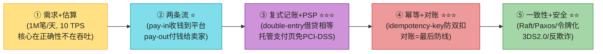

> 💡 **Step 1 关键**:**支付的核心不是吞吐,是正确性**——10 TPS 对任何 DB 都是小事,真正的难点是**不能算错一分钱、不能扣两次款**。面试重点全在 deep dive(对账/幂等/一致性)。
>
> 💡 **关键信号词**:**"pay-in 收钱到平台账户,pay-out 付钱给卖家,平台只是资金保管人(custodian)"** + **"复式记账:每笔交易进两个账户,借贷必相等"** + **"幂等键(idempotency-key)+ 对账,分布式网络下双扣零容忍"**——这三句直接拿下面试。

---

## 🗺️ 章节概览

| 小节 | 要点 | 重要性 |
|------|------|--------|
| 需求 + 估算 | 1M 笔/天、**10 TPS**、核心在正确性 | ⭐⭐⭐ |
| **两条流 ⭐⭐** | pay-in 收钱 / pay-out 付钱 | ⭐⭐⭐⭐⭐ |
| **五组件 ⭐⭐** | payment service / executor / PSP / ledger / wallet | ⭐⭐⭐⭐⭐ |
| **复式记账 ⭐⭐⭐** | 借贷必相等,资产=负债+权益 | ⭐⭐⭐⭐⭐ |
| API + 数据模型 | amount 用 string;payment_event / payment_order 两表 | ⭐⭐⭐⭐ |
| **托管支付页 ⭐⭐** | PSP 提供 iframe,免 PCI-DSS,九步流 | ⭐⭐⭐⭐⭐ |
| **对账 ⭐⭐⭐** | 结算文件 vs ledger,金融最后防线 | ⭐⭐⭐⭐⭐ |
| 幂等性 ⭐⭐ | idempotency-key / nonce / unique key | ⭐⭐⭐⭐⭐ |
| 失败处理 | 重试 + retry queue + DLQ | ⭐⭐⭐⭐ |
| 同步 vs 异步 | 单接收者 / 多接收者(Kafka) | ⭐⭐⭐ |
| 一致性 | Raft/Paxos;consensus DB | ⭐⭐⭐⭐ |
| 安全 + PCI | 令牌化、3DS、CVV、PCI-DSS | ⭐⭐⭐⭐ |
| **2026增量(补)** | TigerBeetle、TCC/Saga、3DS2.0、UPI/Pix、BNPL | ⭐⭐⭐⭐⭐ |

---

## 1. 需求 + 估算

**澄清问题**(原书对话,这些是面试必问的澄清):

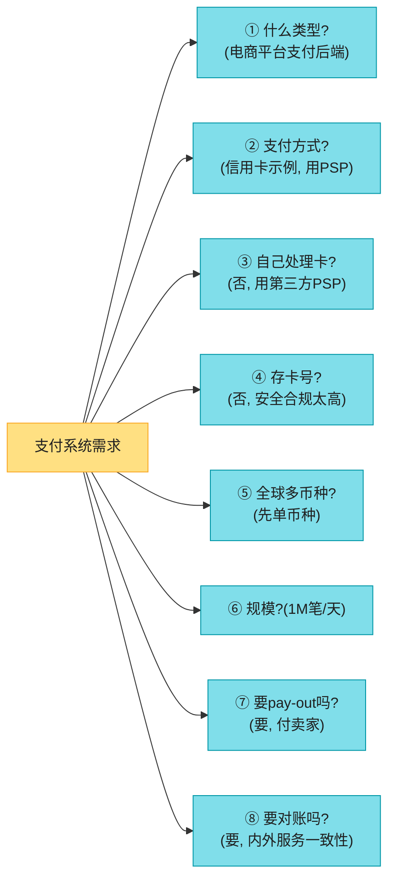

**功能需求**:
- **pay-in flow**:从买家收钱,代卖家持有。
- **pay-out flow**:把钱付给全球卖家。

**非功能需求**:
- **可靠 + 容错**:失败的支付要被小心处理。
- **对账**:内部服务(pay/ledger/wallet)和外部服务(PSP/银行)之间异步验证一致性。

**估算**(背):

```
1M 笔/天 / 10^5 秒 ≈ 10 TPS
→ 对任何 DB 都是小事,核心不在吞吐,在正确性
```

> 💡 **核心洞察**:**支付的面试重点不是高吞吐,是 deep dive**——怎么不算错、不双扣、不丢单、对得上账。10 TPS 数据库轻松,真正难的是**分布式正确性**。

---

## 2. 两条流:pay-in vs pay-out ⭐⭐⭐⭐⭐

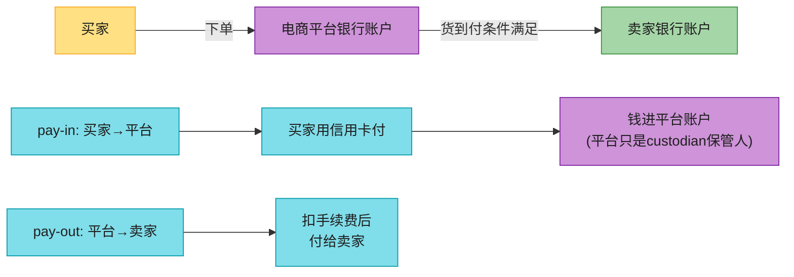

> 📝 **资金流的本质**:买家下单 → 钱进**平台银行账户**(pay-in),但平台**不拥有全部钱**,卖家拥有大部分,平台只收手续费做保管人(custodian)。**货到、退款条件满足后**,扣手续费付给卖家(pay-out)。**两条流是支付系统的骨架**。

---

## 3. pay-in 高层架构:五组件 ⭐⭐⭐⭐⭐

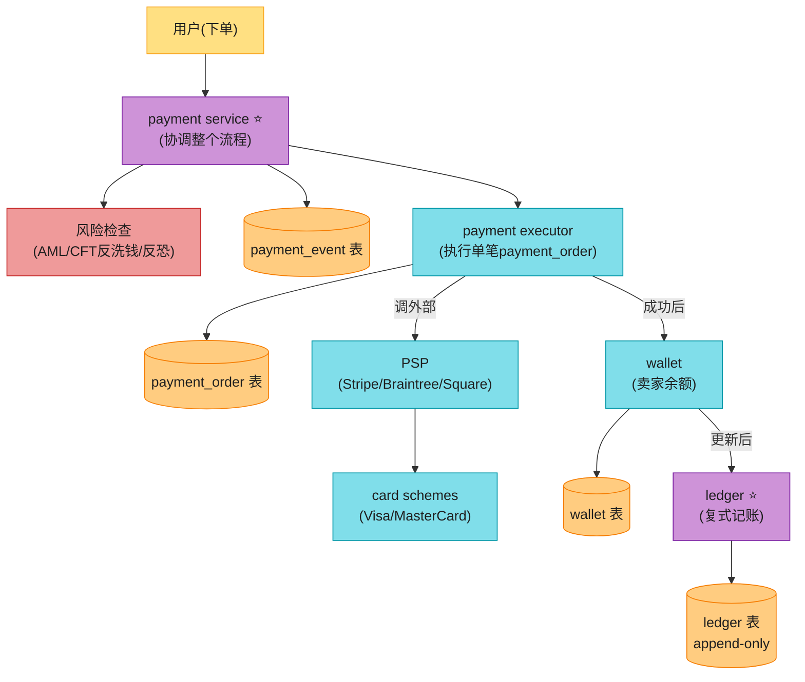

| 组件 | 职责 |
|------|------|
| **payment service** | 接收支付事件,**协调整个流程**;先做风险检查(AML/CFT) |
| **payment executor** | 执行单笔 payment_order(一个 event 可含多个 order) |
| **PSP**(支付服务提供商) | 把钱从账户 A 转到账户 B(Stripe/Braintree/Square) |
| **card schemes** | Visa/MasterCard/Discover,信用卡网络 |
| **ledger** | **复式记账**金融记录,post-payment 分析(收入预测等) |
| **wallet** | 卖家账户余额 |

### pay-in 八步流(背)

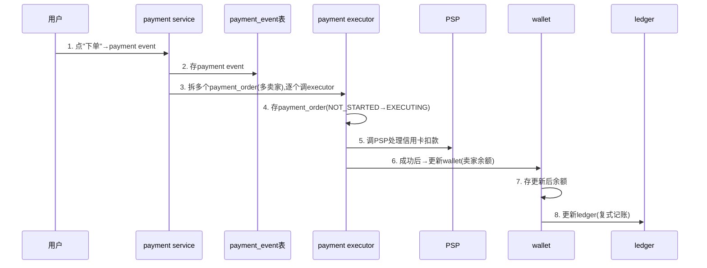

**八步流程**(背):
1. 用户点"下单"→ 生成 payment event 发给 payment service。
2. payment service **存 payment event 到 DB**。
3. 单个 event 可含多个 order(多卖家结账)→ **拆分,逐个调 executor**。
4. executor 存 payment_order 状态(`NOT_STARTED` → `EXECUTING`)。
5. executor **调外部 PSP 处理信用卡扣款**。
6. 成功后 payment service **更新 wallet**(记录卖家有多少钱)。
7. wallet 存更新后余额。
8. wallet 成功后 payment service **更新 ledger**(复式记账)。

> 💡 **状态机**:`payment_order_status` 是 enum,流转 `NOT_STARTED → EXECUTING → SUCCESS/FAILED`。SUCCESS 后才更新 wallet(`wallet_updated=TRUE`)和 ledger(`ledger_updated=TRUE`)。同 checkout 下所有 order 成功 → `is_payment_done=TRUE`。

---

## 4. 复式记账(Double-Entry Bookkeeping)⭐⭐⭐⭐⭐

> 📝 **这是金融系统的地基**。原书只讲了一句"借贷相等",2026 增量会补会计恒等式和科目表。

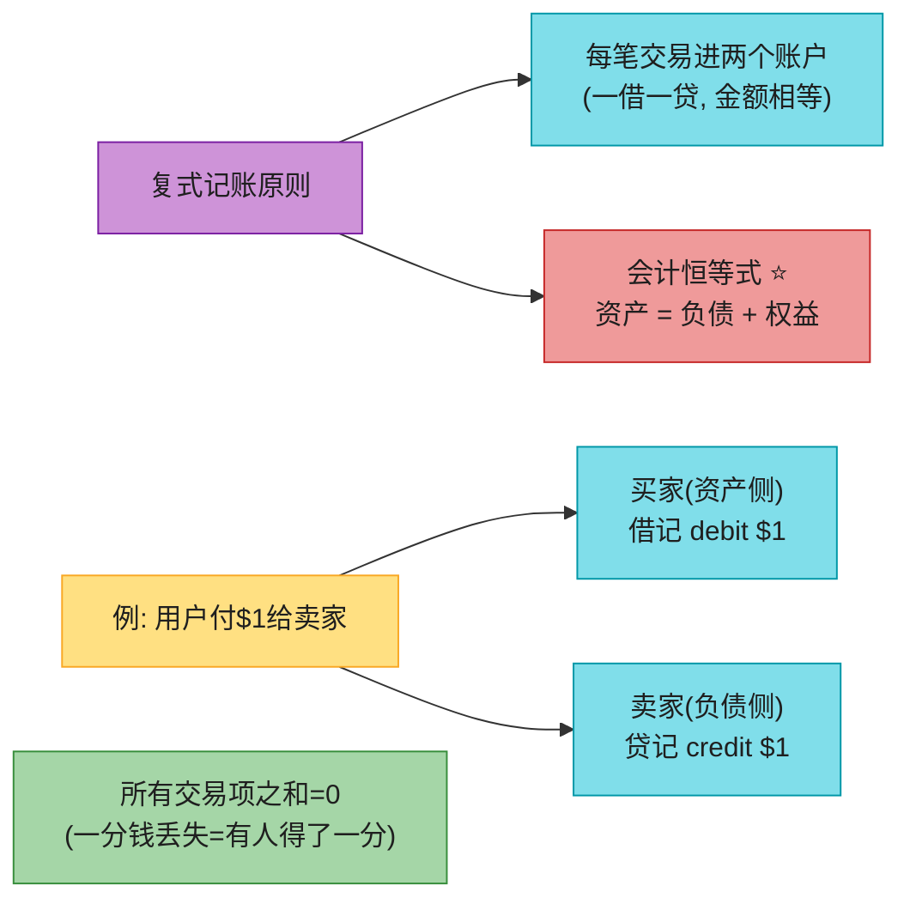

| 账户 | 借(debit) | 贷(credit) |
|------|-----------|------------|
| buyer | $1 | |
| seller | | $1 |

**为什么复式记账是金融系统地基**:
- **借贷必相等**:任何一笔交易,借方总和 = 贷方总和。**和永远为 0**,这是内置的一致性检查。
- **端到端可追溯**:每笔钱有来处有去处,审计追踪完整。
- **资产 = 负债 + 权益**:平台的资产负债表必须永远平衡。用户存进来的钱是**平台负债**(平台欠用户),平台收的手续费是**权益**。
- **错误自动暴露**:任何账对不平,立刻能定位到哪笔交易。

> 💡 **背**:复式记账 = **每笔交易进两个账户 + 借贷相等 + 资产=负债+权益**。Square 公开过他们叫 **Books** 的 immutable 复式记账 DB 服务。**2026 增量:TigerBeetle 把这个内置成 DB 引擎**(见 §2026)。

---

## 5. API 设计 + 数据模型

### 5.1 API(RESTful)

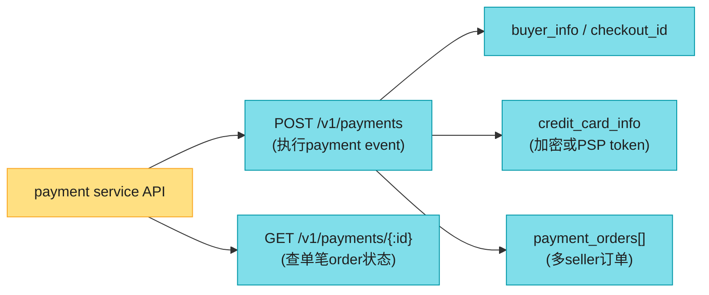

**payment_orders** 子字段:`seller_account` / `amount` / `currency`(ISO 4217)/ `payment_order_id`(全局唯一)。

> ⭐ **payment_order_id 是 PSP 的去重 ID(idempotency key)**——PSP 用它做幂等。

### 5.2 amount 为什么是 string 不是 double ⭐⭐⭐(高频考点)

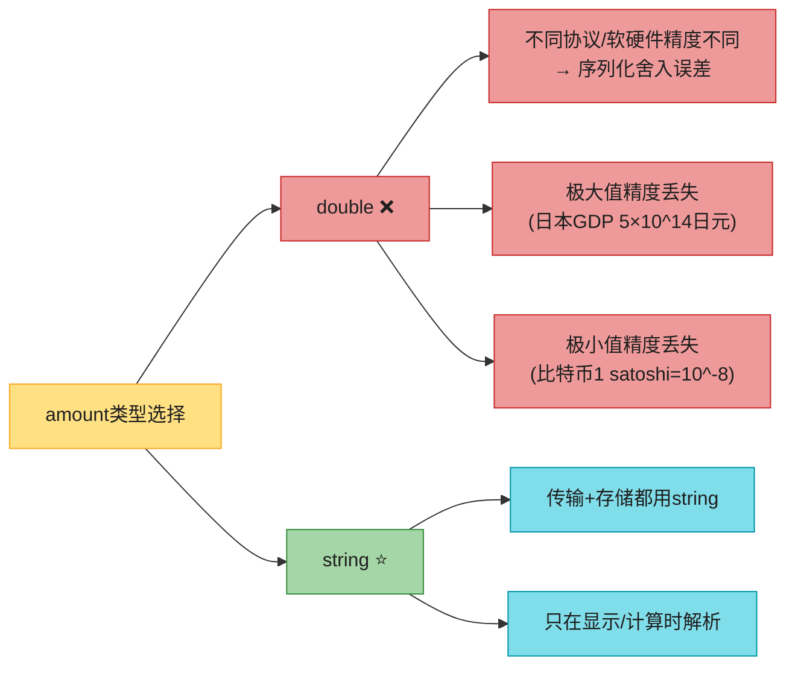

> 🪤 **追问陷阱(高频)**:"amount 为什么不用 double?" → "**double 有三大坑**:① 不同协议/软硬件精度不同 → 序列化舍入误差;② 极大值精度丢失(日本 GDP 5×10^14 日元);③ 极小值精度丢失(比特币 satoshi 10^-8)。**金融金额一律用 string 传输+存储,只在显示/计算时解析**。**生产里实际更推荐用最小货币单位的整数**(分/cents),完全避开浮点。"

### 5.3 数据模型

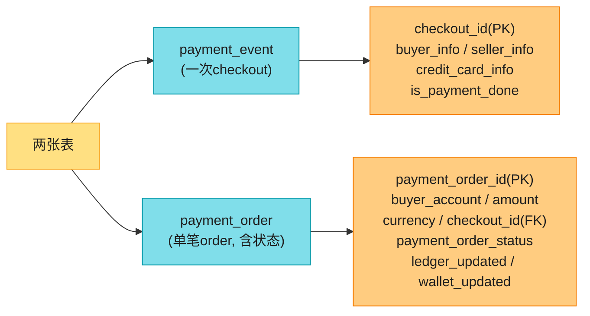

> 📝 **存储选型三原则**(背):
> 1. **经过验证的稳定性**:被大型金融公司用 5 年以上,反馈良好。
> 2. **支持工具丰富**:监控、排查工具成熟。
> 3. **DBA 市场成熟**:能招到经验丰富的 DBA。
>
> **结论:支付系统优先选传统关系库 + ACID,不选 NoSQL/NewSQL**。稳定性和工具 > 性能。

---

## 6. 托管支付页(Hosted Payment Page)⭐⭐⭐⭐⭐

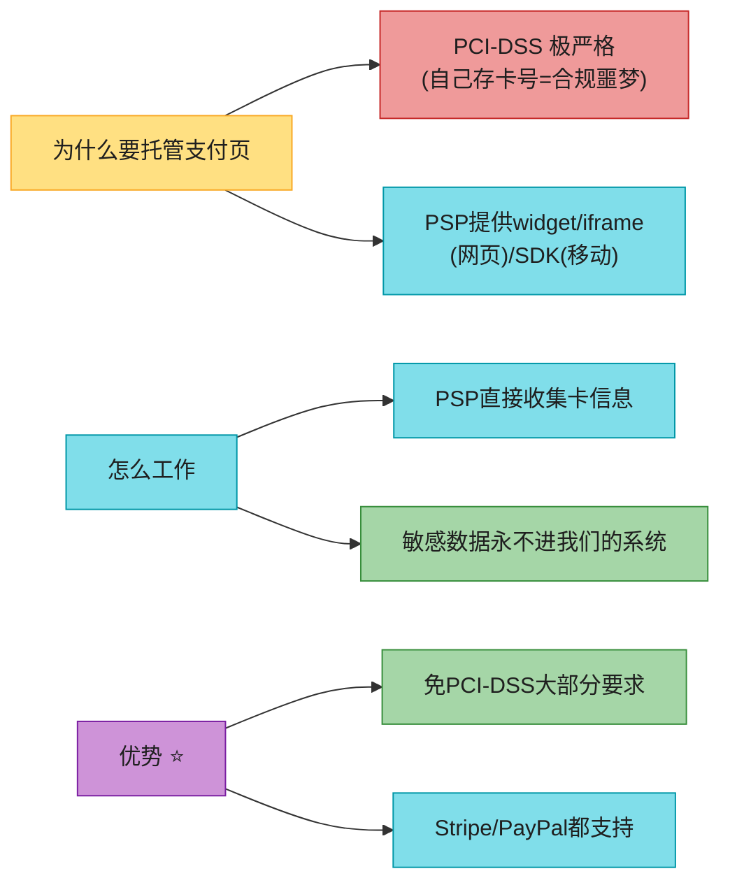

### 九步托管支付流(背)

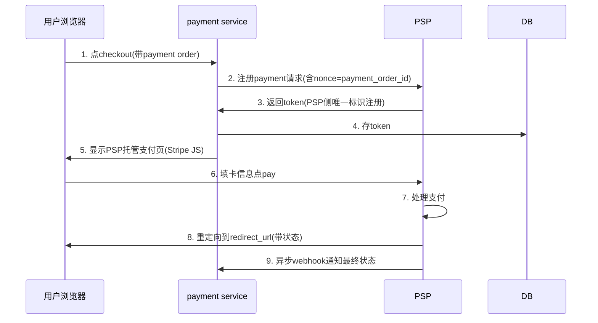

**九步**(背):
1. 用户点 checkout → 客户端带 payment order 调 payment service。
2. payment service 向 PSP **注册 payment 请求**(含金额/币种/过期时间/redirect URL + **nonce=payment_order_id**,确保只注册一次)。
3. PSP 返回 **token**(PSP 侧唯一标识这次注册)。
4. payment service **存 token 到 DB**(在显示支付页前持久化)。
5. 客户端显示 **PSP 托管支付页**(Stripe 用 JS 库收集卡信息,**敏感数据永远不进我们的系统**)。
6. 用户填卡号点 pay → PSP 处理。
7. PSP 返回支付状态。
8. 浏览器重定向到 redirect URL(状态附加在 URL:`?tokenID=...&payResult=...`)。
9. **异步 webhook** 通知 payment service 最终状态(网络可能延迟数小时)。

> 💡 **关键点**:
> - **nonce**(number used once)= payment_order_id,确保 PSP 只注册一次(幂等注册)。
> - **token** 是 PSP 侧标识,唯一映射 nonce → 唯一映射 payment order。
> - **redirect URL ≠ webhook URL**:redirect 是浏览器跳转(给用户看),webhook 是服务器到服务器的最终状态通知(系统信任的来源)。

---

## 7. 对账(Reconciliation)⭐⭐⭐⭐⭐(金融系统最后防线)

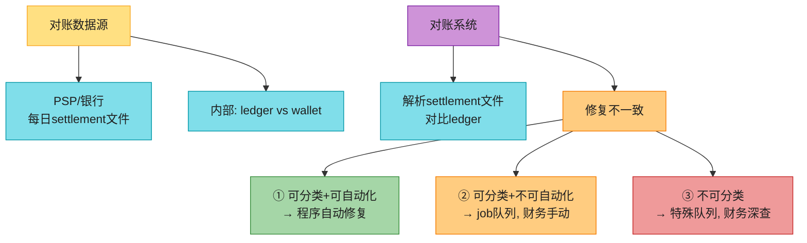

**异步世界的正确性保证**:

> 📝 **为什么需要对账**:支付业务大量用**异步通信**提高性能,外部系统(PSP/银行)也偏好异步。**异步通信没有"保证送达/保证响应"**——所以靠**对账**做最后一道防线:**定期对比相关服务的状态,验证一致**。

**对账流程**:
1. **每晚 PSP/银行发 settlement 文件**(结算文件):含银行账户余额 + 当日所有交易。
2. 对账系统**解析 settlement 文件,对比 ledger**。
3. 对账也验证**内部一致性**(ledger vs wallet 状态可能漂移)。
4. **修复不一致**(三类):
   - ① 可分类 + 可自动化 → 程序自动修。
   - ② 可分类 + 不可自动化(成本高)→ job 队列,**财务团队手动修**。
   - ③ 不可分类(原因不明)→ 特殊队列,财务深查。

> 💡 **背**:对账 = **结算文件 vs ledger 的定期对比 + 修复**。是金融系统的**最后防线**——幂等、重试、事务都不能 100% 防 bug,对账是兜底。

---

## 8. 幂等性(Idempotency)⭐⭐⭐⭐⭐(防双扣的核心)

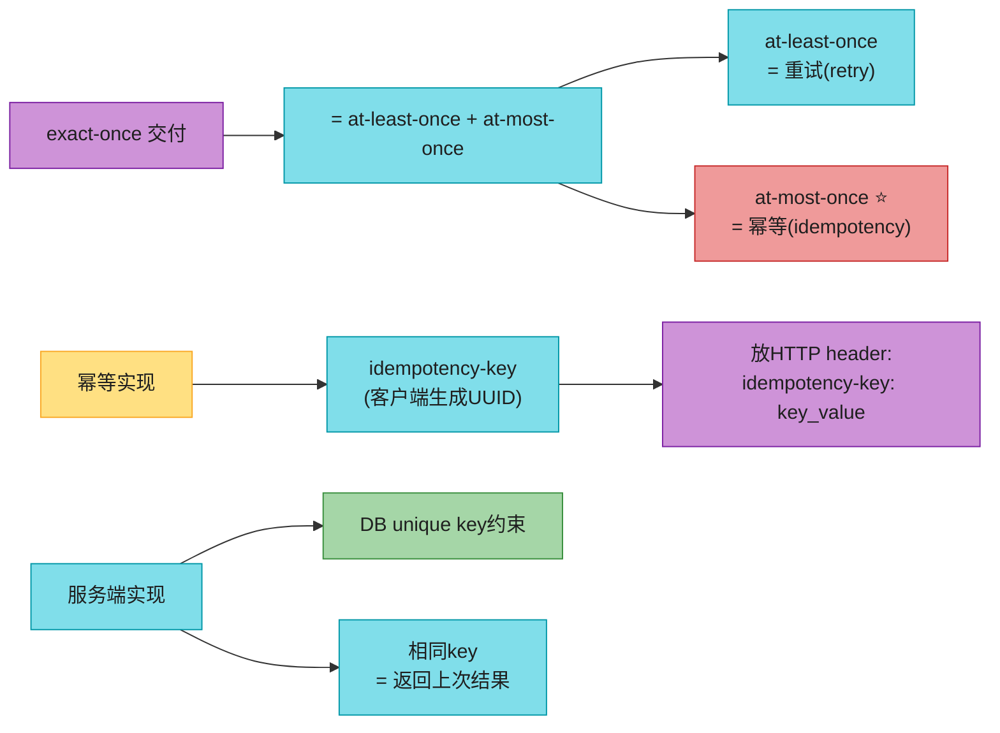

**exact-once 拆解**(背):
> 数学上,**exact-once = at-least-once + at-most-once**:
> - **at-least-once**:用**重试**(网络失败就重发)。
> - **at-most-once**:用**幂等**(重复请求只执行一次)。

### 8.1 双扣的两个场景

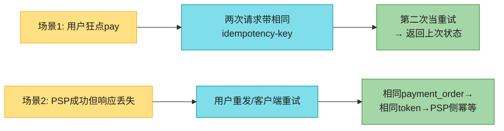

| 场景 | 问题 | 解决 |
|------|------|------|
| **场景1**:用户狂点 pay | 两次请求同时到 | **相同 idempotency-key** → 第二次当重试,返回上次状态;并发同 key → 一个处理,其他返 **429 Too Many Requests** |
| **场景2**:PSP 成功但响应丢 | 用户重发 | nonce→token→payment_order 唯一映射,**token 作 PSP 侧幂等键**,PSP 识别双付返回上次结果 |

### 8.2 幂等的 DB 实现(unique key)

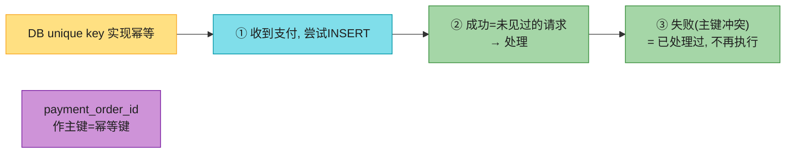

> 💡 **背**:幂等 = **DB unique key 约束**。payment_order_id 作主键 = 幂等键。INSERT 成功 = 新请求 → 处理;INSERT 失败(主键冲突)= 重复请求 → 返回上次结果,不再执行。**Stripe/PayPal 都推荐这种 HTTP header idempotency-key 做法**。

---

## 9. 失败处理:重试 + retry queue + DLQ

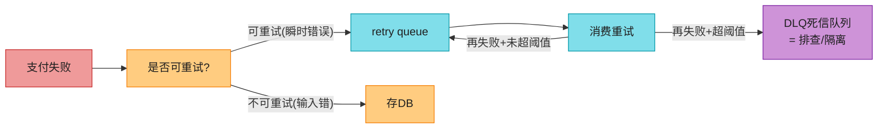

**重试策略**(选一个,不要"一刀切"):

| 策略 | 说明 | 适用 |
|------|------|------|
| **立即重试** | 失败立刻重发 | 偶发瞬时错 |
| **固定间隔** | 等固定时间再重试 | 简单场景 |
| **递增间隔** | 第一次短,后续递增 | 中等 |
| **指数退避** ⭐ | 每次翻倍(1s→2s→4s) | **网络问题短期不会好,首选** |
| **取消** | 永久失败/重试无意义 | 用户主动取消 |

> 💡 **背**:**指数退避是首选**,但太激进会浪费资源/压垮服务。配合 **`Retry-After` header + error code** 告诉客户端何时重试。Uber 用 Kafka 做支付可靠性 + 容错(有公开演讲)。

---

## 10. 同步 vs 异步通信

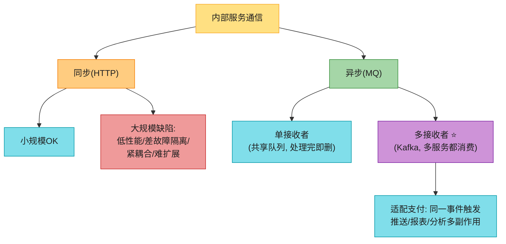

**同步 HTTP 的四大缺陷**(背):
1. **低性能**:链上任何一个服务慢,全系统被拖。
2. **差故障隔离**:PSP 或任何服务挂,客户端收不到响应。
3. **紧耦合**:发送方要知道接收方。
4. **难扩展**:无队列缓冲,流量突增难扛。

**异步分类**:
- **单接收者**:共享队列,处理完即删。
- **多接收者**:Kafka——同一消息被多服务消费(push 通知 / 财报 / 分析),**完美适配支付**(一个支付事件触发多副作用)。

> 💡 **背**:同步简单但服务不自治;异步用"设计简单 + 一致性"换"可扩展 + 故障弹性"。**大型支付系统(复杂业务 + 多第三方依赖)选异步**。

---

## 11. 一致性

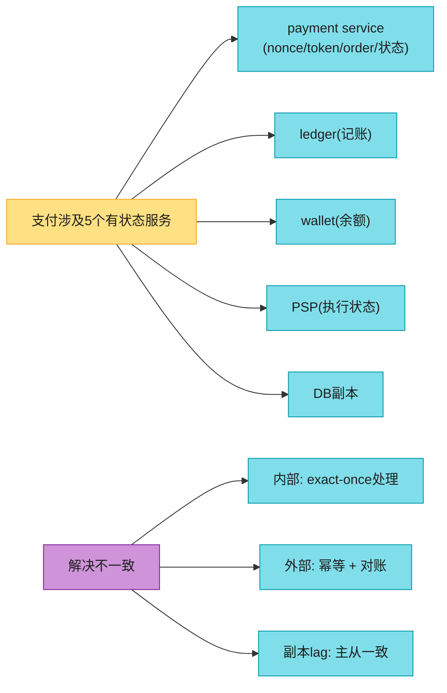

**三道一致性防线**:
1. **内部服务间**:**exact-once 处理**(幂等 + 重试)。
2. **内部 ↔ 外部(PSP)**:**幂等 + 对账**。**别假设外部系统永远对**,对账兜底。
3. **副本一致**:主从 lag 会导致不一致。
   - **选项A**:读写都走主库(简单,但副本浪费资源)。
   - **选项B**:用 **Paxos/Raft 共识算法**,或 **YugabyteDB / CockroachDB** 等共识分布式 DB。

---

## 12. 安全(Security)+ PCI-DSS

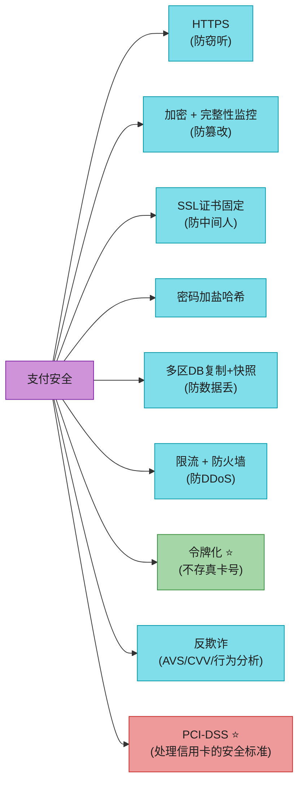

| 威胁 | 解决 |
|------|------|
| 请求/响应窃听 | HTTPS |
| 数据篡改 | 加密 + 完整性监控 |
| 中间人攻击 | SSL + 证书固定(certificate pinning) |
| 密码存储 | 加盐哈希 |
| 数据丢失 | 多区 DB 复制 + 快照 |
| DDoS | 限流 + 防火墙 |
| **卡号泄露** | **令牌化(tokenization)**:不存真卡号,存 token |
| 欺诈 | AVS(地址验证)/ CVV / 用户行为分析 |
| 合规 | **PCI-DSS**(信用卡信息安全标准) |

---

## 13. 2026 现代增量(原书没讲的硬核)⭐⭐⭐⭐⭐

### 13.1 TigerBeetle:专为金融复式记账设计的 OLTP DB ⭐⭐⭐(2026 金融最大变化)

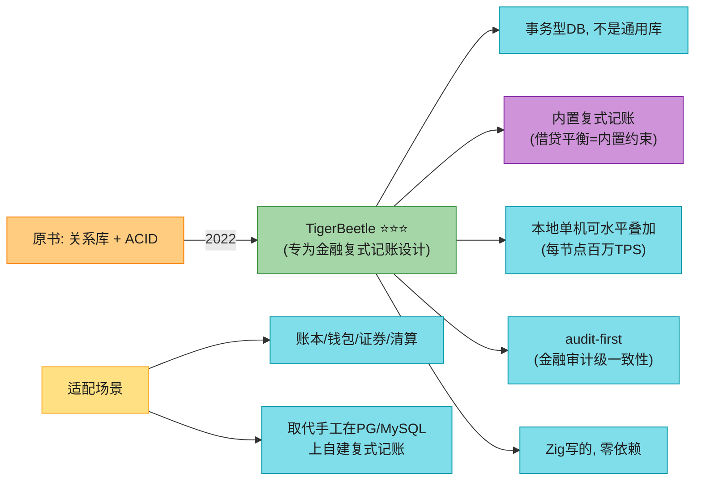

> 🔄 **2026 现代版话术**(原书停留在"关系库 + ACID"):
> "原书说支付用关系库 + ACID,自己手写复式记账。**2022 出了 TigerBeetle**——专为金融复式记账设计的 OLTP DB,**Zig 写的、零依赖、单节点百万 TPS、内置复式记账约束**(借贷不平衡直接拒绝)、audit-first(金融审计级一致性)。账本/钱包/证券/清算这类强一致金融系统,**TigerBeetle 取代了手工在 PG/MySQL 上自建复式记账的活**。**这是 2026 金融基础设施最大变化,必讲**。"

### 13.2 复式记账严格化(原书只讲"借贷相等")

```mermaid
flowchart LR
    EQ["会计恒等式 ⭐"] --> E1["资产 Assets<br/>= 负债 Liabilities<br/>+ 权益 Equity"]
    IMPL["平台资产负债表"] --> ASSET["资产侧<br/>• 银行存款<br/>• 应收"]
    IMPL --> LIAB["负债侧<br/>• 用户存款(平台欠用户)<br/>• 卖家待结算"]
    IMPL --> EQ2["权益侧<br/>• 手续费收入<br/>• 留存收益"]
    RULE["规则"] --> R1["每笔交易必须平衡"]
    RULE --> R2["5大账户类型:<br/>资产/负债/权益/收入/费用"]

    style EQ fill:#EF9A9A,stroke:#C62828,color:#1f1f1f
    style E1 fill:#80DEEA,stroke:#0097A7,color:#1f1f1f
    style IMPL fill:#FFE082,stroke:#F9A825,color:#1f1f1f
    style ASSET fill:#80DEEA,stroke:#0097A7,color:#1f1f1f
    style LIAB fill:#80DEEA,stroke:#0097A7,color:#1f1f1f
    style EQ2 fill:#80DEEA,stroke:#0097A7,color:#1f1f1f
    style RULE fill:#CE93D8,stroke:#7B1FA2,color:#1f1f1f
    style R1 fill:#80DEEA,stroke:#0097A7,color:#1f1f1f
    style R2 fill:#80DEEA,stroke:#0097A7,color:#1f1f1f
```

> 💡 **背**:原书只说"借贷相等"。**严格版**:**资产 = 负债 + 权益**(会计恒等式)。用户存进来的钱 = 平台**负债**(平台欠用户);手续费 = **权益**(平台收入)。**五大账户类型:资产 / 负债 / 权益 / 收入 / 费用**,每笔交易借贷必平衡。

### 13.3 幂等键的 Stripe 标准做法(HTTP header)

```mermaid
flowchart LR
    IDEM["幂等键标准做法"] --> CLIENT["客户端生成唯一key<br/>(UUID)"]
    CLIENT --> HEADER["放HTTP header:<br/>Idempotency-Key: <UUID>"]
    HEADER --> SERVER["服务端缓存key→结果"]
    SERVER --> BEHAVIOR["相同key<br/>→ 返回上次结果(不重复执行)"]
    TTL["key有过期时间"] --> T1["Stripe默认24h"]
    CONCURRENCY["并发同key"] --> C1["一个处理"]
    CONCURRENCY --> C2["其他返429"]

    style IDEM fill:#CE93D8,stroke:#7B1FA2,color:#1f1f1f
    style CLIENT fill:#80DEEA,stroke:#0097A7,color:#1f1f1f
    style HEADER fill:#EF9A9A,stroke:#C62828,color:#1f1f1f
    style SERVER fill:#80DEEA,stroke:#0097A7,color:#1f1f1f
    style BEHAVIOR fill:#A5D6A7,stroke:#388E3C,color:#1f1f1f
    style TTL fill:#FFCC80,stroke:#F57C00,color:#1f1f1f
    style T1 fill:#80DEEA,stroke:#0097A7,color:#1f1f1f
    style CONCURRENCY fill:#FFE082,stroke:#F9A825,color:#1f1f1f
    style C1 fill:#80DEEA,stroke:#0097A7,color:#1f1f1f
    style C2 fill:#80DEEA,stroke:#0097A7,color:#1f1f1f
```

> 💡 **背**:**Stripe 标准做法**:客户端生成 UUID,放 `Idempotency-Key` HTTP header,服务端缓存 key→结果(默认 24h),相同 key = 返回上次结果不重复执行,并发同 key = 一个处理其他返 429。**这是 2026 API 设计的事实标准**。

### 13.4 TCC vs Saga:支付长事务怎么做 ⭐⭐

```mermaid
flowchart TD
    TX["分布式支付事务"] --> SHORT["短事务<br/>(单库ACID够)"]
    TX --> LONG["长事务<br/>(跨多服务, 秒-分钟)"]
    LONG --> TCC["TCC ⭐<br/>(Try-Confirm-Cancel)"]
    LONG --> SAGA["Saga<br/>(choreography/orchestration)"]
    TCC --> T1["Try: 预留资源(冻结额度)"]
    TCC --> T2["Confirm: 确认提交"]
    TCC --> T3["Cancel: 释放预留"]
    SAGA --> S1["一系列本地事务"]
    SAGA --> S2["失败=补偿事务回滚"]
    CHOICE["支付选型"] --> CH1["强一致+短: TCC<br/>(冻结→扣款→失败解冻)"]
    CHOICE --> CH2["最终一致+长: Saga<br/>(下单→支付→发货→结算)"]

    style TX fill:#FFE082,stroke:#F9A825,color:#1f1f1f
    style SHORT fill:#80DEEA,stroke:#0097A7,color:#1f1f1f
    style LONG fill:#FFCC80,stroke:#F57C00,color:#1f1f1f
    style TCC fill:#A5D6A7,stroke:#388E3C,color:#1f1f1f
    style SAGA fill:#80DEEA,stroke:#0097A7,color:#1f1f1f
    style T1 fill:#80DEEA,stroke:#0097A7,color:#1f1f1f
    style T2 fill:#80DEEA,stroke:#0097A7,color:#1f1f1f
    style T3 fill:#80DEEA,stroke:#0097A7,color:#1f1f1f
    style S1 fill:#80DEEA,stroke:#0097A7,color:#1f1f1f
    style S2 fill:#80DEEA,stroke:#0097A7,color:#1f1f1f
    style CHOICE fill:#CE93D8,stroke:#7B1FA2,color:#1f1f1f
    style CH1 fill:#A5D6A7,stroke:#388E3C,color:#1f1f1f
    style CH2 fill:#80DEEA,stroke:#0097A7,color:#1f1f1f
```

> 💡 **背**:**TCC(Try-Confirm-Cancel)** 适合**强一致 + 短事务**(支付冻结额度→扣款→失败解冻);**Saga** 适合**最终一致 + 长事务**(下单→支付→发货→结算,失败靠补偿事务回滚)。支付核心扣款用 TCC,业务流程编排用 Saga。

### 13.5 Webhook 可靠性 + 签名验签(原书只提名字)⭐⭐⭐

```mermaid
flowchart LR
    WH["Webhook 陷阱"] --> T1["网络丢包→状态丢失"]
    WH --> T2["重放攻击→重复处理"]
    WH --> T3["篡改→伪造状态"]
    SOL["可靠Webhook"] --> S1["签名验签(HMAC)"]
    SOL --> S2["时间戳防重放"]
    SOL --> S3["幂等处理(同event_id只处理一次)"]
    SOL --> S4["自动重试(指数退避)"]
    SOL --> S5["返回200=已收, 否则PSP重发"]
    STRIPE["Stripe签名"] --> ST1["t=时间戳, v1=HMAC签名"]

    style WH fill:#EF9A9A,stroke:#C62828,color:#1f1f1f
    style T1 fill:#EF9A9A,stroke:#C62828,color:#1f1f1f
    style T2 fill:#EF9A9A,stroke:#C62828,color:#1f1f1f
    style T3 fill:#EF9A9A,stroke:#C62828,color:#1f1f1f
    style SOL fill:#A5D6A7,stroke:#388E3C,color:#1f1f1f
    style S1 fill:#80DEEA,stroke:#0097A7,color:#1f1f1f
    style S2 fill:#80DEEA,stroke:#0097A7,color:#1f1f1f
    style S3 fill:#80DEEA,stroke:#0097A7,color:#1f1f1f
    style S4 fill:#80DEEA,stroke:#0097A7,color:#1f1f1f
    style S5 fill:#80DEEA,stroke:#0097A7,color:#1f1f1f
    style STRIPE fill:#CE93D8,stroke:#7B1FA2,color:#1f1f1f
    style ST1 fill:#80DEEA,stroke:#0097A7,color:#1f1f1f
```

> 🪤 **追问陷阱(高频)**:"Webhook 怎么防伪造/重放?" → "**签名验签 + 时间戳**:PSP 用 HMAC 对 body+时间戳签名,我们用密钥验签(防篡改);时间戳超出窗口拒绝(防重放);**幂等处理**(同 event_id 只处理一次,防重复);验签失败/超时返非 200,PSP 自动重试。**Stripe 签名格式:`t=<时间戳>,v1=<HMAC>`**。"

### 13.6 其它 2026 增量

```mermaid
flowchart LR
    MOD["2026支付增量"] --> TBS["TigerBeetle(复式记账DB)"]
    MOD --> STRICT["复式记账严格化"]
    MOD --> IDEM["Stripe式Idempotency-Key"]
    MOD --> TCC2["TCC vs Saga"]
    MOD --> WEBHOOK["Webhook签名验签"]
    MOD --> PSD["PSD2/Open Banking(银行开放API)"]
    MOD --> INSTANT["即时支付(UPI/Pix/CBDC)"]
    MOD --> THREEDS["3-D Secure 2.0/SCA"]
    MOD --> FRAUD["实时反欺诈ML"]
    MOD --> PCI4["PCI-DSS 4.0"]
    MOD --> ES["Event-sourced ledger/CQRS"]
    MOD --> BNPL["BNPL先买后付"]

    style MOD fill:#CE93D8,stroke:#7B1FA2,color:#1f1f1f
    style TBS fill:#A5D6A7,stroke:#388E3C,color:#1f1f1f
    style STRICT fill:#80DEEA,stroke:#0097A7,color:#1f1f1f
    style IDEM fill:#80DEEA,stroke:#0097A7,color:#1f1f1f
    style TCC2 fill:#80DEEA,stroke:#0097A7,color:#1f1f1f
    style WEBHOOK fill:#80DEEA,stroke:#0097A7,color:#1f1f1f
    style PSD fill:#80DEEA,stroke:#0097A7,color:#1f1f1f
    style INSTANT fill:#80DEEA,stroke:#0097A7,color:#1f1f1f
    style THREEDS fill:#80DEEA,stroke:#0097A7,color:#1f1f1f
    style FRAUD fill:#80DEEA,stroke:#0097A7,color:#1f1f1f
    style PCI4 fill:#80DEEA,stroke:#0097A7,color:#1f1f1f
    style ES fill:#80DEEA,stroke:#0097A7,color:#1f1f1f
    style BNPL fill:#80DEEA,stroke:#0097A7,color:#1f1f1f
```

| 技术 | 说明 |
|------|------|
| **PSD2 / Open Banking** | 欧洲强制银行开放 API,第三方(支付 App)可直接读用户银行账户/发起支付。催生开放银行生态 |
| **UPI(印度)/ Pix(巴西)** | **即时 24×7 支付**(秒级到账,免费/极低费)。印度 UPI 月交易 100+ 亿笔,巴西 Pix 用户超 1.4 亿 |
| **数字人民币 CBDC** | 央行数字货币,离线支付 + 可控匿名,2026 多国试点 |
| **3-D Secure 2.0 / SCA** | 欧洲 **PSD2 强制 SCA**(Strong Customer Authentication),3DS2.0 改善体验(摩擦流 → 无摩擦流) |
| **实时反欺诈 ML** | Uber/Sripe 用 **ML 模型**(图神经网络 GNN)+ 规则引擎,毫秒级判断欺诈 |
| **PCI-DSS 4.0**(2022) | 新版强调**持续合规**(不再年度审计一次),自定义验证方法,2024 起强制 |
| **Event-sourced ledger / CQRS** | 账本用**事件溯源**(只 append 不可变事件),任何余额 = 重放事件;CQRS 读写分离 |
| **BNPL(先买后付)** | Klarna/Afterpay/Affirm,**分期/免息**,本质是消费信贷,需额度评估 + 风控 |

---

## ⚠️ 已过时 / 书里没说(2022 → 2026)

| 原书(2022) | 2026 现状 | 面试应对 |
|------------|----------|---------|
| 关系库 + 手写复式记账 | **TigerBeetle**(内置复式记账 DB) | 讲 TigerBeetle 是 2026 金融 DB |
| 复式记账只说"借贷相等" | **资产=负债+权益**会计恒等式 | 讲严格化 |
| 幂等只讲 nonce | **Stripe HTTP Idempotency-Key** 标准 | 讲 header + TTL + 429 |
| 没讲长事务 | **TCC vs Saga** 选型 | 讲扣款用 TCC,流程用 Saga |
| Webhook 只提名字 | **签名验签 + 时间戳防重放** | 讲 HMAC + 幂等 |
| 没讲开放银行 | **PSD2/Open Banking** | 讲银行 API 开放 |
| 没讲即时支付 | **UPI/Pix/数字人民币** | 讲 24×7 秒级到账 |
| 3DS 只提一句 | **3DS 2.0 / SCA 强制** | 讲欧洲 SCA |
| 反欺诈列规则 | **实时 ML(GNN)+ 规则引擎** | 讲毫秒级反欺诈 |
| PCI-DSS 3.x | **PCI-DSS 4.0**(2022) | 讲持续合规 |
| 没讲 ledger 架构 | **Event-sourced / CQRS** | 讲事件溯源账本 |
| 没提 BNPL | **Klarna/Afterpay** 先买后付 | 讲消费信贷 |

---

## 💻 代码示例

### 示例 1:支付 API(RESTful + amount 用 string)

```python
# 执行 payment event(一个 event 可含多个 order, 多卖家)
POST /v1/payments
Headers:
  Idempotency-Key: e1b2c3d4-...     # ⭐ 幂等键, 防双扣(Stripe标准)
  Authorization: Bearer <token>
Body:
{
  "buyer_info": {"user_id": "u_123"},
  "checkout_id": "ck_456",            # 全局唯一 checkout
  "credit_card_info": "tok_abc",      # PSP token, 不存真卡号
  "payment_orders": [                 # 多 seller 订单
    {"seller_account": "s_1", "amount": "99.99", "currency": "USD",
     "payment_order_id": "po_789"},   # 全局唯一, PSP 用作去重ID
    {"seller_account": "s_2", "amount": "50.00", "currency": "USD",
     "payment_order_id": "po_790"}
  ]
}

# 查单笔 order 状态
GET /v1/payments/po_789
# → {"payment_order_id":"po_789", "payment_order_status":"SUCCESS",
#    "ledger_updated":true, "wallet_updated":true}
```

### 示例 2:幂等键实现(unique key + 并发控制)

```python
def process_payment(idempotency_key, payment_request):
    # ① 尝试 INSERT,主键冲突=重复请求
    try:
        db.execute(
            "INSERT INTO idempotency_keys(key, status, response, expires_at) "
            "VALUES(%s, 'PROCESSING', NULL, NOW()+INTERVAL 24 HOUR)",
            (idempotency_key,))
    except DuplicateKeyError:
        row = db.query("SELECT status, response FROM idempotency_keys WHERE key=%s",
                       (idempotency_key,))
        if row.status == 'DONE':
            return json.loads(row.response)        # 返回上次结果, 不重复执行
        else:
            raise HTTP429("429 Too Many Requests") # 并发同key, 一个处理其他拒

    # ② 真正执行支付
    try:
        result = executor.run(payment_request)
        db.execute("UPDATE idempotency_keys SET status='DONE', response=%s WHERE key=%s",
                   (json.dumps(result), idempotency_key))
        return result
    except Exception as e:
        db.execute("DELETE FROM idempotency_keys WHERE key=%s", (idempotency_key,))
        raise   # 失败删 key, 允许重试
```

### 示例 3:复式记账(借贷平衡)

```sql
-- 转账$1: buyer→seller
-- ledger 是 append-only, 每笔交易两条记录(借贷相等)

CREATE TABLE ledger_entry (
    entry_id    BIGINT PRIMARY KEY,
    transaction_id UUID NOT NULL,      -- 同一交易的两条记录共享
    account_id  VARCHAR(64) NOT NULL,  -- 账户(科目)
    debit       DECIMAL(20,4),         -- 借
    credit      DECIMAL(20,4),         -- 贷
    created_at  TIMESTAMP
);

-- 一笔$1支付: 两条记录, 借贷相等, 和=0
INSERT INTO ledger_entry VALUES
  (1, 'tx_001', 'buyer_asset',     1.00, NULL),   -- 借 buyer $1(资产减)
  (2, 'tx_001', 'seller_liability', NULL, 1.00);  -- 贷 seller $1(负债增, 平台欠卖家)

-- 内置一致性检查: 任何 transaction_id 的 SUM(debit-credit) 必须为 0
SELECT transaction_id FROM ledger_entry
GROUP BY transaction_id
HAVING SUM(COALESCE(debit,0) - COALESCE(credit,0)) <> 0;
-- 没有结果 = 账平 ✅
```

### 示例 4:Webhook 签名验签(Stripe 式)

```python
import hmac, hashlib, time

STRIPE_WEBHOOK_SECRET = "whsec_..."

def verify_stripe_webhook(payload: bytes, sig_header: str) -> bool:
    """Stripe签名格式: t=<时间戳>,v1=<HMAC>"""
    parts = dict(p.split('=') for p in sig_header.split(','))
    t, v1 = parts['t'], parts['v1']

    # ① 时间戳防重放(5分钟外拒绝)
    if abs(time.time() - int(t)) > 300:
        return False

    # ② HMAC 签名验签(防篡改)
    signed = f"{t}.".encode() + payload
    expected = hmac.new(STRIPE_WEBHOOK_SECRET.encode(), signed,
                        hashlib.sha256).hexdigest()
    if not hmac.compare_digest(expected, v1):
        return False
    return True

def handle_webhook(payload, sig_header):
    if not verify_stripe_webhook(payload, sig_header):
        raise HTTP400("invalid signature")
    event = json.loads(payload)
    # ③ 幂等处理(同 event.id 只处理一次)
    if db.exists("SELECT 1 FROM processed_events WHERE event_id=%s", (event['id'],)):
        return HTTP200()   # 已处理, 返200让PSP停止重发
    process_event(event)
    db.execute("INSERT INTO processed_events(event_id) VALUES(%s)", (event['id'],))
    return HTTP200()
```

### 示例 5:对账作业(settlement 文件 vs ledger)

```python
def reconcile_daily():
    """每晚跑: 对比 PSP settlement 文件与 ledger"""
    settlement = parse_settlement_file(fetch_from_psp())   # PSP 当日交易
    ledger = db.query("SELECT * FROM ledger_entry WHERE DATE(created_at)=CURDATE()-1")

    mismatches = []
    for tx in settlement:
        ledger_tx = find_in_ledger(tx.id, ledger)
        if not ledger_tx:
            mismatches.append(('missing_in_ledger', tx))
        elif abs(tx.amount - ledger_tx.amount) > 0.005:
            mismatches.append(('amount_diff', tx, ledger_tx))

    for m in mismatches:
        if auto_fixable(m):                # ① 可分类+可自动化
            auto_fix(m)
        elif classifiable(m):              # ② 可分类+不可自动化
            enqueue('finance_manual_queue', m)
        else:                              # ③ 不可分类
            enqueue('finance_deep_queue', m)   # 财务深查
```

---

## 🪤 追问陷阱(面试官最爱问,本章集)

1. **"pay-in 和 pay-out 区别?"** → **pay-in**:买家付钱进平台账户(平台只是 custodian 保管人);**pay-out**:扣手续费后付给卖家。两条流分开。
2. **"资金流里平台账户的钱归谁?"** → 平台**不拥有全部钱**——卖家拥有大部分,平台只收手续费。所以是 custodian。
3. **"payment event 和 payment order 区别?"** → event 是一次 checkout(可能多卖家),order 是单笔执行单元。一个 event 含多个 order。
4. **"amount 为什么用 string 不用 double?"** → double 有三大坑:① 序列化精度误差;② 极大值精度丢(GDP 10^14);③ 极小值精度丢(satoshi 10^-8)。**用 string 传输+存储,显示时解析**。生产更推荐最小货币单位整数。
5. **"复式记账是什么?"** → 每笔交易进**两个账户(一借一贷),金额相等,和为 0**。**资产=负债+权益**会计恒等式。内置一致性检查,端到端可追溯。
6. **"怎么避免存卡号被 PCI-DSS 折磨?"** → 用 **PSP 托管支付页**(iframe/SDK),PSP 直接收集卡信息,**敏感数据永不进我们的系统**,免 PCI-DSS 大部分要求。
7. **"nonce 和 token 区别?"** → **nonce** = payment_order_id(我们给 PSP,确保只注册一次);**token** = PSP 返回的注册标识(唯一映射 nonce→payment order)。双向唯一映射。
8. **"用户狂点 pay 会双扣吗?"** → **不会**。相同 idempotency-key,第二次当重试返回上次状态;并发同 key → 一个处理其他返 429。
9. **"PSP 成功但响应丢了,用户重发会双扣吗?"** → **不会**。payment_order 相同 → nonce 相同 → token 相同 → **token 作 PSP 侧幂等键**,PSP 识别双付返回上次结果。
10. **"exact-once 怎么实现?"** → **at-least-once(重试)+ at-most-once(幂等)** = exact-once。数学上拆成两个简单问题。
11. **"幂等具体怎么做?"** → **DB unique key 约束**:INSERT 成功 = 新请求处理;主键冲突 = 重复,返回上次结果。Stripe 标准:`Idempotency-Key` HTTP header + 24h TTL。
12. **"为什么要对账?幂等+重试还不够吗?"** → 异步通信**没有"保证送达/响应"**,外部系统(PSP/银行)不可全信。对账 = **结算文件 vs ledger 定期对比修复**,是金融系统的**最后防线**。
13. **"对账发现不一致怎么办?"** → 三类:① 可分类+可自动化 → 程序自动修;② 可分类+不可自动化 → 财务手动;③ 不可分类 → 财务深查。
14. **"重试用什么策略?"** → **指数退避首选**(网络短期不会好),配 `Retry-After` header。太激进会压垮服务。
15. **"同步 vs 异步怎么选?"** → 同步简单但不自治(链上任一慢全拖);**大型支付(复杂业务+多第三方)选异步**,用 Kafka 多接收者(一个支付事件触发推送/财报/分析多副作用)。
16. **"副本 lag 导致不一致怎么办?"** → 选项A:读写都走主库(浪费副本);**选项B:Paxos/Raft 共识**,或 YugabyteDB/CockroachDB 共识 DB。
17. **"Webhook 怎么防伪造/重放?"** → **HMAC 签名验签 + 时间戳窗口(5min)+ 幂等处理(event_id)+ 失败返非 200 触发 PSP 重试**。Stripe 签名 `t=<时间戳>,v1=<HMAC>`。
18. **"支付为什么要风控?怎么做?"** → **AML/CFT 反洗钱/反恐**合规(法律强制)。先过风险检查才处理。反欺诈用 AVS/CVV/行为分析,**2026 用实时 ML(GNN)**。
19. **"令牌化是什么?"** → 不存真卡号,存 **token**(PSP 给的随机串),即使泄露也无法用。**PCI-DSS 合规核心手段**。
20. **"2026 金融系统用什么 DB?"** → **TigerBeetle**——专为复式记账设计,Zig 写的,内置借贷平衡约束,单节点百万 TPS。取代手工在 PG 上自建复式记账。
21. **"长事务怎么保证一致?"** → 短事务用 **TCC**(Try-Confirm-Cancel:冻结→扣款→失败解冻);长流程用 **Saga**(本地事务链 + 补偿事务回滚)。
22. **"3-D Secure 是什么?"** → 信用卡额外验证(发短信验证码等)。**3DS 2.0 + 欧洲 PSD2 SCA 强制**,改善体验(摩擦流→无摩擦流)。
23. **"UPI/Pix 是什么?"** → 印度/巴西**即时 24×7 支付**,秒级到账,免费/极低费。UPI 月交易 100+ 亿笔。

---

## 🏭 生产级产品速查表

| 产品 | 特色 |
|------|------|
| **Stripe** | 全球 PSP 标杆;**Idempotency-Key HTTP header 标准制定者**;webhook 签名规范;API 文档业界最全 |
| **Square** | 公开 **Books**(immutable 复式记账 DB)架构,业界参考 |
| **Adyen** | 欧洲 PSP,大企业(Netflix/Uber)用,支持本地支付方式 |
| **Braintree(PayPal)** | PayPal 旗下,PSP |
| **PayPal** | 全球钱包 + PSP,有 idempotency 文档 |
| **Tipalti** | **pay-out 专门服务**(全球付卖家,处理税务/合规) |
| **支付宝 / 微信支付** | 中国市场绝对主力,扫码支付/钱包;亿级 TPS(双十一) |
| **TigerBeetle** ⭐ | **2026 金融 DB 新星**,专为复式记账设计,内置一致性约束 |
| **YugabyteDB / CockroachDB** | 共识分布式 SQL DB(替代主库单点) |
| **Kafka** | 异步多接收者,支付事件触发多副作用;Uber 支付用 |
| **Visa / MasterCard** | card schemes 信用卡网络 |
| **Klarna / Afterpay / Affirm** | BNPL 先买后付 |
| **UPI / Pix** | 印度/巴西即时支付基础设施 |

> 🏭 **业界标杆**:**Stripe** 是 API 设计 + 幂等 + webhook 标杆;**Square Books** 是复式记账 DB 公开实现;**TigerBeetle** 是 2026 金融 DB 新星;**支付宝/微信**是亿级 TPS 实战(双十一);**Tipalti** 是 pay-out 专家。

---

## 📝 本章要点总结

```mermaid
flowchart LR
    ROOT(["V2-Ch11 支付系统<br/>金融级强一致 + 幂等 + 对账"])

    B1["需求+估算 ⭐<br/>────────<br/>• 1M笔/天, 10 TPS<br/>• 核心在正确性不在吞吐<br/>• 关键在不算错/不双扣"]
    B2["两条流+五组件 ⭐⭐<br/>────────<br/>• pay-in收钱到平台<br/>• pay-out付钱给卖家<br/>• service/executor/PSP/ledger/wallet"]
    B3["复式记账 ⭐⭐⭐<br/>────────<br/>• 借贷必相等(和=0)<br/>• 资产=负债+权益<br/>• 2026: TigerBeetle内置"]
    B4["托管支付页+幂等 ⭐⭐⭐<br/>────────<br/>• PSP托管免PCI-DSS<br/>• nonce/token双向映射<br/>• Idempotency-Key防双扣"]
    B5["对账+一致性 ⭐⭐⭐<br/>────────<br/>• 结算文件vs ledger<br/>• 金融最后防线<br/>• Raft/Paxos共识DB"]
    B6["2026增量(补)<br/>────────<br/>• TigerBeetle/TCC-Saga<br/>• Webhook签名/3DS2.0<br/>• UPI/Pix/BNPL/PCI4.0"]

    ROOT --> B1
    ROOT --> B2
    ROOT --> B3
    ROOT --> B4
    ROOT --> B5
    ROOT --> B6

    style ROOT fill:#FFE082,stroke:#F57C00,color:#1f1f1f,stroke-width:3px
    style B1 fill:#80DEEA,stroke:#0097A7,color:#1f1f1f
    style B2 fill:#CE93D8,stroke:#7B1FA2,color:#1f1f1f
    style B3 fill:#EF9A9A,stroke:#C62828,color:#1f1f1f
    style B4 fill:#FFCC80,stroke:#F57C00,color:#1f1f1f
    style B5 fill:#90CAF9,stroke:#1976D2,color:#1f1f1f
    style B6 fill:#A5D6A7,stroke:#388E3C,color:#1f1f1f
```

**核心 Takeaways**:

1. **支付系统的核心是正确性,不是吞吐**——10 TPS 任何 DB 都能扛,真正难的是**不算错一分钱、不扣两次款**。面试重点全在 deep dive。
2. **两条流**:pay-in(买家付钱进平台账户,平台只是 custodian)+ pay-out(扣手续费后付卖家)。
3. **五组件**:payment service(协调)/ executor(执行单 order)/ PSP(外部转账)/ ledger(复式记账)/ wallet(卖家余额)。
4. **复式记账是金融地基**——每笔交易进两账户,借贷相等,和为 0;**资产=负债+权益**会计恒等式。
5. **托管支付页免 PCI-DSS**——PSP 提供 iframe/SDK 直接收集卡信息,敏感数据永不进我们系统。九步流程:nonce 注册→token→托管页→webhook。
6. **amount 用 string 不用 double**——浮点三大坑(精度误差/极大极小值),金融金额一律 string 传输,生产用最小货币单位整数。
7. **exact-once = at-least-once(重试)+ at-most-once(幂等)**。幂等用 DB unique key 实现;Stripe 标准 `Idempotency-Key` HTTP header。
8. **对账是金融系统最后防线**——异步世界无"保证送达",PSP settlement 文件 vs ledger 定期对比修复;不能假设外部系统永远对。
9. **失败兜底**:指数退避重试 + retry queue + DLQ(死信队列排查);**异步**(Kafka 多接收者)适配大型支付。
10. **2026 增量**:**TigerBeetle**(内置复式记账 DB)+ **TCC/Saga**(长事务)+ **Webhook 签名验签** + **3DS2.0/SCA** + **UPI/Pix/CBDC** + **PCI-DSS 4.0** + **Event-sourced ledger** + **BNPL**。

> 🔗 **连接上下章**:**V2-Ch10 游戏排行榜**是内存计算(实时跳表),**V2-Ch11 支付系统**切换到**金融级强一致 + 幂等 + 对账**(难度上一个台阶)——从"算得快"切到"算得对"。**V2-Ch12 数字钱包**是支付的**底层账户系统**(账户/流水/双花/复式记账深化),把本章学的强一致推到账户余额级。**V2-Ch13 证券交易**把强一致 + 低延迟推到极致(撮合引擎/FPGA/µs 级)。**金融三件套:支付 / 钱包 / 证券**——一道比一道硬核。
