# Volume 2 · Chapter 12: 设计数字钱包 (Design a Digital Wallet)

> **本章定位**:数字钱包是**"金融级强一致 + 复式记账 + 防双花 + 可重放审计"**的账户系统题——它是 PayPal / 支付宝余额 / 微信钱包 / M-Pesa 的设计骨架。它把 Vol.1 Ch1 的一致性/CAP、V2-Ch11 支付系统的事务/幂等全深化到**账户级**。灵魂是六件事:**① 钱包余额为什么必须强一致(钱不能凭空多/少)② 怎么防双花(double-spending,余额被并发扣超)③ 跨账户转账怎么做分布式事务(2PC/TC/C/Saga)④ 账本为什么用复式记账(借贷必平)⑤ Event Sourcing 让历史可重放(审计)⑥ 1M TPS 怎么落地(分区 + Raft + 本地文件)**。它最大的考点是**事务正确性 + 可审计性**——一道题考透分布式事务 + 复式记账 + 强一致存储。

> **本章和原书的区别**:原书把**三种方案演进(Redis 内存 → 关系库分布式事务 → Event Sourcing)、2PC/TC/C/Saga 对比、Event Sourcing + CQRS + Raft + 本地文件优化、可重放**讲得相当完整——Command/Event/State/状态机、Try-Confirm-Cancel、out-of-order 执行、Snapshot、最终设计是面试标准答案。但**全文默认"账户 = 一个余额数字"**,没严格化**复式记账**(资产=负债+权益、借贷必平、每笔至少两行)——而 2026 **TigerBeetle 就是专为复式记账设计的事务型 DB**(必讲);**没讲双花的多种防护手段**(乐观锁/悲观锁/DB 约束/分布式锁/UTXO);**没讲热点账户**(平台收款账户单点高频更新);**没讲读副本一致性**(钱包余额为什么不能读副本);**没讲 CBDC/数字人民币/M-Pesa** 规模;**没讲加密货币 UTXO 模型**对比;**没讲时序/时区结算**。本章补上。

---

## 🎯 面试怎么答(被问到"设计数字钱包"时)

**开场话术**(直接背):

> "数字钱包我先确认四件事:① 是不是只做钱包间余额转账(是)?② 规模(1M TPS)?③ 要事务保证(是)?④ 要可审计/可重放(是,审计员能复盘任意时刻余额)?然后按 **需求 + 估算(1M TPS,单节点 1000 TPS → 需几千节点)→ 三种方案演进(Redis 内存 ❌ → 关系库分布式事务 → Event Sourcing ✅)→ 分布式事务选型(2PC vs TC/C vs Saga)→ Event Sourcing 深化(Command/Event/State + 本地文件 + Raft + CQRS)→ 2026 复式记账/TigerBeetle** 五块讲。核心抉择是 **强一致 + 可审计 = Event Sourcing + 复式记账**。"

**4 步推进**:

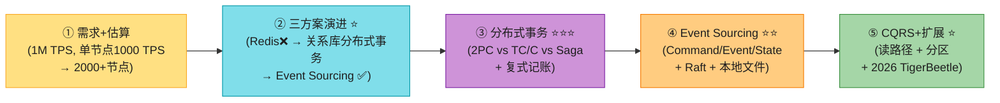
```mermaid
flowchart LR
    S1["① 需求+估算<br/>(1M TPS, 单节点1000 TPS<br/>→ 2000+节点)"] --> S2["② 三方案演进 ⭐<br/>(Redis❌ → 关系库分布式事务<br/>→ Event Sourcing ✅)"]
    S2 --> S3["③ 分布式事务 ⭐⭐⭐<br/>(2PC vs TC/C vs Saga<br/>+ 复式记账)"]
    S3 --> S4["④ Event Sourcing ⭐⭐<br/>(Command/Event/State<br/>+ Raft + 本地文件)"]
    S4 --> S5["⑤ CQRS+扩展 ⭐<br/>(读路径 + 分区<br/>+ 2026 TigerBeetle)"]

    style S1 fill:#FFE082,stroke:#F9A825,color:#1f1f1f
    style S2 fill:#80DEEA,stroke:#0097A7,color:#1f1f1f
    style S3 fill:#CE93D8,stroke:#7B1FA2,color:#1f1f1f
    style S4 fill:#FFCC80,stroke:#F57C00,color:#1f1f1f
    style S5 fill:#A5D6A7,stroke:#388E3C,color:#1f1f1f
```

> 💡 **Step 1 关键**:**钱包 1M TPS 不是单一节点能扛的**——单关系库节点约 1000 TPS,每次转账 = 2 个账户操作 → 实际需 **200 万 TPS → 2000 节点**。提高单节点 TPS 是降本核心。
>
> 💡 **关键信号词**:**"钱包余额必须强一致(钱不能凭空多/少),不能读副本"** + **"双花 = 并发把同一笔钱花两次,靠事务 + 复式记账防"** + **"Event Sourcing 让历史可重放,审计员能复盘任意时刻余额"**——这三句直接拿下面试。

---

## 🗺️ 章节概览

| 小节 | 要点 | 重要性 |
|------|------|--------|
| 需求 + 估算 | 1M TPS、单节点 1000 TPS → **2000 节点**、99.99% 可用 | ⭐⭐⭐⭐ |
| API 设计 | `POST /v1/wallet/balance_transfer`,amount 用 string | ⭐⭐⭐ |
| **方案一:Redis 内存** | 分片 + Zookeeper,❌ 不原子 | ⭐⭐⭐ |
| **方案二:关系库分布式事务 ⭐⭐** | 2PC(锁久)/ TC/C(补偿)/ Saga(线性) | ⭐⭐⭐⭐⭐ |
| **方案三:Event Sourcing ⭐⭐⭐** | Command/Event/State + 可重放 | ⭐⭐⭐⭐⭐ |
| **Event Sourcing 深化** | 本地文件(mmap/RocksDB)+ Snapshot + Raft | ⭐⭐⭐⭐⭐ |
| **CQRS + 分布式** | 读路径推 push + 跨分区 Saga | ⭐⭐⭐⭐ |
| **复式记账(2026 补)** ⭐ | 借贷必平,资产=负债+权益 | ⭐⭐⭐⭐⭐ |
| **2026 增量(补)** | TigerBeetle、双花防护、热点账户、UTXO、CBDC | ⭐⭐⭐⭐⭐ |

---

## 1. 需求 + 估算

**澄清问题**(原书对话):

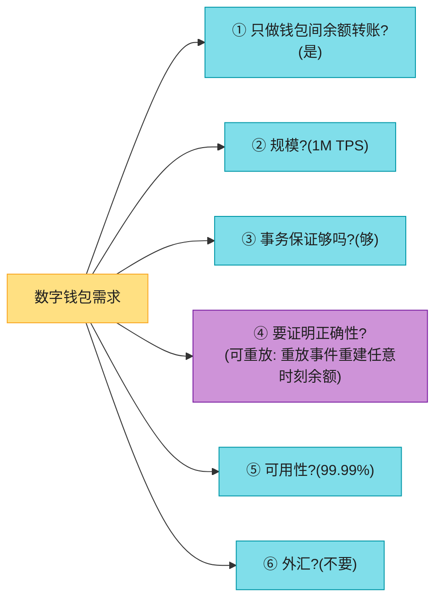
```mermaid
flowchart LR
    Q["数字钱包需求"] --> A["① 只做钱包间余额转账?<br/>(是)"]
    Q --> B["② 规模?(1M TPS)"]
    Q --> C["③ 事务保证够吗?(够)"]
    Q --> D["④ 要证明正确性?<br/>(可重放: 重放事件重建任意时刻余额)"]
    Q --> E["⑤ 可用性?(99.99%)"]
    Q --> F["⑥ 外汇?(不要)"]

    style Q fill:#FFE082,stroke:#F9A825,color:#1f1f1f
    style A fill:#80DEEA,stroke:#0097A7,color:#1f1f1f
    style B fill:#80DEEA,stroke:#0097A7,color:#1f1f1f
    style C fill:#80DEEA,stroke:#0097A7,color:#1f1f1f
    style D fill:#CE93D8,stroke:#7B1FA2,color:#1f1f1f
    style E fill:#80DEEA,stroke:#0097A7,color:#1f1f1f
    style F fill:#80DEEA,stroke:#0097A7,color:#1f1f1f
```

**功能(背)**:
- 钱包间余额转账(A 转 $1 给 C)。
- **1,000,000 TPS**。
- 可靠性 **99.99%**。
- 支持事务(原子性)。
- **支持可重放(reproducibility)**——能从最开头重放事件,重建任意时刻的余额。这是审计的核心。

**非功能**:强一致(钱不能多/少)、可审计、高可用、可扩展。

> 🪤 **追问陷阱(高频)**:"为什么要可重放?" → 审计员会问三个问题:**① 任意时刻账户余额是多少?② 历史和当前余额为什么是对的?③ 代码改了怎么证明逻辑还对?** 可重放(重放事件重建状态)能系统回答这三个问题——这是 Event Sourcing 的灵魂。

### 1.1 估算(背)

```
单关系库节点 ≈ 1000 TPS(TPC-E 基准)
目标 1M TPS → 需要 1000 节点

但每次转账 = 2 个账户操作(扣 A + 加 C)
→ 实际 2M TPS → 2000 节点 ⚠️

单节点 TPS 与节点数:
  100 TPS  → 20,000 节点
  1000 TPS → 2,000 节点
  10000 TPS → 200 节点 ⭐(提高单节点 TPS 是降本核心)
```

> 💡 **核心洞察**:**单节点 TPS 越高,总节点数越少 → 硬件成本越低**。所以设计目标之一是**提高单节点 TPS**(后面 Event Sourcing 用本地文件 + mmap 优化)。

---

## 2. API 设计

```
POST /v1/wallet/balance_transfer
{
  "from_account": "A",          // 借方账户(扣款)
  "to_account":   "C",          // 贷方账户(收款)
  "amount":       "1.00",       // 金额(用 string, 不用 double!)
  "currency":     "USD",        // ISO 4217
  "transaction_id": "01589980-2664-11ec-9621-0242ac130002"  // 幂等键
}

# 响应
{ "status": "success", "transaction_id": "01589980-..." }
```

> 🪤 **追问陷阱(高频)**:"amount 为什么是 string 不是 double?" → **浮点数有精度丢失**(0.1 + 0.2 ≠ 0.3)。金融场景必须 string + 整数分(cents)计算。**V2-Ch11 支付系统**讲过同样道理。**用 double 是经典 bug**——16 位有效数字后丢失,大额转账会少几分钱。

> 💡 **transaction_id 是幂等键**——客户端重试(网络抖动)用同一个 id,服务端去重,避免重复扣款(接 V2-Ch11 幂等)。

---

## 3. 方案一:Redis 内存分片(❌ 不原子)

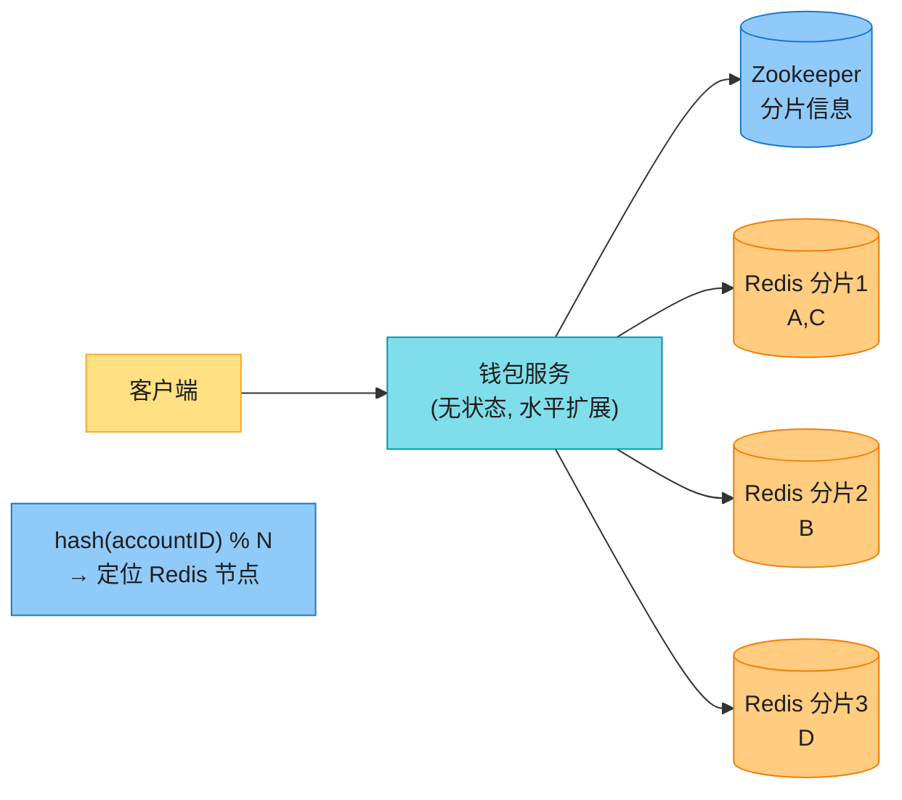
```mermaid
flowchart LR
    C["客户端"] --> WS["钱包服务<br/>(无状态, 水平扩展)"]
    WS --> ZK[("Zookeeper<br/>分片信息")]
    WS --> R1[("Redis 分片1<br/>A,C")]
    WS --> R2[("Redis 分片2<br/>B")]
    WS --> R3[("Redis 分片3<br/>D")]
    NOTE["hash(accountID) % N<br/>→ 定位 Redis 节点"]

    style C fill:#FFE082,stroke:#F9A825,color:#1f1f1f
    style WS fill:#80DEEA,stroke:#0097A7,color:#1f1f1f
    style ZK fill:#90CAF9,stroke:#1976D2,color:#1f1f1f
    style R1 fill:#FFCC80,stroke:#F57C00,color:#1f1f1f
    style R2 fill:#FFCC80,stroke:#F57C00,color:#1f1f1f
    style R3 fill:#FFCC80,stroke:#F57C00,color:#1f1f1f
    style NOTE fill:#90CAF9,stroke:#1976D2,color:#1f1f1f
```

**思路**:钱包 = `<user, balance>` 的 map。用 **Redis 集群分片**(`hash(accountID) % N`),Zookeeper 存分片信息,无状态钱包服务定位 Redis 节点更新余额。

### 3.1 为什么这个方案不行 ⭐⭐⭐

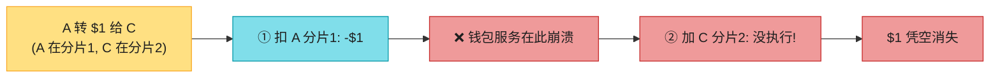
```mermaid
flowchart LR
    TRANS["A 转 $1 给 C<br/>(A 在分片1, C 在分片2)"] --> S1["① 扣 A 分片1: -$1"]
    S1 --> CRASH["❌ 钱包服务在此崩溃"]
    CRASH --> S2["② 加 C 分片2: 没执行!"]
    S2 --> RESULT["$1 凭空消失"]

    style TRANS fill:#FFE082,stroke:#F9A825,color:#1f1f1f
    style S1 fill:#80DEEA,stroke:#0097A7,color:#1f1f1f
    style CRASH fill:#EF9A9A,stroke:#C62828,color:#1f1f1f
    style S2 fill:#EF9A9A,stroke:#C62828,color:#1f1f1f
    style RESULT fill:#EF9A9A,stroke:#C62828,color:#1f1f1f
```

> 🪤 **致命问题**:**两次更新没有原子性保证**。钱包服务在两次 Redis 更新之间崩溃 → **$1 凭空消失**(钱不能凭空消失,这是金融系统的红线)。**Redis 单节点事务跨不了节点**。需要**分布式事务**。

---

## 4. 方案二:关系库 + 分布式事务 ⭐⭐⭐⭐⭐

第一步:把每个 Redis 节点换成**事务型关系库节点**(支持 ACID)。但跨库的两次更新仍不原子 → 需要**分布式事务**。

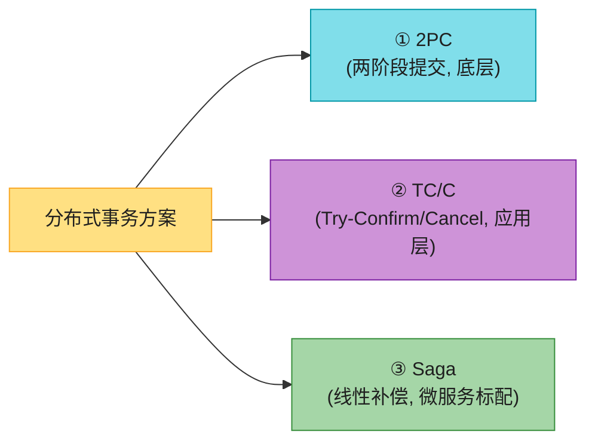
```mermaid
flowchart LR
    Q["分布式事务方案"] --> PC["① 2PC<br/>(两阶段提交, 底层)"]
    Q --> TCC["② TC/C<br/>(Try-Confirm/Cancel, 应用层)"]
    Q --> SAGA["③ Saga<br/>(线性补偿, 微服务标配)"]

    style Q fill:#FFE082,stroke:#F9A825,color:#1f1f1f
    style PC fill:#80DEEA,stroke:#0097A7,color:#1f1f1f
    style TCC fill:#CE93D8,stroke:#7B1FA2,color:#1f1f1f
    style SAGA fill:#A5D6A7,stroke:#388E3C,color:#1f1f1f
```

### 4.1 2PC(两阶段提交,底层方案)

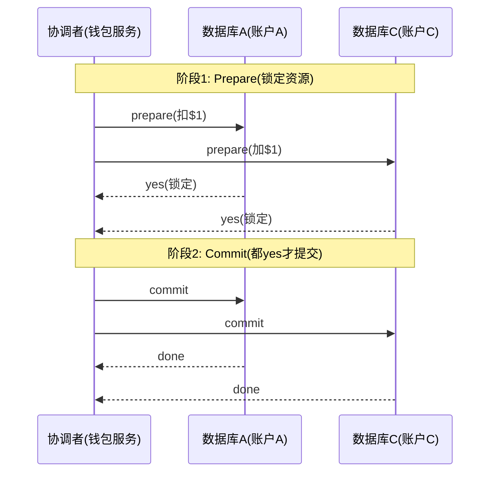
```mermaid
sequenceDiagram
    participant C as 协调者(钱包服务)
    participant DA as 数据库A(账户A)
    participant DC as 数据库C(账户C)
    Note over C,DC: 阶段1: Prepare(锁定资源)
    C->>DA: prepare(扣$1)
    C->>DC: prepare(加$1)
    DA-->>C: yes(锁定)
    DC-->>C: yes(锁定)
    Note over C,DC: 阶段2: Commit(都yes才提交)
    C->>DA: commit
    C->>DC: commit
    DA-->>C: done
    DC-->>C: done
```

**2PC 流程**(背):
1. **阶段1 Prepare**:协调者(钱包服务)在多个数据库上正常读写(都**锁定**);准备提交时问所有库"能否提交?"。
2. **阶段2**:
   - 所有库回 "yes" → 协调者让所有库 **commit**;
   - 任一库回 "no" → 协调者让所有库 **abort**。

**2PC 的两个大问题**:

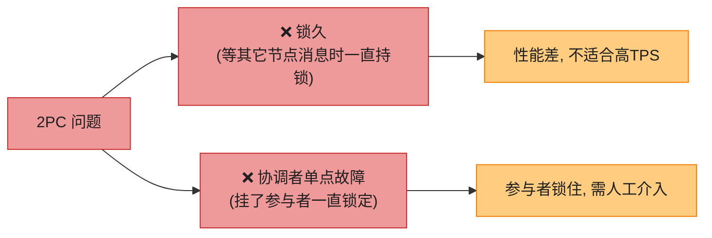
```mermaid
flowchart LR
    PC["2PC 问题"] --> P1["❌ 锁久<br/>(等其它节点消息时一直持锁)"]
    PC --> P2["❌ 协调者单点故障<br/>(挂了参与者一直锁定)"]
    P1 --> SLOW["性能差, 不适合高TPS"]
    P2 --> STUCK["参与者锁住, 需人工介入"]

    style PC fill:#EF9A9A,stroke:#C62828,color:#1f1f1f
    style P1 fill:#EF9A9A,stroke:#C62828,color:#1f1f1f
    style P2 fill:#EF9A9A,stroke:#C62828,color:#1f1f1f
    style SLOW fill:#FFCC80,stroke:#F57C00,color:#1f1f1f
    style STUCK fill:#FFCC80,stroke:#F57C00,color:#1f1f1f
```

> 📝 **2PC 是底层方案**——`prepare` 步骤要数据库特殊支持(如 X/Open XA 标准)。**锁持有太久 + 协调者单点**是两大硬伤。

### 4.2 TC/C(Try-Confirm/Cancel,应用层补偿)⭐⭐⭐

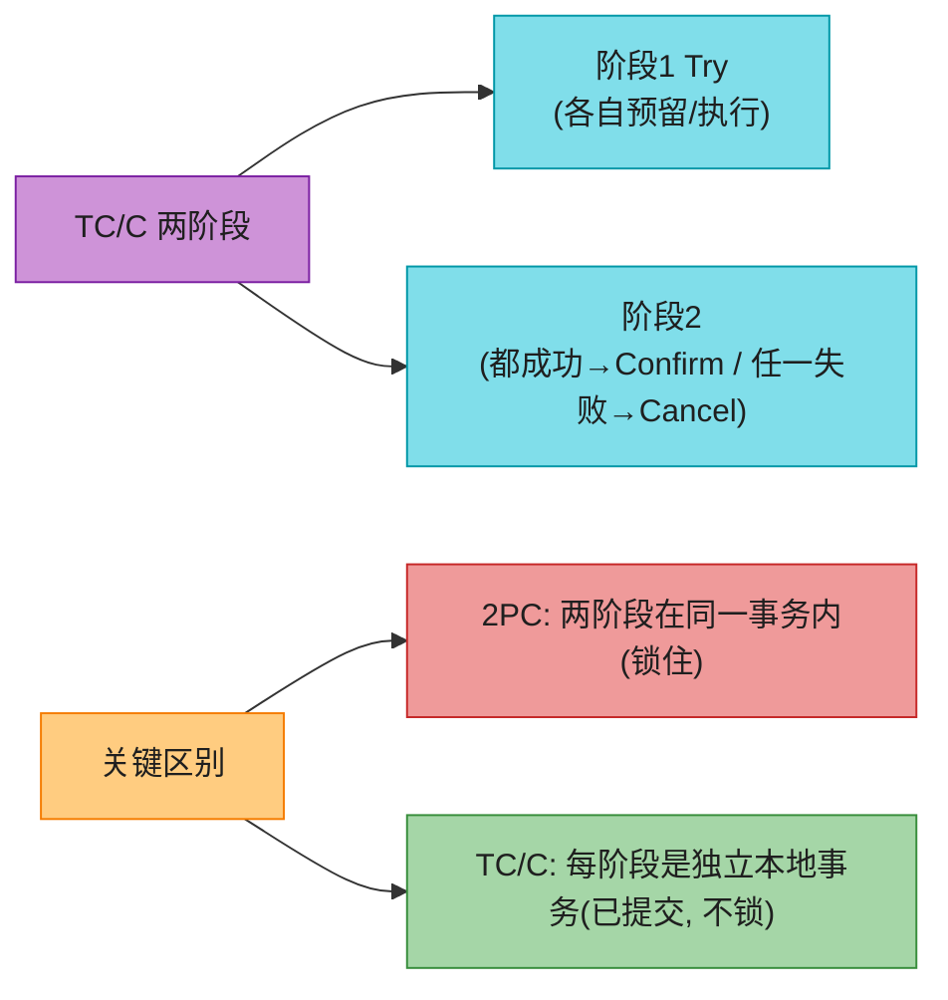
```mermaid
flowchart LR
    TCC["TC/C 两阶段"] --> P1["阶段1 Try<br/>(各自预留/执行)"]
    TCC --> P2["阶段2<br/>(都成功→Confirm / 任一失败→Cancel)"]
    KEY["关键区别"] --> K1["2PC: 两阶段在同一事务内(锁住)"]
    KEY --> K2["TC/C: 每阶段是独立本地事务(已提交, 不锁)"]

    style TCC fill:#CE93D8,stroke:#7B1FA2,color:#1f1f1f
    style P1 fill:#80DEEA,stroke:#0097A7,color:#1f1f1f
    style P2 fill:#80DEEA,stroke:#0097A7,color:#1f1f1f
    style KEY fill:#FFCC80,stroke:#F57C00,color:#1f1f1f
    style K1 fill:#EF9A9A,stroke:#C62828,color:#1f1f1f
    style K2 fill:#A5D6A7,stroke:#388E3C,color:#1f1f1f
```

**TC/C 转账 $1 从 A 到 C 的例子**(背):

| 阶段 | 账户 A | 账户 C |
|------|--------|--------|
| 1. Try | 余额 -$1 | NOP(不动) |
| 2. Confirm(成功) | NOP(不动) | 余额 +$1 |
| 2. Cancel(失败) | 余额 +$1(回滚) | NOP |

**为什么这样设计?Try 阶段只动扣款方 A**(把 $1 真扣掉),C 不动。如果 Try 都成功 → Confirm 给 C 加 $1;如果 Try 任一失败 → Cancel 把 A 的 $1 加回去。

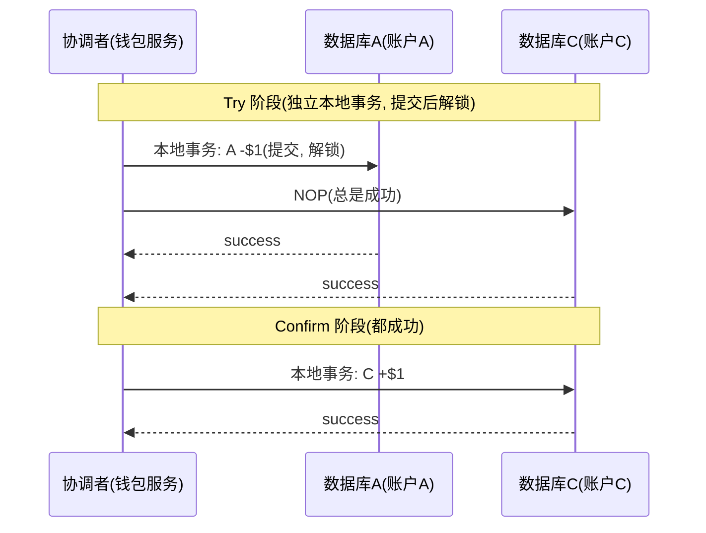
```mermaid
sequenceDiagram
    participant C as 协调者(钱包服务)
    participant DA as 数据库A(账户A)
    participant DC as 数据库C(账户C)
    Note over C,DC: Try 阶段(独立本地事务, 提交后解锁)
    C->>DA: 本地事务: A -$1(提交, 解锁)
    C->>DC: NOP(总是成功)
    DA-->>C: success
    DC-->>C: success
    Note over C,DC: Confirm 阶段(都成功)
    C->>DC: 本地事务: C +$1
    DC-->>C: success
```

**Try 阶段的三种选择**(只有一种有效):

| Try 阶段选择 | 账户 A | 账户 C | 是否有效 |
|------|--------|--------|------|
| 选择1 | -$1 | NOP | ✅ 有效 |
| 选择2 | NOP | +$1 | ❌ 无效 |
| 选择3 | -$1 | +$1 | ❌ 无效 |

- **选择2 无效**:Try 给 C +$1 成功了,但 A 失败 → Cancel 时别人可能已把 C 的 $1 转走,Cancel 扣 C 时余额不足。
- **选择3 无效**:并发给 A 和 C 都改,失败处理极复杂(A 加了 C 没扣怎么办?)。
- **只有选择1 有效**:**先扣款方,后收款方**。钱"先消失再出现",不会出现"先出现的钱被别人转走"。

> 📝 **核心结论**:**转账 = 先扣款方,后收款方**(扣款在 Try,收款在 Confirm)。这条规则贯穿 TC/C 和 Saga。

### 4.3 不平衡状态(Unbalanced Balance)⭐⭐

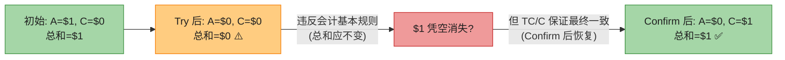
```mermaid
flowchart LR
    INIT["初始: A=$1, C=$0<br/>总和=$1"] --> TRY["Try 后: A=$0, C=$0<br/>总和=$0 ⚠️"]
    TRY -->|"违反会计基本规则<br/>(总和应不变)"| UNBAL["$1 凭空消失?"]
    UNBAL -->|"但 TC/C 保证最终一致<br/>(Confirm 后恢复)"| OK["Confirm 后: A=$0, C=$1<br/>总和=$1 ✅"]

    style INIT fill:#A5D6A7,stroke:#388E3C,color:#1f1f1f
    style TRY fill:#FFCC80,stroke:#F57C00,color:#1f1f1f
    style UNBAL fill:#EF9A9A,stroke:#C62828,color:#1f1f1f
    style OK fill:#A5D6A7,stroke:#388E3C,color:#1f1f1f
```

> 🪤 **追问陷阱(高频)**:"Try 阶段后 $1 哪去了?" → **Try 后 A=$0, C=$0,总和从 $1 变 $0,确实"不平衡"**——这违反会计基本规则(转账前后总和应不变)。但 **TC/C 是应用层事务,每阶段独立提交,中间状态对外可见但不影响最终一致**。Confirm 完成后恢复平衡。**这是 TC/C 与 2PC 的本质区别**:2PC 中间状态对外不可见(锁住),TC/C 中间状态对外可见。

### 4.4 阶段状态表(Phase Status Table)

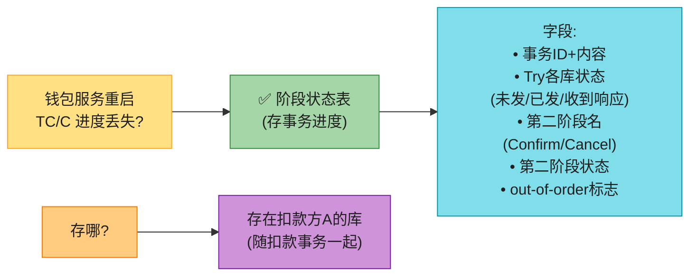
```mermaid
flowchart LR
    Q["钱包服务重启<br/>TC/C 进度丢失?"] --> A["✅ 阶段状态表<br/>(存事务进度)"]
    A --> F["字段:<br/>• 事务ID+内容<br/>• Try各库状态<br/>(未发/已发/收到响应)<br/>• 第二阶段名(Confirm/Cancel)<br/>• 第二阶段状态<br/>• out-of-order标志"]
    LOC["存哪?"] --> L["存在扣款方A的库<br/>(随扣款事务一起)"]

    style Q fill:#FFE082,stroke:#F9A825,color:#1f1f1f
    style A fill:#A5D6A7,stroke:#388E3C,color:#1f1f1f
    style F fill:#80DEEA,stroke:#0097A7,color:#1f1f1f
    style LOC fill:#FFCC80,stroke:#F57C00,color:#1f1f1f
    style L fill:#CE93D8,stroke:#7B1FA2,color:#1f1f1f
```

> 💡 **重启恢复**:钱包服务重启后从阶段状态表读进度,知道 Try 走到哪、该执行 Confirm 还是 Cancel,继续未完成的事务。

### 4.5 乱序执行(Out-of-Order)⭐

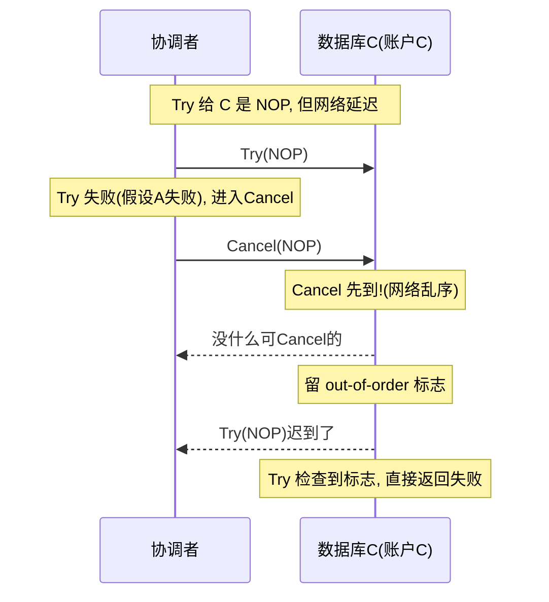
```mermaid
sequenceDiagram
    participant C as 协调者
    participant DC as 数据库C(账户C)
    Note over C,DC: Try 给 C 是 NOP, 但网络延迟
    C->>DC: Try(NOP)
    Note over C: Try 失败(假设A失败), 进入Cancel
    C->>DC: Cancel(NOP)
    Note over DC: Cancel 先到!(网络乱序)
    DC-->>C: 没什么可Cancel的
    Note over DC: 留 out-of-order 标志
    DC-->>C: Try(NOP)迟到了
    Note over DC: Try 检查到标志, 直接返回失败
```

**乱序问题**:网络延迟导致 **Cancel 比 Try 先到**。处理:**每个节点允许在没收到 Try 时就 Cancel**(留 out-of-order 标志),后续迟到的 Try 检查到标志直接失败。这就是阶段状态表里 out-of-order 标志的用途。

### 4.6 Saga(线性补偿,微服务标配)⭐⭐

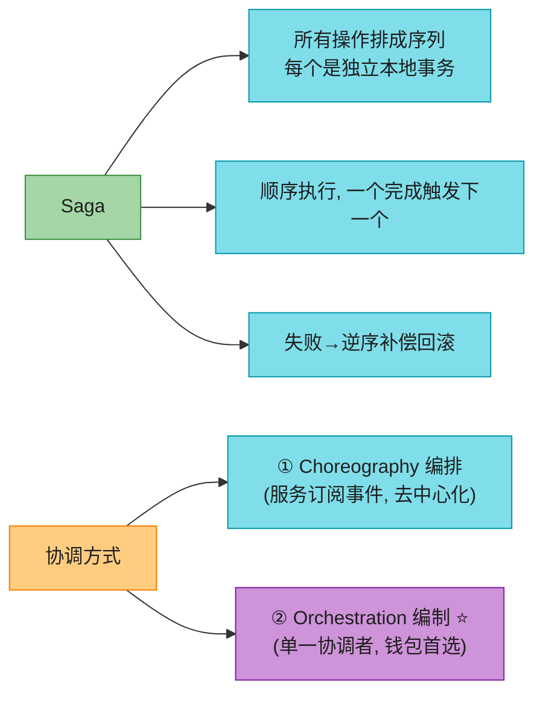
```mermaid
flowchart LR
    SAGA["Saga"] --> IDEA["所有操作排成序列<br/>每个是独立本地事务"]
    SAGA --> EXEC["顺序执行, 一个完成触发下一个"]
    SAGA --> ROLL["失败→逆序补偿回滚"]
    COORD["协调方式"] --> CH["① Choreography 编排<br/>(服务订阅事件, 去中心化)"]
    COORD --> OR["② Orchestration 编制 ⭐<br/>(单一协调者, 钱包首选)"]

    style SAGA fill:#A5D6A7,stroke:#388E3C,color:#1f1f1f
    style IDEA fill:#80DEEA,stroke:#0097A7,color:#1f1f1f
    style EXEC fill:#80DEEA,stroke:#0097A7,color:#1f1f1f
    style ROLL fill:#80DEEA,stroke:#0097A7,color:#1f1f1f
    style COORD fill:#FFCC80,stroke:#F57C00,color:#1f1f1f
    style CH fill:#80DEEA,stroke:#0097A7,color:#1f1f1f
    style OR fill:#CE93D8,stroke:#7B1FA2,color:#1f1f1f
```

**Saga 转账 $1 从 A 到 C**:
- 正常:`A-$1 → C+$1`(顺序执行)。
- 失败:如 `C+$1` 失败 → 逆序补偿 `C-$1`(撤销)→ `A+$1`(撤销)。

> 📝 **Choreography vs Orchestration**:Choreography(编排)各服务订阅事件,去中心化,但服务多了难管理;**Orchestration(编制)有单一协调者,复杂度可控**,**钱包系统首选 Orchestration**。

### 4.7 三种分布式事务对比(背)

| 维度 | 2PC | TC/C | Saga |
|------|-----|------|------|
| **层级** | 底层(DB 特殊支持) | 应用层(补偿) | 应用层(补偿) |
| **第一阶段** | 本地事务**未完成**(锁住) | 本地事务**已完成**(解锁) | 本地事务**已完成** |
| **第二阶段(成功)** | commit 所有本地事务 | 执行新本地事务(Confirm) | 触发下一个操作 |
| **第二阶段(失败)** | abort 所有本地事务 | 反向操作撤销(Cancel) | 逆序补偿回滚 |
| **执行顺序** | 任意 | 任意(可并行) | **线性** |
| **协调** | 协调者(单点) | 中央协调 | Orchestration(中央)/ Choreography(去中心) |
| **中间不一致对外可见** | 否(锁住) | 是 | 是 |
| **性能** | 差(锁久) | 好(可并行) | 中(线性) |

> 💡 **选型经验**:**无延迟要求 / 服务少** → Saga(微服务趋势);**延迟敏感 / 服务多** → TC/C(可并行)。**钱包转账只有 2 个操作,TC/C 和 Saga 都行**。

> 🪤 **追问陷阱**:"TC/C 和 Saga 最大区别?" → **执行顺序**:Saga 必须**线性**(一个完成才触发下一个);TC/C **可并行**(各 Try 独立)。延迟敏感场景 TC/C 更优。

---

## 5. 方案三:Event Sourcing ⭐⭐⭐⭐⭐(本章核心)

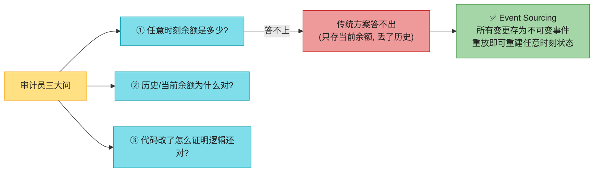
```mermaid
flowchart LR
    Q["审计员三大问"] --> Q1["① 任意时刻余额是多少?"]
    Q --> Q2["② 历史/当前余额为什么对?"]
    Q --> Q3["③ 代码改了怎么证明逻辑还对?"]
    Q1 -->|"答不上"| TRAD["传统方案答不出<br/>(只存当前余额, 丢了历史)"]
    TRAD --> ES["✅ Event Sourcing<br/>所有变更存为不可变事件<br/>重放即可重建任意时刻状态"]

    style Q fill:#FFE082,stroke:#F9A825,color:#1f1f1f
    style Q1 fill:#80DEEA,stroke:#0097A7,color:#1f1f1f
    style Q2 fill:#80DEEA,stroke:#0097A7,color:#1f1f1f
    style Q3 fill:#80DEEA,stroke:#0097A7,color:#1f1f1f
    style TRAD fill:#EF9A9A,stroke:#C62828,color:#1f1f1f
    style ES fill:#A5D6A7,stroke:#388E3C,color:#1f1f1f
```

> 📝 **Event Sourcing 来自 DDD(领域驱动设计)**——一种能系统回答审计三问的设计哲学。**所有变更先存为不可变事件历史,数据库只是某一时刻的余额视图**。

### 5.1 四个核心术语

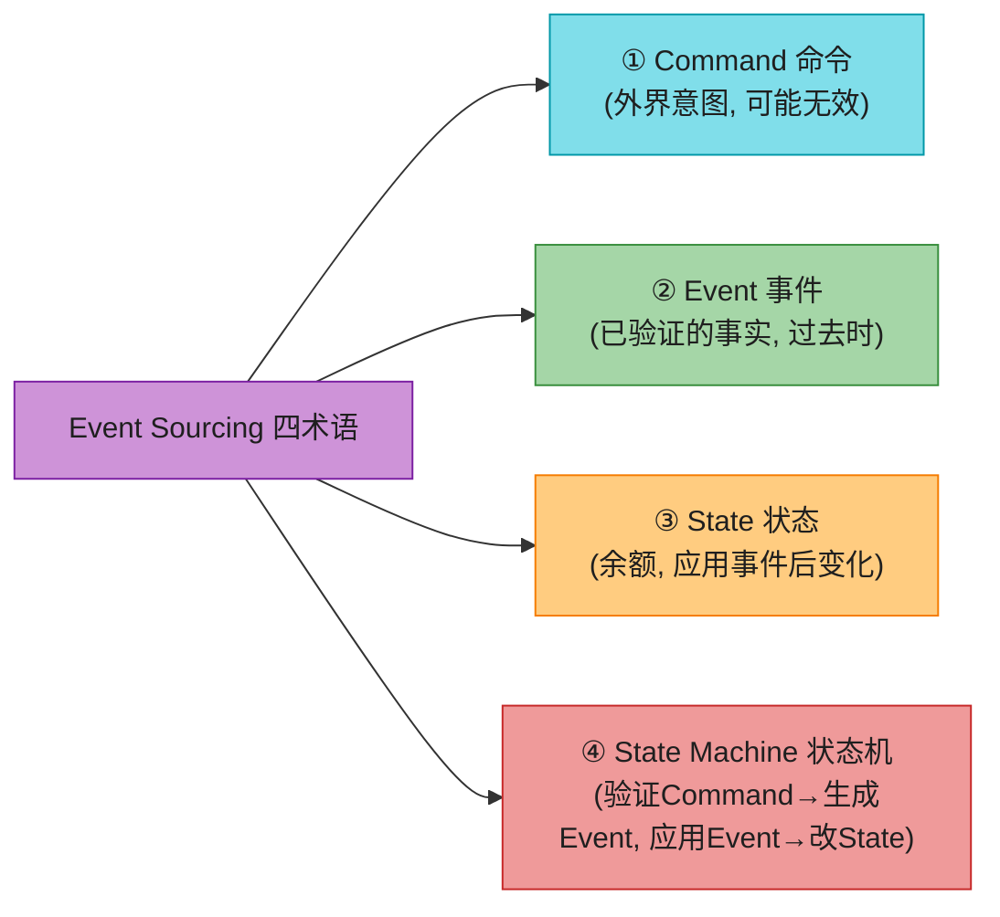
```mermaid
flowchart LR
    ES["Event Sourcing 四术语"] --> CMD["① Command 命令<br/>(外界意图, 可能无效)"]
    ES --> EVT["② Event 事件<br/>(已验证的事实, 过去时)"]
    ES --> ST["③ State 状态<br/>(余额, 应用事件后变化)"]
    ES --> SM["④ State Machine 状态机<br/>(验证Command→生成Event, 应用Event→改State)"]

    style ES fill:#CE93D8,stroke:#7B1FA2,color:#1f1f1f
    style CMD fill:#80DEEA,stroke:#0097A7,color:#1f1f1f
    style EVT fill:#A5D6A7,stroke:#388E3C,color:#1f1f1f
    style ST fill:#FFCC80,stroke:#F57C00,color:#1f1f1f
    style SM fill:#EF9A9A,stroke:#C62828,color:#1f1f1f
```

| 术语 | 含义 | 钱包例子 |
|------|------|----------|
| **Command(命令)** | 外界意图,**可能无效** | "从 A 转 $1 到 C" |
| **Event(事件)** | 验证后的事实,**过去时, 确定性** | "A 被扣 $1"、"C 收到 $1" |
| **State(状态)** | 应用 Event 后的当前值 | 各账户余额(map: account→balance) |
| **State Machine(状态机)** | 验证 Command → 生成 Event;应用 Event → 改 State | 状态机逻辑**必须确定性**(无随机/无外部 IO) |

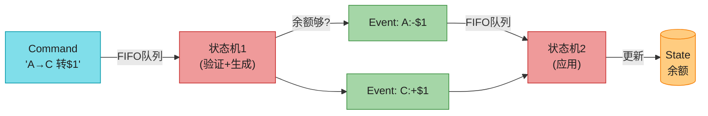
```mermaid
flowchart LR
    CMD["Command<br/>'A→C 转$1'"] -->|"FIFO队列"| SM1["状态机1<br/>(验证+生成)"]
    SM1 -->|"余额够?"| EVT1["Event: A:-$1"]
    SM1 --> EVT2["Event: C:+$1"]
    EVT1 -->|"FIFO队列"| SM2["状态机2<br/>(应用)"]
    EVT2 --> SM2
    SM2 -->|"更新"| STATE[("State<br/>余额")]

    style CMD fill:#80DEEA,stroke:#0097A7,color:#1f1f1f
    style SM1 fill:#EF9A9A,stroke:#C62828,color:#1f1f1f
    style EVT1 fill:#A5D6A7,stroke:#388E3C,color:#1f1f1f
    style EVT2 fill:#A5D6A7,stroke:#388E3C,color:#1f1f1f
    style SM2 fill:#EF9A9A,stroke:#C62828,color:#1f1f1f
    style STATE fill:#FFCC80,stroke:#F57C00,color:#1f1f1f
```

**Command vs Event 关键区别**(背):
- Event **必须执行**(已验证的事实),用过去时;Command 是意图,可能失败。
- Command **可含随机/IO**;Event **必须确定性**(历史事实,同样输入永远同样输出)。
- 一个 Command 可生成 **0 到多个 Event**;Event 顺序必须遵循 Command 顺序。

### 5.2 钱包服务的 Event Sourcing 工作流

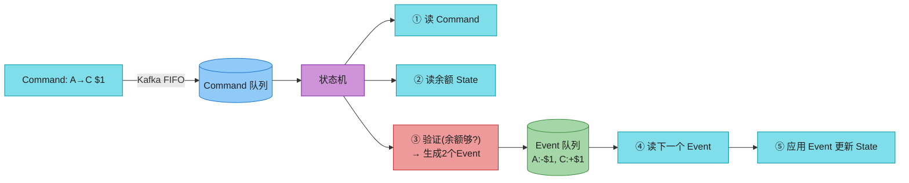
```mermaid
flowchart LR
    CMD["Command: A→C $1"] -->|"Kafka FIFO"| Q1[("Command 队列")]
    Q1 --> SM["状态机"]
    SM --> S1["① 读 Command"]
    SM --> S2["② 读余额 State"]
    SM --> S3["③ 验证(余额够?)<br/>→ 生成2个Event"]
    S3 --> EVT[("Event 队列<br/>A:-$1, C:+$1")]
    EVT --> S4["④ 读下一个 Event"]
    S4 --> S5["⑤ 应用 Event 更新 State"]

    style CMD fill:#80DEEA,stroke:#0097A7,color:#1f1f1f
    style Q1 fill:#90CAF9,stroke:#1976D2,color:#1f1f1f
    style SM fill:#CE93D8,stroke:#7B1FA2,color:#1f1f1f
    style S1 fill:#80DEEA,stroke:#0097A7,color:#1f1f1f
    style S2 fill:#80DEEA,stroke:#0097A7,color:#1f1f1f
    style S3 fill:#EF9A9A,stroke:#C62828,color:#1f1f1f
    style EVT fill:#A5D6A7,stroke:#388E3C,color:#1f1f1f
    style S4 fill:#80DEEA,stroke:#0097A7,color:#1f1f1f
    style S5 fill:#80DEEA,stroke:#0097A7,color:#1f1f1f
```

### 5.3 可重放(Reproducibility)⭐⭐⭐——Event Sourcing 的灵魂

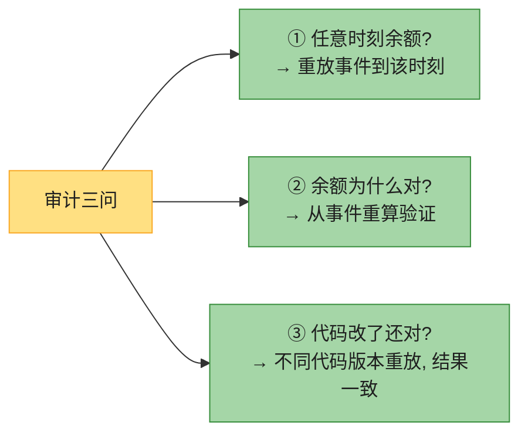
```mermaid
flowchart LR
    Q["审计三问"] --> A1["① 任意时刻余额?<br/>→ 重放事件到该时刻"]
    Q --> A2["② 余额为什么对?<br/>→ 从事件重算验证"]
    Q --> A3["③ 代码改了还对?<br/>→ 不同代码版本重放, 结果一致"]

    style Q fill:#FFE082,stroke:#F9A825,color:#1f1f1f
    style A1 fill:#A5D6A7,stroke:#388E3C,color:#1f1f1f
    style A2 fill:#A5D6A7,stroke:#388E3C,color:#1f1f1f
    style A3 fill:#A5D6A7,stroke:#388E3C,color:#1f1f1f
```

> 💡 **可重放是 Event Sourcing 最大优势**:事件列表不可变 + 状态机确定性 → **重放总能得到相同历史状态**。审计三问系统回答。**因为审计能力,Event Sourcing 是钱包服务的事实标准**。

### 5.4 CQRS(命令查询职责分离)⭐⭐

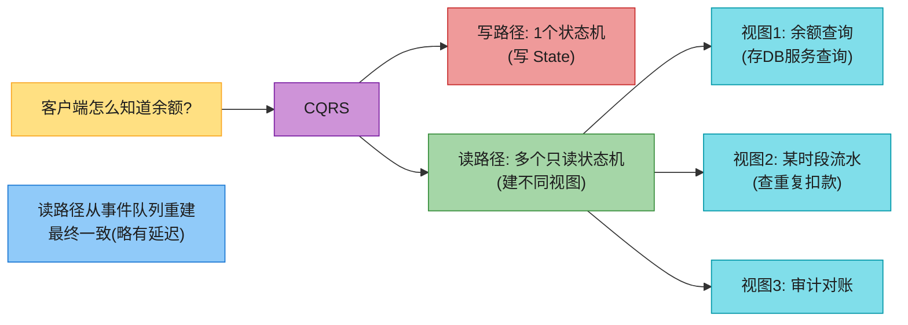
```mermaid
flowchart LR
    Q["客户端怎么知道余额?"] --> CQRS["CQRS"]
    CQRS --> W["写路径: 1个状态机<br/>(写 State)"]
    CQRS --> R["读路径: 多个只读状态机<br/>(建不同视图)"]
    R --> R1["视图1: 余额查询<br/>(存DB服务查询)"]
    R --> R2["视图2: 某时段流水<br/>(查重复扣款)"]
    R --> R3["视图3: 审计对账"]
    NOTE["读路径从事件队列重建<br/>最终一致(略有延迟)"]

    style Q fill:#FFE082,stroke:#F9A825,color:#1f1f1f
    style CQRS fill:#CE93D8,stroke:#7B1FA2,color:#1f1f1f
    style W fill:#EF9A9A,stroke:#C62828,color:#1f1f1f
    style R fill:#A5D6A7,stroke:#388E3C,color:#1f1f1f
    style R1 fill:#80DEEA,stroke:#0097A7,color:#1f1f1f
    style R2 fill:#80DEEA,stroke:#0097A7,color:#1f1f1f
    style R3 fill:#80DEEA,stroke:#0097A7,color:#1f1f1f
    style NOTE fill:#90CAF9,stroke:#1976D2,color:#1f1f1f
```

**CQRS**(背):不直接发布 State,而是**发布所有事件**,外部世界自己重建所需的视图。
- **写路径**:1 个状态机负责写 State。
- **读路径**:多个只读状态机,从事件队列重建不同视图(余额查询 / 时段流水 / 审计对账)。
- **最终一致**:读路径略滞后但总会追上。

---

## 6. 高性能 Event Sourcing ⭐⭐⭐⭐

### 6.1 本地文件优化(三大加速)

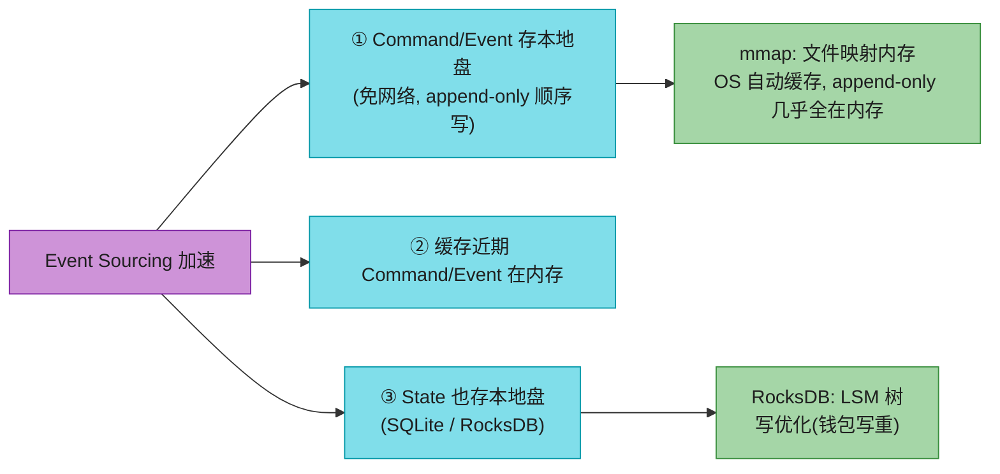
```mermaid
flowchart LR
    OPT["Event Sourcing 加速"] --> O1["① Command/Event 存本地盘<br/>(免网络, append-only 顺序写)"]
    OPT --> O2["② 缓存近期 Command/Event 在内存"]
    OPT --> O3["③ State 也存本地盘<br/>(SQLite / RocksDB)"]
    O1 --> MMAP["mmap: 文件映射内存<br/>OS 自动缓存, append-only 几乎全在内存"]
    O3 --> ROCKS["RocksDB: LSM 树<br/>写优化(钱包写重)"]

    style OPT fill:#CE93D8,stroke:#7B1FA2,color:#1f1f1f
    style O1 fill:#80DEEA,stroke:#0097A7,color:#1f1f1f
    style O2 fill:#80DEEA,stroke:#0097A7,color:#1f1f1f
    style O3 fill:#80DEEA,stroke:#0097A7,color:#1f1f1f
    style MMAP fill:#A5D6A7,stroke:#388E3C,color:#1f1f1f
    style ROCKS fill:#A5D6A7,stroke:#388E3C,color:#1f1f1f
```

> 💡 **关键洞察**:**顺序磁盘访问有时比随机内存访问还快**(ACM Queue 文章)。append-only 文件 + mmap → 几乎全在内存操作。**State 用 RocksDB(LSM 树,写优化)**。

### 6.2 Snapshot(快照)加速重放

```mermaid
flowchart LR
    Q["重放要从头开始?<br/>(事件多了慢)"] --> SNAP["Snapshot 快照 ⭐"]
    SNAP --> IDEA["定期停状态机, 存当前 State 到文件"]
    SNAP --> RESUME["重放只从最近快照开始<br/>(验证偏移量, 续处理)"]
    USE["用途"] --> U1["财务要求每天 00:00 快照<br/>核对当日交易"]
    USE --> U2["存对象存储 HDFS<br/>(大二进制文件)"]

    style Q fill:#FFE082,stroke:#F9A825,color:#1f1f1f
    style SNAP fill:#CE93D8,stroke:#7B1FA2,color:#1f1f1f
    style IDEA fill:#80DEEA,stroke:#0097A7,color:#1f1f1f
    style RESUME fill:#A5D6A7,stroke:#388E3C,color:#1f1f1f
    style USE fill:#FFCC80,stroke:#F57C00,color:#1f1f1f
    style U1 fill:#80DEEA,stroke:#0097A7,color:#1f1f1f
    style U2 fill:#80DEEA,stroke:#0097A7,color:#1f1f1f
```

> 📝 **Snapshot 是历史 State 的不可变视图**。存了快照后,重放不必从头开始,从快照续处理。财务常要求每天 00:00 快照核对当日交易。**Snapshot 存 HDFS(大二进制文件)**。

---

## 7. 可靠的 Event Sourcing(Raft 共识)⭐⭐⭐

```mermaid
flowchart LR
    Q["本地文件=单点故障?"] --> ANS["哪些数据要可靠?"]
    ANS --> D1["Command: 不必(可重发)"]
    ANS --> D2["Event ⭐: 必须(历史事实, 丢了永远丢)"]
    ANS --> D3["State/Snapshot: 不必(可从Event重建)"]
    D2 --> SOL["Event 多副本复制"]
    SOL --> RAFT["Raft 共识算法"]
    RAFT --> GUARANTEE["保证:<br/>① 不丢数据<br/>② 多节点顺序一致"]

    style Q fill:#FFE082,stroke:#F9A825,color:#1f1f1f
    style ANS fill:#FFCC80,stroke:#F57C00,color:#1f1f1f
    style D1 fill:#A5D6A7,stroke:#388E3C,color:#1f1f1f
    style D2 fill:#EF9A9A,stroke:#C62828,color:#1f1f1f
    style D3 fill:#A5D6A7,stroke:#388E3C,color:#1f1f1f
    style SOL fill:#80DEEA,stroke:#0097A7,color:#1f1f1f
    style RAFT fill:#CE93D8,stroke:#7B1FA2,color:#1f1f1f
    style GUARANTEE fill:#A5D6A7,stroke:#388E3C,color:#1f1f1f
```

> 💡 **可靠性分析**:数据可靠了,计算结果可在另一节点重跑同样代码恢复。**只需担心数据可靠性**。四种数据(Command/Event/State/Snapshot)中,**只有 Event 需要高可靠保证**(历史事实,不可重建;Command 不行因为 Event 生成非确定性)。

### 7.1 Raft 共识

```mermaid
flowchart LR
    RAFT["Raft 集群(5节点)"] --> R1["只要多数(≥3)在线就能工作"]
    RAFT --> ROLE["三种角色"]
    ROLE --> LEADER["Leader ⭐<br/>(接收Command, 复制Event)"]
    ROLE --> FOLLOW["Follower<br/>(复制Leader数据)"]
    ROLE --> CAND["Candidate<br/>(选举中)"]
    CRASH["Leader 崩溃"] --> ELECT["剩余节点选新Leader"]
    CRASH2["Follower 崩溃"] --> RETRY["Raft 无限重试直到恢复"]

    style RAFT fill:#CE93D8,stroke:#7B1FA2,color:#1f1f1f
    style R1 fill:#A5D6A7,stroke:#388E3C,color:#1f1f1f
    style ROLE fill:#FFCC80,stroke:#F57C00,color:#1f1f1f
    style LEADER fill:#EF9A9A,stroke:#C62828,color:#1f1f1f
    style FOLLOW fill:#80DEEA,stroke:#0097A7,color:#1f1f1f
    style CAND fill:#80DEEA,stroke:#0097A7,color:#1f1f1f
    style CRASH fill:#FFCC80,stroke:#F57C00,color:#1f1f1f
    style ELECT fill:#A5D6A7,stroke:#388E3C,color:#1f1f1f
    style CRASH2 fill:#FFCC80,stroke:#F57C00,color:#1f1f1f
    style RETRY fill:#A5D6A7,stroke:#388E3C,color:#1f1f1f
```

> 📝 **Raft 保证**:只要多数节点在线(3 节点容忍 1 故障,5 节点容忍 2 故障),append-only 列表数据一致。**Leader 收 Command → 转 Event → 追加本地列表 → Raft 复制到 Follower**。所有节点处理 Event 列表更新 State(Raft 保证列表一致 → Event Sourcing 保证 State 一致)。

---

## 8. 分布式 Event Sourcing(最终设计)⭐⭐⭐⭐⭐

### 8.1 Pull vs Push(同步化)

```mermaid
flowchart LR
    Q["客户端怎么知道结果?"] --> PULL["Pull 模型<br/>(客户端定期拉)"]
    PULL --> BAD["❌ 不实时, 拉频繁压垮服务"]
    Q --> PUSH["Push 模型 ⭐<br/>(反向代理 + 推送)"]
    PUSH --> RP["反向代理转发 Command"]
    RP --> ESN["ES 节点处理"]
    ESN -->|"只读状态机收到Event<br/>立刻推回代理"| RP2["代理返回客户端<br/>(实时感)"]

    style Q fill:#FFE082,stroke:#F9A825,color:#1f1f1f
    style PULL fill:#FFCC80,stroke:#F57C00,color:#1f1f1f
    style BAD fill:#EF9A9A,stroke:#C62828,color:#1f1f1f
    style PUSH fill:#A5D6A7,stroke:#388E3C,color:#1f1f1f
    style RP fill:#80DEEA,stroke:#0097A7,color:#1f1f1f
    style ESN fill:#80DEEA,stroke:#0097A7,color:#1f1f1f
    style RP2 fill:#CE93D8,stroke:#7B1FA2,color:#1f1f1f
```

> 💡 **加反向代理 + 只读状态机主动推送** → 把异步 Event Sourcing 对外变成同步体验。

### 8.2 跨分区:复用 Saga/TC/C

```mermaid
flowchart TB
    CLIENT["客户端"] --> PROXY["反向代理"]
    PROXY --> COORD["Saga 协调者"]
    COORD --> PST["阶段状态表"]
    COORD -->|"A-$1(先扣款方)"| P1["分区1 Raft 组<br/>(含账户A)"]
    COORD -->|"C+$1(后收款方)"| P2["分区2 Raft 组<br/>(含账户C)"]
    P1 -->|"Command→Event→Raft复制<br/>→CQRS推回协调者"| COORD
    P2 -->|"同上"| COORD
    COORD -->|"全部成功"| PROXY
    PROXY --> CLIENT

    style CLIENT fill:#FFE082,stroke:#F9A825,color:#1f1f1f
    style PROXY fill:#80DEEA,stroke:#0097A7,color:#1f1f1f
    style COORD fill:#CE93D8,stroke:#7B1FA2,color:#1f1f1f
    style PST fill:#90CAF9,stroke:#1976D2,color:#1f1f1f
    style P1 fill:#FFCC80,stroke:#F57C00,color:#1f1f1f
    style P2 fill:#FFCC80,stroke:#F57C00,color:#1f1f1f
```

**最终设计转账流程**(背,15 步精简):
1. 客户端发分布式事务给 Saga 协调者(含 2 操作:A-$1, C+$1)。
2. 协调者在阶段状态表建记录。
3. 协调者确定顺序,先发 `A-$1` 作 Command 给**分区1**(含账户A)。
4. 分区1 Raft Leader 收 Command → 存命令列表 → 验证 → 转 Event → Raft 复制 → 同步完成后执行 Event(扣 A)。
5. Event 同步后,CQRS 把数据同步到读路径,读路径重建状态。
6. 分区1 读路径把状态推回 Saga 协调者。
7. 协调者收到分区1 成功 → 阶段状态表记录。
8. 第一个操作成功 → 协调者执行第二个 `C+$1`,发 Command 给**分区2**(含账户C)。
9. 分区2 同样:Command → Event → Raft 复制 → 执行。
10. CQRS 同步读路径,推回协调者。
11. 协调者收到分区2 成功 → 阶段状态表记录。
12. 所有操作成功 → 分布式事务完成,响应客户端。

---

## 9. 2026 现代增量(原书没讲的硬核)⭐⭐⭐⭐⭐

### 9.1 复式记账(Double-Entry Bookkeeping)⭐⭐⭐⭐⭐(本章最硬核补丁)

原书把"账户 = 一个余额数字",但**真正的金融账户系统必须用复式记账**。

```mermaid
flowchart LR
    DBE["复式记账基本方程"] --> EQ["资产 = 负债 + 权益<br/>(Assets = Liabilities + Equity)"]
    DBE --> RULE["每笔交易借贷必平<br/>(Debit = Credit)"]
    DBE --> TWO["每笔至少2行<br/>(借方一行, 贷方一行)"]
    EX["A 转 $1 给 C"] --> ROW1["借: 现金(C) +$1"]
    EX --> ROW2["贷: 现金(A) -$1"]
    EX --> SUM["两行和 = 0 ✅(钱没凭空多/少)"]

    style DBE fill:#CE93D8,stroke:#7B1FA2,color:#1f1f1f
    style EQ fill:#EF9A9A,stroke:#C62828,color:#1f1f1f
    style RULE fill:#EF9A9A,stroke:#C62828,color:#1f1f1f
    style TWO fill:#80DEEA,stroke:#0097A7,color:#1f1f1f
    style EX fill:#FFE082,stroke:#F9A825,color:#1f1f1f
    style ROW1 fill:#A5D6A7,stroke:#388E3C,color:#1f1f1f
    style ROW2 fill:#A5D6A7,stroke:#388E3C,color:#1f1f1f
    style SUM fill:#A5D6A7,stroke:#388E3C,color:#1f1f1f
```

**复式记账** = 每笔交易记录为**至少两行**(借/贷),且**借贷必平**。

```mermaid
flowchart LR
    Q["为什么必须复式记账?"] --> A1["✅ 自动防错<br/>(借贷不平立即报错)"]
    Q --> A2["✅ 全局余额恒等<br/>(所有账户余额和=发行总额)"]
    Q --> A3["✅ 审计可追溯<br/>(每笔钱的来龙去脉)"]
    Q --> A4["✅ 防内部作恶<br/>(凭空造钱会破坏平衡)"]
    SINGLE["单余额方案❌"] --> BAD["余额被改无从发现<br/>(数据库 UPDATE balance=balance-1)"]

    style Q fill:#FFE082,stroke:#F9A825,color:#1f1f1f
    style A1 fill:#A5D6A7,stroke:#388E3C,color:#1f1f1f
    style A2 fill:#A5D6A7,stroke:#388E3C,color:#1f1f1f
    style A3 fill:#A5D6A7,stroke:#388E3C,color:#1f1f1f
    style A4 fill:#A5D6A7,stroke:#388E3C,color:#1f1f1f
    style SINGLE fill:#EF9A9A,stroke:#C62828,color:#1f1f1f
    style BAD fill:#EF9A9A,stroke:#C62828,color:#1f1f1f
```

> 🪤 **追问陷阱(高频)**:"钱包怎么防内部作恶 / 凭空造钱?" → **复式记账**:每笔交易借贷必平(Debit = Credit),全局所有账户余额之和 = 发行总额。**任何凭空造钱都会破坏平衡,审计一查就知道**。原书的"单余额方案"做不到这点(余额被改无从发现)。

**复式记账表结构(背)**:

```sql
-- 复式记账: 每笔交易 = 至少 2 行 entry(借/贷)
CREATE TABLE ledger_entry (
    entry_id      BIGINT PRIMARY KEY,         -- 全局唯一(单调递增)
    transaction_id UUID NOT NULL,             -- 同一交易的所有 entry 共享
    account_id    UUID NOT NULL,              -- 账户
    debit         NUMERIC(20,4) DEFAULT 0,    -- 借方金额
    credit        NUMERIC(20,4) DEFAULT 0,    -- 贷方金额
    created_at    TIMESTAMP NOT NULL,
    -- 约束: 每行必须 debit/credit 其一非零(不能空行)
    CONSTRAINT chk_nonzero CHECK (debit > 0 OR credit > 0),
    CONSTRAINT chk_xor CHECK ((debit > 0) != (credit > 0))
);
-- 全局校验: 每笔交易 SUM(debit) = SUM(credit)
```

### 9.2 TigerBeetle(2022,专为金融复式记账设计)⭐⭐⭐⭐⭐

```mermaid
flowchart LR
    TB["TigerBeetle ⭐"] --> WHAT["2022 开源<br/>专为金融账本设计的事务型DB"]
    TB --> DES["设计目标"]
    DES --> D1["金融级正确性(复式记账原生支持)"]
    DES --> D2["超低延迟(亚毫秒)"]
    DES --> D3["百万 TPS(单节点)"]
    TB --> FEAT["核心特性"]
    FEAT --> F1["账户/转账/余额 原生类型"]
    FEAT --> F2["内置借贷平衡校验"]
    FEAT --> F3["Viewstamped Replication(VR)共识"]
    FEAT --> F4["零分配, 安全优先(用 Zig 写)"]
    TB --> WHY["为什么贴合钱包?"]
    WHY --> W1["钱包 = 账户 + 转账 = TigerBeetle 原生模型"]
    WHY --> W2["原书 2000 节点 → TigerBeetle 单节点搞定百万 TPS"]

    style TB fill:#CE93D8,stroke:#7B1FA2,color:#1f1f1f
    style WHAT fill:#80DEEA,stroke:#0097A7,color:#1f1f1f
    style DES fill:#FFCC80,stroke:#F57C00,color:#1f1f1f
    style D1 fill:#80DEEA,stroke:#0097A7,color:#1f1f1f
    style D2 fill:#80DEEA,stroke:#0097A7,color:#1f1f1f
    style D3 fill:#80DEEA,stroke:#0097A7,color:#1f1f1f
    style FEAT fill:#A5D6A7,stroke:#388E3C,color:#1f1f1f
    style F1 fill:#80DEEA,stroke:#0097A7,color:#1f1f1f
    style F2 fill:#80DEEA,stroke:#0097A7,color:#1f1f1f
    style F3 fill:#80DEEA,stroke:#0097A7,color:#1f1f1f
    style F4 fill:#80DEEA,stroke:#0097A7,color:#1f1f1f
    style WHY fill:#FFCC80,stroke:#F57C00,color:#1f1f1f
    style W1 fill:#A5D6A7,stroke:#388E3C,color:#1f1f1f
    style W2 fill:#A5D6A7,stroke:#388E3C,color:#1f1f1f
```

> 🔄 **2026 现代版话术**(原书用关系库 + 自研 Event Sourcing):
> "原书的 Event Sourcing 是自研的(Command/Event/State + Raft + 本地文件)。**2022 年 TigerBeetle 开源,它是专为金融账本设计的事务型 DB**——账户/转账/余额是原生类型,内置借贷平衡校验,单节点百万 TPS,亚毫秒延迟,用 Viewstamped Replication 共识。**钱包 = 账户 + 转账 = TigerBeetle 的原生模型**,原书 2000 节点的问题,TigerBeetle 单节点就能搞定百万 TPS。**讲一句 TigerBeetle = 知道 2026 金融 DB 演进**。"

**TigerBeetle API 例子**:

```javascript
// TigerBeetle: 创建账户(原生类型)
client.createAccounts([{
    id: 1n,           // 账户ID
    ledger: 1,        // 账本(币种/区域)
    code: 1000,       // 账户类型代码
    flags: 0,
}]);

// 转账(原生类型, 自动借贷平衡校验)
client.createTransfers([{
    id: 2n,           // 转账ID(幂等)
    debit_account_id: 1n,   // 借方(扣款)
    credit_account_id: 2n,  // 贷方(收款)
    amount: 100n,           // 金额(整数分)
    ledger: 1,
    code: 1,
}]);
// TigerBeetle 自动校验: 借贷必平, 余额非负, 防双花
```

### 9.3 双花防护的多种手段 ⭐⭐⭐(面试常问)

```mermaid
flowchart TD
    Q["怎么防双花?<br/>(同一笔钱被并发花两次)"] --> OPT["手段"]
    OPT --> O1["① 事务 + 行锁(悲观)<br/>SELECT FOR UPDATE"]
    OPT --> O2["② 乐观锁(版本号/CAS)<br/>UPDATE WHERE version=?"]
    OPT --> O3["③ DB 约束<br/>CHECK(balance >= 0)"]
    OPT --> O4["④ 复式记账借贷平衡"]
    OPT --> O5["⑤ UTXO 模型(加密货币)"]
    OPT --> O6["⑥ 分布式锁(Redlock)"]

    style Q fill:#FFE082,stroke:#F9A825,color:#1f1f1f
    style OPT fill:#CE93D8,stroke:#7B1FA2,color:#1f1f1f
    style O1 fill:#A5D6A7,stroke:#388E3C,color:#1f1f1f
    style O2 fill:#A5D6A7,stroke:#388E3C,color:#1f1f1f
    style O3 fill:#A5D6A7,stroke:#388E3C,color:#1f1f1f
    style O4 fill:#A5D6A7,stroke:#388E3C,color:#1f1f1f
    style O5 fill:#80DEEA,stroke:#0097A7,color:#1f1f1f
    style O6 fill:#FFCC80,stroke:#F57C00,color:#1f1f1f
```

| 手段 | 机制 | 优劣 |
|------|------|------|
| **悲观锁** | `SELECT FOR UPDATE` 锁账户行,事务完才释放 | 简单可靠;**热点账户锁争抢严重** |
| **乐观锁** | `UPDATE WHERE balance>=? AND version=?`(CAS) | 无锁高并发;失败要重试 |
| **DB 约束** | `CHECK(balance >= 0)` | 兜底防线;**MySQL 不强制 CHECK**(要用触发器) |
| **复式记账** | 借贷必平 + 余额非负 | 自动校验;需配合事务 |
| **UTXO 模型** | 每笔钱是独立未花费输出,花掉即标记 | 加密货币用;账户模型不用 |
| **分布式锁** | Redlock | **不推荐**(金融场景不如 DB 事务可靠) |

> 🪤 **追问陷阱(高频)**:"怎么防双花?" → **多种手段叠加**:**① 事务 + 行锁(悲观)或 CAS(乐观)② DB 约束余额非负兜底 ③ 复式记账借贷平衡自动校验**。分布式锁(Redlock)不推荐——金融场景 DB 事务比分布式锁可靠得多。

### 9.4 热点账户问题 ⭐⭐⭐(高频,大厂面试常考)

```mermaid
flowchart LR
    HOT["热点账户"] --> EX["平台收款账户<br/>(所有用户付款都进这个账户)"]
    EX --> CONC["万级并发更新同一行<br/>→ 锁争抢 → TPS 暴跌"]
    SOL["解决方案"] --> S1["① 缓存账户(内存累计, 定期flush)"]
    SOL --> S2["② 子账户拆分<br/>(主账户→N子账户, 负载均衡)"]
    SOL --> S3["③ 异步累加<br/>(写流水, 余额异步合并)"]
    SOL --> S4["④ TigerBeetle(原生优化热点)"]

    style HOT fill:#EF9A9A,stroke:#C62828,color:#1f1f1f
    style EX fill:#FFCC80,stroke:#F57C00,color:#1f1f1f
    style CONC fill:#EF9A9A,stroke:#C62828,color:#1f1f1f
    style SOL fill:#CE93D8,stroke:#7B1FA2,color:#1f1f1f
    style S1 fill:#A5D6A7,stroke:#388E3C,color:#1f1f1f
    style S2 fill:#A5D6A7,stroke:#388E3C,color:#1f1f1f
    style S3 fill:#A5D6A7,stroke:#388E3C,color:#1f1f1f
    style S4 fill:#A5D6A7,stroke:#388E3C,color:#1f1f1f
```

> 📝 **热点账户 = 单行被高频更新**(如平台收款账户,所有用户付款都进它)。**行锁争抢 → TPS 暴跌**。解法:**子账户拆分**(主账户拆 N 子账户,负载均衡;查询时合并)+ **异步累加**(写流水为主,余额定期合并)+ TigerBeetle(原生优化热点账户)。

### 9.5 读副本一致性问题(钱包为什么不能读副本)⭐⭐⭐

```mermaid
flowchart LR
    Q["钱包余额能读副本吗?"] --> NO["❌ 不能!"]
    NO --> WHY["为什么?"]
    WHY --> W1["副本异步复制有延迟<br/>(ms~s 级)"]
    WHY --> W2["刚转账完读副本<br/>→ 读到旧余额(还没复制)"]
    WHY --> W3["用户看见余额没变<br/>→ 以为转账失败 → 重试<br/>→ 双花!"]
    SOL["正确做法"] --> S1["余额读走主库<br/>(强一致读)"]
    SOL --> S2["或读时带事务版本号<br/>(read-your-writes)"]
    SOL --> S3["或 Event Sourcing 的读路径<br/>(CQRS, 但要等追上)"]

    style Q fill:#FFE082,stroke:#F9A825,color:#1f1f1f
    style NO fill:#EF9A9A,stroke:#C62828,color:#1f1f1f
    style WHY fill:#FFCC80,stroke:#F57C00,color:#1f1f1f
    style W1 fill:#EF9A9A,stroke:#C62828,color:#1f1f1f
    style W2 fill:#EF9A9A,stroke:#C62828,color:#1f1f1f
    style W3 fill:#EF9A9A,stroke:#C62828,color:#1f1f1f
    style SOL fill:#CE93D8,stroke:#7B1FA2,color:#1f1f1f
    style S1 fill:#A5D6A7,stroke:#388E3C,color:#1f1f1f
    style S2 fill:#A5D6A7,stroke:#388E3C,color:#1f1f1f
    style S3 fill:#A5D6A7,stroke:#388E3C,color:#1f1f1f
```

> 🪤 **追问陷阱(高频)**:"钱包余额能读副本分担主库压力吗?" → **不能!** 副本异步复制有延迟,**刚转账完读副本会读到旧余额**(read-your-writes 不成立)。用户看见余额没变 → 以为转账失败 → 重试 → **双花**。**余额读必须走主库(强一致读)**,或带事务版本号校验。**CQRS 读路径也要等追上才能用**(对账可容忍延迟,实时余额查询不行)。

### 9.6 UTXO 模型 vs 账户模型(加密货币钱包对比)⭐⭐

```mermaid
flowchart LR
    MODEL["钱包模型"] --> ACC["账户模型<br/>(Account-based)"]
    MODEL --> UTXO["UTXO 模型<br/>(Unspent Transaction Output)"]
    ACC --> ACC_EX["例子: 支付宝/银行/TigerBeetle<br/>账户=一个余额"]
    UTXO --> UTXO_EX2["例子: 比特币<br/>钱=一组未花费输出(钞票)"]
    ACC --> ACC_PRO["易并行查询; 但双花要锁"]
    UTXO --> UTXO_PRO["天然防双花(每个UTXO只能花一次)<br/>但查询要聚合所有UTXO"]

    style MODEL fill:#FFE082,stroke:#F9A825,color:#1f1f1f
    style ACC fill:#80DEEA,stroke:#0097A7,color:#1f1f1f
    style UTXO fill:#CE93D8,stroke:#7B1FA2,color:#1f1f1f
    style ACC_EX fill:#80DEEA,stroke:#0097A7,color:#1f1f1f
    style UTXO_EX2 fill:#80DEEA,stroke:#0097A7,color:#1f1f1f
    style ACC_PRO fill:#A5D6A7,stroke:#388E3C,color:#1f1f1f
    style UTXO_PRO fill:#A5D6A7,stroke:#388E3C,color:#1f1f1f
```

> 💡 **UTXO 模型**(比特币):钱不是"账户余额",而是**一组未花费的交易输出**(类比一堆钞票,每张钞票有唯一编号)。花一笔钱 = 选若干 UTXO 作为输入,生成新的 UTXO 作为输出。**天然防双花**(每个 UTXO 只能花一次)。**账户模型**(支付宝/银行/TigerBeetle):账户 = 一个余额,双花要锁/事务。**钱包系统设计一般用账户模型**(UTXO 适合去中心化加密货币)。

### 9.7 CBDC / 数字人民币 / M-Pesa 规模

```mermaid
flowchart LR
    CBDC["CBDC 央行数字货币"] --> CN["数字人民币 e-CNY<br/>(中国, 双层运营)"]
    CBDC --> OTHER["其它: 数字欧元/瑞典e克朗"]
    MPESA["M-Pesa"] --> WHAT["肯尼亚移动钱包<br/>(Safaricom, 无银行账户人群)"]
    MPESA --> SCALE["覆盖肯尼亚 70%+ 成人<br/>(跨国汇款主力)"]
    IMPACT["对钱包设计的影响"] --> I1["离线支付(双离线 NFC)"]
    IMPACT --> I2["可控匿名(小额匿名, 大额可溯)"]
    IMPACT --> I3["央行直发(双层: 央行→商业银行→用户)"]

    style CBDC fill:#CE93D8,stroke:#7B1FA2,color:#1f1f1f
    style CN fill:#80DEEA,stroke:#0097A7,color:#1f1f1f
    style OTHER fill:#80DEEA,stroke:#0097A7,color:#1f1f1f
    style MPESA fill:#FFCC80,stroke:#F57C00,color:#1f1f1f
    style WHAT fill:#80DEEA,stroke:#0097A7,color:#1f1f1f
    style SCALE fill:#A5D6A7,stroke:#388E3C,color:#1f1f1f
    style IMPACT fill:#EF9A9A,stroke:#C62828,color:#1f1f1f
    style I1 fill:#80DEEA,stroke:#0097A7,color:#1f1f1f
    style I2 fill:#80DEEA,stroke:#0097A7,color:#1f1f1f
    style I3 fill:#80DEEA,stroke:#0097A7,color:#1f1f1f
```

> 💡 **CBDC(央行数字货币)** 是 2026 钱包的重要趋势——**数字人民币(e-CNY)双层运营**(央行→商业银行→用户),支持**双离线支付**(NFC,双方都无网也能付)、**可控匿名**(小额匿名大额可溯)。**M-Pesa** 是肯尼亚移动钱包(覆盖 70%+ 成人),服务无银行账户人群。**讲一句 CBDC/M-Pesa = 知道钱包的全球实践**。

### 9.8 时序与时区结算 ⭐

```mermaid
flowchart LR
    TS["时序/时区问题"] --> T1["跨时区结算<br/>(T+0 vs T+1 vs T+2)"]
    TS --> T2["交易日切割<br/>(00:00 UTC 还是本地?)"]
    TS --> T3["Snapshot 时间点一致<br/>(全局时钟同步 NTP/PTP)"]
    TS --> T4["事件时间 vs 处理时间<br/>(事件溯源用事件时间)"]
    SOL["方案"] --> S1["全局单调时钟(TigerBeetle 用 timestamp)"]
    SOL --> S2["entry_id 全局单调递增"]
    SOL --> S3["结算窗口 + 批处理"]

    style TS fill:#FFE082,stroke:#F9A825,color:#1f1f1f
    style T1 fill:#80DEEA,stroke:#0097A7,color:#1f1f1f
    style T2 fill:#80DEEA,stroke:#0097A7,color:#1f1f1f
    style T3 fill:#80DEEA,stroke:#0097A7,color:#1f1f1f
    style T4 fill:#80DEEA,stroke:#0097A7,color:#1f1f1f
    style SOL fill:#CE93D8,stroke:#7B1FA2,color:#1f1f1f
    style S1 fill:#A5D6A7,stroke:#388E3C,color:#1f1f1f
    style S2 fill:#A5D6A7,stroke:#388E3C,color:#1f1f1f
    style S3 fill:#A5D6A7,stroke:#388E3C,color:#1f1f1f
```

> 📝 **时序问题**:跨时区结算(T+0/T+1/T+2)、交易日切割(00:00 UTC 还是本地)、Snapshot 时间点一致(全局时钟 NTP/PTP 同步)。**Event Sourcing 用事件时间(event time,不是处理时间)**。TigerBeetle 用全局单调 timestamp + entry_id 全局递增保证时序。

---

## ⚠️ 已过时 / 书里没说(2022 → 2026)

| 原书(2022) | 2026 现状 | 面试应对 |
|------------|----------|---------|
| 账户 = 一个余额数字 | **复式记账**(借贷必平) | 讲资产=负债+权益,防凭空造钱 |
| 自研 Event Sourcing + Raft | **TigerBeetle**(专为账本设计) | 讲原生账户/转账类型,百万 TPS 单节点 |
| 双花靠事务 | **多手段叠加**(悲观锁/CAS/约束/复式记账) | 讲分层防御 |
| 没讲热点账户 | **子账户拆分 + 异步累加** | 讲平台收款账户锁争抢 |
| 没讲读副本一致性 | **余额读走主库**(read-your-writes) | 讲读副本延迟致双花 |
| 没讲 UTXO | **UTXO vs 账户模型** | 讲加密货币防双花 |
| 没讲 CBDC | **数字人民币/M-Pesa** | 讲双离线/可控匿名 |
| amount 用 double(暗示) | **必须 string/整数分** | 讲浮点精度丢失 |
| 时区结算没讲 | **全局时钟 + 结算窗口** | 讲时序/时区 |
| TCC/Saga 二选一 | **2026 看 TPS + 复杂度** | 讲 TC/C 并行 vs Saga 线性 |

---

## 💻 代码示例

### 示例 1:复式记账转账(PostgreSQL + 事务 + 行锁防双花)

```sql
-- 复式记账: 一次转账 = 2 行 entry(借/贷), 单事务保证原子
BEGIN;

-- 悲观锁: 锁住两个账户行(防并发双花), 按ID排序防死锁
SELECT * FROM account WHERE id IN ('A', 'C') ORDER BY id FOR UPDATE;

-- 校验余额(A 必须 >= 1)
SELECT balance INTO v_a_balance FROM account WHERE id = 'A';
IF v_a_balance < 1 THEN
    ROLLBACK;
    RAISE 'insufficient balance';
END IF;

-- 写 2 行 entry(借贷必平)
INSERT INTO ledger_entry (entry_id, transaction_id, account_id, debit, credit)
VALUES
    (next_id(), 'txn-123', 'C', 1.00, 0),   -- 借: C 收款
    (next_id(), 'txn-123', 'A', 0,    1.00); -- 贷: A 扣款

-- 更新账户余额(派生数据, 也可从 entry 重算)
UPDATE account SET balance = balance - 1.00, version = version + 1
WHERE id = 'A' AND version = v_version;     -- 乐观锁兜底
UPDATE account SET balance = balance + 1.00, version = version + 1
WHERE id = 'C';

COMMIT;

-- 全局对账(每日): SUM(所有debit) = SUM(所有credit) → 借贷平衡
SELECT
    (SELECT SUM(debit) FROM ledger_entry WHERE created_at::date = '2026-07-08')
    =
    (SELECT SUM(credit) FROM ledger_entry WHERE created_at::date = '2026-07-08')
AS balanced;
```

### 示例 2:乐观锁(CAS)防双花(无锁高并发)

```python
def transfer_optimistic(from_id, to_id, amount, max_retry=3):
    """乐观锁: 读余额→计算新余额→CAS更新, 失败重试"""
    for attempt in range(max_retry):
        # 1. 读当前余额 + 版本号(无锁)
        a = db.query("SELECT balance, version FROM account WHERE id=?", from_id)
        if a.balance < amount:
            raise InsufficientBalance()
        # 2. CAS 更新(版本号匹配才成功)
        affected = db.execute(
            "UPDATE account SET balance=balance-?, version=version+1 "
            "WHERE id=? AND version=? AND balance>=?",
            amount, from_id, a.version, amount)
        if affected == 0:        # 并发冲突, 重试
            continue
        # 3. 收款方加钱
        db.execute("UPDATE account SET balance=balance+? WHERE id=?", amount, to_id)
        # 4. 写复式记账 entry
        db.execute("INSERT INTO ledger_entry ...")  # 借贷两行
        return "success"
    raise ConflictError("retry exhausted")
```

### 示例 3:TCC 分布式事务(Python 伪代码)

```python
def transfer_tcc(from_id, to_id, amount, txn_id):
    """TCC: Try(扣款方A) → Confirm(收款方C) / Cancel(回滚A)"""
    # 阶段状态表(随 A 的库存, 崩溃可恢复)
    phase = create_phase_status(txn_id, from_id, to_id, amount)

    try:
        # Try: 扣款方 A 真扣款(独立本地事务, 提交)
        tcc_try(from_id, -amount)    # A: balance -= amount
        phase.try_status_a = "success"
    except:
        phase.try_status_a = "failed"
        return "failed"

    try:
        # Try: 收款方 C 是 NOP(总是成功)
        tcc_try(to_id, 0)            # NOP
        phase.try_status_c = "success"
    except:
        # C 的 Try 失败 → Cancel: 把 A 的钱加回去
        phase.try_status_c = "failed"
        tcc_cancel(from_id, +amount)  # A: balance += amount(撤销)
        return "failed"

    # 全部 Try 成功 → Confirm: 给 C 加钱
    tcc_confirm(to_id, +amount)       # C: balance += amount
    phase.confirm_done = True
    return "success"
```

### 示例 4:TigerBeetle 转账(2026 现代版)

```javascript
// TigerBeetle: 转账一行搞定(自动借贷平衡校验 + 防双花)
const transfer = {
    id:              123n,           // 转账ID(幂等键)
    debit_account_id:  1n,           // 借方(扣款 A)
    credit_account_id: 2n,           // 贷方(收款 C)
    amount:           100n,          // 金额(整数分, $1.00)
    ledger:            1,            // 账本(币种/区域)
    code:              1,            // 业务代码
    flags:             0,
};

const [results] = await client.createTransfers([transfer]);
// TigerBeetle 自动校验:
//  - 借贷必平(debit account 减, credit account 加, 总和守恒)
//  - 余额非负(借方余额不足 → 返回 insufficient_balance 错误)
//  - 幂等(同 id 重试不重复扣款)
//  - 防双花(原子事务)
// 单节点百万 TPS, 亚毫秒延迟
```

### 示例 5:Event Sourcing 重放(可审计)

```python
def replay_balance(account_id, up_to_event_id):
    """重放事件重建 account_id 在 up_to_event_id 时的余额(审计)"""
    balance = 0
    events = event_store.read_from_beginning(account_id)  # 从头读
    for evt in events:
        if evt.id > up_to_event_id:
            break
        # 应用每个事件(状态机逻辑确定性)
        if evt.type == "DEBIT":
            balance += evt.amount   # 借方加
        elif evt.type == "CREDIT":
            balance -= evt.amount   # 贷方减
    return balance
    # 因为事件不可变 + 状态机确定性, 每次重放结果相同

# 财务要求每天 00:00 snapshot
def take_snapshot():
    snap = {acc: get_balance(acc) for acc in all_accounts}
    hdfs.save(f"snap/{today()}.bin", serialize(snap))
    # 重放从最近 snapshot 开始, 不必从头
```

---

## 🪤 追问陷阱(面试官最爱问,本章集)

1. **"钱包为什么必须强一致?"** → 钱不能凭空多/少。**余额被并发扣超 = 双花**;**钱凭空消失 = 金融事故**。强一致是钱包红线。
2. **"单 Redis 方案为什么不行?"** → 两次更新(A 扣 + C 加)**不原子**。钱包服务在两次之间崩溃 → **$1 凭空消失**。Redis 单节点事务跨不了节点。
3. **"2PC 有什么问题?"** → **① 锁久**(等其它节点消息时一直持锁,性能差)**② 协调者单点故障**(挂了参与者一直锁定,需人工介入)。
4. **"TC/C 和 2PC 最大区别?"** → **2PC 两阶段在同一事务内(锁住),TC/C 每阶段是独立本地事务(已提交,不锁)**。TC/C 中间状态对外可见(不平衡),但最终一致。
5. **"TC/C 的 Try 阶段为什么只动扣款方 A?"** → **先扣款方,后收款方**。如果先给收款方加钱,Try 失败后 Cancel 时别人可能已把钱转走,余额不足无法撤销。
6. **"TC/C 和 Saga 最大区别?"** → **执行顺序**:Saga **线性**(一个完成才触发下一个);TC/C **可并行**(各 Try 独立)。延迟敏感场景 TC/C 更优。
7. **"Try 后 $1 哪去了?(不平衡状态)"** → Try 后 A=$0, C=$0,总和从 $1 变 $0。**违反会计规则但 TC/C 保证最终一致**(Confirm 后恢复)。这是 TC/C 与 2PC 的本质区别(中间状态对外可见)。
8. **"钱包服务重启 TC/C 进度丢了怎么办?"** → **阶段状态表**(存事务 ID/Try 各库状态/第二阶段名/out-of-order 标志),存在扣款方 A 的库。重启后从表读进度继续。
9. **"乱序执行怎么处理?"** → **Cancel 比 Try 先到**(网络乱序)。每个节点允许没收到 Try 就 Cancel(留 out-of-order 标志),迟到的 Try 检查到标志直接失败。
10. **"Event Sourcing 是什么?"** → 来自 DDD。**所有变更存为不可变事件历史,数据库只是某一时刻的余额视图**。Command(意图)→ 状态机验证 → Event(事实)→ 应用改 State。**状态机必须确定性**。
11. **"Event Sourcing 怎么回答审计三问?"** → **① 任意时刻余额 = 重放事件到该时刻 ② 余额正确性 = 从事件重算验证 ③ 代码改了 = 不同版本重放结果一致**。
12. **"Command 和 Event 区别?"** → Command 是意图(可含随机/IO,可能失败);Event 是已验证事实(**过去时,必须确定性**)。一个 Command 可生成 0~多个 Event。
13. **"为什么用 Raft?"** → 本地文件 = 单点故障。**只有 Event 需要高可靠**(Command 可重发,State/Snapshot 可从 Event 重建;Event 丢了永远丢)。Raft 多副本复制 Event,保证不丢 + 多节点顺序一致。
14. **"为什么 Event Sourcing 要本地文件 + mmap?"** → **免网络**(本地盘)+ **顺序写快**(append-only)+ **mmap 自动缓存**(append-only 几乎全在内存)。**顺序磁盘访问有时比随机内存还快**。
15. **"Snapshot 干什么?"** → 重放不必从头,从最近 Snapshot 续处理。**财务要求每天 00:00 快照核对当日交易**。存 HDFS(大二进制)。
16. **"amount 为什么是 string?"** → **浮点数精度丢失**(0.1+0.2≠0.3,16 位有效数字后丢)。金融必须 string + 整数分计算。**用 double 是经典 bug**。
17. **"怎么防双花?"** → **多手段叠加**:① 事务+行锁(悲观)或 CAS(乐观)② DB 约束余额非负兜底 ③ **复式记账借贷平衡自动校验**。分布式锁(Redlock)不推荐。
18. **"复式记账是什么?为什么要用?"** → **每笔交易借贷必平**(Debit=Credit),资产=负债+权益。**自动防错 + 全局余额恒等 + 审计可追溯 + 防凭空造钱**。原书"单余额方案"做不到(余额被改无从发现)。
19. **"热点账户怎么办?"** → 平台收款账户单行高频更新 → 锁争抢。**子账户拆分**(主账户拆 N 子账户负载均衡,查询合并)+ **异步累加**(写流水,余额定期合并)+ TigerBeetle(原生优化热点)。
20. **"钱包余额能读副本吗?"** → **不能!** 副本异步复制有延迟,刚转账完读副本读到旧余额 → read-your-writes 不成立 → 用户以为失败重试 → **双花**。**余额读走主库**,或带事务版本号。
21. **"TigerBeetle 是什么?"** → **2022 开源,专为金融账本设计的事务型 DB**。账户/转账/余额原生类型,内置借贷平衡校验,单节点百万 TPS,亚毫秒延迟,Viewstamped Replication 共识。**钱包 = TigerBeetle 原生模型**。
22. **"UTXO 和账户模型区别?"** → 账户模型(支付宝/银行):账户=一个余额,双花要锁/事务;**UTXO(比特币):钱=一组未花费输出,花掉即标记,天然防双花**。钱包系统一般用账户模型。
23. **"1M TPS 怎么落地?"** → **分区**(hash 分区)+ 每分区 Raft 组(Event Sourcing)+ 跨分区 Saga/TC/C + 本地文件(mmap/RocksDB)+ Snapshot。**TigerBeetle 单节点百万 TPS 可大幅减少节点数**。
24. **"数字人民币和支付宝区别?"** → **数字人民币是 CBDC**(央行数字货币,央行直发,双层运营,双离线 NFC,可控匿名);支付宝是商业银行存款货币(商业银行运营)。**M-Pesa 是肯尼亚移动钱包**(无银行账户人群)。

---

## 🏭 生产级产品速查表

| 产品 | 特色 |
|------|------|
| **PayPal** | 跨钱包转账免手续费;本题原型 |
| **支付宝 / 微信钱包** | 中国双寡头;亿级 TPS;复式记账 |
| **M-Pesa** | 肯尼亚移动钱包(Safaricom);覆盖 70%+ 成人;无银行账户人群 |
| **数字人民币 e-CNY** | CBDC;双层运营(央行→商业银行→用户);双离线 NFC;可控匿名 |
| **TigerBeetle** ⭐ | **2022 开源,专为金融账本设计**;账户/转账原生类型;百万 TPS 单节点;Viewstamped Replication |
| **Amazon Quantum Ledger Database (QLDB)** | AWS 托管账本 DB;内置复式记账;可验证加密 |
| **CockroachDB / YugabyteDB** | 分布式 SQL(Postgres 兼容);强一致;金融场景 |
| **Apache Kafka** | Event Sourcing 的事件日志原语(原书用) |
| **RocksDB** | 本地 LSM KV(原书 State 存储);写优化 |
| **比特币 / 以太坊** | UTXO / 账户模型的加密货币钱包原型 |

> 🏭 **业界标杆**:**PayPal** 是本题原型(跨钱包转账);**支付宝/微信** 是亿级 TPS 实践;**TigerBeetle** 是 2026 金融账本 DB 的事实标准(专为钱包/账本设计);**QLDB** 是 AWS 托管账本;**数字人民币/M-Pesa** 是 CBDC/移动钱包的全球实践。

---

## 📝 本章要点总结

```mermaid
flowchart LR
    ROOT(["V2-Ch12 数字钱包<br/>金融级强一致 + 复式记账 + 可重放审计"])

    B1["需求+估算 ⭐<br/>────────<br/>• 1M TPS, 单节点1000 TPS<br/>→ 2000节点<br/>• 99.99%可用, 可重放"]
    B2["三方案演进 ⭐⭐⭐<br/>────────<br/>• Redis内存❌(不原子)<br/>• 关系库分布式事务<br/>• Event Sourcing ✅"]
    B3["分布式事务 ⭐⭐⭐<br/>────────<br/>• 2PC(锁久/单点)<br/>• TC/C(补偿, 可并行)<br/>• Saga(线性, 微服务)"]
    B4["Event Sourcing ⭐⭐<br/>────────<br/>• Command/Event/State<br/>• 可重放(审计灵魂)<br/>• 本地文件+Raft+CQRS"]
    B5["CQRS+扩展 ⭐<br/>────────<br/>• 读路径多视图<br/>• Push实时(反向代理)<br/>• 跨分区Saga"]
    B6["2026增量(补)<br/>────────<br/>• 复式记账/TigerBeetle<br/>• 双花/热点/读副本<br/>• UTXO/CBDC/时区"]

    ROOT --> B1
    ROOT --> B2
    ROOT --> B3
    ROOT --> B4
    ROOT --> B5
    ROOT --> B6

    style ROOT fill:#FFE082,stroke:#F57C00,color:#1f1f1f,stroke-width:3px
    style B1 fill:#80DEEA,stroke:#0097A7,color:#1f1f1f
    style B2 fill:#CE93D8,stroke:#7B1FA2,color:#1f1f1f
    style B3 fill:#EF9A9A,stroke:#C62828,color:#1f1f1f
    style B4 fill:#FFCC80,stroke:#F57C00,color:#1f1f1f
    style B5 fill:#90CAF9,stroke:#1976D2,color:#1f1f1f
    style B6 fill:#A5D6A7,stroke:#388E3C,color:#1f1f1f
```

**核心 Takeaways**:

1. **钱包是金融级强一致系统**——钱不能凭空多/少。**单 Redis 方案不行**(两次更新不原子,中间崩溃钱凭空消失)。
2. **分布式事务三方案**:**2PC**(底层,锁久+协调者单点)/ **TC/C**(应用层补偿,可并行)/ **Saga**(线性补偿,微服务标配)。**转账铁律:先扣款方,后收款方**。
3. **TC/C 中间状态对外可见但不影响最终一致**(不平衡状态:Try 后 $1 暂时"消失",Confirm 后恢复)。**这是 TC/C 与 2PC 的本质区别**。
4. **阶段状态表存事务进度**(崩溃可恢复)+ **out-of-order 标志**处理 Cancel 比 Try 先到的乱序。
5. **Event Sourcing 是钱包的事实标准**——Command(意图)→ 状态机验证 → Event(不可变事实)→ 应用改 State。**状态机必须确定性**。**可重放**系统回答审计三问。
6. **Event Sourcing 高性能**:本地文件(append-only + mmap)+ State 用 RocksDB(LSM)+ Snapshot 加速重放。
7. **可靠性靠 Raft**——只有 Event 需高可靠(Command 可重发,State/Snapshot 可重建)。Raft 多副本复制 Event,多数节点在线即可工作。
8. **CQRS**:写路径 1 个状态机,读路径多个只读状态机重建不同视图(余额/流水/对账)。**Push 模型**(反向代理 + 只读状态机主动推)实现实时体验。
9. **跨分区复用 Saga/TC/C**——每分区 Raft 组(Event Sourcing),协调者按 Saga 顺序触发各分区。
10. **复式记账(2026 补)**:借贷必平(Debit=Credit),资产=负债+权益。**自动防错 + 全局余额恒等 + 防凭空造钱**。原书"单余额方案"做不到。
11. **TigerBeetle(2026 补)**:专为金融账本设计的事务型 DB,账户/转账原生类型,百万 TPS 单节点,亚毫秒延迟。**钱包 = TigerBeetle 原生模型**。
12. **双花防护多手段**:事务+行锁(悲观)/ CAS(乐观)/ DB 约束余额非负/复式记账借贷平衡。**分布式锁不推荐**。
13. **热点账户**(平台收款账户):子账户拆分 + 异步累加 + TigerBeetle。
14. **钱包余额不能读副本**——异步复制延迟致 read-your-writes 不成立 → 重试致双花。**余额读走主库**。
15. **UTXO 模型**(比特币)vs **账户模型**(支付宝/银行/TigerBeetle)——加密货币用 UTXO(天然防双花),钱包系统用账户模型。**CBDC(数字人民币/M-Pesa)是 2026 全球实践**。

> 🔗 **连接上下章**:**V2-Ch11 支付系统**是交易链路(下单→支付→回调);**V2-Ch12 数字钱包**是**底层账户系统**(账户余额/流水/复式记账/双花/强一致),把支付学的强一致深化到账户级。**V2-Ch13 证券交易**把强一致 + 低延迟推到极致(撮合引擎/FPGA/订单簿/µs 级)。**金融三件套:支付/钱包/证券——钱包是三者的地基**。
