# Volume 2 · Chapter 13: 设计证券交易系统 (Design a Stock Exchange)

> **本章定位**:证券交易是**"极致低延迟 + 确定性撮合 + 强一致可重放"**的硬核系统设计压轴题——它是 NYSE/NASDAQ/CME/LMAX/Binance 的设计骨架。它把 V2-Ch12 数字钱包的强一致(资金预扣)、Vol.1 的消息队列、V2-Ch7 的有状态服务全用上,并把延迟从毫秒级压到**微秒甚至纳秒级**。灵魂是七件事:**① 订单簿(order book,价位链表 O(1))② 撮合引擎(matching engine,价格-时间优先 FIFO)③ 定序器(sequencer,确定性单写)④ 单服务器低延迟设计(全在内存,mmap 消息总线,CPU 钉核,无锁环形队列)⑤ 事件溯源(event sourcing,可重放重建状态)⑥ 热备 + Raft 跨机房高可用 ⑦ 市场数据 UDP 多播(multicast,公平同时送达)**。它最大的考点是**把延迟压到极限,同时保证强一致和可重放**——一道题考透撮合引擎 + 低延迟工程 + 分布式一致性。

> **本章和原书的区别**:原书把**订单簿数据结构(价位链表 + Map)、撮合 FIFO、sequencer 单写确定性、单服务器 mmap 消息总线、CPU 钉核 application loop、event sourcing、hot-warm + Raft、ring buffer、reliable UDP multicast、colocation**讲得相当完整,是面试标准答案。但**原书刻意回避了真实低延迟栈的硬核细节**——LMAX Disruptor(无锁环形队列,撮合引擎的灵魂模式)只在参考链接里提一句;**FPGA 硬件加速撮合**(NYSE/NASDAQ/TMX 实际用)完全没讲;**kernel bypass / DPDK / Solarflare**(内核旁路降延迟)没讲;**SBE(Simple Binary Encoding)**只在图里出现"FIX over SBE"没解释;**PTP(IEEE 1588 纳秒级时钟同步)**没讲;**订单簿实际用红黑树/跳表**(价位链表查价位 O(1) 但查"最优买卖"和"遍历价位"不行)没讲透;**Reg NMS / MiFID II / Best Execution 监管**没讲;**加密货币撮合(Binance/FTX 式,云端 + 内存撮合,与监管交易所差异)**只在收尾一段。本章把这些全补上——**低延迟是核心,2026 增量尤其重要**。

---

## 🎯 面试怎么答(被问到"设计证券交易所"时)

**开场话术**(直接背):

> "交易所我先确认五件事:① 交易品种(只股票)?② 订单操作(下单/撤单/改单)?③ 订单类型(限价/市价/止损)?④ 规模(100 标的,数十亿订单/天,数十万并发)?⑤ 要不要盘后交易(不要)?然后按 **架构(网关→订单管理→风控→钱包→定序器→撮合引擎)→ 三条流(交易流=关键路径 / 行情流 / 上报流)→ 撮合引擎(订单簿+价格-时间优先)→ 低延迟(单服务器+mmap+CPU 钉核+无锁环形)→ 高可用(热备+Raft 跨机房)** 五块讲。核心抉择是 **撮合引擎的确定性(sequencer 单写定序 + event sourcing 可重放)+ 关键路径延迟(µs 级)**。"

**5 步推进**:

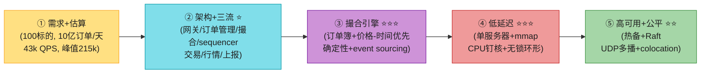
```mermaid
flowchart LR
    S1["① 需求+估算<br/>(100标的, 10亿订单/天<br/>43k QPS, 峰值215k)"] --> S2["② 架构+三流 ⭐<br/>(网关/订单管理/撮合/sequencer<br/>交易/行情/上报)"]
    S2 --> S3["③ 撮合引擎 ⭐⭐⭐<br/>(订单簿+价格-时间优先<br/>确定性+event sourcing)"]
    S3 --> S4["④ 低延迟 ⭐⭐⭐<br/>(单服务器+mmap<br/>CPU钉核+无锁环形)"]
    S4 --> S5["⑤ 高可用+公平 ⭐⭐<br/>(热备+Raft<br/>UDP多播+colocation)"]

    style S1 fill:#FFE082,stroke:#F9A825,color:#1f1f1f
    style S2 fill:#80DEEA,stroke:#0097A7,color:#1f1f1f
    style S3 fill:#CE93D8,stroke:#7B1FA2,color:#1f1f1f
    style S4 fill:#EF9A9A,stroke:#C62828,color:#1f1f1f
    style S5 fill:#A5D6A7,stroke:#388E3C,color:#1f1f1f
```

> 💡 **Step 1 关键**:**交易所是延迟敏感型**——99% 分位延迟要稳定(不能抖),目标 ms 级(2026 HFT 要 µs-ns 级)。100 标的 + 10 亿订单/天 = 43k QPS,峰值 215k。
>
> 💡 **关键信号词**:**"撮合引擎确定性(sequencer 单写定序,可重放重建状态)"** + **"关键路径全在内存,单服务器 mmap 消息总线,CPU 钉核无锁"** + **"订单簿=价位链表 O(1) 增删匹配 + Map<orderID> 快速定位"**——这三句直接拿下面试。
>
> 💡 **2026 加分信号词**:**"LMAX Disruptor 无锁环形队列"** + **"FPGA 硬件加速撮合"** + **"kernel bypass / DPDK"** + **"SBE 二进制编码替代 FIX tag-value"** + **"PTP IEEE 1588 纳秒时钟同步"**——说一句就知道懂低延迟栈。

---

## 🗺️ 章节概览

| 小节 | 要点 | 重要性 |
|------|------|--------|
| 需求 + 估算 | 100 标的、**10 亿订单/天**、43k QPS、99.99% 可用 | ⭐⭐⭐⭐ |
| **业务知识 101** | broker/机构/限价/市价/L1L2L3/FIX | ⭐⭐⭐⭐⭐ |
| **高层架构** | 三流:交易(关键)/行情/上报 | ⭐⭐⭐⭐⭐ |
| **撮合引擎** ⭐⭐⭐ | 维护订单簿+撮合+确定性 | ⭐⭐⭐⭐⭐ |
| **定序器 sequencer** ⭐⭐⭐ | 单写定序,确定性基础 | ⭐⭐⭐⭐⭐ |
| 订单管理 / 网关 | event sourcing;轻量网关 | ⭐⭐⭐⭐ |
| API + 数据模型 | REST 下单/查成交/L2/L3/蜡烛图 | ⭐⭐⭐ |
| **订单簿数据结构** ⭐⭐⭐ | 价位链表+Map,增删匹配 O(1) | ⭐⭐⭐⭐⭐ |
| **低延迟单服务器设计** ⭐⭐⭐ | mmap 消息总线+CPU 钉核+application loop | ⭐⭐⭐⭐⭐ |
| **event sourcing** ⭐⭐ | 不可变事件日志,可重放 | ⭐⭐⭐⭐⭐ |
| 高可用 + 容错 | 热备 + Raft 跨机房;RTO/RPO | ⭐⭐⭐⭐ |
| **撮合算法 + 确定性** | FIFO 价格-时间优先;功能/延迟确定性 | ⭐⭐⭐⭐⭐ |
| 行情发布 + 公平 | ring buffer;UDP 多播公平送达 | ⭐⭐⭐⭐ |
| **2026 增量(补)** | Disruptor/FPGA/DPDK/SBE/PTP/红黑树 | ⭐⭐⭐⭐⭐ |

---

## 1. 需求 + 估算

**澄清问题**(原书对话):

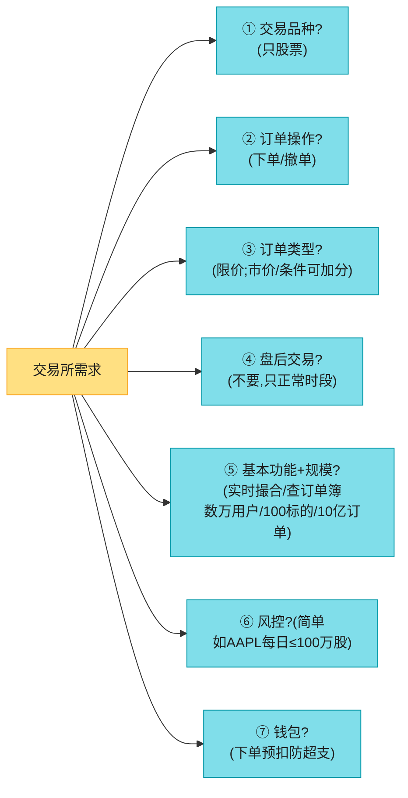
```mermaid
flowchart LR
    Q["交易所需求"] --> A["① 交易品种?<br/>(只股票)"]
    Q --> B["② 订单操作?<br/>(下单/撤单)"]
    Q --> C["③ 订单类型?<br/>(限价;市价/条件可加分)"]
    Q --> D["④ 盘后交易?<br/>(不要,只正常时段)"]
    Q --> E["⑤ 基本功能+规模?<br/>(实时撮合/查订单簿<br/>数万用户/100标的/10亿订单)"]
    Q --> F["⑥ 风控?(简单<br/>如AAPL每日≤100万股)"]
    Q --> G["⑦ 钱包?<br/>(下单预扣防超支)"]

    style Q fill:#FFE082,stroke:#F9A825,color:#1f1f1f
    style A fill:#80DEEA,stroke:#0097A7,color:#1f1f1f
    style B fill:#80DEEA,stroke:#0097A7,color:#1f1f1f
    style C fill:#80DEEA,stroke:#0097A7,color:#1f1f1f
    style D fill:#80DEEA,stroke:#0097A7,color:#1f1f1f
    style E fill:#80DEEA,stroke:#0097A7,color:#1f1f1f
    style F fill:#80DEEA,stroke:#0097A7,color:#1f1f1f
    style G fill:#80DEEA,stroke:#0097A7,color:#1f1f1f
```

**功能**:① 客户端下限价单/撤单;② 实时收到匹配成交;③ 实时查看订单簿;④ 历史数据/蜡烛图。
**规模**:至少数万用户同时交易、至少 100 标的、**每天数十亿订单**。
**监管**:交易所是受监管设施,**必须做风控**(如某用户一天最多交易 100 万股 AAPL)。
**钱包**:用户下单时**预扣资金**(订单在簿等待成交期间资金冻结),防超支(接 V2-Ch12)。

**非功能性**(背):

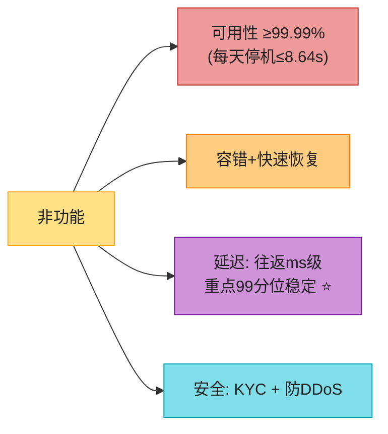
```mermaid
flowchart LR
    NF["非功能"] --> AVAIL["可用性 ≥99.99%<br/>(每天停机≤8.64s)"]
    NF --> FT["容错+快速恢复"]
    NF --> LAT["延迟: 往返ms级<br/>重点99分位稳定 ⭐"]
    NF --> SEC["安全: KYC + 防DDoS"]

    style NF fill:#FFE082,stroke:#F9A825,color:#1f1f1f
    style AVAIL fill:#EF9A9A,stroke:#C62828,color:#1f1f1f
    style FT fill:#FFCC80,stroke:#F57C00,color:#1f1f1f
    style LAT fill:#CE93D8,stroke:#7B1FA2,color:#1f1f1f
    style SEC fill:#80DEEA,stroke:#0097A7,color:#1f1f1f
```

- **可用性 ≥99.99%**:交易所声誉受损,**停机几秒都伤**(每天停机上限 8.64 秒)。
- **容错 + 快速恢复**:限制生产事故影响。
- **延迟**:**往返 ms 级**,特别关注 **99 分位**(市价单进入交易所到成交返回)。**99 分位持续高 → 少数用户极差体验**。
- **安全**:KYC 开户验证身份;公共行情页防 DDoS。

**估算**(背):

```
100 标的, 10 亿订单/天
NYSE 周一至五 9:30-16:00 ET = 6.5 小时
QPS = 10亿 / 6.5 / 3600 ≈ 43,000
峰值 QPS = 5× = 215,000  (开盘/收盘交易量显著更高)
→ 高吞吐 + 低延迟 + 强一致,三难全占
```

> 💡 **核心洞察**:**交易所三难全占——高吞吐(43k QPS)+ 低延迟(µs-ms)+ 强一致可重放**。这逼出了"单服务器全内存 + mmap + CPU 钉核 + 无锁环形 + event sourcing"这套反直觉但极致的设计。

---

## 2. 业务知识 101 ⭐⭐⭐⭐⭐

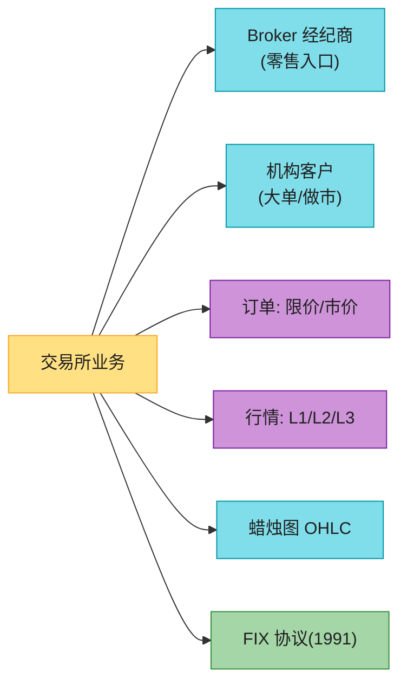
```mermaid
flowchart LR
    BIZ["交易所业务"] --> BR["Broker 经纪商<br/>(零售入口)"]
    BIZ --> INST["机构客户<br/>(大单/做市)"]
    BIZ --> ORD["订单: 限价/市价"]
    BIZ --> MD["行情: L1/L2/L3"]
    BIZ --> CAN["蜡烛图 OHLC"]
    BIZ --> FIX["FIX 协议(1991)"]

    style BIZ fill:#FFE082,stroke:#F9A825,color:#1f1f1f
    style BR fill:#80DEEA,stroke:#0097A7,color:#1f1f1f
    style INST fill:#80DEEA,stroke:#0097A7,color:#1f1f1f
    style ORD fill:#CE93D8,stroke:#7B1FA2,color:#1f1f1f
    style MD fill:#CE93D8,stroke:#7B1FA2,color:#1f1f1f
    style CAN fill:#80DEEA,stroke:#0097A7,color:#1f1f1f
    style FIX fill:#A5D6A7,stroke:#388E3C,color:#1f1f1f
```

| 概念 | 说明 |
|------|------|
| **Broker(经纪商)** | 零售客户端通过 broker 交易(Schwab/Robinhood/Etrade/Fidelity)。提供友好 UI 下单+看行情 |
| **机构客户** | 大单+专用软件。**养老金**(少而大,需订单拆分降市场冲击);**对冲基金做市**(靠佣金返点,需**极低延迟**,不能看网页/App) |
| **限价单** | 固定价格的买卖单,**可能不立即成交或只部分成交** |
| **市价单** | 不指定价格,**按当前市价立即成交**,牺牲成本保成交(快速行情下有用) |
| **L1 行情** | **最优买价/卖价 + 量**(best bid/ask) |
| **L2 行情** | 比 L1 更多价位 |
| **L3 行情** | L2 + **每个价位排队的量**(撮合引擎内部用) |
| **蜡烛图** | 某时段 OHLC(开/收/高/低)+ 量。常见 1m/5m/1h/1d/1w/1M |
| **FIX 协议** | 1991,**金融信息交换** vendor-neutral 协议,tag=value 文本格式 |

**FIX 报文示例**(背,知道是 tag=value):

```
8=FIX.4.2 | 9=176 | 35=8 | 49=PHLX | 56=PERS |
52=20071123-05:30:00.000 | 11=ATOMNOCCC9990900 |
20=3 | 150=E | 39=E | 55=MSFT | 167=CS | 54=1 |
38=15 | 40=2 | 44=15 | 58=PHLX EQUITY TESTING |
59=0 | 47=C | 32=0 | 31=0 | 151=15 | 14=0 | 6=0 |
10=128 |
```

> 📝 **FIX 是 tag=value 文本协议**——可读但**慢**(解析+带宽)。2026 现代交易所用 **SBE(Simple Binary Encoding)** 二进制替代(后面 2026 增量讲)。

---

## 3. 高层架构 ⭐⭐⭐⭐⭐

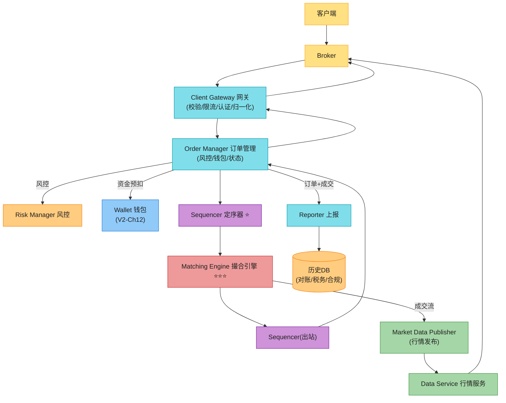
```mermaid
flowchart TB
    CL["客户端"] --> BR["Broker"]
    BR --> GW["Client Gateway 网关<br/>(校验/限流/认证/归一化)"]
    GW --> OM["Order Manager 订单管理<br/>(风控/钱包/状态)"]
    OM -->|"风控"| RM["Risk Manager 风控"]
    OM -->|"资金预扣"| WL["Wallet 钱包<br/>(V2-Ch12)"]
    OM --> SEQ["Sequencer 定序器 ⭐"]
    SEQ --> ME["Matching Engine 撮合引擎 ⭐⭐⭐"]
    ME --> SEQ2["Sequencer(出站)"]
    SEQ2 --> OM
    OM --> GW
    GW --> BR
    ME -->|"成交流"| MDP["Market Data Publisher<br/>(行情发布)"]
    MDP --> DS["Data Service 行情服务"]
    DS --> BR
    OM -->|"订单+成交"| REP["Reporter 上报"]
    REP --> DB[("历史DB<br/>(对账/税务/合规)")]

    style CL fill:#FFE082,stroke:#F9A825,color:#1f1f1f
    style BR fill:#FFE082,stroke:#F9A825,color:#1f1f1f
    style GW fill:#80DEEA,stroke:#0097A7,color:#1f1f1f
    style OM fill:#80DEEA,stroke:#0097A7,color:#1f1f1f
    style RM fill:#FFCC80,stroke:#F57C00,color:#1f1f1f
    style WL fill:#90CAF9,stroke:#1976D2,color:#1f1f1f
    style SEQ fill:#CE93D8,stroke:#7B1FA2,color:#1f1f1f
    style ME fill:#EF9A9A,stroke:#C62828,color:#1f1f1f
    style SEQ2 fill:#CE93D8,stroke:#7B1FA2,color:#1f1f1f
    style MDP fill:#A5D6A7,stroke:#388E3C,color:#1f1f1f
    style DS fill:#A5D6A7,stroke:#388E3C,color:#1f1f1f
    style REP fill:#80DEEA,stroke:#0097A7,color:#1f1f1f
    style DB fill:#FFCC80,stroke:#F57C00,color:#1f1f1f
```

### 3.1 三条流 ⭐⭐⭐(关键路径分离)

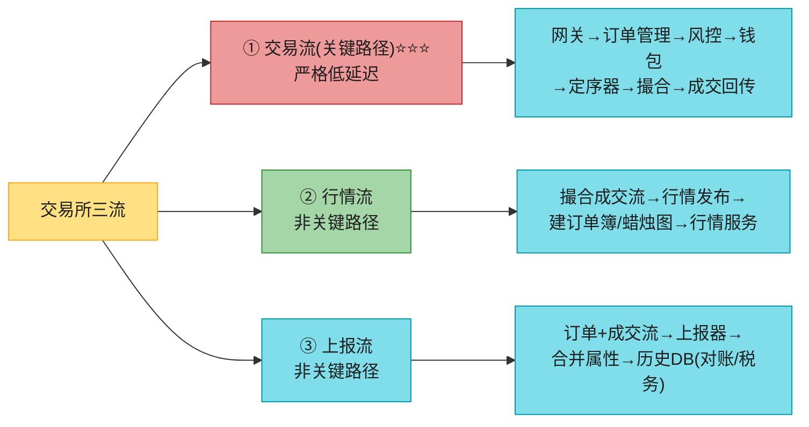
```mermaid
flowchart LR
    FLOW["交易所三流"] --> TF["① 交易流(关键路径)⭐⭐⭐<br/>严格低延迟"]
    FLOW --> MF["② 行情流<br/>非关键路径"]
    FLOW --> RF["③ 上报流<br/>非关键路径"]
    TF --> TF1["网关→订单管理→风控→钱包<br/>→定序器→撮合→成交回传"]
    MF --> MF1["撮合成交流→行情发布→<br/>建订单簿/蜡烛图→行情服务"]
    RF --> RF1["订单+成交流→上报器→<br/>合并属性→历史DB(对账/税务)"]

    style FLOW fill:#FFE082,stroke:#F9A825,color:#1f1f1f
    style TF fill:#EF9A9A,stroke:#C62828,color:#1f1f1f
    style MF fill:#A5D6A7,stroke:#388E3C,color:#1f1f1f
    style RF fill:#80DEEA,stroke:#0097A7,color:#1f1f1f
    style TF1 fill:#80DEEA,stroke:#0097A7,color:#1f1f1f
    style MF1 fill:#80DEEA,stroke:#0097A7,color:#1f1f1f
    style RF1 fill:#80DEEA,stroke:#0097A7,color:#1f1f1f
```

> 💡 **三流分离是核心架构决策**:**交易流是关键路径**(延迟敏感),行情流和上报流**不在关键路径**(延迟要求宽松)。**关键路径上连 logging 都去掉**只为低延迟。

### 3.2 交易流 14 步(背)

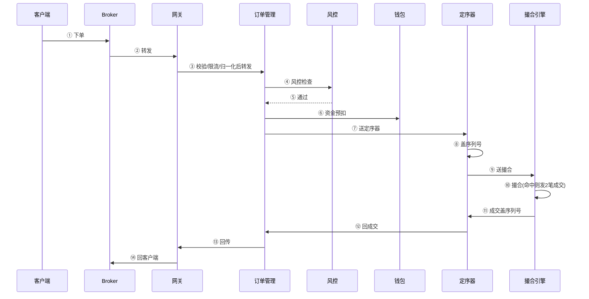
```mermaid
sequenceDiagram
    participant CL as 客户端
    participant BR as Broker
    participant GW as 网关
    participant OM as 订单管理
    participant RM as 风控
    participant WL as 钱包
    participant SEQ as 定序器
    participant ME as 撮合引擎
    CL->>BR: ① 下单
    BR->>GW: ② 转发
    GW->>OM: ③ 校验/限流/归一化后转发
    OM->>RM: ④ 风控检查
    RM-->>OM: ⑤ 通过
    OM->>WL: ⑥ 资金预扣
    OM->>SEQ: ⑦ 送定序器
    SEQ->>SEQ: ⑧ 盖序列号
    SEQ->>ME: ⑨ 送撮合
    ME->>ME: ⑩ 撮合(命中则发2笔成交)
    ME->>SEQ: ⑪ 成交盖序列号
    SEQ->>OM: ⑫ 回成交
    OM->>GW: ⑬ 回传
    GW->>BR: ⑭ 回客户端
```

> 📝 **交易流关键点**:成交=2 笔(买/卖各一笔)。**所有订单和成交都过 sequencer 盖序列号**——保证确定性重放。

### 3.3 行情流 + 上报流

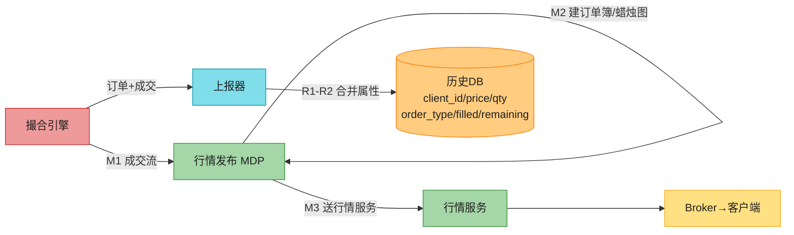
```mermaid
flowchart LR
    ME["撮合引擎"] -->|"M1 成交流"| MDP["行情发布 MDP"]
    MDP -->|"M2 建订单簿/蜡烛图"| MDP
    MDP -->|"M3 送行情服务"| DS["行情服务"]
    DS --> BR["Broker→客户端"]
    ME -->|"订单+成交"| REP["上报器"]
    REP -->|"R1-R2 合并属性"| DB[("历史DB<br/>client_id/price/qty<br/>order_type/filled/remaining")]

    style ME fill:#EF9A9A,stroke:#C62828,color:#1f1f1f
    style MDP fill:#A5D6A7,stroke:#388E3C,color:#1f1f1f
    style DS fill:#A5D6A7,stroke:#388E3C,color:#1f1f1f
    style BR fill:#FFE082,stroke:#F9A825,color:#1f1f1f
    style REP fill:#80DEEA,stroke:#0097A7,color:#1f1f1f
    style DB fill:#FFCC80,stroke:#F57C00,color:#1f1f1f
```

- **行情流(M1-M3)**:撮合引擎产生成交流 → MDP 构建订单簿+蜡烛图 → 行情服务 → broker → 客户端。**实时分析存专用存储(KDB 列存库)**。
- **上报流(R1-R2)**:reporter 合并订单属性(只有订单详情)+ 成交属性(只有 orderID/price/qty/状态)→ 历史DB(对账/税务/合规/清算)。**准确性和合规是关键,延迟不敏感**。

---

## 4. 核心组件深挖

### 4.1 撮合引擎(Matching Engine)⭐⭐⭐⭐⭐

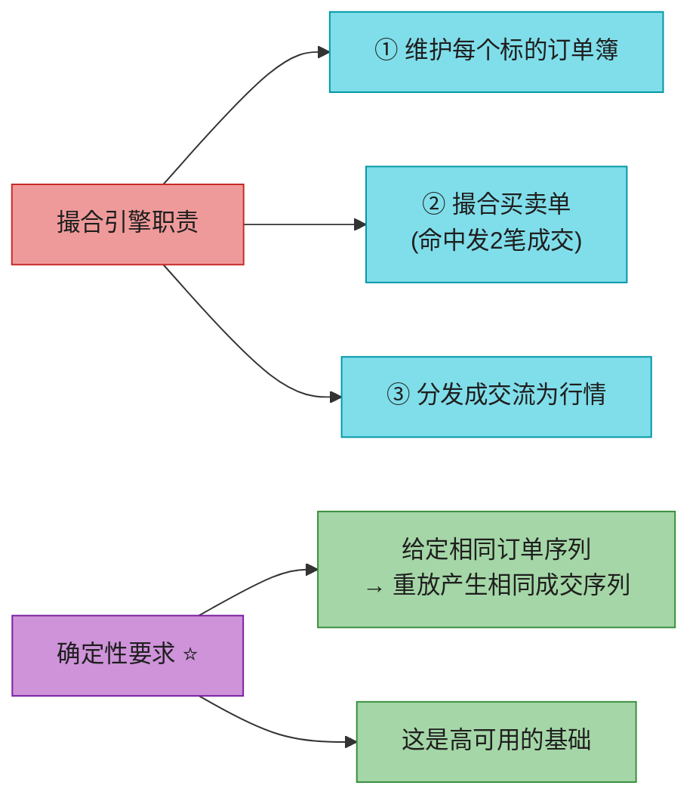
```mermaid
flowchart LR
    ME["撮合引擎职责"] --> M1["① 维护每个标的订单簿"]
    ME --> M2["② 撮合买卖单<br/>(命中发2笔成交)"]
    ME --> M3["③ 分发成交流为行情"]
    DET["确定性要求 ⭐"] --> D1["给定相同订单序列<br/>→ 重放产生相同成交序列"]
    DET --> D2["这是高可用的基础"]

    style ME fill:#EF9A9A,stroke:#C62828,color:#1f1f1f
    style M1 fill:#80DEEA,stroke:#0097A7,color:#1f1f1f
    style M2 fill:#80DEEA,stroke:#0097A7,color:#1f1f1f
    style M3 fill:#80DEEA,stroke:#0097A7,color:#1f1f1f
    style DET fill:#CE93D8,stroke:#7B1FA2,color:#1f1f1f
    style D1 fill:#A5D6A7,stroke:#388E3C,color:#1f1f1f
    style D2 fill:#A5D6A7,stroke:#388E3C,color:#1f1f1f
```

> 💡 **撮合引擎的灵魂是确定性**:给定已知订单序列作为输入,重放时必须产生**相同的成交序列**作为输出。**这是高可用的基础**(后面 hot-warm 重建靠它)。

### 4.2 定序器(Sequencer)⭐⭐⭐⭐⭐(确定性核心)

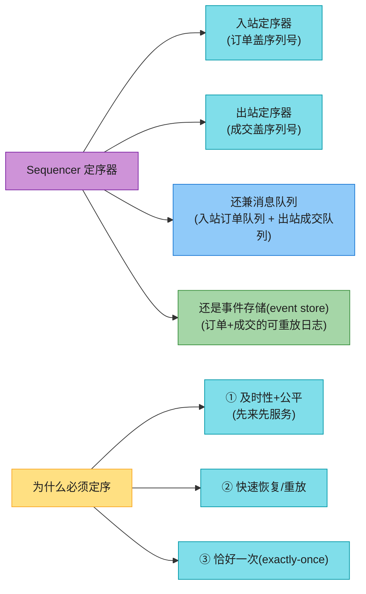
```mermaid
flowchart LR
    SEQ["Sequencer 定序器"] --> IN["入站定序器<br/>(订单盖序列号)"]
    SEQ --> OUT["出站定序器<br/>(成交盖序列号)"]
    SEQ --> MQ["还兼消息队列<br/>(入站订单队列 + 出站成交队列)"]
    SEQ --> ES["还是事件存储(event store)<br/>(订单+成交的可重放日志)"]
    WHY["为什么必须定序"] --> W1["① 及时性+公平<br/>(先来先服务)"]
    WHY --> W2["② 快速恢复/重放"]
    WHY --> W3["③ 恰好一次(exactly-once)"]

    style SEQ fill:#CE93D8,stroke:#7B1FA2,color:#1f1f1f
    style IN fill:#80DEEA,stroke:#0097A7,color:#1f1f1f
    style OUT fill:#80DEEA,stroke:#0097A7,color:#1f1f1f
    style MQ fill:#90CAF9,stroke:#1976D2,color:#1f1f1f
    style ES fill:#A5D6A7,stroke:#388E3C,color:#1f1f1f
    style WHY fill:#FFE082,stroke:#F9A825,color:#1f1f1f
    style W1 fill:#80DEEA,stroke:#0097A7,color:#1f1f1f
    style W2 fill:#80DEEA,stroke:#0097A7,color:#1f1f1f
    style W3 fill:#80DEEA,stroke:#0097A7,color:#1f1f1f
```

- **入站 + 出站各一个定序器**,各自维护序列号。
- **序列号必须是连续整数**,缺号易检测。
- 三个目的:**① 及时性公平(先来先服务)② 快速恢复重放 ③ 恰好一次**。
- **sequencer 还兼消息队列 + 事件存储**——类似两个 Kafka 流(一个进站订单,一个出站成交)。**Kafka 延迟如果更低更可预测,本来可以用 Kafka**——但低延迟交易所自己实现 sequencer(deep dive 讲)。

> 🪤 **追问陷阱(高频)**:"sequencer 为什么是单写?" → **多个 sequencer 会争抢 event store 写权,锁竞争浪费大量时间**。所以 sequencer 是**单写**(single writer),定序后再发 event store。**单写是确定性的基础**。

### 4.3 订单管理(Order Manager)⭐⭐⭐⭐

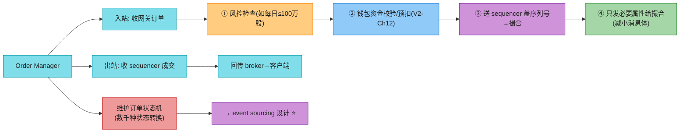
```mermaid
flowchart LR
    OM["Order Manager"] --> IN["入站: 收网关订单"]
    IN --> RC["① 风控检查(如每日≤100万股)"]
    RC --> WL["② 钱包资金校验/预扣(V2-Ch12)"]
    WL --> SEQ["③ 送 sequencer 盖序列号→撮合"]
    SEQ --> TRIM["④ 只发必要属性给撮合<br/>(减小消息体)"]
    OM --> OUT["出站: 收 sequencer 成交"]
    OUT --> RTN["回传 broker→客户端"]
    OM --> STATE["维护订单状态机<br/>(数千种状态转换)"]
    STATE --> ES["→ event sourcing 设计 ⭐"]

    style OM fill:#80DEEA,stroke:#0097A7,color:#1f1f1f
    style IN fill:#80DEEA,stroke:#0097A7,color:#1f1f1f
    style RC fill:#FFCC80,stroke:#F57C00,color:#1f1f1f
    style WL fill:#90CAF9,stroke:#1976D2,color:#1f1f1f
    style SEQ fill:#CE93D8,stroke:#7B1FA2,color:#1f1f1f
    style TRIM fill:#A5D6A7,stroke:#388E3C,color:#1f1f1f
    style OUT fill:#80DEEA,stroke:#0097A7,color:#1f1f1f
    style RTN fill:#80DEEA,stroke:#0097A7,color:#1f1f1f
    style STATE fill:#EF9A9A,stroke:#C62828,color:#1f1f1f
    style ES fill:#CE93D8,stroke:#7B1FA2,color:#1f1f1f
```

- 订单管理一端收订单、一端收成交,**维护订单状态**。
- **状态转换的复杂性是订单管理的主要难点**(真实交易所有数万种 case)→ **event sourcing 完美适配**(deep dive 讲)。

### 4.4 客户端网关(Client Gateway)⭐⭐⭐

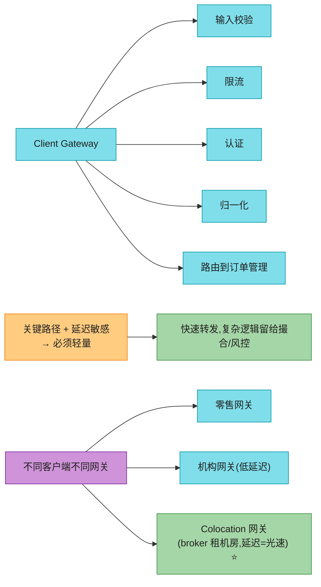
```mermaid
flowchart LR
    GW["Client Gateway"] --> F1["输入校验"]
    GW --> F2["限流"]
    GW --> F3["认证"]
    GW --> F4["归一化"]
    GW --> F5["路由到订单管理"]
    LAT["关键路径 + 延迟敏感<br/>→ 必须轻量"] --> FAST["快速转发,复杂逻辑留给撮合/风控"]
    TYPE["不同客户端不同网关"] --> RET["零售网关"]
    TYPE --> INST["机构网关(低延迟)"]
    TYPE --> COLO["Colocation 网关<br/>(broker 租机房,延迟=光速) ⭐"]

    style GW fill:#80DEEA,stroke:#0097A7,color:#1f1f1f
    style F1 fill:#80DEEA,stroke:#0097A7,color:#1f1f1f
    style F2 fill:#80DEEA,stroke:#0097A7,color:#1f1f1f
    style F3 fill:#80DEEA,stroke:#0097A7,color:#1f1f1f
    style F4 fill:#80DEEA,stroke:#0097A7,color:#1f1f1f
    style F5 fill:#80DEEA,stroke:#0097A7,color:#1f1f1f
    style LAT fill:#FFCC80,stroke:#F57C00,color:#1f1f1f
    style FAST fill:#A5D6A7,stroke:#388E3C,color:#1f1f1f
    style TYPE fill:#CE93D8,stroke:#7B1FA2,color:#1f1f1f
    style RET fill:#80DEEA,stroke:#0097A7,color:#1f1f1f
    style INST fill:#80DEEA,stroke:#0097A7,color:#1f1f1f
    style COLO fill:#A5D6A7,stroke:#388E3C,color:#1f1f1f
```

> 💡 **网关在关键路径延迟敏感,必须轻量**。复杂功能留给撮合引擎和风控。**零售 vs 机构网关不同**(机构如做市商提供流动性,需极低延迟)。
>
> 📝 **Colocation(colo)**:broker 租用交易所机房的服务器跑交易引擎,**下单延迟 = 光从 colo 服务器到交易所服务器的传输时间**(后面专门讲)。

---

## 5. API + 数据模型

### 5.1 API(RESTful,网关↔broker)

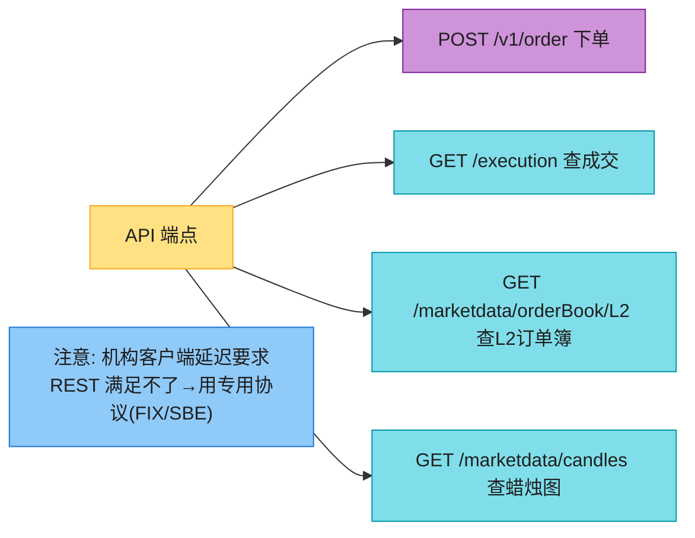
```mermaid
flowchart LR
    API["API 端点"] --> O1["POST /v1/order 下单"]
    API --> O2["GET /execution 查成交"]
    API --> O3["GET /marketdata/orderBook/L2 查L2订单簿"]
    API --> O4["GET /marketdata/candles 查蜡烛图"]
    NOTE["注意: 机构客户端延迟要求<br/>REST 满足不了→用专用协议(FIX/SBE)"]

    style API fill:#FFE082,stroke:#F9A825,color:#1f1f1f
    style O1 fill:#CE93D8,stroke:#7B1FA2,color:#1f1f1f
    style O2 fill:#80DEEA,stroke:#0097A7,color:#1f1f1f
    style O3 fill:#80DEEA,stroke:#0097A7,color:#1f1f1f
    style O4 fill:#80DEEA,stroke:#0097A7,color:#1f1f1f
    style NOTE fill:#90CAF9,stroke:#1976D2,color:#1f1f1f
```

```
POST /v1/order                    # 下单(需认证)
  入参: symbol, side(buy/sell), price, orderType(limit/market), quantity
  出参: id, creationTime, filledQuantity, remainingQuantity, status(new/canceled/filled)
GET /execution?symbol&orderId&startTime&endTime      # 查成交
  出参: executions[] {id, orderId, symbol, side, price, orderType, quantity}
GET /marketdata/orderBook/L2?symbol&depth            # 查L2订单簿
  出参: bids[] {price,size}, asks[] {price,size}
GET /marketdata/candles?symbol&resolution&startTime&endTime   # 查蜡烛图
  出参: candles[] {open, close, high, low}
```

> ⚠️ **REST 满足不了机构客户端延迟**(对冲基金用专用软件+FIX/SBE),但基本功能必须支持。

### 5.2 数据模型(三类)⭐⭐⭐

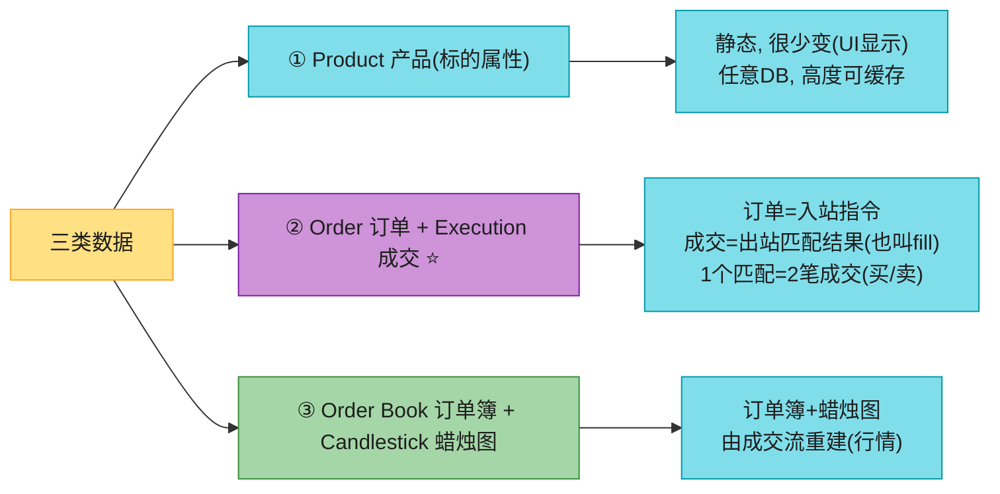
```mermaid
flowchart LR
    DM["三类数据"] --> P1["① Product 产品(标的属性)"]
    DM --> P2["② Order 订单 + Execution 成交 ⭐"]
    DM --> P3["③ Order Book 订单簿 + Candlestick 蜡烛图"]
    P1 --> P1A["静态, 很少变(UI显示)<br/>任意DB, 高度可缓存"]
    P2 --> P2A["订单=入站指令<br/>成交=出站匹配结果(也叫fill)<br/>1个匹配=2笔成交(买/卖)"]
    P3 --> P3A["订单簿+蜡烛图<br/>由成交流重建(行情)"]

    style DM fill:#FFE082,stroke:#F9A825,color:#1f1f1f
    style P1 fill:#80DEEA,stroke:#0097A7,color:#1f1f1f
    style P2 fill:#CE93D8,stroke:#7B1FA2,color:#1f1f1f
    style P3 fill:#A5D6A7,stroke:#388E3C,color:#1f1f1f
    style P1A fill:#80DEEA,stroke:#0097A7,color:#1f1f1f
    style P2A fill:#80DEEA,stroke:#0097A7,color:#1f1f1f
    style P3A fill:#80DEEA,stroke:#0097A7,color:#1f1f1f
```

**关键路径不存 DB**(背):
- **关键交易路径上,订单和成交不存数据库**——为高性能**全内存执行**,用磁盘/共享内存持久化和共享。
- 订单/成交存在 **sequencer(event store)供快速恢复**,盘后归档。
- **reporter 写 DB 供上报**(对账/税务)。
- 成交流转发**行情处理器重建订单簿和蜡烛图**。

---

## 6. 订单簿数据结构 ⭐⭐⭐⭐⭐(本章核心之一)

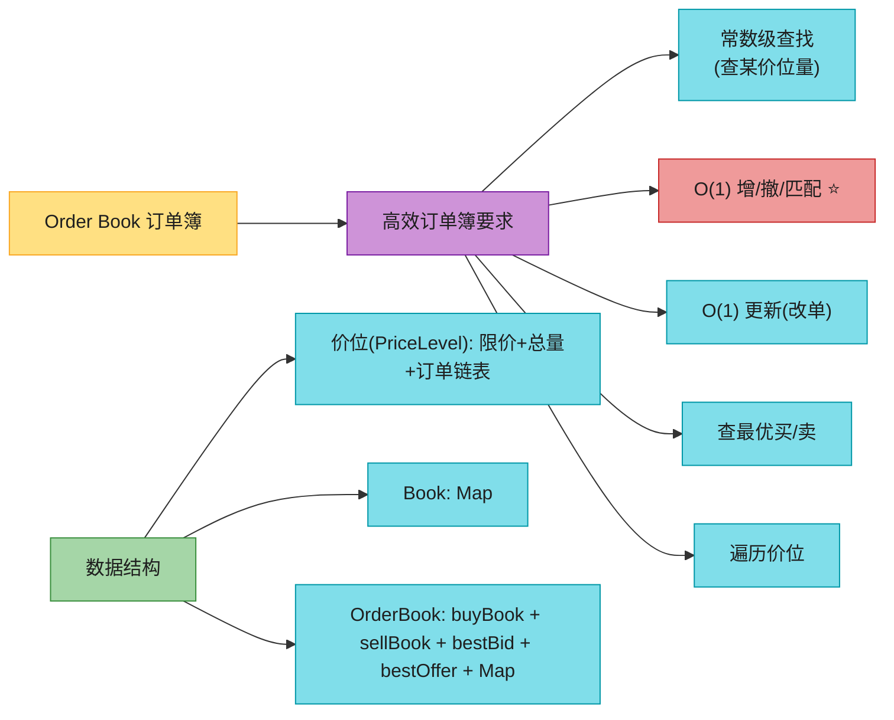
```mermaid
flowchart LR
    OB["Order Book 订单簿"] --> REQ["高效订单簿要求"]
    REQ --> R1["常数级查找<br/>(查某价位量)"]
    REQ --> R2["O(1) 增/撤/匹配 ⭐"]
    REQ --> R3["O(1) 更新(改单)"]
    REQ --> R4["查最优买/卖"]
    REQ --> R5["遍历价位"]
    STRUCT["数据结构"] --> S1["价位(PriceLevel): 限价+总量+订单链表"]
    STRUCT --> S2["Book<Side>: Map<Price, PriceLevel>"]
    STRUCT --> S3["OrderBook: buyBook + sellBook + bestBid + bestOffer + Map<OrderID,Order>"]

    style OB fill:#FFE082,stroke:#F9A825,color:#1f1f1f
    style REQ fill:#CE93D8,stroke:#7B1FA2,color:#1f1f1f
    style R1 fill:#80DEEA,stroke:#0097A7,color:#1f1f1f
    style R2 fill:#EF9A9A,stroke:#C62828,color:#1f1f1f
    style R3 fill:#80DEEA,stroke:#0097A7,color:#1f1f1f
    style R4 fill:#80DEEA,stroke:#0097A7,color:#1f1f1f
    style R5 fill:#80DEEA,stroke:#0097A7,color:#1f1f1f
    style STRUCT fill:#A5D6A7,stroke:#388E3C,color:#1f1f1f
    style S1 fill:#80DEEA,stroke:#0097A7,color:#1f1f1f
    style S2 fill:#80DEEA,stroke:#0097A7,color:#1f1f1f
    style S3 fill:#80DEEA,stroke:#0097A7,color:#1f1f1f
```

**原书实现**(Java 伪代码):

```java
class PriceLevel {
    private Price limitPrice;
    private long totalVolume;
    private List<Order> orders;        // ⚠️ 普通list→改双向链表才O(1)
}
class Book<Side> {
    private Side side;
    private Map<Price, PriceLevel> limitMap;
}
class OrderBook {
    private Book<Buy> buyBook;
    private Book<Sell> sellBook;
    private PriceLevel bestBid;
    private PriceLevel bestOffer;
    private Map<OrderID, Order> orderMap;   // 快速定位撤单
}
```

> ⚠️ **原书的坑**:`List<Order> orders` 用普通 list,**撤单(删中间)不是 O(1)**。改成**双向链表**后,增/匹配/撤**全 O(1)**。

### 6.1 O(1) 三操作(背)⭐⭐⭐

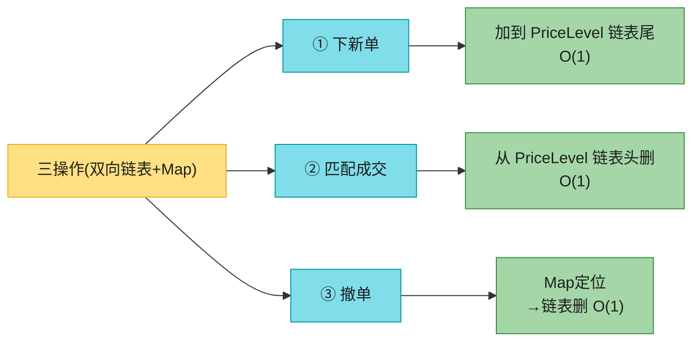
```mermaid
flowchart LR
    OP["三操作(双向链表+Map)"] --> P1["① 下新单"]
    P1 --> P1A["加到 PriceLevel 链表尾<br/>O(1)"]
    OP --> P2["② 匹配成交"]
    P2 --> P2A["从 PriceLevel 链表头删<br/>O(1)"]
    OP --> P3["③ 撤单"]
    P3 --> P3A["Map<OrderID,Order>定位<br/>→链表删 O(1)"]

    style OP fill:#FFE082,stroke:#F9A825,color:#1f1f1f
    style P1 fill:#80DEEA,stroke:#0097A7,color:#1f1f1f
    style P1A fill:#A5D6A7,stroke:#388E3C,color:#1f1f1f
    style P2 fill:#80DEEA,stroke:#0097A7,color:#1f1f1f
    style P2A fill:#A5D6A7,stroke:#388E3C,color:#1f1f1f
    style P3 fill:#80DEEA,stroke:#0097A7,color:#1f1f1f
    style P3A fill:#A5D6A7,stroke:#388E3C,color:#1f1f1f
```

> 💡 **下/匹配/撤全 O(1)** 的关键:**价位链表(双向)+ Map<OrderID,Order> 快速定位**。下单=链表尾插;匹配=链表头删;撤单=Map 定位后链表删。**这是撮合引擎性能的地基**。

### 6.2 订单执行示例

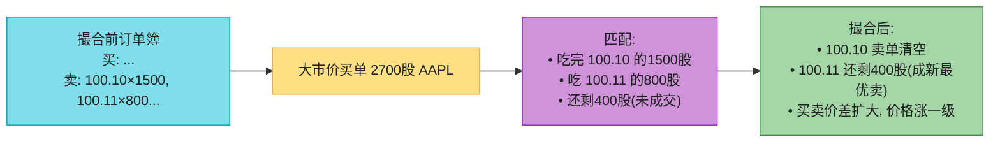
```mermaid
flowchart LR
    BEFORE["撮合前订单簿<br/>买: ...<br/>卖: 100.10×1500, 100.11×800..."] --> MKT["大市价买单 2700股 AAPL"]
    MKT --> MATCH["匹配:<br/>• 吃完 100.10 的1500股<br/>• 吃 100.11 的800股<br/>• 还剩400股(未成交)"]
    MATCH --> AFTER["撮合后:<br/>• 100.10 卖单清空<br/>• 100.11 还剩400股(成新最优卖)<br/>• 买卖价差扩大, 价格涨一级"]

    style BEFORE fill:#80DEEA,stroke:#0097A7,color:#1f1f1f
    style MKT fill:#FFE082,stroke:#F9A825,color:#1f1f1f
    style MATCH fill:#CE93D8,stroke:#7B1FA2,color:#1f1f1f
    style AFTER fill:#A5D6A7,stroke:#388E3C,color:#1f1f1f
```

> 📝 **大市价买单 2700 股**:吃完最优卖队列(100.10)→ 吃 100.11 队列第一单 → 买卖价差扩大,**价格上涨一级**(新最优卖=100.11)。**这就是市价单的市场冲击(market impact)**。

### 6.3 蜡烛图(Candlestick)

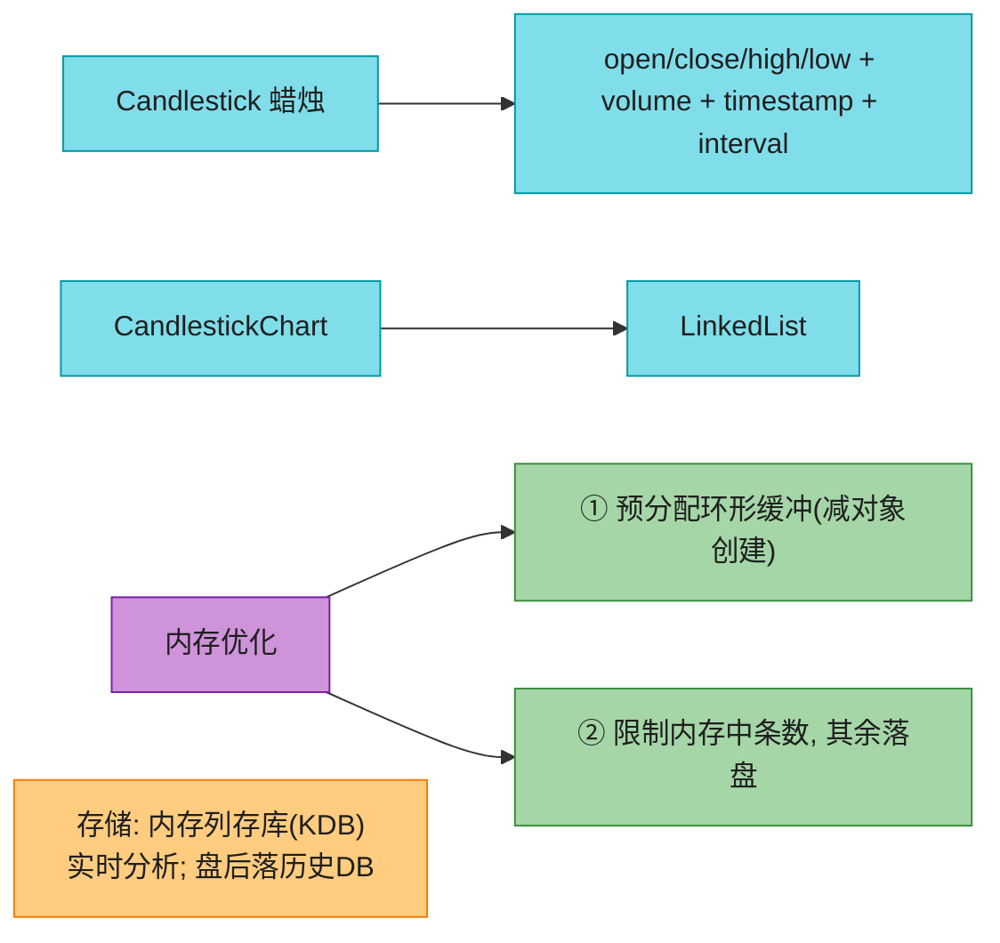
```mermaid
flowchart LR
    CAN["Candlestick 蜡烛"] --> C1["open/close/high/low + volume + timestamp + interval"]
    CHART["CandlestickChart"] --> LL["LinkedList<Candlestick>"]
    OPT["内存优化"] --> O1["① 预分配环形缓冲(减对象创建)"]
    OPT --> O2["② 限制内存中条数, 其余落盘"]
    STORE["存储: 内存列存库(KDB)<br/>实时分析; 盘后落历史DB"]

    style CAN fill:#80DEEA,stroke:#0097A7,color:#1f1f1f
    style C1 fill:#80DEEA,stroke:#0097A7,color:#1f1f1f
    style CHART fill:#80DEEA,stroke:#0097A7,color:#1f1f1f
    style LL fill:#80DEEA,stroke:#0097A7,color:#1f1f1f
    style OPT fill:#CE93D8,stroke:#7B1FA2,color:#1f1f1f
    style O1 fill:#A5D6A7,stroke:#388E3C,color:#1f1f1f
    style O2 fill:#A5D6A7,stroke:#388E3C,color:#1f1f1f
    style STORE fill:#FFCC80,stroke:#F57C00,color:#1f1f1f
```

> 📝 **行情数据通常存内存列存库(如 KDB)**做实时分析;盘后落历史 DB。

---

## 7. 低延迟单服务器设计 ⭐⭐⭐⭐⭐(本章核心之二)

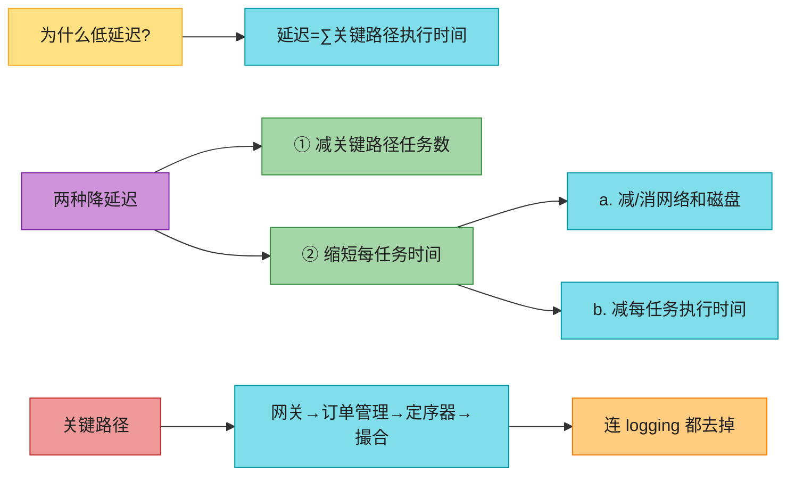
```mermaid
flowchart LR
    PROB["为什么低延迟?"] --> P1["延迟=∑关键路径执行时间"]
    RED["两种降延迟"] --> R1["① 减关键路径任务数"]
    RED --> R2["② 缩短每任务时间"]
    R2 --> R2A["a. 减/消网络和磁盘"]
    R2 --> R2B["b. 减每任务执行时间"]
    CRIT["关键路径"] --> C1["网关→订单管理→定序器→撮合"]
    C1 --> C2["连 logging 都去掉"]

    style PROB fill:#FFE082,stroke:#F9A825,color:#1f1f1f
    style P1 fill:#80DEEA,stroke:#0097A7,color:#1f1f1f
    style RED fill:#CE93D8,stroke:#7B1FA2,color:#1f1f1f
    style R1 fill:#A5D6A7,stroke:#388E3C,color:#1f1f1f
    style R2 fill:#A5D6A7,stroke:#388E3C,color:#1f1f1f
    style R2A fill:#80DEEA,stroke:#0097A7,color:#1f1f1f
    style R2B fill:#80DEEA,stroke:#0097A7,color:#1f1f1f
    style CRIT fill:#EF9A9A,stroke:#C62828,color:#1f1f1f
    style C1 fill:#80DEEA,stroke:#0097A7,color:#1f1f1f
    style C2 fill:#FFCC80,stroke:#F57C00,color:#1f1f1f
```

### 7.1 网络和磁盘是延迟大敌

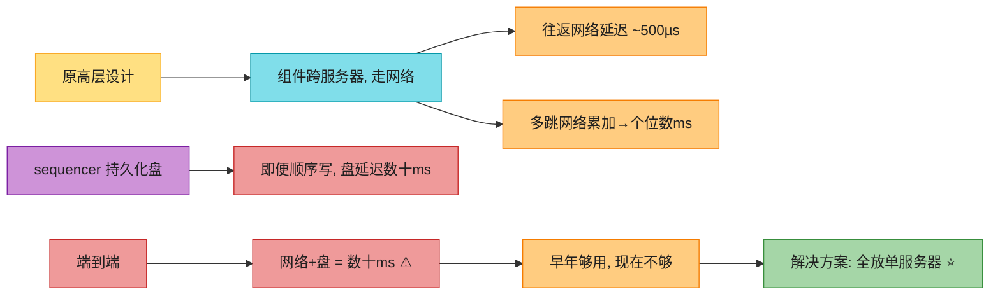
```mermaid
flowchart LR
    ORIG["原高层设计"] --> NET["组件跨服务器, 走网络"]
    NET --> LAT1["往返网络延迟 ~500µs"]
    NET --> ADD["多跳网络累加→个位数ms"]
    SEQ["sequencer 持久化盘"] --> DISK["即便顺序写, 盘延迟数十ms"]
    TOTAL["端到端"] --> T1["网络+盘 = 数十ms ⚠️"]
    T1 --> NOT["早年够用, 现在不够"]
    NOT --> SOL["解决方案: 全放单服务器 ⭐"]

    style ORIG fill:#FFE082,stroke:#F9A825,color:#1f1f1f
    style NET fill:#80DEEA,stroke:#0097A7,color:#1f1f1f
    style LAT1 fill:#FFCC80,stroke:#F57C00,color:#1f1f1f
    style ADD fill:#FFCC80,stroke:#F57C00,color:#1f1f1f
    style SEQ fill:#CE93D8,stroke:#7B1FA2,color:#1f1f1f
    style DISK fill:#EF9A9A,stroke:#C62828,color:#1f1f1f
    style TOTAL fill:#EF9A9A,stroke:#C62828,color:#1f1f1f
    style T1 fill:#EF9A9A,stroke:#C62828,color:#1f1f1f
    style NOT fill:#FFCC80,stroke:#F57C00,color:#1f1f1f
    style SOL fill:#A5D6A7,stroke:#388E3C,color:#1f1f1f
```

> 💡 **网络往返 ~500µs,多跳累加 ms 级;磁盘顺序写仍数十 ms**。**总端到端数十 ms**——早年够用,交易量爆炸后不够。**解决方案:全组件放单服务器,mmap 内存通信,消除网络和磁盘**。

### 7.2 单服务器 + mmap 消息总线 ⭐⭐⭐

```mermaid
flowchart TB
    subgraph SINGLE["单服务器(所有组件同机)"]
        GW["网关 application loop<br/>(CPU核)"]
        OM["订单管理 loop<br/>(CPU核)"]
        SEQ["定序器 loop<br/>(CPU核)"]
        ME["撮合 loop<br/>(CPU核)"]
        MMAP["mmap 消息总线 ⭐<br/>(/dev/shm 内存文件系统)"]
        GW --> MMAP
        OM --> MMAP
        SEQ --> MMAP
        ME --> MMAP
    end
    MMAP --> PERF["无网络无盘<br/>发消息 < 1µs ⭐⭐⭐"]

    style SINGLE fill:#A5D6A7,stroke:#388E3C,color:#1f1f1f
    style GW fill:#80DEEA,stroke:#0097A7,color:#1f1f1f
    style OM fill:#80DEEA,stroke:#0097A7,color:#1f1f1f
    style SEQ fill:#CE93D8,stroke:#7B1FA2,color:#1f1f1f
    style ME fill:#EF9A9A,stroke:#C62828,color:#1f1f1f
    style MMAP fill:#90CAF9,stroke:#1976D2,color:#1f1f1f
    style PERF fill:#A5D6A7,stroke:#388E3C,color:#1f1f1f
```

- **所有组件放单服务器**,通过 **mmap(2)** 消息总线通信。
- **mmap 把文件映射进进程内存**;若 backing 文件在 **/dev/shm(内存文件系统)** → 访问**完全不触发磁盘**。
- **mmap 消息总线发消息 < 1µs(亚微秒)**——零网络零磁盘。
- 配合 event sourcing → 在单服务器内构建**低延迟微服务**。

### 7.3 application loop + CPU 钉核 ⭐⭐⭐

```mermaid
flowchart LR
    LOOP["application loop"] --> WHILE["while 循环轮询任务"]
    LOOP --> SINGLE_T["单线程 ⭐"]
    LOOP --> PIN["钉到固定 CPU 核 ⭐"]
    BEN["CPU 钉核好处"] --> B1["① 无上下文切换<br/>(CPU 全分给该 loop)"]
    BEN --> B2["② 无锁无竞争<br/>(单线程更新状态)"]
    BEN --> B3["→ 低 99 分位延迟"]
    TRADE["代价"] --> T1["编码复杂<br/>需精算每任务时间避免阻塞 loop"]

    style LOOP fill:#CE93D8,stroke:#7B1FA2,color:#1f1f1f
    style WHILE fill:#80DEEA,stroke:#0097A7,color:#1f1f1f
    style SINGLE_T fill:#80DEEA,stroke:#0097A7,color:#1f1f1f
    style PIN fill:#80DEEA,stroke:#0097A7,color:#1f1f1f
    style BEN fill:#A5D6A7,stroke:#388E3C,color:#1f1f1f
    style B1 fill:#A5D6A7,stroke:#388E3C,color:#1f1f1f
    style B2 fill:#A5D6A7,stroke:#388E3C,color:#1f1f1f
    style B3 fill:#A5D6A7,stroke:#388E3C,color:#1f1f1f
    style TRADE fill:#FFCC80,stroke:#F57C00,color:#1f1f1f
    style T1 fill:#FFCC80,stroke:#F57C00,color:#1f1f1f
```

> 💡 **application loop = while 轮询 + 单线程 + 钉 CPU 核**。**无上下文切换 + 无锁竞争 → 低且稳定的 99 分位延迟**。代价是编码复杂(每任务时间精算,不能阻塞 loop)。

### 7.4 单服务器架构的精髓总结

```mermaid
flowchart LR
    KEY["单服务器低延迟四件套"] --> K1["① 全组件同机<br/>(消网络)"]
    KEY --> K2["② mmap + /dev/shm<br/>(消磁盘, <1µs 通信)"]
    KEY --> K3["③ application loop 单线程<br/>(消锁竞争)"]
    KEY --> K4["④ CPU 钉核<br/>(消上下文切换)"]
    RESULT["结果: 端到端数十µs<br/>(从数十ms降3个数量级)"]

    style KEY fill:#FFE082,stroke:#F9A825,color:#1f1f1f
    style K1 fill:#80DEEA,stroke:#0097A7,color:#1f1f1f
    style K2 fill:#90CAF9,stroke:#1976D2,color:#1f1f1f
    style K3 fill:#CE93D8,stroke:#7B1FA2,color:#1f1f1f
    style K4 fill:#CE93D8,stroke:#7B1FA2,color:#1f1f1f
    style RESULT fill:#A5D6A7,stroke:#388E3C,color:#1f1f1f
```

> 📝 **真实大交易所的极致形态**:有些大交易所**几乎把所有东西跑在一台巨型服务器甚至单进程上**——听起来极端,但正是低延迟的最优解。

---

## 8. Event Sourcing(事件溯源)⭐⭐⭐⭐⭐

```mermaid
flowchart LR
    TRAD["传统: 存当前状态"] --> TRAD1["DB 只存当前态<br/>出错难追溯(无事件记录)"]
    ES["Event Sourcing"] --> ES1["不存当前态<br/>存不可变事件日志 ⭐"]
    ES --> ES2["事件是唯一真相源"]
    ES --> ES3["重放所有事件→恢复状态"]
    FIT["为何适配交易所"] --> F1["订单状态转换极复杂<br/>(数万 case)"]
    FIT --> F2["确定性重放=高可用基础"]
    FIT --> F3["event store 兼消息总线<br/>(类似 Kafka pub-sub)"]

    style TRAD fill:#EF9A9A,stroke:#C62828,color:#1f1f1f
    style TRAD1 fill:#EF9A9A,stroke:#C62828,color:#1f1f1f
    style ES fill:#A5D6A7,stroke:#388E3C,color:#1f1f1f
    style ES1 fill:#A5D6A7,stroke:#388E3C,color:#1f1f1f
    style ES2 fill:#A5D6A7,stroke:#388E3C,color:#1f1f1f
    style ES3 fill:#A5D6A7,stroke:#388E3C,color:#1f1f1f
    style FIT fill:#CE93D8,stroke:#7B1FA2,color:#1f1f1f
    style F1 fill:#80DEEA,stroke:#0097A7,color:#1f1f1f
    style F2 fill:#80DEEA,stroke:#0097A7,color:#1f1f1f
    style F3 fill:#80DEEA,stroke:#0097A7,color:#1f1f1f
```

> 💡 **接 V2-Ch12 数字钱包**(同章已讲 event sourcing)。交易所同样适用:**订单状态极复杂 + 确定性重放 = 完美适配**。

### 8.1 event sourcing 设计(mmap event store)

```mermaid
flowchart LR
    EXT["外部域"] -->|"FIX"| GW["网关"]
    GW -->|"转 FIX over SBE"| ESC["Event Store Client"]
    ESC -->|"NewOrderEvent"| STORE[("Event Store<br/>(mmap)")]
    STORE --> OM["订单管理(嵌入撮合)"]
    OM --> VALID["校验+加入内部订单态"]
    OM --> MC["撮合核心"]
    MC -->|"匹配"| OFE["OrderFilledEvent"]
    OFE --> STORE
    STORE --> MDP["行情处理器(订阅)"]
    STORE --> REP["上报器(订阅)"]

    style EXT fill:#FFE082,stroke:#F9A825,color:#1f1f1f
    style GW fill:#80DEEA,stroke:#0097A7,color:#1f1f1f
    style ESC fill:#80DEEA,stroke:#0097A7,color:#1f1f1f
    style STORE fill:#90CAF9,stroke:#1976D2,color:#1f1f1f
    style OM fill:#CE93D8,stroke:#7B1FA2,color:#1f1f1f
    style VALID fill:#80DEEA,stroke:#0097A7,color:#1f1f1f
    style MC fill:#EF9A9A,stroke:#C62828,color:#1f1f1f
    style OFE fill:#A5D6A7,stroke:#388E3C,color:#1f1f1f
    style MDP fill:#A5D6A7,stroke:#388E3C,color:#1f1f1f
    style REP fill:#80DEEA,stroke:#0097A7,color:#1f1f1f
```

**event sourcing 设计要点**:
1. **网关把 FIX 转 "FIX over SBE"**(Simple Binary Encoding,快速紧凑编码)→ 每个订单以预定义格式作为 **NewOrderEvent** 经 Event Store Client 发送。
2. **订单管理(嵌入撮合引擎)** 从 event store 收 NewOrderEvent → 校验 → 加内部订单态 → 送撮合核心。
3. 匹配成功 → 生成 **OrderFilledEvent** → 发 event store。
4. **行情处理器 / 上报器 订阅 event store** 各自处理(类似 Kafka pub-sub,**没严格延迟要求本来可以用 Kafka**)。

### 8.2 两处关键调整 ⭐⭐

```mermaid
flowchart LR
    ADJ["vs 高层设计的调整"] --> A1["① 订单管理变可复用库<br/>(嵌入各组件)"]
    ADJ --> A2["② sequencer 消失(融入 event store)"]
    A1 --> A1W["为何: 集中订单管理会伤延迟<br/>(尤其非关键路径组件查状态)"]
    A1 --> A1G["各组件自维护状态<br/>+ event sourcing 保证一致可重放"]
    A2 --> A2W["为何: 单 event store 一个 sequence 字段<br/>→ 多 sequencer 抢写权=锁竞争"]
    A2 --> A2G["单写 sequencer 盖号再发 event store<br/>超快"]

    style ADJ fill:#FFE082,stroke:#F9A825,color:#1f1f1f
    style A1 fill:#CE93D8,stroke:#7B1FA2,color:#1f1f1f
    style A2 fill:#CE93D8,stroke:#7B1FA2,color:#1f1f1f
    style A1W fill:#80DEEA,stroke:#0097A7,color:#1f1f1f
    style A1G fill:#A5D6A7,stroke:#388E3C,color:#1f1f1f
    style A2W fill:#80DEEA,stroke:#0097A7,color:#1f1f1f
    style A2G fill:#A5D6A7,stroke:#388E3C,color:#1f1f1f
```

> 📝 **调整1**:订单管理变**可复用库嵌入各组件**——集中订单管理伤延迟(非关键路径组件查状态要跨进程),各组件自维护状态 + event sourcing 保证一致。
>
> 📝 **调整2**:**sequencer 融入 event store**——单 event store 一个 sequence 字段。**单写 sequencer**(从各组件本地 ring buffer 拉事件,盖号发 event store),**可配备用 sequencer 高可用**。

---

## 9. 高可用 + 容错 ⭐⭐⭐⭐

### 9.1 高可用目标

```mermaid
flowchart LR
    HA["高可用 99.99%"] --> H1["每天停机 ≤ 8.64s"]
    HA --> H2["几乎立即恢复"]
    HOW["怎么做"] --> SP["① 识别单点<br/>(撮合引擎挂=灾难)→ 加冗余"]
    HOW --> DET["② 故障检测+failover 决策要快"]
    STATE["有状态组件"] --> ST1["订单管理/撮合→跨副本复制状态"]

    style HA fill:#EF9A9A,stroke:#C62828,color:#1f1f1f
    style H1 fill:#FFCC80,stroke:#F57C00,color:#1f1f1f
    style H2 fill:#FFCC80,stroke:#F57C00,color:#1f1f1f
    style HOW fill:#CE93D8,stroke:#7B1FA2,color:#1f1f1f
    style SP fill:#80DEEA,stroke:#0097A7,color:#1f1f1f
    style DET fill:#80DEEA,stroke:#0097A7,color:#1f1f1f
    style STATE fill:#A5D6A7,stroke:#388E3C,color:#1f1f1f
    style ST1 fill:#80DEEA,stroke:#0097A7,color:#1f1f1f
```

### 9.2 Hot-Warm 热备 ⭐⭐⭐

```mermaid
flowchart LR
    HOT["Hot 撮合(主)"] -->|"收同样事件+处理"| WARM["Warm 撮合(备)"]
    HOT -->|"发事件到 event store"| ES[("Event Store")]
    WARM -->|"不发(静默处理)"| ES
    HOT -->|"心跳"| MON["监控"]
    FAIL["主挂"] --> TAKE["Warm 立即接管→开始发事件"]
    WDOWN["备挂"] --> RESTART["重启从 event store 重放恢复全部状态"]

    style HOT fill:#EF9A9A,stroke:#C62828,color:#1f1f1f
    style WARM fill:#FFCC80,stroke:#F57C00,color:#1f1f1f
    style ES fill:#90CAF9,stroke:#1976D2,color:#1f1f1f
    style MON fill:#80DEEA,stroke:#0097A7,color:#1f1f1f
    style FAIL fill:#EF9A9A,stroke:#C62828,color:#1f1f1f
    style TAKE fill:#A5D6A7,stroke:#388E3C,color:#1f1f1f
    style WDOWN fill:#FFCC80,stroke:#F57C00,color:#1f1f1f
    style RESTART fill:#A5D6A7,stroke:#388E3C,color:#1f1f1f
```

- **热备主**:正常撮合 + 发 event store。
- **warm 备**:收**完全相同事件**并处理,但**不发事件到 event store**。
- **主挂**:warm 立即接管,开始发事件。
- **warm 挂**:重启时从 event store **重放所有事件恢复状态**(event sourcing 的威力)。
- **检测**:撮合引擎发心跳,超时未收到视为异常。

> ⚠️ **局限**:hot-warm **只在单服务器内**。跨机/跨机房需复制整个 event store → 用 **reliable UDP** 高效广播(参考 **Aeron** 消息总线)。

### 9.3 容错:Raft 跨机房 ⭐⭐⭐

```mermaid
flowchart TB
    subgraph CLUSTER["Raft 5节点集群(各自event store)"]
        LDR["Leader(当前主)<br/>发新事件给follower"]
        F1["Follower 1"]
        F2["Follower 2"]
        F3["Follower 3"]
        F4["Follower 4"]
        LDR -->|"AppendEntries RPC"| F1
        LDR --> F2
        LDR --> F3
        LDR --> F4
    end
    QUORUM["法定人数 N/2+1 = 3<br/>(5节点)"]
    NOTE["leader挂→触发选举超时<br/>→RequestVote→多数票成新leader"]

    style CLUSTER fill:#A5D6A7,stroke:#388E3C,color:#1f1f1f
    style LDR fill:#EF9A9A,stroke:#C62828,color:#1f1f1f
    style F1 fill:#80DEEA,stroke:#0097A7,color:#1f1f1f
    style F2 fill:#80DEEA,stroke:#0097A7,color:#1f1f1f
    style F3 fill:#80DEEA,stroke:#0097A7,color:#1f1f1f
    style F4 fill:#80DEEA,stroke:#0097A7,color:#1f1f1f
    style QUORUM fill:#CE93D8,stroke:#7B1FA2,color:#1f1f1f
    style NOTE fill:#90CAF9,stroke:#1976D2,color:#1f1f1f
```

- **Raft 集群**:每节点自带 event store。leader 发事件给所有 follower(经 RPC),follower 写自己 mmap event store。
- **法定人数 = N/2 + 1**(5 节点→3)。
- **leader 选举**:leader 发心跳 AppendEntries;follower 超时未收 → 触发选举 → RequestVote → 多数票成新 leader。**term 值低者不能当 leader**;**split vote**(多 follower 同时成 candidate)→ 选举超时重来。

### 9.4 RTO / RPO

```mermaid
flowchart LR
    Q["容错四问"] --> Q1["主挂怎么决定failover?"]
    Q --> Q2["备中怎么选leader?"]
    Q --> Q3["RTO恢复时间?(交易所秒级)"]
    Q --> Q4["RPO丢数据容忍?(交易所≈0)"]
    A["答案"] --> A1["初期手动failover<br/>+chaos engineering积累信号→自动化"]
    A --> A2["Raft 等成熟 leader 选举算法"]
    A --> A3["RTO秒级→需自动failover+降级策略"]
    A --> A4["RPO≈0→Raft多副本共识保证"]

    style Q fill:#FFE082,stroke:#F9A825,color:#1f1f1f
    style Q1 fill:#80DEEA,stroke:#0097A7,color:#1f1f1f
    style Q2 fill:#80DEEA,stroke:#0097A7,color:#1f1f1f
    style Q3 fill:#80DEEA,stroke:#0097A7,color:#1f1f1f
    style Q4 fill:#80DEEA,stroke:#0097A7,color:#1f1f1f
    style A fill:#A5D6A7,stroke:#388E3C,color:#1f1f1f
    style A1 fill:#80DEEA,stroke:#0097A7,color:#1f1f1f
    style A2 fill:#80DEEA,stroke:#0097A7,color:#1f1f1f
    style A3 fill:#80DEEA,stroke:#0097A7,color:#1f1f1f
    style A4 fill:#80DEEA,stroke:#0097A7,color:#1f1f1f
```

> 📝 **"down" 不简单**:误报→不必要 failover;代码 bug 让主挂,**同 bug 会连锁让备也挂**(全挂=不可用)。**建议**:新系统初期**手动 failover**,积累信号再自动化;**chaos engineering** 暴露边界 case。
>
> 💡 **交易所 RTO 秒级,RPO ≈ 0**(数据丢失不可接受)→ Raft 多副本共识保证。

---

## 10. 撮合算法 + 确定性 ⭐⭐⭐⭐⭐

### 10.1 FIFO 价格-时间优先(背)

```mermaid
flowchart LR
    FIFO["FIFO 撮合算法"] --> R1["同价位: 先来的先成交<br/>(价格-时间优先 price-time priority)"]
    FIFO --> R2["后到的排尾"]
    ALT["其它算法(期货常用)"] --> LMM["FIFO + LMM<br/>(Lead Market Maker 预留比例)"]
    ALT --> DP["Dark pool 暗池等场景"]

    style FIFO fill:#CE93D8,stroke:#7B1FA2,color:#1f1f1f
    style R1 fill:#A5D6A7,stroke:#388E3C,color:#1f1f1f
    style R2 fill:#80DEEA,stroke:#0097A7,color:#1f1f1f
    style ALT fill:#FFCC80,stroke:#F57C00,color:#1f1f1f
    style LMM fill:#80DEEA,stroke:#0097A7,color:#1f1f1f
    style DP fill:#80DEEA,stroke:#0097A7,color:#1f1f1f
```

**撮合伪代码**(价格-时间优先,背逻辑):

```
match(newOrder, book):
    oppositeBook = (newOrder.side==BUY) ? book.sellBook : book.buyBook
    while newOrder.remainingQty > 0 and oppositeBook has price level that crosses:
        bestLevel = oppositeBook.bestPriceLevel   # 最优价位
        while bestLevel has orders and newOrder.remainingQty > 0:
            restingOrder = bestLevel.orders.head()  # 队头(先来的)
            fillQty = min(newOrder.remainingQty, restingOrder.remainingQty)
            emit Fill(newOrder, restingOrder, bestLevel.price, fillQty)  # 2笔成交
            newOrder.remainingQty -= fillQty
            restingOrder.remainingQty -= fillQty
            if restingOrder.remainingQty == 0:
                bestLevel.orders.removeHead()       # O(1) 双向链表
        if bestLevel empty: oppositeBook.removeLevel(bestLevel)
    if newOrder.remainingQty > 0:
        book.addRestingOrder(newOrder)              # 剩余进簿等待
```

### 10.2 两种确定性 ⭐⭐⭐

```mermaid
flowchart LR
    DET["确定性两维度"] --> F["① 功能确定性<br/>(functional)"]
    DET --> L["② 延迟确定性<br/>(latency)"]
    F --> F1["sequencer + event sourcing 保证<br/>同序重放→同结果"]
    F --> F2["事件实际时间不重要<br/>顺序才重要 ⭐"]
    F --> F3["重放/恢复时间可大幅缩短"]
    L --> L1["每笔交易延迟几乎相同"]
    L --> L2["衡量: 99分位/99.99分位"]
    L --> L3["HdrHistogram 测量"]
    JITTER["延迟抖动元凶"] --> J1["JVM safepoint<br/>(Stop-the-World GC等)"]
    JITTER --> J2["代码反优化/调试操作"]

    style DET fill:#FFE082,stroke:#F9A825,color:#1f1f1f
    style F fill:#CE93D8,stroke:#7B1FA2,color:#1f1f1f
    style L fill:#CE93D8,stroke:#7B1FA2,color:#1f1f1f
    style F1 fill:#A5D6A7,stroke:#388E3C,color:#1f1f1f
    style F2 fill:#A5D6A7,stroke:#388E3C,color:#1f1f1f
    style F3 fill:#A5D6A7,stroke:#388E3C,color:#1f1f1f
    style L1 fill:#80DEEA,stroke:#0097A7,color:#1f1f1f
    style L2 fill:#80DEEA,stroke:#0097A7,color:#1f1f1f
    style L3 fill:#80DEEA,stroke:#0097A7,color:#1f1f1f
    style JITTER fill:#EF9A9A,stroke:#C62828,color:#1f1f1f
    style J1 fill:#EF9A9A,stroke:#C62828,color:#1f1f1f
    style J2 fill:#EF9A9A,stroke:#C62828,color:#1f1f1f
```

> 💡 **功能确定性**:sequencer + event sourcing 保证——**事件实际发生时间不重要,顺序才重要**。重放时离散时间点→连续点,**恢复时间大幅缩短**。
>
> 💡 **延迟确定性**:每笔交易延迟几乎相同。用 **99 分位甚至 99.99 分位** + **HdrHistogram** 测量。**延迟抖动元凶**:JVM safepoint(Stop-the-World GC、代码反优化、调试操作)→ 所有线程暂停。**这是 Java 做撮合要重点治理的**(2026 增量讲)。

---

## 11. 行情发布 + 公平性 ⭐⭐⭐⭐

### 11.1 MDP 优化(ring buffer)

```mermaid
flowchart LR
    MDP["Market Data Publisher"] --> RB["Ring Buffer 环形缓冲 ⭐"]
    RB --> RB1["定长队列, 头尾相连"]
    RB --> RB2["预分配, 无对象创建/销毁"]
    RB --> RB3["无锁(lock-free)"]
    RB --> RB4["缓存行填充(padding)<br/>序列号独占缓存行"]
    MDP --> LEVEL["分级服务<br/>(零售默认看L2 5档, 加钱看10档)"]
    LIMIT["内存有限"] --> LIM["蜡烛图上限, 超限落盘"]

    style MDP fill:#A5D6A7,stroke:#388E3C,color:#1f1f1f
    style RB fill:#CE93D8,stroke:#7B1FA2,color:#1f1f1f
    style RB1 fill:#80DEEA,stroke:#0097A7,color:#1f1f1f
    style RB2 fill:#80DEEA,stroke:#0097A7,color:#1f1f1f
    style RB3 fill:#A5D6A7,stroke:#388E3C,color:#1f1f1f
    style RB4 fill:#A5D6A7,stroke:#388E3C,color:#1f1f1f
    style LEVEL fill:#80DEEA,stroke:#0097A7,color:#1f1f1f
    style LIMIT fill:#FFCC80,stroke:#F57C00,color:#1f1f1f
    style LIM fill:#FFCC80,stroke:#F57C00,color:#1f1f1f
```

> 📝 **Ring Buffer(环形缓冲)** = 定长队列,头尾相连。**预分配无对象创建销毁,无锁,缓存行填充让序列号独占缓存行**——这是 LMAX Disruptor 的核心(2026 增量重点讲)。

### 11.2 公平性:同时送达 ⭐⭐⭐

```mermaid
flowchart LR
    FAIR["行情公平性"] --> WHY["为什么重要?<br/>延迟低=能看未来的神谕"]
    UNFAIR["不公平现象"] --> U1["MDP 订阅者列表按连接顺序<br/>→第一个总先收"]
    UNFAIR --> U2["聪明客户端开盘抢第一"]
    SOL["缓解方案"] --> S1["① reliable UDP 多播<br/>(理论同时送达) ⭐"]
    SOL --> S2["② 订阅时随机化顺序"]

    style FAIR fill:#FFE082,stroke:#F9A825,color:#1f1f1f
    style WHY fill:#80DEEA,stroke:#0097A7,color:#1f1f1f
    style UNFAIR fill:#EF9A9A,stroke:#C62828,color:#1f1f1f
    style U1 fill:#EF9A9A,stroke:#C62828,color:#1f1f1f
    style U2 fill:#EF9A9A,stroke:#C62828,color:#1f1f1f
    style SOL fill:#A5D6A7,stroke:#388E3C,color:#1f1f1f
    style S1 fill:#A5D6A7,stroke:#388E3C,color:#1f1f1f
    style S2 fill:#80DEEA,stroke:#0097A7,color:#1f1f1f
```

> 💡 **公平性**:比别人延迟低 = **能看未来的神谕**。受监管交易所必须保证所有接收者同时收到行情。**UDP 多播**是同时送达多方的经典方案。

### 11.3 三种传输协议 + Multicast ⭐⭐⭐

```mermaid
flowchart LR
    PROTO["传输协议三件套"] --> UNI["① Unicast 单播<br/>(1源→1目的)"]
    PROTO --> BROAD["② Broadcast 广播<br/>(1源→整个子网)"]
    PROTO --> MULTI["③ Multicast 多播 ⭐<br/>(1源→一组主机, 跨子网)"]
    MULTI --> USE["交易所常用"]
    MULTI --> THEO["同组接收者理论同时收"]
    MULTI --> RELI["UDP 不可靠→丢包重传(NORM等)"]

    style PROTO fill:#FFE082,stroke:#F9A825,color:#1f1f1f
    style UNI fill:#80DEEA,stroke:#0097A7,color:#1f1f1f
    style BROAD fill:#80DEEA,stroke:#0097A7,color:#1f1f1f
    style MULTI fill:#CE93D8,stroke:#7B1FA2,color:#1f1f1f
    style USE fill:#A5D6A7,stroke:#388E3C,color:#1f1f1f
    style THEO fill:#A5D6A7,stroke:#388E3C,color:#1f1f1f
    style RELI fill:#FFCC80,stroke:#F57C00,color:#1f1f1f
```

> 📝 **Multicast 多播**:同组接收者**理论同时收**。但 UDP 不可靠,需重传方案(如 **NACK-Oriented Reliable Multicast, NORM**)。

### 11.4 Colocation(机房托管)

```mermaid
flowchart LR
    COLO["Colocation"] --> WHAT["对冲基金/broker 服务器<br/>放交易所同机房"]
    COLO --> LAT["下单延迟 ≈ 光缆长度<br/>(光从colo机到交易所机的时间) ⭐"]
    COLO --> FAIR["不破坏公平<br/>(视为付费 VIP 服务)"]
    CME["CME 等提供 colo 服务"]

    style COLO fill:#A5D6A7,stroke:#388E3C,color:#1f1f1f
    style WHAT fill:#80DEEA,stroke:#0097A7,color:#1f1f1f
    style LAT fill:#CE93D8,stroke:#7B1FA2,color:#1f1f1f
    style FAIR fill:#A5D6A7,stroke:#388E3C,color:#1f1f1f
    style CME fill:#80DEEA,stroke:#0097A7,color:#1f1f1f
```

> 💡 **Colocation**:延迟 = **光缆物理长度**(光速限制)。**不破坏公平**——视为付费 VIP。CME/NYSE 等都提供 colo 服务。

### 11.5 网络安全(DDoS)

```mermaid
flowchart LR
    DDoS["防 DDoS"] --> D1["① 公私服务隔离<br/>(公行情不影响重要客户端)"]
    DDoS --> D2["② 缓存层(少更新数据)"]
    DDoS --> D3["③ URL 加固<br/>(/data/recent 优于 /data?from=&to=)"]
    DDoS --> D4["④ safelist/blocklist"]
    DDoS --> D5["⑤ 限流"]

    style DDoS fill:#EF9A9A,stroke:#C62828,color:#1f1f1f
    style D1 fill:#80DEEA,stroke:#0097A7,color:#1f1f1f
    style D2 fill:#80DEEA,stroke:#0097A7,color:#1f1f1f
    style D3 fill:#80DEEA,stroke:#0097A7,color:#1f1f1f
    style D4 fill:#80DEEA,stroke:#0097A7,color:#1f1f1f
    style D5 fill:#80DEEA,stroke:#0097A7,color:#1f1f1f
```

---

## 12. 收尾:部署模型 + 加密货币

```mermaid
flowchart LR
    DEPLOY["部署模型"] --> BIG["大交易所: 单巨型服务器/单进程 ⭐"]
    DEPLOY --> CRYPTO["加密交易所: 云基础设施<br/>(Coinbase 用 AWS)"]
    DEFI["DeFi"] --> AMM["AMM 自动做市<br/>(不需要订单簿!)"]
    NOTE["云降低门槛→注入创新"]

    style DEPLOY fill:#FFE082,stroke:#F9A825,color:#1f1f1f
    style BIG fill:#EF9A9A,stroke:#C62828,color:#1f1f1f
    style CRYPTO fill:#A5D6A7,stroke:#388E3C,color:#1f1f1f
    style DEFI fill:#CE93D8,stroke:#7B1FA2,color:#1f1f1f
    style AMM fill:#CE93D8,stroke:#7B1FA2,color:#1f1f1f
    style NOTE fill:#90CAF9,stroke:#1976D2,color:#1f1f1f
```

> 📝 **加密货币交易所**(如 Coinbase)用**云基础设施**(AWS)部署——便利降低门槛,但延迟不如传统极致。**DeFi 的 AMM**(自动做市)**甚至不需要订单簿**(用恒定乘积公式 x*y=k)。

---

## 13. 2026 现代增量(原书没讲的硬核)⭐⭐⭐⭐⭐

> 📝 **本章增量尤其重要——低延迟是交易所的核心**,2026 实战栈远超原书。原书刻意回避的硬核细节这里全补。

### 13.1 LMAX Disruptor:无锁环形队列(撮合引擎灵魂)⭐⭐⭐⭐⭐

原书只在参考链接提一句 LMAX,但 **Disruptor 是现代低延迟撮合的事实模式**。

```mermaid
flowchart LR
    LMAX["LMAX Disruptor"] --> WHAT["无锁环形队列<br/>(lock-free ring buffer)"]
    WHAT --> W1["生产者抢 next 序列号<br/>(CAS 无锁)"]
    WHAT --> W2["消费者各自跟序列号"]
    WHY["为什么快"] --> Y1["① 无锁→无竞争等待"]
    WHY --> Y2["② 无对象创建(预分配数组)→无GC ⭐"]
    WHY --> Y3["③ 缓存行填充→序列号独占缓存行<br/>(避 false sharing)"]
    WHY --> Y4["④ 内存友好(数组=连续内存, CPU预取)"]
    PERF["性能"] --> P1["单线程 1000万+ msg/s"]
    PERF --> P2["延迟 <1µs"]

    style LMAX fill:#CE93D8,stroke:#7B1FA2,color:#1f1f1f
    style WHAT fill:#80DEEA,stroke:#0097A7,color:#1f1f1f
    style W1 fill:#80DEEA,stroke:#0097A7,color:#1f1f1f
    style W2 fill:#80DEEA,stroke:#0097A7,color:#1f1f1f
    style WHY fill:#A5D6A7,stroke:#388E3C,color:#1f1f1f
    style Y1 fill:#A5D6A7,stroke:#388E3C,color:#1f1f1f
    style Y2 fill:#A5D6A7,stroke:#388E3C,color:#1f1f1f
    style Y3 fill:#A5D6A7,stroke:#388E3C,color:#1f1f1f
    style Y4 fill:#A5D6A7,stroke:#388E3C,color:#1f1f1f
    style PERF fill:#EF9A9A,stroke:#C62828,color:#1f1f1f
    style P1 fill:#EF9A9A,stroke:#C62828,color:#1f1f1f
    style P2 fill:#EF9A9A,stroke:#C62828,color:#1f1f1f
```

> 💡 **LMAX Disruptor 是原书 mmap 消息总线 + ring buffer 的工业实现**。**关键技巧**:
> - **无锁**:生产者用 **CAS(Compare-And-Swap)** 抢下一个序列号,无锁无等待。
> - **无 GC**:预分配定长数组,事件对象复用 → **零垃圾** → 避 JVM GC 抖动。
> - **缓存行填充(padding)**:序列号前后填充 7 个 long,让序列号独占 64B 缓存行 → 避 **false sharing**(多核缓存一致性导致的隐形性能杀手)。
> - **单线程消费者**:每个消费者单线程跟序列号,无锁。
>
> 🔄 **2026 话术**:"原书的 mmap 消息总线和 ring buffer,工业上就是 **LMAX Disruptor**——无锁环形队列,CAS 抢序列号,预分配无 GC,缓存行填充避 false sharing。**单线程 1000万+ msg/s,延迟 <1µs**。这是现代低延迟撮合的事实模式,LMAX 自己就是用 Disruptor 做零售外汇撮合。"

### 13.2 FPGA 硬件加速撮合 ⭐⭐⭐⭐⭐(原书完全没讲)

```mermaid
flowchart LR
    FPGA["FPGA 撮合/行情"] --> WHAT["用硬件(可编程逻辑)做撮合"]
    WHY["为什么"] --> W1["CPU 通用但有调度/中断抖动"]
    WHY --> W2["FPGA 硬件并行+确定性<br/>(无 GC/无上下文切换/无分支预测失败)"]
    USE["实际用例"] --> U1["NYSE/PFDS: FPGA 做行情分发"]
    USE --> U2["NASDAQ: FPGA 做订单簿/行情(ITCH)"]
    USE --> U3["TMX/SOL: FPGA 做撮合"]
    USE --> U4["CME: FPGA 做行情+风控"]
    PERF["性能"] --> P1["tick-to-trade < 100ns (纳秒级) ⭐⭐⭐"]
    PERF --> P2["CPU 做 µs 级, FPGA 做 ns 级"]

    style FPGA fill:#CE93D8,stroke:#7B1FA2,color:#1f1f1f
    style WHAT fill:#80DEEA,stroke:#0097A7,color:#1f1f1f
    style WHY fill:#A5D6A7,stroke:#388E3C,color:#1f1f1f
    style W1 fill:#80DEEA,stroke:#0097A7,color:#1f1f1f
    style W2 fill:#A5D6A7,stroke:#388E3C,color:#1f1f1f
    style USE fill:#90CAF9,stroke:#1976D2,color:#1f1f1f
    style U1 fill:#80DEEA,stroke:#0097A7,color:#1f1f1f
    style U2 fill:#80DEEA,stroke:#0097A7,color:#1f1f1f
    style U3 fill:#80DEEA,stroke:#0097A7,color:#1f1f1f
    style U4 fill:#80DEEA,stroke:#0097A7,color:#1f1f1f
    style PERF fill:#EF9A9A,stroke:#C62828,color:#1f1f1f
    style P1 fill:#EF9A9A,stroke:#C62828,color:#1f1f1f
    style P2 fill:#EF9A9A,stroke:#C62828,color:#1f1f1f
```

> 🔄 **2026 话术**:"原书讲 CPU 单服务器做到 µs 级。**2026 极致是 FPGA 硬件加速**——NYSE/NASDAQ/TMX/CME 实际用 FPGA 做撮合/行情分发。FPGA 无 GC、无上下文切换、无分支预测失败,**tick-to-trade 可做到 100ns 纳秒级**。CPU 是 µs 级,FPGA 是 ns 级。**这是 HFT(高频交易)的终极武器**。"

### 13.3 Kernel Bypass / DPDK / Solarflare(内核旁路)⭐⭐⭐⭐

```mermaid
flowchart LR
    NET["传统网络栈"] --> BAD["内核态↔用户态拷贝+中断+协议栈<br/>→ 数µs 延迟 + 抖动"]
    KB["Kernel Bypass 内核旁路 ⭐"] --> WHAT["网卡数据直达用户态, 绕过内核"]
    KB --> DPDK["DPDK(Intel)<br/>数据平面开发套件"]
    KB --> SOL["Solarflare/OpenOnload<br/>(AMD, 原Solarflare)"]
    KB --> EFVI["EFVI/Exanic"]
    PERF["效果"] --> P1["网络延迟降 10×<br/>(µs→亚µs)"]
    PERF --> P2["抖动极小"]

    style NET fill:#EF9A9A,stroke:#C62828,color:#1f1f1f
    style BAD fill:#EF9A9A,stroke:#C62828,color:#1f1f1f
    style KB fill:#CE93D8,stroke:#7B1FA2,color:#1f1f1f
    style WHAT fill:#80DEEA,stroke:#0097A7,color:#1f1f1f
    style DPDK fill:#80DEEA,stroke:#0097A7,color:#1f1f1f
    style SOL fill:#80DEEA,stroke:#0097A7,color:#1f1f1f
    style EFVI fill:#80DEEA,stroke:#0097A7,color:#1f1f1f
    style PERF fill:#A5D6A7,stroke:#388E3C,color:#1f1f1f
    style P1 fill:#A5D6A7,stroke:#388E3C,color:#1f1f1f
    style P2 fill:#A5D6A7,stroke:#388E3C,color:#1f1f1f
```

> 💡 **Kernel Bypass**:传统网络栈要内核态↔用户态拷贝 + 中断 + 协议栈,延迟数 µs 且抖动。**内核旁路让网卡数据直达用户态**——DPDK(Intel)、Solarflare OpenOnload(AMD)、Exanic 等。**网络延迟降 10×,抖动极小**。HFT 必备。

### 13.4 SBE 替代 FIX tag-value ⭐⭐⭐⭐

```mermaid
flowchart LR
    FIX["传统 FIX"] --> BAD["tag=value 文本<br/>→ 慢(解析)+ 费带宽"]
    SBE["SBE (Simple Binary Encoding) ⭐"] --> WHAT["FIX 的二进制版<br/>(FIX Binary)"]
    SBE --> W1["① 固定偏移, 零拷贝解码 ⭐"]
    SBE --> W2["② 紧凑(省带宽)"]
    SBE --> W3["③ 低延迟(<1µs 编解码)"]
    STD["标准"] --> FIX_SBE["FIX over SBE (原书图里出现)"]
    USE["业界"] --> U1["CME/NYSE/LMAX 等用 SBE"]

    style FIX fill:#EF9A9A,stroke:#C62828,color:#1f1f1f
    style BAD fill:#EF9A9A,stroke:#C62828,color:#1f1f1f
    style SBE fill:#A5D6A7,stroke:#388E3C,color:#1f1f1f
    style WHAT fill:#80DEEA,stroke:#0097A7,color:#1f1f1f
    style W1 fill:#A5D6A7,stroke:#388E3C,color:#1f1f1f
    style W2 fill:#A5D6A7,stroke:#388E3C,color:#1f1f1f
    style W3 fill:#A5D6A7,stroke:#388E3C,color:#1f1f1f
    style STD fill:#CE93D8,stroke:#7B1FA2,color:#1f1f1f
    style FIX_SBE fill:#80DEEA,stroke:#0097A7,color:#1f1f1f
    style USE fill:#90CAF9,stroke:#1976D2,color:#1f1f1f
    style U1 fill:#80DEEA,stroke:#0097A7,color:#1f1f1f
```

> 🔄 **2026 话术**:"原书讲 FIX tag=value,但**实际低延迟栈用 SBE(Simple Binary Encoding)**——FIX 的二进制版,**固定偏移零拷贝解码,紧凑省带宽,编解码 <1µs**。原书 event sourcing 图里就出现了 'FIX over SBE' 但没解释。CME/NYSE/LMAX 都用 SBE。"

### 13.5 PTP(IEEE 1588)纳秒级时钟同步 ⭐⭐⭐

```mermaid
flowchart LR
    TIME["时钟同步"] --> NTP["NTP(网络时间协议)<br/>→ ms 级, 不够"]
    TIME --> PTP["PTP (IEEE 1588) ⭐<br/>→ 纳秒级(硬件辅助)"]
    WHY["为什么交易所要纳秒"] --> W1["监管要求精确时间戳<br/>(MiFID II 要求 µs 级, RTT 标注)"]
    WHY --> W2["事件顺序仲裁(谁先到)"]
    WHY --> W3["延迟测量(tick-to-trade)"]
    HW["需硬件支持"] --> H1["网卡硬件打时间戳"]
    HW --> H2["PTP grandmaster 时钟"]

    style TIME fill:#FFE082,stroke:#F9A825,color:#1f1f1f
    style NTP fill:#FFCC80,stroke:#F57C00,color:#1f1f1f
    style PTP fill:#A5D6A7,stroke:#388E3C,color:#1f1f1f
    style WHY fill:#CE93D8,stroke:#7B1FA2,color:#1f1f1f
    style W1 fill:#80DEEA,stroke:#0097A7,color:#1f1f1f
    style W2 fill:#80DEEA,stroke:#0097A7,color:#1f1f1f
    style W3 fill:#80DEEA,stroke:#0097A7,color:#1f1f1f
    style HW fill:#90CAF9,stroke:#1976D2,color:#1f1f1f
    style H1 fill:#80DEEA,stroke:#0097A7,color:#1f1f1f
    style H2 fill:#80DEEA,stroke:#0097A7,color:#1f1f1f
```

> 💡 **PTP(IEEE 1588)**:硬件辅助的纳秒级时钟同步。**MiFID II 监管要求 µs 级时间戳** + RTT 标注;事件顺序仲裁(谁先到)需纳秒。**需网卡硬件打时间戳 + PTP grandmaster 时钟**。

### 13.6 订单簿实际数据结构(红黑树/跳表)⭐⭐⭐

```mermaid
flowchart LR
    OB["订单簿数据结构进阶"] --> ORIG["原书: 价位链表+Map"]
    ORIG --> O1["查价位 O(1), 增删匹配 O(1)"]
    ORIG --> O2["但: 查最优/遍历价位 → 不高效"]
    ADV["2026 进阶"] --> RB["红黑树(按价位排序)<br/>查最优 O(log n), 遍历 O(n)"]
    ADV --> SL["跳表(同上, 并发友好)"]
    ADV --> COMBO["组合: 红黑树(价位索引)<br/>+ 价位双向链表(同价位FIFO)<br/>+ Map<orderID> 快速定位"]
    FIT["适配"] --> F1["查 best bid/ask 高频→红黑树O(log n)"]
    FIT --> F2["同价位多单 FIFO→链表"]

    style OB fill:#FFE082,stroke:#F9A825,color:#1f1f1f
    style ORIG fill:#80DEEA,stroke:#0097A7,color:#1f1f1f
    style O1 fill:#80DEEA,stroke:#0097A7,color:#1f1f1f
    style O2 fill:#FFCC80,stroke:#F57C00,color:#1f1f1f
    style ADV fill:#CE93D8,stroke:#7B1FA2,color:#1f1f1f
    style RB fill:#80DEEA,stroke:#0097A7,color:#1f1f1f
    style SL fill:#80DEEA,stroke:#0097A7,color:#1f1f1f
    style COMBO fill:#A5D6A7,stroke:#388E3C,color:#1f1f1f
    style FIT fill:#FFCC80,stroke:#F57C00,color:#1f1f1f
    style F1 fill:#80DEEA,stroke:#0097A7,color:#1f1f1f
    style F2 fill:#80DEEA,stroke:#0097A7,color:#1f1f1f
```

> 📝 **原书的价位链表**对增/删/匹配 O(1),但**查最优买/卖和遍历价位不高效**(需遍历 Map)。**实战常用红黑树或跳表做价位索引**(按价位排序,查 best O(log n),遍历 O(n))+ 价位双向链表(同价位 FIFO)+ Map<orderID> 定位。**三件套组合**。

### 13.7 tick-to-trade 延迟目标

```mermaid
flowchart LR
    LAT["延迟目标"] --> TRAD["传统交易所: ms→数十µs"]
    LAT --> MODERN["现代交易所: <10µs"]
    LAT --> HFT["HFT(高频): µs→ns ⭐⭐⭐"]
    PATH["关键路径优化"] --> P1["单服务器+Disruptor: <1µs"]
    PATH --> P2["+ FPGA: <100ns"]
    PATH --> P3["+ Kernel Bypass: 网络亚µs"]

    style LAT fill:#FFE082,stroke:#F9A825,color:#1f1f1f
    style TRAD fill:#FFCC80,stroke:#F57C00,color:#1f1f1f
    style MODERN fill:#80DEEA,stroke:#0097A7,color:#1f1f1f
    style HFT fill:#EF9A9A,stroke:#C62828,color:#1f1f1f
    style PATH fill:#CE93D8,stroke:#7B1FA2,color:#1f1f1f
    style P1 fill:#A5D6A7,stroke:#388E3C,color:#1f1f1f
    style P2 fill:#A5D6A7,stroke:#388E3C,color:#1f1f1f
    style P3 fill:#A5D6A7,stroke:#388E3C,color:#1f1f1f
```

### 13.8 加密货币撮合(Binance/FTX 式)

```mermaid
flowchart LR
    CRYPTO["加密交易所"] --> CLOUD["云端部署(AWS/GCP)<br/>≠ 传统单服务器"]
    CRYPTO --> MEM["内存撮合(订单簿在内存)"]
    CRYPTO --> DIFF["与传统差异"]
    DIFF --> D1["7×24(无收盘)"]
    DIFF --> D2["无 Reg NMS(监管宽松)"]
    DIFF --> D3["撮合+清算一体(无T+1)"]
    DIFF --> D4["币种对极多(数千 trading pair)"]
    DIFF --> D5["延迟要求宽松(ms级, 非µs)"]
    DEFI["DeFi DEX"] --> AMM["AMM 自动做市(x*y=k)<br/>无订单簿!"]
    DEFI --> CHAIN["链上撮合(以太坊)→慢但去中心化"]

    style CRYPTO fill:#A5D6A7,stroke:#388E3C,color:#1f1f1f
    style CLOUD fill:#80DEEA,stroke:#0097A7,color:#1f1f1f
    style MEM fill:#80DEEA,stroke:#0097A7,color:#1f1f1f
    style DIFF fill:#CE93D8,stroke:#7B1FA2,color:#1f1f1f
    style D1 fill:#80DEEA,stroke:#0097A7,color:#1f1f1f
    style D2 fill:#80DEEA,stroke:#0097A7,color:#1f1f1f
    style D3 fill:#80DEEA,stroke:#0097A7,color:#1f1f1f
    style D4 fill:#80DEEA,stroke:#0097A7,color:#1f1f1f
    style D5 fill:#FFCC80,stroke:#F57C00,color:#1f1f1f
    style DEFI fill:#90CAF9,stroke:#1976D2,color:#1f1f1f
    style AMM fill:#CE93D8,stroke:#7B1FA2,color:#1f1f1f
    style CHAIN fill:#80DEEA,stroke:#0097A7,color:#1f1f1f
```

> 💡 **加密交易所**(Binance/Coinbase):**云端部署 + 内存撮合**,7×24 无收盘,监管宽松(无 Reg NMS),撮合+清算一体(无 T+1),trading pair 数千,延迟要求宽松(ms 级)。**DeFi DEX** 用 **AMM(自动做市,x*y=k)甚至不需要订单簿**。

### 13.9 监管:Reg NMS / MiFID II / Best Execution ⭐⭐⭐

```mermaid
flowchart LR
    REG["监管三件套"] --> NMS["Reg NMS(美国)"]
    REG --> MIFID["MiFID II(欧盟)"]
    REG --> BEST["Best Execution 最优执行"]
    NMS --> N1["订单保护规则<br/>(NBBO 全国最优买卖)"]
    NMS --> N2["禁止跨市场穿价"]
    MIFID --> M1["µs 级时间戳 + RTT 标注"]
    MIFID --> M2["最佳执行义务"]
    MIFID --> M3["交易报告"]
    BEST --> B1["经纪商必须为客户拿最优价<br/>(跨所有 venue)"]

    style REG fill:#FFE082,stroke:#F9A825,color:#1f1f1f
    style NMS fill:#80DEEA,stroke:#0097A7,color:#1f1f1f
    style MIFID fill:#80DEEA,stroke:#0097A7,color:#1f1f1f
    style BEST fill:#CE93D8,stroke:#7B1FA2,color:#1f1f1f
    style N1 fill:#80DEEA,stroke:#0097A7,color:#1f1f1f
    style N2 fill:#80DEEA,stroke:#0097A7,color:#1f1f1f
    style M1 fill:#FFCC80,stroke:#F57C00,color:#1f1f1f
    style M2 fill:#80DEEA,stroke:#0097A7,color:#1f1f1f
    style M3 fill:#80DEEA,stroke:#0097A7,color:#1f1f1f
    style B1 fill:#A5D6A7,stroke:#388E3C,color:#1f1f1f
```

> 📝 **Reg NMS(美国)**:**NBBO(National Best Bid Offer)全国最优买卖**——订单保护规则,禁止跨市场穿价。**MiFID II(欧盟)**:µs 级时间戳 + RTT 标注、最佳执行义务、交易报告。**Best Execution**:经纪商必须为客户拿最优价(跨所有 venue)。**这些是受监管交易所的硬约束**。

---

## ⚠️ 已过时 / 书里没说(2022 → 2026)

| 原书(2022) | 2026 现状 | 面试应对 |
|------------|----------|---------|
| FIX tag=value | **SBE 二进制编码**(零拷贝) | 讲 SBE 替代 FIX |
| mmap+ring buffer 自研 | **LMAX Disruptor**(无锁环形工业实现) | 讲 Disruptor(CAS+无 GC+padding) |
| CPU 单服务器 µs 级 | **FPGA 硬件加速 ns 级**(NYSE/NASDAQ/TMX) | 讲 FPGA tick-to-trade <100ns |
| 标准网络栈 | **Kernel Bypass(DPDK/Solarflare)** | 讲内核旁路降 10× 延迟 |
| NTP 时钟同步 | **PTP(IEEE 1588)纳秒级** | 讲 MiFID II µs 时间戳要求 |
| 价位链表+Map | **红黑树/跳表 + 链表 + Map 三件套** | 讲查最优 O(log n) |
| 没讲监管 | **Reg NMS(NBBO)/ MiFID II / Best Execution** | 讲最优执行义务 |
| 加密货币收尾一段 | **Binance 云端内存撮合 + DeFi AMM** | 讲加密 vs 传统差异 |
| Kafka 提一句"延迟不够" | **Aeron(UDP 多播消息总线)** | 讲 Aeron 替代 Kafka 做低延迟 |
| 没讲 JVM 治理 | **ZGC/Azul C4 无停顿 GC** 或 **C++/Rust 撮合** | 讲 GC 抖动治理 |

---

## 💻 代码示例

### 示例 1:订单簿 O(1) 三操作(Java,原书结构 + 双向链表优化)

```java
class PriceLevel {
    long limitPrice;            // 限价(用 long 表示价格,避浮点)
    long totalVolume;           // 该价位总量
    Order head;                 // 双向链表头(最早来的,先成交)
    Order tail;                 // 双向链表尾(新单加这)
}

class OrderBook {
    TreeMap<Long, PriceLevel> bids = new TreeMap<>(Collections.reverseOrder()); // 买:降序
    TreeMap<Long, PriceLevel> asks = new TreeMap<>();                          // 卖:升序
    Map<Long, Order> orderMap = new HashMap<>();   // orderID → Order, 撤单O(1)定位

    // ① 下新单:加到价位链表尾 O(1)(价位不存在则建)
    void place(Order o) {
        PriceLevel pl = getOrCreateLevel(o.side, o.price);
        if (pl.tail == null) { pl.head = pl.tail = o; }
        else { pl.tail.next = o; o.prev = pl.tail; pl.tail = o; }
        pl.totalVolume += o.qty;
        orderMap.put(o.id, o);
    }

    // ② 匹配成交:从价位链表头删 O(1)
    void match(Order newOrder) {
        TreeMap<Long, PriceLevel> opp = newOrder.isBuy() ? asks : bids;
        while (newOrder.remaining > 0 && !opp.isEmpty()) {
            Map.Entry<Long, PriceLevel> best = opp.firstEntry();  // 最优价位
            PriceLevel pl = best.getValue();
            while (pl.head != null && newOrder.remaining > 0) {
                Order resting = pl.head;
                long fillQty = Math.min(newOrder.remaining, resting.remaining);
                emitFill(newOrder, resting, pl.limitPrice, fillQty);  // 2笔成交
                newOrder.remaining -= fillQty;
                resting.remaining  -= fillQty;
                pl.totalVolume     -= fillQty;
                if (resting.remaining == 0) {
                    pl.head = resting.next;            // 链表头删 O(1)
                    if (pl.head != null) pl.head.prev = null;
                    if (pl.tail == resting) pl.tail = null;
                    orderMap.remove(resting.id);
                }
            }
            if (pl.head == null) opp.remove(best.getKey());  // 价位空了删掉
        }
        if (newOrder.remaining > 0) place(newOrder);   // 剩余进簿等待
    }

    // ③ 撤单:Map 定位 + 链表删 O(1)
    boolean cancel(long orderId) {
        Order o = orderMap.get(orderId);
        if (o == null) return false;
        if (o.prev != null) o.prev.next = o.next; else o.level.head = o.next;
        if (o.next != null) o.next.prev = o.prev; else o.level.tail = o.prev;
        o.level.totalVolume -= o.remaining;
        orderMap.remove(orderId);
        return true;
    }
}
```

> 💡 **TreeMap(红黑树)**按价位排序,`firstEntry()` 查最优 O(log n);同价位用双向链表 FIFO;`orderMap` 撤单 O(1) 定位。**这就是三件套组合**。

### 示例 2:sequencer 单写定序(简化)

```python
class Sequencer:
    """单写定序器: 从各组件 ring buffer 拉事件, 盖连续序列号, 发 event store"""
    def __init__(self):
        self.seq = 0                          # 单调递增连续序列号

    def stamp(self, event):
        self.seq += 1
        event.sequence = self.seq             # 盖序列号
        self.event_store.append(event)        # 发 event store(单写, 无锁竞争)
        return event

    def detect_gap(self, seen_seq):
        # 序列号必须连续, 缺号=丢消息→触发恢复
        if seen_seq != self.seq:
            trigger_recovery(from_seq=seen_seq)
```

### 示例 3:event sourcing 状态重建

```python
class OrderStateStore:
    """event sourcing: 不存当前态, 重放事件恢复状态"""
    def __init__(self):
        self.orders = {}                      # orderID → 当前态(由事件投影出来)

    def apply(self, event):
        if event.type == 'NewOrderEvent':
            self.orders[event.order_id] = {
                'status': 'new', 'filled': 0, 'remaining': event.qty, ...}
        elif event.type == 'OrderFilledEvent':
            o = self.orders[event.order_id]
            o['filled']    += event.fill_qty
            o['remaining'] -= event.fill_qty
            o['status'] = 'filled' if o['remaining'] == 0 else 'partially_filled'
        elif event.type == 'CancelEvent':
            self.orders[event.order_id]['status'] = 'canceled'

    def rebuild(self, event_log):
        """主挂后:从 event store 重放全部事件→恢复状态(确定性)"""
        for event in sorted(event_log, key=lambda e: e.sequence):
            self.apply(event)                 # 同序重放→同结果(功能确定性)
```

### 示例 4:LMAX Disruptor 风格无锁环形队列(简化)

```python
# Disruptor 核心: 预分配数组 + CAS 抢序列号 + 缓存行填充
import threading
class RingBuffer:
    def __init__(self, size=1024*16):
        self.size = size
        self.buffer = [None] * size           # 预分配, 无对象创建→无GC
        self.cursor = 0                       # 消费者已处理到的序列号
        self.next_seq = 1                     # 生产者下一个要写的序列号(CAS保护)
        self._pad1 = self._pad2 = [0]*7       # 缓存行填充(避false sharing, 实际用@cached)

    def publish(self, event):                 # 生产者:CAS 抢序列号(无锁)
        seq = self.next_seq
        self.next_seq += 1                    # 原子操作(实战用CAS)
        self.buffer[seq % self.size] = event  # 环形定位
        # 消费者各自跟序列号, 单线程消费→无锁

    def consume(self, seq):                   # 消费者单线程
        return self.buffer[seq % self.size]
```

### 示例 5:撮合伪代码(价格-时间优先,完整)

```python
def match(new_order, book):
    """FIFO 价格-时间优先撮合"""
    opp = book.asks if new_order.is_buy() else book.bids
    while new_order.remaining > 0 and opp.has_crossing_level(new_order):
        best_level = opp.best_level()         # 最优价位(红黑树firstEntry)
        while best_level.head and new_order.remaining > 0:
            resting = best_level.head         # 队头(先来的先成交)
            fill = min(new_order.remaining, resting.remaining)
            emit_fill(new_order, resting, best_level.price, fill)  # 2笔成交(买/卖)
            new_order.remaining  -= fill
            resting.remaining    -= fill
            best_level.volume    -= fill
            if resting.remaining == 0:
                best_level.remove_head()      # O(1) 双向链表
        if best_level.head is None:
            opp.remove_level(best_level)      # 价位空了删
    if new_order.remaining > 0:
        book.add_resting(new_order)           # 剩余进簿等待
```

### 示例 6:FIX 报文(限价买单)

```
8=FIX.4.4 | 9=120 | 35=D | 49=CLIENT | 56=EXCHANGE |    # 35=D 是新单
34=2 | 52=20260709-09:30:00.123 |                       # 序列号+时间
11=ORD12345 | 55=AAPL | 54=1 | 38=100 | 40=2 | 44=150.50| # 订单ID/AAPL/买/100股/限价/150.50
10=065 |
# tag: 35=D新单, 54=1买/2卖, 40=2限价/1市价, 44=限价
```

---

## 🪤 追问陷阱(面试官最爱问,本章集)

1. **"撮合引擎怎么保证确定性?"** → **sequencer 单写定序**(盖连续序列号)+ **event sourcing**(不可变事件日志可重放)→ 同序重放产生同结果。**确定性是高可用基础**。
2. **"订单簿数据结构怎么设计?"** → **价位双向链表(同价位 FIFO)+ Map<orderID> 快速定位 + 红黑树/跳表做价位索引**。下单=链表尾插 O(1);匹配=链表头删 O(1);撤单=Map 定位+链表删 O(1);查最优=红黑树 O(log n)。
3. **"为什么原书的 List 不行?"** → 普通 list 撤单(删中间)不是 O(1)。改**双向链表**后增/匹配/撤全 O(1)。
4. **"撮合算法是什么?"** → **FIFO 价格-时间优先**(同价位先来的先成交)。期货还有 FIFO+LMM(做市商预留比例)。
5. **"为什么全放单服务器?"** → 网络往返 ~500µs 多跳累加 ms;磁盘顺序写仍数十 ms。**单服务器 + mmap(/dev/shm) 消除网络磁盘,通信 <1µs**。
6. **"mmap 消息总线怎么工作?"** → mmap 把文件映射进进程内存;backing 文件在 /dev/shm(内存文件系统)→ 访问**完全不触发磁盘**。组件间通信亚微秒。
7. **"application loop 为什么单线程钉 CPU?"** → **无上下文切换 + 无锁竞争 → 低 99 分位延迟**。代价是编码复杂(每任务精算时间)。
8. **"sequencer 为什么是单写?"** → 多 sequencer 抢 event store 写权 = 锁竞争浪费时间。**单写 sequencer 盖号再发 event store,超快**。
9. **"event sourcing 和传统存状态有何不同?"** → 传统存当前态(出错难追溯);**event sourcing 存不可变事件日志(唯一真相源),重放恢复状态**。适配交易所(订单状态极复杂 + 确定性重放)。
10. **"热备怎么做?"** → **hot 主**正常撮合+发 event store;**warm 备**收同样事件静默处理不发。主挂 warm 立即接管;备挂重启从 event store 重放恢复。**跨机用 reliable UDP(Aeron)复制 event store**。
11. **"Raft 怎么选主?"** → leader 发心跳 AppendEntries;follower 超时未收→触发选举→RequestVote→多数票(N/2+1)成新 leader。**term 低者不能当 leader;split vote 重来**。
12. **"RTO 和 RPO 对交易所是什么?"** → **RTO 秒级**(需自动 failover+降级);**RPO≈0**(数据丢失不可接受,Raft 多副本共识保证)。
13. **"行情怎么公平送达?"** → 比别人延迟低=看未来的神谕。**reliable UDP 多播**(同组理论同时收)+ 订阅随机化。UDP 不可靠→NORM 重传。
14. **"colocation 是什么?"** → broker 租交易所机房服务器,下单延迟≈光缆长度。**不破坏公平**(付费 VIP)。CME/NYSE 提供 colo 服务。
15. **"99 分位延迟为什么重要?"** → 99 分位持续高 = 少数用户极差体验。**HdrHistogram 测量**。**抖动元凶:JVM safepoint(STW GC/代码反优化)** → 治理 GC 是关键。
16. **"FIX 协议是什么?"** → 1991 金融信息交换协议,**tag=value 文本**。可读但慢。**2026 用 SBE 二进制替代**(零拷贝,紧凑,<1µs 编解码)。
17. **"2026 极致延迟怎么搞?"** → **FPGA 硬件加速撮合(tick-to-trade <100ns)** + **LMAX Disruptor 无锁环形(<1µs)** + **Kernel Bypass(DPDK/Solarflare,亚µs 网络)** + **SBE 编码** + **PTP 纳秒时钟**。
18. **"加密交易所和传统差异?"** → 加密**云端+内存撮合**,7×24,监管宽松,撮合清算一体,trading pair 数千,延迟宽松(ms)。DeFi DEX 用 **AMM(x*y=k)无订单簿**。
19. **"NBBO 是什么?"** → **Reg NMS 的全国最优买卖**(National Best Bid Offer)——订单保护规则,经纪商必须拿最优价(Best Execution),禁止跨市场穿价。
20. **"LMAX Disruptor 为什么快?"** → **无锁(CAS 抢序列号)+ 无 GC(预分配)+ 缓存行填充(避 false sharing)+ 单线程消费**。单线程 1000万+ msg/s,<1µs 延迟。
21. **"为什么不能用 Kafka 做 sequencer?"** → Kafka 延迟不够低且不够可预测(磁盘+网络+副本)。**低延迟交易所自研 sequencer + mmap event store**。没严格延迟要求本来可以用 Kafka。
22. **"关键路径为什么连 logging 都去掉?"** → 延迟=∑关键路径执行时间。logging 涉及磁盘 IO → 增延迟。**关键路径只留必要组件**,行情和上报走非关键路径。

---

## 🏭 生产级产品速查表

| 产品/交易所 | 特色 |
|------------|------|
| **NYSE(纽约证券交易所)** | 200+ 年历史;FPGA 行情分发(PFDS);colo 服务;数十亿撮合/天 |
| **NASDAQ** | 全电子化;FPGA 订单簿/ITCH 行情;SOES/SUPERDOTS 演进 |
| **CME(芝加哥商品交易所)** | 期货/期权;Globex 平台;FPGA 行情+风控;colo 服务中心 |
| **LMAX** | 零售外汇/CFD;**开源 Disruptor**(无锁环形);零售撮合标杆 |
| **IEX** | "Flash Boys 交易所";**公平优先**(速度 bump 抗 HFT 抢跑) |
| **HKEX(港交所)** | 2000 亿股/天;亚洲枢纽 |
| **TMX(多伦多)** | FPGA 撮合(SOL);低延迟标杆 |
| **Binance / Coinbase** | 加密交易所;**云端(AWS)内存撮合**;7×24;数千 trading pair |
| **KDB+(kx systems)** | **内存列存库**,行情实时分析事实标准(q 语言) |
| **Aeron** | **UDP 多播消息总线**,低延迟可靠消息(Real-Logic,同 Disruptor 公司) |
| **DPDK / Solarflare** | **内核旁路**网络栈,降网络延迟 10× |
| **Unicorn/Azul Zing** | **无停顿 JVM**(C4/ZGC),治理 GC 抖动 |

> 🏭 **业界标杆**:**LMAX** 是零售撮合标杆(开源 Disruptor);**NYSE/NASDAQ/CME/TMX** 是传统极致低延迟(FPGA);**Binance/Coinbase** 是加密云端撮合;**KDB+** 是行情列存事实标准;**Aeron** 是低延迟消息总线;**IEX** 是公平优先代表("Flash Boys 交易所",用速度 bump 抗 HFT 抢跑)。

---

## 📝 本章要点总结

```mermaid
flowchart LR
    ROOT(["V2-Ch13 证券交易<br/>极致低延迟 + 确定性撮合 + 强一致可重放"])

    B1["需求+估算 ⭐<br/>────────<br/>• 100标的, 10亿订单/天<br/>• 43k QPS, 峰值215k<br/>• 99.99%可用, ms级延迟"]
    B2["架构+三流 ⭐⭐<br/>────────<br/>• 网关/订单管理/风控/钱包/定序器/撮合<br/>• 交易流=关键路径<br/>• 行情流/上报流非关键"]
    B3["撮合引擎 ⭐⭐⭐<br/>────────<br/>• 订单簿=价位链表+Map+红黑树<br/>• 价格-时间优先FIFO<br/>• 增/匹配/撤全O(1)"]
    B4["低延迟 ⭐⭐⭐<br/>────────<br/>• 单服务器+mmap(/dev/shm)<br/>• application loop单线程钉CPU<br/>• sequencer单写+event sourcing"]
    B5["高可用+公平 ⭐⭐<br/>────────<br/>• hot-warm+Raft跨机房<br/>• UDP多播+colo<br/>• RTO秒级/RPO≈0"]
    B6["2026增量(补) ⭐⭐⭐<br/>────────<br/>• LMAX Disruptor/FPGA<br/>• Kernel Bypass/SBE/PTP<br/>• 加密撮合/Reg NMS"]

    ROOT --> B1
    ROOT --> B2
    ROOT --> B3
    ROOT --> B4
    ROOT --> B5
    ROOT --> B6

    style ROOT fill:#FFE082,stroke:#F57C00,color:#1f1f1f,stroke-width:3px
    style B1 fill:#80DEEA,stroke:#0097A7,color:#1f1f1f
    style B2 fill:#CE93D8,stroke:#7B1FA2,color:#1f1f1f
    style B3 fill:#EF9A9A,stroke:#C62828,color:#1f1f1f
    style B4 fill:#FFCC80,stroke:#F57C00,color:#1f1f1f
    style B5 fill:#90CAF9,stroke:#1976D2,color:#1f1f1f
    style B6 fill:#A5D6A7,stroke:#388E3C,color:#1f1f1f
```

**核心 Takeaways**:

1. **交易所三难全占**——高吞吐(43k QPS)+ 低延迟(µs-ms)+ 强一致可重放。这逼出"单服务器全内存 + mmap + CPU 钉核 + 无锁环形 + event sourcing"的极致设计。
2. **三流分离**——**交易流是关键路径**(延迟敏感,连 logging 都去掉);行情流和上报流非关键(延迟宽松)。
3. **撮合引擎的灵魂是确定性**——给定订单序列重放产生相同成交。**sequencer 单写定序 + event sourcing** 保证。
4. **订单簿数据结构 = 价位双向链表(同价位 FIFO)+ Map<orderID> 快速定位 + 红黑树/跳表价位索引**。下单/匹配/撤全 O(1),查最优 O(log n)。
5. **撮合算法 = FIFO 价格-时间优先**(同价位先来先成交)。
6. **低延迟单服务器四件套**:全组件同机(消网络)+ mmap /dev/shm(消磁盘,<1µs)+ application loop 单线程(消锁)+ CPU 钉核(消上下文切换)。从数十 ms 降到数十 µs。
7. **event sourcing**:不存当前态存不可变事件日志,重放恢复状态。适配订单状态极复杂 + 确定性重放。
8. **高可用 = hot-warm + Raft 跨机房**。主挂 warm 立即接管;备挂从 event store 重放恢复;跨机用 reliable UDP(Aeron)复制。**RTO 秒级,RPO≈0**。
9. **行情公平性 = reliable UDP 多播**(理论同时送过)+ 订阅随机化。**colocation** 是付费 VIP,不破坏公平。
10. **2026 极致延迟**:LMAX Disruptor(无锁环形,<1µs)+ FPGA(tick-to-trade <100ns)+ Kernel Bypass(DPDK/Solarflare)+ SBE(零拷贝编码)+ PTP(纳秒时钟)。**HFT 的终极武器是 FPGA**。

> 🔗 **连接上下章**:**V2-Ch12 数字钱包**是账户系统(强一致/复式记账/双花预扣);**V2-Ch13 证券交易**是**撮合引擎 + 低延迟**(订单簿/价格-时间优先/FPGA/µs-ns 级延迟),把强一致推到极致的同时把延迟压到极限。**金融三件套:支付/钱包/证券——证券是压轴**。本章也是**全卷 13 章的收尾**:从 V2-Ch1 邻近服务(地理)到 V2-Ch13 证券(极致低延迟),系统设计的能力光谱铺完。恭喜完成全书!
